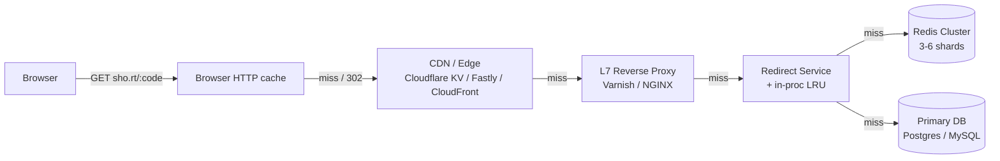

# URL Shortener Deep Dive — Cache Strategy

**Date:** 2026-04-27 | **Updated:** 2026-04-27
**Tags:** `system-design` `case-study` `url-shortener` `deep-dive` `caching`
**Parent:** [`../design-url-shortener.md`](../design-url-shortener.md)

## Table of Contents

- [Summary](#summary)
- [Overview — Why a Shortener Lives or Dies on Its Cache](#overview--why-a-shortener-lives-or-dies-on-its-cache)
- [Multi-Tier Architecture](#multi-tier-architecture)
  - [Browser Cache and 301 vs 302](#browser-cache-and-301-vs-302)
  - [CDN / Edge Cache](#cdn--edge-cache)
  - [L7 Reverse-Proxy Cache (Varnish, NGINX)](#l7-reverse-proxy-cache-varnish-nginx)
  - [In-Process LRU at the Redirect Service](#in-process-lru-at-the-redirect-service)
  - [Distributed Redis Cluster](#distributed-redis-cluster)
  - [Cascade Hit-Rate Math](#cascade-hit-rate-math)
- [Cache Patterns — Aside vs Read-Through vs Write-Through](#cache-patterns--aside-vs-read-through-vs-write-through)
- [Hot-Key Handling](#hot-key-handling)
- [Thundering Herd / Cache Stampede](#thundering-herd--cache-stampede)
- [Negative Caching](#negative-caching)
- [Invalidation — TTL Is Not Safety](#invalidation--ttl-is-not-safety)
- [TTL Strategy](#ttl-strategy)
- [Sizing and Eviction](#sizing-and-eviction)
- [Edge-Native Pattern — Workers + KV / Durable Objects](#edge-native-pattern--workers--kv--durable-objects)
- [Observability for Cache](#observability-for-cache)
- [Anti-Patterns](#anti-patterns)
- [Related](#related)
- [References](#references)

## Summary

The parent case study at [`../design-url-shortener.md`](../design-url-shortener.md) treats caching as a one-paragraph deep dive. That paragraph hides ninety percent of the work. A shortener at 4 K sustained / 40 K peak redirects per second is a **read-amplified, Pareto-skewed, latency-fanatic** workload — exactly the shape where caching either saves you or quietly destroys you. This doc unpacks the cache stack into its real five-layer cascade (browser, CDN, reverse proxy, in-process, Redis), shows the hit-rate math that justifies each layer, and walks through the operational hazards you only see at scale: hot-key shard saturation, TTL-expiry stampedes, dual-write inconsistency, 404 amplification. Pair with [`../../../building-blocks/caching-layers.md`](../../../building-blocks/caching-layers.md) for the general theory; this doc is the shortener-specific application.

The single most important point: **the redirect path has no "miss" budget**. A miss must be cheap, bounded, and rare — under 50 ms p99 and well under 1% of requests at steady state.

## Overview — Why a Shortener Lives or Dies on Its Cache

Three properties conspire to make caching the dominant design concern:

1. **Read amplification.** 100:1 to 1000:1 reads per write. Every microsecond shaved from reads compounds across billions of requests.
2. **Pareto skew.** ~80% of clicks hit ~20% of URLs (often 95/5). A tiny working set captures most traffic.
3. **Latency intolerance.** A redirect is a blocking step in the user journey. SLOs: p99 < 50 ms at edge, < 150 ms at origin.

A naive single-Redis-in-front-of-Postgres design works at 100 RPS and dies at 10 K RPS the moment one celebrity tweets a short link. The five-layer cascade exists to absorb the Pareto head before it reaches Redis, the DB, or your origin region from a Sydney user.

Working numbers (from the parent's capacity estimation):

```text
Total URLs:                 1,000,000,000
Sustained redirects:        4,000 RPS
Peak redirects:             40,000 RPS  (10x viral burst)
Sustained writes:           40 RPS
Pareto hot set (top 5%):    50 M URLs × 500 B  ≈ 25 GB
Pareto hyper-hot (top 0.1%): 1 M URLs × 500 B  ≈ 500 MB
Average record size:        ~500 B (code + long_url + metadata)
```

## Multi-Tier Architecture



Each arrow is a miss. Browser hit is free; CDN hit ~5–30 ms; Redis hit ~1 ms with one round trip; DB hit 5–20 ms burning IOPS you cannot easily scale.

### Browser Cache and 301 vs 302

The browser is a **free cache layer most shorteners actively choose not to use**.

```http
HTTP/1.1 301 Moved Permanently
Location: https://example.com/very/long/path
Cache-Control: public, max-age=31536000, immutable
```

versus

```http
HTTP/1.1 302 Found
Location: https://example.com/very/long/path
Cache-Control: private, max-age=0, no-store
```

The trade-off:

| Aspect | 301 + long max-age | 302 + no-store |
|---|---|---|
| Repeat-visit latency | ~0 ms (browser cache) | Full RTT to edge |
| Click analytics | Lost after first visit forever | Every click counted |
| Disable / edit propagation | Bound by browser cache TTL — can be **years** | Immediate next hit |
| Origin / edge load | Minimal | Full traffic |

Bit.ly historically defaulted to 301; modern consensus is **302**: CDN absorbs the load anyway, analytics value beats browser-hit latency savings, and disable/takedown for phishing must work in seconds, not years. Compromise: **301 with a short `max-age`** (5–60 minutes) for stable links. See [`../design-url-shortener.md#redirect-http-code--301-vs-302`](../design-url-shortener.md#redirect-http-code--301-vs-302).

### CDN / Edge Cache

The CDN is the **highest-leverage layer in the stack**. A redirect response is ~200 bytes. Caching at the edge gives Sydney users sub-30 ms redirects without touching US-east, absorbs volumetric attacks before they hit your infrastructure, and spreads a viral link across hundreds of PoPs instead of one Redis shard.

Three deployment patterns:

1. **Conventional CDN in front of origin** (CloudFront, Cloudflare proxy, Fastly):

   ```text
   Cache-Control: public, max-age=300, s-maxage=3600, stale-while-revalidate=60
   ```

   `s-maxage=3600` lets the CDN keep the response an hour while browsers re-validate every 5 min. `stale-while-revalidate` is a free stampede shield. Combine with **origin shielding** so a viral link costs origin one request, not hundreds.

2. **Edge KV store** (Cloudflare KV, Fastly KV, Deno KV) — the redirect never reaches origin for hot codes. See [Edge-Native Pattern](#edge-native-pattern--workers--kv--durable-objects).

3. **Surrogate-key purge** — cache with key `link-abc123`; on disable, purge by tag across every PoP in one API call. Without this, takedown waits for TTL.

Cache-key gotcha: **strip query strings** or hit ratio collapses. `sho.rt/abc123?utm_source=twitter` and `sho.rt/abc123?utm_source=email` are the same redirect; configure the CDN to ignore tracking params.

### L7 Reverse-Proxy Cache (Varnish, NGINX)

A reverse-proxy cache lives **inside your perimeter, in front of the redirect service**. Most useful when self-hosting (no commercial CDN), needing VCL-level control, or running multi-region origins with a regional tier between CDN and app.

NGINX `proxy_cache` tuned for a redirect service:

```nginx
proxy_cache_path /var/cache/nginx/redirects
    levels=1:2
    keys_zone=redirects:512m
    max_size=10g
    inactive=24h
    use_temp_path=off;

# Coalesce concurrent misses for the same key into one upstream request.
# This is the "single-flight" defense at the proxy layer.
proxy_cache_lock on;
proxy_cache_lock_timeout 5s;
proxy_cache_lock_age      5s;

# Serve stale on origin error or while updating — free SWR.
proxy_cache_use_stale error timeout updating http_500 http_502 http_503;
proxy_cache_background_update on;

server {
    listen 443 ssl http2;
    server_name sho.rt;

    location ~ ^/([A-Za-z0-9_-]{4,30})$ {
        proxy_cache redirects;
        proxy_cache_key "$host$uri";          # ignore query strings
        proxy_cache_valid 302 1h;
        proxy_cache_valid 404 60s;            # negative cache
        proxy_cache_revalidate on;

        add_header X-Cache-Status $upstream_cache_status;

        proxy_pass http://redirect_upstream;
    }
}
```

`proxy_cache_lock on` is the key directive: when 1,000 requests arrive for a cold key, NGINX sends one upstream and queues the rest. Without it, every TTL boundary is a stampede. Varnish equivalent uses VCL; sustains 100K+ RPS/node on commodity hardware. See the [Varnish Users Guide](https://varnish-cache.org/docs/trunk/users-guide/index.html).

### In-Process LRU at the Redirect Service

Each redirect service instance keeps a small in-process LRU (10K–100K entries, ~50 MB). Hit latency is sub-microsecond with no network. Hot keys hit here first; Redis sees only the long tail. Survives brief Redis outages. W-TinyLFU ([Caffeine](https://github.com/ben-manes/caffeine/wiki/Efficiency)) beats vanilla LRU by 5–25% on Pareto workloads.

Go example with `hashicorp/golang-lru` and `singleflight`:

```go
import (
    lru "github.com/hashicorp/golang-lru/v2/expirable"
    "golang.org/x/sync/singleflight"
)

type Redirector struct {
    inproc *lru.LRU[string, string] // 50K entries, 5-min TTL (< Redis TTL)
    redis  RedisClient
    db     DB
    sf     singleflight.Group
}

func (r *Redirector) Lookup(ctx context.Context, code string) (string, error) {
    if v, ok := r.inproc.Get(code); ok {
        return v, nil
    }
    // singleflight: collapse concurrent misses for same code into one DB hit
    v, err, _ := r.sf.Do(code, func() (any, error) {
        if v, err := r.redis.Get(ctx, code); err == nil && v != "" {
            r.inproc.Add(code, v)
            return v, nil
        }
        v, err := r.db.LookupCode(ctx, code)
        if err != nil {
            return "", err
        }
        _ = r.redis.SetEX(ctx, code, v, jitterTTL(24*time.Hour))
        r.inproc.Add(code, v)
        return v, nil
    })
    if err != nil {
        return "", err
    }
    return v.(string), nil
}
```

Key constraint: in-proc TTL must be **shorter** than Redis TTL and far shorter than your acceptable disable-propagation window. A 5-min in-proc TTL means a disabled link self-heals fleet-wide in 5 min even without explicit invalidation. For faster, use pub/sub (see [Invalidation](#invalidation--ttl-is-not-safety)).

### Distributed Redis Cluster

Configuration that matters:

```text
maxmemory 28gb                           # leave headroom on a 32GB instance
maxmemory-policy allkeys-lru             # all keys eligible for eviction
maxmemory-samples 10                     # tighter approximation, slight CPU cost
hash-max-listpack-entries 512
client-output-buffer-limit replica 256mb 64mb 60
```

- **`allkeys-lru`** (not `volatile-lru`) — every key has a TTL but LRU should apply globally.
- **`maxmemory-samples 10`** — closer-to-optimal LRU approximation; default 5 is fine, bump to 10 if hit-ratio regresses under pressure.
- **Cluster mode** with 3–6 shards distributes load and enables failover. Hash-slot sharding by `code` spreads the keyspace; only hot keys remain a problem (next section).

Why not Memcached: Redis gives `INCR`, pub/sub, Lua, and atomic ops for free — useful for rate limits, hot-key invalidation, and counters. See [Redis eviction docs](https://redis.io/docs/latest/develop/reference/eviction/).

### Cascade Hit-Rate Math

Why the cascade works. Assume a Pareto-distributed workload where 80% of clicks hit 20% of URLs, and 95% hit 5%. Working numbers:

```text
Total redirects/sec (peak):   40,000
Top 0.1% URLs:                ~1M codes, ~50% of clicks  → 20,000 RPS
Top 5% URLs:                  ~50M codes, ~95% of clicks → 38,000 RPS
Long tail:                    ~950M codes, 5% of clicks  → 2,000 RPS
```

Hit rates per layer (typical, well-tuned shortener):

| Layer | Capacity | Hits captured | Pass-through |
|---|---|---|---|
| Browser (302, no-store) | per-user | ~0% (we chose 302) | 40,000 RPS |
| CDN edge (1h TTL) | top 100K codes per PoP | ~92% | 3,200 RPS |
| Reverse proxy (1h TTL) | top 1M codes | ~70% of pass-through | 960 RPS |
| In-proc LRU (50K, 5m) | hyper-hot per instance | ~80% of pass-through | 192 RPS |
| Redis (28 GB, 24h) | top ~50M codes | ~98% of pass-through | ~4 RPS to DB |
| DB (Postgres) | full 1B | 100% | — |

End-to-end: **40 K peak RPS reduces to ~4 RPS on the DB**. Drop any layer and the next is multiplied accordingly — without the CDN, Redis sees 40 K RPS and a single hot key on one shard is unsurvivable. The math is approximate; what matters is the order-of-magnitude reduction per layer.

## Cache Patterns — Aside vs Read-Through vs Write-Through

For the general taxonomy see [`../../../scalability/read-write-splitting-and-cache-strategies.md`](../../../scalability/read-write-splitting-and-cache-strategies.md). For a shortener specifically:

| Pattern | Read | Write | Verdict for shortener |
|---|---|---|---|
| **Cache-aside (lazy)** | App: cache → miss → DB → populate | App: DB → invalidate cache | **WIN for redirect path.** Simple, cache failure is non-fatal, populates organically. |
| **Read-through** | App → cache; cache loads on miss | App writes DB directly | Couples app to cache library; gains marginal at this complexity. Skip. |
| **Write-through** | Read-through | Write goes to cache + DB synchronously | **Pays off for write path** — `POST /shorten` populates cache atomically, first-redirect is a hit. |
| **Write-back (write-behind)** | Read-through | Write to cache, async to DB | **Never.** A shortener cannot lose a mapping; durability is NF4. |
| **Refresh-ahead** | Read-through with proactive refresh | — | Useful for *known* hot keys; see [Hot-Key Handling](#hot-key-handling). |

**Why cache-aside wins the redirect path:** the redirect service stays trivial; a Redis outage degrades to "every redirect hits DB" — slow but correct (read-through libraries usually throw on cache failure, which apps handle worse than a miss); populate-on-miss matches the workload — codes are created once and read forever.

```python
# Cache-aside redirect path
def redirect(code: str) -> Optional[str]:
    cached = redis.get(f"url:{code}")
    if cached == NEGATIVE_SENTINEL:
        return None  # known 404
    if cached:
        return cached
    long_url = db.lookup(code)
    if long_url is None:
        # Negative cache the 404 to protect DB from enumeration
        redis.setex(f"url:{code}", 60, NEGATIVE_SENTINEL)
        return None
    # Jittered TTL to avoid synchronized expiry
    redis.setex(f"url:{code}", jittered_ttl(24 * 3600), long_url)
    return long_url
```

**Write-through on the write path** is a free win: the user who just created a link is very likely to test it within seconds. One extra Redis `SET` per write costs nothing at 40 RPS:

```python
def shorten(long_url: str, alias: Optional[str]) -> str:
    code = alias or generate_code()
    db.insert(code, long_url)
    redis.setex(f"url:{code}", jittered_ttl(24 * 3600), long_url)
    return code
```

Do not extend write-through to the CDN — purge/preload APIs add coordination and failure modes not worth the cost.

## Hot-Key Handling

A **hot key** is one cache entry whose access rate exceeds what a single shard / instance / PoP sustains. One celebrity tweet of `sho.rt/launch` drives 10K+ RPS to one Redis shard while the other 5 do nothing — load asymmetry, latency spikes, eventual cluster degradation.

Detection: `redis-cli --hotkeys` (sampling), per-key counters, or a count-min sketch sampling top-N at the redirect service.

Layered mitigations (use multiple):

### 1. CDN absorbs the head

First and best defense. A 1-hour edge TTL on top-N codes means Redis never sees the storm. With origin shielding, the request reaches the shield (one PoP) which collapses concurrent misses. Cache-key normalization is critical.

### 2. In-process LRU per instance

100 redirect instances each caching `code:launch` fan the request across 100 nodes before ever reaching Redis.

### 3. Client-side hot-key replication in Redis

When a key is identified as hot, replicate it under N suffixed keys and route requests round-robin:

```python
HOT_KEYS: Set[str] = set()  # populated by hot-key detector
HOT_REPLICAS = 8

def get_url(code: str) -> Optional[str]:
    if code in HOT_KEYS:
        # Spread reads across 8 replicated keys, each on a different shard
        replica = random.randint(0, HOT_REPLICAS - 1)
        key = f"url:{code}:{replica}"
    else:
        key = f"url:{code}"
    return redis.get(key)

def promote_hot_key(code: str, long_url: str, ttl: int) -> None:
    """Called when detector flags a code as hot."""
    pipe = redis.pipeline()
    for i in range(HOT_REPLICAS):
        pipe.setex(f"url:{code}:{i}", ttl, long_url)
    pipe.execute()
    HOT_KEYS.add(code)
```

Redis Cluster hash-slots by key string, so `url:code:0` and `url:code:1` land on different shards. Trade-off: invalidation is 8 DELs over a pipeline — still under 1 ms.

### 4. Pin the head

For top 1000 codes by 7-day click count, use a much longer TTL or none at all and rely on explicit invalidation. Cost: ~500 KB. Benefit: no expiry storm on viral links.

## Thundering Herd / Cache Stampede

A **stampede** is when a popular key expires and 1,000 concurrent requests miss simultaneously, each calling the DB — a single-key 1,000x spike. Three combinable defenses:

### Single-flight per key

Coalesce concurrent misses for the same key into one upstream call. Go has it built-in:

```go
import "golang.org/x/sync/singleflight"

var sf singleflight.Group

func (r *Redirector) loadFromDB(ctx context.Context, code string) (string, error) {
    v, err, _ := sf.Do(code, func() (any, error) {
        return r.db.LookupCode(ctx, code)
    })
    if err != nil {
        return "", err
    }
    return v.(string), nil
}
```

In-process only — multiply by instance count for fleet-wide behavior. For cross-instance coalescing, use a Redis lock:

```python
def cross_instance_load(code: str) -> Optional[str]:
    lock_key = f"lock:url:{code}"
    token = uuid.uuid4().hex
    if redis.set(lock_key, token, nx=True, ex=5):
        try:
            value = db.lookup(code)
            redis.setex(f"url:{code}", jittered_ttl(86400), value or NEGATIVE)
            return value
        finally:
            # Lua release to avoid releasing a lock you no longer own
            redis.eval(RELEASE_SCRIPT, 1, lock_key, token)
    else:
        # Someone else is loading it — back off and retry the cache
        time.sleep(0.05)
        return redis.get(f"url:{code}")
```

### Probabilistic early refresh (XFetch)

Vattani et al.'s [VLDB 2015 paper](https://www.vldb.org/pvldb/vol8/p886-vattani.pdf) proves you can spread refreshes by computing a probability that rises as TTL approaches zero:

```text
refresh_now  iff  (now - delta * beta * ln(rand())) >= expiry
```

- `delta` = previous compute time (seconds)
- `beta` ≥ 0 = aggressiveness (typical 1.0; higher refreshes earlier)
- `rand()` uniform in `(0, 1]`; `ln(rand())` is negative, so the term is positive

As `now` approaches `expiry`, the inequality becomes likely.

```python
import math, random, time

def xfetch(key, cache_get, cache_set, compute, ttl=86400.0, beta=1.0):
    entry = cache_get(key)            # returns (value, delta, expiry) or None
    now = time.time()
    if entry is None or entry.expiry <= now \
       or now - entry.delta * beta * math.log(random.random()) >= entry.expiry:
        start = time.time()
        value = compute()
        cache_set(key, value, delta=time.time() - start, ttl=ttl)
        return value
    return entry.value
```

Storing `delta` alongside the value (Redis hash or JSON) is the only operational cost. Combine with single-flight for full coverage.

### Pre-warming

For known hot keys, refresh from a background job, not the request path. A cron re-fetching the top-N codes every 30 min keeps them hot at every layer. For anticipated viral links (campaign launch), pre-warm at create time.

## Negative Caching

A request for a non-existent code (typo, expired, attacker enumerating IDs) is a cache miss + DB miss — 5–20 ms wasted. A botnet enumerating `sho.rt/aaaa, aaab, ...` becomes a DB DoS. Fix: cache a sentinel with short TTL.

```python
NEGATIVE_SENTINEL = "__404__"

def redirect(code: str) -> Optional[str]:
    cached = redis.get(f"url:{code}")
    if cached == NEGATIVE_SENTINEL:
        return None  # known 404, no DB hit
    if cached:
        return cached
    value = db.lookup(code)
    if value is None:
        # SETEX = SET with EX (expiry seconds), atomic
        redis.setex(f"url:{code}", 120, NEGATIVE_SENTINEL)
        return None
    redis.setex(f"url:{code}", jittered_ttl(86400), value)
    return value
```

Reasonable range: **60–300 s**. Longer breaks the "I just created this and tested it earlier and now it doesn't work" UX (a 24 h negative TTL turns a pre-create 404 into a day-long ghost). Legitimate retrying clients deserve fast convergence. 60 s is already orders of magnitude of DB protection under enumeration. For longer TTLs, couple with explicit invalidation on create:

```python
def shorten(long_url: str, alias: Optional[str]) -> str:
    code = alias or generate_code()
    db.insert(code, long_url)
    # Critical: stomp any negative-cache entry from a prior 404
    redis.setex(f"url:{code}", jittered_ttl(86400), long_url)
    return code
```

`SETEX` overwrites — including a stale `__404__`. Never `SETNX` on create or the negative cache shadows the new entry until expiry. Layer rate limiting per IP/ASN at the CDN or RP for edge protection.

## Invalidation — TTL Is Not Safety

Four state transitions where TTL alone fails: (1) owner-disable, (2) abuse takedown, (3) destination edit, (4) expiry past. A stale cache means the link redirects *after* the system says no. "TTL will expire in 23 h" is a security failure for phishing. Use **active invalidation**, not passive TTL.

### Write-through on update

The same write-through pattern from creation, applied to mutations:

```python
def disable_link(code: str) -> None:
    db.update(code, is_disabled=True)
    # Active invalidation across the cache stack
    redis.delete(f"url:{code}")
    # Also invalidate hot-key replicas if applicable
    if code in HOT_KEYS:
        keys = [f"url:{code}:{i}" for i in range(HOT_REPLICAS)]
        redis.delete(*keys)
        HOT_KEYS.discard(code)
    # Purge CDN by surrogate key (Cloudflare, Fastly, etc.)
    cdn_purge_tag(f"link-{code}")
    # Notify other instances to drop in-proc cache
    redis.publish("invalidations", code)
```

Order: DB first (authoritative); **delete** cache, don't update (deletion avoids racing two `SET`s); purge CDN by surrogate key; pub/sub for in-proc caches:

```python
def consume_invalidations():
    pubsub = redis.pubsub()
    pubsub.subscribe("invalidations")
    for msg in pubsub.listen():
        if msg["type"] == "message":
            inproc_cache.delete(msg["data"].decode())
```

### Cross-region invalidation

Pub/sub does not cross regions. Options: Redis Enterprise CRDT / AWS MemoryDB global tables; Kafka invalidation topic with per-region consumer; or Cloudflare Durable Objects as source of truth. Kafka is the most general:

```text
admin service → Kafka(invalidations) → [consumer per region]
                                          ├─ DEL Redis key
                                          ├─ pub/sub local in-proc
                                          └─ CDN purge surrogate key
```

Idempotent messages make replay-on-restart safe.

**TTL is the safety net** for invalidation bugs, not the primary mechanism. Defense-in-depth.

## TTL Strategy

Default: **24 h, jittered ±10%**. Long enough that re-fetches are rare; short enough that invalidation bugs self-heal in a day; aligns with "I made this yesterday and it still works."

```python
import random

def jittered_ttl(base_seconds: int, jitter_pct: float = 0.1) -> int:
    factor = 1 + random.uniform(-jitter_pct, jitter_pct)
    return int(base_seconds * factor)
```

Without jitter, 100K keys loaded at startup all expire in the same second 24 h later → synchronized stampede. ±10% jitter spreads expiry over ~4.8 h.

Sticky-hot promotion — high-access keys get longer TTLs:

```python
def maybe_promote(code: str, hits_per_minute: float) -> None:
    if hits_per_minute > 100:
        # Very hot — extend to 7 days, jittered
        long_url = redis.get(f"url:{code}")
        if long_url:
            redis.setex(f"url:{code}", jittered_ttl(7 * 86400), long_url)
```

Cold keys age out naturally; hot keys refresh to 7-day TTLs, reducing stampede odds. Apply long TTL to hot-key replicas too.

For pinned-forever keys (top 1000 by historical clicks), no TTL + explicit invalidation. Bound the pinned set or it grows unboundedly.

## Sizing and Eviction

Working set:

```text
Pareto hot (top 5%):    50M × 500 B ≈ 25 GB
Pareto hyper-hot (0.1%): 1M × 500 B ≈ 500 MB
```

With ~1.3x overhead (Redis key + TTL + hash table), plan **~32–35 GB** to hold the top 5%. Cluster shape: **3 shards × 16 GB primary + replica**, or **6 × 8 GB**. Six distributes hot-key risk across more boxes; three is cheaper.

Eviction policies:
- **`allkeys-lru`** (recommended) — every key eligible; correct because hot working set stays regardless of TTL state.
- **`volatile-lru`** — only TTL'd keys evicted. Use only with mixed cache+state Redis (better: separate instance).
- **`noeviction`** — rejects writes when full. Catastrophic for a cache.
- **`allkeys-lfu`** — better for stable Pareto skew. Switch from LRU if hit-ratio regresses sustainedly.

Redis samples N keys (`maxmemory-samples`, default 5), evicts worst by policy, until below `maxmemory`. p99 climbs slightly during eviction storms. If `evicted/s > set/s` you are undersized — grow memory or reduce TTL on cold keys. See [Redis eviction docs](https://redis.io/docs/latest/develop/reference/eviction/).

## Edge-Native Pattern — Workers + KV / Durable Objects

The modern pattern eliminates the origin region for the redirect path: redirect lives at the edge; DB is consulted only on miss; popular codes never touch origin.

### Cloudflare Workers + KV

[Cloudflare KV](https://developers.cloudflare.com/kv/) is globally-replicated KV with ~10 ms reads from any of ~300 PoPs. A Worker (V8 isolate) handles the redirect:

```javascript
// wrangler.toml binds KV namespace as `URLS`
export default {
  async fetch(request, env, ctx) {
    const url = new URL(request.url);
    const code = url.pathname.slice(1);

    if (!code || !/^[A-Za-z0-9_-]{4,30}$/.test(code)) {
      return new Response("Not found", { status: 404 });
    }

    // KV read — ~10 ms p50 globally
    let longUrl = await env.URLS.get(code, { cacheTtl: 60 });

    if (!longUrl) {
      // Miss path: hit origin DB via Worker → origin
      const resp = await fetch(`https://origin.sho.rt/lookup/${code}`);
      if (resp.status !== 200) {
        // Negative cache for 60s
        ctx.waitUntil(env.URLS.put(code, "__404__", { expirationTtl: 60 }));
        return new Response("Not found", { status: 404 });
      }
      longUrl = await resp.text();
      // Populate KV asynchronously — don't block the redirect
      ctx.waitUntil(env.URLS.put(code, longUrl, { expirationTtl: 86400 }));
    }

    if (longUrl === "__404__") {
      return new Response("Not found", { status: 404 });
    }

    // Fire-and-forget analytics
    ctx.waitUntil(
      fetch("https://analytics.sho.rt/click", {
        method: "POST",
        body: JSON.stringify({ code, ts: Date.now(), cf: request.cf }),
      })
    );

    return Response.redirect(longUrl, 302);
  },
};
```

Properties: hot codes never reach origin; `cacheTtl: 60` adds an in-Worker cache layer; `ctx.waitUntil` lets analytics fire after response (zero hot-path blocking); negative caching is built-in.

KV's eventual-consistency window is ~60 s globally. `put()` / `delete()` propagates to all PoPs in that window. For tighter takedown SLOs, use Durable Objects.

### Durable Objects for strong consistency

For state that must be globally consistent (per-link counters, atomic disable), Durable Objects pin one coordinator per object to one PoP; Workers route to it. Trade-off: latency for non-local users vs. strong consistency.

Canonical pattern: KV holds `code → long_url` (eventual, fast); a Durable Object holds `code → is_disabled` (strong, slower):

```javascript
const [longUrl, status] = await Promise.all([
  env.URLS.get(code),
  env.LINK_STATE.get(env.LINK_STATE.idFromName(code)).fetch("/status"),
]);
if (status === "disabled") return new Response("Gone", { status: 410 });
return Response.redirect(longUrl, 302);
```

Takedown becomes sub-second globally, at one extra fetch per redirect. Most shorteners accept the 60 s KV window; DOs are the answer when not. See [Cloudflare KV demos](https://developers.cloudflare.com/kv/demos/) and the [HackerNoon walkthrough](https://hackernoon.com/how-to-build-a-scalable-url-shortener-with-cloudflare-workers-and-kv-under-10-minutes).

## Observability for Cache

Per-layer minimum instrumentation:

| Metric | Layer | Why | Alert when |
|---|---|---|---|
| Hit ratio | CDN, RP, in-proc, Redis | The primary knob | Drops > 5% from baseline for 5 min |
| p99 lookup latency | Each layer | Hit and miss separately | Hit p99 > 2x baseline |
| Eviction rate | Redis, in-proc | Memory pressure indicator | `evicted/s > 0.1 * set/s` sustained |
| Memory utilization | Redis | Capacity headroom | > 85% of `maxmemory` |
| Negative-cache hit ratio | Redis | DoS / enumeration signal | > 5% of total reads |
| Single-flight contention | App | Stampede indicator | In-flight-per-key sustained > 1 |
| Per-shard QPS | Redis Cluster | Hot-key detection | Any one shard > 2x mean |
| Origin DB QPS via miss path | DB | Cache effectiveness | Trending up while user QPS flat |
| CDN cache key cardinality | CDN | Detect cache-key explosion | Rising fast |
| 4xx rate | Redirect svc | Negative-cache or abuse | Sudden spikes |

Ad-hoc Redis analysis:

```bash
redis-cli --hotkeys                                  # sampled hot-key detection
redis-cli --memkeys                                  # memory by key pattern
redis-cli INFO stats | grep -E 'evicted|expired'     # eviction stats
redis-cli INFO stats | grep -E 'keyspace_(hits|misses)'
```

Dashboards: per-layer hit ratio + p99 + throughput + error rate. One composite "redirect path health" showing end-to-end p99 by layer source tells you instantly which regressed. Single most important alarm: **DB QPS rising while user-facing redirect QPS is flat** — always a cache regression, usually urgent.

## Anti-Patterns

- **Caching writes write-back style.** "Let me cache the new shorten and async-write to DB later." A shortener cannot lose mappings (NF4: 11 nines durability). Use write-through, never write-back.
- **One layer doing it all.** Skipping the CDN because "Redis is fast enough" puts the full 40K RPS on Redis and one hot key kills you. Each layer does specific work; do not collapse them.
- **Caching long-URL responses with `Cache-Control: public, max-age=31536000` and 302.** Browsers ignore `max-age` on 302 unless explicitly told otherwise (and most ignore it anyway). Use 301 for browser caching; 302 for analytics-friendly behavior.
- **Negative TTL too long.** A 24-hour negative cache means a user creating a link that someone tested 5 minutes earlier sees "not found" for a day. Cap at 60–300 seconds and stomp on create.
- **Sequential `code` PK clustering writes.** Adjacent codes hash to the same shard if you shard naively. Shard by hash of code, not by code itself.
- **Trusting TTL for disable / takedown.** A phishing link "will expire from cache in 23 hours" is a security incident. Active invalidation across all layers is mandatory.
- **One Redis for cache, locks, rate limits, and queues.** When Redis dies, everything dies simultaneously. Separate by failure domain: cache Redis is non-critical (origin fallback works); rate-limit Redis is critical for abuse defense; queue Redis must not lose messages. Different SLOs, different clusters.
- **Forgetting CDN cache key normalization.** `?utm_source=` query strings explode your CDN cache key cardinality and tank your hit ratio. Strip them in CDN config.
- **Pinning all hot keys without a bound.** "Top 1000" must be a fixed-size set; otherwise the pinned set grows forever and Redis never evicts.
- **Caching `is_disabled` on the same key as `long_url`.** When a link is disabled, you must invalidate. If those are bundled, every read also reads the disable flag — fine. But many implementations cache only `long_url` and check `is_disabled` from DB on every redirect, defeating the cache. Cache the *redirect decision* (a tuple), not just the URL.

## Related

- Parent case study: [`../design-url-shortener.md`](../design-url-shortener.md)
- Caching layers theory: [`../../../building-blocks/caching-layers.md`](../../../building-blocks/caching-layers.md)
- Cache strategy patterns: [`../../../scalability/read-write-splitting-and-cache-strategies.md`](../../../scalability/read-write-splitting-and-cache-strategies.md)
- Sharding when DB outgrows one node: [`../../../scalability/sharding-strategies.md`](../../../scalability/sharding-strategies.md)
- Capacity-math methodology: [`../../../foundations/back-of-envelope-estimation.md`](../../../foundations/back-of-envelope-estimation.md)
- CDN and edge networking: [`../../../../networking/infrastructure/cdn-and-edge.md`](../../../../networking/infrastructure/cdn-and-edge.md)
- Reverse proxies and gateways: [`../../../../networking/infrastructure/reverse-proxies-and-gateways.md`](../../../../networking/infrastructure/reverse-proxies-and-gateways.md)
- Redis beyond caching: [`../../../../database/polyglot/redis-beyond-caching.md`](../../../../database/polyglot/redis-beyond-caching.md)

## References

- [Redis Documentation — Key eviction](https://redis.io/docs/latest/develop/reference/eviction/) — all eight eviction policies, approximate-LRU sampling, when to use `allkeys-lru` vs `allkeys-lfu` vs `volatile-*`.
- [Cloudflare Workers KV documentation](https://developers.cloudflare.com/kv/) — global KV semantics, eventual consistency window, `cacheTtl` parameter, integration with Workers via `ctx.waitUntil`.
- [Cloudflare KV Demos](https://developers.cloudflare.com/kv/demos/) — reference URL-shortener architectures and starter code at the edge.
- [Varnish Cache — Users Guide](https://varnish-cache.org/docs/trunk/users-guide/index.html) — VCL, surrogate keys, cache invalidation patterns, soft purge for stampede protection.
- [NGINX `ngx_http_proxy_module` documentation — `proxy_cache`](https://nginx.org/en/docs/http/ngx_http_proxy_module.html#proxy_cache) — `proxy_cache_lock`, `proxy_cache_use_stale`, `proxy_cache_background_update` directives for L7 caching.
- [Vattani, Chierichetti, Lowenstein — "Optimal Probabilistic Cache Stampede Prevention" (VLDB 2015)](https://www.vldb.org/pvldb/vol8/p886-vattani.pdf) — the XFetch algorithm derivation and proof.
- [RFC 5861 — HTTP `stale-while-revalidate` and `stale-if-error`](https://datatracker.ietf.org/doc/html/rfc5861) — the standard underlying SWR behavior in CDNs and browsers.
- [HackerNoon — Build a Scalable URL Shortener with Cloudflare Workers and KV](https://hackernoon.com/how-to-build-a-scalable-url-shortener-with-cloudflare-workers-and-kv-under-10-minutes) — concrete edge-native shortener walkthrough with KV as the redirect store.
- [Hello Interview — Design a URL Shortener Like Bit.ly](https://www.hellointerview.com/learn/system-design/problem-breakdowns/bitly) — interview-grade walkthrough including caching, sharding, and ID generation.
