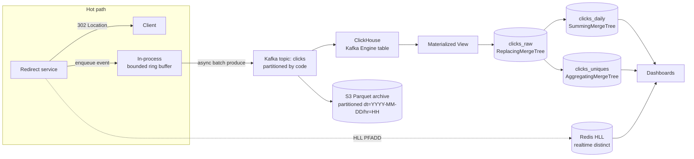

# URL Shortener Deep Dive — Click Analytics Pipeline

**Date:** 2026-04-27 | **Updated:** 2026-04-27
**Tags:** `system-design` `case-study` `url-shortener` `deep-dive` `analytics` `kafka` `clickhouse`

## Table of Contents

- [Summary](#summary)
- [Overview — Why a Pipeline at All](#overview--why-a-pipeline-at-all)
- [Event Schema and Identifiers](#event-schema-and-identifiers)
- [Producer Pattern at the Redirect Path](#producer-pattern-at-the-redirect-path)
- [Kafka Topic Design](#kafka-topic-design)
- [ClickHouse Ingestion](#clickhouse-ingestion)
- [Aggregations](#aggregations)
- [Approximate Counts](#approximate-counts)
- [Cold Archive](#cold-archive)
- [Real-Time vs Batch Dashboards](#real-time-vs-batch-dashboards)
- [Late-Arriving Events and Watermarks](#late-arriving-events-and-watermarks)
- [Bot and Crawler Filtering](#bot-and-crawler-filtering)
- [Cost Analysis](#cost-analysis)
- [Anti-Patterns](#anti-patterns)
- [Related](#related)
- [References](#references)

## Summary

The Click Analytics section in the parent URL-shortener case study is one diagram and four bullet points — enough to communicate the shape, not enough to actually build it. This companion expands that subsection into the full end-to-end pipeline: event schema, producer pattern on the redirect hot path, Kafka topic layout, ClickHouse ingestion via the Kafka Engine + Materialized View pattern, aggregation tables, approximate-count strategy with HyperLogLog, cold archive to S3 Parquet, dashboard latency budgets, late-event handling, bot filtering, and cost. The redirect path itself stays disciplined — fire-and-forget, bounded buffer, drop-on-overflow with a counter — and the rest of the pipeline absorbs the complexity. Every architectural choice is in service of one rule: **redirect availability must never depend on analytics availability**.

## Overview — Why a Pipeline at All

A URL shortener at scale produces a torrent of click events (each redirect = one event). At ~50k redirects/sec sustained that's ~4.3 billion events/day. You can't write those into the canonical `urls` table — the OLTP path would collapse. You need a separate, append-only, OLAP-shaped path.



Three properties this shape must guarantee:

1. **Decoupled availability.** Kafka or ClickHouse can be down for hours without dropping a redirect.
2. **Lossless replay.** S3 Parquet is the system of record for raw events. ClickHouse can be wiped and rebuilt from S3.
3. **Sub-second analytical query latency.** Dashboards over billion-row scans should respond in <500ms p95 for the common cases (per-link totals, per-day rollups, top-N).

The companion concept primer for the streaming/batch shape is [`../../../batch-and-stream/etl-elt-and-pipelines.md`](../../../batch-and-stream/etl-elt-and-pipelines.md). The brokers underneath are covered in [`../../../building-blocks/message-queues-and-brokers.md`](../../../building-blocks/message-queues-and-brokers.md). The HyperLogLog math is in [`../../../data-structures/hyperloglog.md`](../../../data-structures/hyperloglog.md).

## Event Schema and Identifiers

Decide what to capture before you decide where to store it. The schema is a contract — once it ships, every change has migration cost.

**Required fields:**

| Field | Type | Purpose |
|---|---|---|
| `event_id` | `UInt64` (Snowflake) | Globally unique event ID for end-to-end dedupe |
| `code` | `LowCardinality(String)` | The short code (~7 chars). Joins to `urls`. |
| `ts` | `DateTime64(3)` | Server-side timestamp (UTC, ms precision). Trust this, not client clocks. |
| `ip_truncated` | `IPv6` | IP with last octet (v4) or last 80 bits (v6) zeroed for GDPR |
| `country` | `FixedString(2)` | ISO-3166-1 alpha-2 from MaxMind GeoIP, computed at edge |
| `region` | `LowCardinality(String)` | Subdivision code (e.g., `US-CA`) |
| `ua_raw` | `String` | Raw User-Agent header (for forensics / re-classification) |
| `device_type` | `Enum8('desktop'=1,'mobile'=2,'tablet'=3,'bot'=4,'unknown'=0)` | Parsed at producer |
| `os_family` | `LowCardinality(String)` | iOS, Android, Windows, macOS, Linux |
| `browser_family` | `LowCardinality(String)` | Chrome, Safari, Firefox, … |
| `referrer_host` | `LowCardinality(String)` | Hostname only — full URL is PII |
| `session_id` | `UInt64` | Hash of (ip_truncated, ua, day) — coarse session identity |
| `is_bot` | `UInt8` | 0/1 — bot classification at ingest |
| `schema_version` | `UInt8` | Current schema version; allows online evolution |

### The Snowflake `event_id`

The `event_id` is the dedupe pivot for the whole pipeline — every component keys on it. Standard Snowflake layout:

```
| 1 bit sign | 41 bits ms timestamp | 10 bits machine id | 12 bits sequence |
```

~4096 unique IDs per machine per millisecond, monotonically sortable, no central coordinator. Use a custom epoch (e.g., 2026-01-01) to keep IDs smaller longer. UUIDv7 also works but doubles storage (16 vs 8 bytes) — at billions of rows per day, that's ~30 GB/day on event_id alone.

### GDPR-Safe IP Truncation

Never store the full client IP. Truncate at the edge: IPv4 zero the last octet (`203.0.113.42` → `203.0.113.0`); IPv6 zero the last 80 bits (keep /48 routing prefix). This narrows GDPR/CCPA exposure dramatically — the truncated IP identifies a network, not a person — while preserving geolocation utility. For stricter privacy, hash the truncated IP with a daily-rotating salt (`HMAC(daily_salt, ip_truncated)`): unique within a day for HLL, unlinkable across days.

### Schema Evolution: Avro vs Protobuf

Pick a binary, schema-registry-backed serializer. JSON-on-the-wire bloats Kafka by 3–5×, has no schema enforcement, and breaks silently on rename.

| Property | Avro | Protobuf |
|---|---|---|
| Schema in registry | Native (Confluent SR) | Native or via registry |
| Compat checks | Built-in subject modes | Field-number rules, manual |
| Tooling | Strong in JVM/Kafka world | Stronger in polyglot stacks |
| ClickHouse support | `Avro`, `AvroConfluent` | `Protobuf` |

**Recommendation:** Avro + Confluent Schema Registry for JVM-aligned stacks; Protobuf for polyglot or shared-with-gRPC scenarios. Compatibility mode should be `BACKWARD` minimum — adding optional fields is safe, renaming/removing requires a new topic or dual-write window.

## Producer Pattern at the Redirect Path

The redirect handler has one job: respond with a 302 in <10ms p99. Every microsecond it spends on analytics is stolen from that budget. The producer pattern must be **non-blocking, bounded, and observable**.

### Fire-and-Forget with Bounded Buffer

```
1. Build event (in-memory, ~1µs)
2. Try to enqueue into local ring buffer (lock-free, ~100ns)
3. If full → drop, increment `clicks_dropped_total` counter, return
4. Respond with 302
5. Background producer thread batches and sends to Kafka
```

The redirect path **never** awaits a Kafka ack. Awaiting kills p99: a single network blip on the broker side stalls every redirect on that machine until the librdkafka buffer flushes or the request times out. With ack-await, your redirect p99 is at the mercy of Kafka's worst-case latency.

### Java Producer Configuration

```java
Properties props = new Properties();
props.put(ProducerConfig.BOOTSTRAP_SERVERS_CONFIG, "b1:9092,b2:9092,b3:9092");
props.put(ProducerConfig.KEY_SERIALIZER_CLASS_CONFIG, LongSerializer.class.getName());
props.put(ProducerConfig.VALUE_SERIALIZER_CLASS_CONFIG, KafkaAvroSerializer.class.getName());

// Throughput-oriented batching; redirect path never awaits these
props.put(ProducerConfig.LINGER_MS_CONFIG, "20");
props.put(ProducerConfig.BATCH_SIZE_CONFIG, "65536");      // 64 KiB per partition
props.put(ProducerConfig.COMPRESSION_TYPE_CONFIG, "zstd");
props.put(ProducerConfig.BUFFER_MEMORY_CONFIG, "33554432"); // 32 MiB

// Drop on overflow rather than block the redirect path
props.put(ProducerConfig.MAX_BLOCK_MS_CONFIG, "0");
props.put(ProducerConfig.ACKS_CONFIG, "1");                 // leader-only — best-effort
props.put(ProducerConfig.ENABLE_IDEMPOTENCE_CONFIG, "false"); // dedupe is downstream

KafkaProducer<Long, ClickEvent> producer = new KafkaProducer<>(props);

// Redirect handler:
public void onRedirect(String code, HttpServletRequest req, HttpServletResponse resp) {
    resp.setStatus(302);
    resp.setHeader("Location", lookupLongUrl(code));
    ClickEvent ev = buildEvent(code, req);
    if (!ringBuffer.offer(ev)) droppedCounter.increment();
}

// Background drainer thread:
while (running) {
    ClickEvent ev = ringBuffer.poll(100, TimeUnit.MILLISECONDS);
    if (ev == null) continue;
    producer.send(new ProducerRecord<>("clicks", ev.eventId, ev), (md, ex) -> {
        if (ex != null) producerErrorCounter.increment();
    });
}
```

### Go Equivalent (franz-go)

```go
opts := []kgo.Opt{
    kgo.SeedBrokers("broker1:9092", "broker2:9092", "broker3:9092"),
    kgo.ProducerLinger(20 * time.Millisecond),
    kgo.ProducerBatchMaxBytes(65536),
    kgo.ProducerBatchCompression(kgo.ZstdCompression()),
    kgo.RequiredAcks(kgo.LeaderAck()),
    kgo.DisableIdempotentWrite(),
    kgo.MaxBufferedRecords(50_000), // back-pressure → drop, not block
}
client, _ := kgo.NewClient(opts...)

// Async produce — the callback fires off the hot path
client.Produce(ctx, rec, func(_ *kgo.Record, err error) {
    if err != nil { producerErrors.Inc() }
})
```

### The Drop-Counter Discipline

The drop counter (`clicks_dropped_total`) is a first-class SLO metric. Alert when it exceeds e.g. >0.1% of redirects in 5 minutes. A spike means the producer or Kafka path is unhealthy — pipeline-level incidents, not redirect-level. Analytics gets best-effort delivery; redirects get hard-real-time guarantees.

## Kafka Topic Design

The `clicks` topic carries every click event. Decisions to make: partitioning key, partition count, retention, compression, replication.

### Partitioning by `code`

Use `code` as the partition key (via Murmur2 / xxHash). Two reasons:

1. **Per-link ordering.** All events for a given short code land on the same partition, so they're consumed in order. This matters for any per-code stateful processing (sessionization, sliding-window unique counts, sequence-aware bot detection).
2. **Consumer parallelism scales by partitions.** ClickHouse Kafka Engine consumes from all partitions; downstream materialized views run independently per partition.

**Hot-key risk:** A viral link saturates one partition while others idle. Mitigations: sub-partition ultra-hot codes by `(code, hash(event_id) % N)` — losing strict order, gaining parallelism, applied only when rate exceeds threshold (track top-K via Count-Min Sketch); or simply raise the partition count (64–128 partitions at 50k events/sec is typical).

### Sizing

| Setting | Value | Rationale |
|---|---|---|
| Partitions | 64 | Up to 64 parallel ClickHouse consumers; headroom for 2× growth |
| Replication factor | 3 | Survives one broker loss; standard durability |
| `min.insync.replicas` | 2 | Policy floor (matters more under `acks=all`) |
| Retention | 7 days | Hot replay window without going to S3 |
| Compression | `zstd` | ~10% better than `gzip` at ~50% the CPU cost; standard since Kafka 2.1 |
| `unclean.leader.election.enable` | `false` | Never elect non-ISR leader (data loss) |

Snappy compresses worse than zstd but uses even less CPU — only pick it if producers are CPU-bound.

### ISR and acks Trade-off

For analytics events `acks=1` (leader-only) is the right balance because: (1) a parallel S3 archive provides durable backup; (2) end-to-end dedupe via `event_id` absorbs transient duplicates; (3) `acks=all` adds throughput cost in producer-side queueing. For payment/billing events you'd use `acks=all` + `min.insync.replicas=2` + `enable.idempotence=true` — but click analytics is best-effort, not financial.

## ClickHouse Ingestion

ClickHouse's Kafka Engine + Materialized View pattern is the canonical way to land Kafka topics into MergeTree tables. The Kafka Engine table is a queue, not storage — every `SELECT` from it consumes messages. The Materialized View runs `INSERT` to a real MergeTree table on every batch.

### Three-Table Pattern

```sql
-- 1) Queue table — backed by Kafka, no storage
CREATE TABLE clicks_queue
(
    event_id     UInt64,
    code         LowCardinality(String),
    ts           DateTime64(3, 'UTC'),
    ip_truncated IPv6,
    country      FixedString(2),
    region       LowCardinality(String),
    ua_raw       String,
    device_type  Enum8('unknown'=0,'desktop'=1,'mobile'=2,'tablet'=3,'bot'=4),
    os_family    LowCardinality(String),
    browser_family LowCardinality(String),
    referrer_host  LowCardinality(String),
    session_id   UInt64,
    is_bot       UInt8,
    schema_version UInt8
)
ENGINE = Kafka
SETTINGS
    kafka_broker_list      = 'broker1:9092,broker2:9092,broker3:9092',
    kafka_topic_list       = 'clicks',
    kafka_group_name       = 'clickhouse-clicks-ingest',
    kafka_format           = 'AvroConfluent',
    format_avro_schema_registry_url = 'http://schema-registry:8081',
    kafka_num_consumers    = 8,             -- one consumer per CH thread
    kafka_max_block_size   = 1048576,       -- 1M rows per ingest batch
    kafka_poll_max_batch_size = 65536,
    kafka_flush_interval_ms = 7500;         -- flush at least every 7.5s

-- 2) Storage table — where the data actually lives
CREATE TABLE clicks_raw
(
    event_id     UInt64,
    code         LowCardinality(String),
    ts           DateTime64(3, 'UTC'),
    dt           Date MATERIALIZED toDate(ts),
    hr           UInt8 MATERIALIZED toHour(ts),
    ip_truncated IPv6,
    country      FixedString(2),
    region       LowCardinality(String),
    ua_raw       String,
    device_type  Enum8('unknown'=0,'desktop'=1,'mobile'=2,'tablet'=3,'bot'=4),
    os_family    LowCardinality(String),
    browser_family LowCardinality(String),
    referrer_host  LowCardinality(String),
    session_id   UInt64,
    is_bot       UInt8,
    schema_version UInt8,
    ingest_ts    DateTime64(3, 'UTC') DEFAULT now64(3)
)
ENGINE = ReplacingMergeTree(ingest_ts)
PARTITION BY toYYYYMM(dt)
ORDER BY (code, dt, event_id)
TTL dt + INTERVAL 90 DAY DELETE
SETTINGS index_granularity = 8192;

-- 3) Materialized view — the pump from queue → storage
CREATE MATERIALIZED VIEW clicks_raw_mv TO clicks_raw AS
SELECT
    event_id, code, ts, ip_truncated, country, region, ua_raw,
    device_type, os_family, browser_family, referrer_host,
    session_id, is_bot, schema_version
FROM clicks_queue;
```

Three things to notice:

1. **`ReplacingMergeTree(ingest_ts)`** — duplicate `event_id`s (from replay/retry) are deduped at merge time, larger `ingest_ts` wins. The `ORDER BY (code, dt, event_id)` is the dedupe key. For deterministic queries use `... FROM clicks_raw FINAL` (slower) or `argMax(...)` aggregations.
2. **Partition by month, order by `(code, dt, event_id)`** — per-link queries skip 99% of granules thanks to the `code` prefix.
3. **`kafka_max_block_size = 1M` + `kafka_flush_interval_ms = 7500`** — batch knobs. Larger batches = fewer parts = less merge work; flush interval ensures liveness on slow streams.

### Tuning the Batch Settings

Default `kafka_max_block_size` (65k rows) creates too many small parts at 50k events/sec — too much merge pressure. Going to 1M rows yields batches every ~10–20s on a healthy stream; the `kafka_flush_interval_ms` ensures liveness on slow ones. Small batches lower latency-to-visibility but cost merge work; large batches reverse the trade. For minute-scale freshness, large batches win.

## Aggregations

The `clicks_raw` table is the source of truth, but you don't query it for dashboards. Dashboard queries hit pre-aggregated tables that are populated by additional Materialized Views.

### Daily Rollup (`SummingMergeTree`)

```sql
CREATE TABLE clicks_daily
(
    code         LowCardinality(String),
    dt           Date,
    country      FixedString(2),
    device_type  Enum8('unknown'=0,'desktop'=1,'mobile'=2,'tablet'=3,'bot'=4),
    is_bot       UInt8,
    clicks       UInt64,
    bytes_redirected UInt64
)
ENGINE = SummingMergeTree
PARTITION BY toYYYYMM(dt)
ORDER BY (code, dt, country, device_type, is_bot);

CREATE MATERIALIZED VIEW clicks_daily_mv TO clicks_daily AS
SELECT
    code,
    toDate(ts) AS dt,
    country,
    device_type,
    is_bot,
    count() AS clicks,
    sum(length(ua_raw)) AS bytes_redirected -- placeholder for per-event size
FROM clicks_raw
GROUP BY code, dt, country, device_type, is_bot;
```

`SummingMergeTree` with the same `ORDER BY` as the GROUP BY keys means rows with the same key get their numeric columns summed during merges. Reads still need a `GROUP BY` (parts haven't merged yet at query time) but they're scanning thousands of pre-aggregated rows instead of billions of raw events.

### Top-N via Projections

For "top 100 codes by clicks today" you want a different ordering. ClickHouse projections let you maintain an alternate sort order on the same table:

```sql
ALTER TABLE clicks_daily ADD PROJECTION top_codes_proj (
    SELECT
        dt,
        code,
        sum(clicks) AS daily_clicks
    GROUP BY dt, code
    ORDER BY dt, daily_clicks DESC
);

ALTER TABLE clicks_daily MATERIALIZE PROJECTION top_codes_proj;
```

Now `SELECT code, sum(clicks) FROM clicks_daily WHERE dt = today() GROUP BY code ORDER BY 2 DESC LIMIT 100` uses the projection automatically and reads ~100 rows instead of millions.

### Quantiles via `AggregatingMergeTree`

For latency or session-duration distributions:

```sql
CREATE TABLE clicks_uniques
(
    code  LowCardinality(String),
    dt    Date,
    uniq_visitors AggregateFunction(uniqHLL12, UInt64),
    uniq_visitors_combined AggregateFunction(uniqCombined, UInt64),
    p50_session_seconds AggregateFunction(quantileTDigest(0.5), Float64),
    p95_session_seconds AggregateFunction(quantileTDigest(0.95), Float64)
)
ENGINE = AggregatingMergeTree
PARTITION BY toYYYYMM(dt)
ORDER BY (code, dt);

CREATE MATERIALIZED VIEW clicks_uniques_mv TO clicks_uniques AS
SELECT
    code,
    toDate(ts) AS dt,
    uniqHLL12State(session_id) AS uniq_visitors,
    uniqCombinedState(session_id) AS uniq_visitors_combined,
    quantileTDigestState(0.5)(0.0) AS p50_session_seconds,  -- replace with real metric
    quantileTDigestState(0.95)(0.0) AS p95_session_seconds
FROM clicks_raw
WHERE is_bot = 0
GROUP BY code, dt;
```

Querying:

```sql
SELECT
    code,
    uniqHLL12Merge(uniq_visitors) AS unique_visitors,
    quantileTDigestMerge(0.95)(p95_session_seconds) AS p95
FROM clicks_uniques
WHERE dt BETWEEN today() - 7 AND today()
GROUP BY code
ORDER BY unique_visitors DESC
LIMIT 50;
```

`AggregateFunction(uniqHLL12, UInt64)` stores the HLL register state, not raw values. Merging across days is associative — `uniqHLL12Merge` combines registers from any number of partitions correctly.

## Approximate Counts

Exact distinct counts at this scale are rarely worth the cost. An exact `COUNT(DISTINCT session_id)` over a billion rows scans the whole column and builds a hash set in memory. Approximate sketches give you 1% relative error at a fraction of the resource cost — and 1% error doesn't change a single business decision.

### Two Tiers of Approximation

**Tier 1: Redis HLL.** Live "unique visitors today" widgets needing sub-second freshness. Updated fire-and-forget from the redirect path.

**Tier 2: ClickHouse `uniqHLL12` / `uniqCombined`.** Dashboards and historical queries. Built from the materialized stream, queryable across arbitrary time ranges.

### Redis HLL — `PFADD` / `PFCOUNT`

Each short code gets an HLL key per day:

```
hll:clicks:{code}:{yyyy-mm-dd}
```

The redirect path (or the producer's background thread) issues `PFADD` for each visitor identity (e.g., truncated IP + UA hash):

```lua
-- redis Lua script for atomic add + count + TTL extension
-- KEYS[1] = HLL key, ARGV[1] = visitor token, ARGV[2] = TTL seconds
local added = redis.call('PFADD', KEYS[1], ARGV[1])
redis.call('EXPIRE', KEYS[1], ARGV[2])
local count = redis.call('PFCOUNT', KEYS[1])
return {added, count}
```

```bash
EVAL "$LUA" 1 hll:clicks:abc1234:2026-04-27 "203.0.113.0|chrome-mac" 172800
```

Memory cost: each HLL key is ~12 KB (Redis uses HLL-12 by default, 2^14 registers × 6 bits ≈ 12.3 KB) and gives ~0.81% standard error. Per day per code = 12 KB. For 10M unique codes × 7 days hot = ~840 GB. That's too much for a single Redis instance — you only keep HLLs for the **top-K active codes**, identified via a Count-Min Sketch + Top-K structure ([`../../../data-structures/count-min-sketch-and-top-k.md`](../../../data-structures/count-min-sketch-and-top-k.md)). Long-tail codes don't get realtime distinct counts; their numbers come from the next-day SQL rollup.

### ClickHouse `uniqHLL12` vs `uniqCombined`

| Function | Memory | Accuracy | Notes |
|---|---|---|---|
| `uniq` | High (exact-ish via adaptive) | ~0.05% error | Adaptive — exact for small sets, approximate for large. Default. |
| `uniqHLL12` | Fixed ~10 KB/state | ~0.81% std error | Plain HyperLogLog with 2^12 = 4096 registers. Cheap. |
| `uniqCombined` | Variable | ~0.01–0.5% | Switches strategies (linear → small-set → HLL). Better accuracy than `uniqHLL12` at slightly higher memory. |
| `uniqExact` | Unbounded | 0% | Exact, but allocates a hash set proportional to cardinality. Avoid at scale. |

**Recommendation:** Use `uniqCombined` as the default — it's nearly always more accurate than `uniqHLL12` and the memory cost is small. Use `uniqHLL12` when you need predictable, fixed memory (e.g., persisted in `AggregatingMergeTree` columns where row size matters). Reserve `uniqExact` for compliance reports where the regulator literally requires exact counts.

### Error Bounds in Practice

For HLL-12 (m = 4096 registers): σ ≈ 1.04 / √m ≈ 1.62%. At 10M true uniques, that's ±160k — invisible on a "unique visitors yesterday" widget. For revenue-attribution where dollars per unique matter, exact counts (and entirely different infrastructure) are appropriate. The HLL math is in [`../../../data-structures/hyperloglog.md`](../../../data-structures/hyperloglog.md).

## Cold Archive

The S3 / GCS Parquet archive is the durable system of record for raw events. ClickHouse can be wiped, the schema can change incompatibly, the pipeline can be re-architected — and you can always replay from the archive.

### Layout

```
s3://clicks-archive/
  dt=2026-04-27/
    hr=00/
      part-000.zstd.parquet
      part-001.zstd.parquet
      ...
    hr=01/
      ...
    ...
  dt=2026-04-28/
    ...
```

Partitioning by `dt` and `hr` gives Hive-style partition pruning. Engines that support it (Athena, BigQuery external tables, DuckDB, ClickHouse `s3()` function) read only the partitions that match a `WHERE dt = '2026-04-27'` predicate.

### Writer

A separate Kafka consumer group (independent of ClickHouse's) batches messages and writes Parquet to S3. Flink, Kafka Connect S3 sink, or a custom Go service all work. Example with `parquet-go`:

```go
type ClickEventRow struct {
    EventID     int64  `parquet:"event_id,plain,zstd"`
    Code        string `parquet:"code,dict,zstd"`
    Ts          int64  `parquet:"ts,plain,zstd,timestamp(millisecond)"`
    IPTruncated string `parquet:"ip_truncated,plain,zstd"`
    Country     string `parquet:"country,dict,zstd"`
    DeviceType  int8   `parquet:"device_type,plain,zstd"`
    IsBot       bool   `parquet:"is_bot,plain"`
}

func writeBatch(events []ClickEventRow, dt string, hr int, partID int) error {
    var buf bytes.Buffer
    w := parquet.NewGenericWriter[ClickEventRow](&buf,
        parquet.Compression(&parquet.Zstd),
        parquet.PageBufferSize(1<<20),
    )
    if _, err := w.Write(events); err != nil { return err }
    if err := w.Close(); err != nil { return err }

    key := fmt.Sprintf("clicks-archive/dt=%s/hr=%02d/part-%03d.zstd.parquet", dt, hr, partID)
    _, err := s3client.PutObject(ctx, &s3.PutObjectInput{
        Bucket: aws.String("clicks-archive"),
        Key: aws.String(key),
        Body: bytes.NewReader(buf.Bytes()),
    })
    return err
}
```

Target file size: 64–256 MB compressed. Smaller wastes S3 LIST/GET overhead; larger blows up reader memory.

### Replay

Re-ingest a day into a clean ClickHouse:

```sql
INSERT INTO clicks_raw
SELECT event_id, code, ts, ip_truncated, country, region, ua_raw,
       device_type, os_family, browser_family, referrer_host,
       session_id, is_bot, schema_version
FROM s3('https://s3.amazonaws.com/clicks-archive/dt=2026-04-27/**/*.parquet', 'Parquet');
```

ClickHouse parallelizes the read across files. End-to-end dedupe via `event_id` makes re-running safe.

### Cost

S3 Standard at ~$0.023/GB/month. Parquet+zstd runs ~80 bytes/event (vs ~250 raw). At 4.3B events/day = ~344 GB/day. One year ≈ 125 TB ≈ $2900/month, declining as older tiers move to S3 IA / Glacier.

## Real-Time vs Batch Dashboards

Different consumers have different freshness needs. Don't unify them on the same backend.

| Tier | Freshness | Backend | Pattern |
|---|---|---|---|
| Real-time live counters | <1s | Redis HLL + counters | Push (websockets / SSE) |
| Operational dashboards | <30s | ClickHouse `clicks_raw` | Pull (polling, 5–10s) |
| Daily rollups / business KPIs | <1h | ClickHouse `clicks_daily` | Pull (60s) |
| Historical / cohort analysis | next-day | ClickHouse + S3 external | Pull (on-demand) |

### Push (WebSocket / SSE)

For live tickers — current click rate, top trending links — a single aggregator polls Redis and broadcasts to all connected clients via WebSockets/SSE. Don't have every dashboard tab independently poll Redis: at 10k concurrent sessions × 1 poll/sec that's 10k Redis ops/sec for one widget. Centralize aggregation, fan out broadcast.

### Pull (Polling)

For dashboards with arbitrary slicing (per-country, by referrer host) the dashboard issues ad-hoc ClickHouse queries.

**Latency budgets:**
- Per-link totals over date range: <200ms p95 (hits `clicks_daily` projection)
- Per-link uniques over date range: <500ms p95 (hits `clicks_uniques`)
- Top-100 over 24h: <300ms p95 (hits projection)
- Arbitrary group-by over 30 days: <2s p95 (hits `clicks_raw`, partition-pruned)
- 90+ days: degrades to S3 — accept multi-second latency

If a query blows the budget, the answer is almost always: a missing materialized view or projection.

### Refresh Rates

| Dashboard | Refresh |
|---|---|
| Real-time counter | 1s push |
| Active link panel | 5s pull |
| Top 100 | 30s pull |
| Daily summary | 5min pull |

Aggressive refresh costs query budget. 5s polling × 1000 dashboards = 200 QPS — ClickHouse handles it, but it's not free.

## Late-Arriving Events and Watermarks

Click events can arrive late: a redirect-service node was network-partitioned for 30 minutes and drained its local buffer when reconnected; an S3 replay re-injects events from a week ago; a Kafka consumer lag spike delays ingestion.

### Why It Matters

If you've already published "yesterday's total clicks" and a late event lands, the number changes. Whether that's acceptable depends on the consumer:

- Real-time dashboards: tolerate small revisions
- Daily revenue reports: must be stable once published (require a lock-down window)

### Handling

**1. Watermark-aware ingestion.** ClickHouse MVs fire on every batch — late events naturally update aggregations. The issue is consumers seeing the revision.

**2. Closing-the-day discipline.** For business-critical daily numbers, declare a cut-off (e.g., 2 hours after midnight UTC) and snapshot the rollup into an immutable table:

```sql
CREATE TABLE clicks_daily_final AS clicks_daily
ENGINE = MergeTree ORDER BY (dt, code);

-- runs once per day, 2 hours after midnight UTC
INSERT INTO clicks_daily_final
SELECT * FROM clicks_daily WHERE dt = yesterday();
```

After the snapshot, dashboards read `clicks_daily_final` for closed days and `clicks_daily` for the current day. Events past the cut-off go to a separate `late-arrivals` table for forensics.

**3. Dedup via `OPTIMIZE FINAL`.** `ReplacingMergeTree` deduplicates only during background merges. Force it (`OPTIMIZE TABLE clicks_raw PARTITION 202604 FINAL`) only before critical exports — it rewrites whole partitions.

**4. Deduplication windows.** End-to-end dedupe via `event_id` works as long as the dedup window covers the maximum possible lateness. The `ReplacingMergeTree` sort order handles this implicitly; for stronger guarantees run `ALTER TABLE ... DEDUPLICATE BY event_id` periodically.

## Bot and Crawler Filtering

A meaningful fraction (often 10–40%) of clicks come from bots: search engine crawlers, link previewers (Slack, Twitter, Facebook unfurling), security scanners, malicious actors enumerating short codes. You have to decide what to count.

### Classification Tiers

| Tier | Method | Cost | Recall |
|---|---|---|---|
| 1. UA regex | `Googlebot`, `bingbot`, `Slackbot-LinkExpanding` | ~µs | ~70% |
| 2. UA library | `ua-parser`, `crawler-user-agents` | ~10µs | ~90% |
| 3. Headless detection | JS challenge | redirect-blocking | ~95% (breaks use case) |
| 4. Behavioral | Rate per IP, sequence patterns | offline batch | ~98% |
| 5. Threat-intel feeds | Project Honey Pot, AbuseIPDB | external API | high precision |

For a redirect service, headless detection is off the table — you can't run a JS challenge before a 302. Use tiers 1, 2, 4.

### Two-Table Pattern

Don't filter in the producer — capture everything, filter at query time:

```sql
CREATE VIEW clicks_human AS SELECT * FROM clicks_raw WHERE is_bot = 0;
CREATE VIEW clicks_bots  AS SELECT * FROM clicks_raw WHERE is_bot = 1;
```

Reasons: (1) **forensics** — when a viral link looks suspicious, you need the bot rows to show "one bot hit 50k times in 3 minutes"; (2) **re-classification** — newly-identified crawler families should be applied retroactively; (3) **different consumers, different policies** — marketing wants humans, security wants bots. The `is_bot` flag is set at the producer (UA regex + library) and re-evaluated weekly by a batch job against `ua_raw`.

## Cost Analysis

Rough numbers for a mid-sized URL shortener at 50k events/sec (4.3B/day):

### Storage Volume

| Component | Bytes/event | Daily | Annual |
|---|---|---|---|
| Kafka (compressed) | ~120 | 515 GB | 188 TB |
| ClickHouse `clicks_raw` | ~80 | 344 GB | 125 TB |
| ClickHouse `clicks_daily` | aggregated | <1 GB | ~200 GB |
| S3 Parquet archive | ~80 | 344 GB | 125 TB |

ClickHouse compression typically lands 8–12× over raw via LowCardinality columns and column-store deltas. Trust observed ratios in your environment.

### Component Costs

- **Kafka** — 7 days × 515 GB/day × 3 replicas = 10.8 TB. Confluent Cloud ≈ $2500/month. AWS MSK on `m5.large` × 6 ≈ $1000/month all-in. Self-hosted on EC2 ≈ $1500/month plus operations.
- **ClickHouse** — Cloud at this scale: $5–10k/month for compute + 100 TB storage. Self-hosted (4 × `r5.4xlarge` + EBS): ~$3500/month plus operations.
- **S3 archive** — ~$2900/month most-recent year, declining via S3 IA ($0.0125/GB) and Glacier ($0.004/GB) tiers.
- **Redis HLL** — 100k top codes × 12 KB × 7 days = 8.4 GB. Fits `cache.r6g.large` ≈ $130/month.

### Total Order of Magnitude

For 50k events/sec sustained: $7k–$15k/month for the analytics pipeline (Kafka + ClickHouse + S3 + Redis + monitoring). The expensive parts are Kafka and ClickHouse compute. S3 cold archive is comparatively negligible — that's why it's the system of record.

## Anti-Patterns

- **Awaiting Kafka acks on the redirect path.** Couples redirect p99 to Kafka's worst-case latency. The whole point of fire-and-forget is to keep the hot path uncorrelated with downstream availability.
- **Writing per-event into ClickHouse.** ClickHouse is not designed for single-row inserts. Insert in batches of ≥100k rows or let the Kafka Engine + MV pump handle it.
- **Using `MergeTree` with no dedup mechanism.** Replays will duplicate. `ReplacingMergeTree` keyed on `event_id` (or `argMax` aggregations at query time) is the minimum.
- **Storing the full client IP.** GDPR exposure, useless once anonymized for analytics. Truncate at the edge.
- **Counting bots silently.** A 30%-bot link looks viral on the dashboard. Mark and segregate; never silently erase.
- **One Materialized View doing everything.** Each MV should have one purpose. Compose pre-aggregation pipelines as a chain of MVs (raw → 1-min rollup → 1-hour → 1-day) rather than a single multi-aggregate behemoth.
- **No cold archive.** ClickHouse alone is not durable enough to be the system of record for years of data. S3 Parquet replay capability is what makes the rest of the pipeline rebuildable.
- **Polling Redis from every dashboard tab.** Centralize the aggregator and broadcast.
- **Forcing `OPTIMIZE FINAL` on a hot path.** Rewrites whole partitions; murders ingestion throughput. Use it for forensics, not for online queries.
- **Mixing real-time and batch SLAs in one backend.** Redis live counters and ClickHouse rollups have different freshness contracts; fighting one engine to serve both ends in compromise.
- **No drop-counter alert.** Without `clicks_dropped_total` you can't tell whether the pipeline is healthy or the producer is silently shedding load.
- **Ad-hoc schema changes on Kafka.** Without a schema registry and compat checks, a producer adds a field and consumers crash deserialization the moment they see one. Always go through a registry.

## Related

- [URL Shortener Case Study (parent)](../design-url-shortener.md) — the broader system this pipeline sits inside; redirect path, code generation, caching, abuse mitigation
- [HyperLogLog](../../../data-structures/hyperloglog.md) — the underlying sketch behind Redis `PFADD`/`PFCOUNT` and ClickHouse `uniqHLL12`
- [Count-Min Sketch and Top-K](../../../data-structures/count-min-sketch-and-top-k.md) — choosing which codes deserve a Redis HLL key
- [ETL, ELT, and Data Pipelines](../../../batch-and-stream/etl-elt-and-pipelines.md) — the conceptual frame for ingest → transform → serve pipelines
- [Message Queues and Brokers](../../../building-blocks/message-queues-and-brokers.md) — Kafka, partitioning, retention, ISR, the broker landscape
- [Batch vs Stream Processing](../../../batch-and-stream/batch-vs-stream-processing.md) — where Kappa-style architectures fit
- [Stream Processing — Kafka Streams, Flink, Windowing](../../../communication/stream-processing.md) — when you need stateful per-link computation
- [OLTP vs OLAP and Lakehouses](../../../data-consistency/oltp-vs-olap-and-lakehouses.md) — why the analytics path is its own database

## References

- [ClickHouse — Kafka Table Engine](https://clickhouse.com/docs/en/engines/table-engines/integrations/kafka) — official reference for the Kafka Engine, batch settings, materialized-view ingestion pattern
- [ClickHouse — ReplacingMergeTree](https://clickhouse.com/docs/en/engines/table-engines/mergetree-family/replacingmergetree) — dedup semantics, version columns, `FINAL` query modifier
- [ClickHouse — AggregateFunction Combinators](https://clickhouse.com/docs/en/sql-reference/aggregate-functions/combinators) — `-State`, `-Merge`, `-MergeState` and the AggregatingMergeTree pattern
- [Apache Kafka Documentation](https://kafka.apache.org/documentation/) — broker, producer, consumer, replication, ISR, retention semantics
- [Confluent — Schema Registry and Avro Compatibility](https://docs.confluent.io/platform/current/schema-registry/avro.html) — subject compatibility modes, schema evolution rules
- [Redis — `PFADD` Command](https://redis.io/commands/pfadd/) and [`PFCOUNT`](https://redis.io/commands/pfcount/) — HyperLogLog primitives, error bound, memory characteristics
- [Flajolet, Fusy, Gandouet, Meunier (2007) — "HyperLogLog: the analysis of a near-optimal cardinality estimation algorithm"](https://algo.inria.fr/flajolet/Publications/FlFuGaMe07.pdf) — the original HLL paper
- [Apache Parquet Documentation](https://parquet.apache.org/docs/) — column-oriented file format, encoding, compression, predicate pushdown
- [AWS — Best Practices for Storing in S3 and Querying with Athena](https://docs.aws.amazon.com/athena/latest/ug/performance-tuning.html) — partitioning, file size, columnar format guidance
