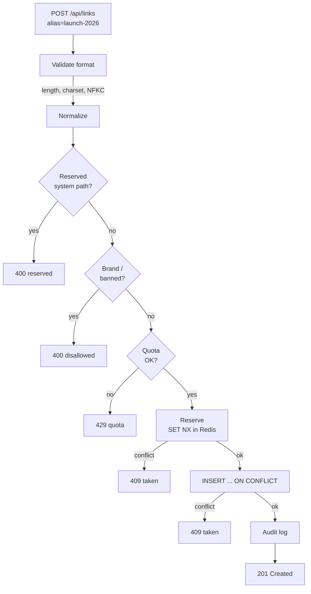

# URL Shortener Deep Dive — Custom Aliases

**Date:** 2026-04-27 | **Updated:** 2026-04-27
**Tags:** `system-design` `case-study` `url-shortener` `deep-dive` `identifiers` `abuse-prevention`

## Table of Contents

- [Summary](#summary)
- [Overview](#overview)
- [Namespace Design](#namespace-design)
- [Uniqueness Enforcement](#uniqueness-enforcement)
- [Banned Words & Brand Impersonation](#banned-words--brand-impersonation)
- [Reserved Paths](#reserved-paths)
- [Squatting & Quotas](#squatting--quotas)
- [Premium Aliases](#premium-aliases)
- [Migration & Handover](#migration--handover)
- [Discovery & Privacy](#discovery--privacy)
- [Internationalization](#internationalization)
- [Anti-Patterns](#anti-patterns)
- [Related](#related)
- [References](#references)

## Summary

Custom aliases (`/launch-2026`, `/yourbrand`) look like a small feature but are one of the highest-risk surfaces in a URL shortener. Aliases are **user-chosen public identifiers** living in a **shared global namespace** — every choice that an attacker can game (impersonate a brand, squat reserved paths, register thousands of high-value words, defeat uniqueness with a race) becomes a real abuse vector. This doc expands the parent case study's three-paragraph treatment into a deep one: how the namespace is partitioned from auto-generated codes, how uniqueness is enforced race-free across regions, how to detect homoglyph and Levenshtein-typo brand impersonation, how reserved paths are derived mechanically from the route table, how to bound squatting with quotas and reclamation, what premium and vanity-domain tiers look like, what handover and audit look like, why autocomplete is dangerous, and how Unicode (case-folding, NFKC, IDN, Punycode) breaks naive equality. The parent case study is at [`../design-url-shortener.md`](../design-url-shortener.md).

## Overview

The parent design treats custom aliases as a small extension of the redirect path:

> Custom aliases share the `urls.code` namespace with auto-generated codes. Two extra checks on the write path: uniqueness (PK constraint, surface as `409 Conflict`) and a banned-word list (slurs, brand impersonation, reserved system paths).

That is correct as a starting point and wrong as a stopping point. In practice, every word in that summary hides a load-bearing decision:

- _"Share the namespace"_ — or partition it? A naive shared namespace creates a write-time race between the auto-generator and a manual alias request.
- _"Uniqueness via PK"_ — fine on a single Postgres primary; insufficient under multi-region active-active or Redis-fronted reservation.
- _"Banned-word list"_ — a substring deny-list catches `google` but not `g00gle`, `g𝗈ogle`, or `g​oogle`.
- _"Reserved system paths"_ — `/api`, `/admin` is the obvious set; mechanically generating it from the live route table is the only way to keep it correct.

The risk model is also asymmetric. An auto-generated code collision is a one-in-a-trillion irritation; a custom-alias mistake is **a phishing campaign with your domain on it**. `bit.ly/login-paypal-secure` redirecting to a credential-harvesting page weaponizes the shortener's brand. Treat alias creation like a **lightweight registrar**: namespace policy, abuse handling, and a paid tier for valuable names.



## Namespace Design

The first decision is whether auto-generated codes and custom aliases live in the **same** namespace or separate ones. Both are defensible; the trade-offs differ.

### Option A — Shared namespace

Both auto codes and aliases live in a single `code` column on `urls`, with a single uniqueness constraint.

- **Pro:** one table, one redirect lookup path, one uniqueness check.
- **Con:** you must guarantee the auto-generator can never collide with a manually chosen alias. The standard trick is **disjoint character sets or lengths**: auto codes are exactly 7 characters from `[a-zA-Z0-9]` (no `-` or `_`), while aliases are 4–30 chars and must contain at least one character from `[-_]` _or_ be of a length the auto-generator does not produce. The two sub-spaces don't overlap by construction.

The parent doc picks this approach and is right to: it keeps the redirect lookup as a single PK probe, which is what dominates p99 latency.

### Option B — Separate namespaces

Two columns or two tables: `auto_code` and `alias`. The redirect path checks one, then the other.

- **Pro:** policies (rate limits, retention, pricing, reclamation) can differ cleanly. Aliases can have their own audit table without bloating the auto-code path.
- **Con:** an extra read on the redirect hot path (or a UNION view) — small but measurable.

If you ever expect to charge for aliases or apply different lifecycle rules (which you almost certainly will once the product is real), Option B is worth the extra column. Migrating from A to B later is straightforward.

### Reserved prefix conventions

Reserve a small set of **single-character prefixes** for system use. Two well-tested choices:

| Prefix | Purpose |
|--------|---------|
| `_` | Internal redirects (preview, OG-image embeds, `/_health`) — never user-claimable. |
| `~` | User-account vanity paths (`~alice`) reserved for a future profile feature. |

By forbidding leading `_` and `~` in user-supplied aliases, you preserve forward optionality without inventing escape hatches later. This is the same trick GitHub uses for `gist.github.com/<id>` vs. `github.com/<username>` and the same reason `_redirects` and `_headers` work in Netlify.

### Length and character constraints

Conservative defaults that survive contact with reality:

| Constraint | Value | Why |
|---|---|---|
| Min length | 4 | Below 4 the namespace is densely populated by auto-codes and short codes have outsized phishing value (`bit.ly/ok` would be a target). |
| Max length | 30 | Long enough for `quarterly-launch-q3-2026`, short enough to avoid pathological URLs and DB index bloat. |
| Allowed | `[a-zA-Z0-9-_]` | Avoids URL-encoding ambiguity, RTL marks, zero-width spaces, and case-fold surprises. |
| Disallowed start/end | `-`, `_` | Prevents `--`, leading-hyphen confusion with CLI flags, and visual ambiguity. |
| Reserved prefixes | `_`, `~` | System use; see above. |
| Case folding | Lowercase canonical form | `/Launch` and `/launch` resolve to the same record (see [Internationalization](#internationalization)). |

Encode this in a single regex used by both API validation and DB `CHECK`:

```sql
ALTER TABLE urls
  ADD CONSTRAINT alias_format_chk
  CHECK (
    alias IS NULL
    OR (
      length(alias) BETWEEN 4 AND 30
      AND alias ~ '^[a-z0-9][a-z0-9_-]{2,28}[a-z0-9]$'
      AND alias NOT LIKE '\_%' ESCAPE '\'
      AND alias NOT LIKE '~%'
    )
  );
```

## Uniqueness Enforcement

A unique constraint is necessary but not sufficient. The full picture has three layers, and skipping any one of them produces a known race.

### Layer 1 — Database unique constraint

Non-negotiable. The single source of truth.

```sql
CREATE TABLE urls (
  id          BIGSERIAL PRIMARY KEY,
  code        TEXT NOT NULL,        -- auto-generated 7-char code
  alias       TEXT,                 -- nullable user-chosen alias
  long_url    TEXT NOT NULL,
  owner_id    BIGINT NOT NULL,
  created_at  TIMESTAMPTZ NOT NULL DEFAULT now(),
  expires_at  TIMESTAMPTZ,
  state       TEXT NOT NULL DEFAULT 'active'
);

CREATE UNIQUE INDEX urls_code_uq  ON urls (code);
CREATE UNIQUE INDEX urls_alias_uq ON urls (lower(alias)) WHERE alias IS NOT NULL;
```

Note `lower(alias)` in the partial unique index — that enforces case-insensitive uniqueness without storing the lowercased version twice. The `WHERE alias IS NOT NULL` clause means rows without an alias don't compete for the index.

### Layer 2 — Race-free reservation pattern

The naive flow has a TOCTOU race:

```
1. SELECT 1 FROM urls WHERE alias = 'launch-2026'   -- not found
2. ...validate, etc...
3. INSERT INTO urls (alias, ...) VALUES ('launch-2026', ...)   -- might conflict now
```

Two requests can both observe "not found" at step 1 and both reach step 3. One wins; the other gets a constraint violation. The fix is to **collapse check-and-insert into a single atomic statement**:

```sql
INSERT INTO urls (code, alias, long_url, owner_id)
VALUES ($1, $2, $3, $4)
ON CONFLICT (lower(alias)) WHERE alias IS NOT NULL
DO NOTHING
RETURNING id, code, alias;
```

If the `RETURNING` clause returns zero rows, the alias was taken — surface as `409 Conflict`. No `SELECT` first. No race window.

For Postgres, an alternative is `INSERT ... ON CONFLICT ... DO UPDATE SET id = id RETURNING ...` to always return a row, then check whether the returned `owner_id` is yours. Either works.

### Layer 3 — Distributed locks for high-write multi-region

Single-primary Postgres is enough for most shorteners. But once you go **multi-region active-active** (e.g., a globally distributed shortener with regional writes that asynchronously replicate), the database's per-region uniqueness check sees stale state. Two regions can both accept the same alias before replication catches up.

The fix is a **fast pre-check** in a globally consistent store, _before_ the regional DB write. Redis with `SET key value NX EX ttl` is the canonical pattern; the reservation lives long enough for the DB write to land:

```python
# Pseudocode — Python with redis-py
def reserve_alias(alias: str, owner_id: int, ttl_s: int = 30) -> bool:
    key = f"alias-lock:{alias.lower()}"
    # SET NX returns True only if the key did not exist
    return redis.set(key, owner_id, nx=True, ex=ttl_s)

def create_alias(alias: str, owner_id: int, long_url: str) -> CreateResult:
    if not reserve_alias(alias, owner_id):
        raise AliasTaken(alias)
    try:
        return db.insert_alias(alias, owner_id, long_url)  # ON CONFLICT DO NOTHING
    except Exception:
        # Best-effort release — DB constraint is still authoritative
        redis.delete(f"alias-lock:{alias.lower()}")
        raise
```

The Redis reservation is **advisory**, not authoritative — the DB unique index remains the source of truth. Redis exists to **fail fast across regions**; the DB exists to **be correct**. This is the same shape as the Redlock discussion: don't trust a distributed lock for correctness on an already-correct store; use it for performance and early rejection.

### Why eventually-consistent uniqueness checks fail

You cannot get correct uniqueness from a system that gives you eventual consistency on reads. The classic anti-pattern:

```
Region A: SELECT → not found → INSERT → replicate to B (async, 200ms later)
Region B: SELECT → not found → INSERT → conflict on replication → manual resolution
```

Manual resolution at scale means human-judged ownership disputes (or worse, last-writer-wins silently overwriting). Either: (a) make alias writes go to a **single primary region** (cross-region latency penalty for that one operation, fine because alias creation is rare), or (b) use a **strongly consistent store** for the alias namespace (Spanner, CockroachDB, FoundationDB) even if the rest of the system is eventually consistent.

This is a place to be conservative. The redirect read path can be eventually consistent and 100ms stale; the **alias creation path must be strongly consistent**.

## Banned Words & Brand Impersonation

A custom alias is a tiny, weaponizable piece of brand. `short.ly/google-login` looks like Google to most humans. Defending the namespace requires three layers because attackers always escalate when one is blocked.

### Layer 1 — Curated deny-list

Start with a static list under version control:

```
# /config/alias-deny.txt — versioned, reviewed via PR
admin
administrator
api
help
support
login
signin
signup
register
oauth
billing
payment
checkout

# Brand impersonation
google
facebook
meta
apple
microsoft
amazon
paypal
stripe
github
linkedin

# Slurs, harassment terms — language by language
# (curated by trust-and-safety; not enumerated here)
```

The list is **substring-matched, case-insensitively, against the normalized alias**. `paypal-login`, `login-paypal`, `paypal2026` all reject. False positives (legitimate aliases that happen to contain a banned substring) are accepted as the cost of the policy — surface a clear error and offer human appeal.

### Layer 2 — Edit-distance (Levenshtein) for typo-squatting

Attackers register `g00gle`, `gooogle`, `payp4l`, `microsofy`. A substring match misses these. Compute Levenshtein distance against each banned brand; reject if distance ≤ 2 (tunable per brand — short brands need stricter thresholds).

```python
# Python — rapidfuzz is a fast C implementation of Levenshtein
from rapidfuzz.distance import Levenshtein

BANNED_BRANDS = {
    "google":    1,   # short → strict
    "paypal":    1,
    "apple":     1,
    "stripe":    2,
    "github":    2,
    "microsoft": 2,
}

def is_brand_impersonation(alias: str) -> tuple[bool, str | None]:
    """Returns (is_impersonation, matched_brand)."""
    a = alias.lower()
    for brand, threshold in BANNED_BRANDS.items():
        # check the alias itself and each hyphen/underscore-split token
        candidates = [a] + [t for t in a.replace("_", "-").split("-") if t]
        for c in candidates:
            if Levenshtein.distance(c, brand) <= threshold:
                return True, brand
    return False, None
```

Two practical refinements: **token-split before comparing** (`paypal-login` should split on `-` and check the `paypal` token, not the whole 12-char string against 6-char `paypal`), and **length-aware thresholds** (distance 2 against `apple` is too aggressive; use `min(2, ceil(len(brand)/3))` or per-brand overrides).

### Layer 3 — Homoglyph and Unicode confusable detection

The most insidious attack uses visually identical Unicode characters. `gооgle` (with Cyrillic `о` U+043E instead of Latin `o`) renders identically to `google` in most fonts. The canonical defense is the **Unicode Confusables data file** maintained by the Unicode Consortium ([unicode.org/Public/security/](https://www.unicode.org/Public/security/)).

The file maps each character to its "skeleton" — a canonical confusable representative. Two strings are visually confusable if they map to the same skeleton.

```python
# Python — using the `confusable_homoglyphs` library or unicodedata
import unicodedata
from confusable_homoglyphs import confusables

def normalize_alias(raw: str) -> str:
    """Apply NFKC, strip control/zero-width, lowercase."""
    s = unicodedata.normalize("NFKC", raw)
    # Strip zero-width and bidi formatting characters
    s = "".join(c for c in s if unicodedata.category(c) not in ("Cf", "Cc"))
    return s.lower()

def is_confusable_with_banned(alias: str, banned: list[str]) -> str | None:
    """Returns the banned brand it confuses with, or None."""
    norm = normalize_alias(alias)
    for brand in banned:
        # `is_confusable` returns truthy if `norm` looks like `brand`
        if confusables.is_confusable(norm, preferred_aliases=[brand]):
            return brand
    return None
```

Three Unicode pitfalls worth naming. **Zero-width characters** (`U+200B`, `U+200C`, `U+200D`, `U+FEFF`): `g​oogle` is 7 chars to a regex but reads as `google` to a human — strip all `Cf` (format) characters during normalization. **NFKC compatibility decomposition**: `ｇｏｏｇｌｅ` (full-width) decomposes to `google` under NFKC; always NFKC-normalize before any ASCII-targeted check. **Bidi override characters** (`U+202E`): they reverse rendering direction and were the basis of CVE-2021-42574 ("Trojan Source"); reject any alias containing bidi control codepoints outright. This is the IDN homograph attack family that motivated Punycode and browser IDN-display policies; the same logic applies to user-chosen aliases.

### Regex pitfalls

Avoid the temptation to do all of this in regex. ASCII-only character classes (`[a-zA-Z]`) silently allow homoglyphs in Unicode-aware engines unless you also enforce `^[\x00-\x7F]+$`. `re.IGNORECASE` does not handle Turkish dotless-i, Greek final sigma, or full-width ASCII. Lookarounds for "not preceded by alphanumeric" miss combining marks unless you use `\p{L}\p{M}*` (Unicode property escapes), which aren't in every engine. The right shape: regex for **format** (length, allowed character class), code for **semantics** (NFKC normalization, confusable matching, edit distance).

## Reserved Paths

The shortener owns `/admin`, `/api/...`, `/health`, `/.well-known/...`, `/robots.txt`, `/login`, and a long tail of one-offs. If a user can register `/admin` as an alias, the redirect handler will shadow the admin route — or worse, the framework will route the request based on first-match and you'll have an exploitable mismatch between which handler runs and which permissions check guards it.

### Build the deny-list mechanically

Hand-maintained reserved-path lists rot. Every time someone adds `/billing/checkout` they forget to add `billing` and `checkout` to the alias deny-list.

The fix: **derive the reserved list from the live route table at deploy time**. Most frameworks expose this as introspection.

```python
# Example — Flask
def collect_reserved_prefixes(app) -> set[str]:
    reserved: set[str] = set()
    for rule in app.url_map.iter_rules():
        # rule.rule looks like '/api/v1/links/<id>' or '/.well-known/<path:p>'
        first_segment = rule.rule.lstrip("/").split("/")[0]
        # strip Werkzeug placeholders like '<id>' or '<path:p>'
        if first_segment and not first_segment.startswith("<"):
            reserved.add(first_segment.lower())
    return reserved

# At app startup
RESERVED_PATHS = collect_reserved_prefixes(app) | {
    # Static must-block additions that aren't routes
    "robots.txt", "favicon.ico", "sitemap.xml",
    "humans.txt", "security.txt",
    ".well-known", "well-known",
}

def is_reserved(alias: str) -> bool:
    return alias.lower() in RESERVED_PATHS
```

Equivalent shapes exist for Express (`app._router.stack`), Spring (`RequestMappingHandlerMapping.getHandlerMethods()`), Django (`urlpatterns` traversal), and Rails (`Rails.application.routes.routes`). Wire it into the build: a CI job that prints the derived list and fails the build if a developer adds a route whose first segment is shorter than the alias minimum.

The standard set worth pre-seeding (these are always wrong as user aliases):

| Path | Why |
|---|---|
| `/api`, `/api/*` | API surface; must not collide with redirects. |
| `/admin`, `/dashboard` | Operator UI. |
| `/health`, `/healthz`, `/ready`, `/metrics` | Probes; collision = silent monitoring failure. |
| `/.well-known/*` | RFC 8615; ACME challenges, OIDC discovery, security.txt. |
| `/robots.txt`, `/sitemap.xml`, `/favicon.ico` | Browser/crawler conventions. |
| `/login`, `/logout`, `/signup`, `/oauth`, `/auth` | Authentication surface — phishing magnet. |
| `/static/*`, `/assets/*`, `/_next/*` | Framework asset paths. |
| `/billing`, `/checkout`, `/account`, `/settings` | High-value UX paths. |

## Squatting & Quotas

Without limits, a single bad actor will register `/instagram`, `/tiktok`, `/onlyfans`, `/airdrop`, every Fortune-500 brand, and resell them. This is exactly what happened to early `bit.ly` custom-domain offerings and to every domain TLD launch ever.

### Per-account quota enforcement

Default policy:

| Account tier | Aliases included | Hard cap |
|---|---|---|
| Free | 5 | 10 |
| Paid (basic) | 100 | 500 |
| Paid (pro) | 1,000 | 10,000 |
| Enterprise | Negotiated | Negotiated |

Enforce the cap on the create path with a single counted query:

```sql
WITH current_count AS (
  SELECT count(*) AS n
  FROM urls
  WHERE owner_id = $1 AND alias IS NOT NULL AND state = 'active'
)
INSERT INTO urls (code, alias, long_url, owner_id)
SELECT $2, $3, $4, $1
FROM current_count
WHERE n < $5  -- the cap for this account's tier
RETURNING id;
```

Zero rows returned ⇒ over quota. Surface as `429 Too Many Aliases` with a clear upgrade path.

### Aging and inactivity reclamation

A registered alias that **never gets clicked** for N months is almost always a squat. Reclaim it:

```sql
-- Mark candidates daily
UPDATE urls
SET state = 'reclamation_pending', reclamation_warning_at = now()
WHERE alias IS NOT NULL
  AND state = 'active'
  AND created_at < now() - interval '180 days'
  AND total_clicks_30d = 0
  AND total_clicks_lifetime < 10;

-- Notify the owner; give 30 days
-- Then on a second daily pass:
UPDATE urls
SET state = 'reclaimed', alias = NULL
WHERE state = 'reclamation_pending'
  AND reclamation_warning_at < now() - interval '30 days';
```

Two policy choices that are easy to get wrong: don't auto-reclaim paid-tier aliases without warning (paid users tolerate friction; they don't tolerate silent loss), and always keep an audit trail of reclamation (a reclaimed alias has a previous owner who may complain; you need to show the policy was followed).

### Trademark complaint workflow

When someone registers `/nike` on your shortener, Nike's lawyers will eventually email you. Have a process before they do, modeled on UDRP (Uniform Domain-Name Dispute-Resolution Policy): an intake form (trademark holder submits registration number, jurisdiction, and evidence of bad-faith use); a 14-day notice to the alleged squatter to respond with a defense (legitimate use, fan site, fair use, descriptive); a decision by trust-and-safety with documented criteria (bad faith + no defense ⇒ alias revoked, optionally transferred); and an appeal path with a second reviewer, all recorded in the audit log. The point isn't to be a court — it's to have a **predictable, documented process** so operators aren't deciding case-by-case under pressure.

## Premium Aliases

Once aliases have intrinsic value, charge for the valuable ones. The structure that works:

| Tier | Examples | Pricing model |
|---|---|---|
| Standard | `team-q3-launch`, `hiring-2026` | Free or included in plan. |
| Short (4–5 chars) | `home`, `apply`, `news` | Per-alias annual fee. |
| Premium dictionary words | `love`, `cars`, `nyc` | Per-alias annual fee, higher tier. |
| Reserved gold | Single English words on a curated list | Auction or enterprise sales only. |

Three implementation notes. Premium tier is a column on the alias row, not a separate table — lifecycle (renewal, expiry, reclamation) stays unified. Lifecycle is annual; auto-renew is the default; failed renewals enter a 30-day grace period before reclamation (mirrors domain registrar conventions). **Vanity domains** (`yourbrand.co/launch`) are a separate feature: they require DNS verification (`TXT _shortener-verify=...`), a per-domain TLS cert (Let's Encrypt or BYOC), and a tenant boundary in the redirect path. The alias namespace becomes **per-domain**, not global, on vanity domains — which is by design (multi-tenant isolation; one tenant's `/launch` doesn't shadow another's).

```sql
CREATE TABLE alias_tiers (
  alias        TEXT PRIMARY KEY,
  tier         TEXT NOT NULL CHECK (tier IN ('standard', 'short', 'premium', 'gold')),
  annual_price_cents INT,
  expires_at   TIMESTAMPTZ,
  auto_renew   BOOLEAN NOT NULL DEFAULT true
);
```

### Enterprise allowlist

Enterprise tenants negotiate alias policies that bypass parts of the global deny-list. Example: an enterprise account `acme-corp` is allowed to register `/acme` (which is in the brand deny-list because Acme is a registered trademark — but Acme themselves are the customer). Implementation:

```sql
CREATE TABLE alias_allowlist (
  owner_id BIGINT NOT NULL,
  alias    TEXT NOT NULL,
  reason   TEXT NOT NULL,
  approved_by TEXT NOT NULL,
  approved_at TIMESTAMPTZ NOT NULL DEFAULT now(),
  PRIMARY KEY (owner_id, alias)
);
```

The validation pipeline checks `alias_allowlist` _before_ the brand deny-list; an explicit allowlist entry wins.

## Migration & Handover

Aliases change hands. An employee leaves; a workspace transfers; an enterprise buys a smaller competitor. Handle this as a first-class operation, not as ad-hoc DB updates.

### Transfer protocol

```sql
BEGIN;

-- 1. Verify current owner (optimistic concurrency)
SELECT owner_id FROM urls
WHERE alias = $1 AND state = 'active'
FOR UPDATE;

-- 2. Update ownership atomically
UPDATE urls
SET owner_id = $2,
    transferred_at = now(),
    transferred_from = owner_id
WHERE alias = $1 AND owner_id = $3 AND state = 'active';

-- 3. Audit
INSERT INTO alias_audit (alias, action, from_owner, to_owner, actor, reason)
VALUES ($1, 'transfer', $3, $2, $4, $5);

COMMIT;
```

Every transfer must be logged with **who** initiated it (user, admin, or system), **why** (transfer request, trademark claim, account deletion, reclamation), and **when**. The audit table is append-only and replicated to a separate read-only store for compliance review.

### "Did you mean…" UX when alias is taken

When alias creation returns 409, don't dead-end. Surface owner-anonymized status ("this alias is taken; registered 2 years ago"), generated variations (`launch-2026-v2`, `launch2026`, `our-launch-2026`) from a deterministic rewriter that respects format constraints, an optional watchlist (notify if reclaimed), and the trademark complaint form for legitimate claims. Never surface "this alias is owned by `alice@example.com`" — that leaks user emails to anyone who can guess an alias, a known information-disclosure pattern.

## Discovery & Privacy

The temptation is to add alias autocomplete: type `/lau` and see `launch-2026`, `laundry-day`. Don't do this for the public namespace.

### Why autocomplete is dangerous

Autocomplete on a public namespace lets anyone enumerate every registered alias — including private/internal links (`/board-meeting-2026-q3`). Even if the link itself is meant to be shared, the **existence** of the alias is information. Pattern leakage compounds the problem: a creator who uses `/contracts-acme-2026`, `/contracts-globex-2026`, `/contracts-initech-2026` accidentally publishes their entire customer list via autocomplete prefix `/contracts-`. And if autocomplete is indexable (e.g., a `GET /api/aliases?prefix=...` endpoint with no auth), search engines will eventually index the entire namespace.

### Where autocomplete is fine

Autocomplete is fine **within an authenticated workspace**, scoped to aliases owned by the requesting user/team — the user already knows their own aliases. It's also fine for **premium-alias availability checking**: the API can answer "is `/love` available?" (yes / no / premium-tier-required) without revealing who currently owns it. The pattern is: **availability checks are public; ownership and metadata are private**. The redirect itself reveals existence (any 200/301 confirms registration), but the metadata path shouldn't.

## Internationalization

The most contentious section, because the right answer depends on the product's audience.

### Unicode in aliases — yes, no, or restricted?

Three positions, in increasing order of difficulty:

1. **ASCII-only** (`[a-zA-Z0-9-_]`). The simplest correct policy. No homoglyph risk, no case-fold ambiguity, no NFKC bugs. Recommended unless you have a strong product reason otherwise.
2. **Unicode-allowed but normalized.** `/Café` and `/cafe` collapse to the same alias via NFKC + case-fold + diacritic stripping. Unicode is permitted but the canonical key is ASCII-folded. Hard to get right; consult [Unicode TR #36 / TR #39](https://www.unicode.org/reports/tr39/) before shipping.
3. **Unicode-allowed and distinct.** `/café` and `/cafe` are different aliases. This is the IDN approach, taken to its logical conclusion — and the security risk is highest. If you go here, you must implement the **IDNA 2008 + UTS #46** validation rules, the same ones browsers use for IDN domain handling.

Most shorteners pick (1). The few that pick (2) or (3) usually serve a single-language market where the local audience expects to see their script in URLs (Japanese, Arabic, Hindi shorteners).

### Punycode for IDN — for vanity domains, not aliases

Punycode (RFC 3492) is how Unicode domain labels are encoded in DNS. It's relevant for **vanity-domain support** (`yöurbrand.co/launch`), not for the alias path itself. The vanity-domain layer must:

- Normalize the host to its canonical Punycode form (`xn--yurbrand-3ya.co`) before lookup.
- Reject mixed-script domain labels per UTS #39 (e.g., a domain mixing Cyrillic and Latin in one label).
- Display the domain in its Unicode form to the user, but match against the Punycode form internally.

Browsers' IDN display policies (only show Unicode if the label is single-script and not on a confusables blacklist; otherwise show Punycode) are the model worth following. Mozilla and Chrome publish their policies; both are accessible references.

### Case-folding rules

Three layers, must all agree:

| Layer | Rule |
|---|---|
| API validation | Reject mixed-case input or canonicalize to lowercase before validation. |
| Database storage | Store the lowercased form, or use `lower(alias)` in the unique index. |
| Redirect lookup | Lowercase the incoming path component before lookup. |

Pick one canonical form (lowercase ASCII) and enforce it everywhere. Inconsistencies between API validation and redirect lookup are a class of bug that produces "I registered `/Launch` but `/launch` 404s" tickets.

For Unicode case folding (if you allow Unicode aliases), use **Unicode case fold** (`str.casefold()` in Python, `String.toLowerCase(Locale.ROOT)` in Java) — not locale-dependent lowercase, which produces wrong results for Turkish (`İ` → `i̇`, not `i`) and Greek (`Σ` → `σ` vs. `ς`).

### Is `/Café` the same as `/cafe`?

Decide once, document loudly, enforce in one place. The defensible answers:

- **No, they're different.** Strict equality after NFKC normalization. `/Café` (with `é` U+00E9) and `/cafe` are different aliases. Users get what they typed.
- **Yes, they're the same.** NFKC + case-fold + diacritic-strip canonicalization. `/Café`, `/cafe`, `/CAFÉ`, `/Cafe´` (with combining accent U+0301) all map to `/cafe`. Simpler for users, more work for the implementation.

The choice has a one-way door: changing the policy after launch means migrating existing aliases (potential conflicts!) and breaking inbound links. Pick on day one.

## Anti-Patterns

- **Treating alias creation as a free-form text input.** Validation must be a single typed pipeline (normalize → length → charset → reserved → banned → quota → reserve → insert), not a scatter of `if` checks across handlers.
- **Hand-maintaining the reserved-path list.** It will rot. Generate it from the route table at build time and fail the build on inconsistency.
- **Substring banned-word check only.** `g00gle` defeats it. Always combine substring + Levenshtein + confusables.
- **Trusting database uniqueness as the only check across regions.** In multi-region active-active, the constraint sees stale state. Add a globally consistent reservation step or restrict alias writes to a single primary region.
- **Storing aliases case-sensitive but matching case-insensitive (or vice versa).** Pick one canonical form and use it for storage, indexing, and lookup.
- **Public alias autocomplete.** Leaks the namespace. Restrict to authenticated, owner-scoped queries.
- **No reclamation policy.** Squatters accumulate forever. Even a generous 12-month inactivity window prevents the worst long-tail squatting.
- **Surfacing alias-owner identity on conflict.** "This is owned by alice@example.com" leaks emails. Surface only "taken" + suggestions.
- **Allowing aliases shorter than your auto-generator's minimum length.** Shadows future auto codes if you ever extend the alphabet.
- **Skipping NFKC normalization before deny-list checks.** `ｇｏｏｇｌｅ` (full-width) bypasses an ASCII deny-list unless you NFKC-normalize first.
- **Letting the redirect path bypass alias validation when reading.** If validation is only on write, a buggy migration or direct-DB insert can land an unsafe alias. Re-validate on read in non-production environments and treat any unsafe alias found in production as a Sev-2.
- **Ignoring bidi control characters.** `U+202E` in an alias is a Trojan Source attack vector. Reject outright.

## Related

- [URL Shortener case study (parent)](../design-url-shortener.md) — full system design; this doc expands the Custom Aliases subsection.
- [Authorization — RBAC, ABAC, ReBAC](../../../security/authorization.md) — alias ownership, transfer, and trademark workflows are authorization decisions; the audit-log discussion applies directly.
- [Defense in Depth and Threat Modeling](../../../security/defense-in-depth-and-threat-modeling.md) — the layered approach to alias validation (format → reserved → banned → quota → reserve → insert) is defense in depth applied to a single feature.
- [Designing an API Gateway](../../distributed-infra/design-api-gateway.md) — the gateway is where alias-rate-limiting and reserved-path enforcement intersect with platform-wide policy.

## References

- Unicode Consortium, ["Unicode Security Mechanisms"](https://www.unicode.org/Public/security/) — `confusables.txt`, `intentional.txt`, and the data files behind homoglyph detection.
- Unicode Consortium, ["UTS #39 — Unicode Security Mechanisms"](https://www.unicode.org/reports/tr39/) — confusable detection, mixed-script detection, and identifier security profiles.
- A. Costello, ["RFC 3492 — Punycode: A Bootstring encoding of Unicode for Internationalized Domain Names in Applications (IDNA)"](https://www.rfc-editor.org/rfc/rfc3492) — the encoding behind IDN; relevant to vanity-domain support.
- IETF, ["RFC 5891 — IDNA: Protocol"](https://www.rfc-editor.org/rfc/rfc5891) — IDNA 2008, the validation rules browsers and registrars use for international domain labels.
- IETF, ["RFC 8615 — Well-Known Uniform Resource Identifiers"](https://www.rfc-editor.org/rfc/rfc8615) — the `/.well-known/` registry; aliases must never collide with this prefix.
- OWASP, ["Unicode Encoding"](https://owasp.org/www-community/Unicode_Encoding) — community guidance on Unicode-related attacks (homoglyph, normalization, bidi).
- Boucher and Anderson, ["Trojan Source: Invisible Vulnerabilities"](https://trojansource.codes/) (CVE-2021-42574) — the bidi-control attack, why aliases must reject `U+202E` and friends.
- GitHub, ["Reserved usernames"](https://github.com/dead-claudia/github-limits) — a community-maintained inventory of GitHub's reserved username/path conventions; useful as a starting deny-list.
- ICANN, ["Uniform Domain-Name Dispute-Resolution Policy"](https://www.icann.org/resources/pages/help/dndr/udrp-en) — the model for trademark-complaint workflow on a public namespace.
