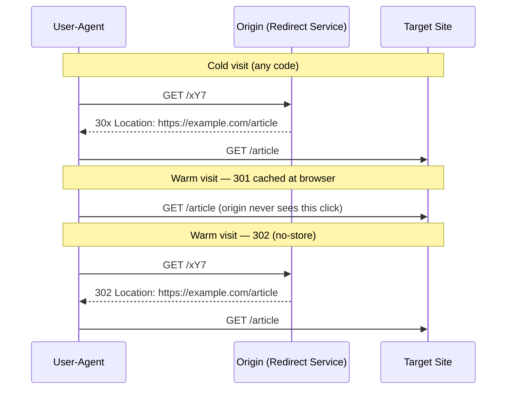

# URL Shortener Deep Dive — 301 vs 302 Redirects

**Date:** 2026-04-27 | **Updated:** 2026-04-27
**Tags:** `system-design` `case-study` `url-shortener` `deep-dive` `http` `redirects`

## Summary

The choice between `301`, `302`, `303`, `307`, and `308` is not a stylistic preference — it is an architectural decision about **caching**, **analytics fidelity**, **method preservation**, and **operational reversibility**. For a URL shortener, the most consequential property is browser caching: a `301 Moved Permanently` is heuristically cacheable indefinitely (RFC 9111), so once a browser sees one, you may **never see that visitor again** until the browser evicts the entry. That destroys click counts, breaks link rotation, and turns abuse takedowns into a 6-month customer-support tail.

`302 Found` is the safer default for shorteners with analytics or operational requirements; `307` and `308` exist for the rare API-style use case where method and body must be preserved across the redirect; `303 See Other` is the right answer for "POST then redirect to a result page." This document covers the catalog, the cacheability rules, browser and CDN behavior, the analytics and SEO trade-offs, and a recommendation matrix you can copy into a design doc.

This doc is the boundary doc for redirect semantics — the parent case study sets the context: [`../design-url-shortener.md`](../design-url-shortener.md) (Redirect HTTP Code section).

## Table of Contents

- [Summary](#summary)
- [Overview — Why the Code Choice Matters](#overview--why-the-code-choice-matters)
- [Status Code Catalog — 301, 302, 303, 307, 308](#status-code-catalog--301-302-303-307-308)
- [Cacheability per Code](#cacheability-per-code)
- [Browser Behavior Matrix](#browser-behavior-matrix)
- [CDN Behavior — Cloudflare, Fastly, CloudFront](#cdn-behavior--cloudflare-fastly-cloudfront)
- [Analytics Impact — Why 301 Destroys Click Counts](#analytics-impact--why-301-destroys-click-counts)
- [SEO Implications — Link Equity and Canonicalization](#seo-implications--link-equity-and-canonicalization)
- [Disabling and Rotating Links](#disabling-and-rotating-links)
- [Method Preservation — When 307/308 Are Required](#method-preservation--when-307308-are-required)
- [Migration Patterns — 301 → 410 Gone](#migration-patterns--301--410-gone)
- [Server Configuration Examples](#server-configuration-examples)
- [Client-Side Redirect Handling — fetch and XHR](#client-side-redirect-handling--fetch-and-xhr)
- [Recommendation Matrix by Use Case](#recommendation-matrix-by-use-case)
- [Edge Cases](#edge-cases)
- [Anti-Patterns](#anti-patterns)
- [Related](#related)
- [References](#references)

## Overview — Why the Code Choice Matters

A redirect is a deceptively simple HTTP response: a status line, a `Location:` header, an optional body. But each status code is a contract that touches three audiences at once: **the user-agent** (decides caching, method preservation, history), **intermediaries** (CDNs, proxies — decide whether to serve from cache), and **crawlers** (decide canonicalization and equity transfer).

For a URL shortener those audiences collide with two product requirements: **click analytics** (every redirect should produce one attributable event) and **operational control** (you must be able to disable, rotate, or retire a code). Both presume the redirect **flows through your servers on every visit**. A response cached at the browser or CDN bypasses your origin — no event, no enforcement, no analytics. The status code is the lever that controls whether that caching happens.



With `301`, the warm path may never reach your servers. With `302 + no-store`, every click traces through them.

## Status Code Catalog — 301, 302, 303, 307, 308

RFC 9110 (HTTP Semantics) defines five 3xx codes used for redirection in practice. The table below summarizes the contract; the rest of the document expands each axis.

| Code | Name | Method preservation | Cacheable by default | Intent |
|------|------|--------------------|-----------------------|--------|
| **301** | Moved Permanently | Historically POST → GET; modern UAs may preserve | Yes (heuristically, indefinitely) | Resource has a new permanent home; update bookmarks and indexes |
| **302** | Found | Historically POST → GET; modern UAs may preserve | No (unless explicit `Cache-Control`) | Temporary redirect; original URL still valid |
| **303** | See Other | Always rewrites to GET | No | "POST succeeded; go GET this result page" (PRG pattern) |
| **307** | Temporary Redirect | **Strict** — method and body preserved | No (unless explicit `Cache-Control`) | Same as 302 but explicitly forbids method rewrite |
| **308** | Permanent Redirect | **Strict** — method and body preserved | Yes (heuristically) | Same as 301 but explicitly forbids method rewrite |

### The historical POST → GET quirk

301 and 302 were specified ambiguously in RFC 1945 / 2068; 1990s browsers started **rewriting POST as GET** when following them, and that behavior became the de-facto standard. RFC 9110 codifies the split: 301/302 **may** rewrite POST → GET (legacy behavior is allowed); 307/308 **must not** change method or body. For browser GET traffic the distinction is invisible. For an API gateway redirecting `POST /v1 → POST /v2`, picking 301 silently drops the body. Pick the strict codes for non-GET.

### Example response lines

```http
HTTP/1.1 301 Moved Permanently
Location: https://example.com/article
Cache-Control: max-age=86400

HTTP/1.1 302 Found
Location: https://example.com/article
Cache-Control: no-store

HTTP/1.1 303 See Other
Location: /orders/abc123

HTTP/1.1 307 Temporary Redirect
Location: https://api.example.com/v2/users

HTTP/1.1 308 Permanent Redirect
Location: https://api.example.com/v2/users
Cache-Control: max-age=31536000
```

The body is conventionally empty for shorteners. Some servers include a tiny `<a href="...">click here</a>` fallback for clients that don't follow redirects; harmless but unnecessary for browsers and curl.

## Cacheability per Code

RFC 9111 (HTTP Caching) §4.2.2 and §3 define the rule succinctly: a cache **may** store a response only if the status code is "cacheable by default" or the response has explicit caching headers (`Cache-Control: max-age=...`, `Expires`, etc.). The 3xx codes split as follows:

| Code | RFC 9111 default | What that means in practice |
|------|------------------|------------------------------|
| **301** | Cacheable | Cache may store it without explicit `Cache-Control`; it picks a heuristic TTL — often days or longer |
| **302** | Not cacheable | Cache **must not** store it unless you explicitly mark it cacheable |
| **303** | Not cacheable | Same as 302 |
| **307** | Not cacheable | Same as 302 |
| **308** | Cacheable | Same as 301 |

"Heuristically cacheable" is the load-bearing phrase. RFC 9111 §4.2.2 says caches may pick a TTL based on `Last-Modified` or operator policy when no explicit directive is present. Browsers in practice cache 301/308 responses **for days, weeks, or until the user clears history** — Chrome has been observed retaining 301s across browser restarts indefinitely.

### The two opt-outs

If you want a **301 that does not cache**, you must explicitly say so:

```http
HTTP/1.1 301 Moved Permanently
Location: https://example.com/article
Cache-Control: no-store
```

If you want a **302 that does cache** (rare, but valid for short-lived hot links behind a CDN):

```http
HTTP/1.1 302 Found
Location: https://example.com/article
Cache-Control: max-age=60
```

A widely-used hybrid for shorteners that need *some* CDN cache benefit but mostly want analytics:

```http
HTTP/1.1 301 Moved Permanently
Location: https://example.com/article
Cache-Control: max-age=300
```

Five minutes is enough for a CDN to absorb a viral spike (one origin hit per edge per 5 minutes per code), but short enough that the analytics dashboard is only blind for that window. After the TTL expires, the next click revalidates and shows up in the data. This is the "301 with short max-age" pattern referenced in the parent doc.

> Caveat: even with `max-age=300`, a browser that already cached a 301 from a previous session may keep using its old entry. `Cache-Control: max-age` on a 301 caps the *future* TTL; it does not retroactively shorten an entry already stored.

### Cache-Control combinations cheat sheet

```http
# Never cache anywhere — analytics-perfect
Cache-Control: no-store

# Don't cache at intermediaries; browser may still cache briefly
Cache-Control: private, no-cache

# CDN may cache 60s; browsers should not
Cache-Control: s-maxage=60, max-age=0

# Both CDN and browser cache 5 minutes
Cache-Control: public, max-age=300

# Long CDN cache, very short browser cache (good for hot links)
Cache-Control: public, s-maxage=86400, max-age=60
```

The `s-maxage` directive is the key for splitting CDN from browser caching: it overrides `max-age` for shared caches only.

## Browser Behavior Matrix

Behavior is defined by the spec, but real-world browsers have quirks that matter when designing a shortener.

| Behavior | Chrome / Edge | Firefox | Safari |
|----------|---------------|---------|--------|
| Caches 301 without `Cache-Control` | Yes — long-lived; persists across restarts | Yes — long-lived | Yes — long-lived; aggressive eviction with disk pressure |
| Caches 308 without `Cache-Control` | Yes | Yes | Yes |
| Caches 302/303/307 without `Cache-Control` | No | No | No |
| Honors `Cache-Control: no-store` on 301 | Yes | Yes | Yes |
| POST → GET on 301/302 | Yes (legacy) | Yes (legacy) | Yes (legacy) |
| POST preserved on 307/308 | Yes | Yes | Yes |
| Adds redirect target to history | No (only the final resolved URL) | No | No |
| Back button revisits the redirect | No — back button skips intermediate redirects | No | No |
| Max redirect chain depth before error | ~20 | ~20 | ~20 |
| Honors `Clear-Site-Data: cache` on the redirect itself | Yes | Yes | Partial |

Practical implications:

- **Back-button never re-hits the shortener.** Browsers store the resolved URL in history, not the redirect chain.
- **Hard reload bypasses caches.** `Ctrl/Cmd+Shift+R` forces revalidation, masking 301 caching problems during developer testing.
- **`Clear-Site-Data: cache`** lets you invalidate prior 301 entries, but only on a same-origin response and only if the user revisits the short URL. Recovery mechanism, not primary control.
- **Safari is the most aggressive cacher** for energy-saving reasons.

## CDN Behavior — Cloudflare, Fastly, CloudFront

CDNs sit between the browser and your origin, and they cache responses based on a mix of the response's `Cache-Control` headers and their own configuration. Their treatment of 3xx is generally:

| CDN | Default 301/308 behavior | Default 302/307 behavior | Override mechanism |
|-----|---------------------------|--------------------------|---------------------|
| **Cloudflare** | Cached based on edge cache TTL config; honors origin `Cache-Control` | Not cached unless `Cache-Control` is set | Page Rules / Cache Rules; `Cache-Control: no-store` opts out |
| **Fastly (VCL)** | Cached by default; configurable in VCL | Pass-through unless explicit `beresp.ttl` | Surrogate-Control overrides Cache-Control for shared caches |
| **AWS CloudFront** | Cached based on TTL settings (default min 0, default 86400, max 31536000) | Cached if behavior is configured to do so | Cache Policy + Origin Request Policy |

Two headers worth knowing:

- **`Surrogate-Control`** — defined by Edge Architecture Working Group; honored by Fastly and some Akamai configurations. It overrides `Cache-Control` for the surrogate (CDN) only, so you can do "CDN caches for 1 hour, browser does not cache at all":

```http
HTTP/1.1 301 Moved Permanently
Location: https://example.com/article
Surrogate-Control: max-age=3600
Cache-Control: no-store
```

The browser sees `no-store` and never caches the 301; Fastly sees `Surrogate-Control` and caches it for an hour at the edge. Every browser visit hits Fastly and gets a fresh 301 response, but Fastly only hits your origin once an hour per code per edge — a near-perfect compromise for shorteners that want CDN protection plus analytics.

- **`Vary`** — affects whether the CDN keys the cached response by request headers. For a redirect, `Vary: Cookie` will fragment your cache and likely defeat its purpose; `Vary: Accept-Encoding` is generally safe but unnecessary for an empty-body 30x.

### Cloudflare and CloudFront specifics

Cloudflare's "Always Use HTTPS" and Page Rules can synthesize 301s at the edge without consulting origin — those redirects skip your analytics pipeline entirely. Do **not** delegate the `/:code → :long_url` redirect to a Page Rule unless you've explicitly accepted the analytics blackout.

CloudFront's caching is configurable via Cache Policies. A common shortener setup: TTL `min=0, default=0, max=300`, headers `none`, query strings `none`; Origin Request Policy forwards `Host` and `User-Agent` for analytics. This caches hot codes briefly while letting origin see most clicks.

## Analytics Impact — Why 301 Destroys Click Counts

Concretely: a shortener emits one analytics event per origin request. The browser's 301 cache means after the first visit you stop receiving requests for that code from that browser. The math:

- **First visit** → origin sees the request, emits one event. ✓
- **Second visit (same browser, before cache eviction)** → 0 origin requests, 0 events. ✗
- **N visits over a month from the same browser** → still 1 event total. ✗

For viral content where 50–80% of clicks come from repeat visits within hours (sharing chains, news cycles), 301 can underreport clicks by an order of magnitude or more. The dashboard goes silent and the customer support team gets emails like "we got 50,000 retweets but the dashboard says 1,200 clicks."

### The trade-off curve

Redirect caching is a slider between analytics fidelity and cache benefit. From most-analytics to most-cache:

| Setup | Origin hits | Analytics quality |
|-------|------------|-------------------|
| `302 + no-store` | Every click | Perfect |
| `302 + max-age=60` | Once per minute per client | Good |
| `301 + max-age=300` | Once per 5 min per client | Mid (hybrid) |
| `301 + no-store` | Every click | Perfect, but spec-confusing |
| `301 + heuristic TTL` | First click only | Total blackout |

The right answer depends on the link:

- **Marketing campaign with a click-attribution requirement** → 302 with `Cache-Control: no-store`. Eat the origin load; analytics is the product.
- **Permanent vanity URL for a public homepage** → 301 with a long TTL. You don't care about per-visit counts; you care about cache hit rate.
- **API gateway redirect** → 308 with method preservation; analytics is a separate concern handled by the upstream service.

### Hybrid: 301 + short max-age

The compromise pattern in the parent doc (`301 with Cache-Control: max-age=300`) gives:

- The browser caches for 5 minutes; rapid repeat clicks (the same user opening the same link twice in a tab session) are absorbed without origin load.
- After 5 minutes, the next click revalidates and your analytics see it.
- Search engines and crawlers still treat the 301 as permanent for canonicalization (the cacheability TTL does not affect the "permanence" semantic for SEO).

This is what most modern shorteners actually do behind the scenes when they say they default to 301.

## SEO Implications — Link Equity and Canonicalization

Search engines treat redirects as signals about which URL is canonical and how much link equity (PageRank, in old terminology) should flow.

### Historical vs modern position

Historically: **301** was said to pass ~99% of PageRank; **302** was ambiguous, with folklore claiming up to 15% leakage; **307/308** were under-documented but treated as 302/301 equivalents.

Modern Google Search Central guidance: **all 3xx redirects are strong canonicalization signals** with functionally equivalent equity transfer. Remaining differences:

1. **Speed of canonicalization** — 301/308 swap the indexed URL faster.
2. **Crawler caching** — Googlebot caches 301s longer; destination changes propagate slower.
3. **Meta-refresh and JS redirects** — slower, sometimes ignored, never to be relied on.

301 is still conventional for domain migrations, permanent URL restructuring, and HTTPS upgrades (paired with HSTS). Bing is stricter than Google about the 301 vs 302 distinction.

### When SEO is irrelevant for shorteners

The shortener URL itself **should not be indexed**. Disallow `/:code` paths in `robots.txt`, or set `X-Robots-Tag: noindex` on the redirect response. Equity flows to the destination via standard inbound-link mechanics, not via the shortener's redirect choice.

```http
HTTP/1.1 302 Found
Location: https://example.com/article
Cache-Control: no-store
X-Robots-Tag: noindex, nofollow
```

This prevents the shortener from accidentally diluting your client's SEO with a non-canonical short URL appearing in search results.

## Disabling and Rotating Links

This is the operational reason most shorteners default to 302 in practice.

### The 301 lock-in problem

You issued `bit.ly/abc → https://malicious.example.com` and 30 minutes later the abuse team flags it. You flip the database to `https://safe.example.com/blocked`. What happens?

- **Users who haven't clicked yet** → safe page. ✓
- **Users who clicked once before** → browser cached the 301; **next click sends them straight to the malicious URL with no request to your origin**. ✗

Your recourses are: wait for cache eviction (days–months), send `Clear-Site-Data: cache` (only works if the user revisits the short URL through some other means), or DNS-level intervention (nuclear). With `302 + no-store`, flipping the database row immediately routes everyone to the new destination. This is the operational property that makes 302 the sane default.

### A/B testing destinations

The same problem in a happier form: marketing wants to A/B test two destinations under one short code. With 302 you can bucket per-request by user, geo, or cookie. With 301 the browser short-circuits the decision after first click.

```ts
app.get("/:code", async (req, res) => {
  const mapping = await codes.lookup(req.params.code)
  if (!mapping) return res.status(404).end()

  const dest = chooseVariant(mapping.variants, req)  // bucket by user_id hash
  recordClick(mapping.id, dest, req)
  res.set("Cache-Control", "no-store").redirect(302, dest)
})
```

## Method Preservation — When 307/308 Are Required

For shorteners that exclusively redirect GET requests, 307/308 add nothing useful. The case where they matter is **API gateway redirects**, internal redirects in service meshes, and any non-GET HTTP that happens to flow through a redirect-capable layer.

```http
# Client
POST /v1/users HTTP/1.1
Content-Type: application/json
Content-Length: 47

{"name":"Ada","email":"ada@example.com"}

# Server (legacy 301)
HTTP/1.1 301 Moved Permanently
Location: /v2/users

# Most browsers and many HTTP clients will now do:
GET /v2/users HTTP/1.1   ← method rewritten, body lost
```

vs

```http
# Server (308)
HTTP/1.1 308 Permanent Redirect
Location: /v2/users

# Compliant clients do:
POST /v2/users HTTP/1.1
Content-Type: application/json
Content-Length: 47

{"name":"Ada","email":"ada@example.com"}
```

The decision rule is simple:

- **Redirecting a GET?** Use 301 or 302.
- **Redirecting a non-GET (POST, PUT, PATCH, DELETE)?** Use 307 or 308. **Never** 301 or 302.

`303 See Other` is the deliberate exception: it always rewrites to GET, and that is the right behavior for the Post-Redirect-Get pattern (form submit → 303 to a result page → GET the result). Using 303 in that context is the difference between an idempotent back-button and a "Confirm form resubmission?" dialog.

## Migration Patterns — 301 → 410 Gone

Links die: retired domains, deleted campaigns, killed abuse. The migration sequence:

1. **Active** — `302` to current destination.
2. **Retired but live** — `302` to a tombstone landing page.
3. **Permanently gone** — `410 Gone` (preferred over 404; explicit "existed, now unavailable" — RFC 9110 §15.5.11).

```http
HTTP/1.1 410 Gone
Cache-Control: max-age=86400
Content-Type: text/html

<h1>Link retired</h1><p>This short link is no longer active.</p>
```

The trap: a previously-issued 301 with no `Cache-Control: no-store` means cached browsers **will not see your 410 until eviction**. This is the third reason (after analytics and rotation) that 302 is the safer default. If you must migrate from 301 to 410: send `Clear-Site-Data: cache` on any reachable response, route the long URL to a tombstone page for a long grace period (months) before flipping to 410, and give B2B customers lead time.

## Server Configuration Examples

### NGINX

```nginx
# Permanent redirect with long browser cache (analytics-blind)
location = /promo {
    add_header Cache-Control "public, max-age=31536000";
    return 301 https://example.com/big-promo;
}

# Default shortener: 302, no cache, every click hits origin
location ~ ^/(?<code>[a-zA-Z0-9]{6,12})$ {
    add_header Cache-Control "no-store" always;
    add_header X-Robots-Tag "noindex, nofollow" always;
    proxy_pass http://redirect_service;
}

# Hybrid: 301 with short TTL — CDN absorbs spikes, origin sees most clicks
location = /v1 {
    add_header Cache-Control "public, max-age=300";
    return 301 https://example.com/v1-launch;
}

# 308 for API path migrations (preserves POST/PUT/etc)
location = /api/v1/users {
    return 308 /api/v2/users;
}
```

### Caddy (v2)

```caddy
example.short {
    # 302 default for analytics-tracked codes
    @code path_regexp code ^/[a-zA-Z0-9]{6,12}$
    handle @code {
        header Cache-Control "no-store"
        header X-Robots-Tag "noindex, nofollow"
        reverse_proxy redirect-service:8080
    }

    # Permanent redirects (small static set)
    redir /promo https://example.com/big-promo permanent
    redir /api-v1/* /api-v2/{uri} 308
}
```

`redir ... permanent` in Caddy emits a 301; specifying `308` explicitly preserves method.

### Spring Boot

```java
@RestController
public class RedirectController {

  private final CodeRepository codes;
  private final ClickEvents clicks;

  @GetMapping("/{code:[a-zA-Z0-9]{6,12}}")
  public ResponseEntity<Void> resolve(@PathVariable String code,
                                       HttpServletRequest req) {
    Mapping m = codes.findActive(code).orElseThrow(NotFoundException::new);
    clicks.recordAsync(m.id(), req);

    return ResponseEntity
        .status(HttpStatus.FOUND) // 302
        .header(HttpHeaders.LOCATION, m.targetUrl())
        .header(HttpHeaders.CACHE_CONTROL, "no-store")
        .header("X-Robots-Tag", "noindex, nofollow")
        .build();
  }
}
```

## Client-Side Redirect Handling — fetch and XHR

Browsers transparently follow redirects for HTML navigation, but programmatic clients need explicit handling.

### `fetch` redirect modes

```ts
// Default: follow up to ~20 redirects, transparently
const res = await fetch("/api/r/abc")
console.log(res.url)        // final resolved URL
console.log(res.redirected) // true if at least one redirect happened
console.log(res.status)     // 200 (or whatever the final response is)

// Manual mode: see the redirect response itself
const res = await fetch("/api/r/abc", { redirect: "manual" })
console.log(res.status)     // 0 (opaque-redirect) in browser fetch — by design
// In Node 18+/undici, manual mode returns the actual 30x response

// Error mode: throw if any redirect occurs
try {
  await fetch("/api/r/abc", { redirect: "error" })
} catch (e) {
  // TypeError: Failed to fetch (because a redirect happened)
}
```

The `redirect: "manual"` opaque-redirect quirk in browsers is intentional — it's a security feature to prevent reading cross-origin redirect targets. For server-side fetches (Node, Deno, Bun) you get the actual 30x and can inspect headers.

### Following redirects in Node with method preservation

```ts
// Node 18+ — undici-based fetch handles 307/308 method preservation correctly
const res = await fetch("https://api.example.com/v1/users", {
  method: "POST",
  body: JSON.stringify({ name: "Ada" }),
  headers: { "Content-Type": "application/json" },
})
// If server returns 308, body and method are preserved; if 301, undici will
// follow with GET (legacy behavior) and the body is lost.
```

If you control the API and clients use older HTTP libraries, prefer 308 to make the contract explicit and survive client upgrades.

### Curl

```bash
curl -L https://example.short/abc                # follow redirects
curl -ILv https://example.short/abc              # see chain
curl -L --post301 --post302 -d '{"x":1}' \       # force POST preservation
  -H 'Content-Type: application/json' \
  https://api.example.com/v1/users
```

`--post301` / `--post302` are the curl-side workaround for legacy POST→GET rewriting. `-X POST` alone is not enough.

## Recommendation Matrix by Use Case

| Use case | Code | Cache-Control | Rationale |
|----------|------|---------------|-----------|
| Marketing campaign link with attribution | `302` | `no-store` | Every click counts; team must be able to disable on abuse |
| QR code on physical signage (long-lived, rotating destination) | `302` | `no-store` | Physical artifact lives years; destinations change quarterly |
| Vanity URL on a domain you own (`yourname.co/cv`) | `301` | `max-age=86400` | Permanent; analytics not the point |
| API gateway path migration (`/v1 → /v2`) | `308` | `max-age=2592000` | Method preservation mandatory; cache safe |
| Domain migration (`old.com → new.com`) | `301` | `max-age=31536000` | Permanent; SEO-critical; long cache fine |
| HTTPS upgrade (`http → https`) | `301` | `max-age=31536000` + HSTS | Universal pattern; HSTS makes second visit cache-free anyway |
| Form submit success redirect (PRG pattern) | `303` | `no-store` | Always-GET semantics; back-button-safe |
| Deep link to a mobile app (with web fallback) | `302` | `no-store` | Rotates; analytics critical; method irrelevant |
| Internal microservice redirect (POST → POST) | `307` | `no-store` | Temporary; method must survive |
| Permanently-retired link | `410` | `max-age=86400` | Explicit "gone"; better than 404 for SEO |

The shortener's default for end-user codes should be `302 + no-store`. Move to 301 only when you have a specific, justified reason: SEO migration, fire-and-forget vanity URL, or a measured decision that the analytics blackout is acceptable.

## Edge Cases

### Meta-refresh and JavaScript redirects

```html
<meta http-equiv="refresh" content="0; url=https://example.com/article">
<script>window.location.href = "https://example.com/article"</script>
```

Both work in browsers but are slower (HTML parse + render), invisible to non-browser clients, and weak for SEO. Use them only for interstitials (legal disclaimer, age gate), client-side-computed destinations (URL fragments, localStorage), or when you want non-browser clients to land on a human-readable page. **Never** use them for the primary `/:code → :long_url` flow.

### Preserving query strings and fragments

Query strings (`?utm_source=...`) on the short URL are typically merged into the redirect's `Location` header. Fragments (`#section`) are **never sent to the server** — the browser strips them — so you can't preserve them server-side. Either encode the desired fragment into the short URL (`/abc?frag=section`) and reconstruct it into `Location`, or accept that fragments don't survive.

```http
GET /abc?utm_source=twitter HTTP/1.1
→ HTTP/1.1 302 Found
  Location: https://example.com/article?utm_source=twitter
```

### Redirect chain depth limits

Browsers cap chains at ~20 hops (`ERR_TOO_MANY_REDIRECTS`); curl defaults to 50 (`--max-redirs`). Avoid chaining shorteners (`bit.ly → tinyurl → example.com`); resolve to the final URL at write time. Detect loops and refuse them. Alert on chain depth >2 — almost always a misconfiguration.

### Absolute vs relative `Location` and HTTPS-only

RFC 9110 §10.2.2 allows both absolute and relative `Location` values, but **always use absolute URLs** with explicit scheme and host. Relative values are interpreted against the request URI and break when proxies rewrite paths. Refuse non-HTTPS destinations at write time (mixed-content policy and HSTS will block them at runtime anyway).

### `Referer` leakage

By default the browser sends the shortener URL as `Referer` to the destination. Add `Referrer-Policy: no-referrer` (or `no-referrer-when-downgrade`) on the redirect to prevent leaking short URLs into destination analytics:

```http
HTTP/1.1 302 Found
Location: https://example.com/article
Referrer-Policy: no-referrer
Cache-Control: no-store
```

## Anti-Patterns

### Defaulting to 301 because "the parent doc said permanent"

301 is named "Moved Permanently" but the operational meaning is "browsers will cache this indefinitely." The HTTP word "permanent" describes the URL contract, not your business operation. If you can imagine ever wanting to disable, edit, or rotate the destination, you do **not** want 301.

### Issuing 301 then trying to rotate

The "we'll just change the database" reflex is the single most common shortener bug post-launch. Once a 301 is in browser caches, changing the row affects only new visitors. Reproduce in dev: issue a 301, hit it, change the destination, hit again — note you go to the **old** destination.

### 301 with no `Cache-Control` and no plan to retire

The browser picks a heuristic TTL — you have no idea how long a given user is cached. For a 10-year-old shortener domain, some clicks today still resolve against state you set in 2017.

### 302 with `Cache-Control: max-age=86400`

Sometimes done thinking "we want some cache." `s-maxage` is what you usually want — `max-age=86400` on a 302 makes individual browsers cache for a day, indistinguishable from a 301 + short max-age and confusing to anyone reading the config.

### Using 301 for HTTPS upgrade without HSTS

HTTPS upgrade redirects are a textbook 301 case **with HSTS**. Without HSTS, every fresh visit still hits HTTP first and is vulnerable to TLS-stripping in the brief window. The redirect is a stopgap; HSTS is the actual control.

### Trusting the spec over the legacy quirk

For non-GET traffic, do not assume modern clients preserve method on a 301. Pick 308 explicitly. The legacy POST→GET behavior is spec-allowed and still observed in production HTTP libraries.

### Redirecting to user-controlled URLs without validation

Open redirects (`/r?url=https://attacker.com`) are a phishing vector: the shortener's reputation lends credibility to the malicious destination. Validate against an allowlist; integrate a real-time scanner (Safe Browsing, VirusTotal) and a takedown queue.

### Forgetting `X-Robots-Tag` on shortener responses

Without `X-Robots-Tag: noindex`, search engines may index shortener URLs themselves, creating duplicate content and odd SERP entries.

### Synthesizing redirects at the CDN "for performance"

Cloudflare Page Rules, CloudFront Functions, and Fastly VCL can all generate 30x without consulting origin. Tempting for "free" performance, but you lose analytics, abuse takedowns, and audit trail. If you go this route, instrument the CDN-layer redirects separately and accept the operational coupling.

## Related

- Parent case study: [`../design-url-shortener.md`](../design-url-shortener.md) — full URL shortener design, capacity math, and where this redirect-code decision fits.
- Caching layers and trade-offs: [`../../../building-blocks/caching-layers.md`](../../../building-blocks/caching-layers.md) — CDN, application cache, browser cache; cacheability rules and stampede patterns.
- Sync vs async communication: [`../../../communication/sync-vs-async-communication.md`](../../../communication/sync-vs-async-communication.md) — for the analytics-event side of the redirect (fire-and-forget event production).
- Sharding strategies: [`../../../scalability/sharding-strategies.md`](../../../scalability/sharding-strategies.md) — when the redirect lookup table outgrows a single node.
- LLD twin: [`../../../../low-level-design/case-studies/developer-tools/design-url-shortener-lld.md`](../../../../low-level-design/case-studies/developer-tools/design-url-shortener-lld.md) — class-level shape of the redirect handler.

## References

- [RFC 9110 — HTTP Semantics](https://www.rfc-editor.org/rfc/rfc9110.html) — §15.4 covers all 3xx redirect codes and method-preservation rules.
- [RFC 9111 — HTTP Caching](https://www.rfc-editor.org/rfc/rfc9111.html) — §3 (storing), §4.2 (freshness), §4.2.2 (heuristic freshness for 301/308).
- MDN — [301](https://developer.mozilla.org/en-US/docs/Web/HTTP/Status/301), [302](https://developer.mozilla.org/en-US/docs/Web/HTTP/Status/302), [303](https://developer.mozilla.org/en-US/docs/Web/HTTP/Status/303), [307](https://developer.mozilla.org/en-US/docs/Web/HTTP/Status/307), [308](https://developer.mozilla.org/en-US/docs/Web/HTTP/Status/308), [410](https://developer.mozilla.org/en-US/docs/Web/HTTP/Status/410).
- [Google Search Central — Redirects and Google Search](https://developers.google.com/search/docs/crawling-indexing/301-redirects) — modern guidance treating all 3xx as canonicalization signals.
- [Cloudflare Docs — Cache-Control](https://developers.cloudflare.com/cache/concepts/cache-control/) — CDN-side caching of 30x; Cache Rules and Page Rules.
- [Fastly Docs — Cache Freshness](https://developer.fastly.com/learning/concepts/cache-freshness/) — Surrogate-Control semantics.
- [AWS CloudFront — Cache Behavior](https://docs.aws.amazon.com/AmazonCloudFront/latest/DeveloperGuide/Expiration.html) — Cache Policies and 30x storage.
- [WHATWG Fetch Standard — Redirect Handling](https://fetch.spec.whatwg.org/#http-redirect-fetch) — fetch redirect modes (`follow` / `manual` / `error`).
- [Mark Nottingham — Caching Tutorial](https://www.mnot.net/cache_docs/) — practitioner reference on HTTP caching including 30x heuristics.
