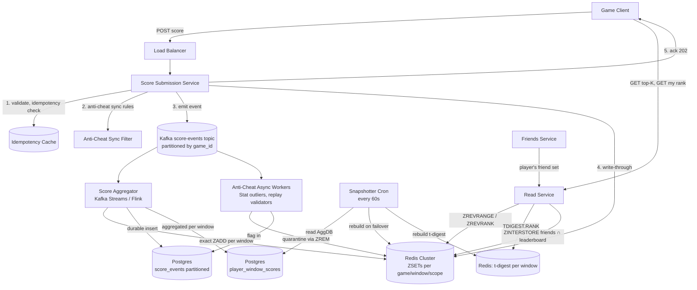

# Design a Real-Time Leaderboard — Sorted Sets, Sharded Counters, and Multi-Window Ranking

**Date:** 2026-04-25 | **Updated:** 2026-04-25
**Tags:** `system-design` `case-study` `ranking` `real-time` `medium`

## Table of Contents

- [Summary](#summary)
- [Functional Requirements](#functional-requirements)
- [Non-Functional Requirements](#non-functional-requirements)
- [Capacity Estimation](#capacity-estimation)
- [API Design](#api-design)
- [Data Model](#data-model)
- [High-Level Design](#high-level-design)
- [Deep Dives](#deep-dives)
  - [1. Redis Sorted Set Internals — Skip Lists, ZADD, ZRANGE, ZREVRANK](#1-redis-sorted-set-internals--skip-lists-zadd-zrange-zrevrank)
  - [2. Sharded Score Aggregation for Hot Writes](#2-sharded-score-aggregation-for-hot-writes)
  - [3. Periodic Snapshots to Durable Storage](#3-periodic-snapshots-to-durable-storage)
  - [4. Top-K Queries — Global vs Friends-Only vs Region](#4-top-k-queries--global-vs-friends-only-vs-region)
  - [5. Percentile Rankings via t-digest](#5-percentile-rankings-via-t-digest)
  - [6. Rolling Windows — Daily, Weekly, All-Time](#6-rolling-windows--daily-weekly-all-time)
  - [7. Tie-Breaking — Composite Score Encoding](#7-tie-breaking--composite-score-encoding)
  - [8. Tournament Mode — Isolated, Time-Boxed Boards](#8-tournament-mode--isolated-time-boxed-boards)
  - [9. Anti-Cheat Hooks](#9-anti-cheat-hooks)
- [Bottlenecks & Trade-offs](#bottlenecks--trade-offs)
- [Anti-Patterns](#anti-patterns)
- [Related](#related)
- [References](#references)

## Summary

A real-time leaderboard looks like a sorted list. At scale, it is one of the highest-leverage uses of a single data structure in our toolbox: the Redis sorted set, backed by a skip list and a hash map. Score updates arrive at thousands per second, top-K reads arrive at hundreds of thousands per second, and the user is staring at the top of the screen waiting for their rank to update before their thumb leaves the button.

The design accepts a small set of disciplined trade-offs:

1. **The hot path lives in memory.** Redis sorted sets handle `ZADD`, `ZRANGE`, and `ZREVRANK` in `O(log N)` time. Postgres or any disk-backed store cannot match this.
2. **Durability is the snapshotting tier's job, not the read path's.** Score events stream to Kafka and to a durable store; the in-memory leaderboard is rebuildable.
3. **Multiple windows coexist.** Daily, weekly, and all-time leaderboards each get their own ZSET key. Trying to derive one from the other in real time is a trap.
4. **Top-K is cheap; arbitrary rank is moderately expensive; percentile is expensive.** We answer each at a different layer.

Once you accept those, the architecture is layered: idempotent score-update API → Kafka event log → Redis sorted set per (game, window, region) → background snapshotter → t-digest for percentile rank → anti-cheat consumer that can quarantine scores out-of-band.

## Functional Requirements

| Requirement | Notes |
|---|---|
| **Submit a score** | `POST /games/{game}/scores` — idempotent per (player, event_id), accepts a positive integer score |
| **Get top-K** | `GET /games/{game}/leaderboard?window=daily&limit=100` — global, region-scoped, or friends-scoped |
| **Get my rank** | `GET /games/{game}/leaderboard/me` — returns rank + score + percentile in the active window |
| **Get neighbors** | `GET /games/{game}/leaderboard/me/neighbors?radius=5` — five above and five below the current player |
| **Get player's score history** | `GET /players/{player}/games/{game}/scores?window=weekly` — chronological, paginated |
| **Tournament leaderboards** | Time-boxed, isolated leaderboards with their own start/end window and prize tier cutoffs |
| **Friends-only leaderboard** | Top-K filtered to a player's social graph |

Out of scope:
- Matchmaking and skill rating systems (Glicko, TrueSkill) — separate service
- Push notifications when ranks change — separate fan-out system
- Reward/prize disbursement — downstream consumer of leaderboard finals

## Non-Functional Requirements

| NFR | Target |
|---|---|
| **Top-K read latency p99** | < 10 ms |
| **Rank lookup latency p99** | < 15 ms (single ZREVRANK) |
| **Score submission write latency p99** | < 50 ms (perceived) |
| **Score-update visible-to-leaderboard latency** | < 1 second |
| **Top-K accuracy** | exact for the configured window |
| **Eventual durability** | every accepted score must persist to durable storage within 30 seconds |
| **Aggregate write throughput** | 100K score events/sec at peak across all games |
| **Aggregate read throughput** | 1M leaderboard reads/sec |
| **Per-leaderboard size** | up to 50M players in the all-time global ZSET for a flagship game |
| **Availability** | 99.99% — degrade to "stale top-K" before "down" |

The phrase to internalize: **the leaderboard is a read-heavy in-memory index over a write-heavy event stream.** Reads must never wait on writes; writes must never lose events.

## Capacity Estimation

### Baseline

- **Active games on the platform:** 200
- **Daily active players per game (avg):** 500K; flagship game: 10M
- **Score submissions per active player per day:** ~20
- **Score events/day:** 200 games × 500K × 20 = 2B → **~23K/sec average, ~100K/sec peak**

### Read-side

- Every game-screen render reads the top-10. Every profile screen reads "my rank."
- **Reads per second:** 1M aggregated across all leaderboards at peak.

### Storage in Redis

A ZSET entry uses roughly 64–96 bytes (the ziplist optimization for small sets does not apply at our sizes; we are firmly in the skip-list + hash table representation).

| Leaderboard | Entries | Size in Redis |
|---|---|---|
| All-time global, flagship game | 50M | ~4 GB |
| Daily global, flagship game | 10M | ~800 MB |
| Weekly regional (US, EU, APAC) | ~3M each | ~250 MB each |
| Per-tournament | ~100K | ~8 MB |

### Storage in durable store

A score event is roughly 64 B (`game_id, player_id, score, ts, event_id`). At 2B events/day:
- **Per day:** ~128 GB
- **Per year (raw):** ~46 TB; with column-store compression (Parquet/zstd) → ~6–10 TB

### Read:write ratio

Around **40:1** at the leaderboard layer. Each read is cheap (`O(log N) + O(K)` for top-K); each write is `O(log N)` plus an event-log append. The ratio justifies an in-memory primary index.

## API Design

```http
POST /v1/games/{game}/scores
Authorization: Bearer <token>
Idempotency-Key: <event_uuid>
Content-Type: application/json

{
  "player_id": "p_42",
  "score": 18420,
  "occurred_at": "2026-04-25T10:30:01Z",
  "metadata": {
    "level": "boss-3",
    "client_version": "4.7.1",
    "session_id": "s_abc"
  }
}

202 Accepted
{
  "accepted": true,
  "event_id": "e_9f...",
  "as_of_rank": 12,         // approximate, from cache; may settle after aggregation
  "window": "daily"
}
```

```http
GET /v1/games/{game}/leaderboard?window=daily&scope=global&limit=100&offset=0

200 OK
{
  "game": "g_runner",
  "window": "daily",
  "scope": "global",
  "as_of": "2026-04-25T10:30:02Z",
  "entries": [
    {"rank": 1, "player_id": "p_77", "username": "alice", "score": 99820},
    {"rank": 2, "player_id": "p_42", "username": "bob",   "score": 95110},
    ...
  ],
  "total_players": 9874321
}
```

```http
GET /v1/games/{game}/leaderboard/me?window=daily

200 OK
{
  "player_id": "p_42",
  "rank": 12453,
  "score": 18420,
  "percentile": 99.87,           // approximate via t-digest
  "window": "daily",
  "total_players": 9874321
}
```

```http
GET /v1/games/{game}/leaderboard/me/neighbors?window=daily&radius=5

200 OK
{
  "player_id": "p_42",
  "neighbors": [
    {"rank": 12448, "player_id": "p_a", "score": 18470},
    ...
    {"rank": 12453, "player_id": "p_42", "score": 18420, "is_me": true},
    ...
    {"rank": 12458, "player_id": "p_b", "score": 18380}
  ]
}
```

```http
GET /v1/games/{game}/leaderboard?window=daily&scope=friends&limit=50

200 OK
{
  "scope": "friends",
  "entries": [...]
}
```

Two contract notes:

- **`Idempotency-Key` is `event_uuid`.** Mobile clients lose connectivity mid-submission constantly. Without idempotency the same kill or run would be counted twice.
- **`as_of_rank` is approximate.** The server returns the cached cluster-local rank immediately; the canonical rank is whatever the user sees on their next leaderboard read.

## Data Model

### Redis sorted set — primary index

```
Key format: lb:{game}:{window}:{scope}
Member:     player_id
Score:      composite encoded score (see deep dive #7)

Examples:
  lb:g_runner:daily:global
  lb:g_runner:weekly:region:us-east
  lb:g_runner:alltime:global
  lb:g_runner:tournament:t_12345
```

Operations:

```
ZADD lb:g_runner:daily:global 18420 p_42
ZREVRANGE lb:g_runner:daily:global 0 99 WITHSCORES         # top 100
ZREVRANK  lb:g_runner:daily:global p_42                    # 0-indexed rank from top
ZRANGEBYSCORE lb:g_runner:daily:global -inf +inf           # full scan (avoid)
ZINCRBY   lb:g_runner:daily:global 100 p_42                # for accumulating scores
ZCARD     lb:g_runner:daily:global                         # total players in window
```

### Source-of-truth event log (durable)

```sql
CREATE TABLE score_events (
  event_id     UUID PRIMARY KEY,
  game_id      TEXT NOT NULL,
  player_id    TEXT NOT NULL,
  score        BIGINT NOT NULL,
  occurred_at  TIMESTAMPTZ NOT NULL,
  ingested_at  TIMESTAMPTZ NOT NULL DEFAULT NOW(),
  client_meta  JSONB
) PARTITION BY RANGE (ingested_at);
-- Daily partitions; old partitions roll off to cold storage.

CREATE INDEX ON score_events (game_id, player_id, occurred_at DESC);
```

Idempotency is enforced at the event_id PRIMARY KEY: a redelivered event from Kafka cannot insert twice.

### Aggregated player score per window (durable)

```sql
CREATE TABLE player_window_scores (
  game_id     TEXT NOT NULL,
  window      TEXT NOT NULL,             -- 'daily-2026-04-25', 'weekly-2026-W17', 'alltime'
  player_id   TEXT NOT NULL,
  score       BIGINT NOT NULL,
  updated_at  TIMESTAMPTZ NOT NULL DEFAULT NOW(),
  PRIMARY KEY (game_id, window, player_id)
);
```

This is the source from which Redis is rebuilt. After a Redis flush or failover, we `ZADD` from this table.

### t-digest for percentile rank

Stored per (game, window) as a serialized blob in Redis (key: `pct:{game}:{window}`). Periodically rebuilt from `player_window_scores`.

## High-Level Design



The flow on a score submission:

1. Client POSTs with an `Idempotency-Key` (the per-event UUID).
2. Service checks idempotency cache. Repeat? Return cached response.
3. Synchronous anti-cheat filter: range checks, signature verification, simple sanity (deep dive #9).
4. Append event to Kafka. This is the durability guarantee.
5. Update Redis ZSETs for the relevant windows (`daily-{today}`, `weekly-{week}`, `alltime`) and scopes (global + region).
6. Return `202 Accepted` with the local cached rank.
7. Asynchronously, the aggregator and anti-cheat workers consume from Kafka.

The flow on a top-K read:

1. Read service receives `GET /leaderboard?window=daily&scope=global&limit=100`.
2. Single `ZREVRANGE lb:g_runner:daily:global 0 99 WITHSCORES`.
3. Hydrate player metadata (usernames, avatars) from a separate cache.
4. Return.

Total latency budget on the hot path: well under 10 ms p99 for the Redis call, plus network and hydration.

## Deep Dives

### 1. Redis Sorted Set Internals — Skip Lists, ZADD, ZRANGE, ZREVRANK

A Redis sorted set (ZSET) is a hybrid: a **hash table** (member → score) and a **skip list** (ordered by score, then member-name as tiebreaker). The hash gives `O(1)` score lookup; the skip list gives `O(log N)` insertion, deletion, and rank queries.

Skip list structure: a probabilistic multi-level linked list. Each element has a "level" drawn from a geometric distribution (default `p = 0.25` in Redis, max 32 levels). Higher-level pointers act as fast lanes — searches start at the top, drop down a level when the next pointer overshoots, and end up walking only `O(log N)` nodes.

Key complexity guarantees, all from the Redis docs:

| Command | Complexity |
|---|---|
| `ZADD key score member` | `O(log N)` |
| `ZINCRBY key delta member` | `O(log N)` |
| `ZSCORE key member` | `O(1)` (hash lookup) |
| `ZRANK / ZREVRANK key member` | `O(log N)` |
| `ZRANGE / ZREVRANGE key start stop` | `O(log N + M)` where M = number returned |
| `ZRANGEBYSCORE key min max LIMIT off count` | `O(log N + M)` |
| `ZINCRBY` on a missing member | `O(log N)` insertion |
| `ZREM key member` | `O(log N)` |
| `ZCARD key` | `O(1)` |

Two operational consequences:

- **Top-K is essentially free.** `ZREVRANGE 0 99` walks the head of the skip list and returns 100 entries. Even at 50M members, this is `O(log 50M + 100) ≈ 26 + 100` operations.
- **Arbitrary rank queries are also `O(log N)`.** `ZREVRANK player_id` is what `GET /me/rank` calls. No scan required. This is the primary reason we don't need to keep a precomputed rank field anywhere.

The "small ZSET" optimization (listpack/ziplist) applies only when the set has fewer than `zset-max-listpack-entries` (default 128) and each value fits in `zset-max-listpack-value` bytes. At our sizes (millions of entries) we're always in the skip list + hashtable representation, so the complexity table above is what we get.

For details on the skip-list invariant and the per-node level draw, see Pugh's 1990 paper (referenced below) and the Redis source `t_zset.c`.

### 2. Sharded Score Aggregation for Hot Writes

A flagship game during a tournament window can produce 50K score updates per second to a single ZSET. Redis is single-threaded per shard, and a single `ZADD` is fast — we measured single-key throughput well into hundreds of thousands of ops/sec on modern hardware — but two failure modes appear under sustained burst:

1. **Hot key on one cluster slot.** Redis Cluster shards by CRC16(key) mod 16384. All writes for `lb:g_runner:daily:global` land on one node regardless of cluster size.
2. **Network and pipeline saturation.** Even if the node can handle the ops, the gateway shoveling them in becomes the bottleneck.

The mitigation is **sharded counters across many keys**, mirroring the likes-counter pattern, with a twist: we cannot shard a leaderboard the same way as a counter, because top-K must be globally ordered.

The pattern that does work is **two-tier sharding**:

```
Tier 1 (write absorption):
  lb:g_runner:daily:global:shard:{0..N-1}    — round-robin or hash(player_id) % N

Tier 2 (read-time merged):
  lb:g_runner:daily:global                   — periodically merged via ZUNIONSTORE
```

- Each `ZADD` lands on a shard chosen by `hash(player_id) % N`. This stably routes the same player to the same shard (so `ZREVRANK` for a specific player only touches one shard).
- A merger job runs every 1–5 seconds with `ZUNIONSTORE lb:g_runner:daily:global N lb:...:shard:0 ... lb:...:shard:N-1`, producing the canonical merged ZSET that top-K reads from.
- Shard count `N` is chosen by sustained write rate. 5K/sec → 1 shard; 50K/sec → 16 shards.

The trade-off is explicit: **top-K reads see a 1–5 second lag relative to the latest writes**. This is acceptable per our NFR ("score-update visible-to-leaderboard latency < 1 sec" with merger interval ≤ 1 sec for active windows).

For "my rank" and "my neighbors," we read from the merged ZSET, so the same lag applies. If a player needs an immediate post-submit rank (e.g., after submitting a tournament-winning score), we additionally query their shard directly and return that local rank — labeled as preliminary in the API.

This pattern is the leaderboard analogue of the sharded-counter / aggregation-pipeline pattern documented for AWS gaming leaderboards (see references) and the Twitch Pinball architecture.

### 3. Periodic Snapshots to Durable Storage

The Redis ZSET is rebuildable, not authoritative. The authority is the event log in Postgres plus the aggregated `player_window_scores` table.

**Two snapshot loops run constantly:**

**Loop A — Aggregator (Kafka Streams / Flink):**

- Consumes `score-events` from Kafka.
- Maintains windowed state per `(game_id, window, player_id)`.
- Every 1 second, flushes a batch of `INSERT ... ON CONFLICT (game_id, window, player_id) DO UPDATE SET score = EXCLUDED.score, updated_at = NOW()` into `player_window_scores`.
- Also writes the raw event to `score_events` for full audit trail.

**Loop B — Snapshotter (lighter cron):**

- Every 60 seconds, samples a small percentage of the ZSET to verify the in-memory state matches `player_window_scores`. Counts drift; alerts if drift exceeds a configured tolerance.
- On Redis failover or planned maintenance, runs a full rebuild: `SELECT player_id, score FROM player_window_scores WHERE game_id = ? AND window = ?` and pipelines `ZADD` calls into Redis. A 10M-player ZSET can be rebuilt in roughly 30–90 seconds with pipelined writes and parallel partitions.

**Window rollover** (e.g., daily-2026-04-25 → daily-2026-04-26) is handled by the snapshotter:
- At UTC midnight, archive the closing window's ZSET into `player_window_scores` (already there from Loop A) and snapshot the final top-K to a results table for prize disbursement.
- Create the new window's ZSET keys, initialized empty.
- Optionally: copy current period scores to start the new window if the game's rules call for it (most games reset to zero).

**Why durable storage is the source of truth, not Redis:**
- A Redis cluster failover loses up to a few seconds of writes that were acked but not yet replicated to replicas. Because Kafka holds the same writes durably, the aggregator replays from the last committed offset and re-emits ZADDs. No score is lost.
- For fully kosher recovery, the aggregator must be idempotent on replay — score events have a unique `event_id`, and the `player_window_scores` upsert is idempotent on `(game, window, player_id)`.

### 4. Top-K Queries — Global vs Friends-Only vs Region

**Global:** trivial — `ZREVRANGE lb:{game}:{window}:global 0 K-1 WITHSCORES`.

**Region:** maintain separate ZSETs per region. The submit path writes to `lb:{game}:{window}:region:{region_code}` in addition to global. Memory cost ≈ N_regions × (region size) — usually cheaper than global because regions partition the player base. Reads are identical to global.

**Friends-only:** harder. A player's friend list might be 100–1000 user IDs. We do **not** want to read every friend's score and sort in the application — that scales linearly with friend count and is wasteful for the common case where most friends aren't in the top.

The Redis-native answer is **`ZINTERSTORE`** between the leaderboard ZSET and a transient ZSET of the friend list:

```
# Step 1: build a transient ZSET of the player's friends
ZADD tmp:friends:{player} 1 friend_id_1 1 friend_id_2 ...

# Step 2: intersect — keep only members in both, take the score from the leaderboard
ZINTERSTORE tmp:friends_lb:{player} 2 lb:{game}:daily:global tmp:friends:{player} \
            AGGREGATE MAX WEIGHTS 1 0

# Step 3: read top-K from the intersection
ZREVRANGE tmp:friends_lb:{player} 0 49 WITHSCORES

# Step 4: TTL the temporary keys (e.g., 60s) so concurrent friend reads can re-use
EXPIRE tmp:friends_lb:{player} 60
```

`ZINTERSTORE` is `O(N*K + M*log(M))` where N is the smallest input set, K the number of input sets, and M the result size. For a friend list of 500 against a leaderboard of 50M, this is dominated by `500 * 2` = `1000` operations plus a small sort — fast.

Caveats:
- Both inputs must live in the same Redis cluster slot for ZINTERSTORE to work in cluster mode. This means friend list must be **hash-tagged** to the same slot as the leaderboard, which constrains keying. The common solution is to keep the transient `tmp:friends:{player}` keyed with `{game}` as a hash tag: `tmp:friends:{game}:{player}`.
- For very large friend lists (10K+, e.g., a streamer's audience), the intersection cost climbs. Cap friend-leaderboard scope at a reasonable size and consider materializing it asynchronously.

### 5. Percentile Rankings via t-digest

`ZREVRANK` gives an exact 0-indexed rank. To convert to a percentile we need `(N - rank) / N` — we already know `N` from `ZCARD`. So why bother with t-digest?

Because not every product question maps to "where does this exact player rank?" Some questions are:

- "What score do I need to reach the top 5%?" — a quantile query.
- "What's the median score in this window?" — another quantile query.
- "Am I in the 99.9th percentile?" — could come from `ZREVRANK`, but for a score that didn't exist yet (e.g., projected), we need the inverse mapping.

For these, **t-digest** is the right structure. It's a streaming quantile sketch (Dunning, 2019) that gives accurate quantile and inverse-quantile estimates with bounded memory. Accuracy is tunable via the `compression` parameter; default Redis Bloom defaults give roughly 1% error at the tails (where it matters most for leaderboards) and ~0.1% in the mid-distribution.

We maintain one t-digest per (game, window):

```
TDIGEST.CREATE pct:g_runner:daily:global COMPRESSION 1000

# Score event ingested:
TDIGEST.ADD pct:g_runner:daily:global 18420 1

# What score gets you to the top 1%?
TDIGEST.QUANTILE pct:g_runner:daily:global 0.99
  → 87420                         (the 99th percentile score)

# What percentile is my score?
TDIGEST.RANK pct:g_runner:daily:global 18420
  → 0.9987                        (≈ 99.87th percentile)
```

Memory: a single t-digest at compression 1000 is roughly 30 KB. We can run hundreds of them with negligible memory footprint.

The t-digest is rebuilt periodically from `player_window_scores` (every few minutes for active windows, immediately on window rollover). Between rebuilds it ingests live events; drift between `TDIGEST.RANK` and `(ZREVRANK / ZCARD)` is bounded by the documented t-digest error.

For a deeper introduction, see Dunning's t-digest paper (referenced).

### 6. Rolling Windows — Daily, Weekly, All-Time

A common mistake: try to compute the daily leaderboard from the all-time leaderboard at read time. There's no way to do this without revisiting every score event. Instead, **maintain a separate ZSET per window** and write to all of them on every score event.

**Window keying:**

```
lb:g_runner:daily:2026-04-25:global
lb:g_runner:weekly:2026-W17:global
lb:g_runner:monthly:2026-04:global
lb:g_runner:alltime:global
```

The "daily" alias the API exposes maps to today's UTC date. The submit handler computes the active window keys at write time:

```python
windows = compute_active_windows(occurred_at)
# → ['daily:2026-04-25', 'weekly:2026-W17', 'alltime']
for window in windows:
    redis.zadd(f"lb:{game}:{window}:global", {player_id: composite_score})
```

**Score semantics per window:**

- *All-time*: usually `ZADD` (best score so far, using `GT` flag in Redis 6.2+ to keep the higher score) or sum of points (`ZINCRBY`) depending on game design.
- *Daily / weekly*: usually `ZINCRBY` for cumulative scoring within the window, or `ZADD GT` for "best score in the window."

Use `ZADD ... GT` when scores represent a "high score" model:

```
ZADD lb:g_runner:daily:global GT 18420 p_42
```

`GT` is a Redis 6.2+ flag: only update if the new score is greater than the existing one. This perfectly models "your daily best." Without it, you'd need a Lua script or read-then-write race.

**Window expiration:**

Daily windows are kept hot for 7 days (so leaderboards are still queryable for "yesterday"), then promoted to durable storage only:

```
EXPIRE lb:g_runner:daily:2026-04-18:global 604800   # 7 days
```

Weekly windows kept for 90 days. Monthly for 1 year. All-time forever.

A rotation worker handles the expiration, archive, and re-creation of the next window's empty ZSET, gated on UTC midnight per game's local-tournament rules.

### 7. Tie-Breaking — Composite Score Encoding

Two players with the same score: who's ranked higher? The intuitive answer — "whoever got there first" — must be encoded into the score itself, because Redis ZSETs sort first by score, then by member name lexicographically. Member name (player ID) tie-breaking is meaningless to a player.

The trick: **pack a tie-breaker into the floating-point score**. Redis stores scores as IEEE 754 64-bit floats with 53 bits of integer precision.

Encoding:

```
composite_score = base_score * 10^11 + (MAX_TS - first_reached_ts_ms / 1000)
```

- The high-order portion is the actual score (multiplied to leave room).
- The low-order portion is a "freshness" tiebreak — earlier achievers get a higher composite score.
- `MAX_TS - ts` flips the comparison so smaller timestamps win.

In code:

```python
TIEBREAKER_MAX = 10**10   # bits available for tiebreaker
SCORE_SHIFT    = 10**11

def composite(score, first_reached_ts_ms):
    seconds = first_reached_ts_ms // 1000
    tiebreak = TIEBREAKER_MAX - seconds
    return score * SCORE_SHIFT + tiebreak
```

To decode for display:

```python
def decode(composite):
    return composite // SCORE_SHIFT
```

**Bit budget check:**

A typical max base score (say, 10^7) times the shift (10^11) is 10^18, which exceeds the 2^53 ≈ 9×10^15 integer precision of a double. We have to be careful. For most leaderboards, base scores fit in `10^9` (a billion points), and the tiebreaker can be 8 digits (covers ~3 years of seconds). That keeps composite scores within `10^17`, still over the safe range — so for very high-precision games, switch to two ZSETs (primary score + tie-breaker) and use Lua or aggregate at read time, or keep the high resolution in `player_window_scores` and only display.

A simpler in-practice approach for many games: cap base scores at `10^9` and use a 6-digit tiebreaker offset within the day (covers 10^6 = ~11 days of seconds). That fits comfortably.

### 8. Tournament Mode — Isolated, Time-Boxed Boards

A tournament leaderboard is a daily/weekly leaderboard with two extra constraints:

1. **Hard start and end times.** Submissions outside the window must be rejected, not silently bucketed.
2. **Eligibility rules.** Only registered participants count; only certain game modes count; entry fee, qualification thresholds, etc.

**Keying:**

```
lb:tournament:{tournament_id}:global
lb:tournament:{tournament_id}:region:{region_code}
```

**Submission pipeline:**

The score-submission service consults a tournament registry (a small Postgres table or Redis hash):

```
HGETALL tournament:t_12345
  → start_ts, end_ts, eligibility_set_key, scoring_mode (highest|cumulative)
```

If the event timestamp falls outside `[start_ts, end_ts]`, drop with a 422. If the player is not in `eligibility_set_key` (a Redis SET containing eligible player IDs), drop. Otherwise, ZADD as usual.

**Finals handling:**

When `now() > end_ts + grace_period`, a finalizer job:

1. Stops accepting new submissions for that tournament_id.
2. Locks the ZSET (ACL-level read-only via Redis ACL or equivalent).
3. Snapshots the final ranking into a `tournament_results` Postgres table.
4. Triggers downstream reward disbursement.

The grace period (typically 10–60 seconds) absorbs events still flowing through Kafka after `end_ts`. Submissions that arrive late but with `occurred_at < end_ts` are still counted; submissions with `occurred_at >= end_ts` are dropped.

**Memory management:**

Tournament ZSETs get a TTL once finalized:

```
EXPIRE lb:tournament:t_12345:global 2592000   # 30 days for archival queryability
```

After that, the leaderboard lives only in `tournament_results`.

### 9. Anti-Cheat Hooks

A leaderboard is a magnet for cheating. The design provides three insertion points:

**Synchronous filter (in the score-submission service):**

Cheap, fast checks that catch the most blatant attempts before they hit Redis:

- Score range checks: `0 ≤ score ≤ game_max_score`.
- Rate limiting: a player can submit at most N scores per minute (per game rules).
- Signature verification: scores from native game clients are HMAC-signed with a per-session key. Mismatches reject.
- Replay token validation: the score event includes a replay token issued at session start; tokens older than session-max-duration are invalid.

These rejects with `400/403` synchronously and the score never enters the pipeline.

**Asynchronous statistical detector (Kafka consumer):**

Subscribes to `score-events` and runs:

- Outlier detection: per-player rolling z-score against their own history; per-game cohort z-score for the population. Suspicious scores are flagged in the `score_events` row (`flag = 'pending-review'`).
- Velocity checks: rate of score improvement compared to known progression curves. A player going from 1000 → 100000 in one session triggers a flag.
- Geo-impossibility: two submissions from the same account from geographically inconsistent IPs within minutes.

Flagged events do not stop showing up on the leaderboard immediately — that would create false-positive incidents. They are queued for human or model review.

**Quarantine action:**

When a score is determined to be fraudulent (synchronous decision or post-review):

```
ZREM lb:g_runner:daily:global p_cheater
ZREM lb:g_runner:weekly:global p_cheater
ZREM lb:g_runner:alltime:global p_cheater
UPDATE score_events SET flag = 'quarantined' WHERE event_id = ?
UPDATE player_window_scores SET score = legitimate_score WHERE ...
```

The anti-cheat worker has elevated permissions to do these mutations out-of-band. Audit log entries record every quarantine action.

**Replay verification (heavy):**

For top-N tournament finalists (say, top 50), run a deterministic replay of their submitted gameplay against an authoritative simulator. This is expensive (seconds per replay) and reserved for prize-bearing positions. Disqualifications at this stage trigger ranking shifts in the final.

For the system-design conversation, the key architectural idea is: **anti-cheat is a separate consumer of the same event log, not a coupling on the write path.** Coupling cheats checks into the write path makes them slow and brittle; isolating them lets us iterate on detection logic without touching the leaderboard's hot path.

## Bottlenecks & Trade-offs

| Component | Bottleneck | Mitigation |
|---|---|---|
| Single-key ZSET hot writes | One Redis cluster slot saturates | Two-tier sharded ZSETs with periodic ZUNIONSTORE merge (deep dive #2) |
| Memory growth of all-time ZSETs | 50M players × ~80 B = 4 GB+ per game | Trim long-tail to a "low-activity" archive ZSET kept on disk-backed Redis or rebuilt on demand |
| ZUNIONSTORE merge cost | `O(N+M)` over millions of entries every few seconds | Run merger as a separate Redis instance (write replica with shorter SAVE intervals); back off merge frequency for low-activity windows |
| Friends-only intersect | ZINTERSTORE requires same-slot keys | Hash-tag temp friend ZSETs to the leaderboard's slot; cap friend list size used for intersect |
| t-digest staleness | Sketch rebuilt periodically; drifts between rebuilds | Rebuild on every window rollover; allow ±1% percentile error in API contract |
| Postgres `score_events` write rate | 100K events/sec across the platform | Daily partitions, parallel inserts from Kafka consumer pool, async commit on the analytics replica |
| Kafka partition skew | Game with 80% of traffic dominates one partition | Sub-partition large games by `(game_id, hash(player_id) % M)`; consumer count scales accordingly |
| Failover replay time | Rebuilding 10M-entry ZSET from Postgres | Pipelined ZADDs with `SCAN`-style chunking; aim for < 90 seconds; serve "warming up" status to clients |
| ZADD GT visibility | Players see their score reflected even if not their personal best | Document semantics in API; for "best of" mode return the best score, not the latest |

The headline trade-off remains **hot-path latency vs durability**. We achieve sub-10ms reads by keeping the working set in Redis ZSETs and accepting that Redis is rebuildable, not authoritative.

## Anti-Patterns

1. **Computing top-K via `SELECT ... ORDER BY score DESC LIMIT 100` on the events table.** A 50M-row sort on every leaderboard read collapses Postgres. The denormalized ZSET exists to avoid this.
2. **Single ZSET per game without two-tier sharding for high-write windows.** A flagship game during a tournament will saturate the slot. Plan shard count by sustained write rate.
3. **Trying to derive daily from all-time.** It's mathematically impossible without scanning the event stream. Maintain separate windows.
4. **Treating Redis as authoritative.** A failover loses unreplicated writes. Always emit to Kafka first; rebuild from durable store on recovery.
5. **Counting submission idempotency with a database UPDATE rather than a Kafka idempotent producer + event_id PK.** Race conditions on retry will cause double-scoring otherwise.
6. **Doing percentile via `ZREVRANK / ZCARD` on every read for very large ZSETs in tight loops.** `ZREVRANK` is O(log N), not O(1); for a profile widget that polls every second across millions of players, prefer cached t-digest results.
7. **Friends-only leaderboard via app-side fan-out.** Fetching every friend's score and sorting in the app is `O(F)` per request and saturates Redis. Use `ZINTERSTORE` on co-located keys.
8. **Including PII (real names, addresses) in the ZSET member.** Members are player_ids; metadata is hydrated from a separate cache. ZSET members are plaintext on disk in RDB snapshots.
9. **Letting tournament submissions race past `end_ts` without a grace-period and clear cutoff.** Players will exploit clock skew and network buffering. The submission service must reject by `occurred_at`, not by ingestion time.
10. **Synchronous anti-cheat that calls a heavy ML model on every score submit.** Latency budget breaks. Run heavy detection as an async consumer; sync filter is range checks and signatures only.
11. **Composite-score tie-breaker that overflows IEEE 754 double precision.** Allocate bit budget carefully; verify with extreme cases. When in doubt, store the tie-breaker separately.
12. **Forgetting TTLs on temporary friend-intersect ZSETs.** Without `EXPIRE`, they accumulate forever. Always tag transient keys with TTLs.

## Related

### Deep-Dive Companions

- [`realtime-leaderboard/redis-sorted-set-internals.md`](realtime-leaderboard/redis-sorted-set-internals.md) — skip lists, listpack threshold, ZADD/ZRANGE/ZREVRANK semantics, span counters.
- [`realtime-leaderboard/sharded-score-aggregation.md`](realtime-leaderboard/sharded-score-aggregation.md) — hot-write sharding axes, in-process batching, stream-consumer aggregator.
- [`realtime-leaderboard/snapshots-to-durable-storage.md`](realtime-leaderboard/snapshots-to-durable-storage.md) — RPO/RTO targets, event-log replay, RDB/AOF, hybrid recovery.
- [`realtime-leaderboard/top-k-queries.md`](realtime-leaderboard/top-k-queries.md) — global/friends/region top-K, pre-materialized vs live merge, streaming top-K.
- [`realtime-leaderboard/percentile-rankings-t-digest.md`](realtime-leaderboard/percentile-rankings-t-digest.md) — t-digest, HDR, KLL, mergeable digests across shards.
- [`realtime-leaderboard/rolling-windows.md`](realtime-leaderboard/rolling-windows.md) — tumbling vs sliding, bucketed mini-ZSETs, watermarks, midnight stampede.
- [`realtime-leaderboard/tie-breaking.md`](realtime-leaderboard/tie-breaking.md) — composite double encoding, IEEE 754 budget, ZRANGEBYLEX patterns.
- [`realtime-leaderboard/tournament-mode.md`](realtime-leaderboard/tournament-mode.md) — lifecycle states, brackets, idempotent prize-grant saga, anti-cheat hooks.

### Foundations and Adjacent Systems

- [Designing a Likes Counting System](../social-media/design-likes-counting-system.md) — same sharded-counter and Kafka-buffer pattern applied to single-counter increments.
- [Caching Layers](../../building-blocks/caching-layers.md) — TTL strategies, write-through and cache-aside patterns referenced in the snapshot and rebuild flow.
- [Sharding Strategies](../../scalability/sharding-strategies.md) — generalized partitioning patterns; the two-tier ZSET sharding here is one instance.
- [Read-Write Splitting and Cache Strategies](../../scalability/read-write-splitting-and-cache-strategies.md) — broader read/write split patterns; the leaderboard is an extreme read-optimized case.
- *(planned)* [Design a Top-K System](./design-top-k-system.md) — generalization of top-K to non-leaderboard streams (trending hashtags, top errors).
- *(planned)* [Skip Lists](../../data-structures/skip-lists.md) — deeper dive on the data structure underneath ZSET.
- *(planned)* [Count-Min Sketch](../../data-structures/count-min-sketch.md) — companion sketch for approximate counting; complements t-digest.

## References

- [Redis Sorted Sets — official data type guide](https://redis.io/docs/latest/develop/data-types/sorted-sets/) — the authoritative reference for ZSET semantics, including the listpack/skip-list representation switch and the `GT`/`LT`/`XX`/`NX` flags on `ZADD`.
- [Redis ZADD command reference](https://redis.io/docs/latest/commands/zadd/) — `O(log N)` complexity, `GT`/`LT`/`CH` options, INCR semantics.
- [Redis ZRANGE command reference](https://redis.io/docs/latest/commands/zrange/) — `O(log N + M)` complexity, REV modifier, BYSCORE and BYLEX variants. Replaces the older ZREVRANGE for new code (still supported).
- [Redis ZREVRANK command reference](https://redis.io/docs/latest/commands/zrevrank/) — `O(log N)` rank lookup, `WITHSCORE` option added in 7.2.
- [Redis ZINTERSTORE command reference](https://redis.io/docs/latest/commands/zinterstore/) — friends-only intersection cost analysis and aggregation modes.
- [Pugh, "Skip Lists: A Probabilistic Alternative to Balanced Trees" (1990)](https://15721.courses.cs.cmu.edu/spring2018/papers/08-oltpindexes1/pugh-skiplists-cacm1990.pdf) — original skip-list paper; the structure backing Redis ZSET.
- [Dunning, "The t-digest: Efficient estimates of distributions" (Software Impacts, 2021)](https://www.sciencedirect.com/science/article/pii/S2665963820300403) — the t-digest sketch, accuracy bounds, and serialization properties.
- [Redis Bloom — TDIGEST commands](https://redis.io/docs/latest/develop/data-types/probabilistic/t-digest/) — `TDIGEST.CREATE`, `TDIGEST.ADD`, `TDIGEST.QUANTILE`, `TDIGEST.RANK` semantics and parameters.
- [AWS Game Tech — "Building a Real-Time Leaderboard" reference architecture](https://aws.amazon.com/blogs/gametech/building-a-leaderboard-with-amazon-elasticache-for-redis/) — ElastiCache for Redis sorted-set leaderboards, sharding, and snapshot patterns.
- [AWS Database Blog — "Building real-time leaderboards using Amazon MemoryDB"](https://aws.amazon.com/blogs/database/building-a-real-time-leaderboard-using-amazon-memorydb/) — durability properties of MemoryDB for leaderboards (multi-AZ + transaction log).
- [Confluent — Kafka Streams stateful aggregation patterns](https://developer.confluent.io/patterns/stream-processing/event-aggregator/) — windowed aggregation pattern for the score-event consumer.
