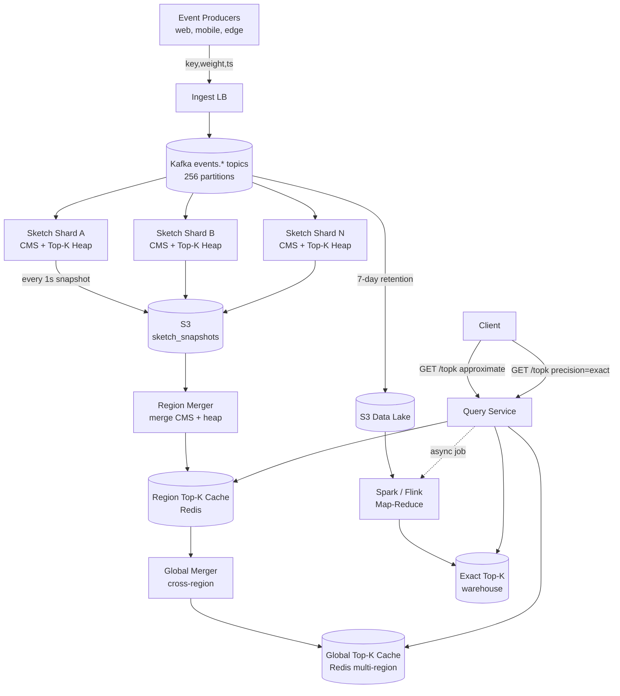

# Design a Top-K System — Heavy Hitters, Mergeable Sketches, and Lambda Fallback

**Date:** 2026-04-25 | **Updated:** 2026-04-25
**Tags:** `system-design` `case-study` `ranking` `sketches` `hard`

## Table of Contents

- [Summary](#summary)
- [Functional Requirements](#functional-requirements)
- [Non-Functional Requirements](#non-functional-requirements)
- [Capacity Estimation](#capacity-estimation)
- [API Design](#api-design)
- [Data Model](#data-model)
- [High-Level Design](#high-level-design)
- [Deep Dives](#deep-dives)
  - [1. Count-Min Sketch — The Math Behind the Memory Win](#1-count-min-sketch--the-math-behind-the-memory-win)
  - [2. Heavy Hitters — Misra-Gries and Space-Saving](#2-heavy-hitters--misra-gries-and-space-saving)
  - [3. Sliding-Window Top-K — Decay vs Forgetful Counters](#3-sliding-window-top-k--decay-vs-forgetful-counters)
  - [4. Multi-Region Merge — Mergeable Sketches and Partial Top-K](#4-multi-region-merge--mergeable-sketches-and-partial-top-k)
  - [5. Accuracy vs Memory Budget — Tuning Width, Depth, and K](#5-accuracy-vs-memory-budget--tuning-width-depth-and-k)
  - [6. Lambda Pattern — Real-Time Sketch + Batch Map-Reduce Truth](#6-lambda-pattern--real-time-sketch--batch-map-reduce-truth)
  - [7. False Positives — When the Sketch Lies and How to Cope](#7-false-positives--when-the-sketch-lies-and-how-to-cope)
  - [8. Applications — Trending Hashtags, Top Products, DDoS IPs](#8-applications--trending-hashtags-top-products-ddos-ips)
- [Bottlenecks & Trade-offs](#bottlenecks--trade-offs)
- [Anti-Patterns](#anti-patterns)
- [Related](#related)
- [References](#references)

## Summary

"Show me the top 100 trending hashtags in the last 5 minutes" sounds like `SELECT tag, COUNT(*) ... GROUP BY tag ORDER BY count DESC LIMIT 100`. At a billion events per minute it is not. The exact group-by needs a counter for **every distinct key** — and on Twitter-scale firehoses there are tens of millions of distinct hashtags per window, with a long tail of single-occurrence noise. Storing a hash map keyed by every term consumes hundreds of GB per window and rolls those entries forward every second.

The realistic design accepts three trade-offs:

1. **The top-K is approximate.** A heavy-hitter algorithm guarantees you find every truly heavy item with bounded over-count, but you may see rank flips between adjacent items at the boundary.
2. **Memory is bounded by sketch parameters, not by cardinality.** A count-min sketch sized for ε = 0.001, δ = 0.001 fits in ~28 MB regardless of whether the stream has 10K or 10B distinct keys.
3. **Truth comes from batch.** When billing, fraud, or compliance requires an exact answer, a nightly map-reduce job re-derives the answer from the durable event log — sketch is fast and cheap; map-reduce is slow and exact.

The end-to-end shape is a **lambda pipeline**: events fan into per-shard count-min sketches paired with min-heaps for the top-K view, sketches are merged across shards and across regions periodically, and a parallel batch path replays the durable Kafka log into a Spark/Flink job that produces the canonical top-K for ledgers. The two paths report under the same API with a `precision` field so callers know which one they got.

## Functional Requirements

| Requirement | Notes |
|---|---|
| **Ingest events with a key and weight** | `(key, weight=1, ts)` — hashtag, product_id, source_ip, etc. |
| **Top-K query for a fixed window** | `GET /topk?window=5m&k=100` — last N minutes/hours/days |
| **Sliding-window top-K** | Continuously updated; the window slides every second, not every 5 minutes |
| **Multi-region** | Each region computes its local top-K; merged into a global top-K |
| **Exact top-K on demand** | A "precise=true" path runs map-reduce and returns ground truth (slow, hours) |
| **Per-key count lookup** | `GET /count?key=#superbowl&window=5m` — used by trending UI to show "+12K in last 5 min" |
| **Heavy-hitter alerts** | Push notification when a key crosses an absolute or velocity threshold (DDoS, viral content) |

Out of scope:

- Time-travel queries on arbitrary historical windows (use the warehouse, not this system).
- Personalized "top-K for *you*" — that is a recommendation system, not a counting system.
- Per-user activity streams (separate fan-out service).

## Non-Functional Requirements

| NFR | Target |
|---|---|
| **Ingest throughput** | 10M events/sec aggregate, 1M events/sec per region |
| **Top-K query p99 latency** | < 50 ms for cached approximate answer |
| **Window granularity** | 1-second resolution, queryable at 1m / 5m / 1h / 24h windows |
| **Approximation guarantee** | ε = 0.0001 over total stream weight; δ = 0.001 (probability of bad estimate) |
| **Memory per region** | < 1 GB for a 24h sliding sketch |
| **Multi-region merge interval** | Every 1 second for hot windows, every 60 seconds for cold |
| **Exact-truth SLA (batch)** | Available within 6 hours of window close |
| **Durability of source events** | Kafka with `min.insync.replicas=2`, 7-day retention |
| **Availability** | 99.95% on the approximate path; batch path can be slower-recovery |

The core mantra: **be exact about what you mean by approximate**. Calling it "approximate" is not an apology; it is a contract — the count-min sketch overestimates with probability bounded by δ and an additive error bounded by ε × total weight, never under-counts. Surface those parameters in the API.

## Capacity Estimation

### Stream characteristics

- **Events/sec:** 10M aggregate, 1M peak per region
- **Distinct keys per minute:** ~50M (heavy long tail of one-off hashtags, IPs, query strings)
- **Heavy-hitter cardinality:** the top-1000 keys account for ~80% of mass on social streams (Zipfian)
- **Window range:** 1-second tumbling slots, aggregated up to 24h sliding window

### Memory math

For a count-min sketch with width `w` and depth `d`:
- Memory per sketch = `w × d × 4 bytes` (32-bit counters)
- Error guarantee: estimate ≤ true + ε × N with probability ≥ 1 − δ where `w = ⌈e/ε⌉`, `d = ⌈ln(1/δ)⌉`

| Window | ε | δ | w | d | Memory |
|---|---|---|---|---|---|
| 1 minute | 0.001 | 0.001 | 2,719 | 7 | ~76 KB |
| 5 minutes | 0.0001 | 0.001 | 27,183 | 7 | ~760 KB |
| 1 hour | 0.0001 | 0.001 | 27,183 | 7 | ~760 KB |
| 24 hours | 0.00001 | 0.001 | 271,829 | 7 | ~7.5 MB |

A handful of sliding sketches across windows totals **~10 MB per region per shard**. A region with 32 shards holds the whole structure in **~320 MB** — comfortably in RAM on a single node. The same query against an exact hash map keyed by 50M distinct hashtags would need ~3 GB plus per-second roll-forward cost.

### Top-K storage

The top-K min-heap holds K entries with `(key, estimated_count)`. K = 1000 with 64-byte keys is 64 KB. Negligible.

### Storage of durable event log

- 10M events/sec × 100 B/event ≈ 1 GB/sec ≈ 86 TB/day in Kafka (replicated 3×, so ~260 TB physical).
- Retention 7 days for replay → ~1.8 PB across the fleet. This is the source of truth for the batch path.

## API Design

```http
GET /v1/topk?window=5m&k=100&domain=hashtags
Authorization: Bearer <token>

200 OK
{
  "domain": "hashtags",
  "window": "5m",
  "k": 100,
  "as_of": "2026-04-25T10:31:00Z",
  "precision": "approximate",
  "epsilon": 0.0001,
  "delta": 0.001,
  "items": [
    {"key": "#superbowl",   "estimated_count": 1284731, "rank": 1, "rank_confidence": 0.99},
    {"key": "#halftime",    "estimated_count":  872103, "rank": 2, "rank_confidence": 0.97},
    ...
  ]
}
```

```http
GET /v1/count?key=%23superbowl&window=1h

200 OK
{
  "key": "#superbowl",
  "window": "1h",
  "estimated_count": 4291874,
  "upper_bound": 4292303,
  "precision": "approximate"
}
```

```http
GET /v1/topk?window=24h&k=100&precision=exact

202 Accepted
{
  "job_id": "topk_exact_20260425_001",
  "estimated_completion": "2026-04-25T16:30:00Z",
  "callback_url": "/v1/jobs/topk_exact_20260425_001"
}
```

Two contract details worth highlighting:

- The response carries `epsilon`, `delta`, and an `upper_bound` for per-key counts. Clients building dashboards can render error bars rather than misleadingly precise numbers.
- The `precision=exact` request returns 202 and a job handle. The exact path **never** runs synchronously; it is an offline job. This forces callers to treat exactness as a separate, slower contract.

## Data Model

### Per-shard sketch state (in-memory)

```
struct CountMinSketch {
  width:  u32                    // e.g., 27183
  depth:  u32                    // e.g., 7
  table:  [[u32; width]; depth]  // counter matrix
  hashes: [PairwiseIndepHash; depth]
  total:  u64                    // sum of all increments (for ε × N reasoning)
}

struct TopKHeap {
  k:      u32
  heap:   MinHeap<(estimated_count: u64, key: String)>
  index:  HashMap<String, HeapHandle>   // O(1) update on existing entries
}
```

### Per-window snapshots (durable, for merge)

```sql
CREATE TABLE sketch_snapshots (
  shard_id       INT NOT NULL,
  domain         TEXT NOT NULL,            -- 'hashtags', 'products', 'ips'
  window_start   TIMESTAMPTZ NOT NULL,
  window_end     TIMESTAMPTZ NOT NULL,
  width          INT NOT NULL,
  depth          INT NOT NULL,
  total_weight   BIGINT NOT NULL,
  table_blob     BYTEA NOT NULL,           -- serialized counter matrix
  topk_blob      BYTEA NOT NULL,           -- top-K min-heap snapshot
  PRIMARY KEY (domain, window_start, shard_id)
);
```

Snapshots are written every second to S3 (the column above is illustrative; the production form is just object storage with metadata in DynamoDB or Postgres). They are the input both to the cross-region merger and to the eventual batch reconciliation job.

### Source-of-truth event log (Kafka)

```
topic: events.{domain}            partitions: 256, replication: 3
key:   sha256(key) % partitions   value: protobuf(key, weight, ts, source)
```

Partitioning by hashed key gives the same key consistent placement on the same partition, which lets the per-shard sketch own a slice of the keyspace and lets the heavy-hitter pass within a partition be more accurate than a randomly sharded one.

## High-Level Design



Hot path on ingest:

1. Producer publishes `(key, weight, ts)` to Kafka, partitioned by hash(key).
2. Each sketch shard owns a partition slice and consumes its events. For each event, it increments the count-min sketch and updates the top-K min-heap.
3. Every 1 second, the shard serializes its CMS table and top-K heap to S3.
4. The region merger reads all shard snapshots for the latest window, merges (sums) the CMS tables element-wise, and rebuilds the global top-K from the merged sketch + union of per-shard heaps.
5. The merged region top-K is cached in Redis under `topk:{domain}:{window}:{region}`.
6. A global merger does the same across regions; result lands in a multi-region Redis or DynamoDB.

Hot path on query:

1. Query service hits the relevant cache (region or global). 99% of queries answer here.
2. On miss or staleness, fall back to the most recent S3 snapshot and merge on the fly.

Cold/exact path:

1. Kafka events are continuously archived to S3 (data lake).
2. A nightly Spark job groups by key over the chosen window, sorts, and writes the canonical top-K to a warehouse table.
3. `precision=exact` requests are served from the warehouse.

## Deep Dives

### 1. Count-Min Sketch — The Math Behind the Memory Win

A count-min sketch is a 2D array of counters with `d` rows and `w` columns plus `d` independent hash functions, each mapping a key into `[0, w)`. To increment a key by weight `c`:

```
for i in 0..d:
    j = hash_i(key) % w
    table[i][j] += c
total += c
```

To estimate the count of `key`:

```
estimate(key) = min over i of table[i][hash_i(key) % w]
```

Cormode and Muthukrishnan (2005) proved that for `w = ⌈e/ε⌉` and `d = ⌈ln(1/δ)⌉`:

- `estimate(key) ≥ true_count(key)` always (no under-counting).
- `Pr[estimate(key) ≤ true_count(key) + ε × N] ≥ 1 − δ` where `N = total weight`.

So the error is **additive in the stream's total mass**, not in the queried key's mass. For a heavy hitter with true count 1M out of N = 1B and ε = 0.0001, the estimate error is bounded by 0.0001 × 1B = 100K with probability 99.9% — a 10% relative error on the heavy hitter, but on a long-tail key with true count 50, the same 100K absolute slack is meaningless. **CMS is calibrated for the head of the distribution.**

The "min" in the name is the key insight: each row is independently a Bloom-filter-style overestimate; the minimum across rows is the tightest. With 7 rows, all 7 hashes must collide with a heavy hitter to inflate the estimate — exponentially unlikely.

The per-event work is `d` hash evaluations and `d` counter increments — cache-line friendly if rows are stored row-major and `w` fits in L2. On commodity hardware, a single core sustains 5–10M events/sec on a CMS of the sizes above.

A key implementation detail: use **pairwise independent hashes** (e.g., `((a * key + b) mod p) mod w` with random `a`, `b` per row, `p` a large prime). Real cryptographic hashes are overkill and expensive.

### 2. Heavy Hitters — Misra-Gries and Space-Saving

CMS gives you a counter per key by name, but you also need the **list of likely heavy hitters** — you cannot enumerate all keys at the end of a window without storing them, and storing them defeats the purpose.

Two classic algorithms solve this with `O(k)` memory:

**Misra-Gries (1982)** — maintain `k` (key, counter) pairs:

```
on event (key):
  if key in slots:
    slots[key] += 1
  elif |slots| < k:
    slots[key] = 1
  else:
    for each slot: slot.count -= 1
    drop slots whose count hit 0
```

Guarantee: any key with true frequency > N/(k+1) is in the final slots. False positives possible (slot can hold a non-heavy item that happened to survive decrements), but no heavy hitter is missed.

**Space-Saving (Metwally, Agrawal, El Abbadi, 2005)** — same shape but evicts the *minimum-counter* slot when a new key arrives, transferring its count:

```
on event (key):
  if key in slots:
    slots[key].count += 1
  elif |slots| < k:
    slots[key] = (count=1)
  else:
    min_slot = slot with smallest count
    new_slot = (key, count=min_slot.count + 1)
    replace min_slot with new_slot
```

Space-Saving gives tighter error bounds in practice and is what Apache DataSketches (`frequent-items` family) and ClickHouse's `topK()` aggregate function implement. The over-estimation per surviving slot is bounded by N/k.

**The production pattern is CMS + min-heap + Misra-Gries-style admission**:

1. CMS estimates per-key counts on every event.
2. A bounded min-heap (size K) holds the current top-K.
3. New event → CMS update → if estimated count > heap min, replace heap min with this key.

This combines CMS's per-key query strength with a heavy-hitter algorithm's enumeration property. Apache DataSketches documents this exact composition for streaming top-K.

### 3. Sliding-Window Top-K — Decay vs Forgetful Counters

A static CMS is a forever-counter. For a 5-minute trending feed you need to **age out** events older than 5 minutes. There are three viable approaches:

**A. Tumbling sub-windows (the simplest):**

Maintain `W / s` separate CMS instances where `W` is the window length and `s` is the slot size (say W = 5 min, s = 1 sec → 300 sketches). Events go into the current slot's sketch. To query the current window, merge all 300 sketches by element-wise sum and run top-K extraction. Aged-out slot is dropped (and its memory reclaimed) every second.

Memory: 300 × 760 KB ≈ 230 MB per shard. Acceptable.

This is the approach Manku and Motwani's "Approximate Counts and Quantiles over Sliding Windows" formalizes — they call it the "deterministic sliding window" and prove additive error bounds.

**B. Exponentially decayed counters (forgetful):**

Each event multiplies all existing counters by a decay factor `α < 1` and then adds the new event:

```
on tick:
  table *= α     # decay
on event:
  table[i][hash_i(key)] += 1
```

A typical choice is `α = exp(-Δt / τ)` with `τ` set so that an event from 5 minutes ago contributes ~1% of its original weight. Memory is `O(1)` (one CMS), but the window is *soft* — you cannot say "exactly the last 5 minutes."

This is sometimes called **forward decay** (Cormode, Shkapenyuk, Srivastava, Xu, 2009). It is what Twitter Heron's "Trending" topology uses internally.

**C. Hybrid (production):**

Big tumbling sub-windows (e.g., 1 min) with exponential decay *within* each sub-window. Coarse aging is precise; fine aging is approximate. The merge cost stays low (5 sub-windows for a 5-minute query) and the recency bias of decay smooths rank flicker on the boundary.

The choice between A and B is essentially **memory vs window precision**. Interview-grade answer: A for "the last exactly W seconds" semantics (regulators, billing); B for "trending now" UI where users do not care about a hard cutoff.

### 4. Multi-Region Merge — Mergeable Sketches and Partial Top-K

A *mergeable summary* (Agarwal, Cormode, Huang et al., 2013) is one where `sketch(A ∪ B) = merge(sketch(A), sketch(B))` exactly, regardless of how the data was partitioned. CMS is mergeable: element-wise sum of two tables computed with the same `(w, d, hash functions)`. HyperLogLog is mergeable. KLL quantile sketch is mergeable. This is the property that makes multi-region top-K tractable.

The merge protocol:

1. Each region computes its own CMS + top-K heap.
2. Every second, regions push their **CMS table snapshot + top-K candidate set** (the union of their top-K plus a configurable "near-K" buffer of the next 2K entries) to a global merger.
3. Global merger:
   - Sums CMS tables element-wise → global CMS.
   - Takes the union of all candidate sets → ~ N_regions × 3K candidates.
   - Re-estimates each candidate against the merged CMS.
   - Sorts and trims to global top-K.

The "near-K" buffer matters: the global rank-K item may not be in any single region's top-K but may be top-K when summed across regions (e.g., a hashtag uniformly popular in every region, never #1 in any). The buffer trades bandwidth for completeness; in practice 2K–3K extra candidates per region recovers > 99% of the long tail.

Cross-region bandwidth: 32 shards × 7.5 MB sketch + 3K candidates × ~100 B = **~245 MB/region/snapshot**. At 1 snapshot per second that is 2 Gbps — large but tractable on inter-region backbone. For lower bandwidth, snapshot every 5 seconds and accept slightly staler global view.

The alternative — ship raw events globally — is the wrong design: it scales with event rate (10M events/sec × 100 B = 1 GB/sec per region pair, ten times worse) and offers no privacy benefit.

### 5. Accuracy vs Memory Budget — Tuning Width, Depth, and K

The CMS parameters are:

| Parameter | Effect |
|---|---|
| `w` (width) | Halves error per doubling. Memory linear. |
| `d` (depth) | Halves failure probability per doubling. Memory linear; CPU linear. |
| `k` (top-K) | Heap size; affects long-tail visibility, not heavy-hitter accuracy. |

Practical sizing recipe:

1. **Pick ε from product requirements.** "Counts within 0.01% of stream total" → ε = 0.0001.
2. **Pick δ from acceptable failure rate.** "I want < 1 query in 1000 to see a bad estimate" → δ = 0.001.
3. **Compute w = ⌈e/ε⌉, d = ⌈ln(1/δ)⌉.** For ε = 0.0001, δ = 0.001: w = 27183, d = 7.
4. **Memory = w × d × 4 bytes** (32-bit counter), so 760 KB. Use 64-bit counters if a single key can exceed 4B counts in the window.
5. **Pick K** based on UI: top-100 displayed → K = 1000 in the heap (10× headroom for rank churn near the boundary).

The most common tuning mistake is conflating **per-query confidence** with **rank correctness**. A CMS with δ = 0.001 means 0.1% of *individual* count queries may be inflated; it does not guarantee that the top-100 ranking is stable. Rank correctness depends on the gap between adjacent counts: items at rank 99 and 100 with counts 50K and 49.5K can flip on any sketch realization. **Report `rank_confidence`** in the API response by checking how close adjacent estimates are relative to ε × N.

For the long-running 24h sketch, also size `total` (`u64`, not `u32`): 10M events/sec × 86400 s = 864B events. The counter matrix entries can each be 32-bit if no single key exceeds 4B, but the sketch's `total` field needs 64-bit.

### 6. Lambda Pattern — Real-Time Sketch + Batch Map-Reduce Truth

The lambda architecture (Marz, 2011 — "How to beat the CAP theorem") prescribes two parallel paths:

- **Speed layer:** approximate, low-latency, recent. The CMS + top-K pipeline above.
- **Batch layer:** exact, high-latency, historical. A map-reduce job over the durable Kafka log.

Why both? Three reasons:

1. **Compliance / billing.** "Top advertisers by click volume" cannot be approximate when invoices depend on it. Even ε = 0.0001 over 1B clicks is 100K-click slack — that is real money.
2. **Audit / forensics.** "Which IP issued the most requests during Tuesday's incident?" needs the exact count, not a sketch estimate, because the answer drives action (block, throttle, refund).
3. **Sketch debugging.** When the speed layer disagrees with batch by more than the theoretical bound, that is a bug — wrong hash functions, wrong width, lost shard, time-window misalignment. The batch path is the ground truth that exposes it.

Concrete batch pipeline:

```
Kafka events.* (7-day retention)
  → continuous archiver writes parquet to S3 (hourly partitions)
  → Spark / Flink batch job:
       SELECT key, SUM(weight) AS total
       FROM events_parquet
       WHERE ts BETWEEN window_start AND window_end
       GROUP BY key
       ORDER BY total DESC
       LIMIT 1000
  → write to warehouse table topk_exact_{domain}_{window}
```

For a 24h window over 10M events/sec, the input is ~86 TB. A 200-executor Spark cluster runs this in ~2 hours. The batch path has a **6-hour SLA** — events for window `[T-24h, T]` are guaranteed exact-counted by `T + 6h`.

Reconciliation: a daily job computes `relative_error = |sketch_count - exact_count| / total_weight` per heavy hitter and asserts it is below ε with probability ≥ 1 − δ. Out-of-bound deviations open an automated ticket.

Modern variants — **kappa architecture** — collapse this by replaying Kafka through an exact stateful Flink job rather than a separate batch system. Both shapes solve the same problem; choose based on operational fit, not novelty.

### 7. False Positives — When the Sketch Lies and How to Cope

Three failure modes are worth naming:

**A. Hash collision inflation.** A long-tail key happens to share its hash slot in every row with a different heavy hitter. The CMS estimate for the long-tail key approaches the heavy hitter's count. With d = 7 and reasonable hashes the probability is ~δ = 0.001, but in a stream of 50M distinct keys you will see ~50K "lying" estimates per snapshot. Most are harmless because they are in the long tail; the dangerous case is when one of these inflated long-tail keys gets pushed into the top-K heap.

Mitigation: **double-checking on heap insert.** Before promoting a key into the top-K, verify its estimate is within `0.5 × ε × N` of the heap-min. If it is suspiciously close, refuse to admit and let the next event break the tie. Apache DataSketches calls this the "frequent items lower-bound check."

**B. Decay drift.** With exponentially decayed counters, floating-point round-off accumulates. Over millions of decay steps, `α^n × original` deviates from theory. Periodically rebuild the sketch by running a fresh CMS over the last fully-resolved tumbling window and using it as the new baseline.

**C. Misra-Gries / Space-Saving false positives in the heap.** A non-heavy key can survive decrements long enough to occupy a slot when the window closes. The standard mitigation is a **second-pass verification**: keep the heap of candidates from the speed layer, then in the batch layer re-count those candidates exactly. This is much cheaper than full top-K because you only count K candidates, not all distinct keys.

The right way to communicate false positives in the API: **include `rank_confidence` and `upper_bound` per item.** A rank-1 item with rank_confidence = 0.99 means the algorithm is sure it is rank 1. A rank-100 item with rank_confidence = 0.55 means it is plausibly rank 100 but adjacent items overlap within the error bar.

### 8. Applications — Trending Hashtags, Top Products, DDoS IPs

The same machinery dresses up as three very different products:

**Trending hashtags (Twitter / X).** Domain key = hashtag string. Window = 5 minutes, sliding. Top-K = 100 displayed, 1000 in heap. Multi-region merge every second. Exponential decay preferred (gives a "current vibe" feel; users do not care about a hard 5-minute cutoff). Heavy-hitter alert when a hashtag's velocity (delta over last 30 sec) exceeds 10× its 5-minute baseline.

**Top searched products (Amazon / e-commerce).** Domain key = product_id. Window = 1 hour or 24 hours. Top-K = 1000. Tumbling sub-windows preferred (analytics teams want "exactly the last hour"). Lambda batch path is **mandatory** for the merchandising team's daily rollups — those drive vendor payouts and category placement; even 0.01% relative error is unacceptable.

**DDoS source IPs (Cloudflare / edge networks).** Domain key = source_ip (or `(src_ip, dst_ip, dst_port)` tuple). Window = 1 minute, sliding 1-second. K = 10000 (need to catch large botnet fan-out, not just the single biggest attacker). CMS sized aggressively (ε = 0.00001) because the consequence of a false positive is blocking a legitimate IP. Heavy-hitter signal triggers an automated rate-limit rule pushed to the edge in < 30 seconds.

The DDoS case shows the value of `upper_bound`: a defensive system blocking IPs should use the *upper bound*, not the point estimate, for "is this IP exceeding the threshold?" The CMS guarantees the upper bound is never below truth, so blocking on upper-bound > T cannot miss an attacker; it only over-blocks with probability δ.

The same code shipped to all three runs with different `(ε, δ, K, window)` config. That is the win — one well-tuned heavy-hitter pipeline subsumes a class of "what's hot right now?" features.

## Bottlenecks & Trade-offs

| Component | Bottleneck | Mitigation |
|---|---|---|
| Per-shard CMS update | CPU-bound at ~5M events/sec/core | Shard further; SIMD-vectorize the row update; pin to NUMA-local memory |
| Top-K heap | Lock contention if shared across producer threads | One heap per shard thread; merge during snapshot |
| Snapshot serialization | 7.5 MB × every second × 32 shards = 240 MB/s/region to S3 | Compress snapshots (zstd, ~3× on counter matrices); throttle to every 5s for cold windows |
| Cross-region merge | Inter-region bandwidth | Push only deltas (sketch counters that changed > threshold) for warm windows; full snapshots only on minute boundaries |
| Batch reconciliation | Spark job duration > SLA on big windows | Hourly partitions, incremental aggregation; skip the full 24h re-shuffle and compose 24 hourly results |
| Memory pressure on long sketches | 24h CMS at high ε can overflow 32-bit counters | Use 64-bit counters; alternative is conservative update (only increment a row if it is the current min) |
| Hash function quality | Bad hash → correlated collisions → blown error bound | Use independent random `(a, b)` per row from a CSPRNG seed; verify uniformity in tests |

The **single most important trade-off** is between the speed layer's freshness (sketch updated within seconds) and the batch layer's truthfulness (correct within hours). Both must exist; the system gets cheaper, not simpler, by skipping either. Skipping the sketch path means slow trending UI; skipping the batch path means you cannot bill against your own counts.

## Anti-Patterns

1. **`SELECT key, COUNT(*) ... GROUP BY key ORDER BY count DESC LIMIT K` over the live event stream.** Works in the demo, melts at scale. Does not respect window semantics. Has no merge story across shards or regions. Use the lambda pattern instead.
2. **Returning a sketch estimate as a precise integer with no error metadata.** Clients build dashboards that present "1,284,731 likes" as if it were exact, then complain when it disagrees with the warehouse. Always return `precision`, `epsilon`, and `upper_bound`.
3. **Using the same CMS for cardinality and frequency.** CMS estimates frequency, not cardinality. For "how many distinct hashtags have been used today?" use HyperLogLog, not CMS. They live on different aggregations.
4. **Sharing one count-min sketch across many domains.** Mixing hashtags, IPs, and product IDs in one CMS pollutes the error bound — an IP's count contributes to ε × N for hashtags. Run one sketch per logical domain.
5. **No batch reconciliation.** Without periodic comparison against ground truth, you cannot detect when the speed layer drifts. Sketches do not fail loudly; they slowly lie, and you find out from a customer.
6. **Trying to make the CMS "exact" by sizing ε near zero.** Memory blows up linearly in 1/ε; CPU per event grows; you eventually approach a hash-map's memory while keeping the false-positive risk. If you need exact, use the batch path.
7. **Centralizing all events to one global node before sketching.** Defeats the mergeable-sketch advantage. Sketch first per-shard, then merge sketches across shards / regions.
8. **Ignoring rank stability near K.** Rank 99 vs 100 flips constantly; UI without smoothing flickers. Smooth the displayed rank by requiring a hysteresis (item must beat heap-min by > 5% to enter; must drop below heap-min by > 5% to leave).
9. **Not versioning hash functions.** When you tune `w` or `d`, the new sketch is incompatible with the old. Tag every sketch with `(w, d, hash_seed_set_id, version)` and fail merges on mismatch rather than silently producing nonsense.
10. **Treating the speed layer's heavy-hitter alert as ground truth for blocking decisions.** For DDoS rules, use the CMS *upper bound*, not the point estimate; for billing, use the batch path. Never let the sketch make a binding business decision alone.

## Related

- [Designing a Real-Time Leaderboard](./design-realtime-leaderboard.md) — Redis ZSET-based exact top-K when the cardinality is bounded; complement to this design.
- [Designing an Ad Click Aggregator](../search-aggregation/design-ad-click-aggregator.md) — same lambda shape applied to ad-tech with billing-grade exactness as a hard requirement.
- [Count-Min Sketch](../../data-structures/count-min-sketch.md) — data-structure deep dive: hash family, error analysis, conservative update variant.
- [HyperLogLog](../../data-structures/hyperloglog.md) — sister sketch for cardinality (distinct counts), often used alongside CMS in a top-K pipeline.

## References

- Graham Cormode and S. Muthukrishnan, *An Improved Data Stream Summary: The Count-Min Sketch and its Applications*, Journal of Algorithms 55(1), 2005. The original CMS paper with the ε / δ proof — [PDF](http://dimacs.rutgers.edu/~graham/pubs/papers/cm-full.pdf).
- Gurmeet Singh Manku and Rajeev Motwani, *Approximate Frequency Counts over Data Streams*, VLDB 2002 — sliding-window heavy hitters with deterministic and probabilistic algorithms — [PDF](https://www.vldb.org/conf/2002/S10P03.pdf).
- Ahmed Metwally, Divyakant Agrawal, Amr El Abbadi, *Efficient Computation of Frequent and Top-k Elements in Data Streams*, ICDT 2005 — the Space-Saving algorithm — [PDF](https://www.cs.ucsb.edu/research/tech_reports/reports/2005-23.pdf).
- Pankaj Agarwal, Graham Cormode, Zengfeng Huang, Jeff Phillips, Zhewei Wei, Ke Yi, *Mergeable Summaries*, PODS 2012 — formal definition of mergeable sketches and proofs for CMS, KLL, HLL — [arXiv:1209.5403](https://arxiv.org/abs/1209.5403).
- Apache DataSketches — production Java/C++ library for CMS, frequent-items (Space-Saving), HLL, KLL — [datasketches.apache.org](https://datasketches.apache.org/).
- Graham Cormode, Vladislav Shkapenyuk, Divesh Srivastava, Bojian Xu, *Forward Decay: A Practical Time Decay Model for Streaming Systems*, ICDE 2009 — exponential decay over streaming sketches — [PDF](http://dimacs.rutgers.edu/~graham/pubs/papers/fwddecay.pdf).
- Nathan Marz, *How to beat the CAP theorem*, 2011 — original lambda-architecture article describing speed + batch paths — [nathanmarz.com](http://nathanmarz.com/blog/how-to-beat-the-cap-theorem.html).
- Twitter Engineering, *Observability at Twitter: technical overview* — heavy-hitter sketches in the production trending-topics pipeline — [blog.twitter.com/engineering](https://blog.twitter.com/engineering/en_us/a/2016/observability-at-twitter-technical-overview-part-i).
- ClickHouse documentation, *topK / topKWeighted aggregate functions* — Space-Saving in a production OLAP engine — [clickhouse.com/docs](https://clickhouse.com/docs/en/sql-reference/aggregate-functions/reference/topk).
