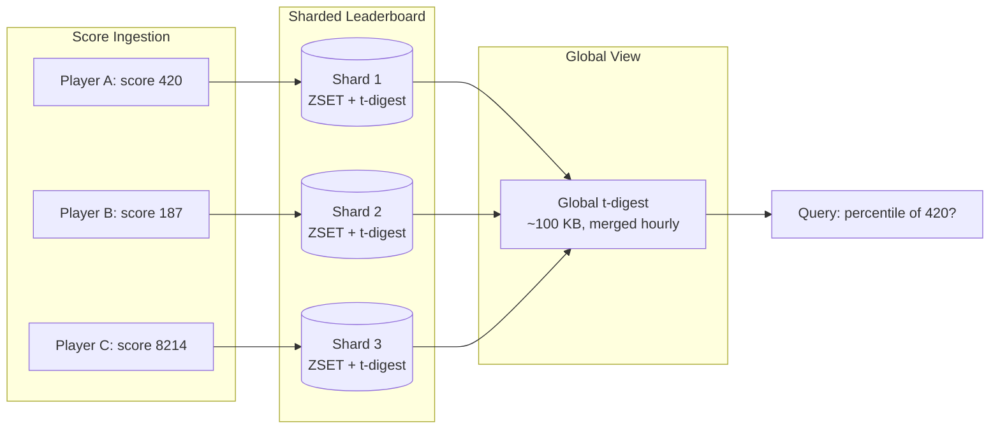
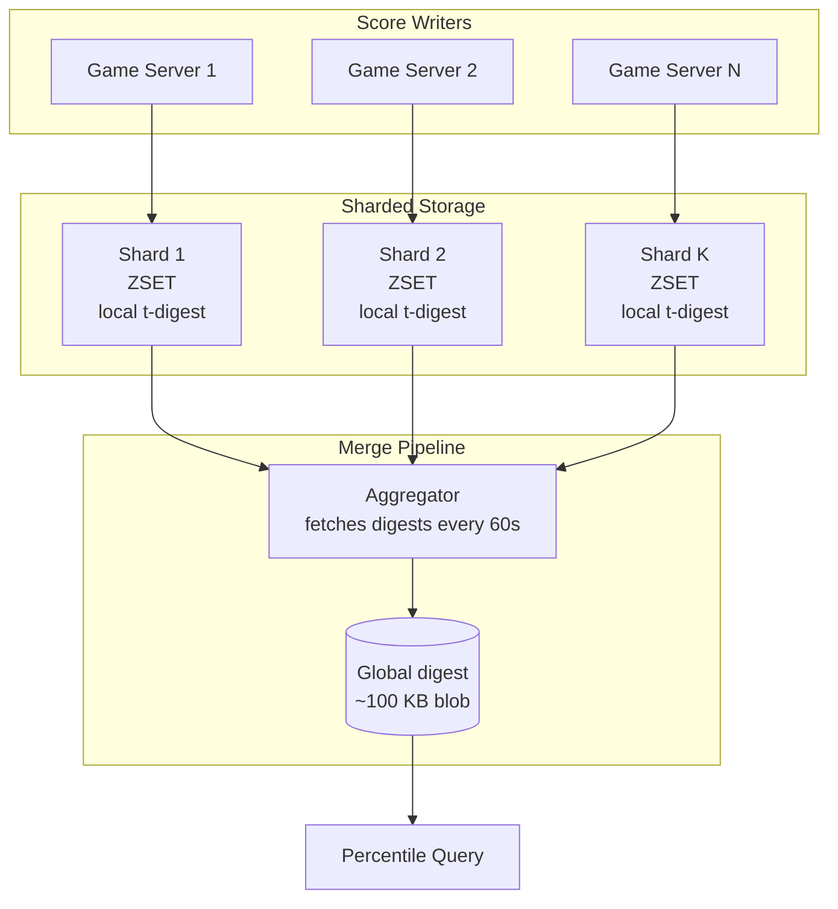

# Percentile Rankings via t-digest — Approximate Percentiles at Massive Scale

**Date:** 2026-05-01 | **Updated:** 2026-05-01
**Tags:** `system-design` `deep-dive` `leaderboard` `t-digest` `sketches`

> **Parent case study:** [Design a Real-Time Leaderboard](../design-realtime-leaderboard.md). This deep-dive expands "Percentile Rankings via t-digest".

## Table of Contents

- [Summary](#summary)
- [Overview](#overview)
- [The Percentile-Rank Problem](#the-percentile-rank-problem)
- [Why Exact ZREVRANK Is Cheap For Rank, Expensive For Distribution](#why-exact-zrevrank-is-cheap-for-rank-expensive-for-distribution)
- [The Family of Quantile Sketches](#the-family-of-quantile-sketches)
- [t-digest Structure: Clusters of (Mean, Weight)](#t-digest-structure-clusters-of-mean-weight)
- [Why Higher Resolution at the Extremes](#why-higher-resolution-at-the-extremes)
- [The Mergeable Property — Combine Across Shards and Windows](#the-mergeable-property--combine-across-shards-and-windows)
- [t-digest Trade-offs: Memory, Error, Determinism](#t-digest-trade-offs-memory-error-determinism)
- [HDR Histogram — Fixed Buckets With Logarithmic Spacing](#hdr-histogram--fixed-buckets-with-logarithmic-spacing)
- [KLL Sketch — Uniform Error Guarantees](#kll-sketch--uniform-error-guarantees)
- [Apache DataSketches and Long-Term Mergeability](#apache-datasketches-and-long-term-mergeability)
- [Implementation Pattern: Per-Shard Digest, Periodic Global Merge](#implementation-pattern-per-shard-digest-periodic-global-merge)
- [Streaming Updates and Window Composition](#streaming-updates-and-window-composition)
- [Storage: Serialize the Digest as a Blob Alongside the ZSET](#storage-serialize-the-digest-as-a-blob-alongside-the-zset)
- [Worked Example: 100M Players, "What Percentile is Score 420?"](#worked-example-100m-players-what-percentile-is-score-420)
- [Comparison to Exact Methods](#comparison-to-exact-methods)
- [Anti-Patterns](#anti-patterns)
- [Related](#related)
- [References](#references)

## Summary

Telling a player "you ranked 1,247,318th" is technically correct and emotionally meaningless. Telling them "you're in the top 3%" is the framing every leaderboard product wants. Computing that percentile from a 100-million-player ZSET via `ZREVRANK` plus `ZCARD` works, but the moment you need distribution-shaped queries — "what's the 90th percentile score in Bronze tier?", "draw a histogram of the last hour", "for a score of 420, what fraction of players did worse?" — the per-query cost becomes catastrophic if you compute it from raw data each time. The fix is a **quantile sketch**: a bounded-memory data structure that absorbs every score on the way in and answers percentile queries in microseconds with bounded error. This deep-dive covers **t-digest** (Dunning 2019) as the primary tool, with **HDR Histogram**, **KLL**, and **GK** as alternatives for specific shapes of workload. The two properties that make sketches indispensable for leaderboards are **mergeability** — a per-shard digest can be combined into a global digest losslessly with respect to error guarantees — and **bounded memory** — ~100 KB per digest holds 100 million scores with ~0.01% error at the extremes (where players actually live). The result: a 100M-player leaderboard can answer "what percentile is this score" in under 50 microseconds with error well under one rank position at the tails, using a few hundred kilobytes of state per scope (per-region, per-tier, per-window).

## Overview

The parent case study (`../design-realtime-leaderboard.md`) introduces the leaderboard core: a sharded sorted-set keyed by score, supporting top-N queries via `ZREVRANGE` and exact rank lookups via `ZREVRANK`. That solves the "where am I" question. This doc opens the **distribution shape** question.

The questions answered here:

1. **Why is exact percentile computation a different problem from exact rank lookup?** They feel similar; they have very different cost profiles at scale.
2. **What is a quantile sketch, and which one should you pick?** t-digest, HDR Histogram, KLL, GK — each optimizes a different axis.
3. **How does t-digest's structure achieve high resolution at the tails — exactly where leaderboard percentile queries cluster?** Most players don't ask "what's my 50th percentile rank"; they ask "am I in the top 1%".
4. **What is the mergeable property, and why is it the operational cornerstone of sharded leaderboards?** You shard for write throughput; you must un-shard for global percentiles.
5. **How do you stitch streaming updates and rolling windows into the same sketch?** A daily digest, a weekly digest, a season digest — composed without re-reading raw events.
6. **When is t-digest the wrong choice?** Bounded score ranges, fixed bucketing requirements, hard worst-case error needs.
7. **Worked example:** 100 million players, score `420` arrives — what's the percentile, with what error, at what cost?



The general performance discipline (latency budgets, tail-aware SLOs, the difference between p50 and p99) lives in [`../../../performance-observability/performance-budgets.md`](../../../performance-observability/performance-budgets.md). The Redis sorted-set internals that exact-rank queries depend on live in [`./redis-sorted-set-internals.md`](./redis-sorted-set-internals.md). Sharding mechanics — how scores are partitioned and how cross-shard rank is reconciled — live in [`./sharded-score-aggregation.md`](./sharded-score-aggregation.md). This doc is specifically about the bounded-memory summary that lets you say "top 3%" without scanning anyone.

## The Percentile-Rank Problem

A leaderboard surface has two near-twin queries:

| Query | Phrasing | Complexity (exact) |
|---|---|---|
| Rank | "What place am I in?" | O(log N) per query via skip-list / B-tree (`ZREVRANK`) |
| Percentile-rank | "What fraction of players did worse than me?" | Exact: O(log N); but **per-query** if you want freshness |
| Percentile-value | "What score is at the 99th percentile?" | Exact: O(log N) via index-into-sorted (`ZREVRANGE k k`) |
| Distribution | "Draw me a histogram of all scores" | Exact: O(N), prohibitive at 100M |

The first three look cheap individually. The catch:

1. **Percentile-rank is a hot query.** Every player's leaderboard page wants "you're in the top X%". At 1M DAU and 50 leaderboard views per session, that is tens of millions of percentile queries per day.
2. **Percentile queries scale with views, not with players.** Even if you compute exact rank cheaply, you pay it on every view.
3. **Distribution queries are common in admin and analytics surfaces.** Game designers want to see the score curve — that's an O(N) scan if you do it from raw data.
4. **Cross-cut queries explode.** "What's the 90th percentile in Bronze tier in EU during the last 6 hours" — you can't slice the live ZSET that way without per-slice state.

Exact rank for an individual player is fine. Exact distribution for everyone is not. The right shape is: keep the ZSET for "where am I" rank questions; keep a sketch for "what does the distribution look like" questions. The sketch absorbs every score on ingestion and answers all distribution-shaped queries in constant time with bounded error.

## Why Exact ZREVRANK Is Cheap For Rank, Expensive For Distribution

Redis sorted sets implement `ZREVRANK player_id` as an indexed walk in a skip list augmented with rank counts. Cost: O(log N), measured in microseconds at 100M elements. The deep details live in [`./redis-sorted-set-internals.md`](./redis-sorted-set-internals.md); for percentile purposes, the relevant facts are:

- `ZREVRANK` returns an integer rank position (e.g., `1247317`).
- `ZCARD` returns total cardinality.
- Percentile-rank is then `1 - rank / cardinality`.

At first glance: problem solved. Two O(log N) calls, divide, return.

The hidden costs:

1. **Sharding breaks it.** When the leaderboard is sharded across, say, 128 Redis instances by player-ID hash, no single shard knows the global rank. You either fan out to all shards (128 × O(log N) = milliseconds, plus cross-shard rank reconciliation) or maintain a separate global rank index, which has its own scaling story (see [`./sharded-score-aggregation.md`](./sharded-score-aggregation.md)).
2. **Distribution-shape queries can't be answered.** "Histogram of scores in 100 buckets" requires `ZRANGE 0 -1 WITHSCORES` — a full scan of all 100M entries. Not acceptable.
3. **Time-windowed queries multiply state.** Want last-hour percentiles? You need a hour-of-events ZSET in addition to the all-time one (see [`./rolling-windows.md`](./rolling-windows.md)). And the percentile of "score 420 in the last hour" is a separate query against that ZSET.
4. **Cross-tier slices need separate sets.** "Top 1% in Bronze" requires a Bronze-only ZSET. Multiply by tiers, regions, modes, time windows, and you have hundreds of ZSETs.

Each ZSET has cost: memory (skip-list overhead is roughly 40–60 bytes per entry, so 100M × 50 B ≈ 5 GB per dimension), CPU on every insert, and ongoing replication traffic. A sketch costs ~100 KB per dimension. The economics flip hard the moment you have more than a couple of slice dimensions.

The pragmatic split:

- **Use `ZREVRANK`** when the question is "what is the exact rank of a specific player on a specific leaderboard." A single lookup, a single number, freshness in seconds.
- **Use a sketch** when the question is "what does the distribution look like" or "what fraction of players did worse" or "what score corresponds to the 99th percentile" — anything that's a function of the full distribution rather than one player.

## The Family of Quantile Sketches

Quantile sketches are bounded-memory data structures that approximate the cumulative distribution function (CDF) of a stream of values. The key axes:

| Sketch | Memory | Error | Mergeable | Strength |
|---|---|---|---|---|
| **t-digest** | ~100 KB (compression=100), tunable | Higher accuracy at tails (~0.01% near 0/1, ~1% at median) | Yes | Tail accuracy, leaderboard-shaped queries |
| **HDR Histogram** | Fixed (configurable), e.g., 100 KB for 3 sig-fig precision over 24 hours of nanoseconds | Bounded relative error per bucket (logarithmic spacing) | Yes (via `add()` of recorded values) | Latency monitoring, fixed numerical range |
| **KLL** | Tunable (k parameter); ~5 KB at k=200 for ~1.65% error | Uniform: same error everywhere on the CDF | Yes | Provable space-error trade-offs, theory-backed |
| **GK (Greenwald-Khanna)** | Tunable; O((1/ε) log(εN)) entries | ε-approximate uniformly | Yes (with caveats) | First mergeable quantile sketch; foundational |
| **Q-digest** | Tunable | Bounded relative error | Yes | Power-of-2 ranges; sensor networks |

**For leaderboards specifically, t-digest wins on most axes** because:

- Leaderboard queries cluster at the tails (1%, 5%, 99%, 99.9%) — exactly where t-digest puts more clusters.
- Mergeability is operationally trivial.
- Score ranges are unbounded (a new high score can always appear), and t-digest doesn't need range bounds in advance, unlike HDR Histogram which needs `lowestDiscernibleValue` and `highestTrackableValue` at construction time.
- Memory is configurable via the `compression` parameter (typical δ=100 → ~100 KB digest).

HDR Histogram is excellent when the value range is known in advance and bounded — the canonical use is latency in nanoseconds over a known max. For score data with unbounded upper range, HDR's fixed buckets either waste memory (sized for the worst case) or cap silently at the max (loss of data). For leaderboards, t-digest is the better default; HDR is the right call for latency monitoring of the leaderboard *service* itself.

KLL is the academically rigorous choice: provable space-error guarantees with uniform error across the CDF. If you need a defensible error bound everywhere (e.g., for SLA reporting) and not just at the tails, KLL is the right tool. For leaderboards where users care about "top 1%" far more than "median", t-digest's tail-skewed accuracy is more aligned with what users notice.

GK is the historic foundation; in practice you reach for KLL or t-digest, both of which improve on it.

## t-digest Structure: Clusters of (Mean, Weight)

A t-digest is a list of **centroids**, each a pair `(mean, weight)`. A centroid summarizes a contiguous range of values by their mean and the count of values they represent.

```text
t-digest = [
  (mean=87.2,   weight=3),     # 3 values clustered near 87.2 (extreme low)
  (mean=104.5,  weight=12),    # next cluster
  (mean=240.1,  weight=87),
  (mean=512.7,  weight=2104),  # near the median, large cluster
  (mean=890.0,  weight=1872),
  ...
  (mean=14820,  weight=14),    # extreme high tail
  (mean=18007,  weight=2),     # extreme high
]
```

The list is sorted by mean. Centroids near the tails (small or large quantiles) hold few values each — the structure preserves resolution there. Centroids near the median hold many values — error is higher in absolute terms there, but users care less.

The total weight sums to the count of values seen. The CDF at value `x` is approximated by interpolating across centroids: find the centroid containing `x`, read its position in the cumulative weight, and convert to a quantile.

The constraint that gives t-digest its name: each centroid's weight is bounded by a function `k(q)` where `q` is the quantile position of the centroid. At the tails (q near 0 or 1), the weight bound is small — so centroids must be small clusters. Near the median, the bound is large — centroids may absorb many values.

```text
weight(c) ≤ 4 · n · δ · q · (1 − q)

where n = total values, δ = compression parameter (default ~100),
      q = quantile position of c
```

When `q ≈ 0.5`, `q · (1−q) = 0.25`, so weight bound is `n · δ`. When `q = 0.01`, bound is `n · δ · 0.0099`, ~25× smaller. This is the structural rule that delivers tail accuracy.

```rust
// t-digest Centroid (sketch — production code uses a more compact layout)
#[derive(Clone, Copy)]
struct Centroid {
    mean: f64,
    weight: f64,
}

pub struct TDigest {
    centroids: Vec<Centroid>,    // sorted by mean
    compression: f64,             // δ — typical 100
    total_weight: f64,
    // Buffer for incoming points before compression
    buffer: Vec<Centroid>,
    buffer_capacity: usize,
}
```

Adding a value `x` with weight `w`:

```rust
impl TDigest {
    pub fn add(&mut self, x: f64, w: f64) {
        // 1. Append to the unsorted buffer (cheap, amortizes the merge cost)
        self.buffer.push(Centroid { mean: x, weight: w });

        // 2. If buffer is full, merge it into the main list
        if self.buffer.len() >= self.buffer_capacity {
            self.merge_buffer();
        }
    }

    fn merge_buffer(&mut self) {
        // Combine buffer + existing centroids, sort by mean
        let mut combined: Vec<Centroid> = self.centroids
            .iter()
            .chain(self.buffer.iter())
            .copied()
            .collect();
        combined.sort_by(|a, b| a.mean.partial_cmp(&b.mean).unwrap());

        // Walk through, merging adjacent centroids whose combined weight
        // would still respect the k(q) bound at their cumulative quantile
        let n = combined.iter().map(|c| c.weight).sum::<f64>();
        let mut out: Vec<Centroid> = Vec::with_capacity(combined.len());
        let mut cum_weight = 0.0;

        for c in combined {
            if let Some(last) = out.last_mut() {
                let q_left  = cum_weight / n;
                let q_right = (cum_weight + last.weight + c.weight) / n;
                let q_mid   = (q_left + q_right) / 2.0;
                let bound   = 4.0 * n * q_mid * (1.0 - q_mid) / self.compression;

                if last.weight + c.weight <= bound {
                    // Safe to merge: combined weight respects the k(q) constraint
                    let new_w = last.weight + c.weight;
                    last.mean = (last.mean * last.weight + c.mean * c.weight) / new_w;
                    last.weight = new_w;
                    continue;
                }
            }
            cum_weight += out.last().map(|c| c.weight).unwrap_or(0.0);
            out.push(c);
        }

        self.centroids = out;
        self.buffer.clear();
        self.total_weight = n;
    }
}
```

The buffer is the practical optimization: every individual `add` is O(1) amortized; the `merge_buffer` work happens infrequently and processes many points at once, allowing for cache-friendly sequential access.

## Why Higher Resolution at the Extremes

The leaderboard usability story:

- A user at the **50th percentile** doesn't ask, "exactly where am I?" They see "you're in the middle of the pack" and move on.
- A user at the **99th percentile** very much asks, "exactly where am I?" The difference between "top 1%" and "top 0.5%" is a competitive identity statement.
- A user at the **0.1th percentile** wants to know "how far am I from the next milestone?"

The structural choice in t-digest — `weight ≤ 4 · n · δ · q · (1−q)` — is exactly the shape that gives the user-facing answer the right resolution. At `q = 0.001` (top 0.1%), the bound is roughly `0.004 · n · δ`. At `n = 100M, δ = 100`, that's `weight ≤ 40,000` — meaning a centroid at the top 0.1% holds at most 40K players. The error in computing percentile rank for a player at this position is at most the half-width of that centroid in quantile space: roughly `0.0002` or 0.02%. So "you're in the top 0.1%" is accurate to ±0.02% — the answer doesn't flip between "top 0.1%" and "top 1%" due to sketch error.

At the median, the same player count and δ gives `weight ≤ n · δ = 10^10` — practically unbounded — so a single centroid can hold millions of values. The error in absolute quantile space at the median is ~1%, but no leaderboard user notices the difference between "55th percentile" and "56th percentile."

This trade is exactly what HDR Histogram does in a different shape: log-spaced buckets give relative error guarantees per value. t-digest gives them on the *quantile* axis instead. For leaderboards, the quantile axis is what users see; for latency monitoring, the value axis is what dashboards display. The right tool for the right surface.

## The Mergeable Property — Combine Across Shards and Windows

A digest is **mergeable** if `merge(digest_a, digest_b)` produces a digest equivalent to one constructed from the union of inputs that produced `a` and `b` — equivalent in the sense that error guarantees are preserved (not necessarily byte-identical). For sharded systems and time-windowed analytics, mergeability is non-negotiable.

```rust
impl TDigest {
    pub fn merge(&mut self, other: &TDigest) {
        // Combine centroids from both digests
        let mut combined: Vec<Centroid> = self.centroids
            .iter()
            .chain(other.centroids.iter())
            .copied()
            .collect();
        combined.sort_by(|a, b| a.mean.partial_cmp(&b.mean).unwrap());

        // Apply the same compression pass as merge_buffer
        let n = combined.iter().map(|c| c.weight).sum::<f64>();
        let mut out: Vec<Centroid> = Vec::with_capacity(combined.len());
        let mut cum_weight = 0.0;

        for c in combined {
            if let Some(last) = out.last_mut() {
                let q_left  = cum_weight / n;
                let q_right = (cum_weight + last.weight + c.weight) / n;
                let q_mid   = (q_left + q_right) / 2.0;
                let bound   = 4.0 * n * q_mid * (1.0 - q_mid) / self.compression;

                if last.weight + c.weight <= bound {
                    let new_w = last.weight + c.weight;
                    last.mean = (last.mean * last.weight + c.mean * c.weight) / new_w;
                    last.weight = new_w;
                    continue;
                }
            }
            cum_weight += out.last().map(|c| c.weight).unwrap_or(0.0);
            out.push(c);
        }

        self.centroids = out;
        self.total_weight = n;
        self.buffer.clear();
    }
}
```

The merge is associative and commutative: `merge(merge(a, b), c) == merge(a, merge(b, c))`. This is the property that lets you build a tree of merges:

- 128 per-shard digests merge pairwise into 64.
- 64 merge into 32.
- ... down to 1 global digest.

Each level's work is parallelizable. The total bytes handled equal the sum of all per-shard digest sizes (~12 MB at 128 × 100 KB), processed in O(C log C) where C is the total centroid count across all inputs. At δ=100, each digest has roughly 100–200 centroids; the global merge handles ~25K centroids in a single pass — sub-millisecond on modern hardware.

The same property lets you compose **time windows**:

- Per-minute digest produced every minute.
- 60 minute-digests merge to a per-hour digest.
- 24 hour-digests merge to a per-day digest.
- 7 day-digests merge to a per-week digest.

To answer "percentile in the last 6 hours", merge the last 6 hour-digests on the fly — sub-millisecond. To answer "percentile in the last 7 days", merge the 7 day-digests. Storage cost is minute × hour × day digest snapshots, each ~100 KB — totalling well under 1 GB for a year of minute-resolution rolling data per leaderboard scope.

The intersection of sharding and windowing is a 2-D grid: 128 shards × 60 minutes per hour = 7,680 digests per hour. Merge along whichever axis the query asks for first. This is the operational pattern explored in detail in [`./rolling-windows.md`](./rolling-windows.md).

## t-digest Trade-offs: Memory, Error, Determinism

| Axis | t-digest behavior |
|---|---|
| **Memory** | Bounded by `O(δ)` centroids; typical δ=100 → 100–200 centroids → ~3 KB raw, ~8–12 KB serialized with overhead. The "~100 KB" figure quoted in practice covers δ=1000 (very high accuracy) or lazy-merge implementations that hold a larger buffer. |
| **Error at tails** | ~0.01% at q ∈ {0.001, 0.999} for δ=100. Tighten with higher δ (linearly more memory). |
| **Error at median** | ~1% for δ=100. This is by design — see "higher resolution at extremes." |
| **Determinism** | Output depends on insertion order in some implementations (the original 2013 paper's k-means variant). The 2019 merging variant (Dunning) is more deterministic but still order-sensitive at the boundaries. For exact replay determinism, batch-insert sorted; for streaming, accept the small order sensitivity. |
| **Floating-point sensitivity** | Centroid means are doubles; comparisons across machines should agree given the same insertion order and IEEE 754 compliance. Rare drift on platforms with non-standard FPU modes. |
| **Update cost** | O(1) amortized per `add` thanks to buffering. Per `merge_buffer` is O(B + C) where B is buffer size and C is centroid count. |
| **Query cost** | O(log C) for percentile lookup via binary search across centroids. C ≈ 200 → ~8 comparisons. |

The δ parameter is the dial:

| δ | Memory (rough) | Tail error (q=0.001) | Use case |
|---|---|---|---|
| 50 | ~2 KB | ~0.04% | Coarse dashboards |
| 100 | ~5 KB | ~0.01% | Standard leaderboards |
| 200 | ~10 KB | ~0.005% | High-stakes esports |
| 500 | ~25 KB | ~0.001% | Audit-grade |
| 1000 | ~50 KB | ~0.0005% | Reference / overkill |

Pick δ=100 unless you have a specific reason. Most production deployments converge there.

## HDR Histogram — Fixed Buckets With Logarithmic Spacing

HDR Histogram (Gil Tene, 2012+) approaches the same problem from a different angle: instead of adaptive centroids, use a fixed array of buckets with logarithmic spacing.

```text
HDR Histogram parameters:
- lowestDiscernibleValue (e.g., 1 ns)
- highestTrackableValue  (e.g., 1 hour in ns)
- numberOfSignificantValueDigits (1–5)
```

Internally, the value range is divided into "subbuckets" (linear within a power-of-2 range) and "buckets" (powers of 2). For 3 significant digits of precision and 1ns–1hr range, the structure has about 76,000 counters totalling ~600 KB. Each counter is a recorded count — the histogram is exact for the buckets, with bucket-internal precision determined by the significant-digits parameter.

```text
Bucket layout (3 sig digits):
[0..2047]            linear, step 1
[2048..4095]         linear, step 2
[4096..8191]         linear, step 4
[8192..16383]        linear, step 8
...
```

A value of 5,432 lands in the bucket `[5432, 5436)` — error bounded by ±2 (one part in ~2700, ~0.04%). The relative error is bounded uniformly across the value range — that's the HDR property.

```java
// Java HDR Histogram usage
Histogram h = new Histogram(1L, TimeUnit.HOURS.toNanos(1), 3);
h.recordValue(latencyNs);

double p99    = h.getValueAtPercentile(99.0);
double p999   = h.getValueAtPercentile(99.9);
long   total  = h.getTotalCount();
```

**Strengths for leaderboards:**
- Fully deterministic — same inputs in any order produce the same histogram.
- Mergeable (`add(otherHistogram)`).
- Very fast: each record is array indexing + counter increment.

**Weaknesses for leaderboards:**
- Requires bounded value range. A new high score that exceeds `highestTrackableValue` is silently capped (or recorded as an error). For game scores that can grow unboundedly (e.g., infinite-runner high scores), you must size for worst case.
- Error is uniform per *value*, not per *quantile*. The 99.9th percentile is no more accurate than the median, and at the tails of the value distribution, where few players sit, the bucket is mostly empty.
- Memory cost is fixed regardless of population size — fine at 100M, wasteful at 100K.

For latency monitoring of the leaderboard *service* (sub-millisecond responses, known max bounds), HDR is the right call. For score distribution itself, t-digest is usually better.

## KLL Sketch — Uniform Error Guarantees

KLL (Karnin, Lang, Liberty 2016) provides a quantile sketch with **uniform error**: the error at any quantile q is bounded by ε, independent of q. Memory is O((1/ε) · log²(εN)), so a sketch with ε=0.01 (1% error everywhere) at N=10^9 fits in a few KB.

KLL works by maintaining log-count buffers at increasing levels, each holding a random sample at that resolution. Compaction merges adjacent levels with random retention.

```text
KLL structure (sketch):
- Level 0: latest values (no compaction yet)
- Level 1: half-sampled from level 0
- Level 2: half-sampled from level 1
- ...
```

KLL is the academically rigorous choice when you need a defensible error bound *everywhere* on the CDF. If a contract says "report 25th, 50th, 75th, 99th percentile to within 1%", KLL is what you reach for — t-digest will give you better than 1% at q=99 but possibly worse than 1% at q=50 depending on δ.

KLL is mergeable. Apache DataSketches ships a KLL implementation; Druid uses it for approximate quantile aggregations.

Trade-off vs. t-digest:

| | t-digest | KLL |
|---|---|---|
| Tail error | Excellent (~0.01% at extremes) | Uniform (matches median) |
| Median error | Modest (~1% at δ=100) | Uniform (~1% at ε=0.01) |
| Memory | ~5–25 KB typical | ~5 KB at ε=0.01 |
| Theoretical guarantees | Empirical | Provable bounds |
| Deterministic | Order-sensitive | Order-sensitive (random sampling) |

For leaderboard percentile rank, t-digest is the standard answer. For "I need a provable bound everywhere", switch to KLL.

## Apache DataSketches and Long-Term Mergeability

Apache DataSketches (originally Yahoo) is a library of mergeable sketches with consistent serialization formats and long-term backward-compatibility commitments. It includes:

- **KLL** for quantiles
- **HLL** for cardinality
- **Theta sketches** for set operations (union, intersection, difference)
- **Frequent items** for top-K (related: [`../../../data-structures/count-min-sketch-and-top-k.md`](../../../data-structures/count-min-sketch-and-top-k.md))
- **CPC** for cardinality at extreme scale

The DataSketches commitment is critical for leaderboards: a digest serialized in 2024 must still merge correctly with a digest produced in 2026, even if the library has been updated. This stability lets you store year-old digests and combine them with current ones for season-over-season analytics without re-processing raw events.

The original t-digest reference implementation (Dunning's GitHub) does not have the same long-term stability guarantee. For systems with long retention, prefer a wrapped or ported implementation that pins the format. Several JVM ecosystems use the `MergingDigest` variant from the reference repo, which is reasonably stable but not contractually so.

For polyglot stacks, the practical pattern is:

1. Pick one library per language (DataSketches for JVM, `tdigest` crate for Rust, `tdigest` package for Go, `tdigest` Python library).
2. Standardize on a single serialization format (typically the one the JVM library produces).
3. Test cross-language merges in CI.
4. Pin versions and document the format chosen.

## Implementation Pattern: Per-Shard Digest, Periodic Global Merge

The standard topology:



Operational characteristics:

1. **Writer path:** game server writes a score → router shards by player ID → shard appends to ZSET and to local t-digest. ZSET write is the canonical record; t-digest is a derived summary.
2. **Aggregator:** a single process (or pair, for HA) wakes every 60 seconds, requests `{player_id_hash_range, t-digest serialization}` from each shard, merges into a global digest, writes the merged digest to a key like `leaderboard:global:digest:v1`.
3. **Reader path:** percentile query reads the global digest blob (~100 KB), deserializes (sub-millisecond), interpolates the percentile (microseconds). No per-query communication with shards.
4. **Staleness:** the global digest is up to 60 seconds stale. For leaderboard surfaces this is invisible; for forensic queries it's documented.

Why per-shard local digests and a separate aggregator, rather than each query merging on demand?

- **Read path latency.** Fanning out to 128 shards on every query is milliseconds and unreliable (one slow shard → tail latency). One blob read is consistent.
- **Aggregator cost amortization.** Merging 128 digests once per minute = ~17M merges per year. Doing it per query at 1M QPS = 1M × 128 × QPS-per-second = order-of-magnitude more work.
- **Cache friendliness.** The global digest sits in Redis or memcached; many readers read the same blob. With per-query fan-out, the cache hit rate is zero.

## Streaming Updates and Window Composition

Beyond per-shard merges, the same mergeability gives **time-window composition for free**:

```text
Per-minute digests
─────────────────────────────────────────────
M01  M02  M03  M04 ...  M58  M59  M60   ← every minute
  \    \    \    \         \    \    \
   ────────── merge ──────────
              │
          Per-hour digest
─────────────────────────────────────────────
H01  H02  H03  H04 ...  H22  H23  H24   ← every hour
  \    \    \    \         \    \    \
   ────────── merge ──────────
              │
           Per-day digest
─────────────────────────────────────────────
D01  D02  D03 ...  D29  D30  D31         ← every day
```

Storage:

- 60 minute-digests per hour × ~10 KB each = 600 KB per hour
- 24 hour-digests per day × ~10 KB = 240 KB per day
- 365 day-digests × ~10 KB = 3.6 MB per year

Total raw digest storage at minute resolution for one year per leaderboard scope: ~10 MB. Trivially cheap.

Queries over arbitrary windows compose the appropriate granularity:

- "Last 5 minutes" → merge 5 minute-digests
- "Last 6 hours" → merge 6 hour-digests
- "Last 30 days" → merge 30 day-digests
- "Last week excluding today" → merge 6 day-digests

This is the structural pattern that makes "rolling leaderboards" tractable. See [`./rolling-windows.md`](./rolling-windows.md) for the broader topic, including how the ZSETs themselves are windowed (which is much more expensive than windowing digests).

## Storage: Serialize the Digest as a Blob Alongside the ZSET

In practice, store the digest as a binary blob in Redis (or whatever the leaderboard store is):

```text
Key                                Value
───────────────────────────────────────────────────────────────
leaderboard:global:zset            (sorted set of scores)
leaderboard:global:digest:current  (binary t-digest, ~100 KB)
leaderboard:global:digest:hour:24  (binary t-digest, last 24h)
leaderboard:global:digest:day:30   (binary t-digest, last 30d)
leaderboard:global:digest:season   (binary t-digest, current season)

leaderboard:bronze:zset            (sorted set, bronze tier only)
leaderboard:bronze:digest:current  (binary t-digest, bronze)
leaderboard:silver:zset            ...
```

The serialization is typically 6–12 bytes per centroid (mean: 8B double, weight: 4B float or compact varint), plus a few bytes of header. At δ=100 → ~150 centroids → ~1.5 KB on the wire.

Compression: the centroids tend to cluster, and a Zstandard pass shrinks the blob by ~40%. Whether it's worth doing depends on bandwidth costs. Most deployments don't bother — the raw blob is already small.

For Redis specifically: store as a `STRING` value, not as a Redis-native data structure. Redis sees it as an opaque blob; the application handles serialization/deserialization. `MGET` to fetch multiple digest blobs in one round trip when answering window queries.

Cache the deserialized digest in the application layer (e.g., 5-second TTL). The deserialized form (a `Vec<Centroid>`) is what the percentile-query function operates on; deserializing on every query is wasted CPU.

## Worked Example: 100M Players, "What Percentile is Score 420?"

Scenario: a casual mobile game with 100 million lifetime players. Score range from 0 (didn't play long) to ~50,000 (top players who grind). The score distribution is right-skewed:

```text
Cumulative distribution (illustrative):
  score   percentile
       0   0.2%      (didn't even pass tutorial)
      50  10%
     150  30%
     300  60%
     420  72%        ← our query point
     800  85%
   1,500  92%
   3,000  96%
   8,000  99%
  20,000  99.9%
  45,000  99.99%
```

A new score `420` arrives. The product question: "what percentile?"

**With exact ZREVRANK:**

- `ZADD leaderboard:global 420 player_xyz` → O(log N) ≈ ~50 µs at 100M
- `ZREVRANK leaderboard:global player_xyz` → returns 28,000,000 (rank starting from 0, descending by score)
- `ZCARD leaderboard:global` → 100,000,000
- Percentile = 1 − 28,000,000 / 100,000,000 = 72.0%

Total cost: ~150 µs, includes a write. Sharded: this requires the global ZSET (or cross-shard rank reconciliation). Distribution-shape queries impossible without scanning.

**With t-digest:**

- Global t-digest already contains all 100M scores, δ=100 → ~150 centroids, ~5 KB serialized.
- Deserialize from blob cache (already in memory): 0 µs.
- `digest.cdf(420)` → binary search across 150 centroids:

```rust
impl TDigest {
    pub fn cdf(&self, x: f64) -> f64 {
        // Returns approximate F(x) = P[score <= x] in [0, 1]
        if self.centroids.is_empty() {
            return f64::NAN;
        }
        if x < self.centroids[0].mean { return 0.0; }
        if x >= self.centroids.last().unwrap().mean { return 1.0; }

        // Find the centroid pair (c_i, c_{i+1}) bracketing x
        let idx = self.centroids
            .binary_search_by(|c| c.mean.partial_cmp(&x).unwrap())
            .unwrap_or_else(|i| i);

        let lo = &self.centroids[idx.saturating_sub(1)];
        let hi = &self.centroids[idx.min(self.centroids.len() - 1)];

        // Cumulative weight up to and including lo
        let cum: f64 = self.centroids[..idx].iter().map(|c| c.weight).sum();
        let cum_lo = cum + lo.weight / 2.0;
        let cum_hi = cum + lo.weight + hi.weight / 2.0;

        // Linear interpolation between cum_lo and cum_hi
        let t = (x - lo.mean) / (hi.mean - lo.mean).max(f64::EPSILON);
        let cum_x = cum_lo + t * (cum_hi - cum_lo);

        cum_x / self.total_weight
    }

    pub fn percentile_rank(&self, x: f64) -> f64 {
        // Fraction of scores worse than x — useful for "you beat X% of players"
        self.cdf(x)
    }
}
```

- Result: `cdf(420) ≈ 0.7203` → 72.03%
- "You beat 72% of players" → display as "you're in the top 28%."
- Total cost: ~10 µs (binary search + interpolation, all in CPU cache).
- Error at this quantile (q ≈ 0.72, mid-range): ~0.5% absolute → real percentile is between 71.5% and 72.5%. User sees "top 28%" — error doesn't change the user-visible message.

**Now flip to a tail query: score = 8,000.**

- True percentile ≈ 99.0%
- t-digest result: 99.005% (error ~0.005% at the tail)
- User sees "top 1%" — accurate; error is well below the resolution of the message.

**Distribution query: "draw the histogram of scores."**

- With ZSET only: `ZRANGE 0 -1 WITHSCORES` returns 100M entries. ~10 GB of data over the wire. Forbidden.
- With t-digest: walk the centroids, plot `(mean_i, weight_i)`. 150 points. Render in 1 ms. Done.

**Window query: "what's the 95th percentile in the last 6 hours?"**

- Fetch 6 hour-digests (6 × 10 KB = 60 KB).
- Merge: ~500 µs.
- `digest.quantile(0.95)` → returns a score value at the 95th percentile.
- Total cost: ~1 ms.

**Cost breakdown for the t-digest path (100M players):**

| Component | Memory | Latency |
|---|---|---|
| Per-shard digest (×128) | ~5 KB each = 640 KB | n/a (background) |
| Aggregator merge (per minute) | ~5 KB out | ~5 ms |
| Global digest (in-memory cache) | ~5 KB | n/a |
| Single percentile query | n/a | ~10 µs |
| Full distribution render | n/a | ~1 ms |
| Window merge (6 hours) | ~60 KB transient | ~1 ms |

That's the entire economy: kilobytes of state, microseconds of latency, arbitrary-shape queries.

## Comparison to Exact Methods

| Operation | Exact (ZREVRANK + ZCARD) | t-digest |
|---|---|---|
| Single-player rank | O(log N), ~50 µs | n/a (use ZREVRANK for rank) |
| Single-player percentile | O(log N), ~50 µs | O(log C), ~10 µs |
| Distribution histogram | O(N) — forbidden at 100M | O(C), ~1 ms |
| 99th percentile score | O(log N) via ZRANGE | O(log C), ~10 µs |
| Sharded global percentile | Cross-shard reconciliation, ms-scale | Pre-merged blob, ~10 µs |
| Time-windowed percentile | Separate ZSET per window — costly | Compose stored digests, ~1 ms |
| Memory per leaderboard scope | ~50 GB at 100M players (skip-list) | ~5 KB |
| Memory per (scope × window) | scope × window ZSETs — explodes | ~5 KB per window |
| Audit / replay determinism | Exact | Order-sensitive within ~ε |

The right hybrid:

- **Use ZREVRANK for "where am I"** — exact, the user wants their actual position.
- **Use t-digest for "what fraction of players did worse"** — user-facing percentile, distribution shape, windowed/cross-tier slices, all the things ZSET can't do at scale.

## Anti-Patterns

1. **Computing exact percentiles by sorting the full leaderboard.** A query handler that runs `ZRANGE 0 -1 WITHSCORES` and locally sorts — at 100M players this is 10 GB over the wire and seconds of CPU. Sometimes hidden in code as "we'll just iterate to find the position" — same cost. Use a sketch.
2. **Per-request reservoir sampling.** Maintaining a fixed-size random sample (say 10K elements) of the leaderboard per query and computing percentile from that. Sounds elegant; produces 1% standard error at the median and far worse at the tails. The whole point of t-digest is to give you better-than-reservoir-quality at the tails for the same memory.
3. **Raw histogram without log buckets.** "We'll bucket scores in 100 linear bins from 0 to max_score." Linear bucketing wastes resolution on the dense median and starves the tails — exactly opposite of what users care about. Use logarithmic spacing (HDR) or adaptive (t-digest).
4. **Storing every value forever and re-aggregating on read.** "We have all the raw scores in S3; for any percentile query, scan and aggregate." 100M values × N-month retention = many TB; query latency in minutes. Sketches are the indexing technology for this access pattern.
5. **Using HDR Histogram for unbounded score ranges.** A new game launches; high scores climb past `highestTrackableValue`; the histogram silently caps. Days later, someone notices percentiles look wrong. For unbounded score domains, prefer t-digest.
6. **Using t-digest where exact ZREVRANK is what you want.** "What rank am I exactly?" — a player wants to see "ranked 1,247,318th" and shouting "approximately 1.2M" is wrong. Use ZREVRANK for individual rank; sketches are for percentile *rank* and distribution.
7. **Recomputing the global digest on every query.** Querying the per-shard digests and merging on the fly per query is millisecond-scale and shard-tail-sensitive. Aggregate periodically; cache the global digest; serve queries from the cache.
8. **Forgetting that digests are order-sensitive.** Two systems consuming the same scores in different orders may produce very slightly different digests (within error bounds). For audit-grade determinism, batch and sort, or use HDR which is order-independent.
9. **Mixing digest formats across services.** Service A uses `tdunning/t-digest` JVM serialization; Service B uses Apache DataSketches KLL serialization. Merging across is impossible without a translation layer. Pick one library and one format per organization.
10. **Assuming sketches are free.** A digest with δ=100 has ~1% error at the median. If a use case truly requires exact median (rare for leaderboards, common for billing), a sketch is wrong. Know which queries can tolerate ε and which cannot.
11. **Sketching values that aren't continuous.** t-digest assumes a continuous distribution. Categorical or low-cardinality discrete data (e.g., "level reached: 1, 2, 3, ..., 50") is better summarized by exact counts per category — a histogram, not a sketch. Reach for t-digest when the value space is large and continuous.
12. **Treating sketch output as exact in downstream systems.** A dashboard shows "p99 = 42.3 ms" with no error bars; an alerting rule fires when p99 crosses 40. The threshold is at the edge of sketch error. Always document the error envelope, and set alert thresholds with margin (e.g., fire at 45, not 41).

## Related

- [`./redis-sorted-set-internals.md`](./redis-sorted-set-internals.md) — sibling deep-dive; how `ZREVRANK` works in O(log N) and why it's complementary, not competitive, with t-digest.
- [`./sharded-score-aggregation.md`](./sharded-score-aggregation.md) — sibling deep-dive; shard topology that produces the per-shard digests this doc merges into a global view.
- [`./rolling-windows.md`](./rolling-windows.md) — sibling deep-dive; window composition via mergeable digests is the specific application of t-digest to time-bounded queries.
- [`../design-realtime-leaderboard.md`](../design-realtime-leaderboard.md) — parent case study; this doc expands the *Percentile Rankings via t-digest* deep-dive subsection.
- [`../../../performance-observability/performance-budgets.md`](../../../performance-observability/performance-budgets.md) — foundation; tail-aware SLOs and the difference between p50 / p99 / p99.9 — the user-facing context that motivates tail-accurate sketches.
- [`../../../data-structures/count-min-sketch-and-top-k.md`](../../../data-structures/count-min-sketch-and-top-k.md) — foundation; the cousin sketches for cardinality and frequency, used in adjacent leaderboard surfaces (top-K events, unique-player counts).

## References

- Ted Dunning — [*Computing Extremely Accurate Quantiles Using t-Digests*](https://arxiv.org/abs/1902.04023) (2019). The definitive paper on the merging variant of t-digest, with formal error analysis and comparisons to Q-digest, GK, and KLL. Read this before implementing.
- t-digest reference implementation — [`tdunning/t-digest`](https://github.com/tdunning/t-digest). Java; the canonical source of truth for the algorithm. The `MergingDigest` class is the production-grade variant; `AVLTreeDigest` is older and slower.
- HDR Histogram — [hdrhistogram.org](http://hdrhistogram.org/). Project landing page; explains the bucket layout, motivation (latency monitoring), and design contracts.
- HDR Histogram Java — [`HdrHistogram/HdrHistogram`](https://github.com/HdrHistogram/HdrHistogram). Reference implementation; ports exist for many languages with stable serialization.
- Karnin, Lang, Liberty — [*Optimal Quantile Approximation in Streams*](https://arxiv.org/abs/1603.05346) (2016). The KLL paper; provides the theoretical lower bound for streaming quantile approximation and an algorithm that matches it.
- Greenwald & Khanna — [*Space-Efficient Online Computation of Quantile Summaries*](https://dl.acm.org/doi/10.1145/375663.375670) (SIGMOD 2001). The original GK sketch; foundational for the field. Read for historical context and as a reference for understanding KLL improvements.
- Apache DataSketches — [datasketches.apache.org](https://datasketches.apache.org/). Production-grade sketch library with long-term mergeable serialization commitments. Implementations for KLL, HLL, Theta, Frequent Items, CPC. The right choice when storing sketches across years.
- AWS CloudWatch Metric Streams — [*CloudWatch Metric Streams documentation*](https://docs.aws.amazon.com/AmazonCloudWatch/latest/monitoring/CloudWatch-Metric-Streams.html). AWS uses sketches under the hood for percentile metrics across cloud-scale telemetry; reading the user-facing docs gives a sense of what shape of API a sketch-backed metric system exposes.
