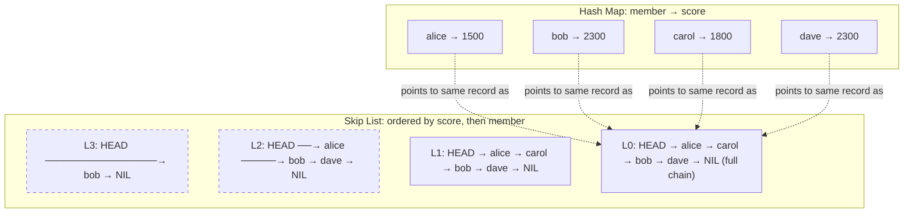

# Redis Sorted Set Internals — Skip Lists, ZADD, ZRANGE, and ZREVRANK

**Date:** 2026-05-01 | **Updated:** 2026-05-01
**Tags:** `system-design` `deep-dive` `redis` `data-structures` `leaderboard`

> **Parent case study:** [Design a Real-Time Leaderboard](../design-realtime-leaderboard.md). This deep-dive expands "Redis Sorted Set Internals".

## Table of Contents

- [Summary](#summary)
- [Overview](#overview)
- [Why a Sorted Set Is the Right Primitive for Leaderboards](#why-a-sorted-set-is-the-right-primitive-for-leaderboards)
- [Dual Encoding — Skip List Plus Hash Map](#dual-encoding--skip-list-plus-hash-map)
- [Listpack — The Small-Set Optimization](#listpack--the-small-set-optimization)
- [Skip List Structure — Probabilistic Levels and Forward Pointers](#skip-list-structure--probabilistic-levels-and-forward-pointers)
- [Span Counters — How ZRANK Stays O(log N)](#span-counters--how-zrank-stays-olog-n)
- [ZADD Semantics and the XX/NX/GT/LT/CH/INCR Flags](#zadd-semantics-and-the-xxnxgtltchincr-flags)
- [ZRANGE, ZRANGEBYSCORE, ZRANGEBYLEX — Three Orderings, Three Uses](#zrange-zrangebyscore-zrangebylex--three-orderings-three-uses)
- [ZRANK and ZREVRANK — "What Is My Position"](#zrank-and-zrevrank--what-is-my-position)
- [Atomic Score Deltas with ZADD INCR and ZINCRBY](#atomic-score-deltas-with-zadd-incr-and-zincrby)
- [ZUNIONSTORE and ZINTERSTORE — Combined Leaderboards](#zunionstore-and-zinterstore--combined-leaderboards)
- [Memory Cost — Pointer Overhead Per Entry](#memory-cost--pointer-overhead-per-entry)
- [Time Complexity Reference Table](#time-complexity-reference-table)
- [Streaming with ZSCAN for Backups](#streaming-with-zscan-for-backups)
- [Pitfalls — Sorted Set as Queue, Score Collisions, Unbounded Growth](#pitfalls--sorted-set-as-queue-score-collisions-unbounded-growth)
- [Worked Example — 1000 Players, ZADD then ZREVRANK](#worked-example--1000-players-zadd-then-zrevrank)
- [Anti-Patterns](#anti-patterns)
- [Related](#related)
- [References](#references)

## Summary

A Redis sorted set (`ZSET`) is the workhorse data structure for online leaderboards because every operation a leaderboard needs runs in `O(log N)` or better against a single in-memory data structure. Internally, a sorted set is **two structures kept in sync**: a hash map that maps `member → score` for `O(1)` score lookups, and a **skip list** ordered first by score then by member name for `O(log N)` insertion, deletion, and rank queries. For very small sets, Redis collapses both into a flat `listpack` (formerly `ziplist`) to save memory — but as soon as the set crosses `zset-max-listpack-entries` or any value exceeds `zset-max-listpack-value`, it converts to the dual structure permanently. The skip list itself, due to Pugh (1990), is a probabilistic balanced structure where each node is promoted to higher levels with geometric probability `p = 0.25` (Redis default), and each forward pointer carries a **span counter** that records how many nodes it skips over. Those span counters are the magic that makes `ZRANK`/`ZREVRANK` `O(log N)` — without them, computing a rank would require walking the bottom-level list. `ZADD` carries a small dialect of flags (`XX`/`NX`/`GT`/`LT`/`CH`/`INCR`) that turn the same primitive into "upsert," "insert-only," "high-water-mark," "low-water-mark," "count-changed," and "atomic-delta." The range family (`ZRANGE`, `ZRANGEBYSCORE`, `ZRANGEBYLEX`) covers three different orderings — by rank index, by score window, and by lexicographic prefix — each with its own use case in a real leaderboard system. This deep-dive walks the structure, the algorithms, the flag semantics, the memory cost, and the worked numerical example for a 1000-player board, ending with the anti-patterns that have burned production teams (sorted set as queue, unbounded windows, packing JSON into the score field).

## Overview

The parent case study (`../design-realtime-leaderboard.md`) names sorted sets as the central primitive — every score update is a `ZADD`, every leaderboard fetch is a `ZRANGE` or `ZREVRANGE`, every "what's my rank" call is a `ZREVRANK`. This deep-dive opens the data structure and walks the implementation from the bottom up.

The questions answered here:

1. **Why a sorted set and not a B-tree, a binary heap, or a sorted array?** Latency profile, mutation cost, and the rank-query property.
2. **What is the dual encoding actually doing?** Hash map plus skip list, kept in sync, both pointing into the same value records.
3. **How does the skip list achieve `O(log N)` rank queries?** Span counters on forward pointers — not just the pointer, but how far it jumps.
4. **What do the `ZADD` flags actually mean?** A flag-by-flag walk through `XX`, `NX`, `GT`, `LT`, `CH`, `INCR`.
5. **When do you use which `ZRANGE` variant?** Index range vs score window vs lex prefix.
6. **What is the memory cost?** Pointer overhead per entry; when listpack helps; when it doesn't.
7. **What goes wrong in production?** Score collisions, sorted set used as a queue, JSON-in-score, unbounded tournament boards.



The skip list is shown with four levels (typical for a small set). Each level is a singly-linked list. A search starts at the highest level (`L3`), follows forward pointers as long as they don't overshoot the target, then drops one level. At the bottom level (`L0`), every element is reachable.

The general skip-list theory lives in [`../../../data-structures/skip-lists.md`](../../../data-structures/skip-lists.md); this doc focuses on the Redis-specific shape and the leaderboard-relevant commands.

## Why a Sorted Set Is the Right Primitive for Leaderboards

A leaderboard needs four operations to be fast:

1. **Insert/update a score** — happens on every game event.
2. **Get a score for a known player** — "what did I score?"
3. **Get a player's rank** — "where am I on the board?"
4. **Get a contiguous range** — "show me the top 100" or "show me ranks 500–510."

If you tabulate the cost of these against the candidate data structures, the sorted set wins on every column at once:

| Structure | Insert/update | Score lookup | Rank lookup | Top-K | Notes |
|---|---|---|---|---|---|
| Sorted array | `O(N)` (shift) | `O(log N)` | `O(log N)` | `O(K)` | Insert dominates; useless under writes |
| Binary heap | `O(log N)` | `O(N)` | `O(N)` | `O(K log N)` | No rank, no random-access lookup |
| Balanced BST (red-black) | `O(log N)` | `O(log N)` (with extra map) | `O(log N)` (with subtree-size augmentation) | `O(log N + K)` | Same complexity as ZSET; harder to implement and serialise |
| Hash map alone | `O(1)` | `O(1)` | `O(N)` (full sort) | `O(N log N)` | No order; rank is catastrophic |
| **Redis sorted set (skip list + hash)** | `O(log N)` | `O(1)` | `O(log N)` | `O(log N + K)` | All four are good simultaneously |

The decisive properties:

1. **`O(log N)` insert and update** — every score event amortises cheaply, even at tens of millions of members.
2. **`O(1)` score lookup** — the hash map catches "what's my score" without touching the skip list.
3. **`O(log N)` rank lookup** — the span counters (covered below) make `ZRANK` and `ZREVRANK` fall out of the same skip-list traversal that already supports inserts.
4. **`O(log N + M)` range queries** — `ZRANGE 0 99` on a 50M-member set is `~26 + 100` operations.

A sorted array can be queried in `O(log N)` for rank, but every insert is `O(N)` because the array must shift. A heap is great at "give me the max" but cannot answer "what is my rank" without scanning. A balanced BST with subtree-size augmentation gives the same asymptotics as a skip list, but Redis chose the skip list for its simpler concurrency story (fewer rebalancing edge cases) and its predictable per-node memory layout.

## Dual Encoding — Skip List Plus Hash Map

A sorted set is internally **two structures pointing at the same logical entries**:

1. **A hash map** `dict` mapping `member (sds string) → score (double)`. This is `O(1)` for `ZSCORE`, `EXISTS`-style checks, and the lookups that `ZADD` performs on update.
2. **A skip list** `zskiplist` ordered by `(score ASC, member ASC)`. This is `O(log N)` for `ZADD` insertion, `ZRANK`/`ZREVRANK`, `ZRANGE`, and `ZRANGEBYSCORE`.

Both structures hold a reference to the member name (the string). Redis avoids duplicating the string by sharing the SDS pointer between the two. The score is stored on the skip-list node and again as the hash map's value (a `double`).

Why two structures and not one? Each individual structure is excellent at one thing and terrible at the other:

- A hash map cannot answer rank queries except by full scan and sort.
- A skip list cannot answer "score for arbitrary member" except by full scan (or by walking from the head).

Combining them gets you the best of both — at the cost of keeping them in sync on every mutation. Every `ZADD` updates both; every `ZREM` removes from both; every `ZINCRBY` looks up the old score from the hash, removes the old skip-list node, computes the new score, inserts a new skip-list node, and updates the hash entry.

The synchronization is straightforward because Redis is single-threaded per shard for command execution. There is no concurrent reader/writer race to worry about — every command runs to completion before the next one starts. This is the same reason the skip list (probabilistic balance) wins over a balanced BST (rebalancing rotations) in this codebase: simplicity beats sophistication when you have no concurrency to manage.

```c
// From redis/src/server.h — the zset type
typedef struct zset {
    dict *dict;             // member → score (hash map)
    zskiplist *zsl;         // skip list, ordered by (score, member)
} zset;
```

## Listpack — The Small-Set Optimization

For sorted sets with very few members, the dual structure is over-engineered: a flat array is faster to scan and uses far less memory. Redis collapses small sets into a **listpack** (introduced in Redis 7.0; replaces the older `ziplist` encoding with the same idea, slightly fewer bugs, and better append performance).

A listpack stores `(member, score)` pairs as a sequence of length-prefixed entries in a contiguous buffer. There are no pointers, no skip-list levels, no hash buckets. Every operation scans linearly.

The conversion threshold:

```text
zset-max-listpack-entries 128       # max entries before converting to skiplist
zset-max-listpack-value   64        # max bytes per entry value
```

While the set is below both thresholds, every `ZADD`, `ZRANGE`, and `ZRANK` is `O(N)` — but `N ≤ 128`, so in practice it's `O(1)` with a small constant. The CPU cache locality of a contiguous buffer is so much better than a pointer-chasing skip list that the linear scan beats the asymptotically-better structure for small sizes.

The conversion is **one-way**: once a set converts to skiplist+dict, it stays there even if the entry count later drops below 128. Redis does not bother with the inverse conversion because (a) sets that grew above 128 typically grow more, and (b) the conversion cost is non-trivial.

For a leaderboard, you are almost always above the listpack threshold. A daily board for a popular game has tens of thousands of members; a global all-time board has millions. The complexity table in this doc is the skiplist+dict path, which is what you'll always be on. The listpack optimization matters for friend leaderboards (often just a few dozen entries), small private tournaments, and ZSETs used as low-cardinality auxiliary indices.

A subtle pitfall: a per-leaderboard configuration error (e.g., unintentionally raising `zset-max-listpack-entries` to 100000) will keep a large set on the listpack path and silently turn every operation into `O(N)`. You'll see latency creep with no obvious cause until you run `OBJECT ENCODING <key>` and discover it returns `listpack` instead of `skiplist`. Always verify encoding for performance-critical sets after configuration changes.

## Skip List Structure — Probabilistic Levels and Forward Pointers

A skip list is a multi-level linked list where each node carries forward pointers at one or more levels. The base level (`L0`) is a complete linked list of every element. Higher levels are sparser — `L1` is roughly half the size of `L0`, `L2` is roughly a quarter, and so on. The "level" assigned to each node is drawn from a geometric distribution: with probability `p` (Redis uses `p = 0.25`), a node is promoted to the next level above; with probability `1 - p`, it stops.

This gives an expected node level of `1 / (1 - p) = 1.33` and an expected list height of `log_{1/p}(N)`. With `p = 0.25` and `N = 1,000,000`, expected height is `log_4(10^6) ≈ 10`. Redis caps the level at 32, which supports up to roughly `2^64` members under `p = 0.25` — far beyond any practical bound.

The Redis skip list node looks like this:

```c
// From redis/src/server.h
typedef struct zskiplistNode {
    sds ele;                // member name
    double score;           // score
    struct zskiplistNode *backward;   // previous node at L0 (for reverse iteration)
    struct zskiplistLevel {
        struct zskiplistNode *forward;   // next node at this level
        unsigned long span;               // distance to that next node (L0 hops)
    } level[];              // flexible array, one entry per level
} zskiplistNode;
```

Two crucial fields beyond the textbook skip list:

1. **`backward`** — a pointer to the previous node at level 0. This makes reverse iteration (`ZREVRANGE`) cheap; you don't have to re-traverse from the head.
2. **`span`** — the number of `L0` hops the forward pointer represents. This is what makes rank queries `O(log N)`.

The header node is allocated with the maximum level (32) and serves as the entry point for every search. Its forward pointers fan out into the various levels.

```text
Level 4: HEAD ──────────────────────────────────────→ bob (span=4) → NIL
Level 3: HEAD ──→ alice (span=2) ───────────────────→ bob (span=2) → NIL
Level 2: HEAD ──→ alice (span=2) ───────────────────→ bob (span=2) → dave (span=1) → NIL
Level 1: HEAD ──→ alice (span=1) → carol (span=1) ──→ bob (span=1) → dave (span=1) → NIL
Level 0: HEAD ──→ alice ────→ carol ────→ bob ────→ dave ──────→ NIL
                  score=1500   score=1800   score=2300   score=2300
                                                          (ties broken by name)
```

A search for `bob` starts at `HEAD`'s highest level. At `L4`, the forward pointer leads directly to `bob` (overshooting nothing). At `L3` it would also reach `bob` directly. The traversal logs the span sum as it goes; if it had to drop, it would step back one level and try again.

## Span Counters — How ZRANK Stays O(log N)

Without span counters, a skip list answers "is `member` in the set?" in `O(log N)` — but answering "what is `member`'s position?" requires walking the entire bottom-level list once you find the node. That defeats the point.

The span counter on each forward pointer is the trick. `span = k` means "this forward pointer skips over `k` nodes at level 0." When you traverse the skip list from the head to a target, summing the spans of every forward pointer you take gives the **rank** (1-indexed) of the target.

```text
Search for `bob` (score 2300):
    Start at HEAD, level 4.
    HEAD.L4 forward = bob, span = 4. Take it. Cumulative span = 4.
    Now at bob. Search complete.
    Rank = cumulative_span = 4 (1-indexed).

Search for `dave` (score 2300):
    Start at HEAD, level 4.
    HEAD.L4 forward = bob, span = 4. Bob's score is 2300 < dave's score 2300 (tie, member name 'bob' < 'dave'). Take it. Cumulative = 4.
    bob.L4 = NIL. Drop to L3.
    bob.L3 forward = NIL. Drop to L2.
    bob.L2 forward = dave, span = 1. Take it. Cumulative = 5.
    Now at dave. Search complete.
    Rank = 5.
```

The traversal touches one node per level on average — `O(log N)` total. Summing the spans is `O(1)` per step. Total: `O(log N)` for `ZRANK`.

`ZREVRANK` is the same algorithm with the rank inverted: `revrank = (cardinality - rank)`. Redis maintains a `length` field on the skip list, so this is one subtraction. Alternatively, the skip list could be traversed from the tail using `backward` pointers, but the forward traversal with span sum is the canonical implementation.

The cost of maintaining spans: every insert and delete updates the spans of every forward pointer along the search path. An insert at rank `r` increments by 1 the span of every pointer that skips over the new node. The skip list's `update[]` array (which already holds the predecessor at each level for the insert) is reused to update those spans in place — no extra traversal.

```python
# Pseudocode: skip-list rank query (ZRANK)
def zrank(skiplist, member, target_score):
    rank = 0
    node = skiplist.header
    # Walk top-down through levels
    for level in range(skiplist.max_level - 1, -1, -1):
        while (node.forward[level] is not None and
               (node.forward[level].score < target_score or
                (node.forward[level].score == target_score and
                 node.forward[level].member < member))):
            rank += node.span[level]
            node = node.forward[level]
    # Now node.forward[0] should be the target (or not present)
    if node.forward[0] is not None and node.forward[0].member == member:
        rank += node.span[0]
        return rank - 1  # convert to 0-indexed
    return None  # member not found
```

This is a faithful translation of `t_zset.c`'s `zslGetRank` function. The crucial line is `rank += node.span[level]` inside the inner while loop — that's where the span sum accumulates as we hop forward.

## ZADD Semantics and the XX/NX/GT/LT/CH/INCR Flags

`ZADD` is the swiss army knife of sorted-set mutations. The base form is straightforward:

```text
ZADD key score member [score member ...]
```

It inserts new `(member, score)` pairs and updates existing ones. Returns the number of newly added members (not updated).

The flags transform it into different primitives:

| Flag | Meaning | Use case |
|---|---|---|
| `NX` | Insert only if member doesn't exist | First-write-wins; idempotent claim |
| `XX` | Update only if member exists | Update-only; never auto-create |
| `GT` | Update only if new score > existing score | High-water-mark; "best score" boards |
| `LT` | Update only if new score < existing score | Low-water-mark; fastest-time boards |
| `CH` | Return count of changed members (added + updated) | Caller wants "did anything change?" |
| `INCR` | Treat the score as a delta; return the new score | Atomic counter increment |

A few combinations are mutually exclusive: `NX` excludes `XX`, `GT`, `LT` (because they all imply existence checks of opposite directions). `INCR` requires exactly one `(score, member)` pair.

The `GT` flag is the leaderboard sweet spot for "best score" semantics:

```text
ZADD lb:race_track:daily 18420 player_42 GT
```

This says "set `player_42`'s score to 18420, but only if 18420 is greater than what they currently have." If they already have 19000 (a better best), the command does nothing. This is exactly what a "high score" board needs, and it's atomic — no read-modify-write race window for two events arriving simultaneously to overwrite each other.

`LT` is the inverse — used for fastest-time boards (score = time, lower is better). For consistency, prefer `LT` with raw times rather than encoding "score = max_time - actual_time" in the application; the latter is fragile if `max_time` ever changes.

`INCR` collapses to `ZINCRBY`:

```text
ZADD lb:cumulative:daily INCR 100 player_42
# Equivalent to:
ZINCRBY lb:cumulative:daily 100 player_42
```

Both return the new score atomically. Use `INCR` when you want to compose with other flags (`ZADD GT INCR` adds the delta only if the resulting score would be greater than the existing one — but be careful, the semantics are nuanced and worth testing in a sandbox).

```python
# Pseudocode: ZADD with dual structure update
def zadd(zset, score, member, flags):
    existing_score = zset.dict.get(member)

    if flags.NX and existing_score is not None:
        return 0  # skip — already exists
    if flags.XX and existing_score is None:
        return 0  # skip — does not exist
    if flags.GT and existing_score is not None and score <= existing_score:
        return 0  # not greater
    if flags.LT and existing_score is not None and score >= existing_score:
        return 0  # not lesser

    if flags.INCR:
        score = (existing_score or 0) + score

    if existing_score is None:
        # Insert: add to both structures
        zset.dict[member] = score
        zset.skiplist.insert(score, member)  # O(log N)
        return 1  # one added
    elif existing_score != score:
        # Update: remove old skip-list node, insert new one
        zset.skiplist.delete(existing_score, member)  # O(log N)
        zset.skiplist.insert(score, member)           # O(log N)
        zset.dict[member] = score
        return 1 if flags.CH else 0  # CH counts updates
    else:
        return 0  # no-op
```

The dual-structure invariant — every `ZADD` updates the dict and the skip list together — is what gives `ZSCORE` its `O(1)` and `ZRANK` its `O(log N)`. Any code path that mutates one without the other is a bug.

## ZRANGE, ZRANGEBYSCORE, ZRANGEBYLEX — Three Orderings, Three Uses

Redis exposes three distinct range queries against the sorted set, each indexing differently:

### 1. `ZRANGE key start stop [REV] [WITHSCORES]` — by rank position

```text
ZRANGE lb:race:daily 0 99 REV WITHSCORES
```

Returns elements at rank positions 0–99 (top 100, since `REV` reverses the order to descending). This is the canonical "top-K leaderboard" call. Complexity: `O(log N + M)` where `M` is the number of returned elements.

In Redis 6.2+, `ZRANGE` with the `REV` modifier supersedes the older `ZREVRANGE` command, but `ZREVRANGE` still works and is functionally identical. New code should use `ZRANGE ... REV`.

### 2. `ZRANGEBYSCORE key min max [LIMIT off count]` — by score window

```text
ZRANGEBYSCORE lb:race:daily 1500 2000 LIMIT 0 100
```

Returns members whose score is between 1500 and 2000, with optional offset/count. Used for:

- "Who scored between X and Y?" (segment queries)
- "How many players are within ±10 of my score?" (peer windows)
- Score-bucket histograms.

Complexity: `O(log N + M)`. The `log N` is the binary search to find the start of the score range; `M` is the count returned.

In Redis 6.2+, `ZRANGE ... BYSCORE` is the unified form: `ZRANGE key 1500 2000 BYSCORE LIMIT 0 100`.

### 3. `ZRANGEBYLEX key min max [LIMIT off count]` — by lexicographic prefix

This one is unusual: it ignores the score entirely and treats members as a sorted lex stream (which they are, when scores are equal). Used for:

- Auto-complete and prefix search inside an "all scores equal" set.
- Time-bucket-prefixed event lists (`20260501-event-id`).

```text
ZRANGEBYLEX names_index "[anna" "[anne"   # all names from "anna" up to but excluding "anne"
```

Important: `ZRANGEBYLEX` only returns predictable results when **all scores in the set are equal** (typically all set to 0). If scores differ, the lex order is interleaved by score and the prefix query returns nonsense.

Complexity: `O(log N + M)`.

For a leaderboard, you almost always use `ZRANGE` (top-K) and `ZRANGEBYSCORE` (peer windows). `ZRANGEBYLEX` is for the auxiliary "name index" patterns. Picking the wrong one is a common bug — `ZRANGEBYSCORE` to find "all players named like Alice" returns the empty set (because score is the index, not the name).

## ZRANK and ZREVRANK — "What Is My Position"

`ZRANK key member` returns the 0-indexed position of `member` in ascending order. `ZREVRANK key member` returns the 0-indexed position in descending order. Both are `O(log N)`, both use the span-counter algorithm above.

For a high-score leaderboard (higher = better), `ZREVRANK` is the right call:

```text
ZREVRANK lb:race:daily player_42
(integer) 12      # player_42 is in position 12 (13th from the top)
```

Conversion to 1-indexed for display:

```text
display_rank = ZREVRANK + 1
```

In Redis 7.2+, `ZREVRANK ... WITHSCORE` returns the score alongside the rank, saving a round-trip:

```text
ZREVRANK lb:race:daily player_42 WITHSCORE
1) (integer) 12
2) "18420"
```

This is the "show me my rank and my score in one call" optimization for the `GET /me/rank` endpoint that every leaderboard client calls.

For non-existent members, `ZREVRANK` returns nil. The application must distinguish between "rank 0" (top of the board) and "no rank" (not in the board). This is a classic null-vs-zero gotcha — code that treats both as falsy will incorrectly show "no rank" for the leader.

```python
# Pseudocode: get_my_rank
def get_my_rank(redis, leaderboard_key, player_id):
    result = redis.zrevrank(leaderboard_key, player_id, withscore=True)
    if result is None:
        return {"rank": None, "score": None, "in_board": False}
    rank, score = result
    return {
        "rank": rank,           # 0-indexed
        "display_rank": rank + 1,
        "score": score,
        "in_board": True,
    }
```

## Atomic Score Deltas with ZADD INCR and ZINCRBY

`ZINCRBY key delta member` atomically adds `delta` to the existing score (or creates the member with score = `delta` if missing) and returns the new score. Equivalent to `ZADD key INCR delta member`.

```text
ZINCRBY lb:cumulative:daily 100 player_42
"1850"           # new score after the +100
```

The atomicity is the point. The naive alternative — `GET`, add in client, `SET` — has a race window where two concurrent increments lose one of the events:

```text
Client A: GET    → 1500
Client B: GET    → 1500
Client A: SET    → 1600   (delta = +100)
Client B: SET    → 1750   (delta = +250, but applied to stale 1500, not to A's 1600)
Final score: 1750 — should be 1850.
```

`ZINCRBY` runs entirely inside Redis, single-threaded, with no race window. A million concurrent `ZINCRBY` calls all compose correctly.

Use cases in a leaderboard:

- **Cumulative scoring** — every game event adds points. `ZINCRBY lb:cumulative:daily +50 player_42`.
- **Score decay** — every minute, all active scores decrement by some amount. (Rare; usually done by recomputing a TTL-windowed score in batch.)
- **Negative deltas** — `ZINCRBY` accepts negative values; useful for penalties or refunds.

For a high-score "best score wins" board, do **not** use `ZINCRBY` — use `ZADD ... GT`. `ZINCRBY` accumulates; you want max.

## ZUNIONSTORE and ZINTERSTORE — Combined Leaderboards

Two commands aggregate multiple sorted sets into a destination set:

- `ZUNIONSTORE dest N k1 k2 ... kN [WEIGHTS w1 w2 ...] [AGGREGATE SUM|MIN|MAX]` — union, summing scores by default.
- `ZINTERSTORE dest N k1 k2 ... kN [WEIGHTS ...] [AGGREGATE ...]` — intersection, summing scores by default.

These are the leaderboard-merging primitive used in the [Sharded Score Aggregation](./sharded-score-aggregation.md) pattern. When a single hot leaderboard is split across `N` write-shard ZSETs to absorb writes, a merger job periodically does:

```text
ZUNIONSTORE lb:race:daily 16 lb:race:daily:shard:0 ... lb:race:daily:shard:15 AGGREGATE SUM
```

This produces the canonical merged board from the per-shard inputs. Complexity: `O(N + M log M)` where `N` is the total elements across all input sets and `M` is the result size — so a 10M-entry merge is non-trivial but tractable.

`AGGREGATE`:

- `SUM` (default) — score = sum of scores across the inputs. Used for cumulative leaderboards.
- `MAX` — score = max across inputs. Used for "best score" leaderboards merged from multiple shards.
- `MIN` — score = min across inputs. Used for "fastest time" leaderboards.

`WEIGHTS` multiplies each input set's scores before aggregation. Used for combined leaderboards like "60% of skill score plus 40% of activity score."

`ZINTERSTORE` is rare in leaderboard use; the typical case is "show me only members who appear in both `eligible_players` and `score_board`":

```text
ZINTERSTORE result 2 score_board eligible_players AGGREGATE MAX WEIGHTS 1 0
```

The `WEIGHTS 1 0` zeroes out the eligibility set's "score" so the result keeps the score from `score_board` and merely filters by membership in `eligible_players`.

A subtle consideration: `ZUNIONSTORE` is `O(N)` for cluster operations because all input keys must be on the same shard. In Redis Cluster, this is enforced by hashtag affinity — all input keys must share a hashtag, otherwise you get `CROSSSLOT`. For a sharded leaderboard, this is achieved by hashtagging the leaderboard key: `lb:{race:daily}:shard:0`, `lb:{race:daily}:shard:1`, etc. All shards land on the same cluster slot, so `ZUNIONSTORE` works. The trade-off is that the merged board and all its shards live on one cluster node — back to a single hot node. For very high-throughput leaderboards, the merge runs on a separate replica or an offline aggregator that pulls from each shard, computes the union in app code, and writes back.

## Memory Cost — Pointer Overhead Per Entry

A skip-list+dict entry is not free. The cost per entry breaks down as:

| Component | Bytes |
|---|---|
| Skip-list node header (`score`, `backward`, level array length) | ~24 bytes |
| Per-level forward pointer + span (typical ~1.33 levels per node × 16 bytes) | ~21 bytes |
| Member SDS string overhead (header + null terminator) | ~5 bytes + member length |
| Hash dict bucket entry (key pointer, value pointer, next pointer) | ~24 bytes |
| Hash dict overhead (load factor, table doubling) | ~50% over peak |

For a sorted set with 10 million entries and 16-byte member names (typical UUID prefix), expected memory is roughly:

```text
Per entry: 24 (zsl header) + 21 (forwards) + 21 (SDS+name) + 24 (dict entry) ≈ 90 bytes
Plus dict overhead: 90 × 1.5 ≈ 135 bytes/entry
10M entries ≈ 1.35 GB
```

Compare to listpack at sub-128 entries: each entry takes about `4 + score_size + 1 + member_length + 1 ≈ 20–30 bytes`. So a 100-entry friend leaderboard fits in ~3 KB, vs. ~13 KB for the same data on the dual structure. The factor of ~4× is the listpack savings; it's why Redis bothers with the optimization.

For a real leaderboard:

- 10M-entry global daily board: ~1.5 GB
- 1M-entry tournament board: ~150 MB
- 1000-entry friend board: ~150 KB (or ~30 KB if it stays on listpack — but verify with `OBJECT ENCODING`)

Multiply by replication factor (typically 2–3) and per-window count (daily, weekly, monthly, all-time) and the memory budget grows fast. A 100-game catalog with 4 windows each at 1M entries averages 600 GB before replicas. This is why partitioning by game and by window across many cluster nodes is non-negotiable at scale.

## Time Complexity Reference Table

The full list of relevant commands and their complexities, from the Redis docs and verified against `t_zset.c`:

| Command | Complexity | Notes |
|---|---|---|
| `ZADD key score member` | `O(log N)` | Per member; multiple members = `O(K log N)` |
| `ZADD ... GT/LT/NX/XX` | `O(log N)` | Same — flags don't change complexity |
| `ZADD ... INCR` | `O(log N)` | Read existing score, recompute, update |
| `ZINCRBY key delta member` | `O(log N)` | Same as `ZADD INCR` |
| `ZSCORE key member` | `O(1)` | Hash lookup |
| `ZMSCORE key m1 m2 ...` | `O(K)` | K hash lookups |
| `ZRANK / ZREVRANK key member` | `O(log N)` | Skip list traversal with span sum |
| `ZRANGE key start stop` | `O(log N + M)` | M = result count |
| `ZRANGE key start stop REV` | `O(log N + M)` | Reverse iteration via backward pointers |
| `ZRANGEBYSCORE key min max` | `O(log N + M)` | Binary search for start, then iterate |
| `ZRANGEBYLEX key min max` | `O(log N + M)` | Only sane when all scores equal |
| `ZREM key member` | `O(log N)` | Per member |
| `ZREMRANGEBYRANK / ZREMRANGEBYSCORE` | `O(log N + M)` | Range delete |
| `ZCARD key` | `O(1)` | Length is cached |
| `ZCOUNT key min max` | `O(log N)` | Binary search at both ends, subtract ranks |
| `ZSCAN key cursor` | `O(1)` per call, `O(N)` full scan | Cursor-based; safe to call repeatedly |
| `ZUNIONSTORE dest N keys` | `O(N) + O(M log M)` | N = sum of input sizes, M = output size |
| `ZINTERSTORE dest N keys` | `O(N × K) + O(M log M)` worst-case | K = smallest input, often much faster |
| `ZPOPMIN / ZPOPMAX key [count]` | `O(log N × count)` | Pops from one end |

Two non-obvious entries:

- **`ZCOUNT`** is `O(log N)`, not `O(M)`. It uses the span counters: find the rank of `min`, find the rank of `max`, subtract. This is the right call for "how many players in score range X to Y" without needing the actual members.
- **`ZSCAN`** is `O(1)` per cursor step but iterates the entire set over many calls. It's the streaming variant for backups and bulk exports — covered next.

## Streaming with ZSCAN for Backups

Iterating a 10M-entry sorted set with `ZRANGE 0 -1` is technically `O(N)` and works, but it returns all 10M entries in one reply, which:

- Buffers ~1 GB on the Redis server's output buffer.
- Buffers ~1 GB on the client's input buffer.
- Blocks the Redis event loop for the duration of the serialization.

`ZSCAN` is the cursor-based alternative. Each call returns a small batch (default ~10 elements, configurable via `COUNT`) and a cursor. The caller invokes `ZSCAN` repeatedly until the cursor returns to 0.

```text
ZSCAN lb:race:daily 0 COUNT 1000
1) "12345"        # next cursor
2) 1) "alice"
   2) "1500"
   3) "carol"
   4) "1800"
   ... (up to ~1000 elements per batch)

ZSCAN lb:race:daily 12345 COUNT 1000
1) "67890"
2) ... (next batch)

# Continue until cursor returns "0"
```

Key properties:

1. **Non-blocking.** Each call is `O(1)` for the cursor step (plus the batch return).
2. **Safe under concurrent mutations.** Members added or removed during iteration may or may not be returned; members present from start to finish are guaranteed to be returned.
3. **Not order-preserving.** `ZSCAN` does not iterate in score order — it iterates in hash-table order. If you need score-ordered output, use `ZRANGE` with batched offsets (`LIMIT 0 1000`, `LIMIT 1000 1000`, ...) instead, accepting that mutations during iteration can cause skips or duplicates.

Use cases:

- **Backup to durable storage.** Stream the entire sorted set to S3 or Postgres without blocking Redis.
- **Drift verification.** Sample 1% of entries with `ZSCAN`, compare against the source-of-truth table, alert on drift.
- **Re-sharding.** Migrate keys from one ZSET to another in batches.

For a leaderboard, a snapshotter cron job reads the entire ZSET via `ZSCAN` every few minutes, writes the contents as a single Postgres `INSERT ... ON CONFLICT` upsert per batch, and uses the persisted snapshot as the recovery source after Redis failover.

## Pitfalls — Sorted Set as Queue, Score Collisions, Unbounded Growth

### 1. Sorted set as a priority queue or work queue

A sorted set with score = `enqueue_timestamp` looks like a delay queue: `ZRANGEBYSCORE 0 NOW` returns due items, `ZREM` deletes them. It works at small scale.

It falls apart at scale because:

- There's no native blocking pop with score window (`BZPOPMIN` blocks but pops from the head regardless of score).
- High-frequency ZADD/ZREM churn on a single key is a hot key.
- Multi-consumer fairness requires application-level coordination.

**Use Redis Streams for queues** (`XADD`, `XREADGROUP` with consumer groups, `XACK`). They're built for the queue use case; sorted sets are not.

### 2. Score collisions and the secondary order

Two members with the same score are ordered by **member name lexicographically**. This is deterministic but often surprising. If you have 1000 players all at score 0 (the start of a tournament), they're ranked alphabetically by name — which means `Aaron` is at rank 0 and `Zach` is at rank 999 with no skill difference at all.

Mitigations:

- **Add a tiebreaker into the score.** A common trick: `score = primary_score * 10^10 + (10^10 - timestamp)`. Earlier submissions tiebreak higher. Be careful with the magnitudes — `double` has 53 bits of mantissa, ~`10^15` of integer precision, so you have room but not infinite room.
- **Use member names that don't sort by user identity.** If member is `player_id` and `player_id` is auto-incremented, lexicographic order matches insertion order — surprising but at least monotonic.
- **Document the tiebreaker semantics in the API.** Users will ask "why did Bob beat me when we both got 1500?" The answer is the tiebreaker rule, and they deserve to know it.

### 3. Unbounded sorted-set growth

A "all-time leaderboard for every player who ever played" grows without bound. After 5 years and 100M players, you have a 100M-entry ZSET that takes 15 GB of memory and hours to recover after a failure.

Mitigations:

- **TTL the ZSET** for windowed boards. `EXPIRE lb:daily:20260501 86400` after the day rolls over.
- **Cap at top-K.** `ZREMRANGEBYRANK key 0 -10001` keeps only the top 10000 members. Run this on a cron after each batch of updates.
- **Periodic compaction.** Move "cold" members (rank > 100K) to a separate "tail" ZSET and serve them from there; the hot ZSET stays bounded.

### 4. JSON or composite values packed into the score

The score is a 64-bit double — 53 bits of mantissa precision. Tempting to pack timestamp + sub-scores + flags into one number. It almost never works:

- IEEE-754 doubles cannot represent all integers above `2^53`. Packing a 12-digit player ID into the score loses precision silently.
- Bitwise operations on doubles in Lua scripts are awkward and slow.
- Complex sort semantics (sort by primary, break by secondary) become impossible to express.

**Keep the score scalar.** Put complex metadata in a hash next to the sorted set:

```text
ZADD lb:race:daily 18420 player_42
HSET lb:race:daily:meta:player_42 ts 1714512345 country US weapon shotgun
```

`ZRANGE` returns the ranked list; the application fetches the per-member metadata in a parallel pipelined `HGETALL` per member. Two round trips, much cleaner.

## Worked Example — 1000 Players, ZADD then ZREVRANK

Concrete numbers make the structure tangible.

### Setup

- 1000 players, scores randomly distributed in `[0, 100000]`.
- Daily leaderboard ZSET `lb:race:daily`.
- All 1000 players inserted via `ZADD`.
- Goal: read the top 100 (`ZRANGE 0 99 REV`) and look up player 500's rank (`ZREVRANK lb:race:daily player_500`).

### Sizing

With ~1000 entries (well above the 128 listpack threshold), the set is on the skiplist+dict path. Expected skip-list height: `log_4(1000) ≈ 5` levels. Hash dict has `1024` or `2048` buckets after table-doubling. Memory: ~135 KB.

### ZADD insertion cost

For each ZADD:

1. Hash dict lookup — `O(1)` — to check if member exists.
2. If new, draw a random level (geometric `p = 0.25`).
3. Skip-list insert — traverse from header, finding insertion point at each level — `O(log N) ≈ 10` node visits.
4. Update span counters along the search path.
5. Hash dict insert.

For 1000 players, total insertion work is `~1000 × 10 = 10,000` skip-list-node visits plus 1000 dict operations. On commodity hardware, this completes in under 1 ms total.

### ZRANGE 0 99 REV — top 100

1. Walk to the tail of the skip list — start at the header, take maximum-span forward pointers until you can't (the last `forward` is `NIL`). Cost: `O(log N) ≈ 10`.
2. Walk backward via `backward` pointers, collecting the top 100. Cost: `O(100)`.
3. Total: 110 node visits. Sub-microsecond.

### ZREVRANK player_500

Suppose `player_500` has score 53000, and there are 287 players with strictly higher scores (by score) plus 0 with same score and lex-less name. So the descending-rank is 287 (0-indexed).

The traversal:

1. Start at header, level 4 (top). The header's `level[4].forward` points to the highest-scored member. Compare scores; if the forward node's score >= 53000, take it. Otherwise drop level.
2. At each level, walk forward as long as `forward.score > target.score` (descending order by `ZREVRANK` is equivalent to walking `ZRANK` and inverting). Sum spans into `rank`.
3. Reach `player_500` at level 0. Subtract from cardinality to get `revrank`.

```text
Cardinality = 1000
ZRANK(player_500) = 712 (0-indexed; 712 players have lower or equal score)
ZREVRANK(player_500) = 1000 - 712 - 1 = 287 (0-indexed; 287 players have higher score)
```

Visits: `~log_4(1000) ≈ 5` per level × ~5 levels = 25 nodes. The span counters convert that traversal into a numeric rank without walking the bottom-level list. Sub-microsecond.

### Pointer traversal sketch

```text
Search for player_500 (score=53000):
    HEAD.L4.forward = top_player (score=99000), span=1000
        99000 > 53000, but we want "first node with score < 53000 OR matching member."
        Skip forward; rank += 1000? No — that's the whole list. Drop level.
    HEAD.L3.forward = some_node (score=87000), span=300
        87000 > 53000, take it. rank += 300. Now at some_node.
    some_node.L3.forward = next (score=72000), span=200
        72000 > 53000, take it. rank += 200. Total = 500.
    next.L3.forward = next2 (score=58000), span=100
        58000 > 53000, take it. rank += 100. Total = 600.
    next2.L3.forward = next3 (score=51000), span=50
        51000 < 53000. Don't take. Drop level.
    next2.L2.forward = ... (score=55000), span=25
        55000 > 53000, take it. rank += 25. Total = 625.
    ... continue dropping levels and accumulating ...
    Eventually arrive at player_500. Total rank = 712.
    ZREVRANK = 1000 - 712 - 1 = 287.
```

The exact span values depend on the random level draws, but the pattern is consistent: each level visit increments `rank` by the span of the pointer taken. The algorithm runs in `O(log N)` regardless of where in the set the target lives.

This is the same code path that runs when `GET /me/rank` is called for any of millions of players; the leaderboard's central performance guarantee falls out of these span counters.

## Anti-Patterns

1. **Storing player metadata (level, country, equipment) inside the score by packing.** The score is an IEEE-754 double — 53 bits of integer precision. Packing a player ID and a level into the score loses bits silently and breaks tiebreaker semantics. Use a hash (`HSET`) keyed alongside the ZSET for per-member metadata.
2. **Using a sorted set as a delay queue or work queue.** It works at small scale and falls apart under load (no native consumer groups, no blocking pop with score window, hot key on the queue's tail). Use Redis Streams (`XADD` / `XREADGROUP`) for queues.
3. **Unbounded tournament leaderboards with no TTL.** A daily ZSET that's never expired piles up indefinitely. After a year you have 365 daily ZSETs, each with millions of entries, all consuming RAM. Always set `EXPIRE` after the window closes; older boards belong in archival storage.
4. **`ZADD` without a flag for "best score" semantics.** Plain `ZADD key 1500 player` overwrites whatever was there — including a higher previous score. Use `ZADD key GT 1500 player` (Redis 6.2+) so only improvements stick. The race window between read-current-best and conditional-write is gone.
5. **Reading top-K with `ZRANGEBYSCORE` plus `LIMIT 0 K`.** Works, but the score-window is unbounded (`-inf +inf`), and you pay the binary search anyway. Just use `ZRANGE 0 K-1 REV` — same complexity, simpler intent.
6. **Looking up rank with `ZREVRANGE` + linear search.** "Get top 1000, find me in the list." Wasteful for a player not in the top 1000 (returns nothing) and slow even for a player who is. Use `ZREVRANK` directly — `O(log N)` and works for every rank in the set.
7. **Calling `ZRANGE 0 -1` on a 10M-entry set.** Returns every element in one reply, blocks Redis, blasts the network. Use `ZSCAN` for full iteration or `ZRANGE` with batched offsets if you need score order.
8. **`ZUNIONSTORE` across cluster slots without hashtags.** Redis Cluster requires all input keys to live on one slot; without a shared hashtag you get `CROSSSLOT`. For sharded leaderboards, deliberately hashtag the leaderboard root: `lb:{race:daily}:shard:0`, etc. Trade-off: the merge runs on a single node.
9. **Forgetting the ZSCORE / ZRANK null vs zero distinction.** A player at rank 0 (the leader) and a player not in the board both fail an `if (rank)` check in JavaScript-style truthy logic. Always test against `null` / `nil` explicitly.
10. **Recomputing rank for every page in a paginated leaderboard view.** "Show me ranks 5000–5099" via 100 separate `ZREVRANK` calls is wasteful. Use `ZRANGE 5000 5099 REV WITHSCORES` — one `O(log N + 100)` call delivers ranks and scores together.
11. **Ignoring score collisions in tiebreaker design.** All-tied scores fall back to lex order on the member name. If members are auto-incremented IDs, this hides ties as "older players win"; if members are usernames, alphabetical winners look unfair. Encode an explicit tiebreaker into the score (timestamp, secondary metric).
12. **Using `ZSCORE` in a tight loop instead of `ZMSCORE`.** Looking up scores for a list of 1000 members via 1000 `ZSCORE` calls is 1000 round trips. `ZMSCORE key m1 m2 ... m1000` is one call. Pipeline or batch.
13. **Treating `OBJECT ENCODING` as stable across versions.** `ziplist` became `listpack`, `skiplist` is the same. Performance scripts that assert exact encoding strings break across upgrades. Check encoding only as a diagnostic, not an invariant.
14. **Misconfiguring `zset-max-listpack-entries` extremely high.** Setting it to 100000 keeps everything on the linear listpack path and silently makes every operation `O(N)`. Latency creep with no obvious cause. Verify with `OBJECT ENCODING` after config changes.
15. **Building a percentile API on `ZREVRANK / ZCARD` for very large sets in a hot loop.** `ZREVRANK` is `O(log N)`, fine for one-shot calls; for a profile widget polling at 1 Hz across 1M users you're better off rebuilding a t-digest periodically and serving percentiles from it. See [`./percentile-rankings-t-digest.md`](./percentile-rankings-t-digest.md).

## Related

- [`./sharded-score-aggregation.md`](./sharded-score-aggregation.md) — sibling deep-dive; how to absorb 50K+ writes/sec to one logical leaderboard by splitting into N write-shards and merging via `ZUNIONSTORE`. Read together with this doc to understand why shard-then-merge is the only horizontal-scale answer for a hot leaderboard.
- [`./top-k-queries.md`](./top-k-queries.md) — sibling deep-dive; expands `ZRANGE 0 K-1 REV` and the multi-window top-K pattern. Covers caching strategies for top-K, fan-out per game, and the tradeoff between strict consistency and lag.
- [`./percentile-rankings-t-digest.md`](./percentile-rankings-t-digest.md) — sibling deep-dive; for percentile queries ("am I in the top 1%?") at scale, supplements `ZREVRANK` with a probabilistic structure (t-digest) that gives `O(1)` percentile lookup with bounded error.
- [`../design-realtime-leaderboard.md`](../design-realtime-leaderboard.md) — parent case study; this doc expands the *Redis Sorted Set Internals* deep-dive subsection.
- [`../../../data-structures/skip-lists.md`](../../../data-structures/skip-lists.md) — foundation; the general skip-list theory, Pugh's original analysis, and the variations beyond Redis (concurrent skip lists, lock-free variants). Read for the algorithmic background; this doc covers the Redis-specific shape.
- [`../../../building-blocks/caching-layers.md`](../../../building-blocks/caching-layers.md) — foundation; sorted sets as one specialized cache structure inside the broader caching toolbox. Useful for placing this deep-dive in the larger architectural picture.

## References

- Redis sorted set commands index — [*Sorted set commands*](https://redis.io/commands/?group=sorted-set). The complete authoritative reference for every `Z*` command, with complexity and version-introduced metadata. Bookmark this and check it before assuming a command's complexity from memory.
- Redis ZADD command reference — [*ZADD*](https://redis.io/commands/zadd/). The flag matrix (`NX`/`XX`/`GT`/`LT`/`CH`/`INCR`), `O(log N)` complexity, return-value semantics, and the breaking change in Redis 6.2 that introduced `GT`/`LT`. The single most important command on a leaderboard.
- Redis ZRANGE command reference — [*ZRANGE*](https://redis.io/commands/zrange/). The unified range command (Redis 6.2+) covering by-rank, by-score, and by-lex orderings via `BYSCORE` and `BYLEX` modifiers, with `REV` for descending, `LIMIT` for offset/count, and `WITHSCORES` for the score column. Replaces `ZREVRANGE`, `ZRANGEBYSCORE`, and `ZRANGEBYLEX` for new code.
- Redis ZREVRANK command reference — [*ZREVRANK*](https://redis.io/commands/zrevrank/). `O(log N)` rank lookup; the `WITHSCORE` modifier added in Redis 7.2 saves a round trip on the "show me my rank and score" call. Note the nil vs zero distinction discussed in the anti-patterns.
- Redis Internals — sorted set source code — [*t_zset.c on GitHub*](https://github.com/redis/redis/blob/unstable/src/t_zset.c). The actual implementation: `zslInsert`, `zslDelete`, `zslGetRank`, `zslGetElementByRank`, the listpack-to-skiplist conversion, and the dual-structure synchronization. The single most useful read for understanding what's actually happening under the hood.
- Pugh, "Skip Lists: A Probabilistic Alternative to Balanced Trees" (CACM 1990) — [*pugh-skiplists-cacm1990.pdf*](https://www.cs.umd.edu/~pugh/papers/skiplist.pdf). The original skip-list paper. Covers the geometric level distribution, the `p = 0.25` choice and its rationale (variance vs node count), the search/insert/delete invariants, and the proof of expected `O(log N)` operations. Short and excellent.
- Redis listpack design — [*listpack repository*](https://github.com/antirez/listpack). The compact serialization format that replaced ziplist in Redis 7.0. The README explains the format, the append/prepend efficiency improvements, and the design choices vs ziplist. Important for understanding when small ZSETs stay flat and what triggers the conversion.
- antirez (Salvatore Sanfilippo) on Redis Sorted Sets internals — [*Redis blog*](https://redis.com/blog/). Search for "sorted set" and "skip list" posts; antirez has written several deep-dive blog posts over the years on why Redis chose skip lists over red-black trees, the listpack/ziplist transition, and the design rationale for `ZADD GT/LT`. The blog index is the most reliable entry point because individual post URLs sometimes change.
