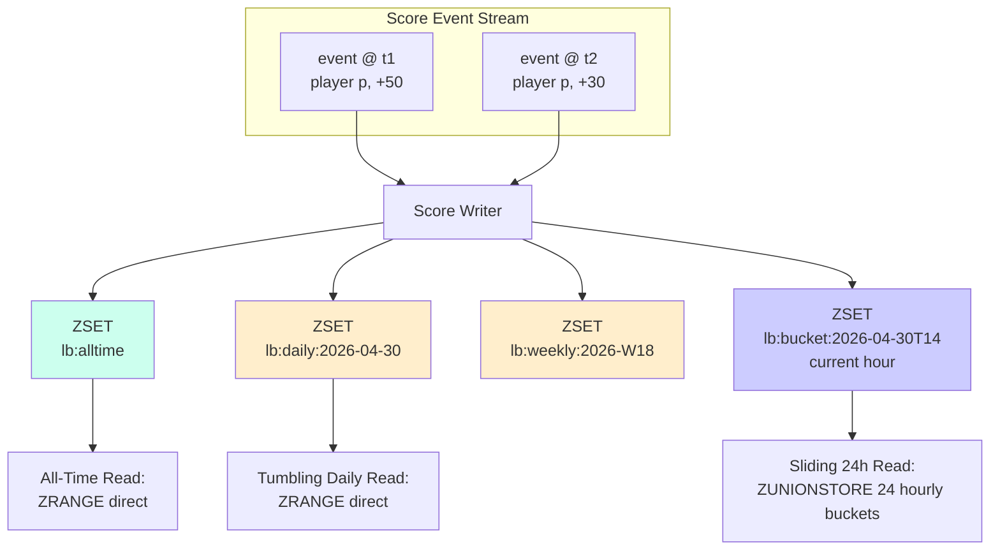

# Rolling Windows — Daily, Weekly, All-Time, and the Window Boundary Problem

**Date:** 2026-05-01 | **Updated:** 2026-05-01
**Tags:** `system-design` `deep-dive` `leaderboard` `time-windows` `sliding`

> **Parent case study:** [Design a Real-Time Leaderboard](../design-realtime-leaderboard.md). This deep-dive expands "Rolling Windows — Daily, Weekly, All-Time".

## Table of Contents

- [Summary](#summary)
- [Overview](#overview)
- [Three Boards Players Always Want](#three-boards-players-always-want)
- [The Naive Replication Approach](#the-naive-replication-approach)
- [Tumbling vs Sliding Windows](#tumbling-vs-sliding-windows)
- [Sliding Windows via Time-Bucketed Mini-ZSETs](#sliding-windows-via-time-bucketed-mini-zsets)
- [Bucket Granularity vs Query Latency](#bucket-granularity-vs-query-latency)
- [Lazy Aggregation — Precompute Then Merge](#lazy-aggregation--precompute-then-merge)
- ["Last 24 Hours" Requires Fine-Grained Buckets](#last-24-hours-requires-fine-grained-buckets)
- [The Window Boundary Problem at Midnight](#the-window-boundary-problem-at-midnight)
- [Time Zone Surprises](#time-zone-surprises)
- [Daily Reset Semantics — Rotate, Don't Mutate](#daily-reset-semantics--rotate-dont-mutate)
- [Event Time vs Ingestion Time](#event-time-vs-ingestion-time)
- [Combining Sliding With Per-Window Snapshots](#combining-sliding-with-per-window-snapshots)
- [Tournament-Style Time-Boxed Boards](#tournament-style-time-boxed-boards)
- [Storage Cost Model](#storage-cost-model)
- [Worked Example: Hourly Rolling 24h Leaderboard](#worked-example-hourly-rolling-24h-leaderboard)
- [Anti-Patterns](#anti-patterns)
- [Related](#related)
- [References](#references)

## Summary

Players want three leaderboards at once — All-Time, This-Week, This-Day — and sometimes a fourth ("last 24 hours" sliding) and a fifth ("this tournament" time-boxed). The naive approach is to keep a separate ZSET per window and replicate every score write to all of them. That works at small scale and breaks at large scale: you pay write amplification proportional to the number of windows, your hot keys multiply by `N`, and the midnight rollover becomes a coordinated cluster-wide stampede. The fix is to be deliberate about **what kind of window each board actually needs**. Tumbling windows (daily, weekly, monthly) reset at deterministic boundaries and are best implemented as separate ZSETs that *rotate* — yesterday's daily becomes an archive, today's daily is a brand-new key. Sliding windows ("last 24 hours, continuously") cannot be done correctly with a single mutated ZSET because there is no per-member expiry inside a sorted set; the standard answer is to split the time domain into small **buckets** (5-min, 15-min, hourly), write to the current bucket on each event, and read by `ZUNIONSTORE`-ing the last K buckets at query time. Bucket granularity trades read latency (more buckets to merge) against write amplification (only one bucket touched per write). Layered on top of all of this are operational details that ruin most first-cut designs: **midnight expiry stampedes** when every key has the same TTL (jitter the TTLs), **time zone surprises** when "daily" is actually local to the player, **late events** that arrive after the window has closed (you need an event-time vs ingestion-time discipline borrowed from streaming systems), and the **lossy expiry** problem where Redis silently drops a bucket whose events nobody had snapshotted yet. This deep-dive covers the algorithms, the bucketing math, the midnight choreography, and the anti-patterns that turn a clean design into a 2 AM incident.

## Overview

The parent case study (`../design-realtime-leaderboard.md`) introduces rolling windows as a deep-dive subsection of the leaderboard architecture. It documents the *what* — separate ZSETs per window, write fan-out, expiration semantics. This document opens the *how* and the *why*: the trade-offs between tumbling and sliding semantics, the bucketed-aggregation pattern, the boundary-problem operational hazards, and how streaming-systems concepts (event time, watermarks, late data) apply to a Redis-backed leaderboard.

The questions answered here:

1. **Why do players want multiple windows?** A weekly winner and a daily winner are different stories; the all-time board is unreachable for new players, the daily board is fresh.
2. **What's wrong with replicating every score N times?** Write amplification, hot-key multiplication, and a coupling between window count and write throughput.
3. **What's the difference between tumbling and sliding?** Tumbling has discrete boundaries (the "this week" board resets every Monday at 00:00 UTC); sliding has continuous semantics (the "last 24h" board moves second-by-second).
4. **How do you implement a true sliding window without rewriting Redis?** Time-bucketed ZSETs + `ZUNIONSTORE` at read time.
5. **How fine should the buckets be?** A trade-off: small buckets = sharper window edge, more reads to merge; large buckets = coarser edge, cheaper reads.
6. **What goes wrong at midnight?** Mass expiry, mass key creation, mass cache miss on the freshly-rotated key — all simultaneous.
7. **What about time zones?** "Daily" in Tokyo ends 9 hours before "daily" in New York. The "global daily" lie costs trust.
8. **Late events?** A score submitted at 23:59:59.500 may arrive at the server at 00:00:00.200, after the window has rotated. Event time vs ingestion time decides where it lands.
9. **Tournaments?** Time-boxed boards are the common case for live events; they want explicit, per-tournament TTLs and isolation.
10. **What's the storage cost of all this?** Linear in (windows × players); bucketed sliding adds a constant per-bucket overhead.



The general placement-level treatment of leaderboards lives in [`../design-realtime-leaderboard.md`](../design-realtime-leaderboard.md); this doc is specifically about the time dimension — how the same player's scores are partitioned into different boards by *when* they happened.

## Three Boards Players Always Want

Empirically, every leaderboard product surfaces three views, in this order:

1. **All-Time.** "The greatest of all time." Lifetime cumulative or peak. New players cannot reach the top within a week, but the board signals aspiration and history.
2. **This-Week (tumbling).** Resets every Monday at 00:00 UTC (or per-game's locale rule). New players can realistically reach the top with a strong week. Drives weekly retention and competitive rituals.
3. **This-Day (tumbling).** Resets every day at 00:00 UTC. Fresh enough that one good session can put a player on it. Drives daily retention.

Many products add:

4. **Last 24 Hours (sliding).** Continuous "what's happening right now." Differs from This-Day in that it does not reset at midnight; a score from 23:00 last night still counts at 11:00 today, but disappears at 23:01.
5. **Tournament (time-boxed).** A specific event window with explicit start and end timestamps; lives only for the duration of the event.
6. **Friends-Only.** An orthogonal axis (the *who*) layered on top of any of the above; covered in the parent case study, not here.

The trap: each window has independent semantics for *score aggregation* (sum vs max vs decayed), *reset behavior* (rotate, slide, never), and *retention* (keep yesterday's daily for 7 days, last week's weekly for 90 days). Treating them all the same is the primary source of design mistakes.

## The Naive Replication Approach

The most direct implementation is to maintain a separate ZSET per window and write to *all of them* on every event:

```python
# Naive: replicate every score to every window
def submit_score(player_id: str, points: int, occurred_at: datetime) -> None:
    day_key   = f"lb:daily:{occurred_at:%Y-%m-%d}"
    week_key  = f"lb:weekly:{occurred_at.strftime('%G-W%V')}"
    month_key = f"lb:monthly:{occurred_at:%Y-%m}"
    alltime_key = "lb:alltime"

    pipe = redis.pipeline()
    pipe.zincrby(day_key, points, player_id)
    pipe.zincrby(week_key, points, player_id)
    pipe.zincrby(month_key, points, player_id)
    pipe.zincrby(alltime_key, points, player_id)
    pipe.execute()
```

This *works*. It is the right starting point. But the cost model is painful:

| Window count | Writes per score event | Hot key fan-out |
|---|---|---|
| 1 (all-time only) | 1 ZINCRBY | 1 |
| 4 (all-time, monthly, weekly, daily) | 4 ZINCRBY | 4 |
| 5 (+ last-24h naively, more later) | 5+ | 5+ |

With `N` windows, the write rate to Redis is `N×` the score event rate. At 100K score events/sec, four windows means 400K Redis writes/sec, and *every one of them lands on the small set of hot ZSET keys for the current period*. Hot-key contention on Redis is real: a single ZSET key is owned by a single Redis shard, and that shard's CPU becomes the bottleneck.

**Worse, the keys are not independent.** All four writes target keys that are *active right now*, and tomorrow morning all four migrate to the next day's keys simultaneously. The hot set rotates in lockstep, which interacts disastrously with the boundary problem (covered below).

The naive approach is correct but does not scale past ~10 windows or past the throughput a single Redis primary can sustain on the hottest current-period key. The next several sections describe how to evolve the design.

## Tumbling vs Sliding Windows

The streaming-systems vocabulary is borrowed directly from Apache Flink and Kafka Streams (referenced below). Two flavors matter for leaderboards:

**Tumbling windows** have fixed, non-overlapping boundaries. "This week" tumbles every Monday at 00:00 UTC. "This day" tumbles every midnight. The window's identity is a discrete label (`2026-W18`, `2026-04-30`); each event belongs to exactly one window of each granularity.

```text
Tumbling daily:
 |-- 04-29 --|-- 04-30 --|-- 05-01 --|-- 05-02 --|
              ^  event lands here, in 04-30 only
```

Implementation: one ZSET per window label; `ZADD` or `ZINCRBY` directly. Rotation happens at the boundary: yesterday's key freezes, today's key starts empty.

**Sliding windows** have continuous semantics: "the leaderboard for events in the *last 24 hours*", measured from *now*. Every second, the window's left edge moves forward, and the oldest events fall out. Two events one second apart belong to almost the same window.

```text
Sliding 24h, queried at t=14:00:
 |--------- 24h ---------|
 13:00 yesterday    14:00 today
                ^ events outside this band don't count
```

Implementation: cannot be a single mutated ZSET, because Redis ZSETs don't support per-member TTL — there's no way to say "this score expires from the set in 24 hours." The standard answer is **bucketing** (next section).

A third pattern, **session windows** (events grouped by inactivity gap), shows up in user-engagement analytics but rarely in leaderboards; covered well in [Akidau et al., *The Dataflow Model*](https://research.google/pubs/the-dataflow-model-a-practical-approach-to-balancing-correctness-latency-and-cost-in-massive-scale-unbounded-out-of-order-data-processing/) (referenced).

The decision tree:

| User-facing question | Window type |
|---|---|
| "What's today's leaderboard?" | Tumbling daily — resets at boundary |
| "What's this week's leaderboard?" | Tumbling weekly |
| "What's the all-time leaderboard?" | Effectively infinite tumbling |
| "What's the leaderboard *right now*?" | Sliding (last N hours) |
| "Who won last week's tournament?" | Time-boxed (closed tournament window) |

Most products mix tumbling for human-meaningful periods (day, week) with sliding for "trending" or "live now" feeds.

## Sliding Windows via Time-Bucketed Mini-ZSETs

The trick to a sliding window without per-member TTL: divide time into discrete buckets, store events in the bucket they belong to, and aggregate at read time over the buckets that overlap the desired window.

For a 24-hour sliding leaderboard with hourly buckets:

```text
buckets:
  lb:bucket:2026-04-29T15
  lb:bucket:2026-04-29T16
  ...
  lb:bucket:2026-04-30T14   ← current hour at query time
```

**Write path:** every score event is written to its bucket — usually the bucket of the event's timestamp:

```python
def bucketed_write(player_id: str, points: int, event_time: datetime) -> None:
    bucket_label = event_time.strftime("%Y-%m-%dT%H")
    key = f"lb:bucket:{bucket_label}"
    redis.zincrby(key, points, player_id)
    # TTL slightly longer than the longest sliding window we ever query
    redis.expire(key, 25 * 3600 + jitter())   # 25h + jitter
```

Each event touches exactly one bucket key — write amplification is *constant* (1), independent of how many sliding queries the system supports.

**Read path:** to compute the last-24h leaderboard, merge the 24 most recent hourly buckets:

```python
def sliding_24h_top_n(n: int = 100) -> list[tuple[str, float]]:
    now = datetime.utcnow()
    keys = [
        f"lb:bucket:{(now - timedelta(hours=i)):%Y-%m-%dT%H}"
        for i in range(24)
    ]
    dest = "lb:sliding:24h:tmp:" + uuid4().hex
    redis.zunionstore(dest, keys, aggregate="SUM")
    try:
        return redis.zrevrange(dest, 0, n - 1, withscores=True)
    finally:
        redis.delete(dest)
```

`ZUNIONSTORE` (referenced) computes the sum of scores across N source ZSETs and writes the result to a destination ZSET. Cost is `O(N) + O(M log M)` where N is the total number of (key, member) pairs across the sources and M is the cardinality of the result. For 24 hourly buckets averaging 50K active players each, that is ~1.2M operations per call — fine at the rate of a few queries per second per game, ruinous at one query per leaderboard view.

**The cache-the-result pattern.** The sliding leaderboard is typically *not* recomputed on every user view. Instead, a background worker recomputes it every 30 seconds (or whatever staleness target the product accepts) and publishes the result to a cached `lb:sliding:24h:current` ZSET. User reads hit the cached version directly. This trades freshness for read cost, and 30-second staleness is invisible to players for most game genres.

## Bucket Granularity vs Query Latency

The granularity choice is the central tuning knob:

| Bucket size | Sliding-24h query merges | Write rate per bucket | Window edge sharpness |
|---|---|---|---|
| 1 minute | 1440 keys | Score rate / 1440 | ±30 seconds |
| 5 minutes | 288 keys | Score rate / 288 | ±2.5 minutes |
| 15 minutes | 96 keys | Score rate / 96 | ±7.5 minutes |
| 1 hour | 24 keys | Score rate / 24 | ±30 minutes |
| 1 day | 1 key | Full rate / 1 | ±12 hours (worthless for "live") |

The trade-offs:

- **Smaller buckets → more keys to merge at read.** A 1-minute granularity over 24 hours is 1440 source ZSETs in the `ZUNIONSTORE`; on a heavy-traffic game, that operation is multi-hundred-millisecond and drives a single Redis shard hot.
- **Smaller buckets → sharper sliding edge.** With 1-minute buckets, the window edge is precise to ±30 seconds; with hourly buckets it is precise to ±30 minutes.
- **Smaller buckets → more keys total.** Each bucket has a constant per-key overhead in Redis (key metadata, expire dictionary entry, network round-trip if you scan).
- **Larger buckets → cheaper reads, but staler edge.** With hourly buckets, an event at 14:01 enters the 14:00 bucket and is treated as if it happened at the same time as an event at 14:59 from the same hour.

The sweet spot for most consumer leaderboards is **15-minute or hourly buckets** for the sliding-24h view. The window edge is fuzzy by ±15 to ±30 minutes, which players don't notice; the read merges 24-96 buckets, which a background job can do every minute with negligible cost.

For "trending in the last 5 minutes" (a different product, e.g., live-stream chat reaction leaderboard), 30-second or 1-minute buckets are appropriate, and the merge is over only 5-10 keys.

For "trending in the last hour", 1-minute buckets over 60 keys — the sweet spot is again roughly an order of magnitude of buckets per window, regardless of the absolute scale.

## Lazy Aggregation — Precompute Then Merge

A useful optimization layered on top of bucketing: precompute *intermediate aggregates* at coarser granularity, and merge them at read time. The hierarchical pattern is:

```text
fine buckets:    1-minute buckets (last 90 minutes)
medium buckets:  hourly buckets (last 48 hours, derived from minute buckets)
coarse buckets:  daily buckets (last 30 days, derived from hourly buckets)
```

Each level is computed from the level below by a periodic job that runs at the granularity of the destination level. The 1-minute buckets are written live; once an hour, a worker `ZUNIONSTORE`s the 60 minute-buckets of the just-completed hour into the corresponding hourly bucket, then drops the minute-buckets after a delay (covered under "Lossy Expiry" below).

Reads use whichever granularity is cheapest:

- "Last 60 minutes" → merge 60 minute-buckets.
- "Last 24 hours" → merge 24 hourly buckets (precomputed). Way cheaper than merging 1440 minute-buckets.
- "Last 30 days" → merge 30 daily buckets.

The cost shifts from the read path to a small, predictable batch job, and the read-time `ZUNIONSTORE` stays bounded to a small number of source keys regardless of the window size. This is the standard *materialized view* pattern from data warehousing, applied to a real-time leaderboard.

The downside: the precomputed intermediate has staleness equal to the precomputation interval. If hourly buckets are computed at the top of each hour, the "last 24h" board can be up to an hour stale at the leading edge unless you mix in the in-progress current hour from the live minute-buckets. The standard mitigation:

```text
last 24h = hourly_bucket(t-24)..hourly_bucket(t-1)        # precomputed, 23 keys
         + minute_bucket(now-60min)..minute_bucket(now)   # live, up to 60 keys
```

Total: ~83 keys merged. Still cheaper than 1440, much fresher than purely hourly. This is the streaming-systems trick of *combining a slow batch view with a fast incremental view* and accepting the small overlap at the boundary.

## "Last 24 Hours" Requires Fine-Grained Buckets

If "last 24 hours" is a product-critical view (a "trending now" board or a tournament that lasts exactly 24 rolling hours), the bucket granularity must be fine enough that the window edge isn't visibly wrong.

Concretely: with hourly buckets, the "last 24h" board includes either 24 or 25 hourly buckets depending on whether the current partial hour is included. At 14:30, do you include `13:00..14:00` (last completed 24 buckets) or also the partial `14:00..14:30`? Either choice is "wrong" relative to a literal "last 24 hours":

- **Excluding the current hour:** the view lags by up to 60 minutes. A score scored at 13:55 doesn't appear in the "last 24h" board until 15:00.
- **Including the current hour as a full bucket:** scores from 14:01 appear in the board, but so does the entire 13:00 hour from yesterday — including its first minute. Effective window is "13:01 yesterday → now", off by 60 minutes on the left edge.
- **Including a partial current hour:** correct, but requires writing 5-minute or 1-minute sub-buckets so the partial can be merged precisely.

The third option is what production systems do. Sub-buckets within the current hour are kept at fine granularity; once the hour completes, they are rolled up into a single hourly bucket and the sub-buckets are dropped. The read merges:

```text
hourly_buckets(t-23..t-1)         # 23 hourly buckets (precomputed)
+ minute_buckets(t.minute_start)  # up to 59 1-minute buckets in the current hour
```

The hot 1-minute keys live for at most an hour; the warm hourly keys live for 24+ hours; and the merge is cheap.

## The Window Boundary Problem at Midnight

The single most common production incident on a leaderboard system is the **midnight stampede**. The naive symptom: at exactly 00:00 UTC, latency spikes, error rates climb, and 99th-percentile p99 doubles for several minutes. The cause is multiple effects piling up at the same instant:

1. **Mass key expiry.** All hourly buckets and daily ZSETs that share the same `EXPIRE` second are evicted simultaneously by Redis's active expiry sweeper. The sweeper goes from doing nothing to having thousands of keys to delete.
2. **Mass key creation.** The first score event of the new day creates a fresh `lb:daily:2026-05-01` ZSET on the relevant shard, and the next 99K events of the next minute pile onto a brand-new key with no warmth.
3. **Cache-miss stampede on the read side.** Every "today's leaderboard" cached value invalidates at 00:00 (because the date in the cache key changed). The first user request after midnight misses cache, triggers a recompute, and 10K simultaneous user requests each trigger their own recompute (a classic stampede; see [`../../distributed-infra/distributed-cache/cache-stampede-protection.md`](../../distributed-infra/distributed-cache/cache-stampede-protection.md) for the general pattern).
4. **Rotation worker contention.** The single rotation worker that's supposed to "freeze yesterday, open today" is racing with live writers; if its lock is implemented naively, writes at 23:59:59.9 and 00:00:00.1 land on different keys depending on which side of the lock they cleared.
5. **Snapshot-to-storage spike.** If the architecture snapshots yesterday's daily to durable storage at midnight, the snapshot writer competes with all of the above for Redis CPU.

The fix is to **break the synchronicity** of these effects.

**Jittered TTLs.** Don't `EXPIRE key 86400` for every key written at noon — they all expire at the *same* noon next day. Add a small uniform-random jitter:

```python
def expire_with_jitter(key: str, base_seconds: int, jitter_pct: float = 0.05) -> None:
    jitter = random.uniform(0, base_seconds * jitter_pct)
    redis.expire(key, int(base_seconds + jitter))
```

A 5% jitter on a 24-hour TTL spreads expirations over a 72-minute window. The expiry sweeper sees a steady trickle instead of a cliff. This is the same trick used to prevent connection-pool reconnect storms, DNS TTL stampedes, and TLS-cert renewal pile-ups.

**Pre-create tomorrow's keys.** A scheduled job at 23:00 UTC creates the empty `lb:daily:tomorrow:*` ZSETs on each shard. The first write of the new day has a warm key path. (Some teams skip this because Redis key creation is cheap; the win is small but real for cold-shard latencies.)

**Probabilistic early refresh on the read side.** Cache entries for "today's leaderboard" return a soft TTL of 30 seconds. With probability proportional to remaining-time-to-expiry, a request triggers an async refresh in the background and serves the slightly-stale cached value. The classic stampede-prevention pattern; see Vattani et al., *Optimal Probabilistic Cache Stampede Prevention* (referenced in the cache-stampede deep-dive).

**Rotation as an idempotent state machine.** The rotation worker should be safe to call multiple times. Using `SET tomorrow_rotation_done EX 3600 NX` as a per-day idempotency lock is enough; the work itself (creating empty ZSETs, snapshotting yesterday's ZSET to S3, dropping the in-Redis copy after the configured retention) is naturally idempotent if implemented as `if not exists then create` operations.

**Snapshot-to-storage on a delay.** Don't snapshot yesterday's daily at 00:00:00 — snapshot it at 00:30:00, *after* the storm has passed. Yesterday's data isn't going anywhere; the only constraint is "before the in-Redis retention TTL fires" (e.g., 7 days).

## Time Zone Surprises

"Daily" is not a global concept; it's a local one. A player in Tokyo (UTC+9) sees their day end at 15:00 UTC. A player in New York (UTC-5) sees it end at 05:00 UTC the next day. A literal `lb:daily:2026-04-30` keyed in UTC is wrong by 9 hours for the Tokyo player and 5 hours for the New York player.

The options:

- **Single global UTC daily.** Easiest to implement; players accept that "daily" is the same arbitrary 24-hour window for everyone. Most global games (mobile, cross-region) ship this. Works fine if marketed as "daily" without claims about local midnight.
- **Per-region daily boards.** `lb:daily:2026-04-30:apac`, `lb:daily:2026-04-30:emea`, `lb:daily:2026-04-30:americas`. Each region's "daily" keys to its own local-midnight rotation. 3× the number of daily ZSETs but each is well-defined. Requires deciding *which region a player belongs to* (last login? account country? IP at submit time?).
- **Per-player local daily.** Each player has their own "daily" that resets at their local midnight. Conceptually clean, operationally a nightmare — the daily key is no longer a shared resource but a per-player concept, defeating the leaderboard.

Practically, only the first two work. The pattern most production leaderboards adopt: **UTC for the engine, with explicit regional variants for products where local-midnight matters** (typically: events tied to local prime-time TV, country-specific tournaments, ad-funded games where ad cycles are regional). Products that don't take a deliberate position on this end up with bugs like "the daily resets while I'm in the middle of my Saturday-night session." The fix is to surface the reset clearly in the UI ("Resets in 3h 22m") rather than guess.

The interaction with daylight savings is its own headache. Twice a year, the local "day" is 23 or 25 hours long. UTC daily avoids this entirely. Local daily must explicitly use the local civil time, including DST jumps; otherwise the rotation worker fires at the wrong instant on the boundary day.

## Daily Reset Semantics — Rotate, Don't Mutate

The wrong way to do a daily reset: take the existing `lb:daily` key and `DEL` it (or `ZREMRANGEBYSCORE` everything out). Three problems:

1. **Race window.** Between the `DEL` and the next write, the daily board doesn't exist. A read in that microsecond returns "no leaderboard." A write either creates the new key or lands in the same flush cycle.
2. **No history.** Yesterday's daily is *gone*. If the product needs to show "yesterday's winner" or run an end-of-day awards ceremony, the data is irrecoverable.
3. **No rollback.** If the reset fires at the wrong instant (DST bug, scheduler glitch), undoing it requires replaying the score event log.

The right way: **rotate by key naming**. Each day's daily is a distinct key (`lb:daily:2026-04-30`). At midnight, *nothing happens to yesterday's key*. Today's writes start hitting `lb:daily:2026-05-01`, which Redis lazy-creates on first `ZADD`. Yesterday's key continues to exist with its full state, and a configured TTL (e.g., 7 days) ensures it ages out without manual intervention. Within that 7-day window, the API can serve queries like "who won yesterday" by routing to the previous-day key.

```python
# Read path: API exposes "yesterday" by computing the previous-day key
def get_yesterday_top_n(game: str, n: int = 10) -> list[tuple[str, float]]:
    yesterday = (datetime.utcnow() - timedelta(days=1)).strftime("%Y-%m-%d")
    key = f"lb:{game}:daily:{yesterday}"
    return redis.zrevrange(key, 0, n - 1, withscores=True)
```

For longer-term archival, snapshot the closed daily ZSET to durable storage (S3, BigQuery, ClickHouse) before the in-Redis TTL fires. See [`./snapshots-to-durable-storage.md`](./snapshots-to-durable-storage.md) for the snapshot workflow. The Redis copy is the live cache; the durable snapshot is the historical record.

The **API "alias"** is the trick that makes the rotation transparent to the client: the public endpoint `/leaderboard/daily` resolves the date at request time and returns the appropriate dated key's contents. The client never sees the rotation; it just sees "the daily leaderboard," which happens to point at a different ZSET each day.

## Event Time vs Ingestion Time

Streaming systems distinguish two timestamps for every event:

- **Event time.** When the event occurred in the real world. The score was earned at 23:59:58 on the player's device.
- **Ingestion time.** When the event was processed by the server. The score was submitted to Redis at 00:00:01.

Most of the time, these agree to within a few hundred milliseconds. But network hiccups, mobile-client offline buffers, and back-end queue lag can produce **late events**: an event whose event time is comfortably in the past but whose ingestion time is *now*. A player's offline session might submit a batch of scores hours after they happened.

For a daily leaderboard, the question is: which day does a late event belong to?

- **Ingestion-time daily.** "It arrived today, it counts toward today." Simple, stable, but wrong: a player whose 23:58 score arrives at 00:01 sees it credited to the wrong day.
- **Event-time daily.** "It happened yesterday, it counts toward yesterday." Correct, but the yesterday key has already had snapshots taken; updating it produces stale archives and inconsistent client-cached views.

The streaming-systems answer is **watermarks**: the system tracks "the time before which we believe all events have arrived" (the watermark). Events with event time before the watermark are "late" and handled by an explicit late-data policy. The Akidau Dataflow paper (referenced) is the canonical treatment.

Concretely for a leaderboard:

```python
# Watermark advancement — pseudocode
WATERMARK_LAG = timedelta(minutes=5)   # tolerate up to 5min late events

def current_watermark() -> datetime:
    return datetime.utcnow() - WATERMARK_LAG

def submit_score(player_id: str, points: int, event_time: datetime) -> None:
    wm = current_watermark()
    if event_time >= wm:
        # On-time: write to the bucket/day determined by event_time
        write_to_window(player_id, points, event_time)
    else:
        # Late event: apply the late-data policy
        handle_late_event(player_id, points, event_time, wm)

def handle_late_event(player_id: str, points: int, event_time: datetime, wm: datetime) -> None:
    age = wm - event_time
    if age < timedelta(hours=1):
        # Mildly late: still update the daily ZSET; it's recent enough
        write_to_window(player_id, points, event_time)
        emit_late_event_metric(age)
    else:
        # Severely late: drop, log, alert
        log.warning("dropping late event", player=player_id, lag=age)
        drop_late_event_metric(age)
```

The 5-minute watermark lag is a tunable. Larger = tolerates more late events at the cost of larger boundary lag in the live view. Smaller = sharper boundary, more drops.

For a sliding 24h window with bucketing, late events are easier: as long as the bucket the event belongs to still exists (hasn't expired), the event can be written into it. The TTL on each bucket should exceed the watermark lag plus the longest sliding window querying it (e.g., for a 24h sliding window with a 5-minute watermark, bucket TTL = 24h + 5min + safety margin).

For tumbling windows that have already been *closed and snapshotted*, late events present a harder problem: the archive is committed. The standard pattern is to maintain a "late corrections" stream and apply it at read time when the historical view is queried — or to accept the inconsistency and only re-ingest a small "warm" tail.

The full streaming-systems framing of time and ordering is covered in [`../../../data-consistency/time-and-ordering.md`](../../../data-consistency/time-and-ordering.md).

## Combining Sliding With Per-Window Snapshots

The clean architecture for a system that supports all three (tumbling daily, tumbling weekly, sliding 24h) is to write *only* to fine-grained buckets and derive every named window from them:

```text
Write path: ZINCRBY lb:bucket:2026-04-30T14:30   (15-minute granularity)

Read paths:
  daily 2026-04-30  → ZUNIONSTORE 96 buckets (96 × 15min = 24h)
  weekly 2026-W18   → ZUNIONSTORE 7 daily snapshots
  sliding 24h       → ZUNIONSTORE last 96 buckets ending now
  alltime           → maintained as a separate cumulative ZSET
```

The advantage: write amplification is *one* (per event, you touch one bucket). All windows are computed at read or precompute time. Adding a new window (last-6-hours, this-hour, etc.) is a configuration change, not a write-path change.

The disadvantage: read latency. `ZUNIONSTORE`-ing 96 buckets is more expensive than reading a single ZSET. The fix is precomputed snapshots:

- A daily-snapshot worker, just before midnight, `ZUNIONSTORE`s the day's 96 buckets into a single `lb:daily:2026-04-30` snapshot ZSET.
- A weekly-snapshot worker, just before Monday midnight, `ZUNIONSTORE`s 7 daily snapshots into a weekly ZSET.
- The sliding 24h is the only view that always merges live; everything else reads a precomputed snapshot.

This is the classic *Lambda architecture* shape (batch + speed layers) collapsed into a single Redis cluster. It is much cleaner than maintaining separate ZSETs per window from the write path, and the read costs for tumbling windows are O(1) (single ZRANGE on the snapshot).

The trade-off: precomputed snapshots are slightly stale. The daily snapshot taken at 23:55 misses the last 5 minutes of the day. Mitigations: take the snapshot a hair *after* midnight (incurring slight midnight contention but capturing all events), or always merge `snapshot + tail buckets after snapshot time` at read.

## Tournament-Style Time-Boxed Boards

Tournaments are bounded events: explicit start time, explicit end time, possibly a fixed duration (24h, 7 days, "until 100K scores submitted"). They are *neither* tumbling nor sliding in the rigorous sense — they have one start, one end, and the leaderboard is final at the end.

The implementation pattern:

```python
# Tournament keys carry the tournament ID, not a date alias
TOURNAMENT_ID = "spring_cup_2026"
TOURNAMENT_END = datetime(2026, 5, 7, 23, 59, 59, tzinfo=timezone.utc)

def submit_tournament_score(player_id: str, points: int, occurred_at: datetime) -> None:
    if not (TOURNAMENT_START <= occurred_at <= TOURNAMENT_END):
        return  # Outside tournament window — ignored for this board
    key = f"lb:tournament:{TOURNAMENT_ID}"
    redis.zincrby(key, points, player_id)
    # TTL is calculated from now to end + grace period for archival
    seconds_until_archive = int((TOURNAMENT_END - datetime.utcnow()).total_seconds()) + 86400
    redis.expire(key, seconds_until_archive)
```

Key properties:

- **Dedicated key.** The tournament has its own ZSET, isolated from the global all-time and dailies. No interference between tournament writes and the rest of the leaderboard.
- **Explicit, deterministic TTL.** The key expires a known duration after the tournament ends, giving the archival worker a window to snapshot and finalize.
- **Pre-closure window.** Score writes at `END - 1ms` are valid; writes at `END + 1ms` are rejected at the application layer (or counted as late events per the watermark policy).
- **Final leaderboard is immutable.** Once the tournament ends and snapshots are taken, the result is locked. Late events past the watermark are dropped or surfaced as anomalies.

For a *recurring* tournament series (weekly tournaments, seasonal cups), the pattern is to mint a new tournament ID per occurrence — `weekly_cup_2026-W18`, `weekly_cup_2026-W19` — and let the per-tournament TTL handle cleanup. Each occurrence is independent; comparison across occurrences is done at the snapshot/archival layer, not in Redis.

For a tournament that supports both real-time and historical views, the tournament ZSET stays warm for ~1 day after end (for "view results" queries) and then is replaced by a smaller `lb:tournament:archive:spring_cup_2026:top100` ZSET holding only the leaderboard's top placements. Saves memory if the tournament had millions of participants but only the top 100 are ever queried after the fact.

## Storage Cost Model

For capacity planning, the storage cost of multi-window leaderboards is approximately:

```text
total_zset_bytes ≈ Σ_windows (active_players_in_window × bytes_per_zset_entry)
                 + Σ_buckets (active_players_in_bucket × bytes_per_zset_entry)
```

`bytes_per_zset_entry` for Redis is roughly 80-120 bytes for a player ID of ~20 chars and a score (the actual figure varies with encoding — see [`./redis-sorted-set-internals.md`](./redis-sorted-set-internals.md)). Typical breakdown for a game with 1M daily active players and a sliding-24h view at hourly granularity:

| Component | ZSETs | Players per ZSET | Bytes |
|---|---|---|---|
| All-time | 1 | All registered (50M) | 5 GB |
| This-week | 1 | Weekly active (5M) | 500 MB |
| This-day | 1 | Daily active (1M) | 100 MB |
| Hourly buckets (last 25) | 25 | Per-hour active (~80K) | 25 × 8 MB = 200 MB |
| **Total** | — | — | **~5.8 GB** |

The all-time dominates; everything else is rounding error in comparison. The bucketing for sliding adds a constant overhead independent of how many sliding views are exposed.

Adding a "last 7 days sliding" view at the same hourly granularity adds 7 × 24 = 168 hourly buckets. Most of those are the same buckets already used by "last 24 hours" — *bucketed sliding is naturally shared across views*. The only marginal cost is in TTL: hourly buckets needed by a 7-day sliding view must live 7 days, not 25 hours. That extends per-bucket TTL but does not multiply the bucket count.

Adding a tournament adds one ZSET sized to that tournament's participant count. A weekly tournament with 100K participants is 10 MB.

The ratio of write rate to storage growth is what matters operationally: at 100K events/sec on a leaderboard with the above layout, each event touches ~3 ZSETs (all-time + this-day + current-bucket; weekly is derived from daily snapshots). Write rate to Redis is ~300K ops/sec. A single Redis primary handles this comfortably; for higher rates, the keyspace shards naturally — see [`./sharded-score-aggregation.md`](./sharded-score-aggregation.md).

## Worked Example: Hourly Rolling 24h Leaderboard

A complete sketch combining the patterns above. Game: a casual mobile shooter. Product asks: "show me the top 100 by points scored in the last 24 hours, refreshed at most every 60 seconds."

**Design choices:**

- Bucket granularity: 1 hour. Window edge fuzziness ±30 minutes is fine for "last 24 hours" framing.
- Bucket TTL: 25 hours + 5% jitter, ensuring the bucket needed by "now - 24h" lookups is still alive.
- Recompute interval: 60 seconds, aligned to a background worker, not to user requests.
- Cached result: `lb:trending:24h:current` — single ZSET refreshed every 60 seconds.

**Write path:**

```python
import random
from datetime import datetime, timedelta

def write_score_event(player_id: str, points: int, event_time: datetime) -> None:
    # Single bucket per event — no fan-out
    bucket_key = f"lb:bucket:{event_time:%Y-%m-%dT%H}"
    pipe = redis.pipeline()
    pipe.zincrby(bucket_key, points, player_id)
    # TTL with jitter to prevent simultaneous expiry stampede
    base_ttl = 25 * 3600
    jitter = random.uniform(0, base_ttl * 0.05)
    pipe.expire(bucket_key, int(base_ttl + jitter))
    pipe.execute()
```

**Recompute worker (every 60 seconds):**

```python
def recompute_trending_24h() -> None:
    now = datetime.utcnow()
    keys = [f"lb:bucket:{(now - timedelta(hours=i)):%Y-%m-%dT%H}" for i in range(24)]
    tmp_key = f"lb:trending:24h:building:{now.timestamp():.0f}"
    final_key = "lb:trending:24h:current"

    pipe = redis.pipeline()
    pipe.zunionstore(tmp_key, keys, aggregate="SUM")
    # Trim to top 1000 to bound size of the published view
    pipe.zremrangebyrank(tmp_key, 0, -1001)
    # Atomic swap: rename the freshly-built key into place
    pipe.rename(tmp_key, final_key)
    pipe.execute()
```

The `RENAME` makes the publication atomic — readers either see the previous version or the new version, never a partial build. (`ZUNIONSTORE` with a destination that exists overwrites it, but the name `tmp_key` is unique per recompute, so a failed recompute leaves `final_key` untouched.)

**Read path (user-facing):**

```python
def get_trending_24h_top100() -> list[tuple[str, float]]:
    return redis.zrevrange("lb:trending:24h:current", 0, 99, withscores=True)
```

This is O(100) — a slice off a precomputed ZSET. Latency is sub-millisecond and scales infinitely on the read side regardless of how many users query it.

**Operational properties:**

- Write amplification: 1× (one ZINCRBY per event, plus the one-shot EXPIRE call).
- Storage: 25 hourly buckets × ~80K active players × ~100 bytes = ~200 MB. Plus the 1000-element published ZSET.
- Recompute cost: 24-key `ZUNIONSTORE` × 80K avg cardinality ≈ ~2M ops every 60s = ~30K ops/sec amortized on the recompute worker.
- Window edge accuracy: ±30 minutes (acceptable for "last 24h").
- Refresh latency: up to 60 seconds (acceptable for trending; not acceptable for "live tournament" — different design).

To improve edge accuracy without changing the user-facing read path: switch to 15-minute buckets (96 keys per merge), pre-aggregate hourly buckets in the background, and merge "23 hourly snapshots + last 4-6 minute-buckets" at recompute time. Window edge becomes ±7.5 minutes, recompute cost stays bounded.

## Anti-Patterns

1. **Separate full ZSETs per window with naive replication.** Writing every score to all-time + monthly + weekly + daily is the textbook starting point and the correct *first* implementation, but treating it as the long-term answer means accepting 4× to 6× write amplification and per-period hot-key contention. Beyond a million events per minute, switch to bucket-derived snapshots.
2. **Midnight key expiry without jitter.** Setting `EX 86400` on every key written near midnight schedules them all to expire at the next midnight ±1 second. Redis's expiry sweeper goes from idle to overwhelmed; latency p99 spikes for several minutes. Always add jitter (5-10%) to keep expiry distributed.
3. **Single shared "global daily" key with global UTC midnight, marketed as "your daily."** Players in regions far from UTC see the daily reset at strange local times and complain. Either commit to UTC daily without the "your" framing, or shard the daily by region.
4. **Naive `DEL` reset at midnight.** Destroys yesterday's data, has a race window where the daily doesn't exist, and is impossible to roll back. Always use *named* keys per period (`lb:daily:2026-04-30`) and let the alias resolve dynamically.
5. **Ingestion-time-only handling of late events.** A score earned at 23:58 but submitted at 00:02 is credited to the wrong day's leaderboard, silently. Players who experienced this (e.g., due to brief connectivity loss) lose trust. Adopt event-time semantics with a documented watermark policy.
6. **Bucket TTL shorter than the longest sliding window using it.** A bucket for hour `t-23` is needed by a "last 24h" sliding query *right now*. If its TTL is 24 hours from when it was *created*, and we're at the end of its lifetime, it might expire mid-query. TTL must be at least `(longest sliding window) + (max watermark lag) + (safety margin)`.
7. **Lossy bucket expiry of unprocessed events.** A bucket holds the only copy of its events. If the bucket expires before it is rolled up into a longer-period snapshot, those events are gone forever. Always snapshot/archive *before* the source TTL fires; treat snapshot success as a precondition for source eviction.
8. **Recomputing the sliding window per user request.** A 24-bucket `ZUNIONSTORE` is 1-10ms; multiplied by 10K req/sec from users, it monopolizes a Redis shard. Recompute centrally on a single worker and publish a cached result; users read the cache.
9. **Tournament keys without explicit TTL.** A tournament with no TTL lives forever, and a year of weekly tournaments is 52 leftover ZSETs nobody cleans up. Set a tournament TTL = `end + grace_period` at creation, and verify the snapshot-to-storage worker fires before the TTL.
10. **Time zone agnosticism + "daily" marketing.** Saying "resets at midnight" and meaning UTC midnight produces "the daily reset at 7pm" complaints from US-east players. Either be explicit ("Resets at 00:00 UTC, X hours from now") or implement regional dailies.
11. **Treating sliding and tumbling as interchangeable.** A "today's leaderboard" implementation that's actually "last 24 hours sliding" is wrong by 24 hours of event boundaries. The product semantics must be explicit, and the implementation must match.
12. **No distinction between event time and ingestion time anywhere in the system.** Any system that ingests over a network from clients has late events. Pretending otherwise produces silent correctness bugs at the boundaries.
13. **Snapshot-to-storage scheduled at the same instant as rotation.** The midnight stampede already has 4 things happening; adding the snapshot job to that exact instant compounds it. Schedule the snapshot at minute 30, 45, or whenever the storm has quieted.
14. **Unbounded bucket count for "last hour" precision over a 30-day window.** 30 × 24 × 60 = 43200 minute-buckets is too many to merge on demand. Use the hierarchical aggregation pattern (minute → hour → day) and merge across levels.
15. **No cache stampede protection on the recomputed sliding view.** When the cached `lb:trending:24h:current` expires (or fails to refresh), all readers fall back to direct compute, which crushes the Redis shard. Use a `RENAME` swap (always-present cached key) or probabilistic early refresh.

## Related

- [`./redis-sorted-set-internals.md`](./redis-sorted-set-internals.md) — sibling deep-dive; how ZSETs are encoded (skiplist + dict) and the cost of `ZUNIONSTORE` over many sources. Foundational to the bucketing math.
- [`./sharded-score-aggregation.md`](./sharded-score-aggregation.md) — sibling deep-dive; once a single Redis shard cannot hold the bucket fan-out, the keys must shard. Window keys interact with shard placement.
- [`./snapshots-to-durable-storage.md`](./snapshots-to-durable-storage.md) — sibling deep-dive; the archival pipeline that moves rotated daily/weekly ZSETs into S3/BigQuery for long-term retention. Closely tied to the rotation-and-TTL choreography.
- [`./tournament-mode.md`](./tournament-mode.md) — sibling deep-dive; the time-boxed-board pattern in depth, including bracket support and final-result immutability.
- [`../design-realtime-leaderboard.md`](../design-realtime-leaderboard.md) — parent case study; this doc expands the *Rolling Windows* deep-dive subsection.
- [`../../../building-blocks/message-queues-and-brokers.md`](../../../building-blocks/message-queues-and-brokers.md) — foundation; the score event stream typically flows through Kafka or similar before reaching Redis. Watermark advancement and late-event handling start there.
- [`../../../data-consistency/time-and-ordering.md`](../../../data-consistency/time-and-ordering.md) — foundation; the general treatment of event time, ingestion time, watermarks, and ordering across distributed systems.

## References

- Redis Documentation — [*ZUNIONSTORE*](https://redis.io/commands/zunionstore/). The merge primitive used to compute sliding-window leaderboards from time-bucketed source ZSETs. Includes complexity (`O(N) + O(M log M)`) and aggregation modes (`SUM`, `MIN`, `MAX`).
- Redis Documentation — [*EXPIRE*](https://redis.io/commands/expire/). TTL semantics, the active-vs-lazy expiry model, and the operational interactions with eviction. Required reading for anyone designing a key-rotation schedule.
- Apache Flink Documentation — [*Windows*](https://nightlies.apache.org/flink/flink-docs-stable/docs/dev/datastream/operators/windows/). Authoritative reference for tumbling, sliding, and session windows in a streaming context. The vocabulary used here (event time, watermark, late data) comes from Flink's lineage.
- Apache Kafka Documentation — [*Windowing in Kafka Streams*](https://kafka.apache.org/documentation/streams/developer-guide/dsl-api.html#windowing). The Kafka-Streams treatment of windowed aggregations, including grace periods for late events and the suppression operator that holds output until a window closes.
- Akidau, Bradshaw, Chambers, Chernyak, Fernández-Moctezuma, Lax, McVeety, Mills, Perry, Schmidt, Whittle — [*The Dataflow Model: A Practical Approach to Balancing Correctness, Latency, and Cost in Massive-Scale, Unbounded, Out-of-Order Data Processing*](https://research.google/pubs/the-dataflow-model-a-practical-approach-to-balancing-correctness-latency-and-cost-in-massive-scale-unbounded-out-of-order-data-processing/) (VLDB 2015). The foundational paper that systematized event-time, watermarks, and triggers as the language for streaming computation. Required reading for taking late-event handling seriously.
- Akidau, Chernyak, Lax — [*Streaming Systems*](https://www.oreilly.com/library/view/streaming-systems/9781491983867/) (O'Reilly, 2018). Book-length treatment of the Dataflow Model. Chapters on time, windowing, and watermarks are directly applicable to the design choices in this doc.
- AWS Documentation — [*Windowed Queries in Kinesis Data Analytics*](https://docs.aws.amazon.com/kinesisanalytics/latest/dev/windowed-sql.html). The AWS treatment of tumbling, sliding, and stagger windows in a managed-streaming SQL context. Useful for understanding how cloud platforms expose the same underlying concepts.
- ksqlDB Documentation — [*Time and Windows in ksqlDB Queries*](https://docs.ksqldb.io/en/latest/concepts/time-and-windows-in-ksqldb-queries/). The ksqlDB treatment of event time, processing time, and the three window types. Concrete syntax examples and the grace-period mechanism for late events.
