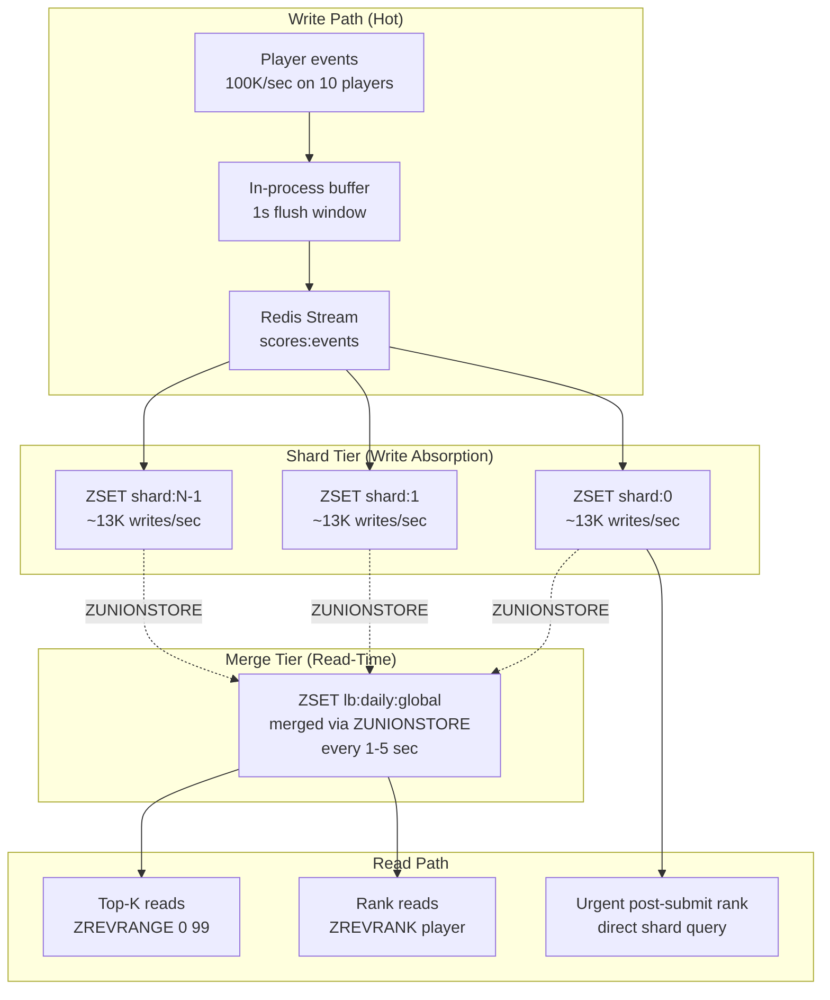

# Sharded Score Aggregation — Hot Writes, Batched Increments, and Local Aggregation

**Date:** 2026-05-01 | **Updated:** 2026-05-01
**Tags:** `system-design` `deep-dive` `leaderboard` `sharding` `hot-writes`

> **Companion to:** [Design a Real-Time Leaderboard](../design-realtime-leaderboard.md), expanding the "Sharded Score Aggregation for Hot Writes" subsection. Read the parent first; this document drills into the sharding mechanics, the four absorption strategies, and the eventual-consistency trade-offs that make the pattern work under tournament-scale load.

## Table of Contents

- [Summary](#summary)
- [Overview](#overview)
- [Why Hot Writes Happen on a Leaderboard](#why-hot-writes-happen-on-a-leaderboard)
- [Single-Shard Saturation Symptoms](#single-shard-saturation-symptoms)
- [Sharding Strategies — Three Axes to Split On](#sharding-strategies--three-axes-to-split-on)
- [Write Fan-In vs Write Fan-Out](#write-fan-in-vs-write-fan-out)
- [Approach 1 — Per-Player Sub-Key Shards with ZUNIONSTORE Merge](#approach-1--per-player-sub-key-shards-with-zunionstore-merge)
- [Approach 2 — In-Process Batch Coalescing](#approach-2--in-process-batch-coalescing)
- [Approach 3 — Client-Side Combiner Before Write](#approach-3--client-side-combiner-before-write)
- [Approach 4 — Stream Consumer Aggregator](#approach-4--stream-consumer-aggregator)
- [Eventual Consistency Window](#eventual-consistency-window)
- [Read-Time Merge — Precomputed vs On-Demand](#read-time-merge--precomputed-vs-on-demand)
- [Hot-Key Detection at the Cluster Level](#hot-key-detection-at-the-cluster-level)
- [Cluster Constraints — MULTI/EXEC, Lua, and Hash Tags](#cluster-constraints--multiexec-lua-and-hash-tags)
- [Worked Example — 100K Writes/sec on 10 Hot Players](#worked-example--100k-writessec-on-10-hot-players)
- [Anti-Patterns](#anti-patterns)
- [Related](#related)
- [References](#references)

## Summary

A real-time leaderboard's central data structure is a Redis sorted set (ZSET). The single-key throughput of a ZSET is high — `ZADD` and `ZINCRBY` on a modern node clear hundreds of thousands of ops per second — but the throughput ceiling is *per key*, and Redis Cluster routes every operation on a key to one slot, which lives on one primary, which runs single-threaded. The moment a single leaderboard key (a flagship game's daily global ranking, a tournament window's standings) absorbs more sustained writes than that one CPU core can serve, latency climbs, the gateway pipeline backs up, and operations against unrelated keys on the same node start tail-latency-ing in sympathy.

The fix is the same shape as the [Instagram likes counter](../../social-media/instagram/like-and-comment-counters.md) pattern but adapted to a sorted set: split the logical leaderboard into N physical sub-ZSETs, route each write to a shard chosen by `hash(player_id) % N`, and periodically merge the N shards into a canonical sorted set via `ZUNIONSTORE`. Reads of top-K and rank queries hit the merged set; writes never contend.

The pattern stacks with two further absorption layers. **In-process batching** flushes the last second of `ZINCRBY` deltas as one `ZINCRBY +Δ` per (player, shard), trading a second of staleness for a 10–100× reduction in op count. **Stream-consumer aggregation** decouples ingest entirely: producers write to a Redis Stream or Kafka topic, and consumers fold the stream into the ZSET at their own pace, letting the request path return to the client in microseconds and letting the sorted-set update happen behind the scenes.

This deep-dive walks through:

- The four hot-write absorption approaches (sub-key shards, in-process batch, client-side combiner, stream aggregator), when to pick each, and how to layer them.
- The eventual-consistency window each approach introduces, and why a 1–5 second window is acceptable for leaderboards but lethal for fraud or financial systems.
- The Redis Cluster constraints — `MULTI/EXEC` and Lua require all keys in the same hash slot — and how `{board:abc}` hash tags pin shards to one slot when the cluster topology requires it.
- A worked example: 100K writes/sec across 10 hot players, with shard fan-out, merge cadence, and the resulting CPU and memory budget.

## Overview



The diagram captures the three layers of absorption stacked in production:

1. **Buffer.** Producer-side coalescing turns N raw events into one delta per (player, shard) per flush window.
2. **Stream.** A durable log decouples ingest pace from sorted-set update pace.
3. **Shards.** N physical ZSETs absorb the parallel writes; one merged ZSET serves the reads.

Each layer is independent — you can deploy any one of them on top of a single ZSET to relieve specific bottlenecks. Most production leaderboards use all three at peak load.

## Why Hot Writes Happen on a Leaderboard

A leaderboard does not distribute load like a typical key-value workload. Three traffic shapes concentrate writes on a small number of keys:

**A few players score frequently.** In an idle-clicker or auto-battler, the top 100 players generate 80–95% of the score-update events. They have the biggest accumulated multipliers, the longest play sessions, and the most frequent tap loops. Every increment is a `ZINCRBY` on the same leaderboard key. Even though the leaderboard has 10M total players, the write rate is dominated by the top sliver.

**A flagship game during a tournament window.** A single game ID, a single window (today's daily, this week's weekly), a single global scope — one ZSET key receives every score from every active player. A tournament with 500K active players each submitting one score per minute is 8K/sec sustained on one key. A finals window with 50K concurrent players hitting submit hard is 50K+/sec on one key.

**Geographic peaks.** Mobile games have a sharp diurnal curve. The European 8 PM peak hits one regional cluster. The North American 8 PM peak hits another. The "global" leaderboard sees both peaks layered on top of background traffic from all other regions. The aggregate write rate on `lb:g_runner:weekly:global` is the *union* of every region's peak, which is much higher than any single region's peak.

The common thread: the *ranking* requirement forces the data into one sorted set. You can't shard a leaderboard the way you shard a user table, where each user lives on exactly one shard and queries scope to one user. Top-K is a *global* query — it inherently requires looking across every player. The only way to absorb the writes is to split the ZSET, then merge it back for reads.

### What "hot" means quantitatively

For a Redis 7+ primary on a modern x86 box, a single ZSET key sustains roughly:

| Op shape                       | Sustained ops/sec (single key) |
|--------------------------------|--------------------------------|
| `ZADD` (no existing member)    | 200K–400K                      |
| `ZINCRBY` (existing member)    | 200K–400K                      |
| `ZADD` with `NX`/`XX`/`GT`     | 150K–300K                      |
| `ZRANGEBYSCORE` (limited)      | 100K–200K                      |
| `ZUNIONSTORE` over 16 shards   | 5K–50K (depends on cardinality)|

These are *single-key, single-primary* numbers. If you cross that ceiling, you need to shard. The pattern in this document is how.

## Single-Shard Saturation Symptoms

You diagnose a hot leaderboard key from the cluster's symptoms, not from the application. The application sees rising p99, but the underlying signal is concentrated CPU on one node:

- **`redis-cli --hotkeys`** (or `MEMORY USAGE` plus per-key op counters from `INFO commandstats`) shows one key handling >50% of the cluster's ops.
- **`INFO cpu`** on the suspected primary shows `used_cpu_sys` and `used_cpu_user` pinned at >90% of one core. The other primaries in the cluster are at 10–30%.
- **Slowlog (`SLOWLOG GET 100`)** on the hot primary shows `ZADD`/`ZINCRBY` calls taking 1–5ms — not because the operation is slow, but because the command queue is deep and the operation waited.
- **Pipeline backpressure.** The client library reports rising p95 send-buffer depth. The proxy or gateway in front of the cluster (twemproxy, Envoy with Redis filter, AWS ElastiCache cluster client) shows queue depth growing on one upstream connection.
- **Replica lag.** The replica for the hot primary falls behind on replication offset because the primary is generating WAL/AOF entries faster than the replica can consume.

The pathology is the textbook *hot key on one shard*. See the cluster-wide treatment in [hot-key handling](../../distributed-infra/distributed-cache/hot-key-handling.md). The leaderboard fix is a specialization of that pattern.

### Symptoms cluster-wide

When a single primary is saturated by one hot key, the *other* keys on the same primary suffer. A leaderboard write storm on `lb:g_runner:daily:global` doesn't only slow the leaderboard — it slows every key colocated on that primary's CRC16 slot range. A user-session lookup that happens to hash to a slot on the hot primary tail-latency-stalls behind the leaderboard ops in the queue.

This *blast radius* is the strongest argument for sharding hot keys *before* they saturate. By the time you observe the symptom, you've already degraded unrelated workloads on the same node.

## Sharding Strategies — Three Axes to Split On

You can split the leaderboard along three axes, each with different read-merge cost and different operational shape.

### Per-player N-shards (hash mod N)

The default. Pick N, route writes to `lb:...:shard:hash(player_id) % N`. Same player always lands on same shard, so per-player rank and member queries touch one shard.

**Pros.** Uniform load distribution (assuming uniform player distribution). Stable per-player routing. Trivial to scale by adjusting N.

**Cons.** Top-K reads must merge N shards. Re-sharding when N changes requires backfilling or accepting a transition window where some players have stale shards.

**Use when.** Default choice for any leaderboard with sustained hot writes. Almost every production deployment ends up here.

### Per-region shards

Each region writes to its own ZSET (`lb:...:region:us`, `lb:...:region:eu`, `lb:...:region:apac`). Cross-region merge produces the global view.

**Pros.** Region-local writes never cross oceans. Each region's cluster is independently sized for its own peak. Failure of one region doesn't degrade others.

**Cons.** "Global" leaderboard is always slightly stale across regions (replication lag plus merge cadence). Region migration of a player is a non-trivial schema change.

**Use when.** You already operate per-region clusters (multi-region game). Combine with per-player sharding *within* each region.

### Per-game-mode shards

Different game modes (`solo`, `ranked`, `casual`, `tournament_finals`) write to different ZSETs. The "global leaderboard" UI may not even merge them — it might show them as separate tabs.

**Pros.** Natural product axis. Each mode's leaderboard scales independently. Tournament finals can run on dedicated infrastructure during a flagship event.

**Cons.** Cross-mode comparison ("best player overall") requires cross-key aggregation, which is rarely needed but expensive when it is.

**Use when.** Distinct gameplay modes have distinct ranking semantics. Often combined with per-player sharding within each mode.

### Composing the axes

Production deployments combine all three:

```text
lb:{g_runner:weekly:apac}:shard:0
lb:{g_runner:weekly:apac}:shard:1
...
lb:{g_runner:weekly:apac}:shard:N-1
```

The hash tag `{g_runner:weekly:apac}` keeps all N shards on the same Redis Cluster slot (see [cluster constraints](#cluster-constraints--multiexec-lua-and-hash-tags) below) so `ZUNIONSTORE` can merge them in one operation. The per-region split happens at the cluster level (different clusters per region). The per-game-mode split happens at the key namespace level.

## Write Fan-In vs Write Fan-Out

Sharding is fundamentally a fan-in problem at write time and a fan-out problem at read time:

**Fan-in (write side).** A single logical "score for player p" event becomes one physical write to one shard. The N shards each see 1/N of the total write rate. The work is *distributed*, not *replicated*.

**Fan-out (read side).** A single logical "top-K" query becomes N physical reads (one per shard) plus a merge. The work is *replicated* across shards. Top-K cost grows linearly in N.

This is the inverse of a typical fan-out write architecture (e.g., Twitter's tweet fan-out into N follower timelines), and worth flagging because the trade-off is reversed:

| System              | Write side | Read side |
|---------------------|------------|-----------|
| Twitter timelines   | Fan-out (1 → N follower inboxes) | Fan-in (1 inbox) |
| Sharded leaderboard | Fan-in (1 event → 1 shard out of N) | Fan-out (N shards → 1 merge) |

The leaderboard pattern *cheapens writes at the cost of reads*. This is the right trade only because top-K reads are cacheable for seconds, while writes are not.

## Approach 1 — Per-Player Sub-Key Shards with ZUNIONSTORE Merge

The foundational pattern. Split the leaderboard into N sub-keys; each write goes to one shard; a periodic merger produces the canonical view.

### Pseudocode for the sharded write

```python
# Constants
N_SHARDS = 16
BOARD_NAMESPACE = "{g_runner:daily:global}"  # hash tag pins all shards to one slot

def shard_key(board_namespace: str, shard_index: int) -> str:
    return f"lb:{board_namespace}:shard:{shard_index}"

def merged_key(board_namespace: str) -> str:
    return f"lb:{board_namespace}:merged"

def submit_score(redis, player_id: str, delta: int):
    """Increment the player's score on their assigned shard."""
    shard_index = hash(player_id) % N_SHARDS
    key = shard_key(BOARD_NAMESPACE, shard_index)
    # ZINCRBY is O(log N) on the shard, atomic, returns the new score.
    new_score = redis.zincrby(key, delta, player_id)
    return new_score
```

The properties that matter:

- **Stable routing.** The same player always lands on the same shard. `ZINCRBY` accumulates correctly because all of player p's increments hit one key. If we routed by `random() % N` instead, the same player's score would be split across multiple shards, and we'd lose the ability to ZINCRBY (we'd have to ZADD with a mathematically wrong value or read-modify-write across shards).
- **No coordination on write.** Each `ZINCRBY` is atomic on its shard. No locks, no transactions, no cross-shard reads.
- **Per-player rank is one shard read.** `ZREVRANK lb:{...}:shard:i player_id` returns a *local* rank within the shard — useful for "your rank in your bucket" but not a true global rank. The global rank requires the merged set.

### Read-time merge using ZUNIONSTORE

```python
def merge_shards(redis, board_namespace: str):
    """Periodic merger — runs every 1-5 seconds for active boards."""
    keys = [shard_key(board_namespace, i) for i in range(N_SHARDS)]
    dest = merged_key(board_namespace)
    # ZUNIONSTORE dest N key1 ... keyN AGGREGATE SUM
    # All keys must be in the same hash slot (use hash tag).
    redis.zunionstore(dest, keys, aggregate="SUM")
```

Notes on `ZUNIONSTORE`:

- **Aggregate function.** Default is `SUM`. For our case (each player on one shard), the player appears in exactly one input set, so `SUM` is mathematically equivalent to taking the value from whichever shard it's in. `MAX` would also work and is sometimes preferred for clarity.
- **WEIGHTS.** Optional per-input multipliers. Rarely needed for a uniform leaderboard; useful when shards represent windows that should be weighted (e.g., recent score worth more than older score in a decay model).
- **Cost.** O(N + M log M) where N is the total number of unique members across all input sets and M is the size of the destination set. For 10M players merged into one set, this is ~10M log 10M ≈ 230M operations. On a modern CPU, that's 200–500 ms.
- **Atomicity.** `ZUNIONSTORE` is atomic from Redis's perspective — readers either see the old destination or the new one, never a partial merge. But it blocks the primary while it runs. A 200 ms block on a hot primary is a 200 ms tail-latency event for every other key on that primary.

### Mitigating the merge block

Because `ZUNIONSTORE` blocks, two strategies reduce the impact:

1. **Merge to a separate key, then RENAME.** Compute `lb:{...}:merged_next` from the shards, then atomically `RENAME lb:{...}:merged_next lb:{...}:merged`. The merge work blocks the primary, but readers of `lb:{...}:merged` see the old version until the rename, so no read sees a half-built set.
2. **Merge on a dedicated cluster node.** If you can afford it, move the merged ZSET to a primary that holds *only* merged sets (no hot-write shards). The merge still blocks, but only readers of merged sets are affected.

### When to run the merge

| Write rate          | Merge cadence | Reasoning                                            |
|---------------------|---------------|------------------------------------------------------|
| < 1K/sec            | On-demand only | Read directly from the one shard; merge unnecessary. |
| 1K–10K/sec          | Every 5 sec   | Top-K freshness within 5s.                           |
| 10K–100K/sec        | Every 1 sec   | Tournament-grade freshness.                          |
| > 100K/sec          | Every 1 sec, with sharded merge | See [worked example](#worked-example--100k-writessec-on-10-hot-players). |

## Approach 2 — In-Process Batch Coalescing

Per-shard writes still incur one `ZINCRBY` per event. If a single popular player generates 1000 score updates per second, that's 1000 round-trips for one player. In-process batching collapses them.

### The batch loop

```python
import time
from collections import defaultdict
from threading import Lock

class ScoreBatcher:
    def __init__(self, redis, flush_interval_ms: int = 1000):
        self.redis = redis
        self.flush_interval_ms = flush_interval_ms
        self.deltas: dict[tuple[str, int], int] = defaultdict(int)  # (player, shard) -> delta
        self.lock = Lock()
        self._start_flush_loop()

    def submit(self, player_id: str, delta: int):
        shard_index = hash(player_id) % N_SHARDS
        with self.lock:
            self.deltas[(player_id, shard_index)] += delta

    def _flush(self):
        with self.lock:
            snapshot = self.deltas
            self.deltas = defaultdict(int)
        if not snapshot:
            return
        # Pipeline all per-(player, shard) increments in one network round-trip.
        pipe = self.redis.pipeline()
        for (player_id, shard_index), accumulated_delta in snapshot.items():
            key = shard_key(BOARD_NAMESPACE, shard_index)
            pipe.zincrby(key, accumulated_delta, player_id)
        pipe.execute()

    def _start_flush_loop(self):
        # In real code: schedule a background thread or asyncio task.
        # Each tick of flush_interval_ms triggers _flush().
        ...
```

### What this buys

- **Op rate reduction.** 1000 raw events per second from one player become *one* `ZINCRBY` per second per (player, shard). A 1000:1 reduction.
- **Network reduction.** N raw events become one pipelined batch per flush. Network round-trips drop from N to 1 per flush.
- **Backend CPU reduction.** Redis processes one large `ZINCRBY` instead of 1000 small ones. The skip-list update cost is the same per call, so 1000 → 1 is a near-1000× CPU saving on the Redis side.

### What this costs

- **Up to one flush window of staleness.** A score submitted at t=0.5s isn't visible in Redis until the next flush at t=1.0s. Top-K reads in the window see slightly stale ranks.
- **Lost-on-crash window.** If the app process crashes between flushes, the in-memory buffer is lost. For leaderboards, this is acceptable (scores are recomputable from the durable event log; see [snapshots-to-durable-storage](./snapshots-to-durable-storage.md)). For financial counters, it's not.
- **Memory pressure.** A buffer holding 1 second's worth of (player, shard) deltas for 100K active players is ~100K entries. At 32 bytes per entry (player_id + delta + map overhead), that's ~3 MB per app instance. Trivial.

### When to apply

Always, if you control the producer. The win is so large that the only reason not to batch is when you can't tolerate the staleness window — and 1 second is well under the leaderboard NFR.

## Approach 3 — Client-Side Combiner Before Write

A variant of approach 2, applied at the *client* (the game server, the player's device, or the API gateway) rather than at the Redis-facing service. The combiner sums multiple scores from the same player into one logical score-update event before crossing the network into the leaderboard service.

### Where it lives

```text
┌────────────────┐    raw events     ┌─────────────┐   batched events    ┌──────────────┐
│ Game server    │ ─────────────────▶ │  Combiner   │ ──────────────────▶ │ Leaderboard  │
│ (per match)    │  every kill, etc. │ (in-memory) │  every 1 sec        │  service     │
└────────────────┘                   └─────────────┘                     └──────────────┘
```

The combiner runs co-located with whatever produces score events. For a match-server architecture, it's the match server itself: every kill, every objective, every score-impacting event accumulates locally. The match server emits one "match contribution" event per second (or per match end, whichever comes first) instead of one event per game action.

### Why this matters more than approach 2

Approach 2 batches on the leaderboard service's side. Approach 3 batches *before* the network hop to the leaderboard service. The savings:

- **Network bandwidth.** 1000 events/sec from a match server become 1 event/sec to the leaderboard service. A 1000× reduction in inbound payload to the leaderboard tier.
- **Leaderboard service queue depth.** The leaderboard service's request queue stays shallow because it receives 1000× fewer requests. Tail latency stays low.
- **Cost shift.** The match server already holds match state; combining is a cheap addition. The leaderboard service was the bottleneck.

### What this requires

- **Producer must hold state.** The match server must be willing to maintain a per-player accumulator. For stateless producers (a single API server handling fanout from many clients), combining is harder — you'd need a sticky session or a shared in-process cache.
- **Combiner crash semantics.** If the match server crashes mid-combine, the in-flight delta is lost. Acceptable for leaderboards (scores will recompute from match logs), unacceptable for finance.
- **Combiner doesn't help across producers.** Two match servers each running for player p would each independently combine *their* contributions to p's score, but they don't combine *across* each other. If a player straddles two simultaneous matches, each match server emits its own combined event; the leaderboard service still sees both events. This is fine — two events per second is much better than 2000.

### When to apply

When producers are stateful and naturally hold context. Match servers, raid bosses, idle-game tick processors — any place where score events emit in bursts from a single producer that already manages player state.

## Approach 4 — Stream Consumer Aggregator

The most-decoupled pattern: producers write events to a Redis Stream (or Kafka topic), and a consumer group folds those events into the ZSET. The request path returns to the client immediately after the stream append; the sorted-set update happens out of band.

### The pipeline

```python
import redis
import time

STREAM_KEY = "scores:events"
CONSUMER_GROUP = "leaderboard-aggregator"

def producer_submit_score(r: redis.Redis, player_id: str, delta: int, game_id: str):
    """Producer side — append to the stream, return immediately."""
    r.xadd(STREAM_KEY, {
        "player_id": player_id,
        "delta": str(delta),
        "game_id": game_id,
        "ts": str(int(time.time() * 1000)),
    })

def aggregator_loop(r: redis.Redis, consumer_name: str, batch_size: int = 1000):
    """Consumer side — read batches, fold into ZSET, ack."""
    # Ensure the consumer group exists (idempotent).
    try:
        r.xgroup_create(STREAM_KEY, CONSUMER_GROUP, id="0", mkstream=True)
    except redis.exceptions.ResponseError:
        pass  # Group already exists.

    while True:
        # Read up to batch_size events; block up to 1 second for new ones.
        entries = r.xreadgroup(
            CONSUMER_GROUP, consumer_name,
            {STREAM_KEY: ">"},
            count=batch_size,
            block=1000,
        )
        if not entries:
            continue

        # Coalesce deltas per (player, shard) within the batch.
        deltas: dict[tuple[str, int], int] = {}
        ack_ids: list[str] = []
        for _stream, messages in entries:
            for msg_id, fields in messages:
                player_id = fields["player_id"]
                delta = int(fields["delta"])
                shard_index = hash(player_id) % N_SHARDS
                key = (player_id, shard_index)
                deltas[key] = deltas.get(key, 0) + delta
                ack_ids.append(msg_id)

        # Apply coalesced deltas to the ZSETs in one pipeline.
        pipe = r.pipeline()
        for (player_id, shard_index), accumulated_delta in deltas.items():
            pipe.zincrby(shard_key(BOARD_NAMESPACE, shard_index), accumulated_delta, player_id)
        # Ack the consumed messages atomically with the write.
        pipe.xack(STREAM_KEY, CONSUMER_GROUP, *ack_ids)
        pipe.execute()
```

### Why this is better than approach 2 alone

Approach 2 batches inside the leaderboard service process. If the service crashes, the buffer is lost. If you want to scale the leaderboard service horizontally, each instance has its own buffer — they don't combine across instances.

Approach 4 moves the batch into a *durable shared log*. Properties:

- **Durability before processing.** Once `XADD` returns, the event is durably persisted in the stream (or in Kafka, or in any equivalent log). The consumer can crash and recover; the offset rewinds and replays.
- **Producer/consumer decoupling.** Producers write at peak rate; consumers process at their own pace. The stream absorbs the spike. Length grows during the spike, shrinks after.
- **Multi-consumer fan-out.** The same `scores:events` stream can feed the leaderboard aggregator, the audit log, the anti-cheat scorer, the analytics warehouse, and the recommendation feature pipeline. One write, five readers.
- **Replay for backfill.** If a downstream system was wrong (a bug in the aggregator that under-counted), you replay the stream from a known offset and the system recomputes from truth.

### What this costs

- **Operational complexity.** A Redis Stream consumer group (or Kafka consumer group) is one more thing to monitor: lag, consumer health, dead-letter handling, partition rebalancing.
- **Extra hop latency.** Producer → stream → consumer → ZSET is slower than producer → ZSET, even if each hop is fast. Total visibility latency is dominated by the consumer's batch interval.
- **Dual-write hazards.** If the producer also writes synchronously somewhere (e.g., the player's profile cache), the stream and the synchronous write can disagree if one fails. Standard outbox-pattern problem.

### When to apply

When write rate is high enough that synchronous writes hurt request latency, when you want multi-consumer fan-out, or when you need the ability to replay for backfill. Most production leaderboards above ~10K writes/sec end up here.

## Eventual Consistency Window

Every approach above introduces a lag between *score submitted* and *score visible in the canonical ranked view*.

### The window per approach

| Approach                           | Visibility lag (typical)              |
|------------------------------------|---------------------------------------|
| Direct write to single ZSET        | ~1 ms (sub-millisecond)               |
| Sharded sub-keys (no merge)        | ~1 ms on the shard; lag = merge cadence on the merged set |
| Sharded sub-keys + 1 sec merge     | 1 sec p99 worst case on merged set    |
| In-process batch (1 sec)           | 1 sec for the increment to land       |
| Stream aggregator (consumer batch) | 1–5 sec depending on batch size       |
| Stream + sharded + merged          | Sum of stages: ~2–6 sec p99           |

### Why this is acceptable for leaderboards

Players experience leaderboards as *roughly current*, not *instantaneously current*. The UX expectation is set by:

- **Refresh cadence.** Most leaderboard UIs poll or auto-refresh at 5–30 second intervals anyway.
- **Tournament rules.** Tournaments explicitly publish a "scores final at midnight UTC" rule that gives the system a reconciliation window.
- **Visible animation.** When a score changes a player's rank, the UI animates the rank change over 0.5–2 seconds, hiding sub-second lag.

The only failure mode users notice is when *their own* score doesn't appear after submission. The fix is the **post-submit immediate-rank read**: the API for "submit score" reads the player's rank from their shard directly and returns it as a *preliminary* result, while the global merged rank lags behind for a few seconds.

```python
def submit_score_with_immediate_rank(r, player_id: str, delta: int):
    shard_index = hash(player_id) % N_SHARDS
    key = shard_key(BOARD_NAMESPACE, shard_index)
    new_score = r.zincrby(key, delta, player_id)
    local_rank = r.zrevrank(key, player_id)  # Rank within the shard.
    return {
        "score": new_score,
        "preliminary_rank": local_rank,
        "global_rank_pending": True,
    }
```

This pattern matches the [Instagram pattern](../../social-media/instagram/like-and-comment-counters.md#idempotency--one-like-per-user-per-post) where the user's own state is strongly consistent (their own like) but the aggregate is eventually consistent.

### When eventual consistency is *not* OK

The pattern is unsuitable for:

- **Real-money tournaments with prize tie-breakers.** "Player A submitted at t=14:00:00.500 with score X; player B submitted at t=14:00:00.501 with score X" — the tie-breaker must be authoritative. Use the durable event log, not the Redis ZSET.
- **Audit and compliance.** Regulatory submission must reconcile to source-of-truth. Redis is a cache; Postgres or Kafka is the source.
- **Anti-cheat windows.** A score that looks impossible at submission time should be flagged before it appears in the leaderboard; the cache pattern delays the flag.

For these, the Redis leaderboard is the *display* tier, and a separate durable system (event log, OLTP database) is the *truth* tier.

## Read-Time Merge — Precomputed vs On-Demand

Two strategies for producing the merged top-K view.

### Precomputed merge

Run `ZUNIONSTORE` periodically; readers query the precomputed `lb:...:merged` key.

**Cost.** One merge per cadence interval, regardless of read rate. If reads are infrequent, the merge is wasted work. If reads are frequent, the merge cost is amortized.

**Latency.** Reads are O(log N) on the merged ZSET — sub-millisecond.

**Staleness.** Bounded by the merge cadence (1–5 seconds typical).

### On-demand merge (read-time aggregation)

Compute the merge inside a Lua script at read time, returning the top-K directly without storing the merged set.

```lua
-- Lua: read-time top-K merge across shards (all in same hash slot via hash tag).
-- ARGV[1] = N_SHARDS, ARGV[2] = K
local n_shards = tonumber(ARGV[1])
local k = tonumber(ARGV[2])
local results = {}
for i = 0, n_shards - 1 do
    local shard_key = KEYS[i + 1]
    -- Each shard's local top-K is a candidate set for the global top-K.
    -- Read top (K) from each shard with scores.
    local shard_top = redis.call("ZREVRANGE", shard_key, 0, k - 1, "WITHSCORES")
    for j = 1, #shard_top, 2 do
        table.insert(results, {shard_top[j], tonumber(shard_top[j + 1])})
    end
end
-- Sort all candidates by score descending; return top K.
table.sort(results, function(a, b) return a[2] > b[2] end)
local final = {}
for i = 1, math.min(k, #results) do
    table.insert(final, results[i][1])
    table.insert(final, tostring(results[i][2]))
end
return final
```

**Cost.** One merge per read. If reads are infrequent, this is cheaper than precomputed; if reads are frequent, it's much more expensive.

**Latency.** Reads are O(N · log K) — measurable, possibly tens of milliseconds for large N and K.

**Staleness.** Always reflects the latest shard state — true to the second of submission.

### Picking between them

| Read rate                  | Recommendation                       |
|---------------------------|--------------------------------------|
| > 100 reads/sec on top-K  | Precomputed merge, 1 sec cadence.    |
| 10–100 reads/sec          | Either; precomputed is simpler.      |
| < 10 reads/sec            | On-demand; saves the merge work.     |
| Latency-sensitive (UI)    | Precomputed.                         |
| Freshness-sensitive       | On-demand (or fast precompute).      |

Most leaderboards have high read rates and can tolerate seconds of staleness, so precomputed wins.

## Hot-Key Detection at the Cluster Level

The signal for "we need to shard this key" comes from cluster-level observability, not from the application. Three sources:

### `redis-cli --hotkeys`

Modern Redis has a built-in hot-key detection mode that samples ops per key over a window. It catches the steady-state hot key but misses bursts.

```bash
redis-cli -h primary-1 --hotkeys
# Output:
# hot key found: lb:g_runner:daily:global   (hits: 1.2M / sample window)
```

### `INFO commandstats` and `MEMORY USAGE`

Cluster-wide aggregation: pull `commandstats` from every primary, find the primary with the highest `ZADD` and `ZINCRBY` rates. Cross-reference with `MEMORY USAGE` per key to identify which key on that primary is hot.

### Proxy/gateway counters

A Redis proxy (twemproxy, Envoy with Redis filter, ElastiCache for Redis cluster client) exports per-key op counts as metrics. These flow into Prometheus / CloudWatch / Datadog. A simple alert: "any key with > 10K ops/sec sustained for 5 minutes" fires.

### Auto-promotion

The most operationally mature systems *auto-shard* hot keys: when a key crosses a threshold, the system creates the sub-key shards, redirects new writes to them, and starts the merger. The application code reads the same logical key namespace; the shard layer is invisible. See [hot-key-handling](../../distributed-infra/distributed-cache/hot-key-handling.md) for the broader pattern.

## Cluster Constraints — MULTI/EXEC, Lua, and Hash Tags

Redis Cluster routes each key to a slot via `CRC16(key) % 16384`. Multi-key operations require all keys to be in the same slot. This affects two patterns we use heavily.

### `MULTI/EXEC` and Lua scripts across shards

A Lua script that needs to read or write multiple shards must have all shards in the same hash slot. Otherwise, Redis rejects the script with `CROSSSLOT keys in request don't hash to the same slot`.

The same constraint applies to `ZUNIONSTORE`: all input keys *and* the destination must be in the same slot.

### Hash tags for slot affinity

Redis Cluster's hash tag syntax pins keys to a slot:

```text
lb:{board:abc}:shard:0     ─┐
lb:{board:abc}:shard:1     ─┼─ all hash to slot CRC16("board:abc") % 16384
lb:{board:abc}:shard:N-1   ─┤
lb:{board:abc}:merged      ─┘
```

The `{...}` substring inside the key is what's hashed for routing. Everything else is ignored. This means we can put N shards plus their merged set on the same primary — they all collocate.

The downside: collocating N shards on one primary defeats the purpose of sharding for *cluster-wide* load distribution. The hash tag pattern is for *intra-key* sharding (multiple keys for one logical board, all on one primary, splitting load across the primary's CPU but not across the cluster). Different *boards* should not share a hash tag — `lb:{board:abc}` and `lb:{board:def}` go to different primaries.

### When you can't use hash tags

If shards must span primaries (e.g., one primary can't hold the load even after sharding), `ZUNIONSTORE` won't work directly. Three workarounds:

1. **Pull-then-merge in app code.** Read each shard's top-K with `ZREVRANGE`, merge in app code, write the result back. No `ZUNIONSTORE`, no cross-slot constraint.
2. **Two-tier merge.** Each primary holds a subset of shards; per-primary merges produce intermediate ZSETs; a final merge across primaries happens in app code.
3. **Move to a different store for the merged tier.** Write merged results to a separate system (a single big Redis primary holding only merged ZSETs, or even a Postgres `(score, player) GIST index`) that doesn't have the cross-slot constraint.

Most production leaderboards stay within the hash-tag pattern because a single Redis primary can absorb a sharded board's full write rate after the per-shard split.

## Worked Example — 100K Writes/sec on 10 Hot Players

Let's size the system for a concrete scenario.

### The traffic shape

- 100K score updates/sec, total.
- 80% of writes (80K/sec) are concentrated on 10 hot players (top-of-board grinders).
- 20% of writes (20K/sec) are spread across 100K casual players.
- Top-K reads at 1K/sec (top-100 view, refreshed by clients every few seconds).
- Per-player rank reads at 5K/sec ("show me my rank").

### Step 1: shard count

A Redis primary handles ~300K `ZINCRBY`/sec on a single ZSET. With 100K total writes/sec on one key, we're at 33% utilization — sustainable steady state, but no headroom for spikes.

We pick **N = 16 shards**. Each shard sees ~6.25K writes/sec average. Even if the 10 hot players' load is concentrated (each hot player hashes to one specific shard), the worst hot shard sees ~10K writes/sec — well within capacity.

### Step 2: hash tag

```text
lb:{g_runner:daily:global}:shard:{0..15}
lb:{g_runner:daily:global}:merged
```

All 17 keys go to one primary. The primary needs to handle 100K writes/sec total plus the merge cost.

### Step 3: producer-side batching

Without batching, hot player p1 generates 8K writes/sec from one match server. With approach 3 (client-side combiner) at 1 sec flush, this becomes 1 write/sec from that match server.

Total writes after combining: 100 (hot players × match servers) + 100K (casuals at 1 write/min average) = ~200/sec post-combine. **500× reduction.**

The leaderboard service receives 200 events/sec instead of 100K. The Redis cluster sees 200 ZINCRBY/sec instead of 100K. Massive headroom.

### Step 4: stream aggregator

Producers write to `scores:events` stream. A single aggregator consumer reads batches every 1 sec, coalesces same-player deltas within the batch, and writes ZINCRBYs.

Stream peak depth: ~100K events/sec × 1 sec batch = 100K events queued. Memory: ~32 bytes per stream entry → 3 MB. Trivial.

### Step 5: merge cadence

`ZUNIONSTORE lb:{...}:merged 16 lb:{...}:shard:0 ... lb:{...}:shard:15` every 1 sec.

Merge cost: 10M players merged from 16 sets. ZUNIONSTORE is O(N + M log M) ≈ 230M ops ≈ 200 ms on a modern CPU.

The primary is blocked for 200 ms every 1 sec — 20% of CPU time. Other operations on the primary tail-latency during the merge window. To mitigate, we use the merge-then-rename trick (compute `:merged_next`, RENAME to `:merged`).

### Step 6: read serving

Top-K reads hit `lb:{...}:merged` directly. `ZREVRANGE 0 99 WITHSCORES` is sub-millisecond. At 1K reads/sec, this is 1K ops/sec on the primary — negligible.

Per-player rank reads (5K/sec) hit `lb:{...}:merged` via `ZREVRANK`. Sub-millisecond per call. 5K ops/sec — negligible.

### The full budget

| Component                     | Load           | CPU |
|-------------------------------|----------------|-----|
| Producer combiners            | 100K events → 200 events/sec post-combine | Distributed across match servers |
| Stream `XADD`                 | 200/sec         | Negligible on Redis |
| Aggregator `XREADGROUP`       | 200/sec consumed | Negligible on Redis |
| Aggregator `ZINCRBY` (after coalesce) | 200/sec across 16 shards | ~12/sec per shard, negligible |
| Merge `ZUNIONSTORE`           | 1/sec, 200 ms each | 20% of one core |
| Top-K reads                   | 1K/sec on merged | <1% of one core |
| Per-player rank reads         | 5K/sec on merged | <5% of one core |

Total: one Redis primary, ~30% CPU, plenty of headroom for spikes. Without the combiner, we'd be CPU-pegged. The combiner is the dominant lever.

## Anti-Patterns

- **`ZADD` per increment when batching is possible.** Every raw event becoming a network round-trip is a 100–1000× tax. Always batch on the producer (approach 3) and on the consumer (approach 4) when sustained write rates exceed a few thousand per second on one logical board.
- **Single-flight on the write path.** Holding a synchronous lock during the score submit so the API can return the global rank immediately. The lock serializes writes, kills throughput, and creates a tail-latency cliff. Return the *preliminary* rank from the player's shard; let the global rank converge asynchronously.
- **Unbounded sub-keys.** Allowing N to grow without limit (one shard per player, say) blows up `ZUNIONSTORE` cost and creates many tiny ZSETs that waste Redis overhead. Pick a fixed N (16, 64, 256) tied to the sustained write rate; promote to higher N only when measurably necessary.
- **Missing periodic merge.** Writes go to shards, reads go to a merged set that no one updates. The merged set drifts further from truth over time. Always run the merger, always alert on merger lag.
- **Merging on every read.** On-demand `ZUNIONSTORE` per top-K request blocks the primary for hundreds of milliseconds per call. At 1K reads/sec, this is 100% blocked. Precompute the merge for hot boards.
- **Sharding by random instead of hash(player_id).** Random sharding splits a single player's score across multiple shards, breaking `ZINCRBY` semantics (you'd need to ZADD with a math-correct value, but you don't know what value because you can't atomically read-modify-write across shards).
- **Hash tag mistake — same hash tag for unrelated boards.** `lb:{leaderboard}:board:abc` and `lb:{leaderboard}:board:def` collide on the same hash slot, defeating cluster-wide load distribution. The hash tag should be specific enough to identify *one* logical board.
- **No hash tag — cross-slot ZUNIONSTORE failures in production.** The system works in tests (single-node Redis) and explodes in cluster mode. Always test the merge against a multi-primary cluster.
- **Treating Redis as the source of truth.** A primary failover loses up to a second of writes. A hot key can corrupt under bug conditions. The leaderboard ZSET is a *cache* of the durable event log; reconcile periodically (see [snapshots-to-durable-storage](./snapshots-to-durable-storage.md)).
- **No post-submit preliminary rank.** UI shows a long spinner waiting for the next merge cycle. Players retry, doubling traffic. Always return preliminary rank from the local shard immediately, label it as preliminary, and let the global rank update on the next refresh.
- **Forgetting the eventual-consistency contract in the API.** The API contract should explicitly state that ranks are eventually consistent within ~N seconds. Without this, downstream consumers (analytics, anti-cheat) build assumptions on Redis state that don't hold.
- **Combining hash tags with unrelated game modes.** `lb:{g_runner}:solo:shard:0` and `lb:{g_runner}:ranked:shard:0` collide on the same primary. Game mode should be inside the hash tag so each mode lands on its own primary: `lb:{g_runner:solo}:shard:0`.

## Related

- [Design a Real-Time Leaderboard](../design-realtime-leaderboard.md) — parent case study; this document expands the "Sharded Score Aggregation for Hot Writes" subsection.
- [Redis Sorted Set Internals](./redis-sorted-set-internals.md) — the skip-list mechanics that make ZSET operations O(log N) and that determine the per-key throughput ceiling.
- [Top-K Queries](./top-k-queries.md) — how the merged ZSET serves top-K reads, including pagination and rank-window patterns.
- [Snapshots to Durable Storage](./snapshots-to-durable-storage.md) — the reconciliation loop that keeps the Redis ZSET honest against the authoritative event log.
- [Instagram Like and Comment Counters](../../social-media/instagram/like-and-comment-counters.md) — the same sharded-counter and aggregator-pipeline pattern applied to single-counter increments instead of sorted sets.
- [Hot Key Handling](../../distributed-infra/distributed-cache/hot-key-handling.md) — the cluster-wide treatment of hot keys, including detection, auto-promotion, and proxy-level mitigations.
- [Sharding Strategies](../../../scalability/sharding-strategies.md) — generalized partitioning patterns; the per-player N-shard pattern here is one instance of horizontal partitioning.

## References

- Redis `ZUNIONSTORE` command: <https://redis.io/commands/zunionstore/>
- Redis `ZINCRBY` command: <https://redis.io/commands/zincrby/>
- Redis Cluster hash tags: <https://redis.io/docs/reference/cluster-spec/#hash-tags>
- Redis Streams documentation: <https://redis.io/docs/data-types/streams/>
- Pinterest Engineering, *Krati: a fast, distributed, and scalable data store for the Pinterest Discovery platform*: <https://medium.com/pinterest-engineering/krati-a-fast-distributed-and-scalable-data-store-for-the-pinterest-discovery-platform-9c5c34cb33a3>
- Discord Engineering, *How Discord Stores Trillions of Messages*: <https://discord.com/blog/how-discord-stores-trillions-of-messages>
- Twitter Engineering, *Caching with Twemcache*: <https://blog.twitter.com/engineering/en_us/a/2012/caching-with-twemcache>
- Apache Cassandra counter columns documentation (counter aggregation analog and warnings): <https://cassandra.apache.org/doc/latest/cassandra/cql/types.html#counters>
- AWS Game Tech, *Building a Leaderboard with Amazon ElastiCache for Redis*: <https://aws.amazon.com/blogs/gametech/building-a-leaderboard-with-amazon-elasticache-for-redis/>
