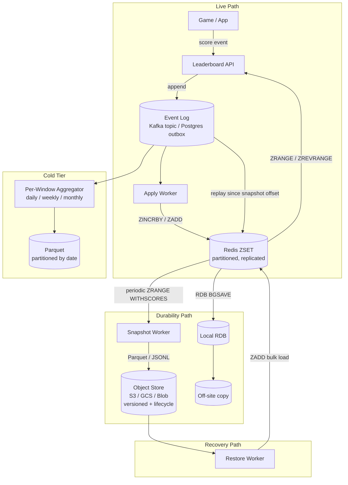

# Periodic Snapshots — Durable Backup, RTO/RPO, and Recovery from Cache Loss

**Date:** 2026-05-01 | **Updated:** 2026-05-01
**Tags:** `system-design` `deep-dive` `leaderboard` `durability` `backup`

> **Read this first.** Redis is the *serving* store for the leaderboard. It is fast, in-memory, and replicated — but it is not, on its own, the source of truth. A cluster-wide flush, a misrouted `FLUSHALL`, an AZ failure, or a multi-replica corruption can erase live state in seconds. Durability is a separate concern, layered behind the cache: an **append-only event log** plus **periodic snapshots** to object storage. Treat the two layers as independent. The cache fails; the log does not.

## Table of Contents

- [Summary](#summary)
- [Overview](#overview)
- [Why Redis Is Not the Source of Truth](#why-redis-is-not-the-source-of-truth)
- [The Failure Modes That Snapshots Defend Against](#the-failure-modes-that-snapshots-defend-against)
- [The Event Log as Ground Truth](#the-event-log-as-ground-truth)
- [Periodic ZRANGE Snapshots to Durable Storage](#periodic-zrange-snapshots-to-durable-storage)
- [Snapshot Atomicity and the Moving-Target Problem](#snapshot-atomicity-and-the-moving-target-problem)
- [Redis-Native Durability — RDB and AOF](#redis-native-durability--rdb-and-aof)
- [RPO and RTO Targets for Leaderboards](#rpo-and-rto-targets-for-leaderboards)
- [Hybrid Recovery — Snapshot + Event Replay](#hybrid-recovery--snapshot--event-replay)
- [Cold-Tier Aggregations to Parquet](#cold-tier-aggregations-to-parquet)
- [Recovery Scenarios](#recovery-scenarios)
- [Snapshot Scheduling and Bandwidth Budget](#snapshot-scheduling-and-bandwidth-budget)
- [Verification and Drift Detection](#verification-and-drift-detection)
- [Anti-Patterns](#anti-patterns)
- [Related](#related)
- [References](#references)

## Summary

A real-time leaderboard built on Redis sorted sets has two distinct concerns that are easy to conflate but must be kept architecturally separate. The first is **serving**: ZADD/ZINCRBY on the write path, ZRANGE/ZREVRANGE/ZRANK on the read path, all answered in microseconds against an in-memory ZSET. The second is **durability**: the guarantee that every score-changing event is captured in a place that survives a Redis cluster catastrophe and can be used to rebuild the cache deterministically.

The serving layer fails more often than people expect — operator typos (`FLUSHALL` on the wrong shard), AZ-wide power events, replication-lag-then-failover that loses the tail, software upgrades that mishandle persistence files, even cosmic-ray bit flips on a hot key. When the serving layer fails, the leaderboard cannot simply be reconstructed from "what was in Redis last." The architecture must hold an independent, append-only **event log** that captured every score event before it was applied to Redis. The log — Kafka topic, Postgres outbox, or equivalent — is the source of truth. Redis is a *projection* of the log up to some offset.

Periodic **snapshots** are the optimization that turns "replay 30 days of events" into "load yesterday's snapshot and replay 8 hours of events." Snapshots are produced by walking the live ZSETs (`ZRANGE 0 -1 WITHSCORES`), serializing them to an object-store format (Parquet, JSON Lines, Protobuf), and writing to S3 / GCS / Azure Blob with strong consistency and lifecycle policies. The cadence is a tradeoff: more frequent snapshots mean shorter recovery time and bandwidth cost; less frequent snapshots mean longer replay tails.

The architectural through-line: **the event log is the truth; the snapshot is a checkpoint; Redis is a cache; recovery is the composition of the latter two**. Every property the operator wants — bounded RTO, bounded RPO, point-in-time investigation, cold-tier analytics — falls out of taking that separation seriously and refusing to let any single layer become a single point of failure.

## Overview

The leaderboard durability subsystem is layered: a hot serving tier (Redis), an authoritative event tier (Kafka or equivalent), a warm checkpoint tier (snapshots in object storage), and a cold analytics tier (per-window aggregations in Parquet). Each tier has a different consistency model, a different retention horizon, and a different failure surface.

| Tier | Storage | Retention | Purpose | Failure surface |
|---|---|---|---|---|
| Hot serving | Redis ZSET | Live | Sub-ms reads, real-time updates | AZ outage, FLUSHALL, replication failure |
| Event log | Kafka / Postgres outbox | 7–90 days | Source of truth, replay input | Broker quorum loss (rare with replication) |
| Warm checkpoint | S3 / GCS / Blob (snapshots) | 30–365 days | Bounded recovery time | Region outage |
| Cold analytics | S3 + Parquet (aggregations) | Years | Historical leaderboards, BI | Region outage |



A deliberate consequence of this layout: the Redis cluster — including its RDB and AOF files — can be lost in its entirety, and the system can rebuild the leaderboard by loading the most recent snapshot and replaying the event log from the snapshot's offset forward. The snapshot bounds recovery time; the log bounds recovery point. Together they bound the worst-case loss to "tens of seconds of in-flight events under a strict guarantee, minutes of staleness under a relaxed one."

## Why Redis Is Not the Source of Truth

Redis is an excellent serving store. It is not, on its own, an excellent durability store, and it is a category error to treat it as one. Three concrete reasons:

**Persistence is a best-effort secondary mode.** RDB snapshots are consistent point-in-time dumps but only run on a configured cadence (`save 900 1`, `save 300 10`, etc.). AOF appends every write but is only fsynced on the configured policy (`appendfsync everysec` is the common default and can lose up to one second of writes on a power event). Both are local files; without active off-site copies, an AZ-level event takes them with it.

**Replication is asynchronous by default.** Master accepts a write, returns success, and replicates to replicas in the background. A master crash before replication catches up loses the tail. The `WAIT` command can force the master to block for replica acknowledgment, but it is a per-command opt-in and does not retroactively protect writes that did not use it.

**Cluster failover can lose data.** Redis Cluster's failover protocol promotes a replica, but the promoted replica may be missing some of the writes the failed master had not yet replicated. The failure mode is silent: writes that returned success to the client never make it to the new master. For a leaderboard, this manifests as scores resetting or rank inversions that look like bugs but are durability gaps.

The right framing: Redis ZSETs are the **projection** that the application reads from, and the cluster's persistence is the **fast restart** mechanism for the projection. The **truth** is somewhere else. If the projection is wrong, the operator should be able to throw it away and rebuild it, and the architecture must make that operation routine, not heroic.

For the partition / replication mechanics that explain why even a "fully replicated" Redis cluster has these gaps, see [`../../distributed-infra/distributed-cache/replication-per-partition.md`](../../distributed-infra/distributed-cache/replication-per-partition.md).

## The Failure Modes That Snapshots Defend Against

The snapshot + log architecture is not a defense against single-replica failure (replication handles that). It is a defense against the failures where replication is not enough:

**Cluster-wide flush.** An operator types `redis-cli -h prod-leaderboard FLUSHALL` thinking they are on staging. Replicas faithfully replicate the flush. The leaderboard ZSETs are gone in milliseconds. RDB and AOF are still on disk if you got lucky with timing — but they may have been overwritten by the empty post-flush state on the next BGSAVE, depending on configuration.

**AZ failure.** The cluster's AZ loses power or network. Replicas in another AZ should take over; sometimes the failover handshake fails or the surviving replicas are too far behind. Recovery is bounded by what made it to a different AZ before the event.

**Software upgrade gone wrong.** A Redis version upgrade that mishandles RDB format or AOF rewrite can corrupt the persistence files. The replicas were upgraded too; they are corrupted in lockstep.

**Logical bugs.** A code change applies the wrong score multiplier for a few hours. The Redis ZSET is consistent — and consistently wrong. Recovery requires replaying the event log against a fixed code path.

**Cosmic-ray-class bit flips.** Rare, but real on a fleet of any size: in-memory corruption silently propagates to RDB and to replicas before anyone notices.

**Accidental KEY deletion.** A migration script intended to clear a single key matches a glob pattern that removes the leaderboard ZSET for a popular game mode mid-event. Replicas faithfully delete.

In all of these, the defense is the same: an authoritative store outside Redis that captured every score-changing event, plus a recent snapshot of the projection that turns "replay everything" into "replay since the snapshot."

## The Event Log as Ground Truth

The event log is the architectural invariant that everything else rests on. Every score-affecting event — match completed, points awarded, achievement unlocked, score adjustment — is **appended to the log before** any side-effect writes to Redis. The log carries everything needed to reproduce the Redis state: the user ID, the leaderboard ID, the score delta (or absolute score), the event timestamp, the idempotency key, and the schema version.

```text
event_log: append-only, partitioned by leaderboard_id, retained 30 days
{
  "event_id":      "evt-2026-05-01-abc123",      // idempotency key
  "leaderboard":   "global-arena",
  "user_id":       "user-9182734",
  "delta":         +50,
  "absolute":      null,
  "occurred_at":   "2026-05-01T14:23:17.084Z",
  "ingested_at":   "2026-05-01T14:23:17.091Z",
  "source":        "match-finalizer-v3",
  "schema_version":"4"
}
```

Two common implementations:

**Kafka topic.** Partition by leaderboard ID for ordering within a leaderboard. Retention 7–30 days; longer if budget allows. Compaction is *off* on the source-of-truth topic — every event matters, not just the latest per key. ([Kafka log compaction](https://kafka.apache.org/documentation/#compaction) is for derived topics, not the truth log.) The Apply Worker is a Kafka consumer that reads the log and issues Redis commands; its consumer-group offset is the bookmark of "how much of the log Redis has absorbed."

**Postgres outbox.** The application writes the score event to a Postgres `events` table inside the same transaction that writes any related domain state (user record, match record). A separate worker tails the table (via logical replication / CDC; see [Postgres logical replication](https://www.postgresql.org/docs/current/logical-replication.html)) and applies the events to Redis. The transactional outbox guarantees that if the domain write committed, the event was logged.

The two approaches have different tradeoffs (Kafka scales better for high-volume leaderboards; Postgres outbox is simpler when leaderboard updates are co-transacted with other state), but both deliver the same architectural property: **the log was written before Redis, therefore the log can rebuild Redis**.

```pseudocode
def record_score_event(event):
    # 1. Write to the event log atomically. This is the durability commit.
    log.append(
        topic="leaderboard-events",
        key=event.leaderboard_id,            # partition by leaderboard
        value=serialize(event),
        idempotency_key=event.event_id,
    )

    # 2. (Async) Apply Worker consumes log and updates Redis.
    #    If Redis is gone, the log is not — the worker resumes when Redis returns.
```

For replay, the consumer group offset is the seam: rewind the offset to a point at or before the snapshot's offset, then replay forward.

## Periodic ZRANGE Snapshots to Durable Storage

The snapshot is a serialized form of every leaderboard ZSET at a known offset of the event log. Producing it is mechanical: walk each ZSET with `ZRANGE 0 -1 WITHSCORES` (or the cursor-based `ZSCAN` for large sets to avoid blocking), pair each member with its score, write the pairs to an object-store file along with metadata.

```pseudocode
def snapshot_leaderboard(lb_id):
    # 1. Read the current consumer offset of the Apply Worker.
    #    This becomes the "as-of" offset for the snapshot.
    snap_offset = apply_worker.committed_offset(topic="leaderboard-events",
                                                partition=partition_for(lb_id))

    # 2. Walk the ZSET. ZSCAN is non-blocking on large sets.
    rows = []
    cursor = 0
    while True:
        cursor, batch = redis.zscan(f"lb:{lb_id}", cursor, count=10_000)
        for member, score in batch:
            rows.append((member, score))
        if cursor == 0:
            break

    # 3. Serialize. Parquet for size + columnar reads; JSONL if simplicity matters.
    body = parquet_encode(
        schema=["member: utf8", "score: float64"],
        rows=rows,
    )

    # 4. Write to object store with metadata describing the as-of point.
    s3.put_object(
        Bucket="lb-snapshots",
        Key=f"leaderboard/{lb_id}/dt={today}/seq={snap_offset}.parquet",
        Body=body,
        Metadata={
            "leaderboard_id": lb_id,
            "as_of_offset":   str(snap_offset),
            "as_of_wall":     iso8601(now()),
            "row_count":      str(len(rows)),
            "schema_version": "4",
            "sha256":          sha256(body).hex(),
        },
        ServerSideEncryption="AES256",
    )
```

Three properties to enforce on the object store side:

- **Versioning enabled.** ([S3 Versioning](https://docs.aws.amazon.com/AmazonS3/latest/userguide/Versioning.html)) Every write produces a new version; deletes are tombstones, not destructive. This protects against the operator who runs the wrong cleanup script on the snapshot bucket.
- **Lifecycle policies.** Snapshots transition to lower-cost storage after 30/60/90 days and expire on a defined schedule (typically 365 days for warm tier, multi-year for cold tier).
- **Cross-region replication.** Snapshots in a single region are still vulnerable to regional events. Replicate to a second region asynchronously; the snapshot is durability infrastructure and should outlive any single-region disaster.

The output format choice matters less than the discipline of writing it. Parquet is the right default — columnar, compressible, queryable directly with Athena / BigQuery / Trino without rehydrating to Redis ([Apache Parquet](https://parquet.apache.org/)). JSONL is acceptable for small leaderboards and avoids the Parquet dependency. Protobuf binary is appropriate when the leaderboard schema is shared with another binary consumer.

## Snapshot Atomicity and the Moving-Target Problem

A naive ZRANGE-based snapshot has a subtle correctness bug: ZSETs change *during* the scan. `ZSCAN` with cursor-based iteration does not give you a frozen snapshot; it gives you a guaranteed-no-misses guarantee for elements present at both start and end of the scan, but elements added or removed mid-scan may or may not appear, and scores updated mid-scan reflect the moment of the read, not the start of the scan.

For a leaderboard, this manifests as: the snapshot has user A with score 100, user B with score 250, but the *real* state at any single moment had user A at 105 and user B at 245. No instant in time produced the snapshot's state. This is fine for a "good enough" recovery target — the event log will close the gap on replay — but it is *not* fine if the snapshot is used as the canonical answer for "what was the leaderboard at time T."

Three strategies, in increasing cost order:

**Snapshot from a replica.** Direct the snapshot worker at a Redis replica with replication paused. ZSCAN against the paused replica produces a self-consistent snapshot of whatever the replica had absorbed up to the pause moment. The replica resumes after; its lag drains in seconds. This is the production default for Redis Cluster setups: snapshots are taken on a replica that is briefly removed from the read pool.

**Use BGSAVE on a replica + parse the RDB.** RDB is a point-in-time fork (see next section). Parse the RDB file directly with a library like `redis-rdb-tools` to extract ZSET state at the BGSAVE moment. This is the strongest atomicity guarantee but adds the RDB parser dependency and is more brittle on Redis version upgrades.

**Replication WAIT for read-after-write consistency.** When the snapshot worker reads the apply worker's committed offset and then issues `WAIT N timeout` on the master, it forces the master to confirm that at least N replicas are caught up to the master's last-acknowledged write. ([Redis WAIT](https://redis.io/commands/wait/)) The snapshot worker can then reasonably assume that the replica it's about to scan reflects state at or beyond the read offset.

```pseudocode
def consistent_snapshot(lb_id):
    # 1. Note the apply-worker offset BEFORE doing anything else.
    target_offset = apply_worker.committed_offset(...)

    # 2. Force replicas to catch up to master's most-recent write.
    #    Returns the number of replicas that acknowledged.
    acked = redis_master.execute("WAIT", 1, 5000)   # 1 replica, 5s timeout
    if acked < 1:
        raise SnapshotAbort("replica did not catch up within timeout")

    # 3. Pause replication on the chosen replica (out of read pool first).
    snap_replica.execute("REPLICAOF", "NO", "ONE")

    # 4. Scan the (now-frozen) replica.
    rows = scan_zset(snap_replica, lb_id)

    # 5. Resume replication; replica catches up.
    snap_replica.execute("REPLICAOF", master_host, master_port)

    # 6. Persist with target_offset as the as-of marker.
    write_to_s3(rows, as_of_offset=target_offset)
```

The WAIT-based approach gives a useful approximation: "snapshot reflects state at or beyond offset X of the event log; events past X may or may not be included; replay from X+1 onward will produce the correct state." This is exactly the semantic the recovery flow needs.

## Redis-Native Durability — RDB and AOF

Redis ships with two persistence mechanisms that are useful for *fast restart* but are not a substitute for the event log:

**RDB (point-in-time snapshots).** `BGSAVE` ([Redis BGSAVE](https://redis.io/commands/bgsave/)) forks the Redis process; the child writes a point-in-time binary dump of the entire keyspace to disk. The fork uses copy-on-write so the parent keeps serving requests with negligible pause. RDB files are compact, fast to load on restart, and binary-stable across Redis minor versions. They are the right tool for "Redis crashed; restart and reload the most recent snapshot in seconds." They are *not* the right tool for "the cluster was flushed an hour ago" — by then the next BGSAVE has overwritten the local RDB with empty state, and your only defense is the off-site copy.

**AOF (append-only file).** Every write command is appended to a log file; on restart, Redis replays the file. With `appendfsync everysec` (the recommended balance), writes can be lost up to 1 second on a power event. With `appendfsync always`, every write is fsynced — durable but at meaningful latency cost. AOF rewrites compact the log periodically. ([Redis Persistence](https://redis.io/docs/management/persistence/))

The right configuration for a serving leaderboard is **both**: RDB on a 5–15 minute cadence for fast restart, AOF on `everysec` for tighter recovery point. Both files copied off-site every few minutes (rclone to S3, an init container that streams AOF, etc.).

The critical disclaimer: **RDB and AOF protect against process crash and host loss; they do NOT protect against logical events that propagate through the cluster (FLUSHALL, bad migration, software bug) because those events get faithfully recorded in both files**. A FLUSHALL is recorded as a FLUSHALL in the AOF; replaying the AOF replays the flush. For those events, the only defense is the external event log.

| Mechanism | Protects against | Does NOT protect against |
|---|---|---|
| Replication | Single-node crash | Logical events (replicated faithfully) |
| RDB local | Process crash, fast restart | AZ failure, FLUSHALL (overwritten by next save) |
| AOF local | Process crash, last-seconds | AZ failure, FLUSHALL (replayed faithfully) |
| RDB off-site copy | AZ / region failure | Stale (cadence-bound) |
| External event log + snapshots | All of the above | (foundation) |

## RPO and RTO Targets for Leaderboards

The two recovery metrics:

- **RPO — Recovery Point Objective.** "How much data, expressed as a window of time, can we afford to lose?" Tightening RPO means more frequent snapshots / synchronous replication / bigger ingest budget.
- **RTO — Recovery Time Objective.** "How long can the leaderboard be down or stale before we have a problem?" Tightening RTO means more recent snapshots (less replay), pre-warmed standby clusters, automated runbooks.

For a real-time leaderboard, the typical target shape:

| Workload class | RPO | RTO | Notes |
|---|---|---|---|
| Casual social game leaderboard | 1–5 minutes | 5–15 minutes | Players notice but tolerate a brief blip |
| Competitive PvP / esports board | < 30 seconds | 1–3 minutes | Rank changes mid-tournament are a real complaint |
| Money-on-the-line (gambling/fantasy) | < 5 seconds | < 60 seconds | Closer to financial-system durability |
| Internal company "sales leaderboard" | minutes | minutes | Cosmetic; no urgency |

The minutes-class targets are very achievable with the architecture in this document: 1-minute snapshot cadence + Kafka log + tested restore = sub-minute RPO and a few-minute RTO. Pushing into seconds-class for high-stakes boards requires synchronous replication of the event log, pre-warmed standby Redis clusters, and tested automatic failover — meaningful additional cost.

The inverse mistake is pretending leaderboards need stock-exchange-class durability ([`../../payment/stock-exchange/audit-replay-regulatory-feeds.md`](../../payment/stock-exchange/audit-replay-regulatory-feeds.md)). Most leaderboards do not. A leaderboard that's stale by 30 seconds is a UX issue, not a regulatory event. Right-size the budget to the actual blast radius.

For the broader DR catalog this fits into, see [`../../../reliability/disaster-recovery.md`](../../../reliability/disaster-recovery.md).

## Hybrid Recovery — Snapshot + Event Replay

Recovery is the composition of "warm Redis from the most recent snapshot" and "replay events since the snapshot's offset." Neither alone is sufficient: snapshot alone leaves a gap of unapplied events; replay-from-zero is too slow on any leaderboard with meaningful history.

```pseudocode
def recover(lb_id, target_offset=None):
    # 1. Locate the most recent snapshot ≤ target offset (or latest if no target).
    snap = s3.find_latest_snapshot(
        prefix=f"leaderboard/{lb_id}/",
        before_offset=target_offset,
    )
    print(f"using snapshot at offset {snap.as_of_offset} ({snap.as_of_wall})")

    # 2. Bulk-load into Redis.
    redis.delete(f"lb:{lb_id}")                 # ensure clean slate
    pipeline = redis.pipeline(transaction=False)
    for member, score in parquet_iter(snap.body):
        pipeline.zadd(f"lb:{lb_id}", {member: score})
        if pipeline.command_count >= 10_000:
            pipeline.execute()
            pipeline = redis.pipeline(transaction=False)
    pipeline.execute()

    # 3. Replay events from snapshot offset forward.
    #    Idempotency on event_id ensures replaying past events is safe.
    apply_worker.set_consumer_offset(
        topic="leaderboard-events",
        partition=partition_for(lb_id),
        offset=snap.as_of_offset,
    )
    apply_worker.run_until(target_offset or "live")
```

Three discipline points:

**Idempotency on `event_id`.** The replay must be safe to re-execute the same event multiple times. The Apply Worker tracks recently-applied event IDs (a Redis set with TTL is a common implementation) and skips duplicates. Without this, recovery from a snapshot taken mid-batch causes double-counting.

**ZINCRBY vs ZADD semantics.** Events that carry a score *delta* must use `ZINCRBY`; events that carry an *absolute score* must use `ZADD`. Mixing the two on replay corrupts state. The event log records which it was; the worker dispatches accordingly.

**Bulk loading via pipeline.** Naive ZADD-per-RPC for a million-member leaderboard takes minutes; a pipelined bulk load takes seconds. Use Redis pipelines (no MULTI/EXEC overhead) and batch in chunks of 5–10k commands.

The recovery worker is the single most important piece of code in the durability story, and it should be **rehearsed on a schedule** — monthly or quarterly DR drill that takes the most recent snapshot, restores into a non-production cluster, and validates the result against the live serving cluster's ZRANGE output. A recovery procedure that has never been run in anger is a procedure that does not work.

## Cold-Tier Aggregations to Parquet

The hot snapshot serves recovery. The cold tier serves analytics, historical leaderboards, and "what was the top 100 on March 15?" queries — and it serves them at S3 + Parquet cost, not at Redis cost. A typical cold-tier pipeline:

```text
event log (Kafka)
    │
    ├──> Apply Worker ──> Redis (live serving)
    │
    └──> Aggregator ──> per-window Parquet
                        s3://lb-cold/period=daily/dt=2026-05-01/lb=global-arena.parquet
                        s3://lb-cold/period=weekly/year=2026/week=18/lb=global-arena.parquet
                        s3://lb-cold/period=monthly/year=2026/month=05/lb=global-arena.parquet
```

The aggregator reads the event log and produces per-window leaderboard projections. Daily files contain "final ranking on day D"; weekly contain "final ranking for the week of W"; monthly the same. They are immutable once the window closes, partitioned by date for cheap range queries, and queryable directly from Athena / BigQuery / Trino / DuckDB without rehydrating to Redis.

This is also where **rolling-window leaderboards** get their cold tier. Daily-board state for 90 days back can live in Parquet rather than in 90 distinct Redis ZSETs ([`./rolling-windows.md`](./rolling-windows.md)). The hot serving path keeps the live window in Redis; the cold tier serves any historical window with a few seconds of query latency, which is acceptable for "show me my best week last quarter" features.

For tournament-mode leaderboards ([`./tournament-mode.md`](./tournament-mode.md)) the closed-tournament final standings are written to a Parquet partition once the tournament ends, the tournament's hot ZSET is dropped from Redis, and historical queries serve from cold storage.

## Recovery Scenarios

**Full rebuild.** Cluster is gone; rebuild from scratch.

1. Provision fresh Redis cluster.
2. For each leaderboard, locate the most recent snapshot in S3.
3. Bulk-load into Redis.
4. Set Apply Worker consumer offset to the snapshot's `as_of_offset`.
5. Replay events forward; the worker overshoots the snapshot's gap and converges to live.
6. Once consumer lag is zero, switch traffic from "maintenance mode" to live.

Typical wall-clock for a 10M-member leaderboard with 1-minute snapshot cadence: 2–5 minutes restore + sub-minute replay catch-up.

**Partial restore.** A single leaderboard ZSET is corrupted (logical bug, accidental delete, etc.); other leaderboards are healthy.

1. Pause traffic for the affected leaderboard.
2. `DEL lb:<id>` to clear corruption.
3. Restore that leaderboard's snapshot.
4. Replay only that partition's events from the snapshot offset.
5. Resume traffic.

The other leaderboards never noticed.

**Point-in-time recovery.** Investigation requires "what did this leaderboard look like at 14:23:17 UTC last Tuesday?"

1. In a non-production cluster, restore the snapshot whose as-of offset is at or before the target time.
2. Replay events from the snapshot offset forward, stopping at the target time.
3. Read out the ZRANGE.

This is the same flow as full recovery, capped at a target offset rather than running to live. It is the analog of stock-exchange-style replay ([`../../payment/stock-exchange/audit-replay-regulatory-feeds.md`](../../payment/stock-exchange/audit-replay-regulatory-feeds.md)) for leaderboards — same architecture, looser tolerance.

**Logical bug rollback.** A code change applied bad scoring for two hours; the fix is deployed, but the live ZSET reflects two hours of bad data.

1. Determine the offset at which the bad code was deployed; call it `B`.
2. In a sandbox, restore the snapshot whose as-of offset ≤ `B`.
3. Replay events forward through `B` and beyond, *using the fixed code path*.
4. Verify the sandbox state.
5. Promote the sandbox state to production by atomic ZSET swap (e.g., write to `lb:<id>:new`, RENAME to `lb:<id>` after verification).

The replay-with-fixed-code mode is the killer feature of an event-log-backed architecture: bugs that would be unrepairable in a Redis-only system are repairable here because the truth is the log, not the projection.

## Snapshot Scheduling and Bandwidth Budget

The snapshot cadence is a multi-variable tradeoff:

- **Bandwidth out of Redis.** Each snapshot reads every member of every ZSET. A leaderboard with 10M members at ~32 bytes/member yields ~320 MB per snapshot. At a 1-minute cadence, ~5 GB/s aggregate read rate across the snapshot fleet.
- **Object-store write cost.** Per-PUT cost in S3 is small but adds up at high cadence; per-GB cost adds up over retention windows.
- **Replay tail length.** Cadence is the bound on how far back the Apply Worker must replay. 1-minute cadence ⇒ at most 1 minute of replay; 1-hour cadence ⇒ up to 1 hour.
- **Snapshot freshness.** For point-in-time investigation, finer cadence means closer match to the desired time.

A reasonable starting point for most production leaderboards:

| Leaderboard size | Cadence | Per-snapshot size | Daily snapshot count | Daily storage |
|---|---|---|---|---|
| < 1M members | 1 min | < 32 MB | 1,440 | < 46 GB |
| 1–10M | 5 min | 32–320 MB | 288 | < 92 GB |
| 10–100M | 15 min | 320 MB–3 GB | 96 | < 290 GB |
| > 100M | 30 min | > 3 GB | 48 | depends |

Lifecycle policies prune to keep storage bounded — typically retain 1-minute granularity for 24 hours, 5-minute for 7 days, 1-hour for 30 days, daily for 365 days, monthly indefinitely (cold tier).

**Stagger across leaderboards.** Don't snapshot every leaderboard at the same wall-clock minute; stagger to flatten the bandwidth curve. A scheduler that issues snapshots at `(hash(lb_id) % 60)` seconds spreads load uniformly across each minute.

**Take snapshots from replicas, not the master.** ZSCAN is non-blocking but it does consume CPU and network. Snapshots run on a designated read-replica that is briefly removed from the serving pool, scanned, then returned.

## Verification and Drift Detection

A snapshot the operator never tested is a snapshot that does not work. The discipline is:

**Spot-check on every snapshot write.** After writing the snapshot, sample N random members from the ZSET (`ZRANDMEMBER`) and verify their scores match what the snapshot serialized. Mismatch is an immediate page — the snapshot worker is faulty.

**Periodic full diff in a sandbox.** Once per week, restore the most recent snapshot into a non-production cluster, replay events to live, and diff every member/score against the live cluster. The diff should be empty. Nonempty diff is a bug in the apply path or the snapshot path; surface it before recovery is needed.

**Idempotency check.** Replay the most recent N events into the sandbox a second time. ZSET state should be unchanged (idempotency contract). State change ⇒ a path is missing the idempotency key check.

**Snapshot integrity.** Each snapshot embeds a SHA-256 of its content (in the metadata or a sidecar file). Restore loads the body, recomputes the hash, compares. Mismatch ⇒ refuse to use the snapshot, fall back to an earlier one.

**Cross-region copy validation.** If the snapshot is replicated to a second region, periodically verify the secondary copy by listing objects and checking ETags against the primary.

The verification jobs are cheap — minutes of compute per day — and they convert an unobservable failure (silently bad snapshots discovered the day you need them) into an observable one (paged on the next periodic verification).

## Anti-Patterns

**Treating Redis RDB / AOF as primary durability.** They are local files. AZ events take them. Logical events (FLUSHALL, bad migration) are faithfully replayed by them. The serving layer's persistence is a fast-restart convenience; the durability story lives outside Redis.

**No event log; snapshots only.** Snapshots without an event log mean recovery ends at the most recent snapshot — anything since then is gone. The whole point of the architecture is that the gap between snapshots is closed by replay.

**RDB-only with no off-site copy.** "We have RDB enabled" is not durability if the RDB lives on the same host that just caught fire. Off-site copy on a few-minutes cadence is non-negotiable.

**Infrequent snapshots with a lossy event log.** Worst of both worlds: hour-cadence snapshot + Kafka with 24-hour retention + a 25-hour outage = data gone. Either tighten snapshots, or extend log retention, or both. The math: `RPO ≤ snapshot_cadence`, `replay_window ≤ log_retention`. Both must be sized for the worst-case incident length.

**Snapshot from the master under load.** A naive ZSCAN against a busy master takes CPU and network from the serving path. Use a replica that's briefly removed from the read pool.

**No `WAIT` on master before snapshotting from replica.** Without WAIT, the replica may be lagged behind the master at the moment of snapshot, and the snapshot's as-of offset is ambiguous. Force replica catch-up before scanning.

**No idempotency key on events.** Replay double-counts every event. Recovery from a snapshot is a bug-introduction event rather than a bug-repair event.

**Conflating absolute and delta events.** ZINCRBY for an absolute event multiplies bad state on replay; ZADD for a delta event overwrites accumulated state. Tag events explicitly and dispatch in the worker.

**Storing snapshots without versioning.** A misrouted lifecycle rule or a bad cleanup script that deletes the snapshot bucket is a single point of failure in the recovery story. S3 Versioning + Object Lock is cheap insurance.

**Single-region snapshot store.** A region-wide event takes the snapshots with it. Cross-region replication of the snapshot bucket is the floor.

**Snapshot worker has no "abort on inconsistency" path.** A snapshot worker that silently writes a bad snapshot (unable to confirm WAIT, partial scan, hash mismatch) leaves a landmine for future recovery. Abort and alert; do not write a snapshot you cannot vouch for.

**Recovery code that has never been exercised.** A recovery path that has not run in a DR drill is a path that has bit-rotted. Schedule DR drills, run them, fix what breaks, repeat.

**Treating the cold tier as a substitute for the hot tier.** Parquet aggregations are for analytics and historical queries; they are not the durability primitive. The durability primitive is the event log + the most recent snapshot. The cold tier is a downstream consumer.

**Compacting the source-of-truth event log.** Kafka log compaction on the truth topic destroys event history, leaving only "last known value per key." Replay from compacted log produces incorrect intermediate states. Compaction is for derived caches, not the truth log.

**Trusting "Redis snapshot disk usage" to bound RTO.** Disk usage is not RTO. RTO is wall-clock time to provision Redis, load snapshot, replay tail, validate, and switch traffic. Measure it on real drills; do not estimate.

**Skipping the spot-check on snapshot write.** A bad snapshot worker can silently produce empty or malformed snapshots for weeks. A few-second spot-check at write time catches it before it matters.

**Mixing the durability budget with the latency budget.** The serving path's latency target (sub-millisecond) and the durability path's RPO (seconds-to-minutes) are different conversations. Don't sacrifice the serving path to tighten durability beyond what the use case actually needs; the right tool for tighter durability is more frequent snapshots and synchronous log replication, not making the serving path slower.

For the broader batch-vs-stream framing this fits into — when to use the stream pipeline (live serving + event log) vs. the batch pipeline (cold-tier Parquet aggregations) — see [`../../../batch-and-stream/batch-vs-stream-processing.md`](../../../batch-and-stream/batch-vs-stream-processing.md).

## Related

- [`./redis-sorted-set-internals.md`](./redis-sorted-set-internals.md) — the ZSET data structure (skiplist + hashtable), ZSCAN cursor semantics, and why ZRANGE-WITHSCORES is the right primitive for snapshot reads.
- [`./rolling-windows.md`](./rolling-windows.md) — daily/weekly/monthly windowed leaderboards; the cold-tier Parquet partitions are how older windows live outside Redis.
- [`./tournament-mode.md`](./tournament-mode.md) — short-lived tournament leaderboards; final standings get written to Parquet at tournament close, the hot ZSET is dropped, and history serves from cold storage.
- [`../design-realtime-leaderboard.md`](../design-realtime-leaderboard.md) — the parent integration HLD; this deep dive expands its "Periodic Snapshots to Durable Storage" subsection.
- [`../../distributed-infra/distributed-cache/replication-per-partition.md`](../../distributed-infra/distributed-cache/replication-per-partition.md) — the Redis Cluster replication model that explains why even a "fully replicated" cache is not by itself a durability tier.
- [`../../../reliability/disaster-recovery.md`](../../../reliability/disaster-recovery.md) — the broader DR strategy catalog this leaderboard durability story is one instance of; RPO/RTO target setting, drill cadence, and runbook structure.
- [`../../../batch-and-stream/batch-vs-stream-processing.md`](../../../batch-and-stream/batch-vs-stream-processing.md) — the stream side (live event log → Redis) and the batch side (per-window aggregations → Parquet) frame this architecture.

## References

- Redis, ["BGSAVE"](https://redis.io/commands/bgsave/) — the official command reference for the fork-based RDB snapshot mechanism, including the copy-on-write semantics that allow snapshotting under load.
- Redis, ["Persistence (RDB and AOF)"](https://redis.io/docs/management/persistence/) — the canonical Redis persistence guide covering RDB intervals, AOF fsync policies, AOF rewrites, and the tradeoffs between durability and throughput.
- Redis, ["WAIT"](https://redis.io/commands/wait/) — the per-command synchronous-replication primitive used to force replica catch-up before snapshotting from a replica.
- Redis, ["ZRANGE"](https://redis.io/commands/zrange/) — the sorted-set range command underlying snapshot reads; covers `WITHSCORES`, `BY SCORE`, `LIMIT`, and the related ZSCAN cursor scan that is non-blocking on large ZSETs.
- AWS, ["S3 Versioning"](https://docs.aws.amazon.com/AmazonS3/latest/userguide/Versioning.html) — bucket-level versioning that turns deletes into tombstones and protects snapshot history against operator error and lifecycle misconfiguration.
- Apache Kafka, ["Log Compaction"](https://kafka.apache.org/documentation/#compaction) — the Kafka feature that retains the latest value per key and discards older messages; the explicit reference for *what not to enable on the source-of-truth event log*, while remaining a useful tool for derived materialized-state topics.
- PostgreSQL, ["Logical Replication"](https://www.postgresql.org/docs/current/logical-replication.html) — the official documentation for logical replication and CDC, the mechanism that turns a Postgres outbox table into a streaming event log when Kafka is not in the stack.
- Apache Parquet, ["Apache Parquet"](https://parquet.apache.org/) — the columnar file format used for snapshot bodies and cold-tier aggregations; covers compression, predicate pushdown, and the schema-evolution rules that matter when leaderboard schemas change over time.
- Kleppmann, *Designing Data-Intensive Applications*, Chapters 5 ("Replication") and 11 ("Stream Processing") — the foundational treatment of write-ahead logs, replication models, and event-log architectures that this document specializes for the leaderboard case.
- Confluent, ["The Log: What every software engineer should know about real-time data's unifying abstraction"](https://engineering.linkedin.com/distributed-systems/log-what-every-software-engineer-should-know-about-real-time-datas-unifying) — Jay Kreps' canonical essay arguing that the append-only log is the foundation for derived state systems; the conceptual basis for treating Redis as a projection of an external event log.
