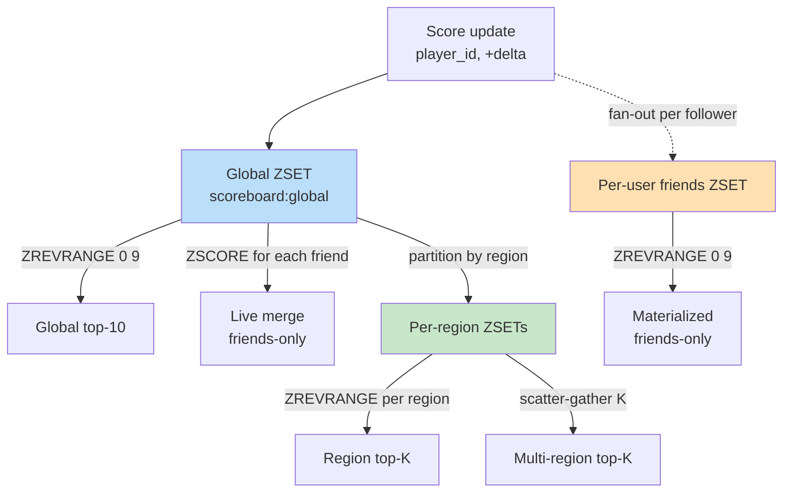

# Top-K Queries — Global, Friends-Only, Region-Sliced, and Cached Pages

**Date:** 2026-05-01 | **Updated:** 2026-05-01
**Tags:** `system-design` `deep-dive` `leaderboard` `top-k` `queries`

> **Companion to:** [`../design-realtime-leaderboard.md`](../design-realtime-leaderboard.md) — this doc expands the *Top-K Queries — Global vs Friends-Only vs Region* subsection with the read-path mechanics, fan-out tradeoffs, caching patterns, and the data-structure choices that decide whether a leaderboard scales to a million reads per second or melts under a hot fanout.

## Summary

A leaderboard is mostly a read system. Writes update one score; reads ask "who's on top?" — and the variety of *who* multiplies the cost. **Global top-K** is trivial: one `ZREVRANGE 0 K-1` call, sub-millisecond, and a cached payload can serve a million reads per second from a single Redis result. **Friends-only top-K** is harder: each viewer has a different friend set, so there is no single ZSET to slice. You either pre-materialize a friends-board per viewer (write fan-out, like a Twitter timeline), or live-merge each viewer's friends from the global ZSET on read (read fan-out). **Region-sliced top-K** partitions the world into per-region ZSETs and serves them locally; multi-region top-K then becomes a scatter-gather across regions with bounded K. Filtered top-K (level 80+, paid users only, this season) needs either secondary indexes or post-filter padding. And at extreme scale — billions of distinct keys, streaming counters — exact ZSETs are too expensive in memory and a **Count-Min Sketch + min-heap** approximate top-K becomes the right tool. This doc walks through each variant, gives the Redis commands and code, lays out the worked example for "100K friends, top-10," covers caching and pagination, and ends with the long anti-pattern list that catches teams shipping their first leaderboard.

## Table of Contents

- [Summary](#summary)
- [Overview](#overview)
- [Global Top-K — The Easy Case](#global-top-k--the-easy-case)
- [ZREVRANGE WITHSCORES and Pagination](#zrevrange-withscores-and-pagination)
- [Caching the Top-K Page](#caching-the-top-k-page)
- [User's Nearby Rank Query](#users-nearby-rank-query)
- [Friends-Only Top-K — The Hard Case](#friends-only-top-k--the-hard-case)
- [Live Merge — Read Fan-Out](#live-merge--read-fan-out)
- [Pre-Materialized Friends-Board — Write Fan-Out](#pre-materialized-friends-board--write-fan-out)
- [Live Merge vs Pre-Materialized — When to Pick Which](#live-merge-vs-pre-materialized--when-to-pick-which)
- [Region-Sliced Top-K](#region-sliced-top-k)
- [Multi-Region Top-K — Scatter-Gather](#multi-region-top-k--scatter-gather)
- [Filtered Top-K](#filtered-top-k)
- [Top-K in Cassandra and DynamoDB](#top-k-in-cassandra-and-dynamodb)
- [Approximate Top-K — Count-Min Sketch + Heap](#approximate-top-k--count-min-sketch--heap)
- [Worked Example — 100K Friends, Top-10](#worked-example--100k-friends-top-10)
- [Anti-Patterns](#anti-patterns)
- [Related](#related)
- [References](#references)

## Overview

A "top-K" query has three knobs that change the cost dramatically:

1. **Scope** — global, friends-only, region, guild, season, level-band.
2. **K** — top-10 vs top-1000 vs full leaderboard scroll.
3. **Freshness** — real-time, 1-second-stale (cached), 1-minute batch.

A read-optimized leaderboard treats each combination differently. Global top-10 with 1-second TTL is one Redis call cached at the edge. Friends-only top-10 over a 100K-friend social graph is hundreds of `ZSCORE` calls or a pre-materialized board write per friend per score update. They are not the same problem.



Each path has its own fan-out cost, latency profile, and storage footprint. The rest of this doc walks them in order from easy to hard.

## Global Top-K — The Easy Case

A single Redis sorted set keyed `scoreboard:global` holds `(player_id, score)` pairs. The top-K query is one command:

```text
> ZREVRANGE scoreboard:global 0 9 WITHSCORES
 1) "alice"
 2) "9821"
 3) "bob"
 4) "9540"
 5) "carol"
 6) "9311"
 ...
```

In Redis, the sorted set is a skip list combined with a hash table. `ZREVRANGE 0 K-1` walks the head of the skip list — `O(log N + K)` — which for K=10 and N=100M is well under a millisecond. See [`./redis-sorted-set-internals.md`](./redis-sorted-set-internals.md) for the data-structure mechanics; see [`../../../data-structures/skip-lists.md`](../../../data-structures/skip-lists.md) for the underlying skip-list theory.

A few crucial properties:

- **K should be small.** `ZREVRANGE 0 -1` returns the full leaderboard — `O(N)` — and at 100M players that's a multi-GB response that blocks the Redis event loop. Cap K in the API layer.
- **Sharding affects this.** If `scoreboard:global` is sharded across S nodes (see [`./sharded-score-aggregation.md`](./sharded-score-aggregation.md)), top-K becomes a scatter-gather: pull top-K from each shard, merge K×S items, return the global top-K. K stays small, S stays small (≤ 32 in practice), so the merge cost is negligible.
- **Score ties** are broken by lexicographic order of the member name. If you need deterministic ordering across reads, encode a tie-breaker into the score itself; see [`./tie-breaking.md`](./tie-breaking.md).

## ZREVRANGE WITHSCORES and Pagination

The two natural paginations are **stable** (ranks 1–10, 11–20, 21–30) and **scrolling** (cursor-based, "give me the next 10 below score=9311").

**Stable, offset-based:**

```python
# global_topk.py — stable rank pagination
import redis

r = redis.Redis(host="cache", port=6379)

def top_page(page: int, size: int = 10) -> list[tuple[str, float]]:
    start = page * size
    end = start + size - 1
    raw = r.zrevrange("scoreboard:global", start, end, withscores=True)
    return [(name.decode(), score) for name, score in raw]

# page 0 → ranks 1..10
# page 1 → ranks 11..20
# page 99 → ranks 991..1000
print(top_page(0, 10))
```

This works fine for shallow pages. Deep pages (`page=10000`) are still fast in Redis because skip-list rank lookup is `O(log N)`, but the API layer should still cap at a sane max page (e.g., page 500) to bound abuse and the cache key cardinality.

**Scrolling, score-cursor based:**

```python
# scroll_topk.py — cursor-based pagination by score
def scroll_below(prev_score: float, prev_member: str, size: int = 10):
    """Return the next page below (prev_score, prev_member).

    Uses ZREVRANGEBYSCORE with an exclusive upper bound. Members with
    the same score as prev_score but lex-greater than prev_member are
    skipped on the client side because Redis ZRANGEBYSCORE doesn't
    support compound (score, member) cursors.
    """
    raw = r.zrevrangebyscore(
        "scoreboard:global",
        max=f"({prev_score}",   # exclusive
        min="-inf",
        start=0, num=size,
        withscores=True,
    )
    return [(name.decode(), score) for name, score in raw]
```

Score cursors are stable across new writes — adding a brand-new high score doesn't shift the cursor of someone scrolling at rank 5000. Offset cursors aren't: a new entry pushes everyone's offset by one, and a user paginating past it sees a duplicate. For UIs that emphasize "see what's directly below your friend group right now," score cursors are the right tool.

`ZREVRANGEBYSCORE` is the dual of `ZRANGEBYSCORE`; both are documented at [https://redis.io/commands/zrevrangebyscore/](https://redis.io/commands/zrevrangebyscore/).

## Caching the Top-K Page

Global top-10 is the **most-cacheable** query in any leaderboard system. Every viewer sees the same response. A 1-second TTL on the rendered page collapses every read in that second into one Redis call. At 1 million reads per second, that's 999,999 reads served from cache and 1 read served from Redis — not because Redis can't handle 1M QPS, but because the response payload is identical.

```python
# cached_topk.py — cache the top-K page at the edge
TOP_K_TTL = 1.0  # seconds
_cache: dict[str, tuple[float, list]] = {}

def cached_top10() -> list:
    now = time.monotonic()
    cached = _cache.get("global:10")
    if cached and now - cached[0] < TOP_K_TTL:
        return cached[1]
    fresh = top_page(0, 10)
    _cache["global:10"] = (now, fresh)
    return fresh
```

In production this lives in:

- A **CDN edge cache** with a 1–2 second TTL on the JSON response.
- A **Varnish or NGINX** layer with `proxy_cache_lock on` to single-flight the upstream miss.
- An **in-process LRU** in the API server as a tier-0 cache.

See [`../../../building-blocks/caching-layers.md`](../../../building-blocks/caching-layers.md) for the broader cache-tier discussion.

**TTL choice tradeoffs:**

| TTL | Freshness | Origin QPS at 1M user reads/sec | Use case |
|---|---|---|---|
| 0 (no cache) | Real-time | 1,000,000 | Don't do this |
| 250 ms | Near-real-time | 4,000 | Esports live event tickers |
| 1 s | Standard | 1,000 | Regular leaderboards |
| 5 s | Soft-real-time | 200 | Casual game post-match |
| 60 s | Periodic | ~17 | Weekly summary widget |

A 1-second TTL is the sweet spot for most consumer-facing leaderboards. The user perceives it as live (their score update doesn't appear instantly in *their own* leaderboard view, but it appears in the next request, which is well under their reaction time).

**Single-flighting the miss.** Without it, when the cache expires, every concurrent reader in that millisecond races to refill it — a thundering herd against Redis. Use `proxy_cache_lock` (NGINX), Varnish's `req.hash_always_miss=false` with grace, or in-app per-key mutexes. The pattern is "first miss fetches, others wait for the result."

**Stale-while-revalidate.** Serve the stale value while the refresh runs in the background. `Cache-Control: max-age=1, stale-while-revalidate=5` lets a user see a 1.5-second-old leaderboard while the cache repopulates instead of paying the latency hit on miss.

## User's Nearby Rank Query

A common UI pattern: "show me where I am on the leaderboard, with a window of N players around me."

```text
Rank 4998: SilentFox      9342
Rank 4999: Nimbus         9341
Rank 5000: Aurora         9340  <-- you
Rank 5001: Ember          9338
Rank 5002: WolfPack       9337
```

Two Redis calls implement this:

```python
# nearby_rank.py — show user with a window of context above and below
def show_user_with_window(user: str, window: int = 2) -> list[tuple[int, str, float]]:
    rank = r.zrevrank("scoreboard:global", user)
    if rank is None:
        return []  # user not on board
    start = max(0, rank - window)
    end = rank + window
    raw = r.zrevrange("scoreboard:global", start, end, withscores=True)
    return [
        (start + i + 1, name.decode(), score)
        for i, (name, score) in enumerate(raw)
    ]
```

`ZREVRANK` is `O(log N)` — the same skip-list traversal as `ZREVRANGE` to a specific position. `ZREVRANGE` of a small window is `O(log N + window)`. The whole thing is sub-millisecond regardless of leaderboard size.

This query is **not cacheable globally** — every user sees a different window — but each user's window can be cached briefly (1–2 s) per session.

## Friends-Only Top-K — The Hard Case

A user has F friends. They want the top-10 among those F. The global ZSET doesn't help directly — there is no `ZREVRANGE_INTERSECT(scoreboard:global, friends:user_42, 0, 9)` command (well, there's `ZINTERSTORE`, but it materializes a temp ZSET and is `O(F log F)` plus the storage cost).

The two architectural options:

1. **Live merge (read fan-out).** Pull the friend list, ZSCORE each friend against the global board, sort top-K client-side. `O(F)` Redis ops per read.
2. **Pre-materialize per-user friends-board (write fan-out).** Maintain a ZSET per user containing only their friends' scores. On every score update, fan out to every follower's board. `O(followers)` Redis ops per write.

These are the same fundamental tradeoff that powers the "fan-out on write vs fan-out on read" debate in [Twitter's timeline service](https://blog.twitter.com/engineering/en_us/topics/infrastructure/2017/the-infrastructure-behind-twitter-scale).

## Live Merge — Read Fan-Out

```python
# friends_live_merge.py — read-time merge against the global ZSET
def friends_top_k_live(viewer: str, k: int = 10) -> list[tuple[str, float]]:
    """Top-K among the viewer's friends, computed at read time."""
    friend_ids = list(r.smembers(f"friends:{viewer}"))
    if not friend_ids:
        return []

    # Pipeline ZSCORE per friend — one round trip for all
    pipe = r.pipeline(transaction=False)
    for f in friend_ids:
        pipe.zscore("scoreboard:global", f)
    scores = pipe.execute()

    # Filter Nones (friends not on the board), sort top-K client-side
    pairs = [
        (f.decode(), s)
        for f, s in zip(friend_ids, scores)
        if s is not None
    ]
    pairs.sort(key=lambda p: -p[1])
    return pairs[:k]
```

**Cost analysis:**

- `SMEMBERS` returns the friend list — `O(F)` on the wire, single round trip.
- `ZSCORE` per friend is `O(1)` in Redis (hash lookup), pipelined into one round trip.
- Client-side sort is `O(F log F)` in the API process; for K small, a min-heap reduces to `O(F log K)`.
- Total: 1 `SMEMBERS` + 1 pipelined batch + a sort. ~2 round trips regardless of F.

**Where it breaks:**

- F = 5,000 (a power user) → 5,000 ZSCORE results returned per read. Wire-time dominates.
- F = 500,000 (a celebrity) → impossible. Need pagination of friends and partial top-K, or a fundamentally different design.

**Where it shines:**

- The viewer's friend list changes often (add/remove friends), so a materialized board would be churn-heavy.
- The viewer is rare (low read QPS for that viewer).
- F is bounded and small (gaming friends typically max at 200–500).

For the typical mobile game with a hard friend cap of 200, live merge is the correct default.

## Pre-Materialized Friends-Board — Write Fan-Out

The "Twitter timeline" pattern, applied to leaderboards: when a player's score changes, fan out the new score to every follower's friends-board ZSET. The follower's read becomes a single `ZREVRANGE`.

```python
# friends_materialized.py — write fan-out to per-follower ZSETs
def update_score(player: str, new_score: float):
    """Fan-out a score update to every follower's friends-board."""
    # 1. Update the global board (still useful for global top-K)
    r.zadd("scoreboard:global", {player: new_score})

    # 2. Get followers (who has this player as a friend)
    followers = r.smembers(f"followers:{player}")

    # 3. Fan-out: update each follower's friends-board
    pipe = r.pipeline(transaction=False)
    for f in followers:
        pipe.zadd(f"friends_board:{f.decode()}", {player: new_score})
    pipe.execute()


def friends_top_k_materialized(viewer: str, k: int = 10):
    raw = r.zrevrange(f"friends_board:{viewer}", 0, k - 1, withscores=True)
    return [(name.decode(), score) for name, score in raw]
```

**Cost analysis:**

- Write side: every score update fans out to N followers. Cost is `O(N)` Redis ops per update.
- Read side: one `ZREVRANGE` per read, `O(log F + K)`.
- Storage: each user's friends-board is `O(F)` ZSET entries → total storage is `O(sum of F over all users)` ≈ `O(edges in social graph)`.

**The fanout problem.** A celebrity with 1M followers, scoring 100 times a day, fans out to 1M × 100 = 100M ZADDs/day from that one user. At typical leaderboard frequency (every match) this is unsustainable.

**Hybrid: write fan-out for normal users, live merge for celebrities.** The same trick Twitter uses. If a user has > T followers (T = 10K, say), don't fan out their scores. Instead, the read path for any viewer who follows a celebrity does:

```python
def hybrid_friends_top_k(viewer: str, k: int = 10):
    # 1. Read materialized board (covers normal-user friends)
    materialized = r.zrevrange(f"friends_board:{viewer}", 0, k - 1, withscores=True)

    # 2. For celebrity friends, ZSCORE live from global board
    celebrity_friends = r.smembers(f"celeb_friends:{viewer}")
    pipe = r.pipeline(transaction=False)
    for cf in celebrity_friends:
        pipe.zscore("scoreboard:global", cf)
    celeb_scores = pipe.execute()

    # 3. Merge and re-sort top-K
    pairs = [(n.decode(), s) for n, s in materialized]
    pairs += [
        (cf.decode(), s) for cf, s in zip(celebrity_friends, celeb_scores)
        if s is not None
    ]
    pairs.sort(key=lambda p: -p[1])
    return pairs[:k]
```

**Storage budget for materialized boards.** With 100M users averaging 200 friends each:

- 100M ZSETs × 200 entries × ~50 bytes per entry ≈ **1 TB** of Redis memory just for friends-boards.
- That doesn't fit on one cluster. Shard by viewer ID. See [`./sharded-score-aggregation.md`](./sharded-score-aggregation.md).

**Write-amplification budget.** With 100M users averaging 200 followers each:

- A single score update writes to 200 ZSETs on average.
- At 1M score updates/sec → 200M ZADDs/sec across the cluster. That's a real bill.
- Fanout works only if **read QPS >> write QPS × avg_followers**. Otherwise live merge wins on ops cost.

## Live Merge vs Pre-Materialized — When to Pick Which

| Signal | Lean live merge | Lean pre-materialized |
|---|---|---|
| Avg friends per user | < 200 | Doesn't matter |
| Avg followers per user | Doesn't matter | < 1,000 (else hybrid) |
| Read QPS per viewer | Low (e.g., once per session) | High (repeated polling) |
| Write QPS per player | High (every match) | Low (rare updates) |
| Friend list churn | High (frequent add/remove) | Low (stable graph) |
| Memory budget | Tight | Loose (TB available) |
| Latency budget for reads | Has slack (10 ms+) | Tight (< 5 ms) |
| Celebrity problem | Doesn't exist | Need hybrid path |

The general rule: **if the read-to-write ratio for a given viewer is high, pre-materialize; otherwise live-merge.** For most consumer games, live merge with `SMEMBERS` + pipelined `ZSCORE` is a perfectly good default until you measure proof you need the materialized path.

## Region-Sliced Top-K

A regional board is a different ZSET per region:

```text
scoreboard:region:na     — North America
scoreboard:region:eu     — Europe
scoreboard:region:apac   — Asia-Pacific
scoreboard:region:latam  — Latin America
```

On every score update for player `alice` who lives in `na`:

```text
> ZADD scoreboard:global alice 9821
> ZADD scoreboard:region:na alice 9821
```

Top-K within a region is then a single `ZREVRANGE` against that region's ZSET — same cost as global top-K, but the data set is smaller and the cache key is `topk:region:na:10` instead of `topk:global:10`.

**Why slice by region:**

- **Latency.** A user in Tokyo querying a Redis cluster in `us-east-1` pays a 150 ms round trip. A regional Redis in `ap-northeast-1` pays 5 ms.
- **Locality of competition.** Most users care about being top in their region, not globally.
- **Independence.** A regional cluster failure affects only one region's leaderboard, not the whole product.

**Region assignment.** Two ways:

1. **By geography (where the player is).** Routing-friendly; the user's nearest cluster owns their data.
2. **By account-region (where the player signed up).** Stable across travel.

Most games pick (2) for stability. The user's "home region" is in the account record and doesn't change without explicit migration.

**Cross-region writes for nomadic users.** If a player travels to a different region and plays, the score update happens locally (low latency) but must be replicated back to their home region asynchronously. This is the standard active-active replication pattern; see [`../../../building-blocks/databases-as-a-component.md`](../../../building-blocks/databases-as-a-component.md) for the broader replication discussion.

## Multi-Region Top-K — Scatter-Gather

Sometimes you need a *true* global top-K that's actually fresh — say, an "all servers" tournament. The data is split across N regions; the query needs to merge them.

```python
# multi_region_topk.py — scatter-gather to each region for top-K, merge K*N
import asyncio

async def fetch_region_topk(region: str, k: int):
    region_redis = REGION_CLIENTS[region]
    raw = await region_redis.zrevrange(
        f"scoreboard:region:{region}", 0, k - 1, withscores=True,
    )
    return [(name.decode(), score) for name, score in raw]


async def multi_region_topk(k: int = 10) -> list[tuple[str, float]]:
    # Scatter: ask each region for its top-K
    region_tops = await asyncio.gather(
        *(fetch_region_topk(rgn, k) for rgn in REGION_CLIENTS)
    )
    # Gather: merge K*N items, return top-K
    flat = [pair for region in region_tops for pair in region]
    flat.sort(key=lambda p: -p[1])
    return flat[:k]
```

**Why this works:** the global top-K is necessarily a subset of `union(region_topK for each region)`. Each region only needs to return its own top-K because a player in rank 11 of region NA cannot possibly be in the global top-10 if region NA's rank-10 is also in the global top-10. The proof is straightforward: any player in the global top-K is in their own region's top-K (you can't be globally ranked-3 and regionally ranked-50 at the same time).

**Cost:**

- N parallel cross-region calls, each `O(log N + K)`.
- Latency = max(per-region latency), not sum.
- Result merge is `O(N × K log K)` — trivial for small N and K.

**Bound K and N.** This pattern works for K = 10–100, N = 4–8 regions. For K = 10,000 across 50 regions, the merge becomes expensive and the cross-region payload sizes get heavy. Cap K in the API and add per-region fallback caching.

**This is a scatter-gather, not a true distributed top-K.** Algorithms like [TPUT](https://www.cs.cornell.edu/courses/cs6464/2009sp/lectures/03-Top-K.pdf) reduce the cross-region payload by sending threshold values. For most leaderboards the simple scatter-gather is cheaper to operate.

## Filtered Top-K

"Top players among those at level 80+." "Top players who are paid users." "Top players this season."

There are three ways to handle filters:

### 1. Pre-Slice into Multiple ZSETs

Have a separate ZSET per filter value, populated at write time:

```text
scoreboard:level_band:80_99    — players at level 80–99
scoreboard:tier:paid           — paid users only
scoreboard:season:2026q2       — current season
```

Best when filters are **finite, low-cardinality, and known in advance** (level bands, tiers, seasons). Top-K within any of those is a single `ZREVRANGE`.

Storage cost: each player appears in every applicable ZSET. For a 100M-player game with 10 level bands and 4 tiers, expect 4–5x storage overhead.

### 2. Post-Filter the Global ZSET

Pull more than K from the global ZSET and filter on read:

```python
def filtered_topk(k: int, predicate) -> list[tuple[str, float]]:
    # Pad: pull 5x K to give ourselves margin for filtered-out players
    pad_factor = 5
    raw = r.zrevrange("scoreboard:global", 0, k * pad_factor - 1, withscores=True)
    matches = []
    for name, score in raw:
        name_str = name.decode()
        if predicate(name_str):
            matches.append((name_str, score))
            if len(matches) >= k:
                return matches
    # Fell short; loop with bigger window or accept partial
    return matches
```

Best when filters are **dynamic** (e.g., "exclude users I've muted") and have a high pass-rate (say, > 50% of players match). With a low pass-rate the pad factor blows up and you walk most of the leaderboard.

### 3. Secondary Indexes via Database

For complex filters ("level 80+, paid, in NA, online now"), the leaderboard service can't answer alone. Push the filtered candidate ID list to the leaderboard via a database query, then `ZSCORE` each ID:

```python
def db_filtered_topk(filter_sql: str, k: int):
    candidate_ids = pg.query(filter_sql)  # returns the IDs that match
    pipe = r.pipeline(transaction=False)
    for cid in candidate_ids:
        pipe.zscore("scoreboard:global", cid)
    scores = pipe.execute()
    pairs = [(c, s) for c, s in zip(candidate_ids, scores) if s is not None]
    pairs.sort(key=lambda p: -p[1])
    return pairs[:k]
```

This is the same shape as friends-only live merge — it's a "candidate set + score lookup" pattern. Caps out at ~10K candidates per query before wire time dominates.

## Top-K in Cassandra and DynamoDB

Sometimes the leaderboard is backed not by Redis but by a wide-column / NoSQL store — usually because the team already runs Cassandra or DynamoDB and doesn't want a second stateful tier.

The trick is the **clustering key**: store rows ordered by score-descending, so the partition's natural read order is "highest first."

**Cassandra schema:**

```sql
CREATE TABLE leaderboard (
  game_id text,
  bucket  int,        -- partition fan-out, e.g., bucket = day_of_year
  score   bigint,
  player_id text,
  PRIMARY KEY ((game_id, bucket), score, player_id)
) WITH CLUSTERING ORDER BY (score DESC, player_id ASC);
```

A top-K query is then:

```sql
SELECT player_id, score FROM leaderboard
WHERE game_id = 'mygame' AND bucket = 120
LIMIT 10;
```

Cassandra serves this from the head of the partition's SSTable — fast and cheap. See [Cassandra clustering keys](https://cassandra.apache.org/doc/latest/cassandra/cql/ddl.html#clustering-columns).

**The catch:** updates are tricky. Cassandra doesn't have an "update score in place" operation when score is part of the primary key. A score change requires `DELETE` of the old `(score, player_id)` row + `INSERT` of the new one — two writes, potentially across replicas, with tombstone consequences. For high-frequency score updates this becomes a tombstone-storm pathology.

**DynamoDB equivalent:**

```text
PartitionKey: game_id#bucket
SortKey:      score-desc#player_id
```

Same idea, same caveat: updating the score is a `DeleteItem` + `PutItem`. DynamoDB charges for both.

**When this pattern works:** **rolling/fixed-window** boards where each window is append-only. "Top scores today" partitioned by day — once written, scores rarely change. **Rolling boards** (each round writes a new row, no updates) work great. **Live updating boards** are a poor fit; use Redis ZSETs.

DynamoDB best practices: [https://docs.aws.amazon.com/amazondynamodb/latest/developerguide/best-practices.html](https://docs.aws.amazon.com/amazondynamodb/latest/developerguide/best-practices.html).

## Approximate Top-K — Count-Min Sketch + Heap

Exact ZSET top-K is fine for `O(100M)` distinct keys. At `O(10B)` distinct keys (e.g., "top hashtags across the entire site, ever") exact storage doesn't fit and you don't actually need exactness. A **Count-Min Sketch** (Cormode & Muthukrishnan, 2003) gives approximate counts with bounded error in sub-linear space, and a min-heap of size K tracks the top-K candidates.

The pattern:

1. Maintain a CMS counting per-key occurrences. The CMS uses `d` hash functions and `w` counters per row, totaling `d × w` integer slots; for `epsilon=0.001, delta=0.001` that's ~5 KB regardless of key count.
2. Maintain a min-heap of size K containing the K largest-estimated keys seen so far.
3. On every update, increment the CMS, look up the new estimate, and update the heap if the new estimate beats the heap's minimum.

```python
# cms_topk.py — Count-Min Sketch + min-heap streaming top-K
import heapq
import math
from collections import defaultdict
import mmh3  # MurmurHash3

class CountMinSketch:
    def __init__(self, epsilon: float = 0.001, delta: float = 0.001):
        self.w = math.ceil(math.e / epsilon)
        self.d = math.ceil(math.log(1 / delta))
        self.table = [[0] * self.w for _ in range(self.d)]
        self.seeds = list(range(self.d))

    def _positions(self, key: str):
        return [mmh3.hash(key, s) % self.w for s in self.seeds]

    def update(self, key: str, count: int = 1) -> int:
        positions = self._positions(key)
        for i, pos in enumerate(positions):
            self.table[i][pos] += count
        # Estimate is the minimum across rows (CMS is over-estimating)
        return min(self.table[i][p] for i, p in enumerate(positions))

    def estimate(self, key: str) -> int:
        positions = self._positions(key)
        return min(self.table[i][p] for i, p in enumerate(positions))


class StreamingTopK:
    """Approximate top-K over a stream of events with bounded memory."""

    def __init__(self, k: int, cms: CountMinSketch | None = None):
        self.k = k
        self.cms = cms or CountMinSketch()
        self.heap: list[tuple[int, str]] = []  # min-heap of (count, key)
        self.in_heap: dict[str, int] = {}      # key -> current count in heap

    def observe(self, key: str, count: int = 1) -> None:
        new_estimate = self.cms.update(key, count)

        # Already in heap: refresh its position
        if key in self.in_heap:
            self.in_heap[key] = new_estimate
            self._rebuild_heap()
            return

        # Not in heap, but heap not full → add
        if len(self.heap) < self.k:
            heapq.heappush(self.heap, (new_estimate, key))
            self.in_heap[key] = new_estimate
            return

        # Heap is full; replace the min if we beat it
        min_count, _min_key = self.heap[0]
        if new_estimate > min_count:
            _, evicted = heapq.heapreplace(self.heap, (new_estimate, key))
            del self.in_heap[evicted]
            self.in_heap[key] = new_estimate

    def _rebuild_heap(self) -> None:
        # When an existing entry's count changes, heap order is stale.
        # Rebuild lazily; for k ≤ 1000 this is cheap.
        self.heap = [(c, k) for k, c in self.in_heap.items()]
        heapq.heapify(self.heap)

    def top_k(self) -> list[tuple[str, int]]:
        return sorted(self.heap, key=lambda p: -p[0])
```

**Properties:**

- Memory: `O(d × w)` for the sketch + `O(K)` for the heap. Independent of stream cardinality.
- Error: counts are over-estimated by at most `epsilon × N` with probability `1 - delta`, where `N` is the stream length.
- The heap may miss a key whose true count is in the top-K but whose first observation happened after the heap was full — the **Space-Saving** algorithm (Metwally et al., 2005) is a stricter variant that handles this with deterministic guarantees.

For the underlying theory and Space-Saving variant, see [`../../../data-structures/count-min-sketch-and-top-k.md`](../../../data-structures/count-min-sketch-and-top-k.md). The original CMS paper is [Cormode & Muthukrishnan, "An Improved Data Stream Summary"](http://dimacs.rutgers.edu/~graham/pubs/papers/cmsoft.pdf); the Space-Saving paper is [Metwally, Agrawal, El Abbadi, "Efficient Computation of Frequent and Top-k Elements"](http://www.cs.ucsb.edu/research/tech_reports/reports/2005-23.pdf).

**HyperLogLog is a different tool.** HLL counts *distinct* items in a stream — answering "how many unique players scored above 9000?" — not the top-K most frequent. Don't reach for HLL for top-K.

**When to pick CMS+heap over a ZSET:**

- Stream cardinality is too large for an exact ZSET (billions of distinct keys).
- A few percent error is acceptable.
- You need streaming behavior (no rewind, no recompute).

For the leaderboard case study itself, the player count is bounded (millions to hundreds of millions), so an exact ZSET is fine. CMS+heap shines for trending hashtags, top error signatures in observability pipelines, and similar high-cardinality streaming problems.

## Worked Example — 100K Friends, Top-10

A power user (think a content creator or a competitive eSports player) has 100,000 friends. They open the friends leaderboard. We compare three implementations.

### Implementation A — Live Merge

```text
1. SMEMBERS friends:powerUser  →  100K friend IDs over the wire (~3 MB).
2. Pipelined ZSCORE × 100K     →  100K Redis ops, ~3 MB response.
3. Client-side sort to top-10  →  O(F log K) with min-heap ≈ 100K ops.

Latency budget:
- Wire: ~30 ms for 6 MB at 200 MB/s effective throughput.
- Redis CPU: ~10 ms for 100K ZSCOREs.
- Sort: ~5 ms.
Total: ~45 ms.

Memory pressure on Redis: zero (no extra storage).
Memory pressure on API host: 6 MB scratch buffer.
```

This is **borderline acceptable** for a once-per-session view but unacceptable for repeated polling.

### Implementation B — Pre-Materialized

```text
On every score update among the powerUser's friends:
- ZADD friends_board:powerUser <friend> <score>
- This costs O(log F) per update on the powerUser's ZSET.

If those 100K friends each play 5 matches/day:
- 500K ZADDs/day to powerUser's friends_board alone.
- Storage: 100K entries × ~50 B = 5 MB per board.
- Across all power users in the system, this multiplies — but per-user it's stable.

Read cost:
- ZREVRANGE friends_board:powerUser 0 9 WITHSCORES  →  ~0.5 ms.
Total read latency: 1 ms.

Memory pressure on Redis: 5 MB per power user × N power users.
Write amplification on score update: O(followers) → 100K ZADDs per power user's score change.
```

**This wins for read latency by 45x** but pays a heavy write-amplification price. Whether it's worth it depends on read-to-write ratio.

### Implementation C — Hybrid

```text
- Materialize friends_board:powerUser only for "regular" friends (< 10K followers each).
- For "celebrity" friends (≥ 10K followers), live-merge their score on read.

Assume of 100K friends, 99,000 are regular (materialized) and 1,000 are celebrities (live).

Read cost:
1. ZREVRANGE friends_board:powerUser 0 99 WITHSCORES   →  0.5 ms (pull top-100 to be safe).
2. Pipelined ZSCORE × 1000 celebrities                  →  3 ms.
3. Merge & sort top-10                                   →  1 ms.
Total: ~5 ms.

Write cost:
- Regular friend's score updates fan out to ~hundreds of follower boards (cheap).
- Celebrity's score updates fan out to ZERO follower boards (skip the materialization).
- Celebrity scores show up live for everyone who follows them.
```

The hybrid keeps both read latency low (~5 ms) and write amplification bounded. This is the right answer for the social graph with celebrities.

### Implementation Comparison

| Metric | Live merge | Pre-materialized | Hybrid |
|---|---|---|---|
| Read latency (power user) | 45 ms | 1 ms | 5 ms |
| Read Redis ops | 100,001 | 1 | 1,001 |
| Write latency (per score update) | 0 (no fan-out) | O(followers) ZADDs | O(non-celeb followers) ZADDs |
| Storage | None | 5 MB × users | 5 MB × non-celeb-affected users |
| Celebrity protection | N/A | None | Yes |
| Friend churn cost | None | Reshape board on every add/remove | Same as pre-materialized |

For the typical mobile game with friend caps at 200, **live merge is the default**. For social platforms with no friend cap and viral content creators, **hybrid is the default**.

## Anti-Patterns

- **`ZREVRANGE 0 -1` for "show me everyone."** Returns the full leaderboard; `O(N)` payload, blocks Redis event loop, kills the cluster on a hot endpoint. Always cap K at the API layer (e.g., max 1000).
- **Uncached top-K under hot fanout.** A globally-shared top-10 view served from Redis on every page load means 1M reads/sec hit Redis directly. Cache the rendered payload at the edge with a 1-second TTL; you'll save 99.9999% of the calls.
- **No single-flight on cache miss.** When the cache TTL expires under hot load, every concurrent reader races to refill it — a thundering herd against Redis. Use `proxy_cache_lock` (NGINX) or per-key mutexes.
- **Friends-board materialization without celebrity gating.** Fanning out a celebrity's score to 1M follower boards on every match update is unsustainable. Always have a "stop materializing above threshold" path, plus the live-merge fallback for those friends.
- **Cross-region scatter-gather without K bound.** "Give me the top 100,000 globally across 50 regions" is 5M ZSET entries pulled across regions, gigabytes on the wire. Bound K (≤ 1000), bound the number of regions you actually merge from.
- **Treating offset pagination as stable.** `ZREVRANGE 100 109` shifts as new top scores enter. Users paginating by offset see duplicates and misses. Use score-cursor pagination (`ZREVRANGEBYSCORE` with exclusive bound) for stability.
- **`ZINTERSTORE` per request for friends-only top-K.** Materializes a temp ZSET on every read; `O(F log F)` and writes to Redis on a read path. Use `SMEMBERS` + pipelined `ZSCORE` instead.
- **Exact ZSET for billion-cardinality streams.** A ZSET of 10B distinct keys eats hundreds of GB of RAM. For trending hashtags / top error signatures / streaming top-K, use Count-Min Sketch + heap.
- **HyperLogLog for top-K.** HLL counts cardinality, not frequency. Reaching for HLL because "it's the streaming structure I know" is a category error.
- **Cassandra/DynamoDB top-K with frequent updates.** Score is in the clustering key; a score change is `DELETE` + `INSERT`, which generates tombstones at every update. The pattern works for append-only rolling boards, not live-updating boards.
- **`SUNION friends_a friends_b` then ZSCORE each.** Two-friend overlap queries that compute set unions via `SUNIONSTORE` blow Redis memory if the friend sets are large; do it client-side or use streaming intersection.
- **No nearby-rank window cache.** Every "show me near my rank" call pays two Redis ops. Cache the user's window per session for 1–2s; the user doesn't notice the staleness.
- **Filter pad factor too small.** Pulling top-100 then filtering for "level 80+ players" returns a partial top-K when filters are aggressive. Either pre-slice, or detect under-fill and re-query with bigger window.
- **Fan-out write storm during reshard.** A celebrity user's score update during a friends-board reshard hits both source and destination shards for every follower entry. Pause materialization writes for that user during reshard windows.
- **Top-K with stale TTL during incidents.** When Redis is overloaded, top-K cache TTL bumps to 30s as a degraded mode. Without a freshness-warning UI badge, users see 30s-old data and report "leaderboard is broken." Surface the freshness signal in the UI or alert.
- **Unbounded `ZSCORE` pipeline.** Pipelining 1M `ZSCORE` calls in one batch creates a 30+ MB response that arrives all at once and OOMs the API host. Chunk friend lists into batches of 1K-10K.
- **Multiple reads computing the same friends-board top-K.** Two API endpoints both pulling friends-only top-K for the same viewer in the same request — coalesce with a per-request cache and a single Redis trip.
- **Recomputing the heap from scratch when CMS estimate changes.** The streaming top-K's heap maintenance must be careful — naive "rebuild on every observe" is `O(K log K)` per event, which dominates the ingest rate. Use a position-aware heap or accept lazy rebuild.

## Related

- [`../design-realtime-leaderboard.md`](../design-realtime-leaderboard.md) — parent case study; this doc expands its *Top-K Queries — Global vs Friends-Only vs Region* section.
- [`./redis-sorted-set-internals.md`](./redis-sorted-set-internals.md) — skip-list + hashtable mechanics; the data-structure cost model behind every `ZREVRANGE`.
- [`./sharded-score-aggregation.md`](./sharded-score-aggregation.md) — when one ZSET no longer fits; per-shard top-K and merge.
- [`./tie-breaking.md`](./tie-breaking.md) — deterministic ordering when scores collide; secondary sort encoding.
- [`../../../data-structures/count-min-sketch-and-top-k.md`](../../../data-structures/count-min-sketch-and-top-k.md) — streaming approximate top-K theory; CMS, Space-Saving, error bounds.
- [`../../../building-blocks/caching-layers.md`](../../../building-blocks/caching-layers.md) — the broader cache-tier model that makes top-K a near-free read.

## References

- Redis — [`ZREVRANGE` command](https://redis.io/commands/zrevrange/) — top-K traversal in score-descending order; `O(log N + M)` cost.
- Redis — [`ZRANGE` with `WITHSCORES`](https://redis.io/commands/zrange/) — current canonical command; `ZREVRANGE` is the legacy flag-equivalent.
- Redis — [`ZREVRANGEBYSCORE` command](https://redis.io/commands/zrevrangebyscore/) — score-cursor pagination dual; supports exclusive bounds for cursor stability.
- Cormode & Muthukrishnan — [An Improved Data Stream Summary: The Count-Min Sketch and its Applications](http://dimacs.rutgers.edu/~graham/pubs/papers/cmsoft.pdf) — the foundational CMS paper; error bounds and update rules.
- Metwally, Agrawal, El Abbadi — [Efficient Computation of Frequent and Top-k Elements in Data Streams](http://www.cs.ucsb.edu/research/tech_reports/reports/2005-23.pdf) — the Space-Saving algorithm; deterministic top-K guarantees.
- AWS — [DynamoDB best practices](https://docs.aws.amazon.com/amazondynamodb/latest/developerguide/best-practices.html) — partition key design and clustering for ordered access patterns.
- Apache Cassandra — [Clustering columns](https://cassandra.apache.org/doc/latest/cassandra/cql/ddl.html#clustering-columns) — `CLUSTERING ORDER BY` semantics for sorted partition reads.
- Twitter Engineering — [The Infrastructure Behind Twitter: Scale](https://blog.twitter.com/engineering/en_us/topics/infrastructure/2017/the-infrastructure-behind-twitter-scale) — fan-out-on-write vs fan-out-on-read in the timeline service; the same tradeoff that drives friends-board materialization.
