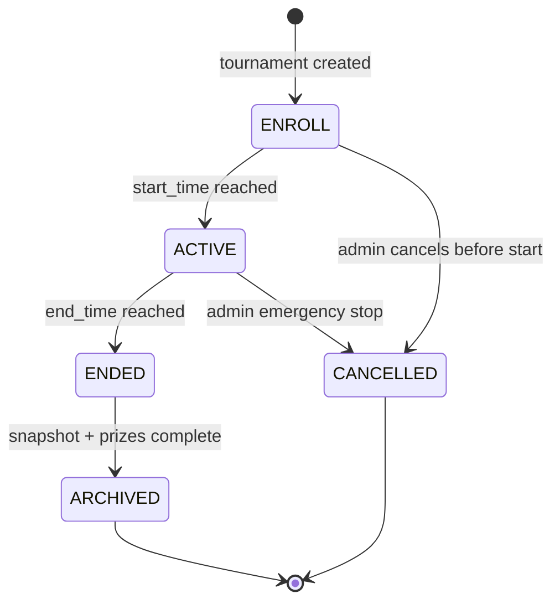

# Tournament Mode — Isolated Boards, Bracket Progression, and Final Snapshots

**Date:** 2026-05-01 | **Updated:** 2026-05-01
**Tags:** `system-design` `deep-dive` `leaderboard` `tournament` `lifecycle`

## Table of Contents

- [Summary](#summary)
- [Why Tournament Mode Is Not Just "Another Leaderboard"](#why-tournament-mode-is-not-just-another-leaderboard)
- [Tournament Lifecycle](#tournament-lifecycle)
  - [Canonical State Diagram](#canonical-state-diagram)
  - [State Definitions](#state-definitions)
  - [State-Machine Pseudocode](#state-machine-pseudocode)
- [Per-Tournament Storage Layout](#per-tournament-storage-layout)
  - [Key Schema and Isolation](#key-schema-and-isolation)
  - [TTL and Cleanup After ENDED](#ttl-and-cleanup-after-ended)
  - [Why Mixing With the Global Board Is a Trap](#why-mixing-with-the-global-board-is-a-trap)
- [Brackets and Cohort Partitioning](#brackets-and-cohort-partitioning)
  - [How Cohorts Are Formed](#how-cohorts-are-formed)
  - [Per-Bracket ZSETs](#per-bracket-zsets)
  - [Promotion and Elimination](#promotion-and-elimination)
- [Enrollment, Cutoffs, and Late Joins](#enrollment-cutoffs-and-late-joins)
  - [The Enrollment Window](#the-enrollment-window)
  - [Atomic Enroll-and-Score with Lua](#atomic-enroll-and-score-with-lua)
  - [Race Conditions at the Cutoff Boundary](#race-conditions-at-the-cutoff-boundary)
- [Server-Authoritative Scoring](#server-authoritative-scoring)
  - [Why the Client Cannot Be Trusted](#why-the-client-cannot-be-trusted)
  - [Score Submission Contract](#score-submission-contract)
  - [Replay Protection: Nonces and Monotonic Counters](#replay-protection-nonces-and-monotonic-counters)
  - [Anti-Cheat Layers](#anti-cheat-layers)
- [End-of-Tournament Finalization](#end-of-tournament-finalization)
  - [The Freeze Boundary](#the-freeze-boundary)
  - [Snapshot to Durable Storage](#snapshot-to-durable-storage)
  - [Tie-Breaking at the Freeze](#tie-breaking-at-the-freeze)
- [Prize Allocation as a Saga](#prize-allocation-as-a-saga)
  - [Why Prizes Are a Saga, Not a Transaction](#why-prizes-are-a-saga-not-a-transaction)
  - [Idempotent Grant Per (Tournament, Rank)](#idempotent-grant-per-tournament-rank)
  - [Compensation and Reconciliation](#compensation-and-reconciliation)
- [Spectator Reads and Aggressive Caching](#spectator-reads-and-aggressive-caching)
- [Time-Boxed Deadlines and Clock Skew](#time-boxed-deadlines-and-clock-skew)
- [Multi-Region Tournaments](#multi-region-tournaments)
  - [Per-Region Active ZSETs](#per-region-active-zsets)
  - [Cross-Region Merge at End](#cross-region-merge-at-end)
  - [Conflict Resolution Rules](#conflict-resolution-rules)
- [Worked Example — 1000 Players, 4 Brackets, Top-3 Each Advance](#worked-example--1000-players-4-brackets-top-3-each-advance)
- [Anti-Patterns](#anti-patterns)
- [Related](#related)
- [References](#references)

## Summary

Tournament mode is a **time-boxed, cohort-isolated leaderboard** with an explicit lifecycle, server-authoritative scoring, deterministic finalization, and prize payout that survives partial failure. Unlike rolling boards (daily/weekly windows that drift), a tournament has a **fixed start, fixed end, and a fixed roster** — and once it ends, the result is **frozen**. The data plane is one Redis ZSET per tournament (or one per bracket), keyed by `tournament_id` (or `tournament_id:bracket_id`), with explicit TTL applied after the freeze. The control plane is a state machine — `ENROLL → ACTIVE → ENDED → ARCHIVED` — whose transitions trigger snapshotting to durable storage and a prize-payout saga keyed on `(tournament_id, rank)` for idempotency. Anti-cheat is non-negotiable: clients submit deltas signed with monotonic nonces, the server runs sanity bounds and (for replay-eligible games) re-simulates inputs, and final scores are taken from the server's own ledger, not from the client. The lessons generalize to any **bounded competition surface**: a fantasy league weekly contest, a hackathon with submission deadlines, a sales-quota sprint, a flash-promotion conversion contest. The pattern is the same — explicit lifecycle, isolated storage, server-side authority, snapshot at freeze, idempotent reward grant, audit trail.

## Why Tournament Mode Is Not Just "Another Leaderboard"

A rolling leaderboard answers "who's hot right now?" — its window slides, its membership is open, and approximate is fine because nobody gets paid based on rank #4 vs rank #5 yesterday. A tournament answers "who **won** the event between these two timestamps?" — and that answer must be defensible. A few real differences:

- **Closed cohort, not open population.** The set of competing players is decided at enrollment; the leaderboard is for *those players*, not "everyone who happened to play during the window."
- **Hard boundaries.** Start and end times are written down; a score submitted one millisecond after the end timestamp does **not** count. Period.
- **Result is durable.** The post-freeze snapshot is referenced by support tickets, by tax reporting, by anti-fraud reviews, and by the player who screenshotted #3 and now sees #4.
- **Money / reward at stake.** Prizes (cash, in-game currency, items, bragging rights with permanent badges) raise the cost of a wrong answer from "annoyed user" to "regulator, refund, and PR".
- **Adversarial environment.** Once a prize exists, players will try to cheat. The threat model widens to include speedhacks, replays, packet manipulation, account-sharing, and Sybil clusters trying to farm bracket positions.

The architecture below is what falls out of taking those constraints seriously. It is not exotic — it is the same pattern Steamworks Leaderboards, Apple Game Center, and dozens of mobile-game backends converge on, with the integrity bar dialed up.

## Tournament Lifecycle

### Canonical State Diagram



The lifecycle is **time-driven** with admin escape hatches. Transitions are scheduled jobs against authoritative server time, never client clocks.

### State Definitions

| State | Meaning | Side effects on entry |
|-------|---------|------------------------|
| `ENROLL` | Tournament exists; players can join, but scoring is closed. | Create empty `tournament:{id}:roster` set; init metadata row. |
| `ACTIVE` | Players in the roster can submit scores. The scoring window is open. | Initialize per-bracket ZSETs; arm the scheduler for `end_time`; open spectator read endpoints. |
| `ENDED` | Scoring window closed; ZSET is read-only. Finalization in progress. | Reject all new score writes; trigger snapshot job; trigger prize-payout saga. |
| `ARCHIVED` | Snapshot persisted to durable storage; prizes paid; ZSET TTL set. | Set TTL on Redis keys (e.g., 7d for spectator reads, then evict); mark metadata row `archived_at`. |
| `CANCELLED` | Tournament terminated administratively. No prizes paid. | Reject writes; emit `cancelled` event; refund any prepaid entry fees through a separate saga. |

### State-Machine Pseudocode

The transition table is the contract. Every state-change goes through one function; nothing else mutates `tournament.status`.

```text
function transition_tournament(tournament_id, target_state, actor):
    # Load with optimistic-concurrency version (same idea as Uber's trip row).
    t = load_tournament(tournament_id)             # includes version
    now = server_clock()                           # NTP-synced authoritative time

    # Validate transition is in the allowed table.
    assert (t.status, target_state) in ALLOWED_TRANSITIONS

    # State-specific guards.
    match (t.status, target_state):
        case (ENROLL, ACTIVE):
            assert now >= t.start_time
            assert size(roster_set(tournament_id)) >= MIN_PLAYERS
        case (ACTIVE, ENDED):
            assert now >= t.end_time
        case (ENDED, ARCHIVED):
            assert snapshot_exists(tournament_id)
            assert prize_saga_status(tournament_id) == COMPLETED
        case (_, CANCELLED):
            assert actor.has_role("tournament_admin")

    # Conditional update with version check.
    rows = db.execute("""
        UPDATE tournaments
           SET status     = $target,
               version    = version + 1,
               updated_at = $now
         WHERE id        = $id
           AND version   = $version
           AND status    = $current
    """, target=target_state, id=tournament_id, version=t.version, current=t.status, now=now)

    if rows == 0:
        raise ConcurrentTransitionError    # somebody else moved it; caller re-reads

    # Outbox-pattern event emission, same DB transaction.
    outbox.append(TournamentTransitioned(
        tournament_id=tournament_id,
        from_state=t.status, to_state=target_state,
        version=t.version + 1, occurred_at=now, actor=actor.id
    ))

    # Side effects fire only after commit, by reading the outbox.
    return Ok(target_state)
```

This is the same pattern as the Uber trip state machine: optimistic concurrency on a `version` column, conditional update with `AND status = ?` as a defense-in-depth guard, outbox in the same transaction. See [trip-state-machine.md](../../location-based/uber/trip-state-machine.md) for the long-form treatment.

## Per-Tournament Storage Layout

### Key Schema and Isolation

Each tournament gets its **own** Redis keys. Mixing tournaments into a global ZSET (with a side filter on member metadata) is the path to grief — see the anti-pattern at the end.

```text
tournament:{tid}:meta            HASH    { start_time, end_time, status, version, prize_pool_id, ... }
tournament:{tid}:roster          SET     { user_id, ... }                    # who is enrolled
tournament:{tid}:zset            ZSET    member=user_id, score=current_score # the leaderboard
tournament:{tid}:b:{bid}:zset    ZSET    member=user_id, score=current_score # per-bracket if used
tournament:{tid}:user:{uid}:n    STRING  monotonic submission counter         # for replay defense
tournament:{tid}:user:{uid}:tx   HASH    { tx_id → score_delta }              # idempotency log
tournament:{tid}:final           STRING  JSON snapshot of final ranks         # post-freeze read cache
```

Why one ZSET per tournament:

- **Cardinality stays bounded** to the cohort. A weekly tournament with 50k players has a 50k-member ZSET — well within Redis's comfort zone (`ZADD`/`ZINCRBY` are O(log N), `ZRANGE` is O(log N + M)).
- **TTL is per-tournament** — once the tournament archives, the key dies cleanly without touching unrelated boards.
- **Iteration is scoped** — `ZREVRANGEBYSCORE` returns only members of *this* tournament, no filter step required.
- **Isolation simplifies operations** — `DEBUG OBJECT`, `MEMORY USAGE`, `SLOWLOG` per tournament are interpretable.

For internals on why Redis ZSETs are well-suited to this workload, see [redis-sorted-set-internals.md](./redis-sorted-set-internals.md).

### TTL and Cleanup After ENDED

On entry into `ARCHIVED`, the cleanup job sets explicit TTLs:

```text
EXPIRE tournament:{tid}:zset            604800   # 7 days for spectator reads
EXPIRE tournament:{tid}:b:{bid}:zset    604800
EXPIRE tournament:{tid}:user:{uid}:n    86400
EXPIRE tournament:{tid}:meta            2592000  # 30 days
```

The **durable** record lives in cold storage (S3 / Postgres / a data warehouse), not Redis. Redis is the *operational* surface; once the snapshot is safely persisted, Redis can drop the keys. See [snapshots-to-durable-storage.md](./snapshots-to-durable-storage.md) for snapshot mechanics and verification.

The reason for **explicit** `EXPIRE` (rather than relying on memory eviction) is twofold:

1. Predictable memory recovery for capacity planning. Eviction policies kick in under pressure; explicit TTL frees memory deterministically.
2. Audit clarity. "When did the operational state for tournament X disappear?" is answerable to the second.

Reference: [Redis EXPIRE](https://redis.io/commands/expire/).

### Why Mixing With the Global Board Is a Trap

Some teams try to save keys by stuffing tournament scores into the global ZSET with a `t:{tid}:` prefix on the member name. Symptoms:

- ZSET cardinality grows unboundedly with every tournament.
- `ZREVRANGE 0 9` on the "global" board is now polluted with tournament members.
- Cleanup requires `ZREM` per member — O(N log N) and racy.
- TTL semantics are lost — you cannot expire a *subset* of ZSET members.

The fix is what's specified above: **one ZSET per tournament**, period.

## Brackets and Cohort Partitioning

### How Cohorts Are Formed

Brackets exist to make competition meaningful: a 1000-player tournament where rank #1 collects everything turns ranks #500–#1000 into spectators by hour two. Brackets partition the cohort into peer groups, each with its own promotion or prize structure.

Common bracket schemes:

- **Skill-based seeding.** Sort enrollees by their MMR / Elo at enrollment time, divide into K equal-size brackets. Each bracket competes among peers.
- **Random seeding.** Shuffle and chunk. Useful when skill ratings are noisy or absent.
- **Geographic / language brackets.** Latency-sensitive tournaments group players by region.
- **Tiered brackets** (Bronze / Silver / Gold). Players self-select by past performance.

Bracket assignment happens at the `ENROLL → ACTIVE` boundary so the cohort is fixed before scoring opens.

### Per-Bracket ZSETs

```text
tournament:{tid}:b:bronze:zset
tournament:{tid}:b:silver:zset
tournament:{tid}:b:gold:zset
```

Plus a small lookup so a score-submit knows which ZSET to write to:

```text
tournament:{tid}:user_to_bracket  HASH  { user_id → bracket_id }
```

On every score submit, the server reads `user_to_bracket` once (cache it locally per request), then `ZADD`s to the right key. The shared `roster` set still holds the union — useful for invariants ("every user in any bracket appears in roster exactly once").

### Promotion and Elimination

Multi-stage tournaments use bracket promotion: top-K of each bracket advances to the next stage. The promotion job runs at the bracket's `ENDED` transition:

```text
function promote_bracket(tid, bid, k):
    top = ZREVRANGE(tournament:{tid}:b:{bid}:zset, 0, k-1, WITHSCORES)
    for (user_id, score) in top:
        # Append to next stage's roster atomically.
        SADD next_stage_roster(tid, parent_bracket=bid), user_id
        # Carry score forward, or reset, depending on tournament rules.
        ZADD tournament:{tid}:stage2:zset, score, user_id
    emit_event(BracketPromotion(tid, bid, advancing=top))
```

Elimination is just the inverse of promotion — anyone not in the top-K is marked `eliminated` and dropped from the next stage's roster. Their data stays in the original bracket's ZSET for audit; they just cannot post new scores into the next stage.

A subtlety: promotion at exactly `k` rank often has tie-breaking implications. If three players tie at rank 3 with `k=3`, do all three advance (over-fill) or do you apply tie-breaking to pick exactly three? The answer must be in the tournament rules, not invented at finalization. See [tie-breaking.md](./tie-breaking.md) for the standard rules.

## Enrollment, Cutoffs, and Late Joins

### The Enrollment Window

Enrollment is open during `ENROLL` and (typically) for some grace period into `ACTIVE`. After the **enrollment cutoff**, no new players join — the cohort is fixed.

```text
ENROLL  ──(start_time)──>  ACTIVE
        ENROLL_CUTOFF = start_time + grace_minutes  (or fixed timestamp)
```

The grace window exists because real users miss start-of-event by a few minutes. After cutoff, the roster is closed. A late-comer must wait for the next tournament.

### Atomic Enroll-and-Score with Lua

The interaction between enrollment and scoring has a critical invariant: **only enrolled players appear on the leaderboard**. If a score submission arrives without prior enrollment (because of a client bug, a replay, or a malicious request), it must be rejected. If two requests race — `enroll` and `score` from the same player around the cutoff — the result must be deterministic.

The cleanest way is an atomic Lua script that checks roster membership, validates the cutoff window, and applies the score in one server-side step.

```lua
-- KEYS[1] = tournament:{tid}:roster
-- KEYS[2] = tournament:{tid}:zset           (or per-bracket ZSET)
-- KEYS[3] = tournament:{tid}:meta
-- KEYS[4] = tournament:{tid}:user:{uid}:tx  (idempotency log)
-- ARGV[1] = user_id
-- ARGV[2] = score_delta
-- ARGV[3] = tx_id (idempotency key)
-- ARGV[4] = now_unix_ms
-- ARGV[5] = nonce
-- ARGV[6] = tournament:{tid}:user:{uid}:n   (counter key for nonce check)

-- 1. Enrollment guard.
if redis.call('SISMEMBER', KEYS[1], ARGV[1]) == 0 then
    return redis.error_reply('NOT_ENROLLED')
end

-- 2. Window guard. Tournament must be ACTIVE and within [start_time, end_time].
local meta = redis.call('HMGET', KEYS[3], 'status', 'start_time', 'end_time')
if meta[1] ~= 'ACTIVE' then
    return redis.error_reply('NOT_ACTIVE')
end
local now = tonumber(ARGV[4])
if now < tonumber(meta[2]) or now >= tonumber(meta[3]) then
    return redis.error_reply('WINDOW_CLOSED')
end

-- 3. Idempotency: if tx_id already applied, return its prior result unchanged.
local prior = redis.call('HGET', KEYS[4], ARGV[3])
if prior then
    return {'replay', prior}
end

-- 4. Nonce monotonicity: counter must strictly increase per player.
local last_n = tonumber(redis.call('GET', ARGV[6]) or '0')
local this_n = tonumber(ARGV[5])
if this_n <= last_n then
    return redis.error_reply('STALE_NONCE')
end
redis.call('SET', ARGV[6], this_n)

-- 5. Apply score delta.
local new_score = redis.call('ZINCRBY', KEYS[2], ARGV[2], ARGV[1])

-- 6. Record idempotency entry.
redis.call('HSET', KEYS[4], ARGV[3], new_score)
redis.call('HEXPIRE', KEYS[4], 86400, 'FIELDS', 1, ARGV[3])

return {'ok', new_score}
```

Three things this script gives you, all atomically:

1. **No score from a non-enrolled user** ever lands in the ZSET.
2. **No score lands outside the window** — even if the application server's wall clock is skewed, the script uses the timestamp passed in, but the server-time check is a coarse guard; the authoritative `end_time` comparison happens here too.
3. **Replay attempts are absorbed** — re-running the same `tx_id` returns the prior result without double-applying.

For the broader case for Lua scripts in atomic Redis flows, see [Redis Lua scripting](https://redis.io/docs/manual/programmability/eval-intro/).

### Race Conditions at the Cutoff Boundary

Two real races to think about:

**Race 1 — enroll racing the start-time transition.** A user hits `POST /enroll` at `start_time - 1ms`. The Lua script's window guard reads `meta.status` after the request lands. If the start-time scheduler flipped the status to `ACTIVE` first, enrollment may already be closed (depending on policy). Pin the policy: "enrollment is open until `enroll_cutoff` regardless of status; status flips do not close enrollment." The cutoff is its own timestamp; ignore status for the enrollment guard.

**Race 2 — enroll racing the first score submission.** User enrolls at `t`; client immediately submits a score at `t + 5ms` from a different connection that hits a different app server. The roster write may not yet be visible. **Solution**: do the enroll synchronously, return only after the `SADD` has committed, and have the client wait for the enrollment response before submitting. The atomic Lua script is the second line of defense: if the roster doesn't show the user yet, the score returns `NOT_ENROLLED` and the client retries.

A third race worth naming: **the end-time tail**. A score submission lands at `end_time - 1ms` but the Redis call doesn't execute until `end_time + 5ms`. Whose clock counts? **The script's** — the Lua script reads `end_time` from the meta hash and compares against `now` passed in. The application server's `now` should be NTP-synced; for high-stakes tournaments, force the server-side time check inside the script using `redis.call('TIME')` to eliminate app-server clock skew entirely.

## Server-Authoritative Scoring

### Why the Client Cannot Be Trusted

In any leaderboard with rewards attached, the client is the adversary. Even friendly users will have:

- Modified game clients that report inflated scores.
- Replay tools that record a good run and re-submit it under different accounts.
- Speed-hacks that compress real time so a 60-second run reports as 30 seconds.
- Packet editors that mutate the score field on submit.

A score-submission API that says "trust me, I scored 9999" is a vulnerability disguised as an endpoint. The only defensible model is **server-authoritative**: the server computes (or verifies) the score from inputs, never from the client's own assertion.

### Score Submission Contract

Two patterns, picked per game type:

**Pattern A — server simulates.** The client streams gameplay inputs (key presses, frame events) to the server; the server runs the simulation and produces the score. Used by competitive RTS / FPS games where determinism is feasible. Expensive but airtight.

**Pattern B — client reports, server verifies.** The client computes the score locally and submits a structured payload (start state, inputs, end state, score). The server runs a *verification* simulation, possibly probabilistically (verify a sample of submissions in full, all of them at sanity-check level). Steamworks Leaderboards and Apple Game Center's anti-cheat layers fall here.

In both, the client never *sets* the rank. It at most provides evidence the server uses to compute the score.

```http
POST /v1/tournaments/{tid}/scores
Idempotency-Key: {tx_id}
X-Submission-Nonce: 4271
{
  "session_id": "sess-92ab",
  "delta": 350,
  "evidence": { "inputs": [...], "checksum": "..." },
  "client_ts": "2026-05-01T14:22:31.118Z"
}
```

The server's job:

1. Authenticate the user (session token, signed).
2. Look up `(user, session_id)` to recover the in-progress run.
3. Validate the evidence (re-simulate, or sanity-bound the delta).
4. Atomically apply via the Lua script above.
5. Return the new score and rank.

### Replay Protection: Nonces and Monotonic Counters

Even with all of the above, an attacker who captures a single valid signed submission could replay it to add the same delta repeatedly. Two defenses:

- **Idempotency keys** (`tx_id`) prevent a single submission from applying twice. The Lua script's idempotency log catches re-submits of the same `tx_id`.
- **Monotonic nonces per player** (`n`) ensure that even *different* `tx_id`s carrying *the same payload* cannot replay. Each submission carries a strictly-increasing counter; the server rejects anything `<= last_n`. The counter is per `(tournament_id, user_id)`.

These two layers cover orthogonal threats: idempotency catches retries; nonces catch replays.

### Anti-Cheat Layers

| Layer | Mechanism | What it stops |
|-------|-----------|---------------|
| Submission rate limit | Token-bucket per `(user, tournament)`; e.g., 1 submit / sec, burst 5. | Brute-force submission floods, packet-spam attacks. |
| Sanity-check delta | Reject `delta > MAX_PLAUSIBLE_DELTA` for the game mode. | Trivial 9999-score submissions. |
| Statistical anomaly | Flag `(user, tournament)` whose delta distribution is N stddev above their baseline; enqueue for review. | Sustained moderate cheating. |
| Re-simulation (sampled) | Re-run inputs server-side on X% of submissions. | Speed-hacks, modified clients. |
| Re-simulation (top-K mandatory) | All top-K final submissions are re-simulated before prizes pay. | Cheaters in the prize zone. |
| Account / device fingerprint | Cluster Sybil attempts; rate-limit per device or payment method. | Multi-account farming of bracket positions. |

For the broader threat-modeling perspective on this kind of adversarial system, see [threat-modeling.md](../../../security/threat-modeling.md). The OWASP [game cheat defense cheat sheet](https://cheatsheetseries.owasp.org/cheatsheets/) is an applicable starting point even though leaderboards aren't its primary focus.

## End-of-Tournament Finalization

### The Freeze Boundary

At `end_time`, three things happen, in order:

1. **Status flips to `ENDED`** via the state-machine transition. From this instant, the Lua script's window guard rejects all writes.
2. **A finalization job runs** — it computes the final ranking, applies tie-breaking rules, and writes a snapshot.
3. **The prize-payout saga starts** with the snapshot as input.

The freeze is non-negotiable. Even if a score submission arrives at `end_time + 1ms` from a player who genuinely had not yet hit submit, it does not count. Spectators should not see ranks reshuffle after the official end.

The clean way to enforce this is to flip status *before* the snapshot runs. The Lua script reads `status` from the meta hash on every submission; after the flip, every in-flight submission gets `WINDOW_CLOSED`. Snapshots run against a frozen ZSET.

### Snapshot to Durable Storage

The snapshot contains:

```json
{
  "tournament_id": "t-abc",
  "frozen_at": "2026-05-01T18:00:00.000Z",
  "version": 1,
  "ranks": [
    { "rank": 1, "user_id": "u1", "score": 9420, "tiebreak": "earlier_submit" },
    { "rank": 2, "user_id": "u7", "score": 9180, "tiebreak": null },
    ...
  ],
  "brackets": {
    "gold":   [ { "rank": 1, "user_id": "u1", "score": 9420 }, ... ],
    "silver": [ ... ]
  },
  "metadata": { "start_time": "...", "end_time": "...", "rules_version": "v3" }
}
```

The snapshot is written to durable storage (Postgres or S3 with object-lock for legal-hold semantics in regulated contexts). It is the **canonical** record; Redis is now just a TTL'd cache of it. Spectator reads switch from `ZREVRANGE` against Redis to reads from the snapshot once it lands. See [snapshots-to-durable-storage.md](./snapshots-to-durable-storage.md) for write-and-verify mechanics and the read-cutover.

### Tie-Breaking at the Freeze

Ties happen. The rules must be deterministic and documented:

| Rule | When to apply |
|------|---------------|
| Earliest score-reach wins | Most common; stored as the timestamp the player first achieved that score. |
| Most submissions / most attempts | Reverses the meaning — "more activity wins"; rare but used. |
| Lower user_id (lexicographic) | Last-resort deterministic fallback when timestamps tie. |
| Random with seeded RNG | Avoid for prize-bearing tournaments; only acceptable for pure-fun events. |

The standard pattern is `score * 10^N - first_reach_timestamp_ns` packed into the ZSET score (Redis is double-precision, so packing is bounded by float precision). See [tie-breaking.md](./tie-breaking.md) for the precision math and the alternative approaches.

## Prize Allocation as a Saga

### Why Prizes Are a Saga, Not a Transaction

Paying prizes spans multiple services:

```text
1. Read snapshot → determine winners by rank.
2. For each winner: grant in-game currency (currency-svc).
3. For each winner: grant rare item (inventory-svc).
4. For each winner: send congratulations email (notification-svc).
5. Mark prize_paid in tournaments table (tournament-svc).
6. Emit analytics event.
```

Steps 2–4 are independent service calls. Any of them can fail. None of them are part of the same database. There is no two-phase commit available, and even if there were, the latency would be unacceptable. **This is a saga.** Each forward step has a compensation; partial failures recover by replaying or compensating, not by rolling back.

For the foundations, see [Garcia-Molina & Salem's _Sagas_](https://www.cs.cornell.edu/andru/cs711/2002fa/reading/sagas.pdf), [Chris Richardson's saga pattern reference](https://microservices.io/patterns/data/saga.html), and the AWS [Step Functions saga sample](https://docs.aws.amazon.com/step-functions/latest/dg/sample-saga.html). For a worked e-commerce example with the same structure, see [checkout-saga.md](../../e-commerce/amazon-ecommerce/checkout-saga.md). For the broader theory, [distributed-transactions.md](../../../data-consistency/distributed-transactions.md).

### Idempotent Grant Per (Tournament, Rank)

Every reward-granting action is keyed by a stable identifier — **not** the user id (the same user might win two unrelated tournaments) and **not** a timestamp (timestamps are not unique enough). The key is `(tournament_id, rank)` for global prizes and `(tournament_id, bracket_id, rank)` for bracket-scoped prizes.

```text
function grant_prize_idempotent(tournament_id, rank, user_id, prize_spec):
    tx_id = "prize:" + tournament_id + ":" + rank        # stable, deterministic

    # 1. Check the ledger. If we already paid this slot, return the prior result.
    prior = ledger.get(tx_id)
    if prior:
        return prior   # caller treats as success; no double-pay.

    # 2. Reserve the ledger entry in PENDING state.
    ledger.insert(tx_id, status=PENDING, user_id=user_id, prize_spec=prize_spec)

    # 3. Call the downstream service with tx_id as its idempotency key.
    response = currency_svc.grant(
        idempotency_key=tx_id,
        user_id=user_id,
        amount=prize_spec.currency
    )

    # 4. Persist the response on the ledger.
    if response.ok:
        ledger.update(tx_id, status=COMPLETED, response=response)
        return response
    else:
        ledger.update(tx_id, status=FAILED, error=response.error)
        raise PrizeGrantError(tx_id, response.error)
```

Two key properties:

- **`tx_id` is deterministic.** Re-running the saga produces the same `tx_id` for the same slot. The currency service's own idempotency layer rejects double-grants. Ledger reads short-circuit anything already paid.
- **Ledger is the source of truth for "did we pay?"** Not a flag on the tournament row, not a guess from an analytics event. A row in the ledger with status `COMPLETED`.

If the saga crashes after step 3 but before step 4 (currency service granted, ledger not updated), the recovery job re-runs: ledger entry is `PENDING`, calls the currency service again, the currency service returns the prior result (because of its own idempotency layer keyed on `tx_id`), the ledger is updated to `COMPLETED`. No double-grant. No missed grant.

### Compensation and Reconciliation

If a step fails irrecoverably (e.g., the inventory service is offline for hours), the saga has options:

- **Retry with backoff.** Most failures are transient.
- **Compensate forward** — grant a substitute reward (currency in lieu of an item).
- **Compensate backward** — revoke earlier grants in this saga, mark the tournament's prize state `PARTIAL`, escalate to ops.

The choice is policy. Define it before launch. Reconciliation jobs run periodically: every tournament that is `ENDED` but not `ARCHIVED` after some grace period gets a saga health check. Stuck sagas surface to operators with full ledger context.

## Spectator Reads and Aggressive Caching

Spectator endpoints serve the public top-K view. Two reasons they get aggressive caching:

1. They dwarf write traffic. The viewer-to-player ratio at a popular tournament can be 100:1 or more.
2. They tolerate seconds of staleness. "The leaderboard updates every 5 seconds" is acceptable UX; absolutely-fresh-on-every-read is wasteful.

Implementation:

- **In-process cache** for top-K with a 1–5s TTL. A single Redis read populates many client requests.
- **CDN cache** for the public `/leaderboards/{tid}/top-100` endpoint, keyed by tournament id, TTL 5–10s. Use surrogate keys so a finalization can invalidate.
- **Long-poll or SSE for live updates** — clients subscribe and the server pushes when rank changes; no polling.

After `ENDED`, the spectator endpoint switches from "read live ZSET" to "read frozen snapshot." The snapshot can be cached aggressively (TTL hours) because it is immutable. The cutover is a flag in the meta hash; the read path checks it.

## Time-Boxed Deadlines and Clock Skew

Server time is the only authority. Practical rules:

- **NTP-sync every server in the tournament cluster** to a known good source. Drift > 100ms is an alarm.
- **Use a single time source for window checks.** Either the Redis Lua script's `redis.call('TIME')` or a single time service. Mixing app-server clocks across regions is how scores arrive "after the deadline" in one region and "before" in another.
- **Reject client timestamps for window enforcement.** The client can send `client_ts` for analytics, but the server uses its own clock to decide if the submission is in-window.
- **Publish the end-time in UTC with millisecond precision.** Display localized in the UI; enforce in UTC.
- **Pre-arm the freeze.** Schedule the `ACTIVE → ENDED` transition job 5 minutes before `end_time` so the scheduler has slack; it triggers exactly at `end_time` via a precise sleep.

Apple Game Center and Steamworks Leaderboards both expose tournament-style time-boxing primitives; in both cases, the platform owns the clock, not the device. Mirror that.

## Multi-Region Tournaments

A truly global tournament — players in three continents, low latency required everywhere — cannot afford to round-trip every score submission to a single region. The compromise is **regional active boards** during `ACTIVE`, **merge at end**.

### Per-Region Active ZSETs

```text
tournament:{tid}:r:us-east:zset
tournament:{tid}:r:eu-west:zset
tournament:{tid}:r:ap-south:zset
```

Each player is pinned to one region (their home region at enrollment, or based on routing). All score submissions land in their region's ZSET. Spectator reads in each region show the *regional* leaderboard live.

This avoids cross-region writes during the hot scoring window. The cost is that the global ranking is approximate during `ACTIVE` — a player in `us-east` cannot see exact global rank in real time.

### Cross-Region Merge at End

At `end_time`, a coordinator job:

1. Flips status to `ENDED` in a global metadata store (single source).
2. Drains in-flight submissions in each region (bounded wait; submissions older than the drain window are rejected).
3. Pulls all regional ZSETs into one place (or runs `ZUNIONSTORE` if the regions share a Redis cluster; more commonly, dumps each to a coordinator that merges in code).
4. Computes global ranks with tie-breaking applied.
5. Writes the global snapshot.
6. Triggers prize payout against the global snapshot.

The merge is a big batch operation, not on the hot path. Latency budget is minutes, not milliseconds. It must be deterministic — given the same regional ZSETs, it produces the same global snapshot.

### Conflict Resolution Rules

The hard part of the merge is when the same `user_id` appears in two regions (a player traveled mid-tournament; an account-share cluster; a bug in routing). Define the rule before launch:

- **Pin-on-enrollment, reject elsewhere.** Cleanest: enrollment locks region; submissions to other regions are rejected at the edge.
- **Sum across regions.** If the score model permits (additive deltas), sum. Tie-breaking uses the earliest first-reach across regions.
- **Take the max.** "Best run wins regardless of region." Simple, but loses information.

Whichever rule, encode it in the merge logic and document it in the tournament rules. Players who notice an inconsistency will read the rules; the rules need to be the truth.

## Worked Example — 1000 Players, 4 Brackets, Top-3 Each Advance

A concrete tournament to anchor the moving parts:

- **Roster:** 1000 players, enrolled by Sunday 23:59 UTC.
- **Brackets:** 4 (Bronze, Silver, Gold, Platinum), seeded by MMR; 250 players each.
- **Stage 1:** Monday 00:00 UTC → Sunday 23:59 UTC. Scoring open. Per-bracket ZSETs.
- **Stage 1 finalization:** Top 3 per bracket → Stage 2 roster (12 finalists).
- **Stage 2:** Following Monday → Wednesday. Single-bracket finals among 12.
- **Stage 2 finalization:** Snapshot → prize saga.

Storage at peak (Stage 1):

```text
tournament:t-94f:meta                          HASH
tournament:t-94f:roster                        SET    (1000 members)
tournament:t-94f:b:bronze:zset                 ZSET   (250 members)
tournament:t-94f:b:silver:zset                 ZSET   (250 members)
tournament:t-94f:b:gold:zset                   ZSET   (250 members)
tournament:t-94f:b:platinum:zset               ZSET   (250 members)
tournament:t-94f:user_to_bracket               HASH   (1000 entries)
tournament:t-94f:user:{uid}:n                  STRING (1000 keys)
tournament:t-94f:user:{uid}:tx                 HASH   (1000 keys, TTL'd entries)
```

Total Redis footprint: well under 100 MB even with verbose metadata. The interesting numbers are write rate: a popular tournament might see 50–500 submissions/sec across the cohort, all O(log 250) per ZSET — comfortably within a single Redis primary's budget.

Stage 1 → Stage 2 promotion runs at the freeze:

```text
function promote_stage_1():
    finalists = []
    for bracket in [bronze, silver, gold, platinum]:
        top_3 = ZREVRANGE("tournament:t-94f:b:" + bracket + ":zset", 0, 2, WITHSCORES)
        finalists.extend([(uid, score, bracket) for (uid, score) in top_3])

    snapshot_stage_1(finalists)                         # durable record
    create_stage_2_tournament("t-94f-finals", finalists) # new tournament, ENROLL → ACTIVE
    transition("t-94f", ACTIVE → ENDED → ARCHIVED)      # close stage 1
```

Each `top_3` call is O(log N + 3) — trivially fast. Tie-breaking is applied at the ZSET score level (packed score + first-reach timestamp). Snapshots include the tie-break tag so audit can show why u_x ranked above u_y.

Prize saga at Stage 2 finalization:

```text
for rank in [1, 2, 3]:
    winner = snapshot.ranks[rank - 1]
    grant_prize_idempotent(
        tournament_id="t-94f-finals",
        rank=rank,
        user_id=winner.user_id,
        prize_spec=tournament_prize_table[rank]
    )
```

Three calls. Each idempotent. Each ledger-tracked. If the inventory service is down for the rank-1 grand prize, the saga retries; ranks 2 and 3 may complete in the meantime. The tournament does not archive until *all three* are `COMPLETED` in the ledger.

## Anti-Patterns

- **Client-reported final scores accepted at face value.** Anyone with curl can win. Score must be server-computed or server-verified.
- **No enrollment cutoff.** Players join after start, after halfway, after 90% complete. The leaderboard is meaningless. Always specify and enforce a cutoff.
- **Prize grant without idempotency.** A retry double-pays the rank-1 prize. Always key the grant on `(tournament_id, rank)` and check the ledger before granting.
- **Mixing tournament scores with the global board in one ZSET.** Cardinality explodes; cleanup is racy; TTL semantics break. One ZSET per tournament.
- **No final freeze.** Submissions land after `end_time`; ranks shuffle; spectators see the leader change after the trophy ceremony. Status flip + window guard in the Lua script is non-negotiable.
- **Trusting client timestamps for window enforcement.** Client clocks are wrong, drifted, or attacker-controlled. Enforce the window with server time in the Lua script.
- **Pessimistic locks on the tournament metadata.** Lock contention scales with submission rate. Use optimistic concurrency on a `version` column for state transitions.
- **Snapshot only in Redis.** Redis is operational; the canonical record must be in durable storage (Postgres / S3). When Redis loses the keys, you must still be able to answer "who won".
- **No re-simulation on top-K.** Cheaters target the top-K, not random ranks. Mandatory re-simulation in the prize zone is the cheapest insurance you can buy.
- **Single global ZSET for a multi-region tournament during `ACTIVE`.** Cross-region writes on every submission. Use per-region ZSETs and merge at end.
- **Designing the happy-path payout and adding compensation later.** Sagas without compensation are corruption generators. Define what to do when the inventory service is down before launch.
- **No archive policy.** Tournament keys live forever in Redis; memory grows; a popular game accumulates thousands of zombie tournaments. Set explicit TTL on `ARCHIVED`.

## Related

- [Designing a Real-Time Leaderboard](../design-realtime-leaderboard.md) — parent case study with the full architecture and the tournament-mode subsection this expands.
- [Redis Sorted Set Internals](./redis-sorted-set-internals.md) — why ZSET operations are O(log N) and the skip-list / hash-table layout that makes per-tournament boards cheap.
- [Snapshots to Durable Storage](./snapshots-to-durable-storage.md) — write-and-verify mechanics for the final snapshot and the read-path cutover after freeze.
- [Tie-Breaking](./tie-breaking.md) — packing tie-break tags into the ZSET score and the precision math.
- [Checkout Saga](../../e-commerce/amazon-ecommerce/checkout-saga.md) — the same idempotent-grant + ledger pattern applied to e-commerce order completion.
- [Distributed Transactions](../../../data-consistency/distributed-transactions.md) — sagas, outbox, and idempotency patterns that underpin the prize payout flow.
- [Threat Modeling](../../../security/threat-modeling.md) — adversarial framing for the anti-cheat layers and the score-submission contract.

## References

- [Redis EXPIRE](https://redis.io/commands/expire/) — TTL semantics for the post-archive cleanup.
- [Redis Lua Scripting](https://redis.io/docs/manual/programmability/eval-intro/) — atomic enrollment-and-score scripts run server-side without client round-trips.
- [Steamworks Leaderboards API](https://partner.steamgames.com/doc/features/leaderboards) — Valve's production leaderboard primitives, including time-boxed boards and friends-only filtering.
- [Apple Game Center Leaderboards](https://developer.apple.com/documentation/gamekit/gkleaderboard) — Apple's leaderboard contract; tournament-style time-boxing with platform-owned clocks.
- [Garcia-Molina & Salem, _Sagas_ (SIGMOD 1987)](https://www.cs.cornell.edu/andru/cs711/2002fa/reading/sagas.pdf) — the original paper that named the saga pattern.
- [Chris Richardson, Saga Pattern](https://microservices.io/patterns/data/saga.html) — canonical pattern reference; orchestration vs choreography.
- [AWS Step Functions Saga Sample](https://docs.aws.amazon.com/step-functions/latest/dg/sample-saga.html) — worked example of saga orchestration on a managed workflow engine, directly applicable to prize-payout flows.
- [OWASP Cheat Sheet Series](https://cheatsheetseries.owasp.org/cheatsheets/) — applicable starting point for input-validation, authentication, and rate-limit patterns relevant to anti-cheat.
