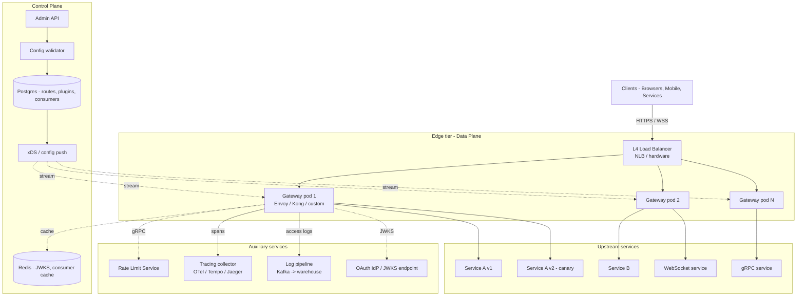

# Design an API Gateway Service — Routing, Auth Offload, Plugins, and Multi-Tenant Edge

**Date:** 2026-04-25 | **Updated:** 2026-04-25
**Tags:** `system-design` `case-study` `infrastructure` `api-gateway` `medium`
**Difficulty:** Medium | **Type:** HLD | **Estimated read:** 30–35 min

## Table of Contents

- [Summary](#summary)
- [1. Functional Requirements](#1-functional-requirements)
- [2. Non-Functional Requirements](#2-non-functional-requirements)
- [3. Capacity Estimation](#3-capacity-estimation)
- [4. API Design](#4-api-design)
  - [Data plane request lifecycle](#data-plane-request-lifecycle)
  - [Control plane Admin API](#control-plane-admin-api)
  - [Plugin contract](#plugin-contract)
- [5. Data Model](#5-data-model)
  - [Routes](#routes)
  - [Policies](#policies)
  - [Consumers](#consumers)
- [6. High-Level Architecture](#6-high-level-architecture)
- [7. Deep Dives](#7-deep-dives)
  - [7.1 Routing engine — path, method, host, header matching](#71-routing-engine--path-method-host-header-matching)
  - [7.2 Auth offload — JWT validation and OAuth introspection](#72-auth-offload--jwt-validation-and-oauth-introspection)
  - [7.3 Rate limiting at the edge](#73-rate-limiting-at-the-edge)
  - [7.4 Plugin pipeline — filters, middleware, and hooks](#74-plugin-pipeline--filters-middleware-and-hooks)
  - [7.5 Multi-tenant isolation](#75-multi-tenant-isolation)
  - [7.6 Canary deployments and traffic splitting](#76-canary-deployments-and-traffic-splitting)
  - [7.7 Observability — tracing, access logs, metrics](#77-observability--tracing-access-logs-metrics)
  - [7.8 gRPC, GraphQL, and WebSocket gateways](#78-grpc-graphql-and-websocket-gateways)
- [8. Bottlenecks & Trade-offs](#8-bottlenecks--trade-offs)
- [9. Anti-Patterns](#9-anti-patterns)
- [Related](#related)
- [References](#references)

## Summary

An API gateway is the single ingress point that fronts a fleet of backend services. It does the cross-cutting work no individual service should re-implement: **routing** a request to the right upstream, **authenticating** and **authorizing** the caller, **rate-limiting** noisy consumers, **transforming** payloads to bridge schema mismatches, **observing** the traffic for ops, and **isolating** tenants from each other. Done right, it shrinks every backend service to its business core. Done wrong, it becomes a centralized monolith that gates every release and owns every outage.

This case study designs an API gateway modelled on production systems — Kong, Envoy, AWS API Gateway, and Apigee. The headline ideas: a strict **data-plane / control-plane split**, a **declarative route table** evaluated by a fast matching engine, **JWT validation cached against a JWKS endpoint** with OAuth introspection as a fallback, an **edge rate limiter** that uses local buckets plus a global service, a **plugin pipeline** (filters/middleware/hooks) that is the only place gateway behavior should be extended, and protocol-aware adapters for gRPC, GraphQL, and WebSockets. Throughout, we draw the line: routing, security, and shaping live in the gateway; business logic does not.

## 1. Functional Requirements

The gateway must support:

- **Route matching.** Match by HTTP method, path (literal, prefix, regex, parameterized), host (`api.example.com` vs `internal.example.com`), and header predicates (`x-tenant: acme`). Most-specific-wins tiebreaker. Sub-millisecond match cost even with tens of thousands of routes.
- **Auth offload.** Validate **JWTs** locally against a cached JWKS, or call an **OAuth 2.0 introspection** endpoint for opaque tokens. Optionally enforce mTLS, API keys, or HMAC-signed requests. Inject upstream identity headers (`x-user-id`, `x-tenant-id`) so downstream services don't re-authenticate.
- **Rate limiting per consumer.** Apply quotas per consumer (API key owner, OAuth client, tenant). Multiple tiers (tenant ⊃ consumer ⊃ route). See the dedicated [rate-limiter case study](../basic/design-rate-limiter.md) for the algorithm and storage layer.
- **Request/response transformation.** Header rewrite (add, remove, rename), body rewrite (JSON field projection, version translation), URL rewrite (`/v1/legacy → /v2/users`). Limited — heavy transforms belong in BFF or upstream services.
- **Plugin model.** All non-core behavior is a plugin: auth, rate limit, logging, transform, CORS, IP allowlist, request validation. Plugins compose into an ordered pipeline per route. Hot-reloadable.
- **Multi-tenant isolation.** One tenant's traffic burst, plugin error, or upstream failure must not affect others. Per-tenant quotas, queues, and circuit breakers.
- **Canary and traffic splitting.** Send N% of traffic to v2, the rest to v1, with sticky-by-cookie and per-header overrides. Shadow traffic (mirror without affecting response).
- **Observability.** W3C `traceparent` propagation, structured access logs, RED metrics (Rate, Errors, Duration) per route and consumer, real-time alerting on anomalies.
- **Protocol adaptation.** REST in, REST/gRPC/GraphQL/WebSocket out. Transparent gRPC-Web → gRPC translation, GraphQL schema federation, WebSocket passthrough with connection accounting.

## 2. Non-Functional Requirements

| NFR | Target | Why |
|-----|--------|-----|
| Added latency (p50) | **< 1 ms** for cached JWT path | The gateway is on every request; each ms multiplies. |
| Added latency (p99) | **< 10 ms** including auth + plugins | Tail latency dominates user-perceived perf. |
| Throughput per pod | **20–50k RPS** for HTTP/1.1, lower for TLS termination | Drives fleet size. Envoy benchmarks land in this range. |
| Availability | **99.99%+** (52 min/year) | Gateway down = entire API down. |
| Config propagation | **< 10 s** from control-plane commit to all data-plane pods | Operator changes a route → traffic moves quickly. |
| Blast radius of bad config | **Zero global outage** from a single bad route | Per-route rollback; canary new configs first. |
| Plugin isolation | One plugin's panic must not crash the worker | Sandbox or process isolation for risky plugins. |
| Memory per active connection | **< 16 KB** | At 1M concurrent connections, budgets matter. |
| Cold start | **< 5 s** | Fast pod scale-out under load surges. |

## 3. Capacity Estimation

**Traffic.** A tier-1 public API. Assume **500k RPS sustained**, **2M RPS peak** during an event spike. 50k concurrent WebSocket connections. 5,000 distinct routes across 200 services. 100k registered consumers (API keys + OAuth clients).

**Fleet sizing.**

```text
500k RPS ÷ 30k RPS/pod  ≈ 17 pods sustained
2M RPS peak ÷ 30k        ≈ 67 pods peak
+ 30% headroom + 2 AZs   ≈ 100 pods steady-state, autoscale to 150
```

Each pod terminates TLS, validates auth, runs plugins, and proxies to upstreams. CPU is the binding resource; expect **~70% CPU on TLS handshakes** under cold-cache traffic.

**Memory.**

```text
Per pod working set:
  Route table (5k routes, denormalized)           ~8 MB
  JWKS cache (50 issuers × 5 keys × 1 KB)         ~250 KB
  Consumer cache (100k × 200 B)                   ~20 MB
  Plugin runtime (Lua/Wasm sandbox)               ~50 MB
  Connection buffers (10k conns × 16 KB)          ~160 MB
  TLS session cache                               ~64 MB
                                                  --------
                                                  ~300 MB / pod
```

Comfortable for 1 GB pods. WebSocket-heavy pods need bigger connection budgets — split them into a separate fleet.

**Throughput at the control plane.** Config writes are rare (operator velocity, ~10s/day). Config reads are frequent — every pod watches for updates. Use a **gRPC streaming xDS** model (Envoy's pattern) so each pod opens one long-lived stream and receives deltas, instead of polling.

**Bandwidth.** At 500k RPS × ~5 KB average request + response = **2.5 GB/s** end-to-end. Most of that flows through; the gateway adds ~5% overhead in headers, plugin processing, and tracing.

## 4. API Design

### Data plane request lifecycle

The data plane is the hot path. Every request flows through the same pipeline:

```text
1. TLS terminate                 (or mTLS verify)
2. HTTP parse + protocol detect  (HTTP/1.1, HTTP/2, HTTP/3, WS upgrade, gRPC-Web)
3. Match route                   (host + path + method + headers)
4. Resolve route policies        (auth, rate limit, transform, etc.)
5. Run pre-upstream plugins      (auth, rate limit, validate, transform request)
6. Pick upstream + load-balance  (canary split, sticky session, health-aware)
7. Forward request               (with x-* identity headers, traceparent)
8. Run post-upstream plugins     (transform response, attach rate-limit headers)
9. Emit access log + metrics
10. Return response to client
```

Each step is a discrete filter in the pipeline. Plugins extend specific steps via well-defined hooks.

### Control plane Admin API

The control plane is the only place mutations happen. REST, strongly authenticated, audit-logged. Changes propagate via xDS-style streaming to data-plane pods.

```http
# Routes
POST   /v1/routes
GET    /v1/routes
GET    /v1/routes/{id}
PATCH  /v1/routes/{id}
DELETE /v1/routes/{id}

# Services (upstream pools)
POST   /v1/services
PATCH  /v1/services/{id}/canary  # { "v2_pool": "users-v2", "weight": 0.1 }

# Consumers
POST   /v1/consumers              # { "tenant": "acme", "credentials": [...] }
POST   /v1/consumers/{id}/credentials/{type}

# Plugins (attached to route, service, consumer, or global)
POST   /v1/plugins                # { "name": "rate-limit", "scope": {"route_id": "..."}, "config": {...} }
```

Two design rules borrowed from Kong and Envoy:

1. **Declarative-first.** Every API call is equivalent to a YAML/JSON document the operator could check into git. The Admin API is a thin facade over a declarative store.
2. **Validate before commit.** Reject invalid configs at the Admin API. The data plane never sees a config that hasn't passed schema and semantic validation.

### Plugin contract

Plugins implement a small interface — exact names vary by gateway, but the shape is consistent:

```text
interface Plugin {
  // Hooks (any subset)
  onRequest(ctx)           // before routing/auth (rare)
  onAuth(ctx)              // identify caller, populate ctx.consumer
  onAccess(ctx)            // before forwarding upstream
  onUpstreamRequest(ctx)   // mutate the outbound request
  onUpstreamResponse(ctx)  // mutate the inbound response
  onResponse(ctx)          // before sending to client
  onLog(ctx)               // after response, async
}
```

The context object exposes immutable request data and explicit mutation APIs (`ctx.headers.set`, `ctx.body.replace`). Plugins do **not** share state directly — they communicate via context attributes set during earlier hooks.

## 5. Data Model

### Routes

The route table is the gateway's heart. It must be queryable in O(log n) or better against tens of thousands of entries.

```sql
CREATE TABLE routes (
  id            UUID PRIMARY KEY,
  name          TEXT NOT NULL UNIQUE,
  hosts         TEXT[],                    -- ['api.example.com', '*.example.com']
  methods       TEXT[],                    -- ['GET', 'POST']
  paths         JSONB NOT NULL,            -- [{"type":"prefix","value":"/v1/users"}, ...]
  headers       JSONB,                     -- {"x-tenant": ["acme"]}
  service_id    UUID NOT NULL REFERENCES services(id),
  priority      INTEGER NOT NULL DEFAULT 0,
  strip_prefix  BOOLEAN NOT NULL DEFAULT FALSE,
  preserve_host BOOLEAN NOT NULL DEFAULT FALSE,
  created_at    TIMESTAMPTZ NOT NULL DEFAULT now(),
  updated_at    TIMESTAMPTZ NOT NULL DEFAULT now()
);
CREATE INDEX ON routes USING GIN (hosts);
CREATE INDEX ON routes USING GIN (paths);
```

The denormalized form pushed to data-plane pods is a **trie keyed by host then path** (see §7.1).

### Policies

Plugins attach to routes, services, consumers, or globally. The lookup key is denormalized at config-compile time — the data plane never joins.

```sql
CREATE TABLE plugins (
  id            UUID PRIMARY KEY,
  name          TEXT NOT NULL,             -- 'rate-limit', 'jwt', 'cors'
  config        JSONB NOT NULL,
  enabled       BOOLEAN NOT NULL DEFAULT TRUE,
  -- Attachment scope (exactly one set, or NULL = global)
  route_id      UUID REFERENCES routes(id),
  service_id    UUID REFERENCES services(id),
  consumer_id   UUID REFERENCES consumers(id),
  ordering      INTEGER NOT NULL DEFAULT 1000
);
CREATE INDEX ON plugins (route_id) WHERE route_id IS NOT NULL;
CREATE INDEX ON plugins (service_id) WHERE service_id IS NOT NULL;
CREATE INDEX ON plugins (consumer_id) WHERE consumer_id IS NOT NULL;
```

Effective plugin set per request = global ∪ service ∪ route ∪ consumer, deduplicated by name with most-specific scope winning.

### Consumers

A consumer is **who is calling** — not a person, but an entity holding credentials. One consumer can have multiple credentials (an API key, a JWT issuer subject, a TLS client cert).

```sql
CREATE TABLE consumers (
  id          UUID PRIMARY KEY,
  username    TEXT UNIQUE,
  tenant_id   UUID NOT NULL REFERENCES tenants(id),
  custom_id   TEXT UNIQUE,
  tags        TEXT[],
  created_at  TIMESTAMPTZ NOT NULL DEFAULT now()
);

CREATE TABLE credentials (
  id            UUID PRIMARY KEY,
  consumer_id   UUID NOT NULL REFERENCES consumers(id),
  type          TEXT NOT NULL,             -- 'api_key', 'jwt', 'mtls', 'hmac'
  -- Type-specific payload
  api_key_hash  TEXT,                      -- bcrypt of the key; never store plaintext
  jwt_issuer    TEXT,
  jwt_subject   TEXT,
  mtls_dn       TEXT,
  hmac_secret_enc BYTEA,                   -- envelope-encrypted
  enabled       BOOLEAN NOT NULL DEFAULT TRUE,
  expires_at    TIMESTAMPTZ
);
CREATE INDEX ON credentials (api_key_hash) WHERE type = 'api_key';
CREATE INDEX ON credentials (jwt_issuer, jwt_subject) WHERE type = 'jwt';
```

API keys are stored as **bcrypt hashes**, never plaintext — same as passwords. On request, the gateway hashes the presented key and looks it up. HMAC secrets are envelope-encrypted (KMS-wrapped) so the database alone is not enough to forge requests.

## 6. High-Level Architecture



The diagram makes the **data plane / control plane split** explicit: the data plane talks only to upstreams, JWKS, the rate limit service, and observability sinks. It never reads Postgres directly. The control plane writes to Postgres and pushes config via xDS streaming. A control-plane outage degrades the system to "no new config" — the data plane keeps serving the last known good config indefinitely.

## 7. Deep Dives

### 7.1 Routing engine — path, method, host, header matching

The route match is the first work the gateway does on every request. With thousands of routes, naive linear scan is unaffordable.

**Practical structure: layered tries.**

1. **Host index.** Hash table from exact host → list of candidate routes. Wildcard hosts (`*.example.com`) live in a separate suffix trie consulted on miss.
2. **Path trie per host group.** A radix tree where each node represents a path segment. Parameterized segments (`/users/:id`) are children of literal segments at the same depth, with literal-wins precedence.
3. **Method + header filters at leaves.** Once the path matches, evaluate method and header predicates linearly — there are usually fewer than 5 predicates per leaf.

**Match precedence (most-specific wins):**

```text
1. Host literal beats host wildcard.
2. Longer literal path prefix beats shorter.
3. Literal path segment beats parameterized segment.
4. More header predicates beat fewer.
5. Higher explicit `priority` value breaks ties.
```

Envoy's [route matcher](https://www.envoyproxy.io/docs/envoy/latest/api-v3/config/route/v3/route_components.proto) and Kong's [router](https://docs.konghq.com/gateway/latest/reference/router-expressions-language/) both follow this shape; Kong 3.x added an expression language so operators can write `http.path ^= "/v1/users" && http.method == "GET"` and the engine compiles it into the same indexed structure.

**Pitfall: regex paths.** Allowing arbitrary regex blows up match cost — you can't index a regex. Restrict to **named parameter segments** for 99% of cases; reserve regex for an explicit opt-in flag and benchmark its impact.

**Pitfall: route shadowing.** Two routes can both match — `/v1/users/:id` and `/v1/users/me`. The matcher must pick `me` (literal beats parameterized). Validate at config-commit time that any potentially-shadowed route is reachable, or warn the operator.

### 7.2 Auth offload — JWT validation and OAuth introspection

Auth is the second most expensive thing the gateway does after TLS. Get it right and downstream services trust the gateway's identity headers and skip their own auth entirely.

**JWT path (fast, stateless):**

```text
1. Extract token from `Authorization: Bearer <jwt>`.
2. Parse header — get `kid` (key ID) and `alg`.
3. Look up signing key in JWKS cache (keyed by issuer + kid).
   - On miss: GET https://issuer/.well-known/jwks.json, cache for TTL (commonly 1h).
4. Verify signature with cached public key.
5. Verify claims: `iss`, `aud`, `exp`, `nbf`, `iat`.
6. Inject `x-user-id`, `x-tenant-id`, `x-scopes` from claims into upstream request.
```

This path is **purely local** after the first JWKS fetch. Stripe and Auth0 both publish JWKS specifically so consumers can validate locally; see [JWT.io's intro](https://jwt.io/introduction) and [RFC 7519](https://datatracker.ietf.org/doc/html/rfc7519).

**Cache rules:**

- **Cache the JWKS, not the token.** Tokens differ per request; the public key is shared across millions of tokens.
- **Negative cache.** When a `kid` lookup misses even after refresh, cache the negative result for ~10 s to prevent JWKS-endpoint hammering on attacker-supplied bogus tokens.
- **Pin algorithm.** Reject any token whose `alg` is not in your allowlist (typically `RS256`, `ES256`). Refusing `none` and HS-vs-RS confusion attacks is mandatory.

**OAuth introspection path (slower, stateful):**

For opaque (non-JWT) tokens, the gateway calls the IdP's introspection endpoint per [RFC 7662](https://datatracker.ietf.org/doc/html/rfc7662):

```http
POST /oauth/introspect
Authorization: Basic <gateway-creds>
Content-Type: application/x-www-form-urlencoded

token=<opaque-token>
```

Response: `{"active": true, "sub": "u_42", "scope": "read:orders", "exp": 1714003600}`. The result is cached locally (keyed by token hash, TTL = `min(claim_ttl, 60s)`). Without caching, every request adds a synchronous IdP round trip — typically 20–100 ms.

**Header injection contract.** After successful auth, the gateway strips any client-supplied identity headers and writes its own:

```text
x-user-id:    u_42
x-tenant-id:  acme
x-scopes:     read:orders write:orders
x-auth-method: jwt
x-request-id: 01HXY...
```

Downstream services trust these headers **only if** they receive traffic exclusively through the gateway (mTLS or network policy). Drop the trust if a service is reachable from outside.

See the cross-link: [`../../security/authn-session-vs-token.md`](../../security/authn-session-vs-token.md).

### 7.3 Rate limiting at the edge

The gateway is the natural rate-limiting checkpoint — it's the first place that knows who the consumer is and which route they're hitting. The full algorithmic treatment lives in [`../basic/design-rate-limiter.md`](../basic/design-rate-limiter.md); the gateway-specific concerns are layering and key construction.

**Two-tier enforcement.**

1. **Local bucket per pod.** Pure in-process token bucket keyed by `consumer_id`. Catches the obvious spammer without leaving the pod. Sub-100µs decisions. Sized conservatively: each pod gets `quota / num_pods × 1.2` tokens to avoid under-allowing during partial fleet outages.
2. **Global rate-limit service.** Authoritative across the fleet. Called only when local bucket allows. Backed by Redis with Lua scripts for atomic updates.

**Key construction.** A request is checked against multiple keys simultaneously:

```text
rate-limit-key candidates:
  tenant:acme                          (e.g. 50,000 RPS)
  consumer:k_abc123                    (e.g. 1,000 RPS)
  consumer:k_abc123 + route:/v1/charges (e.g. 100 RPS)
  ip:203.0.113.42                      (anti-abuse, unauthenticated calls)
```

Run all checks in **dry-run mode**, then commit only if all pass. Otherwise a rejected request still consumes from the tenant budget unfairly.

**Response headers.** Always emit IETF [`RateLimit-Limit`, `RateLimit-Remaining`, `RateLimit-Reset`](https://datatracker.ietf.org/doc/html/draft-ietf-httpapi-ratelimit-headers) and `Retry-After` on 429. Well-behaved clients self-throttle; everyone else gets a clear signal.

**Failure mode.** When the global limit service is unreachable, **fail open per-route by default** but make it explicit per route via `on_store_failure: "fail_to_local" | "fail_open" | "fail_closed"`. Anti-abuse and billing-related limits should fail closed; user-experience limits should fail open.

### 7.4 Plugin pipeline — filters, middleware, and hooks

The plugin model is what keeps the gateway honest. If the only way to add behavior is to write a plugin, you have a forcing function against bloating the core.

**Pipeline shape.** Each request runs through an ordered list of plugins resolved at config-compile time. The list is the union of plugins attached to (global, service, route, consumer) scopes, sorted by `ordering` (lower runs first).

```text
[ cors ] -> [ jwt ] -> [ rate-limit ] -> [ request-transform ]
                                                 |
                                                 v
                                        [ upstream proxy ]
                                                 |
                                                 v
                              [ response-transform ] -> [ access-log ]
```

**Three implementation patterns:**

| Pattern | Examples | Trade-offs |
|---------|----------|-----------|
| **Native code (Go/Rust/C++)** | Envoy filters, AWS API Gateway built-ins | Fast, type-safe, but every plugin is a recompile + redeploy. |
| **Embedded scripting (Lua)** | Kong (OpenResty), nginx-lua | Hot-loadable, fast enough, but Lua state isolation is convention not enforcement. |
| **Wasm sandbox** | Envoy proxy-wasm, Kong Gateway 3.0+, Istio | Language-agnostic, sandboxed, but adds startup cost and a steeper ABI. |

Production gateways increasingly converge on **proxy-wasm** for third-party plugins, with native filters for the hot path. The Envoy proxy-wasm spec is the de-facto standard ([proxy-wasm/spec](https://github.com/proxy-wasm/spec)).

**Hard rules for plugin authors:**

1. **No blocking I/O on the hot path.** Use the gateway's async HTTP client for any external call.
2. **Hook only what you need.** A plugin that hooks `onLog` can be expensive but doesn't slow the request path; one that hooks `onAccess` does.
3. **Bound CPU and memory per request.** Wasm plugins should declare gas limits; Lua plugins run in protected pcall blocks.
4. **No shared mutable state between plugins.** Communicate via context attributes, not globals.

### 7.5 Multi-tenant isolation

A gateway hosting many tenants is a noisy-neighbor minefield. One tenant's spike, plugin error, or upstream meltdown must not bleed into others.

**Isolation layers:**

- **Per-tenant quotas.** Above the per-consumer rate limit, every tenant has a hard cap (e.g. 50k RPS, 10k concurrent connections). Hitting the cap returns 429, never starves another tenant.
- **Per-tenant connection pools.** Upstream connection pools are partitioned by tenant or service-tenant pair. One tenant's traffic to a slow upstream cannot exhaust the pool used by another tenant to the same upstream. Envoy's [circuit breakers](https://www.envoyproxy.io/docs/envoy/latest/intro/arch_overview/upstream/circuit_breaking) implement this with `max_connections`, `max_pending_requests`, and `max_requests` per cluster.
- **Per-tenant CPU shares.** On highly noisy fleets, run workers as cgroup-isolated processes per tenant tier (gold/silver/bronze) so a CPU-heavy plugin in one tier can't preempt others.
- **Plugin sandboxing.** Wasm plugins run in isolated VMs; one panicking plugin terminates only its instance. Native filter panics must be caught at the worker boundary, not propagated to the process.
- **Config-blast-radius limits.** A bad route config affects only that tenant's traffic. The control plane validates that a config change touches only the intended scope before pushing.

**Hard tenancy.** For regulated workloads (HIPAA, finance), don't share gateway pods at all — give each tenant their own pod fleet. Soft tenancy (shared pods, isolated quotas) covers most public APIs.

### 7.6 Canary deployments and traffic splitting

The gateway is the single best place to do canary releases — no new infrastructure, just a routing decision.

**Weighted round-robin per route.**

```yaml
service: users
canary:
  v1_pool: users-v1   # weight 90
  v2_pool: users-v2   # weight 10
sticky:
  cookie: gw-canary
  ttl: 1h
```

The first request to a session picks a pool by weight; the response sets `Set-Cookie: gw-canary=v2`; subsequent requests pin to the same pool. Without stickiness, a single user's session can flip between v1 and v2 mid-flow and break.

**Header-based override.** Operators and QA bypass the weight via `x-canary: v2`. Useful for internal validation, but ensure the header is stripped or auth-gated to prevent users from forcing themselves to v2.

**Shadow traffic.** Mirror N% of traffic to v2 while still serving from v1. Compare responses asynchronously to detect regressions. Apigee, Envoy, and AWS API Gateway all support this. Caveats:

- **No side effects in v2 when shadowing.** The mirrored request must not write to a shared database, send emails, or charge cards. Either point v2 at a write-blocked replica or accept that shadow is read-only.
- **Discard v2 response.** The client never sees it. v1's response is authoritative.

**Progressive rollout.** Start at 1%, watch error rate and latency, ramp to 5%, 25%, 50%, 100%. Automate with [Argo Rollouts](https://argoproj.github.io/rollouts/) or [Flagger](https://flagger.app/) reading the gateway's metrics. The gateway itself is metric-emitting infrastructure; the rollout controller is the brain.

### 7.7 Observability — tracing, access logs, metrics

The gateway sits at the chokepoint, which makes it the highest-leverage place to instrument.

**Distributed tracing.** Propagate W3C `traceparent` and `tracestate` headers per [W3C Trace Context](https://www.w3.org/TR/trace-context/). The gateway:

- Generates a `traceparent` if absent (root span).
- Otherwise extracts the incoming context and creates a child span for itself.
- Forwards the propagated headers to upstreams.
- Emits a span tagged with `route.id`, `consumer.id`, `tenant.id`, response status, and added latency.

Sample at the **gateway**, not at every service. A tail-based sampler (e.g. OpenTelemetry collector) keeps 100% of error/slow traces and ~1% of healthy ones.

**Access logs.** Structured JSON, one line per request, written async to a Kafka topic (or stdout for sidecar pickup). Required fields:

```json
{
  "timestamp": "2026-04-25T10:00:00.123Z",
  "trace_id": "abc...",
  "request_id": "01HXY...",
  "method": "POST",
  "path": "/v1/charges",
  "host": "api.example.com",
  "route_id": "r_charges_post",
  "consumer_id": "c_acme_main",
  "tenant_id": "acme",
  "upstream": "users-v2",
  "status": 200,
  "duration_ms": 42,
  "upstream_duration_ms": 38,
  "request_bytes": 512,
  "response_bytes": 1024,
  "user_agent": "...",
  "client_ip": "203.0.113.42"
}
```

**Metrics.** RED (Rate, Errors, Duration) per `(route, consumer, status)` triple. Histogram buckets at p50, p90, p99, p99.9. Cardinality discipline matters: do **not** label by user ID; do label by tenant and route. Cardinality explosions kill Prometheus.

**Sensitive data.** Strip authorization headers, cookies, and configurable body fields before logging. Apigee's [data masking](https://cloud.google.com/apigee/docs/api-platform/security/data-masking) is the canonical reference; replicate the pattern.

### 7.8 gRPC, GraphQL, and WebSocket gateways

A modern gateway speaks more than REST.

**gRPC.** Two flavors:

- **gRPC passthrough.** HTTP/2 stream forwarding with header rewriting. The gateway treats gRPC as opaque HTTP/2 except it knows to handle trailers and `grpc-status`. Standard for service-to-service when the client is itself a gRPC client.
- **gRPC-Web translation.** Browsers can't speak HTTP/2 directly to gRPC servers. The gateway terminates gRPC-Web (a base64-framed HTTP/1.1 or HTTP/2 protocol) and re-emits standard gRPC upstream. Envoy's [grpc_web filter](https://www.envoyproxy.io/docs/envoy/latest/configuration/http/http_filters/grpc_web_filter) is the reference implementation.

For both, **don't transform the message body** — gRPC schemas are tightly coupled to upstream services. Header rewriting only.

**GraphQL gateway.** Two patterns:

| Pattern | Description | When |
|---------|-------------|------|
| **Schema federation** | Gateway composes a single GraphQL schema from multiple upstream services, each owning a slice. Apollo Federation is the spec. | Microservices with shared object graph (User, Order, Product). |
| **Schema stitching / BFF** | Gateway holds a hand-written schema that delegates to REST/gRPC backends. | Adapting legacy backends to a GraphQL frontend. |

**Caveats:** GraphQL queries are user-supplied programs. Enforce **query depth limits, cost analysis, and persisted queries** at the gateway. A naive GraphQL gateway is a DoS amplifier — one cleverly nested query can fan out to thousands of upstream calls. See [graphql-engine](https://github.com/hasura/graphql-engine) and [Apollo Router](https://www.apollographql.com/docs/router/) for production-grade implementations.

**WebSocket passthrough.** WebSockets start as HTTP/1.1 upgrades; the gateway recognizes the `Upgrade: websocket` header, runs auth and rate limit on the handshake, then **proxies the bidirectional stream** to the upstream WebSocket server.

Specific concerns:

- **Connection count is the limit, not RPS.** A WebSocket holds a connection for minutes to hours. Pod sizing is `concurrent_connections / per_pod_capacity`, not RPS.
- **Auth at handshake only.** You can't easily re-auth a long-lived WebSocket. Either trust the handshake auth, or have the application send periodic auth pings over the socket.
- **Sticky routing.** Once the upstream is chosen, all frames go there. Use connection-id-based hashing, not per-frame load balancing.
- **Idle timeouts longer than HTTP.** Default HTTP idle of 60s closes WebSockets prematurely. Configure WebSocket timeouts separately (e.g. 10–60 minutes).

A separate gateway fleet tuned for WebSockets — fewer pods, more memory per pod, longer timeouts — is often cleaner than mixing with the HTTP fleet.

## 8. Bottlenecks & Trade-offs

| Concern | Bottleneck | Trade-off |
|---------|-----------|-----------|
| **TLS handshake CPU** | Asymmetric crypto on connection setup | Session resumption + TLS 1.3 0-RTT; offload to dedicated TLS terminators if needed |
| **Route match latency** | Linear scan over thousands of routes | Trie indexing; cap regex usage; benchmark with representative route tables |
| **JWKS fetch latency** | First request after cache miss | Pre-warm JWKS cache on pod start; aggressive negative caching for bogus kids |
| **Plugin pipeline depth** | Each plugin adds latency and CPU | Cap plugin count per route; profile plugins; Wasm gas limits |
| **Connection pool exhaustion** | One slow upstream eats pool meant for many | Per-cluster circuit breakers; per-tenant pool partitioning |
| **Config push latency** | Slow propagation of new routes | Streaming xDS deltas; pre-validate at admin API; per-pod incremental apply |
| **Single point of failure** | Gateway down = API down | Multi-AZ fleet; health-checked LB upstream of gateway; data plane survives control-plane outage |
| **WebSocket fleet sizing** | Concurrent connections, not RPS | Separate fleet; tune idle timeouts; horizontal-scale on connection count |
| **Cardinality of metrics/logs** | Prometheus / Loki blowups | Label by tenant and route, never by user; sample logs |

The cross-cutting trade-off: **the gateway is on the critical path of every request, so every feature added there has compounding cost.** Be ruthless about what belongs in core vs. in plugins vs. in upstream services.

## 9. Anti-Patterns

- **Gateway becoming a monolith.** Every team's "I just need this small transform" lands in the gateway and within two years it owns more business logic than any service. Push back hard: if the logic is product-specific, it belongs in a service or BFF, not the gateway. Apigee's docs explicitly warn against this; see [Kong's anti-patterns blog](https://konghq.com/blog).
- **Business logic in plugins.** Plugins are for cross-cutting concerns: auth, rate limit, transform, log. The moment a plugin reads from the product database to enrich responses, you've smeared business logic into infrastructure. Move it to a BFF.
- **Hardcoding credentials in plugin config.** API keys and HMAC secrets in plain JSON config get checked into git. Always reference a secret manager (Vault, AWS Secrets Manager) by name; never inline.
- **Single global rate limit only.** Without per-consumer or per-tenant tiers, one noisy customer drowns everyone or you set the limit so high it doesn't protect upstreams.
- **No staged rollout for config changes.** Operator changes a route, ships to all 100 pods at once, breaks production. Always: validate → push to canary pods → watch metrics → push to fleet.
- **Trusting client-supplied identity headers.** Forwarding `x-user-id` from client without overwriting it lets attackers spoof identity to upstreams. Strip-and-rewrite is mandatory.
- **No mTLS between gateway and upstreams.** A network breach lets attackers bypass the gateway and hit upstreams directly with forged identity headers. mTLS makes the gateway the only valid origin.
- **Mixing data plane and control plane.** Data-plane pods that read from the config database directly couple their availability to Postgres. Outage of the config DB = outage of the API. Stream config in; cache locally; survive control-plane failure.
- **Synchronous logging on the hot path.** Writing access logs to disk or a remote sink synchronously blocks the response. Always async — Kafka producer with bounded buffer, drop-on-overflow with alarm.
- **One gateway fleet for HTTP + WebSockets + gRPC.** Different traffic profiles, different sizing, different timeouts. Splitting fleets reduces blast radius and simplifies tuning.
- **No version pinning for JWT issuers.** Trusting any issuer with a valid signature lets an attacker who compromises any tenant's IdP forward tokens to your gateway. Pin `iss` per-route; verify `aud`.
- **Treating the gateway as "free."** Every plugin, every header rewrite, every transformation costs latency on every request. Budget added latency explicitly and measure it.

## Related

- **Building block:** [`../../building-blocks/api-gateways-and-bff.md`](../../building-blocks/api-gateways-and-bff.md) — gateway vs BFF distinction, when to add a BFF tier.
- **Building block:** [`../../building-blocks/rate-limiters.md`](../../building-blocks/rate-limiters.md) — token bucket, sliding window, leaky bucket math.
- **Companion case study:** [`../basic/design-rate-limiter.md`](../basic/design-rate-limiter.md) — full design of the rate limiter service the gateway calls.
- **Security:** [`../../security/authn-session-vs-token.md`](../../security/authn-session-vs-token.md) — JWT vs session, token introspection, identity propagation.
- **Companion case study:** [`./design-load-balancer.md`](./design-load-balancer.md) — the L4/L7 load balancer that sits in front of the gateway fleet.
- **Companion case study:** [`./design-notification-system.md`](./design-notification-system.md) — fan-out service that the gateway routes notification webhook traffic to.

## References

- [Kong Gateway documentation — architecture, plugins, routing](https://docs.konghq.com/gateway/latest/)
- [Envoy Proxy — arch overview, HTTP filters, route matching](https://www.envoyproxy.io/docs/envoy/latest/intro/arch_overview/intro/arch_overview)
- [Envoy proxy-wasm specification](https://github.com/proxy-wasm/spec)
- [AWS API Gateway — REST, HTTP, and WebSocket APIs](https://docs.aws.amazon.com/apigateway/latest/developerguide/welcome.html)
- [Google Apigee — API platform fundamentals](https://cloud.google.com/apigee/docs/api-platform/fundamentals/intro-edge)
- [W3C Trace Context — traceparent and tracestate](https://www.w3.org/TR/trace-context/)
- [RFC 7519 — JSON Web Token (JWT)](https://datatracker.ietf.org/doc/html/rfc7519)
- [RFC 7662 — OAuth 2.0 Token Introspection](https://datatracker.ietf.org/doc/html/rfc7662)
- [IETF draft — RateLimit header fields for HTTP](https://datatracker.ietf.org/doc/html/draft-ietf-httpapi-ratelimit-headers)
- [Apollo Federation specification](https://www.apollographql.com/docs/federation/)
