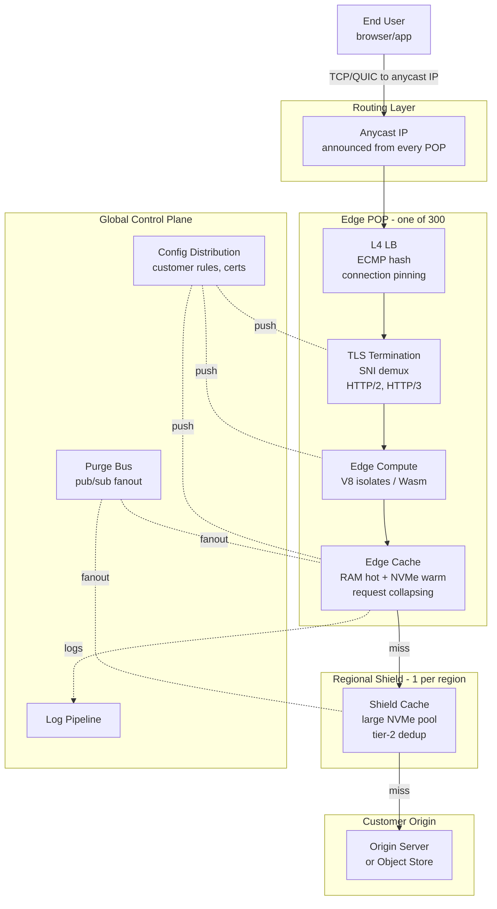

# Design a CDN — Edge POPs, Anycast Routing, Cache Hierarchies, and Edge Compute

**Date:** 2026-04-25 | **Updated:** 2026-04-25
**Tags:** `system-design` `case-study` `infrastructure` `cdn` `hard`

## Table of Contents

- [Summary](#summary)
- [Functional Requirements](#functional-requirements)
- [Non-Functional Requirements](#non-functional-requirements)
- [Capacity Estimation](#capacity-estimation)
- [API Design](#api-design)
- [Data Model](#data-model)
- [High-Level Design](#high-level-design)
- [Deep Dives](#deep-dives)
  - [1. Anycast Routing — Geo-Proximity Without DNS Tricks](#1-anycast-routing--geo-proximity-without-dns-tricks)
  - [2. Cache Hierarchy — Edge → Regional Shield → Origin](#2-cache-hierarchy--edge--regional-shield--origin)
  - [3. Origin Shielding and Request Collapsing — Protecting the Origin](#3-origin-shielding-and-request-collapsing--protecting-the-origin)
  - [4. Purge Propagation — Tag, URL, and Soft Purge](#4-purge-propagation--tag-url-and-soft-purge)
  - [5. Edge Compute — Workers, Lambda@Edge, and the Programmable Edge](#5-edge-compute--workers-lambdaedge-and-the-programmable-edge)
  - [6. TLS Termination at the Edge — Session Resumption and Keyless SSL](#6-tls-termination-at-the-edge--session-resumption-and-keyless-ssl)
  - [7. Cache Key Design and Vary Header Handling](#7-cache-key-design-and-vary-header-handling)
  - [8. Video CDN — Segmenting, Range Requests, and Live Streaming](#8-video-cdn--segmenting-range-requests-and-live-streaming)
- [Bottlenecks & Trade-offs](#bottlenecks--trade-offs)
- [Anti-Patterns](#anti-patterns)
- [Related](#related)
- [References](#references)

## Summary

A content delivery network (CDN) sits between end users and origin servers. Its job sounds simple — "serve cached responses from a server near the user" — and the simple version really is simple: a reverse proxy with an HTTP cache. The hard version, the one that powers Cloudflare, Fastly, Akamai, and CloudFront, is the design that has to cope with **300+ POPs around the world, tens of millions of RPS, billions of cached objects, the public IPv4 routing table, and the realities of TLS, HTTP/2 and HTTP/3, partial content for video, and arbitrary user-attached compute**.

The reference design here is built around four convictions:

1. **Get close to the user via the network, not via DNS.** Anycast on a single IP set, advertised from every POP, lets BGP pick the nearest POP per packet — no DNS games, automatic failover when a POP goes dark.
2. **Tier the cache.** A miss at the edge does not go straight to origin. It traverses a **regional shield** (or "tier-2") that consolidates misses from many edge POPs, dramatically reducing origin RPS and bandwidth.
3. **Make purges first-class.** A CDN that cannot invalidate quickly is just a cache that lies. Purge by URL, by tag (surrogate keys), and softly (mark stale, revalidate) — propagated to every POP in seconds.
4. **The edge is programmable.** A modern CDN ships JavaScript or Wasm that runs on every request: A/B tests, auth, header rewrites, response synthesis, KV lookups. Edge compute is no longer optional.

This design sits in the **distribution layer** of the internet. It does not own the content; it owns the right copy, in the right place, at the right time, with the right invalidation semantics.

## Functional Requirements

| Requirement | Notes |
|---|---|
| **HTTP/HTTPS object delivery** | GET and HEAD on cacheable resources from any user worldwide. |
| **Cache control honoring** | Respect `Cache-Control`, `Expires`, `ETag`, `Last-Modified`, `Vary` per RFC 7234 / RFC 9111. |
| **Origin pull** | On cache miss, fetch from a configured origin (HTTP, S3, GCS, custom) and populate the cache. |
| **Conditional requests** | Send `If-None-Match` / `If-Modified-Since` to origin; serve `304` to clients on revalidation. |
| **Range requests** | Honor `Range` headers; cache range slices for large objects (video, downloads). |
| **Purge** | Invalidate by URL, by surrogate key/tag, or soft-purge globally in seconds. |
| **TLS at edge** | Terminate TLS for customer domains, including SNI multi-tenant, ALPN for HTTP/2 and HTTP/3, and modern ciphers only. |
| **Edge compute** | Run customer JavaScript or Wasm on each request before/after cache lookup. |
| **Logging and analytics** | Stream access logs to a log pipeline; expose hit ratios, p99 latency, byte-served per region. |
| **Origin shielding** | Designate a "shield" POP per origin so all misses funnel through it before hitting origin. |

Out of scope:

- DNS resolver (we use existing public DNS, but provide authoritative DNS for customer hostnames as a separate product).
- Origin storage itself (use [object storage](./design-object-storage.md) underneath).
- DDoS scrubbing as a primary feature (a side effect of the architecture, but not the focus here).
- WAF beyond a stub — full WAF is a sibling system layered on the same edge.

## Non-Functional Requirements

| NFR | Target |
|---|---|
| **Edge latency p50 / p99** | < 20 ms / < 80 ms TTFB for cache hits, globally |
| **Cache hit ratio** | > 95% byte hit ratio for static-heavy customers; > 80% for mixed workloads |
| **Origin offload** | > 99% of edge requests served without touching origin |
| **Availability per POP** | 99.99%; site-level availability via anycast failover |
| **Purge propagation** | p50 < 200 ms, p99 < 5 s globally for tag and URL purge |
| **TLS handshake cost** | Reuse sessions and 0-RTT where safe; full handshake adds < 30 ms within region |
| **Edge compute cold start** | < 5 ms for JS isolates (V8 isolate model); < 50 ms for Wasm |
| **Throughput per edge node** | 40 Gbps sustained, 100 Gbps burst on commodity hardware |
| **Failover** | A failing POP is withdrawn via BGP within seconds; clients reconverge to next-nearest POP |

The framing line: **the closer to the user, the smaller the blast radius and the bigger the multiplier**. A 1% improvement in the edge cache hit ratio removes potentially billions of origin requests per day. A 5 ms shave at TTFB compounds across every page load on the planet.

## Capacity Estimation

### Footprint

- **POPs:** 300 globally, in 100+ cities. Tier-1 POPs (large metros) are full-stack; tier-2 POPs may be edge-only and forward to a regional shield.
- **Servers per POP:** 10–500 depending on city. Median ~50.
- **Total edge servers:** ~15,000.
- **Anycast IP prefixes:** a handful of /24 IPv4 and /48 IPv6 prefixes announced from every POP.

### Traffic

- **Aggregate edge RPS at peak:** ~50M req/s.
- **Aggregate egress at peak:** ~200 Tbps (roughly the order of a top-3 CDN).
- **Average response size:** 50 KB (mixed: HTML, images, JS, JSON API, video segments).
- **Hot-set fraction:** the top 1% of objects serve ~80% of requests (typical Zipfian).

### Cache footprint per edge

- **Per-server disk cache:** 8 NVMe drives × 4 TB = 32 TB usable.
- **Per-server RAM cache:** 256 GB; ~200 GB usable for hot-set.
- **Per-POP cache:** 50 servers × 32 TB = 1.6 PB on disk.
- **Cluster-wide unique footprint:** customer asset library is far larger than any one POP holds — each POP holds a regional working set, not the global catalog.

### Origin offload math

- **Edge RPS:** 50M req/s.
- **Edge byte hit ratio:** 95% → 5% misses → 2.5M req/s would hit shields.
- **Shield byte hit ratio on top:** 80% of those → ~500K req/s reach origins.
- **Per origin (assume 100K customers, long tail):** average ~5 req/s, hot customers see 10K req/s.

These numbers determine the shape of the system: **anycast** because no DNS-based steering can match BGP convergence at this scale; **shields** because asking 300 POPs to all hammer one origin on a cold start would knock the origin over; **request collapsing** because even within one POP, a viral cold object can produce thousands of concurrent misses for a single URL.

## API Design

### Cache control (origin → CDN)

The origin governs cache behaviour with standard HTTP headers. The CDN respects them and adds vendor extensions.

```http
HTTP/1.1 200 OK
Content-Type: image/webp
Content-Length: 184320
Cache-Control: public, max-age=60, s-maxage=86400, stale-while-revalidate=600, stale-if-error=86400
ETag: "v3-7b1c..."
Surrogate-Control: max-age=86400
Surrogate-Key: product-1234 catalog-fall-2026
Vary: Accept-Encoding, Accept

<binary>
```

- `max-age` — browser TTL.
- `s-maxage` — shared-cache (CDN) TTL; overrides `max-age` for the CDN.
- `Surrogate-Control` — CDN-specific TTL (RFC 5861 / Edge Architecture spec); overrides `Cache-Control` at the CDN tier when present, while leaving `Cache-Control` for the browser.
- `Surrogate-Key` — Fastly-style tag set; the CDN indexes the cache entry under each tag for tag-based purge.
- `stale-while-revalidate` — serve stale up to N seconds after expiry while a background revalidation runs.
- `stale-if-error` — serve stale up to N seconds when origin returns 5xx.
- `Vary` — list of request headers that vary the cached representation; the CDN partitions cache keys accordingly.

### Purge API (customer → CDN control plane)

```http
POST /v1/purge/url
Authorization: Bearer <api-token>
Content-Type: application/json

{
  "urls": [
    "https://cdn.example.com/products/1234.webp",
    "https://cdn.example.com/products/1234.html"
  ],
  "method": "instant"
}

202 Accepted
{
  "purge_id": "prg_01HX...",
  "status": "propagating",
  "estimated_global_completion_ms": 1500
}
```

```http
POST /v1/purge/tag
{
  "tags": ["product-1234", "catalog-fall-2026"],
  "method": "soft"
}
```

- `method: instant` — evict from every POP immediately (hard purge).
- `method: soft` — mark entries stale; next request triggers revalidation. Cheaper to propagate; safer than full eviction (origin still gets a `304` round-trip rather than a cold fetch).

### Edge compute (customer code)

Cloudflare Workers / Fastly Compute / CloudFront Functions all expose a fetch-event handler:

```js
addEventListener('fetch', (event) => {
  event.respondWith(handle(event.request));
});

async function handle(request) {
  const url = new URL(request.url);
  if (url.pathname.startsWith('/api/auth')) {
    return new Response('unauthorized', { status: 401 });
  }
  // delegate to the cache + origin pipeline
  const cached = await caches.default.match(request);
  if (cached) return cached;
  const upstream = await fetch(request);
  // tweak response headers before caching
  const out = new Response(upstream.body, upstream);
  out.headers.set('x-served-by', 'edge');
  event.waitUntil(caches.default.put(request, out.clone()));
  return out;
}
```

## Data Model

The CDN is fundamentally a key-value cache keyed by a derived **cache key**.

```text
CacheEntry:
  cache_key:        bytes        # derived from method+host+path+vary+query+segment
  body_handle:      blob_ref     # pointer into local NVMe object pool
  status_code:      uint16
  headers:          map<string, string>
  vary_axes:        list<string> # headers that vary representation
  surrogate_keys:   list<string> # tags for purge-by-tag
  origin_etag:      string
  origin_last_mod:  string
  inserted_at:      uint64
  expires_at:       uint64       # absolute s-maxage / Surrogate-Control TTL
  swr_until:        uint64       # stale-while-revalidate window
  sie_until:        uint64       # stale-if-error window
  size_bytes:       uint64
  hit_count:        atomic<u64>
```

### Cache key construction

```text
cache_key = SHA-256(
  scheme || host || method || path || canonical(query) ||
  for h in vary_axes: canonical(request[h])
)
```

The canonicalisation step matters. `Accept-Encoding: gzip, br` and `Accept-Encoding: br, gzip` represent the same axis; if you don't normalize, you fragment the cache and ruin the hit ratio.

### Indexes

- **Primary:** `cache_key → CacheEntry` (per-server in-memory hash map for hot, on-disk for warm).
- **Tag index:** `surrogate_key → set<cache_key>` for tag purge.
- **LRU/LFU eviction list** to decide what to drop when disk fills.

## High-Level Design



### Hot path

1. User resolves `cdn.example.com` → returns the anycast IP (one of a few public addresses).
2. The user's packets travel via BGP to the **closest POP that announces that prefix**. "Closest" here means closest in BGP path metrics, which usually correlates with low latency.
3. L4 load balancer at the POP uses ECMP hash to pin the flow to one edge server.
4. TLS terminates at the edge server; SNI selects the right certificate.
5. Edge compute (if any) runs.
6. Cache lookup:
   - **Hit and fresh:** return immediately.
   - **Hit and stale, in SWR window:** return stale, kick off background revalidation.
   - **Miss:** forward to the regional shield.
7. Shield does the same lookup. On a shield miss, the shield (not the edge) talks to origin. Origin sees one request even if 50 edge POPs were missing the same object.
8. Response flows back through shield → edge → user, populating both caches.

### Control path

- Configuration (cache rules, certs, worker code) is pushed from a global control plane to all POPs via a multi-region pub/sub.
- Purges land on a **purge bus** that fans out to every POP in seconds — this is the most operationally critical control surface.
- Logs stream out from each POP to a central pipeline for analytics and billing.

## Deep Dives

### 1. Anycast Routing — Geo-Proximity Without DNS Tricks

A CDN must route each user to a nearby POP. The two classical mechanisms:

- **DNS-based steering (GeoDNS).** The authoritative DNS server returns a different `A` record per resolver location: a user in Tokyo gets the IP of the Tokyo POP. This is what Akamai pioneered.
- **IP anycast.** The same IP prefix is announced from every POP. BGP — the internet's routing protocol — naturally drives each user's packets to the POP whose announcement looks "closest" to that user's transit provider.

Both approaches solve the same problem; their failure modes differ.

**Anycast properties:**

- **Failover is automatic and fast.** If a POP goes dark, it stops announcing the prefix; BGP withdraws within seconds, packets reconverge to the next-best POP. No DNS TTL to wait for.
- **Same IP everywhere.** TLS certificates for the anycast IP work in every POP without per-POP cert juggling.
- **DDoS surface absorbs naturally.** A reflection attack against the anycast IP gets distributed across POPs by BGP, not concentrated at one location.
- **No reliance on resolver location.** GeoDNS steers based on the resolver's IP, which is increasingly wrong (public resolvers like 1.1.1.1 and 8.8.8.8 sit far from many users). Anycast routes the user's packets directly.

**Anycast caveats:**

- **TCP and TLS state must be local to each POP.** Mid-flow rerouting (a BGP path change while a connection is open) can flip a flow to a different POP, which has no TCP state for it — RST. In practice, BGP paths are stable on the seconds-to-minutes scale; long-lived flows occasionally suffer. Mitigation: keep connections short, use HTTP/2 or HTTP/3 with quick reconnect; for QUIC, connection migration helps.
- **Suboptimal "closest" picks.** BGP picks the path with the fewest AS hops, not the lowest latency. Some POPs may receive traffic from oddly far users because of peering arrangements. Operators tune this via BGP communities, MED, prepending, and selective peering.
- **Capacity planning per POP is harder.** With DNS, you can shift load by changing answers. With anycast, you shift load by changing what each POP announces — slower, more sweeping.

Hybrid models are common: anycast for the front door, plus DNS-based regional segmentation for non-anycast services. Cloudflare and Fastly are anycast-first; Akamai historically uses DNS-heavy steering with anycast for some products.

See [load balancers](../../building-blocks/load-balancers.md) and [design-load-balancer.md](./design-load-balancer.md) for the L4/L7 building blocks that sit behind the anycast IP at each POP.

### 2. Cache Hierarchy — Edge → Regional Shield → Origin

A flat cache topology — every edge POP talks directly to the origin — does not survive at scale. Two failure modes:

1. **Cold-start thundering herd.** A new viral object means 300 POPs simultaneously cache-miss and hit origin. Origin sees 300× amplification.
2. **Cache fragmentation.** Each POP independently caches the long tail. Cumulative cache size used is 300× the unique object size; hit ratios per POP suffer because each POP only sees ~1/300 of global traffic for niche objects.

**Two-tier topology**:

```text
User → Edge POP (tier-1) → Regional Shield (tier-2) → Origin
```

- **Edge tier:** every POP. Optimised for low TTFB on hits, for the local hot set. Smaller cache, RAM-heavy.
- **Shield tier:** one (or a few) per region. Optimised for high hit ratio, larger NVMe cache. The edge tiers in a region all funnel misses through their region's shield.

Effects:

- **Origin offload increases dramatically.** Origin now sees roughly one request per unique object per shield, not per edge POP. With 5–10 shields globally, that is 30–60× less origin load than flat.
- **Long-tail hit ratio improves.** A niche object missed at 50 edge POPs all populates *one* shield entry; subsequent edges read from the warm shield, not the cold origin.
- **Edge cache stays small and hot.** Edge eviction is aggressive; the shield holds the cooler-but-still-cached working set.

Both Cloudflare ("Tiered Cache" with Argo) and Fastly ("Origin Shield") expose this architecture as customer-configurable. Akamai has used multi-tier ICP/ICDN topologies for two decades.

**Trade-offs:**

- **Extra hop on misses.** Edge → shield → origin adds one cross-region RTT to a miss (typically 20–60 ms). Hits are unaffected; misses are already the slow path.
- **Shield is a hot spot.** A tier-2 cache concentrates load. Sized accordingly: more servers, larger cache, dedicated network capacity.
- **Customers in shield region get a free upgrade.** Users near the shield POP have effectively a one-tier cache (their edge IS the shield). Users far away pay one extra hop.

See [caching layers](../../building-blocks/caching-layers.md) for the broader cache-hierarchy theory; the same look-aside / tiered patterns apply at the application level.

### 3. Origin Shielding and Request Collapsing — Protecting the Origin

Two distinct techniques solve overlapping problems:

**Origin shielding** (the topology of section 2) ensures only one POP per region talks to origin. **Request collapsing** ensures only one request per object talks to origin, even within a single POP, even when 10,000 concurrent clients are all asking for the same cold object simultaneously.

#### Request collapsing (a.k.a. coalescing, a.k.a. "wait for the leader")

Without collapsing, this happens:

```text
t=0    Client A requests /viral.mp4. Cache miss. Edge dispatches origin fetch.
t=10ms Client B requests /viral.mp4. Cache miss. Edge dispatches another fetch.
t=20ms Client C requests /viral.mp4. Cache miss. Another fetch.
...
t=500ms Origin sees 10,000 concurrent fetches for the same URL. Burns.
```

With collapsing:

```text
t=0    Client A requests /viral.mp4. Cache miss. Edge marks the cache key as "fetching", dispatches origin fetch.
t=10ms Client B requests. Sees the "fetching" marker. Subscribes to the in-flight fetch.
...
t=500ms Origin response returns. Edge populates cache, hands the response stream to A, B, C, ... all of them.
```

Implementation details:

- A per-cache-key **single-flight lock** ensures only one upstream fetch is in flight.
- Late arrivals attach to the streaming response; if the body is already being delivered, they get the prefix from the partially-populated cache entry plus a tail-stream from the in-flight fetch.
- Time-bounded — if the leader fetch hangs, followers eventually time out and fall back to a fresh fetch.
- Across POPs, request collapsing is what shielding gives you for free: edges already coalesce locally, the shield coalesces across edges.

This is critical for live events: a goal in a soccer match means a million simultaneous miss requests for the new replay clip. Without collapsing, the origin gets a million requests; with it, the origin gets one.

#### Origin shielding configurations

Customers can pin a shield POP per origin. Considerations:

- **Place shield close to origin**, not close to users. The shield-to-origin link is the expensive one to amortise.
- **For multi-region origins**, use multiple shields; map each region to its nearest origin replica.
- **For S3 / GCS origins**, the shield is often placed in the same cloud region as the bucket to avoid egress costs.

### 4. Purge Propagation — Tag, URL, and Soft Purge

Cache invalidation is one of the two hard problems. A CDN's correctness depends on it: a stale page after a deploy, a stale price after a flash sale, a stale legal page after a takedown — these are operational disasters.

#### Three purge granularities

1. **URL purge.** "Evict this exact cache key on every POP." Simple, narrow. Good for one-off corrections.
2. **Tag purge (surrogate key purge).** "Evict every cache entry tagged with `product-1234`." Powerful, application-aware. Good for "I just changed product 1234 and 50 pages reference it."
3. **Hostname or wildcard purge.** "Evict everything under `cdn.example.com/blog/*`." Coarse, expensive — usually rate-limited.

#### Soft vs hard purge

- **Hard purge** removes the entry from cache. The next request is a full miss → origin fetch.
- **Soft purge** marks the entry as immediately stale. The next request still goes to origin, but as a **conditional request** with `If-None-Match` (or `If-Modified-Since`). If origin says `304 Not Modified`, the cache marks it fresh again — no body transfer, minimal cost.

Soft purge is the right default. A bulk hard purge of a million entries means a million origin cold fetches; the same purge as soft means a million `304` round-trips that are cheap. Use hard purge only when you genuinely need to ensure the body is dropped (e.g., legal takedown).

#### Propagation mechanism

The purge API call lands on a **global purge bus** (think Kafka or a custom pub/sub). Every POP runs a subscriber that:

1. Receives the purge event (URL set, tag set, scope).
2. Looks up cache keys to evict (direct hash for URL; tag index for surrogate key).
3. Marks entries stale (soft) or removes them (hard).
4. Acknowledges completion.

Targets: **p50 < 200 ms, p99 < 5 s globally**. Achieving p99 < 5 s requires:

- A fanout topology with regional aggregation (control plane → regional brokers → POPs).
- Idempotent, ordered delivery per tag (so you don't undo a later purge with a stale earlier one).
- No customer auth check on the hot path (auth is at the purge submission API, not at each POP).

Fastly publicly cites < 150 ms global purge p50; Cloudflare's tag purge is similarly fast. Both back this with surrogate keys (Fastly) or cache tags (Cloudflare Enterprise).

#### Why tag purge is the killer feature

URL purge requires the publisher to know every cache key affected by a change. For a CMS where one product appears on its detail page, the homepage carousel, three category pages, and a search result snippet, that's brittle.

With tag purge, the origin emits `Surrogate-Key: product-1234` on every response that mentions product 1234. One purge call invalidates them all atomically. This is the right operational primitive.

#### Purge as a data-consistency primitive

The CDN cache is, in CAP terms, an AP system: each POP has its own cache and might serve stale data during propagation. Purge is the **eventual consistency repair mechanism**. The TTL is the upper bound on staleness; purge tightens the actual staleness window.

For high-stakes content (auth tokens, A/B test assignments, personalised pages), the right answer is usually `Cache-Control: private, no-store` — keep it out of the CDN entirely.

### 5. Edge Compute — Workers, Lambda@Edge, and the Programmable Edge

Modern CDNs let customers run code at the edge. The shapes:

| Platform | Runtime | Cold start | Memory | Use cases |
|---|---|---|---|---|
| Cloudflare Workers | V8 isolates (JS, Wasm) | ~5 ms typical, 0 ms warm | 128 MB | Auth, A/B, header rewrite, KV lookup, full apps |
| Fastly Compute | Wasm (any compiled lang) | < 1 ms | 50–512 MB | Same — Wasm-first model |
| AWS Lambda@Edge | Container-style | 50–500 ms | 128 MB–10 GB | Heavier compute, fewer locations |
| AWS CloudFront Functions | JS, severe limits | < 1 ms | 2 MB | Header rewrite only — viewer-request hooks |

#### V8 isolate model (Cloudflare's design)

A single `node`-style process hosts thousands of customer scripts as isolated V8 contexts. Each context has its own heap, globals, and security boundary. Isolates share the underlying V8 engine, so:

- **No process-per-tenant.** Memory overhead is per-context (kilobytes), not per-process (megabytes).
- **No cold start in the container sense.** New requests instantiate an isolate from a pre-snapshotted state in microseconds.
- **Bound by the V8 sandbox.** No native syscalls, no threads — only the APIs the runtime exposes (`fetch`, `caches`, `crypto.subtle`, KV, R2, etc.).

#### Where edge compute fits in the request pipeline

```text
TLS termination
   ↓
Edge worker pre-cache  ← rewrite request, short-circuit, A/B
   ↓
Cache lookup
   ↓ (miss)
Edge worker post-cache ← transform response, set surrogate keys
   ↓
Origin fetch
```

The pre-cache hook can rewrite the cache key — effectively partitioning the cache by user attribute (country, device class) without spamming origin. The post-cache hook can attach surrogate keys, mutate `Cache-Control`, or compose responses from multiple upstreams.

#### Trade-offs

- **Latency budget.** Code at the edge runs on every request, in the hot path. Allocation of even 5 ms compounds globally.
- **Statefulness.** Workers are per-POP; there is no global mutable state. Distributed KV (Workers KV, Fastly KV Store) gives eventually-consistent reads everywhere; durable objects / strong-consistency primitives have higher latency and locality constraints.
- **Debuggability.** Reproducing a bug that only happens at 0.01% of POPs in Asia is hard. Tail logs and tracing become essential infrastructure.
- **Security.** Customer code runs adjacent to other customers in the same isolate host. The sandbox must be airtight; Spectre-class attacks are real concerns and have been mitigated with site isolation and process boundaries between mutually-distrustful tenants.

Reference points: [Cloudflare's "How Workers Works"](https://developers.cloudflare.com/workers/reference/how-workers-works/) and [Fastly's Compute architecture](https://www.fastly.com/documentation/reference/compute/) describe the production designs.

### 6. TLS Termination at the Edge — Session Resumption and Keyless SSL

Every modern CDN serves HTTPS for tens of millions of customer hostnames. TLS at the edge is non-trivial.

#### Multi-tenant SNI

The edge IP serves thousands of hostnames. SNI in the TLS ClientHello tells the server which cert to present. The edge:

1. Parses the SNI from ClientHello.
2. Looks up the cert in a per-host map (hot in RAM, lazily fetched from a config store).
3. Completes the handshake.

A miss in the cert map is a fail-fast: the edge cannot synthesise certs on the fly (the private key would have to live in too many places). Cert distribution is part of the control plane and must reach every POP in seconds when a new customer onboards.

#### Session resumption — TLS 1.3 PSK and 0-RTT

Full TLS 1.3 handshake: 1-RTT. With PSK resumption (the client cached a session ticket from a prior visit): 0-RTT for the first application-data packet. The CDN can serve a cache-hit before the server's first response leaves the network.

Caveats:

- **0-RTT is replayable.** The same ClientHello can be replayed by an attacker. The server must accept 0-RTT only for idempotent requests (`GET`, `HEAD`).
- **Tickets must be encrypted with a key shared across the POP** so a returning user can land on any edge server in the POP and resume. Rotated ticket keys are pushed via the control plane.

#### Keyless SSL — keeping the private key off the edge

For customers who cannot tolerate their private key sitting on a third-party CDN's servers, **keyless SSL** keeps the key in the customer's HSM or origin. The CDN handles the TLS handshake but offloads the cryptographic operation that requires the private key (the signature in `CertificateVerify`, or the RSA decryption in pre-TLS-1.3) to the customer's keyserver via a secure channel.

- **Latency cost:** one extra round-trip from edge to customer's keyserver during the handshake.
- **Mitigations:** session resumption means most handshakes don't need the keyserver; aggressive keyserver placement (one per region) bounds the latency.
- **Pioneered by Cloudflare** for banks and regulated industries; widely supported in enterprise CDN tiers.

#### HTTP/2 and HTTP/3 (QUIC)

- **HTTP/2** multiplexes streams over one TCP+TLS connection — fewer handshakes per page load.
- **HTTP/3** runs on QUIC over UDP, integrating TLS 1.3 into the transport. 0-RTT, no head-of-line blocking, connection migration across IP changes (mobile networks moving Wi-Fi → 5G).
- ALPN in the ClientHello negotiates the protocol; the edge supports both, the client picks.

For QUIC + anycast, **connection migration** is what saves long-lived flows from BGP path flips: the connection ID is independent of the 5-tuple, so a flow surviving a reroute can re-attach to a different edge server provided session keys can be retrieved (typically via a per-region session ticket cache).

### 7. Cache Key Design and Vary Header Handling

The cache key determines whether two requests hit the same entry. Design it wrong, and you either:

- **Fragment the cache** — too many keys, low hit ratio.
- **Serve the wrong content** — different requests hashed to the same key.

#### Default cache key

```text
key = scheme + host + method + path + canonical(query)
```

#### Query string handling

- **Significant parameters** (e.g., `?id=42`) must be in the key.
- **Tracking parameters** (e.g., `utm_source`, `gclid`, `fbclid`) should be **stripped** before keying. They have no impact on the response but explode the keyspace.
- **Order normalisation:** `?a=1&b=2` and `?b=2&a=1` should hash the same. Sort parameters alphabetically before hashing.
- Customers configure per-route which query params matter.

#### `Vary` header

When origin returns `Vary: Accept-Encoding`, the CDN must store separate cache entries per distinct `Accept-Encoding` value. Practical handling:

- **`Accept-Encoding`** — almost universal. Canonicalise to a small enumeration (`gzip`, `br`, `zstd`, `identity`) — don't key on the raw header which has many orderings.
- **`Accept`** — content negotiation. Canonicalise to a representative MIME (e.g., `image/webp` vs `image/jpeg`) per the negotiated response.
- **`Accept-Language`** — risky. Many languages × many regional variants → cache shatters. Common practice: strip to the language code, accept some loss in personalisation.
- **`User-Agent`** — almost always wrong to vary on. Even minor browser version bumps shatter the cache. Use device classification (`mobile` / `desktop` / `bot`) instead, computed at the edge and stored as a synthetic key axis.
- **`Cookie`** — generally a cache buster. The right answer is to strip cookies before lookup, except for an allow-list of cookies that meaningfully affect the response.

#### Response variants and the `Vary` index

Each cache entry stores its `Vary` axes. On a request, the edge:

1. Computes the base key from method + host + path + query.
2. Looks up all variants under that base key.
3. For each variant, evaluates request headers against its stored `Vary` axes.
4. Picks the matching variant; if none, treat as a miss.

This is the model in [RFC 9111 Section 4.1](https://www.rfc-editor.org/rfc/rfc9111.html#section-4.1).

#### Cookie and personalisation interaction

A common mistake: origin sets `Set-Cookie` on a public response. Per RFC, `Set-Cookie` does not by itself make the response uncacheable — but in practice, most CDNs treat any response with `Set-Cookie` as private unless explicitly told otherwise (`Cache-Control: public` overriding). The safer rule: never let `Set-Cookie` leave the origin on cacheable URLs; route logged-in traffic through a separate, uncached path or use edge-compute to attach session-specific data after a cache hit.

### 8. Video CDN — Segmenting, Range Requests, and Live Streaming

Video traffic is most of the public internet's bytes. CDNs handle it via two fundamentally different models.

#### Progressive download and Range requests

A single MP4 file delivered with `Range: bytes=...` headers. The client requests slices as the user scrubs and as the playback buffer needs. CDN behaviour:

- **Cache slices, not whole files.** The cache key includes `Range: bytes=0-1048575`; each slice is its own entry. A 10 GB movie becomes thousands of cache entries.
- **Or cache whole-file and answer slices from it.** Trade-off: simpler cache, but the whole file must be present before any slice is served, which is bad for cold starts.
- **Most production CDNs cache by chunk** (typically 1–8 MB) and respond with `206 Partial Content` assembled from cached chunks plus on-demand fetches.

Range requests interact with origin shielding: the shield must be willing to serve sub-range fetches and aggregate them. Origins must handle range requests cleanly — many object stores (S3, GCS) do.

#### Adaptive bitrate streaming (HLS, DASH)

The dominant model for both VOD and live. The video is encoded into multiple bitrates, each segmented into 2–10 second `.ts` or `.m4s` chunks, indexed by a **manifest** (`.m3u8` for HLS, `.mpd` for DASH).

- **Segments are perfectly cacheable.** They are immutable once published, with content-addressable URLs (e.g., `seg_00042_720p.ts`). Long TTLs.
- **Manifests are not.** For live streams, the manifest updates every few seconds with new segment URLs. TTL is short (1–2 seconds, sometimes "no-cache" with shielded request collapsing handling fanout).
- **Request collapsing is critical for live.** A million viewers all requesting the next segment 2 seconds from now → without collapsing, origin sees a million requests for one 1 MB file.

Latency targets:

- **VOD:** TTFB < 100 ms at edge for cached segments.
- **Low-latency live (LL-HLS, CMAF chunked):** sub-second glass-to-glass; segments are delivered as they're produced via chunked transfer encoding, requiring HTTP/1.1 chunked or HTTP/2 push semantics through the edge. The edge must not buffer the whole segment before starting delivery.

#### DRM and signed URLs

Premium content uses signed URLs (a HMAC over path + expiry + IP) so that scraped URLs expire quickly. The CDN validates the signature at the edge before serving — typically via edge compute. DRM (Widevine, FairPlay) is layered on top: the segment itself is encrypted, the license server (origin-side) hands keys to authenticated players. The CDN serves encrypted bytes; it does not need the keys.

#### Origin-shield placement for video

Place shields close to the origin's video packager. Misses on a hot live segment → millions of viewers → without a tight shield, the packager dies. With shielding, the packager sees one request per region, total: 5–10 RPS for a globally watched event.

## Bottlenecks & Trade-offs

| Component | Bottleneck | Mitigation |
|---|---|---|
| Anycast routing | BGP path may not reflect latency; suboptimal POP selection for some users | BGP communities + selective peering + RUM-based steering for HTTP-level redirects when needed |
| Edge cache RAM | Hot set bigger than RAM → spillover to NVMe | LRU + frequency sketches (TinyLFU); admission filters (skip caching one-shot objects) |
| Edge cache disk | NVMe write amplification on churning workloads | Large object pools with sequential writes; segment-based eviction; dedicated cache disks separate from logs |
| Shield concentration | Shield POP becomes hot; saturates network or CPU | Multiple shields per region, sharded by hostname or path hash |
| Purge bus | Global fanout under burst (1M tags purged at once) | Regional aggregators; batching; backpressure with retry on tag-purge clients |
| Surrogate-key index | Large tag → millions of cache keys → slow eviction | Limit tags per response; lazy eviction (mark-stale + sweep); shard the index |
| TLS handshake CPU | Full handshakes are CPU-bound; AES-NI / hardware accel essential | Session ticket caches; PSK resumption; offload signature operations to dedicated cores |
| HTTP/2 head-of-line blocking on TCP | Single TCP loss stalls all multiplexed streams | Encourage HTTP/3 (QUIC) where supported; tune kernel TCP for short retransmit |
| Edge compute CPU budget | Workers eating into request budget at scale | Per-tenant CPU quotas; isolate-level deadline enforcement; charge by CPU-ms |
| Cache key explosion via `Vary` | Wrong `Vary` → 100× cache fragmentation | Customer-side education; strip user-controlled `Vary` axes by default; canonicalise `Accept-Encoding` |
| Cold start on viral object | 10K simultaneous misses for one URL | Request collapsing + shield concentration + (for video) chunked progressive delivery |
| Origin overload during purge storm | Bulk hard purge stampedes origin | Default to soft purge; rate-limit hard purge; SWR cushions |
| Long-lived TCP flows under BGP flap | RST when path flips mid-flow | HTTP/3 connection migration; short-lived HTTP/2 connections; per-region session ticket sharing |
| Logs at 50M RPS | 50M log lines/s × N fields → exabyte/year | Sample (1:100) for analytics; retain full logs only for billing + abuse |

The headline trade-off is **cache freshness vs origin offload**. Long TTLs maximise hit ratio and minimise origin load but extend the staleness window after a change. SWR + tag purge gives the best of both: long TTLs for offload, fast purge for correctness when needed.

## Anti-Patterns

1. **Cache by `User-Agent`.** Every browser version becomes its own cache entry; hit ratio collapses. Use device classification at the edge instead.
2. **Vary on `Cookie` for public pages.** Every session shatters the cache. Strip cookies on public URLs; route logged-in pages through a separate uncached origin.
3. **Hard-purge everything on every deploy.** A million cold-fetches stampedes origin. Use soft purge as default; hard purge only for legal or correctness-critical evictions.
4. **`Cache-Control: no-cache` everywhere "to be safe".** Defeats the CDN. The right defaults are public, with sensible `s-maxage` and `stale-while-revalidate`.
5. **Ignoring `Vary: Accept-Encoding`.** Missing it serves a Brotli body to a gzip-only client, or vice versa. Always include it on compressed responses.
6. **Cookie-based A/B testing on cached URLs.** The CDN serves whichever variant got there first. Move A/B assignment to edge compute and either rewrite the cache key or split URLs per variant.
7. **Origin returns 200 with an error body.** CDN happily caches the error for `s-maxage` seconds. Always use proper status codes; configure `stale-if-error` for graceful degradation.
8. **Single origin behind 300 POPs without a shield.** Origin sees 300× the cold-miss traffic of a properly tiered CDN. Always configure shielding.
9. **Storing private keys on every edge server.** Compromise of any server leaks every customer's key. Use keyless SSL or, at minimum, per-customer key isolation.
10. **Long `Cache-Control: max-age` on HTML.** Browser caches the page for hours, ignoring CDN purge. Use `max-age=0, s-maxage=86400` so only the CDN caches; the browser always revalidates.
11. **Edge compute that calls origin synchronously on every request.** Defeats caching; turns the edge into a slow proxy. Use edge KV or cache the upstream call.
12. **Treating purge as best-effort.** Some teams purge and immediately publish the new version. Soft purge + revalidation is fine; hard purge has propagation latency. For correctness-critical changes, wait for the purge ACK before flipping origin.
13. **Cache-keying on the full query string.** UTM tags, fbclid, gclid each create a fresh cache entry. Strip tracking params; key only on parameters that affect the response.
14. **Range requests without chunked caching.** A 50 GB file caching as one entry never fits anywhere; serving its ranges from origin every time defeats the CDN. Always chunk.
15. **Not testing failover.** A POP that has never failed in production is one that hasn't had its failure tested. Rehearse anycast withdrawal; verify clients re-converge cleanly.

## Related

- [Caching Layers](../../building-blocks/caching-layers.md) — the broader cache-hierarchy theory; CDN is the public-internet variant of look-aside + tiered caching.
- [Load Balancers](../../building-blocks/load-balancers.md) — L4/L7 LB design that sits behind every POP's anycast IP.
- [Design a Load Balancer](./design-load-balancer.md) — the case study for the LB tier inside a POP.
- [Design Object Storage](./design-object-storage.md) — the typical origin behind a CDN; range requests and lifecycle interplay there.
- [CAP and Consistency Models](../../data-consistency/cap-and-consistency-models.md) — the CDN cache is an AP system; purge is the eventual-consistency repair primitive.

## References

- [RFC 9111 — HTTP Caching](https://www.rfc-editor.org/rfc/rfc9111.html) — the modern obsoletion of RFC 7234; defines `Cache-Control`, `Vary`, conditional requests, and the response-variant model that CDNs implement.
- [RFC 7234 — HTTP/1.1 Caching (historical)](https://www.rfc-editor.org/rfc/rfc7234.html) — the predecessor still widely cited; the semantics it codified are unchanged in 9111.
- [RFC 5861 — HTTP Cache-Control Extensions for Stale Content](https://www.rfc-editor.org/rfc/rfc5861.html) — `stale-while-revalidate` and `stale-if-error`, the building blocks of safe CDN freshness.
- [RFC 8297 / 8470 — Early Hints and 0-RTT replay considerations](https://www.rfc-editor.org/rfc/rfc8470.html) — guidance for using TLS 1.3 0-RTT safely at the edge.
- [Cloudflare blog — How Anycast IPv4/IPv6 works](https://blog.cloudflare.com/a-brief-anycast-primer/) — accessible primer on the anycast routing model the company is built on.
- [Cloudflare — How Workers Works](https://developers.cloudflare.com/workers/reference/how-workers-works/) — the V8-isolate edge-compute model in production.
- [Cloudflare — Tiered Cache and Argo](https://developers.cloudflare.com/cache/how-to/tiered-cache/) — the regional-shield architecture as a customer-configurable feature.
- [Cloudflare — Keyless SSL](https://blog.cloudflare.com/keyless-ssl-the-nitty-gritty-technical-details/) — keeping private keys off the CDN's servers while still terminating TLS.
- [Fastly — Origin Shield](https://www.fastly.com/documentation/guides/full-site-delivery/caching/shielding/) — Fastly's tier-2 cache product and the operational rationale.
- [Fastly — Surrogate Keys for instant purge](https://www.fastly.com/documentation/guides/full-site-delivery/purging/working-with-surrogate-keys/) — tag-based purge as the default operational primitive.
- [Fastly — Compute platform overview](https://www.fastly.com/documentation/reference/compute/) — Wasm-first edge compute architecture.
- [Akamai — Intelligent Edge Platform white paper](https://www.akamai.com/site/en/documents/research-paper/akamai-intelligent-edge-platform-overview.pdf) — high-level view of the original CDN architecture: hierarchical caches, DNS-based steering, content invalidation.
- [HTTP/3 explained — Cloudflare and IETF](https://blog.cloudflare.com/http3-the-past-present-and-future/) — QUIC, 0-RTT, connection migration, and the implications for an anycast CDN.
- [Apple HLS specification (RFC 8216)](https://www.rfc-editor.org/rfc/rfc8216.html) — segmented adaptive bitrate streaming as deployed across every video CDN.
