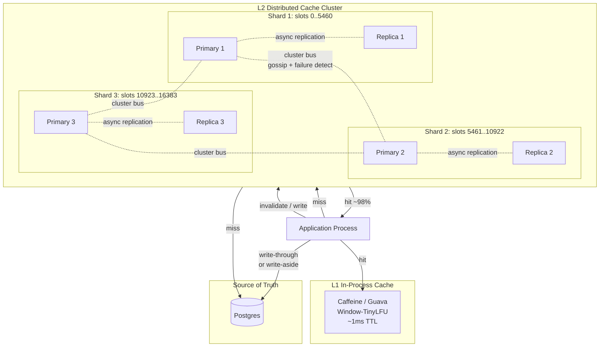

# Design a Distributed Cache — Consistent Hashing, Replication, Stampede Protection, and Multi-Tier Topology

**Date:** 2026-04-25 | **Updated:** 2026-04-25
**Tags:** `system-design` `case-study` `infrastructure` `caching` `hard`
**LLD Twin:** [LRU Cache (LLD) — Hash Map + Doubly-Linked List Implementation](../../../low-level-design/case-studies/data-structures/design-lru-cache.md) — class-level OOD with entities, relationships, and patterns.


## Table of Contents

- [Summary](#summary)
- [Functional Requirements](#functional-requirements)
- [Non-Functional Requirements](#non-functional-requirements)
- [Capacity Estimation](#capacity-estimation)
- [API Design](#api-design)
- [Data Model](#data-model)
- [High-Level Design](#high-level-design)
- [Deep Dives](#deep-dives)
  - [1. Partitioning — Consistent Hashing Ring with Hash Slots](#1-partitioning--consistent-hashing-ring-with-hash-slots)
  - [2. Replication — Primary-Replica per Partition](#2-replication--primary-replica-per-partition)
  - [3. Eviction — LRU, LFU, TTL, and the Approximations Real Caches Use](#3-eviction--lru-lfu-ttl-and-the-approximations-real-caches-use)
  - [4. Topology Awareness — Smart Clients vs Proxies](#4-topology-awareness--smart-clients-vs-proxies)
  - [5. Cache Stampede Protection — Coalescing, Locks, Probabilistic Early Expiration](#5-cache-stampede-protection--coalescing-locks-probabilistic-early-expiration)
  - [6. Hot Key Handling — Fan-out Replicas, Local Tier, Sharded Counters](#6-hot-key-handling--fan-out-replicas-local-tier-sharded-counters)
  - [7. Write Strategies — Through, Back, Aside](#7-write-strategies--through-back-aside)
  - [8. Multi-Tier Caching — L1 In-Process + L2 Distributed](#8-multi-tier-caching--l1-in-process--l2-distributed)
  - [9. Redis Cluster vs Memcached — Two Honest Designs](#9-redis-cluster-vs-memcached--two-honest-designs)
  - [10. Wire Protocol — RESP and Why It Looks the Way It Does](#10-wire-protocol--resp-and-why-it-looks-the-way-it-does)
- [Bottlenecks & Trade-offs](#bottlenecks--trade-offs)
- [Anti-Patterns](#anti-patterns)
- [Related](#related)
- [References](#references)

## Summary

A distributed cache is one of those systems that sounds trivial — "RAM, but networked" — and immediately becomes one of the hardest pieces of production infrastructure to operate well. The reads are fast and the writes are fast, but every interesting failure mode hides in the seams: a single hot key that melts a node, a stampede that hammers the database when an entry expires, a topology change that the client SDK didn't notice, a write-back cache that lost a node and lost the only copy of the data.

The design here is deliberately opinionated. The two honest reference implementations are **Redis Cluster** (data-structure server, primary-replica per shard, 16384 hash slots, smart-client routing) and **Memcached** (pure key-value, client-side consistent hashing, no replication, no persistence). Both are correct for what they do — they just answer different questions. We will design a system that borrows the best parts of both, keep the trade-offs explicit, and call out the patterns Facebook described in their 2013 NSDI paper *"Scaling Memcache at Facebook"*, which remains the most useful real-world account of running a cache at this size.

The framing line: **a cache must fail open**. If the cache is down or returns the wrong answer, the system slows down, but it does not lose data. Every design choice — write strategy, replication policy, stampede protection — is in service of that property.

## Functional Requirements

| Requirement | Notes |
|---|---|
| **`GET key`** | Return the value, or a miss. Sub-millisecond p50, low single-digit p99 within a region. |
| **`SET key value [EX seconds]`** | Write a value with optional TTL. Idempotent. |
| **`DEL key`** | Remove a key from all replicas. |
| **`MGET / MSET`** | Multi-key operations on a single shard; cross-shard variants must be split client-side or coordinated by the proxy. |
| **`INCR / DECR`** | Atomic counter ops on the primary. Hot-key candidates — see Deep Dive 6. |
| **TTL & expiry** | Both passive (on access) and active (background sweep). |
| **Eviction under memory pressure** | LRU, LFU, TTL, or random — operator-configurable per cache. |
| **Optional CAS** | `SET ... NX` for "set-if-not-exists"; used for distributed locks and stampede coordination. |

Out of scope:

- Strong cross-shard transactions (different system).
- Disk-backed durable storage (use a key-value store; see [`design-key-value-store.md`](./design-key-value-store.md)).
- Pub/sub, streams, geo-indexes — Redis offers these, but they are layered features, not what makes it a cache.

## Non-Functional Requirements

| NFR | Target |
|---|---|
| **Read latency p50 / p99** | < 0.5 ms / < 2 ms within an availability zone |
| **Write latency p50 / p99** | < 0.5 ms / < 3 ms (async replication); < 5 ms p99 for sync replicated writes |
| **Hit ratio** | 95–99% for well-tuned workloads — the cache is only worth it at high hit rates |
| **Throughput per node** | 100K–1M ops/sec (single-threaded Redis tops out around 100K with persistence; pipelined or threaded reaches 1M) |
| **Availability** | 99.95%+ — but the *system* must tolerate cache loss (fail open) |
| **Memory efficiency** | < 20% overhead vs raw value bytes; jemalloc fragmentation matters |
| **Failover time** | < 30 s for primary failover with sentinel/cluster-bus consensus |
| **Horizontal scalability** | Add nodes with minimal data movement; resharding does not freeze the cluster |

The non-target worth naming: we are **not** building a system of record. The cache may lose data on a crash and that is fine — the source of truth is downstream. Designs that try to make a cache durable (write-back without a log, replication without quorum) usually end up doing both jobs badly.

## Capacity Estimation

### Working set sizing

- **Application QPS:** 5M reads/sec, 500K writes/sec at peak.
- **Target hit ratio:** 98%. That means the database sees only 100K reads/sec from misses, plus 500K writes for invalidations.
- **Average value size:** 1 KB. Working set: 200 GB hot data, 2 TB warm.
- **Per-node RAM budget:** 64 GB usable (after OS, jemalloc fragmentation, replication buffers).
- **Cluster size for working set:** 200 GB / 64 GB ≈ **4 primaries minimum**, but for replication, isolation, and headroom, run **6–8 primaries with 1 replica each = 12–16 nodes**.

### Throughput baseline

| Workload | Per-node ops/sec |
|---|---|
| Single-threaded Redis, 1 KB values, no persistence | ~100K |
| Redis with pipelining (batched commands) | 500K–1M |
| Memcached, multi-threaded, on a 16-core box | 500K–800K |
| Lettuce/jedis pooled client, persistent connections | bounded by network RTT, not CPU |

### Network

- 5M ops/sec × 1 KB ≈ 5 GB/s aggregate; per-shard at 16 shards ≈ 312 MB/s, well within 10 GbE.
- Pipelining is the single biggest practical lever — a 100-command pipeline cuts RTT cost by 100x.

### Memory accounting per key (Redis-style)

| Item | Size |
|---|---|
| Key string | 32–64 B |
| Value string | 1 KB typical |
| Object header (RedisObject) | ~16 B |
| Dictionary entry overhead | ~24 B |
| Expire dict entry (for TTL keys) | ~24 B |
| Total overhead per key | ~80–100 B |

For 200M keys at 1 KB each, you don't pay 200 GB — you pay 200 GB + ~20 GB metadata. Operators who forget this run out of memory before they run out of value bytes.

## API Design

```text
# Smart-client protocol (RESP)
GET cart:u_42
*2\r\n$3\r\nGET\r\n$8\r\ncart:u_42\r\n
→ $128\r\n<128 bytes of value>\r\n

SET cart:u_42 "<bytes>" EX 3600
*5\r\n$3\r\nSET\r\n$8\r\ncart:u_42\r\n$128\r\n<...>\r\n$2\r\nEX\r\n$4\r\n3600\r\n
→ +OK\r\n

DEL cart:u_42
→ :1\r\n

# Cluster topology
CLUSTER NODES
→ <node_id> <ip:port@bus_port> master,myself - 0 1714000000000 1 connected 0-5460
   <node_id> <ip:port@bus_port> slave <master_id> 0 ...
   ...

CLUSTER SLOTS
→ slot ranges with primary and replica addresses

# Redirection
GET foo
→ -MOVED 12182 10.0.0.5:6379         # permanent: client updates cache
GET foo
→ -ASK 12182 10.0.0.5:6379           # transient (during reshard): one-shot redirect
```

Two design points worth calling out:

- **`MOVED` is a teaching response.** When the client lands on the wrong shard, the server replies with the correct shard's address. The client is expected to update its slot map and not require a separate "discover topology" round trip.
- **`ASK` is for in-flight resharding.** It says "I am in the middle of migrating this slot; for *this one request*, go to the other shard with an `ASKING` prefix." It does not invalidate the slot map.

## Data Model

A cache entry is opaque bytes plus metadata:

```text
Entry:
  key:           bytes (32–64 B typical)
  value:         bytes (Redis: string | list | hash | set | zset | stream | ...)
  ttl_ms:        uint64 | nil       # absolute expiration time
  lru_clock:     uint24             # for approximate LRU
  freq_counter:  uint8              # for approximate LFU
  encoding:      enum               # int, embstr, raw, ziplist, listpack, hashtable, ...
```

### Hash slots (Redis Cluster)

```text
slot = CRC16(key) mod 16384
```

A cluster has 16384 slots, partitioned across primaries. To force two keys onto the same shard for atomic multi-key ops, wrap part of the key in `{}` — only the bytes inside `{}` are hashed:

```text
GET {user:42}.cart       → hashes "user:42"
GET {user:42}.profile    → hashes "user:42"
```

Both land on the same slot, so `MULTI/EXEC` works.

### Eviction metadata

For approximate LRU, Redis stores a 24-bit clock per object. It samples N (default 5) random keys, compares their LRU clocks, evicts the oldest. For approximate LFU, the counter is logarithmic (saturates around 255 accesses) and decays over time. See Deep Dive 3.

## High-Level Design



### Read path (cache-aside, the default)

1. Application checks **L1 (in-process)** — hit returns in nanoseconds. Skip the network entirely.
2. On L1 miss, application uses smart client to compute `slot = CRC16(key) % 16384`, finds the primary for that slot in its cached topology, sends `GET key` over a persistent TCP connection.
3. Primary returns the value or a miss.
4. On miss, application reads from the database, populates **both L2 and L1**, returns to caller.
5. If the client landed on the wrong shard (topology drift), it gets `MOVED`, updates its slot map, retries on the correct shard.

### Write path (cache-aside)

1. Application writes to the database.
2. On success, application **deletes** (not updates) the corresponding cache key in L2. Optional: also invalidate L1 across all instances (broadcast bus or short L1 TTL).
3. Next read reloads from DB and repopulates the cache.

The choice to delete rather than write is deliberate — see Deep Dive 7.

## Deep Dives

### 1. Partitioning — Consistent Hashing Ring with Hash Slots

Pure modulo hashing (`shard = hash(key) % N`) has the same fatal problem as in storage systems: changing N reshuffles every key. For a cache, the consequence is a stampede on the database the moment you add a node.

**Two practical answers exist, and Redis and Memcached chose different ones.**

**Memcached: classical consistent hashing on a 32-bit ring.** Each server is hashed onto multiple positions on the ring (typically 100–200 virtual nodes per physical server using `ketama` hashing). A key's owner is the next server clockwise. Adding a server only displaces the keys between the new server's positions and their predecessors — roughly `1/N` of the data, distributed across the cluster, not all on one neighbour.

```text
ring positions for 4 nodes × 160 vnodes each = 640 points on a 2^32 ring
hash(key) = 0xDEADBEEF
walk_clockwise(0xDEADBEEF) → next vnode, owned by physical node B
```

**Redis Cluster: 16384 fixed hash slots, manually assigned to nodes.** Slots are explicit — a node owns ranges, you can see them with `CLUSTER SLOTS`, and resharding is the explicit movement of slots from one node to another. The 16384 number is small enough to gossip (each node carries a 2 KB bitmap of which slots are theirs), and large enough that 1000-node clusters still get fine-grained partitioning.

Both designs achieve the same property: **node addition or removal moves only a fraction of keys**. The differences:

| Aspect | Consistent hashing (Memcached) | Hash slots (Redis Cluster) |
|---|---|---|
| Topology owner | Implicit, derived from ring positions | Explicit, mapped slot → node |
| Resharding | Move keys whose hash falls in moved range | Move slots; clearer operational picture |
| Multi-key ops | Hard — each key may live anywhere | Same-slot keys colocate via `{tag}` |
| Discovery | Client computes ring locally | Cluster bus gossip + `CLUSTER SLOTS` |

For a system that needs `MULTI/EXEC` or pipelined multi-key ops with locality, slots win. For a pure get/set workload across many small servers, the ring is simpler and has no central control plane.

See [`../../building-blocks/caching-layers.md`](../../building-blocks/caching-layers.md) for the placement-level treatment of where caches live in the architecture.

### 2. Replication — Primary-Replica per Partition

Within a shard, Redis Cluster runs **asynchronous primary-replica replication**. The primary serves all writes and (by default) all reads; replicas tail the primary's replication stream and apply commands in order. On primary failure, the cluster bus elects a replica to take over.

```text
Primary writes:
  WAL (AOF/replication backlog) ← append command
  in-memory state             ← apply command
  → reply to client                            (fast path)
  → stream command to replicas (async)
```

**Why async?** Sync replication on every write trades 0.5 ms p50 for 2–3 ms p50 — a 4–6× latency hit on a hot path. Most cache workloads tolerate "lost the last 50 ms of writes on failover" because the cache is not the source of truth. The data exists in the database; on failover, the cache just rewarms.

**Failover (Redis Cluster Sentinel-style consensus on the cluster bus):**

1. A primary stops responding to gossip pings beyond `cluster-node-timeout` (default 15 s).
2. A majority of other primaries observe the failure → mark it `FAIL`.
3. The failed primary's replicas race to be elected. The replica with the most up-to-date replication offset wins.
4. The new primary takes over the slot range; topology updates propagate via gossip.
5. Clients receiving `MOVED` for old addresses learn the new map.

**Replica reads (optional, dangerous):** `READONLY` mode lets a client read from replicas. This doubles read capacity but exposes stale data. Cache workloads sometimes accept this; transactional workloads should not.

**Replication is not durability.** A primary that ack'd a write before replication can crash. The replica won't have the write. On failover, the data is gone. If you need durability, you need either AOF + fsync per write (slow), `WAIT` semantics (Redis `WAIT N timeout` blocks until N replicas ack), or a different system entirely.

### 3. Eviction — LRU, LFU, TTL, and the Approximations Real Caches Use

When the cache fills, something has to go. The classic policies:

| Policy | Idea | Strength | Weakness |
|---|---|---|---|
| **LRU** (Least Recently Used) | Evict whichever was accessed longest ago | Strong on temporal locality | Scans (one-shot full reads) flush everything useful |
| **LFU** (Least Frequently Used) | Evict whichever was accessed fewest times | Strong on long-tail popularity skew | "Cache pollution" — old hot items linger forever |
| **TTL** (Time-To-Live) | Evict whatever expired | Predictable, application-controlled | Doesn't handle memory pressure on its own |
| **FIFO / random** | Evict by insertion order or coin flip | Cheap, no metadata | Generally worse than LRU/LFU |

Real caches do not implement true LRU or LFU — the bookkeeping (a doubly-linked list updated on every access; a heap of frequencies) is too expensive for hot paths. Instead they use **approximations**:

**Redis approximate LRU:**

- Each object stores a 24-bit "LRU clock."
- On `GET`, the clock is updated to the global clock.
- On eviction, sample 5 random keys, evict the one with the oldest clock.
- Tunable: `maxmemory-samples 10` improves accuracy at the cost of CPU.
- Empirically, sampling 5 catches ~95% of true-LRU evictions; sampling 10 catches ~99%. True LRU is not worth the cost.

**Redis approximate LFU (since 4.0):**

- Each object stores an 8-bit logarithmic frequency counter.
- On access, the counter increments probabilistically: lower counters increment faster, higher counters slower (saturating around 255).
- The counter **decays** over time — uncounted minutes subtract from the counter.
- On eviction, sample 5 random keys, evict the lowest counter.

**Memcached:** segmented LRU per slab class. Each item is in one of three segments (HOT, WARM, COLD). New items enter HOT; on access, items promote to WARM; idle items demote toward COLD; eviction always happens from the tail of COLD. This survives scan pollution because scans hit COLD first.

**TTL handling:**

- **Passive expiry:** check the TTL on read; if expired, delete and return miss. Cheap, but expired data sits in memory until accessed.
- **Active expiry:** background sweeper samples 20 random keys with TTLs every 100 ms; if more than 25% are expired, sample another 20. Keeps memory under control without scanning everything.

**Eviction policy choice in practice:**

- `allkeys-lfu` for most production caches with skewed access patterns.
- `volatile-ttl` (evict the one expiring soonest) for caches where TTL is the ground truth of importance.
- `noeviction` for caches that must fail writes rather than lose data — appropriate when the cache is being used as a queue, which is its own anti-pattern (see [`../../building-blocks/message-queues-and-brokers.md`](../../building-blocks/message-queues-and-brokers.md)).

### 4. Topology Awareness — Smart Clients vs Proxies

The application needs to send each request to the right shard. There are two architectures, and most production systems use one of them, never both.

**Smart client (Redis Cluster default):**

- Client SDK loads the slot map on startup via `CLUSTER SLOTS`.
- For each request, computes `CRC16(key) mod 16384`, looks up the slot's primary, dials it.
- On `MOVED` response, updates its slot map; on `ASK`, sends a one-shot redirect.
- Persistent connections per shard, multiplexed across application threads.

Pros:

- One network hop per request — minimum possible latency.
- No proxy fleet to operate.
- Backpressure naturally distributed (each app instance manages its own connection pool).

Cons:

- Every language needs a sophisticated client (Lettuce, Jedis, redis-py, ioredis, go-redis).
- Topology updates propagate through MOVED responses — clients can be briefly wrong during reshards.
- Connection-count explosion at high client fanout: 1000 app instances × 100 shards × 10 connections each = 1M open sockets cluster-wide.

**Proxy / router (Twemproxy, Envoy with Redis filter, AWS ElastiCache):**

```text
[App] → [Proxy fleet] → [Cache shards]
```

- Application speaks plain Redis to a stable proxy endpoint.
- Proxy holds the topology, fans out, hashes, routes.
- Proxy collapses many app connections into a small number of pool connections per shard.

Pros:

- Dumb client — any Redis library works.
- Connection multiplexing is the single biggest operational win at scale (Facebook's mcrouter).
- Proxy can do additional work: in-line invalidation, request coalescing, `MGET` fan-out, hot-key detection.

Cons:

- Extra network hop per request — adds 0.2–1 ms p99.
- Proxy is a service to operate, scale, fail over. It is on the hot path.
- Single point of contention if you don't run enough proxy instances.

**Facebook's mcrouter** (the production proxy in front of Memcached) demonstrates the proxy pattern at extreme scale: it implements consistent hashing, request coalescing, multi-region routing, and shadow traffic — features the Memcached server itself never grew. The 2013 NSDI paper *"Scaling Memcache at Facebook"* describes how mcrouter and the smart-client coexist, with mcrouter handling cross-region and cross-pool routing and clients still owning local-pool decisions.

For most teams: **smart client until ~50 application instances per cluster, then proxy.** The connection-pool math changes at scale.

See [`../../scalability/read-write-splitting-and-cache-strategies.md`](../../scalability/read-write-splitting-and-cache-strategies.md) for how this fits the broader cache-routing landscape.

### 5. Cache Stampede Protection — Coalescing, Locks, Probabilistic Early Expiration

When a hot key expires, every concurrent request misses simultaneously. Each one queries the database. The database's read load spikes by `concurrency × QPS` for the duration of the recompute. This is a **cache stampede** (also called a "thundering herd" or "dogpile"), and it has taken production sites down.

Three layered defenses:

**1. Request coalescing (per-process):**

In each application instance, when a thread misses on key `K`, it acquires a per-key in-process mutex. Other threads that miss on `K` wait on that mutex. The first thread loads from DB, populates the cache, releases the mutex. Subsequent threads find the populated value and skip the DB.

```text
go map_lock[K] = mutex; first miss = computes; rest wait on mutex
```

This collapses N concurrent misses into 1 DB query *per process*. Across 100 application instances, the DB still sees up to 100 concurrent misses — a 100x reduction, not full elimination.

**2. Distributed locks via `SET NX` (cross-process):**

When a process misses, it tries `SET lock:K placeholder NX EX 30`. Whoever wins the SET-if-not-exists is the recomputer. Losers either wait briefly and re-`GET K` (assuming the winner will populate it) or serve stale data:

```text
client_a: SET lock:K _ NX EX 30  → +OK   (winner)
client_b: SET lock:K _ NX EX 30  → nil   (loser → wait + retry GET K)
client_c: SET lock:K _ NX EX 30  → nil   (loser → wait + retry GET K)
client_a: <load from DB>
client_a: SET K <value> EX 3600
client_a: DEL lock:K
```

Across the entire cluster, the DB now sees exactly **1** concurrent recompute per key. Costs: an extra round-trip to acquire the lock; a deadlock risk if the winner crashes (mitigated by lock TTL).

**3. Probabilistic early expiration (XFetch / Vattani):**

The cleverest of the three. Instead of all clients seeing the entry expire at the same instant, each client *probabilistically* decides — independently — to recompute *just before* expiry:

```text
on GET K:
  value, expiry, delta = cache.get(K)            # delta = recompute cost in ms
  now = time.now()
  if now - delta * beta * ln(rand()) >= expiry:  # beta = 1.0 typical
    recompute_in_background(K)
  return value
```

For most clients, the random factor pushes recompute into the future and the entry is served as-is. For one (or a handful) lucky early-recompute candidate, recompute fires *before* the entry actually expires, and the new value is in place when other clients arrive. **The entry never appears expired to anyone.** The original Vattani et al. paper proves the method's optimality for stampede avoidance.

Combine all three for production: probabilistic early expiration eliminates the synchronization point, distributed locks deduplicate at the cluster level when stampedes do happen, and per-process coalescing handles the burst within each app instance.

### 6. Hot Key Handling — Fan-out Replicas, Local Tier, Sharded Counters

Some keys are 1000x more popular than the median. They concentrate load on a single shard, which becomes the cluster bottleneck while every other shard is idle. The classical example: a celebrity's profile, the homepage's "trending" list, a global counter.

**Detection:**

- Sample 1% of requests at the proxy; track per-key QPS in a sliding window with count-min sketch.
- Alert when any key exceeds, say, 5% of cluster-wide QPS.
- Redis `MONITOR` and `redis-cli --hotkeys` (sampling-based) help in development; production needs proxy-level instrumentation.

**Mitigations, in order of cost:**

1. **L1 in-process cache.** Promote the hot key to a short-TTL local cache (1–5 seconds). 1000 application instances each serving from RAM with ~99% hit rate reduces L2 load by 100× for that key. This is the single biggest lever — see Deep Dive 8.

2. **Replica reads.** Configure the client (or proxy) to read the hot key from any of the shard's replicas, distributing read load across `1 + replica_count` nodes. Trade off staleness for capacity.

3. **Key replication / fan-out.** Store the same value under multiple keys: `homepage:v1`, `homepage:v2`, ..., `homepage:vN`. Clients pick one at random. The hot key is now N keys, each on a different shard. Writes update all N copies, so this only works for read-heavy keys.

4. **Sharded counters.** For atomic counters, replace `INCR counter` (single shard) with `INCR counter:shard:rand(0,15)` (16 shards) and read with `SUM(GET counter:shard:0..15)`. Trade per-counter atomicity for distributed throughput.

5. **Move the hot key to a dedicated shard.** Operationally drastic, but for a permanently hot key, you can put it (and only it) on a node with no other work to compete with.

The general pattern: **never let a single shard's CPU define your cluster's throughput**. If it does, you have a hot key, and you have at most a handful of options.

### 7. Write Strategies — Through, Back, Aside

How does the cache stay consistent with the database? Three patterns, three sets of trade-offs.

**Cache-aside (lazy-loading) — the default:**

```text
read:  app → cache.get(K)
            miss → app → db.get(K)
                  → cache.set(K, V, TTL)
                  → return V
write: app → db.update(K, V)
            → cache.del(K)
```

- Application owns the dance.
- Cache only ever holds data that was once read (lazy population).
- Inconsistency window: between `db.update` and `cache.del`, a concurrent reader can populate the cache with the *old* value. Mitigations: short TTL, `cache.del` after DB commit (not before), transactional outbox pattern for fully-consistent invalidation.
- Why **delete instead of update?** Updating from app means the app must serialize the value the same way the next reader expects. Different services, different versions, different schemas → mismatched serialization → silent corruption. Deleting forces the next reader to repopulate from the DB authoritatively.

**Write-through:**

```text
write: app → cache.set(K, V)         # cache is the front door
            cache → db.write(K, V)   # cache writes through to DB synchronously
            return success only after both succeed
```

- Cache is always consistent with DB (assuming both writes succeed atomically — usually they don't, and the cache must roll back or retry).
- High write latency: now bounded by DB latency.
- Failure modes: cache up, DB down → cache rejects writes; DB up, cache down → all writes fail.
- Useful when the cache is colocated with the DB (built-in cache layers in some KV stores) or when reads must always hit cache and never the DB.

**Write-back (write-behind):**

```text
write: app → cache.set(K, V)         # ack immediately
            cache → buffer write
            cache → db.write(K, V) async, batched
```

- Lowest write latency — DB writes are amortized and batched.
- **Risk: data loss if the cache crashes before the writeback flushes.** This makes write-back unsuitable for any data that must not be lost. Useful only when the cache has its own durable WAL (now you've reinvented a database) or when loss is acceptable (analytics counters, click logs).
- Reads are always fresh because they hit cache.

**Choosing:**

| Situation | Strategy |
|---|---|
| Read-heavy, eventually consistent OK | Cache-aside |
| Strong-ish read-after-write expected | Write-through (with retry/rollback) |
| Write-heavy, durability not critical | Write-back (with WAL on the cache) |
| Mixed, simple ops team | Cache-aside + short TTL — the boring choice that works |

See [`../../scalability/read-write-splitting-and-cache-strategies.md`](../../scalability/read-write-splitting-and-cache-strategies.md) for the strategy-level deep treatment.

### 8. Multi-Tier Caching — L1 In-Process + L2 Distributed

A network round-trip — even within a data center — is ~200 µs. An in-process map lookup is ~50 ns. That's a 4000× difference. For the hottest 1% of keys, the difference between L1 and L2 is the difference between sub-millisecond p99 and "we are CPU-bound on the L2 cluster."

**The pattern:**

```text
read: app → L1 (Caffeine / Guava / sync.Map / ConcurrentHashMap)
        hit  → return (<1 µs)
        miss → L2 (Redis / Memcached)
                hit  → populate L1 with short TTL → return
                miss → DB → populate L2 + L1 → return
```

**L1 design choices:**

- **Size:** small (1K–100K entries). Enough to hold the hot tail; not so large that GC pauses become significant.
- **Eviction:** **Window-TinyLFU** (Caffeine's algorithm) outperforms LRU and LFU on real workloads. The "window" admits new keys briefly; the "main" segment uses TinyLFU (a count-min sketch over recent accesses) for retention.
- **TTL:** short — 1–10 seconds. The whole point is to absorb micro-bursts; longer TTL accumulates inconsistency.
- **Invalidation:** the hard part. Options:
  - **Short TTL only.** Accept that L1 is up to TTL seconds stale.
  - **Pub/sub broadcast.** L2 publishes invalidations; every L1 subscribes. Clean but doesn't scale beyond a few thousand subscribers.
  - **Per-key versioning.** Cache stores `(value, version)`; on read, app validates the version against L2 before returning. Defeats the latency benefit unless validation is rare.

**Caffeine specifics:** Java's de-facto in-process cache. Implements W-TinyLFU, async loading via `LoadingCache`, refresh-after-write (refreshes asynchronously while serving stale), removal listeners. The Caffeine paper (Manes 2016) documents the algorithm; production hit ratios consistently exceed LRU by 5–10 percentage points on realistic workloads.

**Why not just make L2 bigger?** L2 capacity is cheap; L2 *latency* is bounded by network RTT. No amount of bigger L2 makes a cluster faster than 200 µs per request. L1 is the only way to break the network-RTT floor.

**Anti-pattern: very large L1 with long TTL.** You've now built a stale, undersized, GC-heavy private cache that diverges from L2. Keep L1 small and short-lived; let L2 carry the bulk.

### 9. Redis Cluster vs Memcached — Two Honest Designs

Both systems are correct for what they do. They answer different questions.

| Aspect | Redis Cluster | Memcached |
|---|---|---|
| **Data model** | String, list, hash, set, zset, stream, pubsub | String only |
| **Concurrency model** | Single-threaded per shard (Redis 6+ adds threaded I/O) | Multi-threaded per node, lock-striped |
| **Persistence** | RDB snapshots + AOF append log | None — pure RAM |
| **Replication** | Async primary→replica; cluster bus for failover | None natively (third-party tools or app-level) |
| **Partitioning** | 16384 hash slots, explicit assignment | Client-side consistent hashing |
| **Topology** | Cluster bus gossip; `CLUSTER SLOTS` for discovery | None — clients pick a server-list config |
| **Resharding** | Online slot migration (`MIGRATE`); `ASK`/`MOVED` | Operationally manual; restart-the-world |
| **Multi-key ops** | Same-slot via `{tag}`; `MULTI/EXEC`, scripts | Server-side multi-get; no atomicity across keys |
| **Memory efficiency** | Higher (rich encodings: int, embstr, ziplist, listpack) | Lower; slab allocator wastes a class size |
| **Throughput per node** | ~100K ops/s (single-thread bound, more with pipelining) | 500K–800K ops/s on a multi-core box |
| **Operational complexity** | High — cluster bus, sentinel, persistence, replication | Low — just RAM and a port |
| **When to choose** | Need data structures, persistence, replication, atomic ops | Pure cache; need maximum simple-GET throughput; willing to lose all data on restart |

The honest summary:

- **Redis is a data-structure server that happens to be a cache.** It will outgrow the role — you'll start using sorted sets for leaderboards, streams for queues, scripts for atomic operations. That is a feature.
- **Memcached is a cache and only a cache.** It does the cache job extraordinarily well: high concurrent throughput, simple slab allocation, no surprises. When you don't need anything else, Memcached's simplicity is a virtue.
- Facebook ran a fleet of *trillions* of cache ops per day on Memcached for years (with mcrouter doing the routing/coalescing/replication that the server didn't). The boring choice scales further than you'd think.

For new systems with mixed needs, the path of least regret is Redis Cluster + smart clients. For systems that already use Redis for queues, leaderboards, or pub/sub, you have your answer.

### 10. Wire Protocol — RESP and Why It Looks the Way It Does

Redis speaks **RESP** (REdis Serialization Protocol). It is a deliberately boring text protocol — readable with `nc`, parseable with regex, fast enough that protocol parsing isn't the bottleneck.

**RESP types:**

| Prefix | Type | Example |
|---|---|---|
| `+` | Simple string | `+OK\r\n` |
| `-` | Error | `-ERR wrong number of arguments\r\n` |
| `:` | Integer | `:1\r\n` |
| `$` | Bulk string (length-prefixed) | `$5\r\nhello\r\n`; `$-1\r\n` is nil |
| `*` | Array (length-prefixed) | `*2\r\n$3\r\nGET\r\n$3\r\nfoo\r\n` |

**A complete request/response:**

```text
Client → Server:
*3\r\n
$3\r\nSET\r\n
$3\r\nfoo\r\n
$3\r\nbar\r\n

Server → Client:
+OK\r\n
```

**Why these design choices?**

- **Length-prefixed bulk strings** mean parsing never scans for delimiters within values. Binary-safe by construction — values can contain `\r\n` without escaping.
- **Length-prefixed arrays** allow the server to allocate arg slots before parsing values, avoiding reallocation.
- **Inline errors with `-`** are human-readable; the prefix is the type tag.
- **No framing layer beyond `\r\n`** keeps parsers under 200 lines of code in any language.

**RESP3** (Redis 6+) adds:

- Proper map and set types (RESP2 returned both as arrays, with parity-based key/value pairing).
- Big numbers, doubles, booleans as first-class types.
- Push messages for pub/sub and client-side caching invalidation that don't conflict with normal reply parsing.
- Versioned negotiation via `HELLO`.

**Pipelining over RESP:**

```text
Client sends 100 commands without waiting for replies:
*2\r\n$3\r\nGET\r\n$5\r\nkey:0\r\n
*2\r\n$3\r\nGET\r\n$5\r\nkey:1\r\n
... 98 more ...

Server replies with 100 responses in order:
$3\r\nv0\r\n
$3\r\nv1\r\n
...
```

The RTT for 100 commands is one RTT, not 100. This is the single biggest practical Redis optimization.

**Memcached's text protocol** is similar in spirit: ASCII commands, length-prefixed values, separate binary protocol available for higher throughput. The lessons of RESP — length prefix everything, keep parsers trivial — are universal.

## Bottlenecks & Trade-offs

| Component | Bottleneck | Mitigation |
|---|---|---|
| Single shard CPU | Hot key concentrates all load on one core | L1 cache; replica reads; key fan-out; sharded counters |
| Single-threaded Redis | Long-running commands (`KEYS`, `SMEMBERS` on huge sets) block all clients | Use `SCAN`/`SSCAN`; threaded I/O (Redis 6+); never run blocking ops on prod |
| Replication lag | Async replication can lag behind primary under load | Monitor replication offset; alert at thresholds; provision more replica I/O |
| Cluster bus chatter | Gossip costs grow ~quadratically with node count | Cap cluster at ~1000 nodes; for larger, federate clusters at the application layer |
| Connection count | 1000s of clients × 100s of shards = millions of sockets | Proxy layer (mcrouter, Envoy); connection pooling; keep-alive |
| Memory fragmentation | jemalloc fragmentation can balloon RSS to 1.5× used memory | Activate active defrag; restart shards on rolling schedule; stable value sizes |
| Cache stampede | Mass concurrent miss when TTL expires | Probabilistic early expiration; SET NX coalescing; per-process mutex |
| Topology drift | Client cached old slot map; reshards in progress | MOVED/ASK redirection; periodic CLUSTER SLOTS refresh |
| Cross-DC replication | WAN latency makes sync replication impossible | Async; per-region clusters; tolerate stale reads cross-region |
| Eviction churn | Working set just over RAM; constant eviction | Add capacity; prune dead keys; verify `evicted_keys` is rare, not constant |
| L1 GC pressure (JVM) | Large in-process cache triggers stop-the-world GC | Off-heap cache (Caffeine + Chronicle Map); cap L1 size; choose ZGC/Shenandoah |
| Slow clients | One slow consumer of `SUBSCRIBE` blocks publish | Output buffer limits; disconnect slow clients aggressively |

The headline trade-off is **speed vs durability**. We chose speed. That means cache loss is a non-event for correctness — but the warming period after a flush is a load spike on the database. Capacity-plan the database for cache-cold scenarios.

## Anti-Patterns

1. **Using the cache as the system of record.** Write-back without a durable log; setting `noeviction` and relying on the cache to never lose data. The moment a node crashes, you've lost data forever.
2. **Updating the cache on write instead of deleting.** Different writers serialize differently; concurrent updates race; the cache drifts from the DB silently. Always delete-on-write; let the next reader repopulate authoritatively.
3. **Modulo hashing for shard placement.** `shard = hash(k) % N` resharding is a stampede. Use consistent hashing or hash slots.
4. **Single TTL for all keys.** All keys expire at the same instant → coordinated stampede. Add jitter: `ttl = base + rand(0, base*0.1)`.
5. **Treating L1 as authoritative.** L1 is a stale, private snapshot. Reads that *must* be fresh skip L1 or use versioned validation.
6. **Running `KEYS *` in production.** It's O(N) and single-threaded — your cluster freezes for the duration. Always `SCAN`.
7. **Letting one client connection-pool monopolize a shard.** Without per-shard pool limits, a misbehaving app instance can exhaust file descriptors. Cap connections per shard, per client.
8. **Pub/sub for cache invalidation at scale.** Beyond a few thousand subscribers, broadcast costs dominate. Use TTL or short-window L1 instead.
9. **No cache stampede protection.** A single popular endpoint with a 5-minute TTL produces a 5-minute-period DB spike. Add probabilistic early expiration or coalescing.
10. **Hot key denial: "we don't have hot keys."** You do; you just haven't measured. Sample at the proxy; alert on >5% concentration.
11. **Replication factor of 1 (no replicas) in production.** Saves money until the first failover, when you lose the cache for a node-rebuild duration. Always run at least one replica per shard.
12. **Cross-shard transactions.** `MULTI/EXEC` across slots is not supported. Don't fake it with application-level locks; redesign keys with `{hashtag}` colocation.
13. **Trusting cache freshness across deploys.** A new code version with a different serialization format will read garbage from the cache. Version-namespace keys or flush on deploy.
14. **Using a cache where a queue is needed.** "We'll just `LPUSH` and `BRPOP`" works until you need persistence, ordering guarantees, or backpressure. Use a real broker.

## Related

### Deep-Dive Companions

- [`distributed-cache/partitioning-and-hash-slots.md`](distributed-cache/partitioning-and-hash-slots.md) — consistent hashing, virtual nodes, jump hash, Maglev, slot migration with MOVED/ASKING.
- [`distributed-cache/replication-per-partition.md`](distributed-cache/replication-per-partition.md) — primary-replica, async streams, Sentinel/Cluster gossip, multi-AZ and multi-region trade-offs.
- [`distributed-cache/eviction-policies.md`](distributed-cache/eviction-policies.md) — LRU, sampling-LRU, LFU, TinyLFU, TTL active vs lazy expiry.
- [`distributed-cache/topology-awareness.md`](distributed-cache/topology-awareness.md) — smart clients vs proxies (twemproxy, mcrouter, Envoy), CLUSTER SLOTS, slot map drift.
- [`distributed-cache/cache-stampede-protection.md`](distributed-cache/cache-stampede-protection.md) — singleflight, distributed locks, probabilistic early expiration, stale-while-revalidate.
- [`distributed-cache/hot-key-handling.md`](distributed-cache/hot-key-handling.md) — read fan-out replicas, local L1 tier, sharded counters, hot pool promotion.
- [`distributed-cache/write-strategies.md`](distributed-cache/write-strategies.md) — cache-aside, write-through, write-behind, invalidation patterns, dual-write races.
- [`distributed-cache/multi-tier-caching.md`](distributed-cache/multi-tier-caching.md) — L1 in-process + L2 distributed, coherence via invalidation broadcast, RESP3 tracking.

### Foundations and Adjacent Systems

- [Caching Layers (Building Block)](../../building-blocks/caching-layers.md) — where caches live in the architecture and how they compose with other layers.
- [Read-Write Splitting and Cache Strategies](../../scalability/read-write-splitting-and-cache-strategies.md) — the strategy-level treatment of cache-aside, write-through, write-back, and read-through.
- [Design a Key-Value Store](./design-key-value-store.md) — sister case study for the durable side of the same family. Shares consistent hashing, replication, and gossip patterns; differs sharply on durability and consistency.
- [Replication Patterns](../../scalability/replication-patterns.md) — primary-replica, leaderless, and sync-vs-async trade-offs that show up in the cache replication layer.
- [Sharding Strategies](../../scalability/sharding-strategies.md) — hash slots, range partitioning, and directory services in the broader partitioning landscape.
- [Backpressure, Bulkhead, Circuit Breaker](../../scalability/backpressure-bulkhead-circuit-breaker.md) — how to fail open when the cache misbehaves without taking the database with it.

## References

- [Scaling Memcache at Facebook (Nishtala et al., NSDI 2013)](https://www.usenix.org/system/files/conference/nsdi13/nsdi13-final170_update.pdf) — the canonical real-world account: lease tokens, gutter pools, mcrouter routing, regional replication, and the lessons from running Memcached at trillions of ops/day.
- [Redis Cluster Specification](https://redis.io/docs/latest/operate/oss_and_stack/reference/cluster-spec/) — authoritative reference for hash slots, cluster bus, MOVED/ASK, failover, and resharding.
- [Redis Documentation — Eviction Policies](https://redis.io/docs/latest/develop/reference/eviction/) — `maxmemory` policies, approximate LRU, approximate LFU, and the sampling-based implementation.
- [Memcached Wiki — Architecture](https://github.com/memcached/memcached/wiki) — slab allocation, segmented LRU, threading model, binary vs text protocol.
- [RESP Protocol Specification (Redis)](https://redis.io/docs/latest/develop/reference/protocol-spec/) — RESP2 and RESP3 grammar, type tags, pipelining semantics.
- [Caffeine Cache Design (Manes et al.)](https://github.com/ben-manes/caffeine/wiki/Design) — Window-TinyLFU algorithm, refresh semantics, asynchronous loading; the reference implementation cited by most modern in-process caches.
- [Optimal Probabilistic Cache Stampede Prevention (Vattani et al., VLDB 2015)](https://cseweb.ucsd.edu/~avattani/papers/cache_stampede.pdf) — the proof of optimality for the XFetch-style probabilistic early expiration approach.
- [Consistent Hashing and Random Trees (Karger et al., 1997)](https://www.akamai.com/site/en/documents/research-paper/consistent-hashing-and-random-trees-distributed-caching-protocols-for-relieving-hot-spots-on-the-world-wide-web-technical-publication.pdf) — the original consistent-hashing paper, the algorithmic foundation that both Memcached's ketama and Redis Cluster's hash slots descend from.
- [mcrouter: A Memcached Protocol Router (Facebook Engineering, 2014)](https://engineering.fb.com/2014/09/15/web/introducing-mcrouter-a-memcached-protocol-router-for-scaling-memcached-deployments/) — the proxy pattern for connection coalescing, replicated pools, and cross-region routing in front of dumb cache servers.
