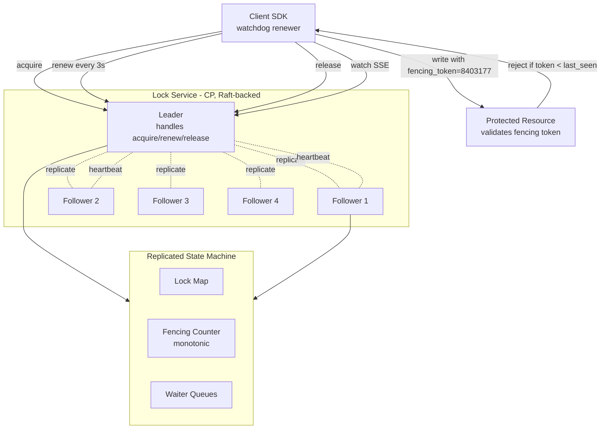

# Design a Distributed Locking Service — Leases, Fencing Tokens, and the Redlock Debate

**Date:** 2026-04-25 | **Updated:** 2026-04-25
**Tags:** `system-design` `case-study` `infrastructure` `coordination` `hard`

## Table of Contents

- [Summary](#summary)
- [Functional Requirements](#functional-requirements)
- [Non-Functional Requirements](#non-functional-requirements)
- [Capacity Estimation](#capacity-estimation)
- [API Design](#api-design)
- [Data Model](#data-model)
- [High-Level Design](#high-level-design)
- [Deep Dives](#deep-dives)
  - [1. Lease-Based Locks — TTL, Renewal, and Why Time Bounds Replace Trust](#1-lease-based-locks--ttl-renewal-and-why-time-bounds-replace-trust)
  - [2. Fencing Tokens — The Only Honest Defense Against Stale Holders](#2-fencing-tokens--the-only-honest-defense-against-stale-holders)
  - [3. ZooKeeper Ephemeral + Sequential Nodes — The Curator Recipe](#3-zookeeper-ephemeral--sequential-nodes--the-curator-recipe)
  - [4. etcd Lease + Revoke — A Modern Raft-Backed Locking Primitive](#4-etcd-lease--revoke--a-modern-raft-backed-locking-primitive)
  - [5. Redlock and Its Controversies — Kleppmann vs antirez](#5-redlock-and-its-controversies--kleppmann-vs-antirez)
  - [6. Watchdog Renewal, Reentrancy, and Fair vs Unfair Acquisition](#6-watchdog-renewal-reentrancy-and-fair-vs-unfair-acquisition)
- [Bottlenecks & Trade-offs](#bottlenecks--trade-offs)
- [Anti-Patterns](#anti-patterns)
- [Related](#related)
- [References](#references)

## Summary

A distributed lock looks like a `mutex` for a fleet of machines: only one process at a time may hold the lock for a given resource, while everyone else waits. The interview-friendly framing is "build a `Lock(resource)` API." The reality is harder: **distributed locks are about coordinating processes that can crash, pause, partition, or be marked dead by mistake** — and any of those events can violate the very property the lock was meant to provide.

Two things make this case study uniquely tricky:

1. **Correctness > availability for locks.** A KV store can return slightly stale data and still be useful. A lock that lets two clients into the critical section at once corrupts data. A locking service therefore sits firmly on the **CP** side of CAP — it must reject acquisitions during partitions rather than risk granting concurrent ownership.
2. **You cannot trust the holder's clock or its liveness.** The classic failure mode — a holder pauses for a stop-the-world GC, the lease expires, the service hands the lock to a second holder, the first holder wakes up and writes to the resource — cannot be solved by any pure mutual-exclusion protocol. It is solved by **fencing tokens**: a monotonically increasing number issued at acquisition time and validated by the protected resource itself.

The reference design here is opinionated. The control plane runs on a **Raft consensus group** (etcd-style) backed by ephemeral leases. Lock acquisition issues a fencing token alongside the lease. Clients run a **watchdog** that auto-renews the lease at a fraction of the TTL. The service exposes acquire / renew / release / watch primitives. We treat **Redlock** as a cautionary case study, not the recommended primitive — Martin Kleppmann's 2016 critique and antirez's response are required reading because they make the trade-offs explicit.

The headline rule from the literature: **if the resource being protected does not check fencing tokens, you do not have a distributed lock — you have a hopeful suggestion.**

## Functional Requirements

| Requirement | Notes |
|---|---|
| **`acquire(resource, ttl, [wait_timeout])`** | Block until the lock is granted or `wait_timeout` elapses. Returns a `(lease_id, fencing_token)` pair. |
| **`renew(lease_id, ttl)`** | Extend the lease before it expires. Idempotent. Failure means the lease is already gone. |
| **`release(lease_id)`** | Voluntary release. Idempotent — releasing an expired lease is a no-op success. |
| **`watch(resource)`** | Subscribe to lock state changes (acquired, released, expired). Used for fair-queue style waiters. |
| **Reentrancy (optional)** | The same client may re-acquire a lock it already holds; counter increments. Release decrements; only the final release frees the lock. |
| **Fair acquisition (optional)** | Waiters are served in FIFO order based on enqueue time. Default is unfair (best-effort, lower latency). |
| **Try-acquire** | Non-blocking variant returning immediately if the lock is held. |

Out of scope:

- Read/write (shared/exclusive) modes — separate primitive, doable as an extension.
- Cross-region strong locks — locks are per-region; cross-region coordination uses application-level semantics.
- Distributed transactions — locks coordinate processes, not multi-key atomic writes.

## Non-Functional Requirements

| NFR | Target |
|---|---|
| **Correctness (mutual exclusion)** | At-most-one-holder must hold under any failure scenario *that the protected resource itself enforces via fencing tokens*. |
| **Consistency** | Linearizable lock state — all observers see the same sequence of acquire/release events. |
| **Availability** | Tolerate `f` failures with `2f + 1` Raft members. With 5 nodes, tolerate 2 failures. |
| **Liveness during partition** | The minority side rejects writes (returns `unavailable`); the majority side continues. **Correctness wins over liveness.** |
| **Acquire latency p99** | < 20 ms within a region for uncontended acquire; < 100 ms for contended (one-step waiter). |
| **Renew latency p99** | < 10 ms — renew is on the steady-state hot path. |
| **Throughput** | 10K+ lock ops/sec per Raft group; partition by resource hash for higher throughput. |
| **Lease TTL range** | 1 s to 1 h; default 10 s with 3-second renewal interval. |
| **Fencing token monotonicity** | Strictly increasing; never reused, never decreasing — even across leader elections. |
| **Operational simplicity** | Single binary, embedded Raft, no external dependencies. |

The framing line: **a lock service that prioritizes availability over correctness is a footgun.** The job of this system is to be the boring, correct primitive that everything else relies on. If a partition makes the lock service temporarily unavailable, that is acceptable. If a partition makes the lock service grant the same lock to two holders, the system is broken.

## Capacity Estimation

### Cluster baseline

- **Raft group size:** 5 nodes (tolerate 2 failures, an odd-quorum sweet spot for production etcd / ZooKeeper)
- **Per-node hardware:** 8 vCPU, 32 GB RAM, NVMe SSD, 10 Gb NIC
- **Active locks held simultaneously (steady state):** 100K–1M
- **Mean lock TTL:** 10 s
- **Renewal interval:** 3 s (~1/3 of TTL)
- **Steady-state renewal rate:** 1M locks / 3 s ≈ **333K renews/sec** — the dominant load
- **Acquire/release rate:** 10K acquires/sec, similar release rate
- **Watch subscribers per popular resource:** 10–100 (one per waiting client)

### Storage

- **Per-lock state:** key (~64 B) + holder ID (~32 B) + lease ID (8 B) + TTL deadline (8 B) + fencing token (8 B) + metadata (~64 B) ≈ **~200 B per lock**
- **1M active locks:** ~200 MB resident state, fits trivially in RAM on every Raft member.
- **Raft log retention:** ~1 GB rolling, snapshot every 10 min.

### Sharding

Single Raft group caps out around 10K writes/sec because every committed entry costs a fsync round trip. To scale:

- **Resource-hash sharded Raft groups.** Resources `hash(resource) mod 16` go to one of 16 Raft groups. Total cluster: 16 × 5 = 80 nodes. Throughput: 16 × 10K = **160K writes/sec aggregate**.
- Renewal rate of 333K/sec is feasible with renew batching (a single client renews many leases in one RPC).

### Network

- **Renew RPC size:** ~200 B request + 100 B response ≈ 300 B round trip.
- **333K renews/sec × 300 B ≈ 100 MB/s** to the leader of each shard. Comfortable on 10 Gb NICs after sharding.

These numbers force the topology: **multiple Raft groups, watchdog renewal as a hot path, and renew batching as a real optimization** — not premature.

## API Design

```http
POST /v1/locks/acquire
Content-Type: application/json

{
  "resource": "orders/shard-7/compactor",
  "client_id": "worker-42-pid-9911",
  "ttl_seconds": 10,
  "wait_timeout_seconds": 30,
  "fairness": "fifo"          // or "unfair" (default)
}

200 OK
{
  "lease_id": "lease_01HX9...Z",
  "fencing_token": 8403177,    // monotonically increasing — pass to the resource
  "resource": "orders/shard-7/compactor",
  "expires_at": "2026-04-25T10:31:12.812Z",
  "renewal_interval_seconds": 3
}
```

```http
POST /v1/locks/renew
Content-Type: application/json

{
  "lease_id": "lease_01HX9...Z",
  "ttl_seconds": 10
}

200 OK
{
  "lease_id": "lease_01HX9...Z",
  "expires_at": "2026-04-25T10:31:22.831Z"
}

410 Gone
{
  "error": "lease_expired",
  "message": "Lease has already expired or been revoked. The lock is no longer held."
}
```

```http
POST /v1/locks/release
Content-Type: application/json

{
  "lease_id": "lease_01HX9...Z"
}

204 No Content
```

```http
GET /v1/locks/{resource}/watch
Accept: text/event-stream

event: acquired
data: {"holder": "worker-7", "fencing_token": 8403178, "expires_at": "..."}

event: released
data: {"holder": "worker-7"}

event: expired
data: {"holder": "worker-7", "expired_at": "..."}
```

Three design points worth calling out:

- **`fencing_token` is part of the acquire response, not optional metadata.** Every protected resource (object store, database row, queue head) must accept and validate the token. The lock service alone cannot enforce mutual exclusion at the resource — it only mediates *who is currently believed to hold the lock*.
- **`410 Gone` on renew failure is intentional.** The client must treat lease loss as "I no longer hold the lock and must abandon any in-flight work." Retrying renew is wrong; the lock has already been granted to someone else with a higher fencing token.
- **`renewal_interval_seconds` is server-suggested.** The client uses this for its watchdog. Hard-coding the interval client-side breaks if the server later wants to tune TTLs operationally.

## Data Model

The state machine replicated by Raft:

```text
Lock:
  resource:        string                          // e.g., "orders/shard-7/compactor"
  holder:          {client_id, lease_id} | null
  fencing_token:   uint64                          // monotonically increasing per resource
  expires_at:      uint64 (epoch ms)               // server-side deadline
  reentrancy_count: uint32                         // 0 if not reentrant; > 0 if same client re-acquired
  waiters:         queue<WaiterEntry>              // for fair acquisition

WaiterEntry:
  client_id:       string
  enqueued_at:     uint64 (epoch ms)
  request_id:      string                          // for idempotent waiter notification

GlobalCounter:
  next_fencing_token: uint64                       // strictly increasing; never reused
```

### Invariants (enforced by the Raft state machine)

1. `holder != null` ⇒ exactly one client holds the lock right now.
2. `fencing_token` only ever increases per resource. Each new acquisition increments it.
3. The global `next_fencing_token` is monotonic across all resources too (simpler implementation; resource-scoped tokens are also valid).
4. `expires_at` is a **server-side** deadline derived from the leader's clock at commit time. Client clocks are never trusted.
5. On Raft leader change, the new leader recomputes lease deadlines using its own clock + remaining TTL. Tolerance for clock skew is built into the lease TTL itself (more on this in Deep Dive 1).

### Storage layout (per Raft group)

```text
Raft log:           append-only commit log of state-machine commands
State machine:      in-memory map<resource, Lock> + Raft snapshots
Snapshot:           periodic full-state dump compacted to disk
WAL:                Raft's own write-ahead log (separate from state)
```

## High-Level Design



### Acquire path

1. Client sends `acquire(resource, ttl)` to any member; followers redirect to the current leader.
2. Leader checks `Lock[resource]`:
   - If unheld or expired (server-side `now > expires_at`): assign the lease, increment fencing counter, set `expires_at = now + ttl`, replicate via Raft.
   - If held: enqueue waiter (fair mode) or reject with `423 Locked` (try-acquire); for blocking acquire, hold the request open until lease expires or a slot frees.
3. Once the Raft entry is committed (majority of followers ack the WAL fsync), the leader returns `(lease_id, fencing_token)` to the client.
4. Client begins the watchdog (Deep Dive 6).

### Renew path

1. Client sends `renew(lease_id)` every `ttl/3` (configurable; smaller is safer, larger is cheaper).
2. Leader checks the lease still exists and `now < expires_at` (with a small grace; otherwise the lease has lapsed and another holder may already exist).
3. Leader replicates the new `expires_at = now + ttl` via Raft. Returns success.
4. If renew fails (network, timeout, lease already gone), the client treats the lock as **lost** and aborts in-flight work. **No retries beyond the lease deadline.**

### Release path

1. Client sends `release(lease_id)`.
2. Leader clears `holder`, replicates, then dequeues the next waiter (if any) and grants them the lock with a fresh fencing token.
3. Watch subscribers receive an `expired` or `released` event.

### Failure path — leader change

1. Old leader pauses (GC, network, hardware fault). Followers stop receiving heartbeats.
2. After election timeout, a follower becomes candidate, wins the election, becomes leader.
3. New leader computes effective `expires_at` for every lock using `local_now + remaining_ttl_at_last_replicated_state`.
4. Locks whose `expires_at` is already past are reaped immediately; waiters are promoted.
5. Clients that were renewing against the old leader will see RPC failures and re-route to the new leader transparently.

## Deep Dives

### 1. Lease-Based Locks — TTL, Renewal, and Why Time Bounds Replace Trust

A naïve lock — "client holds the lock until it calls release" — assumes the client always calls release. In a distributed system, that assumption fails: clients crash, partition, or get GC-paused. Without a release, the lock is stuck forever, and any sane person reaches for **timeouts**.

A **lease** is a lock with a time bound: the holder owns the resource until the deadline, then automatically loses it. Three properties matter:

- **Bounded blast radius of crashes.** A dead holder releases its locks within `ttl` seconds.
- **No trust in client liveness.** The server doesn't ping the client; the client (or its absence) speaks for itself.
- **Clock-bounded correctness.** The server alone owns the deadline — measured against the *server's* clock. Clients propose a TTL; the server stamps the deadline.

The renew loop turns the lease into a "live" lock: as long as the client renews on time, it keeps the resource; the moment the client falls behind, the lease lapses and someone else can acquire.

```text
t=0    acquire(ttl=10s) → expires_at = 10
t=3    renew → expires_at = 13
t=6    renew → expires_at = 16
t=9    GC pause begins on client...
t=10   ...still paused... server's view: expires_at = 16, still valid
t=15   ...still paused... server's view: expires_at = 16, still valid
t=17   server reaps: now > 16, lease expired
t=18   another client acquires; fencing_token bumps
t=20   original client's GC ends; tries renew → 410 Gone
```

This is correct *as a lock service*. The original client's failed renew tells it: "you no longer hold the lock; abandon any in-flight work." But this is exactly where naïve lease implementations get exploited — what if the client *had already started writing to the resource* before the GC pause? Lease expiry tells the holder it's lost the lock, but lease expiry alone cannot stop a lingering write that's already in flight. That is what fencing tokens are for (Deep Dive 2).

**Choosing TTL** is a real trade-off:

- **Short TTL (1–5 s):** fast recovery from dead holders; high renewal traffic; sensitive to network jitter and GC pauses.
- **Long TTL (30–60 s):** low renewal cost; slow to detect a dead holder; longer "stranded resource" windows.
- **Typical default:** 10 s with 3-second renewal interval — three chances to renew before expiry covers most transient blips.

**Clock skew** is bounded by the lease TTL itself. As long as no clock drifts by more than a fraction of TTL between leader and follower (NTP-bounded to milliseconds in a healthy data center), Raft + lease semantics survive leader elections. The lease becomes unsafe only when clocks diverge by significant fractions of the TTL — which is a real concern, and the next deep dive addresses it head-on.

### 2. Fencing Tokens — The Only Honest Defense Against Stale Holders

This is the single most important idea in the document. Read carefully.

A lease alone cannot prevent the following sequence:

```text
Client A acquires lock @ token=42, ttl=10s.
Client A starts writing to the resource.
Client A's process pauses for 15 seconds (full GC, swap, VM migration).
Server expires lease at t=10. Client B acquires @ token=43.
Client B starts writing.
Client A wakes up at t=15, *still believing it holds the lock*, completes its write.
The resource has been corrupted by overlapping writers.
```

No amount of "renew faster" or "shorter TTL" eliminates this. GC pauses of 10+ seconds happen in the JVM. VM live-migration pauses are real. Network partitions delay packets arbitrarily. The lease service can only know what *it* observes — the leader can correctly say "lease expired" — but it cannot rewind time on the actual writes already issued by the stale holder.

**Fencing tokens** solve this by pushing the check into the protected resource itself.

```text
acquire response includes: fencing_token = 42
client writes to resource with: token=42
resource accepts only if: token >= last_seen_token

When client B acquires (after A's lease expires), it gets token=43.
Client B writes with token=43; resource records last_seen = 43.
Client A wakes up, writes with token=42. Resource sees 42 < 43 → rejects.
```

The token is:

- **Monotonically increasing** across all acquisitions of the same resource.
- **Issued atomically** with the lock grant (same Raft commit).
- **Validated at the resource**, not at the lock service.

This last point is the critical one. Martin Kleppmann's 2016 essay ["How to do distributed locking"](https://martin.kleppmann.com/2016/02/08/how-to-do-distributed-locking.html) makes the case in full: **a distributed lock that does not produce fencing tokens validated by the resource is not safe.** The lock service only describes belief; the resource enforces reality.

In practice, "the resource validates the token" looks like:

- **Object stores:** include the token in the object metadata; reject writes with `If-None-Match` semantics or token comparison in a CAS API.
- **Databases:** include the token as a column in the locked row, update with `WHERE last_token < :new_token`.
- **Append-only logs (Kafka, Pulsar):** epoch numbers serve the same role — only the highest-epoch leader can write.
- **State machines:** check the token at the entry point of every mutation.

When the resource cannot be modified to check tokens (legacy systems, third-party APIs), **you do not have a safe distributed lock against that resource.** You have a best-effort coordination primitive. Be honest about that limitation.

ZooKeeper's `czxid` (creation transaction ID) of an ephemeral node is a fencing token. etcd's `Revision` is a fencing token. Redis-based locks have no native fencing token — antirez's Redlock paper [discusses adding one as an extension](https://redis.io/docs/latest/develop/use/patterns/distributed-locks/) but does not require it; this is a real gap that Kleppmann's essay focuses on.

### 3. ZooKeeper Ephemeral + Sequential Nodes — The Curator Recipe

ZooKeeper has been the canonical coordination primitive since 2008, and its lock recipe is the cleanest expression of lease + fencing combined:

```text
1. Client connects to ZooKeeper, establishing a session (the "lease").
2. Client creates an EPHEMERAL_SEQUENTIAL znode under /locks/myresource/.
   ZooKeeper assigns a strictly-increasing suffix:
     /locks/myresource/lock-0000000042
3. Client lists /locks/myresource/ children, sorted lexically.
4. If the client's node has the smallest suffix → it owns the lock.
5. Otherwise → client sets a watch on the node *immediately preceding its own*
   in the sorted list, then blocks waiting for that watch to fire.
6. When the predecessor's znode is deleted (release) or vanishes (session ends),
   the client re-checks the children list and acquires if it's now smallest.
7. To release: delete its own znode, or simply close the session — ZooKeeper
   reaps ephemeral nodes when the session expires.
```

Properties:

- **Ephemeral nodes are leases.** Tied to the client's session; if the client dies or partitions, ZooKeeper reaps the node automatically after session timeout.
- **Sequential numbering provides fencing.** The numeric suffix (or the znode's `czxid`) is a strictly-increasing fencing token that the client passes to the protected resource.
- **Predecessor watching avoids the herd problem.** Naïvely, every waiter watches the first child and stampedes when it changes. Watching only the immediate predecessor fans out N watchers across N waiters, one notification each.
- **Fairness is FIFO by suffix.** First to register, first to acquire.

The Apache **Curator** library packages this as `InterProcessMutex`. Its implementation has been battle-tested for over a decade — read the Curator source to internalize the protocol.

**Failure modes:**

- **Session timeout misjudgment.** ZooKeeper's session timeout is configurable per session but bounded by the cluster's `tickTime`. Set too short and a benign GC pause kills the session; too long and a dead client holds the lock for longer than necessary.
- **Split-brain on the client side.** A client that loses connectivity to ZooKeeper but is still running thinks it holds the lock for the duration of its local session timeout estimate. The fencing token is the fix — without it, the client's "I think I still hold the lock" belief is dangerous.

### 4. etcd Lease + Revoke — A Modern Raft-Backed Locking Primitive

etcd is the more modern equivalent: a Raft-backed KV store with first-class **lease** primitives, used by Kubernetes for leader election and resource locks across the cluster.

```text
1. Client grants a lease: LeaseGrant(ttl=10) → lease_id, kept_alive_ttl
2. Client puts the lock key with the lease attached:
     PUT /locks/myresource value="holder=worker-42" lease=lease_id
3. Lock acquisition uses a transaction:
     If("revision of /locks/myresource") == 0
       Then PUT /locks/myresource ... lease=lease_id
       Else Get current holder
4. The PUT operation's mod_revision is the fencing token.
5. Client runs LeaseKeepAlive in the background (the watchdog).
6. To release: LeaseRevoke(lease_id) — atomically deletes all keys attached to the lease.
7. If the client crashes: lease expires when KeepAlive stops; etcd reaps the lock key.
```

Why this is cleaner than ZooKeeper's recipe:

- **Lease and key are decoupled.** A single lease can attach to many keys; revoking the lease cleans them all up atomically.
- **`mod_revision` is the fencing token.** Every write in etcd produces a strictly-increasing revision; the revision at which the lock was acquired is the token to send to the resource.
- **The transaction (`If/Then/Else`) makes acquisition atomic** in a single round trip — no separate "create then check" race.

The **etcd Lock API** (`v3lockpb.Lock`) wraps this recipe behind a single RPC: `Lock(lease_id, name) → key`. The returned key includes the `mod_revision`, which is the fencing token.

Kubernetes uses this exact pattern for the `kube-controller-manager` leader election: each candidate writes to a `Lease` object (literally a Lease CRD), and the holder renews it. The `resourceVersion` of the Lease object plays the fencing role.

**Trade-offs vs ZooKeeper:**

- **etcd: simpler API, transactional acquire, native revision-as-fencing-token.**
- **ZooKeeper: predecessor-watching pattern is genuinely elegant for FIFO fairness; broader feature set (path-based hierarchy, ACLs).**
- Both are CP systems backed by consensus (Raft for etcd, Zab for ZooKeeper) — both reject acquire requests during a quorum loss.

### 5. Redlock and Its Controversies — Kleppmann vs antirez

Redis's creator Salvatore Sanfilippo (antirez) proposed **Redlock** as a distributed lock built on independent Redis instances — no consensus, no Raft. The algorithm:

```text
1. Client gets the current time in ms (T1).
2. Client tries to acquire the lock on N independent Redis instances (typically 5),
   in parallel, each with the same random value and a TTL.
   It uses SET key value NX PX <ttl>.
3. Client computes elapsed time T_elapsed = now - T1.
4. The acquire succeeds if:
   - The lock was acquired on a majority (>= 3 of 5) of instances.
   - T_elapsed is significantly less than the TTL.
5. The validity time of the lock is initial_TTL - T_elapsed.
6. To release: delete the key on all instances using a Lua script that checks the random value.
```

Redlock's appeal: simple, fast, no separate Raft cluster. Its trouble: **it relies on bounded message delay and bounded clock drift, both of which fail in real systems.**

Martin Kleppmann's [2016 critique](https://martin.kleppmann.com/2016/02/08/how-to-do-distributed-locking.html) argues two main points:

1. **Without fencing tokens, Redlock has the GC-pause problem.** Even if Redlock's acquisition is correct, a paused holder writing to the protected resource after the lease expires can corrupt it. **No mutual-exclusion algorithm — Redlock or otherwise — can prevent this without resource-side fencing.**
2. **Redlock's safety depends on bounded clock drift on every Redis node.** If any one node's clock jumps forward (NTP correction, leap second, VM migration), it may consider a lock expired when it isn't, allowing a second holder to acquire on a majority. Algorithms like Raft survive arbitrary clock skew because they rely on monotonic logical ordering, not wall-clock comparison.

antirez's [response](https://antirez.com/news/101) ("Is Redlock safe?") makes counter-arguments:

- Clock drift on the order of seconds during the lifetime of a lock is rare and can be detected operationally.
- The fencing token problem applies to *any* lock service; it is not unique to Redlock and is a general property of distributed locks.
- For many use cases, "best-effort mutual exclusion with rare violations" is acceptable.

**The honest reading:**

- Kleppmann is correct that Redlock without fencing tokens cannot guarantee safety against all failure modes.
- antirez is correct that the fencing-token critique applies broadly — ZooKeeper, etcd, and Redlock all need resource-side fencing to be truly safe.
- The difference is that ZooKeeper and etcd give you a clear, standard fencing token (`czxid`, `mod_revision`); Redlock does not — you'd have to build one on top.

**Practical recommendation:**

- Use **etcd or ZooKeeper** for production lock services. They are CP, consensus-backed, and provide fencing tokens by construction.
- Use **Redis SET NX** (single-instance) for short, best-effort locks where the protected resource has its own consistency story (e.g., idempotency keys with database constraints) — and only when occasional double execution is recoverable.
- Use **Redlock** only when you understand the failure modes and have explicit fencing at the resource — otherwise its added complexity over single-instance Redis buys nothing safety-wise.

This is one of the most-debated topics in distributed systems precisely because it forces the question: **what does "safe" actually mean for a lock?** The answer is: safety is a property of the lock service *plus* the protected resource together, never of the lock service alone.

### 6. Watchdog Renewal, Reentrancy, and Fair vs Unfair Acquisition

#### Watchdog renewal

A holder cannot rely on the application code to call `renew` reliably. Instead, the SDK runs a **watchdog**: a background goroutine / thread / async task that fires renew calls at `ttl/3` intervals.

```text
On acquire success:
  start watchdog goroutine
  schedule renew every ttl/3 ms

On renew success:
  reset watchdog timer

On renew failure (timeout, 410 Gone, network error):
  fire onLeaseLost callback
  cancel any in-flight work
  do NOT continue using the fencing token

On release:
  stop watchdog
```

Critical detail: **the watchdog must be on a separate execution context from the application's work.** If the application thread is busy or paused, the watchdog must still fire. In the JVM, this means a dedicated `ScheduledExecutorService` thread, *not* sharing the application thread pool.

The watchdog interval `ttl/3` gives three renewal attempts before expiry — surviving one failed renew (transient network blip) plus a second attempt is generally enough to mask flaky network without requiring a too-short TTL.

Redisson and Curator both implement watchdogs — Redisson defaults to a 30-second TTL with a 10-second renewal interval, with a public `lockWatchdogTimeout` parameter to tune it.

#### Reentrancy

A reentrant lock allows the same client to re-acquire a lock it already holds, incrementing a counter rather than blocking. Release decrements; only the final release frees the lock.

```text
acquire @ client A → counter=1
acquire @ client A again → counter=2 (no Raft round trip if optimized)
release @ client A → counter=1 (lock still held)
release @ client A → counter=0 (lock freed)
```

Reentrancy is important for libraries that need to call locked methods recursively. The implementation must:

- Identify "the same client" reliably — usually by a stable client ID.
- Track the counter as part of the lock state.
- Reject re-acquire from a *different* client (that would not be reentrant; it's an attempt to acquire while held).

Java's `ReentrantLock` is the local analogue. Redisson and Curator both support reentrant distributed locks.

#### Fair vs unfair acquisition

- **Unfair (default in most implementations):** when the lock is released, *any* waiter or new arrival may acquire next. Lower latency for new arrivals (no queue overhead); risk of starvation for long-waiting clients.
- **Fair (FIFO):** waiters are served in arrival order. Higher latency, especially for new arrivals (must enter the queue). Necessary for use cases where fairness matters operationally.

ZooKeeper's sequential-znode recipe is naturally fair — the smallest suffix wins. etcd's lock library is unfair by default. Most real systems run unfair because the latency win is significant and starvation is rare in practice.

#### Liveness vs partition tolerance

The CAP trade-off is sharp here. During a network partition:

- **CP behaviour (etcd, ZooKeeper):** the minority side cannot acquire or renew; clients on that side lose their leases at expiry. The majority side continues. **Mutual exclusion is preserved at the cost of liveness on the minority side.**
- **AP behaviour (Redlock without fencing):** both sides may grant locks during a partition; mutual exclusion is violated.

For a lock service, CP is the only honest choice. The minority side is unavailable, but no double-grant happens.

See [consensus: Raft and Paxos](../../data-consistency/consensus-raft-and-paxos.md) for the underlying agreement protocol, and [leader election and coordination](../../data-consistency/leader-election-and-coordination.md) for the broader pattern of which distributed locking is one instance.

## Bottlenecks & Trade-offs

| Component | Bottleneck | Mitigation |
|---|---|---|
| Raft leader | Every acquire/renew/release is a Raft commit; one fsync per commit | Group commit, batched renews, pipelined Raft entries; cap throughput per group around 10K writes/sec, shard for more |
| Renewal traffic | At 1M locks × 10 s TTL × 3-second renewal, that's 333K renew RPCs/sec | Renew batching: client sends `renew(lease_ids[])` in one RPC; server commits them as a single Raft entry |
| Lease expiry sweeps | Naïve "scan all leases every second" is O(N) per tick | Min-heap keyed by `expires_at`; pop expired entries on tick, O(log N) per expiry |
| Watch fanout | One watcher per waiter, hundreds of waiters per popular resource | SSE / gRPC streaming; coalesce notifications by epoch — only notify on state transitions |
| Cross-region locks | Raft across regions adds 100+ ms per commit; renew RPCs become slow and unreliable | Per-region lock services; cross-region coordination via async patterns or higher-level transactions |
| Holder GC pauses | A 10-second GC kills the lease; no amount of renewal saves it | Fencing tokens — the resource enforces correctness even when the holder is stale |
| Clock skew between Raft members | Lease deadline is computed by the leader's clock; election may transfer leader to a skewed clock | Bound TTL >> max NTP drift (10 s TTL ≫ 50 ms NTP drift); add a small grace on lease expiry to absorb transient skew |
| Thundering herd on release | All N waiters wake up and race | Predecessor-watching (ZooKeeper recipe); explicit waiter queue with single-notify on grant |
| Reentrancy state size | Per-lock counter + holder identity — small but adds up at scale | Cap reentrancy depth; release if depth exceeds a threshold |
| Snapshot size | All active locks are part of state-machine state | Bounded by active locks (e.g., 1M locks × 200 B = 200 MB); snapshot every 10 minutes |

The headline trade-off is **availability vs correctness**. We chose correctness. That means: during a partition, the minority side is unavailable for new acquires and renews — by design. Choosing AP (Redlock-style without fencing, or naïve Redis SET NX without consensus) buys availability and forfeits the mutual-exclusion guarantee that was the whole point of the lock service.

## Anti-Patterns

1. **Using a distributed lock without fencing tokens validated at the resource.** This is the cardinal sin. Without resource-side fencing, no lock service — etcd, ZooKeeper, Redlock — can prevent the GC-pause / pause-and-resume failure mode. If you cannot modify the resource to check tokens, document explicitly that your lock is best-effort.
2. **Relying on the client's clock for TTL math.** The server stamps `expires_at` using the leader's clock at commit time. The client should never compute "is my lease still valid?" from its local clock — only from the server's most recent renew response.
3. **TTL too short for the application's pause profile.** A 1-second TTL with a 30-second JVM GC pause is a recipe for spurious lease loss. Measure your workload's tail pause and set TTL well above it.
4. **TTL too long for the recovery profile.** A 1-hour TTL on a critical job means a dead worker holds the lock for an hour — unacceptable for short-lived jobs. Match TTL to the longest realistic uninterrupted work segment.
5. **Sharing the watchdog thread with application work.** If the application thread is blocked in user code, the watchdog cannot fire. Always use a dedicated scheduler / executor for renewal.
6. **Treating renew failure as retryable.** A `410 Gone` on renew means the lease is already gone and possibly held by someone else. Retrying renew is a lie. Abort in-flight work immediately.
7. **Using Redlock without fencing tokens because "it's faster than ZooKeeper."** You're paying complexity for an unsafe primitive. Either accept that the lock is best-effort and design the resource to tolerate occasional double execution, or use a CP service with built-in fencing.
8. **Single-instance Redis SET NX as a "distributed lock."** It is not — it has zero consensus, zero failover safety, and zero fencing. It is a *local cache hint*. Treat it as such.
9. **Locking across regions with a single Raft group.** Cross-region commits add 100+ ms each; renew RPCs become unreliable; lease loss becomes the norm. Use per-region locks and coordinate at a higher layer.
10. **Forgetting to release.** Lease expiry is the safety net, not the primary path. Always explicitly release; expiry should be the exception.
11. **Watching the wrong znode.** In ZooKeeper recipes, watching the *first* child instead of the *immediate predecessor* creates a herd. Always watch the predecessor.
12. **Acquire timeout == lease TTL.** If the acquire wait timeout equals the TTL, a slow acquire can complete just as the lock expires — an immediate race. Set acquire wait timeouts well below TTL.
13. **Reusing fencing tokens.** Tokens must be strictly increasing forever. Wrapping or resetting (e.g., on cluster rebuild) makes them useless. Persist the counter; never reset.

## Related

- [Leader Election and Coordination](../../data-consistency/leader-election-and-coordination.md) — distributed locks are one specific use of leader election; the patterns and primitives generalize.
- [Consensus: Raft and Paxos](../../data-consistency/consensus-raft-and-paxos.md) — the agreement protocol underlying etcd, ZooKeeper, and any safe lock service.
- [Quorum and Tunable Consistency](../../data-consistency/quorum-and-tunable-consistency.md) — locks are the limiting case where quorum-based reads/writes degenerate to "majority for everything."
- [Time and Ordering](../../data-consistency/time-and-ordering.md) — fencing tokens are logical timestamps; the same family of ideas as Lamport clocks, vector clocks, and HLCs.
- [Network Partitions and Split-Brain](../../reliability/network-partitions-and-split-brain.md) — locks are the textbook case study for split-brain, and the partition-tolerance trade-off is starkest here.
- [Failure Detection](../../reliability/failure-detection.md) — lease expiry is a failure detector; the same accuracy/timeliness trade-offs apply.
- [Distributed Transactions](../../data-consistency/distributed-transactions.md) — locks are often combined with transactions; understanding two-phase commit and its limitations is a useful complement.

## References

- [How to do distributed locking — Martin Kleppmann (2016)](https://martin.kleppmann.com/2016/02/08/how-to-do-distributed-locking.html) — the canonical critique of Redlock and the fencing-token argument. Required reading.
- [Is Redlock safe? — Salvatore Sanfilippo / antirez (2016)](https://antirez.com/news/101) — antirez's response to Kleppmann; the other half of the debate.
- [Distributed locks with Redis — Redis Documentation](https://redis.io/docs/latest/develop/use/patterns/distributed-locks/) — the canonical Redlock specification, including the algorithm and discussion of safety properties.
- [ZooKeeper: Wait-free coordination for Internet-scale systems — Hunt et al., USENIX ATC 2010](https://www.usenix.org/legacy/event/atc10/tech/full_papers/Hunt.pdf) — the ZooKeeper paper; introduces ephemeral nodes, sequential znodes, and the lock recipe.
- [Apache Curator — Shared Reentrant Lock recipe](https://curator.apache.org/docs/recipes-shared-reentrant-lock) — the production-grade implementation of the ZooKeeper lock recipe.
- [etcd Documentation — Lock and Lease](https://etcd.io/docs/latest/learning/api/#lock-api) — the modern Raft-backed lock primitive; lease grants, keep-alive, revisions as fencing tokens.
- [In Search of an Understandable Consensus Algorithm (Raft) — Ongaro and Ousterhout, USENIX ATC 2014](https://raft.github.io/raft.pdf) — the consensus protocol that underlies etcd; understanding Raft's leader election and log replication clarifies why CP locking works.
- [The Chubby lock service for loosely-coupled distributed systems — Burrows, OSDI 2006](https://research.google.com/archive/chubby-osdi06.pdf) — Google's predecessor to ZooKeeper; introduces the "lock service" as a coarse-grained coordination primitive and discusses lease semantics in depth.
