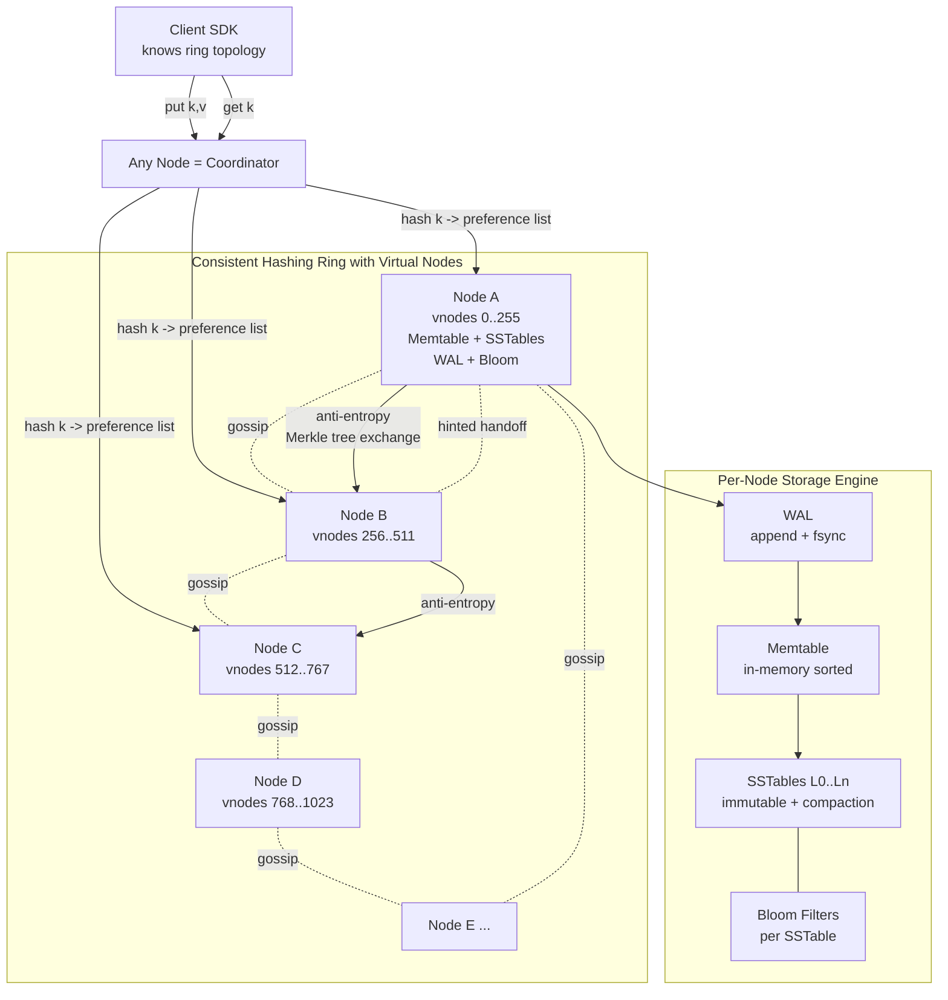

# Design a Key-Value Store — Dynamo-Style Ring, Tunable Consistency, and LSM Storage

**Date:** 2026-04-25 | **Updated:** 2026-04-25
**Tags:** `system-design` `case-study` `infrastructure` `storage` `hard`

## Table of Contents

- [Summary](#summary)
- [Functional Requirements](#functional-requirements)
- [Non-Functional Requirements](#non-functional-requirements)
- [Capacity Estimation](#capacity-estimation)
- [API Design](#api-design)
- [Data Model](#data-model)
- [High-Level Design](#high-level-design)
- [Deep Dives](#deep-dives)
  - [1. Consistent Hashing + Virtual Nodes — Spreading Keys and Replicas](#1-consistent-hashing--virtual-nodes--spreading-keys-and-replicas)
  - [2. NWR Tunable Consistency — N, R, W Quorums](#2-nwr-tunable-consistency--n-r-w-quorums)
  - [3. Vector Clocks — Detecting and Surfacing Conflicts](#3-vector-clocks--detecting-and-surfacing-conflicts)
  - [4. Sloppy Quorum + Hinted Handoff — Availability During Failures](#4-sloppy-quorum--hinted-handoff--availability-during-failures)
  - [5. Anti-Entropy via Merkle Trees — Fixing Long-Term Drift](#5-anti-entropy-via-merkle-trees--fixing-long-term-drift)
  - [6. Read Repair — Cheap Convergence on the Read Path](#6-read-repair--cheap-convergence-on-the-read-path)
  - [7. Gossip-Based Membership and Failure Detection](#7-gossip-based-membership-and-failure-detection)
  - [8. LSM Storage Engine — WAL, Memtable, SSTable, Bloom Filters](#8-lsm-storage-engine--wal-memtable-sstable-bloom-filters)
  - [9. Last-Write-Wins vs Sibling Resolution](#9-last-write-wins-vs-sibling-resolution)
- [Bottlenecks & Trade-offs](#bottlenecks--trade-offs)
- [Anti-Patterns](#anti-patterns)
- [Related](#related)
- [References](#references)

## Summary

A distributed key-value store is the canonical "hard" infrastructure interview. It looks superficially simple — `put(k, v)` and `get(k)` — but every meaningful decision pulls you into the heart of distributed systems: how do you partition data, how do you replicate it, what happens when nodes fail, how do you detect conflicts, and how do you reconcile divergent replicas weeks later when they finally talk again.

The reference design here follows the **Dynamo-style architecture** popularized by Amazon's 2007 paper and inherited by Cassandra, Riak, and Voldemort. The core idea is uncompromising:

1. **No single point of failure.** Every node is identical — no master, no leader.
2. **Always writeable.** A `put` succeeds even when the network is partitioned; conflicts are detected and resolved later.
3. **Tunable consistency per request.** The application chooses N (replicas), W (write quorum), R (read quorum) per operation. Strong consistency is `R + W > N`; eventual consistency is anything else.
4. **Decentralized membership.** Nodes discover each other and detect failures via gossip — no coordinator.

This design accepts that **conflicts will happen** and makes them a first-class concept (vector clocks, siblings, application-level merge). The trade-off is real complexity in the read path, in exchange for an availability and partition-tolerance story that no leader-based system can match.

## Functional Requirements

| Requirement | Notes |
|---|---|
| **`put(key, value)`** | Write a value for a key. Idempotent if the same value+context is replayed. |
| **`get(key)`** | Read the most recent value(s). May return *siblings* if conflict is unresolved. |
| **`delete(key)`** | Soft delete via tombstone; reaped after a grace period. |
| **Range queries** | Optional and explicitly hard in a hash-partitioned store. Cassandra adds it via clustering keys; pure Dynamo skips it. We treat it as out of scope. |
| **TTL on keys** | Optional; tombstones expire and are GC'd by compaction. |
| **Conditional put** | `put_if_absent`, `compare_and_swap` — possible but require coordination; not part of core Dynamo. |

Out of scope:

- Secondary indexes (different system).
- Multi-key transactions (different consistency model).
- SQL-like query language.
- Cross-datacenter strong consistency (we offer cross-DC replication, but not synchronous).

## Non-Functional Requirements

| NFR | Target |
|---|---|
| **Availability** | 99.99%+ for writes; the system must accept writes during single-node and minor-partition failures |
| **Partition tolerance** | Mandatory — CAP forces us to pick AP over CP for the default profile |
| **Tunable consistency** | Per-request `(N, R, W)`; strong consistency available when `R + W > N` |
| **Write latency p99** | < 10 ms within a region for `W = 1`; < 30 ms for `W = quorum` |
| **Read latency p99** | < 10 ms for `R = 1`; < 30 ms for `R = quorum` |
| **Throughput** | 100K+ ops/sec/node sustained on commodity hardware |
| **Durability** | Writes acked only after WAL fsync on at least `W` replicas |
| **Horizontal scalability** | Linear with node count; adding a node rebalances ~`1/N` of the data |
| **Cross-DC replication** | Asynchronous, eventual; per-key replication policy |

The framing line: **no operation should ever need a global view of the cluster**. Every decision — where a key lives, who has the latest copy, who is alive — is local, gossiped, or quorum-derived. The moment you need a consensus protocol on the hot path, you've built a different system.

## Capacity Estimation

### Cluster baseline

- **Cluster size:** 100 nodes
- **Per-node capacity:** 4 TB usable disk, 64 GB RAM, 10 Gb NIC
- **Replication factor (N):** 3
- **Total raw storage:** 100 × 4 TB = 400 TB; with N=3, **~133 TB usable**
- **Vnodes per physical node:** 256 (Cassandra default; Dynamo uses similar magnitude)
- **Total vnodes on the ring:** 100 × 256 = 25,600

### Throughput

- **Per-node ops/sec:** ~50K reads, ~30K writes (commodity SSD, LSM-friendly workload)
- **Cluster aggregate at peak:** 5M reads/sec, 3M writes/sec
- **Per-key fan-out cost:** every write touches N=3 nodes; every read touches R nodes (1–3)

### Object sizes

| Item | Size |
|---|---|
| Average key | 32–64 B |
| Average value | 1–4 KB |
| Vector clock per object (after merges, capped) | 100–500 B |
| WAL entry overhead | ~32 B |
| SSTable index entry | ~24 B |
| Bloom filter per SSTable (1% FP, 1M keys) | ~1.2 MB |

### Rebalancing cost

- **Adding a node:** moves ~1/(N+1) of data from existing nodes onto the new node — for a 100-node cluster, that is ~1% of total data, or **~4 TB** streamed across the network.
- **At 1 GB/s sustained per stream, 4 TB takes ~67 minutes.** Throttle to 200 MB/s/stream to avoid hurting live traffic — bootstrap takes ~6 hours.

These numbers determine the rest of the design: the ring size, the gossip frequency (every 1s for 100 nodes is fine; sub-second for 10K nodes is not), the Merkle-tree leaf granularity, and the SSTable size targets.

## API Design

```http
PUT /v1/objects/{key}
Content-Type: application/octet-stream
X-Context: <opaque vector-clock context from previous get, optional>
X-Consistency-W: quorum                # one | quorum | all | <N>
X-Consistency-N: 3

200 OK
{
  "key": "user_profile/u_42",
  "context": "g1Akb2NrAAAAA1QAAAA...",   // updated vector clock
  "replicas_acked": 2,
  "stored_at": "2026-04-25T10:31:02.812Z"
}
```

```http
GET /v1/objects/{key}
X-Consistency-R: quorum
X-Consistency-N: 3

200 OK
{
  "key": "user_profile/u_42",
  "context": "g1Akb2NrAAAAA1QAAAA...",
  "values": [
    {"value": "<bytes>", "vclock": "..."}    // single value, no conflict
  ],
  "replicas_responded": 2
}
```

When siblings exist:

```http
300 Multiple Choices
{
  "key": "shopping_cart/u_42",
  "context": "g1Akb2NrAAAAA2...",
  "values": [
    {"value": "<cart-A>", "vclock": "v1=2,v2=1"},
    {"value": "<cart-B>", "vclock": "v1=1,v2=2"}
  ],
  "siblings": true
}
```

```http
DELETE /v1/objects/{key}
X-Context: <vclock context>

204 No Content
```

Two design points worth calling out:

- **`X-Context` is the vector clock returned by the previous `get`.** The client is expected to round-trip it on the next `put`. Without it, every write looks "concurrent" with every existing version and you generate siblings constantly. This is exactly how Riak's API works.
- **`300 Multiple Choices` for siblings is intentional.** The store does *not* invent a winner. The application reads all siblings and writes back a merged value with a vector clock that descends from all of them.

## Data Model

A key-value pair is opaque bytes. The internal record carries metadata:

```text
Record:
  key:        bytes
  value:      bytes
  vclock:     map<node_id, (counter, timestamp)>     // vector clock
  metadata:
    created_at:   uint64       // wall-clock, used as LWW tiebreaker
    ttl:          uint32 | nil
    deleted:      bool         // tombstone marker
    content_type: string
```

### On-disk layout (LSM)

```text
WAL/<segment_id>.log        # append-only commit log
memtable                    # in-memory sorted map (skiplist or BTreeMap)
SSTable/<level>/<gen>.sst   # immutable sorted runs
SSTable/<level>/<gen>.idx   # sparse index
SSTable/<level>/<gen>.bloom # bloom filter for membership
```

### Partition assignment

```text
partition_id = hash(key) mod RING_SIZE        # RING_SIZE = 2^32 or 2^64
preference_list = walk_ring(partition_id, N)  # next N distinct physical nodes
```

The **preference list** is the ordered set of N nodes that should hold this key. The first node is the *coordinator* candidate; reads and writes are routed to any node, but operations against the key fan out to its preference list.

## High-Level Design



### Write path

1. Client sends `put(k, v, context)` to any node — that node becomes the **coordinator** for this request.
2. Coordinator hashes `k`, computes the preference list `[N1, N2, N3]`, and checks the gossip view for liveness.
3. Coordinator forwards the write to all live members of the preference list (sloppy quorum: substitute if some are down, with hint metadata).
4. Each replica:
   - appends to its WAL and fsyncs;
   - inserts into its memtable;
   - bumps its component of the vector clock and merges with the client-provided context;
   - sends an ack.
5. Coordinator returns success once W replicas have acked. Remaining replicas finish asynchronously; if some never finish, anti-entropy will catch it.

### Read path

1. Client sends `get(k)` to any node.
2. Coordinator forwards to all live members of the preference list.
3. Each replica looks up `k`:
   - check memtable;
   - check bloom filters of recent SSTables, skip those whose bloom says "no";
   - read from the matching SSTables, merge by vclock.
4. Coordinator collects R responses, merges by vector clock:
   - if all vclocks descend from a common ancestor → return the latest value;
   - if vclocks are concurrent → return all siblings (300 Multiple Choices).
5. **Read repair**: if responses differ but a clear winner exists, the coordinator writes the winner back to the stale replicas, asynchronously.

## Deep Dives

### 1. Consistent Hashing + Virtual Nodes — Spreading Keys and Replicas

The naïve approach — `node_id = hash(k) mod num_nodes` — collapses the moment a node joins or leaves. Every key remaps; the entire dataset re-shuffles. For a 100-node, 100-TB cluster, that is unacceptable.

**Consistent hashing** maps both nodes and keys onto a ring (e.g., `[0, 2^64)`). A key's owner is the next node clockwise. Adding a node only displaces the keys between the new node's position and its predecessor — roughly `1/(N+1)` of total data, *not* all of it.

The pure version has two practical problems:

1. **Skew.** With only 100 nodes, a few segments of the ring may be 5× larger than others. Some nodes own way more data than they should.
2. **Heterogeneity.** A bigger machine should hold more data. Pure consistent hashing makes that awkward.

**Virtual nodes (vnodes) solve both.** Each physical node is assigned, say, 256 random positions on the ring. The ring now has 25,600 evenly-distributed segments. The variance in load per physical node drops dramatically. To give a beefier machine 2× the data, give it 512 vnodes instead of 256.

```text
Physical node A → vnode positions [42, 9821, 11045, 28100, ...]
Physical node B → vnode positions [177, 5503, 14008, 22919, ...]
```

When node A fails, its 256 vnodes' ranges each fail over to a *different* successor on the ring — load is spread across many other nodes, not piled onto one neighbour. This is the same property that makes node addition smooth: the new node "steals" a tiny slice from each of many existing nodes in parallel.

For the **preference list** of a key, the coordinator walks the ring clockwise from `hash(k)` and picks the next N **distinct physical nodes** (skipping additional vnodes of a node already in the list). Otherwise, with bad luck, all N "replicas" could land on the same machine — which is not replication.

See [consistent hashing](../../data-structures/consistent-hashing.md) for the data-structures-level treatment.

### 2. NWR Tunable Consistency — N, R, W Quorums

NWR is the dial that lets the application choose its consistency posture per request:

- **N** — replication factor; how many nodes hold each key.
- **W** — number of replicas that must ack a write before the client sees success.
- **R** — number of replicas that must respond to a read before the client sees a result.

The classic property: **`R + W > N` ⇒ strong consistency** (any read overlaps with the latest write by at least one replica, so the latest version is always visible).

| Profile | N | W | R | Behaviour |
|---|---|---|---|---|
| Strong-ish consistency | 3 | 2 | 2 | `2+2 > 3` — read sees latest write; both ops tolerate one failure |
| High write availability | 3 | 1 | 3 | Write returns fast; read scans all replicas, picks latest by vclock |
| High read availability | 3 | 3 | 1 | Read returns fast; write must hit everyone — fragile under failures |
| Weak (cheap) | 3 | 1 | 1 | Lowest latency, no overlap guarantee — eventual consistency only |
| Quorum default | 3 | 2 | 2 | Tolerates one node down for both reads and writes |

The trick is that **the coordinator does not block waiting for the slow replicas**. With `N=3, W=2`, the coordinator acks the client as soon as 2 replicas write; the third write proceeds in the background. If the third never completes (node crashed), anti-entropy and read repair catch it later.

This is a real lever in production. Cassandra exposes it as `CL` (consistency level) per query — `ONE`, `QUORUM`, `LOCAL_QUORUM`, `ALL`. Riak exposes the literal `r` and `w` parameters per request.

See [quorum reads/writes (NWR)](../../data-consistency/quorum-reads-writes-nwr.md) for the formal treatment, and [CAP and consistency models](../../data-consistency/cap-and-consistency-models.md) for how this fits the broader landscape.

### 3. Vector Clocks — Detecting and Surfacing Conflicts

When two replicas can both accept writes (and they can, in an AP system), wall-clock timestamps cannot tell you which write happened "first." Clocks drift. Concurrent writes are real.

**Vector clocks** label every version with a per-node counter:

```text
Initial:  vclock = {}
write @ N1: vclock = {N1: 1}
write @ N1 again: vclock = {N1: 2}
network partition; meanwhile a write @ N2: vclock = {N2: 1}

After heal, replicas have:
  version_A: {N1: 2}
  version_B: {N2: 1}
```

Comparing `{N1: 2}` and `{N2: 1}`:

- Neither dominates the other (each has a counter the other lacks).
- They are **concurrent**. The store does not pick a winner — it returns both as **siblings**.

The application is expected to merge. For a shopping cart, the merge is the union of items. For a counter, it's a sum (CRDT-style). For a user profile, it might be "pick the most recent by metadata timestamp."

When the application writes back the merged value, it provides a vector clock that descends from both — `{N1: 2, N2: 1}` plus its own bump. That descended clock now dominates both originals; the next reader sees a single value.

**Practical issue: vclocks grow.** Every distinct writer adds an entry. After a year of activity, a key's vclock could have hundreds of entries. Mitigation:

- Cap entries (e.g., 10 most recent) and prune older ones with timestamps as tiebreaker.
- Use **dotted version vectors** (Riak 2.x+) that track which writes have actually been seen vs which are merely referenced — fewer false-positive siblings.

See [time and ordering](../../data-consistency/time-and-ordering.md) for the deeper treatment of logical clocks vs wall-clock and why "happens-before" is the only honest ordering in a partitioned system.

### 4. Sloppy Quorum + Hinted Handoff — Availability During Failures

A **strict quorum** says: if your preference list is `[N1, N2, N3]` and N1 is down, you fail the request unless W can be satisfied by N2 + N3. That sacrifices availability the moment a node is unhealthy.

**Sloppy quorum**: if N1 is unreachable, the coordinator substitutes another live node — say N5 — and writes there with a *hint* that says "this should really live on N1 once N1 is back."

```text
Preference list: [N1, N2, N3]
N1 is down.
Coordinator picks N5 as substitute, writes the value to N5 with metadata:
  hint: { intended: N1 }
N5 stores the value in a "hinted handoff" queue (separate from its main keyspace).
When gossip reports N1 is alive again, N5 streams the hinted writes to N1 and drops them.
```

This makes writes nearly always succeed. The cost: during a partition, a write may live on `[N5, N2, N3]` while a *different* coordinator on the other side of the partition writes to `[N4, N6, N1]` for the same key. After the partition heals, anti-entropy and vector clocks reconcile.

Two important details:

- **Sloppy quorum still requires W successful writes**. It just allows substitutes to count toward W. Strict quorum (W of N strict members) is also configurable for systems that need it.
- **Hint storage has limits.** N5 cannot hold infinite hints for a permanently-dead N1. After a TTL (typically hours), hints expire and the data exists only on the other live replicas; bootstrap or anti-entropy is responsible for re-replication.

This is what Dynamo means by "always-writeable" — we'd rather take a write into a temporary home than tell the user no.

### 5. Anti-Entropy via Merkle Trees — Fixing Long-Term Drift

Read repair (next deep dive) only fixes keys that someone reads. If a key is written, then a replica misses the write, and nobody reads that key for a month, the divergence persists. Eventually-consistent systems need a background process that catches this: **anti-entropy**.

Naïve anti-entropy: replica A sends every key+hash to replica B; B compares and reports differences. For 100M keys per node, that's 100M comparisons per pair per round. Not feasible.

**Merkle trees** make it feasible. Each replica builds a tree where:

- Leaves cover ranges of the keyspace (say, 1024 leaves; each leaf hashes ~100K keys).
- Internal nodes hash the concatenation of their children's hashes.
- The root summarizes the entire data set in 32 bytes.

To compare two replicas:

1. Exchange roots. Equal? Done — replicas are identical.
2. If unequal, exchange children. Recurse only into subtrees that disagree.
3. At the leaf level, exchange the key list and reconcile mismatches.

For a 1% divergence, you traverse ~1% of the tree. Bandwidth drops from "every key" to "the keys that actually differ" — orders of magnitude less.

Cassandra's `nodetool repair` builds Merkle trees per token range and exchanges them between replicas. Riak has its active anti-entropy (AAE) using hash trees that update incrementally on every write, so the tree is always fresh and a repair round is cheap.

**Trade-offs:**

- The tree must be kept fresh. Either rebuild it periodically (Cassandra) or update it on every write (Riak AAE).
- Leaf granularity matters. Too few leaves → each disagreement requires shipping huge key lists. Too many → tree overhead dominates.
- Tombstones complicate things — a deleted key on one replica and live on another must be handled by the merge logic (newest wall-clock metadata wins for tombstones, typically).

See [Merkle trees](../../data-structures/merkle-trees.md) for the data-structure-level mechanics.

### 6. Read Repair — Cheap Convergence on the Read Path

Anti-entropy is expensive and slow. Read repair is cheap and immediate.

When the coordinator reads from R replicas and gets divergent responses:

```text
Replica X: value=v1, vclock={N1:2}
Replica Y: value=v1, vclock={N1:2}
Replica Z: value=v0, vclock={N1:1}    ← stale
```

The coordinator picks the dominating value (`v1`), returns it to the client, and **asynchronously writes `v1` back to the stale replica Z**. By the next read, Z is consistent.

If responses are *concurrent* (siblings), read repair propagates *all* siblings to all replicas — they now all hold the same set of siblings, ready for the application to merge on the next write.

Variants:

- **Foreground read repair** — coordinator blocks until repair acks. Higher tail latency, stronger guarantee.
- **Background read repair** — coordinator returns to client immediately; repair runs async. Lower latency, slight window of inconsistency.
- **Speculative read** — coordinator queries `R + 1` replicas instead of just `R`, takes the first `R` responses. The extra response often catches divergence early without waiting for the slowest replica.

Read repair is the workhorse: it converges hot keys (the ones being read) for free. Anti-entropy handles the cold tail — keys that nobody reads, that would otherwise drift forever.

### 7. Gossip-Based Membership and Failure Detection

There is no master directory of "who is in the cluster." Each node keeps its own view, which it gossips with peers.

**Gossip round (every ~1 second per node):**

1. Pick a random peer.
2. Exchange a vector of `(node_id, version, status, heartbeat)`.
3. Take the union — keep the entry with the highest version per node.
4. If a node's heartbeat is stale beyond a threshold → mark it as **suspect** (not yet dead).
5. Continue gossiping; if multiple peers also report it stale, escalate to **down**.

**Phi accrual failure detector** (used by Cassandra) computes a continuous suspicion score `Φ` based on the distribution of heartbeat intervals. `Φ > 8` ⇒ very likely dead. This is more robust than a hard timeout because it adapts to network conditions: bursts of jitter raise the threshold automatically.

Properties:

- **Eventually consistent membership.** New nodes are visible to the whole cluster within `O(log N)` gossip rounds.
- **No coordinator.** Loss of any subset of nodes does not freeze gossip.
- **Bandwidth-bounded.** Each round is small (kilobytes), and frequency is low (1 Hz). For a 1000-node cluster, total gossip bandwidth is in the low-MB/s range.

Membership is used by every other subsystem: the preference list, hinted handoff, sloppy quorum, anti-entropy peer selection. A bad gossip view (e.g., "I think everyone else is down") is a primary cause of split-brain symptoms.

### 8. LSM Storage Engine — WAL, Memtable, SSTable, Bloom Filters

Each node's local storage is a **log-structured merge tree (LSM)** — the same family used by Cassandra, RocksDB, LevelDB, and Bigtable.

**Write path:**

1. Append to the **write-ahead log** (WAL) and `fsync`. Durability achieved here — even if the process crashes before step 2, the WAL replay reconstructs state.
2. Insert into the **memtable** — an in-memory sorted structure (skiplist or balanced tree). Writes are O(log N) and pure RAM.
3. When the memtable exceeds a threshold (e.g., 256 MB), it is **flushed** to disk as an immutable **SSTable** (sorted string table). The corresponding WAL segment is then discardable.

```text
WAL:        append-only sequence of [k, v, vclock, ts]
Memtable:   sorted in-memory structure, periodic flush
SSTables:   immutable sorted files on disk, levels L0..Ln
```

**Read path:**

1. Check memtable first (latest writes live here).
2. For each SSTable that *might* contain the key, in newest-first order:
   - Check the SSTable's **bloom filter**. If "definitely not present," skip the SSTable entirely. This is huge — a typical L0 SSTable probably *doesn't* have your key, and the bloom check is sub-microsecond.
   - If "might be present," consult the sparse index, then read the data block.
3. Stop at the first hit (the newest version).

**Compaction:**

Over time, levels accumulate SSTables with overlapping key ranges. **Compaction** merges multiple SSTables into one:

- Older versions of the same key are dropped (only the newest survives, as determined by vclock or wall-clock metadata).
- Tombstones older than the GC grace period are removed.
- Levelled compaction keeps a strict size ratio between levels (Cassandra LCS); size-tiered compaction merges files of similar size (Cassandra STCS, RocksDB default).

**Bloom filters** — per SSTable, configured for ~1% false-positive rate. They are the single most impactful read-path optimization: without them, every read potentially scans every SSTable's index. With them, reads are O(1) memtable + O(1) bloom checks + O(1) actual SSTable read for the file that has the key.

See [bloom filters](../../data-structures/bloom-filters.md) for the membership-test data structure used here.

The write amplification of LSMs (a key may be rewritten several times during compactions) is a real cost — 5–15× write amplification is typical. The trade-off buys sequential writes, which is what SSDs and HDDs both prefer over random-write IOPS.

### 9. Last-Write-Wins vs Sibling Resolution

Two philosophies for handling concurrent updates, and the choice has profound implications:

**Last-write-wins (LWW):** the version with the highest wall-clock timestamp wins; older versions are dropped silently. This is Cassandra's default — every column has a timestamp, and the newest one is canonical.

- **Pros:** simple, no application complexity, no siblings to merge.
- **Cons:** **silent data loss under clock skew**. If node B's clock is 30 seconds ahead and B writes "old" data after A writes "new" data, B's old data wins forever. NTP drift, VM clock jumps, and leap seconds all produce this.

**Sibling resolution (vector-clock-based):** the store keeps all concurrent versions and surfaces them to the application as siblings. The application merges. This is Dynamo's and Riak's default.

- **Pros:** **no silent data loss**. Concurrent writes are surfaced honestly.
- **Cons:** every read may return multiple values; the application must implement a merge function for every value type. Counters are easy (sum). Carts are easy (union). Free-form JSON is hard.

Modern approaches blend both:

- **CRDTs** (conflict-free replicated data types) — counters, sets, registers with built-in merge functions. Riak Data Types (Riak 2.0+) provide CRDT-backed counters, sets, maps with sibling-free guarantees.
- **Per-bucket policy** — Riak allows configuring `allow_mult` per bucket: `true` for sibling-aware, `false` for LWW.
- **CAS with vclocks** — `put` requires the previous vclock; the store rejects stale-context writes. Pushes conflict resolution back to the client without inventing siblings.

The honest trade: **LWW pretends conflicts don't exist; siblings make you handle them.** For a shopping cart, siblings are correct. For a "last-seen-at" timestamp, LWW is fine. The system should let the application choose.

## Bottlenecks & Trade-offs

| Component | Bottleneck | Mitigation |
|---|---|---|
| Coordinator node | Hot key — all reads/writes funnel through one preference list | Vnode-based ring spreads load; client SDK can route directly to replicas, skipping coordinator hop |
| WAL fsync | Single-threaded fsync limits write IOPS | Group commit — batch multiple writes into one fsync; modern NVMe makes this fast |
| Memtable flush | Stalls writes if flush is slower than ingestion | Multiple memtables; rate-limit ingestion to flush rate; alarm on backlog |
| Compaction I/O | Heavy disk read+write for compaction during peak load | Throttle compaction at peak hours; use tiered compaction for write-heavy workloads, levelled for read-heavy |
| Bloom filter false positives | At 1% FP rate with many SSTables, false reads add up | Tune FP rate per level (lower for L0, looser for deep levels); bloom filter on row-key prefix |
| Vector clock growth | Long-lived keys with many writers accumulate vclock entries | Cap entries with timestamp pruning; use dotted version vectors |
| Anti-entropy traffic | Merkle exchange between thousands of nodes | Schedule per token range, not per pair; use incremental Merkle (Riak AAE) so trees are fresh |
| Gossip convergence | At 10K+ nodes, gossip rounds need careful tuning | Hierarchical gossip (rack-aware peer selection); reduce churn-induced bursts |
| Hinted handoff queue | Dead node never returns → hints pile up | TTL hints; after expiry, mark as "lost" and rely on anti-entropy from healthy replicas |
| Sloppy quorum during long partition | Cluster splits into two halves both accepting writes | Vector clocks reconcile on heal; for stricter semantics, configure strict quorum and accept availability cost |
| Read repair amplification | Every divergent read writes back to stale replicas | Probabilistic read repair (e.g., 10% of reads trigger repair) instead of 100% |

The headline trade-off is **availability vs single-image consistency**. We chose AP. That means: every operation succeeds, and the cluster never freezes for consensus, but the application sees siblings and must reason about them. Choosing CP (Spanner, etcd, ZooKeeper) gives you a single global view and forfeits availability during partitions — a different system for a different problem.

## Anti-Patterns

1. **Treating an AP store like an SQL database.** Multi-row transactions, strict read-after-write ordering across keys, and complex joins are not part of the model. Bolting them on with application-level locks defeats the whole design.
2. **Ignoring the vector clock context.** Clients that throw away the `X-Context` from a `get` and then `put` without it will generate siblings on every write. Always round-trip the context.
3. **Using LWW for data that has real concurrent semantics.** Carts, social-graph edges, friend lists, and sets of any kind lose data under LWW. Use sibling resolution or CRDTs.
4. **Setting `R = 1, W = 1` and being surprised by stale reads.** Quorum is a deliberate choice. You don't get strong-ish consistency without `R + W > N`.
5. **Skipping hinted handoff cleanup.** Hints that pile up forever bloat the substitute node's disk. Always TTL hints and rely on anti-entropy after expiry.
6. **Running anti-entropy too aggressively.** A full Merkle repair on a 4 TB node is several hours of disk I/O. Schedule sparingly; tune to off-peak; let read repair do the hot-key work.
7. **One vnode per physical node.** Defeats the point — you get classic consistent-hashing skew. Use 128–512 vnodes per node.
8. **Preference list that does not deduplicate physical nodes.** Naïve walks of the ring can place all "replicas" of a key onto one physical machine. Always pick `N` distinct physical nodes.
9. **Synchronous cross-DC replication.** The latency tax across datacenters defeats the design. Async cross-DC with per-key replication policy is the rule.
10. **Bloom filter on the wrong key shape.** A bloom keyed on the full row key is fine; a bloom keyed on a hash that loses entropy is useless. Verify FP rate empirically after schema changes.
11. **No backpressure from compaction to ingestion.** A node accepting writes faster than it can compact eventually OOMs or runs out of disk. Ingestion must throttle when the LSM falls behind.
12. **Treating gossip latency as zero.** A 10K-node cluster needs minutes for a membership change to fully propagate. Operations that assume instant cluster-wide visibility (e.g., naive bootstrap procedures) will misbehave.

## Related

- [CAP and Consistency Models](../../data-consistency/cap-and-consistency-models.md) — the formal framing for why AP and CP are different systems with different failure modes.
- [Quorum Reads/Writes (NWR)](../../data-consistency/quorum-reads-writes-nwr.md) — the math behind `R + W > N` and the operational levers it provides.
- [Time and Ordering](../../data-consistency/time-and-ordering.md) — happens-before, vector clocks, hybrid logical clocks, and why wall-clock ordering is a lie under partition.
- [Consistent Hashing](../../data-structures/consistent-hashing.md) — the data-structures-level treatment of the ring and vnodes.
- [Merkle Trees](../../data-structures/merkle-trees.md) — hash-tree mechanics for efficient anti-entropy.
- [Bloom Filters](../../data-structures/bloom-filters.md) — probabilistic membership for the LSM read path.

## References

- [Dynamo: Amazon's Highly Available Key-value Store (DeCandia et al., 2007)](https://www.allthingsdistributed.com/files/amazon-dynamo-sosp2007.pdf) — the canonical paper. Consistent hashing, vector clocks, sloppy quorum, hinted handoff, Merkle anti-entropy, gossip — all originate here.
- [Amazon DynamoDB Developer Guide — Replication and Consistency](https://docs.aws.amazon.com/amazondynamodb/latest/developerguide/HowItWorks.ReadConsistency.html) — DynamoDB's hosted evolution of the original; tunable consistency exposed as `ConsistentRead`.
- [Apache Cassandra Documentation — Architecture Overview](https://cassandra.apache.org/doc/latest/cassandra/architecture/overview.html) — production-grade implementation with vnodes, gossip, LSM storage, tunable consistency.
- [Cassandra Documentation — Anti-entropy and Repair](https://cassandra.apache.org/doc/latest/cassandra/operating/repair.html) — Merkle-tree-based repair operationalized.
- [Riak KV Documentation — Concepts](https://docs.riak.com/riak/kv/latest/learn/concepts/) — vector clocks, sibling resolution, dotted version vectors, active anti-entropy.
- [Riak — Consistency, Availability, and the CAP Theorem](https://docs.riak.com/riak/kv/latest/learn/concepts/eventual-consistency/) — sibling resolution explained from a developer-facing perspective.
- [The Phi Accrual Failure Detector (Hayashibara et al., 2004)](https://www.computer.org/csdl/proceedings-article/srds/2004/22390066/12OmNvT2pX2) — the failure detector used by Cassandra and similar systems for adaptive timeout.
- [LevelDB Implementation Notes](https://github.com/google/leveldb/blob/main/doc/impl.md) — concise reference for LSM mechanics: WAL, memtable, SSTable, bloom filters, compaction.
- [The Log-Structured Merge-Tree (O'Neil et al., 1996)](https://www.cs.umb.edu/~poneil/lsmtree.pdf) — original LSM paper; foundation for every modern KV storage engine.
- [Dotted Version Vectors: Efficient Causality Tracking for Distributed Key-Value Stores (Preguiça et al., 2010)](https://gsd.di.uminho.pt/members/vff/dotted-version-vectors-2012.pdf) — the refinement that mitigates vector-clock false-sibling growth in production Riak.
