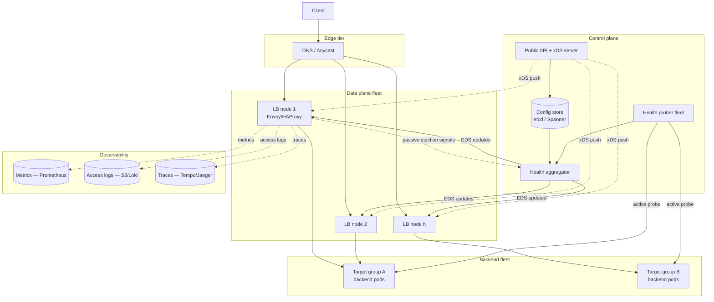

# Design a Load Balancer Service — L4/L7 Pipelines, Health Probing, and Consistent-Hash Affinity

**Date:** 2026-04-25 | **Updated:** 2026-04-25
**Tags:** `system-design` `case-study` `infrastructure` `networking` `medium`
**Difficulty:** Medium | **Type:** HLD | **Estimated read:** 30–35 min

## Table of Contents

- [Summary](#summary)
- [1. Functional Requirements](#1-functional-requirements)
- [2. Non-Functional Requirements](#2-non-functional-requirements)
- [3. Capacity Estimation](#3-capacity-estimation)
- [4. API Design](#4-api-design)
  - [Control plane shape](#control-plane-shape)
  - [Backend registration API](#backend-registration-api)
  - [Listener and policy API](#listener-and-policy-api)
  - [Health and observability API](#health-and-observability-api)
- [5. Data Model](#5-data-model)
  - [Listener and target group store](#listener-and-target-group-store)
  - [Target health table](#target-health-table)
- [6. High-Level Architecture](#6-high-level-architecture)
- [7. Deep Dives](#7-deep-dives)
  - [7.1 L4 vs L7 pipelines](#71-l4-vs-l7-pipelines)
  - [7.2 Health probing — active vs passive](#72-health-probing--active-vs-passive)
  - [7.3 Consistent hashing for session affinity](#73-consistent-hashing-for-session-affinity)
  - [7.4 Connection draining and autoscaling integration](#74-connection-draining-and-autoscaling-integration)
  - [7.5 TLS termination and SNI](#75-tls-termination-and-sni)
  - [7.6 Anycast vs DNS LB vs in-data-center LB](#76-anycast-vs-dns-lb-vs-in-data-center-lb)
  - [7.7 Observability — per-target latency and error rates](#77-observability--per-target-latency-and-error-rates)
  - [7.8 Data plane vs control plane](#78-data-plane-vs-control-plane)
- [8. Bottlenecks & Trade-offs](#8-bottlenecks--trade-offs)
- [9. Anti-Patterns](#9-anti-patterns)
- [Related](#related)
- [References](#references)

## Summary

A load balancer is the most-traveled component in a modern stack: every request to every service traverses one. The interesting design questions sit underneath the deceptively simple goal of "spread traffic across healthy backends." Should the data plane operate at **L4** (TCP/UDP, opaque payload) or **L7** (HTTP, header-aware)? How do you detect a half-dead backend without DDoSing your own fleet with health probes? When you deregister an instance during autoscale-in, how do you avoid breaking in-flight requests? When session affinity is required, how do you preserve it through scale events without rehashing the whole keyspace?

This case study designs a managed load balancer service modelled on AWS NLB/ALB and Envoy as the data plane, with Maglev-style consistent hashing for affinity. It covers the L4 connection-tracking pipeline, the L7 request-routing pipeline, layered health checks (active probes plus passive ejection), connection draining tied to autoscaler lifecycle hooks, TLS termination with SNI multi-tenancy, and the split between a horizontally-scalable data plane and a strongly-consistent control plane that pushes config via xDS.

## 1. Functional Requirements

The service must support:

- **L4 listeners.** Pure TCP/UDP forwarding for non-HTTP workloads (Postgres, Redis, gRPC long-lived streams, gaming UDP). Connection-level distribution; payload is opaque.
- **L7 listeners.** HTTP/1.1, HTTP/2, and HTTP/3 termination with header-aware routing — host-based, path-based, header-based, and weighted target groups for canary/blue-green.
- **Backend registration.** Programmatic CRUD on target groups (instances, IPs, container endpoints). New backends become eligible for traffic only after passing N consecutive health checks.
- **Health probing.** Configurable active probes (HTTP path, TCP connect, gRPC `Health.Check`) with tunable interval, timeout, healthy/unhealthy thresholds. Passive ejection on observed failure rates.
- **Connection draining.** Deregistering a backend stops new connection assignments immediately but keeps in-flight connections alive for a configurable drain window (default 30–300 s) before forced close.
- **Session affinity.** Source-IP hash, cookie-based affinity, and consistent-hash by header/query parameter (e.g. user ID). Affinity must survive backend add/remove with minimal reshuffle.
- **TLS termination.** Per-listener certificates, SNI-based multi-tenant cert selection, ALPN negotiation, optional mTLS for client auth, and end-to-end TLS (re-encrypt to backend) when required.
- **Autoscaling integration.** Surface load and health signals (active connections, requests per second, target utilization, healthy host count) to autoscalers; honor lifecycle hooks for graceful drain.
- **Observability.** Per-target latency histograms, per-status-code counters, connection counts, healthy/unhealthy host gauges, and request-level access logs with correlation IDs.

## 2. Non-Functional Requirements

| NFR | Target | Why |
|-----|--------|-----|
| Forwarding latency overhead | **p50 < 1 ms, p99 < 5 ms** for L7 | The LB sits in front of every request — every microsecond is amortized across the fleet |
| Throughput per data plane node | **10–100 Gbps**, 1M+ concurrent connections | Hardware-class scale; software LBs achieve this with kernel bypass / multi-queue NICs |
| Availability | **99.99%+** | Loss of the LB tier means 100% outage; usually run N+2 across AZs |
| Config propagation | < 5 s globally | Adding a backend or shifting weights must take effect quickly |
| Health detection time | < 10 s for hard failures | Faster than typical TCP keepalive; faster detection beats hands-off elegance |
| Connection draining window | 30–300 s configurable | Long enough for in-flight requests; short enough for autoscale responsiveness |
| Cert reload | Zero connection drops | Hot-reload TLS material without bouncing the listener |
| Operational blast radius | Per-listener isolation | A bad config on one listener must not take down others |

## 3. Capacity Estimation

**Traffic.** Tier-1 web service: **500k RPS** sustained, **2M RPS** peak, with 5M concurrent TCP connections (long-lived clients, mobile, websockets). Average response 8 KB, average request 2 KB → ~5 GB/s sustained data plane throughput.

**Concurrent connections.** With keepalive enabled on both client and backend sides, the LB tracks **5M client connections** plus **~500k backend connections** (pooled). Each connection entry is ~1 KB of state in the data plane → 5–6 GB of memory just for connection tracking on the data plane fleet.

**Health probe load.** Probing every backend every 5 s with 10k backends:

```text
10,000 backends × (1 probe / 5 s) × N data plane nodes
= 2,000 probes/s per data plane node — fine for one node
× 50 data plane nodes = 100,000 probes/s on the backend fleet — NOT fine
```

Naively probing from every data plane node DDoSes backends. Either centralize probing (control plane fans out a single canonical health view) or rate-limit per-backend probe budgets. AWS, Envoy, and Google Maglev all use the centralized model: a small probing fleet, results gossiped or pushed to data plane.

**Data plane sizing.** A modern Envoy node on a c6i.4xlarge handles ~50–80k RPS at p99 < 5 ms. To carry 2M RPS peak with N+2 redundancy across 3 AZs:

```text
Per-AZ requirement: 2M / 3 = ~670k RPS
Per-AZ nodes (at 60k RPS/node): 12 nodes
With N+2 headroom: 14 nodes per AZ × 3 AZs = 42 data plane nodes
```

**Control plane.** Stores listener/target-group config, target health, and pushes via xDS. A single regional control plane cluster (3 nodes) is enough — config is small (KB per listener, MB per region) and write rate is low (registrations and health changes only).

## 4. API Design

### Control plane shape

The hot path of a load balancer is the data plane forwarding requests — there is no "API" on the hot path beyond the wire protocol itself (TCP/HTTP). The API surface area is the **control plane**: registering backends, declaring listeners, setting policies, reading health.

Three interfaces:

1. **Public REST API** — operators and CI/CD use it (Terraform, kubectl).
2. **xDS gRPC** — data plane subscribes to config updates from the control plane (the [Envoy xDS protocol][envoy-xds]).
3. **Health stream** — control plane probers push health to data plane via a delta protocol; data plane pushes passive-ejection observations back.

### Backend registration API

```http
POST /v1/target-groups/{tg-id}/targets
{
  "targets": [
    {"address": "10.0.4.17", "port": 8080, "az": "us-east-1a", "weight": 100},
    {"address": "10.0.5.22", "port": 8080, "az": "us-east-1b", "weight": 100}
  ],
  "registration_mode": "wait_for_health"   // 'wait_for_health' | 'immediate'
}

DELETE /v1/target-groups/{tg-id}/targets/{target-id}?drain_seconds=120
```

`wait_for_health` is the default: a target only receives traffic after passing the configured healthy threshold (typically 2–5 consecutive passes). `immediate` is for migration scenarios where the operator has external proof of readiness.

Deregistration *immediately* removes the target from the connection-assignment pool but keeps the connection-tracking state alive for `drain_seconds`. AWS calls this **deregistration delay**, defaulting to 300 s ([AWS NLB target groups][aws-nlb-tg]).

### Listener and policy API

```http
POST /v1/listeners
{
  "name": "web-https",
  "protocol": "HTTPS",                            // TCP | UDP | HTTP | HTTPS
  "port": 443,
  "tls": {
    "certificates": [
      {"sni": "api.example.com", "arn": "acm:cert/..."},
      {"sni": "*.example.com",   "arn": "acm:cert/..."}
    ],
    "min_version": "TLSv1.2",
    "alpn": ["h2", "http/1.1"]
  },
  "rules": [
    {
      "match": {"host": "api.example.com", "path_prefix": "/v2/"},
      "action": {
        "forward": {
          "target_groups": [
            {"id": "tg-canary", "weight": 5},
            {"id": "tg-stable", "weight": 95}
          ],
          "session_affinity": {
            "type": "consistent_hash",
            "key": {"header": "x-user-id"},
            "ring_size": 65537
          }
        }
      }
    }
  ]
}
```

Listener policy covers everything a request encounters before hitting a backend: TLS, routing match, target-group fan-out with weights, and affinity. The shape mirrors the AWS ALB listener-rule model and Envoy's HTTP route configuration.

### Health and observability API

```http
GET /v1/target-groups/{tg-id}/health
→ {
    "targets": [
      {"id": "...", "state": "healthy",   "reason": "Health checks passed"},
      {"id": "...", "state": "unhealthy", "reason": "Connection refused", "since": "..."},
      {"id": "...", "state": "draining",  "deregister_at": "..."}
    ]
  }

GET /v1/listeners/{l-id}/metrics?window=5m
→ {
    "active_connections": 18234,
    "new_conn_per_sec": 2200,
    "request_count": 5_400_000,
    "p50_target_latency_ms": 8,
    "p99_target_latency_ms": 47,
    "5xx_count": 312,
    "tls_handshake_p99_ms": 22
  }
```

## 5. Data Model

### Listener and target group store

Authoritative config lives in a strongly-consistent store (etcd, Spanner, DynamoDB with global tables). Data plane caches via xDS subscriptions.

```sql
CREATE TABLE listeners (
  id           UUID PRIMARY KEY,
  name         TEXT NOT NULL,
  protocol     TEXT NOT NULL,           -- 'TCP' | 'UDP' | 'HTTP' | 'HTTPS'
  port         INTEGER NOT NULL,
  tls_config   JSONB,                   -- certs, SNI map, min version, ALPN
  rules        JSONB NOT NULL,          -- ordered match/action rules
  updated_at   TIMESTAMPTZ NOT NULL DEFAULT now()
);

CREATE TABLE target_groups (
  id                  UUID PRIMARY KEY,
  name                TEXT NOT NULL,
  protocol            TEXT NOT NULL,
  health_check        JSONB NOT NULL,   -- path, interval, timeout, thresholds
  load_balancing_algo TEXT NOT NULL,    -- 'round_robin' | 'least_request' | 'consistent_hash' | 'maglev'
  affinity            JSONB,            -- type + key spec
  drain_seconds       INTEGER DEFAULT 300
);

CREATE TABLE targets (
  id              UUID PRIMARY KEY,
  target_group_id UUID NOT NULL REFERENCES target_groups(id),
  address         INET NOT NULL,
  port            INTEGER NOT NULL,
  az              TEXT NOT NULL,
  weight          INTEGER NOT NULL DEFAULT 100,
  state           TEXT NOT NULL,        -- 'pending' | 'healthy' | 'unhealthy' | 'draining'
  registered_at   TIMESTAMPTZ NOT NULL DEFAULT now(),
  drain_until     TIMESTAMPTZ
);
CREATE INDEX ON targets (target_group_id, state);
```

### Target health table

Health is a high-write, low-durability concern — losing the last few seconds is fine. Store in an in-memory replicated KV store on the control plane (Redis cluster or etcd lease), with periodic snapshots to disk.

```text
health:{target_id} → {
  state:                 healthy | unhealthy | draining,
  consecutive_passes:    int,
  consecutive_failures:  int,
  last_probe_ms:         epoch,
  last_failure_reason:   string,
  passive_ejection_until: epoch | null
}
```

The data plane never reads this directly — the control plane pushes deltas via xDS Endpoint Discovery Service (EDS) updates whenever a target transitions between states.

## 6. High-Level Architecture



**Request flow (L7 HTTPS):**

1. Client resolves the LB DNS name; gets one or more anycast / regional VIPs.
2. TCP connection lands on a data plane node (selected by ECMP at the network layer).
3. Data plane terminates TLS, parses HTTP, evaluates listener rules, picks a target group.
4. Within the target group, the configured load-balancing algorithm picks a healthy target. Affinity, if any, applies first.
5. Data plane opens (or reuses from pool) a backend connection, forwards request, streams response back, and emits metrics + access log.

**Config flow:** Operator hits the public API → write goes to the strongly-consistent config store → control plane diff-computes xDS updates → data plane nodes receive deltas via streaming gRPC and apply them without dropping connections.

## 7. Deep Dives

### 7.1 L4 vs L7 pipelines

**L4 pipeline** operates on TCP segments / UDP datagrams. The LB picks a backend at connection time using a hash of the 5-tuple (`src_ip, src_port, dst_ip, dst_port, protocol`) and pins all subsequent packets to the same backend. After that, the LB is essentially a NAT engine — it doesn't parse the payload, doesn't see headers, and adds tens of microseconds of overhead.

```text
Client SYN → LB selects backend B via hash(5-tuple)
            LB rewrites dst_ip → B, forwards
            Connection state: {client_5tuple → B} stored in flow table
Client data → LB looks up flow table → forwards to B
B response  → LB looks up reverse flow → forwards to client
```

**Strengths:** ultra-low overhead (microseconds), supports any TCP/UDP protocol, no need to terminate TLS, scales to 100 Gbps+ with kernel bypass (DPDK, XDP).

**Weaknesses:** opaque to application semantics — cannot path-route, cannot retry on application errors, cannot rewrite headers. If a backend stops accepting new connections but still has a healthy TCP stack, L4 health checks may keep sending traffic.

**L7 pipeline** terminates TCP, parses HTTP (or gRPC, or any structured protocol), and makes routing decisions per request:

```text
Client TCP → LB terminates TCP, runs TLS handshake
HTTP request → LB parses headers, evaluates listener rules
              picks target group, picks target via algorithm
              opens (or reuses pooled) connection to backend
              forwards request, streams response
HTTP keepalive → next request from same client may hit a different backend
```

**Strengths:** path/host/header routing, weighted canary, retries on 5xx, request-level observability, header rewriting, WAF integration, response compression.

**Weaknesses:** higher per-request CPU (TLS termination is expensive — typically 60–80% of total LB CPU on TLS-heavy workloads), connection-level state (HTTP/2 streams, HTTP/3 QUIC connections), more attack surface (HTTP smuggling, request splitting).

**Choose L4 when:** you need raw throughput, your protocol isn't HTTP (Postgres, MySQL, custom binary), or you want true end-to-end TLS without termination at the edge. AWS NLB and Google Cloud Network Load Balancer are L4. Choose L7 when: you need path-based routing, canary, or any header-aware behavior. AWS ALB, Envoy, NGINX, HAProxy in HTTP mode are L7.

Many production setups run **both in series**: an L4 LB at the network edge for raw scale and DDoS absorption, fronting an L7 LB pool for application-aware routing. This is exactly the AWS Shield + NLB + ALB pattern.

### 7.2 Health probing — active vs passive

**Active probing** sends synthetic requests to each backend on a schedule. Configurable parameters:

```yaml
health_check:
  protocol: HTTP                # HTTP, HTTPS, TCP, gRPC
  path: /healthz                # for HTTP
  port: 8080
  interval_seconds: 5
  timeout_seconds: 2
  healthy_threshold: 2          # passes before marking healthy
  unhealthy_threshold: 3        # fails before marking unhealthy
  success_codes: "200-299"
  expected_grpc_status: SERVING
```

The classic trade-off is **frequency vs load**. Probing every 1 s catches failures fast but generates probe traffic equal to QPS-of-real-traffic on idle backends. Most teams settle on 5–10 s with a 2-of-3 unhealthy threshold, giving 15–30 s detection time.

**Centralize probing**, do not probe from every data plane node. Both Envoy and AWS run a small probing fleet whose results are pushed to the data plane via the EDS update stream. This avoids the 50-node × 10k-backend × 1-probe-per-5s = 100k probes/s explosion described in §3.

**Passive probing** ejects backends based on observed real-traffic failures — no synthetic load. Envoy calls this **outlier detection** ([Envoy outlier detection][envoy-outlier]):

```yaml
outlier_detection:
  consecutive_5xx: 5            # eject after 5 consecutive 5xx
  consecutive_gateway_failure: 3
  base_ejection_time: 30s       # time ejected before re-introduction
  max_ejection_percent: 50      # cap on simultaneously ejected hosts
  success_rate_minimum_hosts: 5
  success_rate_request_volume: 100
```

Passive ejection catches what active probes miss: a backend that returns 200 on `/healthz` but 500 on real endpoints, latency spikes, partial-region outages, and dependency failures (the backend's database is down but its health endpoint passes).

**Use both**, layered. Active probe gates *initial* registration and detects cold failures. Passive ejection handles in-flight degradation. The interesting design rule: **never let passive ejection eject more than ~50% of the fleet** — otherwise a correlated failure (bad deploy, DB partition) takes down everything and you've turned a partial outage into a total one. Envoy's `max_ejection_percent` exists for exactly this reason.

### 7.3 Consistent hashing for session affinity

Session affinity means: requests from the same logical session land on the same backend. Three implementations, in increasing sophistication:

**Source-IP hash (L4 standard).** `hash(client_ip) % N` picks the backend. Trivial, but two failure modes:

1. **Mod-N rehashing.** When a backend is added or removed, `% N` shifts every key. ~`(N-1)/N` of all sessions get reassigned even though only 1 backend changed. For a 100-backend fleet, removing one node reshuffles 99% of sessions.
2. **NAT collapse.** Many clients behind a single corporate NAT all hash to the same backend → uneven load.

**Consistent hashing (the ring).** Assign each backend M virtual nodes around a hash ring. Hash the session key, walk clockwise, take the first backend. Adding or removing one backend only affects keys in the arcs it owned. The reshuffle is `~1/N` instead of `~(N-1)/N`. See [`../../data-structures/consistent-hashing.md`](../../data-structures/consistent-hashing.md) for the underlying structure.

```text
Ring with backends A, B, C (3 virtual nodes each):
  Position 0x0FFF: A1
  Position 0x2A00: B1
  Position 0x3F00: C1
  Position 0x5400: A2
  ...

Session key 0x1500 → first node clockwise ≥ 0x1500 is B1 → backend B.

Adding backend D inserts D1, D2, D3 into the ring.
Only keys whose first-clockwise neighbor changed (the arcs D claims) move.
Other 75% of keys still hash to the same backend.
```

**Maglev hashing (Google's improvement).** Classic ring hashing has uneven load if M virtual nodes per backend is small, and uneven *reshuffle* on backend changes. Maglev (Google's network LB algorithm, [Maglev paper][maglev]) builds a fixed-size lookup table (typically 65537 entries — prime, slightly larger than max backend count) where each backend takes turns claiming open slots according to per-backend permutation sequences. Properties:

- **O(1) lookup** — direct table index.
- **Near-perfect load balance** — variance ≤ 1% with default table size.
- **Minimal disruption on backend change** — only ~`1/N` of slots reassigned.
- **Computable independently on every data plane node** — given the same backend list and seed, every node builds the same table without coordination.

Envoy and Google Cloud's L4 load balancer both implement Maglev. Use it for high-cardinality affinity (millions of users) where ring hashing's per-key drift would matter.

**Affinity key choice.** Source IP is the lowest common denominator. For HTTP, prefer:
- A header you control (`X-User-ID`) — most precise, but requires the client to send it.
- A cookie set by the LB on first response — automatic and survives client IP changes.
- A query parameter (`?session=...`) — useful for WebSocket upgrade where headers are constrained.

### 7.4 Connection draining and autoscaling integration

The autoscaler wants to remove an instance. The LB wants to keep in-flight requests alive. The reconciliation is **connection draining**:

```text
T=0   Operator (or autoscaler) calls DELETE /target/X with drain=120s
T=0   Control plane marks X as 'draining' in config store
T=0+δ xDS push: data plane nodes receive EDS update — X is no longer eligible
      for new connection assignment, but existing connections continue.
      For HTTP, the LB stops sending new requests on existing keepalive
      connections to X (sets `Connection: close` on responses).
T=120 Data plane forcibly closes any remaining connections to X.
T=120 Control plane signals autoscaler: "drain complete, safe to terminate."
T=120 Autoscaler terminates the instance.
```

The integration with autoscalers happens via **lifecycle hooks**:

- AWS Auto Scaling Group lifecycle hooks ([AWS lifecycle hooks][aws-asg-lifecycle]) pause termination in `Terminating:Wait` state until the LB signals drain completion.
- Kubernetes uses a `preStop` hook that exec's `sleep <drain>` plus a readiness probe flip to `false` so the kube-proxy / ingress stops sending traffic before SIGTERM hits the container.

**Drain window choice.** Too short → in-flight requests get killed (visible to users as 502/connection-reset). Too long → autoscale-in is sluggish, scaling oscillation gets worse. Sensible defaults:
- Stateless HTTP: 30–60 s.
- Long-running gRPC streams: 5–15 minutes (or use graceful close: data plane sends `GOAWAY`, lets streams finish).
- WebSocket: depends on application; typically 5 minutes with explicit server-side close + client-side reconnect.

**Autoscaling signals.** The LB exposes the metrics that the autoscaler consumes:

| Signal | Use |
|--------|-----|
| `RequestCountPerTarget` | Scale up when avg RPS per target exceeds threshold |
| `TargetConnectionCount` | Scale up when concurrent connections per target saturates |
| `TargetResponseTime` (p95) | Scale up on latency degradation, before utilization saturates |
| `HealthyHostCount` | Scale floor — never let healthy count drop below redundancy minimum |
| `UnHealthyHostCount` | Alert; suppress autoscale-in while ejected hosts still recovering |

AWS Application Auto Scaling and GCP autoscalers natively consume these from the LB metrics endpoint.

### 7.5 TLS termination and SNI

TLS termination at the LB centralizes certificate management, offloads CPU from backends, and unlocks L7 routing. Three modes:

| Mode | Where TLS terminates | Backend sees |
|------|----------------------|--------------|
| **Termination** | At the LB; backend speaks plaintext HTTP | Plaintext, plus optional `X-Forwarded-Proto: https` |
| **Passthrough (TCP)** | At the backend; LB is L4 only | TLS, the LB is invisible above transport |
| **Re-encrypt** | LB terminates client TLS, opens fresh TLS to backend | TLS, with the LB terminating the client side |

**SNI (Server Name Indication)** is how a single LB IP serves many domains. The client sends the target hostname in the TLS ClientHello unencrypted; the LB picks the right cert based on it ([RFC 6066 §3][rfc6066]).

```text
ClientHello {
  server_name: "api.example.com"          ← extension, plaintext
  cipher_suites: [...]
  alpn: ["h2", "http/1.1"]
}

LB cert table:
  api.example.com    → cert-1 (RSA 2048)
  app.example.com    → cert-2 (ECDSA P-256)
  *.example.com      → wildcard cert (fallback)
  default            → cert-3 (returned if no SNI match)
```

The LB matches `api.example.com` to `cert-1` and proceeds with the handshake. Without SNI, you'd need one IP per cert — a hard scaling limit.

**Encrypted ClientHello (ECH).** Modern TLS hides the SNI itself (RFC 9460 + draft-ietf-tls-esni). LBs that terminate TLS need to decrypt ECH — Cloudflare and Google support this for privacy-sensitive workloads.

**Cert rotation.** Hot-reload via SDS (Secret Discovery Service) in xDS — the data plane subscribes to cert material as a separate xDS resource and swaps in new certs without restarting listeners. Critical for ACME-style auto-renewal.

**ALPN.** Negotiates the application protocol within TLS. The LB advertises `["h2", "http/1.1"]` and the client picks. Required for HTTP/2 over TLS — you cannot speak HTTP/2 to clients without ALPN agreement.

**mTLS for client auth.** The LB requests a client cert during the handshake and validates it against a configured CA bundle. Useful for service-to-service auth in zero-trust networks; avoid for general public traffic (huge UX overhead).

### 7.6 Anycast vs DNS LB vs in-data-center LB

Three layers of "load balancing" sit at different scopes — they compose, they don't compete:

**Anycast (network layer).** Same IP advertised from multiple PoPs via BGP. The Internet's routing tables steer each client to the topologically nearest PoP. Used by Cloudflare, Google's frontend, AWS Global Accelerator. Strengths: zero-latency failover (BGP withdrawal reroutes in seconds), DDoS absorption (attack distributed across PoPs), no DNS TTL waiting. Weaknesses: requires owned IP space and BGP relationships; long-lived TCP connections can break if BGP reconverges mid-flight.

**DNS load balancing.** Resolver returns one of N IPs per query, optionally weighted (round-robin) or geography-aware (geo-DNS). Strengths: no infrastructure beyond DNS. Weaknesses: TTL caching means failover takes minutes-to-hours, browsers and OS resolvers cache aggressively, cannot split traffic at sub-domain granularity.

**In-data-center LB.** The classic LB tier inside a DC routes from a small set of VIPs to thousands of backend pods. Envoy, NGINX, HAProxy, AWS ALB live here. This is where 95% of the deep-dive material in this doc applies.

**The composition pattern:**

```text
Client
  ↓ DNS resolves api.example.com → anycast VIP 198.51.100.10
Anycast network → routes to nearest PoP (say, us-east-1 PoP)
  ↓ PoP-local L4 LB (NLB / GCLB)
  ↓ Regional L7 LB (ALB / Envoy edge fleet)
  ↓ In-cluster service mesh sidecar (Envoy as sidecar)
  ↓ Application backend
```

Each tier solves a different problem: anycast = global proximity + DDoS, DNS = top-level entry, regional L4 = raw throughput + per-region failover, regional L7 = path/host routing, mesh = per-service policy. Don't conflate them.

### 7.7 Observability — per-target latency and error rates

The LB sees every request and is the only place where you get a complete view of fleet health. Mandatory metrics:

**Per-target metrics.** Avoid the "average across the fleet" trap — one bad host hides in the average. Emit metrics tagged with target ID:

```text
lb_request_duration_seconds{listener,target_group,target,status_class} histogram
lb_request_total{listener,target_group,target,status} counter
lb_active_connections{listener,target} gauge
lb_target_connect_errors{target_group,target,reason} counter
lb_tls_handshake_duration_seconds{listener} histogram
lb_healthy_target_count{target_group} gauge
```

The cardinality cost matters — a 10k-backend fleet with 50 status codes × 10 listeners is 5M time series. Either keep a short retention on per-target metrics (24h) and roll up to per-target-group for long-term, or use a high-cardinality store like ClickHouse for raw events and Prometheus only for aggregates.

**Latency breakdown.** Distinguish:
- `request_duration` — total client-perceived time at the LB.
- `target_response_time` — time spent waiting for the backend after sending the request.
- `tls_handshake_time` — first-byte cost on new connections.
- `connect_time` — backend connection establishment when the pool misses.

When `request_duration` rises but `target_response_time` is flat, the problem is in the LB or its connection pool. When `target_response_time` rises, it's the backend.

**Access logs.** Sample real-time access logs at 100% during incidents and 1–10% steady-state. Each log line should carry: timestamp, listener, route, target, request-id, status, bytes, durations (broken down as above), client IP, user-agent, TLS cipher. Stream to S3 / Loki / BigQuery for ad-hoc queries.

**Distributed tracing.** Inject `traceparent` (W3C Trace Context) on ingress, forward through to backends. The LB span shows the routing decision, the chosen target, and the time slice attributable to LB processing.

**SLO dashboards.** The LB's metrics are usually the canonical source for service-level SLOs because they're measured closest to the customer. A typical web-service SLO dashboard:
- Availability: `1 - (5xx_count / request_count)` over rolling 30 days, target 99.95%.
- Latency: `p99(request_duration) < 500ms` over rolling 5 min, target 99% of windows.
- Saturation: `max(active_connections / connection_limit_per_node)`, alert at 80%.

### 7.8 Data plane vs control plane

The split is the single most important architectural decision. Different consistency requirements, different scaling axes, different failure modes:

| Aspect | Data plane | Control plane |
|--------|-----------|---------------|
| Job | Forward bytes / requests | Compute config, push it, observe health |
| Latency budget | µs–ms per request | Seconds for config change |
| Scale | Horizontal, per-traffic | Small fixed cluster (3–7 nodes) |
| Consistency | None across nodes | Strongly consistent (Raft / Paxos) |
| Failure mode | Node-level — drop one, others carry | Cluster-level — quorum loss stops new config |
| Examples | Envoy, HAProxy, NGINX, IPVS | Istio Pilot, Envoy ADS, AWS internal LB control plane |

The xDS protocol ([Envoy xDS][envoy-xds]) is the dominant interface between them. Five subordinate APIs:

- **LDS** (Listener Discovery) — what listeners exist
- **RDS** (Route Discovery) — HTTP routing rules per listener
- **CDS** (Cluster Discovery) — what backend clusters / target groups exist
- **EDS** (Endpoint Discovery) — what targets are in each cluster + their health
- **SDS** (Secret Discovery) — TLS certs and keys

The ADS (Aggregated Discovery Service) variant multiplexes all of them on one stream, ordered so the data plane never references a resource it hasn't received yet.

**Why the split matters operationally.** The data plane must keep forwarding even if the control plane is completely down. Envoy explicitly supports running with a stale config snapshot indefinitely — it caches the last-known good config and continues forwarding. A control plane outage degrades to "no new config can be pushed," not "traffic stops." Compare this to a monolithic LB where config and forwarding share state — if config breaks, forwarding breaks.

**Choose Envoy** for new builds: it's the de-facto data plane standard (CNCF graduated, used by Istio, Consul, AWS App Mesh, and as a reverse proxy at most large companies). **HAProxy** still wins on raw L4/L7 performance per core and operational simplicity for non-mesh use. **NGINX** has the broadest deployment base and excels at static-content + reverse-proxy combos but its config language and dynamic reconfiguration story lag behind Envoy's xDS.

## 8. Bottlenecks & Trade-offs

| Concern | Bottleneck | Trade-off |
|---------|-----------|-----------|
| **TLS CPU** | Handshakes dominate; ECDSA helps but RSA still common | Offload to dedicated TLS hardware or split TLS-only fleet from L7 fleet |
| **Connection state** | Per-connection memory limits node capacity | Aggressive idle-timeout, share state across nodes only when needed (sticky sessions via consistent hash, not shared state) |
| **Health probe load** | N probers × M backends explodes | Centralize probing in a small fleet; broadcast results via xDS |
| **Config propagation** | Pushing 10k-target updates to 50 nodes | Use delta xDS, batch changes, prefer state pushes over full re-syncs |
| **Hot keys / hot tenants** | One viral user saturates one backend under affinity | Cap per-backend share; for true celebrity keys, fall back to non-affinity routing for that key |
| **Anycast convergence** | BGP reconverge breaks mid-flight TCP | QUIC over Connection-ID survives this; for TCP, accept brief disruption on PoP failure |
| **Cross-AZ latency** | Forwarding to another AZ adds ms | Prefer same-AZ targets first, fall back cross-AZ on local exhaustion |
| **Drain time vs autoscale speed** | Long drain = slow scale-in | Per-target-group config; long drains for stateful, short for stateless |
| **Observability cardinality** | Per-target metrics × N labels = millions of series | Tier metrics: high-cardinality short-retention, low-cardinality long-retention |

A useful framing: **the LB enforces consistency you don't have at the application layer.** Affinity, draining, and TLS rotation all exist because applications can't be relied on to coordinate themselves. Every feature added to the LB is a feature you don't need to build N times, once per service.

## 9. Anti-Patterns

- **Health checking only on `/healthz`.** A `200 OK` from a status endpoint says nothing about whether the database is reachable or the JVM is GC-thrashing. Use deep health checks that exercise dependencies, gated behind a separate probe path.
- **Probing from every data plane node.** N×M probes/s scales worse than the traffic itself. Centralize probing.
- **Source-IP hash for session affinity in 2026.** NAT collapse (mobile carriers, corporate proxies) makes this lopsided. Prefer header / cookie / consistent-hash on user ID.
- **Skipping connection draining on autoscale-in.** Manifests as 5xx spikes during scale-down events. Always wire drain into autoscaler lifecycle hooks.
- **Single TLS cert per LB.** Forces one IP per domain. Use SNI multi-cert and rotate via SDS.
- **Modulo-N hash with backend churn.** Reshuffles 99% of sessions on a 1-backend change. Use consistent hashing or Maglev.
- **Per-request backend selection ignoring affinity.** Random or pure round-robin under affinity-required workloads breaks login sessions, cart state, websocket upgrades. Affinity must apply *before* the algorithm.
- **No `max_ejection_percent`.** Outlier detection ejecting 100% of the fleet on a correlated dependency failure turns a partial outage into a total outage.
- **L7 LB without timeouts.** A slow backend can hold LB worker slots indefinitely. Set per-route `request_timeout` and per-target `connect_timeout`.
- **Conflating control plane and data plane consistency.** The data plane must keep working when the control plane is down; never make forwarding conditional on a config-store quorum.
- **Returning 503 for both "no healthy targets" and "rate limited"** with no differentiation. Use distinct status codes (503 vs 429) and `Retry-After` headers so clients can react correctly.
- **Putting WAF rules in the same listener as your hot path without sampling.** WAF inspection adds milliseconds; for non-attacker traffic, sample at 1–10%.

## Related

- **Building blocks:** [`../../building-blocks/load-balancers.md`](../../building-blocks/load-balancers.md) — algorithms (round-robin, least-conn, EWMA, p2c), forwarding modes (DSR, NAT, tunnel), and per-protocol pipeline details.
- **Scalability foundations:** [`../../scalability/horizontal-vs-vertical-scaling.md`](../../scalability/horizontal-vs-vertical-scaling.md) — when adding LB capacity is the right answer vs when you need bigger backends.
- **Affinity primitives:** [`../../data-structures/consistent-hashing.md`](../../data-structures/consistent-hashing.md) — ring construction, virtual nodes, Maglev table-build algorithm, key drift bounds.
- **Adjacent case study:** [`./design-api-gateway.md`](./design-api-gateway.md) — gateways layer authn, rate limiting, and per-route policy on top of the same data plane primitives.

## References

- [Envoy — Architecture overview (data plane / control plane separation)][envoy-arch]
- [Envoy — xDS API protocol overview][envoy-xds]
- [Envoy — Outlier detection (passive ejection)][envoy-outlier]
- [AWS — Application Load Balancer target groups and health checks][aws-alb-tg]
- [AWS — Network Load Balancer target group attributes (deregistration delay)][aws-nlb-tg]
- [AWS — Auto Scaling lifecycle hooks for graceful drain][aws-asg-lifecycle]
- [Maglev — A Fast and Reliable Software Network Load Balancer (Google, NSDI '16)][maglev]
- [RFC 6066 — Server Name Indication (SNI)][rfc6066]
- [Cloudflare — How we built Magic Transit (anycast + L4 LB)](https://blog.cloudflare.com/magic-transit/)
- [HAProxy — Connection management and queueing](https://www.haproxy.com/documentation/haproxy-configuration-tutorials/load-balancing/)

[envoy-arch]: https://www.envoyproxy.io/docs/envoy/latest/intro/arch_overview/intro/intro
[envoy-xds]: https://www.envoyproxy.io/docs/envoy/latest/api-docs/xds_protocol
[envoy-outlier]: https://www.envoyproxy.io/docs/envoy/latest/intro/arch_overview/upstream/outlier
[aws-alb-tg]: https://docs.aws.amazon.com/elasticloadbalancing/latest/application/load-balancer-target-groups.html
[aws-nlb-tg]: https://docs.aws.amazon.com/elasticloadbalancing/latest/network/target-group-health-checks.html
[aws-asg-lifecycle]: https://docs.aws.amazon.com/autoscaling/ec2/userguide/lifecycle-hooks.html
[maglev]: https://research.google/pubs/maglev-a-fast-and-reliable-software-network-load-balancer/
[rfc6066]: https://datatracker.ietf.org/doc/html/rfc6066#section-3
