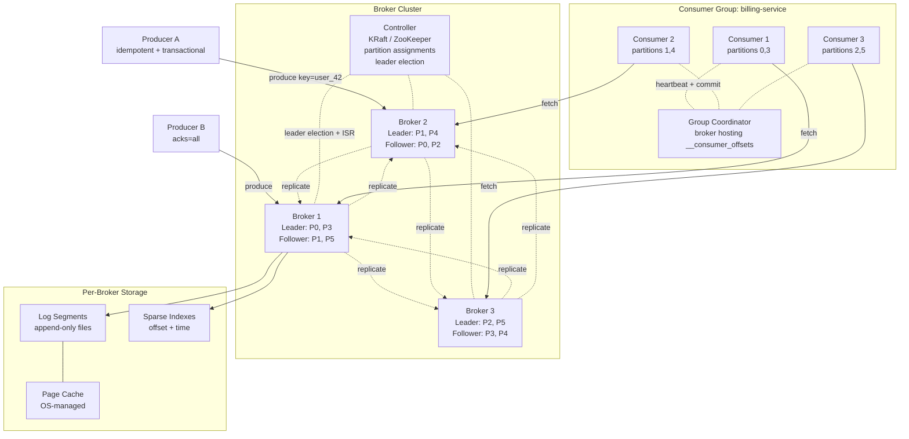

# Design a Message Queue Service — Partitioned Logs, Replicated Brokers, and Exactly-Once Semantics

**Date:** 2026-04-25 | **Updated:** 2026-04-25
**Tags:** `system-design` `case-study` `infrastructure` `messaging` `hard`

## Table of Contents

- [Summary](#summary)
- [Functional Requirements](#functional-requirements)
- [Non-Functional Requirements](#non-functional-requirements)
- [Capacity Estimation](#capacity-estimation)
- [API Design](#api-design)
- [Data Model](#data-model)
- [High-Level Design](#high-level-design)
- [Deep Dives](#deep-dives)
  - [1. Log vs Queue Semantics — Kafka, RabbitMQ, SQS](#1-log-vs-queue-semantics--kafka-rabbitmq-sqs)
  - [2. Partitioning — Throughput, Ordering, Keying](#2-partitioning--throughput-ordering-keying)
  - [3. Replication, ISR, and the `acks` Knob](#3-replication-isr-and-the-acks-knob)
  - [4. Consumer Groups and Offset Tracking](#4-consumer-groups-and-offset-tracking)
  - [5. Delivery Semantics — At-Most, At-Least, Exactly-Once](#5-delivery-semantics--at-most-at-least-exactly-once)
  - [6. Exactly-Once via Idempotent Producer + Transactions](#6-exactly-once-via-idempotent-producer--transactions)
  - [7. DLQ, Retries, and Poison Messages](#7-dlq-retries-and-poison-messages)
  - [8. Backpressure and Flow Control](#8-backpressure-and-flow-control)
  - [9. Retention — Time, Size, Compaction](#9-retention--time-size-compaction)
  - [10. Controller / Coordinator and Rebalancing](#10-controller--coordinator-and-rebalancing)
  - [11. Follower Fetch and Replica Catch-Up](#11-follower-fetch-and-replica-catch-up)
- [Bottlenecks & Trade-offs](#bottlenecks--trade-offs)
- [Anti-Patterns](#anti-patterns)
- [Related](#related)
- [References](#references)

## Summary

A message queue service is the connective tissue of every non-trivial distributed system. Producers write events; consumers read them; the broker is the durable middle-tier that decouples them in time, throughput, and failure domain. The interview question "design a message queue" is a stress test of distributed-systems fluency because every choice — log vs queue, push vs pull, partition vs FIFO, replication ack policy, exactly-once delivery — has a sharp trade-off and a well-documented production system on each side.

The reference design here is a **partitioned, replicated log** in the Kafka tradition, with explicit awareness of the alternatives (RabbitMQ's per-queue semantics, SQS's hosted simplicity, Pulsar's tiered storage). The core architecture is uncompromising:

1. **A topic is a partitioned, append-only log.** Messages within a partition are strictly ordered by offset; messages across partitions are not.
2. **Brokers replicate partitions.** Every partition has a leader and N-1 followers. Writes go to the leader; followers fetch and apply. The set of in-sync followers is the **ISR**.
3. **Consumers pull, and they own their offsets.** The broker stores no per-message ack state. Consumer groups divide partitions among members; each member commits its own progress.
4. **Delivery semantics are explicit.** At-most-once, at-least-once, and exactly-once are different system configurations, not different runtime modes.
5. **Retention is decoupled from delivery.** A consumer reading a message doesn't delete it. The log retains data for a time/size window or until log compaction collapses it.

This design accepts that **some applications need queue semantics, not log semantics**, and the answer for those is a different system (RabbitMQ, SQS) — not a hack on top of the log. We'll cover both worlds and be explicit about which problems each solves.

## Functional Requirements

| Requirement | Notes |
|---|---|
| **`produce(topic, key, value, headers)`** | Append a message to a topic. Producer chooses partition via key hash or round-robin. |
| **`fetch(topic, partition, offset, max_bytes)`** | Read a batch of messages starting at `offset` from a partition. Pull-based; broker is stateless about who is reading. |
| **`commit(group_id, topic, partition, offset)`** | Persist consumer-group progress so a restart resumes from `offset`. |
| **Subscribe (consumer group)** | A group joins a topic; coordinator assigns partitions among members. |
| **DLQ routing** | Messages that fail processing N times route to a dead-letter topic for inspection or replay. |
| **Topic admin** | Create / delete / describe topics; alter partition count (one-way: increasing only); set retention. |
| **Log compaction** | For "table-like" topics, retain only the latest value per key (e.g., user-profile updates). |
| **Transactions (atomic produce+commit)** | Producer can write to multiple partitions and commit consumer offsets atomically — required for exactly-once stream processing. |

Out of scope (different systems):

- Per-message routing rules across exchanges (RabbitMQ territory).
- Per-message visibility timeout and individual ack/nack (SQS territory).
- SQL-like query over message history (use a stream-processing layer or a table store).
- Cross-cluster strong consistency (we offer mirroring, but not synchronous geo-replication).

## Non-Functional Requirements

| NFR | Target |
|---|---|
| **Durability** | Acked messages survive `f` simultaneous broker failures, where `f = replication_factor - min_in_sync_replicas` |
| **Availability** | 99.95%+ for produce and fetch; partition-level failover < 30s |
| **Partition tolerance** | Mandatory — controller leases survive minority broker loss |
| **Produce latency p99** | < 10 ms with `acks=1`; < 50 ms with `acks=all` and `min.insync.replicas=2` |
| **End-to-end latency p99** | < 100 ms producer→consumer for hot partitions |
| **Throughput** | 1M+ msg/sec/cluster; per-broker 100K+ msg/sec sustained on commodity SSDs |
| **Ordering** | Strict FIFO within a partition; no global ordering across partitions |
| **Retention** | Configurable per topic: time-based (e.g., 7 days) or size-based (e.g., 1 TB), or compacted |
| **Horizontal scalability** | Linear with broker count; topics scale by adding partitions |

The framing line: **the broker is a dumb log, the producer and consumer are smart**. The broker does not track per-message state, does not push, does not retry on the consumer's behalf, and does not know what "processed" means. Every protocol decision pushes work to the edges. That is what makes Kafka clusters scale to millions of partitions and trillions of messages per day.

## Capacity Estimation

### Cluster baseline

- **Cluster size:** 30 brokers
- **Per-broker capacity:** 16 TB usable disk (NVMe), 128 GB RAM, 25 Gb NIC
- **Replication factor:** 3
- **`min.insync.replicas`:** 2 (write succeeds with 2 of 3 replicas)
- **Total raw storage:** 30 × 16 TB = 480 TB; with RF=3, **~160 TB usable**
- **Topics × partitions:** ~1,000 topics × average 32 partitions = 32,000 partitions; with RF=3, ~96,000 partition replicas spread across 30 brokers (~3,200 per broker)

### Throughput

- **Per-broker ingress:** ~200 MB/s sustained (NIC and disk both capable; commit-log batched I/O is the win)
- **Per-broker egress:** ~600 MB/s (each message is read by ~3 consumers on average + replicated to 2 followers)
- **Cluster aggregate:** ~6 GB/s ingress, ~18 GB/s egress
- **Per-partition cap:** ~50 MB/s practical ceiling for a single-leader partition; if you need more, add partitions

### Object sizes

| Item | Size |
|---|---|
| Average message | 1 KB (headers + key + value) |
| Batch overhead | ~30 bytes per batch + per-message varint encoding |
| Log segment (default) | 1 GB |
| Index entry | 8 bytes (offset → file position) |
| Producer transaction record | ~50 bytes |
| Consumer offset record (in `__consumer_offsets`) | ~50 bytes |

### Retention math

- **7-day retention at 200 MB/s ingress per broker:** 200 MB/s × 86400 s × 7 = ~120 TB / broker, post-replication. Adjust retention or add brokers if disk fills.
- **Compacted topic for 100M user profiles, 4 KB each:** ~400 GB; compaction runs continuously, holds steady around that size regardless of write rate.

### Rebalancing cost

- **Adding a broker:** Kafka does not auto-rebalance. Operator runs `kafka-reassign-partitions` to move replicas; throttle to ~50 MB/s/replica per network link to avoid hurting live traffic.
- **Broker failure:** If broker B holds 3,200 partition replicas and dies, controller elects a new leader (from the ISR) for each one. Election is fast (low ms each); full re-replication of the lost data onto a replacement broker is the slow part — a 16 TB broker at 200 MB/s sustained takes ~22 hours.

These numbers shape every other decision: segment size (1 GB balances IO sequentiality vs file count), index granularity (sparse, every 4 KB), zero-copy `sendfile` use, and the cap on partitions per broker (~4,000 is a soft Kafka limit before metadata overhead bites).

## API Design

### Produce

```http
POST /v1/topics/{topic}/produce
Content-Type: application/vnd.kafka.binary.v2+json
X-Producer-Id: pid_42
X-Producer-Epoch: 7
X-Acks: all                          # 0 | 1 | all
X-Idempotent: true
X-Transactional-Id: orders-tx-1      # optional, enables exactly-once

{
  "records": [
    {"key": "user_42", "value": "<bytes>", "headers": {"trace-id": "..."}, "timestamp": 1745577062812},
    {"key": "user_42", "value": "<bytes>", "timestamp": 1745577062815}
  ]
}

200 OK
{
  "topic": "orders",
  "appended": [
    {"partition": 5, "offset": 100482, "timestamp": 1745577062812},
    {"partition": 5, "offset": 100483, "timestamp": 1745577062815}
  ],
  "leader_broker": "broker-12"
}
```

### Fetch

```http
POST /v1/fetch
{
  "group_id": "billing-service",
  "max_bytes": 1048576,
  "max_wait_ms": 500,
  "subscriptions": [
    {"topic": "orders", "partition": 5, "offset": 100482},
    {"topic": "orders", "partition": 6, "offset": 87231}
  ]
}

200 OK
{
  "batches": [
    {
      "topic": "orders",
      "partition": 5,
      "high_watermark": 100500,
      "records": [
        {"offset": 100482, "key": "user_42", "value": "<bytes>", "timestamp": 1745577062812},
        {"offset": 100483, "key": "user_42", "value": "<bytes>", "timestamp": 1745577062815}
      ]
    }
  ]
}
```

### Commit offsets

```http
POST /v1/groups/{group_id}/commit
{
  "offsets": [
    {"topic": "orders", "partition": 5, "offset": 100484, "metadata": "host=worker-7"},
    {"topic": "orders", "partition": 6, "offset": 87233}
  ]
}

200 OK
```

Three design points worth calling out:

- **`X-Acks` is the durability dial.** `acks=0` is fire-and-forget (no ack), `acks=1` waits for leader fsync (or page-cache write), `acks=all` waits for all in-sync replicas. This is the single most important per-producer setting and we deep-dive it below.
- **The fetch is pull-based and the consumer carries its own offset.** The broker does not remember "where billing-service was." If the consumer crashes mid-batch and restarts, it sends the last committed offset and resumes — at-least-once by construction.
- **Transactional produces use a `transactional.id`.** This binds a logical producer across restarts, enabling fencing of zombie writers and atomic multi-partition commits. Non-transactional idempotent produce is a strict subset.

## Data Model

A topic is a sequence of named partitions. A partition is a sequence of log segments. A segment is an immutable file with a sparse index.

```text
Topic: orders
├─ Partition 0
│   ├─ 00000000000000000000.log        # records 0–99999, 1 GB
│   ├─ 00000000000000000000.index      # offset → byte position (sparse, every 4 KB)
│   ├─ 00000000000000000000.timeindex  # timestamp → offset (for time-based seek)
│   ├─ 00000000000000100000.log        # active segment
│   └─ 00000000000000100000.index
├─ Partition 1
│   └─ ...
...
└─ Partition 31
```

### Record

```text
Record:
  offset:        int64         // assigned by leader at append, monotonically increasing
  timestamp:     int64         // producer-supplied or broker-set (LogAppendTime)
  key:           bytes         // optional; nil = round-robin partitioning
  value:         bytes         // payload (may be nil for tombstone in compacted topics)
  headers:       map<string, bytes>
  producer_id:   int64         // for idempotent dedup
  producer_epoch: int16
  sequence:      int32         // per-partition producer sequence number
```

### Partition assignment

```text
if record.key == nil:
  partition = round_robin_or_sticky(producer_state)
else:
  partition = murmur2(record.key) mod num_partitions
```

The keying choice is load-bearing. **Same key → same partition → strict ordering preserved.** Change `num_partitions` and the mapping changes — orderings established under the old partition count are broken for the affected keys. That is why partition count is one-way (increase only), and even increasing it is a careful operation.

## High-Level Design



### Write path

1. Producer batches records by destination partition (key-hash or round-robin), waiting up to `linger.ms` to fill a batch.
2. Producer sends the batch to the partition's **leader broker**. The leader is discovered via metadata fetch; producers refresh metadata on `NOT_LEADER` errors.
3. Leader appends the batch to the active log segment (page cache write; fsync depends on broker config), assigns offsets, and updates the high watermark candidate.
4. Followers issue **fetch requests** to the leader, pulling new records. As followers persist, they advance their own log-end offsets and the leader updates its view of the ISR.
5. Once enough replicas (per `acks`) have appended, the leader advances the **high watermark** (HW) and acks the producer. Records below the HW are visible to consumers; records above the HW are "uncommitted" and could still be lost on leader failure.

### Read path

1. Consumer (or all consumers in a group) sends `fetch(topic, partition, offset)` to the partition leader.
2. Leader serves bytes from the log segments at-or-after `offset`, using the sparse index to jump to the right file position, then `sendfile()` zero-copy out to the socket.
3. Leader returns up to `max_bytes` and never returns records above the HW (so consumers can't read uncommitted data).
4. Consumer processes the batch, then **commits** the next offset to the group coordinator. Commits are themselves writes to the special `__consumer_offsets` topic.

## Deep Dives

### 1. Log vs Queue Semantics — Kafka, RabbitMQ, SQS

A "message queue" is a category, not a single thing. The first design decision is which semantic you want:

| Property | Kafka (log) | RabbitMQ (queue) | SQS (hosted queue) |
|---|---|---|---|
| Storage | Append-only log; message stays after read | Per-queue; message removed on ack | Per-queue; message removed on delete |
| Ordering | Strict per partition | Strict per queue (with single consumer) | Best-effort (Standard) or strict per group (FIFO) |
| Multi-consumer | Same message read by N independent consumer groups | One consumer per message (unless fanout exchange + multiple queues) | One consumer per message |
| Replay | Yes — seek to any offset within retention | No — once acked, gone | No |
| Scale per topic | Horizontal via partitions | Vertical mostly; sharded queues require app logic | Hosted; auto-scales but with per-API rate limits |
| Routing | Producer chooses partition | Exchange + routing key + bindings | Send to queue ARN; SNS for fanout |
| Delivery | Pull, consumer-tracked offset | Push, broker-tracked ack with prefetch | Pull, per-message visibility timeout |
| Per-message ack | No (offset commit covers a range) | Yes (basic.ack / basic.nack) | Yes (DeleteMessage) |
| DLQ | Application-level routing to a dead-letter topic | First-class via dead-letter-exchange policy | First-class via redrive policy |
| Use case | Streams, event sourcing, multi-consumer fanout, replay | Task queues with complex routing, RPC, work distribution | Simple decoupling on AWS, no infra |

**The honest framing:**

- **Log semantics (Kafka, Pulsar)** treat the topic as an append-only commit log of *facts*. Consumers are observers; the log is the source of truth. Multiple independent services can read the same stream, replay history, and rebuild state from scratch. Retention is a window, not until-acked.
- **Queue semantics (RabbitMQ, SQS, ActiveMQ)** treat each message as a *task*: a producer hands off work, exactly one consumer should claim it, and once it's done, the message is gone. The broker tracks per-message state (delivered, in-flight, acked, dead-lettered). Routing rules can be complex.

You can simulate one with the other, badly. Kafka can act as a task queue if you keep retention short and use one consumer group, but you lose per-message ack/nack and visibility timeout. RabbitMQ can stream events with fanout exchanges + persistent queues, but you cannot replay history or independently consume the same message at three different speeds.

The deep-dive below assumes a Kafka-style log (the harder case). We'll call out where queue semantics diverge.

### 2. Partitioning — Throughput, Ordering, Keying

A partition is the fundamental unit of parallelism. Three load-bearing properties:

1. **A partition is owned by exactly one leader at a time.** All writes and reads (for that partition) go through that leader. There is no leaderless write path.
2. **Order is preserved within a partition, never across partitions.** Records appended to partition 5 are read in append order. Records on partition 5 vs partition 6 have no defined ordering.
3. **A consumer in a group owns full partitions, not individual messages.** If you have 32 partitions and 8 consumers, each gets 4 partitions. With 64 consumers, 32 of them get one partition and 32 sit idle — partitions cap your consumer-side parallelism.

**Choosing a key:** the key determines partition placement. Same key → same partition → ordered. Choose the key to match your ordering requirement:

- For order-event streams where per-order ordering matters: `key = order_id`. All events for one order land in one partition.
- For per-user activity streams: `key = user_id`.
- For uniform load with no ordering need: `key = nil` → round-robin (or sticky-batch) across partitions.

**Hot partitions are real.** If 1% of users produce 50% of traffic, hashing by `user_id` gives you a hot partition — a single broker shouldering the load while peers are idle. Mitigations:

- **Salt the key:** `key = user_id + ":" + (random_in_range(K))` for K sub-partitions. You shard the hot user across K partitions but lose strict ordering for them. Often acceptable.
- **Two-tier keying:** route hot keys to a separate high-throughput topic.
- **Application-level sharding:** detect heavy producers and rate-limit at the producer.

**Increasing partition count is one-way and dangerous.** Kafka allows adding partitions to a topic, but the new partitions don't redistribute existing data, and the hash mapping for *future* records changes — meaning a key that used to land on partition 3 may now land on partition 7. Strict ordering for that key is broken across the boundary. Best practice: pick a partition count well above your projected throughput at topic creation; shrinking is not supported at all.

See [message queues and brokers](../../building-blocks/message-queues-and-brokers.md) for the architectural framing.

### 3. Replication, ISR, and the `acks` Knob

Replication is what makes the log durable. Each partition has `N` replicas (typically 3). One is the **leader**; the rest are **followers**. Followers do not serve reads or writes — they fetch from the leader and apply the same byte-for-byte log.

The **In-Sync Replica set (ISR)** is the dynamic subset of followers that are caught up "enough" to count as live. A follower stays in the ISR if:

- It has fetched within `replica.lag.time.max.ms` (default 30s).
- It has not fallen too far behind in offset terms.

If a follower stalls (slow disk, network blip), the leader removes it from the ISR. When it catches back up, the controller adds it back.

**The `acks` knob on the producer:**

| `acks` | Behaviour | Durability | Latency |
|---|---|---|---|
| `0` | Producer fires and forgets; no ack | None — message can be lost without notice | Lowest |
| `1` | Leader writes to its log (page cache), then acks | Survives consumer failure but not leader failure before replication | Medium |
| `all` (a.k.a. `-1`) | Leader writes, waits for all in-sync replicas to fetch, then acks | Survives `min.insync.replicas - 1` simultaneous broker failures | Highest |

**`min.insync.replicas` is the partner setting.** It is a *broker/topic* config, not a producer config. With `acks=all` and `min.insync.replicas=2`:

- A produce succeeds only if at least 2 replicas (leader + 1 follower) are in the ISR and acked.
- If only the leader is in the ISR (other followers fell behind or died), produces with `acks=all` fail with `NOT_ENOUGH_REPLICAS`. **This is a feature.** The cluster is telling you "I cannot give you the durability you asked for; I refuse to silently downgrade."

**Unclean leader election:** if every replica in the ISR dies, who becomes the new leader? Two options:

- **Clean only (default since Kafka 0.11):** wait for a former ISR member to come back. Partition is unavailable in the meantime. No data loss.
- **Unclean enabled:** elect any replica, including one that was out of the ISR. Partition is available again, but messages between the last ISR-known offset and the new leader's offset are lost.

The default is correct for most workloads. Enabling unclean leader election trades durability for availability and should be a deliberate, per-topic decision.

See [replication strategies](../../data-consistency/replication-strategies.md) for the broader replication landscape.

### 4. Consumer Groups and Offset Tracking

A consumer group is a set of consumers that **collectively** consume a topic. The group coordinator (a designated broker) assigns partitions among members. Each partition is read by **exactly one member** of the group.

```text
Topic "orders" has 12 partitions.
Group "billing-service" has 4 consumers.
Coordinator assigns: c1 → [0,1,2], c2 → [3,4,5], c3 → [6,7,8], c4 → [9,10,11]
```

If c2 dies, the coordinator detects it (heartbeat timeout), triggers a **rebalance**, and reassigns its partitions to the survivors:

```text
After rebalance: c1 → [0,1,2,3], c3 → [4,5,6,7,8], c4 → [9,10,11]
```

Multiple groups consume independently. Group `billing-service` and group `analytics-pipeline` both read all 12 partitions of `orders`, each tracking its own offsets — that is the multi-consumer property log semantics gives you.

**Offset commit:**

The consumer's offset is "the offset of the next record I want to read" — i.e., one past the last successfully processed record. It is stored in the special `__consumer_offsets` topic, keyed by `(group_id, topic, partition)`.

Two commit modes:

- **Auto-commit** (`enable.auto.commit=true`): consumer commits the current position every `auto.commit.interval.ms`. **Beware:** if your processing is slower than the commit interval, you commit offsets for messages you haven't actually processed yet. On restart, you skip them. This is a classic source of data loss masquerading as at-least-once.
- **Manual commit** (`commitSync` / `commitAsync`): consumer commits explicitly *after* processing. Preferred for any non-trivial workload. Synchronous commits are slow but safe; async commits are fast but you must handle retries on the rare commit failure.

**Offset semantics define your delivery contract:**

- Commit *before* processing → **at-most-once** (skip on crash).
- Commit *after* processing → **at-least-once** (reprocess on crash).
- Commit *atomically with* the side effect → **exactly-once** (requires transactions, see below).

See [idempotency and exactly-once](../../communication/idempotency-and-exactly-once.md) for why "exactly-once" is precisely "at-least-once + idempotent processing."

### 5. Delivery Semantics — At-Most, At-Least, Exactly-Once

Three contracts, each a different system configuration:

**At-most-once:** every message is delivered zero or one time. Simple, fast, lossy.

```text
1. Consumer fetches message.
2. Consumer commits offset.
3. Consumer processes message.
4. If consumer crashes between 2 and 3, message is lost.
```

Use case: best-effort logs, ephemeral metrics, traces where loss is tolerable.

**At-least-once:** every message is delivered one or more times. The default in Kafka, RabbitMQ, and SQS.

```text
1. Consumer fetches message.
2. Consumer processes message.
3. Consumer commits offset (or acks).
4. If consumer crashes between 2 and 3, the next consumer reads the message again.
```

Use case: anything you can't afford to lose. Pair with **idempotent processing** on the consumer side: process a message such that processing it twice has the same effect as processing it once. Mechanisms include unique-key constraints in the database, idempotency keys in downstream API calls, and dedup tables.

**Exactly-once:** every message is delivered and processed exactly once, observably.

This phrase is famous for being almost a lie. The honest version: **you cannot have exactly-once at the network/delivery layer**, because the consumer ack and the side effect are two separate operations and one can succeed without the other. What you *can* have is exactly-once **end-to-end semantics** when you wrap delivery + side-effect in a transaction that the system can atomically commit or roll back.

Two ways to achieve it:

1. **Idempotent consumer** (works for any broker): the side effect itself is keyed and dedup-safe. Replay the same message and the system converges to the same state.
2. **Transactional produce + consume** (Kafka-specific): the consumer's offset commit and the producer's downstream writes are part of one Kafka transaction. Either both happen or neither.

The Confluent Engineering blog "Exactly-once Semantics Are Possible" (Jay Kreps, 2017) makes the precise statement: it's exactly-once *processing* in a closed Kafka-to-Kafka system, not exactly-once *delivery* in the universal sense. For Kafka-to-external-DB, you still need idempotency or two-phase commit.

### 6. Exactly-Once via Idempotent Producer + Transactions

Kafka's exactly-once feature is built from two primitives:

**Idempotent producer:**

The producer is assigned a `producer_id` (PID) by the broker on first connect, and an `epoch`. Every record carries `(PID, epoch, sequence_number)` per partition. The broker dedups: if a record with the same `(PID, sequence)` is received twice (e.g., producer retried after a network blip), the broker discards the duplicate and acks. This makes producer retries safe — you no longer have to choose between "retry and risk duplicates" or "don't retry and risk loss."

Idempotent produce alone gets you:

- No duplicates from producer-side retries on the *same partition*.
- No reordering due to retries (sequences must be monotonic).
- A single producer's writes are exactly-once-on-the-broker, per partition.

It does not get you atomic multi-partition or multi-topic writes.

**Transactions:**

Transactions extend idempotent produce to atomically write to multiple partitions and topics, and to atomically commit consumer offsets alongside.

```text
producer.initTransactions()
producer.beginTransaction()
  producer.send(topic="orders-processed", record1)        # to partition X
  producer.send(topic="audit-log", record2)               # to partition Y
  producer.sendOffsetsToTransaction(consumer_offsets, group_id)  # commit input offsets
producer.commitTransaction()
```

Either every send and the offset commit are visible, or none are. The implementation:

- A **transaction coordinator** (a designated broker) tracks the transaction state in the internal `__transaction_state` topic.
- Each partition write carries the transactional ID; consumers reading with `isolation.level=read_committed` filter out records belonging to in-progress or aborted transactions (via control records in the log).
- The `transactional.id` is durable across producer restarts, enabling **fencing**: a restarted producer with the same `transactional.id` gets a higher epoch, and any zombie writer with the older epoch is rejected.

This is the Kafka Streams "read-process-write" loop with exactly-once semantics: read input, derive output, write output and update input offsets atomically. Side effects to external systems still need idempotency.

The Confluent blog post "Transactions in Apache Kafka" (Apurva Mehta and Jason Gustafson) is the canonical explainer for the protocol.

### 7. DLQ, Retries, and Poison Messages

A **poison message** is one your consumer cannot process — bad schema, missing referenced data, downstream API permanently failing for that input. If you blindly retry, the consumer pins on the message and the partition stalls.

Two patterns:

**In-band retry with backoff:**

```text
1. Process message. Throws.
2. Catch, log, increment retry-count header, sleep with backoff.
3. Re-process. Throws.
4. After N retries, route to DLQ.
```

Simple, but blocks the partition while retrying. Acceptable for fast-failing operations. Bad for slow downstream (a 30s timeout × 5 retries × 32 partitions stalls everything).

**Out-of-band retry topics:**

```text
topic: orders            # main consumer reads here
topic: orders.retry.5s   # delayed-retry topic, 5s delay
topic: orders.retry.30s  # 30s delay
topic: orders.retry.5m   # 5m delay
topic: orders.dlq        # terminal; no automatic processing
```

On failure, the consumer publishes the message (with a retry-count header) to `retry.5s`, commits its main offset, and moves on. A separate retry-consumer reads `retry.5s`, sleeps until 5s after the message timestamp, and republishes to the main topic. After N failures, route to `dlq` for human inspection.

This decouples retry latency from partition throughput — the main partition is never stalled. Cost: more topics, more moving parts.

**RabbitMQ and SQS** have first-class DLQ support: dead-letter-exchange + max-retry-count for RabbitMQ, redrive-policy for SQS. In Kafka you build it from primitives.

**The DLQ is not a black hole.** Messages in DLQ should be:

- Alerted on (count > 0 is a SEV).
- Inspectable (a Kafdrop / kafka-ui / Splunk view).
- Replayable (a tool that copies DLQ → main topic after fix).

A DLQ that no one looks at is just slow data loss.

See [dead letter queues and retries](../../building-blocks/dead-letter-queues-and-retries.md) for the deeper treatment.

### 8. Backpressure and Flow Control

The broker is not infinite. The producer is not infinite. The consumer is definitely not infinite. Without flow control, the slowest component drives the whole pipeline into pathology.

**Producer-side backpressure:**

The producer maintains an in-memory **record accumulator** (`buffer.memory`, default 32 MB). When it fills:

- `block.on.buffer.full=true` (default `max.block.ms` behavior): `send()` blocks until space frees.
- After timeout, throws `TimeoutException`.

The produce request itself is bounded by `max.in.flight.requests.per.connection` (default 5). With idempotent produce, this is implicitly capped at 5 to preserve sequence ordering. The broker can also reject with `THROTTLED` when client quotas are exceeded.

**Broker-side quotas:**

Brokers can throttle clients by bytes/sec or requests/sec, per principal or client ID:

- `producer_byte_rate`: cap a producer at, say, 50 MB/s.
- `consumer_byte_rate`: cap a consumer group's egress.
- `request_percentage`: cap CPU time on broker request handlers.

When a client exceeds its quota, the broker delays the response by enough to bring it back to budget. The client sees longer latencies but no errors. This is the multi-tenant safety mechanism.

**Consumer-side backpressure:**

The consumer pulls. If it can't keep up, it just doesn't fetch. The lag (HW − consumer offset) grows. The broker doesn't care — the data is on disk regardless. **Lag is the universal consumer-side backpressure signal.** Alert on per-partition lag growth, not on consumer-side queue depth.

The consumer's `max.poll.records` and `max.poll.interval.ms` matter: if processing one batch takes longer than `max.poll.interval.ms` (default 5 minutes), the coordinator considers the consumer dead and rebalances. Tune both for your processing latency.

**Push vs pull is a backpressure decision.** RabbitMQ pushes (with `prefetch_count` to bound the in-flight set), which is responsive but can overwhelm a slow consumer. Kafka pulls, which makes consumers naturally rate-limit themselves but adds polling latency. See [push vs pull architecture](../../communication/push-vs-pull-architecture.md) for the trade-off.

### 9. Retention — Time, Size, Compaction

A log topic retains messages for a configurable window. Three policies:

**Time-based retention (`retention.ms`):**

Messages older than the threshold are deleted at the segment level. Default Kafka: 7 days. Once the active segment rolls (size or time-based roll), older segments are eligible for deletion.

Use for: streaming events, audit logs, replayable history. Pick the window based on consumer SLA — how long do you guarantee a slow / restarting / new consumer can read history?

**Size-based retention (`retention.bytes`):**

When the partition's total log size exceeds the limit, oldest segments are deleted. Useful when disk is the binding constraint and time doesn't tell you much.

These two policies AND together: a segment is eligible for deletion only if it exceeds *both* time and size thresholds (when both are set; usually only one is).

**Log compaction (`cleanup.policy=compact`):**

Compaction keeps the **latest value per key** and discards older values. The log becomes a "table" — a key-value snapshot you can replay to rebuild state.

```text
Before compaction:    user_42→v1, user_99→v1, user_42→v2, user_42→v3, user_99→v2
After compaction:     user_42→v3, user_99→v2
```

**Tombstones:** sending a record with `value=nil` for a key marks it for deletion. After a delete-retention window, the tombstone is removed too.

Use compaction for:

- User-profile streams (latest profile only matters).
- Configuration topics (Kafka Connect uses this).
- CDC streams when downstream only cares about current state.

Compaction does **not** preserve order across keys — only within a key. The compaction thread runs continuously in the background, walking segments and rewriting them.

You can mix policies: `cleanup.policy=compact,delete` retains the latest value per key AND deletes records older than `retention.ms`. This is the Kafka Streams default for state-store changelog topics.

### 10. Controller / Coordinator and Rebalancing

The cluster needs a brain. Kafka has had two implementations:

**Pre-2.8: ZooKeeper-based.** A ZooKeeper ensemble holds metadata; one broker is elected as **controller** via ZooKeeper ephemeral nodes. The controller decides leader elections, partition reassignments, and propagates metadata to other brokers.

**2.8+: KRaft (Kafka Raft).** ZooKeeper is replaced by an internal Raft quorum running on a subset of brokers ("controller nodes"). The controller is elected via Raft; metadata is the Raft log itself, replicated to all controller nodes. Simpler operations, faster controller failover, larger cluster scale.

Either way, the controller is responsible for:

- Tracking broker liveness via session leases.
- Maintaining the ISR for every partition.
- On broker failure: electing new leaders for the dead broker's partitions (from the ISR; no election if no ISR member alive — see unclean leader election).
- Driving partition reassignment when an admin moves replicas.

**The group coordinator** is a different role, per consumer group. It's the broker that hosts the group's offsets in `__consumer_offsets`. It runs the **rebalance protocol**:

1. A consumer joins or leaves (or its session times out).
2. Coordinator triggers a rebalance: tells all members to revoke their partitions.
3. Members re-send `JoinGroup` with their subscriptions.
4. Coordinator picks a leader (one of the members).
5. Leader runs the assignment strategy (range, round-robin, sticky, cooperative-sticky) and returns the assignment.
6. Coordinator distributes the assignment back to all members via `SyncGroup`.

Classic rebalance has a "stop the world" property: every member revokes everything before reassignment. For 200-consumer groups with 1000 partitions, the partition-revoked window can stall processing for tens of seconds.

**Cooperative-sticky rebalance** (Kafka 2.4+) avoids the stall: only the partitions that need to *move* are revoked; consumers that keep the same partitions don't pause. This is the default for new deployments.

### 11. Follower Fetch and Replica Catch-Up

Followers replicate from the leader by **fetching**, not by being pushed. The fetch protocol is the same one consumers use, with a special "follower fetch" flag.

```text
follower → leader: FetchRequest(partitions=[(P0, offset=1000), (P1, offset=2000)])
leader → follower: FetchResponse(P0=records[1000..1500], P1=records[2000..2300])
```

This unifies a lot of code paths. The leader's append path and the follower's apply path share segment files, indexes, and zero-copy I/O.

**High watermark advancement:**

The leader tracks the **log end offset (LEO)** of every replica (its own and each follower's). The high watermark is `min(LEO across the ISR)`. Records below HW are durable on every ISR member; records between HW and the leader's LEO are still propagating.

```text
Leader LEO:     1500
Follower-1 LEO: 1500   ← caught up
Follower-2 LEO: 1480   ← 20 records behind, but still in ISR
HW:             1480   ← min of ISR
```

Consumers with `isolation.level=read_uncommitted` can read up to HW. With `read_committed`, they can read up to the **last stable offset (LSO)** — the lowest open transactional offset, which may be below HW.

**Follower fall-behind:**

If follower-2's LEO falls more than `replica.lag.time.max.ms` behind the leader, the leader removes it from the ISR. The follower continues fetching and rejoins the ISR when it catches up.

The lag-by-time threshold (rather than lag-by-records) is deliberate: a follower processing slowly but steadily is fine; a follower frozen for 30s is not.

**Rack awareness:**

Kafka can be configured with `broker.rack` so the controller spreads replicas across racks. With RF=3 and 3 racks, you get 1 replica per rack — a single rack failure leaves 2 replicas alive (enough for `min.insync.replicas=2`). Without rack awareness, all replicas might land on one rack and a rack-level outage takes the partition down entirely.

## Bottlenecks & Trade-offs

| Component | Bottleneck | Mitigation |
|---|---|---|
| Single partition | One leader broker, single-threaded for that partition's writes; ~50 MB/s practical ceiling | Add partitions; partition by key to keep ordering where needed |
| Hot partition | Skewed key distribution → one broker overloaded | Salt keys, two-tier topics, application-level rate limiting |
| `acks=all` latency | Wait for all ISR members; slow follower drags p99 | Right-size `min.insync.replicas`; alarm on follower lag; provision symmetric brokers |
| Controller | Single broker handles all metadata mutations | KRaft scales to hundreds of thousands of partitions; pre-KRaft caps around 200K partitions per cluster |
| ZooKeeper / KRaft quorum | Quorum write latency on metadata changes | Keep metadata changes rare; batch admin operations |
| Consumer rebalance | Stop-the-world for long groups | Use cooperative-sticky; static membership (`group.instance.id`) for stable members; raise `session.timeout.ms` to absorb GC pauses |
| `__consumer_offsets` topic | High commit rate → load on coordinator broker | Increase commit interval; use async commits; partition the offsets topic adequately |
| Page cache eviction | Random reads from old offsets blow page cache, hurting hot-tail consumers | Separate "cold consumer" and "hot consumer" by topic; consider tiered storage (Pulsar, Kafka 3.6+) |
| Replication during rebuild | Re-replicating a 16 TB broker takes hours and competes with live traffic | Throttle reassignment bandwidth; warm-up replacement broker incrementally |
| DLQ growth | DLQ is unbounded if not monitored | Alert on `dlq.lag > 0`; build replay tooling; root-cause poison messages |
| Cross-DC replication | Async only; lag visible during DC outage | MirrorMaker 2 or Pulsar geo-replication; accept eventual consistency across DCs |
| Schema drift | Producers and consumers evolve out of sync | Schema registry with compatibility checks; treat schemas as part of the contract |
| Exactly-once overhead | Transaction coordinator + control records add ~10–20% throughput cost | Use only where needed; pure idempotent produce (no transactions) is much cheaper |

The headline trade-off is **throughput vs latency vs durability**, and `acks` plus `min.insync.replicas` are the dial. The honest framing: there is no setting that maximizes all three. Pick what you actually need per topic.

## Anti-Patterns

1. **Treating Kafka as a queue.** Per-message ack/nack, visibility timeout, and "delete on consume" are not log semantics. If you need them, use RabbitMQ or SQS — don't simulate them with retention=0 and one consumer group.
2. **One giant partition for "ordering."** Strict global ordering at scale is incompatible with throughput. Identify the *real* ordering scope (per-user, per-order, per-account) and partition by that key.
3. **Using `acks=1` and claiming durability.** `acks=1` loses messages on leader failure between produce and replication. Either you accept it (fast, lossy) or you use `acks=all` with `min.insync.replicas≥2`. There is no middle.
4. **Auto-commit with slow processing.** The default `auto.commit.interval.ms=5000` will silently advance offsets past unprocessed messages. Use manual commit after processing, period.
5. **Idempotent producer + non-idempotent consumer.** Idempotent produce only dedups producer→broker. The consumer can still read a batch, side-effect, crash, and reprocess. Both ends need idempotency or transactions.
6. **DLQ without monitoring.** DLQs that no one watches are slow data loss. Alert on size, build inspection tools, build a replay path.
7. **Increasing partition count carelessly.** Changes the key→partition mapping for new records. Per-key ordering breaks across the boundary. Plan partition count up front; over-provision rather than expand.
8. **Forgetting `min.insync.replicas`.** `acks=all` with `min.insync.replicas=1` is just `acks=1` in disguise — if all followers fall out of the ISR, the lone leader still acks. Set `min.insync.replicas≥2` for any topic that must survive single-broker failure.
9. **Cross-DC `acks=all`.** Synchronous replication across regions adds 50–100ms p99 latency and breaks during link blips. Use async cross-DC mirroring; accept that a regional outage may lose the in-flight tail.
10. **Long-running consumer poll loops without heartbeating.** If processing a batch takes longer than `max.poll.interval.ms`, the consumer is kicked out. Either reduce `max.poll.records`, raise the timeout, or run processing on a separate thread with the consumer thread heartbeating.
11. **Storing Kafka offsets in your own database "for safety."** You now have two truths to keep in sync. Use Kafka's own offset commit, or use transactions to bind offset commit + DB write atomically. Don't drift between the two.
12. **Treating a Kafka topic as an OLTP database.** Looking up "the value for key K" by scanning a topic does not scale. Materialize the topic into a state store (Kafka Streams, ksqlDB, or your own DB). The log is a source of truth, not a query interface.
13. **No backpressure between producer and broker.** Unbounded producer buffer + high produce rate + broker backpressure → producer OOM. Set `buffer.memory` and `max.block.ms`; alert on producer-side queue saturation.
14. **Skipping rack/AZ awareness.** Replicas all on one rack mean a switch outage kills the partition. Configure `broker.rack` and verify the spread.
15. **Treating RabbitMQ like Kafka or vice versa.** RabbitMQ shines at routing and per-message workflows; it does not scale to per-partition throughput like Kafka. Pick the tool whose semantics actually match your problem.

## Related

- [Message Queues and Brokers](../../building-blocks/message-queues-and-brokers.md) — the architectural building-block view of brokers, topics, and consumer groups.
- [Event-Driven Architecture](../../communication/event-driven-architecture.md) — the systems pattern that consumes the queue: events as facts, choreography vs orchestration, projection.
- [Idempotency and Exactly-Once](../../communication/idempotency-and-exactly-once.md) — why "exactly-once" is precisely "at-least-once + idempotent processing," and how to implement idempotency across services.
- [Distributed Locking](./design-distributed-locking.md) — companion case study; coordinators and leases recur in both designs.
- [Push vs Pull Architecture](../../communication/push-vs-pull-architecture.md) — the protocol-level choice that distinguishes Kafka from RabbitMQ.
- [Dead Letter Queues and Retries](../../building-blocks/dead-letter-queues-and-retries.md) — the failure-routing pattern in depth.
- [Stream Processing](../../building-blocks/stream-processing.md) — what you build on top of the topic.

## References

- [Apache Kafka Documentation — Design and Implementation](https://kafka.apache.org/documentation/#design) — canonical reference for log-structured storage, replication, ISR, controller, and the wire protocol.
- [Apache Kafka — Exactly-Once Semantics](https://kafka.apache.org/documentation/#semantics) — the official statement of delivery guarantees and the idempotent-producer + transactions design.
- [Confluent Engineering Blog — Exactly-Once Semantics Are Possible: Here's How Kafka Does It (Jay Kreps, 2017)](https://www.confluent.io/blog/exactly-once-semantics-are-possible-heres-how-apache-kafka-does-it/) — the careful explanation of what "exactly-once" actually means in Kafka and what it does not.
- [Confluent Engineering Blog — Transactions in Apache Kafka (Apurva Mehta, Jason Gustafson, 2017)](https://www.confluent.io/blog/transactions-apache-kafka/) — the protocol-level deep dive on transactional produce, consumer isolation levels, and the transaction coordinator.
- [Apache Pulsar Documentation — Architecture Overview](https://pulsar.apache.org/docs/concepts-architecture-overview/) — segregated broker / bookie storage, multi-tenancy, and tiered storage as an alternative architecture.
- [RabbitMQ Documentation — Reliability Guide](https://www.rabbitmq.com/docs/reliability) — publisher confirms, consumer acks, dead-letter exchanges, and the queue-semantics counterpoint to log-based design.
- [Amazon SQS Developer Guide — Standard vs FIFO Queues](https://docs.aws.amazon.com/AWSSimpleQueueService/latest/SQSDeveloperGuide/sqs-queue-types.html) — the hosted-queue model: visibility timeout, redrive policy, exactly-once for FIFO via deduplication ID.
- [KIP-500: Replace ZooKeeper with a Self-Managed Metadata Quorum](https://cwiki.apache.org/confluence/display/KAFKA/KIP-500%3A+Replace+ZooKeeper+with+a+Self-Managed+Metadata+Quorum) — the design behind KRaft and how the controller is reimagined as a Raft log.
- [KIP-98: Exactly Once Delivery and Transactional Messaging](https://cwiki.apache.org/confluence/display/KAFKA/KIP-98+-+Exactly+Once+Delivery+and+Transactional+Messaging) — the original KIP that introduced the idempotent producer and transactions; the wire-level details live here.
