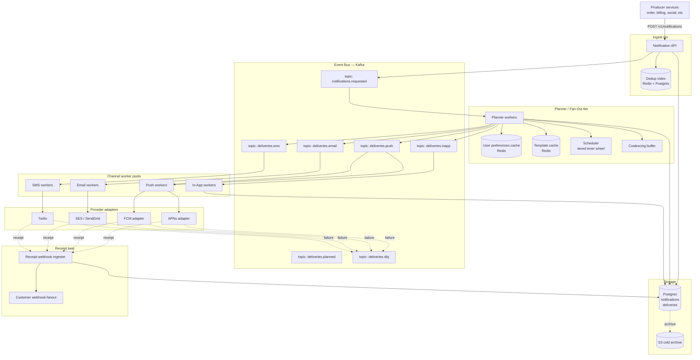

# Design a Notification System — Fan-Out, Channel Routing, Quiet Hours, and Reliable Delivery

**Date:** 2026-04-25 | **Updated:** 2026-04-25
**Tags:** `system-design` `case-study` `infrastructure` `messaging` `medium`
**LLD Twin:** [Notification System (LLD) — Channels, Templates, Delivery State Machine](../../../low-level-design/case-studies/communication/design-notification-system-lld.md) — class-level OOD with entities, relationships, and patterns.

**Difficulty:** Medium | **Type:** HLD | **Estimated read:** 30–35 min

## Table of Contents

- [Summary](#summary)
- [1. Functional Requirements](#1-functional-requirements)
- [2. Non-Functional Requirements](#2-non-functional-requirements)
- [3. Capacity Estimation](#3-capacity-estimation)
- [4. API Design](#4-api-design)
  - [Producer API — emit a domain event](#producer-api--emit-a-domain-event)
  - [Notification template API](#notification-template-api)
  - [Preferences API](#preferences-api)
  - [Delivery receipt webhooks](#delivery-receipt-webhooks)
- [5. Data Model](#5-data-model)
  - [Templates](#templates)
  - [User preferences](#user-preferences)
  - [Notifications & deliveries](#notifications--deliveries)
- [6. High-Level Architecture](#6-high-level-architecture)
- [7. Deep Dives](#7-deep-dives)
  - [7.1 Fan-out from event to per-user notifications](#71-fan-out-from-event-to-per-user-notifications)
  - [7.2 Channel adapters — APNs, FCM, SES, Twilio](#72-channel-adapters--apns-fcm-ses-twilio)
  - [7.3 Preferences, quiet hours, and rate limits](#73-preferences-quiet-hours-and-rate-limits)
  - [7.4 Retries, DLQ, and idempotency](#74-retries-dlq-and-idempotency)
  - [7.5 Batching and coalescing similar notifications](#75-batching-and-coalescing-similar-notifications)
  - [7.6 Scheduling future notifications](#76-scheduling-future-notifications)
  - [7.7 Templates, localization, and multi-language](#77-templates-localization-and-multi-language)
  - [7.8 Delivery receipt tracking](#78-delivery-receipt-tracking)
- [8. Bottlenecks & Trade-offs](#8-bottlenecks--trade-offs)
- [9. Anti-Patterns](#9-anti-patterns)
- [Related](#related)
- [References](#references)

## Summary

A notification system is a deceptively shallow piece of infrastructure. The shape — "an event happens, a user gets pinged" — hides a thicket of hard problems: a single domain event can fan out to millions of recipients, each recipient has multiple channels (push, email, SMS, in-app), each channel has its own provider with its own rate limits and failure modes, users have preferences and quiet hours that vary by timezone, regulators expect deliverability evidence, and **nothing is allowed to send the same alert twice** even when half your queue workers are restarting.

This case study designs a multi-tenant notification platform on the shape used by Uber's [post-mortem-grade Notification Platform][uber-np] and Slack's mobile delivery pipeline: **Kafka for event ingestion, a per-user fan-out planner, channel-specific worker pools, dedicated provider adapters with circuit breakers, a Redis-backed dedup/coalescing layer, and a deliveries ledger that's the source of truth for retries and audit**. The design covers fan-out, channel routing through APNs ([Apple Push Notification service][apns-overview]), FCM ([Firebase Cloud Messaging][fcm-overview]), Amazon SES, and Twilio, per-user preferences and quiet hours, retry-with-DLQ, batching/coalescing, scheduled delivery via a tiered timer wheel, and per-message delivery receipts.

## 1. Functional Requirements

The platform must support:

- **Multiple notification types** — transactional (password reset, OTP, payment receipt), marketing (campaigns, digests), and operational (incidents, system alerts). Each type has different urgency, batching, and consent rules.
- **Multiple channels per recipient** — mobile push (APNs / FCM), email (SES, SendGrid), SMS (Twilio, Vonage), in-app inbox, and webhook. A single notification may be delivered through several channels in parallel or with fallback.
- **Per-user preferences.** Users opt into channel × type combinations (e.g., "marketing email yes, marketing push no"), set quiet hours in their local timezone, and choose digest cadences.
- **Templates with variables.** Producers send a template ID + a payload of variables; the platform renders the final body per recipient (including localization).
- **Multi-language.** Render templates in the recipient's locale, fallback to a default.
- **Scheduling.** Producers can request delivery at a specific UTC time, after a delay, or "the next time the user is awake" (quiet-hour-aware).
- **Batching / coalescing.** Multiple similar events to the same user within a window collapse into one notification ("Alice and 3 others liked your post").
- **Dedup.** A producer retry must not produce a second notification for the same logical event.
- **Retries with DLQ.** Transient provider failures retry with exponential backoff; permanent failures land in a dead-letter queue for review.
- **Delivery receipts.** Producers can subscribe to delivery state transitions (queued → sent → delivered → opened / clicked / bounced).
- **Multi-tenant isolation.** Per-tenant rate limits, quotas, and template namespaces.

## 2. Non-Functional Requirements

| NFR | Target | Why |
|-----|--------|-----|
| **Deliverability** | ≥ 99.5% of valid recipients reached on at least one channel | Anything below ~99% drives user trust collapse and regulator complaints |
| **End-to-end p95 (transactional push)** | < 5 s from `POST /notify` to APNs/FCM acceptance | OTP and security alerts are time-critical |
| **End-to-end p95 (marketing fan-out)** | < 15 min for a 10M-recipient campaign | Industry expectation; matches SendGrid / Braze SLAs |
| **Idempotent retries** | Never deliver the same `(notification_id, channel)` twice | Duplicate OTPs and double-sent emails are reportable incidents |
| **Rate-limit safety** | Stay under each provider's per-second cap; fail soft when throttled | APNs, FCM, SES, and Twilio all throttle aggressively; one bad batch can cap the whole tenant |
| **Throughput** | 100k events/s peak, 1M deliveries/s aggregate burst | A single major-event fan-out can dwarf steady-state traffic |
| **Durability** | Zero data loss for queued notifications until terminal state | Loss = silent miss; users never see what was supposed to be sent |
| **Availability** | 99.95%+ for ingestion; degrade by channel, never globally | One provider outage must not stop the others |
| **Audit retention** | 30–90 days of delivery state per message | Required for billing reconciliation and compliance investigations |

The three load-bearing properties are **deliverability**, **rate-limit safety**, and **idempotent retries** — they decide every other architectural choice.

## 3. Capacity Estimation

**Scale.** Tenant of 50M MAU, ~5 notifications per user per day on average, with daily marketing campaigns reaching 10M users in a 5-minute burst.

**Steady-state ingest.**

```text
50M users × 5 notifications/day = 250M events/day
Avg: 250M / 86 400 ≈ 2 900 events/s
Peak (3× avg): ~9 000 events/s
Campaign burst: 10M / 300 s = 33 000 events/s during burst
```

**Fan-out multiplier.** Each event fans out to ~1.6 channels on average (push + email very common, SMS rarer). So peak deliveries: `33k × 1.6 ≈ 53k deliveries/s` during a campaign burst, with provider-side spikes higher because of retries.

**Storage.**

```text
Notification record: ~500 B (id, user, type, payload digest, timestamps)
Delivery record:     ~400 B per channel attempt
Per day: 250M notifications × 500 B + 400M deliveries × 400 B ≈ 285 GB/day
30 days hot in Postgres + S3 cold: ~8.5 TB hot
Indexes ~30%: total ~11 TB
```

**Provider throughput limits (typical defaults — always verify per account):**

| Provider | Soft limit |
|----------|-----------|
| APNs HTTP/2 | ~9 000 notifications/s per connection, multiple connections allowed |
| FCM HTTP v1 | 600 messages/min per project default; raised on request |
| SES | 14 emails/s starting, scales with reputation |
| Twilio SMS | 1 msg/s per long code; 100/s per short code; carrier-dependent |

These limits define the **shape** of the worker pools — see §7.2.

**Queues.** Each channel needs its own Kafka topic partitioned by `user_id` (so per-user ordering is preserved) with enough partitions to absorb the campaign burst. With 53k deliveries/s peak split across 4 channels, ~200 partitions per channel topic gives ~70 deliveries/s/partition headroom — well within Kafka's per-partition envelope.

## 4. API Design

### Producer API — emit a domain event

The producer-facing surface is intentionally narrow. Producers describe **what happened**, not **how to notify**:

```http
POST /v1/notifications
Idempotency-Key: <uuid-from-producer>
Content-Type: application/json

{
  "tenant_id": "acme",
  "type": "order.shipped",
  "recipient": { "user_id": "u_42" },
  "template_id": "order_shipped_v3",
  "variables": {
    "order_id": "o_9931",
    "tracking_url": "https://...",
    "items": [{ "name": "Wool socks", "qty": 2 }]
  },
  "channels": ["push", "email"],          // optional override
  "priority": "transactional",             // transactional | marketing | operational
  "schedule_at": null,                     // ISO-8601 UTC, or null for immediate
  "dedup_key": "order:o_9931:shipped"      // optional; defaults to Idempotency-Key
}
```

Key design points:

- **Producers don't pick the channel.** They state intent; the platform consults the user's preferences to choose channels. The `channels` field is an override hint, not a directive.
- **`Idempotency-Key` is mandatory** — see §7.4. Duplicates are silently absorbed.
- **`dedup_key` separates "same logical event" from "same HTTP retry"** — useful when the producer's own delivery is at-least-once.

Response is intentionally non-committal about delivery:

```json
{
  "notification_id": "n_01HXYZ...",
  "status": "accepted",
  "estimated_delivery": "2026-04-25T18:32:11Z"
}
```

### Notification template API

Admins manage templates via REST. Templates are versioned; producers reference a stable ID and the platform resolves the active version at render time.

```http
POST /v1/templates
{
  "id": "order_shipped_v3",
  "channels": {
    "push":  { "title_i18n": {...}, "body_i18n": {...} },
    "email": { "subject_i18n": {...}, "html_i18n": {...}, "text_i18n": {...} },
    "sms":   { "body_i18n": {...} }
  },
  "default_locale": "en-US"
}
```

See §7.7 for how localization, fallbacks, and provider-specific payloads work.

### Preferences API

Users (or their representatives) read and update preferences:

```http
GET    /v1/users/{user_id}/preferences
PATCH  /v1/users/{user_id}/preferences
{
  "channels": { "push": true, "email": true, "sms": false },
  "categories": {
    "marketing":     { "push": false, "email": true, "sms": false },
    "transactional": { "push": true,  "email": true, "sms": true  }
  },
  "quiet_hours": { "tz": "America/Los_Angeles", "start": "22:00", "end": "07:00" },
  "digest": { "marketing": "daily_09:00" }
}
```

Quiet hours and category-level toggles are enforced **inside the planner** before a delivery row is created, never inside the channel worker (see §7.3 for why).

### Delivery receipt webhooks

Producers register webhook subscriptions to receive state transitions:

```http
POST /v1/subscriptions
{
  "tenant_id": "acme",
  "events": ["delivery.delivered", "delivery.bounced", "delivery.opened"],
  "url": "https://acme.example.com/hooks/notifications",
  "secret": "<hmac-secret>"
}
```

Webhooks carry the same `notification_id` the producer received, plus channel and provider receipt fields — see §7.8.

## 5. Data Model

The core schema separates **intent** (notifications), **plan** (deliveries), and **outcome** (events). This split is what makes retries and dedup tractable.

### Templates

```sql
CREATE TABLE notification_templates (
  id              TEXT NOT NULL,                -- 'order_shipped_v3'
  version         INT  NOT NULL,                -- 1, 2, 3, ...
  tenant_id       TEXT NOT NULL,
  channels        JSONB NOT NULL,               -- per-channel i18n payloads
  default_locale  TEXT NOT NULL,
  active          BOOLEAN NOT NULL,
  created_at      TIMESTAMPTZ NOT NULL,
  PRIMARY KEY (tenant_id, id, version)
);
CREATE INDEX ON notification_templates (tenant_id, id) WHERE active;
```

### User preferences

```sql
CREATE TABLE user_preferences (
  tenant_id    TEXT NOT NULL,
  user_id      TEXT NOT NULL,
  channels     JSONB NOT NULL,           -- { push: true, email: true, sms: false }
  categories   JSONB NOT NULL,           -- per-category × per-channel toggles
  quiet_hours  JSONB,                    -- { tz, start, end } or NULL
  digest       JSONB,                    -- per-category digest config
  locale       TEXT NOT NULL DEFAULT 'en-US',
  device_tokens JSONB NOT NULL DEFAULT '[]', -- [{platform, token, app_version, ...}]
  email_addr   TEXT,
  phone_e164   TEXT,
  updated_at   TIMESTAMPTZ NOT NULL,
  PRIMARY KEY (tenant_id, user_id)
);
```

This table is read on the hot path of every notification — keep it small and cache it aggressively (see §7.1).

### Notifications & deliveries

```sql
-- One row per logical "thing producer asked us to send"
CREATE TABLE notifications (
  id            TEXT PRIMARY KEY,            -- ULID
  tenant_id     TEXT NOT NULL,
  type          TEXT NOT NULL,
  user_id       TEXT NOT NULL,
  template_id   TEXT NOT NULL,
  variables     JSONB NOT NULL,
  priority      TEXT NOT NULL,
  dedup_key     TEXT NOT NULL,
  scheduled_at  TIMESTAMPTZ NOT NULL,
  created_at    TIMESTAMPTZ NOT NULL,
  state         TEXT NOT NULL,               -- accepted | planned | done | suppressed
  UNIQUE (tenant_id, dedup_key)              -- enforces dedup
);
CREATE INDEX ON notifications (user_id, created_at DESC);

-- One row per (notification × channel) attempt plan
CREATE TABLE deliveries (
  id              TEXT PRIMARY KEY,
  notification_id TEXT NOT NULL REFERENCES notifications(id),
  channel         TEXT NOT NULL,             -- push | email | sms | inapp | webhook
  address         TEXT NOT NULL,             -- device token | email | E.164
  rendered_payload JSONB NOT NULL,
  state           TEXT NOT NULL,             -- queued | sending | sent | delivered | bounced | failed
  attempt_count   INT  NOT NULL DEFAULT 0,
  last_error      TEXT,
  provider        TEXT,                      -- apns | fcm | ses | twilio | ...
  provider_msg_id TEXT,                      -- receipt id from the provider
  next_attempt_at TIMESTAMPTZ,
  created_at      TIMESTAMPTZ NOT NULL,
  updated_at      TIMESTAMPTZ NOT NULL
);
CREATE INDEX ON deliveries (state, next_attempt_at) WHERE state IN ('queued','failed');
CREATE INDEX ON deliveries (notification_id);

-- Append-only history of every state transition (audit + receipt webhook source)
CREATE TABLE delivery_events (
  id            BIGSERIAL PRIMARY KEY,
  delivery_id   TEXT NOT NULL,
  state         TEXT NOT NULL,
  detail        JSONB,
  occurred_at   TIMESTAMPTZ NOT NULL DEFAULT now()
);
CREATE INDEX ON delivery_events (delivery_id, occurred_at);
```

The `notifications.dedup_key` unique constraint is the **single source of truth for dedup**. Every other layer (ingest, planner, worker) is allowed to retry blindly because this table refuses duplicates.

## 6. High-Level Architecture



**Ingest path.** Producer POSTs an event. The API checks dedup, persists the `notifications` row, publishes to `notifications.requested`, and returns 202.

**Planner path.** Planner workers consume `notifications.requested`, look up preferences and template, decide which channels apply, render the per-channel payload, persist `deliveries` rows, and publish per-channel topics. Scheduled or quiet-hour-deferred items go to the timer wheel instead of straight to the channel topic.

**Channel worker path.** Channel workers consume their topic, call the provider adapter, update the delivery row state. On retryable failure, requeue with a delay; on terminal failure, route to DLQ.

**Receipt path.** Provider receipts (APNs feedback, SES bounces, Twilio status callbacks) flow into the receipt ingester, update the delivery row, and fan out webhooks to subscribed producers.

## 7. Deep Dives

### 7.1 Fan-out from event to per-user notifications

Two flavors of fan-out, both handled by the planner but with different shapes.

**Single-recipient fan-out.** A producer says "notify user u_42 about this event." The planner expands one event into N delivery rows (one per matching channel × addressable contact). This is the common case and is straightforward — the work is in `O(channels)`.

**Audience fan-out.** Marketing campaigns target audiences ("all users who bought X in the last 30 days"). The producer hands a saved-segment ID; the platform resolves the segment to a user list (potentially 10M users) and emits one `notifications.requested` event per user. This is **fan-out at write time**, mirroring Twitter's home-timeline approach: spend the cost up front so that every per-user delivery is independent and parallelizable ([Twitter timelines][twitter-timeline]).

**Why fan-out at write time, not at read time.** A delivery is push-shaped: there's no "render when the user pulls." If the platform deferred fan-out, every send would block on segment resolution at exactly the moment the user expects the alert. Eager fan-out also lets each user's delivery row carry per-user state (locale, channels, quiet-hour decisions) cleanly.

**Partitioning.** Both topics are partitioned on `user_id` so that all events for a given user land on the same Kafka partition and the same planner worker. This makes per-user dedup, coalescing, and rate-limiting cheap — the worker can keep a small per-user state in memory without coordination.

**Preference cache.** The planner reads user preferences on every event. With 9k events/s steady state and a sub-ms preference lookup target, Postgres is too slow on the hot path. Use a Redis cache:

- Read-through: planner checks Redis first, falls back to Postgres on miss.
- Write-through: preferences API updates both stores in a single transaction-bracketed sequence.
- TTL: 5 minutes on positive entries, 30 seconds on negative entries.
- Invalidation: preferences API publishes a `prefs.changed` event that planner workers consume to invalidate locally.

A 50M-user × ~1KB cache fits in ~50 GB; with active-set caching (LRU on the working set of users active in the last 24 h ≈ 5–10M users), 8 GB Redis is plenty.

### 7.2 Channel adapters — APNs, FCM, SES, Twilio

Each provider has its own protocol, error shape, rate ceiling, and receipt mechanism. **Isolate them behind a uniform `ChannelAdapter` interface** so the worker pool logic is provider-agnostic.

```text
interface ChannelAdapter {
  send(delivery): Promise<{ provider_msg_id, accepted_at }>
  classify_error(err): RETRYABLE | INVALID_RECIPIENT | RATE_LIMITED | PERMANENT
}
```

**APNs (Apple Push Notification service).**

- **HTTP/2 multiplexed.** A single TLS connection carries thousands of in-flight requests; per-connection throughput is ~9k notifications/s.
- **Authentication.** JWT signed with an APNs auth key, refreshed every ~50 minutes. Keep the JWT minting inside the adapter; never let the worker construct it.
- **Errors.** `400 BadDeviceToken` and `410 Unregistered` are **invalid recipient** — mark the device token dead, do not retry. `429 TooManyRequests` and `503 ServiceUnavailable` are **rate limited / retryable**. See [APNs documentation][apns-overview] for the full error table.
- **Pool sizing.** Run multiple HTTP/2 connections per worker pod (Apple recommends multiple connections to balance load across their edge). Cap concurrent streams per connection to stay under the 1500-stream-per-connection ceiling.

**FCM (Firebase Cloud Messaging).**

- **HTTP v1 API.** OAuth2 service-account tokens; refresh and cache.
- **Platform fan-out inside FCM.** A single FCM request can target Android + iOS via FCM-as-bridge — but for direct iOS APNs we prefer APNs directly.
- **Errors.** `UNREGISTERED`, `INVALID_ARGUMENT` → invalid recipient; `UNAVAILABLE`, `INTERNAL` → retryable; `QUOTA_EXCEEDED` → rate limited. See [FCM messaging documentation][fcm-overview].
- **Per-topic broadcast** (FCM topics) is tempting for "broadcast to all subscribers" but loses per-user preference enforcement — avoid it for anything beyond crude announcements.

**SES / SendGrid (email).**

- **Reputation matters.** Bounces and complaints lower sending reputation; SES suspends senders above 5% bounce / 0.1% complaint thresholds. The adapter must short-circuit known-bad addresses before they hit the provider.
- **Suppression list.** Maintain a local suppression list synced from provider feedback events. A bounced email must never be retried.
- **Webhooks.** SES emits SNS events for `Delivery`, `Bounce`, `Complaint`, `Open`, `Click`. SendGrid uses [Event Webhook][sendgrid-events]. Both feed the receipt ingester (§7.8).

**Twilio (SMS).**

- **Carrier hop.** Twilio accepts the message; actual delivery is the downstream carrier. `MessageStatus` callback transitions through `queued → sending → sent → delivered` (or `failed` / `undelivered`).
- **Rate ceilings are sender-pool dependent.** Long codes ~1 msg/s, short codes ~100/s, A2P 10DLC ~250/s tier-dependent. The adapter enforces a per-sender rate limit using a token bucket (see [`../../building-blocks/rate-limiters.md`](../../building-blocks/rate-limiters.md)).
- **Cost is real.** Each SMS costs cents; the platform must enforce per-tenant daily caps and refuse over-budget sends.

**Circuit breaker per adapter.** Wrap each provider with a circuit breaker so that a 30-second SES outage doesn't pile up requests across the whole worker pool. When the breaker opens, the worker requeues the message with a delay and emits a metric. Once half-open, a small probe traffic flows through; full close on success.

### 7.3 Preferences, quiet hours, and rate limits

**Where preference enforcement lives matters.** Two anti-patterns:

- Enforcing preferences inside the channel worker: by the time the worker picks up the message, dedup/coalescing decisions have already been made on the wrong basis.
- Enforcing preferences inside the producer: each producer reimplements the rules, drifts, and ends up shipping the user marketing email after they unsubscribed.

The correct location is **the planner**, between event consumption and delivery row creation. Concretely:

1. Resolve user preferences (cache → DB).
2. Filter the candidate channel set by `(category × channel)` toggles.
3. Apply per-tenant rate limits (e.g., "no user gets more than 5 marketing pushes per day").
4. Apply quiet-hour rules.
5. Persist only the surviving deliveries.

**Quiet hours.** Users specify `{tz, start, end}` (e.g., America/Los_Angeles, 22:00 → 07:00). At planning time:

- Compute the user's local time using the IANA timezone database. Use a vetted library, never offset arithmetic — DST breaks naive math.
- If the current local time is inside the quiet window:
  - Transactional / urgent → **send anyway**. Quiet hours must not silence OTPs and security alerts. The category-level config decides this.
  - Non-urgent → defer to the end of the quiet window; create the delivery row with `next_attempt_at = end_of_window`.
- The scheduler (§7.6) wakes the delivery at `next_attempt_at` and pushes it onto the channel topic.

**Per-user rate limits.** Use the token bucket approach from [`../../building-blocks/rate-limiters.md`](../../building-blocks/rate-limiters.md), keyed on `(user_id, category)`. Two buckets per user typically suffice — one for marketing, one for transactional — because transactional should never be rate-limited away (instead: alert if a user is getting 50 transactional pushes/day; that's a producer bug).

**Per-tenant rate limits.** Use the same building block keyed on `(tenant_id, channel)`. This protects providers from a noisy tenant and protects other tenants from being shadow-throttled when one tenant burns its provider budget.

### 7.4 Retries, DLQ, and idempotency

Three concerns that interlock: never lose a message, never duplicate one, and never retry forever.

**Idempotency on ingest.** The API treats `(tenant_id, dedup_key)` as the canonical identity of a notification. The `notifications` table's unique constraint on this pair is the lock — a duplicate POST hits the constraint, the API responds with the existing notification's ID, and no second event is emitted. This pushes idempotency to the database where it actually has teeth (Stripe's idempotency-keys design uses the same shape, [Stripe docs][stripe-idem]).

**Retry policy by channel.** Retries follow the standard exponential backoff with jitter, classified by error type:

| Error class | Action | Schedule |
|-------------|--------|----------|
| `RETRYABLE` (5xx, network) | Re-enqueue | `delay = base × 2^attempt + jitter`, cap at ~30 min |
| `RATE_LIMITED` (429) | Re-enqueue with provider's `Retry-After` if given | Honor `Retry-After`; otherwise back off harder |
| `INVALID_RECIPIENT` (bad token, bounced email) | Mark recipient dead, **do not retry** | Suppression list updated |
| `PERMANENT` (template error, account suspended) | Move to DLQ | Manual intervention |

Cap attempts at 5–8 depending on channel; after the cap, route to DLQ. SMS and push max-out faster (1–2 minutes total) because they're time-sensitive; email can run 6–12 hours of retries.

**The DLQ is not a graveyard.** Treat it as a queue of incidents:

- Every DLQ entry carries the full delivery row, the last error, and the retry history.
- An on-call dashboard surfaces DLQ rate per channel × per error class.
- A replay tool can re-emit selected DLQ items after the underlying issue is fixed (e.g., bad template was hot-fixed).

See [`../../communication/dead-letter-queues-retries.md`](../../communication/dead-letter-queues-retries.md) for the full DLQ pattern; the rules here are domain-specific applications of it.

**Channel-worker idempotency.** Workers must be safe to run more than once on the same delivery row. The shape:

```text
loop:
  msg = consume()
  delivery = SELECT * FROM deliveries WHERE id = msg.delivery_id
  if delivery.state in ('sent','delivered'):  ack(); continue   # already done
  if delivery.attempt_count >= MAX_ATTEMPTS:   send_to_dlq(); ack(); continue
  result = adapter.send(delivery)
  UPDATE deliveries
    SET state = 'sent', attempt_count = attempt_count + 1,
        provider_msg_id = result.id
    WHERE id = delivery.id AND state = 'queued'      -- conditional update
  if rowcount = 0: ack(); continue                   # someone else handled it
  ack()
```

The conditional `WHERE state = 'queued'` is the deduplication primitive at the worker level. Two workers racing on the same message both call the provider in the worst case — **so the providers themselves must also dedup** (APNs uses the `apns-collapse-id` header, FCM uses message ID). Both safety nets together get us "exactly-once observable" delivery from the user's perspective.

### 7.5 Batching and coalescing similar notifications

Two related but distinct techniques.

**Batching** is a transport-layer optimization: pack multiple deliveries into a single provider call when the provider supports it. SES `SendBulkTemplatedEmail` accepts up to 50 destinations; FCM accepts up to 500 device tokens per request. Workers accumulate a small buffer (e.g., 100 ms or 50 messages, whichever first) and ship batches. Batching reduces provider RTT cost but does not change the user-visible message count.

**Coalescing** is a user-experience optimization: merge multiple semantically-similar notifications to the same user into one. "Alice liked your post," "Bob liked your post," "Carol liked your post" → "Alice and 2 others liked your post."

Coalescing happens **in the planner**, not in the worker:

1. The planner keeps a per-user, per-coalesce-key buffer in Redis with a short window (typically 30 s – 5 min).
2. When a new event arrives with a coalesce key (e.g., `like:post_123:user_42`), it goes into the buffer instead of immediately producing a delivery.
3. When the buffer's timer fires, the planner reads all events for the key, renders a single coalesced notification, and emits one delivery.
4. The coalesced notification carries the `count` and `actors` so templates can render "Alice and 2 others."

**Trade-offs.**

- Longer coalesce window = more aggressive merging = better UX for noisy notifications, but introduces user-visible delay. Tune per type: chat messages 10 s, social likes 60 s, marketing digest 24 h.
- Coalescing is incompatible with hard real-time semantics. OTPs and security alerts must never coalesce.
- The buffer is **stateful** and must survive restarts. Redis with AOF persistence is sufficient; if the buffer flushes after a crash, every pending event is processed individually (worse UX, not data loss).

**Digest mode** is a coalescing variant where the user explicitly opts into "send me the daily digest at 9 AM." Implement it as a long-window coalesce keyed on `(user_id, digest_category)` with the window aligned to the user's local 9 AM.

### 7.6 Scheduling future notifications

Producers can request delivery at a specific time (`schedule_at`) or after a delay; the planner can also defer due to quiet hours. All three flow into the same scheduler.

**Naive approach (don't do this).** A `WHERE next_attempt_at <= now()` polling query on the deliveries table. Works at small scale; collapses at high cardinality because the index range scan grows with the schedule horizon and the polling interval becomes the latency floor.

**Hierarchical timer wheel.** A tiered timer wheel handles billions of pending timers with `O(1)` insert and `O(1)` advance ([Varghese & Lauck timer wheel paper][timer-wheel]). The shape:

- Wheel 1: 60 buckets × 1 second resolution (next minute)
- Wheel 2: 60 buckets × 1 minute resolution (next hour)
- Wheel 3: 24 buckets × 1 hour resolution (next day)
- Wheel 4: 30 buckets × 1 day resolution (next month)

Items further than a month go to a backing store (Postgres or a dedicated `scheduled_events` table) and are pulled into the appropriate wheel as they approach.

**Distribution.** A single in-memory wheel doesn't survive a pod restart. Two production patterns:

1. **Sharded wheels with replication.** Partition by `user_id`, run leader-follower per shard, persist each tick's pending list to a durable store (Kafka or Postgres). On failover, the new leader reloads from the store.
2. **Database-backed wheel.** Use a service like AWS EventBridge Scheduler or a dedicated open-source scheduler (e.g., [Quartz clustering][quartz-cluster]). Trades raw throughput for operational simplicity.

For most notification platforms (1) is overkill and (2) fits inside the existing Kafka + Postgres footprint. Use a "due" topic: when the wheel fires, the scheduler publishes the delivery ID to `deliveries.due`, the channel worker consumes and processes normally. The wheel's only job is "tell me when," not "deliver it" — keeping it stateless about provider details.

**Quiet-hour deferrals.** When the planner defers due to quiet hours, it persists the delivery row with `state = 'queued'` and `next_attempt_at = end_of_quiet_window` and registers it with the scheduler. No special path; quiet-hour deferrals reuse the same machinery as producer-scheduled sends.

### 7.7 Templates, localization, and multi-language

A template is a per-channel structured payload with i18n strings:

```json
{
  "id": "order_shipped_v3",
  "channels": {
    "push": {
      "title_i18n": { "en-US": "Order shipped",       "ja-JP": "発送されました",       "es-ES": "Pedido enviado" },
      "body_i18n":  { "en-US": "Order {{order_id}} is on its way.", "ja-JP": "注文 {{order_id}} が出荷されました。" }
    },
    "email": {
      "subject_i18n": { "en-US": "Your order has shipped", ... },
      "html_i18n":    { "en-US": "<mjml>...</mjml>", ... },
      "text_i18n":    { "en-US": "Your order ...",   ... }
    },
    "sms": { "body_i18n": { "en-US": "Order {{order_id}} shipped: {{tracking_url}}" } }
  }
}
```

**Locale resolution.**

1. User's preference (`user_preferences.locale`)
2. Account-level default
3. Template's `default_locale`

Always render with a fallback chain (`ja-JP → ja → en-US`) so a missing translation degrades gracefully instead of erroring.

**Variable substitution.** Use a sandboxed templating language (Handlebars, Liquid, MJML for email). Three rules:

- **Sanitize variables for HTML/SMS.** A user-controlled variable rendered into HTML is an XSS vector; into SMS is a content-injection vector that breaks character-limit math. Auto-escape by default.
- **Render before persisting the delivery row.** Late-binding rendering means a template change between plan and send produces a different message than the planner intended. Render at planning time, store the rendered payload, and ship that exact bytes.
- **Validate variables against the template schema.** Templates declare their required variables; producers that omit one get a synchronous 400, not a silent partial render.

**Provider-specific quirks.** APNs and FCM payloads cap at 4 KB; SMS over GSM-7 caps at 160 chars/segment, UCS-2 at 70. The adapter must compute segments per locale because each segment costs.

### 7.8 Delivery receipt tracking

Every state transition is an audit row in `delivery_events` and (optionally) a webhook out to producers. The pipeline:

```text
Provider receipt webhook → receipt ingester → update deliveries
                                           → append delivery_events
                                           → emit 'delivery.<state>' event
                                           → producer webhook fanout
```

**Per-channel mapping.**

| Channel | Receipt source | Terminal states |
|---------|----------------|-----------------|
| APNs | HTTP/2 response + feedback service | sent, failed |
| FCM | HTTP v1 response | sent, failed |
| SES | SNS topic (bounce/complaint/delivery/open/click) | delivered, bounced, complained, opened, clicked |
| SendGrid | [Event Webhook][sendgrid-events] HTTP POST | same as SES |
| Twilio | StatusCallback per state transition | sent, delivered, failed, undelivered |

**Idempotent receipt processing.** Provider webhooks are at-least-once. The ingester looks up the delivery by `provider_msg_id`, deduplicates on `(delivery_id, state, occurred_at)`, and applies the transition only if it advances the state machine (never regress from `delivered` back to `sent`).

**Producer webhook fanout.** Subscribed producers receive HTTP POSTs with HMAC signatures. The fanout layer is itself a queue with retries — a producer's webhook outage cannot hold up notification delivery. Open/click tracking flows through the same path as `delivery.opened` / `delivery.clicked` events; opt-in per tenant.

## 8. Bottlenecks & Trade-offs

| Concern | Bottleneck | Trade-off |
|---------|-----------|-----------|
| **Fan-out latency for 10M-user campaign** | Planner throughput × Kafka partition count | More partitions → more parallelism but higher operational cost |
| **Provider rate ceilings** | APNs/FCM/SES/Twilio per-account caps | Shape worker pool to match; overflow into DLQ vs. local backpressure |
| **Per-user preference lookups** | Postgres read load on hot path | Aggressive Redis cache; accept brief staleness on prefs change |
| **Coalesce window vs. UX** | Longer window = more merging, more delay | Per-type tuning; transactional bypasses entirely |
| **Receipt webhook storms** | Provider can deliver 100k receipts/min during a campaign | Buffer in Kafka; never block on direct DB write per receipt |
| **Multi-region** | Cross-region replication of dedup index | Pin tenant to home region; only cross-region for global tenants |
| **Cost** | SMS dollars, SES sends, marketing-channel volume | Per-tenant daily caps; aggressive suppression list |
| **Scheduler scale** | Single in-memory timer wheel limits | Sharded wheels or DB-backed scheduler; trade complexity for durability |

A useful framing: **a notification system is a pipeline that should never lose data, never duplicate, and never wait for the slowest provider**. You buy the first two with a durable ledger and idempotent stages; you buy the third by isolating channels behind separate worker pools and circuit breakers.

## 9. Anti-Patterns

- **One giant queue for everything.** A single shared queue means a Twilio outage backs up email and push. Per-channel topics + per-channel worker pools are non-negotiable.
- **Fire-and-forget provider calls.** No persistence between "we received the event" and "we sent it" guarantees data loss on worker restart. Always persist a `deliveries` row before shipping to the provider.
- **No dedup at the ingest layer.** Producer retries multiply into duplicate notifications. The unique constraint on `(tenant_id, dedup_key)` is the cheapest correctness gain in the whole system.
- **Enforcing preferences in the channel worker.** By the time the worker runs, the planner has already paid the fan-out cost and may have triggered coalescing on suppressed channels. Filter early.
- **Naive polling for scheduled sends.** `SELECT ... WHERE next_attempt_at <= now()` collapses at scale. Use a timer wheel or a managed scheduler.
- **Using fixed-window per-tenant rate limits.** Boundary-glitch sends 2× the limit at the window edge; provider sees a spike and starts throttling. Token bucket only.
- **Treating quiet hours as best-effort.** A user who set quiet hours and gets a 3 AM marketing push opens a support ticket and never trusts notifications again. Quiet-hour enforcement is a correctness property, not a UX nicety.
- **No DLQ.** Failures pile up retries forever, the queue lag dashboard turns red, the on-call eventually deletes the queue. Build the DLQ + replay tooling on day one.
- **Rendering templates lazily in the worker.** A template hot-fix between plan and send produces a different message than the planner authorized. Render at plan time, store the rendered bytes.
- **Unbounded retries on permanent errors.** A bad device token retried forever burns provider budget and pollutes metrics. Classify errors; permanent ones go straight to DLQ.
- **Forgetting GSM-7 vs UCS-2 segment math for SMS.** A localized template that fits in 160 chars in English splits into 4 segments in Japanese; cost and latency surprise the tenant.
- **Coalescing transactional notifications.** Merging two OTPs into "you got 2 OTPs" is a security incident waiting to happen. Coalesce only types tagged as safe.

## Related

- **Building blocks:**
  - [`../../building-blocks/message-queues-and-brokers.md`](../../building-blocks/message-queues-and-brokers.md) — Kafka topic design, partitioning, consumer groups.
  - [`../../building-blocks/rate-limiters.md`](../../building-blocks/rate-limiters.md) — token bucket implementation used for per-user and per-tenant caps.
- **Communication patterns:**
  - [`../../communication/event-driven-architecture.md`](../../communication/event-driven-architecture.md) — the event-bus shape this design rides on.
  - [`../../communication/dead-letter-queues-retries.md`](../../communication/dead-letter-queues-retries.md) — generic DLQ + retry pattern, specialized here for channel adapters.

## References

- [Apple Push Notification service — Setting up a remote notification server][apns-overview]
- [Apple — Sending notification requests to APNs (HTTP/2, errors, JWT)](https://developer.apple.com/documentation/usernotifications/sending-notification-requests-to-apns)
- [Firebase Cloud Messaging — Build send requests (HTTP v1)][fcm-overview]
- [Firebase Cloud Messaging — Handling messaging errors](https://firebase.google.com/docs/cloud-messaging/manage-tokens)
- [SendGrid — Event Webhook reference][sendgrid-events]
- [Amazon SES — Monitoring sending activity with event publishing](https://docs.aws.amazon.com/ses/latest/dg/monitor-using-event-publishing.html)
- [Twilio — Track delivery status of messages with status callbacks](https://www.twilio.com/docs/messaging/guides/track-outbound-message-status)
- [Stripe — Designing robust and predictable APIs with idempotency][stripe-idem]
- [Uber Engineering — Reliable Notification Platform][uber-np]
- [Twitter — The infrastructure behind Twitter (timelines and fan-out)][twitter-timeline]
- [Varghese & Lauck — Hashed and hierarchical timing wheels][timer-wheel]

[apns-overview]: https://developer.apple.com/documentation/usernotifications/setting-up-a-remote-notification-server
[fcm-overview]: https://firebase.google.com/docs/cloud-messaging/send-message
[sendgrid-events]: https://docs.sendgrid.com/for-developers/tracking-events/event
[stripe-idem]: https://stripe.com/blog/idempotency
[uber-np]: https://www.uber.com/blog/reliable-notification-system/
[twitter-timeline]: https://blog.x.com/engineering/en_us/topics/infrastructure/2017/the-infrastructure-behind-twitter-scale
[timer-wheel]: https://www.cs.columbia.edu/~nahum/w6998/papers/sosp87-timing-wheels.pdf
[quartz-cluster]: http://www.quartz-scheduler.org/documentation/quartz-2.x/configuration/ConfigJDBCJobStoreClustering.html
