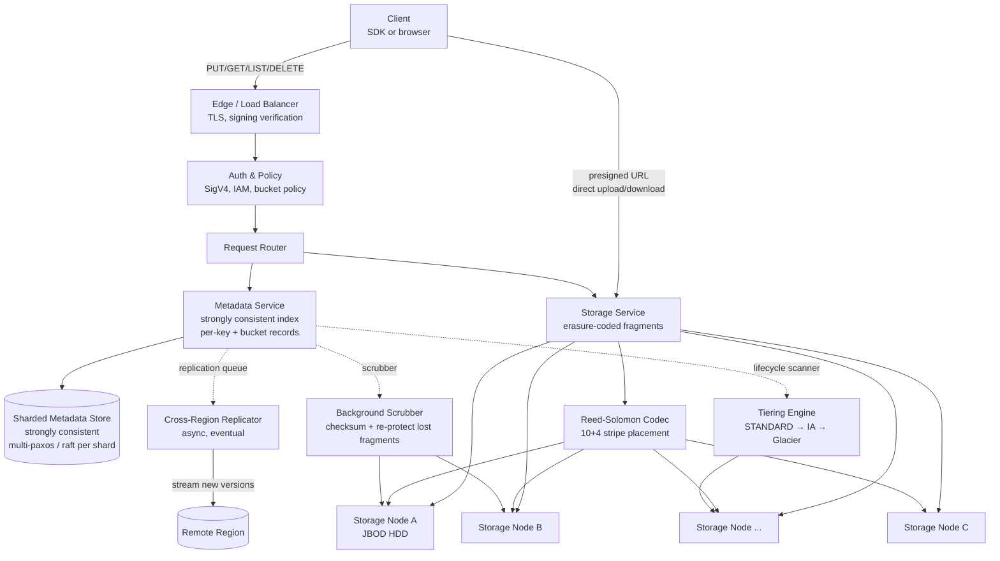

# Design Object Storage — S3-Style Flat Namespace, Erasure Coding, and Strong Read-After-Write

**Date:** 2026-04-25 | **Updated:** 2026-04-25
**Tags:** `system-design` `case-study` `infrastructure` `storage` `hard`

## Table of Contents

- [Summary](#summary)
- [Functional Requirements](#functional-requirements)
- [Non-Functional Requirements](#non-functional-requirements)
- [Capacity Estimation](#capacity-estimation)
- [API Design](#api-design)
- [Data Model](#data-model)
- [High-Level Design](#high-level-design)
- [Deep Dives](#deep-dives)
  - [1. Erasure Coding Math — Reed-Solomon 10+4 vs Replication](#1-erasure-coding-math--reed-solomon-104-vs-replication)
  - [2. Multipart Upload Protocol — Initiate, Parts, Complete](#2-multipart-upload-protocol--initiate-parts-complete)
  - [3. Presigned URLs — Direct Browser Upload and Download](#3-presigned-urls--direct-browser-upload-and-download)
  - [4. Strong Read-After-Write Consistency — How S3 Got There in 2020](#4-strong-read-after-write-consistency--how-s3-got-there-in-2020)
  - [5. Lifecycle Management — Transitions and Expirations](#5-lifecycle-management--transitions-and-expirations)
  - [6. Versioning and Object Lock — Mutability, Tombstones, Immutability](#6-versioning-and-object-lock--mutability-tombstones-immutability)
  - [7. Partitioning by Hashed Key Prefix — Avoiding Hot Shards](#7-partitioning-by-hashed-key-prefix--avoiding-hot-shards)
  - [8. Cross-Region Replication — Async, Eventual, Auditable](#8-cross-region-replication--async-eventual-auditable)
- [Bottlenecks & Trade-offs](#bottlenecks--trade-offs)
- [Anti-Patterns](#anti-patterns)
- [Related](#related)
- [References](#references)

## Summary

Object storage is the workhorse beneath every modern data platform: ML training sets, backups, video archives, log retention, static assets, and the data lake itself. It looks simple — `PUT` and `GET` opaque blobs by string key — and it is, until you ask it to deliver eleven nines of durability, store an exabyte, return a 5 GB object in pieces from anywhere on the planet, and never lose a write.

The reference design here mirrors **Amazon S3**'s public architecture and the open-source descendants that share its shape — **Ceph RADOS / RGW**, **MinIO**, and **Backblaze B2**. The core ideas are uncompromising:

1. **Flat namespace, not a filesystem.** Buckets contain keys; keys are opaque strings. Slashes in keys are display sugar for tools — there are no real directories, no `mv` of a directory, no inode tree. This is what lets the system scale to trillions of objects per bucket.
2. **Durability through erasure coding, not just replication.** A 10+4 Reed-Solomon code stores 14 fragments and tolerates the loss of any 4 — at a 1.4× storage overhead instead of replication's 3×. The math is the lever that makes 11 nines of durability affordable.
3. **Metadata service split from storage nodes.** The metadata layer is a strongly consistent index ("which object lives where, what version, what ACL"); the storage layer is a dumb fleet of disks streaming bytes. Each scales independently.
4. **Strong read-after-write consistency by default.** S3 lived with eventual consistency for 14 years; in December 2020, AWS re-architected to deliver strong consistency on every read. The mechanism — a per-key, strongly consistent metadata index — is the design point everyone now copies.
5. **Multipart upload, presigned URLs, lifecycle, versioning, Object Lock.** These are not afterthoughts. They are the difference between "a blob store" and "the blob store the rest of your stack actually relies on."

The trade-off frame: **object storage gives up a filesystem's mutability and POSIX semantics in exchange for unbounded scale and extreme durability**. You cannot edit byte 47 of an object. You cannot rename a "directory" atomically. In return, you get a system that survives data-center loss without losing data, scales to exabytes per region, and presigns a URL so a browser can upload 5 TB directly to a disk it has never heard of.

## Functional Requirements

| Requirement | Notes |
|---|---|
| **`PUT bucket/key`** | Upload an object up to 5 GB in a single call (S3's single-PUT cap); larger via multipart. |
| **`GET bucket/key`** | Download an object; supports `Range:` for partial reads, conditional GETs (`If-None-Match`). |
| **`DELETE bucket/key`** | Remove an object. With versioning enabled, creates a delete marker rather than wiping bytes. |
| **`LIST bucket?prefix=...`** | Paginated, prefix-scoped listing. Sorted lexicographically; cursor-based continuation. |
| **Multipart upload** | `InitiateMultipartUpload`, `UploadPart` (1..10,000 parts), `CompleteMultipartUpload`, `AbortMultipartUpload`. Per-part size 5 MB to 5 GB; total up to 5 TB. |
| **Presigned URLs** | Time-limited, signature-bound URLs for direct PUT or GET without passing through the application. |
| **Versioning** | Per-bucket toggle. Keeps every prior version; deletes become tombstone markers. |
| **Object Lock** | WORM (write-once-read-many). Governance and Compliance modes; retention dates and legal holds. |
| **Lifecycle policies** | Transition to colder storage class; expire current or noncurrent versions; abort incomplete multipart uploads. |
| **Cross-region replication** | Async replication of new objects (and optionally existing) to another region's bucket. |
| **Server-side encryption** | SSE-S3 (managed keys), SSE-KMS, SSE-C (customer keys). Default encryption per bucket. |
| **Access control** | Bucket policies (resource), IAM (identity), ACLs (legacy), block-public-access guardrails. |

Out of scope:

- Random-access mutation of object bytes — objects are immutable; "edit" means PUT a new version.
- POSIX semantics (atomic rename, hard links, fcntl locks).
- Strong cross-region consistency — replication is async by design.
- Filesystem mounts that pretend object storage is a disk (s3fs, goofys) — they exist, but they betray the model.

## Non-Functional Requirements

| NFR | Target |
|---|---|
| **Durability** | 11 nines (99.999999999%) for standard storage class — at this rate, a stored object has ~0.000000001% chance of loss per year |
| **Availability** | 99.99% for standard reads; 99.9% for reduced-redundancy/IA classes; varies by SLA tier |
| **Read-after-write consistency** | Strong for new PUTs, overwrites, and DELETEs (S3 since Dec 2020) |
| **List-after-write consistency** | Strong (a successful PUT is immediately visible in subsequent LISTs) |
| **First-byte latency** | < 100 ms p99 for warm objects within a region |
| **Sustained throughput per object** | Hundreds of MB/s per object via parallel multipart GETs; tens of MB/s for single-stream |
| **Per-prefix request rate** | Thousands of PUT/COPY/DELETE/sec and tens of thousands of GET/sec per prefix; auto-scales with prefix entropy |
| **Object size range** | 0 bytes to 5 TB; single-PUT up to 5 GB; multipart for anything larger |
| **Bucket scale** | Trillions of objects per bucket; no listed object-count limit |
| **Cost per stored TB-month** | Standard: ~$23/TB-month; cold (Glacier Deep Archive): ~$1/TB-month — driven by erasure coding overhead and storage hardware tier |

The framing line: **a write must survive the simultaneous loss of any one availability zone, and the system must continue serving reads from the survivors with no human in the loop**. Every design choice — erasure-coded fragment placement, metadata replication, the consistency story — exists to make that line true at exabyte scale.

## Capacity Estimation

### Cluster baseline

- **Region size:** 3 availability zones, 10+ data centers per zone, 100K+ storage nodes per region
- **Per-node capacity:** 100–300 TB JBOD (12–24 large HDDs); separate fleet of NVMe-backed metadata and index nodes
- **Erasure code:** Reed-Solomon **10+4** (10 data fragments + 4 parity), stripe distributed across 14 failure domains in 3+ AZs
- **Storage overhead:** 14/10 = **1.4×** raw (vs 3× for replication) — a 1 TB object consumes 1.4 TB on disk
- **Tolerated loss:** any 4 fragments per stripe, including a full AZ if fragments are spread carefully

### Throughput

- **Region aggregate ingress:** Petabytes per day; sustained ~Tbps when busy
- **Per-prefix request scaling:** Thousands of writes/sec, tens of thousands of reads/sec per prefix; horizontal sharding when a prefix gets hot
- **Multipart fan-out:** A 5 TB object split into 1024 × 5 GB parts can ingest at 1024 × 100 MB/s = 100 GB/s aggregate — limited by client and network, not by the storage system

### Object sizes (typical mix)

| Class | Size | Frequency |
|---|---|---|
| Tiny (logs, metadata blobs) | < 16 KB | Common; metadata overhead dominates |
| Small (images, documents) | 16 KB – 1 MB | Common; one stripe each |
| Medium (videos, datasets) | 1 MB – 1 GB | Erasure-coded across 14 fragments per stripe |
| Large (backups, ML training shards) | 1 GB – 5 TB | Multipart-uploaded; striped into many erasure-coded chunks |

### Metadata vs storage split

- **Metadata index:** ~1 KB per object record (key, version, ETag, content-type, size, ACL pointer, fragment-locator pointer, tags, lock state). 1 trillion objects ⇒ ~1 PB of metadata, replicated and indexed — an entirely separate engineering problem from the bytes themselves.
- **Storage nodes:** dumb byte servers. They receive `(stripe_id, fragment_index, bytes)`, store it, and serve it back. They do not know what bucket or key the bytes belong to.

### Durability arithmetic

- With 10+4 RS and a fleet-wide annual disk failure rate (AFR) of ~1%, plus diligent re-replication when fragments are lost (typical "mean time to recover" of hours, not days), the per-stripe annual loss probability is on the order of `10^-11` — which is exactly where the "eleven nines" marketing number comes from.
- This number is not a guarantee from physics; it is a budget the operator commits to via fragment placement, AZ separation, and re-protect SLAs. Skipping any of those drops you a nine or two.

## API Design

```http
PUT /my-bucket/photos/2026/sunset.jpg HTTP/1.1
Host: s3.us-east-1.example.com
Authorization: AWS4-HMAC-SHA256 ...
Content-Type: image/jpeg
Content-Length: 4823901
x-amz-server-side-encryption: aws:kms
x-amz-storage-class: STANDARD

<binary body>

200 OK
ETag: "9b8c0a9cf8c7d5e3..."
x-amz-version-id: 3HL4kqCxf3vjVBH40Nrjfkd
x-amz-server-side-encryption: aws:kms
```

```http
GET /my-bucket/photos/2026/sunset.jpg HTTP/1.1
Host: s3.us-east-1.example.com
Range: bytes=0-1048575
If-None-Match: "9b8c0a9cf8c7d5e3..."

206 Partial Content
ETag: "9b8c0a9cf8c7d5e3..."
Content-Range: bytes 0-1048575/4823901
Content-Length: 1048576

<bytes 0..1048575>
```

### Multipart upload

```http
POST /my-bucket/big-dataset.parquet?uploads HTTP/1.1
200 OK
<UploadId>VXBsb2FkSWQ...</UploadId>

PUT /my-bucket/big-dataset.parquet?partNumber=1&uploadId=VXBsb2FkSWQ... HTTP/1.1
Content-Length: 104857600
<100 MB body>
200 OK
ETag: "abc123..."

# ... repeat for parts 2..N, in parallel ...

POST /my-bucket/big-dataset.parquet?uploadId=VXBsb2FkSWQ... HTTP/1.1
<CompleteMultipartUpload>
  <Part><PartNumber>1</PartNumber><ETag>"abc123..."</ETag></Part>
  <Part><PartNumber>2</PartNumber><ETag>"def456..."</ETag></Part>
  ...
</CompleteMultipartUpload>

200 OK
<Location>https://s3.../my-bucket/big-dataset.parquet</Location>
<ETag>"composite-etag-N"</ETag>
```

### Presigned URL (server side, then handed to client)

```text
GET https://s3.us-east-1.example.com/my-bucket/photos/2026/sunset.jpg
  ?X-Amz-Algorithm=AWS4-HMAC-SHA256
  &X-Amz-Credential=AKIA.../20260425/us-east-1/s3/aws4_request
  &X-Amz-Date=20260425T120000Z
  &X-Amz-Expires=900
  &X-Amz-SignedHeaders=host
  &X-Amz-Signature=<hex>
```

Three points worth calling out:

- **`ETag` is the integrity handle.** For single-PUT objects it is the MD5 of the body. For multipart objects it is the MD5 of the concatenated part MD5s, suffixed with `-N` (count of parts) — *not* the MD5 of the assembled object. This is the source of half the "ETag doesn't match my checksum" support tickets.
- **The metadata of an object is mutable; the bytes are not.** You can change ACLs, tags, storage class, or replication state without rewriting the object. You cannot patch byte 47.
- **A successful `200 OK` on PUT implies the data has been durably erasure-coded across the required failure domains and the metadata index has been committed.** The acknowledgment is the durability promise.

## Data Model

### Object record (metadata service)

```text
Object:
  bucket:         string
  key:            string                # opaque, ≤ 1024 bytes UTF-8
  version_id:     string                # null if versioning never enabled
  is_latest:      bool
  is_delete_marker: bool                # true ⇒ "deleted"; bytes pointer absent

  size:           uint64                # bytes
  etag:           string                # MD5 (single-PUT) or composite (multipart)
  content_type:   string
  content_encoding: string?
  user_metadata:  map<string, string>   # x-amz-meta-* prefix
  tags:           map<string, string>

  storage_class:  enum{STANDARD, IA, GLACIER, DEEP_ARCHIVE, ...}
  encryption:     enum{NONE, SSE-S3, SSE-KMS, SSE-C}
  kms_key_id:     string?

  created_at:     uint64
  last_modified:  uint64

  lock_mode:      enum{NONE, GOVERNANCE, COMPLIANCE}?
  retain_until:   uint64?
  legal_hold:     bool

  fragment_locator: bytes               # opaque pointer the storage layer can resolve
                                        # (stripe_id, codec_params, fragment_node_list)
```

### Bucket record

```text
Bucket:
  name:                  string         # globally unique within the namespace partition
  region:                string
  created_at:            uint64
  versioning:            enum{DISABLED, ENABLED, SUSPENDED}
  default_encryption:    EncryptionConfig?
  lifecycle_rules:       list<LifecycleRule>
  replication_config:    ReplicationConfig?
  object_lock_enabled:   bool
  default_retention:     RetentionConfig?
  policy:                JSON                # bucket policy, IAM-style
  cors:                  list<CorsRule>
  logging:               LoggingConfig?
  block_public_access:   PublicAccessBlock
```

### Storage layout (per stripe)

```text
Stripe (10+4 RS):
  stripe_id:        uuid
  data_fragments:   [F1, F2, ..., F10]   # original data blocks
  parity_fragments: [P1, P2, P3, P4]     # computed via Reed-Solomon
  fragment_size:    e.g. 64 MB or 1 MB depending on object size
  placement:        list<(node, az, rack)>   # 14 distinct failure domains
```

### Partitioning

```text
metadata_shard = hash(bucket_name + first_N_chars(key)) % NUM_METADATA_SHARDS
```

Hashed-prefix sharding spreads per-bucket load across many shards, even when a single key prefix is hot (e.g., a `logs/2026-04-25/` prefix that everyone writes to today). The metadata layer treats the hashed shard, not the human-friendly prefix, as the unit of partitioning.

## High-Level Design



### Write path (single PUT)

1. Client `PUT bucket/key` hits the edge load balancer; SigV4 signature is verified.
2. Auth layer evaluates IAM + bucket policy + block-public-access guardrails. Reject early if denied.
3. Request router selects a metadata shard via `hash(bucket + key)`.
4. Object body is streamed into the storage service. Reed-Solomon 10+4 codec splits it into 10 data fragments + 4 parity fragments and places them on 14 distinct failure domains across ≥3 AZs.
5. Once the storage layer confirms durable placement (all 14 fragments fsynced on independent disks), it returns a **fragment locator** to the API.
6. Metadata service performs a strongly consistent commit on the (bucket, key) shard: writes the new object record with the fragment locator, ETag, version ID, timestamps. This commit is the **moment of durability+visibility** — once it returns, every reader of `(bucket, key)` worldwide must see this version.
7. API returns `200 OK` with ETag and version-id.

### Read path

1. Client `GET bucket/key` (with optional `Range`, `If-None-Match`, version-id).
2. Auth layer evaluates policies.
3. Metadata shard for `(bucket, key)` returns the latest version's record, including fragment locator.
4. Storage service reads enough fragments to reconstruct the requested byte range — for a 10+4 stripe, **any 10 of the 14 fragments suffice**. In the happy path, it reads the 10 data fragments and skips parity entirely; if a data fragment is unavailable, it reads parity and decodes.
5. Bytes stream back to the client. For range requests, only the stripes covering the byte range are touched.

## Deep Dives

### 1. Erasure Coding Math — Reed-Solomon 10+4 vs Replication

Replication is the simple answer: keep three copies of every byte. Lose any one copy, the other two carry on. Storage overhead is 3× — for every 1 PB of user data, you buy 3 PB of disk.

Erasure coding does fundamentally better. With **Reed-Solomon (k, m)**, the system splits data into `k` fragments, computes `m` parity fragments, and stores all `k + m`. Any `k` of the `k + m` fragments are sufficient to reconstruct the original data. The system tolerates up to `m` lost fragments per stripe.

```text
Reed-Solomon 10+4:
  k = 10 data fragments
  m = 4  parity fragments
  total = 14 fragments per stripe
  storage overhead = (k + m) / k = 14 / 10 = 1.4×
  fault tolerance = m = 4 fragments per stripe
```

Compare:

| Scheme | Overhead | Fault tolerance | Repair cost (per lost fragment) |
|---|---|---|---|
| 3× replication | 3.0× | 2 copies | Read 1 surviving copy; re-replicate (1× fragment data transfer) |
| RS 10+4 | 1.4× | 4 fragments | Read 10 surviving fragments; recompute lost (10× fragment data transfer) |
| RS 6+3 | 1.5× | 3 fragments | Read 6; recompute |
| RS 17+3 (Backblaze) | 1.18× | 3 fragments | Read 17; recompute |

**The math behind the durability claim:**

For a single stripe with `n = k + m` fragments, given a per-fragment annual failure probability `p` (independent), the stripe is lost in a year only if **more than `m` fragments fail before any are repaired**. With timely repair (e.g., a few hours from detection to re-protect), the probability that another `m` failures land on the same stripe within the repair window is on the order of `C(n, m+1) × p^(m+1) × (T_repair / T_year)^m`. For RS 10+4 with a healthy operational MTTR, this lands around `10^-11` per stripe per year — the famous eleven nines.

**This number is operationally earned, not given.** It assumes:

- Fragments are placed on **independent failure domains** — different disks, different nodes, different racks, different AZs. If you naïvely place all 14 fragments on one rack, a power feed loss takes the lot.
- A **scrubber** periodically reads every fragment, verifies checksums, and re-replicates anything bit-rotten or missing. Without active scrubbing, slow corruption defeats the math.
- **Mean time to repair is short.** A node failure should trigger reconstruction within hours, not weeks. The longer a stripe sits at `k + m - 1` survivors, the worse the second-failure probability.

**Why not a wider code?** Backblaze runs RS 17+3 for 1.18× overhead. The trade-off: wider codes have lower overhead but **more expensive reads under failure** (must read more fragments to reconstruct) and **more expensive repair** (read N to rebuild one). 10+4 is a sweet spot for general workloads.

**LRC (Local Reconstruction Codes)** — used by Azure Storage and modern S3 internals — split parity into "local" and "global" groups so a single-fragment loss can be repaired by reading a local subset (say, 6) instead of all 10. Same durability, much cheaper repair I/O. Beyond scope here, but worth knowing the production systems have moved past plain RS.

### 2. Multipart Upload Protocol — Initiate, Parts, Complete

A 5 TB object cannot be uploaded in a single HTTP request. The connection would die, the retry would restart at zero, and intermediate proxies would explode. Multipart upload solves this with three operations:

**Initiate (`POST ?uploads`):** the metadata service allocates a fresh `UploadId`, records `(bucket, key, upload_id, initiator, started_at, storage_class, encryption, ...)` in a separate **multipart upload table** (NOT the object table — the upload doesn't exist as an object yet). Returns the `UploadId`.

**UploadPart (`PUT ?partNumber=N&uploadId=...`):** the client sends a part (5 MB to 5 GB, except the last part which can be smaller; max 10,000 parts). The storage service erasure-codes the part and stores its fragments. Each part gets its own ETag (MD5 of its bytes for SSE-S3). The metadata service appends `(upload_id, part_number, etag, size, fragment_locator)` to the upload's part list.

```text
Parts can be uploaded in any order, in parallel, retried independently.
A part can be re-uploaded with the same partNumber to overwrite a corrupt one.
Parts not yet completed are billed separately and consume storage.
```

**Complete (`POST ?uploadId=...`):** the client sends the ordered list of `(partNumber, etag)`. The metadata service:

1. Validates every claimed part exists with the matching ETag.
2. Computes the **composite ETag** — `MD5(concat(part_md5s)) + "-" + part_count`. This is *not* the MD5 of the assembled object; it is a multipart-distinguishable handle.
3. Atomically commits a new object record pointing at the ordered fragment locators.
4. Asynchronously deletes the upload-table entry; storage fragments are now reachable via the object record.

**Abort (`DELETE ?uploadId=...`):** discards all parts and the upload record. Storage fragments are reclaimed by the lifecycle scanner.

**Why the protocol shape matters:**

- **Parallel parts** unlock per-object throughput. A client with 100 connections × 100 MB/s lanes can saturate 10 GB/s into a single object. Single-PUT can never do that.
- **Per-part retry** localizes failure. A flaky middle of a 5 TB upload retries one 5 GB chunk, not the whole thing.
- **Server-side composition** means the bytes never sit in a buffer somewhere being merged — each part is independently durable from the moment it's acked.
- **Incomplete uploads cost money.** Without lifecycle rules to abort stale uploads, a workload with crashed clients can accumulate petabytes of orphaned parts. AWS docs explicitly recommend a `AbortIncompleteMultipartUpload` lifecycle rule on every bucket that does multipart, with a 7-day timeout being typical.

The honest constraint: **multipart upload is not a checkpointed file copy.** If a client uploads parts 1, 2, 3 and crashes before `Complete`, those parts are billable, invisible to `LIST`, and stay until aborted or expired by lifecycle. Treat the upload-id as a resource that must be released.

### 3. Presigned URLs — Direct Browser Upload and Download

A presigned URL is a regular S3 URL with the credentials baked in as query parameters, signed by the requester's access key. Anyone holding the URL can perform the operation it authorizes, until it expires.

**Construction (server-side):**

```text
1. Server has IAM credentials and authority over the resource.
2. Server picks an operation (GET or PUT), a resource (bucket+key), an expiry, optional headers.
3. Server computes the SigV4 signature over a canonical request that includes:
   - HTTP method
   - canonical URI
   - canonical query (including X-Amz-Date, X-Amz-Expires, X-Amz-Credential)
   - signed headers
   - payload hash sentinel (e.g., UNSIGNED-PAYLOAD for typical browser uploads)
4. Server appends X-Amz-Signature to the query and hands the URL to the client.
```

**Use cases:**

- **Browser-direct upload.** Web app generates a presigned PUT URL; the browser uploads the file directly to S3 without proxying through the application server. Saves the application from being a bandwidth bottleneck and saves a copy through the egress.
- **Time-limited download links.** "Here is a download link valid for 15 minutes" — common pattern for export jobs, paywalled assets, signed report delivery.
- **Mobile uploads.** Mobile clients receive presigned URLs and upload directly, avoiding double-hop bandwidth.

**The security model:**

- **The signature binds the operation, the resource, and (optionally) the headers.** A presigned PUT URL for `key=A` cannot be reused to PUT `key=B`.
- **The expiry is enforced by S3.** Maximum 7 days for SigV4. Beyond expiry, every request is rejected.
- **The signing principal's permissions cap the URL.** A presigned URL granted by a user who only has `s3:GetObject` on a prefix cannot be used to PUT.
- **You cannot revoke a specific presigned URL** without rotating the underlying credential or modifying the bucket policy. Treat short expiries as the primary safety net.

**Common gotchas:**

- **CORS.** Browser-direct uploads must have a bucket CORS policy allowing the origin and `PUT` method, with `ETag` exposed if the client wants the response.
- **Header binding.** If you sign `Content-Type: image/jpeg`, the client must send exactly that header. SDKs make this easy to get wrong.
- **Multipart presigning.** Each part needs its own presigned URL (one per `UploadPart`), or the client uses an SDK that signs each part with a fresh signer. The `Initiate` and `Complete` calls are typically done by the application server, not presigned to the client — keeps `UploadId` issuance under the server's policy.

The frame: **presigned URLs are S3's mechanism for delegating one specific I/O operation to an untrusted client without giving up the bucket policy.** Done well, the application server never touches the bytes. Done badly, you leak long-lived URLs that act like ambient credentials.

### 4. Strong Read-After-Write Consistency — How S3 Got There in 2020

S3 launched in 2006 with **eventual consistency** for most operations. From 2006 to 2020, the consistency story was:

- **New PUTs:** read-after-write consistency in the US East (N. Virginia) region for objects created after some date; eventual elsewhere — enough caveats that you often saw "object not found" briefly after a successful PUT.
- **Overwrites and DELETEs:** eventual everywhere. A `GET` shortly after `PUT` could return the previous version.
- **LIST:** eventual everywhere, with significant lag possible.

This caused real bugs: data pipelines that wrote a file then immediately read it would intermittently fail. Spark and Hadoop workloads ran "S3 committers" that worked around the staleness with marker files and retry loops. The standard pattern was "write to S3, then write a manifest to a strongly-consistent store, then read the manifest before reading from S3."

In **December 2020**, AWS announced [strong read-after-write consistency for all S3 operations, on all objects, in all regions, at no extra cost or performance penalty](https://aws.amazon.com/about-aws/whats-new/2020/12/amazon-s3-now-delivers-strong-read-after-write-consistency-automatically-for-all-applications/). Every PUT, every overwrite, every DELETE is immediately visible to every subsequent GET and LIST. AWS's public posts (Werner Vogels, the AWS news blog) describe the change as the result of "a new bucket sub-system" that provides a strongly consistent metadata layer.

**The mechanism (publicly documented shape):**

The metadata for every object — "what is the current version of `(bucket, key)`?" — is stored in a strongly consistent index, not derived from gossip across replicas. A PUT writes:

1. The object body (erasure-coded across the storage fleet) — durably stored before any metadata commit.
2. A **single, atomic, strongly consistent metadata commit** on the shard for `(bucket, key)`. This commit is what makes the version "current."

A subsequent GET for `(bucket, key)`:

1. Reads the metadata shard. Strongly consistent. Returns the current version's locator.
2. Reads the body via the locator.

Because the metadata commit is strongly consistent (per-shard linearizable; conceptually a Paxos / Raft log per shard, sharded by `hash(bucket, key)`), there is no window where a successful PUT is invisible. This is the same shape Spanner / Dynamo Streams / FoundationDB take for the metadata layer of an object store.

LIST is the harder case. LIST scans a key range; for it to be strongly consistent, the index for the bucket must reflect every recent commit before responding. AWS solved this; the implementation details are not public, but the contract is: a successful PUT or DELETE is always visible in subsequent LISTs.

**What you should remember:**

- **The consistency story is a property of the metadata layer, not the storage fleet.** Bytes can take their time replicating fragments and scrubbing checksums in the background; the user-visible "is this object present and what version" question is answered by a tiny, strongly-consistent index.
- **Cross-region replication is still async.** Strong consistency is per-region. A new object in `us-east-1` is not instantly visible in `us-west-2` — that's a different system (next deep dive).
- **Older S3 client workarounds (S3 committers, manifest files, rate-limited LIST polling) are now unnecessary.** Code written before December 2020 still has them; it is safe to remove them, and removing them often removes a real source of latency.

The honest read: this was a re-architecture, not a bolt-on. AWS quietly rebuilt the metadata layer over years to make the change atomic and free. It is the cleanest example in industry of "how to retrofit strong consistency on an exabyte-scale system without breaking the API."

See [CAP and consistency models](../../data-consistency/cap-and-consistency-models.md) for the formal treatment of why this is the metadata layer's job, not the storage layer's.

### 5. Lifecycle Management — Transitions and Expirations

Storage classes form a pricing-and-latency hierarchy:

| Class | Cost ($/TB-mo) | Retrieval latency | Min storage duration | Access cost |
|---|---|---|---|---|
| STANDARD | ~$23 | ms | none | low |
| STANDARD-IA (Infrequent Access) | ~$12.5 | ms | 30 days | higher per-GB retrieval |
| Glacier Instant Retrieval | ~$4 | ms | 90 days | per-retrieval |
| Glacier Flexible Retrieval | ~$3.6 | minutes to hours | 90 days | per-retrieval |
| Glacier Deep Archive | ~$1 | 12 hours | 180 days | per-retrieval |

Lifecycle policies move objects through the hierarchy automatically:

```xml
<LifecycleConfiguration>
  <Rule>
    <ID>archive-old-logs</ID>
    <Filter><Prefix>logs/</Prefix></Filter>
    <Status>Enabled</Status>
    <Transition>
      <Days>30</Days>
      <StorageClass>STANDARD_IA</StorageClass>
    </Transition>
    <Transition>
      <Days>90</Days>
      <StorageClass>GLACIER</StorageClass>
    </Transition>
    <Expiration>
      <Days>2555</Days>   <!-- 7 years -->
    </Expiration>
    <AbortIncompleteMultipartUpload>
      <DaysAfterInitiation>7</DaysAfterInitiation>
    </AbortIncompleteMultipartUpload>
  </Rule>
</LifecycleConfiguration>
```

**Mechanics:**

- **The rules engine** runs as a background scanner over the metadata index, evaluating each object's age against each rule. Transitions and expirations are batched; users are billed for the destination class starting at the transition timestamp.
- **Transitions are lazy** — an object's bytes don't move the instant it crosses the threshold. The metadata flips storage_class; storage migration runs as background work, picking up the bytes and rewriting them onto the destination tier's hardware (often a different fleet entirely).
- **Expirations create delete markers** (when versioning is on) or delete the object outright (when versioning is off). Permanent deletion of noncurrent versions has its own rule.
- **`AbortIncompleteMultipartUpload`** is the unsung hero — without it, partial uploads accumulate forever and silently bill.

**Trade-offs:**

- **Minimum storage durations are real.** A "transition to Glacier" for an object that lives only 89 days incurs the 90-day minimum charge anyway. Lifecycle rules that churn objects across tiers can cost more than no rules at all.
- **Retrieval cost matters.** Cold tiers are cheap to store and expensive to read. Use them for data you genuinely don't need.
- **Versioning + lifecycle is where most cost surprises happen.** Without rules to expire noncurrent versions, every overwrite leaves a permanent prior copy. Set `NoncurrentVersionExpiration`.

The takeaway: **lifecycle is the system that turns object storage from "a bucket you fill" into "a tiered archive you maintain."** The default behaviour — keep everything forever in STANDARD — is the most expensive option.

### 6. Versioning and Object Lock — Mutability, Tombstones, Immutability

**Versioning (per-bucket toggle):**

- **Disabled** (default): a PUT with the same key overwrites the previous bytes; a DELETE removes the object.
- **Enabled**: every PUT creates a new version with a unique `version_id`; the latest version is "current." A DELETE creates a **delete marker** as the new current version — the prior versions remain accessible by version-id. A DELETE with explicit version-id permanently removes that version.
- **Suspended**: new PUTs no longer get versions, but historical versions remain.

This makes most "I overwrote my file" or "I deleted the wrong thing" recoverable: the prior version is still there, and you can `GET ?versionId=...` or restore it as the current version.

**Object Lock (WORM):**

Object Lock enforces immutability — once set, data cannot be deleted or overwritten until the retention period expires (and, in Compliance mode, not even by the root account).

| Mode | Who can override |
|---|---|
| **Governance** | Privileged IAM principals with `s3:BypassGovernanceRetention` permission can shorten retention or delete |
| **Compliance** | Nobody can delete or shorten retention until the date passes — including the AWS root account. Designed for SEC 17a-4(f) and similar regulations. |

Two retention mechanisms:

- **`Retain Until Date`**: a per-object timestamp. Until that date, the object is locked.
- **`Legal Hold`**: a boolean flag. Locks the object indefinitely until the flag is cleared (independent of date). Used during litigation.

**Implementation shape:**

- **Versioning** is a per-bucket flag plus per-object version metadata. The hard part is making LIST and GET behave correctly across the version space without exploding cost. The metadata index keys `(bucket, key, version_id)` and maintains an `is_latest` flag per (bucket, key).
- **Delete markers** are zero-byte placeholder versions with `is_delete_marker = true`. A GET on a key whose latest version is a delete marker returns 404 (with a header indicating it's a delete marker, for clients that need to distinguish).
- **Object Lock** is enforced in the metadata layer at request time. Every DELETE or overwrite that would alter a locked object is rejected with `403 AccessDenied`. The lock cannot be circumvented by direct storage access because the metadata commit is the gate; storage nodes don't accept rewrites without a metadata-issued token.

The honest constraint: **immutability is a metadata-layer enforcement, not a storage-layer one.** If you ran your own custom client that talked directly to storage nodes, you might think you can overwrite — but the storage layer will refuse without a fresh metadata commit, and the metadata commit is what enforces the lock. The two layers form the integrity boundary.

See also [database/data-modeling/temporal-data.md](../../../database/data-modeling/temporal-data.md) for general patterns on bitemporal and versioned data — the principles are identical.

### 7. Partitioning by Hashed Key Prefix — Avoiding Hot Shards

Naïve partitioning of a bucket's metadata would shard by the lexicographic key prefix:

```text
shard_id = first_3_chars(key) % NUM_SHARDS
```

This breaks badly the moment you write keys like `2026-04-25-event-001`, `2026-04-25-event-002`, etc. Every write today hits one shard. AWS S3 used to have this problem; the public guidance for years was "add a random prefix to your keys" — `xY3z/2026-04-25-event-001` — to spread load.

Modern S3 (and any well-designed clone) shards by **hash of `(bucket, key)`** rather than by prefix:

```text
metadata_shard = hash(bucket + key) mod NUM_SHARDS
```

This makes the lexicographic shape of keys irrelevant to load distribution. A bucket with 1B keys all sharing a single prefix spreads uniformly across the metadata fleet.

**The catch: LIST.** A LIST `?prefix=2026-04-25-` must scan a *contiguous lexicographic range*, but those keys are now scattered across many shards. The metadata service maintains a separate, prefix-sharded **listing index** alongside the hash-sharded primary index. Lookups and writes use the hash; LIST consults the listing index, which is sharded by prefix.

This is the same trick covered in [databases-as-a-component](../../building-blocks/databases-as-a-component.md) for hot-key avoidance: pick the partitioning key to match the *load distribution*, and maintain secondary indexes for queries that need a different shape.

**Per-prefix scaling:**

S3's modern documented limits are **3,500 PUT/COPY/POST/DELETE per second and 5,500 GET/HEAD per second per partitioned prefix**, and the system **auto-scales prefixes by splitting them as load grows**. There is no fixed cap per bucket — only per-prefix, and the partitioning is dynamic.

### 8. Cross-Region Replication — Async, Eventual, Auditable

CRR (Cross-Region Replication) copies new objects from a source bucket to a destination bucket in a different region. It is **asynchronous** and **eventual** — by design.

```text
1. PUT to source bucket succeeds, metadata committed.
2. Replication engine in the source region observes the new object via a change feed
   (the metadata layer publishes object events).
3. Engine reads the object via internal storage path, streams it to the destination region's
   ingestion endpoint with a special "replicated" flag.
4. Destination region performs its own erasure-coded PUT and metadata commit.
5. Replication metadata is updated on the source object: REPLICATED status.
```

**Properties:**

- **Async by design.** Synchronous cross-region replication would impose a 50–100 ms RTT penalty on every PUT. Async ensures the source PUT is unaffected by destination availability.
- **Eventual.** Typical replication lag is seconds; SLA is "within 15 minutes for 99% of objects" (S3 Replication Time Control offers a 15-minute SLA on a paid tier).
- **Per-object replication status.** Each object carries a `x-amz-replication-status` header: `PENDING`, `COMPLETED`, `FAILED`, or `REPLICA` (on the destination side).
- **Replication of deletes is opt-in.** By default, deletes do *not* replicate — destination keeps the object even after source deletes it (useful for ransomware resilience). Explicit configuration enables delete-marker replication.
- **Existing-object replication** is a separate batch operation; CRR by default replicates only objects created after the rule is enabled.

**Use cases:**

- **Disaster recovery.** A regional outage doesn't lose data — the destination region has copies.
- **Compliance / data residency.** Replicate data into a region for regulatory access.
- **Latency reduction.** Read-heavy workloads near the destination region read from the local copy.
- **Multi-region active-active is harder.** Last-writer-wins on the same key across regions is a real concern; the canonical advice is to partition keys by region (each region writes a disjoint key space) and replicate both ways.

**The honest trade-off:** CRR lets you survive a region. It does not give you strong cross-region consistency. If two writers in two regions PUT the same key concurrently, the system will eventually settle on one of them as the "winner" — but during the window, readers in different regions see different versions. Designs that need a single global view must layer something else on top (a global metadata service, or partitioning by region prefix).

## Bottlenecks & Trade-offs

| Component | Bottleneck | Mitigation |
|---|---|---|
| Metadata shard for a hot bucket | A single shard's write throughput caps the bucket's PUT rate | Hash-shard by (bucket, key); auto-split shards under load; secondary listing index for prefix scans |
| Single-stream throughput per object | One TCP connection saturates ~100 MB/s | Multipart upload + parallel range GET; SDK helpers split streams |
| Erasure coding repair I/O | Recovering a lost 64 MB fragment requires reading 10 × 64 MB | LRC codes; rate-limit repair to off-peak; prioritize stripes that lost more than one fragment |
| Lifecycle scanner | A trillion-object bucket cannot be scanned in real time | Index by created_at and storage_class; scan in age-bucket sweeps; lazy transition |
| Cross-region replication backlog | Bursty source writes saturate the cross-region pipe | Multiple parallel replication streams; backpressure from queue depth; Replication Time Control SLA tier |
| Listing index for prefix scans | Hot prefix today (`logs/2026-04-25/`) hammers one listing shard | Periodic split of listing shards; client-side pagination encouraged; prefer event-driven (S3 Events → SQS) over polling LIST |
| Multipart upload abandonment | Petabytes of orphaned parts accumulate | Mandatory `AbortIncompleteMultipartUpload` lifecycle rule on every multipart-using bucket |
| Versioning storage growth | Every overwrite keeps the prior version forever | `NoncurrentVersionExpiration` lifecycle rule; transition noncurrent to cold tiers |
| Hot key on direct GET | A single object getting millions of reads/sec | CloudFront / CDN in front; client-side caching; range GET parallelism doesn't help if the object IS the hotspot |
| Strong-consistency commit cost | Every PUT requires a per-shard linearizable commit | Per-shard parallelism via hash sharding; commit batching within a shard |
| Object Lock retroactive enforcement | Cannot enable Compliance mode on a bucket with existing objects without bucket recreation in some cases | Plan lock policy at bucket creation; for existing data, use legal holds as the immediate lever |
| Tiny-object overhead | A 1 KB object's metadata is ~1 KB; a 1 KB object's stripe overhead is non-trivial | Aggregate small files into archives (Parquet, tar) before upload; use S3 Inventory to identify; some clones support sub-stripe packing |

The headline trade-off is **the absence of POSIX semantics in exchange for unbounded scale and 11-nines durability**. We chose the object-store model. That means: no atomic rename, no file-handle locking, no editing in place. The application sees PUT and GET; the storage system commits to never losing what it acked. Every interesting feature — multipart, lifecycle, versioning, lock, replication — is a layer that exploits the immutability invariant rather than fighting it.

## Anti-Patterns

1. **Treating object storage like a filesystem.** Mounting S3 with s3fs and running `git` against it, or expecting `aws s3 mv` to be atomic across "directories." There are no directories. There is no atomic rename. Every "move" is a PUT to the new key plus a DELETE on the old.
2. **Sequential or timestamp-prefixed keys at high write rates.** Even with modern hash-sharded metadata, listing performance degrades when all today's keys share a prefix. Use a hash component in the key (`{hash}/2026-04-25/event`) when LIST volume is high.
3. **No lifecycle rule for incomplete multipart uploads.** Crashed clients leak parts forever; the bill grows quietly. Always set `AbortIncompleteMultipartUpload`.
4. **Versioning enabled with no NoncurrentVersionExpiration.** Storage cost grows linearly with overwrites and never decreases. Set explicit expiration for old versions.
5. **Long-lived presigned URLs.** Seven-day URLs treated as ambient credentials. Use the shortest expiry that fits the workflow; you cannot revoke them.
6. **PUT-then-immediate-LIST loops written for the eventual-consistency era.** Modern S3 is strongly consistent — these loops add latency and complexity for a problem that no longer exists.
7. **Bucket per tenant at high tenant counts.** Buckets are not free; they are coarse-grained and have per-account limits. Multi-tenant shapes work better as one bucket with per-prefix policies and IAM conditions.
8. **Disabling block-public-access "just for testing."** Public buckets remain the most common cause of data leaks. Treat block-public-access as default-on and never disable at the account level.
9. **Synchronous CRR expectations.** Designs that assume "after PUT, the destination region has it" within a request's lifetime. CRR is async; the application must not depend on cross-region read-after-write.
10. **MD5 ETag verification for multipart objects.** The ETag of a multipart object is *not* the MD5 of the body. Clients that verify body MD5 against the ETag will fail on every multipart upload. Use `x-amz-content-sha256` or per-part checksums.
11. **Listing as a primary access pattern at scale.** LIST is for administration and pagination, not for "show me everything." Event-driven flows (S3 Events → SQS / EventBridge) and inventory reports scale far better.
12. **Mixing storage classes within an object.** You cannot have part of an object in Glacier and part in STANDARD. Tiering is per object, not per range; if you need partial-object tiering, split the object into smaller ones at design time.
13. **Object Lock Compliance mode chosen without legal review.** Compliance mode locks data such that even the root account cannot delete it before retention expires. This is correct for SEC 17a-4 use cases and disastrous for "I just wanted basic immutability." Use Governance + bucket policies for most cases.

## Related

- [Object and Blob Storage (building block)](../../building-blocks/object-and-blob-storage.md) — the building-block-level overview that this case study deepens.
- [CAP and Consistency Models](../../data-consistency/cap-and-consistency-models.md) — formal framing for why the metadata layer is where strong consistency lives, and why CRR is async.
- [Design a CDN](./design-cdn.md) — the read-side complement; CDNs front object storage for hot static content and shave latency to single-digit ms globally.
- [Design a Key-Value Store](./design-key-value-store.md) — the AP-leaning sibling. KV stores trade single-image consistency for availability; object storage is more like CP at the metadata layer + AP at the bytes layer.
- [Quorum Reads/Writes (NWR)](../../data-consistency/quorum-reads-writes-nwr.md) — quorum mechanics for fragment placement and the reasoning behind "any 10 of 14."
- [Time and Ordering](../../data-consistency/time-and-ordering.md) — why versioning's "is_latest" flag is a strongly-consistent commit, not a wall-clock comparison.

## References

- [Amazon S3 Developer Guide](https://docs.aws.amazon.com/AmazonS3/latest/userguide/Welcome.html) — the canonical reference for the public S3 API, durability claims, consistency model, multipart upload, lifecycle, versioning, and Object Lock.
- [Amazon S3 Now Delivers Strong Read-After-Write Consistency (AWS, December 2020)](https://aws.amazon.com/about-aws/whats-new/2020/12/amazon-s3-now-delivers-strong-read-after-write-consistency-automatically-for-all-applications/) — the announcement that ended 14 years of eventual consistency.
- [Werner Vogels — Diving Deep on S3 Consistency (allthingsdistributed.com)](https://www.allthingsdistributed.com/2021/04/s3-strong-consistency.html) — the architectural rationale, written by the AWS CTO; describes the metadata sub-system that provides strong consistency.
- [Ceph Architecture](https://docs.ceph.com/en/latest/architecture/) — open-source object/block/file storage. RADOS is the object substrate; CRUSH is the placement algorithm; RGW is the S3-compatible gateway. Free-software reference for every concept in this doc.
- [MinIO — Erasure Coding Guide](https://min.io/docs/minio/linux/operations/concepts/erasure-coding.html) — production S3-compatible object store; clear documentation of erasure-coding parameters, fault domains, and operational behavior.
- [Backblaze — Reed-Solomon Erasure Coding](https://www.backblaze.com/blog/reed-solomon/) — engineer-friendly walkthrough of the math, with reference Java implementation. Backblaze runs RS 17+3 in their Storage Pods at exabyte scale.
- [Building a Distributed Object Storage System (Ceph paper, Weil et al., OSDI 2006)](https://www3.nd.edu/~dthain/courses/cse40771/spring2007/papers/ceph.pdf) — the academic paper behind RADOS / CRUSH.
- [AWS S3 Performance Guidelines](https://docs.aws.amazon.com/AmazonS3/latest/userguide/optimizing-performance.html) — official guidance on per-prefix request rates, parallel multipart, key naming, and the auto-scaling partitioning behaviour.
- [Microsoft Research — Erasure Coding in Windows Azure Storage (Huang et al., USENIX ATC 2012)](https://www.usenix.org/system/files/conference/atc12/atc12-final181.pdf) — the LRC paper, describing how Azure reduced erasure-coding repair I/O while keeping durability. The paper most modern object stores quietly follow.
