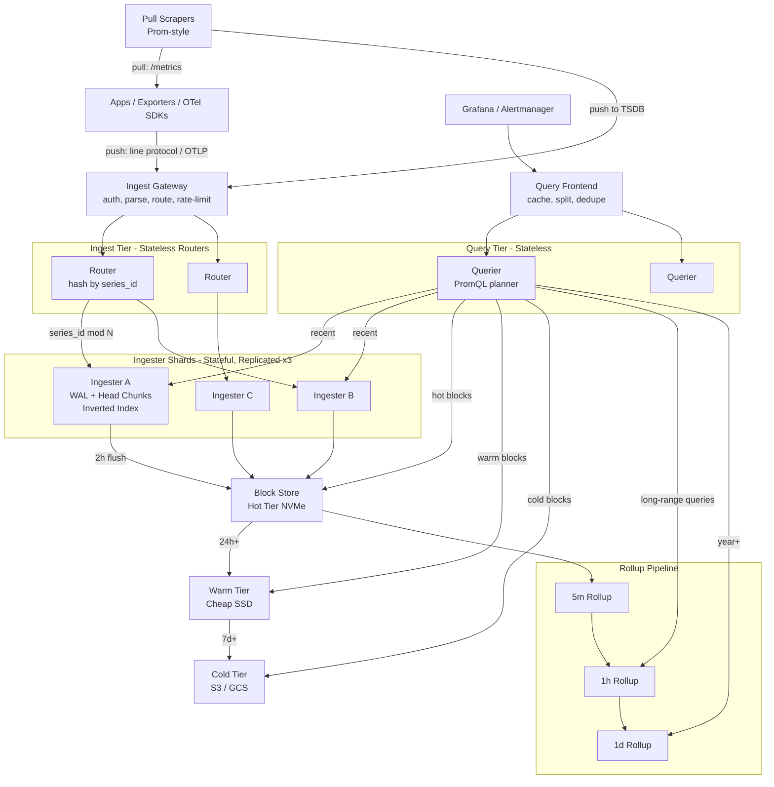

# Design a Time-Series Database — Columnar Shards, Gorilla Compression, and the Cardinality Cliff

**Date:** 2026-04-25 | **Updated:** 2026-04-25
**Tags:** `system-design` `case-study` `infrastructure` `database` `time-series` `hard`

## Table of Contents

- [Summary](#summary)
- [Functional Requirements](#functional-requirements)
- [Non-Functional Requirements](#non-functional-requirements)
- [Capacity Estimation](#capacity-estimation)
- [API Design](#api-design)
- [Data Model](#data-model)
- [High-Level Design](#high-level-design)
- [Deep Dives](#deep-dives)
  - [1. Gorilla Compression — Delta-of-Delta Timestamps + XOR Floats](#1-gorilla-compression--delta-of-delta-timestamps--xor-floats)
  - [2. Cardinality — The Killer, Not Volume](#2-cardinality--the-killer-not-volume)
  - [3. Time-Bucketed Columnar Shards — The Storage Layout](#3-time-bucketed-columnar-shards--the-storage-layout)
  - [4. Downsampling and Rollups — 1m → 5m → 1h → 1d](#4-downsampling-and-rollups--1m--5m--1h--1d)
  - [5. Range Query Optimization — Time + Tag Pushdown](#5-range-query-optimization--time--tag-pushdown)
  - [6. Hot / Warm / Cold Tiering — From NVMe to Object Storage](#6-hot--warm--cold-tiering--from-nvme-to-object-storage)
  - [7. Ingest Pipeline — Line Protocol, OTLP, and Backpressure](#7-ingest-pipeline--line-protocol-otlp-and-backpressure)
  - [8. Query DSLs — PromQL, InfluxQL, Flux](#8-query-dsls--promql-influxql-flux)
  - [9. Stream + At-Rest Dual Indexes](#9-stream--at-rest-dual-indexes)
- [Bottlenecks & Trade-offs](#bottlenecks--trade-offs)
- [Anti-Patterns](#anti-patterns)
- [Related](#related)
- [References](#references)

## Summary

A time-series database (TSDB) looks deceptively simple: append `(metric, tags, timestamp, value)` tuples and let people graph them. The hard part is that "metric" is wrong as the unit of work. The actual unit is the **series** — a unique combination of metric name plus the full set of tag key/value pairs. A single application emitting `http_requests_total{method, status, handler, pod, region}` can produce hundreds of thousands of series the moment its tag space spans a real Kubernetes cluster. Storage, indexing, and query planning all break differently depending on how many series you have, not how many points.

The reference design here borrows from three lineages:

1. **Prometheus / VictoriaMetrics** — pull-based ingestion, PromQL, in-memory inverted index keyed on `(label, value) → posting list of series IDs`, time-bucketed blocks on disk.
2. **InfluxDB** — push-based line protocol, TSI (time series index) with mmap'd inverted indexes per shard, columnar TSM files with per-column compression.
3. **TimescaleDB** — PostgreSQL extension; "hypertables" auto-partitioned by time into "chunks", continuous aggregates for downsampling, standard SQL.

Two non-negotiable invariants drive every decision:

1. **Writes are append-only and almost always at the tail.** Random updates to old data are vanishingly rare. The storage engine should optimize for ingestion-time sorted writes and read-time range scans, not for in-place mutation.
2. **Reads are range scans, not point lookups.** Nobody queries "the value at 13:42:07.123Z." They query "the p99 of `http_request_duration` over the last 6 hours, grouped by `route`." The engine must be optimized for sequential scans over millions of points per series, with aggressive predicate pushdown so the bytes you read are mostly the bytes you return.

Everything else — Gorilla compression, cardinality budgets, downsampling, hot/warm/cold tiering — is downstream of those two invariants.

## Functional Requirements

| Requirement | Notes |
|---|---|
| **`write(series, timestamp, value)`** | Append a point. Series identified by metric name + tag set. Timestamps are unix nanos. Values are typically `float64`; some systems also support integer counters and strings. |
| **`query(promql_or_sql, start, end, step)`** | Range query: return one or more series of `(timestamp, value)` pairs over a time window, with optional aggregation and grouping. |
| **`instant_query(promql, at)`** | "Value of expression at this instant" — used for alerting evaluation. Resolves to a single sample per series. |
| **Aggregation primitives** | `rate`, `irate`, `increase`, `sum`, `avg`, `quantile`, `histogram_quantile`, `topk`, `bottomk`. Most are computable streaming on a sorted series. |
| **Downsampling / rollups** | Materialized views: 1-minute raw → 5-minute → 1-hour → 1-day, each with `min`, `max`, `sum`, `count`, `last`. Older tiers auto-redirect to lower-resolution rollups. |
| **Retention policies** | Per-tier TTL: keep raw 7 days, 5m for 30 days, 1h for 1 year, 1d forever. After TTL, blocks are unlinked and disk reclaimed. |
| **Tag value enumeration** | `series(match)`, `label_values(label)` — needed by dashboards and autocompletion. |
| **Cardinality limits** | Reject writes that would explode a series-per-metric or per-tenant budget; surface the offending tag. |

Out of scope for this design:

- Strong-consistency multi-row transactions (Prometheus, Influx, and VictoriaMetrics all pick AP).
- Arbitrary joins across tenants — possible in TimescaleDB because it is Postgres, but not part of the core TSDB shape.
- High-write **updates** to historical points beyond a small backfill window (typically 1–2 hours).

## Non-Functional Requirements

| NFR | Target |
|---|---|
| **Write throughput** | 10M points/sec aggregated across the cluster sustained, with ingest p99 < 100 ms |
| **Query p99 (recent, single-series)** | < 50 ms for 1-hour range, p99 < 500 ms for 24-hour range |
| **Query p99 (range, many series)** | < 2 s for `sum by (region) (rate(...[5m]))` over 1k-series, 6-hour range |
| **Compression ratio** | Target ~1.4 bytes per point on disk for `float64` values (Gorilla benchmark) |
| **Cardinality ceiling** | 10M active series per tenant, 100M cluster-wide; reject before OOM |
| **Retention cost** | Cold tier on object storage at < 5% of NVMe per-byte cost |
| **Backfill window** | Accept out-of-order writes within 1 hour of `now`; reject older silently or via separate API |
| **Multi-tenancy** | Per-tenant ingest, query, and cardinality quotas; isolated index shards |
| **Availability** | 99.9% for writes; 99.95% for queries; can tolerate 1 replica down without data loss |

The framing line: **the TSDB is a write-optimized append-only column store that pretends to be a database.** It is good at scans and bad at random access. Trying to use it as a transactional store is a category error.

## Capacity Estimation

### Workload baseline

- **Active series:** 10M per tenant (typical large Kubernetes deployment), 100M cluster-wide.
- **Scrape interval:** 15 s (Prometheus default). Each series produces 4 points/min, ~5,760 points/day.
- **Ingest rate:** 100M series × 1 point / 15 s = ~6.67M points/sec; budget for 10M points/sec to absorb bursts.
- **Daily raw points:** 10M points/sec × 86,400 s = ~864B points/day.

### Storage math

| Layer | Bytes/point | Daily volume | 7-day retention |
|---|---|---|---|
| Uncompressed `(ts:8, val:8)` | 16 B | ~14 TB/day | 98 TB |
| Gorilla-compressed | ~1.4 B | ~1.2 TB/day | ~8.5 TB |
| 5-min rollup (5 aggregates × ~1.4 B) | ~0.5 B/raw point | ~0.4 TB/day | 12 TB / 30d |
| 1-hour rollup | ~0.1 B/raw point | ~0.08 TB/day | 30 TB / 1y |
| 1-day rollup | ~0.005 B/raw point | ~0.004 TB/day | indefinite |

Gorilla's published ratio is ~1.37 bytes/point on Facebook production data; assume 1.4 B/point as a planning number and check empirically. Time-series data from infra metrics compresses extraordinarily well because consecutive points are often nearly identical.

### Index sizing

- Inverted index entry: `(label_name, label_value) → posting_list[series_id]`.
- Average label value cardinality for non-pathological tags (e.g., `method`, `status`, `region`): 3–50.
- Pathological tag (e.g., `request_id`, `user_id`): unbounded — see [cardinality](#2-cardinality--the-killer-not-volume).
- Index size at 10M series: ~2–5 GB resident, mmap'd; this fits comfortably in modern node RAM.

### Per-node footprint

- **Hot ingester:** 64 vCPU, 256 GB RAM, 4 TB local NVMe. Holds active in-memory chunks plus 24 h of on-disk blocks. Sustains ~500K points/sec ingest.
- **Storage / query node:** 32 vCPU, 128 GB RAM, 8 TB NVMe. Serves recent queries; warm tier on local SSD.
- **Cold tier:** S3-compatible object storage. ~$0.023/GB-month vs ~$0.10–0.20/GB-month for provisioned NVMe — roughly an order of magnitude cheaper.

These numbers determine the rest of the design: the chunk size (2 hours is the Prometheus default), the index granularity, the rollup cadence, and the eviction policies.

## API Design

### Write — Influx Line Protocol

```text
http_requests_total,method=GET,status=200,region=us-east-1 value=42i 1714039862812000000
http_request_duration_seconds,method=GET,handler=/api,quantile=0.99 value=0.218 1714039862812000000
```

Format: `measurement,tag1=v1,tag2=v2 field1=val1,field2=val2 timestamp_ns`.

```http
POST /api/v2/write?org=acme&bucket=metrics&precision=ns
Authorization: Token <api_token>
Content-Type: text/plain

http_requests_total,method=GET,status=200 value=42i 1714039862812000000
http_requests_total,method=GET,status=500 value=3i  1714039862812000000

204 No Content
```

### Write — OTLP Metrics

OpenTelemetry Protocol over gRPC or HTTP/protobuf. Same logical shape as line protocol — a metric name, a set of attributes (tags), a timestamp, and a value — but with first-class support for histograms, exponential histograms, and sum/gauge/summary types.

```http
POST /v1/metrics
Content-Type: application/x-protobuf

<ExportMetricsServiceRequest>
```

### Query — PromQL

```http
GET /api/v1/query_range?
    query=sum by (region) (rate(http_requests_total{status=~"5.."}[5m]))
   &start=1714039200&end=1714042800&step=15

200 OK
{
  "status": "success",
  "data": {
    "resultType": "matrix",
    "result": [
      {"metric": {"region": "us-east-1"}, "values": [[1714039200, "12.3"], ...]},
      {"metric": {"region": "eu-west-1"}, "values": [[1714039200, "4.7"], ...]}
    ]
  }
}
```

Two query endpoints worth distinguishing:

- **`/query_range`** — returns a matrix `[series][time]`; this is what dashboards call.
- **`/query`** (instant) — returns a single value per series at one timestamp; this is what the alerting evaluator calls every 15 s.

### Series enumeration

```http
GET /api/v1/series?match[]=http_requests_total{region="us-east-1"}&start=...&end=...
GET /api/v1/label/region/values
```

Used by dashboards for autocomplete and the Grafana variable system. Implementation hits the inverted index without touching the time-bucketed data files.

## Data Model

A **series** is the atomic unit of organization:

```text
series_id := hash(metric_name, sorted_tags)
series    := {
  id:       uint64,           // stable hash for a given (metric, tag set)
  metric:   string,           // "http_requests_total"
  tags:     map<string, string>, // {"method": "GET", "status": "200", ...}
  points:   sequence<(ts, val)>,
}
```

### Internal record

```text
Point:
  series_id:  uint64
  timestamp:  int64    // unix nanos
  value:      float64  // or int64 for counters

Chunk (in-memory):
  series_id:  uint64
  start_ts:   int64
  end_ts:     int64
  ts_stream:  bytes    // delta-of-delta encoded
  val_stream: bytes    // Gorilla XOR-encoded
  count:      uint32
```

### On-disk block (Prometheus shape)

```text
block_<ulid>/
├── meta.json          # block metadata: time range, stats, version
├── chunks/
│   └── 000001         # raw compressed chunk file
├── index              # postings + label index + symbol table
└── tombstones         # soft-deleted series ranges
```

Each block covers a fixed time window (Prometheus uses 2 hours for the head, then compacts up to 2-day blocks). The block is **immutable** once flushed. Compaction merges adjacent blocks and re-encodes chunks for higher compression.

### Time-bucketed shards

```text
shard_assignment(series, ts) :
  time_bucket = floor(ts / SHARD_DURATION)        // e.g., 2-hour buckets
  series_partition = hash(series_id) mod NUM_PARTITIONS
  return (time_bucket, series_partition)
```

The two-dimensional partitioning is critical: time gives natural retention granularity (drop a whole bucket when its TTL expires), and series-hash gives even spread of write load across the cluster.

## High-Level Design



### Write path

1. Client emits line protocol or OTLP. Gateway authenticates the tenant, parses, and applies rate limits.
2. Router computes `series_id = hash(metric, sorted_tags)` and dispatches to the responsible ingester replica set (3 replicas via consistent hashing on `series_id`).
3. Each ingester:
   - Appends `(series_id, ts, val)` to its **WAL** for durability.
   - Updates the **head chunk** for the series — the in-memory append target. Adds to the inverted index if this `(label, value)` pair is new.
   - Acks back to the router; quorum (2 of 3) is enough.
4. Every 2 hours (configurable), the head is **flushed**: chunks are encoded with Gorilla, the inverted index is serialized, and a new immutable block lands on local NVMe. WAL segments older than the flushed head are truncated.
5. A separate **compactor** merges blocks (e.g., 2 h × 12 → 1 d), recomputes the inverted index, drops tombstoned series, and uploads to warm/cold tiers when the retention boundary is crossed.

### Read path

1. Grafana sends `query_range` to the **query frontend**. Frontend splits the time range across day boundaries, hits the cache for already-computed panels, and forwards uncached subqueries.
2. Querier parses PromQL, walks the AST, and computes the **set of series** to read by intersecting posting lists from the inverted index for each label matcher.
3. Querier locates the time-bucketed blocks across hot / warm / cold tiers based on the time range. For "now ± a few hours" it asks the live ingesters; for older data it pulls from block store; for year-old data it asks the rollup tier (1h or 1d resolution) instead of the raw blocks.
4. For each series, querier scans chunks, decompresses, applies the aggregation operator (e.g., `rate(...[5m])`), and streams partial results upward.
5. Querier merges results across series, applies the outer aggregator (`sum by (region)`), and returns the matrix to the frontend.

The split between **ingester** (recent, mutable head) and **block store** (older, immutable, fully indexed) is the single most important split in the architecture. The ingester is optimized for high-throughput appends; the block store is optimized for sealed columnar scans.

## Deep Dives

### 1. Gorilla Compression — Delta-of-Delta Timestamps + XOR Floats

Time-series data has two columns that compress very well when treated as columns instead of rows: the timestamp stream and the value stream. The Gorilla paper from Facebook (2015) describes the canonical scheme, and it has become the de facto baseline.

**Timestamps — delta-of-delta:**

For a series scraped every 15 s, the deltas between consecutive timestamps are nearly identical. Encoding the *delta of the delta* — i.e., the change in inter-sample interval — produces mostly zeros.

```text
raw timestamps:   1714039200, 1714039215, 1714039230, 1714039246, 1714039260
deltas (Δt):                  15s,        15s,        16s,        14s
delta-of-deltas (ΔΔt):                    0,          +1,         -2
```

Each `ΔΔt` is variable-length encoded:

| Range | Encoding | Bits |
|---|---|---|
| 0 | `0` | 1 |
| [-63, 64] | `10` + 7 bits | 9 |
| [-255, 256] | `110` + 9 bits | 12 |
| [-2047, 2048] | `1110` + 12 bits | 16 |
| else | `1111` + 32 bits | 36 |

For a regular 15 s scrape, the dominant encoding is the `0` bit per sample. ~1 bit per timestamp.

**Values — XOR encoding:**

Two consecutive `float64` values in a metric stream are usually very close — often identical or differing in the low bits. XOR-ing them reveals long stretches of leading and trailing zero bits. Gorilla encodes:

- `0` bit if `value == previous` (same value): **1 bit total**.
- `10` + meaningful bits if the XOR fits within the *previous* meaningful-bit window.
- `11` + (5 bits leading-zero count) + (6 bits length) + meaningful bits otherwise.

For monitoring data — CPU utilization that drifts, request counts that increment slowly — this is wildly effective. Facebook reported ~1.37 bytes/point including timestamps for typical infra series.

**Why this works for TSDBs and not general data:** Gorilla assumes ordered ingestion (one-pass streaming encoder), random access requires decoding from chunk start (chunks kept small at ~120 points), and the format is append-only — you cannot patch a value in-place. This is fine for TSDB where overwrite is rare. For OLTP, it would be a disaster. See the [Gorilla paper](https://www.vldb.org/pvldb/vol8/p1816-teller.pdf) for the original treatment.

### 2. Cardinality — The Killer, Not Volume

The first time a TSDB engineer says "10M points/sec," the second thing they say is "but the cardinality." Volume is linear and predictable; cardinality is the load-bearing constraint that determines whether the system stays up.

**What cardinality is:**

The number of *unique series* — unique `(metric_name, tag_set)` combinations — currently being written. Each series has its own in-memory head chunk, its own posting list entry, its own inverted-index footprint, and its own block-store overhead.

**Why high cardinality is fatal:**

- **Memory.** Each active series consumes ~3 KB of head-chunk overhead plus index entries. 10M series ≈ 30 GB resident — fine. 100M series ≈ 300 GB — your ingester OOMs.
- **Index bloat.** The inverted index `(label, value) → posting list` grows superlinearly with cardinality. A label with 10M distinct values means a 10M-entry posting list to walk for any query that filters by it.
- **Query planner failure.** PromQL `sum by (label)` with high-cardinality `label` produces millions of output series. The querier's working set explodes.
- **Compaction and rollups become non-linear.** Each tier-up has to enumerate all series.

**Where the explosion comes from:**

The classic offenders are tags whose values are unbounded:

- `request_id` — one per HTTP request. Catastrophic.
- `user_id` — bounded by user count, but a tag at 1M+ users is still a problem.
- `pod_name` in Kubernetes — pod names with hashes change on every deploy. Unless trimmed, your cardinality grows on every rollout.
- `query_string` or `path` with raw unparameterized URLs — `/api/users/12345/orders/67890` produces a unique tag value per call.

**Cardinality budgets (the operational answer):**

- **Per-tenant cap.** Reject writes when active series for a tenant exceeds the budget. Surface which tag is to blame:
  ```text
  err: tenant 'acme' would exceed series limit (10,000,000) by adding label 'user_id' with new value 'u_1729384'
  ```
- **Per-metric cap.** A single metric should not have more than, say, 100K series. If it does, the developer is using the wrong tool.
- **Slow-burn detection.** Alert when *new* series creation rate is sustained — a healthy app's cardinality is stable; a leak is growth.

**Code-level mitigations:** Strip high-cardinality labels at the SDK boundary (OpenTelemetry views support attribute filtering). Replace per-request IDs with sampled traces — see [distributed tracing, metrics, logs](../../performance-observability/distributed-tracing-metrics-logs.md). Bound paths via templates (`/api/users/:id`, not raw URLs). VictoriaMetrics, Prometheus, and Mimir all publish per-tenant cardinality limits as a first-class operational concept — the primary defensive boundary, not a niche knob.

### 3. Time-Bucketed Columnar Shards — The Storage Layout

The on-disk layout follows three principles, in priority order:

1. **Time first, series second.** Within a fixed time window, all series live in the same physical block. This makes "drop everything older than 30 days" an O(1) directory unlink, not a full table scan.
2. **Columnar within a block.** Timestamps, values, and labels are stored in separate streams, each compressed appropriately. A query that touches only timestamps + values doesn't pay for label decompression.
3. **Immutable blocks.** Once a block is sealed, it never changes. Compaction merges blocks into bigger blocks but never edits in place.

```text
block_01HXYZ.../
├── meta.json
│   { "ulid": "01HXYZ...",
│     "minTime": 1714039200000,
│     "maxTime": 1714046400000,
│     "stats": { "numSamples": 4837219, "numSeries": 92341 } }
├── chunks/
│   └── 000001  # binary, gorilla-encoded chunks, ~120 samples each
├── index
│   ├── symbol table          # interned label names + values
│   ├── series                # series_id -> (chunk refs, label refs)
│   ├── postings              # (label, value) -> sorted series_id list
│   └── label_index           # label -> sorted distinct values
└── tombstones                # soft-deleted ranges; resolved at compaction
```

**Block lifecycle:** Head (in-memory, ~2h, WAL-persisted) → L0 block on flush (NVMe, ~2h) → L1 after merging 3× L0 (~6h) → L2 after merging 4× L1 (~24h) → demoted to warm/cold tiers as retention boundaries cross. The 2-hour-then-compact pattern is the LSM trick applied to time-series. Compaction improves compression (more samples per chunk → better delta-of-delta) and reduces file count (fewer blocks → fewer index lookups per query).

### 4. Downsampling and Rollups — 1m → 5m → 1h → 1d

Raw points at 15 s resolution are wonderful for last-hour queries but ruinous for last-year queries. Rendering a year's worth of data at 15 s resolution is 2.1M points per series — Grafana cannot render it, and the querier cannot scan it within a budget. The fix is **downsampling**: precompute lower-resolution rollups and serve them when the query window is large.

**Rollup structure:**

For each (series, lower-resolution interval), emit a record with multiple aggregates:

```text
rollup_5m{series_id, bucket_start}:
  count:  uint32
  sum:    float64
  min:    float64
  max:    float64
  last:   float64    // for gauges
  first:  float64    // optional, for delta math
```

The 5 aggregates suffice for the dominant aggregation operators:

- `avg(metric)` over a window → `sum / count` from the rollup.
- `rate(counter[5m])` → `(last - first) / interval` from the rollup; correct for monotonic counters across resets if `first` is the post-reset value.
- `min`/`max` directly available.
- `quantile` is **not** computable from min/max/sum alone — needs t-digest or DDSketch (see below).

**Cascaded rollup pipeline:**

```text
raw 15s  --(every 5m)-->  5m rollup  --(every 1h)-->  1h rollup  --(every 1d)-->  1d rollup
                                                                  ↓
                                                              indefinite retention
```

Each level computes from the level below it, *not* from raw — once 5m is sealed, the 1h job needs only 12 records per series. This makes the rollup job's cost scale with rolled-up cardinality, not raw point count.

**Quantile rollups — t-digest / DDSketch:**

Pre-aggregating a quantile (`p99 of the last 5m`) is genuinely hard because quantiles don't compose. Storing only the p99 in each 5m bucket gives you "the average of p99s," which is a different statistic from "the p99 of the merged buckets."

Two approaches: **t-digest** maintains a mergeable sketch per bucket (~100 centroids, ~1 KB) supporting any quantile query. **DDSketch** offers relative-error-bounded mergeable buckets (used by Datadog) with stronger error guarantees at slightly higher storage cost. The trade-off: a 1 KB sketch per (series, 5m bucket) is much more expensive than 5 floats — but it is the only honest way to support `histogram_quantile` over arbitrary windows.

**Continuous aggregates (TimescaleDB):** declare a continuous aggregate as a view; the engine maintains it incrementally as new data arrives, and queries against the view automatically use the materialization. Same conceptual machinery, SQL surface area.

**Retention by tier:**

| Tier | Resolution | Default retention |
|---|---|---|
| raw | 15 s | 7 days |
| 5m rollup | 5 min | 30 days |
| 1h rollup | 1 hour | 1 year |
| 1d rollup | 1 day | indefinite |

Queries that span tiers transparently switch resolution at the boundary. A 1-year query is answered at 1h resolution; the user sees 8,760 points per series, not 2.1M.

### 5. Range Query Optimization — Time + Tag Pushdown

A PromQL query like `sum by (region) (rate(http_requests_total{status=~"5.."}[5m]))` over a 6-hour window is genuinely hard. Done naively, the engine touches every block in the window, decodes every series, filters, then aggregates. Done well, it touches only the necessary blocks, decodes only the matching series, and streams aggregates without materializing intermediate matrices.

**Two pushdown levers:**

1. **Time pushdown.** The query's `[start, end]` window directly maps to a range of time-bucketed blocks. Blocks outside the window are skipped without opening their indexes.
2. **Tag pushdown.** Within an in-window block, the inverted index turns `{status=~"5.."}` into a posting-list intersection. Only series matching the predicate are decoded.

```text
plan(query, [start, end]):
  blocks = block_store.list_overlapping([start, end])
  candidate_series = inverted_index.match(query.label_matchers, blocks)

  for each block in blocks:
    for each series_id in candidate_series ∩ block.series_set:
      chunks = block.chunks_for(series_id, [start, end])
      for chunk in chunks:
        emit decoded_points
```

**Streaming aggregation:**

For `rate(...[5m])` and `sum by (region)`, the engine processes points in a streaming fold rather than materializing the full matrix:

```text
state = empty grouped accumulator
for each (series, point) in scan_order:
    group_key = project(series.tags, ["region"])
    state[group_key].update(point)
return state.finalize()
```

Memory grows with the *output* cardinality (number of regions), not the *input* cardinality (number of series). This is essential for `sum`, `avg`, `min`, `max`, `count`. It does *not* work for `topk` or `histogram_quantile`, which need the full set in memory.

**Predicate inversion:** Negative matchers (`status!="200"`) are awkward — the inverted index makes positive matches cheap but negation requires either iterating all series and excluding matches, or maintaining "all series" as a posting list and subtracting. VictoriaMetrics builds the "all series" posting list lazily.

**Caching the cheap parts:** The query frontend caches *deterministic per-step results* — `rate(...)[5m]` at a given timestamp is the same regardless of when you ask, modulo late writes. Per-step caching makes dashboards with overlapping panels nearly free after the first user.

### 6. Hot / Warm / Cold Tiering — From NVMe to Object Storage

The cost ratio between local NVMe and object storage is roughly 10×. Time-series data has the perfect access pattern to exploit it: recency dominates. 95% of queries hit the last 24 hours; the long tail of "what was CPU like 9 months ago" is rare and tolerant of extra latency.

**Three-tier shape:**

| Tier | Storage | Access latency | Typical retention |
|---|---|---|---|
| **Hot** | Local NVMe in ingesters / queriers | ~50 µs random read | 0–24 h |
| **Warm** | Networked SSD (EBS, Persistent Disk) | ~1 ms random read | 24 h – 7 d |
| **Cold** | S3 / GCS / R2 object storage | ~50 ms first byte, ~100 MB/s sustained | 7 d – retention |

**Demotion lifecycle:**

```text
at compaction:
  if block.maxTime < now - HOT_TTL:
    upload(block, warm_tier)
    schedule_local_delete(block, after=GRACE)

at warm-tier compactor:
  if block.maxTime < now - WARM_TTL:
    upload(block, cold_tier)
    delete_from_warm(block)
```

**Cold block format:** Pack many small blocks into one large object (S3 charges per request; many tiny GETs are expensive), with a per-object index pointing at offsets. Mimir's "boltdb-shipper" uses this pattern; Thanos's "store gateway" mmaps remote object indexes locally.

**Querying cold:** The querier issues range-byte GETs against object storage. ~50–100 ms latency per cold block; year-long queries fan out aggressively (100s of parallel range reads, partial results streamed). A querier-side LRU disk cache absorbs repeat queries.

**Why retention is per-tier:** Raw 7d / 5m 30d / 1h 1y / 1d ∞ maps naturally onto hot/warm/cold. Raw lives only in hot; 5m rollups in warm; 1h and 1d rollups in cold.

### 7. Ingest Pipeline — Line Protocol, OTLP, and Backpressure

Ingest is the unglamorous part that breaks first under load. The pipeline must survive bursts, reject pathological writes politely, and preserve durability before acking.

**Two ingestion modes:**

1. **Push (Influx, OTLP).** Apps emit metrics to the TSDB directly. Latency is low; backpressure must propagate to the producer somehow.
2. **Pull (Prometheus).** TSDB-side scrapers fetch `/metrics` from each target on a schedule. Backpressure is implicit — slow targets get scraped slower.

The reference design accepts both. OTLP and line protocol arrive at the same gateway; Prometheus-style scraping is a separate mode that runs *as part of the ingester* (each ingester is assigned a sharded set of targets to scrape).

**Pipeline stages:**

```text
parse → validate → enrich → route → WAL → head append → ack
```

- **Parse.** Tokenize line protocol or decode OTLP protobuf. Reject malformed input early with a clear error.
- **Validate.** Check tag count, label name format, value precision. Apply per-tenant cardinality budget — see [§2](#2-cardinality--the-killer-not-volume).
- **Enrich.** Add tenant ID, ingestion timestamp, source label.
- **Route.** Hash `series_id` to determine the responsible shard's replica set.
- **WAL.** Append `(tenant, series_id, ts, val)` to the per-shard write-ahead log; fsync at batch granularity (every ~10 ms or 1000 entries, whichever comes first). Group commit amortizes fsync cost.
- **Head append.** Update the in-memory chunk and inverted index. This is the only step that touches mutable state.
- **Ack.** Quorum (2 of 3) is enough; the third replica catches up async.

**Backpressure:** Slow WAL fsync raises gateway latency; surface 429s and let push clients back off (OTLP SDKs do this). For pull mode, scraping naturally slows. If head exceeds RAM thresholds, force early flush and 503 new writes — router routes around the unhealthy replica.

**Out-of-order writes:** In-order is the happy path. Two backfill strategies: drop out-of-order samples (Prometheus-classic, simple but lossy), or maintain a separate out-of-order head that accepts samples within a configurable window (e.g., 10 minutes; newer Prometheus, Mimir) and merges at flush time via special compaction. Either way the OOO window has a hard ceiling — week-long backfills need a bulk-import API that bypasses live ingest.

### 8. Query DSLs — PromQL, InfluxQL, Flux

The query language shapes the engine more than people expect. Three families with very different design points:

**PromQL** (Prometheus, Mimir, VictoriaMetrics):

- Functional, expression-oriented. `sum by (region) (rate(http_requests_total{status=~"5.."}[5m]))`.
- Two value types: **instant vector** (one value per series at a timestamp) and **range vector** (a small window of values per series).
- Operators are mostly elementwise across series; aggregators reduce series by label grouping.
- Designed around alerting evaluation: every expression returns a vector that an alerting rule can threshold.
- No joins beyond label-matching `vector1 + on(label) vector2`.

**InfluxQL / Flux** (InfluxDB):

- InfluxQL is SQL-shaped: `SELECT mean("value") FROM "cpu" WHERE time > now() - 1h GROUP BY time(5m)`.
- Flux is a pipe-based functional language: `from(bucket: "...") |> range(start: -1h) |> filter(...) |> aggregateWindow(every: 5m, fn: mean)`.
- Flux supports joins, pivots, and arbitrary user-defined functions. Strictly more expressive than PromQL.
- Flux can read from non-time-series sources (SQL DBs, CSV) — turning Influx into a small ETL platform.

**SQL** (TimescaleDB):

- It is just Postgres with hypertables. Window functions, joins, CTEs, the works.
- `SELECT time_bucket('5 minutes', time) AS bucket, region, AVG(value) FROM cpu WHERE time > now() - interval '1 hour' GROUP BY bucket, region`.
- Wins on familiarity and ad-hoc analytics; loses on per-second rollup math that PromQL handles natively.

**Engine implications:** PromQL's range-vector semantics force sliding-window `rate(..[5m])` computations — vectorized by buffering one chunk at a time. Flux's joins and pivots demand a true cost-based query planner; pure PromQL engines don't. TimescaleDB inherits the Postgres planner with a hypertable-aware extension. The reference design exposes PromQL as primary (de facto standard, integrates with Grafana, Alertmanager, and the k8s observability stack). InfluxQL or Flux can be added as adapters translating to the internal logical plan.

### 9. Stream + At-Rest Dual Indexes

The inverted index has two distinct modes: the live index inside the ingester (frequently mutated) and the sealed index inside an immutable block (read-only, mmap'd). They have very different requirements.

**Stream index (in-memory, mutable):**

- New series arrive constantly. Insertion must be O(log N) or amortized O(1).
- Implementation: per-label hash map → posting-list bitmap (Roaring bitmap for compactness).
- Snapshot to WAL for crash recovery.

```text
stream_index :=
  Map<label_name,
      Map<label_value,
          RoaringBitmap<series_id>>>

on write(series_id, tags):
    for (k, v) in tags:
        stream_index[k][v].add(series_id)
```

**At-rest index (sealed, read-only):**

- Built once at block flush time, never modified.
- Implementation: sorted file with a symbol table for label/value interning, then a packed posting-list section.
- mmap'd into the querier process; OS page cache handles working-set residency.

```text
at_rest_index file:
  ┌────────────────────────────────────┐
  │ symbol table  (label/value -> id)  │
  ├────────────────────────────────────┤
  │ series        (series_id -> chunks)│
  ├────────────────────────────────────┤
  │ postings      ((l,v) -> [sid...])  │
  ├────────────────────────────────────┤
  │ label_index   (l -> [v...])        │
  └────────────────────────────────────┘
```

**Why two implementations:** The stream index optimizes for cheap inserts, accepting memory overhead. The at-rest index optimizes for query-time scans — sorted posting lists allow O(min(A, B)) intersection via galloping merge.

**Symbol-table compression:** Labels and values are interned per block; posting lists reference them by 32-bit IDs. 5–10× compression for label-heavy data — `region=us-east-1` (15 bytes raw) becomes 4 bytes per occurrence.

**Cross-block query:** Series IDs are block-local (different blocks may assign different IDs to the same logical series). The querier resolves label matchers per block → block-local series IDs → looks up global series identity by tag-hash → merges chunks across blocks per global series. This is the single biggest source of read-path complexity. VictoriaMetrics avoids it with global series IDs at the cost of a global ID-allocation service; Prometheus's per-block IDs are simpler operationally but pay the cross-block merge cost.

## Bottlenecks & Trade-offs

| Component | Bottleneck | Mitigation |
|---|---|---|
| Ingester WAL fsync | Single-disk fsync gates per-shard write throughput | Group commit; co-locate WAL on NVMe; per-tenant shard sharding |
| Active series limit per ingester | RAM fills with head chunks at high cardinality | Cardinality budgets; horizontal scale by series-hash sharding; reject before OOM |
| Block compaction I/O | Heavy disk read+write while merging blocks | Throttle compaction at peak; tier compaction so each level merges few inputs |
| Inverted index rebuild | At flush, sealing the block index burns CPU and memory | Precompute index incrementally during the head's lifetime |
| Cold-tier query latency | First-byte 50 ms × thousands of blocks for long queries | Aggressive parallel range-GETs; querier-side disk LRU; pack many small blocks per object |
| Rollup pipeline lag | Rollup falls behind raw ingest under bursts | Rate-limit rollup or run with higher parallelism; fall back to "raw at 1h resolution" until rollup catches up |
| Quantile rollups | t-digest sketches are 100× larger than scalar rollups | Per-tenant config — accept the cost when needed; otherwise approximate from min/max |
| PromQL `topk` over many series | All series materialized in memory; OOM on cardinality blow-up | Per-query memory limit; reject queries that exceed; suggest `max_over_time` rewrites |
| Multi-tenant noisy neighbour | One tenant's bad query starves others | Per-tenant query queue; CPU and memory cgroups; rate-limit `series` enumeration calls |
| Out-of-order tail | Backfills past the OOO window are silently dropped | Separate bulk-import API; reject with explicit error rather than silent drop |
| Block-local series IDs | Cross-block merges cost extra resolution lookups | Global series IDs (VictoriaMetrics-style) at the cost of a global allocator; or accept the cost (Prometheus) |
| Replication divergence | Three replicas drift on out-of-order writes | Periodic block-level checksum exchange; deterministic merge on flush |

The headline trade-off is **cardinality vs flexibility**. Allowing arbitrary tags is what makes the system expressive; rejecting high-cardinality tags is what keeps it alive. Every other knob — compression, tiering, rollups — buys time for the cardinality budget to hold.

## Anti-Patterns

1. **Treating `request_id` as a tag.** Every request creates a new series. Cardinality explodes within hours. Use tracing for per-request data; use metrics for aggregates.
2. **Storing logs as a metric.** Free-form text values, often unique per event, instantly blow cardinality. Logs go to a log store, not a TSDB.
3. **One enormous metric instead of many.** A single metric `app_event{event_type=...}` with 50 distinct event types and 10 dimensions per type is harder to query and harder to bound than 50 separate metrics.
4. **Ignoring out-of-order ceiling.** Backfilling a week of historical data via the live ingest path silently drops most of it. Use the bulk-import path or wear it.
5. **Configuring scrape interval at 1 s for everything.** Storage cost is linear in scrape rate; most metrics are fine at 15–60 s. Reserve 1 s for SLO-critical signals.
6. **Querying raw data over year-long windows.** Force the planner to use rollups; reject queries that would exceed a step-count budget against raw.
7. **Storing strings as values.** Some TSDBs allow it; the compressors are not designed for it. Use string tags instead, and a numeric value (count = 1).
8. **Per-tenant strong isolation by separate clusters.** Operationally expensive. Multi-tenant with cgroups and queues is the standard answer; full isolation is reserved for compliance-driven needs.
9. **No cardinality alerting.** Cardinality leaks have a slow burn — by the time the ingester OOMs, the bad deploy was a week ago. Alert on series-creation rate.
10. **Computing quantiles by averaging quantiles across buckets.** Mathematically wrong. Use t-digest / DDSketch or compute over raw within the window.
11. **Treating rollup resolution as fixed forever.** Workloads change. Reserve the right to recompute rollups at a different cadence; design the rollup format to be reversible.
12. **Using LWW for replication.** Time-series records have unique `(series_id, ts)` keys. Conflict is replication-of-the-same-write, not concurrent updates. Idempotent dedup, not LWW.

## Related

- [Distributed Tracing, Metrics, and Logs](../../performance-observability/distributed-tracing-metrics-logs.md) — the three pillars of observability and which signal belongs where; explains why high-cardinality data goes to traces, not metrics.
- [Monitoring, Alerting, and the RED / USE Methods](../../performance-observability/monitoring-alerting-red-use.md) — the operator-facing methodology that drives what metrics get collected at all.
- [Design a Monitoring & Alerting System](./design-monitoring-alerting.md) — the full system around the TSDB: scrapers, alert evaluator, notification routing.
- [Design a Key-Value Store](./design-key-value-store.md) — the AP/Dynamo lineage that informs the TSDB's replication and quorum choices.
- [CAP and Consistency Models](../../data-consistency/cap-and-consistency-models.md) — why TSDBs pick AP and what that means for write durability.

## References

- [Gorilla: A Fast, Scalable, In-Memory Time Series Database (Pelkonen et al., Facebook, 2015)](https://www.vldb.org/pvldb/vol8/p1816-teller.pdf) — the canonical paper. Delta-of-delta timestamps, XOR float compression, ~1.37 bytes/point. Every modern TSDB borrows from this.
- [Prometheus Documentation — Storage](https://prometheus.io/docs/prometheus/latest/storage/) — the on-disk block format, head chunks, WAL, and 2-hour compaction model used by Prometheus and inherited by Mimir, Thanos, and Cortex.
- [Prometheus Documentation — Querying (PromQL)](https://prometheus.io/docs/prometheus/latest/querying/basics/) — the query language semantics: instant vs range vectors, label matchers, aggregation operators.
- [InfluxDB Documentation — Storage Engine](https://docs.influxdata.com/influxdb/v2/reference/internals/storage-engine/) — TSM (Time-Structured Merge) files, the time-series index (TSI), and the inverted index design.
- [InfluxDB Line Protocol Reference](https://docs.influxdata.com/influxdb/v2/reference/syntax/line-protocol/) — the textual ingest format that became the de facto push-mode standard.
- [TimescaleDB Documentation — Hypertables and Continuous Aggregates](https://docs.timescale.com/use-timescale/latest/hypertables/) — time-partitioned chunks within Postgres, plus incremental materialized views for downsampling.
- [VictoriaMetrics — How VictoriaMetrics Stores Time Series Data](https://docs.victoriametrics.com/victoriametrics/) — the global-series-ID design, MetricsQL extensions to PromQL, and aggressive per-tenant cardinality limits.
- [OpenTelemetry Protocol (OTLP) Specification — Metrics](https://opentelemetry.io/docs/specs/otlp/) — the vendor-neutral push protocol that has effectively replaced bespoke ingest formats for new deployments.
- [Computing Extremely Accurate Quantiles Using t-digests (Dunning, 2019)](https://arxiv.org/abs/1902.04023) — the mergeable quantile sketch used for distributed percentile rollups.
- [Cortex / Mimir Architecture](https://grafana.com/docs/mimir/latest/references/architecture/) — Grafana's horizontally-scalable Prometheus-compatible TSDB; sharded ingesters, queriers, store-gateway over object storage, query frontend with caching.
