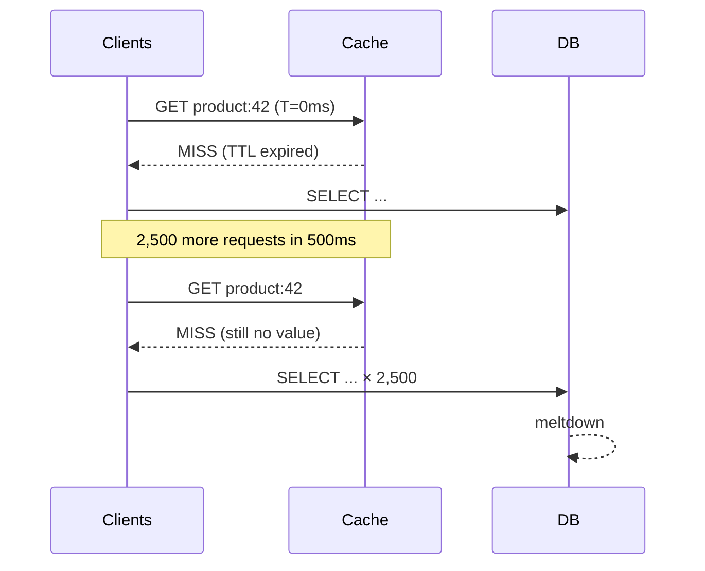
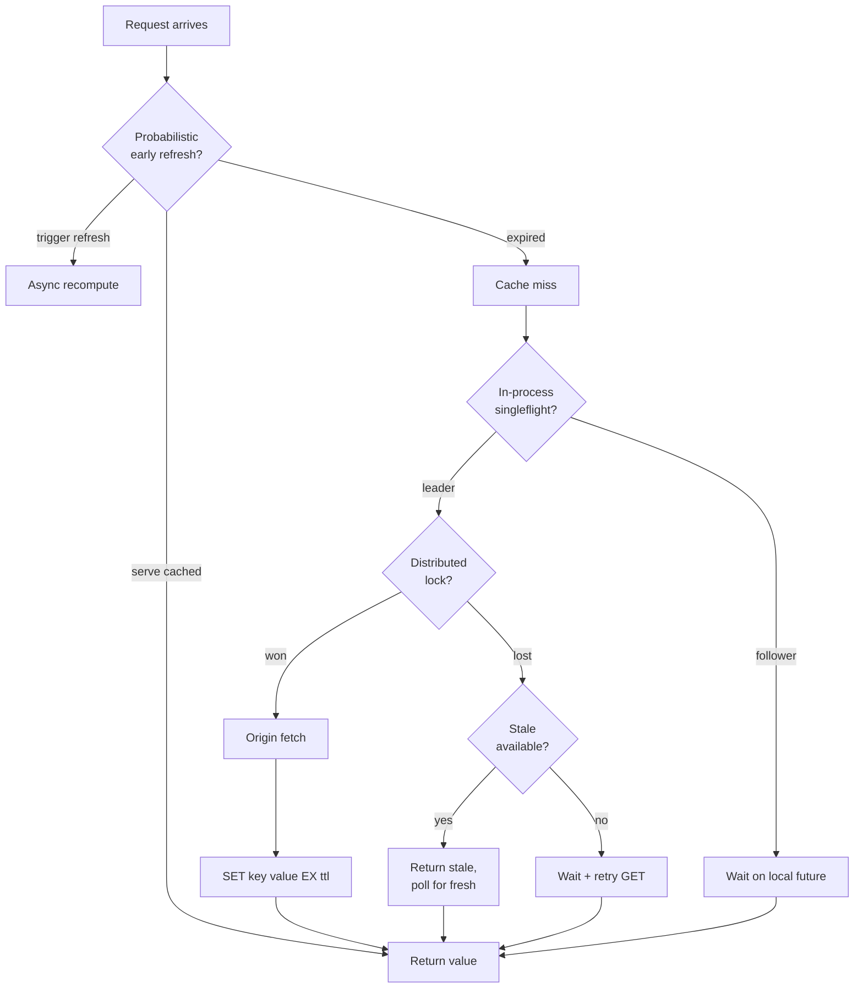

# Cache Stampede Protection — Coalescing, Distributed Locks, and Probabilistic Early Expiration

**Date:** 2026-05-01 | **Updated:** 2026-05-01
**Tags:** `system-design` `deep-dive` `caching` `concurrency` `reliability`

> **Parent case study:** [`../design-distributed-cache.md`](../design-distributed-cache.md). This is the deep-dive companion for the **Cache Stampede Protection — Coalescing, Locks, Probabilistic Early Expiration** subsection. The parent doc sketches the three-layered defense; this doc gets concrete about what a stampede actually does to a backing system, why each defense works at a different scope, the math behind probabilistic early expiration, the failure modes of each technique (especially distributed locks), and the production patterns that combine them.

## Table of Contents

- [Summary](#summary)
- [Anatomy of a Stampede](#anatomy-of-a-stampede)
  - [The Cold-Key Scenario](#the-cold-key-scenario)
  - [Why It Cascades to the Database](#why-it-cascades-to-the-database)
  - [Why It Cascades Further](#why-it-cascades-further)
- [The Defense Stack — Four Scopes](#the-defense-stack--four-scopes)
- [Layer 1 — In-Process Request Coalescing](#layer-1--in-process-request-coalescing)
  - [Singleflight in Concept](#singleflight-in-concept)
  - [Singleflight in Go](#singleflight-in-go)
  - [Promise / Future Caching](#promise--future-caching)
  - [Limits of In-Process Coalescing](#limits-of-in-process-coalescing)
- [Layer 2 — Cross-Process Distributed Locking](#layer-2--cross-process-distributed-locking)
  - [SET NX EX — The Atomic Lock](#set-nx-ex--the-atomic-lock)
  - [Lock-Recompute-Set Sequence](#lock-recompute-set-sequence)
  - [Lock Leases and Fencing Tokens](#lock-leases-and-fencing-tokens)
  - [What Losers Do — Wait, Stale, or Fail](#what-losers-do--wait-stale-or-fail)
  - [Redlock and Its Critics](#redlock-and-its-critics)
- [Layer 3 — Probabilistic Early Expiration](#layer-3--probabilistic-early-expiration)
  - [The Idea](#the-idea)
  - [Vattani's XFetch Formula](#vattanis-xfetch-formula)
  - [Tuning Beta](#tuning-beta)
  - [Why It's Provably Optimal](#why-its-provably-optimal)
- [Layer 4 — Stale Serving and Asynchronous Refresh](#layer-4--stale-serving-and-asynchronous-refresh)
  - [Stale-While-Revalidate](#stale-while-revalidate)
  - [Stale-While-Error](#stale-while-error)
  - [Refresh-Ahead](#refresh-ahead)
- [Adjacent Defenses](#adjacent-defenses)
  - [Negative Caching](#negative-caching)
  - [Bloom Filter In Front of the Cache](#bloom-filter-in-front-of-the-cache)
  - [Bulkhead and Circuit Breaker Around Origin](#bulkhead-and-circuit-breaker-around-origin)
  - [Application-Level Rate Limit on Misses](#application-level-rate-limit-on-misses)
  - [TTL Jitter](#ttl-jitter)
- [Worked Example — 10K Concurrent Cold-Key Requests](#worked-example--10k-concurrent-cold-key-requests)
- [Code — Singleflight Pattern](#code--singleflight-pattern)
- [Code — Distributed Lock with TTL and Fencing](#code--distributed-lock-with-ttl-and-fencing)
- [Code — Probabilistic Early Expiration (XFetch)](#code--probabilistic-early-expiration-xfetch)
- [Combining the Layers in Production](#combining-the-layers-in-production)
- [Anti-Patterns](#anti-patterns)
- [Related](#related)
- [References](#references)

## Summary

A **cache stampede** (also "dogpile" or "thundering herd") is the failure mode where a hot key expires or is missing, and N concurrent readers all miss simultaneously, each firing its own origin request. The database that the cache exists to protect now sees its full traffic load multiplied by the in-flight read concurrency, often hitting it harder than it could ever sustain. Production sites have been taken down by exactly this — a popular page with a 5-minute TTL generates a 5-minute-period DB spike, and once the DB falls behind, every recompute takes longer, which means more concurrent misses, which means more load. The fix is a defense stack at four scopes. **In-process coalescing** (singleflight pattern) collapses N misses on a single app instance into 1 origin call; the canonical implementation is Go's `golang.org/x/sync/singleflight`. **Cross-process distributed locks** (Redis `SET key value NX EX ttl`) collapse N misses across the entire fleet into 1 origin call per key; the lock must always have a TTL to avoid orphan locks when the recomputer crashes, and a fencing token to defeat the case where a lock-holder pauses long enough for the lock to expire and another holder to acquire it. **Probabilistic early expiration** (Vattani et al., VLDB 2015) eliminates the stampede synchronization point entirely by having each client independently and randomly decide to recompute *before* expiry, weighted by recompute cost — most clients see the cached value, one early-bird recomputes, and the entry never appears expired. **Stale serving with async refresh** (`stale-while-revalidate`, refresh-ahead) returns the old value immediately while a background job refreshes, eliminating user-facing latency on miss. Combine the layers: probabilistic early expiration first (no stampede ever forms), distributed locking as a backstop (when one does form, only one recompute per key per fleet), in-process coalescing as a third backstop (per-app deduplication), and stale-while-revalidate plus negative caching to shape the failure modes. Add a Bloom filter in front for non-existent keys, a bulkhead and circuit breaker around the origin so a slow DB cannot drag the whole app down, and TTL jitter so synthetic populated batches do not all expire on the same wall-clock instant. The anti-patterns — `SETNX` without TTL, eager invalidation that empties whole pools, recomputing on every read, retrying tight without backoff — are individually how production sites turn a 1x DB load into 1000x.

## Anatomy of a Stampede

### The Cold-Key Scenario

A popular product detail page with a 5-minute TTL. The page is generated by an expensive query (4-table join, ~200 ms p50, ~1 s p99). Steady-state traffic is 5,000 RPS, but because the cache absorbs 99.9%+ of reads, the DB sees almost none.

At T=0 the entry expires. The next request misses, then the next. Within a 500 ms recompute window, **2,500 concurrent requests** all miss and all fire their own DB query.



Each query takes longer because the DB is now CPU- and IO-saturated. The recompute window stretches from 500 ms to 5 seconds. More clients miss in that window. The pile grows.

### Why It Cascades to the Database

The DB's read load model assumed cache absorption. A typical web service runs with a DB sized for **~0.1% of total RPS** — the misses, the writes, and the cold-key recomputes. Multiply that by 1,000× during a stampede and the connection pool fills, query queue grows, latency rises, timeouts cascade.

| Metric | Steady-state | During stampede |
|---|---|---|
| DB QPS | 5–50 | 2,000–10,000 |
| DB connections in use | 5–20 (of 100) | 100 (saturated) |
| p50 query latency | 5 ms | 500 ms |
| p99 query latency | 50 ms | timeout (30 s) |

Once the DB's connection pool is saturated, any *other* query — for an unrelated feature — also blocks. A stampede on one key cascades to a service-wide outage.

### Why It Cascades Further

The cascade does not stop at the DB. The app server's DB connection pool saturates; threads pile up waiting for a connection. The thread pool fills; new requests block at the load balancer; clients see 503s; clients retry. The retries hit the DB. This is the **feedback loop** the rest of the doc exists to break: every layer of the stack assumes the cache is doing its job; when it isn't, every layer compounds the failure.

## The Defense Stack — Four Scopes

The defenses operate at different scopes, each one orthogonal to the others. Production systems use several together.

| Scope | Defense | Reduces concurrent miss count from |
|---|---|---|
| Per-thread-group | In-process coalescing (singleflight) | N → 1 per app instance |
| Per-cluster | Distributed lock (`SET NX EX`) | N → 1 per fleet |
| Per-key-time | Probabilistic early expiration | N → 0 (no stampede ever forms) |
| Per-request | Stale-while-revalidate | N → 0 user-facing (refresh in background) |

Reading order matters. Probabilistic early expiration is the first line — it prevents the stampede from existing. Distributed locks are a backstop — if a stampede does form, only one process recomputes. In-process coalescing is the third backstop — within a process, only one recompute. Stale serving is orthogonal — it changes what the user sees, not whether a recompute happens.



## Layer 1 — In-Process Request Coalescing

### Singleflight in Concept

The simplest and cheapest defense. Within a single application process, when a thread misses on key `K`, it registers an in-flight load for `K` and starts the origin fetch. Other threads that arrive in the same window for the same `K` find the in-flight load and **wait on the same future** instead of starting their own.

When the load completes, every waiter receives the same result. One origin call, N consumers.

```text
T+0ms  Thread A: GET K  → MISS, register inflight[K] = future, start load
T+1ms  Thread B: GET K  → MISS, find inflight[K], await future
T+2ms  Thread C: GET K  → MISS, find inflight[K], await future
T+200ms Thread A: load completes → resolve future with value
T+200ms Threads B, C wake up → return value
```

The cost is a per-key in-process map keyed by `K`, with a small lock to register/lookup the future. Modern implementations use lock-striping or sharded maps to avoid contention on the registry itself.

### Singleflight in Go

The canonical reference implementation: Go's [`golang.org/x/sync/singleflight`](https://pkg.go.dev/golang.org/x/sync/singleflight). Its API is the prototype the rest of the ecosystem copies:

```go
var g singleflight.Group

value, err, shared := g.Do("key:product:42", func() (interface{}, error) {
    return loadFromDatabase("product:42")
})
// shared == true if other callers also received this value (i.e., we coalesced)
```

`Do` blocks until the function returns. Concurrent callers with the same key share the result; the function executes exactly once per key per concurrent batch. There is also `DoChan` (non-blocking, returns a channel) and `Forget` (drop the in-flight registration so subsequent calls don't reuse a stale error).

The semantics matter: a singleflight call **does not cache** the result for future calls. It only deduplicates concurrent calls. The cached value lives in the cache layer; singleflight just prevents N concurrent misses on the same key.

### Promise / Future Caching

A close cousin: instead of a separate singleflight registry plus a cache, the cache itself stores **futures**. A `cache.get(K)` returns either a resolved value or a pending future; the first miss installs the future, subsequent reads await it. Java's [Caffeine](https://github.com/ben-manes/caffeine) does this internally with `LoadingCache` — a `get` that misses installs a `CompletableFuture`, concurrent gets await it. The advantage: no separate registry. The disadvantage: tighter coupling between eviction and load semantics — evicting a pending future is a special case.

### Limits of In-Process Coalescing

Singleflight collapses N misses to 1 **per process**. Across a fleet of 100 application instances, the DB still sees up to 100 concurrent misses on the same key. That is a 100× reduction from the naive case (10,000 concurrent → 100), but a DB that can handle 5 concurrent queries on this query class still goes down at 100.

For full deduplication you need cross-process coordination, which is layer 2.

## Layer 2 — Cross-Process Distributed Locking

### SET NX EX — The Atomic Lock

Redis's `SET key value NX EX ttl` is the atomic primitive: set the key only if it doesn't exist, with a TTL. The two flags must be set atomically — `SETNX` then a separate `EXPIRE` is the historical broken pattern, because a crash between the two commands holds the lock forever.

```text
SET lock:product:42 client-uuid-abc-123 NX EX 30
```

Returns `OK` on acquisition, `nil` otherwise. The TTL ensures crashes release the lock after 30 seconds — bounded blocking, no orphans. The `value` is the **lock owner identity**, used at unlock to verify "I'm releasing my own lock, not someone else's that I got by accident after my TTL expired." The unlock is a Lua transaction:

```lua
if redis.call("get", KEYS[1]) == ARGV[1] then
    return redis.call("del", KEYS[1])
else
    return 0
end
```

Without this check, a delayed-then-resumed client could `DEL` a lock that another client now legitimately holds.

### Lock-Recompute-Set Sequence

The full sequence for a coalesced recompute:

```text
1. GET K                              # check cache
2. if HIT: return value
3. SET lock:K my-uuid NX EX 30        # try to acquire lock
4. if not acquired:
       sleep / wait / serve stale     # see "What Losers Do"
5. if acquired:
       value = origin.fetch(K)        # the expensive call
       SET K value EX 3600            # populate cache
       <unlock-script lock:K my-uuid> # release lock
       return value
```

Across the entire fleet the DB sees exactly **1** origin call per key per recompute window. That is the goal: full deduplication.

### Lock Leases and Fencing Tokens

The TTL on the lock is a **lease**: "you hold this for at most 30 seconds; longer means you've lost it." If recompute can exceed the lease, you have a problem.

The **fencing token** pattern (Kleppmann) addresses the case where a holder is paused (GC, IO stall, network partition) long enough that the lease expires, another holder acquires the lock, and the original eventually wakes up and writes its result. Each acquisition increments a monotonic counter; every protected write includes the token; the resource rejects writes with a token below the highest seen.

```text
client A: lock → token=33; pauses; lease expires
client B: lock → token=34; writes with token=34 → accepted
client A: wakes; writes with token=33 → REJECTED
```

For pure cache writes, fencing is overkill — the late write just gets overwritten by the next refresh. For stampede-protected writes that flow to a downstream DB or queue, fencing is mandatory if correctness matters.

### What Losers Do — Wait, Stale, or Fail

A process that loses the SET-NX has three reasonable choices:

| Strategy | Behavior | Tradeoff |
|---|---|---|
| **Wait + retry GET** | sleep 50–500 ms, then `GET K` again, repeat | Adds latency on miss; eventually the winner populates and waiters succeed |
| **Serve stale** | If a stale value is available (e.g., from `swr` metadata), return it | Lowest latency; user sees stale; requires stale support in the cache layer |
| **Fail fast** | Return an error to the caller | Worst UX; appropriate when staleness is unacceptable and waiting violates SLA |

Production systems typically use **serve-stale-if-available, otherwise wait-with-jittered-backoff**. The stale path is paved by `stale-while-revalidate` (layer 4); the wait path uses jittered exponential backoff to prevent the losers from re-stampeding when the lock TTL is about to expire.

### Redlock and Its Critics

For higher-stakes locking — surviving the failure of a single Redis — antirez proposed [**Redlock**](https://redis.io/docs/manual/patterns/distributed-locks/): acquire the lock on a quorum of N independent Redis instances. Martin Kleppmann's [critique](https://martin.kleppmann.com/2016/02/08/how-to-do-distributed-locking.html) argues Redlock's safety depends on synchronized clocks and bounded delays — neither holds in real systems — and that fencing tokens are the only correct defense. Antirez's [response](http://antirez.com/news/101) bounds Redlock's failure modes for typical use.

For a cache stampede you **do not need Redlock**. The lock is opportunistic — a deduplication hint, not a correctness boundary. If two processes both think they hold it, both recompute, the cache stores the same value, and the worst outcome is 2 concurrent DB queries. Use plain `SET NX EX` on a single Redis (with replication) and move on.

## Layer 3 — Probabilistic Early Expiration

### The Idea

The first two layers are **reactive**: they kick in once a stampede is in progress. The third is **proactive**: it prevents the stampede synchronization point from existing.

Insight: if all clients see the entry expire at the same instant T, all clients miss at instant T. If clients independently and *probabilistically* decided to recompute slightly *before* T, they would scatter the recompute load across an interval, and one client would recompute slightly early — populating the cache before any client actually saw a miss.

```text
T-100ms  Client A: GET K → "almost expired, with probability p I'll refresh"
T-100ms  Client A: rolls dice, p = 0.05, doesn't refresh, returns value
T-50ms   Client B: GET K → "more expired, with probability p2 I'll refresh"
T-50ms   Client B: rolls dice, p2 = 0.3, doesn't refresh, returns value
T-10ms   Client C: GET K → p3 = 0.95
T-10ms   Client C: refreshes! New value in cache at T+100ms.
T+0ms    All other clients: GET K → still hit, never see expiry.
```

The probability rises near expiry. Most clients won't refresh; some will; one of those will refresh early enough that by the time the entry would have expired, it's already been refreshed.

### Vattani's XFetch Formula

The optimal weighting was derived by Vattani, Chierichetti, and Lowenstein in their VLDB 2015 paper. Each client computes:

```
xfetch_threshold = now - delta * beta * ln(rand())
```

Where:
- `now` is the current time
- `delta` is the recompute cost (how long the origin fetch takes), in same units as `now`
- `beta` is a tuning parameter, typically 1.0
- `ln(rand())` is the natural log of a uniform random number in (0, 1) — always negative, so the term `-delta * beta * ln(rand())` is positive

If `xfetch_threshold >= expiry`, the client refreshes early. Otherwise it serves the cached value.

The intuition: `-ln(rand())` is exponentially distributed. As `now` approaches `expiry`, the probability of `xfetch_threshold >= expiry` rises steeply. The `delta` factor weights expensive recomputes more heavily — a 1-second recompute should start earlier than a 10 ms one, because the window in which a stampede can pile up is longer.

```text
on GET K:
  value, expiry, delta = cache.get(K)         # delta stored alongside value
  now = time.now()
  if now - delta * beta * ln(rand()) >= expiry:
      recompute_in_background(K)              # don't block; refresh async
  return value                                # always return current cached value
```

The key implementation detail: **the recompute is in the background**. The current request returns the cached value immediately, even if it triggered the refresh. The user never waits.

### Tuning Beta

`beta` controls how aggressive the early refresh is:

| Beta | Behavior |
|---|---|
| < 1.0 | Less aggressive; refresh closer to expiry; small chance of stampede if recompute is slow |
| 1.0 | Vattani's default; balances early refresh against unnecessary recomputes |
| > 1.0 | More aggressive; refresh much earlier; more total recomputes but stampede risk approaches zero |

Operations teams tune `beta` based on observed stampede risk:
- For very expensive recomputes (slow query, expensive ML inference): `beta = 2.0` or higher
- For cheap recomputes where occasional stampede is fine: `beta = 0.5`

The `delta` value is observed and updated. Each successful recompute records its actual duration; the cache stores the moving average alongside the value.

### Why It's Provably Optimal

The Vattani paper proves that among probabilistic early-expiration strategies, the XFetch formula minimizes expected stampede-induced concurrent recomputes for a given expected recompute frequency. The formula is *not* arbitrary — it's the answer to "minimize stampedes per unit of recompute cost."

## Layer 4 — Stale Serving and Asynchronous Refresh

### Stale-While-Revalidate

[RFC 5861](https://datatracker.ietf.org/doc/html/rfc5861) defines `stale-while-revalidate`, originally for HTTP `Cache-Control`. The semantics:

```text
Cache-Control: max-age=300, stale-while-revalidate=60
```

For 300 seconds the entry is fresh. For an additional 60 seconds it is stale-but-acceptable: serve the stale value to clients immediately, and trigger a background refresh. After the 60-second window, the entry is fully expired and clients block on miss.

In an application cache the same pattern applies. Store two timestamps with each entry: `expires_fresh` and `expires_stale`. On read:

```text
if now < expires_fresh:
    return value                              # fresh
if now < expires_stale:
    refresh_in_background(key)                # stale-while-revalidate
    return value                              # serve stale immediately
return None                                   # fully expired, force miss
```

Stale-while-revalidate eliminates user-facing stampede latency. Even if the recompute is slow, the user receives the cached value instantly; the new value will be available for the *next* user. The risk: serving slightly stale data. For most use cases (recommendations, product details, analytics dashboards) seconds-to-minutes of staleness is invisible; for some (financial quotes, inventory at checkout) it's unacceptable.

### Stale-While-Error

The companion pattern: `stale-while-error`. If the origin returns an error during revalidation, keep serving the stale value for an extended window instead of failing. The same RFC 5861 defines:

```text
Cache-Control: max-age=300, stale-while-revalidate=60, stale-if-error=3600
```

Now, if the DB is down for an hour, the cache continues to serve the last-known-good value. Failing closed (returning an error to the user) is sometimes correct, but failing open with stale data is almost always better when the underlying data is not safety-critical.

This is a core piece of the **fail-open** principle for caches: when the origin is sick, the cache should isolate the user from the sickness as long as possible.

### Refresh-Ahead

Distinct from stale-while-revalidate: refresh-ahead **proactively** recomputes entries before they expire, on a schedule, regardless of access. Caffeine implements this via [`refreshAfterWrite`](https://github.com/ben-manes/caffeine/wiki/Refresh): when a key is read after the refresh interval, the cache returns the current value and asynchronously triggers a refresh.

```java
LoadingCache<Key, Value> cache = Caffeine.newBuilder()
    .maximumSize(10_000)
    .expireAfterWrite(Duration.ofMinutes(10))
    .refreshAfterWrite(Duration.ofMinutes(5))   // refresh-ahead at 5 min
    .build(key -> loadFromDb(key));
```

After 5 minutes, the next access serves the cached value and queues a refresh. After 10 minutes (`expireAfterWrite`), the entry is evicted; the next access will block on a fresh load.

The difference from probabilistic early expiration: refresh-ahead is **deterministic** (always refresh at age T_refresh), where XFetch is **probabilistic** (refresh with rising probability after T_refresh). Refresh-ahead is simpler to reason about; XFetch is more efficient (fewer total recomputes for the same stampede protection).

In practice both are fine. Use whichever your cache library makes easy.

## Adjacent Defenses

### Negative Caching

A subtle vector: requests for keys that **don't exist**. If the origin returns `NOT FOUND` for `product:99999999` and the app doesn't cache that result, every request hits the DB; a buggy or malicious client pumping invalid IDs creates a stampede on misses that will *never* populate. Cache the negative result with a short TTL:

```text
if value is None: cache.set(K, NOT_FOUND_SENTINEL, ttl=60)
else:             cache.set(K, value, ttl=3600)
```

Negative TTL is shorter than positive because the data may eventually be created (you don't want stale `NOT FOUND` for an hour). Sentinel choice matters: a distinguishable typed value separates "we know this doesn't exist" from "this isn't in the cache."

### Bloom Filter In Front of the Cache

A more aggressive defense for never-existing keys: a [**Bloom filter**](https://en.wikipedia.org/wiki/Bloom_filter) loaded with the set of valid keys. Before consulting the cache, check the filter — if it says "definitely not in the set," return immediately; skip cache and DB entirely.

```text
if not bloom.might_contain(K): return NOT_FOUND
```

Bloom filters have false positives (rare claim of non-member as member) but no false negatives. False positives fall through to normal cache lookup, which then either hits or proceeds to negative caching. The cost is maintaining the filter as keys are added/removed; for million-key datasets the filter is a few MB and rebuilds cheaply.

### Bulkhead and Circuit Breaker Around Origin

The stampede protections all reduce the *number* of origin calls. They don't bound the *cost* of those calls. If the origin is degraded, every cache miss still hits a slow DB; the calls eventually time out, but in the meantime, app threads block on the slow origin.

The defenses:

- **Bulkhead**: a bounded thread pool or semaphore around the origin call. Once N origin calls are in flight, additional misses get rejected (or fall through to stale serving) instead of also calling the origin. The blast radius is bounded.
- **Circuit breaker**: track the error rate / latency of origin calls; when it exceeds a threshold, open the circuit and reject origin calls for a cooldown window. Misses during the open window serve stale or fail fast. Recover gradually with half-open probes.

Both are documented in the [Hystrix](https://github.com/Netflix/Hystrix/wiki) playbook and are core patterns in the [`reliability/retry-strategies.md`](../../../reliability/retry-strategies.md) family. The combination — coalescing inside the bulkhead, with a circuit breaker around the bulkhead — is the standard production envelope.

### Application-Level Rate Limit on Misses

A simpler bulkhead: rate-limit cache misses per app instance. If misses exceed N/sec, reject the excess. This is crude — it can return errors to users for legitimate misses — but it puts a hard cap on origin load when everything else fails.

Often paired with a "circuit breaker open" path: when the breaker is open, fall to rate-limited mode rather than fully closed.

### TTL Jitter

The simplest stampede protection of all, and easy to forget: **add jitter to TTL**.

If your cache populates 10,000 entries during a deploy or warm-up, and they all have `TTL=3600`, they all expire at exactly `T+3600` seconds. That's 10,000 simultaneous misses. Even with all the protections above, the synchronization point alone is a problem.

The fix:

```text
ttl = base_ttl + random.uniform(0, base_ttl * 0.1)
```

10% jitter spreads the synchronized expiry across a 6-minute window for a 1-hour TTL. Combined with probabilistic early expiration, the stampede synchronization point evaporates.

This is a one-line code change with outsize impact. It's also the most common omission.

## Worked Example — 10K Concurrent Cold-Key Requests

Setup: a hot product page, `product:42`. 10,000 concurrent requests arrive across 100 app instances. The entry is missing from the cache (just expired, no stale). Origin recompute takes 200 ms.

**Without protection:**
- 10,000 concurrent misses → 10,000 concurrent DB queries.
- DB connection pool of 100 saturates; 9,900 queries queue.
- DB query latency rises from 200 ms to 30 s as IO saturates.
- App threads block; thread pool fills; new requests get 503; client retries hit the DB.
- Recovery: kill the connection pool, raise rate limits, manually populate. Outage: 5–30 min.

**With singleflight only (per-process coalescing):**
- 100 instances × 1 in-flight per instance = 100 concurrent DB queries.
- DB still saturates (pool of 100 = 100 = 100% utilization).
- p99 latency rises but doesn't melt.
- Recovery: ~5 seconds, no manual intervention.

**With singleflight + distributed lock (`SET lock:K NX EX 30`):**
- 1 instance wins the lock, 1 DB query.
- 99 instances lose the lock; they wait + retry GET (or serve stale if available).
- After 200 ms, winner populates cache + releases lock.
- Losers' next GET hits.
- DB sees 1 query. App-thread blocking is bounded by the recompute time.
- Recovery: invisible.

**With probabilistic early expiration:**
- Stampede never forms. By the time T+0 arrives, the entry has already been refreshed by an early-bird client at T−50 ms.
- All 10,000 requests hit the cache.
- DB sees 0 queries.
- Recovery: nothing to recover from.

In production all three are layered. Probabilistic early expiration prevents the stampede from existing; if a stampede does form (clock skew, node restart, cold deploy), distributed locking limits it to 1 origin call per fleet; if the lock service is itself unavailable, in-process coalescing limits it to 1 per process. Stale-while-revalidate is layered on top so even when origin is slow, no user blocks.

## Code — Singleflight Pattern

A from-scratch singleflight implementation in Go-style pseudocode. The real Go implementation in `golang.org/x/sync/singleflight` is ~150 lines of similar logic with extra hooks (`DoChan`, `Forget`).

```pseudo
struct call:
    wg          # WaitGroup or equivalent
    val         # result value
    err         # result error
    dups        # how many concurrent callers shared this call

struct Group:
    mu          # mutex
    m           # map[key] -> *call

function (g *Group) Do(key, fn):
    g.mu.lock()

    if g.m[key] exists:
        existing = g.m[key]
        existing.dups += 1
        g.mu.unlock()
        existing.wg.wait()                    # block until original call finishes
        return existing.val, existing.err

    # We are the leader for this key
    c = new call
    c.wg.add(1)
    g.m[key] = c
    g.mu.unlock()

    # Execute the function outside the lock
    c.val, c.err = fn()
    c.wg.done()

    g.mu.lock()
    delete(g.m, key)                          # allow next batch to start fresh
    g.mu.unlock()

    return c.val, c.err
```

Usage:

```pseudo
g = new Group

function get_product(id):
    cached = cache.get("product:" + id)
    if cached: return cached

    # Coalesce concurrent loads on the same key
    val, err = g.Do("product:" + id, lambda:
        return db.fetch("product:" + id)
    )
    if err: return error
    cache.set("product:" + id, val, ttl=3600)
    return val
```

Three properties to verify in implementation:

1. **Inheriting errors is correct**: if the leader's `fn()` returns an error, all dups receive the same error. Caller decides whether to retry; calling `g.Do(key, fn)` again starts a fresh batch.
2. **Per-key isolation**: a slow load for key `A` does not block calls for key `B`. The map is keyed by `key`; concurrent calls for different keys are fully parallel.
3. **No leaks on panic**: if `fn()` panics, the cleanup must still remove the key from the map, or future calls deadlock waiting for a `wg` that never `done`s. Production implementations use defer / try-finally for this.

## Code — Distributed Lock with TTL and Fencing

A Redis-based distributed lock with TTL, owner verification, and fencing token. The fencing token uses a Redis `INCR` counter that monotonically increases on every acquisition.

```pseudo
struct LockResult:
    acquired: bool
    token: int64
    owner_id: string

function try_acquire_lock(redis, key, ttl_ms):
    owner_id = generate_uuid()                # unique per attempt
    # Atomically: SET if not exists, with TTL.
    ok = redis.set("lock:" + key, owner_id, NX=true, PX=ttl_ms)
    if not ok:
        return LockResult(acquired=false, token=0, owner_id="")

    # Allocate a monotonic fencing token. INCR is atomic in Redis.
    token = redis.incr("fence:" + key)
    return LockResult(acquired=true, token=token, owner_id=owner_id)

# Lua script ensures atomic check-and-delete on unlock:
LUA_UNLOCK = """
if redis.call("get", KEYS[1]) == ARGV[1] then
    return redis.call("del", KEYS[1])
else
    return 0
end
"""

function release_lock(redis, key, owner_id):
    return redis.eval(LUA_UNLOCK, keys=["lock:" + key], args=[owner_id])

# Usage with stampede protection:
function refresh_with_lock(redis, cache, db, key, ttl_seconds):
    lock = try_acquire_lock(redis, key, ttl_ms=30_000)
    if not lock.acquired:
        # Loser path: wait briefly and re-read; or serve stale
        sleep(jitter(50, 150))                # ms
        return cache.get(key)                 # winner has likely populated

    try:
        value = db.fetch(key)
        # Optional: include fencing token in the cache value if downstream
        # consumers need to detect out-of-order writes.
        cache.set(key, {value: value, token: lock.token}, ttl_seconds)
        return value
    finally:
        release_lock(redis, key, lock.owner_id)
```

The fencing token is overkill for pure cache use cases — the cache write is idempotent and a late write just gets overwritten by the next refresh. Where it matters: any downstream system (DB, queue, side-effect ledger) that the lock-protected work mutates. The downstream verifies `token > prev_token` and rejects out-of-order writes.

Operational notes:

- **TTL must exceed expected recompute time by 2–3×**, with some headroom for stop-the-world pauses (GC). Too short → losing the lock mid-recompute. Too long → orphan locks delay recovery if the holder crashes.
- **Owner ID must be unique**. UUID per attempt is standard; a process ID is not enough because the same process can attempt multiple acquisitions.
- **Don't extend the lock TTL from inside the protected work** ("renewal") unless you absolutely must — it adds complexity (heartbeat thread, race conditions on renewal failure). Better to size the initial TTL conservatively.

## Code — Probabilistic Early Expiration (XFetch)

Implementation of Vattani et al.'s formula. Stores the recompute cost (`delta`) alongside each entry and updates it from observed durations.

```pseudo
struct CacheEntry:
    value: any
    expiry: timestamp                          # absolute time
    delta: float                               # recompute cost in ms (EWMA)

# beta tunes aggressiveness; 1.0 is Vattani's default.
function xfetch_should_recompute(entry, now, beta=1.0):
    # ln(rand()) where rand() ∈ (0, 1] → always negative.
    # So -delta * beta * ln(rand()) is always positive.
    threshold = now - entry.delta * beta * math.log(random.uniform(epsilon, 1.0))
    return threshold >= entry.expiry

function get_with_xfetch(cache, db, key, ttl_seconds, beta=1.0):
    entry = cache.get(key)
    now = time.now()

    if entry is None or now >= entry.expiry:
        # Fully expired (or never populated): synchronous miss.
        return synchronous_recompute(cache, db, key, ttl_seconds)

    if xfetch_should_recompute(entry, now, beta):
        # Lottery winner: trigger background refresh.
        # Don't block the current request; return cached value.
        async_refresh(cache, db, key, ttl_seconds)

    return entry.value

function async_refresh(cache, db, key, ttl_seconds):
    # Launch in a worker thread / goroutine / task.
    spawn:
        # Optional: combine with distributed lock so only one node refreshes.
        if not try_acquire_lock(...):
            return
        start = time.now()
        value = db.fetch(key)
        elapsed_ms = (time.now() - start) * 1000

        # EWMA update of recompute cost.
        prev_delta = cache.get(key).delta
        new_delta = 0.7 * prev_delta + 0.3 * elapsed_ms

        cache.set(key, CacheEntry(
            value=value,
            expiry=time.now() + ttl_seconds,
            delta=new_delta,
        ))

function synchronous_recompute(cache, db, key, ttl_seconds):
    # Blocking miss path; combine with singleflight + distributed lock here.
    start = time.now()
    value = db.fetch(key)
    elapsed_ms = (time.now() - start) * 1000

    cache.set(key, CacheEntry(
        value=value,
        expiry=time.now() + ttl_seconds,
        delta=elapsed_ms,
    ))
    return value
```

Implementation notes:

- The `delta` value is **per-key** — a slow-to-recompute key gets a wider early-refresh window than a fast one. This is the optimization Vattani's formula encodes.
- Using `random.uniform(epsilon, 1.0)` instead of `(0, 1)` avoids `log(0) = -inf`. `epsilon = 1e-12` is fine.
- The async refresh should be coalesced (singleflight) and lock-protected; otherwise multiple early-bird clients all trigger refresh simultaneously, which is exactly the stampede you were preventing.
- Storing `delta` alongside the value is the only schema change required at the cache level. Some implementations encode it as a 4-byte float prefix; others store it in a sidecar key.

## Combining the Layers in Production

The full pipeline for a high-traffic read endpoint, on the hot path:

1. **Bloom filter** to drop invalid keys (microseconds).
2. **Cache GET** (sub-millisecond).
3. **Fresh path** → return; XFetch may trigger background refresh.
4. **Stale path** (`now < stale_until`) → return stale, async refresh.
5. **Miss path** → singleflight → distributed lock → bulkhead/circuit-breaker → DB.
6. **On the way back**: negative cache for `NOT FOUND`, jittered TTL for positives.

```pseudo
function get_safe(key):
    if not bloom.might_contain(key): return NOT_FOUND

    entry = cache.get(key); now = time.now()
    if entry:
        if now < entry.fresh_until:
            if xfetch_should_recompute(entry, now):
                async_refresh_with_protection(key)   # singleflight + lock
            return entry.value
        if now < entry.stale_until:
            async_refresh_with_protection(key)
            return entry.value

    # Synchronous miss path: layer 1 (singleflight) + layer 2 (lock) + bulkhead.
    return singleflight.do(key, lambda:
        lock = try_acquire_lock(redis, key, ttl_ms=30_000)
        if not lock.acquired:
            sleep(jitter(50, 150))
            entry = cache.get(key)
            if entry: return entry.value
        try:
            if db_circuit_breaker.is_open() and entry: return entry.value
            value = db.fetch_with_bulkhead(key)
            if value is None:
                cache.set(key, NOT_FOUND_SENTINEL, ttl=60)
                return NOT_FOUND
            cache.set(key, value, ttl=3600 + random.uniform(0, 360))
            return value
        finally:
            if lock.acquired: release_lock(redis, key, lock.owner_id)
    )
```

Every layer is independent. Removing any one (except the bottommost DB call) does not break correctness — it only reduces stampede protection.

## Anti-Patterns

- **`SETNX` without TTL.** Historical broken pattern: `SETNX` then a separate `EXPIRE`. If the client crashes between the two, the lock is held forever. Always use atomic `SET key value NX EX ttl` (or `PX`).
- **Retry without backoff.** A loser of `SET NX` retrying in a tight loop turns the lock into a busy-wait stampede on Redis. Use jittered exponential backoff.
- **Eager invalidation that empties the pool.** A deploy script that calls `DEL` on every cached key creates an instant cluster-wide stampede on every key on next read. Invalidate lazily, or use versioned keys (`product:v123:42`) so a deploy bumps the namespace and old entries age out naturally.
- **No negative cache.** Requests for non-existent keys hit the DB on every attempt. A client pumping invalid IDs becomes a sustained DB stampede. Cache `NOT FOUND` with a short TTL or front the cache with a Bloom filter.
- **Recompute on every read.** "We don't want stale data, so we always read from origin." This is a DB proxy, not a cache. Even a 1-second TTL drops origin load by 99% on hot keys.
- **Single TTL for all keys, no jitter.** Batch population (warm-up, scheduled refresh) synchronizes expiry so all entries die at the same instant. Add `ttl = base + random(0, base * 0.1)`.
- **Synchronous recompute during stale-while-revalidate.** Defeats the purpose; the user blocks anyway. The point of `swr` is to return stale instantly while a background worker refreshes.
- **Lock TTL shorter than recompute time.** Lock expires mid-recompute, another client acquires, both write. For pure cache writes the harm is bounded; for protected side effects (DB writes, queue messages) you get duplicates. Size with 2–3× headroom over p99 recompute time.
- **No fencing token on lock-protected downstream writes.** Pause-then-resume of the original lock holder lets a stale write hit downstream after a newer write. Downstream needs monotonic-token verification.
- **Singleflight without a bounded inflight set.** Many distinct miss keys can blow up the registry map. Cap the map size and reject (or fall through) when full.
- **XFetch with constant `delta = 0`.** The threshold collapses to `now >= expiry` — the original bug. `delta` must be observed and updated.
- **Async refresh with no coalescing.** XFetch can trigger refreshes from multiple clients simultaneously. The async refresh path must itself be singleflight + lock-protected, or you've just moved the stampede to the background worker pool.
- **Cache fill-up after a Redis flush, no rate limit.** A `FLUSHDB` or restart empties the cache; every read becomes a miss. Even with all protections, you recompute every key. Combine with rate-limited admission control during cold-start.
- **Storing futures in distributed cache.** Promise-caching only works in-process. Redis/Memcached store values, not pending computations. Cross-process coalescing must use distributed locks.
- **Trusting the lock service is always available.** If Redis is down, every miss is a stampede. Have a fallback: in-process singleflight + bulkhead + circuit breaker. The DB takes a hit; nothing melts.
- **No instrumentation on the stampede protection layer.** Emit metrics for: singleflight coalescing rate, distributed-lock acquire success rate, XFetch early-refresh count, stale-while-revalidate hit count, negative cache hits. Alert on regressions.

## Related

- [`./eviction-policies.md`](./eviction-policies.md) — eviction interacts with stampedes: an evicted key behaves like an expired key, and uncoordinated mass eviction (e.g., LRU sweep on memory pressure) can synthesize a stampede that TTL design alone wouldn't predict.
- [`./hot-key-handling.md`](./hot-key-handling.md) — hot-key handling and stampede protection share the cause (concentration) but solve different problems: stampede is about miss bursts; hot-key is about node CPU on hits. The combined defense uses fan-out replicas + local L1 + stampede protection.
- [`./write-strategies.md`](./write-strategies.md) — write strategies (write-through, write-back, write-around) determine when the cache is populated, which determines when keys go stale and when stampedes are possible.
- [`../design-distributed-cache.md`](../design-distributed-cache.md) — parent case study; cache stampede protection is section 5 of the deep dives.
- [`../../../building-blocks/caching-layers.md`](../../../building-blocks/caching-layers.md) — caching as a building block; the L1/L2/origin tier model and where stampede protection fits into each tier.
- [`../../../scalability/cache-strategies.md`](../../../scalability/cache-strategies.md) — high-level cache strategy patterns (cache-aside, read-through, write-through) and how each interacts with stampede protection.
- [`../../../reliability/retry-strategies.md`](../../../reliability/retry-strategies.md) — retry, jitter, backoff, circuit breaker, bulkhead — the same primitives that protect the origin from stampedes are the primitives the entire reliability toolkit is built on.

## References

- Vattani, Chierichetti, and Lowenstein, ["Optimal Probabilistic Cache Stampede Prevention" (VLDB 2015)](https://cseweb.ucsd.edu/~avattani/papers/cache_stampede.pdf) — the proof of optimality for the XFetch-style probabilistic early expiration approach; defines the `now - delta * beta * ln(rand())` formula and proves it minimizes expected stampede recomputes for a given recompute frequency.
- Go team, [`golang.org/x/sync/singleflight`](https://pkg.go.dev/golang.org/x/sync/singleflight) — the canonical singleflight implementation; ~150 lines of Go, used by the Go standard library's DNS resolver and many production systems. Reading the source is a good 30 minutes.
- Redis, [SET command (NX, XX, EX, PX, KEEPTTL options)](https://redis.io/commands/set/) — the atomic `SET key value NX EX ttl` is the primitive for distributed locking. Note the semantic of the `value` argument as owner identity.
- Redis, [Distributed Locks with Redis (Redlock)](https://redis.io/docs/manual/patterns/distributed-locks/) — antirez's Redlock algorithm for multi-instance Redis locking, with explicit safety and liveness analysis.
- Martin Kleppmann, ["How to Do Distributed Locking"](https://martin.kleppmann.com/2016/02/08/how-to-do-distributed-locking.html) (2016) — the canonical critique of Redlock; introduces the fencing-token pattern and argues that locks alone cannot guarantee mutual exclusion in the face of pauses and network partitions.
- antirez (Salvatore Sanfilippo), ["Is Redlock Safe?"](http://antirez.com/news/101) — Redis creator's response to Kleppmann; argues that Redlock's failure modes are bounded enough for typical use cases. Read alongside Kleppmann to understand the actual tradeoff.
- IETF, [RFC 5861: HTTP Cache-Control Extensions for Stale Content](https://datatracker.ietf.org/doc/html/rfc5861) — defines `stale-while-revalidate` and `stale-if-error`; originally an HTTP cache spec but the semantics apply to any cache layer.
- Ben Manes et al., [Caffeine — Refresh wiki](https://github.com/ben-manes/caffeine/wiki/Refresh) — the production Java cache; documents `refreshAfterWrite` (refresh-ahead) and async loading patterns.
- Ben Manes et al., [Caffeine — Population wiki](https://github.com/ben-manes/caffeine/wiki/Population) — `LoadingCache` and `AsyncLoadingCache` semantics, including how concurrent loads on the same key are coalesced.
- Bin Fan et al., ["DRAMHiT: A Hash Table Architected for the Speed of DRAM"](https://www.usenix.org/conference/atc20/presentation/fan) (USENIX ATC 2020) — adjacent: how high-throughput cache implementations handle concurrency at the data-structure level, which is the lowest layer of singleflight-style coordination.
- Rajiv Mathews, ["Avoiding Cache Stampede at DoorDash"](https://doordash.engineering/2018/08/14/cache-stampede-mitigation/) — production write-up combining lock-based and probabilistic approaches; useful for real-world tuning.
