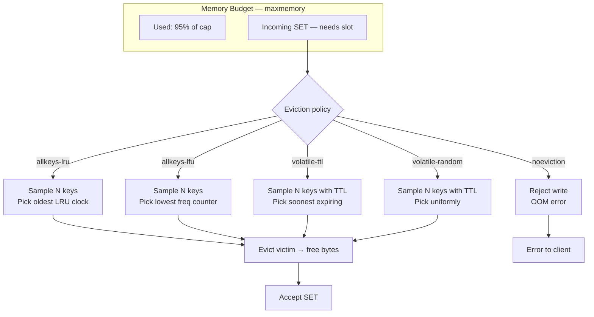
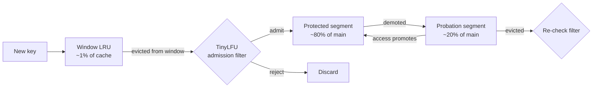

# Eviction Policies — LRU, LFU, TTL, and the Approximations Real Caches Use

**Date:** 2026-05-01 | **Updated:** 2026-05-01
**Tags:** `system-design` `deep-dive` `caching` `eviction` `algorithms`

> **Parent case study:** [Design a Distributed Cache](../design-distributed-cache.md). This deep-dive expands "Eviction — LRU, LFU, TTL, and the Approximations Real Caches Use".

## Table of Contents

- [Summary](#summary)
- [Overview](#overview)
- [Why Eviction Is Unavoidable](#why-eviction-is-unavoidable)
- [Exact LRU — The Doubly-Linked List + Hash Map](#exact-lru--the-doubly-linked-list--hash-map)
- [Why Exact LRU Is Too Expensive at High QPS](#why-exact-lru-is-too-expensive-at-high-qps)
- [Approximated LRU — Redis Sampling](#approximated-lru--redis-sampling)
- [LFU and the Frequency-Counter Aging Problem](#lfu-and-the-frequency-counter-aging-problem)
- [TinyLFU and W-TinyLFU](#tinylfu-and-w-tinylfu)
- [TTL Eviction — Active vs Lazy Expiry](#ttl-eviction--active-vs-lazy-expiry)
- [Volatile vs Allkeys Policies](#volatile-vs-allkeys-policies)
- [Cost-Aware Eviction](#cost-aware-eviction)
- [2Q, ARC, SLRU — Academic Policies](#2q-arc-slru--academic-policies)
- [Memcached Slabs and Per-Slab LRU](#memcached-slabs-and-per-slab-lru)
- [Cache Pollution and Admission Filters](#cache-pollution-and-admission-filters)
- [Eviction as a Back-Pressure Signal](#eviction-as-a-back-pressure-signal)
- [Random Eviction — The Surprising Baseline](#random-eviction--the-surprising-baseline)
- [Worked Example: One Trace Through LRU, LFU, TinyLFU](#worked-example-one-trace-through-lru-lfu-tinylfu)
- [Anti-Patterns](#anti-patterns)
- [Related](#related)
- [References](#references)

## Summary

Eviction is the discipline that decides which entry leaves when the cache is full, and it is where most caches earn or lose their hit rate. The textbook answers — exact LRU with a doubly-linked list, exact LFU with a heap of frequencies — are correct but operationally indefensible at the queries-per-second a real cache sees: every `GET` would have to lock and splice a list, every eviction would have to rebalance a heap, and the pointer chasing alone would saturate the L3 cache. So real caches approximate. Redis samples five random keys and evicts the worst of the sample. Caffeine and Ristretto run a Window-TinyLFU admission filter built on a count-min sketch that decides whether a new key even *deserves* a slot. Memcached partitions memory into slab classes and runs a segmented LRU per class so that scans pollute only one class. TTL handling is its own little world: passive expiry on read is cheap but lets dead keys hog memory; active expiry is a probabilistic background sweep tuned to keep the dead-key fraction below 25%. Underneath all of this sits a uniform truth: **the right eviction policy depends on the workload**, and the wrong eviction policy can take a cluster from a 99% hit ratio to a 70% hit ratio without changing a single line of application code. This deep-dive covers the algorithms, the data structures that make them fast enough, and the operational anti-patterns that turn good policies into bad ones.

## Overview

The parent case study (`../design-distributed-cache.md`) introduces eviction as a deep-dive subsection of the Redis/Memcached design. This document opens that block.

The questions answered here:

1. **Why is eviction unavoidable?** Bounded RAM and an unbounded keyspace force somebody to leave; the only choice is *who*.
2. **What is exact LRU and why is it the textbook reference?** Doubly-linked list + hash map gives O(1) on every operation in theory.
3. **Why is exact LRU bad at high QPS in practice?** Pointer churn, lock contention on the list, cache misses on every splice.
4. **How do real caches approximate?** Redis samples; Caffeine sketches; Memcached segments.
5. **What is the LFU aging problem and how does TinyLFU solve it?** Old hot items linger forever in pure LFU; count-min sketch with periodic halving fixes it.
6. **How does TTL interact with capacity eviction?** Passive (lazy) expiry on read is free but leaks memory; active expiry probes 20 keys per 100 ms and adapts.
7. **When do you pick `volatile-lru` vs `allkeys-lru`?** Whether your TTLs encode importance or freshness.
8. **What about cost-aware eviction?** Different keys have different recompute costs; the cheapest-to-rebuild should leave first.
9. **What did 2Q, ARC, SLRU contribute, and where are they used?** Academic ancestry for SLRU (in Memcached) and TinyLFU (in Caffeine, Ristretto).
10. **How do admission filters help with cache pollution?** A one-shot scan should not be able to flush a working set.
11. **When is random eviction surprisingly fine?** Uniform workloads, large caches, and the absence of a clear popularity skew.



The general placement-level treatment of caches lives in [`../../../building-blocks/caching-layers.md`](../../../building-blocks/caching-layers.md); this doc is specifically about the algorithm that runs when those caches reach their memory cap.

## Why Eviction Is Unavoidable

A cache is, by definition, a bounded-memory accelerator in front of an unbounded-keyspace source of truth. Three facts force eviction:

1. **RAM is finite.** A 64 GB shard cannot hold a 200 GB working set.
2. **Keyspace is effectively infinite.** Every product, user, session, and request fingerprint contributes. The set of keys ever-touched grows monotonically.
3. **Hit rate dominates cache value.** A cache at 50% hit rate is worse than no cache (misses pay the cache's overhead *and* the database's). A cache at 99% hit rate cuts database load 100×. The eviction policy decides where on that curve you live.

A good eviction policy keeps the keys that *will be accessed soon* and evicts the ones that *won't*. Since the future is unknown, every algorithm is a heuristic over the past. **LRU bets on temporal locality** (recently-used will be re-used). **LFU bets on popularity skew** (frequently-used will be re-used). **TTL bets on application knowledge** (the application told us when this entry stops mattering). **Random bets on nothing** and is sometimes the right answer.

The only universally wrong choice is `noeviction` for a typical cache workload: when memory fills, writes start failing with OOM errors, and every dependent service experiences the equivalent of a cache outage. `noeviction` is acceptable only when the cache is being abused as a queue or system of record, and even then it is dangerous.

## Exact LRU — The Doubly-Linked List + Hash Map

The textbook LRU implementation is a doubly-linked list of entries paired with a hash map from key to list node. Every access splices the accessed node to the head; every eviction removes the tail. Both operations are O(1) — once you have the node pointer.

```python
# Canonical LRU cache — hash map + doubly-linked list
class Node:
    __slots__ = ("key", "value", "prev", "next")
    def __init__(self, key, value):
        self.key = key
        self.value = value
        self.prev = None
        self.next = None

class LRUCache:
    def __init__(self, capacity: int):
        self.capacity = capacity
        self.map: dict[str, Node] = {}
        # Sentinel head and tail simplify edge cases (no None checks)
        self.head = Node(None, None)   # most-recently-used end
        self.tail = Node(None, None)   # least-recently-used end
        self.head.next = self.tail
        self.tail.prev = self.head

    def _unlink(self, node: Node) -> None:
        node.prev.next = node.next
        node.next.prev = node.prev

    def _push_front(self, node: Node) -> None:
        node.prev = self.head
        node.next = self.head.next
        self.head.next.prev = node
        self.head.next = node

    def get(self, key: str):
        node = self.map.get(key)
        if node is None:
            return None
        # Splice to head — this is the LRU update
        self._unlink(node)
        self._push_front(node)
        return node.value

    def put(self, key: str, value) -> None:
        existing = self.map.get(key)
        if existing is not None:
            existing.value = value
            self._unlink(existing)
            self._push_front(existing)
            return
        if len(self.map) >= self.capacity:
            # Evict LRU — the node just before the tail sentinel
            victim = self.tail.prev
            self._unlink(victim)
            del self.map[victim.key]
        node = Node(key, value)
        self.map[key] = node
        self._push_front(node)
```

The invariants:

| State | Cost |
|---|---|
| `map[k] → node` lookup | O(1) hash |
| Splice to head on hit | O(1) — three pointer rewrites |
| Insert at head on miss | O(1) |
| Evict tail on capacity overflow | O(1) — tail sentinel gives the victim instantly |
| Memory overhead | One `Node` per entry (~48 B in Python with `__slots__`) plus dict overhead |

This is exactly the right answer for a small in-process cache with low contention — for example, a memoization decorator, a per-request cache, or a small bounded session map. Every general-purpose programming language has this in its standard library: Python's `functools.lru_cache`, Java's `LinkedHashMap` with `removeEldestEntry`, Go's `container/list` plus a `map`, C++'s `std::list` plus `std::unordered_map`.

## Why Exact LRU Is Too Expensive at High QPS

The trouble starts when the cache is hot.

**Pointer churn on every read.** Every `GET` mutates the list. At 1M ops/sec, that is 1M list splices per second, each one writing four pointers. Those writes invalidate cache lines on any other core that has read the same node — the node is shared mutable state. In a single-threaded Redis or single-threaded match engine, this is fine; in a multi-threaded Memcached or any concurrent in-process cache, it is catastrophic.

**Lock contention.** A multi-threaded LRU has two choices: a global mutex around the list (one thread can splice at a time, throughput collapses to single-threaded), or fine-grained locking with hand-over-hand list traversal (slower per-op, complex correctness story). Caffeine's authors measured this empirically: a `synchronized LinkedHashMap` peaks at ~200K ops/sec on a 16-core box, while a lock-free approximation reaches 50M ops/sec. Two orders of magnitude.

**Cache misses on the list itself.** A doubly-linked list is the worst possible memory layout for cache locality. Each node is allocated independently by the heap allocator; consecutive nodes in *list order* are scattered across pages in *memory order*. Every list splice fetches three or four cache lines from L3 (or worse, RAM). At 80–120 ns per L3 miss, ten million splices per second cost ~1 second of memory-stall per second of wall time. The CPU is not running your code — it is waiting for the linked list.

**False sharing.** Even when locks are absent, two cores splicing different nodes can land on the same 64-byte cache line and invalidate each other's L1/L2 caches. Padding nodes to a cache line costs memory; not padding costs throughput.

**The fundamental issue.** Exact LRU couples *eviction order* (a list) with *update frequency* (every read). Every read mutates the list. The list is the global hot data structure. There is no way around it without changing the algorithm.

The solution all major caches converge on: **stop tracking exact LRU**. Sample. Sketch. Approximate. The hit-rate cost of approximation is small (often <1 percentage point on realistic workloads); the throughput gain is 10–100×.

## Approximated LRU — Redis Sampling

Redis solves the LRU problem by *not solving it*. Instead of maintaining a global LRU list, Redis stores a per-object 24-bit LRU clock — the global clock value at the time of the most recent access. When eviction is needed, Redis samples N random keys, compares their clocks, evicts the oldest of the sample.

```text
# Redis approximate LRU — pseudocode

global_lru_clock: u24 = increment_every_minute()

on GET key:
    obj = dict.lookup(key)
    obj.lru_clock = global_lru_clock     # one register write per read

on memory_full:
    pool = []
    for _ in range(maxmemory_samples):    # default 5
        candidate = dict.random_key()
        pool.push((candidate.lru_clock, candidate))
    victim = pool.argmin_by_clock()
    evict(victim)
```

The cost model is now:

| Operation | Cost |
|---|---|
| `GET` — update LRU clock | O(1), one register write, no list mutation |
| Eviction — sample N keys | O(N) random dict probes |
| Per-object metadata | 24 bits — 3 bytes |

`maxmemory-samples` is tunable; the defaults and their accuracy trade-offs (per Redis documentation):

| `maxmemory-samples` | Approximation accuracy vs true LRU | Eviction CPU |
|---|---|---|
| 5 (default) | ~95% — most evictions match true LRU within 5–10 ranks | Lowest |
| 10 | ~99% — virtually indistinguishable from true LRU | Modest |
| 20+ | Diminishing returns; CPU cost grows linearly | Higher |

The brilliance: **sampling decouples eviction quality from per-access cost**. Reads stay O(1) with no list mutation. Evictions pay a small amortized cost (a few microseconds per eviction, at most), and that cost is bounded by `maxmemory-samples`, not by cache size.

Redis goes one step further with the **eviction pool** (since 3.0). Instead of resampling from scratch on every eviction, Redis maintains a pool of 16 candidates across calls. Each round, it samples new keys, merges them into the pool by LRU clock, evicts the worst pool member. The pool has memory of past sampling and converges toward something very close to true LRU on steady-state workloads.

```text
# Eviction pool — improvement over plain sampling

eviction_pool: SortedArray[16] = []      # sorted by lru_clock ascending

on memory_full:
    candidates = sample(maxmemory_samples)
    for c in candidates:
        if eviction_pool.has_room or c.lru_clock < eviction_pool[-1].lru_clock:
            eviction_pool.insert_sorted(c)
            if eviction_pool.size > 16:
                eviction_pool.pop_back()
    victim = eviction_pool.pop_front()
    evict(victim)
```

The eviction pool empirically lifts approximation accuracy from ~95% to ~99% at the same `maxmemory-samples` value.

## LFU and the Frequency-Counter Aging Problem

LFU (Least Frequently Used) bets on a different signal: how *often* an item is accessed, not how *recently*. For workloads with strong popularity skew — a few keys getting most of the traffic, a long tail of one-shots — LFU can outperform LRU by retaining the popular keys even when they go briefly idle.

Naïve LFU keeps an integer access counter per object and a min-heap of (counter, object) for eviction. Every `GET` increments the counter; eviction pops the heap top.

The trouble with naïve LFU: **counters never decrease**. An item that was hot at 9 AM has a counter of 50,000. By 9 PM that item is dead, but its counter is still 50,000, and any new candidate (counter ~10) gets evicted instead. The dead key lives forever. This is **frequency staleness**, the LFU equivalent of cache pollution.

The fix is **aging** — counters must decay. Two flavors:

**Time-based aging:** divide every counter by 2 every T minutes. Periodic halving keeps the relative ordering but bounds the absolute magnitudes.

**Probabilistic aging (Redis approximate LFU):**

```text
# Redis approximate LFU — pseudocode

on GET key:
    obj = dict.lookup(key)
    # Counter saturates around 255; uses log-style increment
    p = 1 / ((obj.counter - LFU_INIT_VAL) * lfu_log_factor + 1)
    if random() < p:
        obj.counter = min(255, obj.counter + 1)
    obj.last_access_time = now()

on access (any time, including GET):
    # Decay: subtract one from counter for each minute since last access
    elapsed_minutes = (now() - obj.last_access_time) // 60
    obj.counter = max(0, obj.counter - elapsed_minutes * lfu_decay_time)
```

Two parameters tune the curve:

- `lfu-log-factor` (default 10): controls how quickly counters reach saturation. Higher = harder to climb the counter, more emphasis on long-term popularity.
- `lfu-decay-time` (default 1 minute per decrement): how fast unaccessed keys lose status. Shorter = more weight on recency, fades into LRU. Longer = more weight on history, classical LFU.

The 8-bit counter is enough because of the logarithmic update: counter values map to access-count *orders of magnitude*, not exact counts. Counter 5 ≈ ~100 accesses; counter 100 ≈ ~1B accesses; counter 255 ≈ saturation.

Eviction is the same sampling-based scheme as LRU, but ranks by counter ascending instead of clock ascending:

```text
on memory_full:
    pool = sample(maxmemory_samples)     # 5 random keys
    victim = argmin(pool, key=lambda o: o.counter)
    evict(victim)
```

LFU shines for *steeply skewed* workloads — recommendation systems, top-N queries, celebrity content. It struggles with *uniform* workloads (all counters end up similar — eviction becomes random) and with *evolving* skew (yesterday's celebrities still have the highest counters). For the broad case, **LFU with proper decay outperforms LRU on hit rate**, but the gap is workload-dependent.

## TinyLFU and W-TinyLFU

TinyLFU (Einziger, Friedman, Manes, ToS 2017) is the most important cache eviction advance of the last decade. It powers Caffeine (Java) and Ristretto (Go), and its core insight is **separate admission from eviction**.

The premise: most caches make a single decision when memory is full — *which key leaves?*. TinyLFU adds a second decision earlier — *should this new key even get in?*. The admission decision is informed by a frequency sketch over recent accesses.

### Count-min sketch as the frequency oracle

A count-min sketch (CMS) is a small array of counters indexed by hash functions. It approximates `count(x)` for any item `x` using O(1) memory per item — not a counter per item, but a counter per (hash function, bucket) pair across a small total. Detailed treatment lives in [`../../../data-structures/count-min-sketch-and-top-k.md`](../../../data-structures/count-min-sketch-and-top-k.md).

For TinyLFU, the CMS estimates how often each key has been seen recently. The estimate has bounded over-counting (collisions inflate counts but never deflate them) and uses a few hundred KB total to track millions of distinct keys.

```text
# Count-min sketch sized for ~1M distinct keys
DEPTH = 4           # number of hash functions
WIDTH = 1 << 20     # 1M counters per hash
counters: [[u4; WIDTH]; DEPTH]    # 4-bit counters — saturate at 15

increment(key):
    for i in 0..DEPTH:
        h = hash_i(key) % WIDTH
        if counters[i][h] < 15:
            counters[i][h] += 1

estimate(key) -> u4:
    return min(counters[i][hash_i(key) % WIDTH] for i in 0..DEPTH)
```

The 4-bit counters saturate at 15. Period. That is enough for the admission decision: TinyLFU only cares whether the candidate is *more popular* than the would-be victim, not the exact ratio.

### The admission filter

When a new key arrives and the cache is full, TinyLFU does not evict immediately. Instead, it consults the CMS:

```text
on insert key K (cache full, victim V chosen by main eviction policy):
    freq_K = sketch.estimate(K)
    freq_V = sketch.estimate(V)
    if freq_K > freq_V:
        evict V
        insert K
    else:
        # K is rejected — main cache stays put
        # but K's frequency in the sketch is updated regardless
        sketch.increment(K)
        return
```

The rejection step is the magic. A one-shot scan that touches a million unique keys cannot push out the hot working set, because each scanned key has frequency 1 in the sketch and every hot key has frequency >> 1. The cache *refuses to admit* low-frequency candidates.

### Doorkeeper: Bloom filter in front of the sketch

The CMS over-estimates because of hash collisions. To tighten the estimate for the most common case (one-shot keys that should never see the sketch at all), TinyLFU adds a Bloom filter "doorkeeper" in front:

```text
on increment(key):
    if doorkeeper.test(key) is False:
        doorkeeper.add(key)        # first sighting — only Bloom filter, not sketch
    else:
        sketch.increment(key)      # second+ sighting — promoted to sketch
```

One-shots stay in the Bloom filter and never inflate the sketch. The doorkeeper resets periodically (every N sketch increments) to avoid saturating itself.

### W-TinyLFU: a small LRU window

Pure TinyLFU has one weakness: a brand-new key has frequency 0. It cannot displace any existing entry. A burst of new-but-soon-popular keys would never get a foothold.

W-TinyLFU (Window TinyLFU) fixes this with a small **window** in front of the main cache:



- **Window (1% of cache):** plain LRU. New keys enter here. If a key is hot, it gets accessed multiple times within the window and accumulates frequency in the sketch.
- **Main cache (99%):** an SLRU split into protected (80%) and probation (20%). Keys evicted from the window must pass the admission filter to enter the main cache.
- **Admission filter:** the TinyLFU CMS comparison. Window-evicted candidate competes with main-evicted victim by sketch frequency.

The window absorbs new arrivals. The admission filter prevents pollution. The protected segment retains the steady-state hot set. Caffeine's published benchmarks show W-TinyLFU beating LRU by 5–15 percentage points on realistic workloads (Database Buffer Pool, OLTP, web server traces) and never losing meaningfully.

```python
# W-TinyLFU sketch — admission filter at the boundary
class WTinyLFU:
    def __init__(self, capacity: int):
        self.window = LRUCache(capacity * 1 // 100)
        self.protected = LRUCache(capacity * 80 // 100)
        self.probation = LRUCache(capacity * 19 // 100)
        self.sketch = CountMinSketch(width=1 << 20, depth=4)

    def get(self, key):
        self.sketch.increment(key)
        return (self.window.get(key)
                or self.protected.get(key)
                or self.probation.get(key))

    def put(self, key, value):
        self.sketch.increment(key)
        evicted = self.window.put(key, value)
        if evicted is None:
            return
        # Window evicted a key — try to admit into main cache
        candidate_freq = self.sketch.estimate(evicted.key)
        victim = self.probation.peek_lru()
        if victim is None or candidate_freq > self.sketch.estimate(victim.key):
            self.probation.put(evicted.key, evicted.value)
        # else: discard the evicted candidate; main cache unchanged
```

Caffeine and Ristretto are the production references. Caffeine's wiki ([referenced below](#references)) documents the exact tuning, the doorkeeper sizing, the periodic sketch decay, and the empirical hit-rate curves vs LRU on standard traces.

## TTL Eviction — Active vs Lazy Expiry

TTL is a *different* eviction signal: not "which key to evict for memory pressure," but "which keys have logically expired and should be treated as absent." TTL handling has its own algorithm, and it interacts with capacity eviction in ways that surprise operators.

**Lazy (passive) expiry:** check the TTL on read. If expired, delete and return miss.

```text
on GET key:
    obj = dict.lookup(key)
    if obj is None:
        return miss
    if obj.expire_ms != NONE and obj.expire_ms < now_ms:
        delete(key)
        return miss
    return obj.value
```

Cost: O(1) per read. **Memory cost: unbounded** — expired keys that are never read again sit in memory forever. A workload that writes-with-TTL but rarely re-reads (event logs, idempotency tokens) can fill memory with corpses.

**Active (eager) expiry:** background sweeper proactively scans for expired keys.

```text
# Redis active expiry — runs every 100 ms
ACTIVE_EXPIRE_CYCLE_LOOKUPS = 20
ACTIVE_EXPIRE_CYCLE_FAST_DURATION = 1ms
EXPIRED_FRACTION_THRESHOLD = 0.25

every 100ms:
    for db in dbs_with_expires:
        do:
            sample = []
            for _ in range(ACTIVE_EXPIRE_CYCLE_LOOKUPS):
                key = db.expires.random_key()
                sample.append(key)
            expired_now = [k for k in sample if k.expire_ms < now_ms]
            for k in expired_now: delete(k)
            expired_fraction = len(expired_now) / len(sample)
        while expired_fraction > EXPIRED_FRACTION_THRESHOLD
                and elapsed < ACTIVE_EXPIRE_CYCLE_FAST_DURATION
```

Two crucial tuning knobs:

- **20-key sample size.** Small enough that the sampling cost is bounded; large enough to be statistically meaningful.
- **25% threshold for "keep going."** If more than a quarter of the sample was expired, the sweeper iterates again on more keys. If less, it stops and waits for the next 100 ms tick.

The threshold creates an adaptive backpressure loop: when expired keys are rare, sweeping is cheap; when expired keys accumulate (e.g., after a burst of TTL-bearing writes), the sweeper amplifies until memory is reclaimed.

The combination of lazy + active is what Redis ships:

| Path | Method | When |
|---|---|---|
| Read | Lazy | Every `GET` checks TTL |
| Background | Active probe | Every 100 ms, sample 20, iterate while >25% expired |
| Memory pressure | Capacity eviction | When `maxmemory` is reached, regardless of TTL state |

The interaction with capacity eviction matters: under `volatile-ttl` policy, capacity eviction prefers keys that will expire soonest (TTL-as-priority). Under `allkeys-lru`, TTL is irrelevant to capacity eviction — the LRU clock decides — but expired keys are still being reaped lazily and actively in the background.

## Volatile vs Allkeys Policies

Redis offers eight `maxmemory-policy` values. Half scope to all keys; half scope only to keys that have an explicit TTL set:

| Policy | Scope | Eviction key |
|---|---|---|
| `noeviction` | — | Never evict; reject writes when full |
| `allkeys-lru` | All keys | Approximate LRU |
| `allkeys-lfu` | All keys | Approximate LFU |
| `allkeys-random` | All keys | Random sample |
| `volatile-lru` | Only keys with TTL | Approximate LRU among TTL keys |
| `volatile-lfu` | Only keys with TTL | Approximate LFU among TTL keys |
| `volatile-ttl` | Only keys with TTL | Soonest-to-expire |
| `volatile-random` | Only keys with TTL | Random among TTL keys |

The choice between `volatile-*` and `allkeys-*` encodes a *policy*: do TTLs in your workload mark "this is ephemeral data" or "this is just a freshness hint"?

**`volatile-*` is the right choice when:**

- TTLs are meaningful — a key with a TTL is by-design temporary.
- You have a separate population of "permanent" keys you never want evicted (configuration, lookup tables, feature flags). Setting TTL is your way of saying "feel free to drop me if needed."
- The workload is mixed: some application caches with TTL, some long-lived structural data without.

**`allkeys-*` is the right choice when:**

- All keys are cache entries; TTL (or its absence) is just a freshness hint, not a permanence flag.
- You want maximum hit rate and the LRU/LFU signal across the entire keyspace.
- You've sized the cache appropriately and *every* entry is fair game for eviction.

A common pitfall: choosing `volatile-lru` while having very few TTL keys. The cache fills with non-TTL keys; the eviction policy can only touch the small TTL minority; effectively, the cache becomes `noeviction` and starts rejecting writes. The fix is either to set TTLs on *all* cache keys or to switch to `allkeys-lru`.

The Redis documentation recommends `allkeys-lru` (or `allkeys-lfu` for skewed workloads) as the default for general caches. `volatile-ttl` shines for time-sensitive data with explicit lifetimes (sessions, magic links, idempotency tokens).

## Cost-Aware Eviction

All policies discussed so far treat evicted keys as fungible. They are not. Two keys may have identical access patterns but radically different *costs* to evict:

- **Cheap to recompute.** A user's recent-orders list — a single indexed query on Postgres. If evicted, the next miss costs a few milliseconds.
- **Expensive to recompute.** An ML feature vector requiring a fan-out across five microservices. If evicted, the next miss costs several seconds and tens of dollars in compute.
- **Large.** A 10 MB pre-rendered report. Evicting it frees a lot of memory.
- **Small.** A 64-byte counter. Evicting it frees nothing useful but loses the increment history.

A purely access-pattern-based policy (LRU, LFU) is blind to these distinctions. **Cost-aware eviction** factors in size and recompute cost.

The classical formulation (GreedyDual-Size, Cao & Irani 1997):

```text
priority(key) = (cost_to_recompute / size) * recency_factor
evict(argmin(priority))
```

The intuition: evict the key that gives back the most *bytes per unit of "regret"*. A large, cheap-to-recompute key leaves first; a small, expensive-to-recompute key stays.

In practice, cost-aware eviction is rarely deployed in general-purpose caches because:

1. **Cost annotation is hard.** The application has to tag each entry with its recompute cost, and that cost varies with downstream load.
2. **The cost-vs-popularity trade-off is workload-specific.** A blanket weighting is wrong somewhere.
3. **The hit-rate gain over plain LRU/LFU is modest** for most caches.

It does show up in specialized caches:

- **CDN edge caches** weight by *origin fetch cost* — pulling a video chunk from a cold origin is expensive, so popular-but-also-expensive content gets retention priority.
- **ML feature stores** weight by *feature pipeline depth* — features computed via long DAGs of joins get higher retention priority than features that are direct table lookups.
- **Web crawler caches** weight by *recrawl politeness budget* — an entry from a slow-to-respond domain stays longer because re-fetching from that domain is expensive in time, not just CPU.

For the general case, **size-aware eviction is the half-step that earns most of the value**. If your value sizes vary by 100× (e.g., string IDs vs serialized object trees), a size-aware LRU evicts the largest LRU candidate first, freeing more bytes per eviction and reducing the number of evictions per minute. Caffeine supports this directly via `Weigher`.

## 2Q, ARC, SLRU — Academic Policies

Three academic policies preceded TinyLFU and contributed ideas that show up in production caches.

**2Q (Johnson & Shasha, VLDB 1994).** Maintains two queues: A1 (probationary, FIFO) and Am (main, LRU). New keys enter A1; only on a *second* access do they promote to Am. A one-shot scan cycles keys through A1 and out — never disturbing Am's hot working set. 2Q is the conceptual ancestor of TinyLFU's Window + Probation segmentation: *new arrivals must earn their place in the main cache*.

**ARC (Megiddo & Modha, USENIX FAST 2003).** Adaptive Replacement Cache auto-tunes the balance between recency and frequency. It maintains four lists: T1 (used once, recency-biased), T2 (used multiple times, frequency-biased), and ghost lists B1/B2 of *recently evicted* entries from each. A target parameter `p` controls the T1/T2 split; hits in B1 bias toward recency, hits in B2 bias toward frequency. ARC is implemented in IBM storage controllers and ZFS's ARC. Its lasting contribution is the **ghost list** — tracking what was *recently evicted* lets the cache learn from its own mistakes. TinyLFU's count-min sketch is a more memory-efficient form of the same idea (aggregate frequency rather than specific evicted keys).

**SLRU (Segmented LRU).** Partitions the cache into *probationary* (~20%) and *protected* (~80%) LRU segments. New keys enter probationary; a hit while in probationary promotes to protected. SLRU is what Memcached uses internally (HOT/WARM/COLD variant) and is the building block of W-TinyLFU's main cache. The lineage `LRU → 2Q → SLRU → W-TinyLFU` refines the same principle: require demonstrated re-use before granting full retention.

## Memcached Slabs and Per-Slab LRU

Memcached's eviction story is shaped by its memory allocator. Memcached pre-allocates memory in **slab classes** — fixed-size buckets doubling in size from 64 B up through 1 MB. An item of 412 B goes into the smallest slab class that fits it (the 512 B class). Each slab class has its own LRU.

```text
slab class 1: 64 B  items  → LRU 1
slab class 2: 128 B items  → LRU 2
slab class 4: 512 B items  → LRU 4   ← 412 B item lives here
...
slab class N: 1 MB items   → LRU N
```

The trade-offs:

- **Pro: eviction is local.** A 1 MB item evicting a 1 MB item doesn't disturb the 64 B working set.
- **Pro: O(1) allocation.** No fragmentation, no malloc overhead, just pop a slab page.
- **Pro: dense memory layout.** Items in the same class are tightly packed, cache-friendly.
- **Con: internal fragmentation.** A 65 B item lives in the 128 B slab and wastes ~63 B.
- **Con: slab class starvation.** If the workload shifts and all activity is on slab class 7, pages permanently allocated to slab class 1 are stranded — can't be reassigned without restart (older Memcached) or via slab rebalancing (newer Memcached).
- **Con: scan pollution still happens** at the per-slab level — a scan of all 512-B items pollutes slab class 4's LRU.

Modern Memcached (≥1.5) implements **segmented LRU per slab class** (HOT/WARM/COLD as described under SLRU) to mitigate scan pollution within a class, and ships a **slab automover** that reassigns pages from cold classes to hot classes when the workload shifts.

## Cache Pollution and Admission Filters

Cache pollution is the failure mode where one-shot reads displace the steady-state working set. The classical scenario:

- Cache holds 100K hot keys at ~99% hit rate.
- Application runs a batch job that scans 10M unique keys, each touched once.
- Pure LRU promotes each scanned key to the head; after ~100K scanned keys, the entire working set is gone.
- Hit rate collapses; database load explodes; the next request from a real user pays the full miss cost.

The defenses, in increasing sophistication:

1. **Don't put scan traffic through the cache.** Use a separate read path (`scan_no_cache=true` flag, separate connection pool, separate Redis cluster). Operationally clean if you can identify the scans.
2. **Per-slab / per-segment LRU.** Memcached's approach. Limits the blast radius of a scan to one slab class.
3. **Probationary segments (2Q, SLRU, W-TinyLFU's main cache).** Scan keys land in probation; only re-accessed keys get promoted.
4. **Admission filter (TinyLFU).** Scan keys never enter the cache at all because they fail the frequency comparison against the current victim.

The admission filter is the strongest defense. Every other approach lets pollution land *and then* contains it. The filter prevents pollution from happening. For workloads with frequent batch scans alongside hot online traffic, W-TinyLFU's hit rate stays at ~99% throughout the scan; pure LRU's collapses to ~70% during the scan and takes minutes to recover.

## Eviction as a Back-Pressure Signal

A healthy cache *should* evict — if it never evicts, it is over-provisioned. But the eviction *rate* is a critical operational signal.

| Eviction rate | Interpretation |
|---|---|
| ~0 evictions/sec | Cache is over-provisioned; consider downsizing |
| Low (~10s/sec on a busy cache) | Steady-state; hot keys are warm, cold keys cycle out |
| Moderate (~100s/sec) | Working set just over capacity; hit rate might be suffering |
| **High (>1000/sec sustained)** | **Working set significantly exceeds capacity; major hit-rate degradation; alert** |
| **Spiking** | **A scan or new workload is polluting the cache; investigate** |

Production caches should expose:

- `evicted_keys` (Redis `INFO stats`) — total counter; rate is `(now - prev) / time_delta`.
- `keyspace_hits` and `keyspace_misses` — to compute hit rate.
- `expired_keys` — TTL-driven removals, distinct from capacity eviction.

Alerts and dashboards should be wired to:

- **Hit rate < target.** A sudden drop from 99% to 95% is a 5× increase in database load.
- **Eviction rate spike.** A 100× increase in evictions/sec means something is filling the cache aggressively.
- **`maxmemory` utilization > 95%.** The cache is one bad write away from active eviction pressure.

The link to capacity planning: the *rate* of misses driven by eviction is the load you're shifting onto the database. If your DB can handle 100K reads/sec from cache misses but eviction is generating 500K misses/sec, you have a capacity problem regardless of what the cache says about itself.

For broader treatment of cache failure modes, see [`./cache-stampede-protection.md`](./cache-stampede-protection.md) — eviction and stampede interact (a mass eviction can trigger a mass miss can trigger a stampede on the database). The whole-system framing is in [`../design-distributed-cache.md`](../design-distributed-cache.md).

## Random Eviction — The Surprising Baseline

Random eviction picks a victim uniformly at random — no metadata, no LRU clock, no LFU counter. It has a reputation for being terrible, and on workloads with strong temporal locality it is. But in three regimes, random is *surprisingly* competitive:

- **Uniform workloads.** When every key is equally likely to be accessed (a uniformly-hashed lookup table), random has the same expected hit rate as LRU and is cheaper.
- **Cache much smaller than working set.** When the cache holds 1% of the keyspace, the hot keys will be re-fetched after eviction anyway. LRU/LFU's signal is weak; random comes within a few percentage points and saves the metadata.
- **Cache much larger than working set.** When the cache holds 99% of the working set, almost any victim is fine — the next access will hit.

The interesting middle range — caches at 50–95% of the working set on skewed workloads — is where LRU and LFU pay for themselves. That is where most production caches live. So the rule survives: **default to LRU or LFU; consider random only when you've measured and confirmed your workload doesn't reward smarter policies**. Redis offers `allkeys-random` and `volatile-random` for the cases where smarter policies don't help (e.g., sharded counter caches where every counter is equally hot).

## Worked Example: One Trace Through LRU, LFU, TinyLFU

A short trace illustrates how the policies diverge. Cache capacity = 4. Trace = 12 accesses.

```text
Trace: A B C D B C E F B C G B
       1 2 3 4 5 6 7 8 9 10 11 12
```

### Pure LRU

Track LRU order from oldest (left) to newest (right):

| Step | Access | Cache (oldest → newest) | Hit/Miss |
|---|---|---|---|
| 1–4 | A B C D | [A, B, C, D] | M, M, M, M |
| 5 | B | [A, C, D, B] | H |
| 6 | C | [A, D, B, C] | H |
| 7 | E | [D, B, C, E] *(evict A)* | M |
| 8 | F | [B, C, E, F] *(evict D)* | M |
| 9 | B | [C, E, F, B] | H |
| 10 | C | [E, F, B, C] | H |
| 11 | G | [F, B, C, G] *(evict E)* | M |
| 12 | B | [F, C, G, B] | H |

LRU hits: **5 out of 12 = 41.7%**.

### Pure LFU

Track frequency counts. On miss with full cache, evict lowest-frequency (oldest-by-time on ties).

| Step | Access | State (key:freq) | Hit/Miss |
|---|---|---|---|
| 1–4 | A B C D | A:1, B:1, C:1, D:1 | M, M, M, M |
| 5–6 | B C | A:1, B:2, C:2, D:1 | H, H |
| 7 | E | E:1, B:2, C:2, D:1 *(evict A)* | M |
| 8 | F | E:1, B:2, C:2, F:1 *(evict D)* | M |
| 9–10 | B C | E:1, B:3, C:3, F:1 | H, H |
| 11 | G | G:1, B:3, C:3, F:1 *(evict E)* | M |
| 12 | B | G:1, B:4, C:3, F:1 | H |

LFU hits: **5 out of 12 = 41.7%**. Same as LRU on this short trace — the differences appear over longer traces with more pronounced skew.

### W-TinyLFU (sketch + admission)

After steps 1–6, the sketch has frequencies `A:1, B:2, C:2, D:1`. At step 7 (E arrives, cache full), pure LRU would evict A. W-TinyLFU asks the sketch: is E's frequency (0, brand new) higher than A's (1)? No. **Reject E.** Same for F at step 8 and G at step 11.

| Step | Access | Cache | Hit/Miss |
|---|---|---|---|
| 7 | E | [A, B, C, D] | M (rejected) |
| 8 | F | [A, B, C, D] | M (rejected) |
| 9 | B | [A, B, C, D] | A:1, B:3, ... | H |
| 10 | C | [A, B, C, D] | A:1, B:3, C:3, ... | H |
| 11 | G | [A, B, C, D] | A:1, B:3, C:3, D:1, ..., G:1 | M (rejected) |
| 12 | B | [A, B, C, D] | A:1, B:4, ... | H |

W-TinyLFU hits: B at 5, C at 6, B at 9, C at 10, B at 12 = **5 hits**. Same hit rate on this trace, but **stable cache contents** — B and C are protected, scan keys (E, F, G) never displace them.

The win for W-TinyLFU shows up over longer traces: with hot keys B and C accessed many more times, LRU eventually evicts them under sustained scan pressure (E, F, G, H, I, ...), while W-TinyLFU keeps rejecting the scan keys and retains B and C indefinitely.

On the [Caffeine wiki's published benchmarks](https://github.com/ben-manes/caffeine/wiki/Efficiency), W-TinyLFU consistently beats LRU by 5–15 percentage points on synthetic Zipfian workloads, OLTP database traces (UMass), and search engine traces (Wikipedia). The advantage grows as the workload becomes more skewed.

## Anti-Patterns

1. **`maxmemory` unset.** Redis without `maxmemory` will grow until the OS kills it (OOM). The cache disappears entirely; every dependent service melts. Always set `maxmemory` to ~80% of the box RAM (leaving room for replication buffers, jemalloc fragmentation, OS overhead).
2. **`noeviction` for a real cache.** When memory fills, writes start failing. The cache becomes read-only with no way to admit new entries. Equivalent to a cache outage for write workloads. `noeviction` is acceptable only for a cache being abused as a system of record (see anti-pattern 6).
3. **No TTL fallback on cache-aside writes.** Application sets a key without TTL, never deletes it, the key lives until evicted by capacity. If the source-of-truth row is deleted, the cache holds a phantom. Always set a TTL ceiling (e.g., 24h) even for "permanent" cache entries — defense in depth against application bugs.
4. **Exact LRU at high QPS.** A standard `LinkedHashMap` synchronized for thread safety, used as a 100K-entry in-process cache, behind a hot HTTP endpoint. Throughput collapses to ~200K ops/sec because every reader is contending on the LRU list lock. Use Caffeine (Java), Ristretto (Go), or sharded LRU with per-shard locks.
5. **Single eviction policy across mixed workloads.** A cache shared by a session store (LRU-friendly), a feature flag service (long-lived, no eviction needed), and a counter cache (hot keys forever). One policy is wrong for two of the three. Either segregate keys into separate Redis databases / clusters with their own policies, or use TTL-driven `volatile-*` policies and let the application set TTL semantics per use case.
6. **Cache as system of record.** `SET key value` with no DB, no TTL, `noeviction`. The cache is now a database without persistence, replication semantics, or transactions. The first node failure loses data. Use a real KV store ([`../design-key-value-store.md`](../design-key-value-store.md)).
7. **All keys with identical TTL.** `EX 3600` everywhere. Every key written between 11:00 and 11:01 expires between 12:00 and 12:01 — a coordinated stampede on the database every hour. Add jitter: `ttl = base + rand(0, base * 0.1)`. See [`./cache-stampede-protection.md`](./cache-stampede-protection.md).
8. **Trusting `KEYS *` to find expired keys.** `KEYS` is O(N), single-threaded, blocks all other clients for the duration. On a 10M-key shard, that is multi-second cluster freeze. Use `SCAN` for any iteration; trust the active expiry sweeper for TTL-driven cleanup.
9. **Choosing `volatile-lru` while having no TTL keys.** The eviction pool is empty (no TTL keys to consider), the cache fills with non-TTL keys, writes start failing as if `noeviction` were set. Either set TTLs everywhere or use `allkeys-lru`.
10. **Disabling active expiry to "save CPU".** The active expiry sweeper costs ~1% CPU on most workloads. Disabling it (or setting an aggressive `hz` lower than the default 10) means TTL-expired keys hog memory until they are read. Memory fills, capacity eviction kicks in, the cache evicts *live* keys to make room for *dead* ones. Leave active expiry alone.
11. **Tuning `maxmemory-samples` upward without measurement.** "Higher is more accurate" is true; "higher is worth it" is workload-dependent. The CPU cost grows linearly. Above 10, returns are diminishing for nearly all workloads. Default 5 is fine for most caches; raise to 10 if you can prove the eviction quality matters; rarely go higher.
12. **Ignoring eviction rate as a metric.** A cluster running fine at 10 evictions/sec, then suddenly 100K/sec, is in a hit-rate crisis. Without an alert, you find out from downstream database load. Wire `evicted_keys` rate into your monitoring and alert on >10× baseline.
13. **Not understanding LFU aging behavior.** Pure LFU keeps yesterday's celebrities forever. Operators running `allkeys-lfu` who skip the `lfu-decay-time` tuning end up with a cache full of items that *were* hot once. Set `lfu-decay-time = 1` (1 minute decay) for fast-moving workloads; longer for slow-moving content.
14. **W-TinyLFU window sized too large.** Making the W in W-TinyLFU large (e.g., 20% instead of 1%) defeats the purpose — you've reintroduced LRU's pollution problem to one-fifth of the cache. Caffeine's default 1% is the right starting point; only adjust if you have a workload-specific reason.
15. **Evicting from the cache instead of fixing the source.** Constant high eviction rate means working set > capacity. The fix is to size the cache to the working set, not to tune eviction harder. Eviction tuning gives you a few percentage points of hit rate; sizing gives you the actual hit rate you need.

## Related

- [`./partitioning-and-hash-slots.md`](./partitioning-and-hash-slots.md) — sibling deep-dive; how keyspace is partitioned across shards. Eviction runs *per shard* against per-shard memory budgets, so shard sizing and eviction policy interact directly.
- [`./cache-stampede-protection.md`](./cache-stampede-protection.md) — sibling deep-dive; what happens when *all* keys at once experience a TTL-driven eviction. Stampede protection layers on top of eviction policy.
- [`./multi-tier-caching.md`](./multi-tier-caching.md) — sibling deep-dive; the L1 in-process cache (Caffeine, Ristretto) is where W-TinyLFU lives in production. The L2 distributed cache typically uses approximate LRU/LFU.
- [`../design-distributed-cache.md`](../design-distributed-cache.md) — parent case study; this doc expands the *Eviction* deep-dive subsection.
- [`../../../building-blocks/caching-layers.md`](../../../building-blocks/caching-layers.md) — foundation; where caches live in the architecture and how they compose.
- [`../../../data-structures/count-min-sketch-and-top-k.md`](../../../data-structures/count-min-sketch-and-top-k.md) — foundation; the sketching data structure that powers TinyLFU's frequency oracle.

## References

- Redis Documentation — [*Eviction Policies*](https://redis.io/docs/reference/eviction/). Authoritative reference for `maxmemory-policy`, the sampling implementation, the eviction pool, and the parameter knobs (`maxmemory-samples`, `lfu-log-factor`, `lfu-decay-time`).
- Redis Documentation — [*Configuration: maxmemory*](https://redis.io/docs/management/config/). Operator-facing configuration reference; covers `maxmemory`, `maxmemory-policy`, and the active-expiry tuning knobs (`hz`, `dynamic-hz`).
- Memcached Wiki — [*UserInternals*](https://github.com/memcached/memcached/wiki/UserInternals). Covers slab allocation, the segmented LRU per slab class (HOT/WARM/COLD), and the slab automover. Essential reading for Memcached's eviction model.
- Einziger, Friedman, Manes — [*TinyLFU: A Highly Efficient Cache Admission Policy*](https://arxiv.org/abs/1512.00727) (ACM Transactions on Storage, 2017). The paper that introduced the count-min sketch + admission filter approach. Includes empirical comparisons against LRU, LFU, ARC, and 2Q on standard traces.
- Ben Manes — [*Caffeine: Efficiency*](https://github.com/ben-manes/caffeine/wiki/Efficiency). Caffeine's documentation of W-TinyLFU's algorithm, parameter choices, and benchmarked hit rates against LRU on real workloads (database traces, web traces, OLTP).
- Dgraph Engineering — [*Introducing Ristretto: A High-Performance Go Cache*](https://blog.dgraph.io/post/introducing-ristretto-high-perf-go-cache/). The Go counterpart to Caffeine; documents how W-TinyLFU is adapted for Go's memory model and concurrency primitives, with benchmarks vs `sync.Map` and `bigcache`.
- Megiddo & Modha — [*ARC: A Self-Tuning, Low Overhead Replacement Cache*](https://www.usenix.org/legacy/event/fast03/tech/full_papers/megiddo/megiddo.pdf) (USENIX FAST 2003). The ARC paper. Introduces the ghost-list / adaptive-balance idea between recency and frequency; widely cited in cache replacement literature and implemented in ZFS's ARC.
- Johnson & Shasha — [*2Q: A Low Overhead High Performance Buffer Management Replacement Algorithm*](http://www.vldb.org/conf/1994/P439.PDF) (VLDB 1994). The 2Q paper. The conceptual ancestor of SLRU and W-TinyLFU's segmentation; introduces the probationary-vs-protected idea that survives in modern admission-aware caches.
- Cao & Irani — [*Cost-Aware WWW Proxy Caching Algorithms*](https://www.usenix.org/legacy/publications/library/proceedings/usits97/full_papers/cao/cao.pdf) (USENIX USITS 1997). The GreedyDual-Size paper; foundational treatment of cost-aware eviction for web proxy caches, where item sizes vary by 1000× and recompute cost varies independently.
