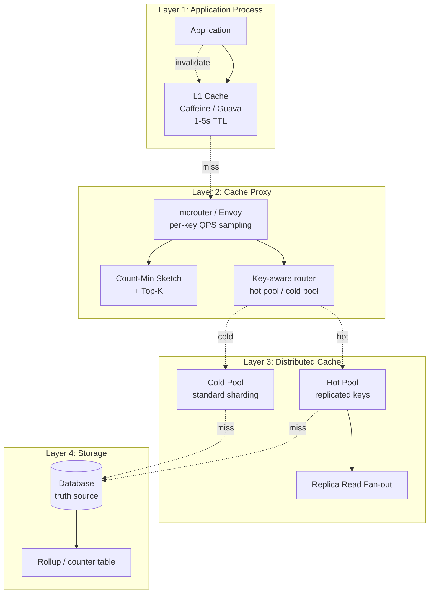
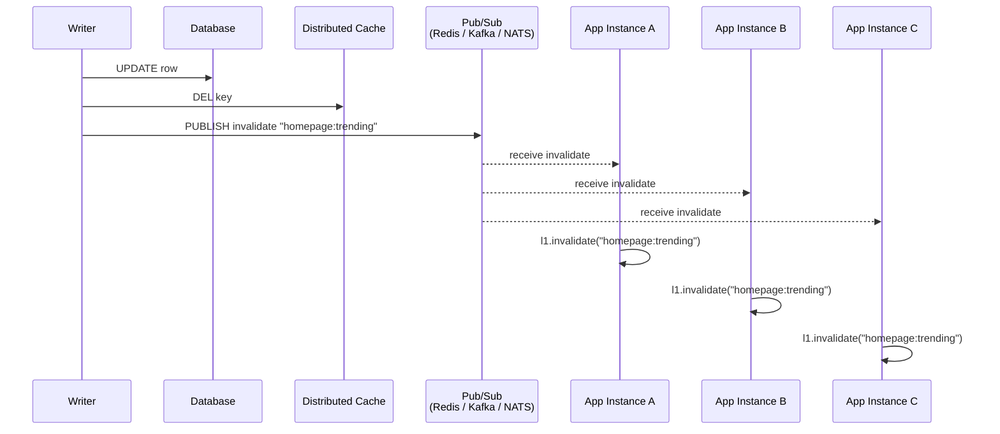
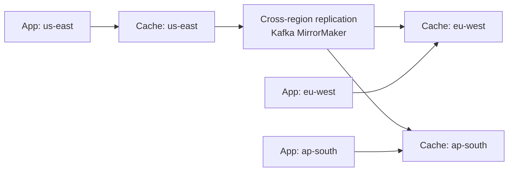

# Hot Key Handling — Read Fan-out, Local Caches, Sharded Counters, and Replicated Keys

**Date:** 2026-05-01 | **Updated:** 2026-05-01
**Tags:** `system-design` `deep-dive` `caching` `hot-key` `scalability`

## Table of Contents

- [Summary](#summary)
- [Overview](#overview)
- [The Hot-Key Problem — Why One Key Breaks a Cluster](#the-hot-key-problem--why-one-key-breaks-a-cluster)
- [Detection — QPS Sampling, Count-Min Sketch, Slow-Log Tail](#detection--qps-sampling-count-min-sketch-slow-log-tail)
- [Read Fan-out Replicas — Spreading One Key Across Many Nodes](#read-fan-out-replicas--spreading-one-key-across-many-nodes)
- [Local In-Process Tier (L1) — The Biggest Lever](#local-in-process-tier-l1--the-biggest-lever)
- [Two-Tier Invalidation — The Broadcast Problem](#two-tier-invalidation--the-broadcast-problem)
- [Pinned Hot Keys, TTL Randomization, and the Hot Pool](#pinned-hot-keys-ttl-randomization-and-the-hot-pool)
- [Sharded Counters — Splitting the Hot Write](#sharded-counters--splitting-the-hot-write)
- [Active-Active Cache Regions for Global Hot Keys](#active-active-cache-regions-for-global-hot-keys)
- [Anti-Affinity and Adaptive Replication](#anti-affinity-and-adaptive-replication)
- [Application-Level Fast Paths](#application-level-fast-paths)
- [mcrouter, Twemproxy, and Key-Aware Routing](#mcrouter-twemproxy-and-key-aware-routing)
- [Worked Example — A Celebrity Post With 10M Likes](#worked-example--a-celebrity-post-with-10m-likes)
- [Anti-Patterns](#anti-patterns)
- [Related](#related)
- [References](#references)

## Summary

A distributed cache is built on the assumption that load is approximately uniform across keys. Consistent hashing, hash-slot partitioning, and replica strategies all rely on the central limit theorem to flatten per-shard load: with enough keys and enough requests, each node sees its fair share. Hot keys violate that assumption. A single key handling 5–50% of cluster-wide QPS — a celebrity's profile, the homepage payload, a global counter, a feature-flag config — concentrates that traffic on **one** shard owner and **one** CPU core in that shard's event loop. The cluster has 200 nodes; one of them is on fire while 199 are idle.

You cannot solve a hot key by adding nodes. Adding a 201st node does not move the key — it still hashes to the same slot, still lands on the same owner. You have to do something explicitly different for that key: replicate the value across multiple nodes (read fan-out), serve it from the application process (L1 caching), or split a single write target into many (sharded counters). Each of these techniques trades something — staleness, write amplification, atomicity — for the ability to spread one key's load across the cluster.

This deep-dive walks through the full toolkit. The single biggest lever is the **L1 local cache**: 1000 application instances each absorbing a hot read with a 1–5 second local TTL collapses the per-key load on the distributed cache by 100–1000×. The second biggest lever is **read fan-out across replicas** — trade a small amount of read-after-write staleness for `1 + replica_count` more capacity. The third — **sharded counters** — handles the write side: turn `INCR counter` into `INCR counter:shard:R` for random R, and read by summing all shards. Everything else (active-active regions, anti-affinity, adaptive replication, key fan-out, denormalization) is a refinement on these three primitives.

A celebrity post with 10M likes drives this concretely: at peak it generates ~500K reads/sec for the post payload and ~300K writes/sec for the like counter. Without intervention, both saturate one shard. With L1 caching, replica fan-out, and sharded counters, the load reshapes into something every shard in the cluster shares.

## Overview

The hot-key toolkit operates at four layers, each catching what the layer above missed.



**Layer 1** absorbs the bulk of hot-key reads in the application process before any network round-trip. **Layer 2** detects which keys are hot and routes them to a different physical pool. **Layer 3** keeps the hot pool replicated across many nodes so even L1 misses spread load. **Layer 4** denormalizes and pre-aggregates so the database itself is shielded.

The interesting failure modes hide in the cracks between layers — most notably the **two-tier invalidation problem**, where the L1 cache holds stale data after the L2 has been updated. We walk through that next.

## The Hot-Key Problem — Why One Key Breaks a Cluster

### What "hot" means quantitatively

Define the hotness of a key as its share of cluster-wide QPS:

```text
hotness(K) = QPS(K) / total_QPS
```

A uniform distribution over 1B keys would give every key a hotness of 10⁻⁹. In production, key access follows a power law (Zipfian-ish), and the top key typically holds 0.1–5% of all traffic. At 1% — one key handling 1 of every 100 reads — a 200-node cluster sees that key drive 200% of one node's capacity if the rest of the load is uniform. A 5% key is unsurvivable on a single shard.

### Why adding nodes does not help

Consistent hashing maps a key to a slot, the slot to an owner. The mapping is deterministic and stable: the same key always lands on the same owner. Adding capacity dilutes the *cold* keys (each node owns fewer cold keys) but does nothing for the hot key. The hot key sits on one node regardless of cluster size; you have made the problem *worse* by isolating it more starkly.

This is the central mathematical fact behind every technique in this document: **hot-key mitigation is the explicit violation of the consistent-hashing invariant**. Whatever you do, you are taking a key that "should" live on one node and making it live on many.

### Why one node breaks first

The bottleneck is rarely network bandwidth or memory. It's:

1. **CPU on the event loop.** Redis is single-threaded per node; one core handles all commands for that shard. At 100K commands/sec on one key, the event loop is at 100% CPU and cannot accept new connections, even for *other* keys hashed to the same shard.
2. **Disk I/O on the AOF / RDB side.** AOF fsyncs back up; the appendonly buffer grows; replication lag spikes.
3. **Replica lag.** If you read from replicas, the replica falls behind the primary for the same reasons. The replica becomes useless for serving — by the time it has the latest value, it's seconds stale.
4. **Connection saturation.** Application instances opening a connection per request to that shard exhaust the connection pool; every other request to that shard queues.

The cascade pulls down keys that have nothing to do with the hot one — they're collateral damage of sharing the shard. This is why a hot-key incident often presents as "one product feature is broken across the entire site," even though only one specific key is the culprit.

## Detection — QPS Sampling, Count-Min Sketch, Slow-Log Tail

You cannot mitigate what you cannot measure. The first job of any hot-key system is detection.

### Per-key QPS at the proxy

The cache proxy (mcrouter, Envoy, Twemproxy, or a custom client SDK) is the natural sampling point: it sees every request from every application instance. Maintain a sliding-window counter per key over the last N seconds.

The naive implementation — a hash map of `(key → counter)` — does not scale. There are billions of distinct keys; you cannot afford an entry per key in proxy memory. The standard solution is a **count-min sketch**: a small, fixed-size probabilistic data structure that gives an upper-bound estimate of any key's count, with bounded error.

### Count-min sketch — the data structure

A count-min sketch (CMS) is a 2D array of d×w counters with d hash functions. To increment key K's count, compute d hashes and increment the counter at each row's column. To estimate K's count, compute d hashes and return the *minimum* of the d counters. The minimum is an upper bound — collisions inflate counters but cannot deflate them.

For d=4, w=2¹⁶ counters of 32 bits each, the total memory is 4 × 65,536 × 4 bytes = 1 MB. With this sizing, the error bound at 1B total events is well under 0.1% on the count of any single key — far tighter than what hot-key thresholds require.

### Top-K with count-min sketch

CMS by itself doesn't tell you *which* keys are hot — it only tells you the count of any key you query. To find the hot keys, pair CMS with a min-heap of size K (typically K=100):

```python
class HotKeyDetector:
    def __init__(self, cms_width=65536, cms_depth=4, top_k=100):
        self.cms = CountMinSketch(width=cms_width, depth=cms_depth)
        self.heap = MinHeap(capacity=top_k)  # smallest count at root
        self.in_heap = set()  # for O(1) "is this key already tracked"

    def observe(self, key: str) -> None:
        self.cms.increment(key)
        estimated_count = self.cms.estimate(key)

        if key in self.in_heap:
            self.heap.update(key, estimated_count)
            return

        if len(self.heap) < self.heap.capacity:
            self.heap.push(key, estimated_count)
            self.in_heap.add(key)
            return

        if estimated_count > self.heap.peek_min().count:
            evicted = self.heap.pop_min()
            self.in_heap.discard(evicted.key)
            self.heap.push(key, estimated_count)
            self.in_heap.add(key)

    def hot_keys(self, threshold_qps: float, window_seconds: int) -> list[str]:
        threshold_count = threshold_qps * window_seconds
        return [
            entry.key for entry in self.heap.entries()
            if entry.count >= threshold_count
        ]
```

The heap holds the K keys with the largest CMS-estimated counts. Anything not in the heap is, by definition, not hot enough to worry about. The sketch is reset every window (e.g., every 10 seconds) to prevent stale counts dominating.

### Slow-log tail — the qualitative signal

Quantitative detection misses keys that are *slow* rather than *frequent*. A key with 100 ops/sec but each op taking 50 ms (a giant value, an O(N) command on a large set) is just as damaging as a key at 100K ops/sec of fast lookups. Redis's `SLOWLOG` and Memcached's stats expose the tail: any command taking longer than a threshold (1 ms) is logged. Aggregate the slow log by key and you get a complementary view of "expensive" keys, not just "frequent" ones.

### Sampling rate

Sampling 100% of requests at the proxy doubles its CPU. Production deployments sample 1–10% of requests for hot-key tracking, accepting that detection is approximate but cheap. The threshold (e.g., "alert at 5% of cluster QPS") is set conservatively enough that sampling error doesn't matter.

### Detection thresholds

Common production tiers:

| Threshold | Action |
|-----------|--------|
| > 1% of cluster QPS | Promote to hot pool; enable L1 cache for this key |
| > 5% of cluster QPS | Add read fan-out replicas; alert on-call |
| > 20% of cluster QPS | Move to dedicated shard; involve human |
| > 50% of cluster QPS | Page; this is an outage in waiting |

## Read Fan-out Replicas — Spreading One Key Across Many Nodes

Once a key is identified as hot, the cheapest mitigation that doesn't require code changes is to serve reads from any of the shard's replicas. A typical Redis Cluster shard has one primary and 1–2 replicas. Reading from `1 + replica_count` nodes triples the available read throughput for that key.

### Client-side read routing

The Redis Cluster spec allows clients to issue reads against replicas using the `READONLY` command. The client sends:

```text
GET hot_key
```

to a replica of the slot owner. The replica serves from its in-memory copy. The throughput multiplier is `1 + replica_count` for reads; writes still go to the primary.

### The staleness trade-off

Replica reads are eventually consistent. The replica is N milliseconds behind the primary, where N is replication lag. For most cache use cases — a feed payload, a profile blob, a configuration value — staleness of 10–100 ms is invisible. For a counter the user just incremented and immediately reads back, the staleness can flash a "wrong" value briefly. The mitigation is **read-your-writes consistency**: after a write, route the next read for that key from *that user* to the primary (or to L1) for a short window.

### Why this is not enough alone

Replica fan-out gives you a 2–3× capacity boost, no more. A truly hot key (10× the median) still saturates each replica in turn. The technique is a useful first line but rarely the complete answer.

### Replicated keys (key fan-out) — N copies under N keys

A more aggressive technique: store the same value under multiple distinct keys.

```text
homepage:v0
homepage:v1
homepage:v2
...
homepage:v15
```

The client picks one at random:

```python
def get_homepage(client: CacheClient, n_copies: int = 16) -> bytes:
    suffix = random.randrange(n_copies)
    return client.get(f"homepage:v{suffix}")
```

Each `homepage:vK` hashes to a different slot — and therefore a different shard owner — by the very mechanism that creates the hot-key problem in the first place. We've turned consistent hashing's deterministic mapping back to our advantage.

### Writes amplified N×

Updates require writing all N copies:

```python
def set_homepage(client: CacheClient, value: bytes, n_copies: int = 16) -> None:
    for k in range(n_copies):
        client.set(f"homepage:v{k}", value, ttl_seconds=300)
```

Write amplification is the cost of read distribution. This is fine for **read-heavy** keys (homepage updated every minute, read 100K times/sec) and ruinous for write-heavy keys.

### Choosing N

| N    | Read capacity | Write cost | Memory cost |
|------|---------------|------------|-------------|
| 4    | 4× shard      | 4× single  | 4× single   |
| 16   | 16× shard     | 16× single | 16× single  |
| 64   | 64× shard     | 64× single | 64× single  |

For most hot keys, N=8–16 is sufficient. N=64 starts to consume meaningful memory in the cluster and adds write latency.

## Local In-Process Tier (L1) — The Biggest Lever

A 200-node cluster can serve, generously, 20M reads/sec aggregate. A single application fleet of 1000 instances, each with a local cache, can serve 20M reads/sec from RAM with **zero** network calls — and at 100 ns per lookup, that's free CPU compared to the 500 µs for a network round-trip.

The L1 cache is the single most effective hot-key mitigation. It is also the most subtle — the invalidation story is hard.

### Caffeine and Guava

In the JVM ecosystem, [Caffeine](https://github.com/ben-manes/caffeine) is the standard. It implements W-TinyLFU eviction (admissions-controlled by frequency, evictions by recency), giving hit rates close to Bélády's optimal for skewed access patterns — exactly the workload of hot keys.

```java
Cache<String, byte[]> l1 = Caffeine.newBuilder()
    .maximumSize(10_000)
    .expireAfterWrite(Duration.ofSeconds(2))
    .recordStats()
    .build();

byte[] getWithL1(String key) {
    byte[] cached = l1.getIfPresent(key);
    if (cached != null) {
        return cached;
    }
    byte[] fresh = remoteCache.get(key);
    if (fresh != null) {
        l1.put(key, fresh);
    }
    return fresh;
}
```

In Node, Python, and Go, equivalent libraries: `lru-cache`, `cachetools`, `ristretto`. The implementation details differ; the pattern is identical.

### Why a 1–5 second TTL is the sweet spot

The L1 TTL is not "how long can we tolerate stale data?" — it's "how long can we tolerate hot-key load on the L2?" With 1000 application instances and a 1-second L1 TTL, each hot key generates *at most* 1000 L2 reads/sec (one miss per instance per second). With a 5-second TTL, 200 reads/sec. With a 10-second TTL, 100. The L2 load is `instance_count / TTL`.

A longer TTL means more staleness *for that instance*; a shorter TTL means more L2 load. For most products, 1–5 seconds is invisible to users (the displayed like count is 5 seconds stale) and dramatic for the L2 (factor of 100–1000 reduction).

### L1 hit rate at scale

If 1000 instances each see ~1 request/second for the hot key, 999 of them are L1 hits and 1 is an L1 miss. That's 99.9% hit rate. As traffic for the hot key grows, the hit rate climbs further: 1000 requests/second per instance with a 1-second TTL is 999 hits and 1 miss per instance, still 99.9% — but now the *traffic* through L1 is 1000× larger, while L2 traffic is unchanged.

This non-linearity is the magic. L1 absorbs spikes proportional to traffic; L2 sees only `instance_count / TTL` regardless. The hotter the key, the better L1 works.

### When L1 hurts

L1 is wrong for:

- **Strongly consistent reads.** "Did this user just update their profile?" cannot tolerate a 1-second window of stale data. Skip L1 for the user's own writes (read-your-writes).
- **Low-cardinality keys with low hit rate.** If only one in a million instances ever sees a given key, the L1 miss rate is 100% and you're paying for a useless cache.
- **Memory-constrained services.** A 100 MB L1 cache is fine for a 4 GB JVM, ruinous for a 256 MB sidecar.

### L1 is *per instance*, not shared

A subtle point: the L1 cache is in the application process. Two instances of the same service have separate L1 caches and may briefly hold different values. This is fine for cache use cases (eventual consistency) but jarring if mistaken for a shared store. The L2 (Redis/Memcached) is the consistency anchor; L1 is a per-process accelerator.

## Two-Tier Invalidation — The Broadcast Problem

The L1 cache creates a new consistency problem: when the underlying value changes, every L1 across every instance is now stale. The L2 invalidation is simple (`DEL key`); the L1 invalidation requires telling every application instance.

### The naive approach (broken)

If you only invalidate the L2, every L1 still serves the stale value until its TTL expires. With a 5-second TTL, every read for the next 5 seconds is wrong. For most caches this is acceptable; for caches with a "must reflect within 1 second" requirement, it's not.

### Pub/sub broadcast invalidation

The standard fix: publish an invalidation event on a pub/sub topic that every application instance subscribes to.



Each instance, on receiving the invalidation message, drops the key from its L1. The next read for that key is an L1 miss → L2 hit → fresh value.

### Implementation sketch

```java
@PostConstruct
void subscribeToInvalidations() {
    redisPubSubClient.subscribe("cache:invalidate", message -> {
        String key = message.getKey();
        l1.invalidate(key);
        log.debug("L1 invalidated {} from broadcast", key);
    });
}

void writeAndInvalidate(String key, byte[] value) {
    db.update(key, value);
    l2.delete(key);
    redisPubSubClient.publish("cache:invalidate", key);
}
```

### Failure modes

- **Lost invalidation messages.** Pub/sub is best-effort in most implementations. A network blip drops the message; that instance keeps serving stale until TTL. The defense is to keep the L1 TTL short enough (1–5 seconds) that lost invalidations self-heal quickly.
- **Slow subscribers.** An instance that's GC-pausing for 2 seconds misses messages during the pause. Same defense: short TTL.
- **Storms.** If 10,000 keys are invalidated in a burst, the pub/sub channel gets 10,000 messages, each app processes 10,000 L1 invalidations. Bound the rate; coalesce invalidations for the same key.

### Redis 6 client-side caching (RESP3)

Redis 6 introduced [client-side caching with invalidation tracking](https://redis.io/docs/manual/client-side-caching/) at the protocol level. Clients can subscribe to "tell me when this key changes," and Redis pushes invalidation messages over the same connection. This is the lowest-friction implementation if your cache is Redis 6+ and your client supports RESP3 (`Lettuce`, `node-redis` v4+).

### Bounded staleness as a contract

For most products, stating the L1's worst-case staleness as a product contract — "the homepage updates within 5 seconds" — is the cleanest design. The product team plans around the SLA; the engineering team doesn't have to chase down every invalidation race. Use broadcast invalidation when the bound needs to be tighter than the L1 TTL.

## Pinned Hot Keys, TTL Randomization, and the Hot Pool

### Pinning hot keys with longer TTLs

Hot keys benefit from *longer* TTLs in the L2, not shorter. A 60-second TTL means one miss-and-recompute per minute per replica; a 10-second TTL means 6× the recompute load. Counter-intuitively, hot keys should have the longest TTLs in the cluster.

```python
def cache_ttl(key: str, hotness: float) -> int:
    if hotness > 0.05:
        return 600  # 10 minutes
    if hotness > 0.01:
        return 300  # 5 minutes
    return 60       # 1 minute (cold default)
```

The cost is staleness; the reward is fewer database hits during cache misses. For a key that's both hot and frequently updated, this trade-off shifts toward shorter TTLs and explicit invalidation.

### TTL randomization — preventing synchronized expiry

If 1000 application instances all populate the same key at the same instant (a startup-time prefetch, a coordinated warm-up), they all set the same TTL and all expire at the same instant. At that moment, every instance simultaneously misses, every instance hits the L2, and the L2 sees a 1000× burst — a textbook **cache stampede**.

The fix: randomize the TTL by ±10%.

```python
def jittered_ttl(base_ttl: int, jitter_fraction: float = 0.1) -> int:
    jitter = random.uniform(-jitter_fraction, jitter_fraction)
    return int(base_ttl * (1 + jitter))
```

Now the 1000 instances expire over a 60-second spread instead of all at once. The L2 sees a steady stream of misses instead of a spike. See [Cache Stampede Protection](./cache-stampede-protection.md) for the full story; TTL jitter is the cheapest stampede defense.

### Promotion to a hot pool

Once detected, a hot key can be physically moved to a different cache pool — one configured for hot-key workloads.

The hot pool runs:
- Higher replica count (3–5 instead of 1).
- Higher memory per node (the hot keys are valuable; pay to keep them resident).
- Tighter TTLs *with* explicit invalidation (vs. the cold pool's looser TTL with no invalidation).
- L1 caching enabled by default for every key (the cold pool may not bother).

Routing a request to the hot pool vs. the cold pool happens at the proxy layer. mcrouter's [pool routing](https://github.com/facebook/mcrouter/wiki/Pools) lets you assign keys to pools by prefix or by lookup table.

```text
# mcrouter config sketch
{
  "pools": {
    "hot": { "servers": ["hot-1:11211", ..., "hot-32:11211"], "replicas": 3 },
    "cold": { "servers": ["cold-1:11211", ..., "cold-200:11211"], "replicas": 1 }
  },
  "route": {
    "type": "PrefixRouting",
    "prefixes": {
      "hot:": "hot",
      "*":    "cold"
    }
  }
}
```

The application uses the `hot:` prefix for known-hot keys (homepage, trending lists, celebrity profiles); everything else goes to the cold pool. As new hot keys are detected, the routing table is updated.

## Sharded Counters — Splitting the Hot Write

Reads can be replicated; writes cannot. A single hot counter (`INCR likes:p_celebrity_post`) under 300K writes/sec saturates the owning shard regardless of how many replicas exist — replicas don't help write throughput.

The fix: replace one logical counter with N sub-counters, each handling 1/N of the writes.

### Write side — increment a random shard

```python
import random

NUM_COUNTER_SHARDS = 256

def increment_counter(client: CacheClient, counter_key: str) -> None:
    shard = random.randrange(NUM_COUNTER_SHARDS)
    client.incr(f"{counter_key}:shard:{shard}")
```

Each `{counter_key}:shard:{N}` hashes to a different slot and lands on a different physical shard. 256 shards spread the write load across (up to) 256 cluster nodes.

### Read side — sum all shards

```python
def read_counter(client: CacheClient, counter_key: str) -> int:
    keys = [f"{counter_key}:shard:{i}" for i in range(NUM_COUNTER_SHARDS)]
    values = client.mget(keys)
    return sum(int(v) if v is not None else 0 for v in values)
```

`MGET` is a multi-key read; in Redis Cluster it's broken into per-shard requests by the client SDK and parallelized. Reading 256 shards in parallel from 256 nodes takes about as long as reading one — the bottleneck is the slowest shard.

### Cached aggregate

Reading 256 keys per render is too expensive for read-heavy display surfaces. Cache the sum:

```python
def display_counter(client: CacheClient, counter_key: str) -> int:
    cached = client.get(f"{counter_key}:total")
    if cached is not None:
        return int(cached)
    total = read_counter(client, counter_key)
    client.setex(f"{counter_key}:total", 5, total)  # 5-second TTL
    return total
```

The display is up-to-5-seconds stale; the counter shards get the writes; the read path hits a single key. This is the best-of-both-worlds for displayed counters where the user does not need second-precision accuracy. For the full discussion in the Instagram context, see [Like and Comment Counters](../../social-media/instagram/like-and-comment-counters.md).

### Choosing N

| N    | Write parallelism | Read cost | Notes |
|------|-------------------|-----------|-------|
| 16   | 16 shards         | 16 keys   | Modest hot-write protection. |
| 64   | 64 shards         | 64 keys   | Good default. |
| 256  | 256 shards        | 256 keys  | Viral / celebrity scale. |
| 1024 | 1024 shards       | 1024 keys | Read cost dominates; rarely worth it. |

A static N is wasteful for cold counters and insufficient for hot ones. Production systems use **dynamic N**: cold counters use N=1 (one row), hot counters get promoted to higher N when their write rate crosses a threshold. Promotion is one-way and rare; demotion (back to N=1) is even rarer because it requires re-summing.

### Sharded counters — what they don't do

Sharded counters fix *write throughput*. They don't fix *read load* on a hot displayed value (use cached aggregate + L1 for that), and they don't fix the database write rate beneath the cache (that's the [write-buffer pipeline](../../social-media/instagram/like-and-comment-counters.md#write-buffer-pipeline--kafka--aggregator--db) story — Kafka, aggregators, batched flushes).

## Active-Active Cache Regions for Global Hot Keys

If the hot key is global — every region's users read the celebrity's profile — replicating it across regional caches is necessary. Cross-region cache reads at 200 ms latency are prohibitive; each region must hold its own copy.

### Per-region cache plus async replication

Each region runs its own cache cluster. A write in `us-east` goes to:

1. The local `us-east` cache.
2. A pub/sub topic that mirrors to `eu-west` and `ap-south`.
3. Each remote region's cache writes the same key.



### Conflict resolution

If two regions write the same key concurrently, the cross-replication delivers conflicting versions. For cache use cases (where the cache is a copy of a database row), the conflict resolution is "whichever has the higher database version wins" — using a Lamport-style version vector or a last-write-wins on database timestamp. For pure cache values without versioning, last-write-wins by replication timestamp is the cheapest acceptable choice; a slightly older value briefly survives, then is overwritten by a fresher one.

### Regional sharded counters

For sharded counters across regions, each region has its own N shards. A like in `us-east` increments a `us-east` shard. Cross-region replication is **additive**: the counter total is the sum of all regions' shards. No conflict resolution is needed — set union and counter sum are both commutative.

```python
def read_global_counter(client: CacheClient, counter_key: str, regions: list[str]) -> int:
    total = 0
    for region in regions:
        total += read_region_counter(client, counter_key, region)
    return total
```

In practice, each region maintains a cached *partial sum* of its own shards plus a cross-region rollup, refreshed every few seconds.

## Anti-Affinity and Adaptive Replication

### Anti-affinity — keep hot keys on different shards

If two hot keys hash to the same shard, that shard sees both their loads, which can be 10× worse than a single hot key. Anti-affinity ensures hot keys land on **different** shards.

In a hashing scheme, you cannot freely place keys — the hash determines the shard. The workaround is to keep a small lookup table for known hot keys, overriding the hash:

```python
HOT_KEY_OVERRIDES = {
    "homepage:trending": "shard-12",
    "user:celebrity:bio": "shard-87",
    "global:counter:requests": "shard-145",
}

def shard_for(key: str) -> str:
    if key in HOT_KEY_OVERRIDES:
        return HOT_KEY_OVERRIDES[key]
    return consistent_hash(key)
```

Adding a hot key to the override table moves it (a one-time data move) to a chosen, currently-cold shard. The proxy maintains the table; the application is unaware.

### Adaptive replication — increase replicas based on observed QPS

A static replica count is wasteful for cold keys (one replica is fine) and insufficient for hot keys (one replica is too few). Adaptive replication scales the replica count per key based on observed QPS.

Redis Cluster does **not** support per-key replica counts natively — every key in a slot has the same replication factor. Adaptive replication therefore happens at the application or proxy layer:

- The proxy detects that key K is hot.
- The proxy starts maintaining 4 copies of K under K_v0, K_v1, K_v2, K_v3 (key fan-out).
- Reads are randomized across the 4 copies.
- When K cools, the proxy garbage-collects the extra copies on TTL expiry.

This is mechanically the same as the read-fan-out replicated-keys technique above; the "adaptive" part is that the replica count is **dynamic**, driven by hot-key detection, not static configuration.

For caches built on systems that *do* support per-key replication (e.g., some custom-built ones at large social platforms), the same logic applies at a lower layer — the cache itself increases the replication factor for the hot slot.

## Application-Level Fast Paths

Some hot keys aren't cache misses — they're computational hot spots. The cache holds the answer to "render the homepage feed for user U," but the *answer* is itself derived from a query that's expensive. Caching the input doesn't help; caching the *output* (the rendered HTML, the ranked list of post IDs) does.

### Precomputed leaderboards

A "top 100 users by score this week" query against the live database is expensive. Precompute it every minute (or every event) into a static key:

```text
leaderboard:top:100:weekly  →  [user_42, user_17, user_88, ...]
```

Every read hits the precomputed key. Every leaderboard update writes the new top-100. The hot key (`leaderboard:top:100:weekly`) is now read-only at the request path, which makes it amenable to all the read-side techniques (L1, replicas, key fan-out).

### Denormalization

If the hot read is "give me the post payload plus the author's name plus the like count," store all three together under one key. A single GET serves the whole thing. The cost is write amplification — when the author changes their name, every post's denormalized payload must update. For posts with stable author info, the trade is heavily in favor of denormalization.

### Computed views with explicit refresh

For complex precomputed views (e.g., "trending posts in the last hour, ranked by engagement velocity"), don't compute in the request path. Compute on a schedule (every 30 seconds), write the result to a single key, serve every read from that key. The hot key becomes a static value during its TTL; the freshness is bounded by the recompute cadence.

## mcrouter, Twemproxy, and Key-Aware Routing

Cache proxies sit between application clients and the cache fleet. They terminate connections, do consistent hashing, retry failures, and — crucially for hot keys — route by key.

### mcrouter pool routing

Facebook's mcrouter (now open source) was built specifically for the hot-key problem at Memcached scale. Its key feature is [pool routing](https://github.com/facebook/mcrouter/wiki/Pools): a JSON config specifies multiple pools (cold, hot, region-specific) and routes each key to a pool based on prefix, regex, or a lookup table.

Key features for hot-key handling:

- **Replicated pools.** A pool can be configured as a *replicated* pool, where writes go to all replicas and reads are randomized.
- **Failover routing.** If the primary cache pool is unhealthy for a slot, the proxy retries on a fallback pool.
- **Latency-aware routing.** mcrouter can be configured to route to the lowest-latency replica.
- **Custom key prefixes.** "Anything starting with `hot:` goes to the replicated pool" — the application opts in by naming convention.

### Twemproxy

[Twemproxy (nutcracker)](https://github.com/twitter/twemproxy) is Twitter's lighter-weight cache proxy. It does consistent hashing and connection pooling but lacks mcrouter's per-key pool routing. For hot-key handling, Twemproxy users typically rely on application-side L1 caching plus key fan-out, since the proxy can't help.

### Envoy and modern service meshes

Envoy can act as a Memcached/Redis proxy with hot-key detection via its statistics layer. The pattern is the same: sample at the proxy, feed counts into a CMS, surface hot keys via metrics, and reconfigure routing as keys heat up.

### Why a proxy at all

You can do everything the proxy does in the client SDK. Why centralize? Two reasons:

1. **Connection multiplexing.** 1000 application instances each opening a connection per cache shard is `1000 × 200 = 200K` connections, which exceeds most cache nodes' limits. The proxy pools connections: 1000 instances open 1 connection each to a local proxy, the proxy holds N connections to each cache node.
2. **Centralized config.** Updating the hot-key routing table at 200 proxies is faster than rolling out a config change to 10,000 application instances.

## Worked Example — A Celebrity Post With 10M Likes

Concrete numbers ground the techniques. Take a celebrity post with the traffic signature from [Like and Comment Counters](../../social-media/instagram/like-and-comment-counters.md):

```text
t=0s     post published
t=20s   50K likes/sec
t=60s  500K likes/sec  (peak writes)
t=60s  500K reads/sec  (each like triggers a re-render of count)
```

Two hot keys:

- **`post:p_celeb`** — the post payload (read-only at this stage; updates only on edits).
- **`likes:p_celeb`** — the like counter (write-heavy and read-heavy simultaneously).

### Without intervention

`post:p_celeb` lives on shard-42. 500K reads/sec hit shard-42's primary. CPU saturates, p99 climbs from 0.5 ms to 50 ms, the shard's connection pool exhausts. Other keys on shard-42 (cold posts) become unavailable as collateral damage.

`likes:p_celeb` is a counter. 500K `INCR` operations/sec hit shard-91 (a different shard, but only because of where the hash landed). Same saturation pattern. The counter falls behind by seconds; the displayed count is wrong; the database (where the counter eventually flushes) sees write amplification proportional to attempts.

### Layered mitigation

**Step 1: L1 cache for `post:p_celeb`.** 1000 application instances each cache the post payload for 2 seconds. L2 reads/sec drops from 500K to `1000 / 2 = 500`. shard-42's load goes from "on fire" to "trivial."

**Step 2: Replicated keys for `post:p_celeb`.** The remaining 500 reads/sec are fan-out across 8 replicated keys (`post:p_celeb:v0`..`post:p_celeb:v7`). Each shard handles ~62 reads/sec. Negligible.

**Step 3: Sharded counter for `likes:p_celeb`.** The counter is split into 256 shards. 500K writes/sec spread to ~2K writes/sec per shard, well within capacity. Shard-91 is no longer hot; the load is uniform across 256 shards.

**Step 4: Cached aggregate for displayed count.** The displayed count is a sum-of-256 read, refreshed every 5 seconds and cached at `likes:p_celeb:total`. 500K display reads/sec hit `likes:p_celeb:total` — which itself is L1-cached and replicated. Display load is now indistinguishable from any cold key.

**Step 5: Pub/sub invalidation for `post:p_celeb`.** When the celebrity edits the caption, the writer publishes an invalidation. All 1000 L1 caches drop the key within ~100 ms. Next read fetches the fresh value.

### The combined effect

```text
Before:  shard-42 at 100% CPU, shard-91 at 100% CPU, p99 = 50ms, others affected
After:   no shard above 30% CPU, p99 = 1ms, no collateral damage
```

The cluster has not added a single node. It has not changed its consistent-hashing scheme. It has applied four hot-key techniques (L1, key fan-out, sharded counter, cached aggregate) to two specific keys.

## Anti-Patterns

- **"Add more cache nodes."** Adding nodes does not help hot keys. The hot key lives on one node regardless of cluster size. Diagnose the hotness first, then apply a hot-key technique — adding hardware is the slowest, most expensive way to *not* solve the problem.

- **Naive consistent-hashing dump.** Dumping the cluster and rebuilding with a different hash seed shifts which shard owns the hot key but doesn't reduce its hotness. The new shard owner is now on fire. Hashing is the wrong layer to fix this.

- **Single-flight on a hot key.** Single-flight (only one outstanding miss per key) prevents *recompute* stampedes — useful when a key expires and 1000 requests miss simultaneously. It does **not** help steady-state read load, which is what hot keys experience. Don't confuse stampede protection with hot-key mitigation; they solve different problems. See [Cache Stampede Protection](./cache-stampede-protection.md) for the stampede story.

- **Hot-key locking.** "Acquire a distributed lock before reading the hot key" is catastrophically wrong. The lock concentrates traffic *more* (every read serializes), introduces a new hot key (the lock itself), and adds latency. Locks belong on writes that need atomicity, not on reads.

- **Static, oversized N for sharded counters.** Setting N=1024 for every counter wastes memory and read cost on cold counters. Make N dynamic; cold counters use N=1.

- **Letting the L1 grow unbounded.** A 100 MB L1 cache is fine; a 10 GB L1 cache competes with the JVM heap and OS page cache, and eviction churn becomes a CPU hog. Cap the entry count and the byte size.

- **Forgetting to instrument hit rates.** If you don't measure L1 hit rate, you don't know if your TTL is right. A 50% L1 hit rate means half your reads are still hitting the L2 — diagnose whether the working set fits in L1.

- **Two-tier without invalidation.** Putting an L1 in front of an L2 that gets invalidated externally creates a slow-leak consistency bug. Either accept the staleness contract (TTL is the bound) or wire up broadcast invalidation.

- **Treating "we don't see hot keys" as evidence of absence.** You don't see them because you're not measuring. Sample at the proxy, run a CMS-based detector, alert on >1% concentration. Every large cache deployment has hot keys; the only question is whether you've found yours.

- **Cassandra counter columns for the hot counter.** Cassandra's counter writes are non-idempotent and require coordinator read-before-write. They scale far worse than vanilla writes. Use Redis (with Kafka-anchored durability) for the hot tier and a durable like-event log in Cassandra for the durable counter source. See the [counter columns docs](https://cassandra.apache.org/doc/latest/cassandra/cql/types.html#counters).

- **Trying to make the cache strongly consistent.** A cache is, by definition, eventually consistent with its source. Reaching for synchronous cross-region invalidation, distributed locks, or strict consistency guarantees turns the cache into a bad database. Pick the staleness contract that fits the product; engineer for that bound.

## Related

- [Partitioning and Hash Slots](./partitioning-and-hash-slots.md) — why consistent hashing creates the hot-key problem in the first place.
- [Multi-Tier Caching](./multi-tier-caching.md) — the full L1/L2/L3 architecture, of which the hot-key L1 is one specific application.
- [Cache Stampede Protection](./cache-stampede-protection.md) — what to do when a hot key expires and 1000 requests miss simultaneously; complementary to steady-state hot-key handling.
- [Distributed Cache — High-Level Design](../design-distributed-cache.md) — the parent architectural context.
- [Sharding Strategies](../../../scalability/sharding-strategies.md) — sharded counters as a special case of the general sharding technique.
- [Count-Min Sketch and Top-K](../../../data-structures/count-min-sketch-and-top-k.md) — the data structures behind hot-key detection.
- [Instagram — Like and Comment Counters](../../social-media/instagram/like-and-comment-counters.md) — sharded counters in production at celebrity-post scale.

## References

- Nishtala, Fugal, Grimm, Kwiatkowski, Lee, et al., *Scaling Memcache at Facebook* (NSDI 2013) — the canonical paper on hot-key handling at scale, including L1 caching, lease semantics, and regional pools: <https://www.usenix.org/system/files/conference/nsdi13/nsdi13-final170_update.pdf>
- mcrouter wiki, *Pools* — pool routing, replicated pools, prefix routing for hot-key separation: <https://github.com/facebook/mcrouter/wiki/Pools>
- Redis Cluster specification — hash slots, replica reads, and the (deliberate) absence of native hot-key handling: <https://redis.io/docs/reference/cluster-spec/>
- Caffeine local cache (Java) — W-TinyLFU eviction, the standard L1 implementation in JVM services: <https://github.com/ben-manes/caffeine>
- Cormode, Muthukrishnan, *An Improved Data Stream Summary: The Count-Min Sketch and its Applications* (LATIN 2004) — the count-min sketch paper: <http://dimacs.rutgers.edu/~graham/pubs/papers/cmsoft.pdf>
- Twitter Engineering, *Caching with Twemcache* — Twitter's Memcached fork and proxy approach: <https://blog.twitter.com/engineering/en_us/a/2012/caching-with-twemcache>
- Discord Engineering, *How Discord Stores Billions of Messages* — hot user/channel mitigations and Cassandra wide-row tuning: <https://discord.com/blog/how-discord-stores-billions-of-messages>
- Pinterest Engineering — high-volume counting service patterns: <https://medium.com/pinterest-engineering/>
- Redis client-side caching (RESP3) — protocol-level invalidation tracking: <https://redis.io/docs/manual/client-side-caching/>
- Apache Cassandra counter columns documentation — read-before-write semantics and non-idempotent retry warnings: <https://cassandra.apache.org/doc/latest/cassandra/cql/types.html#counters>
- AWS Builders' Library, *Caching challenges and strategies* — operational perspective on hot keys, stampedes, and invalidation: <https://aws.amazon.com/builders-library/caching-challenges-and-strategies/>
