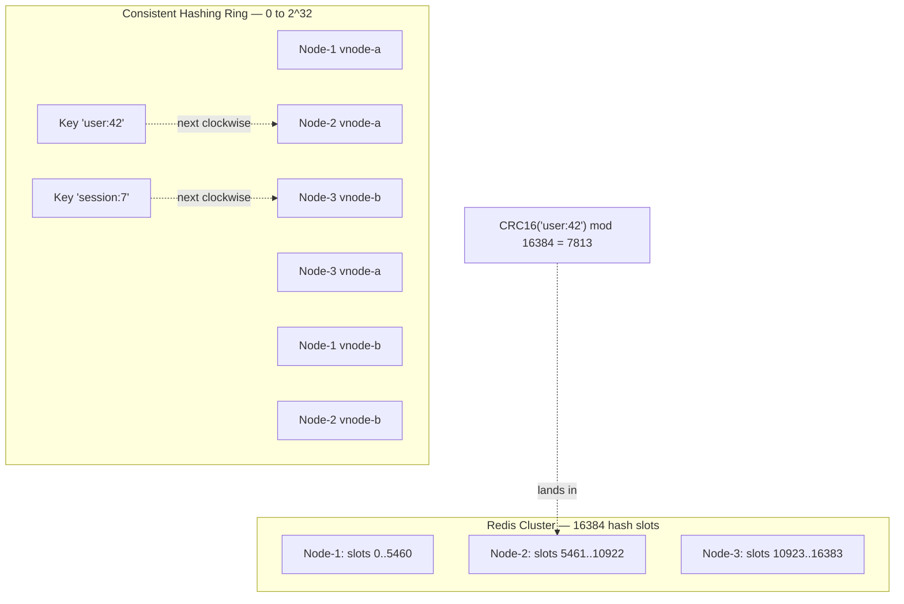

# Partitioning and Hash Slots — Consistent Hashing, Virtual Nodes, and Resharding

**Date:** 2026-05-01 | **Updated:** 2026-05-01
**Tags:** `system-design` `deep-dive` `caching` `partitioning` `consistent-hashing`

> **Parent case study:** [Design a Distributed Cache](../design-distributed-cache.md). This deep-dive expands "Partitioning".

## Table of Contents

- [Summary](#summary)
- [Overview](#overview)
- [Why Partition at All — The Single-Node Wall](#why-partition-at-all--the-single-node-wall)
- [Hash-Mod-N and the Rehash Catastrophe](#hash-mod-n-and-the-rehash-catastrophe)
- [Consistent Hashing Ring with Virtual Nodes](#consistent-hashing-ring-with-virtual-nodes)
- [Hash Slots — The Redis Cluster Approach](#hash-slots--the-redis-cluster-approach)
- [Trade-offs: Consistent Hashing vs Hash Slots](#trade-offs-consistent-hashing-vs-hash-slots)
- [Jump Consistent Hash — Minimal Memory, Maximum Speed](#jump-consistent-hash--minimal-memory-maximum-speed)
- [Rendezvous (HRW) Hashing](#rendezvous-hrw-hashing)
- [Maglev Hashing — Google's Load-Balancer Variant](#maglev-hashing--googles-load-balancer-variant)
- [Slot Ownership Migration — MOVED and ASKING](#slot-ownership-migration--moved-and-asking)
- [Rebalancing Under Load](#rebalancing-under-load)
- [Heat-of-Key vs Heat-of-Shard](#heat-of-key-vs-heat-of-shard)
- [Multi-Key Operations and Hashtag Affinity](#multi-key-operations-and-hashtag-affinity)
- [Hash Function Quality — CRC16, MurmurHash3, and Beyond](#hash-function-quality--crc16-murmurhash3-and-beyond)
- [Worked Example: Four-Node Ring, Adding a Fifth](#worked-example-four-node-ring-adding-a-fifth)
- [Anti-Patterns](#anti-patterns)
- [Related](#related)
- [References](#references)

## Summary

Partitioning is the act of splitting a logical key space across many physical servers so that no single server has to hold or serve it all. The naive answer — `shard = hash(key) % N` — is catastrophic the moment `N` changes: roughly `(N-1)/N` of all keys land on a different shard, vaporising the cache and stampeding the origin. **Consistent hashing**, introduced by Karger in 1997 and popularised by Akamai and Dynamo, fixes this by mapping both keys and nodes to points on a circular hash space; a key belongs to the next node clockwise, so adding a node only displaces `1/N` of the keys. **Virtual nodes** (each physical node taking many positions on the ring) smooth the load distribution and shrink the variance to manageable levels. **Hash slots**, Redis Cluster's variant, replace the abstract ring with a fixed 16384-slot integer space that nodes own explicit ranges of — losing some elegance for a huge gain in operational legibility (you can `CLUSTER SLOTS` and see exactly who owns what). On top of that sit specialised cousins — **jump consistent hash** for stateless dispatchers with no node list, **rendezvous hashing** for replica selection, and **Maglev** for high-throughput load balancers — each optimised for a different load and memory profile. Migrating slots between nodes brings its own protocol: Redis Cluster uses `MOVED` for permanent ownership changes and `ASKING` for in-flight migrations so that clients route correctly during a reshard. This doc covers each algorithm, its trade-offs, the migration mechanics, hashtag affinity for multi-key ops, and the worked numerical example that shows why the math actually works.

## Overview

The parent case study (`../design-distributed-cache.md`) introduces partitioning as one of the core building blocks of a distributed cache. This deep-dive opens the partitioning block and walks the algorithm space from "the obvious thing that doesn't work" through "what Memcached and Redis Cluster actually do" to "what Google does for load balancers."

The questions answered here:

1. **Why partition at all?** Single-node memory walls, throughput ceilings, and the blast-radius argument.
2. **Why doesn't `hash(key) % N` work?** A walk through the rehash catastrophe — 87% miss rate on a one-node change at N=8.
3. **What is consistent hashing actually doing?** The ring, the lookup, virtual nodes, and load variance.
4. **Why do hash slots win in practice?** Operational legibility — you can name what's wrong.
5. **When are jump-hash, HRW, and Maglev the right answer?** When you do not need a ring at all.
6. **How does migration work without dropping requests?** MOVED, ASKING, and gradual slot handoff.
7. **What about hot keys?** Partitioning hides them; you need a separate strategy (covered in the sibling doc).
8. **How do hashtags solve multi-key ops?** Forcing keys into the same slot, deliberately, with `{}`.
9. **Does the hash function choice matter?** Yes — CRC16 vs MurmurHash3 vs FNV all behave differently under skew.



The general partitioning landscape (range vs hash vs directory) lives in [`../../../scalability/sharding-strategies.md`](../../../scalability/sharding-strategies.md); this doc is specifically about the family of hash-based partitioners that minimise key movement under topology change.

## Why Partition at All — The Single-Node Wall

A single Redis or Memcached process can do remarkable work: hundreds of thousands of operations per second against tens to hundreds of GB of resident memory. So why bother with partitioning at all?

Three walls force the move:

### 1. The memory wall

A single server's RAM is bounded — typically 64 GB to 1 TB on commodity boxes. Once your working set exceeds RAM you start paging, and once you start paging the cache stops being a cache (page faults to disk are slower than the database you were trying to protect). Partitioning across `N` nodes gives you `N×` memory linearly, with no per-node tax.

### 2. The throughput wall

A single Redis process is single-threaded for command execution (Redis 6 added I/O threads but the data path is still serialised). Even a perfectly tuned instance peaks around 1M ops/sec on top hardware. Beyond that, you need to spread requests across processes — and across NICs — to get linear scale-up. Partitioning is the only honest way to do that without hacking around the engine.

### 3. The blast-radius wall

A single node's failure takes 100% of the cache with it. Partitioning into `N` shards means a single-node failure loses `1/N` of the keys. Combined with replication (covered in [`./replication-per-partition.md`](./replication-per-partition.md)), partitioning is the foundation of an availability story: shard, replicate per shard, fail one shard at a time.

These three together make partitioning non-optional once a cache is doing real work. The question is not "should we partition" but "how do we partition without making operations a nightmare."

## Hash-Mod-N and the Rehash Catastrophe

The simplest possible partitioning function:

```text
shard = hash(key) % N
```

It works perfectly while `N` is constant. The instant `N` changes — adding a server, removing a server, recovering from a failure — almost every key remaps to a different shard.

Walk through the math at `N = 8`:

- A key whose hash is `42` was on shard `42 % 8 = 2`.
- Add a 9th node. Now `42 % 9 = 6`.
- The key migrates from shard 2 to shard 6.

How many keys migrate? Roughly `(N-1)/N` of them. At `N=8` going to `N=9`, that's `8/9 ≈ 89%`. At `N=4` going to `N=5`, that's `4/5 = 80%`. At any reasonable cluster size, **the vast majority of keys land on a different shard than they used to.**

If those keys are in a cache, the consequences cascade:

1. **Cache miss avalanche.** 87% of reads miss because the lookup goes to a node that doesn't have the key.
2. **Origin stampede.** All the missed reads fall through to the database, which is sized for cache-hit traffic and has no chance of absorbing the surge.
3. **Backfill chaos.** As keys are reloaded, they get written to the new shard placement, but the old shards still hold the now-stale copies. If you ever shrink back, the stale copies surface.

This is the **rehash catastrophe**. It's not theoretical; teams have taken down production by adding a single Memcached node to a hash-mod cluster.

```text
N=8, perfect distribution: each shard owns 12.5% of keys
Add 1 node → N=9
Keys remapped: 1 - 1/9 ≈ 88.9% move
Cache hit rate immediately after rebalance: ~12% (only the keys that happened to map to the same shard)
Time to refill: minutes to hours, depending on traffic and origin throughput
```

Consistent hashing exists to fix exactly this problem.

## Consistent Hashing Ring with Virtual Nodes

The trick, due to Karger et al. (STOC 1997), is to embed both keys and nodes in the **same** hash space — typically `[0, 2^32)` arranged as a circle — and define a key's owner as **the next node clockwise from the key's hash position**.

The lookup algorithm:

```text
function find_owner(key, ring_sorted_by_position):
    h = hash(key)                          # some uniform 32-bit hash
    pos = binary_search_first_ge(ring_sorted_by_position, h)
    if pos == len(ring_sorted_by_position):
        pos = 0                             # wrap around
    return ring_sorted_by_position[pos].node
```

Why this works under topology change:

- **Adding a node** at position `P` only steals keys whose hash is between `predecessor_position` and `P`. Every other key keeps its owner. Expected key movement: `1/N` of the total.
- **Removing a node** at position `P` re-homes its keys to the next node clockwise — again, `1/N` of total keys move.

That's the headline win: **`O(1/N)` movement per topology change**, not `O((N-1)/N)`.

### Virtual nodes (vnodes)

A naive ring with one position per physical node has terrible load variance. With three nodes hashed to random positions, one node can easily own 50% of the ring and another only 15% — pure luck of the draw.

The fix: each physical node takes **many** positions on the ring. Typical values are 100–200 virtual nodes per physical node. The positions are computed by hashing `node_id || vnode_index`:

```text
for vnode in 0..VNODES_PER_NODE:
    pos = hash(node_id + ":" + vnode.to_string())
    ring.insert(pos, node_id)
```

With 100 vnodes per physical node, the load standard deviation drops to roughly `O(1/sqrt(V))` of the mean, where `V` is total vnode count. At 100 vnodes × 10 nodes = 1000 vnodes, variance is ~3% — well within tolerance. Memcached's `libketama` uses 160 vnodes per server; Cassandra historically used 256.

```python
# Pseudocode for consistent hash ring lookup with virtual nodes
class ConsistentHashRing:
    def __init__(self, vnodes_per_node=160):
        self.vnodes_per_node = vnodes_per_node
        # Sorted list of (position, physical_node_id) tuples
        self.ring = []

    def add_node(self, node_id):
        for v in range(self.vnodes_per_node):
            key = f"{node_id}#{v}".encode()
            pos = murmur3_32(key)
            # Insert maintaining sort order
            insort(self.ring, (pos, node_id))

    def remove_node(self, node_id):
        self.ring = [(p, n) for (p, n) in self.ring if n != node_id]

    def get_node(self, key):
        if not self.ring:
            return None
        h = murmur3_32(key.encode())
        # Binary search for first position >= h
        idx = bisect_left(self.ring, (h, ""))
        if idx == len(self.ring):
            idx = 0  # wrap around
        return self.ring[idx][1]
```

Lookup is `O(log V)` via binary search. Memory is `O(V)` per client — at 1000 vnodes × 12 bytes per entry, that's ~12 KB, trivial.

### What this gets you

- Adding a node → `~1/(N+1)` of keys move.
- Removing a node → `~1/N` of keys move.
- Load distribution: `~3%` standard deviation with 100+ vnodes.
- No central coordinator: every client computes the same ring from the same node list.

Dynamo (DeCandia et al., SOSP 2007) generalised this further by giving each vnode a fixed token range and using replica placement walking forward from the primary. Cassandra inherited the model.

## Hash Slots — The Redis Cluster Approach

Redis Cluster takes a different shape that gives up some elegance for a great deal of operational legibility. Instead of an abstract ring with millions of positions, the cluster has exactly **16384 hash slots**:

```text
slot(key) = CRC16(key) mod 16384
```

Each node owns an explicit, contiguous (or non-contiguous, after splits) range of slots. A 3-node cluster typically starts as:

```text
Node A: slots 0     – 5460     (5461 slots)
Node B: slots 5461  – 10922    (5462 slots)
Node C: slots 10923 – 16383    (5461 slots)
```

The 16384 number isn't magic. It was chosen because:

1. **Small enough to gossip cheaply.** Each node gossips a 2 KB bitmap (16384 / 8 = 2048 bytes) saying which slots it owns. At cluster sizes up to ~1000 nodes, this fits comfortably in cluster-bus messages.
2. **Large enough for fine-grained sharding.** With 1000 nodes, average ownership is ~16 slots per node — plenty of granularity to balance load.
3. **Aligned with how operators think.** "Slot 7813 lives on node B" is a sentence a human can say and act on. "The position 0xa3f81c4b in the ring just past virtual node #47 of node B" is not.

The trade-off: **you have to explicitly assign slots to nodes**. There is no automatic placement. `CLUSTER ADDSLOTS`, `CLUSTER SETSLOT`, and `CLUSTER COUNTKEYSINSLOT` are the operator's daily vocabulary. Adding a node is a two-step dance: bring the node up empty, then explicitly migrate slots from existing nodes to it.

This explicitness is the feature, not a bug. When a key is mis-shipped, you can diagnose it: `CLUSTER KEYSLOT mykey` tells you the slot, `CLUSTER SLOTS` tells you who owns it, and you can compare against where the client thought it was. Try doing that with an opaque ring of a million positions.

```text
> CLUSTER KEYSLOT user:42
(integer) 7813

> CLUSTER SLOTS
1) 1) (integer) 0
   2) (integer) 5460
   3) 1) "10.0.0.1"
      2) (integer) 6379
2) 1) (integer) 5461
   2) (integer) 10922
   3) 1) "10.0.0.2"
      2) (integer) 6379
3) 1) (integer) 10923
   2) (integer) 16383
   3) 1) "10.0.0.3"
      2) (integer) 6379
```

## Trade-offs: Consistent Hashing vs Hash Slots

| Aspect | Consistent hashing (Memcached, Dynamo) | Hash slots (Redis Cluster) |
|---|---|---|
| **Granularity** | Continuous, ~`2^32` positions | Fixed at 16384 slots |
| **Load smoothing** | Vnodes (100–200 per node) | Slot count (16384 ≫ N) |
| **Topology gossip** | Node positions list | 2 KB slot bitmap per node |
| **Add a node** | Computed automatically; ~`1/N` keys move | Explicit `CLUSTER SETSLOT` migration |
| **Operator visibility** | Black box (must hash key to find owner) | `CLUSTER KEYSLOT` + `CLUSTER SLOTS` |
| **Multi-key atomicity** | Best-effort (keys land where they land) | Hashtags `{...}` force same-slot |
| **Protocol** | Stateless on client | MOVED/ASKING redirects |
| **Use cases** | Stateless caches, Memcached, Dynamo derivatives | Stateful caches with replication and atomic ops |

The continuous ring is mathematically prettier and reshards more uniformly. The slot model is operationally simpler and gives multi-key atomicity a clean abstraction (hashtags). For a cache that needs replication, failover, and the occasional MULTI/EXEC, hash slots win. For a stateless one-shot key-value cache, consistent hashing is enough.

A useful mental model: **hash slots are consistent hashing with a coarse, integer-indexed ring of exactly 16384 positions, and an explicit ownership table**. Everything else flows from that.

## Jump Consistent Hash — Minimal Memory, Maximum Speed

Lamping and Veach (Google, 2014) published a remarkable algorithm: a function that takes a key's 64-bit hash and a bucket count `N` and returns the bucket index, with three properties:

1. **No state.** No ring, no slot table — just the function and `N`.
2. **`O(log N)` time.** One arithmetic loop, ~20 ns per call on modern x86.
3. **Optimal key movement.** Adding a bucket moves exactly `1/N` of keys, like consistent hashing.

The canonical 8-line C function:

```c
int32_t jump_consistent_hash(uint64_t key, int32_t num_buckets) {
    int64_t b = -1, j = 0;
    while (j < num_buckets) {
        b = j;
        key = key * 2862933555777941757ULL + 1;
        j = (b + 1) * ((double)(1LL << 31) / (double)((key >> 33) + 1));
    }
    return (int32_t)b;
}
```

That's it. Eight lines, no ring, no allocation, no virtual nodes. The mathematical argument is subtle (it derives from the observation that when `N` grows from `n-1` to `n`, exactly one bucket "captures" each key with probability `1/n`), but the function itself is trivially small.

Where jump hash shines:

- **Stateless dispatchers.** A load balancer that needs to map a session ID to one of `N` backends and has nowhere to store a ring — a few cache lines of code do the job.
- **Massive bucket counts.** Works fine at `N = 10^6` or higher. Memory is `O(1)`, not `O(N × V)`.
- **Library-poor environments.** Embedded systems, eBPF programs, Lua scripts — anywhere a 100-line ring implementation is impractical.

Where it falls down:

- **No vnode equivalent.** Load variance is `O(1/sqrt(N))` from the buckets themselves; you cannot tune it independently.
- **Rebalancing is global.** When `N` changes, every key must be re-hashed. Fine if your client just learned `N` from a config update; bad if you wanted incremental migration with MOVED-style redirects.
- **No support for arbitrary node IDs.** Buckets are integers `0..N-1`. If your nodes have UUIDs or IPs, you maintain a separate `int → node` map.

In practice, jump hash is the right answer for stateless layer-4 load balancing and a few internal Google services where `N` is large and rare-changing. For caches where you want operator-visible slot ownership and graceful migrations, ring-based consistent hashing or Redis-style hash slots remain dominant.

## Rendezvous (HRW) Hashing

Rendezvous hashing — also called Highest Random Weight (HRW), Thaler & Ravishankar 1996 — solves the partitioning problem from a different angle. Instead of mapping keys onto a ring, it asks: **for this key, which node has the highest combined hash?**

```text
function find_owner(key, nodes):
    return argmax(node in nodes) of hash(key, node)
```

That's the entire algorithm. Hash the `(key, node)` pair for every node, pick the node with the largest result.

Properties:

1. **No ring state.** Just the node list.
2. **`O(N)` per lookup.** Each lookup hashes against every node.
3. **Replica selection for free.** Want the top-2 owners? Take the two nodes with the highest hashes. Top-3? Top three. No additional protocol — the ordering falls out.
4. **Optimal key movement.** Adding a node shifts `1/N` of keys, same as consistent hashing.

Use cases:

- **Replica selection.** Distributed file systems and CDNs use HRW to pick replica nodes — the natural "top-K" property is a perfect fit.
- **Small-to-medium clusters** (under ~50 nodes), where `O(N)` lookup is cheap enough.
- **Service-discovery-friendly** — you can compute placements without any ring sync; just hash.

For caches with hundreds or thousands of nodes, the `O(N)` lookup cost adds up, and a ring or slot table wins. But for the 5-node "cache pool A" or "object replica set," HRW is often the simplest correct answer.

```python
# Rendezvous hashing — pick top-K replicas for a key
def hrw_replicas(key, nodes, k=3):
    weighted = [(hash_combine(key, n.id), n) for n in nodes]
    # Highest hashes first
    weighted.sort(reverse=True)
    return [n for (_, n) in weighted[:k]]
```

The Memcached client `libketama` uses ring-based consistent hashing; the HAProxy `hash-balance-factor` extension uses HRW for replica selection. Both are right for their scales.

## Maglev Hashing — Google's Load-Balancer Variant

Eisenbud et al. (Google, NSDI 2016) introduced **Maglev hashing**, designed for a software load balancer that needs to pick a backend per packet at line rate (10–40 Gbps NICs).

The constraints are unusual:

1. **Lookup must be O(1).** Hashing the key per packet is feasible; walking a ring is not.
2. **Backends change frequently.** Health checks, autoscaling, and rolling deploys mean the backend set churns continuously.
3. **Disruption must be bounded.** A backend leaving must not move connections from healthy backends to other healthy backends.

Maglev's answer: precompute a **lookup table** of size `M` (typically `M = 65537`, a small prime) where each slot maps to one backend. The table is computed offline by a deterministic algorithm that:

- Generates a permutation per backend (`offset` and `skip` derived from `hash(backend_id)`).
- Fills the table by round-robin over backends, each filling its next-preferred slot.
- Guarantees minimal disruption: when a backend is added or removed, the table is recomputed, and only `~1/N` of slots change owner.

```text
# Maglev table
table = array of size M
for each empty slot s in table:
    pick backend whose permutation has s as its next preference
    table[s] = that backend

# Lookup at packet time
backend = table[hash(packet.5tuple) mod M]
```

Properties:

1. **O(1) lookup.** A single mod-and-table-read. Faster than ring binary search.
2. **Smooth load.** With `M = 65537` slots over a few hundred backends, variance is well under 1%.
3. **Bounded disruption.** Adding or removing a backend changes ~`1/N` of table slots.
4. **Connection affinity.** Same 5-tuple hashes to the same slot, which maps to the same backend — connections stay sticky as long as the table is stable.

Maglev is overkill for a key-value cache (where lookups are application-level and slow enough that ring vs table doesn't matter), but it's the right model when the partitioning function is on the network packet hot path.

## Slot Ownership Migration — MOVED and ASKING

Migration is where slot-based and ring-based systems diverge most visibly. In a Memcached-style ring, the client learns the new ring on its next config refresh and routes accordingly — there is no in-flight protocol because there's no migration in progress, just two snapshots.

Redis Cluster does explicit, gradual migration with two redirect codes:

### MOVED — permanent redirection

When a node receives a command for a slot it doesn't own, it returns:

```text
-MOVED 7813 10.0.0.2:6379
```

The client interprets this as "slot 7813 lives at 10.0.0.2:6379; update your slot map and retry." This is the steady-state mechanism for client cache-coherence on slot ownership.

### ASKING — in-flight redirection during migration

During a slot migration, the source node has marked the slot as MIGRATING and the destination as IMPORTING. While migration is in progress:

- The source still owns the slot officially; clients route there by default.
- For keys already migrated to the destination, the source returns `-ASK 7813 10.0.0.2:6379`.
- The client retries against the destination, but **prefixes with `ASKING`** so the destination accepts the command even though it doesn't own the slot yet.

```text
Client → Source: GET user:42      (slot 7813)
Source → Client: -ASK 7813 10.0.0.2:6379

Client → Dest: ASKING
Dest → Client: +OK
Client → Dest: GET user:42
Dest → Client: $5\r\nvalue\r\n
```

Once the slot is fully migrated and `CLUSTER SETSLOT 7813 NODE <dest>` is broadcast, future requests get a regular `MOVED` and clients update their slot maps permanently.

```python
# MOVED/ASKING redirect handling in a Redis Cluster client
def execute(client, command):
    target = client.slot_map[client.slot_for(command.key)]
    asking = False
    for attempt in range(MAX_REDIRECTS):
        conn = client.connect(target)
        if asking:
            conn.send("ASKING")
            conn.read()  # +OK
            asking = False
        conn.send(command)
        reply = conn.read()
        if reply.is_moved():
            slot, host_port = reply.parse_moved()
            client.slot_map[slot] = host_port  # update permanently
            target = host_port
            continue
        if reply.is_ask():
            slot, host_port = reply.parse_ask()
            target = host_port
            asking = True  # one-shot, do NOT update slot_map
            continue
        return reply
    raise TooManyRedirects
```

The two-code design is deliberate: `MOVED` updates the client's slot map (it's a stable fact); `ASK` does not (it's a transient detour during migration). Mixing them up causes clients to chase migrating slots indefinitely.

## Rebalancing Under Load

Slot migration in production happens while the cluster is serving traffic. Two strategies coexist:

### 1. Bucket-by-bucket (Redis Cluster default)

Slots are migrated one at a time. For each slot:

1. `CLUSTER SETSLOT <slot> MIGRATING <dest>` on the source.
2. `CLUSTER SETSLOT <slot> IMPORTING <source>` on the destination.
3. Loop: `CLUSTER GETKEYSINSLOT <slot> <count>` then `MIGRATE` each key in batches.
4. When the slot is empty: `CLUSTER SETSLOT <slot> NODE <dest>` on every cluster node.

This is gradual, observable, and reversible at any point. Operators can pause, throttle, or roll back. The downside: it's serial, so migrating thousands of slots takes a long time at conservative rates.

### 2. Whole-key migration

For systems with smaller key sizes and idempotent loads, you can move all keys belonging to a slot in a single batch operation, atomically swap ownership, and let the client take a few `MOVED` redirects. Faster, less observable, and harder to abort partway. Used in some Cassandra-style range moves and in custom in-house cache systems.

The bucket-by-bucket pattern is dominant because it composes well with rate limits and circuit breakers: if one slot migration starts hurting, you stop after that slot, not after thousands.

### Throttling

Migration rates are typically expressed in keys per second per source node, with a global cap to bound network use:

```text
MIGRATE_RATE_PER_NODE = 1000 keys/sec
MIGRATE_BANDWIDTH_CAP = 50 MB/s
PARALLEL_MIGRATIONS = 1   # one slot at a time per source-dest pair
```

Real clusters tune these based on the source's CPU headroom and the destination's memory growth rate.

## Heat-of-Key vs Heat-of-Shard

Partitioning solves the question "where does this key live?" It does **not** solve the question "is this key hot?"

A perfectly balanced ring still suffers when one key receives 100x the QPS of others. That key sits on one shard, and that shard absorbs all the traffic — the rest of the cluster is idle while one node burns. This is the **hot key problem**.

Three observations:

1. **Heat-of-shard** (some shards have more keys or larger keys than others) is what consistent hashing and slots are designed to balance. Vnodes and 16384 slots take care of this within a few percent.
2. **Heat-of-key** (one key dominates traffic) is invisible to the partitioner. The partitioner only sees `hash(key)` — it has no idea about traffic.
3. **Mitigation requires different mechanisms.** Replica fanout, key splitting, in-process caching at the client. These are covered in detail in [`./hot-key-handling.md`](./hot-key-handling.md).

The takeaway for partitioning design: do not try to encode hot-key handling into the hash function. Choose a partitioner that gives smooth heat-of-shard distribution and address heat-of-key separately. Conflating the two leads to bad partitioners and worse hot-key strategies.

## Multi-Key Operations and Hashtag Affinity

Once you partition, multi-key operations become awkward. `MSET k1 v1 k2 v2 k3 v3` only works if all three keys live on the same shard. Otherwise the client has to issue three separate commands, lose atomicity, and reassemble.

Redis Cluster's answer: **hashtags**. If a key contains `{...}`, only the bytes inside the braces are hashed:

```text
key:                slot:
{user:42}.profile   CRC16("user:42") mod 16384 = 7813
{user:42}.cart      CRC16("user:42") mod 16384 = 7813
{user:42}.orders    CRC16("user:42") mod 16384 = 7813
```

All three keys land in slot 7813, on the same node. `MSET {user:42}.profile p {user:42}.cart c {user:42}.orders o` becomes atomic — the cluster can route the entire command to one node and execute it as a regular Redis MULTI/EXEC.

Hashtag rules:

- Only the **first** `{...}` is used. `{a}{b}` hashes `a`, not `b`.
- Empty `{}` is ignored — the full key is hashed.
- The braces themselves are not part of the hash input.

This gives application authors deliberate co-location: `{shard_key}.field1`, `{shard_key}.field2`, etc. The trade-off: you've manually decided which keys share a shard, so if `{user:42}` becomes hot, all the user's keys are on the same node — the hot-key problem is now per-user. Use hashtags only for keys that genuinely need atomicity.

A non-Redis design alternative: support multi-key operations only via client-side fan-out, never atomic across shards. This is what Memcached does — multi-get is "send N gets to the relevant N shards in parallel and gather." Simpler, no atomicity, no hashtag concept. Different point in the design space.

## Hash Function Quality — CRC16, MurmurHash3, and Beyond

The choice of hash function matters more than people expect, in two dimensions:

### 1. Distribution uniformity

A bad hash function with non-uniform output gives uneven shard load even with a perfect partitioner. For partitioning, you want:

- **Avalanche**: flipping one input bit flips ~50% of output bits.
- **Uniform output**: every output value appears roughly equally over a large key space.
- **Speed**: hashing is on every cache lookup, so every nanosecond counts.

CRC16 (used by Redis Cluster) is fast and has good enough distribution for slot indexing because its 16-bit output is then taken `mod 16384` — small distributions don't matter much when the range is small. MurmurHash3 (used by many cache clients including Cassandra and libketama variants) is excellent across all output sizes. FNV-1a is fast but has weaker distribution for short keys.

### 2. Collision behavior under adversarial input

If your cache exposes user-controllable keys (URL paths, user IDs), an attacker who knows the hash function can craft keys that collide on one shard, creating a denial-of-service via artificial hot-shard. This is the **hash-flooding attack**.

Mitigations:

- **Keyed hashes** (SipHash-1-3 with a server-side secret) are the standard defence. Used by Python's `dict`, Rust's `HashMap`, and most modern hash tables.
- **For caches that don't accept user input directly**, CRC16 / MurmurHash3 are fine.
- **For internet-facing caches**, treat the hash function as security-relevant and seed it with a cluster secret.

Redis Cluster's CRC16 is a deliberate choice for stability — the slot for `user:42` must be the same on every client and every server, with no per-cluster secret to keep in sync. Memcached clients similarly use stable hashes (libketama is MD5-based but the choice is determined by the client library, not the server). The cost is exposure to hash-flooding; the benefit is operational simplicity.

```text
# Slot computation in a Redis Cluster client (canonical)
def slot_for(key):
    # Honor hashtag: hash only the first {...} substring if present and non-empty
    open_brace = key.find('{')
    if open_brace >= 0:
        close_brace = key.find('}', open_brace + 1)
        if close_brace > open_brace + 1:
            key = key[open_brace + 1 : close_brace]
    return crc16_xmodem(key.encode()) % 16384
```

Note the `mod 16384` is `& 0x3FFF` since 16384 is a power of two — single bitwise AND, fast.

## Worked Example: Four-Node Ring, Adding a Fifth

Concrete numbers make the difference between "I read about consistent hashing" and "I understand consistent hashing."

### Setup

- 4 physical nodes: `N1, N2, N3, N4`.
- 100 vnodes per physical node → 400 ring positions total.
- Hash space: `[0, 2^32)`.
- Key space: 1,000,000 keys, uniformly hashed.

### Initial state

Each physical node owns roughly `1,000,000 / 4 = 250,000` keys, with `~3%` standard deviation from vnode randomness:

```text
N1: ~252,300 keys
N2: ~248,100 keys
N3: ~250,600 keys
N4: ~249,000 keys
Total: 1,000,000
```

### Adding N5

Insert 100 vnodes for N5 at random positions. Each new vnode steals a contiguous arc from its clockwise predecessor.

Expected key movement: `1/5` of the total = `~200,000 keys`.

Redistribution after adding N5:

```text
N1: ~200,200 keys  (lost ~52,000 to N5)
N2: ~199,400 keys  (lost ~48,700)
N3: ~200,800 keys  (lost ~49,800)
N4: ~199,500 keys  (lost ~49,500)
N5: ~200,100 keys  (gained from all four)
Total: 1,000,000
```

Crucially, **N1's loss was to N5, not to N2/N3/N4**. The other nodes' keys stay where they are. This is the structural property: `1/N` movement, distributed across the cluster's existing nodes by giving up their share.

### Compare to hash-mod-N

Same setup with `shard = hash(key) % N`:

- Initial: each node owns 250,000 keys.
- After adding N5: `hash(key) % 5` reshuffles everything.

Expected key movement: `1 - 1/5 = 80% = 800,000 keys`.

That's a 4× difference: 200K vs 800K keys reassigned. In cache terms, that's the difference between a 20% miss spike (recoverable in seconds) and an 80% miss spike (origin in flames for minutes).

### The variance question

Vnodes deliver smooth load but not perfect load. With 100 vnodes per node, expected variance is `~3%`. To halve it, you need 4× the vnodes — 400 per node, 2000 total. Memory and lookup cost grow with vnode count, so most systems land at 100–200 as a sweet spot.

For Redis Cluster's slot model, the 16384 slots are split exactly evenly by default (with 5 nodes: 3276–3277 slots each), so there's no random vnode variance — the operator has placed slots deterministically. The trade-off: precision instead of mathematical elegance.

## Anti-Patterns

1. **Hash-mod-N partitioning in production.** "It's so simple — just `hash(key) % N`." Until N changes. Then 80–90% of keys remap, the cache evaporates, and the origin database melts. Use consistent hashing or hash slots; never `% N`.
2. **One vnode per physical node.** "We don't need that many positions." With three nodes and one position each, load skew of 2:1 is normal. Use 100–200 vnodes per node, or use a slot-based system with 1000+ slots per node.
3. **Hashing the full key when you wanted hashtag affinity.** `MSET user:42:profile p user:42:cart c` — the keys hash independently and land on different shards. The MSET fails with `CROSSSLOT`. Use hashtags `{user:42}.profile`, `{user:42}.cart`.
4. **Hashtagging everything.** Wrapping every key with `{user_id}` co-locates a user's data — and creates an instant per-user hotspot for any heavy user. Use hashtags only when atomicity is genuinely required.
5. **Floating-point hash output as a slot index.** `slot = floor(murmur(key) / 2^32 * 16384)` introduces float-rounding non-determinism that can disagree across CPU architectures. Use integer arithmetic only: `slot = murmur32(key) & 0x3FFF`.
6. **Recomputing the ring on every lookup.** Some naive implementations rebuild the sorted vnode list per lookup. The ring is built once at config-update time; lookups are pure binary search. O(V log V) build, O(log V) lookup.
7. **Treating the slot table as authoritative without gossip.** A client whose slot map is stale will keep sending requests to the wrong node and getting MOVED redirects. Honor the redirects — they're the cheap update path. Refresh the full slot map only on connection setup or on too many redirects in a row.
8. **Migrating slots without ASKING.** Naive migration just copies keys from source to destination and updates the slot map. During the copy window, in-flight reads land on the source for keys already migrated. The ASKING protocol exists exactly to handle this; skipping it produces phantom misses and silent inconsistency.
9. **Using a hash function with poor avalanche on short keys.** FNV-1a or `hash = sum_of_bytes(key)` produce clusters for similar short keys (`user:1`, `user:2`, `user:3` all near-adjacent in hash space). MurmurHash3 or CRC16 spread them properly.
10. **Ignoring hash-flooding for internet-facing caches.** A user-controlled URL path that becomes a cache key, hashed with CRC16, lets an attacker craft URLs that all hash to the same slot — creating a hot-shard DoS. Use SipHash with a cluster secret for any user-controllable key namespace.
11. **Conflating partitioning and replication.** "We have 3 replicas, so each shard is on 3 nodes — that's our partitioning." No — replication is a separate axis (covered in `replication-per-partition.md`). The partitioner picks the **primary**; the replication strategy picks the secondaries. Conflating them produces designs where a primary-promotion changes partitioning behavior, which is a bad idea.
12. **Migrating an entire shard at once during peak hours.** Even with bucket-by-bucket migration, doing thousands of slots back-to-back at peak traffic can saturate the source's CPU or the destination's network. Throttle migrations, prefer off-peak windows, and abort gracefully on rising p99.
13. **Forgetting to update the slot map on every cluster node.** `CLUSTER SETSLOT <slot> NODE <dest>` must propagate via gossip. If one node's view is stale, requests routed there get a wrong `MOVED`, and clients ping-pong. Wait for gossip convergence (a few seconds) before considering the migration complete.
14. **Letting the partitioner hide hot keys.** The partitioner can't see hot keys — only access patterns can. Don't ask the partitioner to "spread out heavy users." That's the hot-key problem; solve it with replication or local caching, not by reshaping the hash function.
15. **Persisting client-side ring state across restarts.** A client that boots with last week's ring config will route to the wrong nodes until it learns. Always fetch the live cluster topology at startup; treat any cached topology as best-effort and verify on first request.

## Related

- [`./replication-per-partition.md`](./replication-per-partition.md) — sibling deep-dive; replication is the orthogonal axis to partitioning. The partitioner picks the primary; the replication scheme places the secondaries. Together they define the durability and availability story.
- [`./hot-key-handling.md`](./hot-key-handling.md) — sibling deep-dive; the partitioner cannot see traffic skew, so hot keys need a separate strategy (replica fanout, key splitting, client-side caching). Read together with this doc.
- [`./topology-awareness.md`](./topology-awareness.md) — sibling deep-dive; clients that route to the right shard need a fresh view of the topology. Covers gossip, slot-map refresh, and the MOVED-redirect feedback loop.
- [`../design-distributed-cache.md`](../design-distributed-cache.md) — parent case study; this doc expands the *Partitioning — Consistent Hashing Ring with Hash Slots* deep-dive subsection.
- [`../../../scalability/sharding-strategies.md`](../../../scalability/sharding-strategies.md) — foundation; the broader partitioning landscape including range, hash, and directory-based schemes. Hash partitioning (this doc) is one branch of that tree.
- [`../../../data-structures/consistent-and-rendezvous-hashing.md`](../../../data-structures/consistent-and-rendezvous-hashing.md) — foundation; the algorithmic primitives — ring, vnodes, HRW, jump hash — independent of any specific cache.

## References

- Karger, Lehman, Leighton, Levine, Lewin, Panigrahy — [*Consistent Hashing and Random Trees: Distributed Caching Protocols for Relieving Hot Spots on the World Wide Web*](https://www.cs.princeton.edu/courses/archive/fall09/cos518/papers/chash.pdf) (STOC 1997). The original consistent hashing paper. Introduces the ring construction and proves the `O(1/N)` movement property. Akamai's architectural foundation.
- Lamping & Veach — [*A Fast, Minimal Memory, Consistent Hash Algorithm*](https://arxiv.org/abs/1406.2294) (Google, 2014). Jump consistent hash. Eight lines of C, no state, optimal key movement. Useful for stateless dispatchers and large bucket counts.
- Eisenbud, Yi, Contavalli, Smith, Kononov, Mann-Hielscher, Cilingiroglu, Cheyney, Shang, Hosein — [*Maglev: A Fast and Reliable Software Network Load Balancer*](https://research.google/pubs/maglev-a-fast-and-reliable-software-network-load-balancer/) (NSDI 2016). Google's L4 load-balancer hashing scheme. O(1) lookup via precomputed table, bounded disruption on backend changes.
- Redis Cluster Specification — [*Redis Cluster Reference*](https://redis.io/docs/management/scaling/). The authoritative spec for hash slots, MOVED/ASKING redirects, slot migration, gossip, and failover. Read with the live-reconfiguration tutorial for the operational view.
- Redis Cluster live reconfiguration — [*Cluster live reconfiguration*](https://redis.io/docs/management/scaling/#cluster-live-reconfiguration). The migration protocol in detail: SETSLOT MIGRATING/IMPORTING, GETKEYSINSLOT, MIGRATE, and the ASKING handshake. The operational manual for resharding.
- DeCandia, Hastorun, Jampani, Kakulapati, Lakshman, Pilchin, Sivasubramanian, Vosshall, Vogels — [*Dynamo: Amazon's Highly Available Key-value Store*](https://www.allthingsdistributed.com/files/amazon-dynamo-sosp2007.pdf) (SOSP 2007). Generalised consistent hashing with virtual nodes for replica placement. The blueprint that Cassandra, Riak, and Voldemort built on.
- Thaler & Ravishankar — [*A Name-Based Mapping Scheme for Rendezvous*](https://www.eecs.umich.edu/techreports/cse/96/CSE-TR-316-96.pdf) (1996). Highest Random Weight (HRW) hashing. Per-key argmax over `hash(key, node)`. Natural top-K selection, ideal for replica placement at small to medium scale.
- libketama — [*ketama consistent hashing library*](https://github.com/RJ/ketama). The reference Memcached client-side consistent-hashing implementation; 160 vnodes per server hashed via MD5. Defined the Memcached client interoperability standard.
