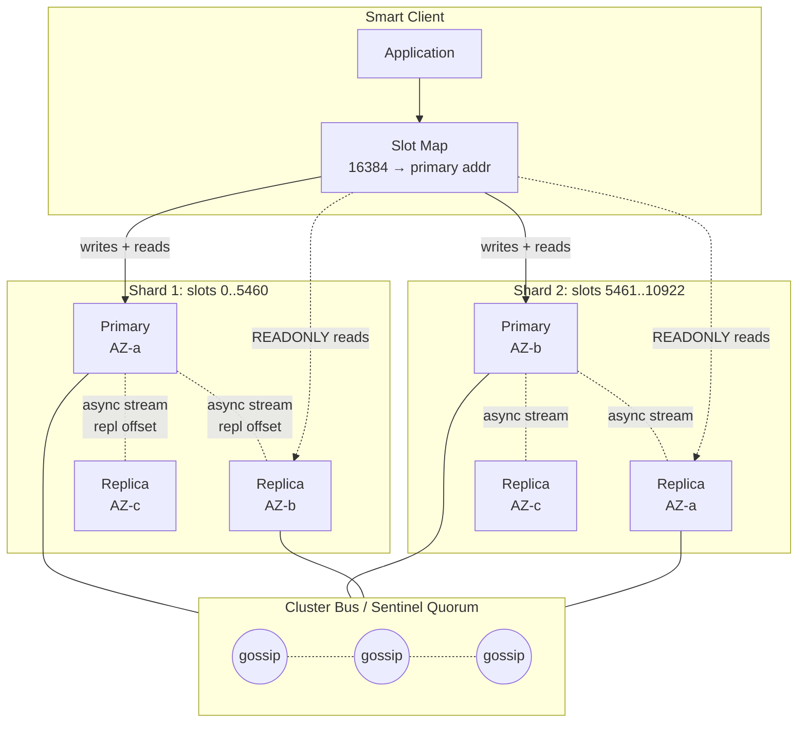

# Cache Replication — Primary-Replica, Async Streams, and Failover Trade-offs

**Date:** 2026-05-01 | **Updated:** 2026-05-01
**Tags:** `system-design` `deep-dive` `caching` `replication` `availability`

> Companion deep dive to [`../design-distributed-cache.md`](../design-distributed-cache.md), expanding **Deep Dive 2 — Replication — Primary-Replica per Partition**. Read the parent's "High-Level Design" and the partitioning deep dive [`./partitioning-and-hash-slots.md`](./partitioning-and-hash-slots.md) first; this doc assumes the cluster is already sharded into hash slots and that each shard is one logical partition with replicas.

## Table of Contents

- [Summary](#summary)
- [Overview](#overview)
- [Why Replicate a Cache at All](#why-replicate-a-cache-at-all)
- [Primary-Replica per Partition](#primary-replica-per-partition)
- [Async Replication — Why It's the Default](#async-replication--why-its-the-default)
- [Replication Lag and Stale Replica Reads](#replication-lag-and-stale-replica-reads)
- [The Failover Problem — Lost Writes on Promotion](#the-failover-problem--lost-writes-on-promotion)
- [Sentinel and Cluster Bus — Leader Election in Practice](#sentinel-and-cluster-bus--leader-election-in-practice)
- [Quorum-Based Caches — A Different Trade-off](#quorum-based-caches--a-different-trade-off)
- [Multi-AZ Deployment](#multi-az-deployment)
- [Multi-Region Replication](#multi-region-replication)
- [Read-from-Replica and the Consistency Surprise](#read-from-replica-and-the-consistency-surprise)
- [WAIT and Min-Replicas Knobs](#wait-and-min-replicas-knobs)
- [Persistence vs Replication](#persistence-vs-replication)
- [Topology Change Handling on the Client Side](#topology-change-handling-on-the-client-side)
- [Capacity Planning — The Replica Tax](#capacity-planning--the-replica-tax)
- [Worked Example — 3-Node Primary + 3 Replicas Failover Timeline](#worked-example--3-node-primary--3-replicas-failover-timeline)
- [Anti-Patterns](#anti-patterns)
- [Related](#related)
- [References](#references)

## Summary

Cache replication is the place where the cache's "fail open" promise meets reality. A single primary per shard is fast and simple; the moment that primary dies, every key in its slot range is unreachable until something takes over. The standard answer in the Redis lineage is **one or more asynchronous replicas tailing each primary**, with cluster-wide consensus to promote a replica when the primary fails. This doc walks the design — why async is right for caches even though it loses writes on failover, how Redis Sentinel and Cluster Bus actually run the election, where multi-AZ buys you availability and multi-region does not (until you pay for active-active CRDTs), and the half-dozen knobs (`WAIT`, `min-replicas-to-write`, `cluster-replica-validity-factor`) that let you trade availability for durability when you must.

The framing line: **a cache replica exists to make failover survivable, not to make writes durable.** The moment you start treating replicas as durable storage you have either reinvented a database or set yourself up for the surprise where a primary's `+OK` reply doesn't mean the data exists anywhere else yet. Quorum-based stores like etcd and Consul KV solve a different problem; they are correct for configuration data and wrong for general-purpose caching because the write latency is a deal-breaker on the hot path.

## Overview



A few invariants this picture encodes:

- **Each shard has exactly one primary at any given time.** All writes for that shard's slot range go to it.
- **Replicas tail the primary's replication stream.** They are read-mostly; writes to a replica are rejected unless `READONLY` mode is explicitly negotiated by the client and even then only `GET`-class commands work.
- **Replicas are spread across availability zones (AZs).** A primary in `us-east-1a` should not have its replica in `us-east-1a`; that defeats the AZ failure model.
- **Primaries gossip with each other** over the cluster bus (or, in non-cluster Redis, Sentinel processes vote). The gossip layer is what detects failure and chooses promotions.
- **The replication stream itself is async by default.** A primary acknowledges writes before they reach replicas. This is the load-bearing design choice the rest of the doc is about.

## Why Replicate a Cache at All

Three independent reasons, each strong enough on its own:

**1. High availability through failover.** A single primary failing takes its slot range offline until something replaces it. With no replica, "replacement" means restoring from backup (assuming you even have one) or starting an empty node and rewarming from the database — which is a stampede the database almost certainly cannot absorb. With a hot replica, failover is "promote the replica, repoint clients" and the cache is online again in seconds with the working set already warm. The single-replica-per-primary design is the cheapest way to convert "10-minute outage + cold-start stampede" into "30-second blip."

**2. Read scale-out.** A single primary is single-threaded in Redis (mostly true even in 6.0+ with threaded I/O — the command execution itself is still serial). One primary tops out around 100 K ops/sec for `GET`-heavy workloads. Adding a replica doubles available read capacity *if* the application is willing to read from replicas. Three replicas quadruple it. This is the cheapest horizontal scaling lever for read-heavy caches that don't need read-after-write within the same primary, and is why ElastiCache's "reader endpoint" exists. The catch — covered below — is that replica reads return stale data, which is a correctness bug for some workloads.

**3. Disaster recovery.** Multi-AZ replication survives a single AZ outage. Multi-region replication (cross-region replica or active-active CRDT) survives a regional outage. Neither is "free" — multi-region adds 50–150 ms of replication lag because the WAN RTT — but for caches that gate revenue (sessions, shopping carts, ad targeting) the cost is justified. Without DR, an AZ-scope event like AWS's `us-east-1` issues becomes a complete cache cold-start across the surviving AZs.

The thing that's *not* a reason: **durability**. Replication is not a substitute for persistence. A write that's been acknowledged by the primary but not yet streamed to a replica is gone if the primary crashes — see [Persistence vs Replication](#persistence-vs-replication). Treating replicas as a durability story is the most common cache misconfiguration in the wild.

## Primary-Replica per Partition

The basic shape is simple. Each partition (slot range, in Redis Cluster's case 0–5460 for shard 1, etc.) has:

- **One primary** that accepts writes. The primary holds the authoritative state of all keys whose CRC16 falls in its slot range.
- **N replicas** (typically N=1 in dev, N=2–3 in production for serious workloads). Each replica is a hot standby maintaining a near-real-time copy via the replication stream.
- **A replication offset** — a monotonically increasing byte counter representing how much of the primary's command stream the replica has consumed. The lag in bytes is `master_repl_offset - slave_repl_offset`.

The replication stream protocol in Redis is **PSYNC** (Partial SYNC). It's worth sketching because the same shape shows up in many other systems:

```text
# Replica connecting to Primary for the first time:
Replica → Primary:  PSYNC ? -1
                    (I have no replication ID and no offset; please send me everything)
Primary → Replica:  +FULLRESYNC <repl_id> <offset>
                    $<size>\r\n<RDB snapshot bytes>
                    *3\r\n$3\r\nSET\r\n$3\r\nfoo\r\n$3\r\nbar\r\n
                    *2\r\n$3\r\nDEL\r\n$3\r\nbaz\r\n
                    ...

# Replica reconnecting after a brief disconnect:
Replica → Primary:  PSYNC <repl_id> <last_offset>
                    (I had this stream up to byte N; can you continue from there?)
Primary → Replica:  +CONTINUE
                    *3\r\n$3\r\nSET\r\n...
                    (only the bytes from N onward, drawn from the replication backlog)

# If primary's backlog has rolled past the requested offset:
Primary → Replica:  +FULLRESYNC <new_repl_id> <new_offset>
                    (full resync; partial wasn't possible)
```

The two key data structures the primary maintains:

- **Replication ID** — a 40-character hex string that names the current "stream identity." When a replica is promoted to primary, it generates a new replication ID; old replicas asking to resume from the old ID will be told to do a full resync. This prevents the split-brain failure where two former replicas both think they're primary and start streaming inconsistent data to each other.
- **Replication backlog** — a fixed-size circular buffer of recent commands (default 1 MB; production tuning 256 MB+). It buffers writes so that a briefly disconnected replica can `PSYNC <id> <offset>` and skip a full resync. Sized too small, every blip becomes a full RDB transfer; sized too large, you waste primary RAM.

Production-grade tuning of `repl-backlog-size` is the single most operationally important replication knob. A 30-second network blip at 50 MB/s of replication traffic needs at least 1.5 GB of backlog to avoid full resync. Full resync under load can saturate primary CPU (RDB serialization is single-threaded by default; `repl-diskless-sync` mitigates) and replica network for minutes.

## Async Replication — Why It's the Default

Redis replication is asynchronous by default. The sequence on a write is:

```text
Client → Primary:  SET k v
Primary internal:  apply command in-memory (~5 µs)
                   append command to replication backlog
Primary → Client:  +OK                                   ← acknowledge here
Primary → Replica: stream the command (microseconds to milliseconds later)
Replica internal:  apply command in-memory
                   advance replica replication offset
                   (no ack required; primary doesn't wait)
```

The latency budget on the write is dominated by the network RTT to the client plus the command parse and apply. The replication step is decoupled from the response.

**Why this is the right default for caches:**

- **Latency.** Sync replication on every write turns a 0.3 ms p50 write into a 1.5 ms p50 write — a 5× hit for the value of one extra durability point. On a cache where 99% of operations are reads, the write path is rarely the bottleneck, but the multiplier shows up under load.
- **Availability.** Sync replication couples primary write availability to replica health. If the only replica is briefly slow (GC pause, network blip, AOF rewrite), every primary write blocks. Async replication lets the primary keep accepting writes through transient replica issues; lag grows briefly and recovers.
- **Cache semantics tolerate loss.** The cache is not the source of truth. A write lost on failover means the next read for that key misses, hits the database, and repopulates the cache. The user-visible effect is a millisecond of extra latency on one request, not data loss. This is the entire reason caches can afford async — durable systems can't.

The deal you're making with async replication is precisely: **on a primary crash, the last few hundred milliseconds of writes are gone**. For a cache, that's an acceptable failure mode because the database still has the truth. For an OLTP database, it would be catastrophic. The conflation of these two situations — applying database-grade durability requirements to a cache, or vice versa — is the underlying error in most "we lost cache data on failover and now production is on fire" postmortems.

## Replication Lag and Stale Replica Reads

Even on a healthy cluster, replicas lag the primary. Typical observed lag:

| Condition | Lag |
|---|---|
| Healthy intra-AZ replication, low write load | 1–5 ms |
| Healthy intra-AZ, high write load (10K+ writes/sec) | 10–50 ms |
| Cross-AZ replication | 5–20 ms |
| Cross-region replication | 50–150 ms (RTT-bound) |
| Replica catching up after a brief disconnect | 100s of ms to seconds |
| Replica falling behind (saturated link, long-running primary command) | unbounded; alert at 1 s |

The lag is observable on the primary via `INFO replication`:

```text
master_repl_offset:1238947293
slave0:ip=10.0.1.5,port=6379,state=online,offset=1238947180,lag=0
slave1:ip=10.0.2.5,port=6379,state=online,offset=1238946012,lag=1
```

`lag` is in seconds and is the time since the replica last responded to a `REPLCONF ACK` heartbeat — a coarse-grained signal. The byte-offset gap (`master_repl_offset - slave_offset`) is the more honest measurement.

**The consistency surprise** — a client that writes to the primary, then immediately reads from a replica, will frequently miss its own write. This is the "read-your-writes" anti-pattern made concrete:

```text
client: SET cart:u_42 "{items:[A,B,C]}"  → +OK   (to primary)
client: GET cart:u_42 (READONLY mode)    → "{items:[A,B]}"  (stale replica!)
```

For a cache the right answer is almost always **never read your own writes from a replica**. Either:
1. Pin the connection to the primary for sessions where read-after-write matters.
2. Read from replicas only for keys you didn't just write (advisory, browse-style traffic).
3. After a write, briefly route subsequent reads to the primary for that key (~1 second TTL on a "stick to primary" flag in the client).

See [`../../../data-consistency/quorum-and-tunable-consistency.md`](../../../data-consistency/quorum-and-tunable-consistency.md) for the full treatment of why read-your-writes is a separate consistency guarantee from monotonic reads, and what the trade-off looks like in tunable systems.

## The Failover Problem — Lost Writes on Promotion

When a primary dies, the cluster promotes a replica. The promoted replica becomes the new authority, but it can be missing writes the dead primary acknowledged. Concretely:

```text
t=0    Primary P writes acknowledged at offset 1000
t=10   P streams up to offset 950 to replica R1, R2
t=15   P acks new write at offset 1010 (now ahead by 60 bytes)
t=16   P crashes hard (kernel panic, network partition, hardware failure)
t=18   Cluster detects P is dead
t=20   R1 (offset 950) and R2 (offset 970) compete to be promoted
t=21   R2 wins (more up-to-date)
t=22   R2 is the new primary at offset 970

       The 40 bytes of writes between offset 970 and 1010 are gone forever.
```

Three things to note:

**Election picks the most up-to-date replica.** Redis Cluster's election uses replication offset as the primary tiebreaker — replicas with higher offsets get election priority. This minimizes (but does not eliminate) lost writes. Sentinel does the same.

**The clients that received `+OK` for the lost writes will be surprised.** From their perspective, they wrote a value and got success; the next read from the new primary returns the old value (or a miss). For a cache, this is the "fail open" path — the read becomes a miss, the database is consulted, the cache repopulates. For a system that misuses cache as durable storage, this is data loss.

**Split brain is a real failure mode.** If P recovers (turns out it was a network partition, not a hardware failure) and the cluster has already promoted R2, you now have two nodes both claiming primacy for the same slot range. Redis Cluster handles this via `cluster-replica-validity-factor` and the cluster epoch — when P rejoins, it sees a higher epoch number on the cluster bus, and demotes itself to replica of R2 (synchronizing from R2's stream). Sentinel-managed Redis has the same flow. The protocol is correct; the failure mode you have to design for is *brief* split-brain (a few seconds) where two clients connected to two different "primaries" see different states.

The mitigation for the lost-writes window — `WAIT` and `min-replicas-to-write` — is covered below.

## Sentinel and Cluster Bus — Leader Election in Practice

Two architectures in the Redis ecosystem do roughly the same thing.

**Redis Sentinel** (the older, non-cluster topology):
- A separate fleet of Sentinel processes (typically 3 or 5, on dedicated hosts) monitors a master+replicas group.
- Sentinels gossip with each other and with the data nodes.
- When `down-after-milliseconds` (default 30s) elapses without a primary response, the Sentinel that detected it asks others to confirm. A **quorum** of Sentinels (configurable; typically `floor(N/2) + 1`) must agree before the primary is marked `+sdown` (subjective down) → `+odown` (objective down).
- Sentinels then run a Raft-like leader election among themselves to pick which Sentinel will execute the failover.
- That leader picks a replica (highest replication offset, lowest replica priority number, most consistent with the master's replication ID), sends it `REPLICAOF NO ONE`, and instructs other replicas to `REPLICAOF <new_primary>`.
- Sentinels publish the new topology to subscribed clients via pub/sub.

**Redis Cluster Bus** (the cluster topology):
- No separate Sentinel fleet. Each cluster node (primary or replica) participates in the cluster bus, a separate TCP port (data port + 10000) for gossip.
- Nodes ping each other periodically; missing pings beyond `cluster-node-timeout` (default 15s) marks a node `PFAIL` (possibly failed) locally.
- A node marks another `FAIL` when a majority of *primaries* report `PFAIL` for it.
- When a primary is marked `FAIL`, its replicas race to be elected. They request votes from the surviving primaries, weighted by replication offset (highest first). A replica wins if a majority of primaries vote for it within a configurable window.
- The winning replica issues `CLUSTER FAILOVER TAKEOVER` (or the automatic version), takes over the slot range, and bumps the cluster epoch.

**Failover state machine** (idealized — covers both Sentinel and Cluster Bus):

```pseudocode
states = {HEALTHY, PFAIL, FAIL, ELECTING, PROMOTING, STABILIZING}

on each primary P:
  state := HEALTHY

  loop:
    pong = ping_with_timeout(P, ping_interval)
    if pong:
      state := HEALTHY
      reset failure counter
    else if failure_counter >= node_timeout:
      state := PFAIL              # local belief

    gossip my view to peer primaries
    receive peer views

    if peer_majority_reports_pfail(P):
      state := FAIL
      broadcast FAIL message

    if state == FAIL and I am a replica of P:
      candidate_offset = my replication offset
      request_votes(candidate_offset)
      if granted_votes >= primary_majority:
        state := ELECTING → PROMOTING
        execute REPLICAOF NO ONE
        bump cluster epoch
        broadcast new topology
        state := STABILIZING
        wait for clients to update slot maps (MOVED responses do this)
        state := HEALTHY (as new primary)
```

**Why a quorum of *primaries* and not *all nodes***. Replicas don't vote in Cluster Bus elections — only primaries do. This prevents a topology with many replicas and few primaries from being dominated by replica votes during partition. It also matches the spirit of "decisions about who gets promoted are made by surviving authoritative nodes."

**The `cluster-replica-validity-factor` tweak.** A replica that has been disconnected from its primary for `(replica-validity-factor × node-timeout)` seconds is considered too stale to be promoted. Default factor 10 means a replica disconnected for 150s+ is ineligible. This prevents promoting a replica with hours of lag — better to leave the slot range offline (fail open: clients see errors and skip cache) than to promote an ancient replica.

## Quorum-Based Caches — A Different Trade-off

Some "caches" don't use primary-replica with async at all — they use **quorum-based consensus**, typically Raft. Examples: **etcd**, **Consul KV**, **ZooKeeper**, and to a lesser extent **HashiCorp Nomad's KV**. These are configuration stores and service-discovery registries that *can* be used as caches, but the design intent is durability and consistency over throughput.

The trade-off:

| Aspect | Async primary-replica (Redis, Memcached + repl) | Quorum (etcd, Consul KV) |
|---|---|---|
| Write latency | 0.3–1 ms | 5–30 ms (must commit to majority before ack) |
| Write throughput | 100K+ ops/sec | 1K–10K ops/sec (consensus serial) |
| Failover behavior | Lossy: lose last few ms of writes | Lossless within committed log |
| Read latency | <1 ms (any node) | <1 ms (linearizable reads via leader; relaxed reads from any node) |
| Failure model | CP under network partition (most slots offline if minority side) | CP, designed for partition tolerance |
| When to use | Hot-path caching, session state, rate limits | Cluster config, service discovery, leader election, distributed locks |

The headline: **Raft makes every write 10–30× slower than async replication**. For a cache serving 1 M ops/sec, this is a deal-breaker. For 100 ops/sec of cluster configuration changes, it's a non-issue and the lossless durability is exactly what you want. Raft caches exist; they're not "cache" in the same sense as Redis. Use the right tool for the job.

See the [Raft paper](https://raft.github.io/raft.pdf) for the protocol and [`../../../data-consistency/quorum-and-tunable-consistency.md`](../../../data-consistency/quorum-and-tunable-consistency.md) for the broader treatment of W+R>N tunable systems (Dynamo-style) which sit between async primary-replica and full Raft.

## Multi-AZ Deployment

The minimum credible production topology is **primary + at least one replica in a different AZ**. Anything less is a single-AZ failure away from cache-cold.

Standard layouts:

**Three-AZ symmetric** (recommended for serious workloads):
```text
Shard 1: primary in AZ-a, replica in AZ-b, replica in AZ-c
Shard 2: primary in AZ-b, replica in AZ-a, replica in AZ-c
Shard 3: primary in AZ-c, replica in AZ-a, replica in AZ-b
```

Properties:
- Any single AZ failure loses one replica per shard; the cluster is fully functional.
- Two simultaneous AZ failures lose at most two replicas per shard; the surviving primary or replica still exists. (Two simultaneous AZ failures are "the region is having a bad day" territory.)
- Cross-AZ replication has 1–3 ms of WAN-ish latency within a region, which adds to lag but is still within acceptable bounds.
- Cost: 3× the data RAM (one primary + 2 replicas per shard), plus 2× the cross-AZ network egress.

**Two-AZ asymmetric** (the budget option):
```text
Shard 1: primary in AZ-a, replica in AZ-b
Shard 2: primary in AZ-b, replica in AZ-a
```

Properties:
- Any single-AZ failure leaves the other AZ holding all the replicas, which get promoted.
- After failover, all primaries are in one AZ — read latency from the surviving AZ's clients is fine; the failed AZ's clients are gone anyway. When the failed AZ recovers, you re-balance.
- Cost: 2× the RAM. The minimum acceptable production layout.

**Single-AZ** (development or non-critical):
- One AZ, all primaries and replicas there.
- An AZ failure takes the entire cache offline. If your application can tolerate cache-cold for the duration of an AZ recovery (often 1–6 hours during a real incident), this might be OK. For a customer-facing system it usually isn't.

ElastiCache and Memorystore both default to multi-AZ for production tiers and bill it as the table-stakes setting. AWS's [ElastiCache replication](https://docs.aws.amazon.com/AmazonElastiCache/latest/red-ug/Replication.Redis.Groups.html) docs and GCP's [Memorystore HA](https://cloud.google.com/memorystore/docs/redis/high-availability) docs both enforce minimum-replica counts for production tiers.

## Multi-Region Replication

Multi-AZ handles AZ failures. Multi-region handles regional failures, and gives you cache locality for globally-distributed users. Two architectures:

**Cross-region replica (read-only):**

```text
us-east-1: primary + 2 replicas    (writes go here)
eu-west-1: 1 read-only replica     (reads only; writes proxy back to us-east-1)
```

- Writes are still serialized through the home region. Cross-region writes pay 100+ ms RTT to `us-east-1`.
- Reads in `eu-west-1` are local — sub-millisecond — but stale by the cross-region replication lag (typically 50–150 ms).
- Failover model: if `us-east-1` is lost, the `eu-west-1` replica can be manually promoted to primary, and the application repointed. **This is not automatic in most setups** because the policy decisions (when to fail over a region) are too consequential for a heuristic.
- Use cases: global session caches where reads dominate and stale reads are acceptable; CDN-tier caching where the database tier in `us-east-1` is still the source of truth.

This is the model of [ElastiCache Global Datastore](https://docs.aws.amazon.com/AmazonElastiCache/latest/red-ug/Redis-Global-Datastore.html) — one primary region, up to two secondary regions with read-only replicas, and manual promotion for DR. AWS's docs are clear that "near-real-time" replication is the language used; expect <1s lag in healthy operation, with no SLA on it during regional events.

**Active-active CRDT replication (Redis Enterprise CRDB / Active-Active):**

```text
us-east-1: primary cluster, accepts writes
eu-west-1: primary cluster, accepts writes
both replicate to each other; conflicts resolved via CRDT semantics
```

- Both regions accept writes locally — sub-millisecond write latency on both sides.
- Conflicting writes (two regions write the same key concurrently) are resolved by CRDT merge functions: counters use G-counters, sets use OR-sets, strings use last-writer-wins (LWW) by timestamp.
- Replication lag still exists; a key written in `us-east-1` shows up in `eu-west-1` after the WAN RTT plus merge time.
- Use cases: shopping carts where both regions might write (mobile session moves between regions), counters where regional fan-in is acceptable, session data with LWW semantics.

Active-active is technically excellent and operationally complex. The conflict resolution semantics need to be understood by application authors, because LWW isn't always what you want — two simultaneous "remove from cart" writes followed by an "add" can produce surprising results depending on clock skew. For most teams the read-only-replica model is the boring choice that works.

## Read-from-Replica and the Consistency Surprise

The temptation: "I have replicas sitting around tailing the primary; let me read from them and double my read capacity." The Redis `READONLY` command on a replica enables this:

```text
client → replica:  READONLY
                   +OK
client → replica:  GET cart:u_42
                   $128\r\n<value>\r\n         (might be stale!)
```

Three failure modes from this pattern, in order of nastiness:

**1. Read-your-writes violation.** Already covered above. The classic case: user updates their cart, the next page render reads from a replica, the cart looks empty. User clicks "buy" with empty cart. Support ticket.

**2. Monotonic-read violation.** A user's request hits replica A and sees value V1. The next request hits replica B and sees V0 (because B is more lagged than A). The state appears to go backwards in time. From the user's perspective, the cart re-grew an item they had just removed.

**3. Causal-consistency violation across keys.** User writes both `profile:u_42` and `friends:u_42`, then their friend's request reads both keys from different replicas. The reader sees the new profile and the old friend list. State that's logically related is inconsistent.

The right defenses:

- **Pin the session.** Clients that did writes recently should read from the primary for a short window (~1 second per key, or until a known acknowledgment cycle).
- **Use `WAIT` after writes you want visible on replicas.** `WAIT N timeout_ms` blocks until at least N replicas have acked the last write. After `WAIT 1 100`, you know the next replica read for that key won't be stale relative to your write.
- **Accept staleness explicitly.** For browse traffic where stale reads are fine (cached recommendations, public profiles, search hint lists) — labeled as such in the API. The L1/L2 multi-tier doc [`./multi-tier-caching.md`](./multi-tier-caching.md) covers the "accept staleness" architecture in depth.
- **Don't read from replicas at all.** The simplest correct answer for many systems. Redis primaries can sustain 100K+ ops/sec with pipelining; if you don't need more than that per shard, the consistency anomalies aren't worth the capacity gain.

The default-on Memcached approach — no replicas, all reads from the primary — is *correct* in this dimension. The complexity of replica reads only pays off when you've measured a real read bottleneck on the primary.

**Client-side replica selection** (when you do read from replicas):

```pseudocode
def pick_node_for_read(shard, key, recent_writes_window=1.0):
    # If we wrote this key recently, stick to primary
    if key in recent_writes and now() - recent_writes[key] < recent_writes_window:
        return shard.primary

    # Otherwise pick a replica with low lag, falling back to primary
    candidates = [r for r in shard.replicas if r.lag_seconds < 0.5 and r.is_alive]
    if not candidates:
        return shard.primary

    # Lag-aware: weight by inverse lag, or simple random among healthy
    return random.choice(candidates)

def on_write(shard, key):
    recent_writes[key] = now()
    return shard.primary.execute(...)
```

The `recent_writes` set is per-client (per-connection) state; it doesn't need to be shared across clients because the consistency it provides is read-your-writes from this client, not global.

## WAIT and Min-Replicas Knobs

Two Redis knobs trade write latency and availability for tighter durability guarantees.

**`WAIT N timeout_ms`** is a synchronous command issued *after* a write that blocks until at least `N` replicas have acked the most recent write, or `timeout_ms` elapses.

```text
client → primary:  SET cart:u_42 "..."
                   +OK                       (async ack as usual)
client → primary:  WAIT 1 200
                   :1                        (1 replica has the write; took less than 200 ms)

client → primary:  SET another:key "..."
                   +OK
client → primary:  WAIT 2 200
                   :1                        (only 1 replica acked within 200 ms; you got partial)
```

Properties:
- It does *not* make the original `SET` synchronous — the write was already acked async. `WAIT` is a separate command that blocks until the criterion is met.
- If `WAIT` returns 0 or fewer than `N`, you have no guarantee that the write survives a primary crash. You can choose to retry, use a different write strategy, or accept the risk.
- This gives you per-write tunable durability — for the rare write that *must* survive (e.g., a session-expiry marker), pay the latency for `WAIT`; for normal cache fills, don't.

**`min-replicas-to-write`** is a primary-side configuration that *refuses writes* if fewer than N replicas are connected and lagged less than `min-replicas-max-lag` seconds:

```text
# redis.conf
min-replicas-to-write 1
min-replicas-max-lag 10
```

With this set, a primary that loses all replicas (or whose replicas all lag more than 10s) will start rejecting writes:

```text
client → primary:  SET k v
                   -NOREPLICAS Not enough good replicas to write.
```

Properties:
- This is a *hard* availability trade. You're saying "I'd rather refuse writes than write something that might be lost on failover."
- Combined with `min-replicas-max-lag`, it bounds the lost-writes window to at most `max-lag` seconds in the worst case.
- Inappropriate for most caches — cache writes failing means the cache stops being populated, which means future reads miss and hit the database. The fail-open property goes away.
- Appropriate when the cache holds session state that *must not* silently disappear, and the application would rather error explicitly on the write than discover the loss later.

Practically: `WAIT` for the few writes that need it; leave `min-replicas-to-write` unset for general caches; consider it for session caches where the failure mode of "lost session" is worse than "couldn't write session."

## Persistence vs Replication

These are different durability mechanisms with different failure properties, and conflating them is a leading cause of cache misconfiguration.

**Replication** copies writes from primary to replica in near-real-time. It survives primary crash by promoting a replica.
- Latency cost: minimal (async).
- Durability: lossy by exactly the replication lag.
- Failure mode: lose last few ms of writes on primary crash.

**RDB snapshot persistence** periodically forks the primary and dumps a binary snapshot of memory to disk.
- Latency cost: snapshot is forked; minimal hot-path impact (COW). But the fork itself can stall a primary serving 100GB of RAM for hundreds of milliseconds.
- Durability: lossy by `save` interval (typically every 5 minutes; 1-hour configurations exist for low-write caches).
- Failure mode: lose all writes since the last snapshot.

**AOF (Append-Only File) persistence** appends every write command to a log on disk, with configurable fsync policy.
- `appendfsync always`: fsync after every write. Slow (10× latency hit). Effectively lossless.
- `appendfsync everysec`: fsync every second. Cheap (2× latency hit). Lose up to 1 second of writes on crash.
- `appendfsync no`: rely on OS page cache. Can lose minutes of writes.
- Plus periodic AOF rewrite to compact the log (similar fork cost as RDB).

**The trap**: people see "primary has AOF + replicas" and think they have Postgres-grade durability. They don't. The failure mode that bites is:
- Primary writes acknowledged at memory speed (~5 µs).
- Reply sent to client.
- Replication async to replicas (catches up in 1–10 ms).
- AOF buffered in user-space, fsync deferred to next-second batch.
- Primary crashes between buffer-write and fsync.
- Replica is promoted, has the write streamed to it just before crash. Lucky case: replica has it.
- Primary recovers, AOF replays up to last fsync. Last second of writes are gone from AOF.
- New primary (former replica) has those writes from replication, but its own fsync schedule means they're equally vulnerable until the next sync cycle.

**Why caches usually skip durability entirely.** A cache miss is a query to the database. If the cache loses everything on restart, the cost is a stampede of database reads as the cache rewarms — which is a capacity problem, not a correctness problem. Compare to the cost of AOF on every write (5× latency for everything) and the simplicity of "no persistence, just replication for HA": the boring choice is to skip persistence.

The exceptions where persistence makes sense for a cache:
- The cache is also serving as a session store *and* losing all sessions means logging everyone out (commercial cost). RDB every few minutes plus AOF everysec is a reasonable middle.
- The dataset is too large to rewarm from the database in a reasonable time (TB-scale cache, source database can't take the load). A persisted RDB on each node lets a restart load the snapshot in seconds rather than rewarming from the DB.
- Specific compliance or audit requirements that pretend the cache is a database. Push back on this; it's almost always wrong, but sometimes you can't.

For the broader durability picture see [`../../../scalability/replication-patterns.md`](../../../scalability/replication-patterns.md), which covers sync vs async, leaderless vs leader-based, and how durability layers compose with replication layers.

## Topology Change Handling on the Client Side

When the topology changes — failover, resharding, node added — clients have to discover and adapt. The smart-client architecture (see [`./topology-awareness.md`](./topology-awareness.md)) puts the responsibility for this on the client SDK. The patterns:

**Periodic topology refresh.** Every 30–60s, fetch `CLUSTER SLOTS` and update the slot map. Catches gradual topology drift.

**MOVED-driven invalidation.** Whenever a request returns `-MOVED slot ip:port`, the client knows its slot map is stale. Update the entry for that slot, retry on the new node. Handles failover and reshards reactively without polling.

**ASK-driven one-shot redirect.** During in-flight slot migration, requests for keys in the migrating slot get `-ASK slot ip:port`. The client sends the *next* request to the new node prefixed with `ASKING`, but does *not* update its slot map. After migration completes, normal requests succeed without redirection. ASK is for transient state; MOVED is for persistent state.

**Connection pool refresh on topology change.** When the slot map changes, connections to nodes that are no longer in the topology should be closed. Connections to new nodes should be opened lazily on first request. Implementations get this wrong frequently — leaking connections or aggressively reconnecting through a flapping topology causes its own outages.

**Client behavior during failover** (a few-second window):

```text
t=0     Old primary P fails
t=0..3  Cluster bus detects, marks FAIL, election runs
t=3     Replica R promoted, slot range now owned by R
t=3..5  Old clients still trying P:
        - Connection to P fails → retry policy
        - Or P's TCP RST → retry policy
        - Smart client: refresh CLUSTER SLOTS, learn R is new owner, retry on R
t=5..30 Slow clients still on stale slot map sending to old primary's
        former neighbor → MOVED responses, learn from those
t=30+   All clients converged on new topology
```

The client's retry policy matters. Naive "retry on connection failure with no backoff" can hammer the cluster during failover, hurting recovery. The right shape: limited retries (3–5), exponential backoff (10ms, 50ms, 200ms, 1s, 5s), refresh topology between retries, and at some point fail open — the cache call returns "miss" and the application reads from the database.

Code shape for client-side replica selection with lag awareness:

```pseudocode
class ShardClient:
    def __init__(self, primary, replicas):
        self.primary = primary
        self.replicas = replicas         # list of replica connections
        self.last_lag_check = 0
        self.replica_lag_sec = {}        # replica_id -> seconds

    def refresh_lag(self):
        # Periodically called from a background thread
        for r in self.replicas:
            try:
                info = r.execute("INFO", "replication")
                self.replica_lag_sec[r.id] = parse_lag(info)
            except:
                self.replica_lag_sec[r.id] = float("inf")
        self.last_lag_check = now()

    def read(self, key, allow_stale=False, max_lag=0.5):
        if not allow_stale:
            return self.primary.execute("GET", key)

        # Pick a replica with lag below threshold
        candidates = [
            r for r in self.replicas
            if self.replica_lag_sec.get(r.id, float("inf")) < max_lag
        ]
        if not candidates:
            return self.primary.execute("GET", key)

        # Random among healthy candidates; could weight by inverse lag
        chosen = random.choice(candidates)
        try:
            chosen.execute("READONLY")  # idempotent, sets the connection mode
            return chosen.execute("GET", key)
        except ConnectionError:
            # Replica died mid-request; refresh lag map and fall back to primary
            self.replica_lag_sec[chosen.id] = float("inf")
            return self.primary.execute("GET", key)

    def write(self, key, value, ttl=None):
        return self.primary.execute("SET", key, value, "EX", ttl) if ttl \
               else self.primary.execute("SET", key, value)
```

## Capacity Planning — The Replica Tax

Replicas multiply RAM cost. Naïvely:

```text
N primaries × M replicas-per-primary × RAM_per_node = total cluster RAM
6 primaries × 2 replicas × 64 GB = 6 × 192 GB = 1.15 TB cluster RAM
```

For the same working set you'd otherwise hold in 6 × 64 GB = 384 GB.

**The trade-off math:**

| Replica count | Cost multiplier | Failures tolerated | Read capacity |
|---|---|---|---|
| 0 (primary only) | 1× | 0 (any failure = data unavailable) | 1× primary |
| 1 | 2× | 1 | 2× (if reading from replica) |
| 2 | 3× | 2 (split AZ failures or rolling) | 3× |
| 3 | 4× | 3 | 4× |

For most production caches, **1 replica per primary is the minimum**, **2 replicas per primary is the sweet spot**, **3+ is luxurious** unless you have specific multi-AZ or read-scale needs.

**Read-from-replica multiplier is not free:**
- Each replica is a CPU/memory expense even if no one reads from it.
- Cross-AZ replication has bandwidth cost (per-GB-egress in cloud pricing).
- More replicas means more places lag can occur and more topology-change traffic on the cluster bus.

**A worked sizing exercise:**

Working set: 200 GB hot, 5M reads/sec, 500K writes/sec.

Option A: 4 primaries (50 GB each) + 4 replicas. Total RAM 400 GB. Cluster cost ~$X/mo.
- Reads: 4 × 100K = 400K from primaries. Need replica reads to hit 5M; each replica adds 100K → 4 × 200K = 800K still short.
- This option doesn't hit the read target with 1 replica; need 2.

Option B: 4 primaries + 8 replicas (2 per primary). Total RAM 600 GB. ~$1.5X.
- Reads: 4 primary + 8 replica = 12 × 100K = 1.2M. Still short of 5M.
- Need pipelining (10× factor) → 12M effective. Now well over target.

Option C: 8 primaries + 8 replicas. Total RAM 800 GB. ~$2X.
- 16 × 100K = 1.6M without pipelining. With pipelining easily 16M+.
- Each shard handles 500K writes/sec / 8 = 62.5K writes/sec; well within single-thread Redis budget.
- This is the comfortable answer.

The lesson: **pipelining is usually more effective than adding replicas for read scale**, but pipelining requires application changes. Replicas are operationally simpler at the cost of RAM. Pick based on what's cheaper to change in your stack.

For the broader cost-vs-availability landscape see [`../../../scalability/replication-patterns.md`](../../../scalability/replication-patterns.md).

## Worked Example — 3-Node Primary + 3 Replicas Failover Timeline

Concrete walkthrough of a primary failure and recovery on a 3-shard cluster with 1 replica per shard, all in the same region across 3 AZs.

**Initial state:**

```text
Shard 1: P1 (AZ-a, slots 0-5460), R1 (AZ-b)
Shard 2: P2 (AZ-b, slots 5461-10922), R2 (AZ-c)
Shard 3: P3 (AZ-c, slots 10923-16383), R3 (AZ-a)

Cluster nodes: 6 (3 primaries, 3 replicas)
cluster-node-timeout: 15000 (15s)
```

**Timeline of P2 (AZ-b primary) hardware failure:**

| Time | Event | State |
|---|---|---|
| t=0 | P2 starts having packet loss. Some pings drop. | Cluster healthy on paper; P1, P3 see intermittent P2 timeouts. |
| t=0–5s | P2 is fully down (kernel panic). All pings to P2 fail. | P1 and P3 internally start counting timeouts. |
| t=5s | App clients with persistent connections to P2 see TCP RSTs. They retry, refresh topology via `CLUSTER SLOTS` from P1. P1's response still lists P2 as primary for slots 5461-10922. | App sees errors on shard 2, retries fail. From the app's perspective, ~10% of cache requests are erroring out. |
| t=5–15s | App retry policy kicks in — exponential backoff. Application code falls back to "cache miss" semantics: read from DB. DB load spikes ~5× on the affected key range. | DB is suddenly hot. Cache-aside fail-open behavior in action. Caching layer is degraded but the application is up. |
| t=15s | `cluster-node-timeout` reached for P2 from P1's perspective. P1 marks P2 `PFAIL`. P3 has also marked P2 `PFAIL`. Each primary gossips its `PFAIL` view. | Two of three primaries (a majority) report P2 as `PFAIL`. |
| t=15.2s | Majority of primaries observe `PFAIL` → P2 marked `FAIL`. Broadcast on cluster bus. | Failed state propagated. R2 (replica of P2) sees the FAIL message. |
| t=15.3s | R2 begins replica election. Computes its replication offset (let's say it's only 200ms behind — a few thousand commands). Broadcasts a vote request including its offset and the cluster epoch. | Election in flight. |
| t=15.5s | P1 and P3 receive R2's vote request. R2 is the only replica of P2; no contest. Both primaries vote yes (R2 has majority of primary votes). | R2 won the election. |
| t=15.6s | R2 executes `REPLICAOF NO ONE`, assumes ownership of slots 5461-10922, bumps the cluster epoch, broadcasts new topology. | New primary in place. R2 is now P2'. |
| t=15.7s | Clients retrying their cached "send to P2" requests get connection errors (P2 still dead). They refresh `CLUSTER SLOTS` from P1, learn that slots 5461-10922 are now at R2's address. Retry on R2 (now P2'). | Smart client recovery underway. |
| t=15.7–25s | Clients with stale slot maps drift in via MOVED responses from random nodes. Each MOVED prompts a slot map refresh. Within 10s most clients have converged. | App-side recovery. |
| t=20s | The 200ms of writes between R2's last replication offset and P2's death are now permanently gone. Clients that wrote those keys will see misses; database becomes the source. | Lost-writes window quantified. |
| t=25s | Cache hit rate on shard 2 is recovering. Database load on shard 2's key range is dropping back to baseline. | Steady state restored. |
| t=several minutes | Operations team replaces P2 with a fresh node (different hostname/IP). Run `CLUSTER MEET` to add it. Run `CLUSTER REPLICATE <new_P2_id>` to make it a replica of the new P2' (R2). New replica begins full RDB sync. | Topology back to N+1 redundancy. |
| t=10–30 minutes | New replica catches up on RDB sync (depends on dataset size — a few hundred MB takes seconds; tens of GB takes minutes). | Cluster fully restored to original redundancy. |

**Observable metrics during the incident:**

- Shard 2 ops/sec drops to ~0 from t=5s to t=16s.
- Shard 2 ops/sec recovers to ~80% by t=20s, ~100% by t=25s.
- Database read load on the affected key range spikes 3–5× from t=5s to t=20s.
- Cache hit rate on shard 2 dips to ~30% during recovery (cold rewarm), recovers to baseline 95%+ within 1–2 minutes.
- Total user-facing latency impact: 1–2 minutes of elevated p99, no errors visible to end users assuming the cache-aside fallback is in place.

**The lessons this timeline encodes:**

- **15-second detection is the pacing factor.** Reducing `cluster-node-timeout` to 5s cuts the outage in third but increases the false-positive failover rate (a brief network blip looks like a failure). Default is a reasonable trade-off.
- **The DB needs to absorb the cache-cold burst.** Capacity-plan for 5× normal load on the affected key range during failover.
- **Replication lag at the moment of failure determines lost-writes count.** If the replica was 5s behind, 5s of writes are gone. Monitoring lag and alerting at thresholds is the only way to know your exposure.
- **Smart client recovery is on the client's clock, not the cluster's.** A poorly-tuned client (no retries, no topology refresh, hard-coded primary list) extends the outage indefinitely from its own perspective.

## Anti-Patterns

1. **Synchronous replication on a cache.** Either via misconfigured `WAIT 1 0` on every write or by using a CP system as a cache. Trades 5× latency for durability you don't actually need. The cache doesn't have to be durable; the database does.
2. **Read-from-replica without lag awareness.** Reading from any replica blindly guarantees stale reads. Either pin to primary, use `WAIT`, or accept staleness on a per-key basis with explicit API contracts.
3. **Read-your-writes from a replica.** The most common form of (2). After writing to the primary, immediately reading from a replica returns the old value. Causes user-visible bugs. Always pin reads to primary for a brief window after the write.
4. **Single replica per primary in production.** Saves money until the first failure. Two simultaneous failures (one node down for maintenance + one node crashing) leave a primary with no replica; the next crash takes the slot range offline. Two replicas is the floor for "actually production."
5. **Treating persistence as replication.** RDB and AOF are about disk durability across restarts; replication is about hot failover. Confusing them leads to misconfigurations like "we have AOF, we don't need replicas" (you do, for HA) or "we have replicas, we don't need any persistence" (you might be right, but be intentional about it).
6. **Unbounded `repl-backlog-size`.** Setting it to 10 GB on a 16 GB primary leaves 6 GB for actual data. Backlog is a fixed-size circular buffer; size it to handle expected disconnect duration × replication bandwidth, not "as big as possible."
7. **No `min-replicas-max-lag` enforcement on durable session caches.** If the cache is the only place a session lives (dangerous, but happens), a primary with no caught-up replicas should refuse writes rather than silently lose them on the next failover.
8. **Cross-region sync replication.** "We need our cache to be consistent across regions, so let's sync replicate." 100ms+ RTT × every write × every cross-region replica = catastrophic write latency. Cross-region must be async; if you need cross-region consistency, use CRDTs or accept that the cache layer is region-local.
9. **Failover detection via application-level health check.** "Our application notices when Redis is slow and routes around it." This is reinvention of what Sentinel/Cluster Bus already do, usually with worse failure semantics. Use the cluster's built-in failure detection.
10. **Promoting a stale replica to recover.** Disable `cluster-replica-validity-factor` ("just promote whatever, we need *something*") to recover from a multi-node failure. The promoted replica might be hours behind. The cache state goes back in time. Better to leave the slot range offline (fail open) than to promote ancient data.
11. **Topology refresh only on failure.** Clients that only refresh `CLUSTER SLOTS` on `MOVED` will silently miss reshards that didn't redirect any of their requests. Periodic refresh (30–60s) catches this.
12. **No client-side circuit breaker around the cache.** When the cache is degraded, the client should fail fast and let the application's fail-open path handle it. Without a circuit breaker, a 30-second cluster-bus failure detection window becomes a 30-second freeze for every cache request.
13. **Multi-replica reads with no primary pinning for sessions.** Spreading session reads across N replicas, each of which is independently lagged, produces visible state regression for the user (cart contents flickering between old and new). Either pin sessions to primary or pin to a single replica per session.
14. **Ignoring `WAIT` for the rare write that needs durability.** Treating all writes as equally tolerant of loss is operationally simpler but wrong for some critical writes. Identify the few keys that must survive failover and use `WAIT` selectively.
15. **Manual failover during planned maintenance without draining clients.** `CLUSTER FAILOVER` (graceful) gives clients a moment to reconnect; `CLUSTER FAILOVER FORCE` does not. Forced failover during maintenance is a self-inflicted outage when graceful would have done the job in 100ms with no client impact.

## Related

- [`./partitioning-and-hash-slots.md`](./partitioning-and-hash-slots.md) — how slots are assigned and migrated; replication operates within each slot range as one shard.
- [`./topology-awareness.md`](./topology-awareness.md) — the smart-client and proxy patterns that handle topology refresh during failover.
- [`./multi-tier-caching.md`](./multi-tier-caching.md) — L1 in-process caches that absorb stale-replica-read concerns by holding sub-second hot data locally.
- [`../design-distributed-cache.md`](../design-distributed-cache.md) — the parent integration HLD; this deep dive expands its Replication section.
- [`../../../scalability/replication-patterns.md`](../../../scalability/replication-patterns.md) — primary-replica vs leaderless vs quorum, sync vs async, broader treatment beyond caches.
- [`../../../data-consistency/quorum-and-tunable-consistency.md`](../../../data-consistency/quorum-and-tunable-consistency.md) — W+R>N tunable consistency, where replica-read consistency models live formally.

## References

- [Redis Replication](https://redis.io/docs/management/replication/) — authoritative reference for the async replication model, PSYNC protocol, replication backlog, replication ID, and the failure semantics around primary crashes.
- [Redis Sentinel](https://redis.io/docs/management/sentinel/) — Sentinel-managed Redis HA: subjective/objective down, quorum, leader election among Sentinels, and automatic failover.
- [Amazon ElastiCache for Redis — Replication](https://docs.aws.amazon.com/AmazonElastiCache/latest/red-ug/Replication.Redis.Groups.html) — managed-service primer on replication groups, multi-AZ topology, and reader endpoints; the practical baseline most AWS-shop deployments inherit.
- [Amazon ElastiCache Global Datastore](https://docs.aws.amazon.com/AmazonElastiCache/latest/red-ug/Redis-Global-Datastore.html) — cross-region read-only replication: one primary region, up to two secondary regions with read-only replicas and manual promotion semantics.
- [Memorystore for Redis — High Availability](https://cloud.google.com/memorystore/docs/redis/high-availability) — GCP's managed Redis HA model; mirrors the AWS shape with similar AZ-spread and failover guarantees.
- [Memcached Wiki](https://github.com/memcached/memcached/wiki) — note that Memcached has no built-in replication; HA in Memcached deployments is achieved at the proxy/client layer (mcrouter, repcached, or application-level fan-out).
- [Redis WAIT command](https://redis.io/commands/wait/) — per-write synchronous-replication knob; blocks until N replicas ack the most recent write, returning the count actually achieved.
- [DeCandia et al., "Dynamo: Amazon's Highly Available Key-value Store"](https://www.allthingsdistributed.com/files/amazon-dynamo-sosp2007.pdf), SOSP 2007 — the foundational paper for the W+R>N model and sloppy quorum behavior; relevant context for understanding what async-replicated caches give up vs the Dynamo lineage of stores.
- [Ongaro and Ousterhout, "In Search of an Understandable Consensus Algorithm" (Raft)](https://raft.github.io/raft.pdf) — the canonical Raft paper, used by etcd and Consul KV; the reference for what quorum-based KV stores do differently from async primary-replica caches.
