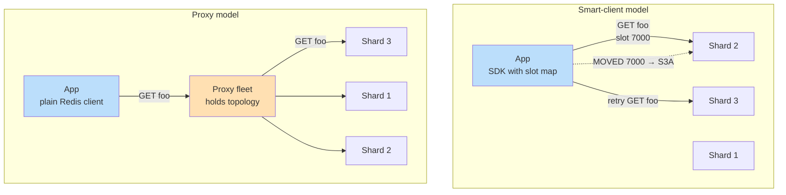
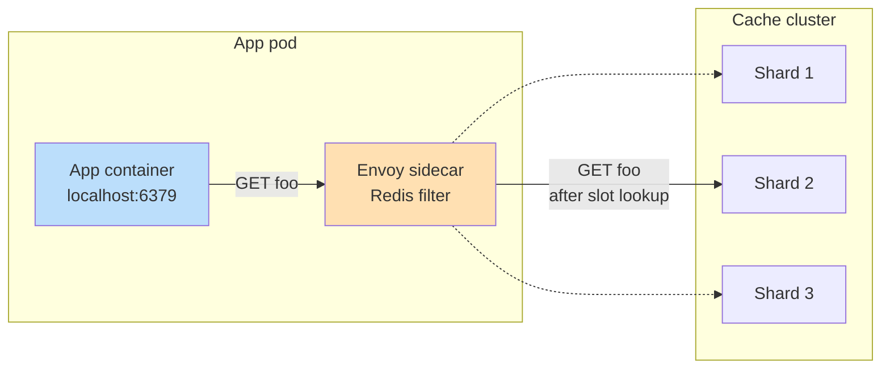

# Topology Awareness — Smart Clients, Proxies, and Cluster-Aware Routing

**Date:** 2026-05-01 | **Updated:** 2026-05-01
**Tags:** `system-design` `deep-dive` `caching` `client-design` `proxies`

> **Companion to:** [`../design-distributed-cache.md`](../design-distributed-cache.md) — this doc expands the *Topology Awareness — Smart Clients vs Proxies* deep-dive subsection with the routing mechanics, redirect protocol, multi-key fan-out, and operational tradeoffs that determine p99 in a real cluster.

## Summary

A sharded cache is two systems pretending to be one: a **partition map** (which key lives where) and a **routing layer** (how each request finds the right shard). The routing layer can sit inside the application — a *smart client* that holds the topology and dials the right shard directly — or in front of the cluster — a *proxy* that hides the topology behind a single virtual endpoint. Redis Cluster ships with the smart-client model and a teaching protocol (`MOVED`/`ASK` redirects) that lets clients bootstrap and self-heal their slot maps. Memcached has no native cluster mode at all, so Facebook built **mcrouter** and Twitter built **twemproxy** to bolt routing on. Envoy now ships first-class Redis and Memcached filters that turn the service mesh sidecar into a cluster-aware cache proxy. Every choice in this space — smart vs proxy, gossip vs registry, topology refresh strategy, hashtag layout, MGET fan-out semantics — directly drives **tail latency**, **connection-pool sizing**, and **operational blast radius**. This doc walks through both architectures end-to-end, shows the request lifecycle for each, covers the migration-period semantics that catch teams during reshards, and ends with a long anti-pattern list pulled from real outages.

## Table of Contents

- [Summary](#summary)
- [Overview](#overview)
- [Two Architectures, One Job](#two-architectures-one-job)
- [Topology Discovery](#topology-discovery)
- [MOVED and ASK Redirects](#moved-and-ask-redirects)
- [Smart-Client Routing in Detail](#smart-client-routing-in-detail)
- [Connection Pool Sizing](#connection-pool-sizing)
- [Pipelining and Multiplexing](#pipelining-and-multiplexing)
- [Multi-Key Operations Across Shards](#multi-key-operations-across-shards)
- [Proxy Architecture in Detail](#proxy-architecture-in-detail)
- [twemproxy and mcrouter Lineage](#twemproxy-and-mcrouter-lineage)
- [Service Mesh Sidecar as Cache Proxy](#service-mesh-sidecar-as-cache-proxy)
- [Client-Side Caching with Invalidation](#client-side-caching-with-invalidation)
- [Slot Map Drift and Reconciliation](#slot-map-drift-and-reconciliation)
- [Migration Period — ASKING Semantics](#migration-period--asking-semantics)
- [Worked Example — Smart Client and Proxy Side-by-Side](#worked-example--smart-client-and-proxy-side-by-side)
- [When to Pick Which](#when-to-pick-which)
- [Anti-Patterns](#anti-patterns)
- [Related](#related)
- [References](#references)

## Overview

The cache cluster has N shards. Each key, hashed with CRC16, lands in one of 16384 slots; each slot is owned by exactly one primary shard at any moment. The application has to deliver a `GET foo` to whichever shard currently owns `slot(foo) = CRC16("foo") % 16384`. There is no single "router box" inside Redis Cluster — the routing decision must happen somewhere outside the data plane.

You have two clean architectural choices:

1. **Smart client** — the application library knows the slot map, computes the slot, and dials the right shard over a persistent connection. One network hop.
2. **Proxy** — the application speaks plain Redis to a single endpoint; a proxy fleet (twemproxy, mcrouter, Envoy) holds the topology, picks the shard, and forwards. Two network hops.

Both designs solve the same problem but trade complexity and latency in opposite directions. Smart clients put the routing intelligence in every app instance — fewer hops, but every language SDK has to implement the protocol correctly. Proxies centralize the intelligence — simpler app code, but you now operate a stateful middleware tier on the hot path.



The two architectures aren't always pure. Envoy's Redis filter is a proxy, but the proxy itself is a smart client *toward* the cluster — it speaks `CLUSTER SLOTS`, handles `MOVED` redirects, and pools connections. mcrouter sits in front of Memcached but coexists with smart clients that do their own local-pool routing and only hit mcrouter for cross-pool / cross-region calls. The line between "smart client" and "proxy" is more of a continuum than a binary.

## Two Architectures, One Job

Both designs answer the same questions:

| Question | Smart client | Proxy |
|---|---|---|
| Who knows the topology? | Every app instance | The proxy fleet |
| Who computes the slot? | The client SDK | The proxy |
| Who handles `MOVED`? | The client SDK | The proxy (transparent to the app) |
| How many TCP connections to each shard? | One per app instance × shards | One pool per proxy × shards |
| What happens during a reshard? | Each client refreshes on `MOVED` | The proxy refreshes; app sees nothing |
| What's on the hot path? | Network only | Network + proxy parsing + proxy network |
| What language support do you need? | Per-language SDK | Any language with a Redis client works |

The smart-client model is the **default and recommended** path for Redis Cluster. The Redis Cluster client specification is explicit: clients SHOULD cache the slot map, they MUST handle `MOVED`/`ASK`, and they MAY refresh proactively via `CLUSTER SLOTS`. Mature SDKs — Lettuce (Java), redis-py, ioredis, go-redis, redis-rs — all implement this protocol correctly.

The proxy model is the **default for Memcached at scale** because the protocol has no built-in cluster awareness. Twitter and Facebook both ended up writing proxies for the same reason: client-side consistent hashing works until you have hundreds of app instances and need things the protocol can't express — request coalescing, replicated writes, multi-region routing, traffic shadowing, hot-key detection.

## Topology Discovery

Before any routing can happen, the client (or proxy) needs the slot map. There are two broad approaches:

**1. Gossip-based discovery (Redis Cluster).** Each cluster node maintains a view of the cluster via the cluster bus — a separate TCP connection between every pair of nodes used for gossip messages (PING/PONG, FAIL detection, configuration epoch updates). On boot, a client connects to any seed node and runs:

```text
> CLUSTER SLOTS
1) 1) (integer) 0          ; start slot
   2) (integer) 5460       ; end slot
   3) 1) "10.0.0.1"        ; primary host
      2) (integer) 6379    ; primary port
      3) "abc123..."       ; primary node id
   4) 1) "10.0.0.2"        ; replica host
      2) (integer) 6379
2) 1) (integer) 5461
   2) (integer) 10922
   ...
```

Or the newer:

```text
> CLUSTER SHARDS
```

which returns the same information in a structured-per-shard format (added in Redis 7.0, easier for SDKs to parse). The client builds an in-memory slot table indexed `slot → (primary, replicas)` and uses it for every subsequent request. This is the **steady-state** path: no broadcast, no coordination, just a single `CLUSTER SLOTS` call on bootstrap and on every `MOVED`.

**2. Central registry.** The proxy or client polls a service-discovery layer (etcd, ZooKeeper, Consul, AWS ElastiCache configuration endpoint) for the canonical topology. AWS ElastiCache exposes a single **configuration endpoint** that the client polls; the response is the full set of cluster nodes and their slot ranges. This is simpler to reason about but adds a control-plane dependency.

Hybrid is common. The client uses the configuration endpoint or seed list for **discovery**, then switches to direct `CLUSTER SLOTS` calls and `MOVED`-driven updates for **steady-state operations**.

**Refresh cadence.** A naive client refreshes every N seconds. A smart client refreshes only on demand:

- On every `MOVED` redirect.
- On a timer as a backstop (e.g., 60s) — covers the case where slots moved and no client touched them yet.
- On connection failure to a node (the topology might have changed).

Mature SDKs like Lettuce expose this as `ClusterTopologyRefreshOptions` with knobs for periodic refresh, dynamic refresh sources, and adaptive triggers (`MOVED_REDIRECT`, `ASK_REDIRECT`, `PERSISTENT_RECONNECTS`, `UNCOVERED_SLOT`, `UNKNOWN_NODE`).

## MOVED and ASK Redirects

The slot map is eventually consistent. A client may have a stale map after a reshard or a failover. Redis Cluster has a **teaching protocol**: when a client lands on the wrong shard, the server doesn't fail the request — it tells the client where to go.

**`MOVED` — the slot has permanently moved.**

```text
Client → Shard A: GET user:1234        (client thinks slot 5000 is on Shard A)
Shard A → Client: -MOVED 5000 10.0.0.3:6379

Action: Client updates its slot map (slot 5000 → 10.0.0.3) and retries on the new shard.
```

**`ASK` — the slot is being migrated; this specific key is now on the destination.**

```text
Client → Shard A: GET user:1234        (slot 5000 is being migrated A → B)
Shard A → Client: -ASK 5000 10.0.0.3:6379

Action: Client sends `ASKING` then retries on Shard B for THIS REQUEST ONLY.
        It does NOT update its slot map — slot 5000 still belongs to Shard A
        until the migration completes and a `MOVED` is issued.
```

The distinction matters during a reshard. A slot migration in Redis Cluster works key-by-key with `MIGRATE`. While the migration is in progress, some keys for the slot live on the source, some on the destination. `ASK` is the protocol for "this specific key has already moved; future keys for the same slot might still be on the source."

If the client treated `ASK` like `MOVED` and updated its slot map, it would route subsequent requests for not-yet-migrated keys to the destination, which would `MOVED` them back to the source, which would `ASK` them to the destination — a routing loop. The `ASKING` command before a redirected request tells the destination "I know this slot isn't officially yours yet, but please serve this one key anyway" — without it the destination would also `MOVED` the request back.

## Smart-Client Routing in Detail

The minimal routing function any smart client implements:

```python
# smart_client.py — illustrative routing for Redis Cluster

import time
import threading
from typing import Optional

CRC16_TABLE = [...]  # standard CRC16-XMODEM table

def crc16(data: bytes) -> int:
    crc = 0
    for byte in data:
        crc = ((crc << 8) & 0xFFFF) ^ CRC16_TABLE[((crc >> 8) ^ byte) & 0xFF]
    return crc

def slot_for_key(key: str) -> int:
    """
    Compute the Redis Cluster slot for a key.
    Honors hashtags: if the key contains {tag}, only the tag is hashed.
    """
    raw = key.encode("utf-8")
    start = raw.find(b"{")
    if start != -1:
        end = raw.find(b"}", start + 1)
        if end != -1 and end != start + 1:
            raw = raw[start + 1:end]
    return crc16(raw) % 16384


class SlotMap:
    """Thread-safe slot map: slot -> (primary_endpoint, [replica_endpoints])."""

    def __init__(self):
        self._slots: dict[int, tuple[str, list[str]]] = {}
        self._lock = threading.RLock()
        self._last_refresh = 0.0

    def get(self, slot: int) -> Optional[tuple[str, list[str]]]:
        with self._lock:
            return self._slots.get(slot)

    def update_one(self, slot: int, endpoint: str) -> None:
        """Targeted update on MOVED — don't refresh the whole map."""
        with self._lock:
            replicas = self._slots.get(slot, (endpoint, []))[1]
            self._slots[slot] = (endpoint, replicas)

    def replace(self, fresh: dict[int, tuple[str, list[str]]]) -> None:
        with self._lock:
            self._slots = fresh
            self._last_refresh = time.monotonic()


class SmartClient:
    REFRESH_INTERVAL = 60.0  # backstop refresh

    def __init__(self, seeds: list[str]):
        self.seeds = seeds
        self.slot_map = SlotMap()
        self.pools: dict[str, ConnectionPool] = {}
        self._refresh_topology()

    def _refresh_topology(self) -> None:
        for seed in self.seeds:
            try:
                conn = self._get_pool(seed).borrow()
                slots = conn.cluster_slots()
                fresh = {}
                for entry in slots:
                    start, end, primary, *replicas = entry
                    primary_ep = f"{primary[0]}:{primary[1]}"
                    replica_eps = [f"{r[0]}:{r[1]}" for r in replicas]
                    for slot in range(start, end + 1):
                        fresh[slot] = (primary_ep, replica_eps)
                self.slot_map.replace(fresh)
                return
            except Exception:
                continue
        raise RuntimeError("All seeds unreachable")

    def _get_pool(self, endpoint: str) -> "ConnectionPool":
        if endpoint not in self.pools:
            self.pools[endpoint] = ConnectionPool(endpoint, max_size=8)
        return self.pools[endpoint]

    def execute(self, command: str, key: str, *args, _depth: int = 0) -> any:
        if _depth > 5:
            raise RuntimeError("Too many redirects")

        slot = slot_for_key(key)
        entry = self.slot_map.get(slot)
        if entry is None:
            self._refresh_topology()
            entry = self.slot_map.get(slot)
            if entry is None:
                raise RuntimeError(f"No shard for slot {slot}")

        primary, _replicas = entry
        pool = self._get_pool(primary)
        conn = pool.borrow()
        try:
            response = conn.send(command, key, *args)
        finally:
            pool.release(conn)

        # Redirect handling
        if isinstance(response, MovedError):
            # Permanent move: update slot map, retry on new shard
            self.slot_map.update_one(slot, response.endpoint)
            return self.execute(command, key, *args, _depth=_depth + 1)

        if isinstance(response, AskError):
            # Transient: send ASKING + command to the destination, do NOT update map
            ask_pool = self._get_pool(response.endpoint)
            ask_conn = ask_pool.borrow()
            try:
                ask_conn.send("ASKING")
                return ask_conn.send(command, key, *args)
            finally:
                ask_pool.release(ask_conn)

        return response
```

Key properties:

- **Bounded recursion.** Cap redirect depth at 5–10. A live cluster shouldn't bounce more than once or twice per request.
- **Targeted slot-map updates on `MOVED`.** Don't trigger a full `CLUSTER SLOTS` refresh on every redirect — that would create a thundering herd against the cluster bus during a reshard. Update one slot, refresh the whole map only on a timer or on broad failure.
- **`ASKING` is per-request, not per-connection.** Each redirected request sends `ASKING` followed by the actual command. Do not flag the connection as "ASKING-mode."
- **Per-endpoint connection pools.** Pooling is per-shard, not global.

## Connection Pool Sizing

This is where the smart-client model gets expensive at scale.

In a smart-client deployment with N app instances and S shards, each app instance maintains a pool to each shard. With pool size P, the cluster sees `N × S × P` open TCP connections.

A worked example:

- N = 200 app instances
- S = 24 shards (12 primaries + 12 replicas)
- P = 8 connections per pool

→ 200 × 24 × 8 = **38,400 connections to the cluster**.

That's fine. But scale to N = 2000 and you have 384,000 connections. Each Redis primary now juggles 16,000 connections. You start hitting:

- File descriptor limits on the Redis host.
- TCP TIME_WAIT exhaustion if connections churn.
- TLS handshake CPU if connections are short-lived.
- Memory in Redis's connection state (~10 KB per client).

This is the math that pushes large fleets toward the proxy model. With a proxy fleet of M proxies between N apps and S shards:

- Apps open `N × M_pool` connections to proxies.
- Proxies open `M × S × P` connections to shards.

If M is small (e.g., 20 proxies) and P is reasonable (e.g., 16), the cluster sees only 20 × 24 × 16 = 7,680 connections regardless of N.

The proxy model **collapses the connection cardinality** from O(apps × shards) to O(proxies × shards). At ~100 app instances the smart-client overhead is fine; at ~1000+ the proxy model starts paying for itself.

**Pool sizing rules of thumb:**

- Default pool size 4–8 per shard per app instance is fine for most workloads.
- Increase pool size if you see queue waits in client metrics, not preemptively.
- Use **connection eviction** (idle timeout, max age) so dead connections don't pile up after a network blip.
- Cap total connections: `max_connections = pool_per_shard × num_shards × safety_factor`.

## Pipelining and Multiplexing

A single TCP connection can hold many in-flight requests if the client pipelines. Two patterns:

**1. Pipelining (request batching).** The client sends N requests back-to-back without waiting for responses, then reads N responses. This amortizes RTT cost.

```python
# pipeline.py
pipe = client.pipeline()
for user_id in user_ids:
    pipe.get(f"profile:{user_id}")
results = pipe.execute()  # one round trip, N responses
```

In Redis Cluster a pipeline must be **per-shard**. The client groups commands by slot, then by shard, then pipelines per shard. This is what mature SDKs do under the hood when you call `mget()` on a cluster client.

**2. Multiplexing (interleaved streams).** Multiple logical request streams over one connection, with response correlation by request ID. This is what Lettuce does by default — a single TCP connection per shard, serving all threads in the JVM. It works because Redis is **strictly request/response in order**: responses come back in the same order as requests.

Multiplexing is more memory-efficient than pipelining (fewer connections) and lower-latency under high concurrency (no pool contention). But it has a subtle failure mode: a single slow command (e.g., a huge `KEYS *`) blocks every other request on that connection. Lettuce mitigates this with a "command timeout" per request and the ability to disable multiplexing for known-blocking commands.

**Pipelining limits:**

- Don't pipeline across shards in a single batch — group by shard first.
- Don't pipeline so deeply that a single connection holds 10K in-flight commands; OOM risk in the client and the server.
- Pipelining doesn't help with `WATCH`/`MULTI`/`EXEC` because each transaction is bounded.

## Multi-Key Operations Across Shards

`MGET key1 key2 key3` is built into Redis. In a single-node Redis it's one round trip and atomic. In Redis Cluster it's only valid if **all keys hash to the same slot** — otherwise the server returns a `CROSSSLOT` error.

There are three ways to handle multi-key reads across shards:

### 1. Hashtags — Force Co-location

If you wrap part of the key in `{}`, Redis hashes only the tagged portion:

```text
{user:1234}:profile      → slot = CRC16("user:1234") % 16384
{user:1234}:settings     → slot = CRC16("user:1234") % 16384
{user:1234}:friends      → slot = CRC16("user:1234") % 16384
```

All three keys land on the same slot, so `MGET {user:1234}:profile {user:1234}:settings {user:1234}:friends` works as a single command on a single shard. **Pros:** atomic, low latency. **Cons:** you've created a hot key family — all of user 1234's data lives on one shard. If that user is a celebrity, the shard melts.

Hashtags are the right tool for **bounded co-location** (a single user's small set of related keys, a single shopping cart, a single conversation's last 50 messages). They're the wrong tool for "shard a workload by tenant ID" — that creates massive imbalance.

### 2. Client-Side Fan-out and Gather

The smart client splits the multi-key request by slot, dispatches per-shard pipelines in parallel, and gathers responses:

```python
def cluster_mget(client: SmartClient, keys: list[str]) -> list[any]:
    # 1. Group keys by slot
    by_slot: dict[int, list[tuple[int, str]]] = {}
    for idx, key in enumerate(keys):
        slot = slot_for_key(key)
        by_slot.setdefault(slot, []).append((idx, key))

    # 2. Group slots by shard endpoint
    by_endpoint: dict[str, list[tuple[int, str]]] = {}
    for slot, idx_keys in by_slot.items():
        primary, _ = client.slot_map.get(slot)
        by_endpoint.setdefault(primary, []).extend(idx_keys)

    # 3. Fan out one MGET per shard, in parallel
    results: list[any] = [None] * len(keys)
    with ThreadPoolExecutor(max_workers=len(by_endpoint)) as pool:
        futures = {
            pool.submit(_shard_mget, client, ep, idx_keys): ep
            for ep, idx_keys in by_endpoint.items()
        }
        for future in as_completed(futures):
            for original_idx, value in future.result():
                results[original_idx] = value

    return results

def _shard_mget(client, endpoint, idx_keys):
    keys_only = [k for _, k in idx_keys]
    values = client._get_pool(endpoint).borrow().send("MGET", *keys_only)
    return list(zip([i for i, _ in idx_keys], values))
```

**Pros:** works for any key set, bounded by `max(per_shard_latency)` not `sum(per_shard_latency)`. **Cons:** non-atomic (different shards see different points in time), tail latency bound to the slowest shard.

This is what `redis-py-cluster`, `ioredis` cluster mode, and Lettuce all do internally when you call `mget()` on a cluster client.

### 3. Proxy-Side Fan-out

mcrouter, twemproxy, and Envoy's Redis filter all do shard-side fan-out for multi-key commands. The app sends a single `MGET k1 k2 k3` to the proxy; the proxy splits, fans out, gathers, and returns one response. From the app's perspective it's a single command — same semantics as a single-node Redis.

This is a major proxy advantage: **the application stays simple**, and the per-shard fan-out logic lives in one place that's tuned and instrumented.

## Proxy Architecture in Detail

A cache proxy is an L7 protocol-aware middleware. Its request lifecycle:

```python
# proxy_lifecycle.py — pseudocode for a Redis cluster proxy

class RedisProxy:
    def __init__(self, cluster_seeds):
        self.slot_map = SlotMap()
        self.pools = {}  # endpoint -> ConnectionPool to shards
        self.refresh_topology(cluster_seeds)
        spawn(self._periodic_refresh, interval=30)

    def handle_client(self, client_conn):
        """Run for the lifetime of a single client TCP connection."""
        while True:
            request = client_conn.read_redis_command()  # parse RESP
            if request is None:
                return  # client disconnected

            try:
                response = self._route(request)
            except ProxyError as e:
                response = ErrorResponse(str(e))
            client_conn.write_response(response)

    def _route(self, request):
        cmd = request.command.upper()

        # Special commands that don't have a single key
        if cmd in ("PING", "INFO", "CLUSTER"):
            return self._handle_special(request)

        # Multi-key fan-out
        if cmd == "MGET":
            return self._fanout_mget(request.keys)
        if cmd == "MSET":
            return self._fanout_mset(request.kv_pairs)
        if cmd == "DEL" and len(request.keys) > 1:
            return self._fanout_del(request.keys)

        # Single-key commands
        key = request.keys[0]
        slot = slot_for_key(key)
        return self._send_with_redirect(slot, request)

    def _send_with_redirect(self, slot, request, depth=0):
        if depth > 5:
            raise ProxyError("Too many redirects")

        primary, _ = self.slot_map.get(slot)
        conn = self.pools[primary].borrow()
        try:
            response = conn.send(request)
        finally:
            self.pools[primary].release(conn)

        if response.is_moved():
            self.slot_map.update_one(slot, response.endpoint)
            return self._send_with_redirect(slot, request, depth + 1)
        if response.is_ask():
            return self._send_asking(response.endpoint, request)
        return response

    def _fanout_mget(self, keys):
        # Group by endpoint
        by_endpoint = {}
        for idx, key in enumerate(keys):
            slot = slot_for_key(key)
            ep, _ = self.slot_map.get(slot)
            by_endpoint.setdefault(ep, []).append((idx, key))

        # Parallel sub-requests
        results = [None] * len(keys)
        with concurrent_executor() as ex:
            for ep, idx_keys in by_endpoint.items():
                ex.submit(self._sub_mget, ep, idx_keys, results)
        return ArrayResponse(results)

    def _periodic_refresh(self, interval):
        while True:
            sleep(interval)
            self.refresh_topology(self.seeds)
```

**What the proxy does that the app no longer has to:**

- Parse RESP / Memcached protocol.
- Maintain the slot map.
- Handle `MOVED` / `ASK`.
- Fan out multi-key commands.
- Pool connections to shards.
- Implement retries and circuit breakers.
- Optionally: shadow traffic, request coalescing, hot-key detection, multi-region routing.

**What the proxy adds to the path:**

- One extra TCP hop (~0.1–1 ms within a DC, more across AZs).
- One extra parse/serialize cycle.
- Operational complexity — you now run a stateful tier on the hot path.
- A new failure domain — a misconfigured proxy can take down every cache-dependent service.

## twemproxy and mcrouter Lineage

**twemproxy** (Twitter, 2012) — the original. A small C daemon that speaks Memcached and Redis protocols, hashes keys with consistent hashing, and forwards. Supports `ketama`, `modula`, `random`, and `crc16` hashing. **No support for Redis Cluster `MOVED` redirects** — twemproxy predates Redis Cluster and uses its own static partitioning. You configure shard list at the proxy, not at the cluster.

twemproxy's killer feature was **connection multiplexing**: hundreds of app connections collapsed into a few persistent connections per shard. At Twitter scale (2012), this was the difference between Redis being viable and not.

Limitations:

- No automatic failover (you re-config and restart).
- Pipelining yes, transactions no (multi-key non-atomic).
- No support for pub/sub (broken by design — pub/sub is per-connection).
- Single point of failure if you run one instance.

twemproxy is still in use but largely superseded by Envoy and mcrouter for new deployments.

**mcrouter** (Facebook, 2014) — built for Memcached at Facebook scale. Open-sourced. Designed around the operational realities of running thousands of Memcached pools across multiple regions. Features:

- **Hierarchical routing.** A request can pass through multiple "route handles" — replicate writes to N pools, read from a primary with fallback to a secondary, shadow traffic to a canary pool, etc.
- **Automatic failover.** If a pool member fails, mcrouter rehashes around it within configurable timeouts.
- **Cross-region replication.** Writes in one region async-replicate to peer regions through mcrouter chains.
- **Request coalescing.** Multiple identical concurrent requests collapse into one cache lookup.
- **Cold cache warmup.** Read from a warm pool on miss, populate the cold pool.

mcrouter is what makes Facebook's Memcached architecture tractable. The 2013 NSDI paper "Scaling Memcache at Facebook" describes how the smart client (in PHP/HHVM) and mcrouter coexist: the smart client picks the local pool, mcrouter handles cross-pool and cross-region routing.

**Operational note:** mcrouter is configured with JSON route trees, which is both its superpower (extremely flexible) and its operational sharp edge (a typo in route config can break every cache-dependent service).

## Service Mesh Sidecar as Cache Proxy

Envoy ships first-class filters for Redis (`envoy.filters.network.redis_proxy`) and Memcached (`envoy.filters.network.memcached_proxy`). When deployed as a sidecar via a service mesh (Istio, Consul Connect), Envoy becomes a per-pod cache proxy.

Architectural shape:



**Envoy Redis filter capabilities:**

- Cluster-aware routing with `MOVED`/`ASK` handling.
- Topology refresh via `CLUSTER SLOTS`.
- Connection pool per shard.
- Multi-key fan-out (`MGET`/`MSET`/`DEL`).
- Mirror traffic to a shadow cluster for canary testing.
- Per-command timeouts and retries.
- Request hashing for consistent-hash routing to non-cluster Redis.
- Auth (AUTH command injection on connection).

**Pros of sidecar-as-cache-proxy:**

- Per-pod proxy means **no cross-pod hop** — the proxy is on localhost.
- Connection pooling collapses N app connections (across pods) into M pod connections to shards.
- Configuration lives in the mesh control plane — uniform across services.
- Observability (request rate, error rate, latency) comes from Envoy stats automatically.
- Auth, mTLS, and traffic policies are managed centrally.

**Cons:**

- Per-pod sidecar memory cost — Envoy is ~50 MB per pod. At 1000 pods that's 50 GB.
- Mesh complexity is non-trivial; a misconfigured listener can break the cache path.
- Envoy's Redis filter doesn't support every Redis feature (Lua scripts, transactions, pub/sub have caveats).

For new deployments where the mesh is already in place, the Envoy Redis filter is a strong default. See [`../../../architectural-styles/sidecar-pattern.md`](../../../architectural-styles/sidecar-pattern.md) and [`../../../architectural-styles/service-mesh-as-architectural-decision.md`](../../../architectural-styles/service-mesh-as-architectural-decision.md) for the broader sidecar/mesh tradeoff space.

## Client-Side Caching with Invalidation

Redis 6 introduced **client-side caching** — a feature that turns the smart client into a small local cache *of the cache*. The protocol uses RESP3 tracking:

```text
> CLIENT TRACKING ON
+OK

> GET user:1234        ; cache miss locally; fetch from Redis
+(value)

; Server records: connection X is tracking key user:1234

; Later, another client writes:
> SET user:1234 newvalue
+OK

; Server pushes to tracking connections:
>2
$10
invalidate
$1
1
$10
user:1234

; Client sees the invalidation and evicts user:1234 from its local cache.
```

Two tracking modes:

1. **Default (per-key tracking).** The server remembers exactly which keys each client has cached. Memory-heavy on the server but precise — only invalidates what's actually cached.

2. **Broadcasting mode (`CLIENT TRACKING ON BCAST PREFIX user:`).** The server doesn't track per-key; instead, any write to a key matching the prefix triggers an invalidation broadcast to all tracking clients with that prefix. Lower server memory, but more invalidation noise.

**Why this matters for topology awareness:** client-side caching effectively adds a **tier 0** in front of the smart client. A request that hits the local cache never touches the network. This dramatically reduces tail latency and shard CPU — but it requires:

- A correct invalidation channel (the tracking RESP3 push messages).
- Care during topology changes — if a key migrates, both source and destination must invalidate any clients tracking it.
- Bounded local cache size with eviction.

For multi-tier caching architecture broadly, see [`./multi-tier-caching.md`](./multi-tier-caching.md).

## Slot Map Drift and Reconciliation

The slot map is **eventually consistent across clients**. At any moment some clients have a fresh map, some have a stale map. Drift sources:

- **Failover.** A primary dies; its replica is promoted. Clients still pointing at the dead primary will fail with connection errors and need to refresh.
- **Reshard.** Slots are migrated for rebalance. Clients see `MOVED`/`ASK` until they update.
- **Cluster expansion.** New shards added; existing slots redistributed.
- **Network partition.** A subset of clients sees a partial cluster.

**Reconciliation strategies:**

1. **On-demand refresh on `MOVED`.** Update the one slot, don't refresh the whole map.
2. **Periodic background refresh.** Every 30–60s, run `CLUSTER SLOTS` and replace the map. Catches slow-drift cases.
3. **Refresh on connection failure.** A persistent connection to a known-good shard fails → suspect topology, refresh.
4. **Refresh on uncovered slot.** Client computes a slot, finds no entry → topology is incomplete, refresh.

**Anti-pattern: refresh on every `MOVED`.** During a reshard, every client sees `MOVED` once per moved slot. If every `MOVED` triggers a full `CLUSTER SLOTS` call, you create a thundering herd against the cluster bus that can stall the reshard. Targeted updates are mandatory; full refresh is for backstop.

**Anti-pattern: never refresh.** Over weeks, slow drift (failovers, ad-hoc reshards) leaves the slot map stale. Every request becomes a `MOVED` then a retry — doubling the latency of every operation. Set a periodic refresh as a backstop.

## Migration Period — ASKING Semantics

A slot migration in Redis Cluster:

```text
# Start: slot 5000 owned by Shard A
> CLUSTER SETSLOT 5000 IMPORTING <node-id-A> -- on Shard B
> CLUSTER SETSLOT 5000 MIGRATING <node-id-B> -- on Shard A

# For each key in slot 5000:
> MIGRATE 10.0.0.B 6379 key TIMEOUT 5000 -- on Shard A
# This atomically moves the key to Shard B.

# When all keys are migrated:
> CLUSTER SETSLOT 5000 NODE <node-id-B> -- on Shard A and Shard B
# Now slot 5000 officially belongs to Shard B.
# All clients will get MOVED on subsequent requests.
```

While in `IMPORTING`/`MIGRATING` state, the slot is split:

- Some keys are on Shard A (not yet migrated).
- Some keys are on Shard B (already migrated).

**The protocol:**

- A `GET key` lands on Shard A (per the slot map).
- If `key` is still on A → A returns the value.
- If `key` was already migrated → A returns `-ASK 5000 <Shard B>`.
- The client sends `ASKING` (one-shot flag) then `GET key` to Shard B.
- Shard B (in `IMPORTING` state) sees the `ASKING` flag and serves the request even though the slot isn't officially its yet. Without `ASKING`, Shard B would itself reply `MOVED` back to Shard A — routing loop.

**What the smart client must get right:**

- `ASKING` is **per-request, not sticky**. Each redirected request needs its own `ASKING` flag.
- Do **not** update the slot map on `ASK`. Update only on `MOVED`.
- Bound the redirect depth — a healthy migration shouldn't bounce more than once per request.
- Pipelining mid-migration can result in mixed `ASK` and direct responses; clients must handle both per-element of the pipeline.

**What the proxy must get right:** same as the smart client, plus it must serialize concurrent requests for the same key correctly. mcrouter, twemproxy, and Envoy all implement this; rolling your own proxy without `ASKING` semantics is a footgun.

## Worked Example — Smart Client and Proxy Side-by-Side

A user request: `GET profile:user:42`. CRC16 says slot = 7000. Cluster has 3 primaries; slot 7000 was on Shard A but was migrated to Shard C 5 seconds ago. The client's slot map still says A.

### Smart-client lifecycle

```text
1. App calls client.get("profile:user:42").
2. Client computes slot = CRC16("profile:user:42") % 16384 = 7000.
3. Client looks up slot 7000 in slot_map → primary = ShardA (10.0.0.1:6379).
4. Client borrows connection from pool[10.0.0.1:6379].
5. Client sends "GET profile:user:42" over the wire.
6. Shard A responds: "-MOVED 7000 10.0.0.3:6379"
7. Client updates slot_map[7000] = (10.0.0.3, ...).
8. Client borrows connection from pool[10.0.0.3:6379] (creates pool if absent).
9. Client retries "GET profile:user:42".
10. Shard C responds with the value.
11. Client returns value to app.

Total network: 2 round trips (one wasted to A, one successful to C).
Total time: ~2 × intra-DC RTT ≈ 1 ms.
Subsequent requests for slot 7000: 1 round trip (slot map now correct).
```

### Proxy lifecycle

```text
1. App calls client.get("profile:user:42").
2. App's plain Redis client opens a TCP connection to proxy:6379 (or reuses one).
3. App sends "GET profile:user:42" to proxy.
4. Proxy parses request, computes slot = 7000.
5. Proxy looks up slot 7000 in its slot_map → primary = ShardA.
6. Proxy borrows connection from its pool[10.0.0.1:6379].
7. Proxy sends "GET profile:user:42" to Shard A.
8. Shard A responds: "-MOVED 7000 10.0.0.3:6379"
9. Proxy updates its slot_map[7000] = (10.0.0.3, ...).
10. Proxy borrows connection from pool[10.0.0.3:6379].
11. Proxy retries "GET profile:user:42".
12. Shard C responds with the value.
13. Proxy responds to app with the value.
14. App receives response.

Total network from app perspective: 1 round trip (app sees only the proxy hop).
Total time: ~app→proxy RTT + 2 × proxy→shard RTT ≈ 1.5 ms.
Subsequent requests for slot 7000: 1 app round trip + 1 proxy round trip.
```

The proxy hides the redirect from the app, but at the cost of an extra hop on every request. In a single AZ this is ~0.3–0.5 ms. In a cross-AZ deployment it can be 1–3 ms — which is why you want the proxy **co-located** with the app (ideally as a sidecar on localhost).

## When to Pick Which

| Signal | Lean smart client | Lean proxy |
|---|---|---|
| App fleet size | < 100 instances | > 500 instances |
| Languages in fleet | 1–2 | 3+ |
| SDK maturity for those languages | High | Low or inconsistent |
| Cross-region routing needed? | No | Yes |
| Need traffic shadowing / canary cache pools? | No | Yes |
| Operational team comfort with mesh / proxy tier | Low | High |
| p99 latency budget | Tight (every ms counts) | Has 1–2 ms slack |
| Cache: Redis Cluster | Default | Optional |
| Cache: Memcached | Smart client + consistent hashing | Strong default |

For most teams the path is: **start with smart clients on Redis Cluster.** Add a proxy (Envoy sidecar most likely) when fleet size, language diversity, or operational features (shadowing, multi-region, request coalescing) justify it.

For broader context on when the cache cluster itself is the right tool, see the parent [`../design-distributed-cache.md`](../design-distributed-cache.md). For partition mechanics and slot ownership see [`./partitioning-and-hash-slots.md`](./partitioning-and-hash-slots.md). For replica routing within a shard see [`./replication-per-partition.md`](./replication-per-partition.md).

## Anti-Patterns

- **Hardcoded shard list in the app.** Static configuration that doesn't update when the cluster reshards. Every reshard becomes an app deploy. Use `CLUSTER SLOTS` discovery from a seed list and refresh on `MOVED`.
- **No topology refresh.** The slot map is set on boot and never updated. Slow drift over weeks turns every request into `MOVED` + retry. Set a backstop refresh interval (30–60s) and always refresh on `MOVED`.
- **Topology refresh storm.** A bad SDK refreshes the entire slot map on every `MOVED`. During a reshard, every client hammers the cluster bus with `CLUSTER SLOTS` calls, stalling the migration. Update one slot per `MOVED`; full refresh on a timer.
- **Treating `ASK` like `MOVED`.** Updating the slot map on `ASK` causes a routing loop during migrations. `ASK` is per-request; do not persist it.
- **Forgetting `ASKING` before a redirect.** A redirected request without the preceding `ASKING` flag will itself get `MOVED` back from the destination — infinite bounce.
- **Fan-out `MGET` ignoring slot mapping.** Sending `MGET k1 k2 k3` to a single arbitrary shard returns `CROSSSLOT` errors when keys span shards. Either group by slot first or use a proxy that does the fan-out for you.
- **Hashtags on tenant ID.** `{tenant:42}:*` looks like a clean co-location strategy until tenant 42 grows to 10× the size of the median tenant and melts a single shard. Hashtags are for bounded co-location, not partitioning by tenancy.
- **Single proxy instance.** A proxy is on the hot path. One instance is one outage away from a full cache outage. Run at least N+1 proxies behind a load balancer.
- **L7 LB in front of proxies.** The proxy already speaks the cache protocol; putting an L7 LB in front adds a parse cycle for nothing. Use L4 or DNS round-robin.
- **Proxy without connection pooling to shards.** A proxy that opens a fresh TCP connection per app request defeats the entire point of having a proxy. Pool aggressively.
- **Long pipeline that crosses shards.** Pipelining across shards in a single batch — a single call serializes per-shard commands and waits for all of them. Group by shard, dispatch in parallel.
- **Sticky client → proxy mapping.** Pinning each app instance to one proxy means a proxy failure takes that instance offline. Use a pool of proxies with health checks; rotate on failure.
- **No `MOVED` retry budget.** Unbounded redirect chains can recurse forever during a misconfigured reshard. Cap depth at 5–10.
- **Refreshing topology on every connection error.** A flaky network triggers full topology refreshes on every transient error. Differentiate connection errors (refresh probably won't help) from cluster errors (refresh probably will).
- **Client-side caching without invalidation handling.** Subscribing to RESP3 invalidations but not actually evicting the local cache entry → stale reads for the entire TTL window. The whole point of tracking is to evict.
- **Smart client for Memcached without consistent hashing.** Naive `hash(key) % N` rebalances every key when N changes. Use ketama or rendezvous.
- **Different hash function in smart client vs proxy.** A smart client computing `slot = CRC16(key) % 16384` while the proxy uses `slot = MurmurHash(key) % N` results in cache misses for every key. Pick one hashing scheme cluster-wide and enforce it.
- **No observability on slot map drift.** You don't know how stale your slot map is until you see `MOVED` in error logs. Export slot-map age, MOVED count, ASK count, and topology refresh rate as metrics.
- **Treating proxy latency as zero.** Adding a proxy adds 0.3–3 ms per request. If your p99 budget is 5 ms, that's a meaningful chunk. Measure before and after.
- **Ignoring connection multiplexing.** Default Redis SDK behavior is sometimes "one connection per call." For a high-QPS app, that's TCP handshake overhead per request. Use multiplexed clients (Lettuce by default, ioredis with `enableAutoPipelining`).

## Related

- [`../design-distributed-cache.md`](../design-distributed-cache.md) — parent case study; this doc expands its *Topology Awareness* section.
- [`./partitioning-and-hash-slots.md`](./partitioning-and-hash-slots.md) — how the slot map itself is constructed; CRC16 details, virtual slots, hashtags.
- [`./replication-per-partition.md`](./replication-per-partition.md) — replica routing within a single shard, RESP `READONLY` mode, replica-read consistency.
- [`./multi-tier-caching.md`](./multi-tier-caching.md) — local in-process cache (tier 0) in front of the cluster client, including Redis 6 client-side caching.
- [`../../../architectural-styles/sidecar-pattern.md`](../../../architectural-styles/sidecar-pattern.md) — when to deploy a per-pod sidecar vs centralized middleware.
- [`../../../architectural-styles/service-mesh-as-architectural-decision.md`](../../../architectural-styles/service-mesh-as-architectural-decision.md) — when adopting a service mesh is the right architectural call, and when it's overkill.

## References

- Redis — [Redis Cluster client specification](https://redis.io/docs/reference/cluster-spec/) — canonical description of `MOVED`, `ASK`, `ASKING`, slot computation, and client behavior.
- Redis — [`CLUSTER SLOTS` command](https://redis.io/commands/cluster-slots/) — discovery protocol returning slot ranges and their owning nodes.
- Redis — [`CLUSTER SHARDS` command](https://redis.io/commands/cluster-shards/) — Redis 7.0+ replacement returning shard-grouped topology.
- Redis — [Client-side caching with RESP3 tracking](https://redis.io/docs/manual/client-side-caching/) — invalidation push messages, broadcasting mode, server-tracked vs client-tracked modes.
- Facebook — [mcrouter wiki](https://github.com/facebook/mcrouter/wiki) — route handles, replication, cross-pool and cross-region routing.
- Twitter — [twemproxy](https://github.com/twitter/twemproxy) — original Memcached/Redis proxy; consistent hashing strategies, configuration model.
- Envoy — [Redis proxy filter](https://www.envoyproxy.io/docs/envoy/latest/configuration/listeners/network_filters/redis_proxy_filter) — first-class cluster-aware Redis proxy as a sidecar.
- Envoy — [Memcached proxy filter](https://www.envoyproxy.io/docs/envoy/latest/configuration/listeners/network_filters/memcached_proxy_filter) — Memcached protocol filter for sidecar deployments.
- Lettuce — [Cluster topology refresh](https://lettuce.io/core/release/reference/index.html#topology-refresh) — Java client implementation of periodic and adaptive topology refresh, including the `MOVED_REDIRECT`, `ASK_REDIRECT`, `PERSISTENT_RECONNECTS`, `UNCOVERED_SLOT`, and `UNKNOWN_NODE` triggers.
- USENIX NSDI 2013 — [Scaling Memcache at Facebook](https://www.usenix.org/conference/nsdi13/technical-sessions/presentation/nishtala) — the architecture paper that motivated mcrouter; smart client + proxy coexistence at extreme scale.
