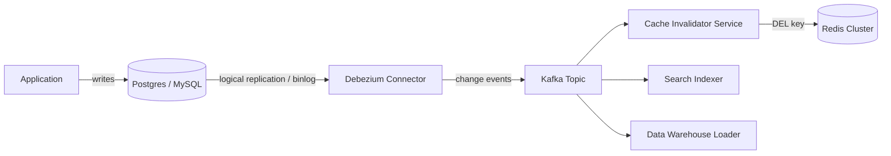

# Cache Write Strategies — Cache-Aside, Write-Through, Write-Behind, and Read-Through

**Date:** 2026-05-01 | **Updated:** 2026-05-01
**Tags:** `system-design` `deep-dive` `caching` `consistency` `write-patterns`

## Table of Contents

- [Summary](#summary)
- [The Four Strategies — A Quick Map](#the-four-strategies--a-quick-map)
- [Cache-Aside (Lazy Loading)](#cache-aside-lazy-loading)
- [Read-Through](#read-through)
- [Write-Through](#write-through)
- [Write-Behind / Write-Back](#write-behind--write-back)
- [Invalidate-on-Write vs Update-on-Write — The Dual-Write Problem](#invalidate-on-write-vs-update-on-write--the-dual-write-problem)
- [Stale-Write Race — The Classic Order-of-Operations Bug](#stale-write-race--the-classic-order-of-operations-bug)
- [Versioned Cache Entries — Rejecting Stale Populates](#versioned-cache-entries--rejecting-stale-populates)
- [Cache Stampede on Invalidate-on-Write of Hot Keys](#cache-stampede-on-invalidate-on-write-of-hot-keys)
- [Write-Through Coupling with the DB Transaction](#write-through-coupling-with-the-db-transaction)
- [Outbox / CDC for Cache Invalidation](#outbox--cdc-for-cache-invalidation)
- [Pub/Sub Invalidation](#pubsub-invalidation)
- [Tail-of-Log Invalidation — Debezium → Kafka → Invalidator](#tail-of-log-invalidation--debezium--kafka--invalidator)
- [TTL as the Safety Net](#ttl-as-the-safety-net)
- [Read-After-Write Consistency](#read-after-write-consistency)
- [Worked Example — Order Create Flow with Cache-Aside](#worked-example--order-create-flow-with-cache-aside)
- [Anti-Patterns](#anti-patterns)
- [Decision Matrix](#decision-matrix)
- [Related](#related)
- [References](#references)

## Summary

Every cache deployed against a database has to answer one question: **how does the cache stay coherent with the source of truth on writes?** The four strategies — cache-aside, read-through, write-through, write-behind — describe *who initiates the work and in what order*, not *how consistent the result is*. Consistency comes from the layer below: the order you mutate the cache versus the database, whether you invalidate or update, whether you guard against stale repopulates, and whether you have a TTL safety net catching the bugs you missed.

The honest, opinionated default: **cache-aside, delete-on-write, with TTL as a backstop, plus an out-of-band invalidator (CDC or outbox) for the cases where the application forgets**. The other strategies exist; they pay different costs to solve specific problems cache-aside cannot. Framing line: **a wrong cache value lasts until something invalidates it; design the invalidation, not the write**.

## The Four Strategies — A Quick Map

| Strategy | Read path | Write path | Cache freshness | Latency | Durability risk |
|---|---|---|---|---|---|
| **Cache-aside** | App checks cache → DB on miss → populate | App writes DB → invalidates cache | Until next read | Low (most common) | None — DB is authoritative |
| **Read-through** | App calls cache lib → lib reads DB on miss | App writes DB directly (or through cache) | Until next read | Low | None |
| **Write-through** | App calls cache lib → lib reads cache | App writes cache → cache writes DB synchronously | Always fresh | Higher (cache + DB latency) | None (sync) |
| **Write-behind** | App calls cache lib → lib reads cache | App writes cache → cache writes DB async | Always fresh | Lowest | High — cache crash can lose un-flushed writes |

Two orthogonal axes hide here:

1. **Who reads the DB on a miss?** The application (cache-aside) or the cache library (read-through). Cosmetic difference; ergonomic impact.
2. **When does the DB write happen relative to the ack to the caller?** Before (write-through), after (write-behind), or "the app handles the DB write itself" (cache-aside).

Cache-aside is the default winner. The remaining three are correct in narrower situations.

## Cache-Aside (Lazy Loading)

The application owns the orchestration. The cache is a passive store.

```text
read:    value = cache.get(key)
         if miss: value = db.get(key); cache.set(key, value, TTL)
         return value

write:   db.update(key, new_value)
         cache.delete(key)         # NOT cache.set — see invalidate vs update
```

### Properties

- **Cache holds only requested data.** Cold cache after deploy; warms naturally with traffic.
- **No write coupling.** Cache outage does not block DB writes. DB outage does not block cached reads (until expiry).
- **Inconsistency window.** Between `db.update` and `cache.delete`, a concurrent reader can populate the cache with stale data. TTL bounds it. See [Stale-Write Race](#stale-write-race--the-classic-order-of-operations-bug).
- **Application knows about the cache.** Every site has the dance. Wrap in a repository layer.

### Cache-aside read + write reference implementation

```python
def get_user(user_id: str) -> User | None:
    key = f"user:{user_id}"
    cached = cache.get(key)
    if cached is not None:
        return User.deserialize(cached)
    user = db.query("SELECT * FROM users WHERE id = ?", user_id)
    if user is not None:
        # NX so we don't stomp on a concurrent populate.
        cache.set(key, user.serialize(), ex=300, nx=True)
    return user

def update_user(user_id: str, patch: dict) -> User:
    user = db.update("UPDATE users SET ... WHERE id = ?", user_id, patch)
    cache.delete(f"user:{user_id}")     # invalidate; next read repopulates
    return user
```

~15 lines, handles 95% of production cache usage.

## Read-Through

Read-through moves the "load from DB on miss" inside a cache library. The application calls `cache.get(key)`; the cache, on a miss, calls a registered loader function and populates itself transparently.

```text
function get(key):
  return cache.get_or_load(key, loader=db_loader)

# Cache library:
function get_or_load(key, loader):
  value = self.store.get(key)
  if value is not nil: return value
  value = loader(key)
  if value is not nil: self.store.set(key, value, TTL)
  return value
```

**When read-through helps.** Multiple call sites would otherwise repeat the cache-aside dance — the library factors it. The loader is uniform per key namespace. Single-flight / request coalescing can live inside the library so concurrent misses on the same key trigger only one DB read (Caffeine's `LoadingCache` does this).

**When read-through hurts.** The cache library now needs DB credentials, schema knowledge, and connection pools. Test-time mocking is harder. Cross-language deployments fight over which language owns the loader.

In Java, `Caffeine.LoadingCache` and Spring's `@Cacheable` are the canonical implementations. Most Redis client libraries do **not** ship read-through — Redis is a server, and read-through wants to live in-process.

## Write-Through

Write-through inverts the responsibility: the cache becomes the front door for writes. The application writes to the cache; the cache, synchronously, writes to the database before acknowledging.

### Pattern

```text
function update(key, value):
  cache.put_through(key, value)   # blocks until DB confirms

# Inside the cache library:
function put_through(key, value):
  db.write(key, value)            # synchronous DB write
  self.store.set(key, value)      # then update local cache
  return ok
```

### Properties

- **Cache and DB always coherent on writes** — assuming both succeed. The failure modes are the interesting part.
- **Write latency = max(cache, DB) latency.** No write-side win; the win is on reads.
- **Cache is on the write critical path.** Cache outage → write failure. Opposite of cache-aside's "fail open."

### The two-phase failure modes

If the DB write succeeds but the cache update fails (or vice versa), you have a partial commit. Three options: **best-effort** (log, hope TTL catches it — what most implementations actually do); **roll back** (compensating DB delete after failed cache update — hard to make idempotent, distributed transaction); **DB-after-cache with retries** (set cache first, then DB — risks readers seeing pre-durable values).

Safer ordering: **DB first, then cache**. If cache update fails, the next read repopulates from the correct DB. Reverse order produces phantom values from failed DB writes.

### Write-through with two-phase pattern (DB-first, cache-after)

```python
def update_user_write_through(user_id: str, patch: dict) -> User:
    key = f"user:{user_id}"
    # Phase 1: durable write. Do not touch the cache yet.
    new_user = db.update("UPDATE users SET ... WHERE id = ?", user_id, patch)
    # Phase 2: cache update with versioned value. If this fails, next read
    # repopulates from DB. Tolerate the brief inconsistency.
    try:
        cache.set(key, new_user.serialize_with_version(new_user.version), ex=DEFAULT_TTL)
    except CacheUnavailable:
        metrics.incr("cache.write_through.cache_failure")  # TTL is the backstop
    return new_user
```

The `version` field bridges to the [versioned-populate](#versioned-cache-entries--rejecting-stale-populates) trick that handles the stale-write race.

### When write-through is worth it

- Read-after-write must be served from the cache and reflect the write within the request.
- The cache and DB are **colocated** (built-in cache layer in the DB engine; DAX-style sidecar). Failure modes are aligned.
- The application owns both layers and can afford the write-side coupling.

For typical microservice + Redis + Postgres setups, write-through is the wrong default. The latency cost is real, the failure modes are subtle, and cache-aside delivers nearly the same behavior with a cleaner contract.

## Write-Behind / Write-Back

Write-behind takes the same shape as write-through but acknowledges to the application *before* writing to the DB. The DB write is queued and flushed asynchronously.

```text
function update(key, value):
  cache.put_behind(key, value)        # ack immediately

# Cache library, in the background:
function flush_loop():
  while true:
    batch = self.dirty_queue.pop_batch()
    db.bulk_write(batch)
    mark_clean(batch)
```

### Properties

- **Lowest write latency.** DB latency amortized over batches; removed from request path.
- **DB throughput decoupled from request throughput.** Bursts absorbed by the queue.
- **Durability risk.** Cache crash before flush = data lost. Not hypothetical; production systems have lost minutes of data.
- **Read coherence within the cache.** Cache reads see un-flushed writes. Reads bypassing cache (analytics) see stale DB.

### Mitigating durability

If write-behind is to be safe, the cache itself must be durable for the dirty queue. Options: cache with WAL (Redis AOF + fsync — turns Redis into a slow DB, defeating the purpose); external durable queue (write synchronously to Kafka, async to DB — write-through to the queue with DB lagging); synchronous replication across N nodes (quorum durability — you've built a small replicated DB).

**If the data is worth not losing, write to the durable system directly.** Write-behind is correct only when *some* data loss is acceptable: page-view counters, telemetry, ephemeral session state, and cases where Kafka or similar already fronts the DB and the cache is just an in-memory accelerator.

## Invalidate-on-Write vs Update-on-Write — The Dual-Write Problem

When a write happens, you have two choices for what the cache should hold afterward:

- **Invalidate (delete the key):** the next read will repopulate from the authoritative DB.
- **Update (write the new value into the cache):** the next read finds the new value with no DB hit.

Both look reasonable. Update seems faster — one less DB round trip per cache miss. **But updating is wrong by default**, and here's why.

### The dual-write trap

`db.update(K, V)` and `cache.set(K, V)` are two writes to two systems with no shared transaction. Four cases:

1. Both succeed (happy path).
2. DB succeeds, cache fails — stale until TTL.
3. DB fails, cache succeeds — cache lies about source of truth.
4. Concurrent writes interleave — A commits DB, B commits DB, A's cache write lands, B's cache write lands; cache may hold A's value while DB holds B's. **Silent divergence until TTL.**

Case 4 is the killer. With multiple writers, "update the cache after the DB" is fundamentally racy.

### Why invalidate is safer

`cache.delete(K)` is idempotent and order-insensitive. Two concurrent deletes converge: the cache is empty either way. The next read re-runs the populate from the (now-converged) DB.

Compare:

```text
Update path (BAD with concurrency):
  Writer A: db.set(K, "A")
  Writer B: db.set(K, "B")     # B is later
  Writer A: cache.set(K, "A")  # but A's cache write lands second
  Writer B: cache.set(K, "B")  # then B's overwrites
  -> cache and DB agree by luck. Reverse the cache write order and they diverge.

Invalidate path (SAFE):
  Writer A: db.set(K, "A")
  Writer B: db.set(K, "B")
  Writer A: cache.delete(K)
  Writer B: cache.delete(K)
  Reader R: cache.get(K) -> miss -> db.get(K) -> "B" -> cache.set(K, "B")
  -> cache and DB always agree.
```

### The serialization argument

Different writers may serialize differently — service A writes `{"name": "alice"}`, service B adds an audit field, schema versions drift. If both update the cache directly, the cache holds whichever serialization wrote last; a reader expecting A's format finds B's format and parses garbage. Deleting forces the next read to repopulate through the *reader's* deserialization path.

### Memcached's prescription

The Memcached project explicitly recommends `delete` over `set` on writes for exactly these reasons. From the [Memcached programming guide](https://github.com/memcached/memcached/wiki/Programming):

> *"After updating SQL, send a delete command to memcached. The next read will fetch from SQL and repopulate cache."*

That single line summarizes 30 years of cache-coherency lessons.

### When update-on-write is OK

- The value isn't derived — it's the bytes passed through (counters with `INCR`; user-set strings with no transformation).
- Single-writer per key (sharded counter; per-user-only-writes-own-data).
- The cache key encodes the version, so concurrent updates produce different keys.

In all other cases: invalidate.

## Stale-Write Race — The Classic Order-of-Operations Bug

Even with invalidate-on-write, there is a race that catches every implementer the first time.

### The race

Two concurrent flows interact:

```text
t=0  R: cache.get(K) -> miss
t=1  R: db.get(K) -> "old"
t=2  W: db.update(K, "new")
t=3  W: cache.delete(K)             # cache is empty
t=4  R: cache.set(K, "old")         # populates with stale value
     -> cache holds "old"; DB holds "new"; persists until TTL or next write
```

R loaded the old value before W's commit, then populated the cache *after* W's invalidation. Cache holds older-than-DB; no signal to fix until another write or TTL expiry.

### Why this is the textbook bug

It hits every cache-aside system. It doesn't show up in single-threaded tests; it shows up in production with two-digit QPS, because two readers and one writer are all you need. Root cause: **`cache.set` has no idea whether the value it's storing is fresher or staler than what was just deleted.**

### Mitigations

1. **TTL is the safety net.** Bounds staleness. Minimum mitigation; do not skip it.
2. **Versioned populate.** Reader carries a version (DB transaction ID, `updated_at`, explicit `version` column); cache rejects populates with older versions. See [next section](#versioned-cache-entries--rejecting-stale-populates).
3. **Delete twice.** After commit, schedule a second `cache.delete(K)` 100–500 ms later. Cheap, ugly, effective.
4. **Single-flight populate.** Per-key lock (`SET lock:K NX EX 5`) before populating. Reduces population concurrency but doesn't solve the read-then-write race.
5. **Out-of-band invalidator (CDC).** Subsystem watching the WAL emits invalidations independently of the application path.

Practical defense: **TTL + versioned populate + CDC backstop**. Defense in depth; no single layer is sufficient.

## Versioned Cache Entries — Rejecting Stale Populates

The fix that closes the stale-write race elegantly: store the value's version alongside it, and reject populate writes that carry an older version than the one already cached.

### Storage shape

Each cache value carries a version — whatever monotonic identifier the DB exposes (Postgres `xmin` or an explicit `version` column; MySQL `auto_increment`; DynamoDB OCC `version_number`).

```text
cache value: { "v": "<value bytes>", "version": 12345 }
```

### Versioned populate logic

```python
def populate_with_version(key: str, value: bytes, version: int) -> None:
    # Lua script (atomic): only set if existing entry has a lower version.
    lua = """
    local existing = redis.call('GET', KEYS[1])
    if existing then
        local existing_v = tonumber(cjson.decode(existing).version)
        if existing_v >= tonumber(ARGV[2]) then return 0 end  -- reject stale
    end
    redis.call('SET', KEYS[1], ARGV[1], 'EX', ARGV[3])
    return 1
    """
    payload = json.dumps({"v": value.decode(), "version": version})
    cache.eval(lua, keys=[key], args=[payload, version, TTL])

def get_user_versioned(user_id: str) -> User | None:
    key = f"user:{user_id}"
    cached = cache.get(key)
    if cached is not None:
        return User.deserialize(json.loads(cached)["v"])
    row = db.query_with_version("SELECT *, xmin AS version FROM users WHERE id = ?", user_id)
    if row is None: return None
    populate_with_version(key, row.serialize(), row.version)
    return row
```

### Why this closes the race

Replay the race with versioning:

```text
t=0  R: cache.get(K) -> miss
t=1  R: db.get(K) -> ("old", v=10)
t=2  W: db.update(K, "new", v=11)
t=3  W: cache.delete(K)
t=4  R: populate_with_version(K, "old", 10) succeeds; cache holds old@v10
t=5  CDC re-emits invalidation, OR a later reader fetches v11 and wins
```

Versioning ensures a fresher read overrides a staler one. Combined with **invalidate-on-write + CDC backstop**, the window closes: the writer invalidates after commit (closes most of it); versioned populate prevents a stale read from regressing fresher data; CDC re-invalidates from the WAL if the writer forgot.

### Cost

Each cache value is slightly larger; populate writes go through a Lua script (~50 µs overhead); the version source must be reliable (clock-based timestamps can collide on rapid updates). Prefer a real version column (`UPDATE ... SET version = version + 1 WHERE id = ? AND version = ?`) over a timestamp; Postgres `xmin` is a free system-provided alternative.

## Cache Stampede on Invalidate-on-Write of Hot Keys

Cache-aside has a less obvious failure mode tied to invalidation: **invalidating a hot key creates a stampede of populate requests**.

### The mechanic

A popular product page (`product:42`) has 10K QPS and is served from cache at 99% hit rate. The DB sees ~100 reads/sec for this key.

A writer updates product 42's price. Cache-aside deletes `product:42`. The next millisecond, all 10K readers miss simultaneously. Each one queries the DB. The DB sees a 100x spike on that one key's read pattern, and depending on the DB's per-row contention, this may take down a partition.

### Why this hurts more than a TTL stampede

A TTL-driven stampede on a hot key is the well-known case (see [`./cache-stampede-protection.md`](./cache-stampede-protection.md)). The stampede on invalidation is structurally identical but happens on **every write** to that key, not just at TTL boundaries. If the key is updated twice a minute, you get a stampede twice a minute.

### Mitigations

1. **Don't invalidate; update with versioning.** Cache is never empty; the version field handles ordering. Best for high-write hot keys where you control all writers.
2. **Single-flight populate behind a lock.** First reader populates; others wait or serve stale. Same as TTL-stampede defense.
3. **Probabilistic early refresh (XFetch).** Refresh in the background before expiry. Combines with versioned writes: CDC pushes new values through a refresh job rather than invalidation.
4. **Per-key write coalescing.** Batch hot-key writes; invalidate once per second. OK for analytics, not for transactional state.
5. **L1 in-process cache.** A 1-second L1 TTL absorbs the burst at each app instance. See [`./multi-tier-caching.md`](./multi-tier-caching.md).

Lesson: **invalidate is correct for cold and warm keys; for hot keys, prefer update-with-version or refresh-on-write**.

## Write-Through Coupling with the DB Transaction

When write-through is the right tool, the harder question is: **how do you make the cache write part of the DB transaction?**

### The naive sequence

```text
BEGIN
  UPDATE users SET ...;
COMMIT
cache.set(key, new_value)
```

The cache write is outside the transaction. If the process crashes between `COMMIT` and `cache.set`, the cache is stale until TTL. This is the same dual-write problem in a different costume.

### Sequence inside the transaction

```text
BEGIN
  UPDATE users SET ...;
  cache.set(key, new_value)   # cache write happens here
COMMIT                        # DB commits; cache write is already in
```

Now if the cache write fails, you can ROLLBACK. But:

- The cache write happens *before* the DB commit. If a reader hits the cache between `cache.set` and `COMMIT`, they see a value not yet durable. If the transaction rolls back, the cache is ahead of reality.
- The cache becomes a participant in the transaction's latency budget. A slow cache slows every write.
- Two-phase commit semantics across cache and DB do not exist in any production cache. You're approximating.

### Better: outbox + post-commit hook

```text
BEGIN
  UPDATE users SET ...;
  INSERT INTO outbox (key, value, op) VALUES (..., 'invalidate');
COMMIT

-- Separately, an outbox processor:
SELECT * FROM outbox WHERE processed = false;
  for each row: cache.delete(row.key); mark processed
```

The outbox is in the same transaction as the DB write. If the transaction commits, the outbox row is durable. The processor, running asynchronously, replays outbox entries to the cache. This decouples the cache write from the DB latency and gives at-least-once invalidation semantics.

The outbox pattern is the standard answer for "I need a side-effect to happen if and only if my DB write commits, exactly once." Most production write-through implementations are actually outbox-driven write-throughs.

### Coupled write-through is rare

"Write-through where the cache is part of the same transaction" is rarely worth the complexity. The combinations that work: an in-process, request-scoped memoization layer (trivially consistent); a cache colocated with the DB (DynamoDB DAX, built-in DB cache layers — vendor handles the boundary). Outside those, prefer cache-aside + outbox + CDC.

## Outbox / CDC for Cache Invalidation

The transactional outbox pattern combined with change data capture (CDC) is the most robust answer to the dual-write problem. It says: **don't try to write to the cache in your transaction; write to a durable log, and have an asynchronous worker replay the log to the cache**.

### Outbox shape

```sql
BEGIN;
UPDATE users SET email = 'new@example.com', version = version + 1 WHERE id = 42;
INSERT INTO cache_invalidation_outbox (key, op, created_at)
  VALUES ('user:42', 'invalidate', now());
COMMIT;
```

A separate processor polls `cache_invalidation_outbox` (or subscribes via CDC), executes the invalidation, marks the row processed.

```python
def outbox_processor():
    while True:
        rows = db.query("""
            SELECT id, key, op FROM cache_invalidation_outbox
            WHERE processed_at IS NULL ORDER BY id LIMIT 100
            FOR UPDATE SKIP LOCKED
        """)
        for row in rows:
            try:
                if row.op == "invalidate": cache.delete(row.key)
                db.execute("UPDATE cache_invalidation_outbox SET processed_at = now() WHERE id = ?", row.id)
            except CacheError:
                continue   # leave unprocessed; next iteration retries
        if not rows: sleep(0.05)
```

### CDC as the natural evolution

Polling the outbox adds latency (50–500 ms). The next step: **CDC from the DB's WAL directly**. Postgres logical replication, MySQL binlog, MongoDB change streams, DynamoDB Streams all expose this. **Debezium** converts WAL events into Kafka topics; the cache invalidator subscribes and issues `cache.delete`.

```text
Postgres WAL → Debezium → Kafka topic → Cache Invalidator → cache.delete → Redis
```

### Properties

- **At-least-once delivery.** Invalidator may see a change multiple times; `cache.delete` is idempotent.
- **Decoupled from the application.** Application writes to DB normally; no cache code at the write site (or only as fast-path).
- **Catches forgotten invalidations.** If an application path updates the DB without invalidating, CDC still emits.
- **Eventual consistency.** Lag is 50–500 ms typical. Combine with TTL and versioned populates.

### Costs

Operational complexity (Debezium, Kafka, monitoring); WAL storage (stuck consumers pin replication slots and fill disks); schema awareness (the invalidator maps row changes to cache keys). For systems already running Kafka + Debezium, adding a cache invalidator is cheap. For systems without it, start with outbox + poller and migrate to CDC later. See [`../../../data-consistency/change-data-capture-cdc.md`](../../../data-consistency/change-data-capture-cdc.md).

## Pub/Sub Invalidation

A simpler alternative to CDC for systems that don't want to run Debezium: the application explicitly publishes invalidation events on a pub/sub channel after writing to the DB.

### Redis keyspace notifications

Redis can be configured to emit events on key changes. Subscribers receive notifications and propagate invalidations:

```text
CONFIG SET notify-keyspace-events KEA
SUBSCRIBE __keyevent@0__:set
SUBSCRIBE __keyevent@0__:del
```

Each `SET` or `DEL` triggers a notification. Subscribers (e.g., L1 caches in application instances) invalidate their local copies.

### Postgres LISTEN/NOTIFY

Postgres has a built-in pub/sub mechanism. After a transaction commits, the application can `NOTIFY` a channel; listeners receive the event:

```sql
-- Inside the transaction or via a trigger
NOTIFY cache_invalidate, 'user:42';
```

Listeners (in the application, in a separate worker, in an L1 cache layer) receive the event and act.

### Limitations

Not durable (offline subscriber misses notifications); no replay (fire-and-forget); scale-limited (Redis pub/sub fine for hundreds of subscribers, not thousands; Postgres LISTEN/NOTIFY similar); best-effort (latency optimization on top of TTL, not correctness guarantee).

Right deployment: pub/sub for L1 invalidation across a small app fleet, CDC for L2 invalidation, TTL as universal backstop. See [Redis keyspace notifications](https://redis.io/docs/manual/keyspace-notifications/) for protocol details.

## Tail-of-Log Invalidation — Debezium → Kafka → Invalidator

The most production-hardened pattern for large cache deployments combines several of the above into a pipeline:



### Key properties

- **DB is the only source of truth.** No application path can forget to invalidate; invalidation is driven from the WAL, not application code.
- **Multiple consumers.** Search indexer, warehouse loader, cache invalidator all subscribe to the same Kafka topic; adding a downstream consumer doesn't require app changes.
- **Backpressure-tolerant.** Slow Redis → Kafka buffers; application unaffected.
- **Replay.** New cache region rebuilds by consuming Kafka from a checkpoint.

### Mapping rows to cache keys

Three approaches: **convention** (`users` row id `42` → `user:42`, encoded in config); **explicit mapping** (hint in row or in a separate `cache_keys` table); **computed** (function per change event derives affected keys, useful for derived caches with joins). Most systems start with convention and add computed mappings for complex derived caches.

### Latency budget

WAL flush 1–10 ms + Debezium consumption 5–50 ms + Kafka commit 1–10 ms + invalidator processing 1–10 ms = **10–100 ms typical, 500 ms worst-case**. For sub-50 ms invalidation, supplement with synchronous pub/sub or L1 invalidation. For everything else, this is fast enough that TTL is rarely consulted.

## TTL as the Safety Net

Every strategy above has a window during which the cache can hold stale data. **TTL bounds that window.** No matter what bug you have in your invalidation, no matter how exotic your race, the staleness self-heals after TTL seconds.

### Choosing TTL

| Workload | TTL | Why |
|---|---|---|
| User profile | 1–5 min | Edits rare; staleness benign |
| Product catalog | 5–60 min | Changes infrequent; price changes signaled separately |
| Pricing | 10–60 sec | Cannot be more than seconds stale; checkout re-fetches |
| Inventory availability | 1–10 sec | Hard limit before overselling risk |
| Session / auth token | 5–15 min | Plus explicit invalidation on logout |
| Rendered HTML page | 30 sec – 5 min | Edge cache; explicit purge on edit |
| Analytics counter | 1–60 sec | Eventual consistency tolerated |

**Add jitter.** Same-TTL keys expiring together = coordinated stampede. Use `ttl = base + rand(0, base * 0.1)`.

### TTL as the only invalidation strategy

Some systems use **TTL only**, no explicit invalidation. Contract: "data is up to TTL seconds stale." Correct for read-mostly catalogs (rare edits, small staleness OK), staleness-tolerant consumers (search, recommendations), or caches fronting slow APIs where freshness is secondary to latency. Tune TTL tight enough that the staleness window matches business tolerance.

## Read-After-Write Consistency

A common user expectation: **"I just saved my profile; show me my saved profile, not the old one."** This is read-after-write consistency from the user's perspective.

### Cache-aside doesn't guarantee it

A user updates their profile. Application writes to DB, deletes the cache. Then the user's next request hits a different application instance, which reads the cache (still empty), populates from a *replica* DB, and returns... whatever the replica had. If replication lag exceeds the request gap, the user sees their old profile.

Two failures stack:

1. **Cache populates from a stale replica.** Read-after-write fails because the replica hasn't seen the write yet.
2. **Cache populates before the write fully propagates.** Even with primary reads, if the write isn't visible to the read snapshot, the populate races.

### Mitigations

1. **Read-your-writes from the primary briefly.** After a write, route that user's reads to the primary for 1–2 seconds. Cheapest fix.
2. **Versioned write-bypass.** After the write, put the new value directly into the cache with version (different from blind update — the version defends against races).
3. **Sticky session.** User's requests stick to one app instance whose L1 reflects the write. Doesn't help across devices.
4. **Optimistic UI.** Client renders the new value before the server confirms. Decouples user-visible read-after-write from the cache.

Option 1 is the typical fix; the DB access layer routes intelligently and the cache layer doesn't need to know.

## Worked Example — Order Create Flow with Cache-Aside

A concrete walkthrough of the strategies in play, showing the race conditions and how the defenses stack.

**Setup.** Order service: writes to Postgres, reads from Redis cache-aside. Cache key: `order:<order_id>`. TTL: 60s. Invalidation: app deletes on write; CDC backstop via Debezium.

### Happy path: create order

```text
1. Client → POST /orders { items: [...], total: 9999 }
2. App → BEGIN; INSERT INTO orders (...) VALUES (..., 1);
         INSERT INTO outbox (op, key) VALUES ('invalidate', 'order:o_42');
         COMMIT
3. App → cache.delete('order:o_42')         # fast-path invalidation
4. App → returns { order_id: 'o_42', ... }
5. Outbox processor sees the row; cache already deleted (idempotent).
6. Debezium emits change → Kafka → invalidator deletes again (idempotent).
```

Three layers of invalidation: app's `cache.delete` (fast), outbox processor (backup), CDC (eventual backstop). Order enters cache only on the next read.

### Concurrent read race (negative-cache variant)

```text
t=0  R: GET /orders/o_42; cache miss; db.get -> nil
t=1  W: BEGIN; INSERT (v=1); COMMIT; cache.delete
t=2  R: cache.set('order:o_42', nil, ttl=60)   # NEGATIVE CACHE
t=3  R: returns 404; cache lies for 60s
```

R cached "this order doesn't exist" *after* W created it. **Fix:** versioned populate with negative-cache versioning, or simply don't cache nulls (let the next request retry). Most systems choose the latter for create-heavy entities.

### Concurrent update race

```text
t=0  R: cache.get -> miss
t=1  R: db.get -> {total: 9999, v=1}
t=2  W: BEGIN; UPDATE total=10999, v=2; COMMIT
t=3  W: cache.delete
t=4  R: populate_with_version({total: 9999, v=1})  # cache empty, succeeds
t=5  CDC: emits delete for order:o_42 → cache cleared
t=6  Next read populates with v=2
```

The CDC backstop closes the window. Without it, `v=1` would sit in the cache until TTL or a reader fetched `v=2` and overwrote.

### What if we drop one defense?

| Drop | Result |
|---|---|
| TTL | Stale cache persists forever on any missed invalidation |
| Versioned populate | Stale-write race wins; cache holds stale until next write or TTL |
| CDC | Application bug forgetting to invalidate is silent until TTL |
| Application invalidation | All invalidation goes through CDC; latency floor 50–500 ms |
| All four | Cache permanently inconsistent; system broken |

Each layer reduces a class of staleness. None alone is sufficient.

## Anti-Patterns

1. **Update-on-write instead of invalidate-on-write.** Concurrent writers race; cache silently diverges from DB. Always delete; let the next read repopulate.
2. **Dual-write without idempotency.** Retry produces double-writes. Use idempotency keys or version-conditional writes.
3. **Write-behind without persistence.** Cache crash = data loss. Requires either a durable cache (defeats the purpose) or a durable queue in front of the DB.
4. **Invalidate without TTL fallback.** A bug in the invalidation path means stale data forever. TTL bounds every bug to a finite duration.
5. **Populate-on-read into a write-through cache.** Out-of-band populate creates entries the library doesn't know how to flush. Pick one model.
6. **Caching across deploys without versioning the cache key.** New code with different serialization reads garbage. Flush on deploy or namespace by code version.
7. **Caching null / not-found results without an explicit policy.** Negative caching is a feature; do it deliberately with short TTL and explicit invalidation on create.
8. **Per-row cache keys for relations the application reads as a set.** `user_orders:<user_id>` must be invalidated on every related row change. Easy to forget; CDC across multiple tables helps.
9. **Cross-region synchronous invalidation.** WAN latency makes it unworkable. Use per-region caches with async propagation.
10. **Cache as queue.** No durability, no consumer groups, no ordering. Use a real broker.
11. **Trusting TTL precision.** TTL fires *eventually*; eviction is approximate. Don't build correctness on exact expiry.
12. **Skipping the version field "because it's faster."** The cheapest defense against the stale-write race; skipping it pays for unmeasured performance with real bugs.
13. **Using stampede protection only on TTL, not on invalidation.** A hot key invalidated on every write stampedes just as hard. Apply the same defenses.
14. **Logging cache write failures without acting on them.** "Best effort" until the cache is down for an hour and the log fills the disk. Have an explicit degradation policy.

## Decision Matrix

| Constraint | Choose |
|---|---|
| Read-mostly, eventual consistency OK | Cache-aside + delete-on-write + TTL |
| Read-mostly, hot keys with multiple writers | Cache-aside + versioned update-on-write |
| Read-after-write must be served from cache | Write-through (DB-first) + invalidation outbox |
| Write-heavy, durability not critical | Write-behind backed by Kafka |
| Multi-tier with L1 in-process | Cache-aside L2 + pub/sub invalidation to L1 |
| Cross-system invalidation reliability | CDC (Debezium → Kafka → invalidator) |
| Cannot tolerate forgotten invalidations | CDC backstop on top of explicit application invalidation |
| Cache lives in different language than DB layer | Cache-aside (avoids read-through coupling) |
| Single-language, single-monolith | Read-through with `LoadingCache` is fine |

The boring default — cache-aside, delete-on-write, versioned populate, TTL backstop, CDC for reliability — covers most production systems. The other strategies exist; reach for them when the boring default's failure mode is the one you can't accept.

## Related

- [`./eviction-policies.md`](./eviction-policies.md) — what happens when the cache fills, and how the eviction policy interacts with TTL and the populate path.
- [`./cache-stampede-protection.md`](./cache-stampede-protection.md) — defending against the stampede that follows TTL expiry or invalidation of hot keys.
- [`./multi-tier-caching.md`](./multi-tier-caching.md) — L1 in-process plus L2 distributed; pub/sub invalidation across L1 instances.
- [`../design-distributed-cache.md`](../design-distributed-cache.md) — parent case study; this doc expands the "Write Strategies" deep dive.
- [`../../../scalability/cache-strategies.md`](../../../scalability/cache-strategies.md) — strategy-level treatment of cache placement and read/write patterns across the architecture.
- [`../../../data-consistency/change-data-capture-cdc.md`](../../../data-consistency/change-data-capture-cdc.md) — the CDC pattern that backs reliable invalidation.

## References

- AWS, ["Caching Strategies"](https://docs.aws.amazon.com/AmazonElastiCache/latest/red-ug/Strategies.html) — ElastiCache documentation covering lazy loading, write-through, TTL, and the trade-offs in their managed-service framing.
- Microsoft, ["Cache-Aside Pattern"](https://learn.microsoft.com/en-us/azure/architecture/patterns/cache-aside) — the canonical pattern reference, with the dual-write race spelled out and the standard mitigations.
- Memcached project, ["Programming with Memcached"](https://github.com/memcached/memcached/wiki/Programming) — the source of the "delete on write, let the next read repopulate" discipline, distilled from years of operating Memcached at scale.
- Redis, ["Keyspace Notifications"](https://redis.io/docs/manual/keyspace-notifications/) — pub/sub mechanism for cache invalidation events, configuration, and the at-most-once delivery caveats.
- Debezium project, ["Debezium Architecture"](https://debezium.io/documentation/reference/stable/architecture.html) — CDC connector reference for Postgres, MySQL, MongoDB, and the Kafka-based event distribution model used in tail-of-log invalidation.
- Microsoft Azure, ["Cache strategies for Azure Cache for Redis"](https://learn.microsoft.com/en-us/azure/azure-cache-for-redis/cache-best-practices-development) — practical patterns for caching, expiration, and consistency in a managed Redis context.
- Martin Kleppmann, *Designing Data-Intensive Applications*, Chapter 11 (stream processing) — the canonical treatment of outbox pattern and CDC for event-driven derived state, including caches.
- Nishtala et al., ["Scaling Memcache at Facebook"](https://www.usenix.org/system/files/conference/nsdi13/nsdi13-final170_update.pdf), NSDI 2013 — production lessons on lease tokens (a stronger version of versioned populate), gutter pools, and regional invalidation; the field guide for running cache-aside at extreme scale.
