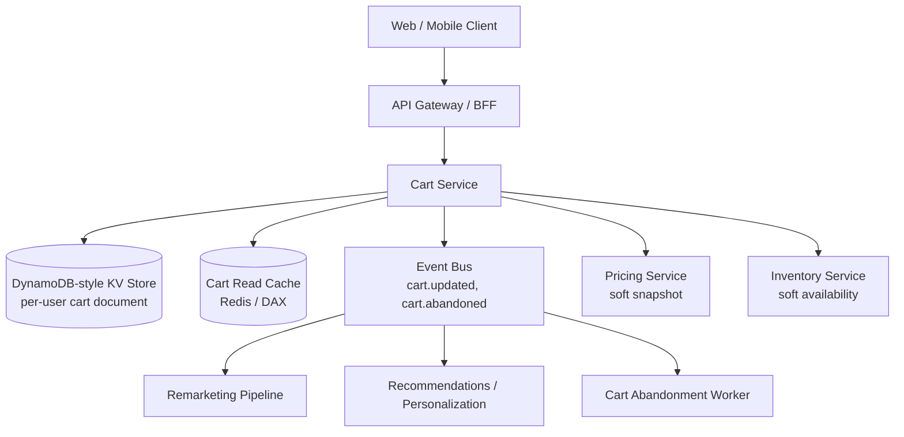
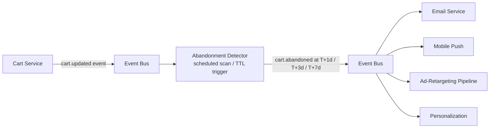

# Amazon Deep Dive — Cart Service — High-Availability Shopping State

**Date:** 2026-04-30 | **Updated:** 2026-04-30
**Tags:** `system-design` `case-study` `amazon` `deep-dive` `cart` `dynamo`

## Table of Contents

- [Summary](#summary)
- [Overview](#overview)
- [Dynamo Origin — Why the Cart Defined a Database](#dynamo-origin--why-the-cart-defined-a-database)
- [Per-User Cart in DynamoDB](#per-user-cart-in-dynamodb)
- [Conflict Resolution — LWW vs Union vs Vector Clocks](#conflict-resolution--lww-vs-union-vs-vector-clocks)
- [Cross-Device Merge](#cross-device-merge)
- [Guest Cart — Persisted vs Ephemeral](#guest-cart--persisted-vs-ephemeral)
- [Cart Abandonment Pipeline](#cart-abandonment-pipeline)
- [Saved-for-Later and Wishlist](#saved-for-later-and-wishlist)
- [Share Cart](#share-cart)
- [Cart-Line-Level Edits](#cart-line-level-edits)
- [Anti-Patterns](#anti-patterns)
- [Related](#related)
- [References](#references)

## Summary

The cart is the smallest service on Amazon's critical path and the one that, more than any other, **shaped the storage layer of the entire company**. The original Dynamo paper (DeCandia et al. 2007) is explicit about this: the shopping cart was the motivating workload that forced Amazon to abandon strongly consistent, leader-based replication and design a system that is "always writable." Every architectural choice in Dynamo — sloppy quorums, hinted handoff, vector clocks, last-write-wins-or-merge-on-read, consistent hashing — exists because the cart needed to accept writes during partial outages and reconcile divergent versions when the network healed.

That heritage is still visible. A modern Amazon-style cart is a per-user document in a Dynamo-descended key-value store, written with optimistic concurrency, replicated to peer nodes within a region, and merged on read when concurrent updates produce divergent histories. Reads are local; writes never block on a quorum; conflicts default to a domain-specific merge (union of line items, max of quantities) rather than a generic last-writer-wins, because the business cost of "you removed the item I just added" is much higher than the cost of "two copies of an item briefly appear and one gets deduped on the next render."

This deep dive covers the lineage, the per-user document layout, the conflict resolution strategy and why a naive LWW is wrong, the cross-device merge ritual on sign-in, the guest-vs-authenticated split, the abandoned-cart pipeline, saved-for-later, share cart, and the line-level edit semantics. The supporting paper to read alongside this doc is the original Dynamo paper.

## Overview

The cart service has a deceptively narrow API:

```http
POST   /v1/cart/items          { sku, qty, offer_id }      → 200 { cart }
PATCH  /v1/cart/items/{line_id} { qty }                     → 200 { cart }
DELETE /v1/cart/items/{line_id}                             → 200 { cart }
GET    /v1/cart                                             → 200 { cart }
POST   /v1/cart/merge          { guest_cart_id }            → 200 { cart }
POST   /v1/cart/save-for-later/{line_id}                    → 200 { cart }
POST   /v1/cart/share                                       → 201 { share_link }
```

What makes it interesting is the operating envelope:

| Property | Target | Why |
|---|---|---|
| Add-to-cart P99 latency | < 200 ms end-to-end | Add-to-cart is interactive; jank is conversion loss |
| Availability | 99.99%+ for writes | Every minute of "cart is broken" is direct revenue loss |
| Durability | Lose nothing once a write is acknowledged | A vanished cart line shatters trust |
| Consistency requirement | Eventual within ~seconds | Customers tolerate a brief stale read; they do not tolerate a write being rejected |
| Cross-region needs | None for the active cart, replication for DR | Carts are session-bound; users rarely hop regions mid-session |
| Concurrent writers | Multiple devices, browser tabs, mobile + web simultaneously | Real users routinely add from a phone while a laptop tab is open |

The cart is also unusual in that **rejecting a write is worse than accepting a stale or conflicting one**. If a user in a low-signal subway taps "add to cart" and the system says "no, you have a stale version," the user does not retry — they leave. The system therefore biases hard toward accepting every write and reconciling later.



## Dynamo Origin — Why the Cart Defined a Database

In the early 2000s Amazon's order pipeline depended on a relational database for the cart. The cart was a row (or a small set of rows) keyed by `customer_id`, and it lived in a leader-based, strongly consistent store. The pain points, as described in DeCandia et al., were:

1. **Strong consistency cost availability.** Any partition that cut the cart's leader off from a writer rejected the write. "Add to cart" failures during partial outages were customer-visible and revenue-fatal.
2. **The store's failure modes were the cart's failure modes.** When the database had a hot partition, a long-running query, or a leader election storm, every customer trying to add an item saw it.
3. **The workload did not need ACID.** A cart write is a single-row update. There is no foreign key to enforce against another customer. There is no invariant that crosses customers. The relational tax (locks, leader-bottlenecked writes, replica-lag-bound reads) was paying for guarantees the workload did not need.

The Dynamo team's central question was: **what would a storage system look like if "always writable" were the top requirement, and consistency were a knob you could turn within a per-operation budget?** The shopping cart was the canonical workload they designed against. From DeCandia et al., section 1:

> *"Customers should be able to view and add items to their shopping cart even if disks are failing, network routes are flapping, or data centers are being destroyed by tornados."*

This single requirement — "the customer can always add to cart, end of discussion" — produced almost every architectural distinctive of Dynamo:

| Dynamo feature | What it solves for the cart |
|---|---|
| Consistent hashing of keys to nodes | A failed node does not strand a customer's cart; the next node on the ring picks up the writes |
| Replication factor N (typically 3) | Multiple replicas can serve a write; losing one or two does not block |
| Sloppy quorums (W + R > N relaxed under failure) | Writes succeed against any reachable replicas, even if the "preferred" ones are down |
| Hinted handoff | A peer node temporarily accepts writes meant for a downed peer, replays them when it recovers |
| Vector clocks | Detect when two carts have diverged and need merging vs when one supersedes the other |
| Read repair / merkle-tree anti-entropy | Eventually re-converge replicas without blocking the foreground path |
| Application-level conflict resolution | The cart application — not the database — decides how to merge two divergent carts |

The last point is the one that matters most for the cart and is the most often misunderstood. Dynamo does not pretend to resolve conflicts for you. It surfaces all sibling versions on read and asks the application to merge them. For a cart, "merge" is a domain-specific union; for a counter, it might be a sum; for a generic K/V workload, it might just be last-writer-wins. The cart team had to write the merge — and they made deliberate choices that traded some duplication risk for the much-worse alternative of losing a recently-added item.

DynamoDB (the AWS managed service) is a descendant, not the same system. DynamoDB makes different trade-offs (strong consistency available per-read, single-region by default, conflict-free designs nudged via conditional writes), but the cart service still benefits from the same family of properties: low-latency single-key reads and writes, automatic partitioning, and the ability to write through partial failures.

**The "always writable" contract in operational terms.** Concretely, the cart service should be able to:

- Accept writes during a single AZ outage in a multi-AZ region, with no observable customer impact.
- Accept writes during a same-region node failure, with the surviving replicas absorbing the load.
- Accept writes during a brief network partition between two AZs, with the partition healing producing siblings that the cart service merges on the next read.
- Tolerate a primary region failover (DR) with cart state recovered from async replication, accepting that some seconds-of-recent writes may be lost — and bounded such that the user, on signing back in, sees a coherent cart and can re-add the missing item if needed.

What the cart service is *not* trying to provide:

- **Linearizable reads.** A user can briefly see different views from different devices. The merge converges quickly enough that this is invisible in practice.
- **Synchronous cross-region replication.** Cart writes pin to the user's home region. A user moving regions mid-session is rare enough to handle as a degraded UX (the cart re-syncs on first read in the new region, which may take a second).
- **Strict ordering across users.** There is no cross-user invariant on the cart, so there is no cross-user ordering requirement.

This is a deliberate scoping. The cart service is allowed to be eventually consistent because it is a per-user, single-document workload with domain-specific merge. Other surfaces in the system (inventory reservation, order placement, payment authorization) are explicitly *not* — they sit on relational stores or use conditional writes with strict isolation. Polyglot persistence, again: each workload picks the strongest guarantee it can afford and no stronger.

## Per-User Cart in DynamoDB

The cart is stored as a single document keyed by `user_id` (for authenticated users) or `guest_token` (for anonymous sessions).

```text
Table: carts
Partition key: cart_owner  (= "u:<user_id>" | "g:<guest_token>")
Sort key:      version_marker  (= "current" | "snapshot:<ts>" for history)

Item shape (current):
{
  cart_owner:   "u:12345",
  version_marker: "current",
  lines: [
    {
      line_id:    "ln_01HABC...",        -- ULID, stable across edits
      sku:        "B01ABC...",
      offer_id:   "off_xyz",
      qty:        2,
      added_at:   "2026-04-29T14:02:18Z",
      updated_at: "2026-04-29T14:09:51Z",
      soft_price: { amount: 14999, currency: "USD" },
      soft_avail: { in_stock: true, fc_hint: "FC-IAD-3" },
      gift:       false,
      saved_for_later: false
    },
    ...
  ],
  meta: {
    item_count_cap: 50,
    qty_cap_per_sku: 30,
    updated_at:  "2026-04-29T14:09:51Z",
    region:      "us-east-1",
    device_id_last_writer: "dev_abc"
  },
  vclock: { "node-3": 7, "node-7": 4 },     -- vector clock; see conflict section
  version: 11                                -- monotonic per-write version for OCC
}
```

Why a single document and not one row per line:

- **Atomicity.** A read returns the entire cart in one round trip. A write replaces the document in one conditional write. There is no "load 12 line rows, then write 12 line rows" pattern, which would invite partial-update races.
- **Latency.** A single-key get from a Dynamo-style store is single-digit ms. Multi-row reads add latency proportional to line count.
- **Cost shape.** Cart documents are small (typically < 4 KB; cap enforced at ~100 KB). The "store the whole thing on every write" model costs almost nothing in throughput-units.
- **Fits the access pattern.** The cart is always read whole. There is no surface that wants line 7 without lines 1–6 and 8–12.

The trade-off is **write amplification**: editing one line rewrites the whole document. For a cart with 30 lines, that is fine. For a thousand-line "list" entity, it would not be. This is one of the reasons "save for later" sometimes lives as a separate document — see [saved-for-later](#saved-for-later-and-wishlist).

**Optimistic concurrency.** Every write is a conditional update: `IF version = N THEN write version N+1 ELSE fail`. Concurrent writes from two devices may race; the loser retries. Critically, the loser **does not lose its data** — it re-reads, merges its intent into the latest state, and rewrites. This is the cart's first line of defence against lost updates.

```ts
// Pseudocode for a cart line addition
async function addLine(userId: string, intent: AddLineIntent): Promise<Cart> {
  for (let attempt = 0; attempt < 5; attempt++) {
    const current = await store.get(`u:${userId}`);
    const next = applyIntent(current, intent);    // pure function
    try {
      await store.conditionalPut(`u:${userId}`, next, {
        ifVersion: current.version,
      });
      return next;
    } catch (err) {
      if (isVersionMismatch(err)) {
        await sleep(jitterBackoff(attempt));
        continue;
      }
      throw err;
    }
  }
  // If we still cannot win OCC after retries, fall back to a merge-write
  return mergeWrite(userId, intent);
}
```

The fallback `mergeWrite` is important: if OCC keeps losing (a hot cart with multiple writers), the system stops trying to win the version race and instead writes a sibling that the read path will merge. This is the bridge from optimistic-locking semantics to Dynamo-style sibling-and-merge semantics.

## Conflict Resolution — LWW vs Union vs Vector Clocks

This is the part the original Dynamo paper agonized over and is the part that most "we'll just use Dynamo for our cart" reimplementations get wrong.

**The naive answer: last-writer-wins (LWW).** When two writers update the same key concurrently, keep the one with the later timestamp; discard the other. Tempting because it is simple, the database can do it without application help, and the read path is trivial. **Wrong for carts.** Consider:

- 14:02:18 — phone adds `Nintendo Switch` (qty 1). Times out on the way back to the user.
- 14:02:19 — laptop, unaware of the phone's add, adds `AirPods Pro` (qty 1). Returns 200.
- LWW keeps the laptop's write; the phone's `Nintendo Switch` add is silently lost.

The user paid attention only to whether the *click* succeeded, not to whether the eventual document reflects both adds. From the user's perspective, the system swallowed a write. There is no way to recover it — the data never reached durable storage in a form that survives the LWW resolution, or worse, it did and was overwritten.

**The right answer for the cart: a domain-aware merge that biases toward keeping items.** When two siblings exist for the same cart, the merge:

1. **Union the lines** keyed by `(sku, offer_id)`. Same item from both siblings → one line. Different items → both kept.
2. **Reconcile quantity** by taking the **max** by default for adds, but using **causality** when an explicit decrement is detected.
3. **Reconcile removal** by treating `removed_at` as a tombstone with a vector clock; a remove that *causally* follows an add wins; a remove concurrent with an add **does not win** (the add is preserved).
4. **Reconcile per-line metadata** (gift wrap, save-for-later flag) by last-writer-wins on the *field*, not on the whole line.
5. **Cap at limits** (`item_count_cap`, `qty_cap_per_sku`) after the union.

This is exactly what the Dynamo paper describes for shopping cart reconciliation: the application reads sibling versions, merges them with knowledge of cart semantics, and writes the merged result back. The user might briefly see a quantity of 2 instead of the "right" 1, but they will not see a missing item.

**Why max-quantity instead of sum.** Imagine the user sets quantity to 2 from one device, then sets quantity to 2 again from another. Sum gives 4 (wrong). Max gives 2 (right). The semantic is "the user expressed 2," not "the user added 2 twice." Add-events that did not pass through the same `line_id` are merged via union (different lines), not sum.

**Vector clocks: why they matter.** A naive merge based on wall-clock timestamps gets confused by clock skew across devices (a phone and a laptop's clocks can drift seconds apart) and by retries. Vector clocks attach a per-replica counter to every write so the merge can answer the right question: *did write A causally happen before write B, or are they concurrent?*

```text
Write A on replica N3: vclock { N3: 7 }
Write B on replica N7: vclock { N7: 4 }
                      → concurrent (no replica's counter dominates the other's)
                      → keep both as siblings, merge on read

Write C on replica N3: vclock { N3: 8 }   (descended from A)
                      → C dominates A; A can be discarded
```

Causal updates collapse into a linear history; concurrent updates remain as siblings until a merge writes a new version that dominates both. The merge result's vector clock is the pointwise max of the siblings' clocks, plus an increment on the merging replica.

**Why timestamp-based ordering is unsafe across devices.** Wall-clock time on a phone, a laptop, and a Dynamo node are three independently-drifting references. NTP keeps them within tens of milliseconds in good conditions and seconds in bad ones; on a flaky LTE link, a phone's clock can be off by minutes. Picking the "latest" write by client timestamp lets a phone with a fast clock silently win over a laptop with a slower clock, even when the laptop's write was actually later in real time. Vector clocks sidestep this entirely: they ask "did A causally precede B?" instead of "which clock value is bigger?" — a question with no clock-skew failure mode.

**A worked merge example.**

```text
Sibling A (laptop, vclock {N3:7}):
  lines = [
    { line_id: "ln_X", sku: "S1", qty: 2 },
    { line_id: "ln_Y", sku: "S2", qty: 1 }
  ]
  removed = []

Sibling B (phone, vclock {N7:4}):
  lines = [
    { line_id: "ln_X", sku: "S1", qty: 1 },     -- user changed mind
    { line_id: "ln_Z", sku: "S3", qty: 1 }      -- phone added new item
  ]
  removed = [{ line_id: "ln_Y", at: "...", vclock: {N7:3} }]

Merge:
  - ln_X: same line in both. Quantity 2 vs 1 — concurrent updates. Bias toward
    "max" for safety: qty = 2. (UI surfaces this so user can lower it.)
  - ln_Y: A has it; B has a tombstone. The remove on B is causally concurrent
    with A's edit (A's vclock {N3:7} does not include N7:3; B's vclock {N7:3}
    does not include N3:7). Bias toward keeping the item; the user can remove
    it explicitly if they still want to.
  - ln_Z: only in B. Keep.
  Result: lines = [ln_X qty 2, ln_Y, ln_Z]
  Result vclock: {N3:7, N7:4} + increment on merging node.
```

The merge's bias — "when in doubt, keep the item; let the user explicitly remove" — is the cart's central correctness statement. It is the exact opposite of the bias most generic conflict resolvers ship with.

**What about per-field LWW for metadata.** Boolean toggles like `gift_wrap` or `saved_for_later` can use field-level LWW because the worst case (the toggle ends up on or off briefly until the next user action) is benign. Quantity, item presence, and offer selection get the explicit semantic merge.

## Cross-Device Merge

The cart sync story has three actors: the server's authoritative cart, the local optimistic state in each client, and the merge boundary when a user signs in or switches devices.

**Authenticated, multi-device.** The server cart is the source of truth. Every device reads it on session resume, applies its local pending writes, conditional-writes back, and accepts merge results from the server. Conflicts resolve as described above.

**Sign-in merge.** A user browsing anonymously fills a guest cart, then signs in. Two carts now exist:

- The user cart `u:<user_id>` (possibly with items from a prior session).
- The guest cart `g:<guest_token>` (just-built, in this session).

`POST /cart/merge { guest_cart_id }` on the server runs:

```ts
function mergeGuestIntoUser(user: Cart, guest: Cart): Cart {
  const byKey = new Map<string, Line>();
  for (const ln of [...user.lines, ...guest.lines]) {
    const k = `${ln.sku}::${ln.offer_id ?? ""}`;
    const existing = byKey.get(k);
    if (!existing) {
      byKey.set(k, ln);
    } else {
      byKey.set(k, {
        ...existing,
        qty: Math.min(QTY_CAP_PER_SKU, Math.max(existing.qty, ln.qty)),
        updated_at: maxTs(existing.updated_at, ln.updated_at),
        // gift / save-for-later use field LWW by updated_at
        gift: laterWins(existing, ln, "gift"),
      });
    }
  }
  const merged = capItems([...byKey.values()], ITEM_COUNT_CAP);
  return {
    ...user,
    lines: merged,
    meta: { ...user.meta, updated_at: nowIso() },
    version: user.version + 1,
  };
}
```

The merge is intentionally idempotent: replaying the same guest cart against the same user cart twice produces the same result. This matters because mobile clients sometimes send the merge request twice (once from a backgrounded tab, once from foregrounded) and we must not double-quantity the user's cart.

**Device switch mid-flow.** A user adds on phone, opens laptop, sees an old cart. The cart service's read path checks the local edge cache first, falls back to the store on miss; cache TTLs are short (seconds) precisely so a switch sees the latest state quickly. The client also subscribes (via long-poll or WebSocket on apps that support it) to cart-update push so the second device sees the first device's add within a couple of seconds.

**Offline edits.** A mobile app may collect cart edits while offline. On reconnection, it replays them as a batch. Each edit carries an idempotency key; the server applies them in order, conditional-writes, and the merge logic handles any divergence introduced while the device was offline.

**Push channel for cart deltas.** On apps with a persistent push channel (mobile apps with notification sockets, web with Server-Sent Events), the cart service emits a small delta on every `cart.updated` so the other devices invalidate their local cache and re-render. The delta is not the source of truth — the device must still re-fetch on the next interaction — but it shortens the "I added on phone, why doesn't laptop see it" window from "next interaction" to "within a second or two."

**Tab-level coherence.** Multiple tabs in one browser are a frequent source of cart write conflicts. The web client uses a `BroadcastChannel` (or a shared worker, where supported) so that all tabs of the same user share an in-memory cart state and serialize their writes through a single in-page coordinator. This collapses the "two tabs racing" case into "one tab making two sequential writes," which the OCC path handles cleanly and avoids unnecessary sibling creation on the server.

## Guest Cart — Persisted vs Ephemeral

A guest cart is the cart of a user who has not signed in. The architectural question is: where does it live, and for how long?

**Two viable designs.**

| Design | Storage | Lifetime | Pros | Cons |
|---|---|---|---|---|
| Cookie-only | Encrypted blob in a cookie sent on every request | As long as the cookie | Zero server state for guests; trivial to scale | Capped at ~4 KB; no cross-device; lost when cookies cleared; vulnerable to XSS if not HttpOnly |
| Server-persisted with guest token | Same KV store as user carts; key = `g:<guest_token>` | TTL'd (e.g., 30 days) | Larger capacity; recoverable on cookie reset if token known; survives device upgrade with shared cookie | Server-side state for non-customers; operational and cost overhead |

Amazon-style large e-commerce uses **server-persisted with a guest token** for the principal cart and a small companion cookie that carries the token. The cookie is `HttpOnly`, `Secure`, `SameSite=Lax`, and contains only the random token, not cart contents. Reasoning:

- Guests build sizeable carts during research sessions; 4 KB is too tight.
- Cross-device guest sessions exist (a user copies a "share cart" link to a friend).
- Once the guest signs in or signs up, the merge is server-side and atomic, not a "send me your cookie blob and trust it" flow.

**Ephemeral parts.** Even within a server-persisted guest cart, some fields are explicitly ephemeral: `soft_price` and `soft_avail` are snapshots that may be re-fetched on every read. These are not "the cart" in the canonical sense; they are advisory presentation data. A guest cart that sits for a week and is read fresh on the eighth day pulls current prices and availability, while keeping the lines themselves.

**Anti-abuse.** A purely-server-persisted guest cart is a small abuse vector — spam clients can mint tokens and write to thousands of guest carts. Mitigations:

- Rate-limit cart writes per guest token.
- Cap guest-cart count per source IP / device fingerprint.
- TTL-prune unmerged guest carts aggressively (30 days is generous; 7 days is fine for many products).
- Require a CAPTCHA or device-attestation challenge if a single source mints carts at suspicious rates.

## Cart Abandonment Pipeline

A "cart abandoned" signal is a behavioral marker, not a state stored on the cart row. The cart row is the cart; abandonment is computed by reading the cart's `meta.updated_at` against a clock and emitting events when thresholds cross.



**Detection.** Two viable mechanics:

1. **DynamoDB TTL-style sweep.** Each cart has a denormalized `next_abandonment_check_at` field. A scheduled job scans rows whose check-time has passed, recomputes whether the cart is still inactive, and emits `cart.abandoned` if so. Cheap to implement; high cost in scan throughput at large fleet sizes.
2. **Event-driven.** Every `cart.updated` event resets a per-user timer in a workflow engine (Step Functions, Temporal). When the timer fires without being reset, emit `cart.abandoned`. More expensive in workflow state but does not sweep the entire fleet.

For Amazon scale (~50 M active carts), event-driven with a workflow engine is the standard choice because the sweep cost on a 50 M-row table is non-trivial and the per-cart workflow state amortizes over all the cart's other lifecycle events.

**Multiple abandonment thresholds.** Marketing typically wants several:

- `t+1h` — same-session "did you forget something?" push notification.
- `t+24h` — email reminder with the cart contents.
- `t+72h` — email + offer (small discount, free shipping).
- `t+7d` — last reminder before deprioritizing.

Each threshold emits a distinct event; the cart row itself does not store abandonment state. Marketing services subscribe and run their own logic. Crucially, **the cart service does not own the marketing decision** — it owns only the signal.

**Privacy and consent.** Abandonment messaging is regulated (GDPR, CAN-SPAM, CASL). Each downstream consumer of `cart.abandoned` must check the user's marketing-consent flags before sending. The cart service emits the signal; consumers gate on consent.

**Auto-prune.** Carts older than M months (typically 6–12) are pruned to a snapshot in cold storage and removed from the hot table. Prune events are idempotent and reversible (a recovery job can re-hydrate a snapshot if a customer support agent needs to).

## Saved-for-Later and Wishlist

"Save for later" is a cart-adjacent surface but architecturally separable. Two design choices:

**Option A: same document, flag per line.** Add `saved_for_later: bool` to each line. Pro: one document, simple migrations between cart and saved. Con: the cart document grows with saved items, which never expire; write amplification on every cart edit increases.

**Option B: separate document, same shape.** A second document keyed `u:<user_id>:saved`. Moving a line "to saved" deletes it from cart and adds it to saved (atomically via a transactional batch write where supported, or as a saga with idempotent steps). Pro: cart stays small; saved can have its own retention rules. Con: two documents to keep coherent; cross-document reads for the cart-page render.

Most large e-commerce platforms use **Option B**, accepting the dual-document complexity in exchange for a bounded cart size. The "move to cart from saved" UX runs the saga in reverse; both directions are idempotent on the line's stable `line_id`.

**Wishlist** is a third surface and a third document. It differs from saved-for-later in semantics:

- Saved-for-later is private, ephemeral, and tied to the cart workflow.
- Wishlist is sometimes public/shareable, longer-lived, and may have categories ("Birthday", "Office").

The wishlist service is often a separate microservice with its own storage and its own API; it lives outside the cart service entirely. The cart UI links to it but does not own it.

## Share Cart

Share-cart lets a user send a snapshot of their cart to another user. The mechanics:

```http
POST /v1/cart/share
→ 201 { share_id, share_link, expires_at }

GET /v1/shared-carts/{share_id}
→ 200 { lines, snapshot_taken_at, owner_display_name }

POST /v1/cart/import-shared/{share_id}
→ 200 { cart }     # merges shared cart into recipient's cart
```

**Snapshot vs live.** A share cart is a *snapshot*, not a live view. The owner's subsequent edits do not appear in the share. Reasoning:

- Privacy: an owner editing their cart should not have those edits leak to anyone holding the share link.
- Stability: a recipient looking at a friend's "here's my Black Friday cart" should see what was shared, not a moving target.
- Storage: a snapshot is a small immutable object; a live view requires a fan-out subscription.

**Storage.** Shared carts live in a separate `shared_carts` table, keyed by `share_id` (a random opaque ID, not derivable from `user_id`). Each row stores the line list at the moment of share, the owner's display name (consented), and an expiry time (default 30 days).

**Authorization.** Anyone with the `share_id` can read the shared cart — the share_id is a capability. No login is required to view; no PII (address, payment) is in the snapshot. The recipient who imports needs to be signed in; the import goes through the same merge logic as guest-cart merge (`POST /cart/import-shared`).

**Abuse and rate limits.** Bots minting share links to spam social networks is a real abuse vector; rate-limit creation per user, per IP, per session. Shared cart pages should be `noindex` so they do not pollute search results.

**Variants in the wild.**

- **Family / shared cart** (live, multi-writer): a different feature, often called "Amazon Households," that uses a different data model (multi-owner cart with per-line attribution, conflict resolution biased toward keeping all members' adds).
- **Cart-link in messaging** (snapshot): the typical "share my cart" feature described here.

## Cart-Line-Level Edits

Cart edits are line-scoped, not document-scoped, from the API contract. From the storage perspective, all edits rewrite the document, but the API speaks lines.

```http
PATCH /v1/cart/items/{line_id}
  Body: { qty: 3 }

DELETE /v1/cart/items/{line_id}

POST /v1/cart/items/{line_id}/options
  Body: { gift_wrap: true, gift_message: "..." }
```

**Why lines have stable `line_id` and not just `sku`.** Multiple lines can share a SKU with different offers (a buyer adds the same product from two sellers to compare) or different gift options. A SKU-keyed identity collapses these and breaks edits. A ULID per line preserves identity through every edit.

**Quantity edits.**

- Set, not delta. The client sends `qty: 3`, not `qty: +1`. Server-side counters across racing devices would be a nightmare; clients have full local state and send absolute targets.
- The server enforces `qty_cap_per_sku` (typically 30) on accept. Over-cap returns a 422 with the cap value so the client can render an inline message.

**Line removal.**

- Soft-removed lines leave a tombstone with a vector clock so that concurrent re-add does not get silently undone. The tombstone is pruned after both replicas converge.
- A user explicitly removing then re-adding the same SKU produces a new `line_id` (since the previous one is tombstoned).

**Offer changes.** A buyer can switch the seller/offer for a line ("same product, different seller"). This is a line update, not a remove+add, so the line preserves its `added_at` and any gift options. The price snapshot is refreshed on offer change.

**Gift options and metadata.** Field-level LWW. Toggling gift wrap on the phone and off on the laptop has a benign worst case (one wins; the user re-toggles on the next interaction).

**Cap enforcement on merges.** When a merge produces more than `item_count_cap` lines (e.g., guest had 30 lines, user had 25 lines), the merge keeps the most-recently-touched lines up to the cap and drops the rest with a notice in the response (`merge_truncated: true`, with the dropped SKUs listed for client-side disclosure). The user can then re-add anything they specifically wanted from the dropped set.

**Soft snapshots vs hard checks.** Every line stores `soft_price` and `soft_avail` at the time of write. The cart page shows them as advisory. Checkout re-fetches both authoritatively. The cart UI surfaces *changes* between snapshot and current ("price dropped", "now back in stock", "limited stock") so the user is not surprised at checkout. See [`./inventory-consistency.md`](./inventory-consistency.md) for the inventory-side of this contract.

**Bulk operations.** A few less-frequent but real cart operations operate over multiple lines:

- **"Move all to saved-for-later"** when the user wants to defer the whole cart. Implemented as a single conditional write that flips all lines into a separate saved document and clears the cart.
- **"Buy again"** from order history, which adds a previous order's lines to the current cart in one batch. Idempotency key derived from `(user_id, source_order_id)` so a double-tap does not double-add.
- **"Empty cart"** which writes a fresh empty document with an incremented version. The previous document is retained briefly in the cart history table so customer support can recover it if the user complains.

Each of these is a single conditional write, not a stream of per-line edits, to minimize OCC contention.

**Cart history and undo.** Some surfaces want a recent-undo affordance ("you removed 3 items — undo?"). The cart service writes a small ring buffer of the last N versions to a `cart_history` document keyed by user, with TTL of a few minutes. Undo is a "restore from snapshot" operation, not a reverse-engineered diff, which keeps the implementation honest about what state is being restored.

## Anti-Patterns

- **Last-writer-wins as the default conflict resolver.** Silently drops adds. The cart is the textbook case where domain-specific merge beats a generic policy.
- **Storing the cart in a strongly-consistent leader-based RDB at scale.** Leader failover during peak is direct revenue loss. The whole point of the Dynamo lineage is that the cart never has to wait for a leader.
- **Synchronous cross-region writes for cart.** Adds 50–150 ms per write, gives the user nothing they would notice. Cart writes pin to the user's home region; DR replicates async.
- **One row per line in the cart.** Multiplies write amplification on every edit, invites partial-update races, and offers no real benefit at the line counts a cart contains. The whole-document model is correct for this access pattern.
- **Cookies-only guest cart at Amazon-scale catalog.** 4 KB cap is hostile to the long-research carts that convert best. Server-persisted with a token-bearing cookie scales without sacrificing UX.
- **Hard inventory check on every cart render.** Browse+cart traffic dwarfs checkout traffic; routing every cart render at the authoritative inventory store creates an unnecessary hot path. Cart renders read soft snapshots; checkout does the hard reservation.
- **Letting the cart service own the abandonment marketing decision.** Cart emits a signal; marketing decides what to do with it. Conflating the two couples regulated marketing logic to the cart's hot path.
- **Live share-cart.** Privacy leaks (owner edits visible to share recipients) and unnecessary fan-out cost. Snapshot semantics are almost always the right contract.
- **Treating the cart's vector clock as a database internal.** The cart's merge is an *application* concern; the application must read the sibling versions and produce a merged version. Hiding this from the cart service produces silent corruption.
- **Capping cart with a hard reject after merge.** A merge that exceeds caps should truncate with a user-visible notice; it should not fail the entire merge and lose all the user's prior state.
- **Idempotent merge endpoints that quietly double quantities on retry.** The merge must be deterministic on the same `(user_cart, guest_cart)` pair, regardless of how many times the client retries.
- **Treating saved-for-later as just another cart line.** It bloats the cart's write hot path with items that are not in the active purchase flow. A separate document with its own retention is cleaner.
- **Hardcoding cart limits in code.** `qty_cap_per_sku` and `item_count_cap` change for promotions, fraud signals, and account-tier rules. They belong in a configuration service the cart reads at write time.

## Related

- [`../design-amazon-ecommerce.md`](../design-amazon-ecommerce.md) — the parent integration HLD and the cart's place in the broader system.
- [`./inventory-consistency.md`](./inventory-consistency.md) — soft-vs-hard inventory checks, the contract between cart's advisory snapshot and checkout's authoritative reservation.
- [`../../../data-structures/consistent-and-rendezvous-hashing.md`](../../../data-structures/consistent-and-rendezvous-hashing.md) — the consistent-hashing scheme Dynamo uses to locate cart documents and tolerate node failure.
- [`../../data-consistency/distributed-transactions.md`](../../data-consistency/distributed-transactions.md) — sagas and idempotency, used by the saved-for-later move and the share-cart import flows.

## References

- DeCandia et al., ["Dynamo: Amazon's Highly Available Key-value Store"](https://www.allthingsdistributed.com/files/amazon-dynamo-sosp2007.pdf), SOSP 2007 — the foundational paper. The shopping cart is the motivating workload, and section 4.4 ("Data Versioning") describes the vector-clock-and-merge-on-read scheme used here.
- Werner Vogels, ["Eventually Consistent — Revisited"](https://www.allthingsdistributed.com/2008/12/eventually_consistent.html), ACM Queue 2008 — Amazon CTO's framing of why eventual consistency is the right default for the cart and other always-writable surfaces.
- AWS, ["Amazon DynamoDB Developer Guide — Best Practices for Designing and Architecting"](https://docs.aws.amazon.com/amazondynamodb/latest/developerguide/best-practices.html) — single-table patterns, hot-partition mitigation, and conditional writes used by the cart service.
- AWS, ["Amazon DynamoDB Conditional Writes"](https://docs.aws.amazon.com/amazondynamodb/latest/developerguide/Expressions.ConditionExpressions.html) — the optimistic-concurrency primitive used for `IF version = N` cart updates.
- AWS, ["DynamoDB Time to Live (TTL)"](https://docs.aws.amazon.com/amazondynamodb/latest/developerguide/TTL.html) — used for guest-cart expiry.
- AWS, ["DynamoDB Streams and AWS Lambda Triggers"](https://docs.aws.amazon.com/amazondynamodb/latest/developerguide/Streams.Lambda.html) — how `cart.updated` events are emitted reliably from cart writes.
- Bailis and Ghodsi, ["Eventual Consistency Today: Limitations, Extensions, and Beyond"](https://queue.acm.org/detail.cfm?id=2462076), ACM Queue 2013 — the academic context for why merge-on-read beats LWW for richer data types.
- Shapiro et al., ["Conflict-Free Replicated Data Types (CRDTs)"](https://hal.inria.fr/inria-00609399v1/document), 2011 — the formal framework whose ideas inform how the cart's union-with-tombstones merge stays convergent under arbitrary write orders.
- Lamport, ["Time, Clocks, and the Ordering of Events in a Distributed System"](https://lamport.azurewebsites.net/pubs/time-clocks.pdf), CACM 1978 — the original logical-clock paper underpinning vector clocks.
