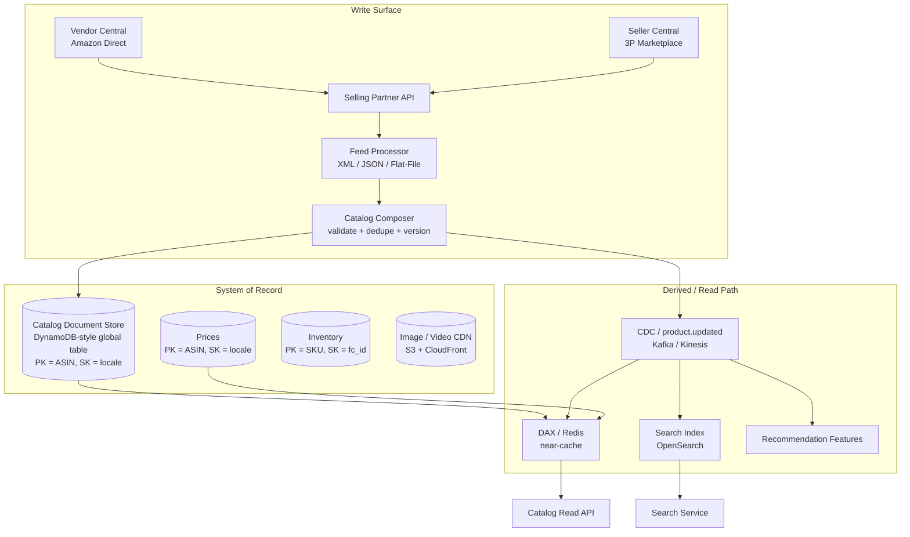

# Amazon Deep Dive — Catalog Service

**Date:** 2026-04-30 | **Updated:** 2026-04-30
**Tags:** `system-design` `case-study` `amazon` `deep-dive` `catalog` `scaling`

## Summary

The Amazon catalog is the single most-read system in the company and the data plane that every other service — search, recommendations, cart, checkout, ads, fraud, fulfillment — eventually resolves through. It is not a "products table." It is a globally replicated, hundreds-of-millions-of-SKUs, multi-tenant, semi-structured document store whose write surface is open to **two million-plus third-party sellers** under the Selling Partner API, and whose read surface must answer point lookups in single-digit milliseconds while a single product detail page page-fans-out into 100+ parallel internal calls. The architecture is unforgiving of any choice that adds a join, a synchronous cross-region hop, or an unbounded write amplification on a hot SKU. This doc unpacks the choices that fall out of those constraints: ASIN as the canonical product identifier, the volatile-vs-stable field split that lets price changes happen 1000× more often than catalog changes without invalidating the document, the seller-listing-vs-Amazon-product reconciliation problem, the variation tree for size/color/style, regional differences in price and availability and language, the category taxonomy and category-specific attribute schemas, A+ Content as a separate write surface, and the deduplication problem when thousands of sellers submit listings for the same physical product. It is the deep-dive companion to the Catalog Service section of the parent design doc.

## Table of Contents

- [Summary](#summary)
- [Overview](#overview)
- [ASIN — The Canonical Product Identifier](#asin--the-canonical-product-identifier)
- [Product Metadata Model](#product-metadata-model)
- [Read and Write Rate](#read-and-write-rate)
- [Marketplace Seller Catalog vs Amazon-Direct](#marketplace-seller-catalog-vs-amazon-direct)
- [Product Variation Tree](#product-variation-tree)
- [Regional Differences](#regional-differences)
- [Category Taxonomy](#category-taxonomy)
- [A+ Content](#a-content)
- [SKU Deduplication and Listing Reconciliation](#sku-deduplication-and-listing-reconciliation)
- [Anti-Patterns](#anti-patterns)
- [Related](#related)
- [References](#references)

## Overview

Catalog at Amazon is a **read-amplification machine**. A single search results page on amazon.com renders 16–48 product cards; each card needs title, image, price, prime-eligibility, rating, and a small slice of attributes. A product detail page renders title, gallery, bulleted features, A+ Content modules, variations, price, deal badge, prime, delivery estimate, ratings histogram, Q&A, reviews, "frequently bought together," and dozens of other widgets — and each of those widgets is a separate service call that ultimately passes through some catalog read.



The shape of the system is dictated by three constraints:

- **Reads dwarf writes by 4–5 orders of magnitude.** Hundreds of thousands of catalog QPS on the read side; tens to low-hundreds per second on the write side (excluding price/inventory which are split out).
- **Writes are externally-driven and adversarial.** Sellers submit listings of any quality. Validation and deduplication is a non-trivial pipeline, not a database constraint.
- **The schema is heterogeneous.** Required attributes for "running shoe" (size, width, gender, sport) have nothing in common with required attributes for "USB-C cable" (length, connector, gauge, data spec). Forcing a single relational schema is ridiculous; forcing a single per-category schema is also wrong because categories nest and overlap.

The catalog is a document store *because the data is documents*, not because document stores are trendy. The relational alternative requires 10–30 joins per detail page, which is unaffordable at this scale.

## ASIN — The Canonical Product Identifier

**ASIN (Amazon Standard Identification Number)** is the primary key of the catalog. It is a 10-character alphanumeric string (`B0` prefix on most modern entries; older entries can be plain 10-digit ISBNs for books, which Amazon issued ASINs for first). Examples: `B07XJ8C8F5`, `B0BSHF7WHW`. Every browseable product on amazon.com has exactly one ASIN per locale.

### Why ASIN, not UPC/EAN/ISBN

Universal Product Codes (UPC, GTIN-12), European Article Numbers (EAN, GTIN-13), and ISBNs are issued by external standards bodies (GS1, ISBN agencies). They identify a *manufactured product* — a single physical thing produced by a brand. They do **not** map cleanly onto Amazon's catalog needs:

- **Bundles and variants.** A "3-pack of socks in size L" has no native UPC; Amazon needs to list it.
- **Self-published or hand-made goods.** Etsy-style and Kindle Direct Publishing entries have no UPC. Amazon must still inventory them.
- **Region-specific SKUs.** The same UPC can be issued differently in different regions.
- **Re-issued or repackaged items.** Same physical product, new UPC.

ASIN is the **internal canonical identifier** that points back to one or more external identifiers. The relationship is many-to-one: an ASIN may carry a `gtin` field with one UPC/EAN/ISBN, but the ASIN is the pointer used by every internal service.

### ASIN allocation

ASIN allocation happens during catalog write composition. The Catalog Composer:

1. Receives a listing submission (via SP-API, vendor feed, or admin tooling).
2. Looks up by external identifier (UPC/EAN/ISBN) and by attribute fingerprint.
3. **Match found** → attach the seller's offer to the existing ASIN; do not allocate a new one.
4. **No match** → allocate a fresh ASIN from a sharded ID generator and create a new product document.

The ID generator is sharded by region and uses a base-36 encoding to keep ASINs short. Allocation is durable (no holes that get reused) because ASINs are referenced by reviews, Q&A, ad campaigns, and fulfillment records — reusing one would corrupt history.

### ASIN per locale

A single physical product sold in the US, UK, and JP has historically had **three different ASINs**, one per regional marketplace, because content (title, description, attributes) is localized and prices/availability differ. Modern catalog architecture leans on a `parent ASIN` plus per-locale `child ASINs` so that global services (recommendations, fraud) can group them, while regional services see a region-specific document. The Selling Partner API exposes both shapes.

### Why this matters for design

ASIN-as-PK shapes the entire physical schema. The catalog table is keyed `(ASIN, locale)`; reads are point lookups; partitioning is by ASIN hash; replication is global. Any access pattern that wants to query "all products in category X" or "all products from seller Y" is a **secondary index**, not a primary scan, and is served by the search index, not the catalog table directly. This is the polyglot principle in microcosm: the system of record optimizes the dominant access pattern (point lookup by ASIN), and every other access pattern is a derived view.

## Product Metadata Model

A catalog document is a wide, heterogeneous document keyed by `(ASIN, locale)`. The shape is roughly:

```jsonc
{
  "asin": "B0BSHF7WHW",
  "locale": "en_US",
  "marketplace_id": "ATVPDKIKX0DER",      // US

  "core": {
    "title": "Anker 735 Charger (Nano II 65W) - GaN II PPS Fast Compact ...",
    "brand": "Anker",
    "manufacturer": "Anker",
    "model_number": "A2664",
    "color": "Black",
    "package_dimensions": { "length_in": 1.61, "width_in": 1.61, "height_in": 1.18, "weight_oz": 4.16 },
    "item_weight_oz": 4.16,
    "country_of_origin": "CN"
  },

  "category_path": ["Electronics", "Computers & Accessories", "Laptop Accessories", "Chargers & Adapters"],
  "browse_node_ids": [172282, 13983791, 13983801, 3012917],

  "attributes": {
    "wattage": "65W",
    "connector_type": ["USB-C"],
    "compatible_devices": ["Phones", "Tablets", "Laptops"],
    "input_voltage": "100-240V",
    "warranty": "24 months"
  },

  "variations": {
    "parent_asin": "B0BSHF7WHW",
    "variation_theme": ["color", "wattage"],
    "children": [
      { "asin": "B0BSHF7WHW", "color": "Black", "wattage": "65W" },
      { "asin": "B0BSHFKZ5J", "color": "White", "wattage": "65W" },
      { "asin": "B0BSHGN6Q1", "color": "Black", "wattage": "100W" }
    ]
  },

  "media": {
    "main_image_id": "61d3...wL",
    "additional_image_ids": ["71f8...wL", "81a2...wL", "91c4...wL"],
    "video_ids": ["v_812...mp4"]
  },

  "description": {
    "bullet_points": [
      "GaN II Technology: 2x faster than the original GaN ...",
      "Compact Design: 58% smaller than the original 65W ...",
      "..."
    ],
    "long_description_html": "<p>...sanitized HTML...</p>",
    "aplus_content_id": "aplus_8841_anker_735"      // pointer to A+ Content store
  },

  "compliance": {
    "hazmat_class": null,
    "regulatory_certifications": ["FCC", "CE", "RoHS"],
    "age_restriction": null
  },

  "seller_offers_summary": {
    "buybox_seller_id": "AMAZON",
    "offer_count": 14,
    "lowest_offer_price_minor": 5599,
    "lowest_offer_currency": "USD"
  },

  "metadata": {
    "version": 38,
    "created_at": "2022-08-02T14:21:00Z",
    "updated_at": "2026-04-12T09:08:02Z",
    "last_editor": "seller_AB12CDXYZ",
    "content_status": "ACTIVE"          // ACTIVE | SUPPRESSED | UNDER_REVIEW
  }
}
```

Some structural notes:

- **Title, description, attributes** live in the catalog document. They change rarely. They are the "stable body" of the product.
- **Price, inventory, ratings, buybox** live in **separate tables**. They change orders of magnitude more frequently. The read API composes them at read time. This is the single most important schema decision in the catalog.
- **Image and video bytes** live in S3 / CloudFront. The document stores image *IDs* and the read API resolves them to CDN URLs.
- **Free-form HTML** (`long_description_html`) is sanitized server-side before storage — sellers cannot inject `<script>` or arbitrary CSS.
- **Browse nodes** are an integer-keyed, hierarchical taxonomy (see [Category Taxonomy](#category-taxonomy)).

### Why split volatile from stable

The principle is **write amplification dominates cache invalidation cost**. If price lived in the catalog document:

- Every price change (millions per day) bumps the document version.
- DAX entries for the document are invalidated.
- The search indexer re-indexes the full document.
- The recommendation feature pipeline re-computes features.

Splitting price into its own table means a price change writes ~20 bytes instead of ~10 KB, invalidates only a tiny price cache entry, and triggers only the search indexer's price-only fast path. The cost of the read-time composition (one extra cache lookup) is dwarfed by the savings in write fanout.

The same logic applies to **inventory** (changes per order), **rating aggregate** (changes per review), and **buybox** (changes whenever an offer's price or availability changes).

## Read and Write Rate

The catalog read/write asymmetry is the central operational fact.

### Read rate

| Surface | Approx QPS at peak | Why |
|---|---|---|
| Search results page | ~100 K QPS × ~32 items/page → ~3 M item-reads/sec | Each result card resolves catalog + price + rating |
| Product detail page | ~50 K QPS × ~5 catalog calls/page → ~250 K QPS | Detail page fans out: main, variations, frequently-bought, also-viewed |
| Recommendation widgets | ~200 K QPS | Carousels everywhere — homepage, post-add-to-cart, post-purchase |
| Cart line render | ~50 K QPS | Each cart line refreshes title, image, price, prime |
| Checkout review | ~10 K QPS | Order summary re-reads catalog at checkout time |
| Internal services (fraud, ranking, ads) | ~500 K QPS | Background scoring and feature joins |
| **Aggregate** | **~1 M+ QPS sustained, several × at peak** | |

These numbers are illustrative — Amazon does not publish exact peak QPS — but the order-of-magnitude is consistent with public AWS re:Invent talks describing DynamoDB workloads on the catalog/cart side.

### Write rate

| Source | Rate | Notes |
|---|---|---|
| New listings (sellers + vendors) | ~100–500/sec sustained, bursts higher | Driven by Q4 seasonality and category launches |
| Attribute edits | ~50–200/sec | Title fixes, description edits, image swaps |
| Variation edits | ~10–50/sec | Adding new size/color, parent-child re-grafts |
| Admin / category management | ~10/sec | Taxonomy changes, browse-node moves |
| Compliance / suppression | ~10/sec | Restricted product takedowns, hazmat reclassification |
| **Aggregate catalog writes** | **~200–1000/sec** | Modest — kilobyte writes, not gigabyte |
| Price updates (separate table) | ~10 K–100 K/sec | Repricing engines, deal launches |
| Inventory updates (separate table) | ~10 K–50 K/sec | Order fulfillment, receiving, returns |

The **5–6 orders of magnitude gap** between catalog reads (~1 M QPS) and catalog writes (~1 K QPS) is what justifies aggressive read-side caching. With 95%+ DAX hit rates and 99%+ at the edge, the actual document store sees a tiny fraction of the read traffic.

### Where the writes come from

Amazon's catalog write surface is dominated by **third-party sellers** going through the Selling Partner API or Seller Central UI:

- **2 million+ active third-party sellers worldwide** (per Amazon's annual SMB Impact Report).
- A long tail of sellers makes a few edits per day; a small head makes thousands.
- Tooling integrators (Channel Advisor, Sellercloud, Helium 10) drive bulk feeds.
- Vendor Central is the 1P (first-party / Amazon Direct) write surface for brands selling *to* Amazon, not *on* Amazon.
- An internal admin / catalog ops team adds editorial content, fixes dedup mistakes, and curates featured products.

This means catalog writes are **adversarial**: sellers may submit poor data, miscategorize, attempt keyword stuffing in titles, claim variations that do not match, or duplicate existing listings. The Catalog Composer is the immune system.

## Marketplace Seller Catalog vs Amazon-Direct

Amazon runs both **first-party retail** (Amazon buys from a vendor, lists it itself, fulfills it) and **third-party marketplace** (independent sellers list and sell on amazon.com). On the catalog this is **not two separate catalogs**. It is one catalog with multiple offers per ASIN.

### The offer model

```text
ASIN: B07XJ8C8F5  (one product document)
   ├── Offer 1: Amazon (1P)   — $24.99, Prime, ships from FC
   ├── Offer 2: Seller A (3P) — $22.50, FBA, Prime, ships from Amazon FC
   ├── Offer 3: Seller B (3P) — $21.99, FBM, ships from seller warehouse
   └── Offer 4: Seller C (3P) — $19.99, FBM, used-good condition
```

All four offers reference the **same catalog document**. The "Buy Box" is the auction-style ranking that picks one offer to be the default; non-Buy-Box offers appear under "Other Sellers." The Buy Box decision considers price, fulfillment method (FBA wins ties), seller performance metrics, and prime-eligibility.

### Why this matters for the schema

The catalog document is **product-centric**, not seller-centric. Seller-specific fields (price, condition, FC location, seller-handling-time) live in a separate `offers` table keyed by `(ASIN, seller_id)`. The read API composes:

```text
GET /catalog/{asin} →
  catalog_doc(asin)
  + offers_table(asin) → list of offers
  + buybox_winner(asin) → pointer into offers
  + price_table(asin)
  + inventory_summary(asin)
```

This separation means a seller editing their offer (price drop, going out of stock) does not invalidate the product document's cache. Only the offers table's row for that seller is invalidated.

### Marketplace listing creation flow

```mermaid
sequenceDiagram
    participant S as Seller (via SP-API)
    participant SPAPI as Selling Partner API
    participant CC as Catalog Composer
    participant DEDUP as Dedup Service
    participant DOC as Catalog Doc Store
    participant OFF as Offers Table

    S->>SPAPI: putListings (UPC=12345, title, attributes, price, qty)
    SPAPI->>CC: validate schema + category attributes
    CC->>DEDUP: lookup by UPC + attribute fingerprint
    alt Match found (existing ASIN)
        DEDUP-->>CC: ASIN=B07ABC123
        CC->>OFF: insert offer (ASIN, seller_id, price, qty)
        CC-->>SPAPI: success: matched existing ASIN
    else No match
        DEDUP-->>CC: no match
        CC->>CC: validate as new product (required attrs by category)
        CC->>DOC: write new catalog document, allocate ASIN
        CC->>OFF: insert offer (ASIN, seller_id, price, qty)
        CC-->>SPAPI: success: new ASIN allocated
    end
    SPAPI-->>S: feedSubmissionId, asin
```

The dedup step is critical. Seller-driven catalog growth without strong dedup is how you end up with dozens of listings for the same physical product — fragmenting reviews, breaking the Buy Box, and confusing customers. Amazon publishes the rules for matching in the [Listing Items API documentation](https://developer-docs.amazon.com/sp-api/docs/listings-items-api-v2021-08-01-reference) — sellers are required to match by GTIN if available; "create a new ASIN" is the exception, not the default.

## Product Variation Tree

Variations are the multi-headed-hydra of catalog modeling. A "T-shirt" is not one product; it's *N×M×K* products: N colors × M sizes × K materials, each with its own SKU, inventory pool, image, and possibly price. But customers expect to see them as **one detail page with selectors**, not 60 separate search results.

### Parent-child model

```text
Parent ASIN: B0SHIRTPARENT     (variation skeleton — never sold directly)
   ├── B0SHIRTBLKS  Black, Small,  Cotton  → SKU
   ├── B0SHIRTBLKM  Black, Medium, Cotton  → SKU
   ├── B0SHIRTBLKL  Black, Large,  Cotton  → SKU
   ├── B0SHIRTREDS  Red,   Small,  Cotton  → SKU
   ├── B0SHIRTREDM  Red,   Medium, Cotton  → SKU
   └── ...
```

The parent ASIN holds:

- The shared title, description, brand, category.
- The **variation theme**: which attributes vary (`["color", "size"]`).
- A list of child ASINs and the variation values that distinguish each.
- Possibly a "default child" for canonical URLs.

The child ASIN holds:

- A reference to the parent.
- The specific variation values (`color: "Red"`, `size: "M"`).
- Variation-specific overrides: image (red shirt instead of black), price, inventory, weight.

### Read-time assembly

When a user lands on a parent ASIN URL, the read API:

1. Fetches the parent document.
2. Fetches all child documents (`get_batch_item` for ASIN list).
3. Renders the variation selector grid (color swatches × size buttons).
4. Picks an initial child to display (URL parameter, or default child, or "in stock + cheapest").
5. Fetches the selected child's price, inventory, and image.

Naive batch fetches over a parent with 200 variations are a partition-hot-spot risk. Catalog APIs cap variation count (typical limits in the low hundreds) and the indexer rolls up parent-level ratings to avoid N×reviews fanouts.

### Variation theme as schema

The variation theme is **per-category**. Apparel uses `[size, color]`; shoes use `[size, width, color]`; electronics might use `[capacity, color]`; books use `[format]` (hardcover/paperback/Kindle). The Selling Partner API's [Product Type Definitions](https://developer-docs.amazon.com/sp-api/docs/product-type-definitions-api-v2020-09-01-reference) publishes the legal variation themes per category — sellers cannot invent new ones; that would break search facets and recommendation features.

### Common modeling mistakes

- **Modeling variations as multiple top-level ASINs with no parent.** The catalog ends up with 60 unconnected listings; reviews fragment; search results are spammy. Inventory cannot be unified.
- **Modeling variations as JSON inside a single ASIN.** Inventory and pricing are still per-variant; without distinct ASINs you cannot have FBA SKUs, can't run separate ad campaigns, can't even have separate barcodes. Hard no.
- **Modeling shipping bundles as variations.** A "buy 2-pack vs 4-pack" relationship is not a variation; it's a bundle. Different theme entirely.

## Regional Differences

Amazon operates in 20+ marketplaces (US, UK, DE, JP, IN, BR, MX, CA, AU, ...). Each has its own marketplace ID, currency, language(s), tax rules, regulatory regime, and seller pool. The catalog must reflect this without becoming N independent catalogs.

### What varies by region

| Field | Region-varying? | Notes |
|---|---|---|
| ASIN | Sometimes | Modern listings often share an ASIN globally; legacy listings have per-marketplace ASINs |
| Title, description, bullets | Yes | Localized translation; legal language requirements |
| Attributes | Mostly | Wattage `120V US` vs `220V EU`; size `US 10` vs `EU 44` |
| Images | Mostly | Region-appropriate models, packaging, language on packaging |
| Price | **Always** | Currency + region-specific pricing strategy |
| Availability | **Always** | Inventory is FC-local; an item out of stock in EU may be in stock in US |
| Compliance flags | Yes | EU GPSR, CE marking, DE WEEE, JP PSE, IN BIS — region-specific |
| Restricted seller status | Yes | Some products restricted from sale in specific marketplaces |
| Tax classification | Yes | VAT, GST, sales-tax-nexus all differ |
| Reviews | Sometimes shared, sometimes isolated | Amazon has historically shared reviews across marketplaces of the same product, with per-marketplace counts |

### Schema implication

The catalog document is keyed `(ASIN, locale)` precisely because most fields are locale-dependent. Some fields (brand, manufacturer, base SKU dimensions, hazmat class) are **invariant** and can be denormalized onto the parent or held in a separate "global product attributes" table to avoid storage waste.

A common pattern:

```text
global_product:    PK = global_product_id              (invariant attrs)
catalog_doc:       PK = ASIN, SK = locale              (localized doc)
prices:            PK = ASIN, SK = locale              (currency-aware)
inventory:         PK = SKU, SK = fc_id                (warehouse-local)
```

Cross-region replication of the catalog table uses **DynamoDB Global Tables** (last-writer-wins on conflicts at the row level). Conflicts are rare because most writes for a given `(ASIN, locale)` originate from a single region (the seller's home marketplace). When they do happen — say, an admin in IAD edits at the same instant a seller in DUB does — last-writer-wins is acceptable for catalog content; pricing and inventory have stricter conflict rules.

### Language

Localization is handled three ways:

1. **Seller-supplied translations.** Sellers can submit titles/descriptions per locale via SP-API; this is the canonical path.
2. **Auto-translation pipelines.** For categories where seller translation is poor or missing, ML translation seeds the locale; sellers can override.
3. **Translation memory.** Repeated brand/model phrases are translated once and reused.

The catalog stores translations as **separate documents per locale**, not a `translations: {en: ..., de: ...}` blob. This is so that a German edit doesn't bump the version of the English document and invalidate its caches.

## Category Taxonomy

The category taxonomy is a tree (technically a DAG with a few cross-links) of nodes called **browse nodes**. Each node has:

- An integer ID (the browse node ID).
- A name (localized).
- A parent (for tree structure).
- A set of valid product types (electronics has different leaf nodes than apparel).
- A set of category-specific required and optional attributes.

```text
Electronics (browse_node 172282)
├── Computers & Accessories (541966)
│   ├── Laptops (565108)
│   ├── Laptop Accessories (3012917)
│   │   ├── Chargers & Adapters (13983791)
│   │   └── Cooling Pads (3012919)
│   └── ...
├── Cell Phones & Accessories (2335752)
└── ...
```

A product belongs to **one or more leaf browse nodes**. Browse nodes also drive:

- The `Department` and `Category` filters on search.
- Best-seller rankings (per browse node).
- Required attribute schemas (per browse node leaf).
- Browse-node-specific recommendation models.
- Ad keyword targeting.

### Category attribute schemas

Each leaf browse node defines a schema of allowed and required attributes. For "Chargers & Adapters":

- Required: `wattage`, `connector_type`, `compatible_devices`, `input_voltage`.
- Optional: `cable_length`, `port_count`, `gan_technology`.
- Forbidden: `shoe_size`, `dietary_restrictions`.

Sellers submitting a listing in this category must populate the required fields. The Catalog Composer rejects listings missing required fields. The schemas themselves are versioned and published via the [Product Type Definitions API](https://developer-docs.amazon.com/sp-api/docs/product-type-definitions-api-v2020-09-01-reference).

### Why this is harder than it looks

The taxonomy is not stable. Categories are added (e.g., "AI hardware"), split (general "Electronics" → "Smart Home" + "Wearables"), merged, and renamed. Every taxonomy change can re-categorize millions of products. The migration path:

1. Define the new node and schema.
2. Run a categorization model over existing products to propose the new browse node IDs.
3. Apply atomically to the catalog (versioned bulk update).
4. Trigger downstream re-indexing in search and recommendations.
5. Update SEO and merchandising surfaces.

A botched taxonomy migration can degrade search relevance overnight; the rollouts are gated by experiments and per-region staging.

## A+ Content

A+ Content is a **separate write surface** from the core catalog document. It is the rich, brand-managed content that appears below the bullet points on a detail page: comparison tables, lifestyle imagery, brand story modules, video, custom layouts.

### Why separate

- **Different write authority.** Only brand-registered owners (Amazon Brand Registry sellers, vendors) can post A+ Content; generic sellers cannot.
- **Different content type.** A+ Content is a structured set of modules with images, headings, and short text — not free-form HTML. It lives in a templated module store.
- **Different lifecycle.** A+ Content goes through approval workflows (image rights, claims compliance). The core catalog cannot block on this.
- **Different update cadence.** A+ Content is typically updated for marketing campaigns; catalog edits happen for any reason.

### Schema

```jsonc
{
  "aplus_content_id": "aplus_8841_anker_735",
  "owner_brand_id": "br_anker",
  "locale": "en_US",
  "modules": [
    { "type": "STANDARD_HEADER_IMAGE_TEXT", "image_id": "...", "heading": "...", "body": "..." },
    { "type": "STANDARD_COMPARISON_TABLE", "rows": [ ... ] },
    { "type": "STANDARD_FOUR_IMAGE_TEXT", "items": [ ... ] }
  ],
  "approval_status": "APPROVED",       // DRAFT | SUBMITTED | APPROVED | REJECTED
  "associated_asins": ["B0BSHF7WHW", "B0BSHFKZ5J", "B0BSHGN6Q1"],
  "version": 5
}
```

The catalog document carries `aplus_content_id` as a pointer; the read path follows it. Brands attach the same A+ Content to multiple ASINs (e.g., the whole product family) — the `associated_asins` field tracks this. The [A+ Content API](https://developer-docs.amazon.com/sp-api/docs/aplus-content-api-v2020-11-01-reference) publishes module types and approval flow.

### Why this matters for caching

A+ Content modules can be heavy (images, layout). The detail page caches A+ Content separately from the catalog body so that an A+ refresh (e.g., new comparison table) does not invalidate the catalog cache, and a catalog edit (e.g., title fix) does not invalidate the A+ cache. Two pointers, two caches, both expire independently.

## SKU Deduplication and Listing Reconciliation

The hardest editorial problem in catalog is keeping one ASIN per physical product when **thousands of sellers may submit listings for the same item over time**.

### The duplicate-listing problem

Sellers create new ASINs (rather than attaching to existing ones) for many reasons, some innocent, some adversarial:

- **Honest mistake.** They search by UPC, don't find it, and create a new listing.
- **Different packaging.** "5-pack" vs "6-pack" is genuinely different; "1-count, fresh" vs "1-count" is not.
- **SEO gaming.** Title-stuffed new ASIN to compete on different search keywords.
- **Buy Box manipulation.** Avoiding a competitor on the existing ASIN's offer list.
- **Counterfeits.** Listing knockoffs as a separate ASIN to evade brand controls.

If unchecked, the catalog ends up with N copies of every popular product. Reviews fragment. The Buy Box on the canonical ASIN loses to a duplicate with a slightly lower price. Customers see inconsistent search results.

### Dedup signals

The Catalog Composer combines several signals:

1. **GTIN match (UPC/EAN/ISBN).** The strongest signal. If a seller submits a UPC that matches an existing ASIN's `gtin`, the listing must attach to the existing ASIN unless the seller proves a structural difference.
2. **Brand + model number.** A close second.
3. **Image hash similarity.** Perceptual hashes (pHash) over the main image; near-duplicates flag for review.
4. **Title n-gram similarity.** Lexical overlap above threshold.
5. **Attribute fingerprint.** Hash of normalized required attributes (brand, model, color, capacity, ...).

A pipeline scores candidate matches; high-confidence matches auto-merge; medium-confidence queue for human review (catalog ops); low-confidence allow the new ASIN.

### Merge mechanics

When two ASINs are merged:

- One is the **survivor**, one is the **canonical-redirect**.
- All offers under the redirect ASIN move to the survivor.
- All reviews under the redirect ASIN move to the survivor (or are aggregated, depending on policy).
- The redirect ASIN becomes a permanent `301`-style alias; old URLs and ad campaigns continue to work.
- Inventory in fulfillment centers is re-labeled (this is non-trivial — physical labels need updates or the FC system carries the alias).

Merges are **irreversible-by-default**; an unmerge process exists but is heavyweight (reviews can't always be cleanly split, ads campaigns can't be rerouted retroactively).

### Quality gates on new listings

For categories with high counterfeit risk (luxury, beauty, electronics) or high regulatory risk (food, drugs, supplements), Amazon enforces additional gates:

- Brand Registry verification.
- GTIN exemption rules.
- Seller performance thresholds before listing in restricted categories.
- Image rights certification.
- Per-category content moderation.

These gates are part of the SP-API listing flow and surface as `feedProcessingStatus` errors when violated.

## Anti-Patterns

### Treating catalog as a relational database

Trying to model 600 M heterogeneous SKUs in a single normalized schema (`products`, `attributes`, `attribute_values`, `category_attributes`, `variations`, ...) is the single most expensive design mistake in the e-commerce playbook. A typical detail page becomes a 20-way join; multi-region replication of a 20-way join is a non-starter; sharding fragments the joins further. The semantic of "every product is a different shape" is exactly what document stores were built for. Reach for the relational hammer for orders and accounts; not for catalog. See [`../../building-blocks/databases-as-a-component.md`](../../building-blocks/databases-as-a-component.md).

### Putting price and inventory in the catalog document

If price changes invalidate the full catalog document, you pay 1000× the cache-churn and indexer-rebuild cost you needed to. Volatility-tier the schema: stable body in the catalog, volatile fields in side tables, composed at read time.

### Synchronous cross-region writes

The catalog does not need cross-region linearizable writes. Two sellers in two regions almost never edit the same `(ASIN, locale)` simultaneously. Spending 100ms per write on a transatlantic round-trip to Spanner-style consensus is paying a tax for an invariant the workload does not require. Async global replication with last-writer-wins is correct here.

### Letting sellers create new ASINs by default

A catalog without strong dedup pipelines becomes a swamp of duplicate listings within months. The dedup service is not optional; it is the gating step on the write path.

### Indexing the entire catalog document into search

The search index should hold the fields needed for query, filter, sort, and rank — title, brand, category, key attributes, price, prime-eligibility, rating. Long descriptions, A+ Content modules, full image URL lists, and bullet text bloat the index without improving relevance. Keep search lean; the catalog read API serves the rich body.

### Treating A+ Content like catalog edits

A+ Content has a different authority model (brand only), a different approval flow (image rights, claims compliance), a different cadence (campaign-driven), and a different schema (module-templated, not free-form). Co-mingling it into the catalog write path corrupts both surfaces — generic sellers gain editorial authority they shouldn't have, and brand teams must wait behind catalog ops queues.

### Cross-region "shared" reviews without conflict resolution

Sharing reviews across marketplaces of "the same product" is desirable for cold-launch markets but becomes a data hazard if the products genuinely differ (different package, different formulation). The pragmatic answer is **per-marketplace review counts** with optional cross-marketplace aggregation gated on a strong product-equivalence signal, not blanket sharing.

### Hard-coding the variation theme

Variation themes vary by category and evolve over time. Hard-coding `[size, color]` into the catalog application means any new category breaks the application. The variation theme must be data-driven, fetched from the per-category schema published by the Product Type Definitions API.

### Using the catalog as the source of truth for pricing

Pricing has separate authorization, separate SLAs (price changes must propagate within seconds, not minutes), separate auditing (regulators require price-history retention in some markets), and separate experimentation (A/B price tests). It belongs in its own service. The catalog read API composes price at read time; it does not own pricing.

## Related

- Parent design — [`../design-amazon-ecommerce.md`](../design-amazon-ecommerce.md), specifically the [Catalog Service at Planet Scale](../design-amazon-ecommerce.md#1-catalog-service-at-planet-scale) section.
- Building block — [`../../../building-blocks/databases-as-a-component.md`](../../../building-blocks/databases-as-a-component.md) — the polyglot persistence rationale, the document-store taxonomy, and why DynamoDB-style stores fit catalog while RDBMS fits orders.
- [`../../../building-blocks/caching-layers.md`](../../../building-blocks/caching-layers.md) — DAX, near-caches, and TTL strategy for read-heavy systems.
- [`../../../building-blocks/search-systems.md`](../../../building-blocks/search-systems.md) — the inverted index that the catalog feeds via CDC.
- [`../../../data-consistency/change-data-capture.md`](../../../data-consistency/change-data-capture.md) — `product.updated` events from the catalog as the canonical CDC example.
- [`../../../data-consistency/quorum-and-tunable-consistency.md`](../../../data-consistency/quorum-and-tunable-consistency.md) — the quorum math behind DynamoDB-style stores.
- [`../../../scalability/replication-patterns.md`](../../../scalability/replication-patterns.md) — global tables and async multi-master replication.
- [`../../../foundations/back-of-envelope-estimation.md`](../../../foundations/back-of-envelope-estimation.md) — sanity-checking the read/write rate numbers used here.
- [`../../../../database/INDEX.md`](../../../../database/INDEX.md) — Postgres internals, indexing, and partitioning for the relational stores that complement catalog.

## References

- Amazon Selling Partner API — [Developer Documentation](https://developer-docs.amazon.com/sp-api/) — the canonical write surface for third-party sellers and vendors. The Listings, Catalog Items, Product Type Definitions, and A+ Content APIs are all relevant.
- Amazon Selling Partner API — [Listings Items API v2021-08-01](https://developer-docs.amazon.com/sp-api/docs/listings-items-api-v2021-08-01-reference) — the REST surface for creating, updating, and deleting listings; documents the GTIN match-or-create rules.
- Amazon Selling Partner API — [Catalog Items API v2022-04-01](https://developer-docs.amazon.com/sp-api/docs/catalog-items-api-v2022-04-01-reference) — read API exposing the canonical product document, including parent/child variation relationships and browse classifications.
- Amazon Selling Partner API — [Product Type Definitions API v2020-09-01](https://developer-docs.amazon.com/sp-api/docs/product-type-definitions-api-v2020-09-01-reference) — per-category attribute schemas and legal variation themes, the source of truth for what a valid listing in a category looks like.
- Amazon Selling Partner API — [A+ Content API v2020-11-01](https://developer-docs.amazon.com/sp-api/docs/aplus-content-api-v2020-11-01-reference) — module types, approval workflow, and ASIN association for branded rich content.
- Amazon Selling Partner API — [Feeds API v2021-06-30](https://developer-docs.amazon.com/sp-api/docs/feeds-api-v2021-06-30-reference) — bulk listing submissions, the high-throughput write path most large sellers use.
- DeCandia, G. et al. *"Dynamo: Amazon's Highly Available Key-value Store."* SOSP 2007. [Paper PDF](https://www.allthingsdistributed.com/files/amazon-dynamo-sosp2007.pdf) — the foundational paper behind the catalog and cart storage architecture, including the eventual-consistency and conflict-resolution model.
- AWS Database Blog — [Amazon DynamoDB articles](https://aws.amazon.com/blogs/database/category/database/amazon-dynamodb/) — operational deep-dives on global tables, DAX caching, single-table design, and partition-key planning that map directly onto catalog access patterns.
- Amazon Builders' Library — [Articles on availability, scale, and operations](https://aws.amazon.com/builders-library/) — foundational reading on Amazon's internal engineering principles; especially relevant: "Amazon's approach to high-availability deployment" and "Caching challenges and strategies."
- AWS re:Invent — [DynamoDB deep dives (DAT401, CMY302, AMZ301 series)](https://www.youtube.com/results?search_query=AWS+reInvent+DynamoDB+deep+dive) — the annual sessions covering single-table design, hot-partition mitigation, global tables, and Amazon-internal usage patterns. The sessions on the cart/catalog workload are the closest public window into the production system.
- Werner Vogels — [All Things Distributed blog](https://www.allthingsdistributed.com/) — Amazon's CTO writes on the architectural principles (eventual consistency, polyglot persistence, services-not-shared-databases) that underpin the catalog.
- Amazon Brand Registry — [program documentation](https://brandservices.amazon.com/brandregistry) — the verification regime that gates A+ Content authoring and counterfeit-protection workflows.
- GS1 — [GTIN documentation](https://www.gs1.org/standards/id-keys/gtin) — the external identifier standard (UPC, EAN, ISBN, ITF-14) that the catalog dedup pipeline uses as a strong match signal.
