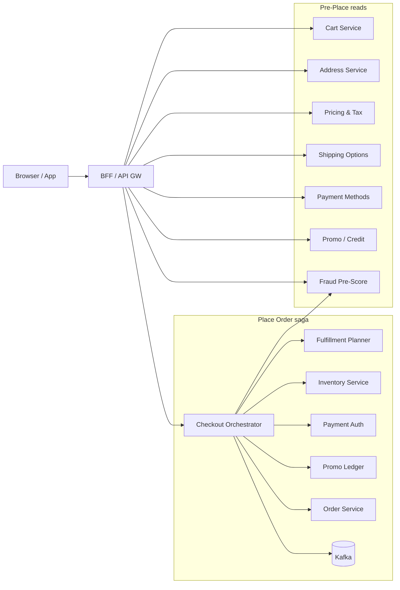
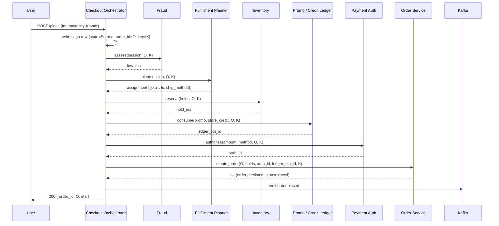

# Amazon Deep Dive — Checkout Saga

**Date:** 2026-04-30 | **Updated:** 2026-04-30
**Tags:** `system-design` `case-study` `amazon` `deep-dive` `saga` `checkout`

## Table of Contents

- [Summary](#summary)
- [Overview — Why "Place Order" Is Not a Single Transaction](#overview--why-place-order-is-not-a-single-transaction)
- [Multi-Service Checkout Flow](#multi-service-checkout-flow)
  - [The Wizard the User Sees](#the-wizard-the-user-sees)
  - [The Services the Server Talks To](#the-services-the-server-talks-to)
  - [Pre-Place vs Place](#pre-place-vs-place)
- [Saga Steps](#saga-steps)
  - [Forward Steps and Their Compensations](#forward-steps-and-their-compensations)
  - [Orchestration vs Choreography](#orchestration-vs-choreography)
  - [Durable Saga State](#durable-saga-state)
- [Payment Authorization vs Capture](#payment-authorization-vs-capture)
  - [Why Two Steps, Not One](#why-two-steps-not-one)
  - [Auth Lifetime and Re-Authorization](#auth-lifetime-and-re-authorization)
  - [Partial Captures for Split Shipments](#partial-captures-for-split-shipments)
- [Order ID Generation](#order-id-generation)
  - [Requirements on the ID](#requirements-on-the-id)
  - [Snowflake / KSUID / ULID](#snowflake--ksuid--ulid)
  - [Where the ID Is Issued](#where-the-id-is-issued)
- [Idempotency at Each Step](#idempotency-at-each-step)
  - [The Idempotency-Key Header Contract](#the-idempotency-key-header-contract)
  - [Per-Service Inbox Tables](#per-service-inbox-tables)
  - [Key Derivation and Lifetimes](#key-derivation-and-lifetimes)
- [Retry Semantics](#retry-semantics)
  - [Where Retries Live](#where-retries-live)
  - [Backoff, Jitter, and Budgets](#backoff-jitter-and-budgets)
  - [Non-Retryable vs Retryable Failures](#non-retryable-vs-retryable-failures)
- [Frontend UX During Long-Running Orchestration](#frontend-ux-during-long-running-orchestration)
  - [The "Place Order" Button Has To Lie a Little](#the-place-order-button-has-to-lie-a-little)
  - [Polling, SSE, and the Confirmation Page](#polling-sse-and-the-confirmation-page)
  - [Failure Messaging That Does Not Lie](#failure-messaging-that-does-not-lie)
- [Failure Recovery — Resume From Where It Broke](#failure-recovery--resume-from-where-it-broke)
  - [Crash During Forward Path](#crash-during-forward-path)
  - [Compensations That Themselves Fail](#compensations-that-themselves-fail)
  - [Operator Tooling and the Stuck-Saga Queue](#operator-tooling-and-the-stuck-saga-queue)
- [Anti-Patterns](#anti-patterns)
- [Related](#related)
- [References](#references)

## Summary

Amazon's checkout is the canonical multi-service saga: a single user click on **Place Order** kicks off a workflow that touches the cart, pricing, tax, fraud, fulfillment planning, inventory reservation, payment authorization, promo/credit consumption, and the order-of-record service — at minimum. Two-phase commit across these is impossible (different teams, different stores, different SLAs, external networks like card processors that have their own retry policies). The pattern is a **saga with explicit compensating transactions, durable orchestration state, idempotency keys threaded through every hop, and retry budgets at each layer**. Payment is **authorized** at placement and **captured** at shipment so that the reversible part (the order) is decoupled from the harder-to-reverse part (the charge). Order IDs are issued early — before any external system is contacted — so that retries always carry the same key. The frontend is designed to live with the fact that "Place Order" is not synchronous in the strict sense: it is a request to start a workflow whose terminal state arrives a few hundred milliseconds to several seconds later, and whose UI must communicate progress, success, or actionable failure without ever making the user wonder whether they were charged. Failure recovery is operator-grade: stuck sagas land in a queue, every step's idempotency makes resume safe, and every compensation is itself a saga step that can fail and retry.

## Overview — Why "Place Order" Is Not a Single Transaction

If checkout were one database, "Place Order" would be a simple `BEGIN; UPDATE inventory; INSERT order; CHARGE card; COMMIT;`. It is not. The participants live in different services owned by different teams and back onto different stores, several of which are external networks the platform does not control:

- **Cart service** (KV store, per-user, eventually consistent, Dynamo-shaped).
- **Pricing / promo / tax service** (rules engine + tax provider integration).
- **Fraud service** (ML scoring, sometimes third-party screening).
- **Fulfillment planner** (constraint solver picking FCs and carriers).
- **Inventory service** (sharded by `(sku, fc_id)`; conditional updates).
- **Payment service** (token vault + processor network — Visa, Mastercard, local rails).
- **Promo / store-credit service** (ledger).
- **Order service** (relational, ACID, sharded by `customer_id`).
- **Notification, analytics, downstream pipelines** (Kafka).

Reasons two-phase commit (2PC) cannot be used here are well known and worth being explicit about:

- 2PC's prepare phase requires every participant to **lock** resources until the coordinator finishes. With external participants like card processors that already have multi-second tail latencies, locks would propagate that pain everywhere.
- 2PC requires every participant to support a 2PC protocol with the same coordinator. Card networks do not. Period.
- A coordinator failure mid-prepare leaves resources locked indefinitely; recovery is its own protocol that few teams implement correctly.
- 2PC scales poorly with participant count. Checkout has 8–10 participants; coordinator latency dominates.

The accepted answer at planet scale is the **saga pattern** — a sequence of local transactions where each forward step has a defined compensating action, executed if a later step fails. The original 1987 Garcia-Molina / Salem paper named the pattern; Caitie McCaffrey's modern protocol talk re-popularized it; AWS now ships an entire workflow product (Step Functions) whose explicit goal is making sagas operable at scale. See [`../../../data-consistency/distributed-transactions.md`](../../../data-consistency/distributed-transactions.md) for the full sagas-vs-2PC argument.

## Multi-Service Checkout Flow

### The Wizard the User Sees

The classic Amazon checkout wizard is approximately:

```text
1. Cart review                  →  view cart, change qty, remove items, save for later
2. Address                      →  pick saved address or enter new (with validation)
3. Shipping                     →  pick a shipping option (standard / 2-day / Prime / same-day)
4. Payment                      →  pick a saved card, gift card, store credit, promo
5. Review                       →  see line items, totals, taxes, ETA, the big yellow button
6. Place order                  →  the saga
7. Confirmation                 →  order ID, ETA, link to track
```

Each step does a non-trivial amount of server work even though the user perceives it as form input. Steps 2–5 progressively narrow the **checkout context**: address determines shipping options and tax jurisdiction; shipping option determines ETA and last-mile cost; payment + promo determine totals.

### The Services the Server Talks To



### Pre-Place vs Place

A useful simplification: the checkout wizard divides cleanly into two phases.

**Pre-place (steps 1–5) is read-mostly.** It assembles a `CheckoutSession` — a server-side document keyed by `session_id` containing the chosen address, shipping option, payment method, promo applications, recomputed totals, fraud pre-score, and the cart snapshot. Each step writes a small change into the session and re-computes downstream fields. None of this is a saga: no inventory is held, no payment is moved. Pre-place is allowed to be eventually consistent and to retry freely.

**Place (step 6) is the saga.** When the user taps **Place Order**, the BFF posts:

```http
POST /v1/checkout/sessions/{session_id}/place
Idempotency-Key: 7e0c4a52-4f6f-4e5a-b6c7-9c1f1a2b3c4d
Body: { confirmed_totals_hash, confirmed_eta_hash }
```

The `confirmed_totals_hash` is the hash of the totals the user actually saw. If something has changed under them (a promo expired, a price drifted, an SKU went out of stock), the server returns 409 with the new state and the UI re-presents the review screen. This avoids the infamous "I tapped place at $99.99 and got charged $109.99" outcome.

## Saga Steps

### Forward Steps and Their Compensations



Every forward step has a defined inverse. If step _N_ fails, the orchestrator runs compensations for steps 1..N-1 in reverse order:

| # | Forward step                | Compensation                                   |
|---|-----------------------------|------------------------------------------------|
| 1 | Fraud assess                | _none required_ (read-only score)              |
| 2 | Fulfillment plan            | _none required_ (advisory)                     |
| 3 | Inventory reserve           | `release(hold_ids)`                            |
| 4 | Promo / store-credit consume| `restore(ledger_txn_id)`                       |
| 5 | Payment authorize           | `void(auth_id)` (or refund if already captured)|
| 6 | Order create                | `mark_failed(order_id)` + emit `order.failed`  |

A few subtleties:

- **"None required" steps still need to be idempotent on retry.** Re-running the planner with the same input must produce the same assignment, or the saga must accept that the assignment may have drifted and re-pin the holds. Implementations usually persist the assignment in the saga state on first success.
- **Compensations are themselves saga steps.** A `void(auth_id)` can fail (processor flaky). That is fine — the workflow retries with backoff. If it ultimately fails, it lands in the operator queue.
- **Order creation is the keystone.** Once `orders` is committed in state `placed`, the saga is "logically done" — even if the post-placement Kafka publish fails. The order row is the durable receipt that the user can rely on.

### Orchestration vs Choreography

There are two ways to wire a saga across services:

**Orchestration** — a central orchestrator (the Checkout service in this design) calls each participant in sequence, persists the saga state, and runs compensations on failure. Pros: easy to reason about, one place to inspect, simple retry/timeout policy. Cons: orchestrator is on the critical path; it must be HA; saga logic is centralized in one team.

**Choreography** — each service emits events; downstream services subscribe and react; compensations are emitted as separate events. Pros: looser coupling, no central bottleneck. Cons: the workflow is implicit (no single place describes "what is checkout"); harder to debug; correctness depends on every consumer behaving correctly.

Amazon engineers have publicly written about both — for example, the AWS Compute Blog post _Building a serverless distributed application using a saga pattern_ shows a Step Functions orchestration; older posts show event-driven choreography across SQS/SNS. **Checkout is large enough and the consequences of getting it wrong severe enough that orchestration is the right default.** Choreography fits better at the edges of the system (e.g., post-placement notifications, analytics fanout).

The user prompt asked specifically about Amazon's "Choreographed sagas" framing — the strongest publicly-attributable signal is in the AWS architecture content where choreographed sagas are described as a viable pattern alongside orchestrated ones; in practice, the checkout-critical-path inside Amazon retail is orchestration, and choreography appears at the post-placement event-fanout layer.

### Durable Saga State

The orchestrator persists the saga as a row (or workflow execution) so that a crash mid-flow can resume:

```sql
CREATE TABLE checkout_sagas (
  saga_id          UUID PRIMARY KEY,
  order_id         BIGINT,
  customer_id      BIGINT,
  idempotency_key  UUID UNIQUE,
  state            saga_state NOT NULL,    -- Started, FraudOK, Planned, Reserved, CreditConsumed, Authorized, Placed, Failing, Compensated, Failed, Done
  cursor           TEXT,                    -- which step is next
  context          JSONB,                   -- planner output, hold ids, auth id, ledger txn id
  last_error       JSONB,
  attempts         INT NOT NULL DEFAULT 0,
  created_at       TIMESTAMPTZ NOT NULL,
  updated_at       TIMESTAMPTZ NOT NULL
);
```

In production, this is usually backed by a workflow engine — **AWS Step Functions** if the team is on AWS-native primitives, **Temporal** if they want code-first workflows, **internal frameworks** in larger orgs. The key property is the same: workflow state is durable, transitions are checkpointed, and a worker that crashes is replaced by another worker that resumes from the last checkpoint. See [AWS Step Functions developer guide](https://docs.aws.amazon.com/step-functions/latest/dg/welcome.html) for the canonical state-machine workflow runtime.

The pattern is the same one used by [the Uber trip state machine](../../location-based/uber/trip-state-machine.md) — a saga is just a long-running state machine that crosses services.

## Payment Authorization vs Capture

### Why Two Steps, Not One

Charging a card has two distinct operations:

- **Authorization** — the issuing bank reserves funds against the customer's available credit/balance and returns an `auth_id`. No money has moved yet; the customer's bank may show "pending."
- **Capture** — the merchant tells the network to actually transfer the reserved funds. This is the irreversible movement.

Amazon authorizes at order placement and captures at shipment. The reasons are not stylistic — they are forced by the physics of fulfillment:

1. **An order may take days to ship.** Capturing at placement means the customer is charged for goods that may not exist physically yet. If the order is cancelled (by the customer, fraud, or a stockout), refunding a captured charge is messier than voiding an auth.
2. **Multi-line orders ship in multiple shipments.** Each shipment can capture a portion of the auth. If the catalog shipment splits across three FCs over five days, three captures occur against one auth.
3. **Inventory reconciliation may flip a line.** A line that looked available at placement can become unfillable at the warehouse (mispick, damage). Adjusting the captured amount _down_ before any money has moved is much cleaner than refunding _after_.
4. **Cancellation policy is simpler.** Pre-capture cancel = void = customer never sees a real charge. Post-capture cancel = refund = customer sees charge then refund (and a bank statement that reads weirdly).

### Auth Lifetime and Re-Authorization

Card authorizations are not eternal. Networks vary:

- Visa: typically 7–30 days, depending on MCC and program.
- Mastercard: 7–30 days similarly.
- Amex: longer in some programs, shorter in others.
- Local rails (UPI, iDEAL, Pix, etc.): often single-shot debits with different semantics.

If a shipment occurs after the auth window expires, the merchant must **re-authorize** — request a new auth for the remaining amount. Amazon handles this by:

- Tracking each auth's expiry in the payment service ledger.
- Triggering re-auth jobs ahead of expiry for orders that have not fully shipped.
- Failing gracefully to the customer if re-auth is declined (notify, give them a chance to update the payment method).

### Partial Captures for Split Shipments

A single order with three shipments produces three captures against one auth (or one auth per shipment if the implementation chooses that simpler path). The payment service tracks:

```sql
CREATE TABLE payments (
  payment_id     UUID PRIMARY KEY,
  order_id       BIGINT,
  method_token   TEXT,
  auth_id        TEXT,
  authorized_at  TIMESTAMPTZ,
  authorized_amt NUMERIC(12,2),
  expires_at     TIMESTAMPTZ,
  state          payment_state
);

CREATE TABLE captures (
  capture_id     UUID PRIMARY KEY,
  payment_id     UUID REFERENCES payments,
  shipment_id    BIGINT,
  amount         NUMERIC(12,2),
  captured_at    TIMESTAMPTZ,
  processor_ref  TEXT,
  idempo_key     UUID UNIQUE
);
```

The capture is keyed by `(payment_id, shipment_id)` for idempotency: a shipment-event redelivery does not double-capture.

For full payment internals, see [`../../e-commerce/payment/design-payment-system.md`](../payment/design-payment-system.md) (referenced in the parent doc; this deep-dive only covers the checkout-saga interface to payment).

## Order ID Generation

### Requirements on the ID

The order ID is referenced everywhere — receipts, support tickets, shipment labels, customer email, the `Idempotency-Key`'s downstream effects. The ID needs:

- **Globally unique** across regions, shards, datacenters, decades.
- **Generated without coordination** so the orchestrator does not have to round-trip a central allocator on the critical path.
- **Roughly time-ordered** so that order-by-time queries hit clustered storage efficiently.
- **Not secret, not enumerable.** A monotonic 64-bit sequence makes it trivial for a competitor to count Amazon's order rate. IDs should be opaque or include enough randomness that they are not an information leak.

### Snowflake / KSUID / ULID

Three common shapes:

- **Snowflake** (Twitter, 2010): 64-bit, structured as `[timestamp ms : 41][machine id : 10][sequence : 12]`. Time-ordered, coordination-free per machine, machine ID assigned at boot.
- **KSUID** (Segment): 27-character, 32-bit timestamp + 128-bit random suffix. Time-ordered, very long, unguessable.
- **ULID** (Universally Unique Lexicographically Sortable Identifier): 26-character base32, 48-bit ms timestamp + 80-bit random.

Amazon's order ID format publicly looks like `123-1234567-1234567` — three groups separated by hyphens, with what appears to be a customer-derived prefix and time-ordered components. The exact algorithm is internal; the format is the **interface** customers and call-center agents work with.

What matters architecturally:

- The ID is **assigned at saga start**, before any external call. This is so that retries — by the user, by the BFF, by any client of the checkout API — carry the same `order_id` in their derived idempotency keys downstream.
- The ID is **persisted to the saga row in the same transaction** as the saga creation. If the saga creator crashes after assigning the ID but before persisting it, the next retry generates a new ID — that is fine because the upstream `Idempotency-Key` will catch the duplicate at the orchestrator inbox.
- The ID is **opaque to participants**. The inventory service does not parse the order ID; it treats it as a token.

### Where the ID Is Issued

The orchestrator issues it. Issuing it on the BFF or in the client would mean trusting an untrusted boundary; issuing it in the order service would require a round-trip before any work begins. The orchestrator is the natural owner.

## Idempotency at Each Step

### The Idempotency-Key Header Contract

The Stripe-popularized contract: a client-generated UUID accompanies every state-changing call. The server stores `(endpoint, idempo_key) → response` for a retention window (24 h is conventional). A retried request with the same key returns the original response — the side effect happens at most once. This is the same machinery covered in [the Uber trip-state idempotency section](../../location-based/uber/trip-state-machine.md#idempotency--mobile-networks-lie); the implementation here is the same shape with the per-service inbox tables described below.

### Per-Service Inbox Tables

Every saga participant has an inbox table:

```sql
CREATE TABLE inv_inbox (
  endpoint     TEXT NOT NULL,
  idempo_key   UUID NOT NULL,
  request_hash BYTEA NOT NULL,
  response     JSONB NOT NULL,
  created_at   TIMESTAMPTZ NOT NULL,
  PRIMARY KEY (endpoint, idempo_key)
) PARTITION BY HASH (idempo_key);
```

On every request:

1. Look up the row.
2. If hit and request hash matches → return the stored response, no side effect.
3. If hit and hash differs → 409 (caller bug — same key, different intent).
4. If miss → run the side effect, persist response, return.

Crucially, **the side effect and the inbox write must be in the same transaction** (or together in a transactional outbox pattern if the side effect is an external call). Otherwise a crash between the side effect and the inbox write produces a duplicate on retry.

### Key Derivation and Lifetimes

A single user click on **Place Order** carries one user-level `Idempotency-Key`. The orchestrator derives per-step keys from it:

```text
user_key       = "U-7e0c4a52-..."
inv_step_key   = SHA256(user_key + "|inventory|reserve")
ledger_key     = SHA256(user_key + "|ledger|consume")
auth_step_key  = SHA256(user_key + "|payment|authorize")
order_step_key = SHA256(user_key + "|order|create")
```

This way:

- The user retrying carries the same `user_key` → orchestrator inbox catches it → no duplicate saga.
- The orchestrator retrying step _N_ carries the same `step_key` → that participant's inbox catches it → no duplicate side effect.
- A different saga (different user click) has a different `user_key` → all derived keys differ → no false match.

Lifetimes:

- Orchestrator inbox: 24 h (covers user-side retries).
- Participant inboxes: long enough to cover the orchestrator's retry budget plus margin (often 24 h + buffer).
- Payment service inbox: longer (days), because re-authorization and capture happen days later.

## Retry Semantics

### Where Retries Live

There are at least four retry layers:

1. **Client retry** — the browser/app retries on a network blip, carrying the same `Idempotency-Key`.
2. **BFF retry** — for transient failures contacting the orchestrator (5xx, timeout). Same key.
3. **Orchestrator → participant retry** — for transient participant failures. Per-step key.
4. **Participant internal retry** — e.g., the payment service retrying the card processor on a 503.

Each layer must be aware of the others' retries so retry budgets do not multiply uncontrollably. The standard discipline:

- **Per-call retry caps** (e.g., 3 attempts).
- **Total saga budget** (e.g., 30 s end-to-end at the orchestrator; if exceeded, abandon and run compensations).
- **Circuit breakers** in front of flaky downstreams (so a degraded payment processor does not consume the full budget and starve other orders).

### Backoff, Jitter, and Budgets

- Exponential backoff on transient failures: `100ms, 400ms, 1.6s, ...` capped.
- **Jitter** is mandatory: synchronized retries from a thundering-herd recovery wave can reproduce the failure that triggered them. Full jitter (`sleep = random(0, base * 2^attempt)`) is the safest default. See AWS's own ["Exponential Backoff and Jitter"](https://aws.amazon.com/blogs/architecture/exponential-backoff-and-jitter/) post.
- Retry budgets at the service mesh level: if more than X% of a downstream's calls are retries, stop retrying — the downstream is already in pain and you are making it worse.

### Non-Retryable vs Retryable Failures

Not all failures should be retried:

| Failure                                                | Retryable? |
|--------------------------------------------------------|------------|
| Network timeout, 503, 502, transient processor error   | Yes        |
| Inventory hard-reserve fails (item out of stock)       | No — terminal for the saga; compensate and fail order |
| Payment auth declined (insufficient funds, fraud rule) | No — return to user, let them change method |
| Fraud assessment returns `block`                       | No — compensate and fail order; do not redrive |
| Idempotency-Key conflict (409 hash mismatch)           | No — caller bug; do not redrive |
| Order service unique-constraint violation on key       | No — already created; treat as success |

The orchestrator must classify failures correctly. Misclassifying a "card declined" as retryable burns through the retry budget and frustrates the user. Misclassifying a "503" as terminal cancels orders unnecessarily.

## Frontend UX During Long-Running Orchestration

### The "Place Order" Button Has To Lie a Little

The user perceives **Place Order** as a button that says "you bought it" instantly. The reality is a workflow that takes 200 ms to several seconds. Good UX bridges this gap with:

- **Optimistic transition** to a "placing your order…" screen the moment the click happens. Disable the button (so it is not clicked again).
- **Skeleton confirmation** with the items, ETA placeholder, and a spinner where the order ID will land.
- **Genuine progress** if the saga is unusually slow ("Confirming your payment…" → "Reserving your items…" — _not_ fake progress that tries to look reassuring).

Critically, the click must produce a **stable state** the user can reload back to. The browser tab might be closed. The phone might lose signal. The user must be able to come back five minutes later and see what happened — not a phantom cart-with-no-order limbo.

### Polling, SSE, and the Confirmation Page

Two patterns work in production:

**Synchronous-with-timeout.** The BFF holds the HTTP request open until the saga completes (or times out at a budget like 5 s). For most checkouts this works because sagas typically complete in well under a second. Long tails fall back to polling.

**Optimistic-redirect-then-poll.** The BFF returns 202 Accepted immediately with `order_id` and `status_url`. The browser navigates to `/orders/{order_id}` and polls (or subscribes via SSE/WebSocket) for terminal status. This decouples the user-facing latency from the saga latency entirely.

Amazon retail uses a hybrid: synchronous for fast cases, with a fallback to a "your order is being placed" page that the user can refresh. The order ID is stable from the moment it is issued, so refreshes are safe.

### Failure Messaging That Does Not Lie

The cardinal sin of e-commerce UX is the ambiguous failure message: "Something went wrong. Please try again." The user does not know:

- Was I charged?
- Will I be charged on retry?
- Did the order get placed and just fail to confirm?
- Should I check my email?

Better messaging is rooted in **what the orchestrator actually knows**:

- **Pre-auth failure** (inventory, fraud): "Your order could not be placed. Your card was not charged. [Try again] [Choose different items]."
- **Payment declined**: "Your card was declined. No charge was made. [Update payment]."
- **Auth succeeded, order create failed** (rare, recovered by compensation): "We had trouble placing your order. Your authorization was reversed and you were not charged. [Try again]."
- **Successful**: "Order placed. Confirmation #123-XXXXXXX-XXXXXXX. Estimated delivery: …"

If the orchestrator genuinely does not know the terminal state (timeout against a participant whose response was lost), the page should say so honestly: "We're confirming your order. You'll receive an email within a few minutes. Do not retry from here." Then a backend reconciliation closes the loop.

## Failure Recovery — Resume From Where It Broke

### Crash During Forward Path

The saga state row is updated _after_ each step's success. If the orchestrator crashes between step 4 and step 5, a recovering worker:

1. Reads the saga row, sees `state = CreditConsumed`.
2. Knows step 5 (auth) is next.
3. Re-issues `authorize(...)` with the deterministic step key. The payment service's inbox makes this safe whether or not the prior attempt actually reached the processor.
4. Continues forward.

This is precisely why every step is idempotent: resume == retry from the failed step.

### Compensations That Themselves Fail

Compensations are saga steps too. They can fail. The orchestrator:

- Retries with backoff like any other step.
- Has a separate compensation budget (typically larger than forward — getting out is more important than getting in).
- Escalates to the operator queue if it ultimately cannot compensate.

A failed `void(auth_id)` is a real risk: a customer has a held auth that cannot be released programmatically. The fallback is: void it later out-of-band (the auth will expire on its own after the network's window), and proactively notify the customer with apology + contact path. The point is that the system never silently leaves the customer with a phantom hold that nobody is tracking.

### Operator Tooling and the Stuck-Saga Queue

A saga that exceeds its budget without reaching `Done` or `Compensated` lands in a `stuck_sagas` queue with full context (state, last error, attempts). Operator tooling lets on-call:

- Inspect the saga state.
- Manually retry the failing step (idempotently, of course).
- Manually compensate.
- Escalate to the participant team with a runbook.
- Notify the customer through a documented channel.

Observability is non-negotiable: every saga emits structured events at every transition; dashboards show distributions of saga duration, failure rate per step, compensation rate. A saga design without operator tooling is a saga design that has never seen a real outage.

## Anti-Patterns

- **Generating the order ID on the client.** Trivial spoofing, no uniqueness guarantee, and clients on stale builds collide with each other. Always server-side.
- **Capturing payment at order placement.** Decouples cancellation from charge sloppily; produces statement entries before goods move; violates almost every payment-network best practice.
- **Skipping idempotency keys "because retries are rare."** They are not rare; they are the modal case at scale. A network blip on Prime Day at 10 K orders/sec is hundreds of duplicate place attempts per second.
- **Per-step keys derived from `now()` or random values.** Then a retry from the orchestrator generates a different key, the participant's inbox does not catch it, and you have a double-charge. Derive per-step keys deterministically from the user-level key.
- **A single `try / catch` "rollback" function that handles all compensations.** Brittle and gets out of sync with new steps. Each step owns its compensation; the orchestrator runs them in reverse.
- **Storing saga state only in memory.** A pod restart loses every in-flight checkout. Always durable.
- **Long-running synchronous HTTP for the entire saga.** Wins for fast cases, fails badly for tail cases. Build the polling/SSE fallback path from day one.
- **Exposing internal saga state to the user UI.** "Step 3 of 7…" is meaningless to a shopper and leaks information when steps change shape. Map states to user-meaningful messages.
- **Blocking on Kafka publish in the order-placed transaction.** Order persistence and event emission must be decoupled via the outbox pattern; a degraded broker should not block placement.
- **Treating fraud as a hard block in line.** A high-latency third-party fraud check on the critical path is a single point of latency. Pre-score during the wizard; only escalate to a synchronous check for high-risk signals.
- **Designing happy-path forward steps and "we'll figure out compensations later."** Production is the place where un-designed compensations become silent corruption. Compensations are part of the original design.
- **One `idempotency_key` column on `orders` with no unique index.** Without the index, the constraint is not enforced and duplicates slip in under load. Always unique-indexed.
- **Letting saga state and order state drift.** Saga `Done` must imply order `placed`. Saga `Compensated` must imply order absent or `failed`. Diverging the two creates ghosts.
- **Reusing the same Idempotency-Key for unrelated calls** ("the SDK auto-injects one"). The key must scope to the user's _intent_ — one user-level key per logical place-order action, derived per-step downstream.
- **Not accounting for tax-service flakiness.** Tax APIs (especially for marketplaces with cross-jurisdiction rules) are often the slowest dependency. Cache aggressively, time-box, and have a fallback path that surfaces "we'll calculate exact tax at shipment" if available.
- **Confusing "saga ran" with "user got the right answer."** A saga that completes with a wrong total (price drift, promo expired) is a customer issue. The `confirmed_totals_hash` check is what guards this.

## Related

- [`../design-amazon-ecommerce.md`](../design-amazon-ecommerce.md) — parent case study; checkout saga is section 5 of the deep dives.
- [`./cart-service.md`](./cart-service.md) — the cart that produces the input to checkout; cart eventual-consistency model and merge semantics.
- [`../../../data-consistency/distributed-transactions.md`](../../../data-consistency/distributed-transactions.md) — the saga vs 2PC argument, outbox pattern, and compensating-action design at length.
- [`../../location-based/uber/trip-state-machine.md`](../../location-based/uber/trip-state-machine.md) — same saga + idempotency + state-machine machinery applied to a different domain (rides). Useful contrast to checkout: ride state lives _across_ a long human interaction; checkout state lives _within_ a short workflow.
- [`../payment/design-payment-system.md`](../payment/design-payment-system.md) — full payment internals: vault, processors, settlement, refunds, reconciliation.
- [`./design-flash-sale.md`](./design-flash-sale.md) — flash-sale checkout patterns: virtual waiting rooms, write-coalesced inventory, queued admission for hot SKUs.

## References

- Hector Garcia-Molina and Kenneth Salem, ["Sagas"](https://www.cs.cornell.edu/andru/cs711/2002fa/reading/sagas.pdf), ACM SIGMOD 1987 — the original paper that named and formalized the pattern.
- Caitie McCaffrey, ["Distributed Sagas: A Protocol for Coordinating Microservices"](https://www.youtube.com/watch?v=0UTOLRTwOX0) — modern saga protocol talk that re-popularized the pattern for service-oriented systems.
- Caitie McCaffrey, ["Applying the Saga Pattern" (talk notes / slides)](https://caitiem.com/2017/03/24/distributed-sagas-a-protocol-for-coordinating-microservices/) — written companion to the talk with the protocol details.
- Chris Richardson, ["Pattern: Saga"](https://microservices.io/patterns/data/saga.html) — canonical pattern reference; orchestration vs choreography treatment.
- Chris Richardson, ["Pattern: Transactional Outbox"](https://microservices.io/patterns/data/transactional-outbox.html) — the de facto reference for atomically committing DB state and publishing events.
- AWS Compute Blog, ["Building a serverless distributed application using a saga pattern"](https://aws.amazon.com/blogs/compute/building-a-serverless-distributed-application-using-a-saga-pattern/) — AWS-flavored Step Functions saga implementation, with both orchestration and compensation explicit.
- AWS Step Functions Developer Guide, ["What is AWS Step Functions?"](https://docs.aws.amazon.com/step-functions/latest/dg/welcome.html) — the canonical workflow runtime documentation; the state-machine model underlying many production sagas.
- AWS Step Functions Developer Guide, ["Error handling in Step Functions"](https://docs.aws.amazon.com/step-functions/latest/dg/concepts-error-handling.html) — `Retry` and `Catch` semantics that map directly to saga retry and compensation.
- AWS Architecture Blog, ["Exponential Backoff and Jitter"](https://aws.amazon.com/blogs/architecture/exponential-backoff-and-jitter/) — the canonical reference on retry strategies, including why jitter is mandatory.
- AWS Well-Architected Lens, ["Idempotency for Distributed Systems"](https://docs.aws.amazon.com/wellarchitected/latest/financial-services-industry-lens/idempotency.html) — payment- and order-shaped idempotency-key patterns.
- Stripe API Reference, ["Idempotent requests"](https://docs.stripe.com/api/idempotent_requests) — canonical implementation of idempotency keys on a financial API; the model checkout endpoints follow.
- Werner Vogels, ["Eventually Consistent"](https://www.allthingsdistributed.com/2008/12/eventually_consistent.html), Communications of the ACM — Amazon CTO's framing of consistency trade-offs that informs which checkout steps are strongly consistent and which are eventual.
- DeCandia et al., ["Dynamo: Amazon's Highly Available Key-value Store"](https://www.allthingsdistributed.com/files/amazon-dynamo-sosp2007.pdf), SOSP 2007 — foundational paper for cart and catalog storage; the always-writeable cart underpins the pre-place phase of checkout.
- Pat Helland, ["Life Beyond Distributed Transactions: An Apostate's Opinion"](https://www.ics.uci.edu/~cs223/papers/cidr07p15.pdf), CIDR 2007 — the entity-based eventual-consistency argument that underlies the saga-not-2PC default at planet scale.
- Martin Kleppmann, [_Designing Data-Intensive Applications_](https://dataintensive.net/), Chapter 9 (Consistency and Consensus) and Chapter 11 (Stream Processing) — textbook treatment of the storage and messaging primitives the saga is built on.
- Temporal documentation, ["Workflows"](https://docs.temporal.io/workflows) — code-first durable workflow engine, the most direct way to implement the saga as code in 2026; same lineage as Cadence.
