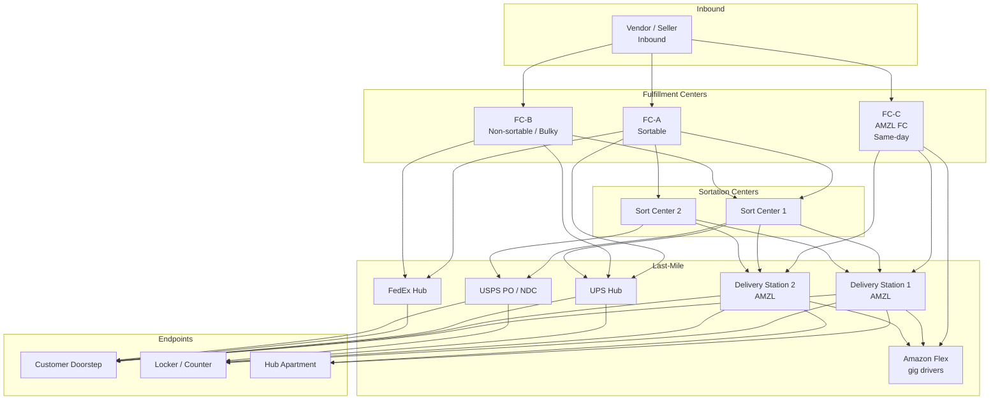

# Amazon Deep Dive — Fulfillment Graph

**Date:** 2026-04-30 | **Updated:** 2026-04-30
**Tags:** `system-design` `case-study` `amazon` `deep-dive` `fulfillment` `logistics`

## Table of Contents

- [Summary](#summary)
- [Overview — Fulfillment Is a Cost-Constrained Optimization, Not a Nearest-Warehouse Lookup](#overview--fulfillment-is-a-cost-constrained-optimization-not-a-nearest-warehouse-lookup)
- [Network Topology — FCs, Sortation Centers, Delivery Stations](#network-topology--fcs-sortation-centers-delivery-stations)
- [Routing Algorithm — Which FC Fulfills Which Order](#routing-algorithm--which-fc-fulfills-which-order)
- [SLA Tiers — Same-Day, One-Day, Standard, and the Promise Engine](#sla-tiers--same-day-one-day-standard-and-the-promise-engine)
- [Carrier Assignment — UPS, FedEx, USPS, DHL, Amazon Logistics](#carrier-assignment--ups-fedex-usps-dhl-amazon-logistics)
- [Zone Skip and Direct Injection — Bypassing Carrier Hubs](#zone-skip-and-direct-injection--bypassing-carrier-hubs)
- [Transshipment — Inter-FC Transfers and Network Rebalancing](#transshipment--inter-fc-transfers-and-network-rebalancing)
- [Amazon Flex — Gig-Worker Last-Mile Like Uber](#amazon-flex--gig-worker-last-mile-like-uber)
- [Package Consolidation — Multi-Item Order Bundling](#package-consolidation--multi-item-order-bundling)
- [Returns Logistics — RMA, Grading, and Disposition](#returns-logistics--rma-grading-and-disposition)
- [Reverse Logistics at Network Scale](#reverse-logistics-at-network-scale)
- [Pickup Hubs — Lockers, Counters, and Hub Apartments](#pickup-hubs--lockers-counters-and-hub-apartments)
- [Anti-Patterns](#anti-patterns)
- [Related](#related)
- [References](#references)

## Summary

Fulfillment is the part of Amazon's stack where every preceding decision — catalog placement, inventory positioning, checkout-time promise, payment authorization — either pays off or unravels. The catalog promised "Tomorrow by 9 PM." Inventory promised "in stock at the customer's regional FC." Checkout locked the promise. Fulfillment now has to make the physical world honor it: a carton must leave a building in the next few hours, ride a truck to a sortation center, get re-bagged for a delivery station, and reach a doorstep before the SLA clock runs out. None of this is a single decision. It is a continuously-running, multi-objective optimization across a graph of buildings, carriers, and last-mile networks, with hard real-world constraints (carrier cutoffs, truck capacity, weather, customs) and soft economic constraints (per-package cost, per-FC labor utilization, promised-date margin).

The architecture has two regimes that coexist: an **upstream sourcing decision** that picks which fulfillment center(s) ship which line items, and a **downstream carrier-and-last-mile decision** that picks how the package physically travels from the FC to the doorstep. Both are constrained optimization problems, both run inside tight latency budgets at order placement, and both can be re-evaluated up to the moment a label is generated and a carton enters a truck. The dispatcher sits inside a feedback loop with inventory (stock movements change the optimal source FC), with carriers (capacity and cutoff times shift hourly), and with the **Promise Engine** that committed a delivery date back at the product detail page.

Around this core sit a handful of mechanisms that any HLD-level discussion must address: **a graph of FCs, sortation centers, and delivery stations** with explicit handoff semantics; **routing algorithms** that solve the sourcing assignment problem; **SLA tier ladders** (Prime same-day, Prime one-day, standard, scheduled); **carrier assignment** across UPS, FedEx, USPS, DHL, and Amazon Logistics; **zone skip and direct injection** that bypass carrier sort hubs; **transshipment** that rebalances inventory across the network; **Amazon Flex** as a gig-driver last-mile analogous to Uber's driver pool; **consolidation** that bundles multi-item orders; **returns and reverse logistics** that flow inventory backward through the same graph; and **pickup hubs** (Lockers, Counters, Hub Apartments) that change the last-mile endpoint from a doorstep to a fixed location.

This is a companion to [`../design-amazon-ecommerce.md`](../design-amazon-ecommerce.md), expanded around the fulfillment stage itself.

## Overview — Fulfillment Is a Cost-Constrained Optimization, Not a Nearest-Warehouse Lookup

A naive design treats sourcing as: "Pick the closest FC that has the SKU in stock." The implementation is one inventory query and one carrier-rate lookup. This works at a few thousand orders per day and falls apart at Amazon-scale concurrency.

Three structural reasons it fails:

1. **Locally optimal is globally suboptimal.** A SKU near a single customer is one decision; the same SKU consumed from the same FC for ten thousand simultaneous orders saturates that FC's pick-pack capacity, blows past the carrier's manifest cutoff, and pushes downstream orders into the next-day-shipment bucket — even though a slightly farther FC with idle capacity would have shipped them on time.

2. **Cost has many components.** Pickup ETA is one term, but a real cost function blends per-FC pick-pack cost, line-haul cost (FC → carrier hub or sortation), last-mile cost (carrier-zone-rate vs Amazon Flex per-block rate), promise-margin penalty (how close to the SLA does this assignment land?), inventory-holding-cost externalities (consuming the last unit at FC-A means a more-expensive transshipment later), and split-shipment cost when one order has to source from multiple FCs.

3. **The environment is non-stationary inside the order lifecycle.** Inventory levels change as concurrent orders consume the same shelf. Carrier capacity tightens as the daily manifest fills. Weather closes a road. A driver calls in sick. A single-shot assignment is wrong by the time the picker grabs the item. Production systems run continuously: assign at order placement, re-assign at wave release, re-assign again if the optimal slot is no longer feasible.

The mental model is closer to **air-traffic control over a continental graph** than to nearest-neighbor: a controller continuously assigns packages to runways (FC outbound docks) and to flight paths (carrier networks) under a multi-objective cost function with hard safety constraints (hazmat segregation, customs paperwork) and soft fairness constraints (don't burn a single FC's labor budget while neighbors sit idle), knowing that any assignment is provisional until the truck pulls away from the dock.

Amazon publishes some of this framing publicly. The Amazon Operations blog ([https://www.aboutamazon.com/news/operations](https://www.aboutamazon.com/news/operations)) and the Amazon Science publications ([https://www.amazon.science/research-areas/operations-research-and-optimization](https://www.amazon.science/research-areas/operations-research-and-optimization)) describe network-design and inventory-placement work in their own terms. The academic literature on retail fulfillment optimization (Acimovic & Graves; Xu, Allgor, Graves) gives the math underneath.

## Network Topology — FCs, Sortation Centers, Delivery Stations

A fulfillment graph is a layered directed graph. Packages enter at FCs and exit at customer doorsteps; the layers in between exist to consolidate, sort, and re-fan-out volume.



**Fulfillment centers (FCs).** The buildings that physically store inventory and pick orders. Amazon's fleet is heterogeneous:

- **Sortable FCs.** Handle small-to-medium items. Most use Kiva-style mobile robots that bring shelves to stationary pickers (Amazon Robotics, since the 2012 Kiva Systems acquisition). Throughput is measured in units-per-hour-per-picker.
- **Non-sortable / bulky FCs.** Handle furniture, appliances, oversize items. Manual pick paths, larger aisles, freight-grade outbound docks.
- **AMZL FCs / same-day FCs.** Smaller buildings, urban-adjacent, hold a curated assortment of high-velocity SKUs. Designed to push directly to delivery stations rather than through a sortation center, supporting same-day and one-day SLAs.
- **Specialty FCs.** Apparel (with hanging-garment lines and on-demand customization), grocery (cold chain, Amazon Fresh), pharmacy (Amazon Pharmacy with regulated handling), 3P / FBA (multi-tenant from a software perspective).

Each FC has a denormalized profile in the planner: capacity (units/hour pick + pack throughput), cutoff times per outbound carrier (the hour by which a labeled package must be on the dock to make the day's manifest), service area (the set of postal codes / zones reachable within each SLA tier from this FC), eligibility filters (hazmat permits, freight-shipping certifications, customs export authority), and **virtual inventory pools** for FBA where a single SKU may belong to multiple sellers' accounts but live on one shelf.

**Sortation centers (SCs).** Trans-shipment buildings between FCs and delivery stations. A sortable FC ships outbound in tote-loads keyed by destination zone; a sort center receives mixed totes from multiple FCs, breaks them down, and reassembles them by delivery-station-bound or carrier-injection-point-bound bag/cart. The sort center is what makes **zone skip** economic: an FC packs a single trailer-load of "everything bound for the Phoenix metro" and dumps it at the Phoenix sort center, which fans out to the local delivery stations far cheaper than asking a national carrier to do the same job through their own hub.

**Delivery stations (DS).** The last hop before the customer. Packages arrive in bags or carts from sort centers (or directly from same-day FCs); routes are computed; drivers (Amazon Logistics employees, Delivery Service Partners, or Amazon Flex gig drivers) load their vehicles and depart. A DS's job is dense: a typical urban DS dispatches hundreds of routes per day, each with 100–250 stops, with cutoff times that align to the SLA promise.

**Carrier networks.** UPS, FedEx, USPS, DHL, regional carriers (OnTrac, LaserShip, etc.), international carriers — each is a separate graph with its own hubs, cutoff times, transit-day matrices, and surcharges. Amazon hands a package to one of these networks at a defined induction point and tracks the rest via carrier-supplied tracking events.

**Reverse-flow nodes.** Returns processing centers grade returned items (resellable, refurbishable, scrap) and decide whether to re-inject inventory at an FC, route to liquidation, or destroy. These are physically separate buildings or dedicated zones inside an FC.

The topology is **regional-cellular**: a metro is served by one or more FCs, one or more sort centers, one or more delivery stations, with cross-region links carrying overflow and long-distance traffic. The dispatcher's planner reasons about each region as a near-self-contained graph with explicit out-of-region edges.

## Routing Algorithm — Which FC Fulfills Which Order

The sourcing problem at Amazon scale is: given a multi-line order with a destination address and a promised delivery date, pick the (possibly multiple) FCs that ship which line items, the carriers that handle line-haul, and the last-mile network that completes delivery, such that total cost is minimized subject to inventory, capacity, cutoff, and SLA constraints.

This is a **mixed-integer optimization** problem. The classical formulation assigns binary decision variables `x_{i,j,f}` (line item `i` of order `j` is sourced from FC `f`) subject to:

- **Inventory feasibility.** Sum of `x_{i,j,f}` over all orders cannot exceed FC `f`'s available inventory of SKU.
- **SLA feasibility.** Promised date − (FC cutoff + carrier transit days) ≥ 0.
- **Hazmat / regulatory.** Some SKUs cannot be shipped from FCs without the right permits or via certain carriers.
- **Single-package-per-line.** A line cannot be split across FCs (you cannot ship half a TV).
- **Bundle constraints.** Some SKUs must ship together (gift wrap, bundled promotions).

Cost terms:

```text
total_cost = sum over (i,j,f) of:
    c_pick(f) * units(i,j)               # FC labor
  + c_pack(f, package_class) * 1         # packaging
  + c_linehaul(f, carrier, dest_zone)    # FC -> carrier hub or zone-skip dropoff
  + c_lastmile(carrier, dest_zone)       # carrier delivery rate
  + c_split_penalty * (#FCs used > 1)    # extra packages for multi-source
  + c_promise_margin(promise - eta)      # negative margin penalizes late risk
  + c_inventory_holding(f, sku)          # consuming hot stock has externality
  + c_capacity_overflow(f, hour)         # soft cap on per-FC outbound rate
```

**Why mixed-integer.** Several constraints are inherently combinatorial: you either ship from FC-A or you don't; you either split into two packages or you don't; you either use carrier UPS or USPS. Linear-relaxation gives a lower bound but not a feasible plan.

**Exact solvers don't fit the latency budget.** A real-time order-placement decision has tens of milliseconds. A commercial MILP solver (Gurobi, CPLEX) on the full network is too slow.

**Two-stage heuristic in production.**

1. **Pre-compute a sourcing skeleton offline.** Per (zone, SKU) tuples, the planner pre-computes the ranked list of FCs that can serve the zone within each SLA tier, with carrier and approximate cost. This becomes a lookup table — at order time, the planner reads the candidate set for each line.
2. **Solve the order-level assignment online with a greedy + repair heuristic.** Starting from "all lines from the top-ranked FC," greedy-shift lines to other FCs to fix infeasibilities (no inventory, capacity exceeded), then run local-search swaps to reduce split-shipment cost. Bound the search budget at low single-digit milliseconds per order.

Reference: Ping Xu, Zachary Allgor, and Stephen C. Graves, ["Benefits of Reevaluating Real-Time Order Fulfillment Decisions"](https://web.mit.edu/sgraves/www/papers/Xu-Allgor-Graves%20Final%20Apr%202008.pdf) (M&SOM 2009), is the canonical academic treatment of why re-evaluating fulfillment assignments after placement (rather than committing once at order time) reduces total cost. The intuition: hold the assignment loose until shortly before the FC has to commit a label; reassign if a better option opens.

A pseudocode sketch:

```python
def assign_order_to_fcs(order, candidate_fcs_by_line):
    # 1. Greedy: every line takes its top-ranked FC
    assignment = {}
    for line in order.lines:
        for fc in candidate_fcs_by_line[line]:
            if reserve_inventory(fc, line.sku, line.qty):
                assignment[line] = fc
                break
        else:
            return INFEASIBLE

    # 2. Repair: if multiple FCs used, try to consolidate
    for line, fc in list(assignment.items()):
        for alt_fc in candidate_fcs_by_line[line]:
            if alt_fc == fc: continue
            if alt_fc in assignment.values():
                # already used by another line - try moving this line there
                if try_move(line, fc, alt_fc):
                    break

    # 3. Cost check; fall back to greedy if repaired plan exceeds budget
    if cost(assignment) > cost(greedy_assignment): assignment = greedy_assignment
    return assignment
```

**Re-evaluation at wave release.** FCs run on **waves** — batches of orders released to the warehouse floor every 15–60 minutes for picking. At wave release, the planner re-evaluates pending unreleased orders: maybe FC-A's inventory dropped below what it has reserved (cycle-count discrepancy), maybe FC-B got a same-day inbound that opens new sourcing. Reassignment is cheap because no physical work has been done yet.

**Once-picked, hard-committed.** After the picker grabs the unit and scans it onto a tote, the assignment is locked. Backout requires unpacking and re-shelving, which is expensive enough that the planner explicitly avoids it. This is the same "soft-then-hard" pattern as the order-time inventory reservation: reservations are reversible, picks are not.

**Latency budget at order placement.** The sourcing decision sits inside the checkout saga's wall clock. A budget sketch:

| Stage | Budget | Notes |
|-------|--------|-------|
| Inventory soft-availability check | 30–80 ms | Per-FC reads, parallel fan-out |
| Candidate FC retrieval per line | 20–50 ms | Pre-computed ranked list lookup |
| Carrier rate + transit-day lookup | 30–100 ms | Cached carrier-rate matrix |
| Greedy assignment | 5–20 ms | First-fit per line |
| Repair pass (consolidation) | 10–30 ms | Bounded local search |
| Promise validation | 10–30 ms | Date math against cutoffs |
| Hard inventory reservation | 50–150 ms | Conditional writes per FC row |

End-to-end fulfillment-planning budget is in the 200–400 ms range at p99. Slipping this stretches the user's "Place Order" perceived latency. Beyond budget, the planner falls back to a coarser plan and revisits at wave release.

For a deeper treatment of the inventory-and-reservation interaction, see [`./inventory-consistency.md`](./inventory-consistency.md).

## SLA Tiers — Same-Day, One-Day, Standard, and the Promise Engine

The SLA ladder is the primary product surface for fulfillment. The customer sees "Free Same-Day," "Get it tomorrow," "FREE delivery Friday, May 7," and the planner has to make each of those promises true. Each tier is a different optimization regime.

| Tier | Promise window | Sourcing pattern | Carrier lane |
|------|----------------|------------------|--------------|
| Prime Same-Day / 2-hour | Hours from order | Local AMZL FC with curated assortment | Amazon Logistics (Flex or DSP) |
| Prime One-Day | Next calendar day | Local FC + nearby same-day FC overflow | AMZL primary, UPS/FedEx fallback |
| Prime Two-Day | 2 days | Regional FC, no need for same-day FCs | Mix of AMZL, UPS, FedEx |
| Standard | 3–5 business days | Lowest-cost FC anywhere reachable | USPS heavy, AMZL where dense |
| Scheduled / No-Rush | Customer-chosen date | Cheapest assignment that meets date | USPS heavy, multi-day batched |
| International / Cross-border | 5–14 days | Cross-border FC routing, customs broker | DHL, regional partners |

**The Promise Engine.** Every product detail page surfaces a delivery date for the signed-in customer ("Get it Friday, May 7 if you order in the next 2 hours"). This date is not set by the planner at order time — it is computed by the **Promise Engine** at page render, based on:

- Customer's address (zone).
- SKU's per-FC inventory state.
- Each candidate FC's current cutoff schedule.
- Carrier transit-day matrix from each candidate FC to the destination zone.
- A confidence buffer (the Promise Engine commits a date that has high probability of being met, not the absolute median).

The Promise Engine emits a date; the cart locks the date when the user clicks "Add"; checkout re-validates and may downgrade the date if conditions changed; placement commits the date and writes it onto the order. **The fulfillment planner now has a hard SLA constraint to plan against.** A planner decision that misses the promise is a P0: it both fails the customer and burns the Prime brand.

**Cutoff times.** A "Get it tomorrow" promise depends on hitting an outbound trailer that leaves the FC by, say, 4 PM. If the order is placed at 3:55 PM and the picker can't reach the bin in time, the promise breaks. The Promise Engine accounts for cutoff slippage probabilistically — that's why "Get it tomorrow" is shown until ~3 PM in many regions and rolls over to "Get it Saturday" thereafter.

**Same-day mechanics.** Same-day delivery requires a curated SKU set physically present in a same-day-capable FC near the customer, with multiple route departures per day. The catalog enforces this: the "same-day eligible" facet on the search page and detail page is computed against the same-day FC's current inventory, not the global inventory.

**Sub-same-day (2-hour) tiers.** Amazon Fresh and Whole Foods grocery, Amazon Pharmacy in some markets, and Prime Now-style services use a separate building stack (small dark stores in urban zones) and a separate dispatch system that looks more like food-delivery than parcel-delivery. The mechanics share concepts with [`../../location-based/design-doordash.md`](../../location-based/design-doordash.md) — courier batching, real-time route updating, customer-aware ETAs.

**SLA breach handling.** If the planner determines mid-flight that a promise will not be met (carrier exception, weather, FC outage), the order is flagged. Customer notification, automatic credit ($5–$10 promotional credit for Prime customers), and an apology email are part of the runbook. The planner also feeds the breach back into the Promise Engine's confidence buffer: if the same FC-zone-tier triple is breaching repeatedly, the Promise Engine widens the buffer, which shows later dates on the page.

**Tier interaction with payment capture.** The auth-then-capture pattern in [`../design-amazon-ecommerce.md`](../design-amazon-ecommerce.md) section 6 plays into SLA tiers. A multi-FC same-day order may have one shipment leave within an hour and a second wait for tomorrow's wave; capture-per-shipment matches the customer's bank statement to physical events. A Prime same-day order that captures the full amount at order placement and then fails to ship one line is a refund mess. The fulfillment graph and the payment ledger are tightly co-designed.

## Carrier Assignment — UPS, FedEx, USPS, DHL, Amazon Logistics

Once the sourcing plan picks an FC, the planner picks a carrier (or a sequence of carriers in a multi-leg path). The decision blends:

- **Service level matching.** The carrier's service tier (UPS Ground, USPS Priority, FedEx Home Delivery, AMZL ground) must meet the SLA. A 5-day Ground service cannot satisfy a 1-day promise.
- **Rate.** Carriers charge by weight × dimensional weight × zone × service level, with surcharges (residential delivery, fuel, peak-season). Amazon negotiates volume contracts; rates per package are far below the published rate cards.
- **Capacity.** Each carrier has a daily cap on packages it will accept from a given induction point. Exceeding the cap pushes packages to the next day.
- **Reliability per lane.** A carrier may be stronger in one zone than another (UPS dominates dense urban, USPS reaches every rural mailbox). The planner has lane-level on-time-rate stats.
- **Customer signal.** Some customers explicitly opt out of certain carriers (rare, but supported via address-book preferences).

**Amazon Logistics (AMZL) as an in-house carrier.** Since the mid-2010s, Amazon has built a parallel last-mile network via three driver pools:

- **Delivery Service Partners (DSPs).** Independent businesses that lease branded vans and employ drivers, contracted to Amazon. The largest pool by volume.
- **Amazon Flex.** Gig-economy drivers in personal vehicles, scheduled in 2–4-hour blocks, paid per block. Discussed in detail below.
- **AMZL employees.** A smaller direct-employed pool in some markets.

AMZL covers an increasing share of last-mile, particularly in dense and suburban zones. Carrier choice for the planner often becomes "AMZL if available, fall back to UPS/FedEx/USPS." Amazon's own publicly-disclosed numbers ([https://www.aboutamazon.com/news/operations/amazon-delivery-network](https://www.aboutamazon.com/news/operations/amazon-delivery-network)) put AMZL well past half of Amazon's US package volume in recent years.

**Carrier fallback.** A planner's primary carrier choice may fail at label generation (carrier API timeout, rate-limit, capacity exhaustion). The planner has a ranked fallback list; the next carrier is tried, and the cost difference is logged for analytics. Persistent fallbacks indicate primary-carrier capacity issues that require renegotiation or more aggressive rebalancing across carriers.

**International carriers.** DHL handles a large share of cross-border packages. Some lanes use a hybrid: AMZL or USPS to a US export gateway, DHL or local-country posts for the international segment, last-mile via local partners (Royal Mail in UK, Deutsche Post in DE, Japan Post in JP). Customs paperwork and HS-code classification are part of the label-generation pipeline; a missing HS code is a hard fail.

**Tracking event ingestion.** Every carrier emits tracking events ("Picked up," "In transit," "Out for delivery," "Delivered," "Exception"). Amazon ingests these into a unified tracking timeline that hydrates the customer's order page and the internal alerting system. Per-carrier event taxonomies are mapped to a common schema; carrier-specific peculiarities (USPS's many in-transit scans, DHL's customs-clearance events) are normalized.

## Zone Skip and Direct Injection — Bypassing Carrier Hubs

Carrier rate cards are zone-based: a package from origin zone 1 to destination zone 8 costs more than zone 1 to zone 4. The carrier's own network handles the zone-spanning line-haul through their hub-and-spoke system. **Zone skip** is the trick of inducting Amazon's own line-haul to bypass the carrier's hub.

**Mechanism.**

1. FC packs trailer-loads of packages destined for distant zones (say, all packages bound for the Pacific Northwest from a Texas FC).
2. Amazon's own trucking fleet (or contracted line-haul carriers) drives the trailer to a destination-zone induction point — either an Amazon sort center, an Amazon delivery station, or a carrier's local hub close to the customers.
3. The carrier picks up the load at the destination zone and delivers locally. From the carrier's perspective, this is now a "zone 1" or "zone 2" delivery, not a "zone 8."

**Why it pays.** The savings on carrier rates (zone 8 → zone 1) often exceed the cost of running Amazon's own trailer. At Amazon's volumes, a trailer can be filled almost entirely with destination-zone-bound parcels, which makes the line-haul economical.

**Direct injection.** A close cousin: instead of dropping at the carrier's local hub, drop directly at the carrier's last-mile sortation point — a USPS Network Distribution Center (NDC) or Sectional Center Facility (SCF). For USPS this is sometimes called "Parcel Select" or "destination entry." The package skips multiple USPS internal sort hops. Last-mile is handled by USPS, but Amazon has bypassed most of USPS's line-haul.

**Operational requirements.** The FC must accumulate enough volume per destination zone per outbound trailer to make the move economical. This is a packaging-and-sorting decision at the FC: rather than sort at the carrier hub, sort at the source. Sortable FCs and sort centers handle this with sophisticated tilt-tray and cross-belt sorters that can fan out totes to dozens of destination chutes.

**Sort centers as zone-skip enablers.** A sort center exists precisely to make zone-skip economical: multiple FCs feed it, it consolidates and re-sorts to destination zones, and outbound trailers run direct to destination-zone induction points. Without sort centers, only very large FCs could fill destination-zone trailers; with them, mid-size FCs participate in zone-skip economics by consolidating with neighbors.

**Trade-offs.** Zone skip adds a handling hop (FC outbound → trailer → induction point), which costs labor and damage risk, against the savings on carrier rates. The math has to be re-run as carrier contracts change and as Amazon's own fleet costs change. The planner does not make zone-skip decisions per-package — it operates at the trailer / lane level, and individual package routing follows the lane decision.

**Software shape of the lane decision.** A nightly batch job evaluates each (origin FC, destination zone, carrier service-level) lane against the previous day's volumes and the published rate cards. Lanes where Amazon-line-haul + destination-induction beats carrier line-haul by more than a margin are flipped to zone-skip status; lanes that no longer pencil out are flipped back. Per-package routing at the FC reads a flat lookup ("for destination zone Z and carrier C, induct at point P") and packs trailers accordingly. The complexity is hidden from the order-time planner, which simply sees a different rate for the chosen carrier when zone-skip is active.

References: AWS Operations and supply-chain practitioner write-ups on [Parcel Select / destination entry](https://about.usps.com/strategic-planning/cs10/CSPO_10_037.htm) describe the USPS-side mechanics; the operations-research literature on hub-and-spoke vs zone-skip (see Acimovic & Graves, 2017 below) covers the trade-offs.

## Transshipment — Inter-FC Transfers and Network Rebalancing

The static placement of inventory across FCs is set by a long-running optimization (the Inventory Placement system, often referred to in Amazon Operations writing as IPS or by specific generations of the system). Even with good initial placement, transient demand shocks (a viral product, a regional weather event, a Prime Day flash) leave some FCs over-stocked and others under-stocked. **Transshipment** moves inventory between FCs to rebalance.

**Two flavors.**

- **Scheduled rebalancing.** Long-horizon (weeks-out) decisions to move pallets of slower-moving inventory to FCs closer to predicted demand. Rides on internal line-haul; cheap per-unit but slow.
- **Hot transshipment.** Short-horizon (hours-to-days) reaction to a stockout risk. A SKU is about to stock out at FC-East and is over-stocked at FC-Central; a partial pallet ships east on the next available trailer. Premium speed, more expensive per-unit.

**Why transshipment instead of just sourcing from the over-stocked FC?** Two reasons:

1. **SLA**. If the customer is in the FC-East service zone and the over-stocked FC-Central can't ship within the SLA, sourcing from FC-Central means missing the promise. Transshipping to FC-East first means future orders can be served on time.
2. **Per-unit cost over the long run**. Sourcing every order from FC-Central means paying long-haul shipping per package; transshipping a pallet once and serving subsequent orders short-haul amortizes the move across many orders.

**Coordination with the order planner.** The order planner sees inventory state including in-flight transshipments (with arrival ETAs). A transshipment that lands tomorrow opens a sourcing option for orders placed today with a 2-day promise. The Promise Engine likewise looks ahead at scheduled inbound when computing dates.

**Returns as transshipment.** Returns are a stochastic but large transshipment flow: customer-returned units flow back into the network, are graded at a returns-processing center, and re-injected as available inventory possibly at a different FC than they originally shipped from. The re-injection point is itself a placement decision.

**Why this matters for the order-time planner.** Transshipment shifts the answer to "is this SKU available at FC-X?" over time. The planner cannot rely on a static inventory map; it queries near-real-time inventory plus a pipeline of pending arrivals.

**Decision math for hot transshipment.** A hot-transshipment trigger fires when a watcher detects projected stockout risk for a (SKU, FC) pair within a horizon (e.g., 48 hours). The trigger evaluates:

```text
benefit = expected_orders_servable_via_short_haul - expected_orders_servable_via_long_haul
        + sla_attainment_lift * sla_breach_cost
cost    = transshipment_unit_cost * units_moved
        + opportunity_cost_at_source_FC
fire if benefit > cost
```

Inputs are noisy — `expected_orders` comes from a forecast that itself has error bars. The system tolerates this because the action is reversible (over-shipping FC-East just means consuming the inventory next week). The asymmetric cost of stockout (lost order, lost trust) vs over-stock (slightly higher holding cost) biases toward firing.

For a deep dive on the inventory-state side, see [`./inventory-consistency.md`](./inventory-consistency.md).

## Amazon Flex — Gig-Worker Last-Mile Like Uber

Amazon Flex is the gig-economy slice of Amazon's last-mile. Drivers use personal vehicles, sign up for **delivery blocks** (typically 2–4 hours), pick up packages from a delivery station (or, for Amazon Fresh, a same-day FC), and deliver routes assigned by Amazon's dispatcher.

The architectural shape is strikingly similar to ride-hailing dispatch — see the comparison companion [`../../location-based/uber/matching-and-dispatch.md`](../../location-based/uber/matching-and-dispatch.md):

| Concept | Uber | Amazon Flex |
|---------|------|-------------|
| Driver pool | Independent contractors with cars | Independent contractors with cars |
| Work unit | One ride request | One block of multiple deliveries |
| Matching primitive | Bipartite (rider ↔ driver) | Block assignment (driver ↔ route) |
| Real-time | Per-request seconds-scale | Block-scale (assigned hours ahead) |
| Dispatch decision | Cost-min over open requests | Cost-min over routes vs offered blocks |
| Acceptance loop | Driver accepts/declines per ride | Driver accepts/declines per block |

**Block offering.** A delivery station forecasts its package volume for the next several blocks and the routes that will need driving. Block offers are pushed to the Flex app — drivers see "$72 for a 4-hour block at DXX5 starting at 14:00." Drivers in the area accept blocks first-come-first-served. Surge pricing-like adjustments raise block pay when demand outstrips supply.

**Route assignment.** When a driver checks in for their block, the dispatcher assigns a route — a sequence of stops optimized for the driver's vehicle capacity, the package geography, and the SLA tier of each package. Vehicle Routing Problem with Time Windows (VRPTW) territory. Solvers run nightly for the bulk of routes and re-run during the day for adjustments.

**Last-mile optimization.** Within a route, the driver app surfaces stop-by-stop directions. The optimization must respect:

- **Time windows.** A 1-day Prime package has tighter delivery-window constraints than a standard package.
- **Geographic clustering.** Avoid back-and-forth across a neighborhood.
- **Drop-off type.** Doorstep, locker, signature-required, ID-verified for restricted items.
- **Vehicle capacity.** A sedan can't carry the same volume as an SUV; route generation accounts for the driver's declared vehicle.

**Acceptance dynamics.** Like Uber, a Flex driver who declines too many blocks loses standing in offer ranking. Driver acceptance probability is a learned signal. Unlike Uber, Flex offers happen ahead of time, not in seconds; the latency budget for the matching itself is much looser. The hard latency lives in route generation at block-start time.

**Comparison with employed driver pools.** AMZL's DSP-employed and direct-employed drivers run similar route flows but are assigned to fixed shifts; the driver-side acceptance loop doesn't apply. Flex fills surge volume and serves zones where DSP scale is uneconomical.

**Operational trade-offs.** Flex gives flexible capacity (drivers ramp up for Prime Day without long-term commitment) at higher per-package cost than DSP routes and lower SLA-attainment (gig drivers are less reliable than salaried staff). Mix of Flex vs DSP is a tunable per region per time-of-day.

**Block pricing dynamics.** Like Uber's surge pricing, Flex block pay adjusts to demand-supply imbalance. A Saturday morning with high package volume and few accepted blocks pushes block pay higher; an oversupplied weekday with empty trucks pushes it lower. A pricing service holds a model of acceptance probability vs offered pay, vs current package backlog at the DS, vs forecast demand for the rest of the day. The engineering shape mirrors [Uber's surge engineering](https://www.uber.com/blog/engineering-surge-pricing/) — a regional pricing engine with tight feedback loops to acceptance signals, anchored by floors and ceilings to prevent runaway pricing.

**Driver-side feedback loop.** Flex drivers carry standing scores: on-time check-in, completion rate, customer-issue rate. Higher-standing drivers see offers slightly earlier than lower-standing drivers in the same area, which produces a soft incentive without explicitly penalizing low standing. Regulatory pressure here is similar to ride-hailing: explicit penalties on independent contractors face legal scrutiny, so the system uses ranking and access rather than fines.

For deeper VRPTW patterns and route-planning algorithms, see the operations-research literature on [Vehicle Routing Problem variants](https://en.wikipedia.org/wiki/Vehicle_routing_problem) and the food-delivery side at [`../../location-based/design-doordash.md`](../../location-based/design-doordash.md).

## Package Consolidation — Multi-Item Order Bundling

When a customer orders multiple items, consolidation logic decides:

1. **Single shipment vs split.** Can all items ship in one box from one FC, or must they split across FCs?
2. **Within an FC, single carton vs multiple cartons.** A box that is too full risks damage; too empty wastes shipping cost (dim weight).
3. **Across FCs, hold-and-consolidate vs ship-as-ready.** Can FC-A's items wait for FC-B's items to arrive at a sort center, ship together, and save the customer one delivery?

**Why consolidation matters.**

- **Customer experience.** One delivery is friendlier than three. It also reduces porch-piracy risk and reduces the customer's mental load tracking multiple packages.
- **Cost.** A larger box at higher weight is often cheaper per item than three small boxes. Carrier surcharges (residential delivery, fuel) apply per-package; consolidation amortizes them.
- **Environmental.** Fewer trucks on the road, fewer carbon emissions per item. Amazon publicly reports on packaging-reduction and consolidation initiatives.

**Trade-offs against SLA.** Holding FC-A's items for FC-B's items risks missing the promise on FC-A's items. The planner only consolidates if the consolidated path still meets the SLA. The customer-facing surface "Group my items" or "Amazon Day delivery" is a UI lever where the customer explicitly opts to relax SLA in exchange for consolidation.

**Box-pack optimization.** Within an FC, after the picker has assembled the units, a packing algorithm picks the box size from a discrete set (roughly two-dozen standard box sizes plus padded mailers and frustration-free packaging). The optimization minimizes void volume (less filler, less dim-weight surcharge) subject to fragility constraints (don't pack a glass cup against a heavy book).

**Consolidation across days — Amazon Day.** A customer can pick a weekly delivery day; Amazon batches the customer's eligible orders into one delivery on that day. Underneath, the planner extends the SLA artificially to the customer's chosen day, then uses the slack to consolidate aggressively.

**Multi-shipment notification.** When consolidation isn't possible (different sourcing FCs with different cutoff windows), the customer sees "shipped in 2 packages." The order page tracks each package separately. UX must clearly communicate "this is normal, not an error."

## Returns Logistics — RMA, Grading, and Disposition

A return moves a unit backward through the graph: from the customer, through a return drop-off (UPS Store, Whole Foods, Kohl's, Amazon Locker, Amazon Hub Counter, USPS), to a returns-processing center, where the unit is graded and disposed of.

**RMA generation.** The customer initiates a return on the orders page. The system:

1. Looks up the order line, eligibility (return window, condition, restocking-fee category).
2. Picks a return method based on the customer's address and the SKU's category — small electronics often go via QR code at Whole Foods, large items via UPS pickup, hazardous items via specialized handlers.
3. Generates a return shipping label and an RMA reference number.
4. Issues a refund either immediately (trusted customer, low fraud risk) or after receipt at the processing center.

**Drop-off network.** Amazon's third-party drop-off footprint (UPS Store, Whole Foods, Staples, Kohl's, Amazon Hub Counter) lets the customer walk in without printing a label — a QR code on the phone is scanned at the drop-off, the package is bagged or boxed in-store and inducted into the return network. The customer experience is much smoother than older mail-back flows.

**Returns-processing center.** Returned units arrive in mixed loads and are graded:

- **Resellable as new.** Unopened, in original packaging, undamaged. Re-injected into FC inventory.
- **Resellable as used / refurbished.** Open-box items, refurbished electronics. Re-injected with a different listing (Amazon Renewed) or sold via Amazon Warehouse.
- **Not resellable.** Damaged, missing parts, expired. Liquidated to third-party buyers, donated, or destroyed (rare; Amazon has publicly committed to reducing destroyed returns).

**Grading speed matters.** A unit sitting in a graded-pending bin is unavailable inventory. Faster grading shortens the cash conversion cycle and improves availability of high-velocity items. Returns-processing centers have throughput SLAs measured in units-per-day.

**Refund timing.** For trusted customers (long history, low return-abuse score), refunds issue at label generation or drop-off. For higher-risk customers or higher-value items, refund waits for receipt and grading. This is a fraud-vs-experience trade-off; the fraud signal lives in a dedicated returns-fraud model.

**Returnless refunds.** For low-value items where return shipping cost exceeds item value, Amazon (and many retailers) issues a refund without requiring return — "keep the item." The decision is automated based on item value, return-fraud risk, and category rules.

**Returns SLA targets.** From customer drop-off to refund posting, a typical target is < 5 business days for trusted customers, with a stretch goal of same-day refund on QR-code drop-offs at trusted partners. The internal pipeline targets are tighter: drop-off to receipt at processing center < 48 hours; receipt to grading-decision < 24 hours; grading to disposition action (re-injection or scrap) < 24 hours. Slippage at any stage cascades into customer-visible refund delays.

## Reverse Logistics at Network Scale

Returns are the visible tip; the broader reverse-logistics flow includes:

- **Customer returns.** Per the section above.
- **FBA seller-returned inventory.** Items returned by customers under FBA, where the seller can choose to have the unit dispositioned (re-listed, returned to seller, destroyed).
- **Damaged-in-warehouse units.** Pickers, packers, and conveyance occasionally damage items. The unit is pulled, recorded against shrinkage, and dispositioned.
- **Vendor returns / chargebacks.** Defective vendor lots are pulled and shipped back to the vendor; the cost is charged back via vendor accounting.
- **Recalls.** Regulatory recalls (FDA, CPSC) require pulling specific lot numbers from inventory and from in-flight orders; reverse-logistics handles destruction or vendor return.

**Inventory accounting for reverse flow.** A returned unit transitions through several inventory states: `customer_held → in_return_transit → received_at_returns_center → grading → graded_resellable / graded_scrap → re_injected_at_fc / liquidated / destroyed`. Each state has accounting implications (asset value, shrinkage write-off) and impacts the available-inventory count visible to the order planner.

**Returns abuse.** Some customers exploit liberal return policies (wardrobing, fraudulent damage claims, return of substituted items). Returns-fraud models score each return; high-risk returns face stricter inspection or are rejected. Persistent abusers are flagged and may face account-level restrictions.

**Sustainability.** Public pressure has pushed Amazon and the broader industry to reduce destruction of returned items. Donation partners, "Amazon Second Chance" / refurbishment, and FBA Liquidations programs route units to alternative dispositions. The dispositioning algorithm balances cost (destroying is cheap; donating has logistics overhead), revenue (reselling generates revenue but ties up inventory), and environmental KPIs.

## Pickup Hubs — Lockers, Counters, and Hub Apartments

Doorstep delivery has failure modes — porch piracy, signature-required items with no one home, apartment buildings without secure mailrooms. Pickup hubs change the last-mile endpoint from a doorstep to a fixed location.

**Amazon Locker.** Self-service kiosks in retail locations (Whole Foods, gas stations, apartment lobbies). The customer picks "Ship to Locker" at checkout, the package is delivered to the locker, the customer gets a pickup code via email, and they retrieve the package within a deadline (typically 3 days, then it's returned).

- **Operational.** A locker has a finite slot count; the dispatch system tracks slot availability per locker. A delivery to a full locker is rejected at the door — the planner must avoid this with locker-capacity awareness.
- **SKU eligibility.** Items larger than the largest available slot can't ship to a locker. Hazardous, perishable, or restricted items (alcohol, certain electronics) are excluded.
- **Customer experience.** Locker pickup is reliable but adds a customer-side step. Adoption is regional — high in dense urban Europe, lower in suburban US.

**Amazon Hub Counter.** Staffed pickup points (independent retailers, Whole Foods customer service, Stein Mart, Rite Aid). The package is delivered to the counter; the customer presents a barcode and ID; the counter clerk hands over the package.

- **Capacity is human-bounded.** A counter has a back-of-house storage area, but it's smaller than a locker bank in package count.
- **Expanded reach.** Counters extend the pickup network into areas where lockers aren't economical (rural, smaller cities).

**Hub Apartments.** A different model: an apartment building's package room or lobby has a dedicated locker bank or staffed counter funded partially or fully by Amazon. Delivery drivers drop multiple packages at the building's hub instead of distributing to individual unit doors. This is a major operational win — one stop replaces dozens of stops.

**Pickup-point planning.** The Promise Engine and the planner know which pickup points are eligible for the customer's address (within reasonable walking/driving distance). The customer chooses at checkout. The planner then routes to the pickup point's induction window rather than to the doorstep.

**Failure modes.**

- **Customer doesn't pick up.** After the deadline, the package is returned to Amazon and refunded. The locker / counter is freed.
- **Locker malfunction.** The customer can't open their slot (rare but real). Customer service unlocks remotely or generates a re-delivery to doorstep.
- **Wrong locker assigned.** A capacity-aware planner mistake assigns to a full locker; the driver detects this at induction and either tries an adjacent locker or routes the package back for re-delivery.

**Privacy and access.** Locker pickup codes are single-use, expire, and are tied to the order. Counter pickup requires ID verification for high-value or age-restricted items.

**Locker analytics feedback.** Locker utilization data informs placement: lockers with consistently > 90% utilization get capacity expanded; lockers under 30% utilization are candidates for relocation. The feedback loop runs on weeks-to-months timescales. Hub Apartment expansion follows a similar data-driven loop, but the per-building business case is computed in collaboration with property managers.

For broader patterns on physical-handoff systems and capacity management, the food-delivery analog of "lockers" is **ghost kitchens / dark stores** — see [`../../location-based/design-doordash.md`](../../location-based/design-doordash.md) for the kitchen-side capacity reasoning.

## Anti-Patterns

- **"Nearest FC wins" sourcing.** Locally optimal, globally bad. Saturates the closest FC, blows past carrier cutoffs, pushes downstream orders late. Always at least the option of cost-aware multi-FC sourcing on the table for high-volume regions.
- **Treating fulfillment as a stateless lookup.** The planner needs the open inventory state, the open promise commitments, the carrier-capacity state, and the FC-capacity state. A "stateless service" that re-derives all of this per order will collapse under load.
- **Single global planner instance.** One planner for the whole world is a single point of failure and a single point of contention. Region-shard the planner alongside the FC topology.
- **Promise Engine and planner using different inventory views.** A page that promises "tomorrow" and a planner that can't deliver tomorrow because it sees different inventory is the worst customer-facing failure. Single source of inventory truth, with the Promise Engine using a conservative buffered view.
- **Ignoring carrier capacity.** Over-committing to a single carrier and watching them bounce packages at peak is a fixable mistake. Carrier-capacity tracking is part of the planner's state.
- **No cutoff-time awareness in the planner.** A planner that doesn't know "FC-A's UPS Ground cutoff is 4 PM" will assign cutoff-violating orders all day and only discover the problem at label generation. Cutoff times are first-class planner inputs.
- **No re-evaluation between order-time and pick-time.** Wave-release re-evaluation is cheap (no physical work done yet) and recovers from inventory drift, capacity shifts, and carrier issues. Skipping it means committing too early.
- **Capturing payment at order placement instead of shipment.** A multi-FC, multi-shipment order that bills the full amount up front, then partially refunds when one shipment is cancelled, is a customer-experience disaster. Auth-at-placement, capture-per-shipment is the standard.
- **Hard-coding carrier choice on the order.** Carrier capacity, pricing, and outages are dynamic; the planner must be late-bound and re-runnable up to label generation.
- **Treating returns as an afterthought.** Returns flows touch payments, inventory, fraud, accounting, and tax. Designing them post-launch creates years of cleanup work. Reverse-logistics is part of the fulfillment graph from day one.
- **No graceful degradation under planner outage.** If the optimizer is unhealthy, fall back to nearest-FC + default carrier with tighter SLA buffers. Surface the degradation; don't hide it.
- **Synchronous coupling between order placement and label generation.** Label generation depends on carrier APIs that have their own outages and rate limits. Decouple via a queue: order placement commits the assignment; label generation runs async with retries; the customer gets tracking when the label exists.
- **Locker assignment without capacity awareness.** Routing to a full locker is a wasted delivery and a customer escalation. Locker capacity is real-time inventory.
- **Same-SLA-tier promise for every customer in every zone.** Rural zones have longer carrier transit; promising "1-day" without checking the lane breaks reliably. The Promise Engine has to be zone-aware and SLA-tier-aware down to the postal-code level.
- **No transshipment closed loop.** Transshipment that runs as a once-a-week batch without feedback into the order planner produces stockouts the planner can't see coming. Transshipment ETAs feed live into available-inventory.
- **Returns refund at receipt for everyone.** Trusted-customer pre-receipt refund is a measurable customer-satisfaction win. Universal at-receipt refund slows refunds for the 99% of legitimate returns to protect against the 1% of fraud — wrong trade-off.
- **One carrier for all volumes.** A monoculture exposes the network to one carrier's outage. Carrier diversity is a resilience strategy.
- **Ignoring driver decline behavior in Flex.** Flex blocks have a decline rate; drivers who have declined three offers in a row may be filtering for higher-pay blocks. The block-pricing model has to react.

## Related

- [`./inventory-consistency.md`](./inventory-consistency.md) — the inventory-state side of the fulfillment graph: per-FC counts, reservations, and reconciliation against physical reality.
- [`../design-amazon-ecommerce.md`](../design-amazon-ecommerce.md) — parent case study; fulfillment is one section of the overall e-commerce design.
- [`../../location-based/design-doordash.md`](../../location-based/design-doordash.md) — three-sided variant (customer, courier, restaurant) where matching is dispatch-shaped and short-window; useful comparison for same-day grocery and Prime Now-style flows.
- [`../../location-based/uber/matching-and-dispatch.md`](../../location-based/uber/matching-and-dispatch.md) — driver-dispatch optimization for ride-hailing; many of the same primitives appear in Amazon Flex block assignment and DSP route planning.
- [`../../scalability/sharding-strategies.md`](../../scalability/sharding-strategies.md) — geographic sharding patterns relevant to per-region planner state.

## References

- Amazon Operations Newsroom — [About Amazon: Operations](https://www.aboutamazon.com/news/operations) — first-party narrative on FC, sortation, delivery-station network, AMZL growth, and same-day expansion.
- Amazon Operations — [Inside Amazon's Delivery Network](https://www.aboutamazon.com/news/operations/amazon-delivery-network) — describes the AMZL stack (DSP, Flex, fulfillment partners) and last-mile volumes.
- Amazon Science — [Operations Research and Optimization research area](https://www.amazon.science/research-areas/operations-research-and-optimization) — Amazon's own OR publications on inventory placement, fulfillment optimization, and supply-chain problems.
- Acimovic, J., and Graves, S. C. ["Making Better Fulfillment Decisions on the Fly in an Online Retail Environment."](https://web.mit.edu/sgraves/www/papers/Acimovic_Graves_MSOM_2015.pdf) Manufacturing & Service Operations Management 17, no. 1 (2015): 34–51.
- Xu, P., Allgor, R., and Graves, S. C. ["Benefits of Reevaluating Real-Time Order Fulfillment Decisions."](https://web.mit.edu/sgraves/www/papers/Xu-Allgor-Graves%20Final%20Apr%202008.pdf) Manufacturing & Service Operations Management 11, no. 2 (2009): 340–355 — canonical paper on re-optimizing fulfillment assignments after order placement.
- Acimovic, J., and Farias, V. ["The Fulfillment-Optimization Problem."](https://pubsonline.informs.org/doi/10.1287/educ.2019.0199) INFORMS TutORials in Operations Research, 2019.
- Amazon Flex Help — [Driver Information](https://flex.amazon.com/) — first-party product surface describing the gig-driver block model.
- Amazon Hub Lockers — [Customer-facing locker network](https://www.amazon.com/b?node=6442600011) and Hub Counter / Hub Apartment programs.
- USPS — [Parcel Select / Destination Entry](https://about.usps.com/strategic-planning/cs10/CSPO_10_037.htm) — the USPS-side mechanics of zone-skip and direct-injection.
- Wikipedia — [Vehicle Routing Problem](https://en.wikipedia.org/wiki/Vehicle_routing_problem) — last-mile route-planning algorithmic background.
- Toth, P., and Vigo, D., eds. *Vehicle Routing: Problems, Methods, and Applications*, 2nd ed. SIAM, 2014 — definitive textbook on VRP variants used in last-mile dispatch.
- Ahuja, R. K., Magnanti, T. L., and Orlin, J. B. *Network Flows: Theory, Algorithms, and Applications*. Prentice Hall, 1993 — foundational reference for the min-cost-flow framing of network sourcing decisions.
- Amazon Sustainability — [Packaging and Returns](https://sustainability.aboutamazon.com/) — public commitments on returns dispositioning and packaging reduction.
- Werner Vogels — [All Things Distributed](https://www.allthingsdistributed.com/) — Amazon CTO's blog with periodic posts on operations-side architecture and reliability.
