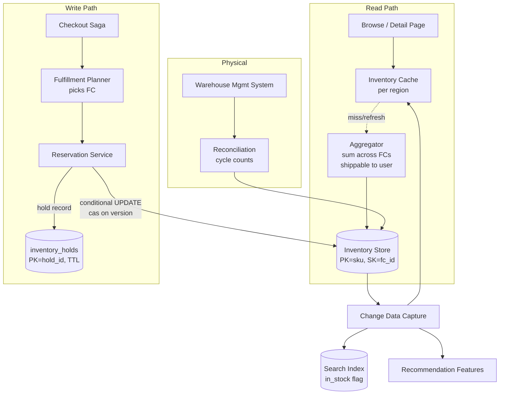
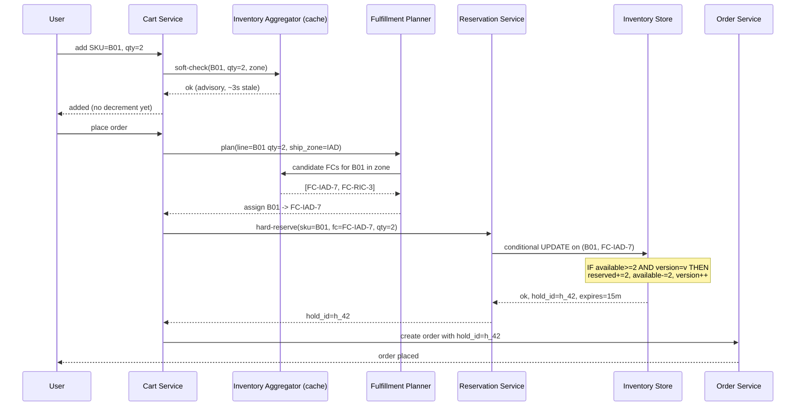
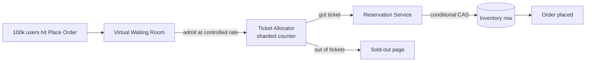

# Amazon Deep Dive — Inventory Consistency

**Date:** 2026-04-30 | **Updated:** 2026-04-30
**Tags:** `system-design` `case-study` `amazon` `deep-dive` `inventory` `consistency`

## Table of Contents

- [Summary](#summary)
- [Overview](#overview)
- [Per-Warehouse Stock Counts](#per-warehouse-stock-counts)
- [Reservation Flow — Cart to Checkout to Order](#reservation-flow--cart-to-checkout-to-order)
- [Over-Sell Protection](#over-sell-protection)
- [FBA vs Seller-Fulfilled](#fba-vs-seller-fulfilled)
- [Multi-Warehouse Consolidation for One Order](#multi-warehouse-consolidation-for-one-order)
- [Sortation Algorithm](#sortation-algorithm)
- [Safety Stock](#safety-stock)
- [Reservation TTL](#reservation-ttl)
- [Reconciliation Jobs](#reconciliation-jobs)
- [Physical-Logical Drift](#physical-logical-drift)
- [Flash Sale Concurrency](#flash-sale-concurrency)
- [Anti-Patterns](#anti-patterns)
- [Related](#related)
- [References](#references)

## Summary

Inventory looks like a counter. It is not a counter. It is a **distributed reservation ledger** sharded across hundreds of fulfillment centers (FCs), updated concurrently by outbound order flow and inbound receiving flow, advised against by a long-tail of cached browse reads, and constantly drifting from physical reality due to mispicks, damage, theft, and miscounts. The single hardest correctness invariant in Amazon-scale e-commerce is **"do not promise stock you do not have"**, and the single hardest availability invariant is **"keep the buy button responsive even when one FC's row is hot"**. This document expands on section 3 of [`../design-amazon-ecommerce.md`](../design-amazon-ecommerce.md): why per-FC sharding is the only viable layout, how the two-phase reservation pattern (soft check on browse, hard reserve on checkout) survives Prime Day, why DynamoDB conditional writes are the atomic primitive of choice, how reconciliation jobs close the gap between system-of-record and warehouse-management-system (WMS), and what flash sales do that breaks every assumption above.

The architectural through-line: **shard the ledger by `(sku, fc_id)` so each FC's row is independently writable; reserve with conditional writes (compare-and-swap); release with TTL; reconcile against the WMS on a schedule; and never let browse reads block on the authoritative inventory store**. Quorum reads with `W+R>N` overlap (see [`../../../data-consistency/quorum-and-tunable-consistency.md`](../../../data-consistency/quorum-and-tunable-consistency.md)) get you read-your-writes within the FC's home region; cross-FC and cross-region invariants ride compensating sagas, not 2PC.

## Overview

The inventory subsystem must answer four questions at very different latencies and consistency levels:

| Question | Caller | Latency target | Consistency required |
|---|---|---|---|
| "Is this SKU in stock?" | Browse / search / detail page | < 20 ms P99 | Stale by seconds is fine |
| "Reserve N units for this order line" | Checkout saga | < 100 ms P99 | Linearizable on `(sku, fc_id)` |
| "Mark these N units as shipped" | Outbound dock at FC | < 500 ms | Linearizable; idempotent |
| "What's the true on-hand count?" | Reconciliation, finance, replenishment | minutes | Physical reality eventually wins |

A single global counter would collapse under contention (Prime Day puts 1 K+ orders/sec on hot SKUs); a single relational `UPDATE inventory SET available = available - 1 WHERE sku = ? AND available >= 1` against one row creates the canonical hot-row write contention. The standard answer in the Dynamo lineage is to **shard the ledger by `(sku, fc_id)`** so each FC's stock for a SKU is an independent row, then assign orders to FCs *first* (during fulfillment planning) and reserve *second* (against the assigned FC's row only).



## Per-Warehouse Stock Counts

The base table is intentionally small per row, with two counters and a version:

```text
inventory  (PK = sku, SK = fc_id)
{
  sku:        "B01ABC...",
  fc_id:      "FC-IAD-7",
  on_hand:    int,                  -- physically present in the FC
  reserved:   int,                  -- held against in-flight orders
  available:  on_hand - reserved,   -- materialized for fast reads
  safety_stock: int,                -- buffer kept off the wire
  version:    int,                  -- monotonic; used for CAS
  updated_at: timestamp
}
```

`available` is materialized rather than computed because every read on the browse path needs it. Storing it as a column lets the read API project a single field without the row-level subtraction at query time, and lets the cache layer key directly on the value the caller cares about. The trade is that every write must update three columns (`on_hand`, `reserved`, `available`) inside the same conditional update so the invariant `available = on_hand - reserved` cannot be violated mid-write.

**Why `(sku, fc_id)` and not `(fc_id, sku)`.** Inventory is read in two patterns: "for this SKU, where can I get it?" (browse and the fulfillment planner's sourcing pass) and "for this FC, what does it have?" (replenishment, picking, audits). DynamoDB's primary index supports the first pattern natively; a global secondary index (GSI) on `fc_id` supports the second. The reverse layout would force a scan for every browse read, which is unaffordable at 100 K+ QPS.

**Cardinality.** ~600 M SKUs × ~200 FCs is ~120 B logical rows. In practice the table is sparse — most SKUs are stocked at a small subset of FCs (5–30 typical) — so the on-disk footprint is closer to 5–10 B rows, ~12 TB hot, plus history.

**Aggregated views.** Browse needs "available *anywhere shippable to this customer*", not per-FC. The aggregator service maintains a per-region or per-shipping-zone rollup keyed by `(sku, zone_id)`, refreshed from CDC events on the per-FC table. The rollup is the only thing the browse cache reads. This is a deliberate denormalization: an exact rollup at the moment of reservation would require a fan-out across all FC rows, which is too slow for the read path. The rollup may be stale by seconds, and that is fine for an advisory "in stock" badge.

**Region locality.** An FC's row physically lives in the AWS region nearest the FC. A US-East FC's row lives in `us-east-1`; reservations against it are local writes. Cross-region reads are advisory only — never authoritative for reservation decisions. This mirrors the Dynamo paper's per-key home replica concept.

## Reservation Flow — Cart to Checkout to Order

The reservation flow is **two-phase by design**: the soft phase (browse, cart) reads cached, eventually consistent state and never decrements anything; the hard phase (checkout) takes a conditional write against the authoritative row.



**Phase 1 — Soft check (cart add).** The cart service reads the aggregated `available` from the rollup cache. If `available < requested_qty`, it returns "limited stock" UX hint but typically still allows the add (Amazon's pattern is to let users add and resolve at checkout, since the cart is a wishlist for many users). No decrement, no hold, no row write.

**Phase 2 — Hard reserve (checkout placement).** The checkout saga (see section 5 of the parent doc) calls the fulfillment planner, which picks one or more FCs. For each (line, fc) pair, the reservation service issues a conditional update:

```pseudocode
def reserve(sku, fc_id, qty, order_id, ttl=15*60):
    while True:
        row = inv.get(sku, fc_id)             # current available, version
        if row.available < qty:
            return REJECT_INSUFFICIENT_STOCK

        ok = inv.update(
            key=(sku, fc_id),
            condition="version = :v AND available >= :q",
            update={
                "reserved":  row.reserved  + qty,
                "available": row.available - qty,
                "version":   row.version   + 1,
            },
            values={":v": row.version, ":q": qty}
        )
        if ok:
            hold = holds.put(
                hold_id=uuid(),
                sku=sku, fc_id=fc_id, qty=qty,
                order_id=order_id,
                state="held",
                expires_at=now()+ttl,
            )
            return OK(hold.id)
        # ConditionalCheckFailedException -> retry with backoff
```

The conditional write is a [DynamoDB conditional `UpdateItem`](https://docs.aws.amazon.com/amazondynamodb/latest/developerguide/Expressions.ConditionExpressions.html) (or the equivalent in Cassandra LWT, Postgres `UPDATE ... WHERE version = ?`, etc.). It is a **compare-and-swap on the version**, plus a **predicate on `available >= qty`**, in a single atomic operation against one row. There is no two-phase commit, no distributed lock, no leader election — just a CAS on a row whose key is sharded so contention is bounded by the order rate against that one FC's stock for that one SKU.

**Phase 3 — Consume (shipment).** When the package physically ships, an outbound event from the WMS triggers a second conditional update:

```pseudocode
def consume(hold_id):
    h = holds.get(hold_id)
    if h.state != "held": return ALREADY_PROCESSED
    inv.update(
        key=(h.sku, h.fc_id),
        condition="version = :v",
        update={
            "on_hand":  row.on_hand  - h.qty,    # actually leaves the building
            "reserved": row.reserved - h.qty,    # no longer held
            "version":  row.version  + 1,
        },
    )
    holds.update(hold_id, state="consumed")
```

Note that `available` does not change during consume — it was already decremented at reserve time. Consume only moves quantity from `reserved` to gone, and from `on_hand` to gone, while leaving `available` (the buyable count) untouched. This is the algebraic invariant that makes the model work.

**Phase 4 — Release (failure or cancellation).** If checkout fails (payment declined, fraud check rejects, user cancels) or the hold expires:

```pseudocode
def release(hold_id):
    h = holds.get(hold_id)
    if h.state != "held": return ALREADY_PROCESSED
    inv.update(
        key=(h.sku, h.fc_id),
        update={
            "reserved":  row.reserved  - h.qty,
            "available": row.available + h.qty,
            "version":   row.version   + 1,
        },
    )
    holds.update(hold_id, state="released")
```

## Over-Sell Protection

Overselling — promising stock you don't have — is a P0 because it cascades into Prime SLA violations, customer trust damage, and manual remediation costs (split shipments from another FC, free upgrades, cancellations with apology credits). The atomic primitive that prevents it is the **conditional decrement**:

```text
IF available >= qty AND version = expected
THEN
    reserved  := reserved + qty
    available := available - qty
    version   := version + 1
ELSE
    fail
```

Both predicates are required. The `available >= qty` clause prevents going negative; the `version = expected` clause prevents lost-update anomalies when two concurrent reservers both read `available=5` and both try to decrement by 3 — only one CAS succeeds, the other retries against the new version and now sees `available=2`, fails the `>= 3` predicate, and is rejected.

**Why a single-row CAS is enough.** Because we sharded by `(sku, fc_id)`, the predicate is local to one row in one partition. There is no need for distributed consensus — DynamoDB and Cassandra both implement single-row conditional writes via Paxos within the partition. The contention is bounded by the order rate against that one FC's stock for that one SKU, which even on Prime Day rarely exceeds a few hundred QPS per row (the planner spreads load across FCs).

**What the row-level CAS does NOT prevent.**

- **Cross-FC overselling on split shipments.** If a 2-line order assigns line A to FC-1 and line B to FC-2, and FC-2's reservation fails, the saga must compensate by releasing the FC-1 hold. Failure to compensate is overselling against the *order*, not the inventory rows.
- **Reservation-vs-physical drift.** The CAS guarantees the *logical* count never goes negative. The physical count can still be wrong (mispicks, theft, damage). Reconciliation jobs catch this; see [Physical-Logical Drift](#physical-logical-drift).
- **Stale reads on the browse path.** The cached aggregate may say "in stock" when the FC's row has gone to zero. The browse path is intentionally advisory; the truth comes out at checkout. This is the right trade — coupling browse to authoritative inventory would kill read throughput for no real benefit.

**Idempotency on hard-reserve.** The reservation request carries an idempotency key tied to the checkout session and order line. A retry due to network failure must not double-decrement. The reservation service stores `(idempotency_key, hold_id)` in a sidecar table and returns the existing hold on duplicate keys. Same pattern as [`./design-amazon-ecommerce.md`](../design-amazon-ecommerce.md) section 5 for the order itself.

## FBA vs Seller-Fulfilled

Amazon's marketplace has two fulfillment models, and the inventory model differs sharply between them.

**FBA (Fulfilled by Amazon).** The seller ships inventory to Amazon FCs ahead of time. From the inventory service's perspective, the seller's stock is indistinguishable from Amazon's own — same `(sku, fc_id)` rows, same reservation flow, same conditional writes. The seller_id is a column on the offer record, not on the inventory row. The buy-box service picks which seller's offer wins for a given customer, and the inventory it points at is whichever FC has FBA stock for that ASIN, regardless of which seller deposited it.

There's an important detail here: many sellers can FBA-stock the *same* ASIN. Amazon may commingle inventory (treating units as fungible) or not (separating per seller, called "stickered" inventory). Commingled inventory simplifies reservation (one row per `(asin, fc_id)`) but raises counterfeit risk; stickered inventory keys by `(asin, seller_id, fc_id)` and isolates seller liability at the cost of more rows and more complex sourcing. Both layouts use the same conditional-write reservation pattern; they differ only in primary-key composition.

**Seller-fulfilled (also called Merchant Fulfilled Network, MFN).** The seller stores and ships from their own warehouse. Amazon never holds the inventory and cannot directly observe its physical state. The seller publishes a *declared* available count via an inventory API, which is the only source of truth Amazon has. This declared count flows into a parallel inventory table:

```text
mfn_inventory  (PK = sku, SK = seller_id)
{
  declared_available: int,
  declared_at:        timestamp,
  expected_handling_time: hours,
  lead_time_days:     int,
  ...
}
```

Reservation against an MFN offer is *advisory* — Amazon decrements its mirror, but the seller's actual warehouse system is the real source of truth and could refuse to ship. Sellers commit to fulfillment SLAs, and breach of declared inventory (frequent stock-out cancellations) triggers seller-performance penalties.

| Aspect | FBA | Seller-fulfilled |
|---|---|---|
| Inventory location | Amazon FC | Seller warehouse |
| Reservation authority | Amazon's conditional write | Seller's own system; Amazon's record is a mirror |
| Latency on reservation | 50–100 ms (single-row CAS) | Mirror update is fast; cancellation risk is real |
| Sourcing in fulfillment graph | Standard FC pool | Routed direct to seller |
| SLA enforcement | Amazon owns | Seller owns; performance metrics |
| Returns | RMA → Amazon receiving → re-shelf | RMA → seller → seller decision |

The implication for this design: the inventory service is bimodal. The FBA path is the high-stakes consistency story documented above; the seller-fulfilled path is a federated mirror that trades correctness for reach (Amazon would not have catalog parity with millions of sellers without it).

## Multi-Warehouse Consolidation for One Order

A 5-line order rarely sits in one FC. The fulfillment planner may decide:

- **Single FC.** All 5 lines from FC-IAD-7 — cheapest if available, no split-shipment overhead.
- **Split shipment.** Lines 1–3 from FC-IAD-7, lines 4–5 from FC-RIC-3 — two boxes, two shipments, two tracking numbers.
- **Cross-dock consolidation.** Lines from multiple FCs converge at a sortation center, get repacked into a single outbound box, ship as one shipment.

The reservation flow handles all three the same way: **one hold record per (line, fc) pair**. A 5-line order with 2 FCs generates 5 hold records (some pointing to FC-IAD-7, others to FC-RIC-3), and the order's `inventory_hold_id` column on `order_items` carries the per-line reference.

```mermaid
sequenceDiagram
    participant CHK as Checkout Saga
    participant PLAN as Planner
    participant RES as Reservation
    participant FC1 as FC-IAD-7 row
    participant FC2 as FC-RIC-3 row

    CHK->>PLAN: plan(5 lines, address)
    PLAN-->>CHK: L1,L2,L3 -> FC-IAD-7; L4,L5 -> FC-RIC-3
    CHK->>RES: reserve L1 @ FC-IAD-7
    RES->>FC1: CAS
    FC1-->>RES: ok hold_h1
    CHK->>RES: reserve L2 @ FC-IAD-7
    RES->>FC1: CAS
    FC1-->>RES: ok hold_h2
    CHK->>RES: reserve L3 @ FC-IAD-7
    RES->>FC1: CAS
    FC1-->>RES: ok hold_h3
    CHK->>RES: reserve L4 @ FC-RIC-3
    RES->>FC2: CAS
    FC2-->>RES: ok hold_h4
    CHK->>RES: reserve L5 @ FC-RIC-3
    RES->>FC2: CAS
    FC2-->>RES: FAIL insufficient stock
    Note over CHK: compensate: release h1..h4
    CHK->>RES: release h1, h2, h3, h4
    CHK->>PLAN: replan with alternative FCs
```

**Compensation, not 2PC.** If any (line, fc) reservation fails partway through, the saga releases the holds already taken and either retries with a different plan (e.g., move L5 to FC-LAX-2) or fails the order. There is no global lock, no distributed transaction. The cost of a partial-success-then-release is small (the held quantity was unavailable for a few hundred ms), and the saga is durably checkpointed so a coordinator crash mid-reservation does not strand holds.

**Re-planning.** The planner can be invoked multiple times within one checkout saga. A common case: first plan picks the cheapest combination; if reservation fails on one line, the second plan excludes that FC for that SKU and re-solves. After N attempts (typically 2–3), the saga gives up and either splits across more FCs or surfaces an "out of stock" error.

**Split-shipment delivery promise.** The planner must produce a delivery promise that respects the *latest* of all shipments. A 2-shipment order arriving Tuesday and Thursday is promised "Thursday by end-of-day" — never "Tuesday" because the customer would believe the order is complete. The promise is locked at order placement and audited against actual shipping events.

## Sortation Algorithm

The fulfillment planner is the constraint solver that turns "5 lines + ship address + SLA" into "(line → FC) tuples + carrier choice". Its inputs:

- For each line: SKU, quantity, hazmat class, weight/dimensions.
- Customer: ship address, Prime status, delivery promise locked at PDP/cart.
- Per-FC: current `available` for each candidate SKU, handling cost, distance to customer, carrier cutoff times.
- Per-carrier: lane prices, capacity, SLA.

The objective: minimize total cost (FC handling + line-haul + last-mile + SLA-miss penalty), subject to:

1. Every line's quantity must be reservable in some FC.
2. Combined plan meets the locked delivery promise.
3. Hazmat lines route through hazmat-certified FCs and ground carriers.
4. Per-carrier per-FC daily capacity is not exceeded.
5. Cross-border lines pick FCs with customs-clearance documentation.

This is a mixed-integer program. At Amazon's QPS, an exact MIP solve per order is infeasible; the planner uses heuristics:

```pseudocode
def plan(order):
    candidates = []
    for line in order.lines:
        # rank FCs by closeness * availability * inv pressure
        fcs = score_candidate_fcs(line.sku, order.address, line.qty)
        candidates.append((line, fcs))

    # greedy: pack lines into the fewest FCs that satisfy promise
    plan = greedy_consolidate(candidates, order.delivery_promise)
    if not plan.meets_promise():
        plan = split_shipment_plan(candidates, order.delivery_promise)

    return plan  # list of (line_id, fc_id, carrier, ship_method)
```

**Single-FC bias.** All else equal, the planner prefers a single FC. Multi-FC plans incur extra packaging (two boxes), extra labels, two carrier hand-offs, and a worse customer experience (two delivery events). The planner adds a virtual cost per additional FC in the plan, biasing toward single-FC when feasible.

**Inventory-pressure signals.** The planner factors in per-(sku, fc) inventory health: a row with 3 units and high reservation rate is "under pressure" and gets de-prioritized in favor of FCs with more stock, even if slightly farther. This is a form of load-balancing across FCs that prevents one hot row from saturating.

**Late binding.** Carrier choice can be deferred until manifesting (the daily handoff to carriers), but FC choice must be locked at reservation time so the conditional write targets the right row. Carrier dispute or outage can reroute at manifest time without re-reserving inventory.

For the broader fulfillment graph context — last-mile, customs, returns reverse-flow — see [`../design-amazon-ecommerce.md`](../design-amazon-ecommerce.md) section 7.

## Safety Stock

Safety stock is the cushion held back from the buyable count to absorb forecast error and physical drift. It serves three purposes:

1. **Demand variability buffer.** If average demand is 100 units/day with std-dev 30, holding ~2σ of safety stock (~60 units) absorbs roughly 97.5% of demand spikes without stocking out.
2. **Physical drift buffer.** Mispicks and shrinkage cause physical < logical. If the model knows historical drift averages 2%, safety stock at 2% prevents drift from flipping to oversell.
3. **Reservation timing buffer.** The window between `reserve` and `consume` (during which the item is still physically present but logically held) creates exposure: an in-flight reservation that's ultimately released has briefly hidden inventory. Safety stock smooths this.

In the table:

```text
inventory  (PK = sku, SK = fc_id)
{
  on_hand:      100,
  reserved:     20,
  safety_stock: 5,
  available:    on_hand - reserved - safety_stock = 75
}
```

The conditional decrement uses `available` (the buyable column), so safety stock is structurally invisible to the reservation flow — it just isn't on offer. Replenishment systems target a re-order point that includes safety stock, so when `on_hand` drops below `reorder_point + safety_stock`, a transfer or vendor PO is triggered.

**Safety stock is per `(sku, fc)`.** Different FCs serve different demand profiles; the East Coast FC for a hot SKU may carry deeper safety stock than the Midwest FC. The figure is computed by replenishment ML models from forecast variance, lead time, supplier reliability, and category churn, refreshed daily.

**Why not zero safety stock.** "Sell every unit" maximizes inventory turn but courts oversell every time physical < logical, and even one Prime SLA breach is more expensive than a few weeks of carrying cost. The right answer is a per-SKU service-level target (e.g., 99% in-stock probability for Prime-eligible) and safety stock sized to hit it.

## Reservation TTL

Holds expire. A standard hold has a TTL of 10–15 minutes — long enough for the user to complete checkout (payment auth, fraud check, all the saga steps), short enough that an abandoned cart releases the units back to the available pool quickly.

**TTL implementation.** The hold record carries `expires_at`. Two mechanisms enforce expiry:

1. **DynamoDB TTL.** The `inventory_holds` table has `expires_at` configured as the TTL attribute. DynamoDB's background sweeper removes expired items within ~48 hours of their TTL. Crucially, this is *too slow* for inventory release — we cannot wait 48 hours to put units back on the shelf.
2. **TTL-driven release worker.** A scheduled worker scans holds where `state = held AND expires_at < now()` and runs the `release` flow. Frequency: every 30 seconds. The query is on a sparse index where active holds live; expired holds are processed and removed from the index.

```pseudocode
# release worker, runs every 30s
def expire_sweep():
    expired = holds.query(
        index="active_holds",
        filter="expires_at < :now",
        limit=1000,
    )
    for hold in expired:
        try:
            release(hold.id)  # idempotent, conditional CAS
        except AlreadyProcessed:
            continue   # checkout completed in the race window
```

**Race conditions.** A hold can race with checkout completion: the user clicks "Place Order" exactly as the TTL expires. The release worker and the consume worker both try to update the hold record; the conditional write on `state = held` ensures only one wins. The loser sees `state = consumed` (or `released`) and exits.

**TTL extension.** A hold can be extended if the saga is mid-flight (e.g., 3D-Secure step-up authentication in flight, taking longer than the default TTL). The extension is itself a CAS update on the hold record, bumping `expires_at`. Hard cap at ~30 minutes total — beyond that, the saga aborts.

**Why short TTLs matter for hot SKUs.** During a flash sale, every minute of held-but-uncommitted inventory is a minute the next customer can't see those units. Some platforms shorten TTL to 5 minutes during flash events. Trade: more abandoned-checkout races, but better inventory utilization.

## Reconciliation Jobs

The system-of-record (`inventory` table) and the warehouse-management-system (WMS, the source of physical truth) drift constantly. Reconciliation jobs close the gap.

**Cycle counts.** Warehouses run physical cycle counts: every SKU at every FC is physically counted on a rotating schedule (high-velocity SKUs daily, low-velocity weekly or monthly). The count produces a `physical_count` per `(sku, fc)`, ingested into the reconciliation job.

**Three-way reconciliation.** The job compares:

1. `inventory.on_hand` (system-of-record)
2. `WMS.physical_count` (counted by warehouse staff or robotic systems)
3. `holds.sum(qty where state=held, fc)` (active commitments)

Expected invariant: `on_hand - sum(active_holds) = available` and `on_hand ≈ WMS.physical_count` (within tolerance).

```pseudocode
def reconcile(sku, fc_id):
    inv = inventory.get(sku, fc_id)
    wms = wms.physical_count(sku, fc_id)
    active_holds_qty = holds.sum(sku=sku, fc=fc_id, state="held")

    drift = wms - inv.on_hand
    if abs(drift) <= tolerance(sku, fc_id):
        return OK

    # discrepancy: log, alert, and (carefully) adjust
    record_drift_event(sku, fc_id, system=inv.on_hand, physical=wms, drift=drift)

    if drift < 0 and abs(drift) > inv.available:
        # physical < logical and the gap exceeds available -> we may oversell
        escalate_to_oncall(sku, fc_id, drift)

    # adjustment: only the WMS is authoritative for on_hand
    inventory.adjust(
        sku, fc_id,
        new_on_hand=wms,
        reason="cycle_count",
        version_bump=True,
    )
```

**Frequency.** High-velocity SKU at a high-throughput FC: hourly. Long-tail: nightly. Total job throughput is sized to count the entire 12 TB hot inventory in 24 hours.

**Drift telemetry.** Every adjustment is an event into the warehouse data lake, tagged with reason (cycle count, damage report, lost-and-found, customer return, etc.). Drift trends per FC are an operational KPI — a sustained drift uptick at one FC signals a process problem (mispicks, labeling errors, theft).

**Adjustments respect active holds.** If `wms = 8` but `inventory.on_hand = 10` and `inventory.reserved = 3`, the new on-hand of 8 is below the held quantity. The reconciliation cannot just set `on_hand = 8` blindly; it must:
- Set `on_hand = 8` (physical truth wins).
- Recompute `available = max(0, on_hand - reserved - safety_stock) = max(0, 8 - 3 - 0) = 5` (if there's room).
- If `on_hand < reserved`, escalate: some held order may have to bump to another FC or cancel. This is the worst case — physical reality has overcommitted the logical ledger.

## Physical-Logical Drift

Drift sources, in roughly descending frequency:

- **Mispicks.** A picker grabs the wrong SKU off the shelf. The intended SKU was not consumed; the wrong SKU was. Logical view shows the intended SKU as shipped (`on_hand--`) and the wrong SKU as still present, while physically the opposite happened. Caught at customer return ("I got the wrong item") or at the next cycle count.
- **Damaged in receiving.** A unit arrives damaged but is logged as on-hand by the inbound dock. It will fail QA and be written off, but in the window between, the logical count overstates physical.
- **Theft / shrinkage.** Internal and external. Persistent, low-rate background drift.
- **Lost / misplaced.** Unit is somewhere in the FC but not in its bin. Eventually found (positive drift event) or written off.
- **Customer return mis-classification.** A returned item is graded "resellable" but is actually defective; or vice-versa.
- **System-side bugs.** A bug in the consume flow that double-decrements; a bug in receiving that single-decrements when receiving a 2-pack. Rare, but each one is an outage.

**Why the system tolerates drift instead of forcing physical-first.** "Don't promise stock until physically counted" would mean every order waits on a cycle count; impossible at scale. The standard answer is **safety stock to absorb predictable drift** + **reconciliation to detect and adjust** + **escalation when drift exceeds available**. Most drift is small and absorbed without customer impact.

**The asymmetric cost of drift.**

| Drift direction | What happens | Cost |
|---|---|---|
| Physical > logical (positive drift) | Stock is hidden from sale | Lost revenue; customer told "out of stock" when item is on shelf |
| Physical < logical (negative drift) | System sells stock that isn't there | Order placed, can't ship, must split / cancel / upgrade |

Negative drift is the higher-stakes case because it directly causes overselling. Safety stock is sized to absorb the *negative* tail of expected drift.

**Audit trail.** Every adjustment writes a row to an immutable `inventory_adjustments` ledger:

```text
inventory_adjustments (PK = adjustment_id)
{
  sku, fc_id,
  before_on_hand, after_on_hand, delta,
  reason: "cycle_count" | "damage" | "return" | "transfer_in" | "transfer_out" | ...,
  actor: user_id | "system",
  reference_id: rma_id | po_id | transfer_id | null,
  at: timestamp,
}
```

This ledger is the source for finance reconciliation (cost-of-goods adjustments) and for fraud detection (a seller's FBA stock that drifts heavily negative may indicate misrepresented inbound shipments).

## Flash Sale Concurrency

Flash sales — "1000 PS5s at 50% off, starts at noon" — break every assumption above. Key facts:

- Demand instantly outstrips supply by 10–100x. Hundreds of thousands of users hit "Place Order" within seconds.
- The hot row is *one*: `(sku=PS5, fc_id=...)`. All conditional writes serialize through that partition's leader.
- Even with a perfectly indexed conditional write, a single DynamoDB partition can sustain ~1000 WCU/sec, which translates to a few hundred reservations/sec. The customer-facing demand can be 50× that.

**Mitigations.**

**Pre-allocate tickets, decouple from inventory.** Sell N "tickets" (representing entitlement to one unit), where `N = available_stock`. The ticket allocator is a separate sharded counter with much higher write throughput than the inventory row. When a ticket is allocated, the customer is admitted to the actual reservation flow against the inventory row, but with a guarantee that supply exists (because tickets were sized to supply). Ticket allocation is essentially a leaky-bucket admission control.



**Sharded counters.** The ticket allocator splits the count of `N` across `K` shards (e.g., 100 shards of 10 tickets each for 1000 PS5s). Each shard accepts independent CAS writes; the allocator picks a shard at random. Hot-row contention drops by a factor of `K`. This is the same pattern used for likes / view counts on social media (see [`../../social-media/design-instagram.md`](../../social-media/design-instagram.md) section 6).

**Virtual waiting room.** Before any inventory call, customers are queued in a waiting room (typically a separate service backed by Redis or a queue) and admitted at the rate the inventory layer can handle. The waiting room shows a fair-queue position estimate. This converts a thundering herd into a metered stream.

**Pre-position inventory across many FCs.** Instead of one FC holding all 1000 units, distribute across 50 FCs of 20 each. The 50 separate `(sku, fc_id)` rows can be reserved in parallel; the planner spreads load. The trade is that customers see geographically-uneven availability ("sold out in your zone") but total throughput is 50× higher.

**Short reservation TTLs.** During a flash sale, abandoned holds are catastrophic. Drop TTL to 2–3 minutes so unconfirmed reservations release fast.

**Disable browse caching for the hot SKU.** Or invalidate aggressively. Stale "in stock" reads during a flash sale create user frustration ("I added it to cart but it's gone at checkout"). Some platforms switch the hot SKU to direct read-through against the inventory store during the event window.

**Idempotency at scale.** Network retries during a thundering herd produce many duplicate requests. The reservation service must be ruthlessly idempotent on the order's idempotency key, and the order service must reject duplicate placements.

For the full flash-sale playbook — virtual waiting rooms, write throttling, queue-based admission, cache-warming — see [`../design-flash-sale.md`](../design-flash-sale.md). The flash-sale doc treats these as a system-wide problem (not just inventory), because the same patterns apply to checkout, payment, and notification at the same time.

## Anti-Patterns

**One global counter per SKU.** Discussed at length above. Single hot row, write contention, oversells under concurrency, and zero ability to spread load across FCs. The right shape is `(sku, fc_id)` from day one.

**`UPDATE inventory SET available = available - 1 WHERE sku = ?` without a `>=` predicate.** This always succeeds and lets `available` go negative. The conditional `WHERE available >= ?` (or DynamoDB ConditionExpression equivalent) is the only thing standing between you and oversell.

**Reading authoritative inventory from the browse path.** Browse traffic at 100 K+ QPS will saturate any reservation-grade store. Browse should read a per-zone aggregate with second-level staleness and accept that the cached "in stock" badge can lie. Truth is told at checkout.

**Distributed transaction (2PC) across FCs for split shipments.** 2PC assumes coordinator-driven prepare/commit with locks held across the network. At Amazon's saga rates this is fatal: any one FC's hiccup blocks the whole order. Use the saga + compensating release pattern.

**Skipping the version column.** A pure `>=` predicate without a version check is vulnerable to lost updates when concurrent writers both read the same `available`, both decrement, and one's update overwrites the other's. The version column on CAS is mandatory.

**Letting `inventory_holds` grow unbounded.** Active holds belong on a sparse index by `(state, expires_at)` so the release worker scans only what's relevant. Without it, the worker eventually scales linearly with all-time hold history.

**TTL-only release with no worker.** DynamoDB's TTL sweeper runs every ~48 hours. That's not a release SLO. A scheduled worker is required for tight TTL enforcement.

**Trusting WMS counts blindly when the gap exceeds available.** When physical < logical *and* the gap is bigger than `available`, naive adjustment leaves you with `available < 0`. Escalation path is required: the reconciliation must page on-call, not silently flip a sign.

**No idempotency on consume / release.** Outbound shipping events arrive over Kafka and may be redelivered. A non-idempotent consume that double-decrements `on_hand` is silent corruption.

**Coupling inventory to ad-hoc analytical queries.** Running "SELECT COUNT(*) WHERE in_stock" against the OLTP inventory store kills throughput. Mirror to a warehouse / lake via CDC and serve analytics there.

**Treating safety stock as global.** Safety stock varies per `(sku, fc)` because demand variance does. A blanket 5% across the company over- or under-stocks based on pattern.

**Hard-coupling reservation TTL to checkout latency.** A checkout that occasionally blows past 15 min (3DS step-up, fraud manual review) needs explicit TTL extension; otherwise the saga randomly fails on its tail latency. Build extension into the saga from day one.

**Allowing the buy box to reference inventory directly without an offer-level cache.** The buy-box service runs at every product detail page, ~100K+ QPS for hot SKUs. A direct hit on `(sku, fc_id)` for every offer would saturate; cache offer-level "available somewhere shippable" with seconds of staleness.

**Pretending MFN sellers' declared inventory is ground truth.** Treat MFN as a lossy mirror with cancellation risk; expose seller performance metrics; never SLA Prime-eligible against an MFN-only listing.

## Related

- [`../../../data-consistency/quorum-and-tunable-consistency.md`](../../../data-consistency/quorum-and-tunable-consistency.md) — the W+R>N model behind Dynamo-style conditional writes and per-region quorum reads on the inventory store.
- [`../design-flash-sale.md`](../design-flash-sale.md) — flash-sale-specific concurrency: virtual waiting rooms, sharded ticket allocation, cache stampede mitigation, hot-row defense.
- [`../design-amazon-ecommerce.md`](../design-amazon-ecommerce.md) — the parent integration HLD; this deep dive expands its section 3.
- [`../../../data-consistency/distributed-transactions.md`](../../../data-consistency/distributed-transactions.md) — sagas vs 2PC, compensating actions, why split-shipment reservations don't use 2PC.
- [`../payment/design-payment-system.md`](../payment/design-payment-system.md) — payment authorization is the other half of the checkout saga; auth-then-capture mirrors reserve-then-consume.
- [`../../building-blocks/databases-as-a-component.md`](../../building-blocks/databases-as-a-component.md) — polyglot persistence rationale for choosing a DynamoDB-style store for inventory.
- [`../../social-media/design-instagram.md`](../../social-media/design-instagram.md) — sharded counter pattern reused for ticket allocation in flash sales.

## References

- DeCandia et al., ["Dynamo: Amazon's Highly Available Key-value Store"](https://www.allthingsdistributed.com/files/amazon-dynamo-sosp2007.pdf), SOSP 2007 — the foundational paper. Section 4.4 (data versioning), 4.5 (sloppy quorums), and 6.3 (vector clocks for cart/inventory) underpin the reservation pattern documented here.
- AWS, ["DynamoDB Condition Expressions"](https://docs.aws.amazon.com/amazondynamodb/latest/developerguide/Expressions.ConditionExpressions.html) — the atomic primitive for over-sell-safe reservations: conditional `UpdateItem` with predicates on `available >= qty` and `version = expected`.
- AWS, ["Amazon DynamoDB Best Practices for Designing and Architecting"](https://docs.aws.amazon.com/amazondynamodb/latest/developerguide/best-practices.html) — single-table design, hot-partition mitigation, and the sharded-counter pattern for flash-sale ticket allocation.
- AWS, ["Time To Live (TTL) for Items in DynamoDB"](https://docs.aws.amazon.com/amazondynamodb/latest/developerguide/TTL.html) — TTL sweeper guarantees (best-effort within 48 hours), motivating the explicit release worker for tight reservation TTLs.
- AWS, ["DynamoDB Transactions"](https://docs.aws.amazon.com/amazondynamodb/latest/developerguide/transactions.html) — for the rare cases where multi-row atomicity is unavoidable (e.g., transactional move of stock between two FC rows during transfers).
- Werner Vogels, ["Eventually Consistent"](https://www.allthingsdistributed.com/2008/12/eventually_consistent.html), Communications of the ACM 2009 — Amazon CTO on the consistency knobs that make the inventory model viable.
- AWS Architecture Blog, ["Building Resilient, Available Architectures with Amazon DynamoDB"](https://aws.amazon.com/blogs/database/) — operational patterns for hot-partition avoidance and adaptive capacity that map directly to inventory hot rows on flash-sale days.
- Kleppmann, *Designing Data-Intensive Applications*, Chapter 5 ("Replication") and Chapter 7 ("Transactions") — leaderless replication, conflict resolution, and the conditional-write semantics this document depends on. [Book site](https://dataintensive.net/).
- Microservices.io, ["Pattern: Saga"](https://microservices.io/patterns/data/saga.html) — saga and compensating-transaction patterns underlying split-shipment reservation rollback.
- Gray and Lamport, ["Consensus on Transaction Commit"](https://www.microsoft.com/en-us/research/publication/consensus-on-transaction-commit/), ACM TODS 2006 — the foundational analysis of why 2PC is problematic at scale and what Paxos Commit improves; cited here as the "why no 2PC across FCs" justification.
- Bernstein, Hadzilacos, Goodman, *Concurrency Control and Recovery in Database Systems* (1987) — textbook treatment of conditional updates, optimistic concurrency, and compensation; foundational for the inventory CAS pattern.
- Apache Cassandra, ["Lightweight Transactions (LWT)"](https://cassandra.apache.org/doc/latest/cassandra/cql/dml.html#insert-statement) — the Cassandra equivalent of DynamoDB conditional writes, useful when the inventory store is Cassandra-backed.
- Amazon Science, ["Operations research and optimization at Amazon"](https://www.amazon.science/research-areas/operations-research-and-optimization) — public-facing summaries of the kind of constrained-optimization solvers that power the fulfillment / sortation planner.
