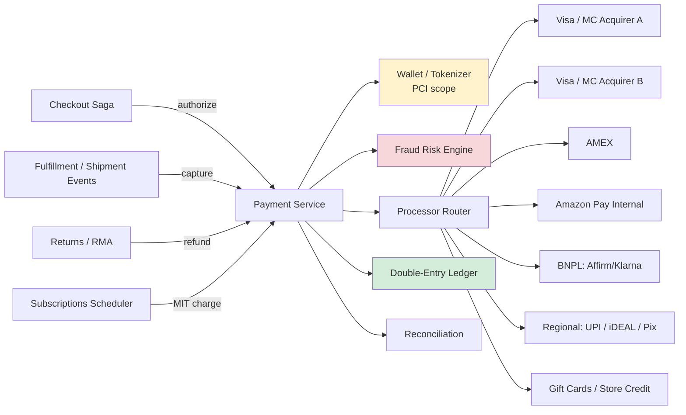
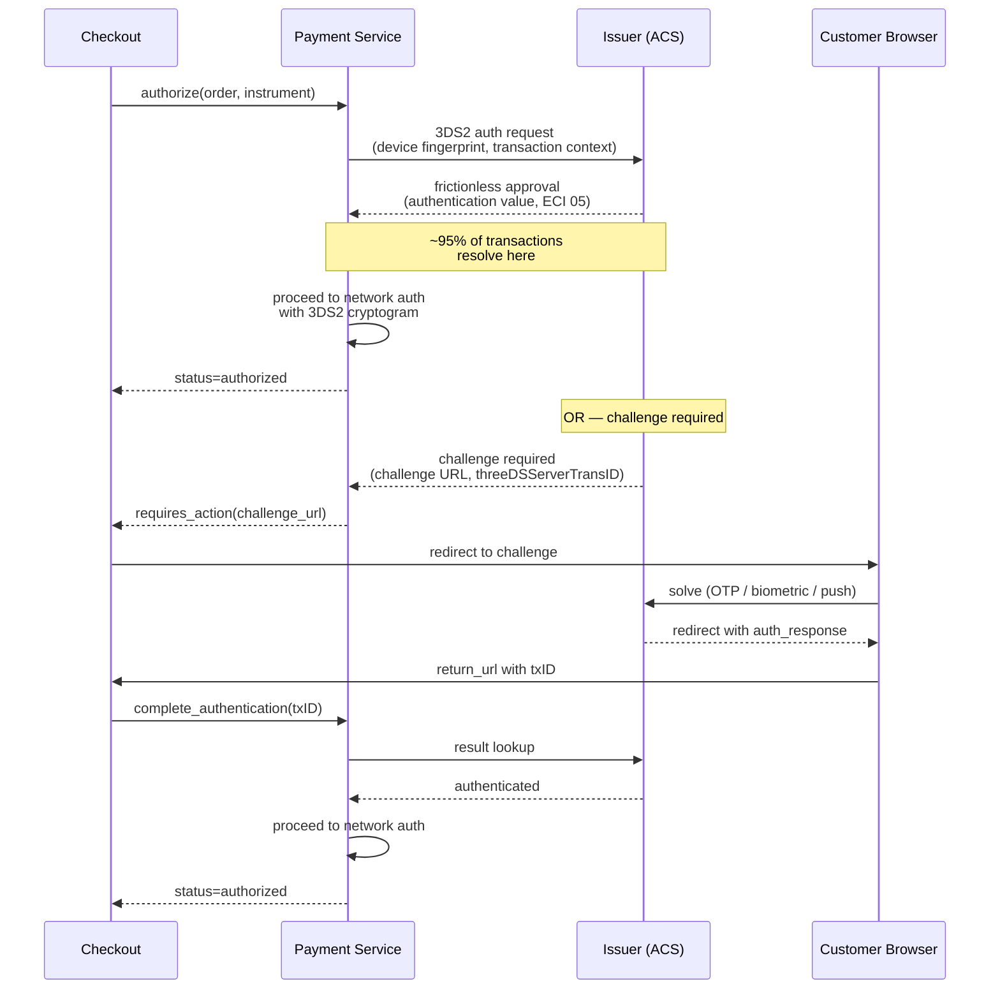
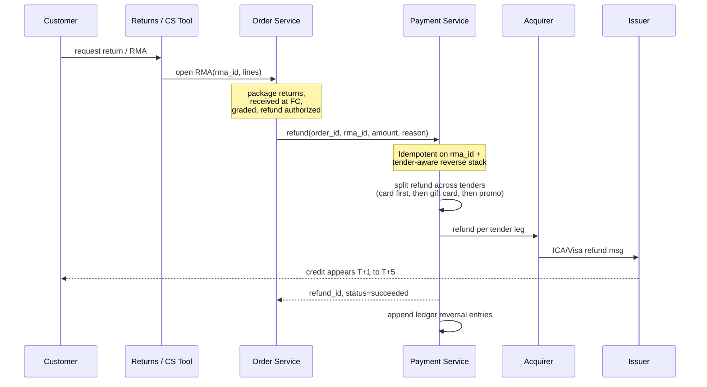

# Amazon Deep Dive — Payment Integration

**Date:** 2026-04-30 | **Updated:** 2026-04-30
**Tags:** `system-design` `case-study` `amazon` `deep-dive` `payments`

## Table of Contents

- [Summary](#summary)
- [Overview](#overview)
- [Multi-Processor Abstraction](#multi-processor-abstraction)
- [Pre-Authorization at Place-Order](#pre-authorization-at-place-order)
- [Capture at Ship-Time](#capture-at-ship-time)
- [Split Tender — Gift Card + Credit Card + Promo](#split-tender--gift-card--credit-card--promo)
- [3D Secure 2 / SCA Compliance](#3d-secure-2--sca-compliance)
- [PCI Scope Minimization — Tokenization and the Wallet](#pci-scope-minimization--tokenization-and-the-wallet)
- [Fraud Detection](#fraud-detection)
- [Refunds and Chargebacks](#refunds-and-chargebacks)
- [Subscription Billing — Subscribe & Save and Prime](#subscription-billing--subscribe--save-and-prime)
- [Regional Payment Methods](#regional-payment-methods)
- [Anti-Patterns](#anti-patterns)
- [Related](#related)
- [References](#references)

## Summary

Amazon's payment integration is the part of the order-management stack where every other concern collapses into one rule: **money moves once, in the right amount, to the right account, never twice, never for an order that didn't ship**. The integration layer abstracts a portfolio of processors (Visa/Mastercard/AMEX over multiple acquirers, Amazon Pay, Amazon-issued gift cards, Buy Now Pay Later partners like Affirm/Klarna/Afterpay, and dozens of regional methods such as UPI, iDEAL, Pix, GrabPay) behind a **uniform charge interface** that the checkout saga and fulfillment services call without knowing the rails. The economic model is **authorize at place-order, capture per shipment** — orders are reversible, charges are not, and Amazon's multi-shipment, multi-FC, multi-day fulfillment graph means a single order may produce many partial captures, each tied to a real warehouse event. **Split tender** lets a single order pay with a stack of methods (gift card + Visa + promotional credit) that must add up to the order total, settle in the correct sequence, refund in the inverse sequence, and never double-spend a gift card balance. **PCI scope** is contained to a small wallet/tokenizer service via network tokens and an iframe-hosted PAN entry surface; the rest of the platform handles only opaque references. **3DS2 / SCA** is invoked when issuer rules or regional regulation (PSD2 in EU/UK, RBI in India) demand it, with frictionless authentication preferred and challenge flows degraded gracefully. **Subscriptions** (Subscribe & Save, Prime, Audible, Kindle Unlimited) run on a separate scheduled-charge pipeline that handles MIT (merchant-initiated transactions), retries for soft declines, dunning, and account-updater integration so that a card on file expiring next month does not break a $30/month auto-replenish.

The payment service is a member of the [checkout saga](./checkout-saga.md): it owns auth/capture/refund correctness, while the saga owns idempotency across the whole order. For the generic, processor-agnostic internals (idempotency machinery, double-entry ledger, reconciliation, processor adapter pattern, webhook handling), see [`../../payment/design-payment-system.md`](../../payment/design-payment-system.md). This deep-dive focuses on what is **specific to Amazon's e-commerce shape**: a long-lived auth window, partial captures pinned to physical shipments, split tender with mixed instrument types, and a fraud + subscription stack tuned to a third-of-a-trillion-dollars-a-year retail flow.

## Overview

Three properties make Amazon's payment integration unusual relative to a pure payments product like Stripe or Adyen:

1. **The auth and the capture are separated by physical reality.** A card auth at "Place Order" is a *promise* by the issuer that the funds exist; the actual money movement (capture) happens when a fulfillment center picks, packs, and hands a package to a carrier. That window can legitimately be hours (Prime same-day) to weeks (back-ordered or pre-order items). The system is built around that delay rather than fighting it.
2. **One order can produce N captures.** Multi-line orders split across fulfillment centers ship in waves. Each shipment captures a portion of the original auth. The auth must outlive the longest realistic shipment lag, and when it cannot, the system must re-authorize without customer-visible failure.
3. **Tender mixes are first-class.** A typical order may apply a $25 promotional credit, redeem $40 of an Amazon gift card balance, and charge the remaining $73.42 to a Visa. Refunds reverse this stack inside-out (refund the card first up to the captured amount on it, then return the gift card balance) under business rules that vary by jurisdiction and item category.

Layered on top: PCI compliance pressure that pushes any system handling raw PAN to the smallest possible footprint, regulatory pressure (PSD2/SCA in Europe, RBI tokenization mandate in India, PCI DSS v4.0 globally), and the operational reality that Amazon Pay also issues itself as a *third-party wallet* — buttons on Shopify and other merchant sites — meaning the same payment platform plays both the merchant and the wallet role.



The five callers (checkout, fulfillment, returns, subscriptions, and customer-service tools) only ever speak to the **Payment Service**. They never know which processor handled a charge, never see a PAN, and never make decisions based on processor-specific behavior. The processor router and the wallet are the two PCI- and partner-sensitive components; everything else is application code.

## Multi-Processor Abstraction

The platform talks to many money-moving counterparties. A clean abstraction is what keeps Black Friday from turning into a partner-engineering scramble.

**Processor categories.**

| Category | Examples | Settlement | Notes |
|----------|----------|------------|-------|
| **Card networks (acquirer-fronted)** | Visa, Mastercard, AMEX, Discover, JCB, UnionPay | T+1 to T+3 net | Multiple acquirers per network for redundancy and rate negotiation. Network tokens are the modern PAN replacement on the rails. |
| **Bank rails (push payments)** | iDEAL (NL), Pix (BR), UPI (IN), SEPA Direct Debit (EU), ACH (US) | Same-day to T+2 | Different auth model — customer authorizes on their bank's UI; merchant receives confirmation, no card number involved. |
| **Wallets** | Amazon Pay (self), PayPal, Apple Pay, Google Pay, GrabPay (SEA), Alipay/WeChat Pay (CN) | Wallet-specific | Apple/Google Pay surface tokenized DPANs (device account numbers); under the hood still the card networks. |
| **BNPL** | Affirm, Klarna, Afterpay, Zip | Merchant paid up front (minus fee) by BNPL; consumer pays installments to BNPL | Merchant gets full amount immediately; collection risk owned by BNPL. |
| **Internal balances** | Amazon gift cards, store credit, promotional credit | Internal ledger transfer; no external rail | Settles instantly inside Amazon's books. |

**The unified `PaymentInstrument` model.** Every method, no matter how exotic the rails, normalizes to a small interface:

```text
PaymentInstrument {
  id: string                 // pi_…
  type: enum                 // card | amazon_pay | gift_card | bnpl | bank_debit | wallet
  network_token?: string     // for cards: network token, never PAN
  display_label: string      // "Visa ending 4242"
  capabilities: bitset       // can_authorize, can_capture, can_partial_capture,
                             //   can_refund, can_recurring, can_split, can_3ds
  region_eligibility: [...]  // ISO countries this method can be used in
}
```

`capabilities` matters: a gift card can be `authorize + capture` but not `recurring`; SEPA Direct Debit is `recurring + can_refund` but capture is asynchronous (T+1) so the order placement contract is "auth approved" rather than "funds reserved." The payment service exposes `capabilities` to the checkout layer so that the UI never offers a method the order shape can't accommodate (no recurring billing on a gift card, no split-tender on a method that doesn't support partial captures).

**Routing logic.** When a customer initiates a card payment, the router picks an acquirer based on:

- **Currency / region.** A EUR charge from a German shopper routes to a EU acquirer to settle in EUR and avoid cross-border fees.
- **Card BIN.** Some BINs auth better with one acquirer than another; routing tables learn from acceptance rates.
- **Cost.** Interchange + scheme + acquirer fees vary; the cheapest viable acquirer wins ties.
- **Health.** Acquirer A's elevated decline rate or 5xx rate in the last N minutes shifts traffic to B. Circuit breakers per acquirer with half-open probes ([Adyen — payment routing][adyen-route]).

Routing is a **policy** layer, not a hardcoded map. Engineers can ship a new acquirer behind a feature flag, dial up a small percentage of traffic, watch authorization-rate dashboards, and roll back without redeploying the checkout. This is the same shape as the generic processor adapter pattern in [`../../payment/design-payment-system.md`](../../payment/design-payment-system.md), but with stricter SLAs because Amazon's checkout must work everywhere all the time.

**Failover.** A hard failure (network timeout, acquirer 5xx) on the primary triggers a synchronous retry against the secondary acquirer with the same idempotency key. Soft declines (insufficient funds, do-not-honor) are **not** retried on a different acquirer — that's the issuer's no, not the acquirer's; retrying just stacks declines on the customer's record and risks fraud flags.

## Pre-Authorization at Place-Order

When a customer clicks "Place Order," the saga calls the payment service with the chosen instrument and the order total. The payment service performs an **authorization** — a request to the issuer that says "set this much aside; I'll come back later to actually move it." On Visa/Mastercard rails this is the `0100` authorization message; the response (`0110`) carries an approval code and a hold on the cardholder's available credit.

**The authorize call shape:**

```text
POST /internal/payments/authorize
Idempotency-Key: ord_2026-04-29_4f3a…
{
  order_id:    "ord_1029",
  customer_id: "cus_42",
  amount:      { value: 13242, currency: "USD" },
  instrument:  { id: "pi_visa_4242", network_token_ref: "tok_…" },
  fraud_signals: { ip, device_fingerprint, billing_addr_hash, … },
  three_ds:    { return_url: "…", challenge_indicator: "no_preference" },
  metadata:    { line_count: 4, fc_split_count: 2 }
}

→ 200 { auth_id, status: "authorized", expires_at, ledger_tx, processor, processor_auth_id }
→ 200 { auth_id, status: "requires_3ds", challenge_url, transaction_id }
→ 200 { auth_id, status: "declined", decline_code: "do_not_honor", retriable: false }
```

**Why the auth window matters.**

Card-network auth holds typically last **7–30 days**, varying by scheme and merchant category. AMEX often gives longer windows; debit auths are stricter. Amazon's fulfillment SLA buckets:

| Order shape | Typical capture latency | Re-auth needed? |
|-------------|------------------------|----------------|
| Prime same-day, in-stock single-FC | < 4 hours | No |
| Standard 2-day, single-FC | 1–2 days | No |
| Multi-FC split shipment | 1–5 days | Rare |
| Back-ordered / restock-and-ship | 5–30 days | Sometimes |
| Pre-order (book, game, gadget release) | 30+ days | Yes — re-auth at ship-imminent time |
| Subscribe & Save next cycle | ~30 days | New auth each cycle |

For long-tail cases the system schedules a **re-authorization** job: a few days before the auth expires, attempt a fresh authorization using a stored network token; if it succeeds, swap the auth reference on the order; if it fails, fall back to soft notification ("your card auth expired, please confirm payment to ship").

**Idempotency.** The `Idempotency-Key` is the order ID concatenated with a saga step nonce. A retry of the saga's auth step from the orchestrator, a redelivery from Kafka, or a customer click-spam on "Place Order" all produce **the same auth**, never two. The payment service's idempotency cache stores the `(merchant, key) → response` mapping for 24h; the underlying transaction row uniquely keys on `(processor, processor_auth_id)` so a duplicate auth that somehow leaks through is caught at insert. (See [`../../payment/design-payment-system.md` §7.1][parent-idem] for the full machinery.)

**Auth ≠ Charge.** The customer's card statement shows a "pending" line for the auth; the order page shows "payment authorized." Neither is a real money movement yet — that happens only at capture. This decoupling is the entire point: an order that gets canceled, fails fraud review, or runs into an inventory snafu can be **voided** without the customer's bank ever seeing a real charge land. A void issued before settlement is invisible to the cardholder beyond the pending entry vanishing in 1–7 days.

## Capture at Ship-Time

Capture happens when the package physically leaves the fulfillment center. The trigger is the carrier scan event: "package handed to UPS at 3:47 PM." The fulfillment service emits a `shipment.handed_off` event; the payment service consumes it and calls capture against the auth.

**Per-shipment capture.** A four-line order shipping in two waves produces two captures:

```text
Order ord_1029, total $132.42, auth Aauth_x

  Shipment ship_1 (Items A, B): subtotal $80.00 + tax $7.20 + ship $5.99 = $93.19
    → CAPTURE ${93.19} against Aauth_x
    → CAPTURE_1 succeeded; remaining_capturable = $39.23

  Shipment ship_2 (Items C, D): subtotal $35.00 + tax $3.15 + ship $1.08 = $39.23
    → CAPTURE ${39.23} against Aauth_x
    → CAPTURE_2 succeeded; remaining_capturable = $0
    → AUTH FULLY CAPTURED; ledger entry "auth_settled"
```

Each capture is its own transaction row, its own ledger movement, its own webhook. The order aggregate tracks `auth_amount`, `captured_amount`, `remaining_capturable`. A reporting query "how much money has Amazon actually collected on this order?" reads `captured_amount`; "how much can it still collect?" reads `remaining_capturable`.

**Partial captures and the network's rules.** Visa, Mastercard, and AMEX permit multiple captures against a single auth up to the auth amount. Some rules differ:

- **Split-shipment-friendly captures** are the norm; the merchant flag indicates this at auth time so the issuer expects partial settles.
- **Over-capture** (capturing > auth amount) is universally rejected. Tax recalculations or shipping upgrades that increase the total require either re-auth or a separate auth.
- **Long auth lifecycle** — if the auth window is shorter than the actual ship lag, the merchant either re-authorizes or accepts the issuer's "auth expired" decline at capture (which is now a customer-facing problem).
- **Unused auth balance** at full ship is closed by a final `auth_close` (or simply lapses); some networks add a fee for the unused tail, which routes to the cost-of-acceptance ledger.

**What if capture fails?** Capture failures at ship time are rare but real:

| Failure | Cause | Response |
|--------|-------|---------|
| `auth_expired` | Shipment took longer than the auth window | Attempt re-auth; if fails, retain package and notify customer |
| `insufficient_funds` (debit) | Customer's balance dropped between auth and capture | Retry capture; on persistent failure, hold shipment and dunning notification |
| `card_canceled` | Cardholder closed the card or it was reissued | Try account-updater (network-supplied new PAN); if missing, customer notification |
| Processor 5xx | Acquirer transient | Retry with backoff; queue for delayed retry |

Crucially, capture failure **does not unsightly cascade** to the customer until retry budgets exhaust. The package sits in a "payment_pending_capture" state at the FC; the saga timer escalates if unresolved.

**Auth-then-capture vs sale-and-capture.** A few payment methods (gift cards, some bank-debit flows) don't naturally do auth/capture; the system models them as **immediate sale** at place-order, with the equivalent of a "void if order canceled" path that posts a reversing ledger entry. The tender mix module is what makes this transparent to the order layer.

## Split Tender — Gift Card + Credit Card + Promo

Split tender is one of the messiest concrete features in retail payments. The user adds a gift card, the system applies promotional credit, and a card covers the rest. The order total must equal the sum across instruments; refunds must reverse in the right order; gift card balances must never be double-spent across two orders racing to redeem.

**The tender plan.** At checkout the system computes a deterministic `tender_plan`:

```text
Order total: $132.42

Tender plan (in priority order):
  1. Promotional credit:   $25.00  (instrument pi_promo_xyz)  — settle internally
  2. Gift card:            $40.00  (instrument pi_gc_abc, balance available $40.00)
  3. Credit card (Visa):   $67.42  (instrument pi_visa_4242)

Sum check: $25 + $40 + $67.42 = $132.42 ✓
```

**Priority order.** Internal balances (promo, store credit, gift card) consume first; the external rail (card or BNPL) takes the remainder. Rationale: refunds reverse in **inverse** priority. The customer who returns one item and gets a refund first sees the card credited (they care most about that), then the gift card, then the promo. This ordering is configurable per region/business unit but the principle is consistent.

**Atomicity of tender application.** The split must commit as a single logical unit:

```text
BEGIN tender_application(order_id)
  reserve gift_card_balance(pi_gc_abc, $40)   -- decrement available_balance, write hold
  reserve promo_credit(pi_promo_xyz, $25)
  authorize card(pi_visa_4242, $67.42)        -- external auth
  if any failed → rollback: release holds, void card auth
  on success → write tender_legs rows, mark order tender_applied
COMMIT
```

The internal reservations and the external auth both have to land. If the card auth declines, the gift card hold is released back to the customer's available balance — a balance never silently disappears.

**Per-shipment capture across tenders.** When a shipment ships, capture proceeds **in priority order per shipment**: drain promo first, then gift card, then card. A two-shipment order:

```text
Auth phase:
  promo_hold = $25
  gc_hold    = $40
  card_auth  = $67.42

Shipment 1 ($93.19):
  capture from promo: $25.00  (promo exhausted)
  capture from gift_card: $40.00  (gift_card exhausted)
  capture from card: $28.19  (card remaining capturable: $39.23)

Shipment 2 ($39.23):
  capture from card: $39.23  (card auth fully captured)
```

Each "capture from instrument" is its own ledger movement. The reporting fact "how much did this customer pay in cash equivalents vs gift card vs promotional credit" rolls directly out of the ledger.

**Refund inversion.** A return on Item B from Shipment 1 (worth $30) refunds *card first*:

```text
Refund $30:
  refund to card:   $28.19  (return up to what was captured on card from this shipment)
  refund to gift_card:  $1.81  (next priority)
```

The customer's gift card balance increases by $1.81; the card sees a $28.19 credit. Both legs post immutable ledger entries.

**Race protection on gift card balances.** The classic bug: customer opens checkout in two tabs, both tabs reserve the same $40 gift card balance, both orders place, gift card gets debited twice. Defended in two places:

1. **Optimistic concurrency** on the gift card row: `UPDATE gift_cards SET available_balance = available_balance - 40 WHERE id = ? AND available_balance >= 40`. The conditional `WHERE` ensures the deduction only happens if the balance is still sufficient; a row count of 0 means another order won the race.
2. **Hold + commit pattern.** The reservation is recorded in a `gift_card_holds` table with a TTL; available balance is computed as `total_balance - SUM(active holds) - SUM(captures)`. A stale hold expires and releases automatically.

This is essentially the same pattern as inventory reservation in [`./inventory-management.md`](./inventory-management.md).

## 3D Secure 2 / SCA Compliance

3D Secure 2 (3DS2) is the EMVCo authentication protocol that lets the issuer step the cardholder up for an extra factor (biometric, OTP, banking-app push) when the transaction looks risky. It is mandatory under PSD2 in the European Economic Area and the UK (Strong Customer Authentication, SCA) for most consumer card transactions, and increasingly common globally as issuers tighten fraud controls.

**The two paths.**



**Frictionless flows.** 3DS2 ships a rich data payload (device ID, prior session info, billing/shipping address, basket contents) to the issuer's Access Control Server (ACS). Most transactions get authenticated **frictionlessly** — the issuer evaluates the data and returns "approved without challenge." Amazon shapes this aggressively because every challenge is a checkout abandonment risk.

**Liability shift.** The other reason to do 3DS2 even when not legally required: if the issuer authenticates the transaction, **chargeback liability for "fraud — not authorized"** shifts from the merchant to the issuer. For a high-ticket order, this is real money saved.

**SCA exemptions.** Under PSD2 the merchant may request an exemption to skip the challenge:

| Exemption | When |
|----------|------|
| **Low value** | < €30 individual, < €100 cumulative since last SCA |
| **TRA (transaction risk analysis)** | Acquirer's fraud rate is below scheme thresholds; merchant requests exemption |
| **Trusted beneficiary** | Customer added the merchant to their bank's trusted list |
| **Merchant-initiated transaction (MIT)** | Recurring/subscription where the customer authenticated the original mandate |
| **Corporate cards** | B2B flows |

Amazon's payment service requests TRA whenever its measured fraud rate qualifies; recurring charges (Subscribe & Save renewals) ride MIT exemptions; gift-card-only orders skip 3DS entirely.

**RBI mandate (India).** Indian regulation requires SCA on all card transactions including recurring; e-mandate registration must use OTP. This is implemented as a per-region policy in the routing layer; a UPI payment in India bypasses the card-network 3DS path and uses UPI's own auth model.

**Implementation note.** The 3DS step happens *before* the network auth call. Failing 3DS or the customer abandoning the challenge leaves no network auth and therefore no money movement risk. The client-side state machine on checkout treats `requires_action` as a pause-and-redirect, not as a failure.

For the protocol details see [EMVCo 3DS 2 specification][3ds2-spec] and the [Stripe 3DS2 docs][stripe-3ds].

## PCI Scope Minimization — Tokenization and the Wallet

PCI DSS v4.0 ([pcisecuritystandards.org][pci-dss]) defines the audit perimeter as any system that **stores, processes, or transmits** cardholder data. Anything in that perimeter is subject to ~330 controls, quarterly external scans, annual penetration tests, formal change-management documentation, and a Qualified Security Assessor audit. Anything outside is not. Therefore: **make the perimeter as small as possible**.

**The Amazon Wallet service.** All raw PAN handling lives behind a single internal service ("the Wallet"):

- **Tokenizer endpoint.** A vendor-supplied or self-hosted iframe runs on a dedicated origin (`payments.amazon.com`); the customer types their card number, CVV, and expiry directly into that iframe. The iframe POSTs to the tokenizer over TLS 1.2+ and returns a token to the parent page. The parent page (the checkout app) is therefore **PCI SAQ-A** — it never sees the PAN.
- **Vault.** Tokenized PANs are stored encrypted with AES-256-GCM, keys held in AWS KMS or an HSM, with envelope encryption. CVV2 is **never** stored — PCI DSS forbids storage of CVV/CVC after authorization completes.
- **Network tokens.** Where supported (Visa Token Service, Mastercard Digital Enablement Service, AMEX Token Service), the wallet exchanges PANs for **network tokens**: scheme-issued surrogates that work with the same processors but, if leaked, can be revoked at the network without invalidating the underlying card. Network tokens also auto-update on card reissue, which is critical for subscription billing.

**What other services see.** Outside the wallet, every internal service handles only:

```text
PaymentInstrument {
  id: "pi_visa_…",
  display_label: "Visa ending 4242",
  expires_month_year: "08/27",
  network_token_ref: "ntok_…",   // opaque to caller
  customer_id: "cus_42"
}
```

There is no field that contains a PAN, no API that returns a PAN, no log line that should ever produce a PAN-shaped string. Static-analysis lint rules forbid any string matching a Luhn-valid PAN regex from being emitted to logs (the build fails if the linter spots it).

**Cryptographic operations.** Encrypting/decrypting tokens, generating cryptograms for 3DS, and signing webhook payloads happen inside the wallet boundary. AWS Payment Cryptography ([aws-payment-crypto][aws-pc]) is the AWS-managed service that exists for exactly this; for high-throughput or sovereignty-sensitive flows, dedicated HSMs (Thales, AWS CloudHSM) live in the same VPC.

**The blast radius win.** A typical tech company that shoves PANs into a generic database has every microservice that reads from that database in PCI scope. With wallet tokenization the in-scope set is: the iframe origin, the tokenizer service, the vault, the processor adapters, the wallet's KMS keys. Everything else — the order DB, the catalog, the recommender, the recommendations log, customer service tooling — handles only opaque IDs and is out of scope. This compresses the audit from "the whole company" to "a small team that already eats security for breakfast."

For canonical PCI scope guidance see [PCI DSS Quick Reference Guide][pci-quick] and the [Information Supplement on Scoping and Network Segmentation][pci-scope].

## Fraud Detection

Card-not-present fraud is a multi-billion-dollar tax on e-commerce. Amazon's risk engine sits in the auth path; it returns one of three signals: **approve, review, deny**. Approve goes to the network; deny short-circuits the auth as `declined_by_risk`; review proceeds with auth but flags the order for manual or asynchronous review.

**Signals.** Every authorization request carries a fraud-signals payload:

| Signal class | Examples |
|--------------|----------|
| **Identity** | account age, login recency, prior order count, prior chargeback count, address book vs shipping address mismatch |
| **Device** | device fingerprint (canvas, font, time-zone), IP geo, IP reputation, proxy/VPN/Tor detection |
| **Behavior** | session length before checkout, click pattern, copy-paste vs typed card data, velocity of orders today |
| **Instrument** | card BIN issuer, country mismatch (US card in JP order), prior decline pattern, age of card-on-file |
| **Order shape** | high-value items, gift-card-only purchases, ship-to vs bill-to distance, drop-shipping signal |
| **Network** | scheme's own fraud score (Visa Risk Manager, MC Decision Intelligence) |

**Model.** A gradient-boosted ensemble or deep-learning classifier returns a probability of fraud; a calibration layer maps that to approve/review/deny thresholds. Thresholds are **per-segment**: an order from a 10-year-old account with 200 successful prior orders gets a much higher tolerance than a 1-day-old account paying with a brand-new gift card.

**Velocity rules.** Hard rules complement the model: more than N attempts on a card in M minutes, more than X declines from one IP in Y minutes, gift card balance change above threshold without auth — all decline outright. These are runtime-mutable in a rules engine; an emerging fraud pattern can be patched in minutes without retraining a model.

**Async adjudication.** Approved-with-review orders go to a queue. A second-pass model (with more features and more compute budget) re-scores; high-confidence-fraud orders are flagged for hold-before-ship; clear orders proceed. The hold-before-ship action is the core of fraud cost control: an order that hasn't shipped costs nothing in goods; an order that ships and chargebacks costs the goods + shipping + chargeback fee + scheme penalty.

**Friendly fraud and chargeback prediction.** A separate model predicts "this customer will dispute this charge as not-authorized in the next 60 days" using post-auth signals (delivery confirmation, return rate, prior dispute behavior). Items flagged are pre-emptively gathered: signed delivery proof, chat transcripts showing acceptance, IP/device match — so dispute response is automatic.

**Fail-closed for fraud, fail-open for telemetry.** When the fraud service is unavailable, the auth path fails the transaction — better to lose a sale than ship a black-Friday weekend with an open door. Telemetry pipelines that score the same transaction for analytics fail-open: a missing analytic event isn't a fraud risk.

The shape of this is the same as the generic fraud gate in [`../../payment/design-payment-system.md` §7.5][parent-fraud], with much more domain data available because the platform sees the entire order, not just the charge.

## Refunds and Chargebacks

Refunds and chargebacks both reverse money; they differ in who initiated and what timeline applies.

**Refund flow.**



A refund is **always** a new transaction, never an in-place mutation of the original capture. Original capture rows are immutable; reversal is a pair of ledger entries that net the customer's account back to where it was (modulo time-value-of-money loss the customer eats).

**Idempotency on `rma_id`.** A retry of the refund call with the same `rma_id` returns the existing refund_id; never two refunds. A partial refund is supported (return one item out of four); the unreturned portion remains captured.

**Refund vs void.** If the order canceled before any capture, the response is to **void** the auth (release the hold) — no money ever moved, the cardholder's pending entry vanishes in 1–7 days. After capture, a true refund is required.

**Chargebacks.** A chargeback is the cardholder calling their issuer and disputing the charge. The issuer pulls the funds back from Amazon (the merchant) via the network and notifies via webhook. Chargebacks land in defined **reason code** categories (4837 fraud, 4853 services not provided, 4854 not as described, 4855 not received, etc.).

**Lifecycle:**

```text
Chargeback received (webhook from acquirer)
  → freeze disputed amount in ledger (move to "disputed" account)
  → gather evidence (proof of delivery, tracking, IP/device match,
     terms-acceptance record, prior CS communications)
  → submit representment within scheme deadline (typically 15–45 days)
  → 2nd presentment outcome:
      won → reverse the freeze, original charge restored
      lost → final loss, post chargeback fee, write off goods if not returned
```

**Pre-arbitration / arbitration.** Some schemes (Visa, Mastercard) escalate disputed cases to arbitration. The merchant pays a per-case scheme fee on top of the chargeback fee. Amazon's volume and quality of evidence give a high win rate, but the cost of the dispute pipeline (people + tooling) is substantial.

**Chargeback prevention.** The cheapest chargeback is the one that becomes a refund first. Customer-service tooling proactively offers refund-and-keep on low-value items; high-friction returns (heavy items) get instant refund + ship-it-back-when-convenient. The downstream effect: chargeback rate stays well below the scheme's elevated-monitoring threshold (typically 1% of transactions), avoiding scheme fines and reputational risk.

## Subscription Billing — Subscribe & Save and Prime

Subscribe & Save (auto-replenish at customer-chosen cadence), Prime annual/monthly, Audible, Kindle Unlimited, Amazon Music — all run on a recurring-charge pipeline distinct from one-shot checkout.

**The mandate.** When a customer first signs up for a recurring product, the payment service captures a **mandate**: customer authenticated, recurring authorization granted, schedule defined. This first transaction is **CIT** (customer-initiated), runs through 3DS2, and produces a **network-token-based payment instrument** plus a stored mandate reference at the issuer.

**MIT — Merchant-Initiated Transactions.** Subsequent renewals are **MIT**. They bypass SCA via the recurring exemption, run authentication using the original mandate's reference, and capture immediately (no auth-then-capture; renewal is sale-and-capture because the goods/service goes out instantly).

**The scheduler.** A sharded job-runner (Kafka-driven, Postgres-backed schedule, with at-least-once execution and an idempotency key per `(subscription_id, period)`) fires charge attempts. Charge attempts run through:

1. **Account updater** — query Visa Account Updater / MC Automatic Billing Updater for fresh PAN/expiry on the network token. A card that expired last month gets seamlessly updated.
2. **Authorize and capture in one step.**
3. **Soft decline retry.** "Insufficient funds," "do not honor," issuer downtime — retry on a backoff schedule (typically T+1, T+3, T+7 day spacing) up to a configured budget. Each retry is its own attempt with its own idempotency key.
4. **Hard decline final action.** Card canceled, fraud, etc. — pause the subscription, notify the customer, surface in account.

**Dunning UX.** A subscription with a soft-declining card surfaces in the customer's account dashboard with a "fix payment" affordance. The system retries on a schedule; each successful retry restarts the subscription cycle.

**Subscribe & Save grouping.** Customers can group multiple Subscribe & Save items to ship together at one of a few standard cadences. The scheduler picks a unified ship date, computes the bundled total (including the S&S 5–15% discount tier), and runs one renewal charge per ship cycle — not one per item. This is more customer-friendly *and* halves the per-item processor fee load.

**Prime renewal.** Annual Prime membership ($139/yr in the US) is a high-value MIT charge. It's wrapped in extra dunning sophistication: on hard decline, Amazon offers a 30-day grace period with continued benefits and a banner asking to update payment, because losing a Prime member to a card expiry is a substantially worse outcome than losing a single product order.

**Auth-and-no-capture for "free trial converting to paid."** During trial, no charge runs. A few days before trial end the system issues a **$0 auth** (allowed by schemes for verification) to confirm the card is still valid; on trial expiry the first paid period is captured. The $0 auth + fresh account-updater data + long enough lead time means the conversion charge succeeds at a high rate.

## Regional Payment Methods

Outside the US, card-network share drops and local rails dominate. The platform supports a portfolio per region.

**India — UPI (Unified Payments Interface).** The de facto rail for consumer payments. The flow:

```text
1. Customer picks UPI at checkout, enters their UPI ID (alice@hdfc).
2. Payment service issues a collect request via UPI rails to alice's bank.
3. Customer's bank app shows a notification; alice approves with UPI PIN.
4. UPI clears in seconds; webhook confirms.
```

UPI is **push** rather than pull — the customer pushes from their bank to the merchant. There's no PAN. There's no stored credential by default; recurring requires UPI AutoPay e-mandates (RBI-regulated, OTP-authenticated registration). Order placement holds inventory while waiting for UPI confirmation; if the customer doesn't approve in N minutes the saga rolls back. ([NPCI UPI specs][upi-npci])

**Netherlands — iDEAL.** Bank-redirect payment: customer picks their bank at checkout, redirects to bank web/app, authenticates, confirms; bank sends payment confirmation to the merchant. Same push-payment shape as UPI; settlement T+0 or T+1. iDEAL covers >70% of Dutch e-commerce. ([iDEAL][ideal])

**Brazil — Pix.** Instant central-bank rail launched 2020. The customer scans a QR or copies a Pix key; payment lands in the merchant's account in seconds, 24/7 including weekends. Like UPI, no PAN, no chargebacks (irreversible) — which puts more pressure on pre-payment fraud detection. ([Pix — BCB][pix])

**Europe — SEPA Direct Debit.** Pull payment with a customer-signed mandate. Merchant initiates; bank pulls; settlement T+1 to T+2; reversible by the customer for 8 weeks (no questions asked) and 13 months (unauthorized). SEPA's reversibility window means SEPA mandates are less attractive for high-value goods.

**Southeast Asia — wallets.** GrabPay, GoPay, Touch'n Go, ShopeePay — wallets dominate. Each has its own API; all normalize to the wallet `PaymentInstrument` type. Settlement is wallet-specific (T+0 to T+7).

**China — Alipay / WeChat Pay.** Required for any meaningful presence in the Chinese market. Both run their own walled-garden rails; settlement to the merchant in CNY or USD via authorized clearing partners.

**The implementation pattern.** Every regional method is a `ProcessorAdapter` plus a `PaymentInstrument` capability profile. The checkout layer asks the payment service "what methods are available for this customer in this region for this order shape?" and gets back a filtered list. Adding a new method is contained to:

- Adapter implementation (auth, capture if applicable, refund, webhook handler).
- Capability declaration (does it support partial capture? recurring? split tender?).
- Region/currency eligibility entry.
- Settlement reconciliation parser for the new method's report format.

No upstream code changes. This is the abstraction earning its keep.

## Anti-Patterns

- **Capturing at place-order instead of ship-time.** The customer's bank shows a real charge for a product that hasn't moved. Multi-shipment orders force you to invent partial-refund-and-recharge flows that don't reconcile cleanly. Authorize-then-capture is the standard for a reason.
- **Skipping auth on "internal-only" tenders.** A gift card with no hold means tab-races debit it twice. Always reserve before applying.
- **Mutating capture rows on partial refund.** Capture rows are immutable; refund rows are independent transactions that point at the captured charge. Anything else loses the audit trail.
- **One processor, no failover.** A processor outage on Black Friday is not a hypothetical. Multi-acquirer routing with health-aware traffic shifting is mandatory at scale.
- **Storing PANs anywhere outside the wallet.** The day a junior engineer adds a `card_number` column to a non-wallet table is the day PCI scope explodes. Hard architectural rule + lint enforcement + code review by the payments team.
- **Logging tokens and idempotency keys at INFO.** Tokens, while not PAN, are sensitive; idempotency keys collide-tested across customers can leak transaction patterns. Redact in non-debug logs.
- **Hardcoded SCA exemption flags.** A regulatory change in one market (RBI mandate, PSD2 thresholds) needs to be deployable as policy, not a code change. Run exemptions through a rules engine.
- **Treating chargebacks as a one-off ticket queue.** Without aggregated reason-code analytics you miss systemic problems (one specific item with high "not as described" rate; one shipping zone with high "not received").
- **Subscription dunning with one retry, then cancel.** Loses customers to a transient issuer hiccup. Smart retry schedules (T+1/T+3/T+7) plus account-updater integration recover most soft declines.
- **Refunding to the original card always.** A customer who paid 50% gift card 50% card and returns half the order should see the gift card credited proportionally; defaulting to refund-to-card creates either a free balance (refund > captured-on-card) or under-refunds the customer.
- **Letting fraud signals leak into the response body.** "Declined: high IP risk" tells the fraudster what to change. Decline reasons for genuine declines (NSF, expired) are fine; risk-based declines should be opaque ("declined").
- **No reconciliation between captures and shipments.** A capture without a matching shipment is a charge for a product that didn't ship — a regulatory and reputational nightmare. Daily reconciliation in both directions is non-negotiable.
- **3DS2 challenge-on-everything.** Maximizing 3DS coverage destroys conversion. Use TRA exemptions, frictionless flows, and challenge only when the issuer's risk score warrants.
- **MIT charges without a recorded mandate.** Without proof of the original CIT authentication, the cardholder can dispute every renewal as "not authorized" and the merchant loses every chargeback.

## Related

- [`./checkout-saga.md`](./checkout-saga.md) — the saga that orchestrates inventory, payment auth, fraud, order create; this doc is the deep-dive on the payment leg.
- [`../../payment/design-payment-system.md`](../../payment/design-payment-system.md) — generic processor-agnostic internals: idempotency machinery, double-entry ledger, reconciliation, processor adapter pattern, webhook handling.
- [`../design-amazon-ecommerce.md`](../design-amazon-ecommerce.md) — parent integration HLD for Amazon's e-commerce platform.
- [`./inventory-management.md`](./inventory-management.md) — sibling deep dive; same hold/commit pattern for stock that gift-card balances use for money.
- [`../../../security/encryption-at-rest-in-transit.md`](../../../security/encryption-at-rest-in-transit.md) — TLS, AES-256-GCM, KMS-managed keys for the wallet/vault.
- [`../../../data-consistency/idempotency.md`](../../../data-consistency/idempotency.md) — idempotency-key protocol used across the saga.

## References

- [PCI Security Standards Council — PCI DSS v4.0][pci-dss]
- [PCI DSS Quick Reference Guide][pci-quick]
- [PCI DSS Information Supplement — Scoping and Network Segmentation][pci-scope]
- [EMVCo — 3D Secure 2 Specifications][3ds2-spec]
- [Stripe — 3D Secure 2 Authentication][stripe-3ds]
- [Stripe — Payments overview][stripe-payments]
- [Stripe — Subscriptions and recurring payments][stripe-subs]
- [Stripe — Strong Customer Authentication and PSD2][stripe-sca]
- [AWS Payment Cryptography][aws-pc]
- [Visa Token Service][visa-vts]
- [Mastercard Digital Enablement Service (MDES)][mdes]
- [NPCI — UPI Product Documentation][upi-npci]
- [iDEAL — Documentation][ideal]
- [Banco Central do Brasil — Pix][pix]
- [Adyen — Payment routing and intelligent acceptance][adyen-route]
- [European Banking Authority — PSD2 / SCA Guidelines][eba-sca]
- [Reserve Bank of India — Card-on-file tokenization framework][rbi-cof]

[pci-dss]: https://www.pcisecuritystandards.org/document_library/?category=pcidss
[pci-quick]: https://www.pcisecuritystandards.org/documents/PCI_DSS-QRG-v4_0.pdf
[pci-scope]: https://www.pcisecuritystandards.org/documents/Guidance-PCI-DSS-Scoping-and-Segmentation_v1.pdf
[3ds2-spec]: https://www.emvco.com/specifications/?type=3D+Secure
[stripe-3ds]: https://docs.stripe.com/payments/3d-secure
[stripe-payments]: https://docs.stripe.com/payments
[stripe-subs]: https://docs.stripe.com/billing/subscriptions/overview
[stripe-sca]: https://stripe.com/guides/strong-customer-authentication
[aws-pc]: https://docs.aws.amazon.com/payment-cryptography/
[visa-vts]: https://developer.visa.com/capabilities/vts
[mdes]: https://developer.mastercard.com/mdes-digital-enablement/documentation/
[upi-npci]: https://www.npci.org.in/what-we-do/upi/product-overview
[ideal]: https://www.ideal.nl/en/
[pix]: https://www.bcb.gov.br/en/financialstability/pix_en
[adyen-route]: https://www.adyen.com/knowledge-hub/payment-routing
[eba-sca]: https://www.eba.europa.eu/regulation-and-policy/payment-services-and-electronic-money
[rbi-cof]: https://www.rbi.org.in/Scripts/NotificationUser.aspx?Id=12159
[parent-idem]: ../../payment/design-payment-system.md#71-idempotency-keys
[parent-fraud]: ../../payment/design-payment-system.md#75-fraud-gates-and-3ds
