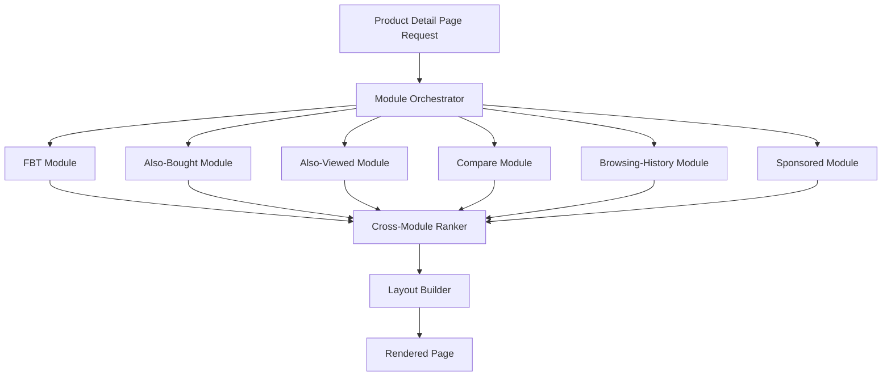

# Amazon Deep Dive — Recommendation Pipeline

**Date:** 2026-04-30 | **Updated:** 2026-04-30
**Tags:** `system-design` `case-study` `amazon` `deep-dive` `recommendations`

## Table of Contents

- [Summary](#summary)
- [Overview — Recommendations as Storefront, Not Sidebar](#overview--recommendations-as-storefront-not-sidebar)
- [Item-to-Item Collaborative Filtering — The 2003 Paper](#item-to-item-collaborative-filtering--the-2003-paper)
- ["Customers Who Bought This Also Bought"](#customers-who-bought-this-also-bought)
- ["Frequently Bought Together" — The Bundle Surface](#frequently-bought-together--the-bundle-surface)
- [Product Detail Page — Many Modules, One Page](#product-detail-page--many-modules-one-page)
- [Homepage Personalization — A Page That Learns You](#homepage-personalization--a-page-that-learns-you)
- [Email and Outbound Recommendations](#email-and-outbound-recommendations)
- [The Deep-Learning Era — Beyond Item-to-Item](#the-deep-learning-era--beyond-item-to-item)
- [Multi-Objective Ranking — Relevance, Diversity, Revenue](#multi-objective-ranking--relevance-diversity-revenue)
- [vs Netflix — Why Two Famous Recommenders Diverged](#vs-netflix--why-two-famous-recommenders-diverged)
- [Cold Start — New Customers, New SKUs, New Categories](#cold-start--new-customers-new-skus-new-categories)
- [Cross-Category Recommendation](#cross-category-recommendation)
- [Anti-Patterns](#anti-patterns)
- [Related](#related)
- [References](#references)

## Summary

Amazon's recommender is the recommender that taught the industry how to build recommenders. The 2003 IEEE paper *"Amazon.com Recommendations: Item-to-Item Collaborative Filtering"* by Greg Linden, Brent Smith, and Jeremy York is a small, dense document that did three things at once. It moved collaborative filtering from user-user (the academic norm) to **item-item** (cheaper, more stable, and offline-precomputable). It scaled the technique to **tens of millions of customers and millions of items** at a time when academic CF benchmarks were running on toy MovieLens-sized data. And it demonstrated that recommendations were not a sidebar widget but the **primary merchandising surface** of a planet-scale store — most prominently the "Customers who bought this also bought" rail and the "Frequently bought together" bundle on every product page.

The architecture has since evolved through three eras. **Era 1 (2000s)** was item-to-item CF with similarity tables precomputed nightly and served as O(1) lookups. **Era 2 (2010s)** layered ML rankers, demand-aware features, contextual signals (recently viewed, cart state), and personalized homepages on top of the CF backbone. **Era 3 (2020s)** added two-tower neural retrieval, transformer-based session encoders, multi-task ranking models that jointly optimize click / add-to-cart / purchase / revenue, and Amazon Personalize as the externally-exposed managed-service version of the internal stack. Through all three eras, the **item-to-item baseline never went away** — it remains a strong recall source, an interpretable fallback, and the conceptual core of the "X → Y" widgets.

What makes Amazon's recommender different from Netflix's is the **action grammar of the surface**. A Netflix viewer commits 30+ minutes to a single decision; an Amazon shopper considers dozens of items per session, adds several to cart, and the recommender's job is partly *complement* (what goes with the espresso machine) and partly *substitute* (other espresso machines worth comparing). The Netflix recommender optimizes a long-form layout and a single click; the Amazon recommender optimizes a **shopping funnel** with strong signals (purchase, add-to-cart, return) and weak signals (browse, hover, dwell), where the **business objective explicitly includes revenue and inventory pressure**, not just engagement.

This deep-dive is a companion to the parent case study [`../design-amazon-ecommerce.md`](../design-amazon-ecommerce.md) and a sibling to [`./search-and-browse.md`](./search-and-browse.md). The Netflix counterpart is [`../../media-streaming/netflix/recommendation-system.md`](../../media-streaming/netflix/recommendation-system.md) — same two-stage funnel, different constants, different signals, and a famously different artwork story.

## Overview — Recommendations as Storefront, Not Sidebar

Amazon was the first large-scale online retailer to treat algorithmic surfacing as a **first-class merchandising channel** rather than a "you might also like" widget. Every meaningful Amazon surface is recommended:

- **Homepage** — personalized rows ("Inspired by your browsing history," "Top picks for you," "Buy again," "Recommended deals").
- **Product detail page** — "Customers who bought this also bought," "Frequently bought together," "Customers also viewed," "Compare with similar items," sponsored placements, and the buy-box itself (which seller wins is a ranking decision).
- **Cart and checkout** — "Add these and save," "Customers who added this also added."
- **Order confirmation and post-purchase** — "Customers who bought this also bought" tied to the just-purchased item, plus accessory and replenishment prompts.
- **Search results page** — relevance ranking is a recommendation problem in disguise: which of the matching SKUs should rank first for *this* user?
- **Email** — daily/weekly digests, cart abandonment, replenishment reminders, lightning-deal alerts, restock notifications.
- **Mobile push** — price drops on watched items, back-in-stock alerts, delivery progression nudges.
- **Alexa / voice** — "you bought these last time, want to reorder?"

A useful framing: the recommender is the **continuous merchandiser**. A physical store re-merchandises monthly with end-cap displays, themed aisles, and seasonal resets. Amazon re-merchandises **per-customer per-session** — what's on the shelf is a function of who's standing in front of it.

A few properties shape the system:

- **Massive catalog with a heavy long tail.** ~600 M SKUs across 1P + 3P marketplace. Most SKUs see fewer than ten purchases per month; a small fraction drive most volume.
- **Heterogeneous categories.** A book has different signal density and different complement structure than a refrigerator, a USB cable, or a one-time-purchase wedding dress. The recommender either learns category-aware behavior or generalizes badly.
- **Strong implicit signals.** Purchase, add-to-cart, return, and review are unambiguous. Browse, click, hover, dwell, and scroll-depth are weaker but vastly more abundant.
- **Multi-objective by construction.** A recommendation that maximizes click probability while ignoring margin, inventory pressure, return rate, and ad budget is incomplete. Amazon's objective is closer to "expected long-term customer value" than to "engagement."
- **Cold-start everywhere.** New SKUs onboard daily (1P launches, 3P listings); new customers sign up daily; new categories open as the store expands. The recommender cannot wait for collaborative signal to accrue before producing useful output.

## Item-to-Item Collaborative Filtering — The 2003 Paper

The Linden, Smith, York paper [*"Amazon.com Recommendations: Item-to-Item Collaborative Filtering"*](https://www.cs.umd.edu/~samir/498/Amazon-Recommendations.pdf) (IEEE Internet Computing, Jan/Feb 2003) is the foundational document. It's worth reading in full — it's only six pages — but the load-bearing ideas are:

### The User-Based CF Failure Mode

Classical user-based CF predicts user `u`'s rating for item `i` by finding users similar to `u` and averaging their ratings on `i`:

```text
predicted(u, i) = aggregate( rating(v, i)  for v in nearest_neighbors(u) )
```

At Amazon's scale this collapses for two reasons:

1. **O(M·N) similarity computation.** With M customers and N items, computing pairwise user similarity is O(M²) which is infeasible for tens of millions of customers. Sampling users degrades quality.
2. **User vectors are sparse and unstable.** A customer who has bought 4 items has a 4-dimensional non-zero vector in an N-dimensional space. Nearest-neighbor lookups are noisy. Worse, every new purchase shifts the user's neighborhood — recommendations become unstable session over session.

### The Item-Based Reframing

The paper inverts the relationship. Instead of "users who are similar to *you* bought *Y*," it computes "items that are *bought-together* with *X* are *Y*." For each item pair `(X, Y)`, define a similarity:

```text
sim(X, Y) = cos( customers_who_bought(X), customers_who_bought(Y) )
          = (|C_X ∩ C_Y|) / sqrt(|C_X| · |C_Y|)
```

where `C_X` is the set of customers who bought `X`. The recommendation for a user is then:

```text
recommendations(u) = top-K by score
                       Y not in purchased(u)
                       score(Y) = sum over X in purchased(u) of sim(X, Y)
```

The whole `sim(X, Y)` table is **precomputable offline** — for each item, find customers who bought it, find other items those customers bought, and aggregate into a similarity score. The paper notes the per-item computation is bounded by the most popular item's customer count, not by the total catalog size.

### Why It Works at Scale

- **Item neighborhoods are stable.** "Customers who bought *War and Peace* also bought *Anna Karenina*" doesn't change much month-to-month. Item-pair similarities are slow-moving signals; nightly batch recomputation is sufficient.
- **Online lookup is O(N_purchased · K).** For a user with N purchases (typically tens to low hundreds), pull the top-K similar items for each, merge, dedupe, and rank. Trivially fast at request time.
- **Sparsity helps.** The popular-item term in the denominator (`|C_X|`) penalizes ubiquitous items (e.g., a household-staple paperback), preventing them from dominating every neighborhood.
- **Interpretable.** "We recommended Y because you bought X" is a defensible explanation — both for the user (transparency) and for the merchandiser (debugging bad recommendations).

### Implementation Sketch

```text
Offline (nightly batch):
  for each item X:
    C_X = customers_who_bought(X)            -- typically thousands to millions
    co_purchase = empty_map<item, count>
    for each c in C_X:
      for each Y in purchased_by(c) where Y != X:
        co_purchase[Y] += 1
    for each Y in co_purchase:
      sim[X][Y] = co_purchase[Y] / sqrt(|C_X| * |C_Y|)
    keep only top-K Y's with highest sim
  emit table: item -> [(Y, sim)] truncated to top-K

Online (request):
  user_purchases = recent_purchases(u)
  candidates = empty_map<item, score>
  for X in user_purchases:
    for (Y, s) in similarity_table[X]:
      candidates[Y] += s * recency_weight(X)
  return top-K candidates not in user_purchases or cart
```

A few practical refinements that the paper hints at and production deployments add:

- **Recency weighting.** A purchase from yesterday weighs more than one from three years ago. Recency decay (exponential or window-based) prevents stale historical purchases from anchoring recommendations forever.
- **Category-aware truncation.** Without a cap, the top neighbors of a popular item can all be from the same niche category. Diversity rules at the truncation step prevent monocultures.
- **Filter rules.** Don't recommend already-purchased items (unless replenishable consumables). Don't recommend SKUs out of stock. Don't recommend items the user has explicitly hidden.
- **Negative purchase signals.** Returns are negative signals; refunded items should not seed recommendations and may be subtracted from `sim` if the return rate exceeds a threshold.

### Why It's Still Around

The 2023 generation of recommenders at Amazon does not run pure item-to-item CF as the only path. But the item-similarity table is still:

- A **strong recall source** for the candidate-generation stage, complementing two-tower neural retrieval.
- The **explanation backbone** for "Customers who bought this also bought" widgets — the surface is literally the table.
- A **cold-warm bridge** for new customers — once a customer has one purchase, item-to-item gives meaningful neighbors immediately, without needing dense personalized embeddings.
- A **debugging tool** — when the deep ranker surfaces something obviously wrong, comparing against the item-to-item baseline often diagnoses the regression.

The lesson generalizes: **the simplest model that works tends to survive as a baseline forever**, even when the headline architecture moves to deeper, more expressive models.

## "Customers Who Bought This Also Bought"

This is the canonical Amazon recommendation surface — a horizontal rail of related products on the product detail page. Mechanically, it's a near-direct read of the item-to-item similarity table for the anchor SKU.

```text
GET /v1/recommendations?surface=detail_page_also_bought&sku=B01ABC

→ similarity_table[B01ABC] truncated to top-K, filtered by:
   - in-stock for the user's region
   - not already purchased by the user (where applicable)
   - eligible for the user's locale (no geo-restricted content)
   - business policy (no adult-content rails on family-safe contexts)
   - price band (avoid recommending $5000 items as complements to a $20 anchor)
```

A few subtleties:

- **Anchor stability.** The rail is keyed on the anchor SKU, not the user. Two users browsing the same product see the *same* set of candidate neighbors, but the **ordering** within the set is personalized — purchase intent, recency, brand affinity, and price sensitivity reorder the rail.
- **Substitute vs complement.** "Customers who bought this also bought" includes both — a user buying a coffee maker sees both other coffee makers (substitutes) and grinders/beans/filters (complements). The 2003 paper didn't separate them; modern surfaces sometimes do, with a separate "Compare with similar items" rail for substitutes and "Frequently bought together" for complements. See below.
- **Anti-cannibalization.** Recommending a directly-substitute SKU on the detail page risks the customer leaving the current product. The ranking objective trades clickthrough on the rail against conversion on the *anchor* product. A rail that aggressively recommends substitutes might lift rail-CTR but reduce overall conversion.
- **Sponsored slots.** Some positions on the rail are sold as sponsored placements (Sponsored Products). The recommender produces an organic ranking; the ad system layers in sponsored impressions subject to relevance constraints (a sponsored slot must still be a plausibly relevant item).

## "Frequently Bought Together" — The Bundle Surface

A close cousin of the also-bought rail with one critical difference: **"Frequently bought together" surfaces items bought in the same order**, not items bought by overlapping customers across history. The unit of co-occurrence is the **basket**, not the customer lifetime.

```text
fbt_sim(X, Y) = (orders containing both X and Y) / (orders containing X)
```

This makes it overwhelmingly a **complement** signal, not a substitute one. Customers don't buy two coffee makers in the same order; they buy a coffee maker plus filters plus beans. Frequently-bought-together is the **bundle** surface.

The product UX also enables a **single-click bundle add-to-cart**: "Add all three to cart" with the line-item prices summed and (sometimes) a small bundle discount applied. This is one of the highest-leverage interactions on the site for AOV (average order value).

Implementation differences from also-bought:

- **Order-level joins.** The offline pipeline joins items at the `order_id` level rather than at the customer level. The numerator is "orders containing both X and Y."
- **Stricter filtering.** Bundle suggestions need to be coherent — recommending shoelaces plus a refrigerator plus a USB cable as a "bundle" is jarring even if some customer once bought all three. A category-coherence check filters incoherent triples.
- **Top-3, not top-K.** The surface displays at most three items including the anchor (so two recommended). The ranker picks the best two complements rather than the best K — much narrower selection problem.
- **Inventory and price sensitivity.** Recommending a $400 espresso accessory bundled with a $50 espresso maker is incoherent. Price-band proximity matters more here than on the also-bought rail.

## Product Detail Page — Many Modules, One Page

A modern Amazon product detail page renders multiple recommendation modules:

| Module | Surface | Source signal | Objective |
|---|---|---|---|
| Frequently bought together | Top of page, near buy-box | Order-level co-occurrence | Bundle / AOV |
| Customers who bought this also bought | Mid-page rail | Customer-level co-occurrence (item-to-item CF) | Cross-sell |
| Customers also viewed | Mid-page rail | Browse-session co-view | Substitute discovery |
| Compare with similar items | Inline table | Same category, similar attributes | Substitute comparison |
| Inspired by your browsing history | Below-the-fold rail | Personalized recall (two-tower) | Re-engagement |
| Sponsored products related to this item | Multiple positions | Ad auction with relevance constraint | Ad revenue |
| Brand-page recommendations | Brand-store inline | Same-brand items | Brand affinity |

Why so many modules? Each one solves a different shopper task. **Bundle** completes the purchase; **also-bought** broadens consideration; **also-viewed** narrows comparison; **compare** provides side-by-side decision support; **browsing-history** brings the customer back to abandoned consideration; **sponsored** is paid placement with editorial relevance constraints.

The detail page itself is a **module-orchestration problem**. Not every module appears for every product or every user — modules with thin candidate sets are suppressed; modules with high relevance are promoted. The page builder makes per-page decisions about which modules to render, in what vertical order, with what title, and with what number of items.



The orchestrator must respect a **module budget** — too many modules saturate the page and dilute attention; too few miss cross-sell opportunities. The cross-module ranker decides not just within-module ordering but **which modules to render** and in what page-vertical sequence.

## Homepage Personalization — A Page That Learns You

The Amazon homepage was historically a static merchandised page; today every signed-in homepage is a personalized layout. The architecture is conceptually similar to Netflix's row-of-rows page, but the **content shape** differs:

- **Continue shopping** — recently viewed but not purchased, with optional discount nudges.
- **Inspired by your browsing history** — items similar to recently-viewed (item-to-item neighbors of recent browse).
- **Buy again** — replenishment recall: consumables purchased N days ago at the boundary of typical re-purchase intervals.
- **Recommended for you in category** — top-K rankings within the customer's preferred categories.
- **Top picks for you** — cross-category personalized ranking from the deep recommender.
- **Deals recommended for you** — current promotions filtered by the customer's relevance model.
- **Editorial / merchandised rows** — Amazon's category teams curate seasonal and event-specific rows (Prime Day, Back to School, Holiday Gift Guide).

The homepage is precomputed in batch and refreshed online when high-signal events happen — a new purchase, a substantial new browse session, a profile change, a region change. The first-fold layout is served from a precomputed cache; below-the-fold rows are lazy-computed as the user scrolls.

A divergence from Netflix worth naming: **the Amazon homepage's anchor row is "Continue shopping," not "Continue watching."** The semantics are similar — "what were you doing last time" — but the action grammar is different. Netflix expects a watch resumption; Amazon expects a purchase decision the customer was deferring. This shapes the ranker's objective: maximize the probability the customer **returns to that consideration set and converts**, not just clicks.

## Email and Outbound Recommendations

A surprising amount of Amazon's recommender ROI flows through **email**, not the live site:

- **Daily / weekly digests** — top picks for you, deals you'd like, restocks of items on your wish list.
- **Cart abandonment** — "you left these in your cart" with optional incentive.
- **Replenishment** — "running low on coffee?" tied to typical reorder intervals derived from purchase history.
- **Restock alerts** — items the customer wishlisted that are now back in stock.
- **Price-drop alerts** — items the customer browsed or wishlisted that have dropped in price.
- **Post-purchase complements** — accessory recommendations tied to a recent purchase ("you bought a camera; here are SD cards and lenses").

Outbound has a fundamentally different latency budget and a fundamentally different reward structure. There's no real-time constraint — the email pipeline can run a heavier model with more candidate generation. But the **send budget** is severely constrained: too many emails and the customer unsubscribes; too few and the recommender's outbound channel goes dark.

The optimization is therefore **send-scheduling-aware**: pick the right item, for the right customer, in the right week, with the right subject line. Multi-armed bandits manage subject-line selection. Multi-objective ranking balances click-through, unsubscribe risk, and downstream conversion.

A useful framing: the email recommender solves **"who, what, when"** simultaneously, and any solution that solves only one or two of those legs underperforms. Picking the right item for the wrong customer is wasted send-budget; picking the right item for the right customer at the wrong time (e.g., right after they already bought it elsewhere) is annoying; picking the wrong item for the right customer at the right time burns the user's email-channel patience.

Push notifications are similar in shape but with a tighter notification-budget constraint and a stricter relevance bar — a bad push notification disables push for that user permanently, which is a much higher-cost mistake than an unread email.

## The Deep-Learning Era — Beyond Item-to-Item

Amazon's recommender stack from the 2010s onward layered deep learning over the item-to-item core. The current shape:

### Two-Tower Neural Retrieval

Same architecture popularized by Covington (YouTube, 2016) and Yi (Google, 2019): a **user tower** ingests user features (recent purchases, browse history, demographic priors, locale, device) and projects to a `d`-dimensional embedding; an **item tower** ingests item features (category, brand, price band, attributes, content embeddings, popularity priors) and projects to the same space. Retrieval is approximate-nearest-neighbor lookup over the item index.

```text
                  user features                         item features
                       │                                     │
                       ▼                                     ▼
                  user tower (DNN)                      item tower (DNN)
                       │                                     │
                       ▼                                     ▼
                  user_embedding                        item_embedding
                       └──────────────┐         ┌────────────┘
                                      ▼         ▼
                            score = dot(user_emb, item_emb)

  Online retrieval: encode user once; ANN search the item index for top-K nearest items.
  Offline: retrain user/item towers nightly; rebuild item ANN index on schedule.
```

This complements rather than replaces item-to-item CF. The item-to-item table excels at "given an anchor, what's similar in customer behavior space"; the two-tower excels at "given a user, what's the broad set of items they're interested in." The candidate-generation stage runs both and unions their outputs.

A practical detail: the item-tower is trained with **sampling-bias correction** (Yi et al., 2019). Naively training a softmax over millions of items requires negative sampling, and uniform negative sampling underweights popular items in the loss. The corrected loss accounts for the sampling distribution, which materially improves head-of-distribution recall — and the head matters at Amazon scale because the top 5% of SKUs serve most of the traffic.

### Session Encoders

A user's current session is a sequence of recently-viewed and clicked items. A **transformer-style sequence encoder** ingests this sequence and produces a session embedding that combines with the longer-term user embedding for retrieval and ranking. This is where Amazon's recommender catches up with rapid intent shifts — a customer who normally browses books but spent the last 20 minutes looking at headphones gets headphone-aware recommendations *now*, not after the next batch refresh.

### Multi-Task Ranking

The ranker is a multi-task DNN. Heads predict:

- **Click probability** — fast feedback, abundant signal.
- **Add-to-cart probability** — stronger signal of intent.
- **Purchase probability** — the strongest organic signal.
- **Return probability** — a *negative* signal; high predicted return rate suppresses ranking.
- **Long-term value** — predicted cumulative purchase across some forward window.

Task-specific weights blend the heads into a final score. Different surfaces use different weights — bundles weight purchase probability; homepage weights long-term value; cart-page recs weight add-to-cart.

### Feature Store

User features (recent purchases, browse, cart state, returns, payment history, location), item features (popularity, conversion rate per query, attributes, embeddings, inventory pressure, margin), and contextual features (time of day, device, traffic source) flow from event streams (Kinesis / Kafka) into an online feature store with strict freshness SLOs (most features under 60 s). The same feature store backs search ranking, fraud detection, and ad relevance — the recommender doesn't own its own feature pipeline.

### Amazon Personalize

The externally-exposed managed-service version is [Amazon Personalize](https://docs.aws.amazon.com/personalize/) on AWS. It packages the same architectural ideas — item-to-item recipes, user personalization, related-items, similar-items, trending — with a managed model-training pipeline and a real-time inference API. Internally Amazon's retail recommender is far more elaborate, but Personalize exposes the conceptual building blocks. Reading the Personalize documentation is one of the more accessible windows into how the architecture is shaped.

## Multi-Objective Ranking — Relevance, Diversity, Revenue

A naive recommender optimizes a single objective (e.g., click-through). Production recommenders are **multi-objective** because every surface trades multiple goals:

| Objective | Why it matters | Conflict |
|---|---|---|
| Relevance | The recommendation should match the user's interest | Pure relevance produces monocultures |
| Diversity | Cover multiple categories / brands / price bands | Diversity hurts top-1 relevance |
| Freshness | Surface newly available SKUs | New items lack engagement signal |
| Revenue / margin | Higher-margin items are more valuable per click | Margin-heavy ranking feels exploitative |
| Inventory pressure | Surface items the network has excess stock on | Risks recommending items the user wouldn't choose |
| Ad bids | Sponsored items pay for placement | Ads compete with organic relevance |
| Return rate | Suppress items with high predicted return rate | Hard to estimate for new items |
| Brand strategy | Promote 1P / private-label / strategic 3P | Conflicts with merit ranking |
| Long-term value | Maximize lifetime customer value, not session | Sparse, slow-feedback signal |

A common formulation:

```text
final_score(item) =
    relevance_score(item)
  + α · diversity_bonus(item, already_ranked)
  + β · margin_score(item)
  + γ · inventory_pressure_score(item)
  + δ · freshness_bonus(item)
  - ε · predicted_return_rate(item)
  + (sponsored_bid · relevance_floor_satisfied)
```

The weights `α, β, γ, δ, ε` are not hand-tuned magic numbers — they're learned (or tuned via Bayesian optimization) under the experimentation platform, with **guardrails** on user-perceived metrics (don't let a high-margin objective tank session-CTR), business metrics (don't let diversity tank revenue), and trust metrics (don't let return-rate suppression mask quality issues with specific brands).

A practical example: during peak holiday weeks, **inventory pressure** weight increases for FCs that are at risk of running out of capacity. The recommender shifts a few percent of impressions toward items with deeper stock at less-saturated FCs. The customer sees recommendations that are ~95% as relevant but easier to fulfill on time; the network's promised-delivery-date breach rate falls. This is the recommender as a **demand-shaping tool** — not just suggesting what the customer wants, but biasing what the customer wants toward what the network can deliver.

### Pareto Trade-Offs and Constrained Optimization

A more formal way to think about multi-objective ranking is as **constrained optimization**. Instead of a single linear blend, frame it as: maximize *primary* objective subject to constraints on *guardrail* objectives.

```text
  maximize       expected_purchase_value(ranking)
  subject to     diversity(ranking)        >= D_min
                 ad_revenue(ranking)        >= A_target
                 predicted_return_rate(ranking) <= R_max
                 fairness(ranking)          >= F_min  -- e.g., 3P seller exposure floor
                 latency(ranking)           <= L_max
```

Pareto-frontier analysis tools (under XP) plot the trade-off surface; the chosen weights or constraint thresholds correspond to a specific point on that surface, chosen by business stakeholders rather than by ML autotuning alone. This makes the trade-offs **debatable** rather than hidden in opaque hyperparameter values.

### Slate-Aware Ranking

Single-item ranking scores items independently and concatenates the top-K. This is wrong when **the value of an item depends on what else is in the slate** — a coffee maker plus filters plus beans is a coherent slate; coffee maker plus three other coffee makers is a confused slate. **Slate-aware** ranking models score sets, not items, by including pairwise (or higher-order) interaction features at scoring time.

The trick is computational: scoring all subsets is exponential. Production systems use beam search — maintain top-N partial slates of length 1, extend each with a candidate item, score the resulting length-2 slates, keep top-N, iterate. Beam-search slate ranking is now standard for cart-page and homepage rows where slate-coherence matters.

### Position Bias and IPS

A challenge specific to multi-objective ranking: **position bias**. Items shown at position 1 get clicked more than items shown at position 5 simply because of position, regardless of relevance. Naive offline evaluation of "the new ranker would have been clicked more" is contaminated by the fact that the new ranker promotes items into higher positions.

Inverse-propensity scoring (IPS) — log the probability with which each impression was shown, reweight clicks by inverse propensity at evaluation time — is the standard mitigation. The same technique (covered in the Netflix companion) underpins counterfactual evaluation of new ranking policies before live A/B test exposure.

## vs Netflix — Why Two Famous Recommenders Diverged

Both Amazon and Netflix run two-stage funnels (recall + ranking). Both run multi-task deep models over precomputed item embeddings. Both use bandits in places. The differences are in the **constants** — and the constants are far apart.

| Dimension | Amazon | Netflix |
|---|---|---|
| Catalog size | ~600 M SKUs | ~10⁴ titles |
| Catalog churn | Constant — new SKUs per minute | Slow — new titles per week |
| Decision unit | Many items per session, one cart | One title per session, hours-long commitment |
| Signal strength | Purchase / return / cart (strong); browse / hover (weak) | Play / completion / re-watch (strong, sparse) |
| Signal frequency | High — many micro-actions per session | Low — few macro-actions per multi-day binge |
| Substitutes vs complements | Both — must be modeled separately | Substitutes only (one viewer at a time) |
| Personalized artwork | No (product images are studio-fixed) | Yes — central to the product |
| Cold start | Severe — new SKUs daily, often whole new categories | Moderate — new titles weekly, content team supports them |
| Multi-objective | Strong revenue + inventory + ad signals | Engagement + retention dominate |
| Page shape | Many heterogeneous modules (FBT, also-bought, also-viewed, compare, ads, ...) | Rows of titles, mostly one shape |
| Headline metric | Revenue, CLV, AOV | 28 / 60-day retention |
| Recall sources | Item-to-item CF, two-tower, session encoder, popularity, browsing history | Two-tower, item-item, popularity, content embedding, editorial |
| Cadence | Online for session signals; daily batch for item-item | Hourly–daily batch + bandits for artwork / row order |
| Surface count | Web + mobile + email + push + Alexa + Echo Show | TV + web + mobile (single-app shape) |

The structural takeaway: Amazon's recommender is a **commerce optimizer** that happens to use ML; Netflix's is an **engagement optimizer** that happens to use ML. They share a funnel shape and a feature-store substrate. They diverge in:

- **What gets logged.** Netflix logs play / pause / rewind / completion events with second-level resolution; Amazon logs purchases with cents-level resolution and returns with day-level resolution.
- **What gets predicted.** Netflix predicts watch-completion and retention; Amazon predicts purchase, AOV, return rate, and long-term customer value.
- **What gets optimized.** Netflix optimizes a layout for a single decision; Amazon optimizes a funnel of decisions across many sessions.

A practical engineering note: **the same engineer can move between the two recommenders with surprising ease**, because the architectural primitives (two-tower retrieval, multi-task ranking, IPS, feature stores, A/B platforms) transfer directly. What doesn't transfer is the *signal model* — the data shape and reward structure are domain-specific and take months to internalize.

## Cold Start — New Customers, New SKUs, New Categories

Cold start is the recommender's perennial Achilles' heel. Amazon faces it in three flavors.

### New Customers

A signed-up customer with no purchase history has nothing for the personalized models to consume. Mitigations:

- **Country / region popularity.** Top-sellers per region per category are a defensible default.
- **Demographic priors.** If the signup flow captures region, language, device, and any voluntary preference signals, those seed a coarse profile.
- **Onboarding browse capture.** First-session browse activity (categories visited, items viewed) is logged with low latency and feeds the session encoder; recommendations sharpen within minutes.
- **Wish-list and Amazon-list seeding.** Some customers transfer wishlists from elsewhere or build one during onboarding; this is a strong content-affinity signal.
- **First-purchase nudge.** The first purchase changes everything — item-to-item recall becomes meaningful immediately.

After the first 5–10 purchases, the customer is "warm" — the personalized stack works as intended.

### New SKUs

A newly-listed SKU has no purchase history, no browse history, and no co-occurrence data. It cannot appear in item-to-item recall by construction. Mitigations:

- **Content-based recall.** Title, description, attributes, brand, category, and image embeddings produce a content vector for the new SKU. The two-tower item index is updated at SKU-creation time so the new item is retrievable from day one.
- **Category-pop seeding.** New SKUs in active categories are surfaced on category-popularity rows ("New in keyboards") to bootstrap engagement signal.
- **Editorial / merchandised placement.** 1P launches and high-priority 3P listings get curated rail placement until organic signal builds.
- **Bandit-driven discovery.** The recommender allocates a small fraction of impressions to exploration arms, which include high-content-similarity new SKUs. Engagement signal accumulates rapidly under the explore budget; once enough data exists, the SKU graduates to standard recall.
- **Price-band / inventory seeding.** A new SKU with deep stock and competitive price gets a temporary boost on relevance ranks within its category, decaying as the network learns its true conversion.

### New Categories

When Amazon enters a new category (Whole Foods integration, Pharmacy launch, Amazon Fresh, an emerging-market expansion), the recommender has limited collaborative signal *for that category*. Mitigations:

- **Cross-category transfer.** A customer's preferences in books / electronics / apparel give priors for grocery and pharmacy preferences. A premium-brand affinity in apparel transfers reasonably to premium-brand preference in grocery.
- **Editorial heavy first months.** Curated landing pages and category-specific rails carry more weight while organic signal accumulates.
- **Conservative recommendation in new categories.** The recommender suppresses cross-category recommendations *into* the new category until conversion data validates the model's predictions.
- **Launch instrumentation.** New categories get heavier event-logging and faster model retraining for the first months.

The cold-start problem is **never solved**; it's continuously managed because new SKUs, customers, and categories arrive every day.

## Cross-Category Recommendation

A specific Amazon-flavored problem: most customers shop in many categories, and the recommender must decide when to **stay in category** (a customer browsing keyboards probably wants more keyboard-adjacent recommendations) versus when to **bridge categories** (a customer buying a coffee maker also genuinely wants coffee beans, filters, and grinders, none of which are "keyboards").

### When to Stay in Category

- **Substitute discovery.** "Customers also viewed" on a product page should mostly stay in category — the user is comparing options.
- **Dense-signal categories.** When the user has substantial engagement in a category, deepening that engagement is high-EV.
- **Mid-funnel surfaces.** Cart-page and checkout-page recommendations stay close to the cart's content — narrow, complementary.

### When to Cross Category

- **Bundle-style complements.** Coffee maker → beans, grinder, filters. Cross-category but co-purchase-coherent.
- **Lifestyle clusters.** A customer who bought camping gear is probably a camping-oriented shopper; recommending camping clothing, camping food, camping books is a defensible cross-category bridge.
- **Replenishment expansion.** If a household buys a specific brand of detergent regularly, recommending that brand's adjacent products (fabric softener, dish soap) is a low-risk cross-category move.
- **Top-of-funnel surfaces.** Homepage and email digests benefit from cross-category breadth — a single-category homepage feels narrow.

### How the System Decides

The deep ranker has cross-category features as inputs — co-purchase rates between category pairs, customer-level category-affinity vectors, basket-coherence scores. The retrieval stage produces a candidate pool that *includes* cross-category candidates with a bias toward high-cross-category-coherence pairs (computed offline). The ranker then scores them in context and the multi-objective layer applies diversity bonuses for category-coverage on broad surfaces and category-coherence penalties for narrow surfaces.

A trap: **bridging on weak co-occurrence**. If 0.01% of customers who bought espresso machines also bought aquarium pumps, that's not a meaningful cross-category bridge — it's noise. Threshold filtering and Bayesian-shrinkage smoothing on `sim(X, Y)` prevent the recommender from chasing low-support coincidences. The 2003 paper hints at this with the popularity normalization in the cosine denominator; modern systems are explicit with statistical-significance filters.

## Anti-Patterns

- **Treating recommendations as a sidebar feature.** Recommendations are merchandising. Build them as a first-class surface with the same engineering investment as catalog and search.
- **One model for every surface.** The detail page, homepage, cart, email, and post-purchase surfaces have different intents and different reward structures. A single ranker degrades all of them.
- **Optimizing only for click-through.** Click-bait recommendations lift CTR and tank conversion. Multi-objective with purchase, AOV, and return rate is non-optional.
- **Ignoring inventory and fulfillment.** A recommendation the network can't fulfill on time damages the Prime promise. The ranker should know about FC stock and delivery feasibility.
- **No cold-start path.** New SKUs, new customers, and new categories must produce useful output from day one. Pure CF without content-based recall and editorial backstops is incomplete.
- **Recommending out-of-stock items.** Filter at retrieval time, not after ranking — a ranked list with most candidates filtered out late produces thin results.
- **Recommending already-purchased items in non-replenishable categories.** A customer who bought one refrigerator does not want to be recommended a second refrigerator next week. Recency and category-replenishability filters are essential.
- **Skipping IPS / counterfactual eval.** Without inverse-propensity scoring, every new ranking policy needs a full A/B test; with it, candidate policies prune offline first.
- **Letting ads dominate organic recommendations.** Sponsored placements lift short-term ad revenue and erode long-term trust if relevance constraints are slack. The relevance floor on sponsored slots is a load-bearing policy.
- **Single global similarity table without locale awareness.** Items co-bought in the US are not necessarily co-bought in India or Brazil. Locale-partitioned similarity tables and locale-aware retrieval keep recommendations relevant.
- **Forgetting returns as a negative signal.** A SKU with a high return rate that ranks well on purchase prediction will keep ranking well, generating returns and customer dissatisfaction. Predicted return rate must be a ranking input.
- **Cross-category recommendations on weak co-occurrence.** Threshold and shrink. Recommending aquarium pumps to espresso shoppers because of three coincidences in the log is bad data hygiene.
- **Synchronous heavy ranking on every request.** The detail page already dispatches 100+ service calls. Recommendation modules must hit precomputed caches with sub-50 ms p99 reads; deep ranking happens online only on the slice that changed since cache warm.
- **Treating email as a separate, ungoverned channel.** Email has its own send budget, its own unsubscribe risk, and its own optimal cadence. Wiring email into the same ranking and experimentation infrastructure as on-site is the only way to balance the two.
- **Ignoring children's profiles, household sharing, and gift purchases.** A purchase of a child's toy from a household account contaminates the adult's recommendations. Modeling intent (gift vs personal) and household structure prevents recommendation drift.

## Related

- [Parent case study — Designing Amazon E-Commerce](../design-amazon-ecommerce.md)
- [Sibling — Search and Browse deep dive](./search-and-browse.md) — sibling deep-dive on the ranking pipeline that overlaps heavily with recommendations.
- [Netflix Recommendation System deep dive](../../media-streaming/netflix/recommendation-system.md) — same two-stage funnel, very different signal model.
- [`../../media-streaming/netflix/design-netflix.md`](../../media-streaming/netflix/design-netflix.md) — Netflix parent case study.
- [`../../social-media/tiktok/for-you-page.md`](../../social-media/tiktok/for-you-page.md) — short-form-video counterpart; useful for triangulating "what changes when the signal density and decision unit change."
- [`../design-shopify.md`](../design-shopify.md) — multi-tenant SaaS commerce; recommendations as a cross-tenant capability rather than a single-tenant optimization.

## References

- Linden, G., Smith, B., York, J. *Amazon.com Recommendations: Item-to-Item Collaborative Filtering.* IEEE Internet Computing, January–February 2003. <https://www.cs.umd.edu/~samir/498/Amazon-Recommendations.pdf>
- Smith, B., Linden, G. *Two Decades of Recommender Systems at Amazon.com.* IEEE Internet Computing, May–June 2017. <https://ieeexplore.ieee.org/document/7927889>
- Amazon Science. *Recommendations.* Research area page covering Amazon's recommender publications. <https://www.amazon.science/research-areas/personalization-and-recommendations>
- Amazon Science Blog. *The History of Amazon's Recommendation Algorithm.* <https://www.amazon.science/the-history-of-amazons-recommendation-algorithm>
- AWS. *Amazon Personalize Developer Guide.* <https://docs.aws.amazon.com/personalize/latest/dg/what-is-personalize.html>
- AWS. *Amazon Personalize Recipes.* Reference for the canonical recipe types (USER_PERSONALIZATION, SIMILAR_ITEMS, related-items, popularity, trending). <https://docs.aws.amazon.com/personalize/latest/dg/working-with-predefined-recipes.html>
- Hu, Y., Koren, Y., Volinsky, C. *Collaborative Filtering for Implicit Feedback Datasets.* ICDM 2008. <https://yifanhu.net/PUB/cf.pdf>
- Koren, Y., Bell, R., Volinsky, C. *Matrix Factorization Techniques for Recommender Systems.* IEEE Computer, 2009. <https://datajobs.com/data-science-repo/Recommender-Systems-[Netflix].pdf>
- Covington, P., Adams, J., Sargin, E. *Deep Neural Networks for YouTube Recommendations.* RecSys 2016. <https://research.google/pubs/deep-neural-networks-for-youtube-recommendations/>
- Yi, X. et al. *Sampling-Bias-Corrected Neural Modeling for Large Corpus Item Recommendations.* RecSys 2019. <https://research.google/pubs/sampling-bias-corrected-neural-modeling-for-large-corpus-item-recommendations/>
- Sarwar, B., Karypis, G., Konstan, J., Riedl, J. *Item-Based Collaborative Filtering Recommendation Algorithms.* WWW 2001. <https://files.grouplens.org/papers/www10_sarwar.pdf> — concurrent academic work to the Amazon paper, often cited together.
- DeCandia, G. et al. *Dynamo: Amazon's Highly Available Key-value Store.* SOSP 2007. <https://www.allthingsdistributed.com/files/amazon-dynamo-sosp2007.pdf> — context for the storage layer the recommender's lookup tables ride on.
- AWS Architecture Blog. *Building a Modern E-commerce Platform on AWS.* <https://aws.amazon.com/blogs/architecture/>
- Netflix Technology Blog — used here as the contrast reference. <https://netflixtechblog.com/>
