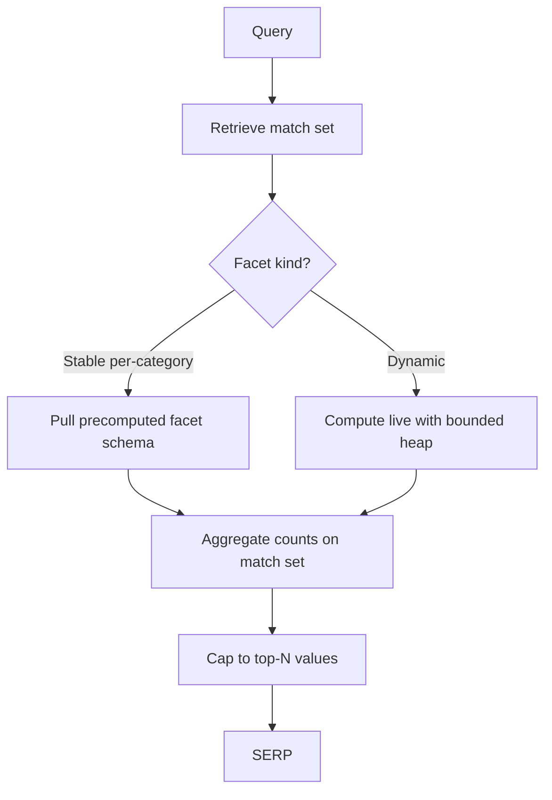
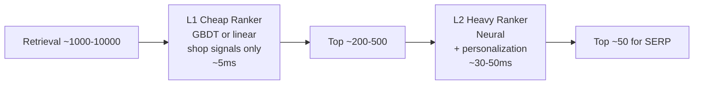
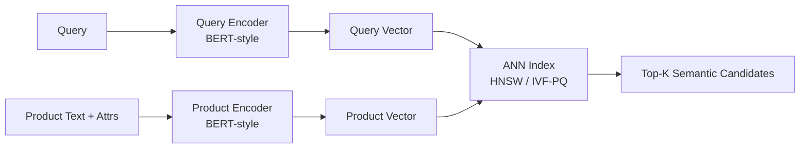
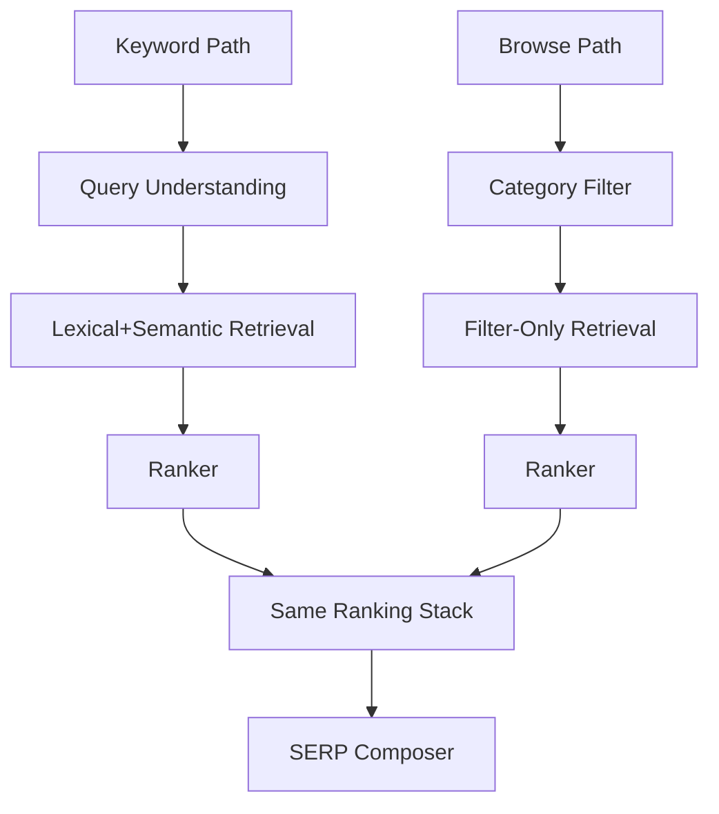

# Amazon Deep Dive — Search and Browse Index

**Date:** 2026-04-30 | **Updated:** 2026-04-30
**Tags:** `system-design` `case-study` `amazon` `deep-dive` `search` `e-commerce`

> Companion to [Design Amazon E-commerce](../design-amazon-ecommerce.md), expanding the *Search and Browse Index* deep-dive subsection.

## Table of Contents

- [Summary](#summary)
- [Overview](#overview)
- [A9 Search Engine](#a9-search-engine)
- [Attribute Index](#attribute-index)
- [Facet Computation](#facet-computation)
- [Ranking Layer](#ranking-layer)
- [Spell Correction](#spell-correction)
- [Sponsored Ads Injection](#sponsored-ads-injection)
- [Semantic Search via Embeddings](#semantic-search-via-embeddings)
- [Browse vs Keyword Search](#browse-vs-keyword-search)
- [Out-of-Stock Handling](#out-of-stock-handling)
- [Q&A and Review Indexing](#qa-and-review-indexing)
- [Anti-Patterns](#anti-patterns)
- [Related](#related)
- [References](#references)

## Summary

Amazon's product search is not a generic web-search engine that happens to look at products — it is a **commerce-ranking engine** whose every decision is calibrated against expected revenue per query, not just topical relevance. The retrieval substrate is a doc-partitioned inverted index over ~600 M SKUs, but on top of that sits a stack that no general web search has to deal with: a structured **attribute index** (price, brand, rating, Prime-eligible, hundreds of category-specific facets) that powers the left-rail filters; a **multi-objective ranking** layer that blends BM25 relevance with sales rank, conversion rate, price, review signals, and Buy Box ownership; a **sponsored-ads** injection step that interleaves auctioned slots with organic results under strict UX constraints; **spell correction and synonym expansion** tuned on shopping queries (which are short, brand-heavy, and full of misspelled product names); a **semantic retrieval** path using two-tower embedding models to rescue queries where lexical match fails; and **out-of-stock handling** that has to choose between suppress, demote, or show-with-alternatives without trashing the merchandising signal. Reviews and Q&A are indexed in their own corpora and joined back at query time. The design that emerged from this is "A9" — the legacy internal name for Amazon's search platform — and it is the front door of the entire commerce funnel: search drives the majority of product discovery, and a millisecond of latency or a basis point of relevance translates directly to top-line revenue. This document opens up that layer below the parent HLD and walks each subsystem with the trade-offs Amazon's own published research describes.

## Overview

The parent case study (`design-amazon-ecommerce.md` § 2) sketches the search subsystem as an indexing pipeline + scatter-gather retrieval + two-stage ranker + facets. The questions that document leaves on the table are the ones this deep-dive answers:

1. **What is A9?** Where does the legacy name come from, what does the platform actually own, and how is its architecture different from a general-purpose web search index?
2. **Where does the attribute index live, and how does it interact with the inverted text index?** Are they the same Lucene/OpenSearch index, two separate stores, or a hybrid?
3. **How are facets computed at query time without blowing the latency budget?** What is precomputed, what is per-query, and how do hard caps work?
4. **What does the ranking layer actually optimize?** Click? Purchase? Revenue? All of the above, weighted how?
5. **What does spell correction look like for shopping queries?** Why is it harder than web spell correction?
6. **How are sponsored ads injected without lying to the user?** What separates a Sponsored slot from an organic one operationally?
7. **What did Amazon's published product-retrieval papers actually do?** The two-tower embedding work, the semantic retrieval pipeline, the offline + online evaluation loop.
8. **What's the real difference between browse and keyword search?** They look the same in the URL but the retrieval shape differs.
9. **How does out-of-stock get handled?** Suppress, demote, or surface with alternatives — and how is that decision made per category?
10. **How do reviews and Q&A get into the index?** What's keyword-searchable, what's semantically indexed, and where do they show up in ranking?

The general inverted-index sharding mechanics are covered in the Google deep-dive [`../../search-aggregation/google-search/inverted-index-sharding.md`](../../search-aggregation/google-search/inverted-index-sharding.md) and the building block [`../../../building-blocks/search-systems.md`](../../../building-blocks/search-systems.md). This doc assumes those and focuses on what is *commerce-specific*.

## A9 Search Engine

"A9" is the original internal name of Amazon's product search platform — the team and the engine, named for the company A9.com that Amazon spun up in Palo Alto in 2003 to build search and was later folded back into Amazon proper. The name lives on internally as shorthand for the search stack even though the product-search team has reorganized many times since. Public references — Amazon Science blog posts, conference talks, papers from Amazon Search researchers at SIGIR/KDD/EMNLP — describe it as a multi-tier retrieval and ranking pipeline rather than a single black box.


**What A9 owns:**

- The search index (text + structured attributes + ranking signals).
- The query-understanding pipeline (spell, synonym, segmentation, category prediction, intent classification).
- The retrieval layer (lexical + semantic).
- The ranking stack (L1/L2 with personalization features).
- The browse experience (which is structurally a constrained-filter query into the same index).
- Auto-complete / suggest service.
- Sponsored Products auction and ad-injection (or the contract surface to the ads team — this varies by org structure over the years).
- Index freshness (catalog + price + inventory ingestion into the index).
- Offline evaluation harness, A/B testing infrastructure, and relevance judgment pipelines.

**What it does *not* own:**

- The catalog source-of-truth (that's the Catalog Service; the index is a *projection*).
- Inventory-of-record (Inventory Service; the index carries a denormalized in-stock flag).
- Ranking *signals* themselves — popularity, conversion rates, click logs, etc. — are produced by a feature/data platform; A9 consumes them via a feature store.
- The product detail page; A9 hands off SKUs and lets the catalog/PDP service render.

**Why a dedicated platform and not just "Elasticsearch over the catalog":** generic search engines optimize for topical relevance over a homogeneous corpus. A commerce search has to:

1. Re-rank the same query result set every few hours as prices change, inventory shifts, and conversion data updates.
2. Treat *every* result as having a structured attribute schema that the user wants to filter on.
3. Solve a multi-objective ranking problem where "the most relevant result" is not the answer — "the result the user is most likely to *buy*" is.
4. Inject auctioned ads with a disclosed-but-not-jarring user experience.
5. Handle queries that are 90% navigational ("airpods pro 2") and 10% exploratory ("birthday gift for nephew age 8") with the same surface.
6. Stay correct in the face of seller-supplied content (titles stuffed with keywords, mis-categorization, hallucinated attributes).

Each of these requires custom logic that bolts onto the index. Hence: a platform.

**Scale shape.** Public references to A9-era infrastructure describe thousands of servers, hundreds of TBs of index, billions of queries per day, and indexing latency targets in seconds for hot-path updates (price, inventory) and minutes for full-document refresh. The platform supports international locales — every Amazon retail site (US, UK, DE, JP, IN, BR, etc.) is its own search instance with locale-specific analyzers, ranking models, and ads inventory, but on shared infrastructure.

**Indexing pipeline shape.** Catalog write events fan out to Kafka/Kinesis. An indexer consumer joins the catalog document with current price, inventory, and ranking signals from the feature store, then emits an upsert to the search index. The pipeline runs in priority lanes — price/inventory updates flow through the fast lane (sub-5-second latency); full-document re-index runs through a slower lane that handles the long tail of attribute and description changes. Blue/green re-indexing handles schema migrations: build a new index alongside the old, replay the change log, atomically flip an alias when warm, retain the old index for fast rollback.

## Attribute Index

A product is not a blob of text. It is a structured record: `price`, `brand`, `rating_avg`, `rating_count`, `prime_eligible`, `in_stock`, `category_path`, plus *per-category* attributes (electronics has `connectivity`, clothing has `size` and `material`, books have `author` and `format`). The attribute index is what makes filters fast and what lets ranking blend lexical relevance with structured signals.

**Hybrid index layout.** The text fields (title, bullet points, description, search keywords) are stored in the inverted index for BM25 retrieval. Structured attributes are stored alongside as **doc-values** — columnar per-document fields that support fast filtering and sorting. In Elasticsearch / OpenSearch terms this is the standard mapping with `text` for full-text and `keyword` / `numeric` / `boolean` / `nested` for structured attributes.

```text
Index mapping (illustrative):
  title:           text (analyzed, multi-language analyzers)
  brand:           keyword (exact match, faceted)
  category_path:   keyword[] (hierarchical, e.g., ["electronics","computers","keyboards"])
  price:           scaled_float (ranged filter, sort)
  rating_avg:      half_float
  rating_count:    integer
  prime_eligible:  boolean
  in_stock:        boolean
  attributes:      nested (key/value, per-category schema)
  boost_signals:   rank_feature[] (popularity, conversion, freshness)
  embedding:       dense_vector (semantic retrieval)
```

**Why nested attributes, not flat.** Per-category attributes don't share a schema globally — a `size` for shoes is not a `size` for memory cards. Storing them as `nested` documents (ES `nested` type) preserves the key/value pairing without polluting the top-level mapping with thousands of fields. The cost is a slightly more expensive query rewrite when filtering on attributes; the benefit is a coherent index that doesn't have a mapping explosion.

**Why split highly volatile fields.** Price and inventory change orders of magnitude more often than the catalog body. Two patterns are used in practice:

1. **In-place partial updates** to the index document for hot fields (Elasticsearch supports painless scripts and update-by-query). Fast but adds index pressure on every price tick.
2. **Side-table joins at query time** — keep `price` and `in_stock` in a low-latency KV store (DAX / Redis) and join post-retrieval, before ranking. Lower index churn, slightly higher per-query cost.

Amazon-scale systems tend to use a hybrid: keep a *snapshot* of price / inventory in the index for filtering and ranking (refreshed every few seconds via a fast lane), with the canonical truth elsewhere. The index is allowed to be a few seconds stale on price; the cart and PDP re-validate at checkout.

**Custom analyzers.** Commerce text analysis differs from general web search:

- Brand-aware tokenization (`Logitech G Pro X` should not tokenize naively into `logitech`, `g`, `pro`, `x` and lose the model identifier).
- Number/unit handling (`128GB`, `1080p`, `15.6"`, `XL`).
- Synonym dictionaries per category (`tv` ↔ `television`, `laptop` ↔ `notebook`, `pop` ↔ `soda` regionally).
- Multi-language analyzers when the same index serves multiple locales, with locale-aware stemming.

**Forward-index for ranking signals.** In addition to inverted postings, the index stores per-document forward fields: popularity score, sales rank, conversion rate per category, recency-of-listing, average review score. These are pulled into the ranking function as features without a separate fetch.

**Per-category index templates.** Different categories have different "shapes" — books need `author`, `isbn`, `format`; electronics need `model_number`, `connectivity`. Putting all of them in one mapping creates a sparse-field explosion (most products have 5% of the fields populated). The fix is **index templates per category root**: the search system maintains a small number of index "shapes" (electronics-shape, fashion-shape, media-shape, generic-shape), and each product is routed to the appropriate template at index time. Cross-category queries fan out across templates and merge.

**Ranking-feature freshness.** Some signals (popularity, conversion rate) are computed offline and updated daily; others (price, in-stock, Buy Box winner) update continuously. The index stores the slow-moving signals as full fields refreshed daily, and looks up the fast-moving ones from a side table at query time. The trade-off is one network hop per query for fast signals — usually negligible because the side store is co-located.

For the difference between text-and-attribute hybrid indexes and pure inverted indexes, see [`../../../building-blocks/search-systems.md`](../../../building-blocks/search-systems.md). For the catalog source-of-truth that feeds this index, see [`./catalog-service.md`](./catalog-service.md).

## Facet Computation

The left rail of every Amazon search page is a stack of filters: price ranges, brands, ratings (4★ and up, 3★ and up), Prime eligibility, color/size/etc. Each filter shows the **count** of matching products for that facet value. Computing those counts on every query, accurately, within the latency budget, is a non-trivial engineering problem.

**The naive approach: aggregate at query time.** Run the user's query, collect the matching doc set, then for each facet field aggregate the counts. Elasticsearch aggregations / OpenSearch facets do exactly this. For a query that matches 100 K products with 20 facet fields and 50 brands, the aggregation runs over the full match set on every query.

**The latency problem.** The match set for a broad query like `electronics` is millions of documents. Aggregating brand counts over millions of docs per query, every query, is too expensive. Two mitigations:

1. **Hard caps on facet cardinality.** Show only the top-N values per facet (top 20 brands by count, with a "see all" expansion link). Internally, use a heap-based bounded aggregation that streams docs and keeps top-N counts.
2. **Approximate aggregation.** HyperLogLog-style sketches for cardinality, with the trade-off that low-count facet values may be slightly off. Amazon UX hides this — the count next to a facet is rounded ("1,000+") for high-count categories.

**Precomputed category facet sets.** For browse pages (which are queries pinned to a category path), the facet definitions are stable: keyboards have a `switch type` facet, keyboards always have a `layout` facet. The set of facet *values* and their *categories* are precomputed and stored as part of the category metadata. The query time work is just counting within the category.

**Tiered facet computation.**



**Caching facet results.** Browse queries repeat heavily — the URL `/s?bbn=electronics&prime=1&rh=p_72:4` is the same for thousands of users. Cache the *facet result* keyed by the canonicalized query + filter set, with a short TTL (minutes). Hit rates are high enough that most browse facet computations come from cache.

**Faceting on nested attributes.** When attributes are stored as nested key/value docs, facet aggregation has to navigate the nesting (`nested` aggregation in ES). This is more expensive than top-level facets. Mitigation: hoist the *most-used* per-category attributes (the ones Amazon's analytics show users actually filter by) up to the top-level mapping per category-tuned index template, so facet aggregation runs on flat fields.

**Drill-down vs hide-zero.** When the user applies a filter (`brand=Keychron`), the other facets re-aggregate over the filtered set. The product question is: do you show only facets with non-zero matches in the filtered set ("hide-zero"), or also show zero-match facets so the user can see what would broaden their search ("show-all")? Amazon mostly hides zero, with a "see more" affordance. This decision changes the aggregation: `hide-zero` lets the engine post-filter; `show-all` requires a second aggregation over the unfiltered set.

## Ranking Layer

A single relevance score is not enough. A user typing `bluetooth headphones` does not want the *most lexically relevant* product (a no-name listing that happens to repeat `bluetooth headphones` in the title); they want the product they are *most likely to buy and be satisfied with*, which requires combining many signals.

**Multi-objective scoring.** The ranking function is a learned combination of:

- **Lexical relevance** — BM25 over title, bullets, search keywords; field-weighted (title >> description).
- **Sales rank / popularity** — how often this product sells in this category; a strong prior, but anchored to category to avoid books drowning out electronics.
- **Conversion rate per query** — historical click-through-and-purchase rate when users typed *this* query (or a similar one) and saw *this* SKU. The single most predictive signal once it's available.
- **Price** — not a direct sort signal, but enters as a feature: cheaper products convert higher *given* relevance.
- **Review signals** — `rating_avg`, `rating_count`, recent-review velocity. Filters out new low-quality listings.
- **Buy Box ownership** — for a SKU with multiple sellers, the seller currently winning the Buy Box (best price + Prime + seller reputation) gets the surface. Ranking treats the offer, not just the SKU.
- **Prime / shipping speed** — Prime-eligible SKUs get a measurable boost because Prime members convert higher on Prime offers.
- **Recency / freshness** — new listings get a small boost in some categories (electronics, fashion) where novelty matters; not in commodities.
- **Personalization** — purchase history, browse history, demographic affinity. Pulled from feature store at query time.

**Two-stage ranking.**



L1 cuts the candidate pool from thousands to a few hundred using cheap features (no per-user fetches). L2 does the expensive work — pulls user features from the feature store, runs a neural model with cross-features (user × item), produces the final ordering.

**Why two stages.** A single heavy model over 10 K candidates is too slow. A single light model misses the gains from personalization and complex feature interactions. The two-stage pattern is universal in modern recommendation/search systems and has the same shape as Google's first-pass + reranker (see [`../../search-aggregation/google-search/ranking-signals.md`](../../search-aggregation/google-search/ranking-signals.md)).

**Loss function — what does the model train to predict?** Common targets:

- Click-through (clicks per impression).
- Purchase-through (purchases per impression — sparser, lower noise per event).
- Revenue per impression — combines purchase probability with price.
- Multi-task: predict click, add-to-cart, and purchase jointly with shared lower layers (parameter sharing improves the rare-event predictions).

Amazon's published work tends toward multi-task models with revenue or purchase-weighted losses, calibrated against business metrics rather than NDCG-on-relevance-judgments alone.

**Buy Box ranking nuance.** A SKU with 12 sellers shows up in search as one card. Behind the card, the Buy Box winner is decided per request (price, Prime status, seller reputation, fulfillment latency). Search ranking treats the *offer* — meaning ranking sees the Buy Box winner's price, which can change between renders. Ranking signals therefore include the live Buy Box state, joined post-retrieval.

**Diversity policy.** A query for `running shoes` whose top 50 organic results are all Nike is *relevant* but *bad*. A diversity layer applies a soft penalty for over-representation of a single brand or category in the top results. Implemented as a re-ranking pass after L2 with a maximum-marginal-relevance-style algorithm (or a learned diversity model in newer systems).

**Position bias correction.** Click-through models trained on logged data inherit *position bias* — top-positioned results get more clicks because they are top-positioned, not because they are better. Inverse-propensity-scored training, or explicit position features, correct for this. Amazon's own published research has discussed this in the context of e-commerce search ranking.

**Counterfactual evaluation.** Before shipping a new ranker, the team evaluates it offline against logged interaction data. Direct replay is biased (the logs were generated by the *current* ranker, not the new one). Counterfactual estimators — IPS (inverse propensity scoring), doubly-robust estimators — give an unbiased estimate of how the new ranker *would have* performed, given the data. Online A/B tests then validate the offline estimate on real traffic.

**Calibration vs ordering.** A ranker that orders correctly may still produce poorly-*calibrated* probabilities (predicted purchase rate of 5% when the true rate is 8%). Calibration matters because the ad auction and the diversity layer both consume predicted probabilities, not just orderings. Isotonic regression or Platt scaling on a held-out set produces calibrated outputs without changing ordering.

For the broader ranking-signals taxonomy that applies cross-domain, see [`../../search-aggregation/google-search/ranking-signals.md`](../../search-aggregation/google-search/ranking-signals.md).

## Spell Correction

Shopping queries are short, brand-heavy, and frequently misspelled. `keurg` for `keurig`, `samsong` for `samsung`, `iphine` for `iphone`. Web spell correction is partly about typos and partly about disambiguating intent; commerce spell correction is mostly about catching typos before they zero out the result set.

**The noisy-channel model.** Treat the misspelled query as a noisy version of an intended query. Score candidate corrections by `P(correction | query) ∝ P(query | correction) × P(correction)`. The error model `P(query | correction)` is trained on confusion patterns (transpositions, single-character substitutions, phonetic edits). The language model `P(correction)` is the prior probability of a correctly-spelled query, learned from the query log.

**Why the query log is gold.** The most reliable signal is *what people actually search for*. A query log with billions of entries gives the language model and reveals the natural correction pairs (`keurg` → `keurig` is observed when a user types `keurg`, gets bad results, immediately re-types `keurig`, and clicks). These query-pair logs are the training data.

**Brand and product-name dictionary.** A general English spell-checker corrects `iphone` to `phone` because `iphone` is not a common English word. Commerce spell-checkers must include a brand/product/category dictionary as a high-prior corpus so brand names are *not* corrected away. The dictionary is updated continuously from the catalog (any new brand becomes part of the lexicon).

**Did-you-mean vs auto-replace.** Two policies:

1. **Auto-replace.** Quietly run the corrected query and show a small "Showing results for X. Search instead for Y." banner. Used when the correction confidence is high.
2. **Did-you-mean.** Run the original query, show a "Did you mean Y?" suggestion above the results. Used when confidence is medium.

The threshold is tuned per-language and per-category. False corrections (taking a real query and "fixing" it to something else) damage trust and are heavily penalized in offline evaluation.

**Phonetic and keyboard-distance fallbacks.** When the query log has no signal for a misspelling, fall back to phonetic encoding (Soundex / Metaphone) and keyboard-adjacent edits (`s` → `a` because they're neighbors). Useful for the long tail of new misspellings.

**Multilingual.** A user typing in Hindi-Roman transliteration (`mobile cover`) versus Devanagari needs different correction logic. Per-locale spell models are trained from per-locale query logs.

**Query segmentation.** Short queries like `iphonecase` or `bluetoothspeakerwaterproof` need segmentation before correction (`iphone case`, `bluetooth speaker waterproof`). Run segmentation as a pre-step using a vocabulary-aware Viterbi decoder over the catalog lexicon, then apply spell correction on each segmented token.

**Zero-result rescue.** When a corrected query still returns zero results (or a very small set), the system relaxes one constraint at a time — drop a token, broaden a category — until results appear, surfaced under "We didn't find X, but here are similar items". The relaxation policy is learned from logged behavior: which token to drop first depends on which token is most likely to be the cause of zero recall.

## Sponsored Ads Injection

Sponsored Products are interleaved into search results. Sellers bid on keywords (or auto-targeted by ASIN); the auction happens at query time; winners are shown in marked Sponsored slots above, within, and below the organic results.

**The auction.** A sealed-bid auction runs per query. Each candidate ad has:

- A bid (max CPC the seller is willing to pay).
- An expected click-through rate (predicted by an ML model from query features, ad features, and user features).
- An expected purchase rate (deeper signal, because Amazon optimizes for revenue, not just clicks).

The auction ranks ads by **bid × predicted-conversion** (a simplification; real implementations include quality-score multipliers, frequency-capping, advertiser budget pacing). Top-K ads are eligible for the Sponsored slots.

**Slot selection.** Sponsored slots are at fixed UI positions (top-of-page row, mid-page row, bottom row). The ranker decides which ads go in which slots based on slot-specific click-through models — the same ad converts differently in slot 1 vs slot 17.

**Organic + sponsored interleaving.** Two design choices that look subtle but matter operationally:

1. **Sponsored slots are explicitly labeled "Sponsored".** Required by FTC / consumer-protection rules in most markets and a long-standing UX commitment.
2. **Organic ranking is computed independently of ads** for relevance integrity. Mixing ad CPC into organic ranking would be a dark pattern. The two are produced separately and the SERP composer interleaves them.

**Cannibalization controls.** A common failure mode: a Sponsored ad for product X appears at the top, and product X also wins the organic top slot. The user sees the same product twice. Dedup logic at the SERP composer suppresses the organic copy when the ad is positioned above it (or vice versa), with care to preserve the right billing event.

**Frequency capping and pacing.** An advertiser's daily budget is paced across the day so they don't burn it in the first hour. Ads with exhausted budgets drop from the auction. Frequency caps prevent the same ad showing to the same user dozens of times.

**Latency budget.** Ads inject ~5–20 ms of additional latency depending on the auction model complexity. Ad services run as a peer of organic search and the SERP composer fans out to both in parallel, then merges.

**Brand defense vs brand attack.** A seller can bid on competitors' brand keywords (`samsung tv` may surface a Sony ad). Marketplace policy dictates what's allowed; the auction implementation is the same.

For ad-tech architectures more broadly (auctions, real-time bidding, attribution), see the ad-tech case studies in this repo (if present) or the parent design.

## Semantic Search via Embeddings

Lexical retrieval (BM25) misses queries where the user's words and the product's words don't overlap. `noise canceling earphones` should match products titled `wireless headphones with active noise cancellation`. Stemming and synonyms cover some of this; **dense embedding retrieval** covers the rest.

**Two-tower architecture.** A query encoder maps the query text to a dense vector; a product encoder maps the product (title + bullets + attributes) to a vector. Similarity is dot product or cosine. Both encoders are trained jointly so that **(query, purchased-product)** pairs have high similarity and **(query, ignored-product)** pairs have low similarity.



**Offline product encoding.** Product vectors are precomputed for the entire catalog (~600 M SKUs) — too expensive to compute live. They live in an approximate-nearest-neighbor (ANN) index: HNSW (Hierarchical Navigable Small World), IVF-PQ (Inverted File with Product Quantization), or ScaNN. ANN trades a small recall loss for orders-of-magnitude lower latency vs exact NN.

**Online query encoding.** The query encoder runs at request time on a model server. Modern transformer-based encoders are small enough (distilled BERT, ~100 MB models) to serve at low single-digit ms with batching.

**Hybrid retrieval.** Lexical and semantic retrieval each return their own candidate set; the union (or a learned merge) feeds the ranker. The hybrid path is critical: pure semantic retrieval drops on **brand exact-match queries** (where lexical is exactly right); pure lexical retrieval drops on **descriptive queries** (where semantic shines).

**Amazon's published work.** Papers from Amazon researchers at SIGIR, KDD, and EMNLP have described:

- Two-tower models for semantic product retrieval, trained on click and purchase logs.
- Query understanding models that classify intent (navigational vs exploratory) and route to different retrieval strategies.
- Models that handle the "vocabulary gap" between how users describe products and how sellers title them.
- Multi-modal retrieval combining text and image embeddings (image-text contrastive models for product matching).

See the [Amazon Science blog](https://www.amazon.science/) for ongoing publications; the search and recommendations sections list the current research.

**Cold-start for new products.** A brand-new SKU has no engagement data, so a model that requires click signals can't embed it well. Mitigation: content-only encoders (text + image) initialize the embedding from the product description and image, which is enough until engagement data accumulates.

**Embedding refresh cadence.** Product embeddings drift as the encoder is retrained. Full-catalog re-embedding is expensive; incremental updates run nightly, with a full retrain on a slower cadence (weekly or monthly). The ANN index supports incremental upserts so a new product is searchable within minutes, not days.

**Personalized embeddings.** Some teams produce per-user query embeddings (the same query from two users can mean different things). This adds personalization at retrieval, not just at ranking. Cost: more parameters and per-user state in the query path.

**Negative sampling matters.** Two-tower models are trained on (query, purchased product) positives and (query, ignored product) negatives. The choice of negatives is decisive: random negatives are too easy and produce a model that fails on hard cases. **In-batch negatives** (other purchased products in the same training batch) and **hard negatives** (products that ranked highly under the *previous* model but were not purchased) drive most of the quality improvement in published Amazon and adjacent industry work.

**Distillation for serving cost.** A 12-layer BERT encoder is too slow to serve at peak QPS. Distillation into smaller student encoders (4-layer, 6-layer transformers) preserves most of the retrieval quality at a fraction of the FLOPs. The teacher model is used offline for hard-example mining; the student is what runs in production.

**Drift monitoring.** Embedding-based retrieval can silently drift when the encoder is retrained. Per-query metrics (recall@K against a held-out judgment set, query-level diff between old and new embeddings) gate the rollout. A new encoder that improves average metrics but tanks a single high-volume head query (`iphone`) is a regression that A/B testing alone may not catch — explicit per-query guardrails are required.

## Browse vs Keyword Search

Browse and keyword search look identical in the SERP, but they reach the index through different paths.

**Keyword search.** User types `mechanical keyboard`. Query understanding parses it; retrieval runs lexical + semantic; ranking combines relevance and shop signals; results come back.

**Browse.** User clicks on the `Electronics > Computers > Keyboards` category in the navigation. The URL is something like `/s?bbn=electronics&node=12345` (with a category node id). The retrieval is a **structured filter query**: `category_path:keyboards AND in_stock:true`. There is no text query.



**The same ranker, different inputs.** Both paths terminate at the same ranking layer. The difference is the candidate pool: keyword search has a small, query-relevant pool; browse has a large category-bounded pool. Browse's *default sort* is "Featured" (which is shop-signal-heavy ranking); keyword search's default is "Most relevant" (lexical-and-semantic + shop signals).

**Browse-specific considerations:**

- **Bigger candidate pool.** A category like `Books` has tens of millions of products. The L1 ranker absorbs most of the cut here.
- **Stronger reliance on popularity.** No query relevance signal exists, so popularity, sales rank, and conversion-rate-in-category drive the ordering.
- **Heavier facet usage.** Users in browse mode filter aggressively. Facet computation must be tight.
- **Editorial slots.** Some categories have curated picks (`Editor's Choice`, `Best Sellers`) that anchor the top of browse results. These are a separate retrieval source merged in.

**Hybrid: keyword + category.** A query like `mechanical keyboard` typed inside the `Electronics` department combines both: the lexical retrieval is constrained to the department. This is the most common path; pure unscoped search is less common than catalog navigators expect.

**Search-within-results.** A user on a browse page who refines with a search box stays in the same scope. The system stacks the category filter with the new keyword query.

**SEO for browse pages.** Browse URLs are the index pages search engines like Google crawl most heavily. SEO logic produces canonical URLs, meta tags, and structured data (schema.org/Product) that are different from the API the JS app uses internally. The browse retrieval produces the same product set; the rendering for crawlers is server-side and cached.

## Out-of-Stock Handling

When a SKU goes out of stock, what does search do? The naive answers are wrong:

- **"Suppress entirely"** loses an SEO-valuable URL and frustrates users who would happily wait.
- **"Show like nothing happened"** trains the user to bounce off Amazon when they click and discover OOS at the PDP.

The right answer is **per-category, per-availability-state policy**.

**Availability states:**

- `in_stock` — ship now.
- `low_stock` — "Only 3 left". Show with urgency hint; do not demote.
- `oos_temporary` — out now, expected back within N days. Demote and tag.
- `oos_indefinite` — back-in-stock unknown. Demote heavily, suggest alternatives.
- `discontinued` — never coming back. Suppress from search; keep PDP for SEO and historical reviews; surface alternatives prominently.

**Policy decisions per category:**

- **Books, media:** OOS-tolerant. A book with a 2-week restock should still show — users will preorder. Demote slightly, never suppress.
- **Electronics:** OOS-aversive. A keyboard that's OOS for an unknown duration frustrates users; suppress or push hard alternatives.
- **Fashion:** Size-level OOS is the norm. Show the SKU but mark sizes individually; let user select an in-stock size.
- **Grocery / consumables:** Highly time-sensitive. Suppress OOS hard; users won't wait.

**Implementation.** The `in_stock` and `availability_state` fields are part of the index. The query has a default filter (`in_stock:true OR availability_state IN ('low_stock','oos_temporary')`). Demotion is implemented as a ranking feature (`oos_penalty`) that the L1/L2 models consume.

**Inventory-to-index latency.** A SKU sells out at 12:00:01. By 12:00:02, the inventory service knows. By 12:00:03, the change should be in the index. Tighter than that is hard; looser than that is unacceptable on hot SKUs during sales. The price/inventory update lane is a high-priority indexer path (separate from the slower full-document re-index path) that hits sub-5-second indexing latency in normal conditions.

**Show-with-alternatives.** When an OOS SKU appears, the SERP card surfaces "Similar items in stock" inline. The alternatives come from a recommendation lookup (semantic embedding nearest-neighbors over in-stock products) and are computed at SERP composition.

**Backorder and restock notify.** A "Notify me when back in stock" CTA captures intent without requiring the SKU to be listed normally. The notify queue is part of the inventory subsystem; search just needs to render the CTA.

**Geo-aware availability.** A SKU may be in stock in one fulfillment region and out in another. Search must reflect the user's shippable-FC set, not a global flag. The index carries `in_stock_regions` as a multi-valued field; the query filters on the user's current region. This blows up the matrix size but is essential for accuracy — showing a US-only SKU to a Canadian user as "in stock" trains them to bounce.

**OOS as a ranking feature, not a filter.** A pure filter (`in_stock = true`) is a hard cliff. As a ranking feature with a tunable penalty, the same signal can promote in-stock alternatives to the top while still letting the OOS-but-iconic SKU appear lower (with the "back-in-stock notify" CTA). The right balance is per-category: commodities take the hard filter, branded electronics take the soft demote.

## Q&A and Review Indexing

Reviews and customer Q&A are a search corpus in their own right. Two distinct uses:

1. **Within-product search** — the user is on a PDP, types in the review search box "battery life", and gets only reviews mentioning battery life.
2. **Cross-product search** — review content participates as a signal in the main product search ranking, and review snippets appear in SERP cards.

**Review index.** Reviews are stored in a per-product review corpus, with their own inverted index. Fields: `review_id`, `sku`, `rating`, `text`, `helpful_count`, `verified_purchase`, `review_date`, `language`. Review search uses BM25 plus helpfulness-weighted ranking; verified-purchase reviews rank higher.

**Aspect extraction.** A common pattern: extract aspects (`battery`, `screen`, `build_quality`) from reviews using NLP, aggregate sentiment per aspect per product, and surface them as filterable chips ("Reviews mentioning: battery life ⭐ 4.2"). The aspect extraction is offline and cached; query-time work is just lookup.

**Review snippet selection in main search.** A SERP card may show a one-line snippet from a review ("Lightweight and great battery life"). The snippet is selected at index time per product: the most-helpful review for the product, sentence-segmented, top-ranked sentence by length-and-positivity heuristic.

**Review signals in product ranking:**

- `rating_avg` and `rating_count` are first-class ranking features.
- Recent-review velocity (reviews per week, with sentiment) flags trending products.
- Verified-purchase ratio filters out review-bombing or shill reviews.

**Q&A index.** Customer questions and seller/customer answers form a separate small corpus per product. Indexed for in-page search and for the "Frequently asked questions" widget. Q&A appears less commonly in main product search, but the question text is a strong long-tail-query magnet for SEO ("does this fit my 2019 model car?" is a search query before it's a question).

**Moderation and indexing.** Reviews and Q&A pass through the same content-moderation pipeline as user-generated content. Only `published`-state items are indexed; pending or removed items are absent. A removal triggers a delete-by-id in the index.

**Multi-language.** A product sold in multiple locales has reviews in multiple languages. Per-language inverted indices avoid analyzer mismatch (English stemmer ruining German words). Cross-language retrieval — searching English reviews with a French query — uses the same embedding-based retrieval as the main product search.

## Anti-Patterns

1. **One giant Lucene index for catalog text + structured attributes + reviews + Q&A.** Different update cadences, different latency budgets, different analyzers. Split them.
2. **BM25-only ranking.** Lexical relevance alone gets cut by `keyword-stuffed seller titles` and ignores the conversion signal that drives revenue. Multi-objective ranking is mandatory.
3. **Aggregating facets over the full match set on every query.** The aggregation cost dominates the query budget. Cap, precompute, and cache.
4. **Letting price be a sort-only signal, not a ranking feature.** Price affects conversion and should be a feature in the ranker. "Sort by price" is a separate UI mode, not the ranking objective.
5. **Mixing ad CPC into organic ranking.** Dark pattern that destroys long-term relevance trust. Ads are a separate slot tier.
6. **Skipping spell correction on the assumption that users will retype.** Half of misspelled queries don't get retyped — they bounce. Spell correction is a recall-saving feature.
7. **Treating OOS as a binary "show or hide".** The right answer is per-category, per-state policy with demotion and alternatives.
8. **Re-embedding the entire catalog on every model retrain.** ~600 M docs × encoder cost is prohibitive nightly. Incremental embedding updates plus periodic full retrain.
9. **Pure semantic retrieval without lexical fallback.** Brand exact-match queries (`airpods pro`) are lexical; semantic-only retrieval mis-ranks them. Hybrid is required.
10. **Using the catalog's source-of-truth Postgres as the search index.** Postgres FTS / pg_trgm works for tiny catalogs. At ~600 M SKUs with thousands of QPS, the OLTP store cannot also serve search load.
11. **Indexing every catalog field.** The index should hold only what's needed for retrieval, filtering, sorting, and ranking. Long descriptions and high-resolution image URLs belong in the catalog read path.
12. **Synchronous re-indexing on every catalog write.** Bursty write traffic pegs the indexer. Use a Kafka-fed pipeline with priority lanes (price/inventory > attributes > description).
13. **No A/B testing harness for ranking.** Every ranking change must be evaluated against revenue and engagement on real traffic. Shipping a model without a holdout is a recipe for silent regressions.
14. **Personalization that isn't disclosed or controllable.** Users notice when search results follow them around. A way to "search without personalization" preserves trust.
15. **Letting sellers stuff the title with synonyms.** Title fields tokenize naively and reward keyword stuffing. Field weighting plus penalty features for low-quality titles (length, keyword density, brand mismatch) push back.
16. **Reusing the main index for review search.** Review documents have a different shape, different retrieval model, different ranking signals. Keep a separate review index.
17. **Treating browse as "search with empty query".** Default ranking, candidate pool, and facet logic all differ from keyword search. A separate code path keeps both clean.
18. **Updating the index in place for every price tick.** Price changes thousands of times per second across the catalog. Use a fast-lane partial update or a side-table join, not full document re-index.
19. **Forgetting that the index is a derived projection.** The catalog source-of-truth (see [`./catalog-service.md`](./catalog-service.md)) is the system of record. Index bugs should produce a *bad index that gets rebuilt*, never lost data.
20. **Same ANN index for all locales.** Embeddings for cross-locale data are not interchangeable. Per-locale ANN indices or locale-aware embedding spaces are required for international markets.

## Related

- [Design Amazon E-commerce](../design-amazon-ecommerce.md) — parent case study; this doc expands the *Search and Browse Index* deep-dive.
- [Catalog Service deep dive](./catalog-service.md) — the source-of-truth catalog that feeds the search index.
- [Google Search — Inverted Index Sharding](../../search-aggregation/google-search/inverted-index-sharding.md) — the doc-partitioned index mechanics that underlie A9's retrieval substrate.
- [Google Search — Ranking Signals](../../search-aggregation/google-search/ranking-signals.md) — the cross-domain ranking-signal taxonomy this doc builds on.
- [Search Systems building block](../../../building-blocks/search-systems.md) — Lucene/Elasticsearch fundamentals: term dictionary, posting lists, segments, BM25.
- [Caching Layers](../../../building-blocks/caching-layers.md) — facet-result caching and SERP caching patterns.
- [Recommendation Pipeline](../design-amazon-ecommerce.md#8-recommendation-pipeline) — adjacent surface that shares the feature store and embedding infrastructure.

## References

- [Amazon Science blog](https://www.amazon.science/) — ongoing publications from Amazon researchers, including Search and Recommendations sections covering semantic retrieval, query understanding, and ranking. The current research feed is the most authoritative public source on A9-area work.
- Amazon Science, ["Improving customer experience through semantic product search"](https://www.amazon.science/blog) — overview posts on two-tower embedding retrieval for product search (browse the Search tag).
- Nigam, Song, Mohan, Lakshman et al., ["Semantic Product Search"](https://arxiv.org/abs/1907.00937) (KDD 2019) — Amazon's two-tower model for semantic product retrieval, with click and purchase as training signals.
- Li, Lv, Jin, Lin et al., ["Embedding-based Product Retrieval in Taobao Search"](https://arxiv.org/abs/2106.09297) (KDD 2021) — adjacent industrial work on the same problem from Taobao; useful contrast on hybrid retrieval design choices and multi-grained semantic encoding.
- Reddy, Màrquez, Valero, Rao et al., ["Shopping Queries Dataset: A Large-Scale ESCI Benchmark for Improving Product Search"](https://arxiv.org/abs/2206.06588) (2022) — Amazon's public dataset for product search relevance, with the ESCI (Exact, Substitute, Complement, Irrelevant) labels used internally for evaluation.
- Manning, Raghavan, Schütze — [*Introduction to Information Retrieval*](https://nlp.stanford.edu/IR-book/) (Cambridge, 2008) — Chapter 7 ranked retrieval, Chapter 19 web search basics; foundational background for the BM25 + ranking layer.
- Elastic Search Labs, [search and relevance blog hub](https://www.elastic.co/search-labs/blog) — practical patterns for product search indexing, faceting, vector search, and personalized ranking on Elasticsearch.
- Elastic, ["Designing for scale"](https://www.elastic.co/guide/en/elasticsearch/reference/current/scalability.html) — sharding, replication, and re-indexing strategies for large product indexes.
- Croft, Metzler, Strohman — [*Search Engines: Information Retrieval in Practice*](https://ciir.cs.umass.edu/irbook/) (2015) — practitioner-oriented chapter on commercial search systems, ad integration, and ranking.
- Malkov, Yashunin, ["Efficient and robust approximate nearest neighbor search using Hierarchical Navigable Small World graphs"](https://arxiv.org/abs/1603.09320) (2016) — the HNSW algorithm behind most production ANN indexes for embedding retrieval.
- Johnson, Douze, Jégou, ["Billion-scale similarity search with GPUs"](https://arxiv.org/abs/1702.08734) (2017) — the FAISS / IVF-PQ work behind the alternative ANN approach.
- Reimers, Gurevych, ["Sentence-BERT: Sentence Embeddings using Siamese BERT-Networks"](https://arxiv.org/abs/1908.10084) (EMNLP 2019) — the encoder architecture pattern used in two-tower retrieval models.
- Karpukhin, Oğuz, Min et al., ["Dense Passage Retrieval for Open-Domain Question Answering"](https://arxiv.org/abs/2004.04906) (EMNLP 2020) — the dense-passage-retrieval framework that informs commerce semantic retrieval design.
- Joachims, Granka, Pan et al., ["Accurately Interpreting Clickthrough Data as Implicit Feedback"](https://www.cs.cornell.edu/people/tj/publications/joachims_etal_05a.pdf) (SIGIR 2005) — the foundational work on click-bias correction in ranking, which underlies modern position-bias-aware learning-to-rank systems.
- AWS, ["Amazon OpenSearch Service Best Practices"](https://docs.aws.amazon.com/opensearch-service/latest/developerguide/bp.html) — sharding, replica counts, and operational patterns for the managed search service that powers many AWS-hosted commerce search stacks.
- DynamoDB Developer Guide, ["Best Practices for Designing and Architecting with DynamoDB"](https://docs.aws.amazon.com/amazondynamodb/latest/developerguide/best-practices.html) — the catalog source-of-truth patterns that feed the search index.
