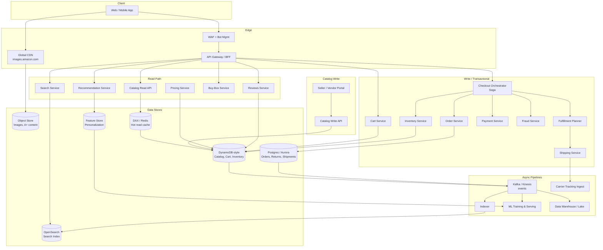
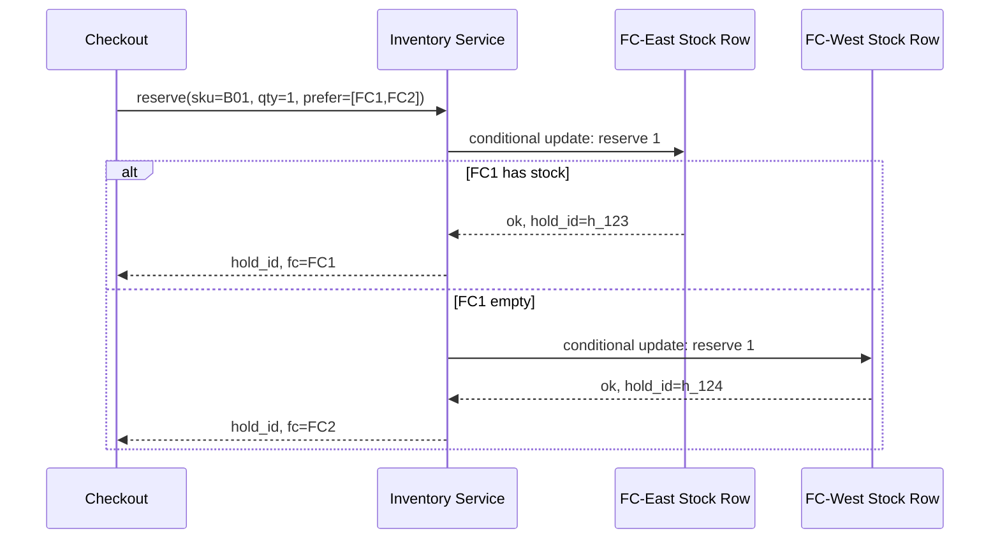
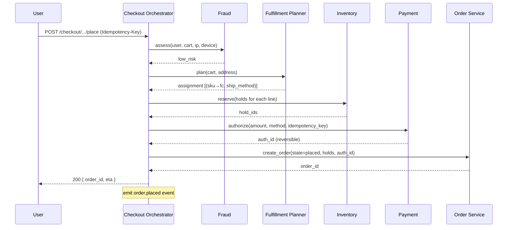
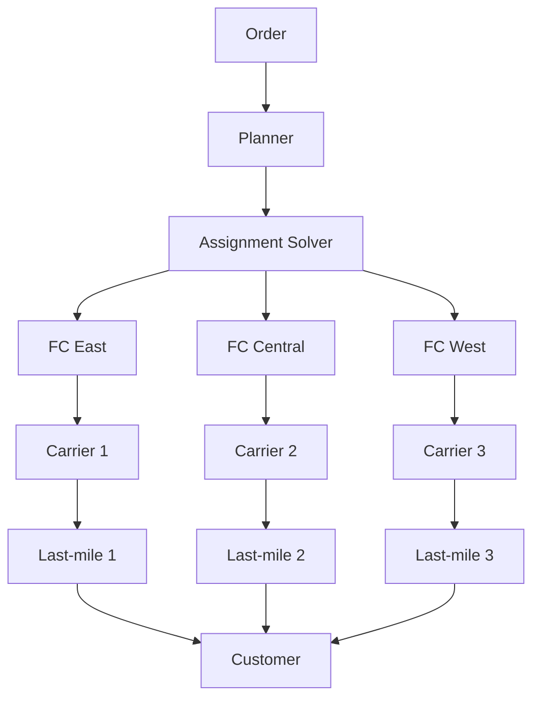

# Design Amazon E-commerce — Catalog, Search, Cart, Checkout, Orders, and Fulfillment at Planet Scale

**Date:** 2026-04-25 | **Updated:** 2026-04-25
**Tags:** `system-design` `case-study` `e-commerce` `medium`

## Table of Contents

- [Summary](#summary)
- [Functional Requirements](#functional-requirements)
- [Non-Functional Requirements](#non-functional-requirements)
- [Capacity Estimation](#capacity-estimation)
- [API Design](#api-design)
- [Data Model](#data-model)
- [High-Level Design](#high-level-design)
- [Deep Dives](#deep-dives)
  - [1. Catalog Service at Planet Scale](#1-catalog-service-at-planet-scale)
  - [2. Search and Browse Index](#2-search-and-browse-index)
  - [3. Inventory Consistency Across Warehouses](#3-inventory-consistency-across-warehouses)
  - [4. Cart Service — High-Availability Shopping State](#4-cart-service--high-availability-shopping-state)
  - [5. Checkout Saga and Order Placement](#5-checkout-saga-and-order-placement)
  - [6. Payment Integration](#6-payment-integration)
  - [7. Fulfillment Graph — Warehouses, Shipping, Last-Mile](#7-fulfillment-graph--warehouses-shipping-last-mile)
  - [8. Recommendation Pipeline](#8-recommendation-pipeline)
  - [9. Reviews and Q&A](#9-reviews-and-qa)
  - [10. Multi-Region Replication and Polyglot Persistence](#10-multi-region-replication-and-polyglot-persistence)
- [Bottlenecks & Trade-offs](#bottlenecks--trade-offs)
- [Anti-Patterns](#anti-patterns)
- [Related](#related)
- [References](#references)

## Summary

Amazon-scale e-commerce is the canonical "everything system." A single page view triggers hundreds of service calls across catalog, pricing, inventory, recommendations, reviews, ads, search, fraud, and personalization — Amazon's own engineers have publicly stated that rendering a product page can dispatch 100–150 service calls before HTML reaches the browser. The hard problems are not "store products" or "take payments." They are **keeping a product catalog with billions of SKUs queryable in milliseconds**, **reserving inventory across hundreds of fulfillment centers without overselling**, **executing a checkout that touches a dozen services and must be exactly-once with respect to charging the card**, **producing a fulfillment plan that picks the cheapest viable warehouse-shipping-carrier combination**, and **doing all of this across multiple regions with locally available reads, durable writes, and a coherent customer experience**.

This document is the *integration HLD* — the design that touches everything. Specialized concerns (flash sales, payment internals, multi-tenant marketplaces) are split out into sibling case studies and only summarized here.

The architectural through-line is **polyglot persistence**: a denormalized document store for the catalog (DynamoDB-style, descended from Amazon's Dynamo paper), a relational store for orders (transactional integrity matters more than horizontal write throughput), an inverted index for search (Elasticsearch / OpenSearch), key-value caches for hot reads (Redis / Memcached / DAX), an object store for media, a stream platform (Kinesis / Kafka) gluing async pipelines, and a graph-shaped fulfillment optimizer fed by a feature store and a constraint solver. Microservices, sagas, idempotency keys, and event-driven async work are not architectural decoration — they are the only way the math closes.

## Functional Requirements

**Identity and account**

- Sign up, sign in (email/password, federated, MFA), session management, password reset.
- Address book with multiple shipping addresses; default billing/shipping selection.
- Saved payment methods (tokenized card references, gift cards, store credit).
- Order history, returns history, support tickets.

**Browse and search**

- Browse by category tree, brand, department; faceted filters (price, rating, brand, Prime-eligible, color, size).
- Full-text search with autocomplete, spell correction, synonyms, ranked relevance.
- Personalized ranking: results re-ranked per user using purchase and click history.
- Sort by relevance, price, rating, newest, best-selling.

**Product detail page**

- Title, images, price, availability, delivery estimate, variant selector (size/color), specifications, A+ content.
- Buy box (which seller "wins" the offer for a given SKU and customer).
- Customer reviews and ratings; Q&A; "frequently bought together" and "customers also viewed."
- Stock indicator ("In stock", "Only 3 left", "Currently unavailable").

**Cart**

- Add/remove/update quantity; persists across devices for signed-in users; survives session expiry.
- Soft inventory check on add; hard check on checkout.
- "Save for later" and wishlist (separate from cart).
- Quantity limits per SKU per buyer; cart item count cap.

**Checkout**

- Address selection or new entry with validation.
- Shipping option selection (standard / 2-day / same-day / Prime).
- Payment method selection; gift card, promo code, and store credit application.
- Order review; "Place order" creates an order, reserves inventory, authorizes payment.
- Idempotent order creation (duplicate clicks must not double-charge).

**Order lifecycle**

- Order states: `placed → payment_authorized → released_to_fulfillment → picked → packed → shipped → out_for_delivery → delivered`.
- Order modification window (cancel/edit address) before release-to-fulfillment.
- Tracking with carrier hand-off events; delivery exceptions (failed delivery, address issue).
- Returns and refunds: RMA, return shipping label, refund on receipt or pre-receipt for trusted customers.

**Out of scope for this HLD**

- Marketplace seller onboarding flows, ad-bidding pipelines, AWS billing for FBA storage fees, Alexa/voice ordering, Prime Video integration, AWS-side infrastructure billing.

## Non-Functional Requirements

| NFR | Target | Why |
|-----|--------|-----|
| Read:write ratio | ~200:1 for catalog/search vs orders | Browsing dominates; orders are a tiny fraction of pageviews. |
| Catalog read P50 / P99 | < 20 ms / < 100 ms | Product pages dispatch 100+ parallel calls; each must be tight. |
| Search P50 / P99 | < 100 ms / < 400 ms | Search is the funnel entrypoint; latency directly hits conversion. |
| Cart write P99 | < 200 ms | Add-to-cart is interactive; users abandon on jank. |
| Checkout end-to-end | < 3 s | Includes payment auth round-trip and fraud check. |
| Order durability | Zero loss after `placed` confirmation | A confirmed order that "vanishes" is a P0 incident. |
| Inventory accuracy | Zero oversell on hard-allocated SKUs | Overselling Prime-eligible items damages trust and SLA. |
| Availability (browse) | 99.99% (≈ 53 min/yr) | Read path must degrade gracefully — stale catalog beats outage. |
| Availability (checkout) | 99.95% (≈ 4.4 h/yr) | Lower than reads, but dollars/min lost is high. |
| Geographic reach | Multi-region active-active reads, primary-region writes per-customer-locale | Latency, residency (GDPR, India PDP), DR. |
| Eventual consistency budget | Seconds for catalog edits, prices, recommendations | Acceptable; users tolerate a few seconds of staleness. |
| Strong consistency surfaces | Inventory reservation, order placement, payment auth | Cannot be eventually consistent; correctness > latency. |

## Capacity Estimation

These are order-of-magnitude figures for sizing, not Amazon's actual numbers.

**Users and traffic**

- ~300 M active customers; ~50 M DAU at steady state, multi-x on Prime Day / Cyber Monday.
- ~10 B page views/day → ~115 K/sec average, peaks 5–10× during sales.
- Search queries: ~2 B/day → ~23 K/sec average, peaks ~100 K/sec.
- Add-to-cart events: ~200 M/day → ~2.3 K/sec.
- Orders placed: ~10 M/day at steady state, hitting 50–100 M/day peak on Prime Day. ~115 orders/sec average, > 1 K/sec peak.
- Reviews submitted: ~5 M/day → ~60/sec.

**Catalog scale**

- ~600 M SKUs across the entire site (1P + 3P marketplace).
- Average product document: ~5–10 KB serialized (title, descriptions, attributes, images metadata) → ~3–6 TB raw catalog before replication.
- ~5 M catalog updates/day (price changes, new listings, attribute edits) → ~60/sec.

**Order and inventory storage**

- Orders: 10 M/day × 5 KB/order ≈ 50 GB/day → ~18 TB/year of structured order rows + line items.
- Inventory: 600 M SKUs × ~200 fulfillment centers × ~100 bytes = ~12 TB hot inventory state, + history.
- Cart sessions: ~50 M active carts × 2 KB ≈ 100 GB hot cart state.

**Search index**

- 600 M SKUs × ~3 KB indexed per doc ≈ 1.8 TB primary index, ~5–10 TB with replicas, hot tiers, and shadow indices.

**Media**

- ~6 product images × 3 variants × 600 M SKUs at ~100 KB average ≈ multi-petabyte image footprint, served from CDN.

## API Design

REST for transactional operations, GraphQL/BFF aggregation for product detail pages, presigned URLs for media, gRPC internally.

**Catalog read**

```http
GET /v1/products/{sku}
→ 200 { sku, title, brand, price { current, list, currency },
        availability { in_stock, lead_time_days, fc_count },
        media { ... }, variants { ... }, attributes { ... },
        rating { avg, count }, buy_box { seller_id, offer_id } }

GET /v1/products?asins=B01,B02,B03
→ 200 { products: [...] }   # batched fetch for cart, recs, etc.

GET /v1/categories/{id}/browse?cursor=...&filters=...&sort=...
→ 200 { results: [...], facets: {...}, page_info: {...} }
```

**Search**

```http
GET /v1/search?q=mechanical+keyboard&dept=electronics&filters=brand:keychron,prime:1
→ 200 { results: [...], facets: {...}, query_understanding: {...}, page_info: {...} }

GET /v1/search/suggest?q=mech
→ 200 { suggestions: ["mechanical keyboard", "mechanic tools", ...] }
```

**Cart**

```http
POST   /v1/cart/items          { sku, qty, offer_id }     → 200 { cart }
PATCH  /v1/cart/items/{line_id} { qty }                    → 200 { cart }
DELETE /v1/cart/items/{line_id}                            → 200 { cart }
GET    /v1/cart                                            → 200 { cart }
POST   /v1/cart/merge          { guest_cart_id }           → 200 { cart }
```

**Checkout**

```http
POST /v1/checkout/sessions     { cart_id }
→ 200 { session_id, ship_options, payment_methods, totals, idempotency_key }

POST /v1/checkout/sessions/{id}/place
Headers: Idempotency-Key: <uuid>
Body:    { ship_address_id, ship_option, payment_method_id, promo_codes }
→ 200 { order_id, status: "placed", expected_delivery }
```

The `Idempotency-Key` header is mandatory. The same key replayed within 24 h returns the same `order_id`. Without it, a retry on a network blip becomes a duplicate charge. See [`../payment/design-payment-system.md`](../payment/design-payment-system.md) for the full idempotency machinery.

**Orders**

```http
GET    /v1/orders?cursor=...                  → list user's orders
GET    /v1/orders/{order_id}                  → detail
POST   /v1/orders/{order_id}/cancel           → 200 (only if not yet released)
POST   /v1/orders/{order_id}/returns          → 201 { rma_id, label_url }
GET    /v1/orders/{order_id}/tracking         → 200 { events: [...] }
```

**Reviews**

```http
POST  /v1/products/{sku}/reviews     { rating, title, body, media_handles }
GET   /v1/products/{sku}/reviews?cursor=...&sort=helpful|recent|rating
POST  /v1/reviews/{id}/helpful       → 200
```

**Recommendations** (read-only, used by many surfaces)

```http
GET /v1/recommendations?surface=detail_page&sku=B01
GET /v1/recommendations?surface=home_page
GET /v1/recommendations?surface=cart
```

## Data Model

Per-service ownership: each service owns its tables. Cross-service reads happen via APIs or via a CDC-fed read replica, never via direct database access.

### Product / Catalog (DynamoDB-style document store)

Catalog is read-dominated, semi-structured, and benefits from a single-table-per-entity layout with a denormalized document shape. The relational tax of joining 30 attribute tables for every product page is unaffordable at this scale.

```text
products  (PK = sku)
{
  sku:          "B01ABC...",
  asin:         "B01ABC...",
  title:        "Keychron Q1 Pro",
  brand:        "Keychron",
  category_path: ["electronics", "computers", "keyboards"],
  attributes:   { layout: "75%", switch: "Brown", connectivity: ["USB-C","BT"] },
  variants:     [{ sku, color, size, price_ref, inv_ref }, ...],
  media:        [{ kind: "image", key: "...", w, h }, ...],
  description:  { ... A+ content blocks ... },
  ratings:      { avg: 4.6, count: 1827 },           -- denormalized; eventually consistent
  pricing_ref:  "price:B01ABC...",
  inventory_ref:"inv:B01ABC...",
  seller_offers:[{ seller_id, offer_id, price, condition, fulfilled_by }, ...],
  version:      42,
  updated_at:   2026-04-25T...
}

prices    (PK = sku, SK = locale)   -- separated because prices change ~1000× more often than catalog content
inventory (PK = sku, SK = fc_id)    -- per-fulfillment-center stock; see inventory section
```

Catalog is replicated globally (DynamoDB Global Tables-style) so any region can serve any read locally.

### Cart (key-value, per-user)

```text
carts     (PK = user_id or guest_token)
{
  user_id:    "u_123",
  lines:      [
    { line_id, sku, qty, offer_id, added_at, soft_price, soft_avail }
  ],
  updated_at: ...,
  version:    7
}
```

Versioned with optimistic concurrency. Cart writes use compare-and-swap on `version` to avoid lost updates from racing tabs.

### Order (relational — Postgres / Aurora)

Orders are the part of the system where ACID matters most: a single order has multiple line items that must commit atomically with the inventory hold and the payment authorization reference. A relational store is the right tool.

```sql
orders (
  order_id        BIGINT PRIMARY KEY,
  customer_id     BIGINT NOT NULL,
  state           order_state NOT NULL,
  placed_at       TIMESTAMPTZ NOT NULL,
  total           NUMERIC(12,2),
  currency        CHAR(3),
  ship_address_id BIGINT,
  payment_auth_id TEXT,                 -- payment service reference
  idempotency_key UUID UNIQUE,          -- enforces at-most-once placement
  saga_id         UUID,                 -- ties to the saga state machine
  region          TEXT
);

order_items (
  order_id        BIGINT REFERENCES orders,
  line_id         INT,
  sku             TEXT,
  qty             INT,
  unit_price      NUMERIC(12,2),
  fc_id           TEXT,                 -- fulfillment center assigned
  inventory_hold_id UUID,               -- reference to inventory reservation
  PRIMARY KEY (order_id, line_id)
);

order_state_history (
  order_id BIGINT, state order_state, at TIMESTAMPTZ, reason TEXT, actor TEXT
);

shipments (
  shipment_id     BIGINT PRIMARY KEY,
  order_id        BIGINT REFERENCES orders,
  carrier         TEXT, tracking_no TEXT,
  shipped_at      TIMESTAMPTZ, delivered_at TIMESTAMPTZ NULL
);

returns (
  rma_id BIGINT PK, order_id, line_id, reason, state, refunded_at
);
```

Sharded by `customer_id` for scale-out: a customer's history lives on one shard. `idempotency_key` is a unique constraint within the shard's namespace.

### Inventory (specialized — see deep dive)

```text
inventory (PK = sku, SK = fc_id)
{
  on_hand:    int,        -- physically present
  reserved:   int,        -- held for in-flight orders
  available:  on_hand - reserved,
  version:    int
}

inventory_holds (PK = hold_id)
{
  sku, fc_id, qty, order_id, expires_at, state: held|consumed|released
}
```

### Search index (Elasticsearch / OpenSearch)

```text
products_<version>  index
  fields: title (text, en+i18n analyzers), brand (keyword), category_path (keyword[]),
          attributes (nested), price (scaled_float), rating_avg, rating_count,
          prime_eligible (bool), in_stock (bool), boost_signals (rank_feature)
```

Re-indexed via blue/green: new index built fresh, alias flipped atomically, old index retained for fast rollback.

## High-Level Design



## Deep Dives

### 1. Catalog Service at Planet Scale

Catalog is the single most-read service in the company. Every search result, every recommendation, every cart line, every order line resolves through it. The constraints:

- **600 M SKUs**, semi-structured, with constantly-changing attributes per category (electronics has switches and connectivity; clothing has sizes and materials).
- **100+ parallel reads per page view** — even a 50 ms tail latency means the page page-99 is the slowest of 100, which is grim probability arithmetic.
- **Multi-region availability** — a US customer must not pay a transatlantic round-trip to read a US-warehoused product.

**Why a document store, not a normalized RDB.** A relational schema with `products`, `attributes`, `attribute_values`, `category_attributes`, etc. requires 10–30 joins per detail page. At 100 K QPS with multi-region replication, that's a non-starter. A wide document keyed by SKU collapses the read into a single point lookup; the "join" happens at write time, when the catalog write service composes the document from its many sources.

**DAX / read-through cache.** A near-cache (Amazon DAX for DynamoDB, or Redis fronting the doc store) absorbs most reads. Hit rates north of 95% are typical for the long-tail catalog and even higher for hot products. The write service emits cache invalidation events on update.

**Splitting volatile fields.** Price, availability, and ratings change far more often than the catalog body. They live in separate tables (`prices`, `inventory`, denormalized rating snapshots) keyed by SKU. This means a price change does not invalidate the catalog document; only the much smaller price record. Composition happens at the read API.

**Versioning and write-side composition.** Every catalog write is versioned. The write service composes a candidate document, validates it (image links resolvable, required attributes for the category present, content moderation for seller-supplied descriptions), and atomically swaps it. CDC emits a `product.updated` event consumed by the indexer, recommendation features, and the cache invalidator.

For a deeper treatment of why polyglot persistence wins here, see [`../../building-blocks/databases-as-a-component.md`](../../building-blocks/databases-as-a-component.md).

### 2. Search and Browse Index

Browse and search ride on the same inverted index, with browse being a structured filter query (`category_path:electronics/keyboards AND prime:true`) and search being a full-text query.


**Indexing pipeline.** `product.updated` events from the catalog flow through Kafka into an indexer. The indexer pulls the latest catalog document plus price, inventory, rating, and ranking-signal joins from the feature store, and emits an Elasticsearch/OpenSearch upsert. Indexing latency target: < 60 s P99 from catalog write to query visibility for the long tail; near-real-time (< 5 s) for high-priority paths (price changes affecting buy-box).

**Hot vs cold data.** A small fraction of SKUs receives the overwhelming majority of queries. The index uses tiered shards: hot shards on local-NVMe nodes, warm/cold shards on slower nodes. Index-time routing puts top-N% of SKUs on hot shards.

**Query understanding.** Spell correction (noisy-channel + dictionary), synonym expansion (`tv` → `television`), intent classification (navigational vs transactional vs informational), and category prediction. Run before retrieval; cached by query.

**Retrieval.** Hybrid BM25 + dense embedding retrieval (two-tower model: query tower live, item tower precomputed). Top ~1000 candidates pass to ranking.

**Ranking.** Two-stage. Stage 1 is a cheap GBDT/linear model using shop signals (popularity, recency, conversion rate per query). Stage 2 is a heavier neural model with personalization features pulled from the feature store at request time.

**Facets.** Computed on the result set with hard caps; rare-attribute facets (e.g., specific switch type for keyboards) come from precomputed category facet sets to keep query latency bounded.

For a fuller treatment of inverted indexing, ranking pipelines, and freshness vs latency trade-offs, see [`../../building-blocks/search-systems.md`](../../building-blocks/search-systems.md).

### 3. Inventory Consistency Across Warehouses

Inventory is the deceptively-hardest subsystem in the entire design. It looks like "decrement a counter," but the counter:

- Is sharded across hundreds of fulfillment centers (FCs) globally.
- Is updated by two simultaneous flows: outbound (orders) and inbound (receiving, returns, transfers).
- Must reflect physical reality, which is inherently noisy (mispicks, damaged goods, miscounts).
- Is read in advisory mode (browse: "in stock") and authoritatively (checkout: "reserve 2").

**Two-phase reservation pattern.**

1. **Soft check (browse / cart):** read the cached `available` count for the SKU across the customer's shippable FC set. Fast, eventually consistent, may be stale.
2. **Hard reserve (checkout):** atomic conditional write on `(sku, fc_id)`: `IF available >= qty THEN reserved += qty, return hold_id ELSE fail`. The hold has a short TTL (e.g., 15 minutes) and is released automatically if checkout doesn't complete.
3. **Consume (post-shipment):** when the package physically ships, `on_hand -= qty, reserved -= qty`, and the hold transitions to `consumed`.



**Why no global counter.** A single global `available` for a SKU is a hot row that bottlenecks at thousands of QPS during peak. Shard by `(sku, fc_id)`: each FC's row is independently writable. The fulfillment planner picks an FC *first*, then reservation only contends within that FC's row.

**Why no distributed transaction across FCs.** Multi-FC reservations (e.g., split shipments) are handled by reserving in each FC sequentially with compensating release if any step fails — a saga, not a 2PC. See [`../../data-consistency/distributed-transactions.md`](../../data-consistency/distributed-transactions.md) for why 2PC is unviable at this scale.

**Reconciliation against physical reality.** A daily/hourly job reconciles the system view against warehouse-management-system (WMS) cycle counts. Discrepancies enter an exception queue: orders for SKUs whose physical count dropped below committed reservations get bumped to the next-cheapest FC or, in the worst case, cancelled with notification.

**Oversells are a P0.** The checkout saga must treat a failed hard-reserve as a terminal failure for that line. "Complete the order anyway and figure it out later" is precisely the anti-pattern that creates Prime SLA violations.

### 4. Cart Service — High-Availability Shopping State

Cart is small, simple, and ridiculously important: every minute of cart unavailability is direct revenue loss. Design for availability over consistency.

**Storage.** Per-user document in a key-value store. Optimistic concurrency via version field — the original Dynamo paper's shopping cart was the motivating example for "always writeable, reconcile on read." Concurrent writes from two devices may both succeed; on read, the cart service merges the two versions (union of line items, max of quantity).

**Guest carts.** Anonymous users get a guest token (cookie). On sign-in, `POST /cart/merge` unions the guest cart into the user cart. Merge rules: same SKU → max(qty); different SKUs → both kept; cap at the cart-item limit.

**Soft inventory and price snapshots.** Each cart line stores `soft_avail` and `soft_price` at add time. The cart UI shows them as advisory; checkout re-reads canonical inventory and price. This avoids round-trips to inventory on every cart render and gives the user clear expectations ("price changed since you added it").

**Abandoned cart pipeline.** Carts unchanged for N days emit a `cart.abandoned` event consumed by a remarketing service. Carts older than M months auto-prune.

**Why not relational.** Cart writes are per-user, single-document, and never need to join across users. Relational gives nothing here and costs scale-out simplicity.

### 5. Checkout Saga and Order Placement

Checkout is a distributed transaction across at least: cart, pricing, fraud, payment, inventory, and order. Two-phase commit across these is impossible (different teams, different stores, different SLAs). The pattern is a **saga**.



**Compensating actions.** Each forward step has an inverse:

| Forward step | Compensation |
|---|---|
| Reserve inventory holds | Release holds |
| Authorize payment | Void / reverse authorization |
| Create order (state=placed) | Mark order=failed; emit refund if auth captured |
| Apply promo code / store credit | Restore credit balance |

If any forward step fails, the orchestrator runs compensations in reverse. The saga's state is durably checkpointed (in a saga-state table, or a workflow engine like Step Functions / Temporal) so a crash mid-saga resumes correctly.

**Idempotency, ruthlessly.** The user's `Idempotency-Key` flows through every downstream call. A retry from the user, a retry from the orchestrator, or a Kafka redelivery never produces a second order or a second charge. The order service stores `(idempotency_key)` as a unique key; the payment service stores it as a payment intent reference.

**Why a saga, not 2PC.** Two-phase commit requires participants to lock resources during the prepare phase, and the coordinator becomes a synchronous bottleneck. With ~1000 order/sec peak and dependencies on external payment networks (with their own latencies and retry policies), 2PC's blocking semantics are fatal. Sagas trade isolation for availability — the pattern accepted by every large e-commerce platform.

For deeper saga vs 2PC analysis, see [`../../data-consistency/distributed-transactions.md`](../../data-consistency/distributed-transactions.md).

### 6. Payment Integration

Payment integration is the part of the design that absolutely cannot be eventually consistent and absolutely cannot be lossy. The contract is "every authorization corresponds to exactly one customer-confirmed order; every capture corresponds to a shipment; no double-charges; no orphan auths."

**Authorize-then-capture.** At order placement, the payment service performs an *authorization* — a soft hold against the card/method that reserves funds without moving them. Capture happens at shipment, when the physical fulfillment completes. This decouples the order (which is reversible) from the charge (which is harder to reverse cleanly).

**Tokenization.** Card PANs never enter the order or checkout services. The payment service holds tokens (network tokens or vault tokens); other services pass `payment_method_id` references. PCI scope is contained to the payment service and its dependencies.

**Routing across processors.** Large platforms route payments across multiple processors for resilience and economics: primary processor with a fallback, region-specific processors for local payment methods (UPI in India, iDEAL in NL, Pix in BR). The payment service abstracts this with a unified interface.

**Failed captures and partial shipments.** A multi-line order may ship in multiple shipments from multiple FCs. Each shipment captures a portion of the auth. The auth must outlive the longest expected shipment-to-capture window (typically 7–30 days, varying by card network); long delays require re-authorization.

**Refunds and returns.** RMA → return shipment → receipt at FC → refund. Refund flows reverse the capture (or void the auth if not captured). Idempotent on `rma_id`.

**Reconciliation.** Daily settlement files from processors are reconciled against the order/auth/capture ledger. Discrepancies (auth without matching order, capture without matching shipment) page on-call.

For full payment internals, see [`../payment/design-payment-system.md`](../payment/design-payment-system.md).

### 7. Fulfillment Graph — Warehouses, Shipping, Last-Mile

Once an order is placed, the fulfillment planner decides:

1. **Sourcing:** which fulfillment center(s) physically ship each line.
2. **Shipping:** which carrier handles the line-haul.
3. **Last-mile:** which delivery network performs the final hop (Amazon Logistics, USPS, partner couriers, locker pickup).

This is a constrained optimization: minimize cost (FC handling + line-haul + last-mile + speed-of-light penalty for missing the promised date) subject to inventory availability, carrier cutoff times, customer SLA (Prime same-day vs standard), hazmat constraints, package dimensions, and customs.



**Split shipments.** A multi-line order may be split across FCs because no single FC has all the SKUs nearby. Split decisions trade extra shipping cost against faster delivery and inventory utilization.

**Promised delivery date.** Computed at the product detail page, validated at cart, locked at checkout. The planner must produce an assignment that meets or beats the promise; if it can't, the order falls back to a slower promise (for non-Prime) or escalates (Prime SLA breach).

**Carrier integration.** Each carrier has APIs for label generation, manifesting (handing off the day's packages), tracking, and exception events (delivery failure, address invalid, package damaged). Tracking events stream into Kafka, hydrate the order's tracking timeline, and trigger notifications.

**Last-mile economics.** Amazon's own last-mile network (Amazon Logistics + Delivery Service Partners + Flex drivers) competes with USPS/UPS/FedEx and partner couriers; the planner picks based on cost, capacity, and density of the delivery zone.

**Returns reverse-flow.** A returned package travels through a return processing center, gets graded (resellable, refurbishable, scrap), and either re-enters inventory at potentially a different FC or exits the network.

### 8. Recommendation Pipeline

Recommendations appear on home, detail page, cart, post-purchase, email, and checkout. A unified recommendation service offers a `surface` parameter and varies the model and candidate pool.

**Candidate generation.**

- **Item-to-item collaborative filtering** ("customers who bought X also bought Y"). The classic Amazon technique from the 2003 paper; still a strong baseline.
- **User-based embedding lookup** via approximate nearest neighbor on a precomputed user embedding from a two-tower model.
- **Recently viewed / cart affinity** for short-window personalization.
- **Editorial / merchandised slots** (e.g., "Deal of the day").

**Ranking.** A multi-task model predicts purchase, click, add-to-cart, and revenue per impression, combined with business value (margin, inventory pressure, ad bids if present) into a final score.

**Feature store.** User features (recent purchases, browse history, demographic), item features (popularity, conversion rate, attributes), and contextual features (time of day, device, location) flow from event streams into an online feature store with strict freshness SLOs (most features < 60 s old).

**Offline training, online serving.** Models retrained nightly on the data warehouse; online inference at < 50 ms P99 with a feature-store lookup + GPU/CPU model server.

**Cold start.** New users get popularity-based + category-affinity recs; new SKUs get content-based recs from text and image embeddings until enough engagement accumulates.

### 9. Reviews and Q&A

Reviews are user-generated content: low-write, high-read, moderated, and ranked.

**Write path.** A review submission goes through:

1. Spam/abuse classifier (synchronous, fast).
2. PII redaction (phone numbers, emails, addresses).
3. Authenticity check — purchase verification, account age, suspicious-pattern detection.
4. Persisted with state `pending` or `published`.
5. Async moderation queue for borderline cases.

**Read path.** Reviews are paginated by sort order: helpful (default), recent, rating. Stored in the same document store as catalog or in a dedicated table keyed by `(sku, review_id)`. Aggregate rating is denormalized onto the catalog document via a rolling computation; truth lives in the reviews store.

**Helpfulness votes** are sharded counters (same pattern as social-media likes) — see [`../social-media/design-instagram.md`](../social-media/design-instagram.md) section 6 for the sharded counter pattern.

**Q&A** is a separate surface with a different content shape (question + many answers, threaded) but the same moderation pipeline.

### 10. Multi-Region Replication and Polyglot Persistence

Amazon-scale e-commerce runs in many AWS regions simultaneously. The replication strategy varies per data class:

| Data class | Storage | Replication | Why |
|---|---|---|---|
| Catalog (read-heavy, semi-structured) | DynamoDB-style | Global tables — async multi-master | Reads must be local; conflicts on catalog writes are rare and last-writer-wins is acceptable |
| Cart | KV store | Region-pinned to user's home region; async replicated to one DR region | Writes must be fast; users rarely hop regions mid-session |
| Inventory | KV store sharded by FC | FC's row lives in the FC's home region; cross-region reads are advisory only | Reservation must be authoritative against the FC's own row |
| Orders | Postgres / Aurora | Primary in user's home region; async replica to DR; cross-region reads are read-only | Strong consistency on order placement; durability matters more than write availability across regions |
| Search index | OpenSearch | Per-region indices, fed from the global event stream | Latency; allows region-specific ranking signals |
| Object store (images) | S3 / equivalent | Cross-region replication + CDN | Durability and global availability |
| Sessions, ephemeral | Redis | Region-local, no cross-region | Cheap to recreate |

**Why no globally synchronous writes.** Synchronous multi-region consensus (Spanner-style) gives strong consistency at the cost of write latency dominated by inter-region round-trips (~50–150 ms). For a checkout that already costs 1–3 seconds, adding a 100 ms tax on every write is costly; for catalog edits, it's wasted because the workload doesn't need cross-region linearizability.

**Why polyglot.** A single store would be a compromise on every workload: Postgres can't store a semi-structured catalog at billions of rows with single-digit-ms reads; DynamoDB can't run the relational invariants of an order's many lines and shipment graph; Elasticsearch can't be the source of truth for anything but search. **The right store for the right workload, glued by an event stream.**

For broader microservices vs monolith trade-offs, see [`../../architectural-styles/microservices-vs-monolith.md`](../../architectural-styles/microservices-vs-monolith.md).

## Bottlenecks & Trade-offs

**Hot product on Prime Day.** A single SKU gets 100 K+ QPS on browse and 1 K+ orders/sec. Mitigations: aggressive read caching (DAX/Redis with short TTL), pre-warm caches before known events, pre-position inventory across multiple FCs to spread reservation load, queue-and-throttle at the inventory layer if a single FC's row saturates. See [`./design-flash-sale.md`](./design-flash-sale.md) for the flash-sale-specific patterns (queue-based admission, virtual waiting room, write coalescing).

**Catalog write fanout.** A single catalog edit invalidates DAX, triggers a search re-index, recomputes recommendation features, and updates downstream materialized views. A spike in seller edits can saturate the indexer. Mitigations: priority-tier the indexer (price + inventory > attribute > description), back-pressure with bounded queues, batch updates for low-priority field changes.

**Cross-region order visibility.** A user who placed an order in `us-east-1` flying to `eu-west-1` may not see the order in their history immediately. Mitigation: read-your-writes guarantee via session-level pinning to the order's home region for N minutes after placement; degrade gracefully thereafter with "this order may take a moment to appear" UX.

**Inventory accuracy vs availability.** Tighter accuracy (more synchronous reservation, fewer optimistic reads) reduces oversells but raises checkout latency. Looser accuracy (more advisory reads) speeds the funnel but raises oversell risk. The standard answer: optimistic on browse, strict on checkout, reconcile asynchronously.

**Saga rollback partial visibility.** A failed checkout that releases inventory and voids payment may briefly leave the order visible to the user as `failed`. UX must communicate this clearly; backend must ensure no orphan auth or hold survives the rollback.

**Search staleness during sales.** A live price change should reflect in search filters and ranking within seconds. Bulk reprices (e.g., applying a 20%-off promo to a category) can saturate the indexer. Mitigation: dedicated high-priority lane for price/inventory updates, computed decoupled from the slower full-document re-index.

**Carrier outage.** A carrier API down at peak blocks label generation, which blocks shipment manifesting, which delays delivery promise. Mitigation: hot fallback carriers, queued label generation with retry, conservative delivery promises during known-degraded conditions.

**Long-tail catalog cold reads.** 95% of catalog QPS hits 5% of SKUs; the other 95% of SKUs are mostly cold reads from disk. Mitigation: tiered storage (NVMe hot, SSD warm, S3 cold) with the read API transparently routing.

**Multi-tenant marketplace contention.** A single seller flooding the catalog with edits can starve other sellers' updates. Mitigation: per-seller rate limits, per-seller fairness queues at the indexer.

For the marketplace-specific HLD and seller-side architecture, see [`./design-shopify.md`](./design-shopify.md).

## Anti-Patterns

- **One giant relational schema for everything.** Trying to put catalog, inventory, orders, reviews, and search results in a single Postgres database. The workloads are mutually antagonistic; the database becomes a P0 single point of failure and a permanent bottleneck.
- **Synchronous distributed transaction across services.** 2PC across cart, inventory, payment, and order looks tidy on a whiteboard and is a production disaster: any participant's slow tail latency becomes everyone's, and a coordinator failure at the wrong moment leaves resources locked.
- **Decrement a global inventory counter.** Single hot row, write contention, oversells under concurrent load. Always shard inventory by FC.
- **Skipping idempotency keys on order placement.** A network blip + retry = duplicate order = duplicate charge = lawsuit. Idempotency is non-negotiable.
- **Capturing payment at order placement.** If the order can't ship for days, the customer's bank shows a charge for a product that hasn't moved. Worse, partial shipments require partial captures. Authorize-then-capture is the standard.
- **Holding card PANs anywhere outside the payment service.** PCI scope explodes. Tokenize at the boundary.
- **Letting browse reads block on inventory writes.** Browse should read a cached `available` value with seconds of staleness. Routing browse traffic to the authoritative inventory store kills throughput and gives no benefit.
- **Pushing every catalog field through the search index.** The index should hold only the fields needed for query, filter, sort, and ranking. Description blobs and high-resolution image URLs belong in the catalog read path, not the index.
- **Single global search index sharded by SKU.** Hot tail-end queries swamp a few shards. Use routing-aware sharding with hot-shard separation and aliased blue/green re-indexing.
- **Treating returns as an afterthought.** Returns flows touch payments, inventory, fraud (return abuse), and accounting. Designing them post-launch creates years of cleanup work.
- **One recommendation model for every surface.** Home page, detail page, and cart have different intents (discover, compare, complete). One model degrades all surfaces.
- **Synchronous moderation on the review write path.** A slow classifier blocks user submission. Async with a `pending` state and a moderation queue is correct.
- **Cross-region synchronous writes for cart.** Adds tens to hundreds of ms to every add-to-cart for no real benefit; cart conflicts are trivially resolvable on read.
- **Hard-coding carrier choice in the order.** Carrier capacity, pricing, and outages are dynamic; the planner must be late-bound and re-runnable.
- **Reusing the OLTP order DB for analytics.** Analytics queries kill the OLTP store. CDC into a warehouse / lake; query analytics there.

## Related

### Deep-Dive Companions

- [`amazon-ecommerce/catalog-service.md`](amazon-ecommerce/catalog-service.md) — ASIN, marketplace vs direct, variations, regional differences, taxonomy, A+ content, SKU dedup.
- [`amazon-ecommerce/search-and-browse.md`](amazon-ecommerce/search-and-browse.md) — A9 engine, attribute index, facets, ranking layer, semantic search, sponsored ads, OOS handling.
- [`amazon-ecommerce/inventory-consistency.md`](amazon-ecommerce/inventory-consistency.md) — per-FC counts, reservation flow, over-sell protection, FBA vs MFN, reconciliation, flash-sale concurrency.
- [`amazon-ecommerce/cart-service.md`](amazon-ecommerce/cart-service.md) — Dynamo origin, conflict resolution, cross-device merge, guest cart, abandonment, share cart.
- [`amazon-ecommerce/checkout-saga.md`](amazon-ecommerce/checkout-saga.md) — orchestration vs choreography, auth vs capture, order ID, idempotency, retry semantics, failure recovery.
- [`amazon-ecommerce/payment-integration.md`](amazon-ecommerce/payment-integration.md) — multi-processor abstraction, pre-auth, capture at ship-time, 3DS2/SCA, PCI scope, fraud, regional methods.
- [`amazon-ecommerce/fulfillment-graph.md`](amazon-ecommerce/fulfillment-graph.md) — FC topology, sourcing routing, SLA tiers, carrier assignment, zone skip, returns, lockers.
- [`amazon-ecommerce/recommendation-pipeline.md`](amazon-ecommerce/recommendation-pipeline.md) — item-to-item CF, FBT, two-tower DL, multi-objective, vs Netflix, cold start.

### Foundations and Adjacent Systems

- [`../../architectural-styles/microservices-vs-monolith.md`](../../architectural-styles/microservices-vs-monolith.md) — why this design is microservice-shaped and what the team-topology implications are.
- [`../../data-consistency/distributed-transactions.md`](../../data-consistency/distributed-transactions.md) — sagas vs 2PC, compensation, idempotency at length.
- [`../../building-blocks/databases-as-a-component.md`](../../building-blocks/databases-as-a-component.md) — polyglot persistence rationale: when to pick relational vs document vs KV vs search.
- [`../../building-blocks/search-systems.md`](../../building-blocks/search-systems.md) — inverted indices, ranking pipelines, freshness vs latency.
- [`./design-flash-sale.md`](./design-flash-sale.md) — flash-sale-specific patterns: virtual waiting rooms, write throttling, queue-based admission for hot SKUs.
- [`./design-shopify.md`](./design-shopify.md) — multi-tenant SaaS commerce platform; contrasts the storefront-tenant model with Amazon's centralized retail.
- [`../payment/design-payment-system.md`](../payment/design-payment-system.md) — full payment internals: ledgers, processors, settlement, fraud, reconciliation.
- [`../social-media/design-instagram.md`](../social-media/design-instagram.md) — sharded counters, hot-row mitigation, fanout patterns reused for product engagement signals.

## References

- DeCandia et al., ["Dynamo: Amazon's Highly Available Key-value Store"](https://www.allthingsdistributed.com/files/amazon-dynamo-sosp2007.pdf), SOSP 2007 — the foundational paper on the cart and catalog storage architecture, including always-writable shopping cart semantics and eventual consistency reconciliation.
- Linden, Smith, York, ["Amazon.com Recommendations: Item-to-Item Collaborative Filtering"](https://www.cs.umd.edu/~samir/498/Amazon-Recommendations.pdf), IEEE Internet Computing 2003 — the classic item-to-item recommendation paper still informing the ML pipeline.
- Werner Vogels, ["Eventually Consistent"](https://www.allthingsdistributed.com/2008/12/eventually_consistent.html), Communications of the ACM 2009 — Amazon CTO's framing of consistency trade-offs across the e-commerce stack.
- AWS Architecture Blog, ["Building a Modern E-commerce Platform on AWS"](https://aws.amazon.com/blogs/architecture/) — reference architectures for catalog, cart, checkout, and order services using AWS managed components.
- Microsoft / Chris Richardson, ["Pattern: Saga"](https://microservices.io/patterns/data/saga.html) — saga and compensating-transaction patterns underlying the checkout orchestrator.
- AWS Well-Architected, ["Idempotency for Distributed Systems"](https://docs.aws.amazon.com/wellarchitected/latest/financial-services-industry-lens/idempotency.html) — payment and order idempotency-key patterns.
- Elastic, ["Designing for Scale"](https://www.elastic.co/guide/en/elasticsearch/reference/current/scalability.html) — Elasticsearch / OpenSearch sharding, replication, and re-index strategies relevant to the product search index.
- DynamoDB Developer Guide, ["Best Practices for Designing and Architecting with DynamoDB"](https://docs.aws.amazon.com/amazondynamodb/latest/developerguide/best-practices.html) — single-table design, hot-partition mitigation, and DAX caching patterns directly applicable to the catalog and inventory services.
