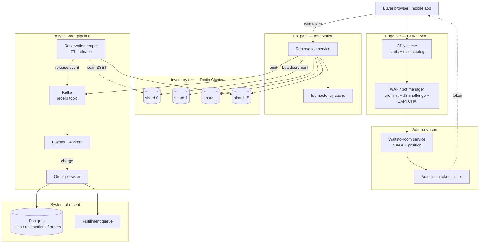

# Design a Flash Sale System — Inventory Contention, Admission Control, and Oversell Protection

**Date:** 2026-04-25 | **Updated:** 2026-04-25
**Tags:** `system-design` `case-study` `e-commerce` `concurrency` `hard`
**Difficulty:** Hard | **Type:** HLD | **Estimated read:** 35–45 min

## Table of Contents

- [Summary](#summary)
- [1. Functional Requirements](#1-functional-requirements)
- [2. Non-Functional Requirements](#2-non-functional-requirements)
- [3. Capacity Estimation](#3-capacity-estimation)
- [4. API Design](#4-api-design)
  - [Storefront API](#storefront-api)
  - [Admission / waiting-room API](#admission--waiting-room-api)
  - [Reservation API](#reservation-api)
  - [Order finalization API](#order-finalization-api)
- [5. Data Model](#5-data-model)
  - [Sale catalog](#sale-catalog)
  - [Inventory keyspace](#inventory-keyspace)
  - [Reservation ledger](#reservation-ledger)
- [6. High-Level Architecture](#6-high-level-architecture)
- [7. Deep Dives](#7-deep-dives)
  - [7.1 Waiting room and admission control](#71-waiting-room-and-admission-control)
  - [7.2 Atomic inventory decrement with Redis Lua](#72-atomic-inventory-decrement-with-redis-lua)
  - [7.3 Anti-bot and abuse defenses](#73-anti-bot-and-abuse-defenses)
  - [7.4 Payment timeout, reservation TTL, and release](#74-payment-timeout-reservation-ttl-and-release)
  - [7.5 Hot key mitigation — sharded inventory and local pre-aggregation](#75-hot-key-mitigation--sharded-inventory-and-local-pre-aggregation)
  - [7.6 Async order finalization pipeline](#76-async-order-finalization-pipeline)
  - [7.7 Graceful degradation when capacity is exceeded](#77-graceful-degradation-when-capacity-is-exceeded)
- [8. Bottlenecks & Trade-offs](#8-bottlenecks--trade-offs)
- [9. Anti-Patterns](#9-anti-patterns)
- [Related](#related)
- [References](#references)

## Summary

A flash sale is the most adversarial workload in e-commerce: **millions of buyers compete for thousands of units in a fixed time window**, every request is a write attempt, and the cost of getting the math wrong is either a stampede that takes the storefront down or an oversell that ships negative inventory. Alibaba's Tmall Singles' Day broke records year after year — **583,000 orders per second peak in 2020** ([Alibaba Cloud][alibaba-2020]) — and reaching that point required redesigning the order path so that the database almost never participates in the hot path. This case study designs that system from first principles.

The core technique is **separation of concerns over time**: prevent abusive traffic at the edge (rate limit, CAPTCHA), throttle legitimate traffic in a queue (waiting room), reserve inventory in Redis with a single atomic Lua script, and only then commit to Postgres asynchronously. Every layer absorbs load so the next layer sees a tiny fraction. The hard parts are oversell protection under cluster failover, fairness vs throughput in the queue, hot-key contention on a single SKU's counter, and the payment-timeout race that releases reservations back into the pool without double-allocating.

## 1. Functional Requirements

The system must support:

- **Pre-sale registration.** Users can register interest before the sale opens; registered users get a small admission advantage (priority lane in the queue or an earlier window) but no guarantee of purchase.
- **Sale catalog.** Each campaign defines: SKU(s), unit price, total stock, per-user limit (typically 1–2 units), start time, end time, and admission policy.
- **Waiting room.** When traffic exceeds capacity, users land in a waiting page that shows position, estimated wait, and is updated in near-real-time. Users in the waiting room cannot bypass to the purchase page.
- **Admission control.** A configurable rate (e.g. 50k requests/sec) of users is admitted from the waiting room into the purchase flow per second.
- **Reservation.** An admitted user attempts to claim 1 unit of stock. The reservation is exclusive, time-bounded (typically 5–10 minutes), and counted against remaining inventory immediately.
- **Payment.** The user pays inside the reservation TTL. On payment success the reservation becomes a confirmed order; on failure or timeout the reserved unit returns to the pool.
- **Order finalization.** Orders are persisted, fulfillment is queued, inventory decrement is mirrored from cache to system-of-record.
- **Per-user limit enforcement.** Hard cap per user across all attempts (account, payment instrument, device fingerprint, shipping address) to prevent scalpers.
- **Anti-bot defenses.** Rate limit per user/IP/device, optional CAPTCHA challenge for suspicious traffic, JS-challenge for browser verification, device fingerprint correlation.
- **Sale state visibility.** Storefront shows live remaining quantity (approximate; never negative; never the exact number to avoid information leak that aids bots).
- **Graceful degradation.** When admission backlog exceeds a hard ceiling, new arrivals see a "sold out / try again" page instead of joining a queue they can't possibly clear.

## 2. Non-Functional Requirements

| NFR | Target | Why |
|-----|--------|-----|
| **No oversell** | Strict — never confirm more orders than stock | Operationally fatal; legal exposure; impossible to recover trust |
| **Fair admission** | FIFO within tier, no privileged bypass except announced lanes | Headlines write themselves when celebrities skip the queue |
| **p99 admission decision** | < 200 ms under spike | Above this users tab-thrash and pile on more load |
| **p99 reservation latency** | < 500 ms | Decisive feedback; no spinner death |
| **Throughput at edge** | **5M RPS** sustained, **20M RPS** opening burst | Singles' Day-class spikes |
| **Reservation throughput** | **500k–1M decrements/sec** on the inventory tier | Below edge but still extreme |
| **Order persistence throughput** | **100k orders/sec** to the system of record | Async — does not gate the user experience |
| **Availability of waiting room** | 99.99% | A broken waiting room means everyone retries instantly = stampede |
| **Recovery time for inventory cache** | < 30 s on Redis failover | Below this and the whole sale stalls |
| **Bot rejection rate** | > 95% of automated traffic blocked at edge | Bots will be the majority of traffic without defense |

## 3. Capacity Estimation

**Scenario.** A single popular SKU: **10,000 units in stock**, **1M concurrent users at sale open**, sale duration **10 minutes**.

**Traffic profile.**

```text
Peak concurrent users:        1,000,000
Peak request rate (open):     20,000,000 RPS for ~5 s, decaying to ~2M RPS
Bot share (untreated):        70–90% of total traffic
Legitimate user retries:      ~5–10 attempts/user/min while waiting
Admission rate (configured):  50,000 users/sec into purchase flow
Reservation success rate:     10,000 successes total / sale = ~0.05% of attempts
```

**Why the numbers explode.** A naive design has every user POSTing to `/buy` once per second. With 1M users and 10s of patience, that's 10M attempts in the first 10 seconds. With bot-driven retries piled on, multiply by 3–5×. The cardinal rule: **never let edge traffic touch the inventory store directly**.

**Memory.**

```text
Inventory cache (Redis):
  Per SKU:      ~200 B (counter hash + reservation index)
  10k SKUs:     ~2 MB                              (negligible)

Reservation ledger (Redis):
  Per active reservation:     ~300 B
  Concurrent reservations peak: 100k
  Working set:                ~30 MB                (negligible)

Waiting room state (Redis sorted set or Kafka offset):
  Per user in queue:          ~150 B
  Peak queue size:            1M
  Working set:                ~150 MB               (one Redis primary)

Anti-bot fingerprint store:
  Per active fingerprint:     ~500 B
  Hot working set:            ~1M fingerprints
  Memory:                     ~500 MB               (sharded or in-memory near edge)
```

**Bandwidth.** At 20M RPS edge × ~2 KB request/response, that's **~40 GB/s of edge traffic**. CDN absorbs the static parts (waiting room HTML, JS challenge); only API calls hit origin — perhaps **2 GB/s** at peak.

**Sharding fan-out.**

- **Inventory tier**: a single SKU is one logical key. Cannot be cluster-sharded by key. Use **counter sharding** (split one SKU's stock across N counters) to get parallel throughput. For 10k units across 16 shards, each shard owns 625 units — enough to sustain ~60k decrements/sec per shard, ~1M/sec aggregate.
- **Reservation tier**: hash by reservation ID. Trivially shardable.
- **Waiting room**: shard the queue itself by user-bucket hash; or use Kafka with N partitions, each partition independently drained at the configured admission rate.

## 4. API Design

### Storefront API

Cacheable at the CDN edge. Read-heavy, no write contention.

```http
GET /v1/sales/{sale_id}
→ 200 { id, sku, price, status: "scheduled" | "live" | "ended",
        starts_at, ends_at, remaining_quantity_bucket: "abundant"|"limited"|"few"|"sold_out" }
```

Note: `remaining_quantity_bucket` is **discrete buckets, not exact count**. Exposing `remaining=3` invites bots to time their bursts. Refresh the bucket every 1–2 seconds.

### Admission / waiting-room API

The thin layer in front of the purchase flow. Long-lived connection where supported.

```http
POST /v1/sales/{sale_id}/queue/enter
Headers: X-Device-Fingerprint, X-Captcha-Token, Cookie: session
→ 200 { ticket: "tkt_abc123", position: 87420, estimated_wait_seconds: 240,
        poll_after_seconds: 5 }
or 429 { reason: "rate_limited" | "queue_full" | "bot_suspected" }

GET /v1/sales/{sale_id}/queue/status?ticket=tkt_abc123
→ 200 { state: "waiting" | "admitted" | "expired",
        position?: 1830,
        admission_token?: "adm_xyz789",        // present iff state == "admitted"
        admission_token_ttl_seconds?: 30 }
```

Server-Sent Events (SSE) is preferable to polling for the status stream when the edge supports it; SSE keeps a single connection open and pushes position updates, avoiding the thundering-herd of synchronized polls every 5 seconds.

### Reservation API

Only callable with a valid `admission_token`. This is the contention point and the only API that touches inventory.

```http
POST /v1/sales/{sale_id}/reserve
Headers: Authorization: Bearer <user_jwt>, X-Admission-Token: adm_xyz789
Body: { quantity: 1, idempotency_key: "u_42:sale_99:1" }
→ 200 { reservation_id: "res_qwe456", expires_at: "...+5m",
        order_draft_url: "/v1/orders/draft/res_qwe456" }
or 409 { reason: "sold_out" | "user_limit_reached" | "admission_token_consumed" }
or 410 { reason: "admission_token_expired" }
```

The `idempotency_key` is critical — clients **will** retry, and a second reservation must return the same `reservation_id` rather than burn a second unit. Cache idempotency keys in Redis for 24h. (See [Stripe's idempotency guide][stripe-idem] for the pattern.)

### Order finalization API

```http
POST /v1/orders/draft/{reservation_id}/pay
Body: { payment_method_id, shipping_address_id }
→ 200 { order_id, status: "processing" }   // payment kicked off, async
or 409 { reason: "reservation_expired" }

GET /v1/orders/{order_id}
→ 200 { status: "processing" | "confirmed" | "failed" | "shipped", ... }
```

The pay endpoint returns immediately with a draft order in `processing`. Actual payment authorization, fraud check, and persistence happen via the async pipeline described in §7.6.

## 5. Data Model

### Sale catalog

System of record (Postgres). Read once at sale start, mirrored into Redis.

```sql
CREATE TABLE sales (
  id              UUID PRIMARY KEY,
  sku             TEXT NOT NULL,
  unit_price_cents INTEGER NOT NULL,
  total_stock     INTEGER NOT NULL,
  per_user_limit  INTEGER NOT NULL DEFAULT 1,
  starts_at       TIMESTAMPTZ NOT NULL,
  ends_at         TIMESTAMPTZ NOT NULL,
  reservation_ttl_seconds INTEGER NOT NULL DEFAULT 300,
  admission_rate_per_sec  INTEGER NOT NULL,
  inventory_shard_count   INTEGER NOT NULL DEFAULT 16,
  state           TEXT NOT NULL,                -- 'scheduled' | 'live' | 'ended'
  CHECK (total_stock > 0),
  CHECK (per_user_limit > 0)
);
CREATE INDEX ON sales (starts_at) WHERE state = 'scheduled';
```

### Inventory keyspace

Redis. Sharded across N counters for one SKU to defeat the hot-key bottleneck.

```text
inv:{sale_id}:shard:{i}        → INTEGER remaining_in_shard
                                  TTL: sale_duration + 1h
inv:{sale_id}:total            → cached total stock (read-only after sale start)
inv:{sale_id}:user:{user_id}   → INTEGER claimed_by_user
                                  TTL: sale_duration + 24h

# Hash tag groups one sale together so all keys land on one cluster shard,
# enabling Lua scripts to operate on multiple keys atomically.
inv:{sale_id}:shard:{i}        # use {sale_id} as cluster hash tag
```

The cluster hash tag `{sale_id}` ensures all of a sale's keys (counter shards, per-user limits) live on the **same Redis Cluster slot**, which is required because Redis Cluster does not allow multi-key Lua scripts to span slots ([Redis Cluster spec][redis-cluster]).

### Reservation ledger

Redis hash + sorted set for TTL-driven release. Postgres mirror for durability.

```text
res:{reservation_id}            → HASH { user_id, sale_id, shard_index,
                                          quantity, created_at_ms, state }
                                   state ∈ { 'reserved' | 'paying' | 'confirmed' | 'released' }
res:expiry                      → ZSET (member=reservation_id, score=expires_at_ms)
                                   used by reaper to release stale reservations
```

```sql
CREATE TABLE reservations (
  id              UUID PRIMARY KEY,
  user_id         UUID NOT NULL,
  sale_id         UUID NOT NULL,
  shard_index     INTEGER NOT NULL,
  quantity        INTEGER NOT NULL,
  state           TEXT NOT NULL,
  created_at      TIMESTAMPTZ NOT NULL,
  expires_at      TIMESTAMPTZ NOT NULL,
  confirmed_at    TIMESTAMPTZ,
  released_at     TIMESTAMPTZ
);
CREATE INDEX ON reservations (user_id, sale_id);
CREATE INDEX ON reservations (state, expires_at) WHERE state IN ('reserved', 'paying');
```

The Postgres copy is **populated asynchronously** from a Kafka topic; it is the durable system of record for accounting, but it is never on the hot path.

## 6. High-Level Architecture



**Request flow at sale open:**

1. Buyer hits CDN; static catalog is cached. Bot/abuse traffic is filtered at the WAF.
2. Buyer POSTs `/queue/enter`. Waiting-room service appends them to the queue (sharded), returns a ticket and estimated position.
3. Admission token issuer drains the queue at the configured rate (e.g. 50k/sec) and emits short-lived admission tokens (TTL ~30s).
4. Buyer's status poll / SSE returns the token when they reach the head.
5. Buyer POSTs `/reserve` with the admission token. Reservation service runs **one Lua script** that: validates the user limit, decrements one counter shard, writes the reservation hash, and adds to the expiry ZSET — all atomically.
6. On success, an `OrderDraftCreated` event is emitted to Kafka. Buyer is redirected to the payment page.
7. Payment workers consume the event, charge the payment method, and on success emit `OrderConfirmed`. The order persister writes the durable row.
8. The reaper continuously pops expired reservations from the ZSET and emits `ReservationReleased`, which adds the unit back to its shard atomically.

## 7. Deep Dives

### 7.1 Waiting room and admission control

The waiting room exists for one reason: **the rate at which users arrive (~20M RPS at open) is hundreds of times higher than the rate at which inventory can be safely processed (~50k–1M reservations/sec)**. Without a queue, users either get random rejections (looks broken, makes them retry harder) or you take the inventory tier down.

**Design choices.**

| Queue style | Fairness | Memory | Failover |
|-------------|----------|--------|----------|
| **Token-issue rate limiter** (no queue, just admit at rate R) | None — luck-based | O(1) | Trivial |
| **Redis sorted set** (score = enqueue timestamp) | FIFO | O(N) per shard | Replica failover loses recent entries |
| **Kafka partitions** (1 partition = 1 lane) | FIFO per partition | Disk-backed, durable | Built-in failover |
| **Distributed token bucket + virtual time** | Approximate FIFO | O(1) | Clock-sensitive |

For Singles' Day-class scale, **Kafka partitions** are the most robust: each partition is a FIFO log with durable storage and built-in replication, the consumer is a simple controlled-rate puller, and the partition count gives you horizontal headroom. Twelve partitions × 5k admissions/sec each = 60k/sec.

**Position estimation.** Within a partition, position = `current_offset - your_offset`. Wait time = `position / drain_rate`. Show approximate values (round to nearest 1000) — exact positions invite reload abuse.

**Anti-skip.** The only way out of the waiting room is an admission token. Tokens are:

- **Short-lived** (30 s) — if the user doesn't claim within 30 s, the slot goes back to the queue.
- **Single-use** — the reservation API marks the token consumed in the Lua script and rejects re-use.
- **Bound to user + IP + device fingerprint** — pasted tokens to other devices fail validation.
- **HMAC-signed** with a server-side secret — cannot be forged.

**Fairness vs throughput.** Strict FIFO across all 1M concurrent users requires a single global queue, which is itself a hot-key bottleneck. The realistic compromise is **N parallel FIFO lanes** (one per partition). Within a lane, order is preserved; across lanes, order depends on which partition you hashed into. As long as the hash function spreads users uniformly, the experience feels fair. Announce up front that admission is "approximately first-come-first-served" — operators of every major flash sale do this.

### 7.2 Atomic inventory decrement with Redis Lua

The hot path. Every microsecond here multiplies by the admission rate.

The naive approach is a `GET → check → DECR` round-trip. This is fundamentally broken — between GET and DECR, another request can read the same stale count and both succeed, oversellling. `WATCH/MULTI/EXEC` retries on conflict, which under contention degrades to *worse than serial*.

The correct approach is **one Lua script** that does check + decrement + reservation write + per-user limit enforcement atomically server-side. Redis executes Lua scripts atomically; nothing else runs against that key while the script runs ([Redis EVAL semantics][redis-eval]).

```lua
-- KEYS[1] = inv:{sale_id}:shard:{i}
-- KEYS[2] = inv:{sale_id}:user:{user_id}
-- KEYS[3] = res:{reservation_id}
-- KEYS[4] = res:expiry
-- ARGV: user_id, reservation_id, shard_index, quantity,
--       per_user_limit, ttl_seconds, now_ms

local shard_key   = KEYS[1]
local user_key    = KEYS[2]
local res_key     = KEYS[3]
local expiry_key  = KEYS[4]

local user_id          = ARGV[1]
local reservation_id   = ARGV[2]
local shard_index      = tonumber(ARGV[3])
local quantity         = tonumber(ARGV[4])
local per_user_limit   = tonumber(ARGV[5])
local ttl_seconds      = tonumber(ARGV[6])
local now_ms           = tonumber(ARGV[7])

-- 1. Per-user limit
local user_claimed = tonumber(redis.call("GET", user_key) or "0")
if user_claimed + quantity > per_user_limit then
  return { err = "user_limit_reached", claimed = user_claimed }
end

-- 2. Shard stock
local remaining = tonumber(redis.call("GET", shard_key) or "0")
if remaining < quantity then
  return { err = "shard_empty", remaining = remaining }
end

-- 3. Atomic decrement + user counter increment
redis.call("DECRBY", shard_key, quantity)
redis.call("INCRBY", user_key, quantity)
redis.call("EXPIRE", user_key, ttl_seconds * 4)   -- outlive the reservation

-- 4. Write reservation hash + expiry index
local expires_at_ms = now_ms + ttl_seconds * 1000
redis.call("HSET", res_key,
  "user_id", user_id,
  "shard_index", shard_index,
  "quantity", quantity,
  "state", "reserved",
  "created_at_ms", now_ms)
redis.call("PEXPIRE", res_key, ttl_seconds * 1000 + 60000) -- grace beyond reaper
redis.call("ZADD", expiry_key, expires_at_ms, reservation_id)

return { ok = "reserved", remaining = remaining - quantity }
```

**Why this works.**

- Single round-trip: O(1) commands inside one EVAL.
- Atomicity: Redis processes commands single-threaded; nothing else interleaves on this slot.
- No oversell at this layer: the `remaining < quantity` check happens *inside* the same atomic block as the decrement.
- Idempotency upstream: the reservation service de-duplicates by `idempotency_key` *before* invoking this script, so retries don't double-decrement.

**Shard selection.** The reservation service picks `shard_index = hash(reservation_id) % N`, where N = `inventory_shard_count`. If the chosen shard is empty, it walks to the next shard (with a bounded retry budget, say 3 attempts). Walking is rare in practice — a shard is exhausted only at the end of the sale, by which point most users see "sold out" anyway.

**Postgres mirror.** The reservation event is emitted to Kafka inside the application code that called EVAL, *after* a successful response. Kafka producers are tuned with `acks=all` and idempotent producer enabled. The Postgres mirror lags by 100s of ms but is durable; it is the source of truth for refunds, accounting, and post-mortem analysis. Reconciliation runs periodically: count Postgres reservations, compare to (initial_stock - sum_of_shards), alert on drift.

**Cluster failover risk.** Redis Cluster uses asynchronous replication by default. If a primary fails *between* the EVAL and the Kafka emit, the replica may not have the decrement, but Kafka also doesn't have the event — the reservation simply never happened from the user's perspective, and the unit is implicitly returned. The dangerous case is the reverse: EVAL succeeds, Kafka emit fails, primary stays up. Use a transactional outbox or `WAIT` semantics for critical correctness; see §7.6.

### 7.3 Anti-bot and abuse defenses

Without defenses, **70–90% of flash-sale traffic is bots** — scalpers, sneaker bots, scraper farms. Every layer must filter.

**Layer 1 — Edge rate limit (WAF/CDN).**

- Per-IP: e.g. 100 req/min for storefront, 10 req/min for `/queue/enter`.
- Per-ASN: drop traffic from known datacenter ranges (AWS, GCP, Hetzner) on consumer-facing endpoints.
- Per-route: `/reserve` gets a much tighter budget than `/sales`.
- Use the patterns from [`../../building-blocks/rate-limiters.md`](../../building-blocks/rate-limiters.md) — token bucket with Lua atomicity, fail-closed on auth-sensitive routes.

**Layer 2 — Bot detection.**

- **Device fingerprint**: combine User-Agent, screen size, fonts, canvas fingerprint, audio fingerprint, TLS JA3 hash. Repeated fingerprints across many "different" accounts are bots.
- **Behavioral signals**: time-to-click, mouse path entropy, key down/up timing. Bots are too fast and too consistent.
- **JS challenge**: serve a small JS workload that computes a token (e.g. proof-of-work or a SubtleCrypto handshake). Pure HTTP scrapers don't run JS; headless browsers do, so this is a filter not a wall.
- **CAPTCHA**: only as a fallback for fingerprints that score "suspicious" — turning on CAPTCHA for everyone hurts conversion. Cloudflare Turnstile and hCaptcha are common privacy-respecting choices.

**Layer 3 — Account binding.**

- Pre-sale account verification: phone number, payment method on file, account age > N days. Fresh accounts can register but cannot purchase.
- Per-account, per-payment-method, per-shipping-address limits enforced at admission *and* at reservation. A bot farm with 10k accounts but 1 credit card hits the payment-method limit instantly.
- Cross-correlation in a graph: accounts sharing a fingerprint, IP, or payment method are scored together. See [Cloudflare's Bot Management][cf-bot] for production patterns.

**Layer 4 — Honeypots.** Hidden form fields, fake API endpoints listed in robots.txt, bait SKUs that look identical to the real ones. Anything that hits these is automatically banned.

**What does not work alone.**

- IP banning only: residential proxy networks (Bright Data et al.) make IPs disposable. Use IP signal alongside fingerprint.
- CAPTCHA only: solver farms exist and are cheap. Use CAPTCHA selectively.
- Account verification only: fresh-account blocks penalize legitimate new users.

The realistic posture is **defense in depth**: every layer rejects 80%+ of bots, multiplied across layers leaves a tractable residual.

### 7.4 Payment timeout, reservation TTL, and release

A reservation that is never paid for must return its unit to the pool — otherwise inventory leaks and the sale ends with phantom-sold units. The release path is just as failure-prone as the reservation path.

**TTL choice.** Long enough to complete payment (5–10 min), short enough not to starve other buyers. Empirically, 5 minutes covers > 95% of legitimate payments; users on flaky mobile connections are the long tail.

**Reaper design.**

```text
1. Sorted set res:expiry holds (reservation_id → expires_at_ms).
2. Reaper workers run ZRANGEBYSCORE 0 now LIMIT 0 100 every 100 ms.
3. For each id, run release Lua script:
   - HGET reservation; if state != 'reserved', skip (already paid or released).
   - CAS state from 'reserved' → 'released'.
   - INCRBY shard_key by quantity (return units to pool).
   - DECRBY user_key by quantity (free up the user's per-user budget).
   - Emit ReservationReleased event to Kafka.
   - ZREM expiry index.
4. Reaper is leader-elected (Redis SET NX or Zookeeper) to avoid double-release.
```

**Race: payment vs reaper.** A user's payment confirms at exactly the expiry moment. Both the payment worker and the reaper try to mutate the reservation.

The Lua-script CAS (compare-and-set on `state`) makes this safe: only one of them flips the state, the other sees the new state and aborts. The losing branch handles the cleanup:

- If the **reaper wins** (released first), the payment worker sees `state=released`, refunds the charge if it has already authorized, and surfaces "reservation expired" to the user.
- If the **payment wins** (confirmed first), the reaper sees `state=confirmed` and removes the expiry entry without releasing.

**Reaper backlog.** During peak release, the reaper might fall behind. The release rate ramps up sharply at `sale_start + reservation_ttl`. Provision the reaper for 2–3× the peak admission rate to drain quickly. Otherwise, expired reservations sit unreleased and remaining inventory looks artificially low.

**Idempotent release.** Each release emits a Kafka event. Downstream consumers (Postgres mirror, fulfillment) must dedupe on `(reservation_id, event_type)`.

### 7.5 Hot key mitigation — sharded inventory and local pre-aggregation

A single SKU's stock counter is the canonical hot key. Even with single-threaded Redis pushing 100k+ ops/sec, one popular SKU at 1M decrement attempts/sec saturates one primary, and the entire sale stalls.

**Counter sharding.** Split the SKU's stock into N counters at sale start. With N=16 and 10k units, each counter starts at 625. The Lua script decrements one chosen shard. Aggregate throughput scales with N, capped by the number of cluster primaries.

```text
inv:{sale_99}:shard:0   = 625
inv:{sale_99}:shard:1   = 625
...
inv:{sale_99}:shard:15  = 625
total                   = 10000
```

Trade-off: **fragmentation at the tail**. As shards empty, some users hit empty shards while others have stock. The reservation service must walk to the next shard on miss. A bounded retry (3 attempts) mostly eliminates this; the small loss of last-unit fairness is acceptable. Beyond the bounded walk, return "sold out" — the cost of a perfect last-unit auction is unbearable contention.

**Pre-warming.** The shard counters are populated from Postgres just before sale start by a single coordinator process: `SET inv:...:shard:i 625 NX`. The `NX` flag means a botched re-run cannot double the stock. Total stock is pinned in `inv:...:total` for invariant checks.

**Local pre-aggregation (advanced).** At admission rates above ~1M/sec, even sharded Redis can be saturated. The trick used by Alibaba is a **two-tier inventory**: an L1 in-process counter on each reservation pod absorbs decrements locally, then asynchronously reports consumed quantity to L2 (Redis). L1 holds a small "lease" of stock (e.g. 100 units) granted by L2; when exhausted, it requests a new lease.

```text
Pod A leases 100 units from shard 0.
Pod A serves 100 reservations purely in-process at memory speed.
Pod A returns to shard 0 for another lease.
```

This collapses Redis ops by ~100×. The cost is a window of inconsistency: if Pod A crashes mid-lease, the 100 units it had are stranded until the lease times out. Alibaba's published architecture explicitly uses this pattern ([Alibaba Cloud — Singles' Day][alibaba-2020]).

**When not to shard.** Below ~50k decrements/sec a single counter is fine. Sharding only earns its complexity at extreme rates.

### 7.6 Async order finalization pipeline

The user clicks "buy" → the user gets feedback in milliseconds → the actual order persistence happens *afterward*, asynchronously. This is the single biggest lever for scaling the order path.

**Pipeline.**

```text
[Reservation service]
  ↓ emit OrderDraftCreated
[Kafka: orders topic, partitioned by sale_id]
  ↓
[Payment workers — pool of N consumers]
  ↓ charge payment method (Stripe / Alipay)
  ↓ emit OrderConfirmed | OrderFailed
[Kafka: order-events topic]
  ↓
[Order persister] → Postgres (append-only inserts, no row contention)
[Fulfillment dispatcher] → fulfillment queue
[Inventory reconciler] → confirm Postgres mirror matches Redis
```

**Why Postgres is not on the hot path.** A single SKU's `stock` row in Postgres is the same hot key in disguise. Updating it 10k times in 5 seconds creates row-level lock contention that destroys throughput. By moving inventory to Redis with sharded counters, Postgres only sees **append-only inserts** to the `reservations` and `orders` tables — no updates to a contested row, no deadlocks, free horizontal scaling via partitioning.

**Kafka partitioning.** Partition the `orders` topic by `sale_id`. All events for one sale flow through one partition consumer pool, preserving order, but different sales scale independently. Within a sale, ordering between unrelated reservations is irrelevant — what matters is the event log being durable and replayable.

**Outbox pattern.** The hard correctness problem is "Redis EVAL succeeded but Kafka emit failed". The fix is the [transactional outbox][outbox]: write the Kafka message to a Redis stream (or a Postgres outbox table) inside the same Lua script that does the decrement. A separate publisher drains the stream into Kafka with at-least-once semantics. Consumers must dedupe on event ID. This guarantees that every reservation eventually surfaces as an event, even across failovers.

**Backpressure.** If Kafka or the payment workers fall behind, the reservation service notices via consumer-lag metrics and starts shedding admission tokens — the waiting room drains slower, protecting the downstream. The pattern is the canonical bulkhead/backpressure described in [`../../scalability/backpressure-bulkhead-circuit-breaker.md`](../../scalability/backpressure-bulkhead-circuit-breaker.md).

### 7.7 Graceful degradation when capacity is exceeded

What happens when the queue itself is overrun? When 5M users try to enter a 1M-capacity waiting room?

**Tiered shedding.** Define hard ceilings, and degrade earlier tiers when downstream is saturated.

| Trigger | Action |
|---------|--------|
| Edge RPS > 10× capacity | CDN serves a static "high traffic" page with a retry-after header |
| Waiting-room queue > 2× max | New `/queue/enter` calls return 503 with `Retry-After: 30` |
| Admission consumer lag > 30 s | Throttle admission rate down 50%; prefer existing tickets over new |
| Reservation Redis lag > 500 ms | Open circuit breaker on `/reserve`; emit "system busy" |
| Payment worker lag > 2 min | Pause new admissions until lag recovers |

The principle: **shed at the cheapest layer**. A CDN-served static page costs ~0.0001¢/request; a stuck reservation pod costs the inventory tier itself.

**Fail-static, never fail-blank.** When the waiting room is full, the response is still a polite, branded HTML page with "Try again in X seconds" — not a generic 502. The user's perception of fairness depends on the failure mode, not just the failure rate.

**Circuit breakers on cross-service dependencies.** Payment provider down? Trip the breaker, drain reservations to a "your card was not charged, please retry" state, hold the inventory in a `payment_unavailable` substate that the reaper releases on a longer TTL (15 min). Never let a third-party outage cascade into oversell.

**Sale-end behavior.** When stock hits zero, all `/reserve` calls fail fast with `409 sold_out`. The waiting room flips to "Sale ended" mode and stops issuing new admission tokens. Existing tokens can still complete payment. The CDN can flip the catalog page to "Sold out" within seconds.

## 8. Bottlenecks & Trade-offs

| Concern | Bottleneck | Trade-off |
|---------|-----------|-----------|
| **Inventory throughput** | One Redis primary per shard | Shard count vs last-unit fairness; pod-local leasing vs failover risk |
| **Admission fairness** | One global FIFO queue is itself a hot key | N parallel partitions = approximate FIFO; communicate this to users |
| **Bot defense** | Every signal has false positives | Defense-in-depth so no one signal needs to be perfect |
| **Oversell risk** | Async replication / cluster failover | Outbox + reconciliation; accept reconciliation latency for higher throughput |
| **Latency vs durability** | Kafka acks=all + Postgres write before user response | Async finalization decouples user latency from durability |
| **Complexity** | Many moving parts (queue, inventory, reaper, payment, reconciler) | Each is independently testable; coupling them adds nothing |
| **Cost** | Redis + Kafka + worker pools sized for peak | Auto-scale aggressively; idle most of the year |
| **User experience under failure** | Cryptic errors panic users into retries | Fail-static branded pages; Retry-After everywhere |

A useful framing: **flash sale design is risk allocation**. You can never build a system that is simultaneously oversell-proof, perfectly fair, infinitely scalable, and zero-latency. Pick the constraints (no oversell, approximate FIFO, p99 < 500 ms) and engineer the rest around them.

## 9. Anti-Patterns

- **Database row contention as the inventory mechanism.** `UPDATE products SET stock = stock - 1 WHERE id = ? AND stock > 0` looks correct and is technically oversell-safe, but row-level lock contention collapses throughput at a few thousand attempts/sec. Postgres is not the answer here.
- **Optimistic locking only.** `UPDATE ... WHERE version = ?` retries on conflict — under flash-sale contention every request retries N times and the system spends all its time on retry storms. OCC is a fine pattern for low contention; it is the wrong pattern for one row + 1M writers.
- **GET → check → DECR in three round-trips.** The window between GET and DECR is exactly where oversell happens. Always one atomic primitive (Lua, Redis transaction, or single conditional command).
- **No idempotency on `/reserve`.** Mobile networks drop and clients retry. A non-idempotent reserve burns inventory on duplicate requests. Always idempotency-key the endpoint.
- **Single global FIFO queue.** Becomes its own hot-key bottleneck; one Redis primary serializes admission for the whole site. Use partitioned queues.
- **Exposing exact remaining inventory.** Bots time the remaining counter and submit at the optimal moment. Show buckets, not numbers.
- **Polling status from every client every 1s.** 1M users polling = 1M RPS just for status. Use SSE or WebSocket; or randomize poll intervals + add a Retry-After-style hint.
- **Waiting room implemented in the application server, in-memory.** Restart loses the queue; horizontal scaling needs sticky sessions; the queue itself becomes a point of failure. Push it to durable infrastructure (Kafka, Redis cluster).
- **Reservation TTL = sale duration.** A 10-minute sale with 10-minute reservations means slow buyers permanently park inventory. TTL must be much shorter than sale duration.
- **No reaper for expired reservations.** Inventory leaks; final stock looks artificially low. Always have a release path.
- **Synchronous payment authorization on the reserve path.** Adds the payment provider's p99 latency (often seconds) inside the inventory critical section. Decouple via async pipeline.
- **Trust client-supplied user IDs for per-user limits.** Every user limit must be enforced server-side against an authenticated identity, not a header the client sends.
- **One worker pool for everything.** Mixing payment, persistence, and email-sending in one queue means one slow consumer stalls all of them. Bulkhead each role.
- **Letting third-party failures cascade.** Payment provider outage → reservations stuck → Redis fills → admission stalls → site dies. Trip circuit breakers, surface "we'll retry your payment" to the user, and keep the inventory side healthy.
- **No shadow run before launch.** Sale opens, traffic hits production for the first time, something breaks at 3M RPS. Run synthetic load tests at full scale against an isolated environment in the days before.

## Related

- **Atomic counters and Lua patterns:** [`../../building-blocks/rate-limiters.md`](../../building-blocks/rate-limiters.md) — same Lua atomicity that powers reservation decrements.
- **Cache strategies for sale catalog and storefront:** [`../../scalability/read-write-splitting-and-cache-strategies.md`](../../scalability/read-write-splitting-and-cache-strategies.md) — write-through, cache-aside, TTL choices.
- **Async order pipeline:** [`../../building-blocks/message-queues-and-brokers.md`](../../building-blocks/message-queues-and-brokers.md) — Kafka partitioning, ordering, idempotent consumers.
- **Backpressure and circuit breakers:** [`../../scalability/backpressure-bulkhead-circuit-breaker.md`](../../scalability/backpressure-bulkhead-circuit-breaker.md) — bulkheading the payment dependency, shedding load.
- **General e-commerce architecture:** [`./design-amazon-ecommerce.md`](./design-amazon-ecommerce.md) — catalog, search, recommendation, and checkout patterns that flash sale specializes.

## References

- [Alibaba Cloud — How Alibaba Achieves a Peak of 583,000 Orders Per Second][alibaba-2020]
- [Alibaba Cloud — Tmall Singles' Day Architecture (technical deep dive)](https://www.alibabacloud.com/blog/why-alibaba-cloud-can-support-583000-orders-per-second_595576)
- [Redis — EVAL command and atomicity guarantees][redis-eval]
- [Redis — Cluster specification (hash tags, slot routing)][redis-cluster]
- [Redis — Distributed locks with Redlock](https://redis.io/docs/latest/develop/use/patterns/distributed-locks/)
- [Stripe — Designing robust and predictable APIs with idempotency][stripe-idem]
- [Cloudflare — Bot Management overview][cf-bot]
- [Microservices.io — Transactional outbox pattern][outbox]
- [Martin Kleppmann — "Designing Data-Intensive Applications" — Chapter 7 on transactions and contention](https://dataintensive.net/)
- [High Scalability — How Tmall handled Singles' Day](http://highscalability.com/blog/2017/12/4/the-shape-of-singles-day.html)

[alibaba-2020]: https://www.alibabacloud.com/blog/why-alibaba-cloud-can-support-583000-orders-per-second_595576
[redis-eval]: https://redis.io/docs/latest/commands/eval/
[redis-cluster]: https://redis.io/docs/latest/operate/oss_and_stack/reference/cluster-spec/
[stripe-idem]: https://stripe.com/blog/idempotency
[cf-bot]: https://developers.cloudflare.com/bots/
[outbox]: https://microservices.io/patterns/data/transactional-outbox.html
