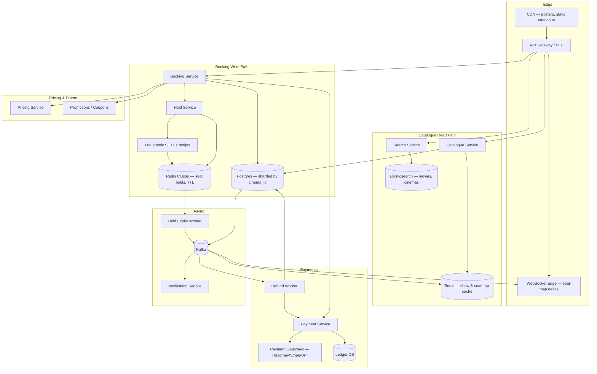

# Design a Movie Booking System (BookMyShow) — HLD: Seat-Hold Concurrency, Surge, and Refund Sagas

**Date:** 2026-04-25 | **Updated:** 2026-04-25
**Tags:** `system-design` `case-study` `e-commerce` `booking` `hard`

## Table of Contents

- [Summary](#summary)
- [Functional Requirements](#functional-requirements)
- [Non-Functional Requirements](#non-functional-requirements)
- [Capacity Estimation](#capacity-estimation)
- [API Design](#api-design)
- [Data Model](#data-model)
- [High-Level Design](#high-level-design)
- [Deep Dives](#deep-dives)
  - [Seat-Hold Concurrency — TTL'd Reservation in Redis with Atomic SETNX](#seat-hold-concurrency--ttld-reservation-in-redis-with-atomic-setnx)
  - [Payment Integration — Reservation Timeout and Release](#payment-integration--reservation-timeout-and-release)
  - [Sharding by Cinema and Show](#sharding-by-cinema-and-show)
  - [Surge Handling — Popular Release Day](#surge-handling--popular-release-day)
  - [Refund and Cancellation — Saga Across Booking, Payment, Inventory](#refund-and-cancellation--saga-across-booking-payment-inventory)
  - [Seat-Map UI Consistency — What the User Sees vs Reality](#seat-map-ui-consistency--what-the-user-sees-vs-reality)
  - [Group Bookings and Adjacency](#group-bookings-and-adjacency)
  - [Dynamic Pricing — Tier, Demand, and Time Decay](#dynamic-pricing--tier-demand-and-time-decay)
- [Bottlenecks and Trade-offs](#bottlenecks-and-trade-offs)
- [Anti-Patterns](#anti-patterns)
- [Related](#related)
- [References](#references)

## Summary

A movie ticket booking platform like **BookMyShow** (India), **Fandango** (US), or **Atom Tickets** sells seats for time-bound shows across thousands of cinemas. The hard problems are not browsing the catalogue — they are:

1. **No double-booking, ever.** Two users tapping the same seat 50 ms apart must produce exactly one winner and one rejection. This is the core invariant.
2. **Sub-second seat-map UX** that reflects the *real* state of inventory, even while thousands of holds are flickering on and off during a hot release.
3. **Reservation lifecycle.** A held seat must auto-release if the user abandons checkout, payment fails, or the gateway times out — without leaking inventory.
4. **Catastrophic surge.** A new Marvel/Bollywood release at 10:00 AM IST can drive **10–100×** the average booking QPS in a 60-second window.
5. **Refunds and cancellations.** Money has already moved; the saga must atomically restore inventory, refund the user (possibly partially per policy), and reconcile the ledger.

The architecture splits into a **read-mostly catalogue path** (cinemas/movies/shows on a CDN-fronted cache), a **write-hot booking path** (Redis-backed seat holds + Postgres source of truth sharded by `cinema_id`), and a **payment + refund saga** that owns money movement asynchronously.

This doc is HLD-level, hard difficulty. For booking-concurrency parallels see [`../location-based/design-airbnb.md`](../location-based/design-airbnb.md). The LLD twin (class diagrams, state machines, lock implementations) lives at [`../../../low-level-design/case-studies/movie-booking-system.md`](../../../low-level-design/case-studies/movie-booking-system.md). For payment internals see [`../payment/design-payment-system.md`](../payment/design-payment-system.md).

## Functional Requirements

**User-facing**

- **Browse** movies by city, language, genre, format (2D/3D/IMAX/4DX), release date.
- **Search** by movie title, cinema name, location.
- **Show selection** — pick city → movie → date → cinema → showtime → screen.
- **Seat selection** on a visual seat map showing tier (recliner/premium/standard), availability, your tentative selection, and other users' active holds (greyed out).
- **Hold seats** for a bounded TTL (typically **8–10 minutes**) while the user enters payment details.
- **Checkout** with multiple payment options (cards, UPI, wallets, net-banking, gift cards, loyalty points).
- **Confirmation** — booking ID, QR code / e-ticket, calendar invite, email/SMS.
- **Cancellation** within policy window with partial or full refund.
- **History** — past and upcoming bookings.
- **Group bookings** — book up to N adjacent seats in one transaction.
- **Recommendations / personalized homepage**.

**Cinema/Operator-facing**

- **Show scheduling** — define screens, seat layout, showtimes, pricing tiers.
- **Inventory management** — block seats for maintenance, comp tickets, distributor allocations.
- **Reporting** — fill rate, revenue per show, refund rate.

**Platform**

- **Promotions** — coupons, cashback, partner offers.
- **Dynamic pricing** — tier-based + demand-based.
- **Notifications** — booking confirmations, show reminders, cancellation alerts.

## Non-Functional Requirements

| NFR | Target |
|---|---|
| Seat-map render p99 | < 250 ms (CDN-cached for cold seats; Redis for hot shows) |
| Hold acquisition p99 | < 100 ms (atomic Redis op) |
| Booking confirm p99 | < 2 s including payment authorization |
| **Double-booking rate** | **Zero. Strict invariant.** |
| Booking write availability | 99.99% — every minute down on release day costs real revenue |
| Seat-map staleness | ≤ 1 s for hot shows; 5 s acceptable for cold ones |
| Surge capacity | Handle **100× average peak** for 5–10 minute spikes on hot releases |
| Multi-region | Read-local catalogue; booking writes pinned to the cinema's home region |
| Compliance | PCI-DSS for card data (delegate to gateway), GDPR/local data residency |
| Refund SLA | Refund initiated within 24h of cancellation; settled per gateway timeline (3–7 days) |

## Capacity Estimation

Order-of-magnitude (interview-grade, BookMyShow-like scale):

- **Cinemas:** ~10K
- **Screens per cinema:** ~5 average → **50K screens**
- **Seats per screen:** ~150 average → **7.5M seats** total physical capacity
- **Shows per screen per day:** ~5 → **250K shows/day**
- **Seats per show:** 150 → **~37.5M show-seats/day** (the actual inventory unit)
- **Bookings/day:** ~3M tickets, ~1.5M booking transactions (avg 2 tickets/booking)
- **Avg QPS:** 1.5M / 86,400 ≈ **17 booking writes/sec**
- **Peak QPS (release day, 10 AM):** **2,000–5,000 booking writes/sec** (~100–300× average) for a 5–10 minute window
- **Seat-map reads:** ~10× booking attempts → **~50K reads/sec peak**
- **MAU:** ~100M

**Storage rough sketch**

| Data | Volume | Store |
|---|---|---|
| Cinema/screen/movie catalogue | ~10K cinemas × small | Postgres + CDN-cached read views |
| Show definitions | ~250K/day, ~30 day window = ~7.5M active | Postgres, sharded by cinema_id |
| Seat inventory (per show) | 7.5M shows × 150 seats = ~1.1B rows (rolling window) | Postgres partitioned by show_id; hot subset in Redis |
| Bookings | ~1.5M/day × 365 = ~550M/yr | Postgres + cold archive |
| Holds (transient) | ~100K active at peak | Redis with TTL — never persisted |
| Payments | ~1.5M/day | Payment service DB + ledger |

The **show-seat inventory dominates row count**; the **hold layer dominates QPS**. Holds never go to disk — they live and die in Redis within a 10-minute window.

## API Design

REST for transactional flows (booking, payment, refund). GraphQL or BFF aggregation for the catalogue/seat-map screens that need to fan out across cinema, movie, show, and seat-tier data.

**Browse / catalogue**

```http
GET /v1/cities/{cityId}/movies?date=2026-04-25&lang=en&format=IMAX
GET /v1/movies/{movieId}/shows?cityId=...&date=...
GET /v1/shows/{showId}                       # show detail + cinema + screen
GET /v1/shows/{showId}/seatmap               # seat map with current availability
```

The seat-map response carries seat IDs, tier, price, and a status enum: `AVAILABLE | HELD | BOOKED | BLOCKED`. The client polls or subscribes (WebSocket/SSE) for delta updates on hot shows.

**Hold seats (the hot path)**

```http
POST /v1/shows/{showId}/holds
Idempotency-Key: 7c1f...
Authorization: Bearer ...
Content-Type: application/json

{ "seatIds": ["A12","A13","A14"] }

→ 201 {
    "holdId": "hld_...",
    "expiresAt": "2026-04-25T10:18:00Z",
    "totalCents": 75000,
    "currency": "INR",
    "quoteId": "q_..."          // signed price quote
  }

→ 409 { "error": "SEATS_UNAVAILABLE", "conflicts": ["A13"] }
```

**Confirm booking (after payment authorization)**

```http
POST /v1/bookings
Idempotency-Key: 7c1f...

{
  "holdId": "hld_...",
  "quoteId": "q_...",
  "paymentMethodId": "pm_xyz",
  "userId": "u_..."
}

→ 201 { "bookingId": "bk_...", "status": "CONFIRMED", "qrCode": "..." }
→ 402 { "error": "PAYMENT_FAILED", "reason": "insufficient_funds" }
→ 410 { "error": "HOLD_EXPIRED" }
```

**Cancellation / refund**

```http
DELETE /v1/bookings/{id}
→ 202 { "refundId": "rf_...", "status": "PENDING", "amountCents": 67500 }
```

**Other key endpoints**

- `GET  /v1/bookings/{id}` — booking + ticket details + QR payload.
- `POST /v1/holds/{id}/extend` — extend hold once (rate-limited; only if seats still free).
- `POST /v1/operator/shows` — operator scheduling.
- `POST /v1/operator/seats/block` — operator-side seat blocks (maintenance/comp).

**Idempotency.** Every state-changing endpoint requires an `Idempotency-Key`. Mobile clients aggressively retry on flaky 4G; without idempotency a retry can create duplicate holds or, worse, duplicate bookings after payment.

## Data Model

Simplified ER, Postgres unless noted. Sharding key called out per table.

```
cinema(id, name, city_id, address, lat, lng, brand, num_screens, ...)
   -- shard key: cinema_id (hash)

screen(id, cinema_id, name, format, total_seats, layout_blob, ...)
   -- co-located with cinema (shard by cinema_id)

seat(id, screen_id, row, col, tier, position_x, position_y)
   -- physical seat catalogue; immutable once defined

movie(id, title, lang, duration_min, certification, cast, poster_url, ...)
   -- global, replicated read-mostly

show(id, screen_id, cinema_id, movie_id, starts_at, ends_at,
     base_price_cents, currency, status)
   -- shard by cinema_id; secondary index on (movie_id, starts_at)

show_seat(show_id, seat_id,                          -- composite PK
          status,                                    -- AVAILABLE|HELD|BOOKED|BLOCKED
          tier, price_cents, version, hold_id NULL,
          booking_id NULL)
   -- 150 rows per show; partitioned by show_id within the cinema shard
   -- this is the source of truth; Redis is the cache

hold(id, show_id, user_id, seat_ids[], expires_at,
     total_cents, currency, quote_id, status)
   -- ephemeral; mirrored in Redis with TTL

booking(id, user_id, show_id, cinema_id,
        seat_ids[], total_cents, currency,
        status,                                      -- PENDING_PAYMENT|CONFIRMED|CANCELLED|REFUNDED
        payment_intent_id, idempotency_key UNIQUE,
        created_at, confirmed_at)
   -- shard by cinema_id; secondary index on user_id

payment_intent(id, booking_id, provider, amount_cents,
               currency, status, captured_at, ...)

refund(id, booking_id, amount_cents, reason, status,
       initiated_at, settled_at)

ledger_entry(id, txn_id, account, amount_cents, direction,
             currency, ref_type, ref_id, created_at)
   -- append-only, double-entry; the source of truth for money

price_rule(id, cinema_id, screen_id NULL, show_id NULL,
           tier, base_cents, demand_curve_id, weekend_multiplier, ...)
```

**Why shard by `cinema_id`.** Every booking touches one show, one screen, one cinema. Co-locating `show`, `show_seat`, and `booking` for that cinema on one shard turns the hot booking transaction into a **single-shard, single-row-set** operation. Cross-shard transactions never appear on the booking write path.

**Why a separate physical `seat` table.** Seat layout is stable per screen (rarely changes). `show_seat` is the per-show snapshot — created when a show is scheduled, dropped after settlement window. Without this split you would either denormalize layout into every show (write amplification) or join on the hot path.

## High-Level Design



Two flows dominate:

- **Read path (seat-map):** client → BFF → Catalogue → Redis (hot) → fall back to Postgres. WebSocket pushes invalidations as holds change.
- **Write path (booking):** client → BFF → Hold Service (atomic Redis SETNX with TTL) → Pricing → Payment authorize → Booking Service commits to Postgres → emit event → Kafka fanout (cache invalidation, notification, analytics, ticket-PDF generation).

## Deep Dives

### Seat-Hold Concurrency — TTL'd Reservation in Redis with Atomic SETNX

This is the heart of the system. The invariant: **at most one hold or booking exists for any (show_id, seat_id) at any moment**, and an abandoned hold must auto-release without leaking inventory.

**Why not just Postgres `SELECT FOR UPDATE`.** It works correctness-wise (Airbnb's calendar uses exactly this pattern), but a hot show on release day can see thousands of users tapping seats per second; row-level locks in Postgres become a contention bottleneck and the transactions hold open while the human picks seats. We need the *human-think-time* (8–10 minutes) decoupled from a database row lock.

**Pattern: Redis as the hold layer, Postgres as the commit-time source of truth.**

Each seat in a show has a Redis key:

```
seat:{showId}:{seatId}     value: holdId or bookingId    TTL: 600s (hold) or persistent (booking)
```

Hold acquisition is a **single Lua script** that runs atomically on the Redis node owning that show's slot (we hash-tag keys by `{showId}` so all seats of a show land on the same slot — see [Sharding](#sharding-by-cinema-and-show)):

```lua
-- KEYS = seat keys for this show, ARGV = {holdId, ttlSeconds}
for i = 1, #KEYS do
  if redis.call('EXISTS', KEYS[i]) == 1 then
    return {err = 'CONFLICT', conflict = KEYS[i]}
  end
end
for i = 1, #KEYS do
  redis.call('SET', KEYS[i], ARGV[1], 'NX', 'EX', tonumber(ARGV[2]))
end
return {ok = 'HELD'}
```

This is **all-or-nothing** across all requested seats: either every seat is free and gets locked atomically, or none are touched. The `EXISTS` pre-check is the read; the `SET NX EX` writes the hold with TTL. Because everything runs as one Lua script on one Redis node, there is no race between the check and the set.

**Why `SET NX EX` and not `SETNX` + `EXPIRE`.** Two separate commands leave a window where a crash between them creates a key without TTL → leaked seat forever. The combined `SET key val NX EX seconds` is atomic.

**TTL expiry — passive vs active release.**

- **Passive (Redis-native):** Redis evicts the key when TTL expires. Subsequent acquisition attempts succeed because the key is gone. Sufficient for hold release.
- **Active (worker):** A keyspace-notification listener (or Redis `EXPIRE` events) emits a `hold.expired` event so the seat-map can be repainted in real time and any pending payment intent for that hold can be cancelled.

**Confirm flow.** When payment succeeds, the booking service:

1. Verifies hold still exists in Redis (it might have expired during a 60-second 3DS challenge).
2. Begins a Postgres transaction on the cinema shard.
3. `UPDATE show_seat SET status='BOOKED', booking_id=$bk, hold_id=NULL WHERE show_id=$s AND seat_id IN (...) AND status='HELD' AND hold_id=$h` — guard predicate ensures we don't overwrite a different hold or a stale state.
4. If `rowcount == #seats`, commit; insert booking row.
5. Replace Redis key value from `holdId` to `bookingId` and `PERSIST` (remove TTL) — or simply rewrite without TTL.
6. If `rowcount` mismatches, rollback, refund payment, return `409`.

**Why double-write Redis + Postgres.** Redis is the **fast lock** that gates concurrent users; Postgres is the **durable source of truth** that survives Redis flushes/failovers and supports analytics, refunds, and audit. The Postgres `UPDATE ... WHERE status='HELD'` predicate is the safety net if Redis disagrees.

**Failure modes.**

- **Redis down.** Fail closed: refuse new holds, surface "try again". Don't fall back to Postgres-only locking on hot shows; the gain isn't worth the latency hit.
- **Postgres down on confirm.** Hold remains; refund the payment via the saga; user retries. The hold TTL eventually frees the seats.
- **Network partition between hold and confirm services.** Idempotency keys de-duplicate retries; the Postgres guard predicate prevents a partition from creating two bookings.

This is the same lock-based concurrency family as Airbnb's calendar transaction in [`../location-based/design-airbnb.md`](../location-based/design-airbnb.md), but with seat-IDs and a Redis fast path because the contention is sharper (humans staring at a seat map) and TTL semantics are cleaner than holding a DB row lock for minutes.

### Payment Integration — Reservation Timeout and Release

The hold TTL and the payment lifecycle must be **deliberately coupled** so seats never leak and money never moves without a confirmed booking.

**Timeline (typical happy path):**

```
t=0     POST /holds          → Redis SET NX EX 600s, return holdId, totalCents, expiresAt
t≈30s   user enters card     → POST /bookings (initiates PaymentIntent)
t≈45s   3DS/UPI challenge    → user authenticates
t≈60s   gateway authorizes   → booking service commits Postgres + flips Redis to PERSIST
t≈61s   202 Confirmed        → user sees QR ticket
```

**Critical rule:** `hold.expiresAt` ≥ `payment.timeout` + safety margin. Typical: hold = 600s, payment authorize timeout = 180s, safety margin = 60s. **Never** authorize a payment if the hold's remaining TTL is shorter than the gateway's worst-case authorize latency — the seat could expire mid-authorize and another user grabs it before we commit.

**Three failure paths:**

1. **User abandons.** TTL expires; Redis evicts the keys; expiry worker emits `hold.expired`; seat-map service pushes "available" delta to subscribers; no money has moved. Clean.
2. **Payment fails (declined/3DS abort).** Gateway returns failure synchronously. Booking service explicitly `DEL`s the Redis seat keys (don't wait for TTL — return inventory immediately to other users). No ledger entry beyond an audit row.
3. **Payment authorize succeeds but commit fails (hold expired in between, or Postgres glitch).** This is the dangerous case. The flow:
   - Booking service detects mismatch (Redis key gone, or `UPDATE` rowcount mismatch).
   - Initiates an immediate **void/refund** of the just-authorized payment.
   - Returns `409 SEATS_UNAVAILABLE` to the user.
   - The refund saga (next section) takes over to ensure money is restored even if the void call itself fails.

**Why authorize-then-capture, not capture-immediately.** Most gateways support a two-step flow: **authorize** (hold funds) and **capture** (actually move money). Authorize on hold-confirm; capture only after the booking row is durably committed. If commit fails, we **void** the authorization — no money ever leaves the user's bank, no chargeback risk. Some Indian gateways (UPI especially) only support immediate-charge — for those, full charge happens up front and the failure path issues a refund instead of a void.

**Idempotency end-to-end.** The same `Idempotency-Key` flows from client → BFF → booking → payment gateway. A retry with the same key returns the original outcome from each layer. Without this, a retry after a network blip can authorize twice.

### Sharding by Cinema and Show

The booking write path is the contended path. Sharding strategy:

- **Cinema-level shard key.** `cinema_id` hashes to a Postgres shard. All `show`, `show_seat`, and `booking` rows for a cinema land together. A booking transaction is **single-shard**.
- **Show-level Redis hash tag.** Redis Cluster shards by hash slot. Using `{showId}` as a hash tag (`seat:{showId}:A12`) forces all seats of one show to one slot, which is required for the multi-key Lua script to be atomic. Different shows can — and should — land on different shards to spread load.
- **Catalogue stays global.** Movies, cities, languages, search index — these are read-mostly and replicated globally. They never participate in the booking transaction.

**Hot-show problem.** A new Marvel release: 10K cinemas × 5 shows on opening day = 50K hot shows simultaneously. Each show maps to one Redis slot. If a single show's slot saturates, you're stuck (one slot = one node's CPU for that key range). Mitigations:

- **Per-show seat-map sharding.** For a 1000-seat IMAX, split the seat-map across multiple Redis hash tags (e.g., `{showId-A}`, `{showId-B}` for two halves). The hold script only locks within one half, but a multi-half hold acquires both halves with a small two-phase protocol. Rarely needed in practice — most screens are <300 seats.
- **Read replica fan-out for seat-map reads.** The map read is dominant; serve it from Redis read replicas with read-your-writes consistency via session-pinning. Writes still hit primary.
- **Horizontal Redis scaling.** More slots, more nodes; ensure showId hashing distributes hot shows evenly.

**Postgres hot shard.** A single Bollywood release on a Friday could send 30% of bookings to one cinema's shard. Shard rebalancing is too slow to react. Mitigation: **sub-shard by show_id within the cinema** so that two simultaneous shows in the same cinema spread across worker connections. The booking transaction is still single-shard (one Postgres connection), but multiple booking transactions for different shows in the same cinema can proceed in parallel without lock contention.

### Surge Handling — Popular Release Day

The "release-day pattern": booking opens at 10:00:00 IST. Within the first 60 seconds, traffic is **100–300×** the average. Within 5 minutes, the popular shows are sold out. The system must absorb the spike without dropping bookings or creating double-bookings.

**Defenses, layered:**

1. **Waiting room / virtual queue.** Front of house: when QPS exceeds a threshold, route incoming users to a waiting-room page that admits a controlled rate of users into the booking flow. This is the same pattern Ticketmaster uses for major concerts. The queue is FIFO with cryptographic tokens to prevent jumping. Backend: a Redis sorted set with timestamps; a worker dequeues at rate `R` and issues short-lived "admission tokens" that the booking gateway validates. **This is the single most important surge tool.**

2. **Aggressive autoscaling.** Booking and Hold services scale on **request rate** and **Redis op latency**, not just CPU. Pre-warm capacity 30 minutes before known-hot release times. Autoscaling alone is too slow for a 60-second spike — pre-warming + waiting room is what actually works.

3. **Read-path caching.** Seat-map reads dwarf writes 10:1. Serve seat-maps from Redis with millisecond TTL on hot shows; CDN-cache for 5 seconds on cold ones. WebSocket push for real-time deltas, falling back to polling on connect failure.

4. **Rate limiting per user/IP.** A bot or aggressive user shouldn't be able to hold 50 seats. Caps: `holds-per-user-per-show ≤ 1 active`, `seats-per-hold ≤ 10`, `holds-per-IP-per-minute ≤ 5`. Enforced at the gateway with a Redis token-bucket.

5. **Bot mitigation.** CAPTCHA on first hold attempt, device-fingerprint scoring, signed client tokens. Scalpers and aggregator bots are real; without controls they sweep entire shows in seconds.

6. **Backpressure.** When Redis or Postgres latency exceeds threshold, the booking gateway sheds load with `503 Service Unavailable, Retry-After: 5`. Better to fail-fast than queue requests indefinitely.

7. **Graceful degradation.** If recommendations or personalization are slow, serve a static homepage. The booking flow itself is the only thing that must stay up.

**What you do NOT do:**

- **Don't cache writes.** Every hold attempt must hit the Redis lock. "Optimistic" client-side reservation is a recipe for double-booking.
- **Don't precompute seat assignments.** Users want to choose their seat. Auto-assignment is a regression in UX even if it would simplify scaling.
- **Don't lower hold TTL aggressively under surge.** A 2-minute hold during a 3DS challenge will expire mid-authorize and create the failure case described above. Better to keep TTL stable and queue users instead.

### Refund and Cancellation — Saga Across Booking, Payment, Inventory

Cancellation is rarely interview-emphasized but is a real production headache. Money has moved (or partially moved with split payments — partial card + wallet + loyalty points), inventory must be restored without colliding with new bookings, and refund gateways are eventually consistent and occasionally fail.

**Pattern: orchestrated saga** (not 2PC). One coordinator (Refund Worker) drives a state machine.

**State machine:**

```
REQUESTED → POLICY_EVALUATED → INVENTORY_RELEASED → REFUND_INITIATED → REFUND_SETTLED → DONE
                                  ↓
                              [retry on failure with exponential backoff]
                                  ↓
                              [DLQ + manual reconciliation if exhausted]
```

**Steps:**

1. **Policy evaluation.** Compute refund amount per policy: full refund 24h+ before show, 50% within 24h, no refund within 2h, etc. Convenience fees are typically non-refundable. The result is a signed `RefundQuote` that locks the math.

2. **Inventory release.** `UPDATE show_seat SET status='AVAILABLE', booking_id=NULL WHERE show_id=$s AND booking_id=$bk` — guarded by booking_id so a concurrent admin action doesn't get clobbered. Emit `seats.released` event for cache invalidation. **Idempotent**: re-running yields the same end state.

3. **Refund initiation.** Call payment gateway's refund API with idempotency key = `refund.id`. If gateway 5xx, retry with backoff up to N attempts. If gateway returns "refund queued", record the gateway refund ID and move to settled-watch state.

4. **Settlement watch.** Most gateways send async webhooks for refund settlement (3–7 business days). The saga subscribes; on `refund.settled` it transitions to DONE and notifies the user.

5. **Compensation paths.**
   - **Inventory released but refund failed permanently (gateway down for hours, or merchant-account closed).** This is bad — seats are sellable again but user hasn't been refunded. Push to **manual reconciliation queue**, alert ops, freeze the booking row in `REFUND_STUCK` so support can resolve.
   - **Refund initiated but inventory release failed.** Less common (Postgres usually wins). Retry inventory release; the refund stays initiated; user gets money back regardless.

**Why saga, not 2PC.** Two-phase commit across the booking DB, payment gateway, and inventory cache requires participants that all support 2PC. Payment gateways do not. Even if they did, locking a gateway transaction across a multi-day settlement is absurd. Saga with explicit compensations is the only viable pattern. See [`../../data-consistency/distributed-transactions.md`](../../data-consistency/distributed-transactions.md).

**Ledger discipline.** Every step writes to the **append-only double-entry ledger**: original booking debit/credit, then a balanced reversal pair on refund. The ledger never mutates; reconciliation joins ledger entries to gateway settlement reports nightly. Discrepancies surface within 24h. See [`../payment/design-payment-system.md`](../payment/design-payment-system.md).

**Partial cancellations** (cancel 1 of 4 tickets in a group booking) follow the same saga but on a subset of seats with a pro-rata refund amount. The booking row stays `CONFIRMED` with reduced seat count.

### Seat-Map UI Consistency — What the User Sees vs Reality

A user looking at seat A12 expects, when they tap it, to either get it or be told it's gone — within ~250ms. Three layers of consistency:

1. **Initial seat-map load.** Read from Redis cache (hot show) or Postgres replica (cold show). Returned with a **monotonic version** per show, e.g., `seatmap_version: 4821`. Cached at the CDN for 1–5 seconds for cold shows; bypassed for hot ones.

2. **Real-time deltas.** WebSocket connection per show, server pushes diff messages: `{seat: "A12", status: "HELD", version: 4822}`. Client applies idempotently; if version skips, refetch full map. SSE is an acceptable fallback when WebSocket is blocked by corporate networks.

3. **Optimistic UI on tap.** When user taps a seat, client immediately greys it as "selecting" without waiting for server. POST hold; on `201` confirm; on `409` un-grey and toast "someone took this — pick another". The UX of a fast tentative selection is more important than perfect consistency: the *commit* point is the hold endpoint, not the visual greying.

**Stale-map problem.** A user opens the seat-map at 10:00:00. They take 2 minutes to pick seats. By 10:02:00 the map is hopelessly stale. Mitigations:

- WebSocket deltas keep it fresh in real time.
- The hold endpoint is the **authoritative consistency point** — if their selection collides, they get `409` and re-pick. The map being slightly stale is tolerable as long as the hold call is correct.

**Anti-pattern: reading inventory from Postgres on every map render.** Postgres replicas would be hammered. The Redis seat-map mirror, kept up-to-date via CDC + hold/release events, is essential.

### Group Bookings and Adjacency

Users want N adjacent seats. Two sub-problems:

**1. Adjacency-aware suggestion.** When the user clicks "Find 4 seats together", run a heuristic on the seat-map: scan rows for runs of 4 consecutive available seats, score by tier preference and centrality, suggest the best. This is a tiny constraint-satisfaction problem solved client-side or in a stateless service from the cached seat-map — no DB hit.

**2. Atomic group hold.** A group hold for [A12, A13, A14, A15] must lock all four atomically. The Lua hold script handles this natively — pre-check all four seats, then SET NX EX all four. Either all four are held or none are. Partial holds are not allowed. If `[A14]` is taken, return conflict on A14 with a suggestion to try the next adjacent run.

**Edge case: corporate bookings.** Some operators offer bulk-block features (50+ seats for a corporate event). These bypass the public hold path and are handled by an operator API that directly inserts `BLOCKED` rows. They are not user-facing concurrent operations.

### Dynamic Pricing — Tier, Demand, and Time Decay

Three composable layers:

1. **Static tier price.** Recliner, Premium, Standard — set per screen by the cinema operator.
2. **Time-of-day / day-of-week multipliers.** Friday evenings, Saturday matinees, midnight premieres — operator-configured rules.
3. **Demand-based dynamic pricing.** A model predicts fill rate; if a show is trending toward sellout, prices increase incrementally. Cap multipliers (e.g., 1.0×–1.5×) to avoid PR risk. Some platforms also do **time-decay discounting** — drop prices on shows likely to under-fill in the last 2 hours before showtime to recover marginal revenue.

**Quote signing.** Pricing returns a **signed quote** (HMAC over `{showId, seatIds, totalCents, currency, expiresAt}`, ~10 min TTL). The booking endpoint refuses to charge a price the server didn't just issue. This:

- Prevents price-tampering in client-modified requests.
- Prevents drift between display and charge during dynamic price moves mid-checkout.
- Gives the user a guaranteed price during the hold window — even if demand-based pricing shifts the displayed price for new users 30 seconds later.

The tradeoff: the operator absorbs minor pricing risk during the hold TTL. This is the same pattern as Airbnb's quote-signing in their booking flow.

## Bottlenecks and Trade-offs

| Concern | Bottleneck | Mitigation |
|---|---|---|
| Single hot Redis slot per show | Redis Cluster slot CPU cap | Hash-tag by show_id distributes shows; sub-shard the seat-map for >500 seat screens; replicas for reads |
| Postgres write contention on hot cinema shard | Lock waits on `show_seat` | Sub-shard by show_id; serializable isolation only on the seat-update; keep transaction tiny |
| Hold TTL leaks if Redis fails | Lost holds, double-bookings possible | Postgres `UPDATE ... WHERE status='HELD' AND hold_id=$h` guard at commit; never trust Redis alone |
| Payment gateway tail latency | 3DS / UPI can take 30–90s | Hold TTL ≥ payment timeout + margin; show progress UI; void on commit failure |
| Surge spike beyond autoscale | 60-second spikes outpace HPA | Waiting-room queue with admission tokens; pre-warm before known releases |
| Stale seat-map mid-selection | User picks an already-taken seat | WebSocket deltas + hold endpoint as authoritative consistency point |
| Refund-stuck inventory | Money out, but gateway permanently failed | DLQ + manual reconciliation; freeze booking; ops alert |
| Bot scalping on hot releases | Inventory swept by aggregators | CAPTCHA + device fingerprint + per-user rate limit; signed client tokens |
| Cross-region failover for booking writes | Region pinned to cinema's home region | Accept regional outage = booking outage for that geography; never replicate writes async (would risk double-booking) |
| Seat-map cache stampede on release | All clients hit cache simultaneously | Request coalescing at edge; warm cache before release; stale-while-revalidate semantics |

## Anti-Patterns

- **Locking seats only in Postgres `SELECT FOR UPDATE`.** Correct, but the row lock is held for the user's full think-time. On a release-day spike Postgres connection pool exhausts. Use Redis as the hold layer; Postgres for commit-time durability.
- **Storing seat status only in Redis.** Loses durability on Redis failover. Postgres must remain the source of truth; Redis is a fast cache and lock layer.
- **`SETNX` followed by `EXPIRE` (two commands).** A crash between them leaks the seat forever. Use atomic `SET key val NX EX seconds`.
- **Capturing payment before booking commit.** A commit failure leaves money taken with no booking. Use authorize-then-capture, void on commit failure.
- **No idempotency keys.** Mobile retries on 4G blips create duplicate holds and, worse, duplicate bookings. Required on every state-changing endpoint.
- **2PC across booking + payment + inventory.** Payment gateways don't support 2PC; refund settlement spans days. Use an orchestrated saga with explicit compensations.
- **Synchronous fanout on confirm** (notifications, ticket-PDF, analytics, cache invalidation). Bloats p99 and couples failure modes. Emit one event; fan out via Kafka.
- **Reading seat-map directly from Postgres on every render.** Replica QPS explodes on hot shows. Maintain a Redis seat-map mirror via CDC + write-through.
- **Letting clients send the price.** Server-issue a signed quote. Client-supplied price means tamper-able charges.
- **Lowering hold TTL during surge to "free seats faster".** Causes more mid-payment expirations and cascading refund-of-just-authorized-payment failures. Use waiting-room queue instead.
- **No waiting room for known hot releases.** Autoscaling alone cannot absorb a 60-second 100× spike. The queue is the single most effective surge tool.
- **Treating cancellation as a single API call.** Inventory release, refund, ledger entries, and notifications must be a saga with retries and compensation.

## Related

- [`../location-based/design-airbnb.md`](../location-based/design-airbnb.md) — booking-concurrency cousin; calendar nights instead of seats; same `UPDATE ... WHERE status` guard pattern.
- [`../payment/design-payment-system.md`](../payment/design-payment-system.md) — double-entry ledger, authorize/capture, refund flows, idempotency.
- [`../../scalability/cache-strategies.md`](../../scalability/cache-strategies.md) — read-through, write-through, and TTL patterns powering the seat-map cache.
- [`../../data-consistency/distributed-transactions.md`](../../data-consistency/distributed-transactions.md) — saga patterns, 2PC vs orchestration, compensations.
- [`../../../low-level-design/case-studies/movie-booking-system.md`](../../../low-level-design/case-studies/movie-booking-system.md) — LLD twin: class diagrams, seat state machine, lock implementations.

## References

- Redis — *Distributed Locks with Redis* (the canonical reference for `SET NX EX` and Redlock pitfalls) — https://redis.io/docs/latest/develop/use/patterns/distributed-locks/.
- Redis — *EXPIRE / SET command reference* (atomic SET key val NX EX) — https://redis.io/commands/set/.
- Martin Kleppmann — *How to do distributed locking* (critique of naive Redlock; discussion of fencing tokens) — https://martin.kleppmann.com/2016/02/08/how-to-do-distributed-locking.html.
- BookMyShow Engineering — *Architecture and scaling stories* on the BookMyShow blog — https://in.bookmyshow.com/ (and https://medium.com/@bookmyshow_tech for engineering posts).
- Stripe — *PaymentIntents: authorize then capture, idempotency, 3D Secure* — https://stripe.com/docs/payments/payment-intents and https://stripe.com/docs/api/idempotent_requests.
- Razorpay — *Payment lifecycle and refunds API* (India-specific UPI/wallet integration) — https://razorpay.com/docs/payments/payments/lifecycle/ and https://razorpay.com/docs/payments/refunds/.
- PostgreSQL — *Transaction isolation: SSI and `SELECT FOR UPDATE`* — https://www.postgresql.org/docs/current/transaction-iso.html.
- Chris Richardson — *Pattern: Saga* (microservices.io) — https://microservices.io/patterns/data/saga.html.
- AWS Architecture Blog — *Implementing Saga pattern with AWS Step Functions* — https://aws.amazon.com/blogs/compute/implementing-the-serverless-saga-pattern-with-aws-step-functions/.
- Ticketmaster Engineering — *Smart Queue / waiting-room patterns for ticket on-sale spikes* — https://tech.ticketmaster.com/ (search for "queue" / "on-sale").
