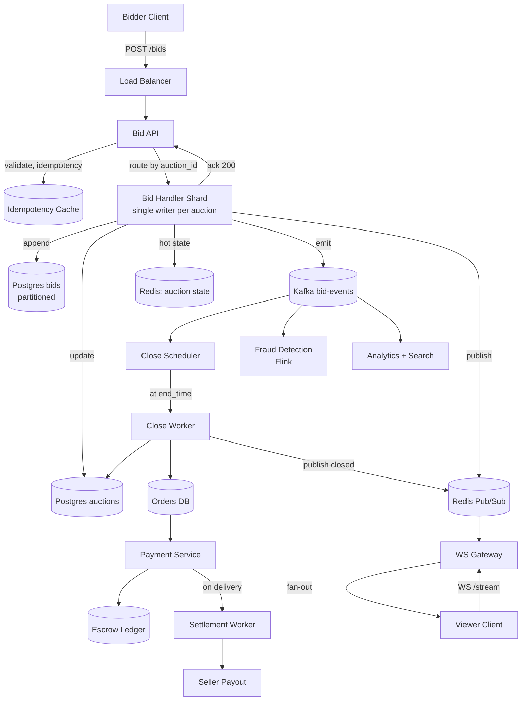

# Design an Online Auction System (eBay) — Bid Ordering, Sniping Protection, and Real-Time Fan-Out

**Date:** 2026-04-25 | **Updated:** 2026-04-25
**Tags:** `system-design` `case-study` `e-commerce` `real-time` `hard`

## Table of Contents

- [Summary](#summary)
- [Functional Requirements](#functional-requirements)
- [Non-Functional Requirements](#non-functional-requirements)
- [Capacity Estimation](#capacity-estimation)
- [API Design](#api-design)
- [Data Model](#data-model)
- [High-Level Design](#high-level-design)
- [Deep Dives](#deep-dives)
  - [1. Bid Acceptance + Strict Ordering — The Single Writer Per Auction](#1-bid-acceptance--strict-ordering--the-single-writer-per-auction)
  - [2. Sniping Protection — Auto-Extend Windows and Soft Close](#2-sniping-protection--auto-extend-windows-and-soft-close)
  - [3. Proxy Bidding — Auto-Increment Up to a Max](#3-proxy-bidding--auto-increment-up-to-a-max)
  - [4. Real-Time Broadcast Fan-Out — WebSockets, SSE, and Pub/Sub](#4-real-time-broadcast-fan-out--websockets-sse-and-pubsub)
  - [5. Reserve Prices and Buy-It-Now](#5-reserve-prices-and-buy-it-now)
  - [6. Final-Second Consistency and Auction Close](#6-final-second-consistency-and-auction-close)
  - [7. Escrow + Payment Settlement Flow](#7-escrow--payment-settlement-flow)
  - [8. Anti-Fraud — Shill Bidding and Account Risk Signals](#8-anti-fraud--shill-bidding-and-account-risk-signals)
- [Bottlenecks & Trade-offs](#bottlenecks--trade-offs)
- [Anti-Patterns](#anti-patterns)
- [Related](#related)
- [References](#references)

## Summary

An online auction looks like a counter that goes up. Underneath, it is one of the harder real-time consistency problems in commerce: every auction is a single timeline of monotonically increasing bids, every bidder must see the same current price within a fraction of a second, the winning bid at close is legally binding, and the last second of a popular auction can attract thousands of nearly simultaneous bids from sniping bots.

The realistic design accepts a small set of non-negotiables:

1. **Each auction has exactly one ordering authority.** Two bids cannot both "win" the same price level; somebody has to be first.
2. **The close time can shift.** A bid placed in the last 2 seconds extends the auction (anti-snipe). Without this, the experience degrades into a script-vs-script race.
3. **Money does not move when the hammer falls.** The winning bid creates an obligation; payment, escrow, and settlement run as a separate workflow that can take days.
4. **Trust signals are first-class.** Shill bidding, account collusion, and last-second wash bids must be detectable and reversible.

The design is layered: a stateful bid-handler shard (single writer per auction) writes the canonical bid log, a Redis-backed cache serves current price, a pub/sub fan-out pushes updates to WebSocket/SSE-connected clients, a scheduled close-job finalizes outcomes into an order, and a separate payment + escrow workflow settles funds.

## Functional Requirements

| Requirement | Notes |
|---|---|
| **List an item for auction** | Seller sets start price, optional reserve, optional Buy-It-Now, end time, increment rules |
| **Place a bid** | Bidder submits a bid amount; system validates it beats the current minimum increment |
| **Proxy bid** | Bidder submits a max amount; system auto-increments on their behalf as competing bids arrive |
| **Buy It Now** | If enabled and current price < BIN price, a buyer can end the auction immediately at the BIN price |
| **Reserve price** | A hidden floor; if reserve is not met at close, the auction does not produce a winner |
| **Real-time price updates** | All connected viewers receive the current price within ~500 ms of a new bid |
| **Auction close** | At end_time (possibly extended), the highest valid bid wins; system creates an order obligation |
| **Anti-snipe extension** | A bid in the final N seconds extends end_time by N seconds (typically 30–120 s) |
| **Bid retraction** | Limited cases (typo, seller change), audited and rare — must not destabilize ordering |
| **Payment + escrow** | Winner pays; funds held until delivery confirmation; release to seller; refund on dispute |
| **Anti-fraud signals** | Detect shill bidding, account collusion, and last-second wash patterns |

Out of scope:
- Recommender / search ranking
- Seller reputation rollups (separate signal pipeline)
- Tax and shipping calculation specifics

## Non-Functional Requirements

| NFR | Target |
|---|---|
| **Bid acceptance throughput per auction** | 500 bids/sec sustained for hot auctions, 5,000/sec burst in final 30 seconds |
| **Aggregate platform bid rate** | 50K–200K bids/sec at peak across all auctions |
| **Concurrent viewers per hot auction** | 100K simultaneous WebSocket/SSE connections |
| **Bid-to-broadcast p99 latency** | < 500 ms end-to-end (place → fan-out to all viewers) |
| **Bid-acceptance p99 latency** | < 200 ms (place → ack) |
| **Strong consistency on winning bid** | The winning bid at close is unambiguous, durable, and ordered |
| **Eventual consistency for viewers** | Up to ~1 s lag acceptable for non-bidder display |
| **Durability of every bid** | A bid that returned 200 OK must survive any single component failure |
| **Auction close timing accuracy** | ±100 ms relative to scheduled (extended) close time |
| **Availability** | 99.99% during auction hours; degraded read-only mode acceptable during partial outage |

The phrase to internalize: **a bid is a contract**. The system can drop a viewer's price-ticker update silently; it cannot drop, reorder, or duplicate a bid that returned a successful response.

## Capacity Estimation

### Baseline

- **Active auctions:** 500M concurrent (eBay scale)
- **Average bids per auction:** 5
- **Average auction duration:** 7 days
- **Average bid rate platform-wide:** ~5K bids/sec; **peak:** ~50K bids/sec

### Hot-auction scenario (final 30 seconds)

- **Bids per second on a single hot auction:** 500–5000 (mostly bots)
- **Concurrent viewers:** 50K–500K
- **WebSocket fan-out events/sec:** 1 broadcast × 500K subscribers = 500K msg/sec for one auction

### Storage

| Item | Size | 1-year volume |
|---|---|---|
| Bid record (auction_id, bidder_id, amount, ts) | ~80 B | 50K bids/sec × 86400 × 365 × 80 B ≈ **125 TB/year** |
| Auction record | ~1 KB | 500M × 1 KB ≈ 500 GB at any time |
| Order + payment | ~2 KB | ~100M completed/day × 2 KB × 365 ≈ 73 TB/year |

### Reads vs writes

- **Read:write ratio per auction:** 10K–100K (every viewer polling/streaming for every bid).
- This is what forces fan-out into a pub/sub layer; the database must never be in the read path of a viewer's price ticker.

## API Design

```http
POST /v1/auctions
Authorization: Bearer <token>
Content-Type: application/json

{
  "item_id": "i_abc",
  "start_price": "10.00",
  "reserve_price": "50.00",
  "buy_it_now_price": "120.00",
  "end_time": "2026-05-02T18:00:00Z",
  "anti_snipe_window_seconds": 60
}

201 Created
{
  "auction_id": "a_xyz",
  "current_price": "10.00",
  "ends_at": "2026-05-02T18:00:00Z"
}
```

```http
POST /v1/auctions/{auction_id}/bids
Authorization: Bearer <token>
Idempotency-Key: <uuid>
Content-Type: application/json

{
  "amount": "12.50",
  "max_proxy": "25.00"        // optional: enables proxy bidding up to this max
}

200 OK
{
  "bid_id": "b_123",
  "auction_id": "a_xyz",
  "accepted": true,
  "current_price": "12.50",
  "your_position": "leading",
  "ends_at": "2026-05-02T18:00:30Z"   // possibly extended
}

409 Conflict
{
  "error": "bid_too_low",
  "min_required": "12.50",
  "current_price": "12.00"
}
```

```http
POST /v1/auctions/{auction_id}/buy-it-now
Authorization: Bearer <token>
Idempotency-Key: <uuid>

200 OK
{
  "order_id": "o_456",
  "amount": "120.00",
  "ended_at": "2026-04-25T14:32:11Z"
}
```

```http
GET /v1/auctions/{auction_id}

200 OK
{
  "auction_id": "a_xyz",
  "current_price": "12.50",
  "leading_bidder_masked": "j***@example.com",
  "bid_count": 7,
  "ends_at": "2026-05-02T18:00:30Z",
  "reserve_met": true,
  "buy_it_now_available": true
}
```

### WebSocket / SSE event stream

Clients subscribe per-auction:

```
GET /v1/auctions/{auction_id}/stream     (SSE)
WS  /v1/ws?auction_ids=a_xyz,a_def        (WebSocket multiplex)
```

Server → client events:

```json
{ "type": "bid", "auction_id": "a_xyz", "current_price": "12.50",
  "bidder_masked": "j***", "bid_count": 7,
  "ends_at": "2026-05-02T18:00:30Z", "ts": "2026-05-02T17:59:30.412Z" }

{ "type": "extended", "auction_id": "a_xyz", "ends_at": "2026-05-02T18:01:30Z",
  "reason": "anti_snipe", "ts": "..." }

{ "type": "closed", "auction_id": "a_xyz", "winning_bid_id": "b_999",
  "final_price": "47.00", "reserve_met": true, "ts": "..." }
```

The `Idempotency-Key` on bids is critical: networks flake, clients retry, and a duplicate bid at the wrong moment can move the price twice.

## Data Model

### Auction

```sql
CREATE TABLE auctions (
  auction_id            BIGINT PRIMARY KEY,
  item_id               BIGINT NOT NULL,
  seller_id             BIGINT NOT NULL,
  start_price           NUMERIC(12,2) NOT NULL,
  reserve_price         NUMERIC(12,2),
  buy_it_now_price      NUMERIC(12,2),
  current_price         NUMERIC(12,2) NOT NULL,
  leading_bid_id        BIGINT,
  bid_count             INT NOT NULL DEFAULT 0,
  start_time            TIMESTAMPTZ NOT NULL,
  end_time              TIMESTAMPTZ NOT NULL,    -- mutable on anti-snipe
  anti_snipe_window_s   INT NOT NULL DEFAULT 60,
  status                TEXT NOT NULL,           -- 'live','closed','cancelled'
  version               BIGINT NOT NULL DEFAULT 0
);
CREATE INDEX ON auctions (end_time) WHERE status = 'live';  -- for the close scheduler
```

### Bids (durable append-only log)

```sql
CREATE TABLE bids (
  bid_id          BIGINT PRIMARY KEY,
  auction_id      BIGINT NOT NULL,
  bidder_id       BIGINT NOT NULL,
  amount          NUMERIC(12,2) NOT NULL,
  max_proxy       NUMERIC(12,2),
  sequence_no     BIGINT NOT NULL,        -- monotonic per auction_id
  placed_at       TIMESTAMPTZ NOT NULL,
  source_ip_hash  BYTEA,
  client_ts       TIMESTAMPTZ,
  status          TEXT NOT NULL,          -- 'accepted','rejected','retracted'
  reject_reason   TEXT,
  UNIQUE (auction_id, sequence_no)
) PARTITION BY HASH (auction_id);
```

The `(auction_id, sequence_no)` unique constraint is the **per-auction order of truth**. The bid handler assigns `sequence_no` monotonically inside its single-writer shard; the database refuses any duplicate or gap-violating bid.

### Orders + escrow

```sql
CREATE TABLE orders (
  order_id        BIGINT PRIMARY KEY,
  auction_id      BIGINT NOT NULL UNIQUE,
  buyer_id        BIGINT NOT NULL,
  seller_id       BIGINT NOT NULL,
  amount          NUMERIC(12,2) NOT NULL,
  status          TEXT NOT NULL,    -- 'pending_payment','paid','shipped','delivered','released','disputed','refunded'
  created_at      TIMESTAMPTZ NOT NULL,
  paid_at         TIMESTAMPTZ
);

CREATE TABLE escrow_holds (
  hold_id         BIGINT PRIMARY KEY,
  order_id        BIGINT NOT NULL UNIQUE,
  amount          NUMERIC(12,2) NOT NULL,
  status          TEXT NOT NULL,    -- 'held','released','refunded'
  held_at         TIMESTAMPTZ NOT NULL,
  released_at     TIMESTAMPTZ
);
```

### Hot state (Redis)

```
HSET auction:a_xyz current_price 12.50 leading_bidder b_id last_seq 7 ends_at 1714672830
PUBLISH auction:a_xyz <bid event JSON>
ZADD auctions_closing_soon <unix_ends_at> a_xyz   # used by the close scheduler
```

## High-Level Design



The flow on a bid:

1. Client POSTs with an `Idempotency-Key`.
2. Bid API validates the auction is live, dedupes the idempotency key, and routes the request to the bid handler shard that owns this `auction_id` (consistent hashing).
3. Bid handler (single writer for that auction) reads the canonical state from its in-memory cache (loaded from Postgres + Redis on shard takeover), validates the bid (amount > current + minimum increment, bidder ≠ seller, account in good standing), assigns the next `sequence_no`, and atomically:
   - INSERTs into `bids`
   - UPDATEs `auctions.current_price`, `leading_bid_id`, `bid_count`, possibly `end_time` (anti-snipe)
   - HSETs the hot state in Redis
   - PUBLISHes a bid event on Redis Pub/Sub for fan-out
   - Produces an event to Kafka for analytics, fraud, and audit
4. Returns 200 to the client.

The flow on a viewer subscription:

1. Viewer client opens WebSocket to a WS Gateway.
2. WS Gateway subscribes the connection to one or more Redis Pub/Sub channels keyed by `auction_id`.
3. On any published event, the gateway pushes it to every subscribed client connection.

The flow on auction close:

1. Close Scheduler watches `end_time` (mutable, can be extended).
2. When `now() >= end_time`, scheduler enqueues the close job for that auction's bid handler shard.
3. Bid handler stops accepting new bids (status flips to `closing`), waits for in-flight bids to drain, then computes the final outcome:
   - Highest valid bid wins, if reserve met.
   - Creates an `orders` row.
4. Publishes a `closed` event for viewers and triggers the payment workflow.

## Deep Dives

### 1. Bid Acceptance + Strict Ordering — The Single Writer Per Auction

Two bidders can submit `$50` within the same millisecond. Only one can be "first." The system needs a deterministic order that every component agrees on.

**Approach: single writer per auction shard.**

Auctions are sharded across N bid handler instances by consistent hashing of `auction_id`. All bids for one auction are routed to the same handler instance. That instance is the **only** process allowed to mutate that auction's state and assign `sequence_no`.

Inside the shard, bid validation and state mutation happen in a strict serial loop:

```
loop:
  bid = inbox.pop()
  state = cache[bid.auction_id]   # always-loaded for hot auctions
  if !valid(bid, state):
    reply(reject)
    continue
  seq = state.last_seq + 1
  txn:
    INSERT bids (..., sequence_no = seq)
    UPDATE auctions SET current_price=..., last_seq=seq, end_time=...
  state.update(...)
  redis.hset(...); redis.publish(...)
  kafka.produce(...)
  reply(accept)
```

The Postgres unique constraint `(auction_id, sequence_no)` is a safety net: if two handlers ever falsely believe they own the same auction (split-brain during a failover), one will get a unique-violation and the bid will be rejected. The bid never silently double-applies.

**Why not use database serializable transactions per bid?** It works correctness-wise, but at 5K bids/sec on one row Postgres collapses into lock waits and serialization failures. The single-writer-shard pattern moves contention out of the database into a single in-memory queue per auction — which the database then validates with a unique constraint, not a row lock.

**Failover.** When a bid handler dies, a controller (etcd / Zookeeper / Kafka consumer-group rebalance) reassigns its auctions to other handlers. The new owner replays state from Postgres + Kafka up to the last persisted `sequence_no`. There is a brief unavailability window (sub-second) on the affected auctions; bids during that window get a 503 and the client retries with the same idempotency key.

This is the pattern Kafka itself uses for partition leadership, and it is the same idea behind LMAX Disruptor's "single writer principle" — a single thread per aggregate eliminates locks and gives deterministic order.

### 2. Sniping Protection — Auto-Extend Windows and Soft Close

A "snipe" is a bid placed in the final second so no one has time to counter. eBay's traditional hard-close model rewards bot reflexes. Most modern auction platforms use **soft close**: a bid in the last N seconds extends the close time so a human always has time to respond.

**Rule:**

```
on accept_bid(b):
  if (auction.end_time - now) < anti_snipe_window:
    auction.end_time = now + anti_snipe_window
```

Concrete: with a 60-second anti-snipe window, a bid placed at `T-3s` pushes `end_time` to `now + 60s`. The auction can extend indefinitely as long as bids keep arriving inside the window. In practice, the bidding war converges within 2–10 extensions.

Implementation considerations:

1. **`end_time` lives in the bid handler's in-memory state** and Redis. The close scheduler must observe extensions, which is why the scheduler reads from Redis (or subscribes to `extended` events) rather than a stale Postgres snapshot.
2. **Extension events are broadcast.** Viewers see the new `ends_at` immediately; UI countdown timers reset.
3. **Proxy bids interact with anti-snipe.** A proxy max placed minutes before close can produce extension-triggering bids in the final window. This is desirable — it keeps proxy bidding fair against snipers.
4. **Bound the maximum extensions** (optional). Some platforms cap total extension at 10 minutes after the original `end_time` to prevent edge cases where the auction never ends.

The trade-off is between sniper-friendly hard close (purist auction theory) and human-friendly soft close (better user experience, less bot dominance). All major modern platforms have moved to soft close; eBay calls it "automatic extension" in some categories.

### 3. Proxy Bidding — Auto-Increment Up to a Max

Proxy bidding lets a user say "bid up to $100 on my behalf, but never higher than necessary." This is the standard eBay model and is essential because it prevents bidders from having to camp the auction.

**Algorithm on each incoming bid:**

```
state has:
  current_price       (highest accepted bid)
  leading_bidder      (who is currently winning)
  leading_max_proxy   (their secret max)

incoming bid b from bidder X with amount=A, max_proxy=M (M>=A):

  if X == leading_bidder:
    # raise their own max
    leading_max_proxy = max(leading_max_proxy, M)
    return accept (price unchanged)

  needed = current_price + min_increment
  if A < needed:
    return reject (too low)

  # case 1: new bid does not exceed current proxy
  if M <= leading_max_proxy:
    new_price = M + min_increment   # new bidder pushes price up; old leader still wins
    record bid for X at A (rejected as outbid by proxy)
    update current_price = M + min_increment
    leader unchanged
  else:
    # case 2: new bid beats the existing proxy
    new_price = leading_max_proxy + min_increment
    leading_bidder = X
    leading_max_proxy = M
    update current_price = new_price
```

**Worked example.**

- Auction at $10. Alice bids with `max_proxy = $50`. Current price = $10, Alice leads.
- Bob bids `$15` with `max_proxy = $30`. Bob's max ($30) is below Alice's max ($50). System auto-bids on Alice's behalf to `$30 + $1 = $31`. Bob loses, but he forced Alice's price up.
- Carol bids with `max_proxy = $80`. Carol's max ($80) beats Alice's ($50). System sets price to `$50 + $1 = $51`, Carol leads.
- Dave bids `$60`. Dave is below Carol's max. Carol's proxy auto-counters to `$60 + $1 = $61`. Dave loses.

The key insight: **proxies must be invisible to other bidders.** The display shows only the resulting price, never the leader's max. Leaking the max would let opponents bid `max + $1` for an instant win.

Storing `max_proxy` requires confidentiality. Treat it like a password-equivalent: never log, never broadcast, never include in any client response other than the leader's own.

### 4. Real-Time Broadcast Fan-Out — WebSockets, SSE, and Pub/Sub

Every accepted bid generates one outgoing event per connected viewer. A hot auction with 500K viewers and 500 bids/sec produces 250M outbound messages/sec — too much for any single process.

**Architecture:**

```
Bid Handler  ──publish──▶  Redis Pub/Sub (channel: auction:a_xyz)
                                 │
                                 ▼
                        WS Gateway fleet (1000s of nodes)
                                 │
                                 ▼
                       Each gateway pushes to its
                       locally connected subscribers
```

Each WS Gateway holds tens of thousands of WebSocket connections and subscribes to the Redis channels its connected clients care about. When Redis publishes a bid event, every gateway with a subscription receives it once and fans it out to its local connections — pushing the per-message work into many parallel CPUs.

**Why Redis Pub/Sub specifically?**
- O(1) publish per channel regardless of subscriber count
- Microsecond latency
- The trade-off is "at-most-once" delivery (no replay if a gateway disconnects). Fine for viewer ticks; a missed tick is recoverable from the next bid or a periodic snapshot.

**For durable distribution** (analytics, fraud, search reindex), Kafka runs in parallel. Kafka is the durable bus; Redis Pub/Sub is the low-latency tickers bus.

**WebSocket vs SSE choice:**

| | WebSocket | SSE |
|---|---|---|
| Direction | bidirectional | server → client only |
| Browser support | universal | universal except old IE |
| Through proxies/firewalls | sometimes blocked | works as plain HTTP |
| Reconnect | manual | built-in `EventSource` |
| Use here | bidder placing bids + receiving | viewer-only price ticker |

Many auction systems use both: SSE for read-only viewers (lighter, simpler), WebSocket for engaged bidders.

**Connection scale.** Each gateway node holds ~50K connections (kernel limits, file descriptors). 500K viewers per hot auction × 1 hot auction at peak = 10 gateway nodes minimum, in practice 100s for many concurrent auctions. Sticky load balancing by `auction_id` is helpful but not required; gateways subscribe to Redis channels independent of which clients land where.

**Backpressure.** A slow client must not block fast ones. Each connection has an outbound queue with a bounded size. On overflow, the gateway drops oldest events for that connection and may close it after repeated failures. The bidder still gets the authoritative response from the bid HTTP API; the WS stream is best-effort UI.

### 5. Reserve Prices and Buy-It-Now

**Reserve price.** A hidden floor. If the auction closes below reserve, no winner is declared.

```
on close:
  if leading_bid >= reserve:
    create order(buyer = leading_bidder, amount = leading_price)
    status = closed_winner
  else:
    status = closed_no_winner
    notify seller (offer to relist or accept best offer)
```

The display shows "reserve not met" while bidding is below reserve, and "reserve met" once the highest bid clears. The actual reserve number is never disclosed.

**Buy-It-Now (BIN).** A flat price that ends the auction immediately.

Conditions:
- Available only if no bids have been placed yet, OR
- Available until the current price reaches a threshold (e.g., 50% of BIN), then BIN is removed.

```
on buy_it_now(bidder X):
  state = bid_handler.acquire(auction_id)        # blocks new bids
  if state.bid_count > BIN_threshold OR state.current_price >= bin_price:
    return reject (BIN no longer available)
  txn:
    UPDATE auctions SET status='closed', current_price = bin_price, leading_bidder = X
    INSERT orders (buyer=X, amount=bin_price)
  redis.publish(closed event)
  trigger payment workflow
  state.release()
```

BIN must run through the **same single-writer shard** as bids. Otherwise two requests can race: a final bid pushes price above the BIN ceiling at the same moment as a BIN purchase. Routing both to one writer eliminates the race.

### 6. Final-Second Consistency and Auction Close

The last second is where most contention lives. Bots fire bids at `T-100ms`, `T-50ms`, `T-10ms`. Anti-snipe extends the deadline; new bids arrive after the supposed close. The close worker must precisely determine the winner.

**Close protocol:**

1. Scheduler observes `now() >= end_time` (read from Redis hot state, the source of truth for `end_time` extensions).
2. Scheduler sends `BEGIN_CLOSE` to the bid handler shard owning the auction.
3. Bid handler flips `status = closing`. New incoming bids return `auction_closed`.
4. Bid handler **drains** in-flight bids — those it has accepted into its internal queue but not yet committed. They are committed normally; they may extend `end_time` if inside the anti-snipe window.
5. After the drain, bid handler re-checks: did the most recent commit push `end_time` past `now()`? If so, abort the close, flip back to `live`, ack scheduler with the new `end_time`. Scheduler reschedules.
6. Otherwise, bid handler reads the final state and emits `CLOSED`. The current leader is the winner; reserve check determines whether an order is created.

Step 4–5 is the **drain-and-retry** pattern. Without it, a bid arriving at `T-1ms` could be silently dropped because the close fired at `T+0`. With it, every bid that the system *acknowledged* is honored.

**Clock discipline.** The bid handler's clock and the scheduler's clock must align within milliseconds. Use NTP-synced clocks and prefer monotonic clocks for relative comparisons. The authoritative `end_time` lives in shared state, not in any one process's clock.

**Audit log.** Every state transition and every bid in the final 60 seconds is logged with high-precision timestamps. Disputes over winning bids are settled from this log.

### 7. Escrow + Payment Settlement Flow

The hammer falls; a winner is declared. Payment is a separate, longer-running workflow.

**State machine:**

```
order: pending_payment
       │ buyer pays (Stripe / PayPal / wallet)
       ▼
order: paid                escrow: held
       │ seller ships
       ▼
order: shipped
       │ delivery confirmed (carrier API or buyer confirms)
       ▼
order: delivered
       │ inspection window (e.g., 3 days)
       ▼
order: released            escrow: released → seller payout
```

Branches:

- **Payment timeout** (buyer doesn't pay within N hours): order → `cancelled_no_payment`. Seller may relist; bidder takes a reputation hit; second-highest bidder may receive a "second chance offer."
- **Dispute** (item not as described, not received): order → `disputed`, escrow stays held. Customer support / arbitration workflow runs offline. Outcome: `released` to seller or `refunded` to buyer.

**Why escrow.** Both sides need protection. Buyers don't want to pay before they have the item; sellers don't want to ship before they have funds. The platform holds the money in a regulated escrow account (often via a payments partner), releasing only after delivery + inspection.

**Distributed transaction shape.** Order creation, escrow hold, and notification are coordinated via a saga, not a 2PC. Each step is idempotent and emits a Kafka event:

```
auction.closed → create_order → reserve_escrow → notify_buyer
            ↓ (failure at any step)
            compensate (notify, retry, or mark cancelled)
```

See the linked [distributed transactions](../../data-consistency/distributed-transactions.md) doc for saga patterns and compensation guarantees. The auction system never blocks on payment — auction close completes immediately, payment runs as an asynchronous follow-up.

**Refunds and rollback.** A confirmed dispute that decides for the buyer triggers `escrow.refund` → `order.refunded`. The seller's reputation is debited; if the seller has already been paid (rare due to inspection window), the platform absorbs the cost or recovers from the seller's outstanding balance.

### 8. Anti-Fraud — Shill Bidding and Account Risk Signals

**Shill bidding** is when a seller (or accomplice) bids on the seller's own auction to inflate the price. It is illegal on most platforms and detectable through patterns:

| Signal | Pattern |
|---|---|
| **Same household** | Bidder and seller share device, IP subnet, payment instrument, or address |
| **Bid then retract** | Bidder pushes price up, then "retracts" near close after another bidder is committed |
| **Never wins** | Account participates in many auctions, places competitive bids, almost never wins |
| **Coordinated timing** | Bidder consistently bids only on this seller's items |
| **New account** | Account created days before, only activity is bidding on this seller |

**Pipeline:**

```
Kafka bid-events ──▶ Flink streaming job
                       │
                       ▼
                Real-time risk score per bid
                       │
                       ▼
                If score > threshold:
                  - flag bid for review
                  - throttle bidder
                  - notify trust + safety queue
                If score >> threshold:
                  - reject bid (rare; high false-positive cost)
```

**Graph signals.** Periodic batch jobs run graph algorithms on bidder/seller relationships. Tight clusters (sellers and bidders who only interact with each other) are escalated. This catches collusion that streaming alone misses.

**Wash detection in the final seconds.** A bid from an account closely tied to the seller in the final 30 seconds — when the price is already above the seller's likely target — is a high-confidence shill signal. The fraud system can flag it and, post-close, request review. Closed auctions can be reversed within a window if shill is confirmed; the second-highest legitimate bidder gets the item.

**Bidder protection vs over-blocking.** The trade-off: false positives anger genuine bidders ("why is my bid rejected?"). Most signals are used to **flag for human review**, not auto-reject. Auto-reject is reserved for the highest-confidence patterns (e.g., bidder and seller share a verified payment method).

This pipeline aligns with what eBay published about machine learning for fraud detection and what payment processors describe as risk-scoring at the transaction edge.

## Bottlenecks & Trade-offs

| Component | Bottleneck | Mitigation |
|---|---|---|
| Bid Handler shard | Single writer per auction limits throughput on one auction to ~10K bids/sec | Reject bids that don't beat current + min_increment at the API layer; most spam bids never reach the handler |
| Postgres bids partition | Append-rate per partition under hot auction load | Hash-partition by auction_id; batch INSERTs from the handler in ≤10 ms windows |
| Redis Pub/Sub | At-most-once delivery; no replay | Pair with Kafka for durable consumers; viewers get best-effort ticks |
| WebSocket Gateway | Connection count per node, fan-out per CPU | Horizontal scale; consistent hashing of auction_id can reduce per-node subscription count |
| Close Scheduler | Wall-clock precision under load | Pre-arm closes 1s early; final commit decision lives in the bid handler shard |
| Payment workflow | External payment provider latency / failures | Saga with retries + compensation; auction close decouples from payment |
| Anti-fraud Flink | State explosion if windows too long | Rolling 7-day window with periodic snapshots; long-tail signals computed in batch |

The headline trade-off is **per-auction strict ordering vs platform-wide horizontal scale**. We accept that one auction's bid throughput is bounded by one writer; we scale by partitioning the platform across many writers. For 99.9% of auctions, a single writer is far more than enough; for the few mega-auctions, the bottleneck becomes a feature (enforces fair, deterministic ordering) rather than a bug.

A second important trade-off is **broadcast latency vs durability**. The price ticker travels via Redis Pub/Sub for sub-100 ms latency at the cost of at-most-once delivery. The authoritative bid log travels via Postgres + Kafka for durability at the cost of higher latency. The two paths are complementary, not competing.

## Anti-Patterns

1. **Storing the canonical bid order in the database alone with row-level locks.** Hot auction = lock storms; throughput collapses well below requirements. Use a single-writer shard with the database as durable backstop.
2. **Letting any bid handler write any auction.** Without consistent hashing + leadership, two handlers will race. The unique `(auction_id, sequence_no)` constraint will catch it, but you'll have flaky, hard-to-debug rejections under failover.
3. **Using a hard close.** Snipers dominate, humans give up, the auction model degrades. Always implement anti-snipe extension.
4. **Broadcasting bid events from the database via polling.** Every viewer polling every second creates millions of useless reads. Use pub/sub fan-out from the bid handler at the moment of write.
5. **Sending the leader's max_proxy in any client-visible response.** Leaking max breaks proxy bidding economics. Mask everything except the leader's own UI.
6. **Synchronous payment in the close path.** Close happens at the wall-clock deadline; payment can fail or take seconds to minutes. Decouple. Close emits a `closed` event; payment runs as a follow-up workflow.
7. **No idempotency on bids or BIN.** Mobile retries produce double-applied bids. The price moves twice; the leader status flickers. Always require `Idempotency-Key`.
8. **Auto-rejecting on weak fraud signals.** False positives anger real bidders and damage marketplace trust. Most signals → human review queue; auto-reject only the strongest patterns.
9. **Single Redis Pub/Sub instance for the whole platform.** Becomes a single point of contention. Shard channels across a Redis Cluster keyed by `auction_id`.
10. **No drain-and-retry at close.** Bids accepted at `T-1ms` get silently dropped when the scheduler fires. Either the system honors every accepted bid or it must fail the bid before acknowledging it.

## Related

- [Real-Time Channels — WebSockets, SSE, Long-Polling](../../communication/real-time-channels.md) — protocol comparison and fan-out patterns used for the price ticker.
- [Event-Driven Architecture](../../communication/event-driven-architecture.md) — Kafka as the durable bus that connects bidding, fraud, search, and analytics.
- [Distributed Transactions](../../data-consistency/distributed-transactions.md) — saga + compensation patterns underpinning the auction-close → order → escrow flow.
- [Designing a Payment System](../payment/design-payment-system.md) — payment workflow, escrow ledger, and idempotency patterns referenced in deep dive #7.
- [Online Auction — Low-Level Design](../../../low-level-design/case-studies/online-auction.md) — class structures, state machines, and proxy-bid algorithm at code level (LLD twin to this HLD).

## References

- [eBay Tech Blog — Real Time Communication at Scale](https://innovation.ebayinc.com/tech/engineering/realtime-communication-with-mqtt-and-websockets-at-ebay/) — eBay's production WebSocket and MQTT architecture for real-time updates.
- [Kafka Documentation — Single-Writer Principle for Partitions](https://kafka.apache.org/documentation/#log) — partition leadership model that inspires per-auction single-writer sharding.
- [Redis Pub/Sub — official docs](https://redis.io/docs/latest/develop/interact/pubsub/) — semantics, at-most-once delivery, and patterns for high-fanout broadcast.
- [LMAX Disruptor — Single Writer Principle](https://lmax-exchange.github.io/disruptor/disruptor.html) — foundational paper on the design of single-writer event handlers for low-latency exchanges.
- [Sotheby's Online Auction Soft Close — Auction Theory Foundations](https://www.sothebys.com/en/articles/the-evolution-of-online-bidding) — soft close / anti-snipe rationale from a leading auction house.
- [Stripe Connect — Escrow and Marketplace Payouts](https://stripe.com/docs/connect/charges) — practical escrow + delayed payout patterns used by marketplaces.
- [eBay Engineering — Machine Learning for Trust and Safety](https://innovation.ebayinc.com/tech/engineering/) — risk scoring and shill-detection signal patterns at marketplace scale.
- [Designing Data-Intensive Applications, Ch. 11 — Stream Processing](https://www.oreilly.com/library/view/designing-data-intensive-applications/9781491903063/) — Kleppmann on event ordering, exactly-once, and saga semantics that inform the close + payment workflow.
