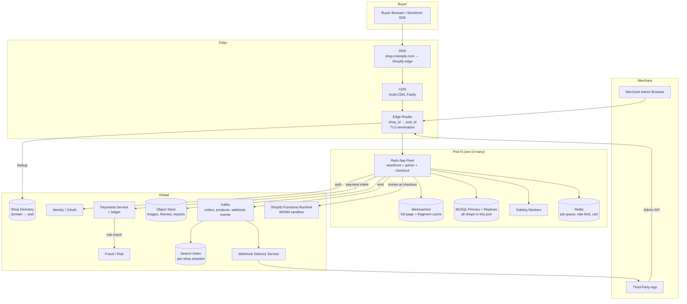
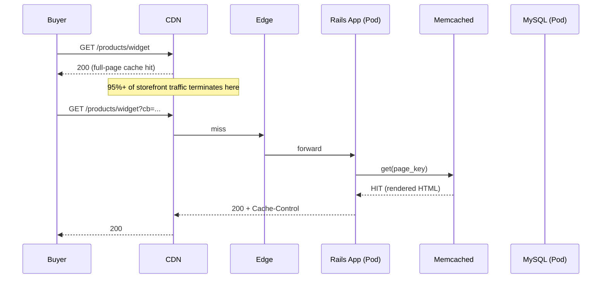
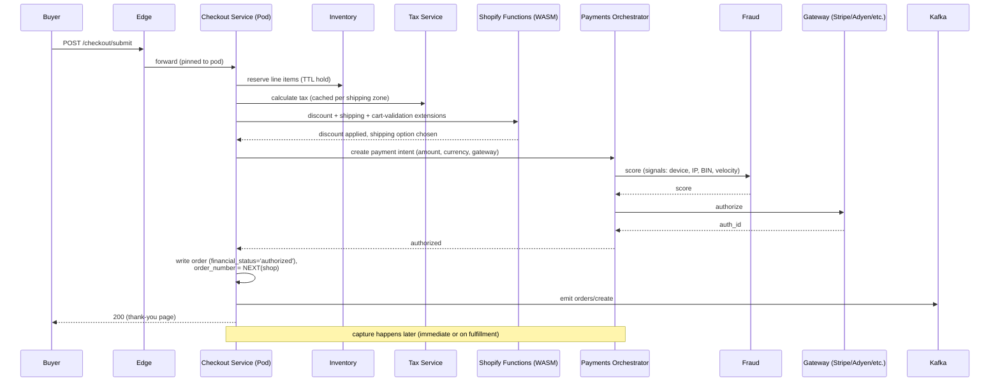
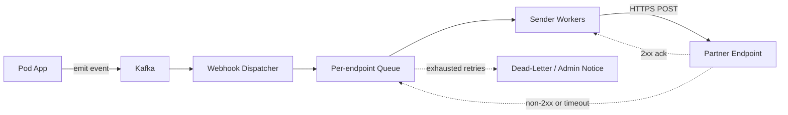

# Design Shopify — Multi-Tenant Storefront, Pod Sharding, App Marketplace, and BFCM-Scale Checkout

**Date:** 2026-04-25 | **Updated:** 2026-04-25
**Tags:** `system-design` `case-study` `e-commerce` `multi-tenant` `medium`

## Table of Contents

- [Summary](#summary)
- [Functional Requirements](#functional-requirements)
- [Non-Functional Requirements](#non-functional-requirements)
- [Capacity Estimation](#capacity-estimation)
- [API Design](#api-design)
- [Data Model](#data-model)
- [High-Level Design](#high-level-design)
- [Deep Dives](#deep-dives)
  - [1. Pod Sharding — Tenant Isolation by Construction](#1-pod-sharding--tenant-isolation-by-construction)
  - [2. Themes and the Online Store Rendering Path](#2-themes-and-the-online-store-rendering-path)
  - [3. App / Plugin Marketplace and Sandbox Extensibility](#3-app--plugin-marketplace-and-sandbox-extensibility)
  - [4. Checkout Pipeline and Checkout Extensibility](#4-checkout-pipeline-and-checkout-extensibility)
  - [5. Multi-Region Payments Orchestration](#5-multi-region-payments-orchestration)
  - [6. BFCM Autoscale and Capacity Engineering](#6-bfcm-autoscale-and-capacity-engineering)
  - [7. Async Order Processing](#7-async-order-processing)
  - [8. Webhooks for App Integrations](#8-webhooks-for-app-integrations)
- [Bottlenecks and Trade-offs](#bottlenecks-and-trade-offs)
- [Anti-Patterns](#anti-patterns)
- [Related](#related)
- [References](#references)

## Summary

Shopify is a **multi-tenant commerce platform**: millions of merchants share a single platform code base, but each merchant ("shop") sees an isolated storefront, admin, catalog, and order ledger. The hard problems are not "render a product page" — they are **noisy-neighbor isolation between shops**, **a flash-crowd event (Black Friday Cyber Monday — BFCM) that 10×–40×s baseline traffic worldwide in the same hour**, **a checkout that must remain transactionally correct across regions, currencies, and payment providers**, and **a third-party app ecosystem that runs partner code adjacent to merchant data without compromising it**.

Shopify's real architecture, as documented in their engineering blog, is built around **pods** — independent vertical stacks of MySQL plus application servers, each holding a disjoint set of shops. A request enters the edge, gets routed to its shop's pod, and stays there. Failure of one pod degrades a slice of merchants; the rest are unaffected by construction. Layered on top: a heavily cached storefront rendering tier (Liquid templates, full-page cache), a Ruby on Rails monolith ("Shopify Core") that owns the admin and checkout, an async job system (originally Resque, now Sidekiq + Kafka), and a sandboxed app platform that talks to Core via REST/GraphQL Admin APIs and webhooks. This document walks the HLD a senior engineer would draw, then drills into the parts that actually break under BFCM pressure.

## Functional Requirements

**Merchant onboarding and admin**

- Sign up a shop with a unique subdomain (`acme.myshopify.com`) and optional custom domain (`shop.acme.com`).
- Manage products, variants, inventory, collections, customers, discounts, and shipping rules.
- Per-merchant staff accounts with role-based permissions.

**Storefront**

- Render the online store from a Liquid theme: home, collection, product, cart, search.
- Custom domain TLS termination per merchant.
- Localized currency, language, and tax based on visitor geo.

**Checkout**

- Cart lifecycle: add/update/remove line items, apply discounts, calculate shipping and tax.
- Payment via Shopify Payments (first-party) or third-party gateways (Stripe, PayPal, Adyen, etc.).
- Fraud screening, 3-D Secure (SCA), wallet checkouts (Shop Pay, Apple Pay, Google Pay).
- Order confirmation, receipt email, post-purchase upsells.

**Apps and extensibility**

- App marketplace: install third-party apps that read/write shop data via Admin APIs.
- Webhooks: shops emit events (`orders/create`, `products/update`, `app/uninstalled`) consumed by apps.
- Theme app extensions, checkout UI extensions, and Shopify Functions (custom logic at checkout).

**Operations**

- Bulk import/export, Shopify Flow (workflow automation), reports, multi-location inventory.
- Shopify POS for in-person checkout.

**Out of scope for this HLD**

- Shop, the consumer-facing buyer app.
- Shopify Markets cross-border tax and duty pricing engine.
- Shopify Shipping and Shopify Fulfillment Network logistics.

## Non-Functional Requirements

| NFR | Target | Why |
|-----|--------|-----|
| Tenant isolation | One shop's load cannot starve another | Single noisy merchant must not take the platform down. |
| Storefront P50 / P99 | < 100 ms / < 400 ms (cache-hit) | Cart abandonment scales with latency. |
| Checkout P99 | < 1.5 s end-to-end | Payment authorization dominates; everything else must be tight. |
| Checkout availability | 99.99% during BFCM | A checkout outage on Black Friday is a multi-million-dollar loss per minute, platform-wide. |
| Read:write ratio (storefront) | ~100:1 | Browsing dominates; aggressive caching pays off. |
| Order durability | Once written, never lost | Lost orders = lost revenue + chargebacks + tax compliance issues. |
| Multi-region | Active-active reads; pod-pinned writes | Latency for global buyers; data residency for merchants. |
| BFCM peak | 10–40× baseline checkouts/sec | Documented by Shopify; the system is sized for this. |
| Strong consistency surfaces | Inventory decrements, payment captures, order numbers | Overselling and double-charges are unacceptable. |
| Eventual consistency surfaces | Search index, analytics, recommendations | Acceptable; users tolerate seconds of staleness. |

## Capacity Estimation

Order-of-magnitude figures for sizing, not Shopify's actual numbers.

**Tenants and traffic**

- ~5 M active shops on the platform (public Shopify data points cite "millions of merchants").
- ~1 B unique storefront visitors/month → ~400 K storefront page views/sec average.
- Checkouts: ~1 B/year baseline → ~30/sec average; **BFCM peak documented at hundreds of thousands of checkouts per minute and tens of GB/min in payments**, with peak request rates that exceed 75 M requests per minute platform-wide during BFCM (Shopify Engineering, 2023).
- App webhooks: tens of billions of webhook deliveries per year; a single popular app shop can emit hundreds of webhooks per order.

**Storage**

- Per-shop catalog: a long tail averages a few hundred SKUs; large merchants can hold millions. Plan for skew.
- Orders: ~100 GB–10 TB per pod at maturity; compounding annually.
- Total platform: petabyte-scale across all pod MySQL clusters; many petabytes in object storage for product images, theme assets, and exports.

**Pod sizing**

- Shopify documents tens to hundreds of pods, each a vertical stack (MySQL primary + replicas + Memcached + app fleet).
- A pod typically hosts thousands of small shops *or* a small number of very large shops; placement is policy-driven.

**Bandwidth**

- Storefront images dominate egress; served via CDN (multi-CDN strategy: Fastly historically, plus internal infrastructure).
- Checkout request payloads are small (KB) but high QPS during BFCM.

## API Design

Shopify exposes three distinct API surfaces with different audiences and consistency expectations.

**Storefront API (public, buyer-facing, GraphQL)**

Read-heavy, anonymous-friendly, used by themes and headless storefronts (Hydrogen).

```graphql
query Product($handle: String!) {
  product(handle: $handle) {
    id
    title
    descriptionHtml
    options { name values }
    variants(first: 100) {
      edges { node { id title price { amount currencyCode } availableForSale } }
    }
    images(first: 10) { edges { node { url(transform: {maxWidth: 1080}) altText } } }
  }
}
```

- Aggressively cacheable at the edge; cache key includes shop, locale, currency, and theme version.
- Cart mutations (`cartCreate`, `cartLinesAdd`) bypass the cache.

**Admin API (merchant + apps, REST + GraphQL)**

Authenticated via OAuth (apps) or session (admin UI). Strong consistency for writes.

```http
GET    /admin/api/2026-04/products.json
POST   /admin/api/2026-04/products.json
PUT    /admin/api/2026-04/products/{id}.json
DELETE /admin/api/2026-04/products/{id}.json

GET    /admin/api/2026-04/orders.json?status=open&financial_status=paid
POST   /admin/api/2026-04/orders/{id}/transactions.json   # capture/refund
POST   /admin/api/2026-04/inventory_levels/adjust.json
```

- Versioned by quarter (`2026-04`) so apps don't break on platform changes.
- Per-shop rate-limited via a leaky-bucket scheme (the "API call limit"): a shop has a bucket size and a steady refill rate; bursts allowed up to bucket size. GraphQL uses a calculated query cost model so a single complex query is not "free."

**Webhooks (push, app-bound)**

```http
POST {app_endpoint}
X-Shopify-Topic: orders/create
X-Shopify-Shop-Domain: acme.myshopify.com
X-Shopify-Hmac-SHA256: <hmac of body using app secret>
X-Shopify-Webhook-Id: <uuid for idempotency>
Content-Type: application/json

{ "id": 4501..., "line_items": [...], "total_price": "129.00", ... }
```

- HMAC-signed; apps verify before processing.
- At-least-once delivery with exponential backoff retry on non-2xx (~19 retries over 48 h, per Shopify docs); apps must be idempotent on `X-Shopify-Webhook-Id`.
- Topics include lifecycle (`app/uninstalled`), data mutation (`orders/create`, `products/update`), and compliance (`customers/data_request`, `customers/redact`, `shop/redact`).

**Authentication**

- Buyers: anonymous + cart token cookie.
- Merchants: session cookie + 2FA.
- Apps: OAuth 2.0 per shop install; access tokens scoped to requested permissions.

## Data Model

Each pod hosts a sharded MySQL cluster. The schema is **shop-scoped end-to-end** — every business table carries `shop_id` (often as part of the primary key or as a partition key) and every query filters by it. This is enforced at the application framework layer so a missing `shop_id` is impossible to write.

```sql
-- All tables within a pod include shop_id; foreign keys stay within the pod.

shops (
  id            BIGINT PRIMARY KEY,
  domain        VARCHAR(255) UNIQUE,        -- acme.myshopify.com
  custom_domain VARCHAR(255) NULL UNIQUE,
  pod_id        SMALLINT,                   -- denormalized; canonical mapping in router
  plan          VARCHAR(32),
  currency      CHAR(3),
  country       CHAR(2),
  created_at    TIMESTAMP,
  status        VARCHAR(16)                 -- 'active' | 'frozen' | 'closed'
)

products (
  id          BIGINT,
  shop_id     BIGINT,
  handle      VARCHAR(255),                 -- URL slug
  title       VARCHAR(255),
  body_html   TEXT,
  vendor      VARCHAR(255),
  product_type VARCHAR(255),
  status      VARCHAR(16),                  -- 'active' | 'draft' | 'archived'
  created_at  TIMESTAMP,
  PRIMARY KEY (shop_id, id),
  UNIQUE KEY (shop_id, handle)
)

variants (
  id          BIGINT,
  shop_id     BIGINT,
  product_id  BIGINT,
  sku         VARCHAR(255),
  price       DECIMAL(12,2),
  compare_at_price DECIMAL(12,2) NULL,
  inventory_item_id BIGINT,
  PRIMARY KEY (shop_id, id),
  KEY (shop_id, product_id)
)

inventory_levels (
  shop_id        BIGINT,
  inventory_item_id BIGINT,
  location_id    BIGINT,
  available      INT,
  updated_at     TIMESTAMP,
  PRIMARY KEY (shop_id, inventory_item_id, location_id)
)

orders (
  id           BIGINT,
  shop_id      BIGINT,
  order_number INT,                         -- per-shop monotonic
  customer_id  BIGINT NULL,
  email        VARCHAR(255),
  total_price  DECIMAL(12,2),
  currency     CHAR(3),
  financial_status VARCHAR(32),             -- 'pending' | 'authorized' | 'paid' | 'refunded'
  fulfillment_status VARCHAR(32) NULL,
  created_at   TIMESTAMP,
  PRIMARY KEY (shop_id, id),
  UNIQUE KEY (shop_id, order_number)
)

line_items (
  shop_id     BIGINT,
  order_id    BIGINT,
  id          BIGINT,
  variant_id  BIGINT,
  quantity    INT,
  price       DECIMAL(12,2),
  PRIMARY KEY (shop_id, order_id, id)
)

transactions (
  shop_id     BIGINT,
  order_id    BIGINT,
  id          BIGINT,
  kind        VARCHAR(16),                  -- 'authorization' | 'capture' | 'refund' | 'void'
  status      VARCHAR(16),                  -- 'pending' | 'success' | 'failure'
  amount      DECIMAL(12,2),
  gateway     VARCHAR(64),
  gateway_reference VARCHAR(255),
  created_at  TIMESTAMP,
  PRIMARY KEY (shop_id, order_id, id)
)

-- App installs and access tokens
app_installations (
  shop_id     BIGINT,
  app_id      BIGINT,
  access_token_encrypted VARBINARY(255),
  scopes      JSON,
  installed_at TIMESTAMP,
  PRIMARY KEY (shop_id, app_id)
)

webhooks (
  shop_id     BIGINT,
  id          BIGINT,
  topic       VARCHAR(64),
  endpoint    VARCHAR(1024),
  hmac_secret VARBINARY(64),
  PRIMARY KEY (shop_id, id),
  KEY (shop_id, topic)
)
```

**Cross-pod data lives outside the pods.**

- Global shop directory (`domain → pod_id`) in a small, replicated control-plane database.
- Search index (Elasticsearch) keyed by `(shop_id, doc_id)`; sharded so a shop's documents stay co-located.
- Object storage for product images, theme assets, and large exports (S3/GCS).
- A separate Payments service owns its own ledger; Core records *references* (gateway ids), not card data.

## High-Level Design



## Deep Dives

### 1. Pod Sharding — Tenant Isolation by Construction

A pod is the unit of horizontal scale and the unit of failure isolation. Each pod is a self-contained vertical stack:

- A primary MySQL with replicas (read pool + DR replica).
- A Memcached cluster.
- A Redis instance for job queues and short-lived state.
- A pool of Rails app servers and Sidekiq workers.

A shop is **assigned to exactly one pod**. All of its rows live in that pod's MySQL; all of its requests are routed to that pod's app servers. Foreign keys never cross pods.

**Routing.** The edge router resolves `shop_domain → pod_id` against a small, globally replicated **shop directory** (low-cardinality, read-mostly, write-rarely). The lookup result is cached on the edge for many seconds. The router then forwards the request to the correct pod's app fleet.

```text
Request:   GET acme.myshopify.com/products/widget
Edge:      directory.lookup("acme.myshopify.com") → pod=42
Edge:      forward to pod-42 app pool
Pod 42:    Rails app, with database connection scoped to pod-42 MySQL,
           runs the controller, returns rendered HTML
```

**Why pods over a single sharded cluster.** Two reasons that are non-negotiable in practice:

1. **Blast radius.** A bad migration, a runaway query, or a primary failover affects only the pod's shops. The platform stays up.
2. **Noisy-neighbor isolation.** A shop running a reckless GraphQL query, or a viral merchant getting hugged-to-death, can saturate its pod's MySQL — but cannot starve a different pod's MySQL of IO. (Within a pod, per-shop rate limits and query cost limits handle the intra-pod case.)

**Pod placement and rebalancing.** A shop is initially placed in a pod with available capacity. When a pod approaches capacity, **shop moves** (also called "shop migrations") relocate selected shops to lower-utilization pods. Shopify's published work on the move tooling describes how to copy a shop's rows into a new pod, replay deltas, freeze writes briefly, flip the directory entry, and unfreeze. The freeze window is on the order of seconds to minutes for typical shops; very large merchants are special-cased.

**Hot pod problem.** A single very large merchant (a Kardashian-tier launch, a viral DTC brand) can dominate a pod by itself. Shopify's answer: a few pods are "premium" pods sized for whales, and the largest merchants get dedicated or near-dedicated pod capacity. Placement is a policy choice, not a hash.

For sharding fundamentals — hash-based vs range-based vs directory, resharding, hot-shard mitigation — see [`../../scalability/sharding-strategies.md`](../../scalability/sharding-strategies.md).

### 2. Themes and the Online Store Rendering Path

Storefronts are rendered from **Liquid templates** (Shopify's open-source templating language). A theme is a versioned tree of templates, sections, snippets, JS, CSS, and assets stored per-shop in object storage and metadata in the pod's MySQL.

**Render pipeline (cache-hit case):**



**Render pipeline (cache-miss case):**

```text
App:
  1. Resolve theme version for shop
  2. Load product (with eager-loaded variants, images) from MySQL via Memcached
  3. Compile Liquid template (cached per theme version)
  4. Render with product context, locale, currency
  5. Store rendered HTML in Memcached + emit cache headers for the CDN
```

**Cache key composition.**

```text
key = shop_id : theme_version : path : locale : currency : (logged-in flag) : variant-pricing-bucket
```

- Theme version is the explicit cache-busting axis: a theme edit publishes a new version and invalidates by key namespace.
- Logged-in customer pages bypass cache (personalized cart, customer-specific prices).

**Liquid sandboxing.** Liquid is intentionally Turing-incomplete: no arbitrary code execution, no filesystem access, no looping over unbounded sets without explicit limits. This is what makes it safe to run merchant-authored templates (and by extension, app-authored theme app extensions) on shared infrastructure.

**Sections and Online Store 2.0.** Sections are reusable, JSON-configured Liquid blocks that merchants drag-drop in the theme editor. Their schema is part of the theme; their data is per-page. This pushes most layout decisions into data the merchant edits, not code, which keeps theme upgrades safe.

### 3. App / Plugin Marketplace and Sandbox Extensibility

Shopify's app platform is the bet that lets the core team avoid building every feature any merchant might want. An app is an external service (run by the developer, not Shopify) that:

1. Is installed by a merchant via OAuth, receiving a per-shop access token with scoped permissions.
2. Calls the Admin REST or GraphQL API to read/write shop data.
3. Receives webhooks when shop events occur.
4. Optionally registers UI extensions (admin pages, theme app extensions, checkout UI extensions) and Shopify Functions (logic at checkout).

**Trust model.** Apps run *off-platform* — Shopify does not host arbitrary partner code on its servers. This is the cleanest possible isolation: the partner's bugs run on the partner's infrastructure. Shopify's surface area for compromise is the API gateway (rate limits, auth), the webhook delivery system, and the Functions runtime.

**On-platform code: Shopify Functions.** Some hooks need to run inside the checkout call path with single-digit-millisecond latency; shipping a request out to a partner server would dominate checkout latency. Shopify Functions solves this by allowing developers to upload **WebAssembly** modules that execute in a sandboxed runtime owned by Shopify, invoked at well-defined extension points (discount logic, payment customization, delivery customization, cart validation). WASM gives a hard memory and CPU budget, no syscalls, no network — a bug in a Function cannot leak data or stall checkout.

**App rate limiting.** Per shop and per app, the Admin API enforces:

- REST: leaky-bucket of API calls; bucket size and refill rate scale with the shop's plan.
- GraphQL: calculated query cost — every field has a cost, complex queries cost more, the same bucket model applies in points.

This prevents a buggy app from monopolizing a pod's database.

**App lifecycle.**

- Install: OAuth grant → Shopify generates an access token → app stores it.
- Uninstall: Shopify emits `app/uninstalled` webhook → app must purge shop data per merchant data policy.
- Mandatory privacy webhooks: `customers/data_request`, `customers/redact`, `shop/redact` for GDPR/CCPA compliance.

**App billing.** Shopify itself bills the merchant for the app and remits to the developer; the app does not handle payment for its subscription. This eliminates a whole class of partner billing bugs.

### 4. Checkout Pipeline and Checkout Extensibility

Checkout is the single most important call path on the platform. It must:

1. Compute correct totals (subtotal, discount, shipping, tax) in the shop's currency.
2. Reserve inventory atomically.
3. Authorize and capture payment via the merchant's chosen gateway.
4. Persist a durable order with a strictly monotonic per-shop order number.
5. Emit downstream events for fulfillment, email, analytics, and apps.
6. All within a budget the buyer perceives as instant (~1.5 s P99 for the entire submit).

**Pipeline stages.**



**Inventory reservation.** A short-TTL "hold" row (in MySQL or Redis) decrements available stock at submit-start; on success it is converted to a permanent decrement, on failure (timeout, payment decline) it expires and stock is returned. This is the standard solution to overselling under flash-crowd traffic. Strong consistency is required here — the inventory row is the system of record.

**Order numbers.** Per-shop monotonic, allocated atomically (e.g., a row in MySQL with `SELECT ... FOR UPDATE` plus `UPDATE`, or a per-shop sequence). Cross-shop global IDs use Shopify's GID format (`gid://shopify/Order/123`), but the human-readable `#1042` is per-shop.

**Checkout extensibility.** Pre-Shopify-Functions, third parties customized checkout via Shopify Plus "checkout.liquid" — full Liquid editing of the checkout. This was deprecated because it created a brittle coupling: every checkout improvement risked breaking merchant Liquid edits. The current model:

- **Checkout UI extensions** (React-like components, run in a sandboxed iframe with a controlled API surface).
- **Shopify Functions** for logic (discounts, payment customization, shipping, validation).
- **Branding configuration** for visual customization.

This is intentionally a smaller surface area, and Shopify owns the underlying checkout HTML/JS so it can ship platform-wide changes (Shop Pay, accessibility, performance) without breaking merchants.

For the shared building block — flash-crowd handling, queueing buyers, reservation timeouts — see [`./design-flash-sale.md`](./design-flash-sale.md).

### 5. Multi-Region Payments Orchestration

Payments is its own service with its own ledger, deliberately split from Core. Reasons:

- **Compliance scope.** PCI DSS scope is minimized when card data lives in one service rather than smeared across the monolith.
- **Region-locality.** Some payment methods, gateways, and regulations are region-specific (PSD2/SCA in Europe, GST/IGST split in India, Pix in Brazil, iDEAL in the Netherlands). The Payments service runs replicas closer to the gateways it talks to.
- **Failure isolation.** A degraded gateway should not cascade into Core admin slowness.

**Architecture sketch:**

```text
Core (pod) --create_payment_intent--> Payments Orchestrator
                                           |
              +----------------------------+----------------------------+
              |                            |                            |
        Risk Service              Gateway Adapter (Stripe)     Gateway Adapter (Adyen)
                                           |                            |
                                       Stripe API                   Adyen API
              |
        Ledger (double-entry)
```

- The orchestrator owns retries, idempotency, and the gateway selection logic (Shopify Payments first, fallback gateways per merchant config).
- The ledger is double-entry: every authorization, capture, refund, and chargeback is two balanced postings. This is what makes month-end reconciliation tractable.
- Idempotency keys are mandatory on all gateway calls — a network blip retry must not create a duplicate authorization.

**Multi-currency.** A merchant can sell in multiple currencies. The payment intent records `presentment_currency` (what the buyer paid in) and `settlement_currency` (what the merchant is paid in). The FX rate is captured at authorization time, not capture time, so a delayed capture does not cause a billing mismatch.

**3-D Secure / SCA.** European cards trigger a challenge flow (redirect to issuer for buyer authentication). The orchestrator drives this state machine asynchronously; checkout shows a "we're confirming with your bank" interstitial. Strong consistency is required between the orchestrator's view and the gateway's view — a webhook from the gateway updates the intent's status when the buyer completes the challenge.

**Region pinning vs portability.** Most merchants are pinned to a region for their funds settlement (US merchants settle in USD via US banking rails). Buyers in any region can pay; the orchestrator routes to the right gateway endpoint based on card BIN and merchant region.

### 6. BFCM Autoscale and Capacity Engineering

BFCM (Black Friday / Cyber Monday) is the single largest predictable load event on the platform. Shopify publishes data each year: the 2023 BFCM hit peak sales of $4.2 M USD/minute platform-wide and processed peak request volumes well above baseline by an order of magnitude.

**Pre-event preparation (months out).**

- Capacity planning per pod, per service, against a target multiple of last year's peak.
- **Load testing in production.** Shopify runs platform-wide synthetic load tests ("game days") against production-shaped traffic in shadow shops. This catches dependency issues that staging tests miss because staging has 1% of production's data and 0.1% of its concurrency.
- **Resilience drills.** Inject failures (kill a pod's primary, drop a region, throttle a gateway) and verify graceful degradation.
- Code freeze on the checkout path in the weeks before BFCM. No high-risk deploys.

**Day-of strategy.**

- **Pre-scale, do not autoscale on demand.** Provision peak capacity *before* the event. Reactive autoscaling has a startup tail (instances boot, JVM/Ruby warm up, caches fill); waiting for the autoscaler to react during a 30× traffic ramp guarantees error rates spike during the climb.
- **Pod-level shedding.** If a pod approaches saturation, the edge sheds non-critical traffic for that pod (admin background syncs, app polling, search indexing) before sacrificing checkout.
- **Buyer waiting room.** For known mega-launches (single shops with predictable surge), a queueing layer holds buyers in a virtual line and admits them at a controlled rate. Shopify offers this as a feature for Plus merchants.
- **Static asset offload.** Theme assets, product images, and the storefront HTML are aggressively cached at the CDN so origin pods only see cart/checkout traffic.

**Architectural levers used during BFCM.**

- **Read-from-replica everywhere it is safe.** Storefront reads, admin list views, app GETs all hit MySQL replicas; only writes hit the primary.
- **Background-job triage.** Sidekiq queues are split by priority. During BFCM, low-priority queues (analytics rollups, recommendation re-training) are paused; only checkout-adjacent queues run.
- **Webhook backpressure.** If a partner's endpoint is slow, the webhook delivery service backs off that endpoint specifically — it does not let one slow partner clog the global delivery fleet.

For the patterns underneath this — bulkheads, circuit breakers, load shedding — see [`../../scalability/backpressure-bulkhead-circuit-breaker.md`](../../scalability/backpressure-bulkhead-circuit-breaker.md).

### 7. Async Order Processing

After the synchronous checkout returns "thank you," a substantial amount of work fans out asynchronously. This pattern keeps the synchronous path short and lets each downstream system fail independently without blocking the buyer.

**Triggering event.** Checkout writes the order in a single MySQL transaction, then publishes an `orders/create` event to Kafka. The transaction commit and the Kafka publish use the **transactional outbox pattern** — the event is staged in an `outbox` table inside the same DB transaction, and a poller relays it to Kafka with at-least-once semantics. This guarantees no order can be persisted without its event being delivered (and vice versa).

**Downstream consumers.**

- **Email service.** Sends the order confirmation. Failure is recoverable; retry forever.
- **Fulfillment.** Routes the order to the merchant's fulfillment provider (manual, 3PL, Shopify Fulfillment Network).
- **Search index.** Updates per-shop order search.
- **Analytics.** Streams to the analytics warehouse.
- **Webhook delivery service.** Delivers to all subscribed apps.
- **Loyalty / accounting / tax-remittance apps.** All via webhooks.

**Idempotency everywhere.** Every consumer dedupes on `order_id` (which is stable and globally unique within a shop's pod). Re-delivery of an `orders/create` event must not double-send the email or double-charge the customer for app subscriptions.

**Sidekiq + Kafka.** Historically Shopify used Resque (Redis-backed jobs); the platform migrated to Sidekiq + Kafka for high-fanout streaming workloads. Sidekiq still owns intra-shop sequential work (e.g., a single shop's bulk import); Kafka owns cross-pod fanout.

**Order finalization.** Capture (post-authorization) is itself an async job for many merchants — they capture on fulfillment, not at submit. The job retries on transient gateway errors with bounded backoff and dead-letter routing for permanent failures (e.g., insufficient funds at capture time, requiring merchant intervention).

For the broader CQRS/event-sourcing context that this borrows from, see [`../../scalability/cqrs-and-event-sourcing.md`](../../scalability/cqrs-and-event-sourcing.md).

### 8. Webhooks for App Integrations

Webhooks are how apps see what's happening on a shop. The delivery system is its own service, not embedded in the application monolith, because it has very different scaling characteristics (high fanout, slow external endpoints, retry storms).

**Delivery flow.**



**Per-endpoint queues** are the key isolation mechanism. A slow partner endpoint backs up *its own* queue without affecting other partners' delivery. Senders concurrently drain many endpoint queues; a single slow sender does not stall the dispatcher.

**Retry policy.** Exponential backoff over ~48 hours, ~19 attempts (per Shopify's published documentation). After exhaustion, the webhook is moved to a dead-letter state and the merchant/app is notified; if too many webhooks fail in a row, the app's webhook subscription can be auto-disabled to protect the dispatcher from chronic bad actors.

**Ordering.** Webhooks are **not strictly ordered** across topics. Within a single topic for a single shop, ordering is best-effort but not guaranteed under retries; apps must reconcile from the source of truth (the Admin API) when ordering matters. This is a deliberate simplification: guaranteeing total order across millions of shops × thousands of partners would constrain throughput severely.

**Verification.** Every webhook carries an HMAC-SHA256 signature using the app's shared secret. Apps must verify before processing; failing to verify allows attackers to forge events. Shopify also provides EventBridge and Google Pub/Sub delivery as alternatives to HTTPS endpoints, which inherit those services' delivery semantics.

**Compliance webhooks.** A small set of mandatory webhooks (`customers/data_request`, `customers/redact`, `shop/redact`) implement GDPR/CCPA right-to-access and right-to-be-forgotten; apps that don't acknowledge them are flagged and eventually delisted.

## Bottlenecks and Trade-offs

**Shop directory as a single point of dependency.** Every request needs `domain → pod_id`. The directory is replicated and aggressively edge-cached, but a directory outage prevents new connections from routing. Mitigation: extreme replication, long edge-cache TTLs, and a fallback "last known good" cache that survives directory unavailability.

**Pod imbalance.** Shops grow at very different rates. A small shop can become a global brand in months. Without active rebalancing, pods drift toward saturation while neighbors sit idle. Mitigation: shop-move tooling, plus capacity-aware new-shop placement.

**Cross-pod queries.** "Show me total platform revenue" or "search across all shops" cannot run in a pod. These workloads run against a separate analytics pipeline (warehouse) fed by Kafka and CDC streams from each pod. Trade-off: analytics is minutes-to-hours stale; transactional truth lives in pods.

**Monolith vs microservices.** Shopify Core is famously a (modular) Ruby on Rails monolith. The platform extracted some services (Payments, Identity, Webhook Delivery) but resisted breaking the monolith into microservices wholesale. Trade-off: tooling, dev velocity, and refactor safety stayed strong; some services still ship slower than they would as independent units. Shopify documented their **modular monolith** approach (componentization within a single deployable). For the broader trade-off space, see [`../../architectural-styles/microservices-vs-monolith.md`](../../architectural-styles/microservices-vs-monolith.md).

**Liquid template rendering cost.** Liquid is interpreted and not cheap. Storefront throughput depends on the cache hitting; a cold cache after a theme deploy is expensive. Mitigation: progressive cache warming, holding old theme version cache during rollout, and CDN-level full-page cache for anonymous traffic.

**App ecosystem variance.** Apps vary in code quality enormously. A poorly written app can issue API calls in tight loops, slow webhook receivers, or leak shop data. Mitigations: API rate limiting, app review, mandatory privacy webhooks, app analytics that surface bad actors, and (for on-platform code) the WASM-only Functions runtime.

**Payment gateway dependency.** A degraded gateway (Stripe, PayPal, Adyen) translates to checkout failures. Mitigations: per-merchant fallback gateways, circuit breakers around gateway calls, and synthetic monitoring that pages humans before merchants notice.

**Inventory hot-row contention.** A flash-sale SKU is a single inventory row. Concurrent decrements queue up. Mitigations: short reservation TTLs, queueing buyers (waiting room), per-SKU rate limits, and explicit "sold out" early returns once stock hits a low watermark.

**Webhook fanout amplification.** A single bulk product import can emit millions of `products/update` webhooks across all subscribed apps. Mitigations: bulk operations API to do imports without per-row events, batched webhooks for some topics, and per-app QPS caps.

## Anti-Patterns

- **One global database for all shops.** Falls over the first time a single bad query saturates IO. The blast radius is the entire platform.
- **Hash-only sharding without operational shop-move tooling.** Ignores that shop sizes and growth rates are wildly skewed; you will end up with hot shards and no way to fix them.
- **Running partner code in the same process as Core.** Any plugin model that loads partner-authored Ruby gems into Core's request path is a security bug waiting to happen. WASM-sandboxed Functions exist precisely to avoid this.
- **Synchronous webhook delivery on the checkout call path.** Adds partner latency to every checkout and ties checkout availability to every subscribed partner endpoint. Always async, always queued, always per-endpoint isolated.
- **Reactive autoscaling for BFCM.** Pre-provision; reactive scaling cannot keep up with a 30× ramp in minutes.
- **Rendering storefronts on every request without caching.** Liquid rendering plus a database trip per page would not survive a single viral merchant. Full-page cache + fragment cache + CDN are non-negotiable.
- **Storing card data in Core.** Massively expands PCI scope. Card data lives in the Payments service (or, ideally, never in your infrastructure at all — gateway tokenization handles this).
- **Single global auto-incrementing order number.** Cross-pod coordination on every checkout. Per-shop monotonic numbers only.
- **Letting a noisy app exhaust a shop's API budget.** Buggy apps would lock merchants out of their own admin. Per-app rate limits *plus* per-shop rate limits.
- **Treating apps as part of the platform's failure model.** Apps fail constantly; the platform must absorb their failures invisibly to merchants and buyers.
- **Coupling theme upgrades to merchant-edited code.** This was the `checkout.liquid` lesson — every checkout improvement risked breaking merchant edits. Sandbox the customization (Functions, UI extensions) so the platform can evolve.
- **Cross-region synchronous database writes for orders.** A 200 ms ocean crossing per write is unacceptable. Pin writes to a region; replicate async; reconcile.

## Related

- [`./design-amazon-ecommerce.md`](./design-amazon-ecommerce.md) — first-party retail at planet scale; contrasts with Shopify's multi-tenant marketplace-of-stores model.
- [`./design-flash-sale.md`](./design-flash-sale.md) — focused treatment of inventory contention, waiting rooms, and queue-based admission.
- [`../../scalability/sharding-strategies.md`](../../scalability/sharding-strategies.md) — sharding by tenant (pods) vs by hash vs by range; rebalancing.
- [`../../architectural-styles/microservices-vs-monolith.md`](../../architectural-styles/microservices-vs-monolith.md) — the modular-monolith trade space Shopify operates in.
- [`../../scalability/backpressure-bulkhead-circuit-breaker.md`](../../scalability/backpressure-bulkhead-circuit-breaker.md) — the patterns that keep BFCM from cascading into a platform-wide outage.
- [`../../scalability/cqrs-and-event-sourcing.md`](../../scalability/cqrs-and-event-sourcing.md) — async order processing as event-driven CQRS.

## References

- [Pods, Pods, and More Pods: How Shopify Scaled to Power Black Friday Cyber Monday](https://shopify.engineering/a-pods-architecture-to-allow-shopify-to-scale) — Shopify Engineering on the pods architecture, why vertical isolation, and how shop placement works.
- [Shopify's Modular Monolith — Deconstructing the Monolith](https://shopify.engineering/deconstructing-monolith-designing-software-maximizes-developer-productivity) — Shopify Engineering on the componentization-without-microservices approach to Core.
- [Surviving Black Friday Cyber Monday — Shopify Engineering](https://shopify.engineering/category/scale) — multi-year archive of BFCM scale posts (game days, capacity planning, load shedding patterns).
- [Shopify Functions overview](https://shopify.dev/docs/apps/build/functions) — the WASM-sandboxed extension model for checkout-path logic.
- [Shopify Webhooks documentation](https://shopify.dev/docs/apps/build/webhooks) — delivery semantics, retry policy (~19 attempts over 48 h), HMAC verification, and EventBridge/PubSub delivery options.
- [Shopify GraphQL Admin API rate limits](https://shopify.dev/docs/api/usage/rate-limits) — the calculated query cost model for apps.
- [Shopify BFCM 2023 by the numbers](https://www.shopify.com/news/black-friday-cyber-monday-2023) — published peak metrics ($4.2M/min sales) referenced for sizing.
- [Liquid (open-source template language)](https://shopify.github.io/liquid/) — the sandboxed templating language behind Shopify themes.
