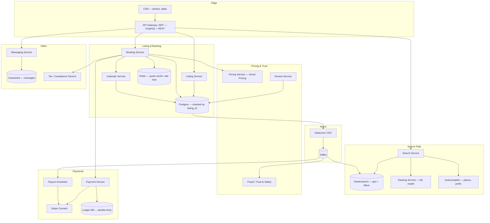

# Design Airbnb — HLD: Geo Search, Booking Concurrency, and Marketplace Payments

**Date:** 2026-04-25 | **Updated:** 2026-04-25
**Tags:** `system-design` `case-study` `airbnb` `geo-search` `marketplace` `booking`

## Table of Contents

- [Summary](#summary)
- [Functional Requirements](#functional-requirements)
- [Non-Functional Requirements](#non-functional-requirements)
- [Capacity Estimation](#capacity-estimation)
- [API Design](#api-design)
- [Data Model](#data-model)
- [HLD Diagram](#hld-diagram)
- [Deep Dives](#deep-dives)
  - [Search Architecture](#search-architecture)
  - [Geo Indexing — Bounding Box, S2/H3, geo\_shape](#geo-indexing--bounding-box-s2h3-geo_shape)
  - [Booking Concurrency — No Double-Booking](#booking-concurrency--no-double-booking)
  - [Pricing — Smart Pricing and Surge](#pricing--smart-pricing-and-surge)
  - [Reviews — Two-Way, Post-Stay, Anti-Fraud](#reviews--two-way-post-stay-anti-fraud)
  - [Payments — Escrow and Host Payout](#payments--escrow-and-host-payout)
  - [Multi-Currency — FX at Quote vs Charge](#multi-currency--fx-at-quote-vs-charge)
  - [Messaging Between Host and Guest](#messaging-between-host-and-guest)
  - [Regulatory and Tax Compliance](#regulatory-and-tax-compliance)
  - [Search Ranking and Personalization](#search-ranking-and-personalization)
- [Bottlenecks and Trade-offs](#bottlenecks-and-trade-offs)
- [Anti-Patterns](#anti-patterns)
- [Related](#related)
- [References](#references)

## Summary

Airbnb is a two-sided marketplace where **hosts** list properties and **guests** book them for short stays. The hard problems are not CRUD — they are:

1. **Low-latency geo search** with multi-attribute filters (dates, price, beds, amenities) over millions of listings.
2. **Strict booking consistency** — a calendar night must never be sold twice, even under contention from instant-book + request-to-book + iCal sync from VRBO/Booking.com.
3. **Marketplace payments** — collect from guest in one currency, hold in escrow, payout to host in a different currency after check-in, while complying with PSD2/SCA, KYC, and city-level occupancy taxes.
4. **Trust** — reviews, identity verification, and fraud detection across both sides.

The architecture splits into a **read-heavy search path** (Elasticsearch + ranking ML) and a **write-heavy booking path** (Postgres with serializable isolation per listing) connected by a CDC stream. Payments and payouts run as a separate bounded context with eventual consistency back to the booking record.

This doc is HLD-level, medium depth. For deeper concurrency parallels see [`../e-commerce/design-movie-booking-system.md`](../e-commerce/design-movie-booking-system.md), for geo and dispatch primitives see [`design-uber.md`](./design-uber.md), and for payment internals see [`../payment/design-payment-system.md`](../payment/design-payment-system.md).

## Functional Requirements

**Guest-facing**

- **Search by location, dates, guest count, filters** (price, room type, amenities, instant-book, superhost, accessibility).
- **Map search** with bounding-box queries and pin clustering as the user pans/zooms.
- **Listing detail page** — photos, description, calendar, reviews, host profile, price breakdown including taxes and fees.
- **Booking flow** — Instant Book (immediate confirmation) and Request to Book (host approves within 24h).
- **Messaging** between guest and host before, during, and after the stay.
- **Trip management** — itinerary, cancellation, refund policies (flexible/moderate/strict).
- **Reviews** within 14 days of checkout, double-blind reveal.

**Host-facing**

- **Listing CRUD** — create, edit, publish, unpublish, photos, amenities, house rules.
- **Calendar management** — block dates, set custom prices, set min/max stay, sync via iCal to/from VRBO and Booking.com.
- **Pricing tools** — base price, weekend/seasonal pricing, Smart Pricing (ML-driven).
- **Booking management** — accept/decline requests, message guests, cancel with policy enforcement.
- **Payouts** — bank account, payout schedule, tax forms.

**Platform**

- **Multi-currency** display and charging.
- **Tax collection** at city/state/country level (occupancy taxes, VAT).
- **Trust and Safety** — ID verification, fraud detection, dispute resolution.

## Non-Functional Requirements

| NFR | Target |
|---|---|
| Search p99 latency | < 300 ms end-to-end including ranking |
| Listing detail p99 | < 500 ms (server-rendered with images via CDN) |
| Booking write availability | 99.99% — losing a booking is a direct revenue hit |
| Calendar consistency | **Strong** within a listing — zero double-bookings tolerated |
| Search consistency | Eventual — a new listing visible within ~30s is acceptable |
| Multi-region | Read-local search; booking writes pinned to listing's home region |
| Compliance | GDPR (EU), PSD2/SCA (EU), CCPA (CA), city-level short-stay caps |
| Peak load | New Year's Eve, Christmas, summer season — design for 10× average |

## Capacity Estimation

Order-of-magnitude (interview-grade):

- **Listings:** ~7M active globally.
- **MAU:** ~150M guests.
- **Searches/day:** ~500M (3+ searches per active session, ~150M sessions/day) → **~6k QPS average, ~30–50k QPS peak**.
- **Bookings/day:** ~2M nights booked → ~25 booking writes/sec average, ~250/sec peak on big shopping days.
- **Messages/day:** ~50M → ~600/sec average, peaks an order of magnitude higher.
- **Photos:** ~30 photos/listing × 7M listings = **~210M images**, multiple resolutions ⇒ several PB on object storage + CDN.

**Storage rough sketch**

| Data | Volume | Store |
|---|---|---|
| Listing core | ~7M rows × ~2 KB | Postgres, sharded by listing\_id |
| Calendar nights | 7M × 365 = ~2.5B rows | Postgres partitioned by listing\_id, or KV |
| Bookings | ~700M historical | Postgres + cold archive in S3/Parquet |
| Search index | ~7M docs × ~5 KB | Elasticsearch, ~35 GB primary, ×replicas |
| Photos | ~210M originals + derivatives | S3 + CloudFront/Akamai CDN |
| Messages | ~50M/day × 1 KB × 365 = ~18 TB/yr | Cassandra or DynamoDB |
| Reviews | ~1B | Postgres + ES for full-text |

The **search index size is small** (tens of GB) — geo search is CPU-bound and latency-bound, not capacity-bound. The **photo and message stores dominate disk**.

## API Design

Mix of **REST** for booking/account flows (transactional, well-defined verbs) and **GraphQL** for the search and listing-detail screens (high field-selection variance across mobile/web/affiliate clients). Airbnb publicly migrated large parts of its product to GraphQL for this reason.

**Search (GraphQL)**

```graphql
query Search(
  $bbox: BoundingBox!         # NE/SW lat-lng for map
  $checkin: Date!
  $checkout: Date!
  $guests: GuestCount!
  $filters: ListingFilters    # price, beds, amenities, instantBook
  $sort: SortMode             # RELEVANCE | PRICE_ASC | RATING
  $cursor: String
) {
  search(bbox: $bbox, checkin: $checkin, checkout: $checkout,
         guests: $guests, filters: $filters, sort: $sort, cursor: $cursor) {
    listings { id title heroPhoto pricePerNight totalPrice rating coords }
    clusters { centroid count zoomLevel }   # for map pins
    pageInfo { nextCursor }
  }
}
```

**Listing detail (GraphQL)** — fetch listing, host, reviews, calendar window, similar listings in one round trip.

**Booking (REST, idempotent)**

```http
POST /v1/bookings
Idempotency-Key: 7c1f...   # client-generated UUID, retried verbatim
Content-Type: application/json

{
  "listingId": "lst_abc",
  "checkin": "2026-08-01",
  "checkout": "2026-08-05",
  "guests": {"adults": 2, "children": 1},
  "paymentMethodId": "pm_xyz",
  "currency": "USD",
  "quoteId": "q_456"           // server-issued price quote, signed
}

→ 201 { "bookingId": "bk_...", "status": "CONFIRMED" | "PENDING_HOST" }
```

The **quote** is a signed, short-TTL token issued by the pricing service. The booking endpoint refuses requests where the quote is expired, mutated, or for a different listing/dates — this anchors the price the user saw and prevents drift between display and charge.

**Other key endpoints**

- `GET  /v1/listings/{id}/availability?from=&to=` — calendar query.
- `PATCH /v1/listings/{id}/calendar` — host blocks/prices.
- `POST /v1/messages` / `GET /v1/threads/{id}` — chat.
- `POST /v1/reviews` — gated by completed-stay check.
- `POST /v1/payouts/bank-accounts` — host onboarding (Stripe Connect).

## Data Model

Simplified ER, in Postgres unless noted:

```
host(id, user_id, kyc_status, payout_account_id, country, ...)

listing(id, host_id, title, description, lat, lng, geohash, country,
        room_type, beds, baths, max_guests, base_price_cents, currency,
        instant_book, status, created_at)

listing_amenity(listing_id, amenity_id)            -- M:N

listing_photo(id, listing_id, s3_key, ord, alt_text)

calendar_night(listing_id, night_date,             -- composite PK
               status, price_cents, min_stay,      -- AVAILABLE|BLOCKED|BOOKED
               booking_id NULL, version)
   -- partitioned by listing_id; hot range query: WHERE listing_id=? AND night_date BETWEEN ? AND ?

booking(id, listing_id, guest_id, checkin, checkout,
        status, total_cents, currency, quote_id,
        payment_intent_id, idempotency_key UNIQUE,
        created_at)

payment_intent(id, booking_id, status, captured_at, ...)

payout(id, booking_id, host_id, amount_cents, currency,
       eligible_at, status, transfer_id)           -- Stripe Connect transfer

review(id, booking_id, author_id, target_type, rating, body,
       created_at, published_at)                   -- target_type: LISTING | GUEST

message(id, thread_id, sender_id, body, attachments, created_at)
thread(id, listing_id NULL, booking_id NULL, participants[])
```

**Sharding**

- `listing`, `calendar_night`, `booking` shard by **listing\_id** — co-locates the data needed for a booking transaction.
- `message`/`thread` shard by **thread\_id**.
- `review` shard by **listing\_id** for listing-page reads; secondary index for "reviews by user".

**Hot rows**

`calendar_night` is the hottest write path during peak booking. Partitioning by `listing_id` keeps a single listing's nights co-located on one shard so a single transaction covers the whole stay window.

## HLD Diagram



Two key flows:

- **Read path:** client → BFF → SearchService → ES (filter + geo) → RankingService (ML rerank) → ListingService for hydration → response. Photos go directly from CDN.
- **Write path:** client → BFF → BookingService → CalendarService (transactional hold) → PaymentService (Stripe authorize) → BookingService commits → CDC → Kafka → fanout to search reindex, payout scheduler, fraud, notifications.

## Deep Dives

### Search Architecture

**Why Elasticsearch (or OpenSearch).** Listings are mostly read, rarely updated, and need multi-attribute filtering (price ranges, amenities as terms, dates as derived "availability" filter), full-text on title/description, geo predicates, and aggregations for facets/clusters. Postgres alone cannot serve this at <100 ms with global QPS. Airbnb's engineering blog has documented their long-running investment in search infrastructure on top of Lucene/Elasticsearch.

**Index shape.** One primary index, sharded by hash of listing\_id, with replicas in each region. Document fields:

```json
{
  "id": "lst_abc",
  "location": { "type": "geo_point", "lat": 48.86, "lon": 2.34 },
  "geo_cell_h3_8": "8819...",
  "country": "FR", "city": "Paris",
  "price_usd": 142,
  "beds": 2, "baths": 1, "max_guests": 4,
  "amenities": ["wifi", "kitchen", "ac"],
  "instant_book": true,
  "rating": 4.86,
  "review_count": 312,
  "title_suggest": { "input": ["Cosy loft Marais", "Marais loft"] }
}
```

**Availability is not stored in ES.** Putting 365 boolean nights per listing into ES blows up the index and creates write amplification on every booking. Instead:

1. ES returns a candidate set ranked by relevance (no date filter, or only a coarse "active in this season" filter).
2. The search service **post-filters** the top N (~500–1000) candidates against the **Calendar Service** for the requested dates. This is fast: a single batched range scan per listing on a hot Postgres/Redis cache.
3. The filtered set is reranked and paginated.

This trades a slight over-fetch for an order-of-magnitude smaller index and avoids reindexing on every booking.

**Autocomplete / place suggest.** A separate prefix index (Elasticsearch `completion` suggester or a custom FST) maps "par" → "Paris, France", "Paris, TX", "Parc des Princes". Place hits resolve to a polygon, which the map view uses as the initial bbox.

**Ranking.** Two-stage: (1) ES BM25 + geo + filter score gives the candidate set; (2) a learning-to-rank model reranks the top N using features like price competitiveness, recent booking velocity, photo quality scores, host response rate, guest's prior taste embedding, and geo-affinity (distance from query centroid). Airbnb has published on personalization and listing/query embeddings (KDD'18).

### Geo Indexing — Bounding Box, S2/H3, geo\_shape

Three geo primitives matter:

1. **`geo_point` + `geo_bounding_box`** — the simplest and the workhorse for map view: "give me listings inside this NE/SW box". Elasticsearch indexes geo points in a BKD tree; bbox queries are O(log n) on the boundary.
2. **`geo_distance`** — radius queries when the user searches by city center ("within 5 km of Eiffel Tower").
3. **`geo_shape`** — polygons for irregular regions (a city's official boundary, a school district, a national park). Used when the user clicks a place suggestion that resolves to a polygon, not a circle.

**Tile-based clustering with S2/H3.** As the user pans the map, sending the raw listing set on every interaction is too chatty. Index a precomputed cell ID (Google **S2** or Uber **H3**) at multiple resolutions on each listing. The map endpoint returns:

- For **low zoom** (zoomed out): aggregated cluster counts by H3 resolution 5 or 6.
- For **high zoom**: individual listings inside the bbox.

H3's hexagonal tiling avoids the distortion S2's squares get near the poles and gives uniform neighbor distance — handy for "expand search to nearby tiles". S2 has slightly stronger hierarchical containment guarantees.

**Why precomputed cells, not runtime aggregations?** ES `geohash_grid` aggregations work but add latency on hot map pans. Indexing the cell ID makes clustering a cheap `terms` aggregation.

### Booking Concurrency — No Double-Booking

This is the part that breaks naive designs. The same listing can be hit by:

- Instant Book from two guests milliseconds apart.
- A Request to Book accepted by the host while another guest is already in checkout.
- An iCal pull from VRBO/Booking.com that reports the listing already booked there.
- The host blocking dates manually.

**Constraint.** For every (listing, night), at most one booking may hold it.

**Pattern: per-listing serialization on the calendar.** The booking transaction acquires a write lock scoped to the listing for the requested date range, validates every night is `AVAILABLE`, flips them to `BOOKED` with the new booking\_id, and commits.

```sql
BEGIN ISOLATION LEVEL SERIALIZABLE;

-- Postgres SERIALIZABLE gives us SSI; alternatively use SELECT ... FOR UPDATE
-- on the calendar rows to take an explicit row-level pessimistic lock.
SELECT night_date, status, version
FROM   calendar_night
WHERE  listing_id = $1
  AND  night_date >= $2 AND night_date < $3
FOR UPDATE;

-- application checks every row is AVAILABLE and version matches snapshot

UPDATE calendar_night
SET    status = 'BOOKED', booking_id = $bk, version = version + 1
WHERE  listing_id = $1
  AND  night_date >= $2 AND night_date < $3
  AND  status = 'AVAILABLE';                 -- guard

INSERT INTO booking (...) VALUES (...);

COMMIT;
```

If `UPDATE` affects fewer rows than expected, abort and return `409 CONFLICT` with the conflicting nights so the UI can suggest alternatives.

**Why Postgres SERIALIZABLE works here.** The contended set is bounded — at most a few rows for one listing. Sharding by `listing_id` ensures all rows live on one node, so we never need a distributed transaction. Hot listings (a Paris flat on New Year's) might see contention; that is acceptable because the loser retries or is told the listing is gone.

**Idempotency.** The `Idempotency-Key` header on `POST /bookings` is stored in `booking.idempotency_key UNIQUE`. A retry with the same key returns the original result. This is essential because mobile clients retry on network blips, and we cannot allow a retry to create a second booking after the first succeeded.

**iCal sync conflicts.** External calendar sources are pulled periodically. When VRBO reports nights as booked there, the calendar service issues the same `UPDATE ... WHERE status='AVAILABLE'` and tolerates partial failure if Airbnb already booked it — surfacing the conflict to the host.

This is the same pattern as the seat-hold problem in [`../e-commerce/design-movie-booking-system.md`](../e-commerce/design-movie-booking-system.md), with date ranges instead of seat IDs.

### Pricing — Smart Pricing and Surge

Three layers compose the displayed price:

1. **Host base price** — what the host set, possibly with weekend/seasonal overrides.
2. **Smart Pricing recommendation** — an ML model predicting the price that maximizes the host's expected revenue given local demand, lead time, day-of-week, neighborhood seasonality, and listing-level features. Airbnb published the original Smart Pricing approach; the production version has evolved into demand-forecasting + uplift modeling.
3. **Event surge** — manual or rule-based multipliers when a major event is detected (Olympics, World Cup final, a city's marathon weekend).

The **Pricing Service** issues a **signed quote** (HMAC over listing\_id + dates + line items + currency + expiry, ~10 min TTL). The booking endpoint refuses to charge a price the server did not just issue. This prevents:

- Price drift between what the user saw and the charge.
- Tampering with prices in client-modified requests.
- Race conditions where the host changes price mid-checkout.

### Reviews — Two-Way, Post-Stay, Anti-Fraud

**Rules**

- A review can only be authored by a guest with a `COMPLETED` booking, or by the host of a completed booking.
- 14-day window after checkout to submit.
- **Double-blind reveal:** neither party sees the other's review until both submit, or until the 14 days expire. Prevents retaliation. Both reviews are then published simultaneously.

**Anti-fraud signals**

- Booking that never communicated, never checked in (no Wi-Fi join, no smart-lock event, no in-app messaging) but left a glowing review → suspicious "review trading".
- Cluster analysis on review graph: hosts swapping bookings to inflate ratings.
- Text-similarity / generated-text detection.

Suspended reviews are removed and the rating recomputed.

### Payments — Escrow and Host Payout

Airbnb is a **marketplace**, not a merchant of record for the stay itself. The standard pattern uses **Stripe Connect** (or Adyen/Braintree marketplaces) with a separated-charges-and-transfers flow:

1. **At booking:** create a `PaymentIntent` charging the guest. The funds land in Airbnb's platform balance.
2. **Hold in escrow:** the funds are recognized as a liability owed to the host on the internal **double-entry ledger**. They are not transferred yet.
3. **Eligibility:** typically **24 hours after check-in**, the booking becomes payout-eligible. This window covers no-shows, immediate cancellations, and "the listing is not as described" disputes.
4. **Payout:** the Payout Scheduler issues a Stripe `Transfer` to the host's connected account, then a `Payout` to their bank, on the host's chosen schedule (next-day, weekly, monthly).
5. **Cancellations:** triggered policy applies — full refund, partial refund, or non-refundable. The ledger reverses or splits the entries.

**Ledger.** A separate, append-only double-entry ledger is the source of truth for money movement. Every event (charge, hold, release, transfer, refund, fee) is two balanced rows. The booking record references ledger entries; it never *is* the ledger. This decoupling is essential for audits, reconciliation, and PCI scope. See [`../payment/design-payment-system.md`](../payment/design-payment-system.md).

**SCA / 3DS2.** EU bookings require strong customer authentication. The PaymentIntent flow handles the 3DS2 challenge transparently; failed authentication aborts the booking before the calendar is committed.

**KYC for hosts.** Before payouts can flow, the host completes Stripe Connect Onboarding (identity, tax form, bank account). KYC status gates the `payout` row's creation, not the booking itself.

### Multi-Currency — FX at Quote vs Charge

The user-visible price and the actual charge currency can differ:

- Listing currency (host's setting): EUR.
- Guest's display currency: USD.
- Guest's card currency: GBP.

**Two FX strategies, materially different UX:**

1. **FX at quote time** (Airbnb's actual approach for display): the displayed USD price uses the FX rate at the moment of the quote. The platform absorbs small movements during the 10-minute quote window. The charge then settles to the listing currency at the platform's rate.
2. **FX at charge time** (banks' default): the displayed price is informational; the actual amount in the guest's currency depends on the rate when the card network settles, which the user only sees on their statement days later.

**The first is the right call for trust** — the guest sees an exact final number. The platform takes a small FX risk, hedged across the aggregate book.

The ledger records every entry in **both** the transaction currency and a base currency (USD) at the prevailing rate, so accounting and host reporting are consistent.

### Messaging Between Host and Guest

Pre-booking inquiries, trip-coordination chat, and post-stay follow-ups all flow through an in-app messaging service. Designed as a generic **chat infra** (threaded conversations, attachments, read receipts, push notifications) — not specific to bookings.

- **Threads** keyed by participants + optional listing/booking context.
- **Storage** in Cassandra or DynamoDB partitioned by `thread_id`, sorted by `(timestamp, message_id)` for cheap range scans.
- **Delivery** via WebSocket (long-lived) for active sessions, push notifications otherwise.
- **PII redaction** — phone numbers, emails, off-platform contact details are masked during the pre-booking phase to prevent off-platform bookings (which bypass payments, taxes, and trust). Released after booking confirmation.

### Regulatory and Tax Compliance

Marketplaces hit local regulation hard:

- **Short-stay caps.** Many cities (Paris 120 nights/year, NYC, Amsterdam, San Francisco) limit how many nights a primary residence can be rented. The Listing Service tracks night counters per listing and refuses bookings that would exceed the cap. Hosts may need to register with the city; the registration number is required at listing time.
- **Occupancy taxes / VAT.** Computed at the city/state level. The Tax Service maintains rate tables keyed by jurisdiction × stay type × stay length × seasonal rules. The platform often acts as the **collection agent**, charging the tax to the guest and remitting it to the jurisdiction.
- **GDPR / CCPA.** PII residency, right-to-erasure, data export. Booking data has retention conflicts (financial records must be kept 7+ years for tax) — solution is selective anonymization of PII fields while retaining the financial skeleton.
- **PSD2/SCA, AML.** As above.
- **Background checks** in jurisdictions where required.

The Tax/Compliance service is a **policy engine**, not a hardcoded ruleset. New cities arrive constantly; the engine is data-driven.

### Search Ranking and Personalization

Beyond pure relevance, ranking optimizes for booking probability:

- **Listing embeddings** — learned from co-view, co-book sequences. Similar listings cluster in vector space.
- **User embeddings** — learned from a user's view/book history; encodes taste (urban vs rural, budget vs luxury, family vs solo).
- **Geo affinity** — boost listings near where similar users have booked.
- **Price competitiveness** — relative to comparable listings in the same area for the same dates.
- **Conversion features** — recent booking velocity, response rate, cancellation rate, photo quality scores.
- **Diversity** — penalize too-similar listings in the same result page so the user sees variety.

Two-stage architecture: ES retrieves a candidate set with hard filters and a basic relevance score; a learning-to-rank model reranks the top N. Per-user personalization at rerank time avoids per-user index sharding.

## Bottlenecks and Trade-offs

| Concern | Bottleneck | Mitigation |
|---|---|---|
| Search QPS at peak | ES CPU on geo + filters | More replicas; aggressive query result cache for hot bbox+date combos; pre-cluster cells |
| Map pans churn requests | Mobile network + ES load | Debounce on client; H3-cell aggregations server-side; CDN-cache at coarse zooms |
| Calendar contention on hot listings | Single-row hot path during NYE | Per-listing serialization (already correct); fail-fast 409 to client; show alternatives |
| Reindexing latency on listing edits | CDC → ES lag | Debezium → Kafka → ES sink; target <30s; surface "pending" state in host UI |
| Photo storage cost | PB-scale at 30+ photos × derivatives | Tiered storage (S3 Intelligent-Tiering); aggressive on-the-fly resize cache; AVIF/WebP |
| FX exposure | Quote→charge window | Hedge aggregate book; cap quote TTL at 10–15 min |
| Payout fraud (host pulls payout then disputes the stay) | Money out vs chargeback in | 24h post-checkin hold; risk-scored holds longer for new hosts |
| iCal sync delay double-book | External calendars pulled every N min | Aggressive pull cadence on hot listings; iCal push when supported; treat external lock as advisory |
| Cold start for new listings (no reviews, no embeddings) | Ranking features missing | Boost new-listing exploration slot; populate features from host history and listing-content embeddings |

## Anti-Patterns

- **Storing per-night availability in Elasticsearch.** Reindex storms on every booking, index size explodes, and ES is not the source of truth — it will lie about a night being available right after a booking.
- **Optimistic concurrency without a guard predicate.** `UPDATE ... WHERE status='AVAILABLE'` is the guard; without it, last-writer-wins double-books.
- **Distributed transactions across booking + payment + calendar.** Two-phase commit across services is fragile. Use the **Saga** pattern: booking holds calendar pessimistically, calls payment, on success commits; on failure releases. Compensations are explicit.
- **Conflating booking record and ledger.** The booking is a business object; the ledger is the money source of truth. Mixing them blocks audits and complicates refunds.
- **Computing price in the client.** Always server-issue a signed quote. Otherwise tampering and currency-rounding bugs become charge errors.
- **Synchronous fanout on booking.** Reindexing search, scheduling payouts, sending notifications, kicking off fraud checks — none of these belong on the booking write path. Emit one event, fan out asynchronously via Kafka.
- **One global Postgres for calendar.** Without sharding by `listing_id`, hot listings serialize the whole DB.
- **Using `geohash` for clustering at fine zoom.** Geohash cells are rectangular and distort near the poles; H3 hexagons are uniform.
- **Letting messaging carry contact info before booking.** Off-platform booking strips the platform of payments, tax collection, and trust signals.
- **Treating reviews as immediate writes to the listing's rating field.** Recompute aggregates from the review table; raw rating writes lose history and break dispute resolution.

## Related

- [`design-uber.md`](./design-uber.md) — geo dispatch, S2/H3 cells, real-time matching.
- [`../e-commerce/design-movie-booking-system.md`](../e-commerce/design-movie-booking-system.md) — seat-hold concurrency, the same pattern as Airbnb's calendar.
- [`../payment/design-payment-system.md`](../payment/design-payment-system.md) — double-entry ledger, Stripe Connect, 3DS2/SCA, payout flows.

## References

- Airbnb Engineering — *SOA: Service-Oriented Architecture at Airbnb* — https://medium.com/airbnb-engineering/c-y-c-l-e-c-l-e-a-n-architecture-at-airbnb-7d5b73a5c1f0 (and the broader "Building Services at Airbnb" series on https://medium.com/airbnb-engineering).
- Airbnb Engineering — *Smart Pricing: How Airbnb's algorithm decides what to charge* — https://medium.com/airbnb-engineering/learning-market-dynamics-for-optimal-pricing-97cffbcc53e3.
- Airbnb Engineering — *Real-time Personalization using Embeddings for Search Ranking at Airbnb* (KDD 2018 best paper) — https://www.kdd.org/kdd2018/accepted-papers/view/real-time-personalization-using-embeddings-for-search-ranking-at-airbnb.
- Airbnb Engineering — *Building Airbnb Categories with ML and Human in the Loop* — https://medium.com/airbnb-engineering/building-airbnb-categories-with-ml-and-human-in-the-loop-e97988e70ebb.
- Elasticsearch — *Geo queries* (geo\_point, geo\_bounding\_box, geo\_distance, geo\_shape) — https://www.elastic.co/guide/en/elasticsearch/reference/current/geo-queries.html.
- Elasticsearch — *geohash\_grid and geotile\_grid aggregations* — https://www.elastic.co/guide/en/elasticsearch/reference/current/search-aggregations-bucket-geohashgrid-aggregation.html.
- Google **S2 Geometry Library** — https://s2geometry.io/.
- Uber Engineering — **H3: Uber's Hexagonal Hierarchical Spatial Index** — https://www.uber.com/blog/h3/ and https://h3geo.org/.
- Stripe — **Connect for marketplaces** (separate charges and transfers, escrow patterns) — https://stripe.com/docs/connect and https://stripe.com/docs/connect/separate-charges-and-transfers.
- Stripe — **PaymentIntents and 3D Secure 2 / SCA** — https://stripe.com/docs/payments/payment-intents and https://stripe.com/docs/strong-customer-authentication.
- PostgreSQL — *Transaction Isolation: Serializable Snapshot Isolation* — https://www.postgresql.org/docs/current/transaction-iso.html.
- Airbnb Engineering — *Migrating Airbnb's web stack to GraphQL* — https://medium.com/airbnb-engineering/our-experience-with-react-relay-modern-and-graphql-f4f2f38b3754.
