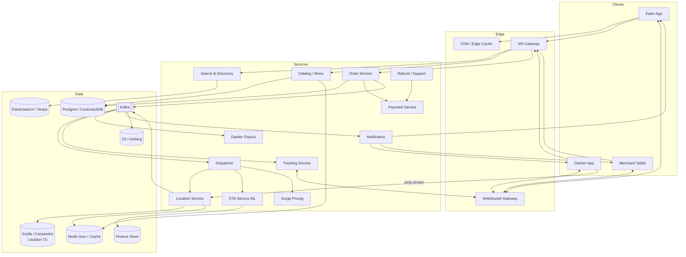
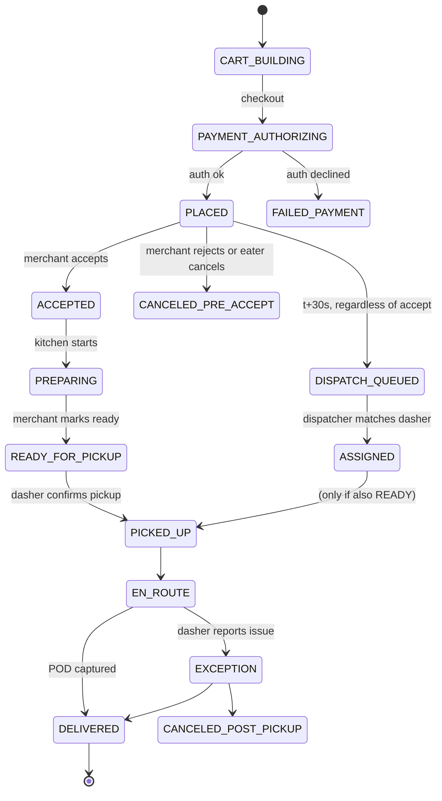

# Design DoorDash / Swiggy — Three-Sided Marketplace, Dispatch, and Real-Time Tracking

**Date:** 2026-04-25 | **Updated:** 2026-04-25
**Tags:** `system-design` `case-study` `doordash` `food-delivery` `dispatch`

## Table of Contents

- [Summary](#summary)
- [Functional Requirements](#functional-requirements)
- [Non-Functional Requirements](#non-functional-requirements)
- [Capacity Estimation](#capacity-estimation)
- [API Design](#api-design)
- [Data Model](#data-model)
- [HLD Diagram](#hld-diagram)
- [Deep Dives](#deep-dives)
  - [Restaurant Search and Discovery](#restaurant-search-and-discovery)
  - [Menu Data Freshness](#menu-data-freshness)
  - [Order Lifecycle State Machine](#order-lifecycle-state-machine)
  - [Dispatcher / Matching](#dispatcher--matching)
  - [ETA Prediction](#eta-prediction)
  - [Surge Pricing](#surge-pricing)
  - [Real-Time Tracking](#real-time-tracking)
  - [Payment and Payout](#payment-and-payout)
  - [Cancellation and Refund](#cancellation-and-refund)
  - [Multi-Leg Pickup Batching](#multi-leg-pickup-batching)
- [Bottlenecks and Trade-offs](#bottlenecks-and-trade-offs)
- [Anti-Patterns](#anti-patterns)
- [Related](#related)
- [References](#references)

## Summary

DoorDash and Swiggy are **three-sided marketplaces** connecting **eaters**, **merchants** (restaurants, dark stores), and **dashers/delivery partners**. They look superficially like Uber for food, but the engineering shape is different in three ways: (1) a **menu catalog and merchant operations** layer that Uber does not have, (2) an extra **prep-time uncertainty** baked into every ETA, and (3) **multi-leg batching** is the norm rather than the exception because food density is much higher than ride density per zone.

The core challenge is the **dispatcher**: given a stream of incoming orders and a moving fleet of dashers, assign orders to dashers so that food arrives hot, dashers maximize earnings per hour, restaurants do not stack up trays of cold food, and the platform's cost per delivery stays sustainable. This is solved with a per-region optimization service running on the order of seconds, with sub-second p99 assignment latency, fed by a real-time location stream and an ML-driven ETA model.

This document walks through the HLD at the level a senior backend engineer would defend in an interview or in an architecture review.

## Functional Requirements

| # | Capability | Notes |
|---|-----------|-------|
| F1 | Browse restaurants near user | Geo + cuisine + dietary + open-now filters |
| F2 | View menu, customize items, add to cart | Variants, modifiers, combos, allergen flags |
| F3 | Place order, pay upfront | Card, wallet, UPI (Swiggy), gift card, PayPal |
| F4 | Restaurant accepts/rejects, marks ready | Tablet app or POS integration |
| F5 | Dispatcher assigns dasher | Single or batched assignment |
| F6 | Real-time tracking | Eater sees dasher position, dasher sees route |
| F7 | Dasher app: accept job, navigate, mark picked up / delivered | Includes proof-of-delivery photo |
| F8 | Rating and feedback | Eater rates restaurant + dasher; dasher rates merchant wait time |
| F9 | Surge / dynamic pricing | Per-zone, per-time, applied to both eater fee and dasher pay |
| F10 | Cancellation and refund | Pre-prep auto-cancel; post-prep manual escalation |
| F11 | Promotions / coupons | Percentage off, free delivery, first-order codes |
| F12 | Subscription tier | DashPass, Swiggy One — flat-fee or free delivery |

Out of scope for this HLD: grocery (DashMart, Instamart) catalog ops, ghost-kitchen tooling, B2B catering.

## Non-Functional Requirements

| Concern | Target |
|---------|--------|
| Availability | 99.95% for ordering path, 99.99% for tracking pings |
| Eater p95 menu load | < 400 ms |
| Place-order p99 | < 1.5 s end-to-end (auth + payment auth + order persisted) |
| Dispatcher assignment p99 | < 1 s from "order ready for dispatch" to "dasher assigned" |
| Location ping ingestion | 100k+ writes/sec sustained, peak 5x at meal times |
| ETA error | MAE < 3 minutes for the lifetime of the order |
| Order accuracy | < 0.5% wrong/missing item rate that causes refund |
| Payment durability | 0 lost authorizations; idempotent retries mandatory |
| Regulatory | FSSAI / FDA food-handling info per merchant; allergen disclosures; tax compliance per zone |
| Compliance | PCI-DSS for card data; PII encrypted at rest; right-to-be-forgotten honored |

## Capacity Estimation

Order of magnitude, US + India combined, mature operator scale:

- **Daily orders:** ~5 million globally on a normal weekday, ~8 million on Friday/Saturday peak.
- **Peak hour share:** lunch (12:00–13:00) and dinner (19:00–21:00) account for ~55% of daily volume.
- **Peak orders/sec:** 5M/day baseline → ~580 orders/sec average → ~3,000 orders/sec at dinner peak (5x avg).
- **Active dashers:** ~700k–1M monthly, ~120k concurrently online at peak.
- **Location pings:** every 4 seconds per online dasher → 120k / 4 = **30k pings/sec** at peak. Plan for 100k/sec headroom for batching events and re-routes.
- **Restaurants:** ~600k merchants in catalog, ~200k actively taking orders on a given day.
- **Menu items:** ~25M SKUs, mostly small (a few KB each). Catalog footprint < 200 GB.
- **Order storage:** average order ≈ 4 KB row + JSON line items. 5M/day × 4 KB = 20 GB/day raw → ~7 TB/year. Hot OLTP keeps last 90 days; older archived to columnar (S3 + Iceberg / BigQuery).
- **Tracking pings storage:** 30k/s × 86400 = 2.6B/day. At ~80 bytes after compression, ~210 GB/day. Hot tier (Cassandra / ScyllaDB / Redis-Geo) keeps last 6 hours; rest goes to cold object storage.

Sharding key candidates: **(region_id, order_id)** for orders, **dasher_id** for location pings, **merchant_id** for menus. See [sharding-strategies.md](../../scalability/sharding-strategies.md).

## API Design

### REST — Eater app

```http
GET  /v1/feed?lat=..&lng=..&filters=cuisine:thai,dietary:vegan
GET  /v1/restaurants/{merchantId}/menu          # cached, ETag
POST /v1/cart                                   # idempotent via Idempotency-Key
POST /v1/orders                                 # body: cart_id, payment_method_id, tip, address_id
GET  /v1/orders/{orderId}
POST /v1/orders/{orderId}/cancel
POST /v1/orders/{orderId}/rate
```

`POST /v1/orders` returns `202 Accepted` with `order_id` and `state=PLACED`; clients then subscribe to the live channel. The endpoint must be **idempotent**: an `Idempotency-Key` header keyed off the cart ensures a network retry never charges twice.

### REST — Merchant tablet / POS

```http
GET  /v1/merchant/orders/incoming
POST /v1/merchant/orders/{id}/accept            # body: prep_eta_minutes
POST /v1/merchant/orders/{id}/reject            # body: reason_code
POST /v1/merchant/orders/{id}/ready
PATCH /v1/merchant/menu/items/{itemId}          # 86 an item, change price
```

### REST — Dasher app

```http
POST /v1/dasher/sessions/online                 # go online, body: vehicle, zone
POST /v1/dasher/sessions/offline
GET  /v1/dasher/offers                          # current assignment offer (if any)
POST /v1/dasher/offers/{offerId}/accept
POST /v1/dasher/orders/{orderId}/pickup
POST /v1/dasher/orders/{orderId}/deliver        # body: photo_url, signature
POST /v1/dasher/locations                       # batched ping upload (fallback)
```

### Streaming — live tracking

- **Dasher → server:** persistent gRPC bidi stream or MQTT for location pings (4 s cadence). Falls back to HTTP POST batch when on poor cell.
- **Eater → server:** WebSocket (or Server-Sent Events) channel `/v1/orders/{id}/track` pushing `{state, eta, dasher_lat, dasher_lng}` every 5–10 s.
- **Merchant → server:** WebSocket for incoming-order tone + state changes.

### Order state API

```http
GET /v1/orders/{id}/state    # canonical state machine snapshot
```

The state field is the source of truth; UI never renders inferred state from timestamps alone.

## Data Model

```
restaurant
  merchant_id PK
  name, address, geohash, lat, lng
  cuisines[], dietary_flags[]
  open_hours (per dow), timezone
  pos_integration_type (TABLET | OLO_API | DIRECT_POS)
  rating, num_ratings
  fssai_or_fda_id

menu
  merchant_id PK
  version (monotonic)
  categories[], items[]   -- denormalized JSON for read path
  source (MERCHANT_PUBLISHED | SCRAPED | MANUAL_OPS)
  last_verified_at

menu_item
  item_id PK
  merchant_id FK
  name, description, price, currency
  modifiers[], variants[]
  allergens[], image_url
  is_86d (in-stock flag)

order
  order_id PK (region-prefixed snowflake)
  eater_id, merchant_id
  cart_snapshot JSONB         -- frozen at place time
  subtotal, tax, fees, tip, total
  payment_intent_id
  state (enum, see lifecycle)
  placed_at, accepted_at, ready_at, picked_up_at, delivered_at
  zone_id, region_id
  surge_multiplier_applied

order_state_event
  order_id FK, seq, state, actor, ts, metadata JSONB
  -- append-only audit log for the state machine

dasher
  dasher_id PK
  vehicle_type (BIKE | CAR | EBIKE | WALK | SCOOTER)
  current_zone_id
  status (OFFLINE | IDLE | OFFERED | EN_ROUTE_TO_PICKUP | AT_MERCHANT | EN_ROUTE_TO_DROPOFF)
  current_assignment_id FK NULLABLE
  rating, completed_deliveries

location_ping
  dasher_id, ts, lat, lng, accuracy, speed, heading, battery
  -- written to hot store (ScyllaDB / Redis-Geo / Pinot)
  -- TTL 6 hours hot, 90 days warm, then cold archive

assignment
  assignment_id PK
  order_ids[]                 -- length > 1 means batched
  dasher_id, offered_at, accepted_at, expires_at
  reasoning JSONB             -- features used, score, model version

payment
  payment_id PK
  order_id FK
  type (CHARGE | REFUND | TIP_ADJUSTMENT)
  amount, currency, processor (STRIPE | ADYEN | RAZORPAY)
  state (AUTHORIZED | CAPTURED | REFUNDED | FAILED)
  external_ref

dasher_payout
  payout_id PK
  dasher_id, period (weekly | instant)
  amount, base_pay, peak_pay, tip, adjustments
```

## HLD Diagram



Key data-flow notes:

- **Kafka is the system spine.** Order events, location pings, state changes, and pricing decisions all flow through topics. Every service is event-sourced enough to recover.
- **Reads are cache-heavy.** Menu, feed, and surge are CDN/Redis-fronted. The DB sees writes and cold reads.
- **The dispatcher does not own state.** It computes assignments and emits `assignment.created` events; the order service is the system of record for who-has-what-order.

## Deep Dives

### Restaurant Search and Discovery

The eater feed is two layered:

1. **Coarse geo filter** — a service over Elasticsearch / Vespa indexed by `geohash` (precision 6, ~1.2 km cells) plus `s2_cell` for accurate radius queries. The eater's location maps to a primary cell and 8 neighbors; we union candidates from all 9 cells.
2. **Personalized ranking** — a learning-to-rank model scores candidates with features: distance, prep-time history, rating, eater's past orders, current dasher availability in that zone, predicted ETA, and merchant promotional boosts.

Filters (cuisine, dietary, price, open-now) are applied as ES filter clauses (cheap, cached). Sort is by model score with diversity guards so the top 20 is not 20 burger places.

Open-now is more subtle than it looks. A restaurant's hours, the kitchen's "we are slammed, pause new orders" toggle, and the dasher availability in that zone are three independent signals. The feed should hide a merchant that has *any* of those failing.

DoorDash's engineering blog described migrating discovery to a search platform built on **Elasticsearch + a proprietary ranker on top of Sibyl (their ML platform)**, with feature freshness for things like "restaurant currently slammed" pushed sub-minute via Kafka.

Cache layers:

- **CDN** for the static parts of the feed response (images, descriptions).
- **Redis** keyed by `(geohash6, eater_segment, hour_of_day)` for the ranked candidate list, TTL 60 s.
- **Per-eater layer** for personalization re-rank, kept in app-server local cache (Caffeine) for 10 s.

### Menu Data Freshness

Menus are the most painful catalog problem in food delivery. Three sources of truth coexist:

| Source | How | Pros | Cons |
|--------|-----|------|------|
| **Merchant-published** (POS or merchant portal) | API push from Toast, Square, Olo, NCR; merchant portal manual edit | Authoritative, structured | Long tail of merchants without modern POS |
| **Scraped** | Crawl public menus or PDFs, parse with NER + LLM extractor | Covers SMB merchants | Stale, often missing modifiers/allergens |
| **Manual ops** | Internal tool where ops team enters menu from a phone call or photo | Final-mile fix | Expensive, error-prone |

The catalog service stores the merged result with provenance per field. A **menu version** is bumped on any change; the eater app fetches with `If-None-Match` ETag to avoid re-downloading. Menu reads are served from Redis (200k+ RPS at peak) with the database as fallback.

86'ing items (out of stock) is a hot path: the merchant tablet POSTs `is_86d=true`, which writes through to Postgres, invalidates Redis, and broadcasts a Kafka event so any in-flight cart can show "this item is no longer available" before checkout. This must be sub-second to avoid order rejections.

DoorDash's engineering team has written about migrating their menu service to a **microservice with Kafka-driven cache invalidation** to escape the failure modes of their prior monolith.

### Order Lifecycle State Machine



Critical correctness rules:

- The state machine is enforced server-side; no client can skip a state.
- Every transition writes an `order_state_event` row plus emits a Kafka event. The events are the audit log and the integration point for all downstream consumers.
- `DISPATCH_QUEUED` is intentionally entered **before** the merchant accepts, on a short timer, so the dispatcher can pre-position a dasher for an order it is statistically sure will be accepted. This is one of the highest-leverage latency reductions in the whole system.
- Idempotency: every transition request carries a state-version number; concurrent updates via optimistic locking.

### Dispatcher / Matching

The dispatcher is the heart of the platform. Inputs:

- Pool of orders in `DISPATCH_QUEUED` or already `ASSIGNED` but not `PICKED_UP`.
- Pool of dashers with status in `IDLE`, `EN_ROUTE_TO_PICKUP`, or `AT_MERCHANT` (because they may be batchable).
- Real-time location of every dasher.
- ETA model predicting prep-completion-time per merchant and travel-time per dasher-leg.
- Surge / incentives layer to value each assignment.

Approach: **periodic batch matching** rather than greedy "assign on arrival." Every region runs a matcher every ~2 seconds that solves a constrained optimization (similar to a min-cost bipartite matching with side constraints). DoorDash's published work has called this **"deep dispatcher"** — the assignment problem is framed as picking edges in a bipartite graph where edge cost is `α·dasher_idle_time + β·food_wait_time + γ·eater_eta + δ·dasher_pay_efficiency`.

Why batch over greedy:

- Greedy assigns a dasher to the first order that arrives, even if a better order is 1 second away.
- Batch sees the full local supply/demand and produces globally better assignments.
- 2-second batching adds at most 2 s of latency, which is rounding error vs. cooking time.

The dispatcher considers a dasher as **batchable** if they are already going to merchant A and merchant B is within a small detour (see Multi-Leg Pickup Batching). The graph then has hyperedges (one dasher → multiple orders).

Outputs an `assignment.created` event with TTL: the offer expires in ~30 s if the dasher does not accept, and the dispatcher re-runs.

Service is sharded by `region_id` so each city / metro runs its own optimizer instance — this is fundamentally a **regional** problem, not a global one. Cross-region transfer is a separate, slower workflow.

### ETA Prediction

Three sub-models, composed:

1. **Prep-time model** — given merchant, time of day, current order backlog, item count, item complexity, predicts when food will be ready. Features include 7-day rolling averages and live "kitchen pressure" signal (count of in-flight orders for that merchant).
2. **Travel-time model** — given origin, destination, vehicle type, traffic, weather, predicts dasher leg duration. Often a wrapper around Google/Mapbox routing plus a residual model that learns the gap between the routing API's ETA and reality on the dasher's vehicle type.
3. **Pickup-handoff model** — predicts the merchant-side wait once the dasher arrives (parking, finding the bag, etc).

Total ETA = `place_to_accept` + `prep` + `dasher_to_merchant` + `handoff` + `merchant_to_eater`. Each is a distribution; we display p50 typically with a small safety buffer.

Features come from a real-time **feature store** (Feast or homegrown). Online inference SLA is single-digit ms because ETAs are recomputed every time the dispatcher considers an assignment, and at every UI refresh.

DoorDash and Uber Eats engineering blogs both describe moving from rule-based ETAs to gradient-boosted-tree models (LightGBM) and then to deep models (sequence models incorporating dasher trajectories). The model is retrained daily; predictions are monitored for drift per-zone.

### Surge Pricing

Surge runs **per zone, per minute**, computing a multiplier on (a) the eater's delivery fee and (b) the dasher's base pay. Inputs:

- Demand: orders/min in zone.
- Supply: idle dashers in zone.
- Forecast: 15-min-ahead model of demand and supply.
- Constraints: regulatory caps (some markets cap surge), merchant-specific opt-outs.

Implementation:

- Stream of order events and dasher status events lands in Kafka.
- A streaming aggregator (Flink, or Kafka Streams) maintains `(zone_id, minute) → {orders, idle_dashers}`.
- The surge service computes `multiplier = f(demand/supply, forecast_residual)` and writes to Redis keyed by `zone_id`, TTL 90 s.
- Eater app and dispatcher both read this Redis key when pricing/valuing an order.

The dasher pay portion ("Peak Pay") is critical because surge that only raises eater fees without paying dashers more does not pull supply onto the road.

### Real-Time Tracking

```
Dasher app -- gRPC bidi --> Location Service (regional)
                              |
                              ├─> ScyllaDB (hot, last 6h)
                              ├─> Redis Geo (current pos per dasher)
                              └─> Kafka topic location.pings
                                                 │
                                                 ▼
                                          Tracking Service
                                                 │
                                                 ├─> recompute ETA
                                                 └─> push WS frame to eater
```

Cadence is adaptive: 4 s when EN_ROUTE, 10 s when IDLE, paused when OFFLINE. Pings batch every 2–4 pings to save battery; backend reorders by client `ts` since out-of-order delivery is normal on cellular.

The tracking service does **not** push raw pings to eater clients. It computes a smoothed dasher position (snap-to-road from Mapbox/Google) and a fresh ETA, and pushes that ~every 5 s. That separation lets us run the location service at 100k QPS without proportionally inflating WebSocket fanout.

The eater WebSocket connection is held by an edge tier (Envoy + a WS gateway like Centrifugo or a custom NATS-backed fanout). Reconnection logic: client polls `GET /v1/orders/{id}/state` on reconnect to catch up.

### Payment and Payout

Two flows that look symmetric but are not:

**Eater charge (upfront, at order placement):**

1. Order service calls payment service with `Idempotency-Key = cart_id`.
2. Payment service calls Stripe/Adyen/Razorpay to **authorize** (not capture) the cart total + a buffer for tip.
3. On success, order moves to `PLACED`.
4. **Capture** happens at delivery time, after final tip is known.
5. If the order is canceled before pickup, authorization is voided (no chargeback, no statement noise for the eater).

**Dasher payout (post-delivery, asynchronous):**

1. `order.delivered` event drops a payout-line into `dasher_earning_ledger`: base pay + peak pay + tip + any adjustments.
2. Weekly batch job aggregates the ledger by dasher and initiates ACH/UPI transfer.
3. Instant-pay option (Fast Pay / DoorDash's DasherDirect, Swiggy's Instamojo-like flows) lets the dasher cash out within minutes for a small fee.

Tip handling is the gnarliest detail. Tip can be:

- Set at order placement (committed).
- Edited up/down post-delivery within a window (DoorDash allows post-delivery tip increases).
- Result of a chargeback dispute (tip clawed back).

The payment service must keep **immutable history** of each adjustment and emit events so the dasher's earnings ledger stays consistent with the eater's bill.

### Cancellation and Refund

Three eras:

| Era | Logic | Cost |
|-----|-------|------|
| Pre-accept | Auto-cancel by eater free; void auth | Cheap |
| Post-accept, pre-pickup | Eater eats merchant's prep cost or platform absorbs based on policy | Medium |
| Post-pickup | Manual support ticket; dasher already paid; refund issued from platform pocket | Expensive |

Rule engine evaluates each cancel request against `(state, time_since_state, merchant_policy, eater_history)` and either auto-approves with a refund of varying scope (full / delivery-fee-only / store-credit) or routes to a support agent queue.

Fraud signals (eater cancels too often, "didn't receive" claims out of pattern) feed a trust model that gates auto-refunds.

### Multi-Leg Pickup Batching

The flagship efficiency lever. Two sub-cases:

**Stacked orders (same merchant, multiple eaters):** dasher picks up two orders from one restaurant going in similar directions. Common in lunch rush. Detour cost is just the second drop, which is usually < 5 minutes if eaters are within 1 km of each other.

**Multi-restaurant batch:** dasher picks up from merchant A then merchant B then drops both. Only attempted when:

- Both merchants are close (geo predicate, often < 500 m).
- Prep timings align — neither bag waits more than ~3 minutes.
- Drop locations are colinear-ish (the route makes geometric sense).
- Eaters' ETAs do not blow past contracted promise.

The dispatcher generates candidate batches as part of the matching graph and prices them: expected dasher pay efficiency typically goes up 30–50% on a batched run, and the platform's unit economics improve. The eater impact on ETA must be bounded — most platforms cap added time to ~5–8 minutes vs. solo delivery, and disclose nothing of the batching to the eater (it shows as a normal delivery; only the dasher app shows the multi-leg route).

Swiggy's engineering blog has discussed their batching system as one of the largest contributors to delivery cost reduction in tier-1 Indian metros where order density at lunch supports 2-batch and even 3-batch deliveries.

## Bottlenecks and Trade-offs

- **Hot zone problem.** A single dense urban zone (Manhattan lunch, Bengaluru Koramangala dinner) can produce orders/sec that a single dispatcher instance cannot solve in 1 s. Mitigation: sub-shard zones (zone_id has hierarchy), and keep matcher state in memory with periodic checkpoints to Redis.
- **Merchant tablet flakiness.** A restaurant's tablet on Wi-Fi behind a cash register dies more often than any cloud component. The system must tolerate this: auto-accept after N seconds, fallback to phone/SMS auto-call, and the dispatcher pre-positions a dasher even before merchant accept.
- **Dasher app battery drain.** 4-second pings burn battery; throttle aggressively when stationary, batch when behind on uploads.
- **ETA accuracy vs. UX.** Quoting tighter ETAs increases conversion but blowing through them tanks trust. Most platforms quote a bit conservatively and treat early arrival as a feature.
- **Surge fairness.** Pricing controls the marketplace but invites regulatory and PR scrutiny. Keep audit trails of every surge decision per zone-minute.
- **Strong consistency vs. availability.** Order state must be consistent (no double-charges, no double-assignments). Tracking can be eventually consistent (a 5-second-stale dasher position is fine). Choose the storage and CAP trade-off per workload.
- **Cross-region scaling.** A US service deployed in `us-east-1` cannot serve Mumbai latency-wise. Each region runs its own stack, and only ledger/payout/identity have global read-after-write needs.

## Anti-Patterns

- **One global dispatcher.** Tempting because you "see all the data." In practice you get a single-region failure that takes down every zone on the platform. Run per-region with fail-static fallbacks.
- **Polling-based tracking.** Eater app polling every 5 s to a generic order endpoint will saturate Postgres. Push via WebSocket from a fanout tier reading Kafka.
- **Storing menu in a single SQL table with rows.** Menus have heavy nesting (categories → items → modifiers). Use JSONB or a document store and let merchants bump version atomically.
- **Capturing payment at place-order.** Tip changes, partial cancels, and merchant-side changes break this. Authorize at place, capture at delivery.
- **Using only Google Maps ETAs.** Routing-API ETAs assume you are in a car with no parking detour. Train a residual model on actual dasher leg outcomes per vehicle type and city.
- **Greedy "assign as soon as a dasher pings."** Always at least 1–2 second batched optimization for assignment quality.
- **Rolling your own location store at scale.** Unless you have a specific reason, use a proven time-series store (Scylla, Cassandra, Pinot) with TTL, plus Redis Geo for "where is dasher X right now."
- **Treating cancellation as a single button.** Without era-aware logic, you will refund a hot bag of food and pay the dasher and eat the merchant cost simultaneously.
- **Ignoring the merchant tablet UX.** Half the platform's reliability is whether the tablet rings loudly enough. Engineering invests heavily here even though it's "just an app."

## Related

- [Design Uber](./design-uber.md) — same dispatch core, fewer state machines, no menu catalog.
- [Design Airbnb](../specialized/design-airbnb.md) — different marketplace shape; calendar/inventory rather than dispatch.
- [Sharding Strategies](../../scalability/sharding-strategies.md) — region-based and tenant-based partitioning patterns used here.
- [Read/Write Splitting and Cache Strategies](../../scalability/read-write-splitting-and-cache-strategies.md) — applied to the menu hot-read path.
- [Backpressure, Bulkhead, Circuit Breaker](../../scalability/backpressure-bulkhead-circuit-breaker.md) — for payment and merchant POS integrations.

## References

- DoorDash Engineering — *"How DoorDash Transitioned from a Monolith to Microservices"* — https://doordash.engineering/2020/12/02/how-doordash-transitioned-from-a-monolith-to-microservices/
- DoorDash Engineering — *"Building DoorDash's Model Serving Platform"* (Sibyl) — https://doordash.engineering/2020/06/29/doordashs-new-model-serving-platform/
- DoorDash Engineering — *"Maintaining Machine Learning Model Accuracy Through Monitoring"* — https://doordash.engineering/2021/05/20/monitor-machine-learning-model-drift/
- DoorDash Engineering — *"Things We Learned Adopting Apache Kafka"* — https://doordash.engineering/2021/08/24/distributed-tracing-async-events/
- DoorDash Engineering — *"Optimizing Merchant ETA Predictions"* / dispatcher posts — https://doordash.engineering/category/dispatch/
- Uber Engineering — *"Uber Eats: Building Reliable Reprocessing and Dead-Letter Queues with Kafka"* — https://www.uber.com/blog/reliable-reprocessing/
- Uber Engineering — *"Real-Time Exactly-Once Ad Event Processing with Apache Flink, Kafka and Pinot"* (location pipeline patterns reused for dispatch) — https://www.uber.com/blog/real-time-exactly-once-ad-event-processing/
- Swiggy Bytes — *"How We Built Swiggy's Order Allocation Engine"* — https://bytes.swiggy.com/
- Swiggy Bytes — *"ML-Based ETA Prediction at Swiggy"* — https://bytes.swiggy.com/
- Swiggy Bytes — *"Batching Orders for Better Delivery Economics"* — https://bytes.swiggy.com/
- Mapbox / Google Routes API documentation — ETA and traffic-aware routing primitives.
