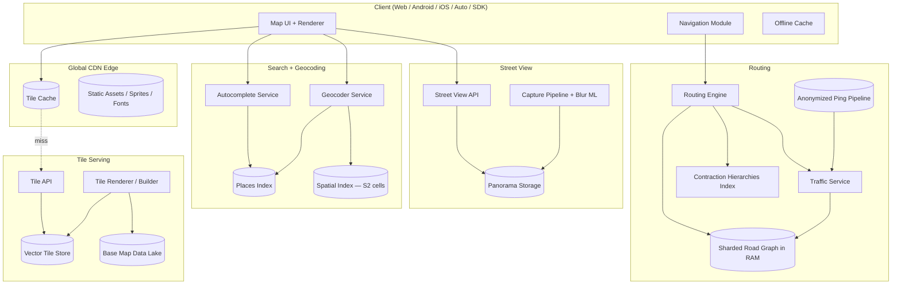

# Design Google Maps — Tile Pyramids, Routing, and Real-Time Traffic at Planet Scale

**Date:** 2026-04-25 | **Updated:** 2026-04-25
**Tags:** `system-design` `case-study` `google-maps` `routing` `geospatial`

## Table of Contents

- [Summary](#summary)
- [Functional Requirements](#functional-requirements)
- [Non-Functional Requirements](#non-functional-requirements)
- [Capacity Estimation](#capacity-estimation)
- [API Design](#api-design)
- [Data Model](#data-model)
- [HLD Diagram](#hld-diagram)
- [Deep Dives](#deep-dives)
  - [Map Tiles — The Pyramid](#map-tiles--the-pyramid)
  - [Vector Tiles vs Raster Tiles](#vector-tiles-vs-raster-tiles)
  - [Map Data Sourcing](#map-data-sourcing)
  - [Geocoding — Address to Lat/Lng](#geocoding--address-to-latlng)
  - [Reverse Geocoding](#reverse-geocoding)
  - [Routing Engine](#routing-engine)
  - [Real-Time Traffic](#real-time-traffic)
  - [ETA Prediction](#eta-prediction)
  - [POI Database](#poi-database)
  - [Turn-by-Turn Navigation](#turn-by-turn-navigation)
  - [Street View](#street-view)
  - [Multi-Modal Routing](#multi-modal-routing)
- [Bottlenecks and Trade-offs](#bottlenecks-and-trade-offs)
- [Anti-Patterns](#anti-patterns)
- [Related](#related)
- [References](#references)

## Summary

Google Maps is one of the largest read-heavy systems on the planet: roughly **2 billion monthly users** consume map tiles, search for places, and request driving directions across every road on Earth. The core engineering problem is not "store a map" — it is "serve precomputed views of every location on Earth at every zoom level, while keeping a routable graph of every road in sync with real-time traffic, while answering geocoding queries in under 100 ms."

Three subsystems do most of the heavy lifting:

1. A **tile pyramid** that pre-renders the world at 23 zoom levels (z=0..22) and serves the result through a global CDN. Vector tiles let the client style and rotate the map without re-fetching.
2. A **routing engine** built on a directed road graph with edge weights derived from speed limits, road class, and live traffic. Algorithms like **Contraction Hierarchies** make continent-scale shortest-path queries finish in milliseconds.
3. A **geocoder + Places index** that maps free-text addresses and queries to lat/lng (and vice versa), tolerant of typos, missing components, and ambiguous names.

This document walks the architecture top-down, then dives into the parts that are uniquely hard about Maps — the pyramid math, why Dijkstra alone is not fast enough, how anonymized GPS pings turn into the red-and-green traffic overlay, and how Street View's panorama pipeline scales to tens of petabytes.

## Functional Requirements

| # | Capability | Notes |
|---|---|---|
| F1 | **Map rendering** | Display interactive map tiles for any lat/lng/zoom; pan, zoom, rotate, tilt smoothly. |
| F2 | **Search and geocoding** | "1600 Amphitheatre Pkwy" → lat/lng; "coffee near me" → ranked POIs. |
| F3 | **Routing / directions** | A → B turn-by-turn directions for car, walk, bike, transit. Multi-stop. |
| F4 | **Real-time traffic** | Color-coded congestion overlay; ETA reflects current conditions. |
| F5 | **Points of Interest (POIs)** | Hundreds of millions of businesses with hours, photos, reviews. |
| F6 | **Navigation** | Voice guidance, off-route detection, automatic rerouting, lane guidance. |
| F7 | **Street View** | 360-degree panoramas at street level, navigable along capture sequences. |
| F8 | **Transit** | Schedules, real-time arrivals, multi-leg journeys, walking transfers. |
| F9 | **Offline maps** | Pre-download a region (tiles + road graph + POIs) for use without network. |
| F10 | **Contributions** | Users add/edit places, report incidents, submit photos (moderated). |

Out of scope for this HLD: ride-hailing dispatch ([design-uber.md](design-uber.md)), satellite imagery ingest pipeline at full depth, ads/monetization, indoor maps detail.

## Non-Functional Requirements

| # | NFR | Target |
|---|---|---|
| N1 | **Tile latency** | p50 < 50 ms, p99 < 200 ms from any continent (CDN edge). |
| N2 | **Routing latency** | p99 < 500 ms for any continental car route up to ~3,000 km. |
| N3 | **Geocoding latency** | p99 < 100 ms for autocomplete keystrokes; < 300 ms for full geocode. |
| N4 | **Routing accuracy** | ETA error within ~10% of actual on routes > 10 minutes. |
| N5 | **Availability** | 99.99% for tile reads; 99.95% for routing/search. |
| N6 | **Global coverage** | All inhabited continents, ~200 countries, ~70+ languages. |
| N7 | **Freshness** | Traffic refreshed every ~1–2 min; POI edits within hours; base map weekly–monthly. |
| N8 | **Offline** | Downloaded region works for at least 30 days without network. |
| N9 | **Mobile data** | Vector tile payloads kept small (single-digit KB typical). |
| N10 | **Privacy** | Location pings anonymized + aggregated before they touch traffic estimation. |

## Capacity Estimation

Working with public-ish numbers (~2 B MAU, ~1 B DAU, mobile-heavy):

**Tile requests.** A typical map view fetches ~16–32 tiles. Assume 1 B DAU each loading the map a few times: ~5 B map sessions/day × ~20 tiles = **~100 B tile requests/day ≈ 1.2 M tiles/sec average**, peaking 3–5× = **~5 M tiles/sec**. Caching saves this — most tiles hit the CDN.

**Route requests.** Assume ~10% of DAU request directions each day: ~100 M route requests/day = **~1,200 routes/sec average, ~5–10 K/sec peak**. Each "route" can become several alternate-route computations.

**Geocoding / autocomplete.** Autocomplete fires on every keystroke. ~500 M searches/day × ~10 keystrokes = **~5 B autocomplete calls/day ≈ ~60 K/sec average, ~200 K/sec peak**.

**Traffic ingestion.** Hundreds of millions of Android devices pinging anonymized location at low frequency (e.g., every ~30 s when moving). Even at 100 M concurrent active devices × 1 ping / 30 s = **~3 M pings/sec**.

**Storage — base map.**

- Earth's land area ≈ 1.5 × 10⁸ km².
- Tile pyramid: at zoom z there are 4ᶻ tiles. At z=22, that's ~1.7 × 10¹³ tiles globally, but only inhabited tiles are rendered (water/desert tiles are very compressible or omitted at deep zoom).
- Realistic stored tile count: ~10¹¹ tiles. Vector tiles average a few KB after gzip. Total: **~10s of PB for the base tile store** before replication; raster cache adds more.
- Road graph: O(100 M nodes), O(several hundred M edges) globally. With attributes (speed limits, restrictions, geometry), **~hundreds of GB** uncompressed — small enough to shard and hold in memory per region.
- POI database: ~250 M places × a few KB metadata + photos + reviews = **petabyte-scale** including media.
- Street View: tens of PB of panoramas, growing.

The tile store and Street View dominate storage; routing graphs are tiny by comparison but must be kept hot in RAM.

## API Design

Public surface, abbreviated. Real Google APIs are richer; this captures the shapes.

### Tile server

```http
GET https://mts{0-3}.googleapis.com/vt?x={x}&y={y}&z={z}&style=roadmap
GET https://tile.openstreetmap.org/{z}/{x}/{y}.png   # OSM equivalent
```

`x`, `y` are tile coordinates in the **Web Mercator (EPSG:3857)** projection; `z` is zoom (0..22). Vector tile responses follow the **Mapbox Vector Tile (MVT)** spec: protobuf-encoded layers of features (roads, buildings, labels) with integer-quantized coordinates.

### Geocoding

```http
GET /maps/api/geocode/json?address=1600+Amphitheatre+Pkwy,+Mountain+View,+CA
GET /maps/api/geocode/json?latlng=37.4221,-122.0841      # reverse
```

Response: list of candidates with `formatted_address`, `geometry.location`, `place_id`, `types`, `address_components`.

### Directions

```http
GET /maps/api/directions/json?
    origin=37.7749,-122.4194
    &destination=34.0522,-118.2437
    &mode=driving
    &alternatives=true
    &departure_time=now
    &traffic_model=best_guess
```

Response: `routes[].legs[].steps[]` with `polyline`, `duration`, `duration_in_traffic`, `distance`, turn-by-turn `html_instructions`, and `maneuver` codes.

### Places autocomplete + details

```http
GET /maps/api/place/autocomplete/json?input=cof&location=37.42,-122.08&radius=5000
GET /maps/api/place/details/json?place_id=ChIJN1t_tDeuEmsRUsoyG83frY4
```

### Traffic feed (internal, conceptual)

```
POST /internal/locationping
{
  "device_token": "<rotated-anon-token>",
  "samples": [{"t": 1714030000, "lat": 37.42, "lng": -122.08, "speed_mps": 12.5, "heading": 270}]
}
```

Sampling rates are throttled and aggregated; raw pings are never exposed externally.

## Data Model

### Tile pyramid (Web Mercator)

At zoom `z`, the world is divided into `2ᶻ × 2ᶻ` square tiles, each typically 256×256 pixels (raster) or a vector envelope of equivalent extent. A tile is keyed by `(z, x, y)`:

```
z=0  →  1 tile     (whole world)
z=1  →  4 tiles
z=10 →  ~1 M tiles
z=20 →  ~1 trillion tiles
z=22 →  ~17 trillion tiles
```

Coordinate conversion (lat, lng) → (x, y) at zoom z (Web Mercator):

```
n   = 2^z
x   = floor( (lng + 180) / 360 * n )
y   = floor( (1 - asinh(tan(lat_rad)) / π) / 2 * n )
```

Each tile stores: roads, water, land use, buildings, POI labels, contours — split into **layers** so the client can pick what to render.

### Road graph

A directed multigraph:

- **Nodes:** intersections (and pseudo-nodes where attributes change). ~100 M globally.
- **Edges:** road segments between two nodes. Attributes:
  - `length_m`, `geometry` (polyline, simplified)
  - `road_class` (motorway, primary, residential, …)
  - `speed_limit_kph`, `free_flow_speed_kph`, `live_speed_kph` (from traffic)
  - `oneway`, `turn_restrictions` (encoded as forbidden node-edge-edge triples)
  - `access` (car/bike/foot/transit allowed)
- **Edge weight** for routing = `length / current_effective_speed` (i.e., predicted travel time), not raw distance.

### POI / Places

Document-style records keyed by stable `place_id`:

```json
{
  "place_id": "ChIJ...",
  "name": "Blue Bottle Coffee",
  "location": {"lat": 37.776, "lng": -122.418},
  "types": ["cafe", "food"],
  "address_components": [...],
  "opening_hours": {...},
  "rating": 4.6,
  "user_ratings_total": 1284,
  "popularity_signals": {...},
  "photos": [...],
  "geohash_8": "9q8yyk8u"
}
```

Spatial indexing uses **geohash**, **S2 cells** (Google's specific choice), or **R-trees** for "near me" queries. See [../../data-structures/geohash.md](../../data-structures/geohash.md) and [../../data-structures/quadtrees-and-r-trees.md](../../data-structures/quadtrees-and-r-trees.md).

## HLD Diagram



The hot path for "open the app and pan around" is `Client → CDN → (cached tile)` — that should be the overwhelming majority of traffic. Routing and search are smaller-volume but more compute-bound.

## Deep Dives

### Map Tiles — The Pyramid

The tile pyramid is the single most important idea in the whole system. Instead of computing pixels live for every `(viewport, zoom)` request, the world is **pre-tiled** at every zoom level the product supports.

**Why a pyramid:**

- Constant client work per frame: a viewport always covers ~16–32 tiles regardless of zoom.
- Aggressive caching: a tile at `(z=15, x=5238, y=12674)` is the same bytes for every user — perfect CDN candidate with very high cache hit rates.
- Independent rebuilds: changing data in one country only invalidates that country's tiles, not the whole world.

**Cost:** the pyramid is exponential. Each zoom level holds 4× the tiles of the previous one. Naïvely, the deepest zooms would store quadrillions of tiles. Practical mitigations:

- **Don't render empty tiles.** Open ocean and uninhabited regions skip deep zoom levels.
- **Vector tiles are tiny.** A typical vector tile is single-digit KB; a sparse rural tile can be ~200 bytes.
- **Lazy tile generation.** Many production systems render-on-demand at deep zooms and cache the result for a TTL.

**Cache hierarchy:**

1. Browser / app on-device cache (last N tiles).
2. CDN edge POP (per-region).
3. Regional tile cache (warm).
4. Origin tile store (cold, object storage).
5. Renderer (rebuild on miss / on data change).

**Invalidation.** Base map updates are pushed in batches: a new region build computes only the changed tiles, writes them to the tile store, and issues purges to the CDN. Vector tiles tolerate slightly stale styling because the client picks colors locally.

### Vector Tiles vs Raster Tiles

| | Raster (PNG) | Vector (MVT) |
|---|---|---|
| Payload | 10–80 KB typical | 1–20 KB typical |
| Server cost | High (rendering pipeline) | Lower (geometry encode only) |
| Client cost | Just blit | GPU rasterize per frame |
| Style swap (dark mode, traffic on/off) | Re-fetch all tiles | Restyle locally, no fetch |
| Rotation / tilt / 3D | Looks bad (text rotates with image) | Native (text re-laid-out per frame) |
| Sharp on retina / 4K | Need 2× / 4× tiles | Resolution-independent |
| Older devices | Universal | Needs OpenGL/WebGL |

Modern Maps systems are vector-first. The **Mapbox Vector Tile (MVT) spec** is the de facto standard: a protobuf-encoded set of layers, where each feature has a geometry (in tile-local integer coordinates) and a small properties map. Coordinates are quantized to a 4096×4096 grid inside each tile, which is plenty given the tile's screen size.

Raster tiles are still useful for: satellite imagery (which is fundamentally raster), specialty overlays (weather, heatmaps), and very low-end clients.

### Map Data Sourcing

The base map is the union of multiple data feeds, conflated and reconciled:

- **Proprietary survey** — Google's own Street View cars and aerial imagery; Apple has its own equivalent. These give exact road geometry, lane counts, speed limit signs (via OCR), and address ranges.
- **Government and authoritative datasets** — national mapping agencies, postal address databases, transit feeds (GTFS), property/building polygons.
- **Commercial providers** — TomTom, HERE for road networks in regions where surveying isn't economical.
- **OpenStreetMap (OSM)** — community-contributed map; free and surprisingly complete in many regions; the canonical example of a public road graph used by OSRM, GraphHopper, and many others.
- **Satellite / aerial imagery** — for both visual basemap and ML extraction of buildings, roads, and changes over time.
- **User contributions** — "missing road" reports, hours updates, photos, edits. Moderated through a mix of community trust signals and ML-assisted review.

Conflation is the unglamorous core: when OSM says one geometry and the government dataset says another, which is right? Pipelines run continuously to merge, dedupe, and version map data, then trigger downstream tile and graph rebuilds.

### Geocoding — Address to Lat/Lng

Forward geocoding converts free-text input into structured location candidates. A real query is messy: `"1600 amphitheater pky mt view ca"` is missing a `w`, has the city abbreviated, and gets "Amphitheatre" wrong. The geocoder must be tolerant.

**Pipeline:**

1. **Tokenize and normalize.** Lowercase, strip punctuation, expand abbreviations ("st" → "street", "ca" → "california"), handle Unicode for non-Latin scripts.
2. **Parse.** A learned parser tags tokens with roles: house number, street, city, region, postal code, country. Hidden-Markov-Model and CRF-based parsers (and now transformer-based) are common.
3. **Lookup.** For each plausible parse, query a hierarchical index: country → region → locality → street → house number. Locality disambiguation is critical — there are ~30 cities named "Springfield" in the US.
4. **Score and rank.** Combine token-overlap similarity, prior popularity (more queries → higher prior), distance to user's current location, language match.
5. **Return top-K** with confidence scores.

**Autocomplete** is a specialization optimized for keystroke latency. It uses a **prefix index** (trie or FST) over place names and addresses, often sharded geographically and biased to the user's current viewport. The autocomplete service must answer in tens of milliseconds because it fires on every keystroke; aggressive in-memory indexes per region are standard.

### Reverse Geocoding

Reverse geocoding answers: given `(lat, lng)`, what address is this?

The lookup is spatial-index-driven. The world is partitioned into cells (e.g., **S2 cells**, **geohash** prefixes, or **R-tree** rectangles). For an input lat/lng:

1. Find the containing cell at an appropriate level.
2. Pull candidate features from that cell: street segments, building footprints, postal address ranges.
3. **Snap** the input point to the nearest road or building. Address-range interpolation gives a house number along a segment.
4. Walk up the administrative hierarchy (city, region, country) to assemble the formatted address.

The interesting failure modes are at edges: bridges over water, tunnels, malls with multiple addresses, and rural areas where the closest "address" is a thousand meters away.

### Routing Engine

Given a directed graph with edge weights = current travel time, the routing problem is **shortest path**. The textbook algorithm is **Dijkstra**. The textbook algorithm is also too slow for continental routes.

**Why Dijkstra alone is insufficient.** Dijkstra explores nodes in order of distance from the source. For a route from San Francisco to Los Angeles (~600 km), Dijkstra would expand many millions of nodes — all the side streets in every city it touches — before ever reaching LA. p99 latency would be unacceptable.

**A\*** is faster because it uses a heuristic (e.g., great-circle distance / max-allowed-speed) to bias exploration toward the destination. It still expands too many nodes for very long routes.

**Contraction Hierarchies (CH)** — Geisberger et al., 2008 — is the breakthrough that makes continent-scale routing real-time. The idea:

1. **Preprocess** (offline, hours per continent): order all nodes by an "importance" heuristic. Iterate from least to most important. For each node `v`, "contract" it: remove `v` and add **shortcut edges** between its neighbors that preserve shortest paths through `v`. The result is an augmented graph where each node has a level.
2. **Query** (online, ms): run a **bidirectional Dijkstra** that only relaxes edges going from lower-level to higher-level nodes. This explores a tiny fraction of the graph because the search "rises" through the hierarchy quickly to highways and then descends near the destination.

CH speedups over Dijkstra are typically **3–4 orders of magnitude** on road networks. Variants like **Customizable Contraction Hierarchies (CCH)** add a fast "customization" step so weights can be re-applied (for new traffic) without a full re-preprocess. Other techniques in this family: **Hub Labeling**, **Transit Node Routing (TNR)**.

**Open-source implementations to study:**

- **OSRM** — uses CH on OSM data; widely deployed.
- **GraphHopper** — supports CH and CCH; well-documented.
- **Valhalla** — tile-based routing engine, designed for a hierarchical road network broken into geographic tiles.

**Production routing additionally needs:**

- **Turn restrictions** and turn costs (right-on-red, no-left-turn, U-turn penalties).
- **Mode-specific weights** (a footpath has weight ∞ for cars; a highway has weight ∞ for pedestrians).
- **Ferries, tolls, vehicle restrictions** (bridge height, weight).
- **Alternative routes** — k-shortest-path-style algorithms producing geometrically distinct alternates.
- **Personalization** — preferred routes, avoid-tolls, avoid-highways.

### Real-Time Traffic

The traffic system turns billions of anonymized GPS pings into a per-edge live speed estimate.

**Ingestion pipeline:**

1. Mobile devices (largely Android, with user opt-in) emit anonymized location samples while moving. Tokens are rotated frequently and decoupled from user identity before they enter the analytics pipeline.
2. Pings stream into a high-throughput ingestion layer (Kafka-style log).
3. **Map matching** snaps each ping (or short ping sequence) to the most likely road edge. This is itself non-trivial: GPS noise, urban canyons, parallel roads, and tunnels make the nearest-edge naïve approach wrong often. **Hidden Markov Model** map matching (Newson & Krumm, 2009) is the standard.
4. Edge speeds are aggregated in short time windows (e.g., 1–2 minutes), with a minimum sample threshold to publish a value (single car ≠ road condition).
5. Per-edge live speeds replace or blend with historical free-flow speeds. Edges with no live data fall back to historical patterns for that day-of-week and time-of-day.

**Output:**

- **Live edge weights** consumed by the routing engine.
- **Traffic overlay tiles** (a layer on top of base tiles) showing green / yellow / red / dark-red congestion.
- **Incident detection** — abrupt drops in speed across many vehicles signal accidents; combined with user reports.

**Privacy.** This is the part that most needs to be done right. Pings are anonymized at ingestion, aggregated before any per-edge value is computed, and the aggregation requires a minimum number of distinct sources. Raw trajectories are never published; the public surface is per-edge speeds and incidents.

### ETA Prediction

A pure "sum of edge times" ETA undercounts reality: it ignores how traffic will evolve while you drive. Production ETA prediction blends:

- **Historical patterns** per edge per day-of-week / time-of-day (the "free-flow + typical congestion" baseline).
- **Current live speeds** (the "now" snapshot).
- **Future state** — for long routes, the model predicts what congestion will look like 30–60 minutes from now, when you actually arrive at distant edges. Modern systems use **graph neural networks (GNNs)** trained on huge ETA datasets (DeepMind has published on this for Maps).
- **Weather, events, school schedules** as additional features.

Routes are recomputed periodically while driving so ETA reflects evolving conditions.

### POI Database

Hundreds of millions of places, fed by:

- **Business listings.** Self-service dashboards (Google Business Profile equivalent) where business owners verify and edit listings.
- **Imports.** Public datasets, third-party feeds, government registries.
- **Crawled / extracted.** Web pages, schema.org markup, Street View OCR of storefront signs.
- **User contributions.** "Add a missing place," edit suggestions, photo uploads, reviews.

**Verification** uses signals like postcard verification, phone confirmation, web presence, photo evidence, and content-moderation ML. **Ranking** for "near me" queries combines distance, popularity (visit frequency, search frequency), rating, opening status, and personalization.

**Storage and indexing:** wide-column store keyed by `place_id`, with separate spatial indexes (S2 cell → list of place_ids) for "what's around here" queries. Hot reads go through aggressive caching.

### Turn-by-Turn Navigation

Once a route is computed, the client takes over for the live navigation experience:

- **Map matching** of the user's GPS to the route in real time. If they deviate beyond a threshold for several samples, **off-route detection** fires.
- **Rerouting** issues a new directions request from the current location, with the previous destination preserved. The system may also reroute proactively if traffic ahead suddenly worsens.
- **Voice guidance** synthesizes spoken instructions ("In 200 meters, turn right onto Market Street") timed against current speed.
- **Lane guidance** uses the lane-level data baked into the route response.
- **Speed limit display** uses speed limit attributes on the current edge (often refined by sign-OCR).

**Offline mode.** When a user downloads a region:

- The relevant tile pyramid for that bounding box up to a chosen zoom (e.g., z=14) is bundled.
- A **regional road graph** (with CH preprocessing) is bundled so routing works offline.
- A **POI subset** for the region is bundled.
- Periodic refresh when online keeps it usable for a typical 30-day TTL.

### Street View

Capture and serving Street View is its own subsystem:

**Capture pipeline.**

1. Camera rigs (cars, trekkers, snowmobiles, indoor cameras) capture overlapping images and GPS/IMU pose at each capture point.
2. Images are uploaded to ingestion. **Stitching** combines per-camera images into a 360° equirectangular panorama.
3. **Pose refinement** uses GPS, IMU, visual odometry, and SLAM to give each panorama a precise lat/lng/heading.
4. **Privacy ML** automatically blurs faces and license plates. This is non-optional and runs before any image is published.
5. **Sequential linking** connects each panorama to its neighbors along the capture path so the client can "walk" through them.
6. Panoramas are stored as cubemaps or tiled equirectangular images, in object storage with a CDN front.

**Serving.** The client requests panorama metadata (`pano_id`, neighbors, depth map) plus the image tiles for the current viewing direction. Depth maps enable approximate 3D reprojection so panning between adjacent panoramas feels continuous.

**Scale.** Tens of millions of kilometers covered, tens of petabytes of imagery, and growing — both wider (new countries, indoor) and deeper (re-capture for freshness).

### Multi-Modal Routing

Real journeys mix modes: walk to a station, ride transit, walk to a bike share, ride to the destination. Multi-modal routing is shortest path on a layered graph:

- **Pedestrian layer** — sidewalks, crossings, paths.
- **Bike layer** — bike lanes, road segments accessible to bikes.
- **Car layer** — driving graph.
- **Transit layer** — built from **GTFS** (General Transit Feed Specification) schedules: stops, routes, trips, stop_times. Edges are time-dependent (you can only board at scheduled times).
- **Transfer edges** — walking from a bus stop to a subway entrance, parking → walking, dock → bike.

For transit specifically, time-dependent algorithms like **RAPTOR** or **CSA (Connection Scan Algorithm)** outperform plain Dijkstra because they exploit the structure of timetables.

The result is a journey with multiple legs, each using its own mode and graph, stitched together at transfer nodes.

## Bottlenecks and Trade-offs

| Concern | Bottleneck / trade-off |
|---|---|
| Tile pyramid storage | Exponential in zoom; deep zooms must be sparse, cached, or rendered on demand. |
| Tile freshness vs cost | Long CDN TTLs save money but delay map updates; targeted purges on rebuild. |
| Vector vs raster | Vector wins for size/styling but needs capable client GPUs; ship raster fallback. |
| Routing latency vs preprocessing | CH preprocessing is heavy and not trivially online; CCH solves dynamic weights. |
| Traffic accuracy vs privacy | More pings = better accuracy; aggregation thresholds and anonymization protect users but reduce signal in low-traffic edges. |
| Geocoding precision vs recall | Aggressive fuzzy matching helps typos but adds wrong candidates; ranking has to do real work. |
| ETA accuracy vs compute | Predicting future traffic with GNNs is expensive; balance against route latency budget. |
| Offline freshness | Bundle is stale by definition; need clear UX for last-updated and partial refresh. |
| Global vs regional shards | Regional graph shards keep RAM working sets small but cross-shard routes need stitching. |
| Map data conflation | Multi-source merging is correctness-critical; bad merges produce wrong-way streets and undeliverable addresses. |
| POI moderation | Spam, fake businesses, review fraud — adversarial; ML + human review + trust signals. |

## Anti-Patterns

- **Computing tiles on every request.** The whole point of the pyramid is precomputation + caching. Live rendering per request burns money and latency.
- **One global tile cache without geographic locality.** Users in Tokyo should not pull tiles from a US origin. Always anycast / regional CDN.
- **Plain Dijkstra for cross-country routes.** Works for prototypes; falls over at p99 latency for real users. Use CH/CCH/Hub Labeling.
- **Storing raw user trajectories for traffic.** A privacy disaster waiting to happen. Anonymize at ingestion, aggregate before persistence, never publish per-user paths.
- **Tile invalidation by "purge everything."** Re-warming a global CDN is expensive. Invalidate by region and only the tiles that actually changed.
- **Treating geocoding as exact matching.** Real input is misspelled, abbreviated, in mixed languages. Tolerate aggressively; rank carefully.
- **Shipping raster tiles for dark mode.** Doubles or triples your tile inventory. Vector + client styling solves this.
- **Mixing search and routing graph storage.** They have different access patterns (random key lookup vs graph traversal). Different stores.
- **Letting POI signals leak into routing.** A popular restaurant doesn't make the road faster. Keep edge weights physics + traffic, not vibes.
- **Ignoring map matching for traffic ingestion.** Naïve nearest-edge attaches highway speeds to the parallel frontage road. The traffic overlay then tells everyone the wrong story.
- **Assuming GTFS is enough for transit.** Real-time vehicle positions (GTFS-RT) and disruption feeds are essential for usable transit ETAs.

## Related

- [design-uber.md](design-uber.md) — Ride-hailing dispatch and matching atop a similar geospatial substrate.
- [../../data-structures/geohash.md](../../data-structures/geohash.md) — Spatial indexing primitive used for "near me" queries (planned).
- [../../data-structures/quadtrees-and-r-trees.md](../../data-structures/quadtrees-and-r-trees.md) — Hierarchical spatial indexes used for tile generation and POI search (planned).

## References

- Google Maps Platform — Maps JavaScript API, Directions API, Geocoding API, Places API, Street View. <https://developers.google.com/maps/documentation>
- OpenStreetMap Wiki — Slippy Map Tilenames (Web Mercator tile math). <https://wiki.openstreetmap.org/wiki/Slippy_map_tilenames>
- Mapbox Vector Tile Specification (MVT). <https://github.com/mapbox/vector-tile-spec>
- OSRM (Open Source Routing Machine) — backend documentation and CH usage. <https://project-osrm.org/docs/v5.24.0/api/>
- GraphHopper Routing Engine — Contraction Hierarchies and Customizable CH. <https://www.graphhopper.com/blog/2017/04/03/contraction-hierarchies-customizable-route-planning/>
- Geisberger, Sanders, Schultes, Delling — "Contraction Hierarchies: Faster and Simpler Hierarchical Routing in Road Networks," 2008. <https://algo2.iti.kit.edu/schultes/hwy/contract.pdf>
- Newson & Krumm — "Hidden Markov Map Matching Through Noise and Sparseness," 2009.
- DeepMind / Google blog — "Traffic prediction with advanced Graph Neural Networks." <https://deepmind.google/discover/blog/traffic-prediction-with-advanced-graph-neural-networks/>
- GTFS (General Transit Feed Specification). <https://gtfs.org/>
- Valhalla open-source routing engine documentation. <https://valhalla.github.io/valhalla/>
- "How Google Maps work" — engineering write-ups and talks (Google I/O, SWE blog).
