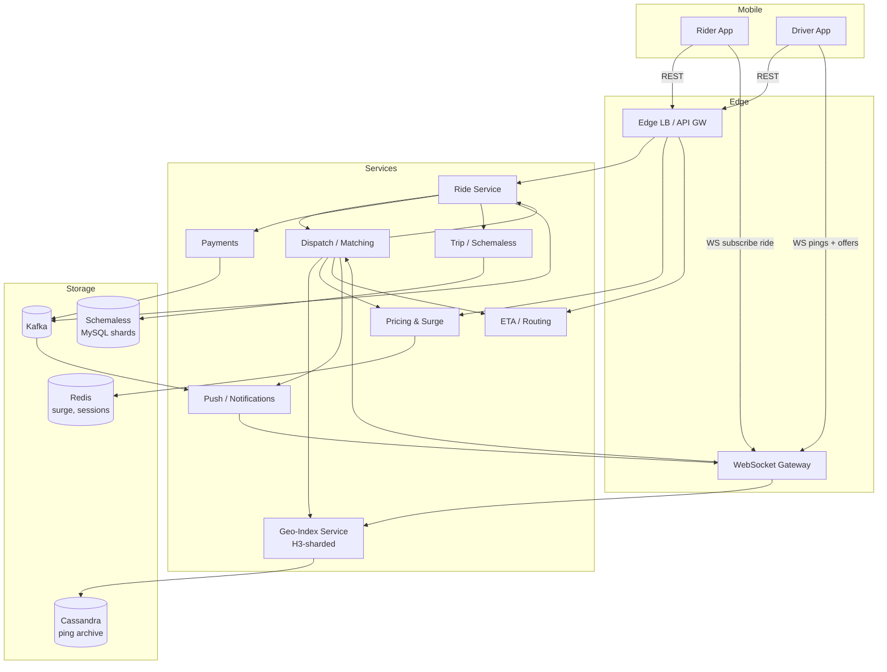
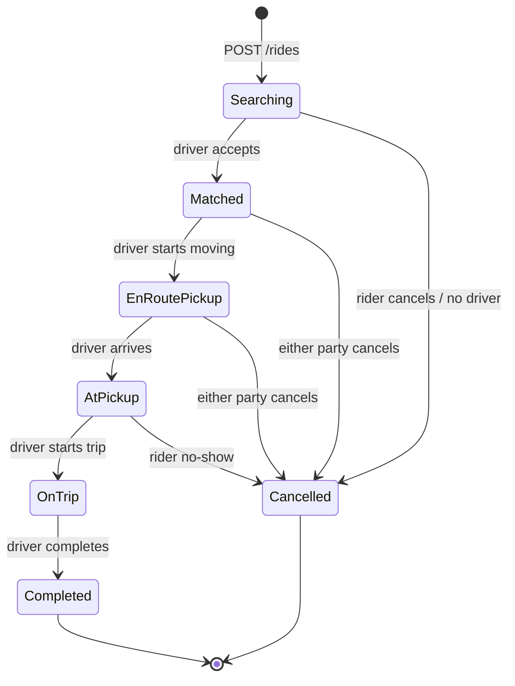

# Design Uber / Ride-Hailing — Geo-Indexing, Real-Time Dispatch, and Trip Lifecycle at Scale

**Date:** 2026-04-25 | **Updated:** 2026-04-25
**Tags:** `system-design` `case-study` `uber` `ride-hailing` `geo-indexing` `dispatch`

## Table of Contents

- [Summary](#summary)
- [Functional Requirements](#functional-requirements)
- [Non-Functional Requirements](#non-functional-requirements)
- [Capacity Estimation](#capacity-estimation)
- [API Design](#api-design)
- [Data Model](#data-model)
- [High-Level Diagram](#high-level-diagram)
- [Deep Dives](#deep-dives)
  - [1. Geo-Indexing with H3](#1-geo-indexing-with-h3)
  - [2. Driver Location Ingestion at Scale](#2-driver-location-ingestion-at-scale)
  - [3. Matching / Dispatch Algorithm](#3-matching--dispatch-algorithm)
  - [4. Trip State Machine](#4-trip-state-machine)
  - [5. Surge Pricing](#5-surge-pricing)
  - [6. ETA Prediction](#6-eta-prediction)
  - [7. Real-Time Tracking](#7-real-time-tracking)
  - [8. Payment & Receipts](#8-payment--receipts)
  - [9. Pool / Share — Multi-Rider Matching](#9-pool--share--multi-rider-matching)
  - [10. Dual-Write & Outbox Pattern](#10-dual-write--outbox-pattern)
- [Bottlenecks & Trade-Offs](#bottlenecks--trade-offs)
- [Anti-Patterns](#anti-patterns)
- [Related](#related)
- [References](#references)

## Summary

Ride-hailing is a **real-time, location-driven, two-sided marketplace** problem. The hard parts are not CRUD on trips — they are (1) keeping a constantly moving population of drivers indexed for sub-second nearest-neighbor lookup, (2) matching demand to supply under contention while respecting pricing and policy, and (3) running a durable, idempotent trip state machine that survives partial network failures across mobile clients, dispatch services, and payment processors.

Uber's published architecture centers on **H3**, a hexagonal hierarchical spatial index used for partitioning the globe into addressable cells, plus a sharded dispatch service ("DISCO" historically, then a series of evolutions) that consumes high-frequency driver location pings and performs constrained optimization to assign rides. Storage uses MySQL via [Schemaless](https://www.uber.com/blog/schemaless-part-one-mysql-datastore/) for trip data, Cassandra for high-write geo data in some paths, Kafka for event distribution, and a payments service that uses authorize-on-request, capture-on-completion semantics with the [outbox pattern](https://microservices.io/patterns/data/transactional-outbox.html) for cross-service consistency.

This doc treats the problem as **HLD-hard**: every section calls out where simple designs break and where Uber's published trade-offs apply.

## Functional Requirements

| Capability | Description |
|---|---|
| **Request a ride** | Rider specifies pickup + drop-off, ride type (UberX, XL, Black, Pool/Share, etc.), payment method. System returns ETA, fare estimate, surge multiplier. |
| **Driver matching** | System selects the best available driver near the pickup; driver gets a time-bounded offer to accept or decline. |
| **Real-time tracking** | Rider sees driver position update on map until pickup; both parties see route during trip. |
| **Fare calculation** | Quoted upfront fare + dynamic adjustment for waiting, route deviation, tolls. |
| **Surge / dynamic pricing** | Per-zone real-time multiplier based on supply/demand imbalance. |
| **Ratings & feedback** | Bidirectional ratings after each trip; tied to trip ID. |
| **Payment** | Pre-auth at request, capture at completion; tip after trip; split fare; business profile; cash markets. |
| **Multiple ride types** | UberX, XL, Black, Comfort, Pool/Share (multi-rider), Reserve (scheduled), Eats handoff. |
| **Cancellations** | Rider or driver cancel with cancellation policy (free window vs fee). |
| **Receipts & history** | Email + in-app trip history with map polyline, fare breakdown. |

Out of scope here: Eats fulfillment, Freight, Driver onboarding/KYC, fraud rings, regulatory reporting (e.g., NYC TLC).

## Non-Functional Requirements

| Property | Target | Why it's hard |
|---|---|---|
| **Match latency** | p50 < 1s, p99 < 3s from request to driver assignment | Geo-index must answer kNN over hot cells; dispatch must hold or shed load under spikes. |
| **Location update freshness** | Driver position visible to rider within ~1s | Drivers ping every 4–5s; mid-pings interpolated client-side; map-matched server-side. |
| **Trip durability** | No lost trips, no double-charges, exactly-once payment | Distributed across rider app, driver app, dispatch, payments. Outbox + idempotency keys. |
| **ETA accuracy** | MAPE < ~15% for short trips | Must beat naive Manhattan/haversine; needs road network + live traffic. |
| **Availability** | 99.99% for matching in served regions | Marketplace stops during outage. Region isolation prevents global blast radius. |
| **Global** | Hundreds of cities; per-region data residency | EU/India data localization; per-region currency, language, regulations. |
| **Cost / unit economics** | Cost per ride bounded; location-ingest path is the largest write workload | Naive "store every ping forever" is ruinous. |

## Capacity Estimation

Order-of-magnitude. Real Uber numbers vary by quarter and are publicly partial; these are reasonable back-of-envelope figures for an interview.

```text
Active drivers worldwide (peak):       ~5,000,000
Active riders worldwide (peak):       ~25,000,000
Ride requests/sec (peak):                 ~10,000  (~30M/day, weekend night peaks 2-3x)
Location pings/sec (drivers):          ~1,000,000  (5M drivers / 5s ping interval)
Location pings/day:                       ~86 B
Trip records/day:                          ~30 M
Storage per ping (compressed):          ~50 bytes  (driver_id, ts, lat, lng, heading, speed, accuracy)
Daily ping write volume:                  ~4.3 TB
Trip record (with polyline):           ~5–20 KB
Trip storage/day:                       ~150–600 GB
```

Implications:

- **Pings dominate the write path.** They go to a hot, sharded, recent-only store and a downsampled archive. Do not put them in the OLTP trip database.
- **Reads on the geo-index are bursty and regionalized.** Dispatch queries are local to a region; you don't need a global scatter-gather.
- **Trip writes are modest.** A sharded MySQL/Schemaless cluster per region handles this with room.
- **Fan-out for tracking** is significant: during trip, both rider and driver subscribe to position events; multiplied by concurrent trips (~hundreds of thousands at peak).

## API Design

A mix of **REST/gRPC** for command-oriented operations and **WebSocket / persistent connection** for streams.

### Rider-facing

```text
POST   /v1/rides/estimate
       body: { pickup: {lat,lng}, dropoff: {lat,lng}, product_type }
       returns: { eta_seconds, fare_low, fare_high, surge_multiplier }

POST   /v1/rides
       headers: Idempotency-Key: <uuid>
       body: { pickup, dropoff, product_type, payment_method_id, fare_estimate_token }
       returns: { ride_id, status: "searching" }

GET    /v1/rides/{ride_id}                       # snapshot
DELETE /v1/rides/{ride_id}                       # cancel

WS     /v1/rides/{ride_id}/stream                # driver location, status transitions, ETA updates

POST   /v1/rides/{ride_id}/rating
       body: { stars: 1..5, comment, tip_amount }
```

### Driver-facing

```text
WS     /v1/driver/session                        # bidi: driver sends pings; server sends offers
       client → server: { type: "ping", lat, lng, ts, heading, speed, accuracy }
       server → client: { type: "ride_offer", ride_id, pickup, dropoff_hint, expires_in_ms }
       client → server: { type: "ride_decision", ride_id, accept: true|false }

POST   /v1/driver/trip/{ride_id}/arrived
POST   /v1/driver/trip/{ride_id}/start
POST   /v1/driver/trip/{ride_id}/complete        # idempotent, finalizes fare
```

### Internal

```text
RPC dispatch.MatchRide(RideRequest)       → DriverAssignment
RPC geo.NearestDrivers(point, k, filters) → [DriverCandidate]
RPC pricing.GetMultiplier(h3_cell)        → multiplier
RPC payments.AuthorizeRide(...)
RPC payments.CaptureRide(...)
```

Notes:

- **`Idempotency-Key` on POST /rides is mandatory.** Mobile networks retry; double-creating a ride is a top user complaint and a payment hazard. Dedupe in the API gateway / ride service for ~24h.
- **Rider WS subscription** is per-`ride_id`, not per-user — easier sharding by ride.
- **Driver WS connection** is the long-lived ingest path for pings. Use a custom binary protocol (Uber moved off HTTP/JSON for this path historically) to reduce CPU and bandwidth.

## Data Model

```sql
-- riders (sharded by user_id)
rider(user_id PK, name, phone, email, default_payment_method_id, home_h3_cell, ...)

-- drivers (sharded by driver_id)
driver(driver_id PK, name, phone, vehicle_id, status ENUM('offline','available','en_route','on_trip'),
       current_h3_cell, last_ping_ts, rating_avg, rating_count, eligible_products[], ...)

-- vehicle
vehicle(vehicle_id PK, driver_id FK, make, model, license_plate, capacity, product_eligibility[])

-- trip / ride (sharded by ride_id; primary OLTP store)
trip(ride_id PK,
     rider_id, driver_id NULL, vehicle_id NULL,
     status ENUM('searching','matched','en_route_pickup','at_pickup','on_trip','completed','cancelled'),
     product_type, requested_at, matched_at, started_at, completed_at, cancelled_at,
     pickup_lat, pickup_lng, pickup_h3,
     dropoff_lat, dropoff_lng, dropoff_h3,
     fare_estimate_cents, fare_final_cents, currency,
     surge_multiplier, payment_intent_id,
     polyline BLOB,                              -- map-matched route
     idempotency_key, version /* optimistic CC */)

-- ride event log / outbox (append-only, sharded by ride_id)
ride_event(event_id PK, ride_id, event_type, payload JSON, occurred_at, published BOOL)

-- location_ping (NOT in the OLTP trip DB — separate hot store)
-- key: (driver_id, ts), partition by h3_cell at ingest time
-- TTL: short window (e.g., 24h hot, downsampled to long-term archive)
location_ping(driver_id, ts, lat, lng, h3_res9, heading, speed, accuracy)

-- surge zone (hot cache, recomputed periodically)
surge_zone(h3_cell PK, multiplier, computed_at, expires_at)

-- payment
payment(payment_intent_id PK, ride_id, amount_cents, currency, status, gateway_ref, created_at, captured_at)
```

Storage choices:

- **Trips → Schemaless on MySQL**, sharded by `ride_id`. [Schemaless](https://www.uber.com/blog/schemaless-part-one-mysql-datastore/) gives Uber an append-only, triggerable, sharded key-value layer over MySQL with per-shard buffered writes. Trips fit it well: write-once on creation, status transitions appended as cells.
- **Ride events → Kafka**, partitioned by `ride_id` so events for one trip are ordered.
- **Location pings → in-memory geo-index (live) + downsampled archive (Cassandra/HDFS).** The live index is the source of truth for dispatch; the archive is for analytics, fraud, ML training.
- **Surge zones → Redis** keyed by H3 cell, recomputed by a streaming pipeline.

## High-Level Diagram



Lifecycle, end-to-end:

1. Rider taps "Request" → `POST /v1/rides` (with Idempotency-Key).
2. Ride service creates a `trip` row in `searching` state, emits `RideRequested` event.
3. Dispatch picks up the request, asks Geo-Index for nearest candidates near pickup H3 cell, scores them, chooses one.
4. Dispatch sends a time-bounded offer to driver via WS. On accept, dispatch updates trip to `matched`, notifies rider.
5. Driver app continues pinging; rider app subscribes to driver position via WS gateway.
6. Status transitions (`en_route_pickup` → `at_pickup` → `on_trip` → `completed`) are appended as ride events; payments authorize at request, capture at completion.

## Deep Dives

### 1. Geo-Indexing with H3

The core question for dispatch: "Given a rider at `(lat, lng)`, what are the K nearest available drivers eligible for product type P, within radius R?"

Naive options and why they fail at scale:

| Approach | Why it breaks |
|---|---|
| `SELECT ... WHERE earth_distance(...) < R` | Full-table scan on a moving population; impossible at 1M pings/sec write rate. |
| PostGIS GIST index on `geography(Point)` | Works for low write rates but indexes get hot under continuous updates from millions of drivers. |
| Geohash strings with prefix lookup | Workable, but [geohash has rectangular cells with non-uniform neighbor distance](../../data-structures/geohash.md), and cell boundaries near the equator/poles distort. Adjacent cells may have very different prefixes (the "edge problem"). |
| **H3 (hexagonal hierarchical)** | Uber's choice. Hexagons have **uniform neighbor distance** (every hex has 6 neighbors at one ring distance, vs 8 with squares where 4 are diagonal-further). Hierarchy means you can zoom in/out without re-encoding. |

**[H3](https://h3geo.org/)** indexes the globe with hexagons at 16 resolutions (res 0 ≈ continent-sized, res 15 ≈ ~1m²). Common dispatch resolutions:

- **Res 7 (~5 km² per cell)** — coarse city-level zones (used for surge).
- **Res 8 (~0.7 km²)** — typical dispatch search shell.
- **Res 9 (~0.1 km²)** — fine-grained neighborhood / pickup matching.

Why hexagons specifically (per Uber's [H3 blog](https://www.uber.com/blog/h3/)):

- Only one type of neighbor distance (vs squares with two: edge and diagonal).
- Better approximates circles → range queries with `kRing(cell, k)` give roughly equal-area shells.
- Hex tilings have well-defined parent-child relationships (with a small caveat: due to the icosahedron-based projection, hexagonal cells don't tile perfectly across resolutions — H3 uses a 1:7 aperture and accepts a tiny non-determinism at edges).

Dispatch query in pseudocode:

```python
def find_candidates(pickup, product_type, k=20, max_rings=4):
    cell = h3.latlng_to_cell(pickup.lat, pickup.lng, res=9)
    candidates = []
    for ring in range(max_rings):
        cells = h3.grid_disk(cell, ring)              # cell + neighbors at ring r
        for c in cells:
            # geo-index is sharded by H3 cell → local lookup
            candidates.extend(geo_index.drivers_in_cell(c, filter=product_type))
        if len(candidates) >= k:
            break
    return rank(candidates, pickup)
```

> Pointer: see the planned `../../data-structures/geohash.md` for a comparison of geohash, S2, and H3, including the curve continuity differences.

### 2. Driver Location Ingestion at Scale

Drivers ping every **~4–5 seconds** while online. Five million online drivers gives ~1M pings/sec sustained. The path:

```text
Driver app ──WS──► Ingestion Gateway ──► H3-shard router ──► Geo-Index shard
                                          │
                                          └──► Kafka (analytics + archive)
```

Key design choices:

- **Sharding key = H3 cell at a fixed resolution (e.g., res 7 or 8).** A driver moving from cell A to cell B causes a brief move between shards, handled by an authoritative `driver_id → current_cell` map (Redis). This "hand-off" is the trickiest correctness detail.
- **In-memory state per shard.** Each shard holds the live position of drivers currently inside its cells. No disk read on dispatch path.
- **Ping path is fire-and-forget for non-dispatch consumers.** Analytics and archive consume from Kafka, not from the dispatch hot path.
- **Backpressure:** if a shard is hot, the gateway can sample (e.g., accept every 2nd ping for low-priority paths) without affecting dispatch correctness — pickups and on-trip drivers are prioritized.

Anti-patterns:

- Storing every ping in your OLTP DB. ~86B rows/day is not OLTP territory.
- Sharding by `driver_id` only. Co-locating drivers by space is what makes nearest-neighbor cheap.

### 3. Matching / Dispatch Algorithm

Two regimes:

**(a) Greedy nearest-driver (simple, low-density).** For each ride, pick the closest eligible driver. Easy to reason about, locally optimal, globally suboptimal.

**(b) Batch / global optimization (Uber's choice in dense markets).** Collect ride requests + available drivers in a small time window (sub-second to a few seconds), then solve a constrained assignment problem (e.g., minimum-cost bipartite matching / Hungarian-flavored, with side constraints). This avoids myopic greedy assignments where assigning ride A to the nearest driver leaves ride B with no good option.

Inputs to the cost function:

- Driver-to-pickup ETA (the dominant term).
- Driver acceptance probability (estimated; some drivers reject often).
- Trip profitability fairness (don't always give the long trips to the same driver).
- Surge balance (avoid ping-ponging drivers across surge boundaries).
- Product eligibility (UberX vs Black vs accessibility-equipped).
- Driver session length / fatigue policy.

Bidding vs deterministic:

- **Deterministic dispatch** (Uber): system selects, driver gets a take-or-leave offer.
- **Bidding** (some markets, some competitors): drivers bid; rider or system picks. Higher rider price discovery but worse latency and worse experience for new drivers.

Time-bounded offers (~10–15s) ensure that a single unresponsive driver doesn't stall the request.

### 4. Trip State Machine

Trips are a **finite state machine** with idempotent transitions:



Critical properties:

- **Idempotent transitions**: each state-change endpoint accepts an idempotency key and is safe to retry. Mobile networks drop packets; the driver tapping "Start Trip" must produce the same effect whether it arrives once or three times.
- **Optimistic concurrency** on the trip row: every transition checks `version` and increments. Two conflicting transitions (e.g., simultaneous cancel + complete) resolve deterministically.
- **State-change events are the source of truth** for downstream services (payments, notifications, analytics). They are appended to Kafka via the [outbox pattern](../../data-consistency/distributed-transactions.md) — see deep dive 10.
- **Cancellation policy is encoded as a transition guard**: free if `now - matched_at < 2 minutes`, else fee.

### 5. Surge Pricing

Goal: when demand exceeds supply in a zone, raise price to (a) reduce demand (some riders defer), (b) attract drivers from neighboring zones.

Architecture:

- **Zones = H3 cells at res 7** (city-block-ish). Per-zone, not per-rider.
- **Pulse loop**: every ~30s, a streaming job (Flink/Spark Streaming/Storm — Uber's history runs through all three) consumes:
  - Open ride requests by zone.
  - Available drivers by zone.
  - Recent acceptance rate, ETA, weather signals.
- Computes a multiplier per zone, writes to Redis with TTL.
- **Quoted at request time** and **locked into the trip** (the rider sees the upfront fare; mid-trip surge changes don't affect them).

Edge cases:

- **Boundary thrashing**: a zone flips between 1.0× and 1.5× rapidly, drivers chase the boundary. Mitigation: hysteresis (raise quickly, lower slowly), smoothing across neighbor cells.
- **Adversarial behavior**: drivers go offline simultaneously to trigger surge. Detected via correlated offline patterns and cooldowns.
- **Communication**: the rider sees the multiplier before confirming; the driver sees the heatmap.

### 6. ETA Prediction

Three layers, in increasing fidelity:

1. **Manhattan / haversine distance ÷ avg speed.** Useful as a sanity check and for early-stage estimates before location is precise.
2. **Road-network routing (shortest-path on a directed weighted graph).** Edge weights = expected travel time given recent traffic. Engines: OSRM, Valhalla internally; Uber has its own routing infra.
3. **ML overlay.** A model takes the routing engine's output as a baseline, adds features: hour-of-day, day-of-week, weather, recent observed travel time on each edge, driver behavior (some drivers are faster than average), pickup difficulty (airport vs corner), historical turn-restrictions, etc. Output: corrected ETA + uncertainty.

Trade-offs:

- Latency: the routing engine plus ML inference must complete inside the dispatch budget (~hundreds of ms). This pushes for pre-computed contraction hierarchies and feature caches.
- Accuracy vs honesty: a too-optimistic ETA is worse than a slightly pessimistic one; rider satisfaction is non-linear.

### 7. Real-Time Tracking

Once a driver is matched, the rider needs to see the driver's position update on a map.

Pipeline:

```text
Driver pings ──► Ingestion ──► (1) Geo-Index update
                            ──► (2) Map-matching (snap GPS to road)
                            ──► (3) Push to rider WS subscription for ride_id
```

Details:

- **Map matching** uses a hidden Markov model or Viterbi-style algorithm to snap noisy GPS to the most likely road segment. Without it, drivers appear to drive through buildings or jump lanes.
- **Push, don't poll.** WebSocket per ride. Polling at 1Hz × millions of riders = needless load.
- **Client-side interpolation.** Server pushes at ~1Hz; client smooths between pings with simple linear / spline interpolation so the marker looks continuous.
- **Location accuracy fallback**: when GPS is degraded (urban canyons), inflate uncertainty rather than show a wrong position.

### 8. Payment & Receipts

Two-phase pattern:

```text
Request:    PaymentIntent.authorize(amount = fare_estimate_high * surge)  → reserve funds
Trip end:   PaymentIntent.capture(amount = fare_final)                    → actual charge
Tip:        PaymentIntent.adjust(+tip)                                    → after-trip
```

Why authorize-then-capture:

- Catches expired/blocked cards before dispatch.
- Limits chargeback risk if the rider abuses (no-shows after free cancel window).
- Decouples "ride completed" from "payment settled" — settlement may take hours and runs in a different service.

Cross-service consistency:

- Trip service and Payment service are separate systems with separate databases.
- Use the **outbox pattern** (see deep dive 10): the trip service writes a `TripCompleted` event to its outbox in the same DB transaction as the trip status update. A relay publishes to Kafka; the payment service consumes idempotently.
- Tip is captured separately, optionally up to 24h after the ride.

Other features:

- **Split fare**: rider invites others; each rider's payment intent is created at split time.
- **Business profile**: switches `payment_method_id` at request time, tags the ride for expense export.
- **Cash markets**: in regions where Uber accepts cash, the trip flow skips authorize/capture and reconciles via driver settlement.

### 9. Pool / Share — Multi-Rider Matching

Pool/Share matches multiple riders going in roughly the same direction into one vehicle. This is **the hardest matching variant.**

Constraints:

- Each rider has a max-detour budget (e.g., 7 minutes).
- Each rider has a max-extra-stops budget.
- Total trip duration must remain bounded.
- Vehicle has a capacity limit (often 2 riders + driver).
- New rider joining mid-route must not violate budgets of riders already on board.

Algorithm sketch:

1. Maintain a small-window queue of pending Pool requests in a region.
2. For each new request, compute candidate vehicles: empty Pool drivers, or already-on-Pool-trip drivers whose detour to add this rider is within budget.
3. Score candidates by total system cost (sum of detours, vehicle utilization, expected revenue).
4. Assign on a tight timer; fall back to single-rider UberX if no good Pool match.

Trade-offs:

- More riders per vehicle = higher utilization, lower per-rider price, but worse experience (longer trips).
- Markets where Pool dominates require denser supply to keep detours small.

### 10. Dual-Write & Outbox Pattern

The recurring problem: trip service updates its DB **and** must publish an event reliably. Doing both in two separate operations risks one succeeding and the other failing.

Solution: **transactional outbox.**

```sql
BEGIN;
  UPDATE trip SET status='completed', completed_at=NOW(), version=version+1
    WHERE ride_id=$1 AND version=$2;
  INSERT INTO trip_outbox(event_id, ride_id, event_type, payload, occurred_at)
    VALUES (gen_uuid(), $1, 'TripCompleted', $payload, NOW());
COMMIT;
```

A separate **outbox relay** polls (or CDC-streams via Debezium) the outbox table and publishes to Kafka, then marks rows as published. Consumers (payments, notifications, ratings, analytics) are idempotent on `event_id`.

Properties:

- **Atomic with the trip update** (same transaction).
- **At-least-once delivery** to Kafka; consumers dedupe on `event_id`.
- **No 2PC.** No distributed transactions across DBs. See [`distributed-transactions.md`](../../data-consistency/distributed-transactions.md).

Alternative: **CDC** straight off the trip table's binlog. Works if every consumer can interpret raw row changes; outbox table gives you cleaner schemas decoupled from physical storage.

## Bottlenecks & Trade-Offs

| Concern | Trade-off |
|---|---|
| **Hot H3 cells in dense city centers** | A single shard handling Times Square at NYE is overwhelmed. Mitigation: dynamic re-sharding, finer-resolution buckets in dense areas, offload analytics to Kafka. |
| **Driver hand-off across shards** | Brief windows where a driver is "between cells." Authoritative `driver_id → cell` lookup serves as the tiebreaker. |
| **Match latency vs match quality** | Batch matching gives better assignments but increases p99. Tunable per-region: low-supply regions go greedy, high-density regions batch. |
| **Region isolation vs cross-region trips** | Per-region clusters limit blast radius but airport runs and city-pair trips need cross-region coordination. Solution: lead region for the trip, replicas for read. |
| **Surge as a control loop** | Pulse interval too short → jitter; too long → stale and unfair. ~30s is a common compromise. |
| **WebSocket sticky sessions** | Pings are bursty per driver. Sticky routing simplifies state, but breaks on rolling restarts. Mitigation: graceful drain + reconnect. |
| **Idempotency window** | Too short → dupes from slow retries; too long → state bloat. ~24h is typical. |
| **Payment captures at scale** | Capturing millions of ride completions creates a thundering herd against payment gateways. Smooth via async queue with rate limits per gateway. |
| **Storage retention for pings** | Hot tier for hours, warm for days, cold archive for analytics. Naive retention bankrupts the design. |

## Anti-Patterns

- **Storing pings in your OLTP trip DB.** Will destroy write capacity and bloat your hot data.
- **Single global geo-index.** Centralizing the world into one index makes every region's outage everyone's outage. Region-isolate.
- **Querying drivers with `WHERE distance < R` in SQL.** Even with PostGIS, this is the wrong shape for a moving population at this scale.
- **Polling for tracking.** A million riders polling at 1Hz crushes your edge. Push via WS.
- **No idempotency keys on `POST /rides` or status transitions.** You will create duplicate rides and double-charge customers.
- **Two-phase commit between trip DB and payments.** Operationally hostile; use outbox + idempotent consumers.
- **Trusting client-side timestamps.** Clock drift between phones and servers. Server stamps everything that matters legally or financially.
- **Ignoring map matching.** Raw GPS makes drivers look like they teleport through buildings; trips appear longer than reality, fares look wrong.
- **Surge based on raw request count without supply context.** You'll surge a cell with no demand if a few drivers go offline. Multiplier must be a ratio.
- **Treating Pool/Share matching as "UberX with extra steps."** It's a different problem class (online combinatorial optimization with rolling constraints).

## Related

- [`design-doordash.md`](./design-doordash.md) — three-sided variant (customer, courier, restaurant); much of the geo-dispatch carries over with delivery-specific twists (batched pickups, prep time).
- [`../../data-structures/geohash.md`](../../data-structures/geohash.md) _(planned)_ — comparison of geohash, S2, and H3 with curve-continuity and neighbor-distance properties.
- [`../../scalability/sharding-strategies.md`](../../scalability/sharding-strategies.md) — H3-cell sharding is a worked example of geographic sharding with hand-off.
- [`../../data-consistency/distributed-transactions.md`](../../data-consistency/distributed-transactions.md) — the outbox pattern lives here; this doc is the canonical "why" for trip + payment.

## References

- Uber Engineering — [H3: Uber's Hexagonal Hierarchical Spatial Index](https://www.uber.com/blog/h3/)
- H3 Project — [h3geo.org documentation](https://h3geo.org/docs/) and [GitHub uber/h3](https://github.com/uber/h3)
- Uber Engineering — [Schemaless, Part 1: MySQL Datastore](https://www.uber.com/blog/schemaless-part-one-mysql-datastore/) and [Part 2: Scaling Mezzanine](https://www.uber.com/blog/schemaless-part-two-scaling-mezzanine/)
- Uber Engineering — [How Uber Engineering Increases Safe Driving with Telematics](https://www.uber.com/blog/telematics/)
- Uber Engineering — [Engineering Real-Time Pricing (Surge)](https://www.uber.com/blog/engineering-surge-pricing/)
- Uber Engineering — [Project Mastermind: ETA Modeling at Uber](https://www.uber.com/blog/deepeta-how-uber-predicts-arrival-times/)
- Lyft Engineering — [Matchmaking in Lyft Line](https://eng.lyft.com/matchmaking-in-lyft-line-9c2635fe62c4) and [Geosharding at Lyft](https://eng.lyft.com/geosharding-at-lyft-7b4eb5f78fa9)
- Google S2 Geometry — [s2geometry.io](https://s2geometry.io/) (the alternative spherical index used at Google/Foursquare)
- Microservices.io — [Transactional Outbox Pattern](https://microservices.io/patterns/data/transactional-outbox.html)
- Debezium — [Reliable Microservices Data Exchange with the Outbox Pattern](https://debezium.io/blog/2019/02/19/reliable-microservices-data-exchange-with-the-outbox-pattern/)
