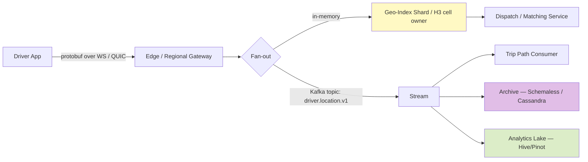
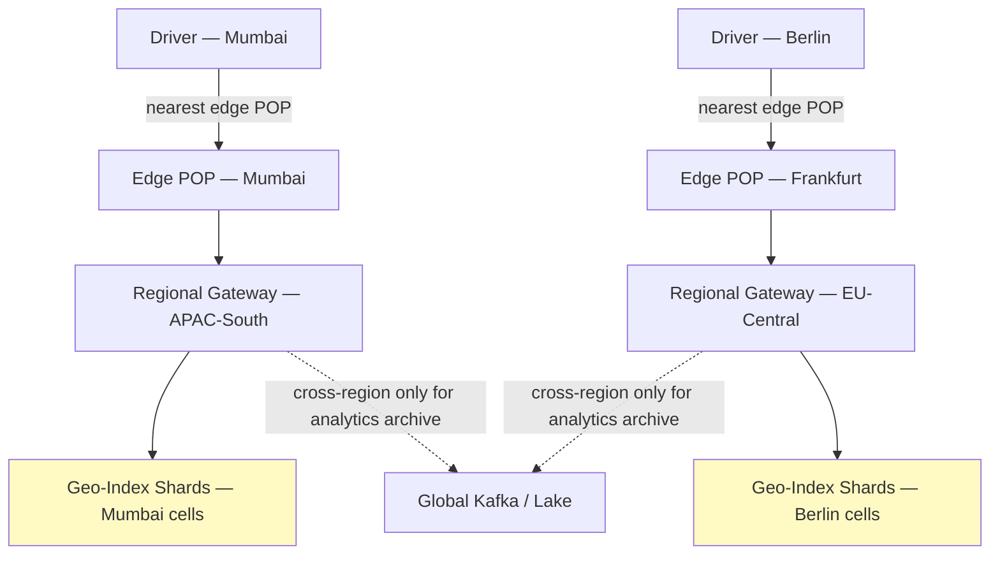
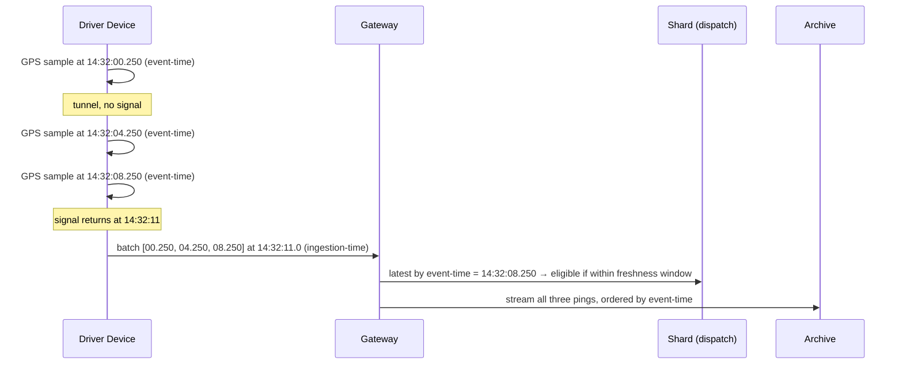

# Uber Deep Dive — Driver Location Ingestion

**Date:** 2026-04-29 | **Updated:** 2026-04-29
**Tags:** `system-design` `case-study` `uber` `deep-dive` `geospatial` `ingestion`

## Table of Contents

- [Summary](#summary)
- [Overview](#overview)
- [Volume Math](#volume-math)
- [Wire Protocol — Mobile-First Design](#wire-protocol--mobile-first-design)
- [Regional Sharding and Gateway Topology](#regional-sharding-and-gateway-topology)
- [Storage Choices — Hot, Warm, Cold](#storage-choices--hot-warm-cold)
- [Time-Series Compression for Retroactive Queries](#time-series-compression-for-retroactive-queries)
- [Downsampling for Analytics](#downsampling-for-analytics)
- [Battery and Network Constraints](#battery-and-network-constraints)
- [Outdated Locations and Signal Loss](#outdated-locations-and-signal-loss)
- [GPS Noise Filtering](#gps-noise-filtering)
- [Event-Time vs Ingestion-Time](#event-time-vs-ingestion-time)
- [Anti-Patterns](#anti-patterns)
- [Related](#related)
- [References](#references)

## Summary

Uber's driver-location ingestion path is the single largest write workload in the company and the dominant cost driver of the marketplace platform. The hard parts aren't dispatch math — that's covered in [`../design-uber.md`](../design-uber.md) — they're (1) accepting roughly **one million pings per second** from a population of mobile devices on flaky cellular networks while paying battery and bandwidth budgets the device owner didn't agree to spend, (2) routing each ping to a shard that owns the right slice of geography even as the driver crosses cell boundaries, (3) keeping the **dispatch hot path** (in-memory, sub-second) cleanly separated from the **archive path** (durable, queryable months later), and (4) deciding which pings to even believe given that GPS lies, networks reorder packets, and a driver in a parking garage will reappear three blocks away two minutes later. This doc is the deep-dive companion to the "Driver Location Ingestion at Scale" subsection of the parent case study and follows the same prose-first, anti-pattern-aware format as [`../../../communication/real-time-channels.md`](../../../communication/real-time-channels.md).

## Overview

Uber's driver app pushes a stream of location samples to the backend continuously while the driver is online. Every sample is a small structured record — latitude, longitude, heading, speed, accuracy, timestamp, plus session/device context — and every sample needs to land in **at least three places**:

1. The **dispatch hot path** — an in-memory geo-index keyed by [H3](h3-geo-indexing.md) cell so the matching service can answer "drivers near this pickup, sorted by ETA" in single-digit milliseconds.
2. The **trip path** — when the driver is on a trip, the rider's app and the ETA service want the latest position with sub-second freshness.
3. The **archive path** — durable storage for analytics, fraud, payments adjudication, regulatory reporting, and post-trip map polylines.

These three consumers have wildly different SLAs, retention windows, and cost budgets. The defining architectural decision is to **fan out the ping at the gateway** instead of forcing a single service to satisfy all three. That choice cascades into protocol design, sharding strategy, storage layering, and how the system degrades when something fails.



The Marketplace platform team at Uber has published several pieces describing pieces of this — Ringpop for in-memory sharding, Schemaless as the MySQL-backed durable layer, and various blogs describing the H3 index — referenced at the bottom of this doc.

A useful framing: think of this system as a **distributed in-memory database for moving objects**, with a write-only firehose feeding it and three classes of reader (dispatch, trip, archive) all hanging off the same source-of-truth stream. The "database" is the cluster of geo-index shards; the "WAL" is Kafka; the "snapshots" are Cassandra and Schemaless. Every architectural decision can be traced back to which of these abstractions it serves.

A second framing: the system is **failure-defined**, not capability-defined. Almost any naive design works at low scale. What makes Uber's published architecture interesting is the discipline around what happens when (a) a region partitions, (b) a Kafka cluster falls behind, (c) a noisy GPS sensor floods garbage, (d) a city-wide cellular outage triggers a reconnect storm at 5x normal rate, or (e) a deploy bug in the gateway crashes 30% of pods at once. The good designs degrade; the bad designs cliff.

## Volume Math

The ingestion path is what makes this problem an HLD-hard one. Numbers below are reasonable order-of-magnitude figures for an interview or design review; real Uber numbers vary by quarter and are publicly partial.

```text
Online drivers worldwide (peak):       ~5,000,000
Ping interval:                         ~4 seconds (sometimes 5s, sometimes 1s on-trip)
Pings/sec (sustained peak):            ~1,250,000
Pings/day:                             ~108 billion
Avg encoded ping size:                 ~80 bytes (compact binary, batched)
Raw wire bytes/sec:                    ~100 MB/s (~8.6 TB/day)
After fan-out into Kafka (3x replica): ~25 TB/day in-flight
Naive "row per ping" in OLTP DB:       infeasible — see anti-patterns
```

Three numbers worth memorizing for the interview:

- **~1M pings/sec** sustained on the ingestion path during global peak (Friday and Saturday evenings, distributed across timezones — the global average smooths peaks somewhat).
- **~100 GB/hour** of raw location bytes after compression but before replication.
- **~100 B rows/day** if you tried to store every ping as an OLTP row. This is not a relational database problem; it's a stream and a time-series problem.

Cost intuition: at a few cents per GB/day for hot SSD-backed durable storage and a few hundred microseconds of CPU per ping for parsing/dispatch, **the ingestion path easily dominates the cost-per-ride** unless you aggressively shed work, downsample for non-critical consumers, and keep the dispatch path entirely in memory.

A second-order calculation worth doing in interviews is the **per-driver lifetime cost** of pings. A driver online for an 8-hour shift produces ~7,200 pings. At 80 bytes encoded, that's ~600 KB of raw wire data per shift. Multiplied across 5M drivers globally per day, that's only ~3 TB/day of raw wire bytes — easily handled by a modest fleet. The cost explosion comes from **fan-out and replication**: 3× Kafka replication, 3× Cassandra replication, 2× cross-region replication for analytics, plus index overhead, plus retention multiplied by months. A naive design fan-outs to 10× the source bytes; a good design (with downsampling on the analytics tap) keeps the multiplier closer to 5×.

It's also worth noting that ping rates are **not uniform across the day or across the world**. Friday night in São Paulo is 5× the rate of Monday morning. New Year's Eve in any major city is 10× a normal Tuesday. The system must be sized for peak, not average — and peak is a regional concept, which is one of the strongest arguments for regional sharding.

## Wire Protocol — Mobile-First Design

A naive "POST a JSON ping every 4 seconds" implementation is what kills the battery and the cell tower and the gateway. The driver's phone is a constrained client running on cellular data on a battery, often on the same packet radio as the rider's phone two cars away. The wire protocol is engineered around four mobile-first goals:

1. **Compact encoding.** Protobuf or similar tagged binary format. A 6-decimal lat/lon as a `double` is 16 bytes; encoded as a fixed-precision int32 (microdegrees) it's 8. Heading and speed compress to one or two bytes each. A typical encoded ping is **60–100 bytes**, vs 250–400 bytes for the equivalent JSON.
2. **Batching when safe.** Instead of one TLS write per sample, the device buffers 2–4 samples (~1 second of work) and sends a single batched message. This collapses the per-message TCP/TLS overhead but adds at most one batch interval of latency. On-trip drivers send shorter batches; off-trip "available" drivers tolerate longer batches and a slower cadence.
3. **One persistent connection.** A long-lived WebSocket or QUIC stream — see [`../../../communication/real-time-channels.md`](../../../communication/real-time-channels.md) — means no per-ping TLS handshake. The phone's radio gets to sleep between batches instead of repeatedly waking from idle to negotiate a new TCP socket. QUIC's 0-RTT resumption is especially valuable for cellular where IP address changes are routine.
4. **Idempotency keys per ping.** Each sample carries a monotonic device sequence number. The gateway can deduplicate replays without consulting state. Combined with at-least-once delivery to Kafka, this gives effectively-once semantics for the archive without distributed transactions.

A simplified record shape:

```protobuf
message DriverPing {
  string driver_id        = 1;     // session-scoped opaque ID
  uint64 device_seq       = 2;     // monotonic per device session
  sfixed64 ts_event_ms    = 3;     // device wall clock at sample time
  sfixed32 lat_micro_deg  = 4;     // lat * 1e6
  sfixed32 lon_micro_deg  = 5;     // lon * 1e6
  uint32 accuracy_m       = 6;     // GPS reported horizontal accuracy
  uint32 speed_cm_s       = 7;     // 0..65535 cm/s = 0..2358 km/h headroom
  uint32 heading_deg      = 8;     // 0..359
  TripContext ctx         = 9;     // on-trip / dispatching / available
  uint32 battery_pct      = 10;    // for engagement signals, not auth
}
message DriverPingBatch { repeated DriverPing pings = 1; }
```

Two things worth calling out:

- **Event timestamp is set on the device.** The server must not trust device wall clock blindly (see [Event-Time vs Ingestion-Time](#event-time-vs-ingestion-time)) but it needs the device's view of when the sample was taken to do any reasoning about gaps, ordering, or signal loss.
- **No PII beyond the session-scoped driver ID.** The wire frame is a movement record; identity resolution happens server-side after auth.

A few protocol details that don't show up in the schema but matter:

- **Connection establishment carries a session ticket, not a fresh login.** The driver app authenticates once per session (or once per app-start) and receives a short-lived ticket bound to the WebSocket/QUIC connection. Per-ping auth would bottleneck on the auth service; per-session auth amortizes the cost across thousands of pings.
- **The server pushes control messages on the same connection.** Cadence policy changes, "you have a ride offer," "session is being closed for maintenance" — all use the duplex direction of the same socket. This means there is exactly one persistent connection per driver, period. No separate notification channel, no separate dispatch channel.
- **Compression at the message level, not just TLS.** TLS compresses, but enabling per-message protobuf-aware compression (zstd or LZ4 on batched ping payloads) saves another 20–40% on the wire for the longer batches.
- **Partial parsing.** The gateway extracts only the routing-relevant fields (driver_id, latest lat/lon, event_ts) from the protobuf to make the routing decision, and forwards the raw bytes downstream without re-encoding. Saves CPU on the hottest path in the system.

## Regional Sharding and Gateway Topology

Drivers don't move randomly across the globe — a driver online in Mumbai stays in Mumbai for the shift. That's the hook for regional sharding. Uber operates per-city or per-metro fleets, and the ingestion gateways are deployed regionally with **stickiness by city** so that a driver's pings always land on the same physical region.



Two layers of routing:

- **Anycast / latency-based DNS to the nearest edge POP.** Termination of TLS happens close to the phone — RTT to the gateway is what dominates ping freshness. For a driver in Mumbai, a Frankfurt gateway adds 150ms+ RTT and triples handshake costs.
- **From the gateway, deterministic routing to a geo-index shard keyed by H3 cell.** The shard owner is a process in a Ringpop-style consistent-hash ring (see [References](#references)). Sharding key is the H3 cell at a fixed resolution (typically res 7 or 8), not `driver_id`. This is the critical choice — sharding by `driver_id` would scatter drivers in the same neighborhood across N machines and force fan-out for every nearest-neighbor query. Sharding by cell co-locates drivers in the same airspace and lets the dispatch query hit a small number of shards.

The trickiest correctness detail is the **cell hand-off**: a driver moving from cell A to cell B causes the authoritative `driver_id → current_cell` map (Redis, with short TTLs) to flip, which means a brief window where two shards both believe they own the driver. Designs differ here:

- **Authoritative map first, shard second.** The gateway looks up the driver's current cell in Redis, then routes to the correct shard. Hand-off is "atomic" in the sense that one Redis write flips it, but adds a Redis round-trip per ping.
- **Re-derive cell from the ping itself, gossip the move.** The gateway computes the cell from the lat/lon in the ping and routes there directly. Faster, but two shards may briefly hold positions for the same driver. Dispatch reads tolerate this by always preferring the latest by event timestamp.

In practice the second pattern dominates the hot path; the first is used when strict ownership matters (e.g., toll calculations).

Region isolation has a second benefit: **blast radius**. An outage in EU-Central does not stop matching in APAC-South. Cross-region traffic exists only for the durable archive (which can tolerate a few seconds of replication lag) and for global analytics, which runs out of band on the lake.

A few operational realities of running this topology:

- **Shard rebalancing is constant.** Driver populations shift across cells (commuter flows, event-driven surges, weather). The Ringpop-style ring rebalances continuously to keep memory pressure even — a hot shard gets cells peeled off; a cold shard absorbs more. Rebalancing must not drop pings; the standard approach is dual-ownership during the transition window, with the receiving shard catching up from a Kafka offset before the sending shard releases ownership.
- **Multi-tenant gateways.** A single gateway pod serves drivers across many cities within a region. Per-city quotas at the gateway (max connections, max pings/sec) prevent one city's reconnect storm from starving its neighbors.
- **Edge POPs vs origin gateways.** TLS termination at the edge POP closes the long-haul TCP at the cost of one extra hop inside Uber's backbone. The trade is almost always worth it because the long-haul link is far less reliable than the internal one — re-establishing TLS over a flaky cellular link to a faraway origin is the worst possible failure path.
- **Shard size is bounded by recovery time, not memory.** A shard owning 50K drivers can be rebuilt from Kafka in seconds; a shard with 5M drivers takes minutes. Recovery time, not RAM cost, is what caps how much you cram onto one shard.

## Storage Choices — Hot, Warm, Cold

No single store is the right answer for location data. Pings split into **three tiers** with different access patterns, retention, and costs.

| Tier | Store | Latency | Retention | Cardinality / Pattern |
|---|---|---|---|---|
| Hot — dispatch | In-memory per shard (Ringpop nodes) | sub-millisecond | seconds (latest position only) | "Drivers in cell X right now" |
| Warm — trip + recent | Redis (cluster) — Geo commands or sorted sets keyed by trip | < 5 ms | hours | "Driver position for trip T over the last hour" |
| Cold — archive | Schemaless on MySQL, or Cassandra column families | tens of ms | months to years | "Replay polyline for trip T", batch analytics |

**Hot tier — in-memory.** Each geo-index shard holds the **latest position** of every driver currently inside its cells, plus a small ring buffer (say, last 60 seconds) for short-window dispatch decisions. No disk read on the dispatch path. Memory cost scales with active drivers, not with ping rate — a driver with 1M pings over a shift takes the same RAM as a driver who pinged once, because only the latest is kept.

**Warm tier — Redis.** Two distinct uses:

- **Driver→cell map** (the routing source-of-truth above): a string key per driver, TTL'd, written cheaply on cell hand-off. This is small (one row per online driver, ~5M entries) and can fit in a few Redis shards.
- **Per-trip recent positions**, used by the rider app and ETA service. A Redis sorted set keyed by trip ID, scored by event timestamp, with values being encoded ping records. The set is auto-trimmed to the most recent 30–60 minutes. Redis Geo commands (`GEOADD`, `GEOSEARCH`) are sometimes used here too, but Uber's published path leans more on dedicated sharded services for the dispatch geo-index than on Redis Geo for the hot dispatch path. Redis Geo is more common for warm "where was driver D in the last hour" lookups.

**Cold tier — Cassandra or Schemaless.** Cassandra's wide-row, time-bucketed write model is a near-perfect fit for ping archives: partition key `(driver_id, day_bucket)`, clustering key `event_ts`, value is the encoded ping or a compressed batch. Writes are fast (LSM, no read on write), reads of a contiguous time range scan a single partition, and TTL can expire old buckets without operator intervention. Schemaless — Uber's MySQL-backed "trigger-friendly key-value over MySQL shards" — is used heavily for trip-record-anchored data, with location polylines stored alongside the trip row once the trip completes.

The cold tier is **never written from the dispatch path** — pings flow there asynchronously through Kafka, and a slow Cassandra cluster can never back-pressure dispatch. This separation is non-negotiable.

A subtle point about Cassandra modeling for ping archives: the partition key choice has compound consequences. `(driver_id, day_bucket)` partitions are a good default — they bound partition size (one driver's day of pings is at most ~100K rows pre-batching, ~1K rows post-batching), they support the dominant access pattern (replay a trip's polyline by reading a partition slice), and they distribute writes evenly across the cluster (because driver_id is high cardinality and day_bucket changes slowly). The alternative `(city_id, hour_bucket)` would create catastrophically hot partitions in dense cities. Lesson: **partition keys should be high-cardinality and time-bounded**, never one of those without the other.

Schemaless deserves a separate note. It is not a database — it's a sharding and trigger layer over MySQL that gives Uber a horizontally scalable, schema-evolvable key-value abstraction with secondary indexes built as denormalized companion cells. For trip records (one row per trip with a polyline blob attached) it works well because the cardinality is bounded by completed trips, not by raw pings. For raw ping ingestion, Cassandra's LSM-tree write path and time-bucketed partitions are the better fit. The two stores coexist in Uber's stack, each owning what they're good at.

## Time-Series Compression for Retroactive Queries

Storing one row per ping is the obvious-but-wrong approach. Uber's archive path packs pings into **time-series batches** before persistence, with delta-of-delta encoding on timestamp and lat/lon and a header carrying the base values. This is the same family of techniques as Facebook's Gorilla TSDB and the formats used by Prometheus, InfluxDB, and Apache Pinot.

A typical encoding:

- Bucket: `(driver_id, hour)` — one row per hour.
- Header: `base_ts`, `base_lat`, `base_lon`.
- Body: a varint-packed sequence of `(Δt, Δlat, Δlon)` deltas.
- Optional secondary streams: speed, heading, accuracy (often even more compressible because they change slowly).

Compression ratios in the 8–15× range over the raw protobuf are realistic; for slow-moving or stationary drivers (parked, or stuck in traffic) the ratio can exceed 30× because deltas collapse to near-zero. At 100B raw rows/day, the difference between a 100-byte row and a 10-byte row is **tens of petabytes a year**, which is the difference between a viable archive and a financially infeasible one.

The trade-off is **read amplification on point queries.** "Where was driver D at 14:32:07?" requires reading the whole hour bucket and walking the deltas. This is fine — point-in-time queries are rare, and the dominant access pattern is "give me the polyline for trip T" which is naturally a range scan. For the rare point query, an in-batch index (offset markers every N samples) cuts the scan cost.

A few additional considerations for the time-series store:

- **Late-arriving sample handling.** Once an hour bucket is sealed and compressed, appending a late sample is expensive — you'd have to decode, insert, re-encode. The pragmatic answer is a "late samples" side bucket per driver-day, scanned only when the forensic query needs it. The vast majority of samples arrive in order; the exception path stays small.
- **Compaction strategy.** Cassandra's TimeWindowCompactionStrategy (TWCS) is the standard fit: each hour bucket compacts independently, old buckets stay frozen, and TTL drops them cleanly. Avoid SizeTieredCompactionStrategy on this workload — it creates massive compaction storms when buckets age.
- **Cross-table correlation.** Joining ping archives against trip records (in Schemaless) is a batch operation, not a real-time one. Run it on the lake (Hive, Spark, Pinot) where you can afford the join cost, and materialize the joined view back to a serving store for the support team's UIs.

## Downsampling for Analytics

Analytics rarely needs 4Hz fidelity. A demand-supply heatmap binned by H3 cell at 1-minute granularity does not benefit from 240 samples per minute per driver — the marginal information is below the noise floor of the question. Uber's analytics path **downsamples aggressively** on its way into the lake:

- **Stream-side downsampling.** The Kafka consumer for the analytics topic emits one record per driver per N seconds (typical N = 10 or 30) by keeping only the last sample in each window. Bandwidth into the lake drops by 30–80% with no loss to the questions the lake actually answers.
- **Query-side downsampling.** Pinot or Hive tables roll up further at ingest time, producing pre-aggregated cubes (`cell × minute × ride_type → driver_count`). Dashboards hit the cube, not the raw stream.
- **Per-purpose retention.** Raw archive (cold tier) retains 60–90 days at full resolution for fraud and payments adjudication. Aggregated cubes retain years at coarse resolution for product analytics. Same source stream, different SLAs.

The mental model is **never let the dashboard query the dispatch path**. The dispatch path is a real-time system on a strict latency budget; analytics is a batch system on a strict cost budget. They share the source stream and nothing else.

One more analytics consideration: **fairness and bias**. Aggressive downsampling can erase the signal for low-volume markets — a market with 100 drivers downsampled at 1 sample per 30 seconds gives ~200 samples per minute, which is fine for cell-level heatmaps but too coarse for individual driver insights. Uber's analytics path keeps the raw tier for adjudication and forensics specifically because aggregated cubes hide individual stories that matter for fraud, payments disputes, and driver support. The rule is **store cheap raw, query against expensive aggregates** — never the other way around.

## Battery and Network Constraints

The driver app is on a phone the driver owns. Burning their battery or their data plan is a churn risk and, in some markets, a regulatory and PR risk too. The protocol decisions above (binary encoding, batching, persistent connection) are the first line; the second line is **adaptive cadence**.

- **On-trip drivers** ping at ~4 Hz (every 250ms is plausible for the rider-tracking experience, but most published Uber numbers settle around 4-second pings with client-side interpolation for the rider's map). The trip is paid work, and freshness directly drives the rider experience.
- **Available drivers** (not on a trip, eligible for dispatch) ping at ~4–5 seconds, fast enough for dispatch, slow enough to be sustainable.
- **Dispatching drivers** (offered a ride, not yet accepted) briefly bump cadence to provide a tighter ETA quote.
- **Idle / offline drivers** stop pinging entirely. The session ends, the connection closes, the in-memory shard slot is released after a short grace period.

Adaptive cadence is enforced **client-side** with a server-pushable policy. The gateway can broadcast "raise cadence in cell X to 2 seconds" during a surge event, or "lower cadence everywhere by 50%" during an incident. Drivers receive the policy on the next downstream message — the same persistent connection used for ingestion is reused for control plane.

Network adaptivity matters too. On 2G/3G networks the device ramps batch size up and cadence down to amortize the higher per-message cost; on Wi-Fi or LTE/5G the device is allowed to ping more aggressively. The phone's `NetworkInfo` is part of the decision but the server's view of recent latency is also fed back.

A few specific battery considerations that have shipped in real driver apps:

- **Doze mode and background restrictions.** On both Android and iOS the OS aggressively kills network sockets and CPU work for backgrounded apps. The driver app must be in the foreground (or use foreground services on Android, with the appropriate user-visible notification) to maintain the persistent connection. This is a UX constraint, not just an engineering one — drivers are trained to keep the app open.
- **GPS chip duty cycle.** Continuously polling the GPS chip burns more battery than the network does. Modern phones support fused location providers that combine GPS with cell-tower triangulation and Wi-Fi positioning, with much lower power draw. The app should request the lowest-fidelity provider that meets the freshness requirement, and ramp up only when on a trip.
- **Radio state machine.** Cellular radios have aggressive sleep modes; waking the radio costs both time (hundreds of ms) and energy. Batching pings to wake the radio infrequently dominates the savings on most networks. This is also why holding a persistent connection is cheaper than opening a fresh one — the radio stays in connected state longer per byte sent.
- **Dark patterns to avoid.** It's tempting to keep the radio hot at all times for snappy ride offers. Don't — drivers notice battery drain immediately and uninstall. The right answer is a fast-wake protocol: a low-power keepalive that the network can pierce with a push to wake the radio when an offer arrives.

## Outdated Locations and Signal Loss

Drivers go through tunnels. They park in basements. They drive through neighborhoods where the cell tower coverage is honestly bad. From the server's perspective, **the absence of a ping is itself a signal**, and the system has to decide whether the last known position is still trustworthy.

A simple rule used widely: **a driver's position is considered fresh for `T_max` seconds past the last received ping**, after which the driver is excluded from dispatch and shown as "checking connection" in the UI. Reasonable values:

| Cohort | T_max | Why |
|---|---|---|
| On-trip driver | 30 seconds | Beyond this the rider sees a "reconnecting…" indicator and the trip path falls back to dead-reckoning extrapolation. |
| Available driver (dispatch eligible) | 15 seconds | Stale drivers must not be matched — a 15-second-old position can be 100+ meters off in city traffic, more on a highway. Failed pickups are expensive in driver and rider trust. |
| Dispatching driver (offer pending) | 10 seconds | Tightest budget — the offer is time-bounded and the rider is watching the ETA. |
| Driver showing on supply heatmap | 60 seconds | Small staleness OK for aggregate views; the heatmap is not the dispatch path. |
| Driver showing in the rider's "drivers nearby" map | 30 seconds | Marketing-style visualization, not dispatch — but riders notice if a "ghost car" lingers, so a 30-second cap matters. |

Beyond `T_max`, the in-memory shard **does not delete the entry**; it marks it stale. If pings resume within a recovery window (say, 2 minutes), the driver re-enters the eligible pool with the new fresh position. After the recovery window, the session is closed and the driver must re-establish, which forces a fresh auth and a clean state.

There's a subtle interaction with cell hand-off. A driver who ducks into a tunnel while crossing from cell A to cell B may emerge in cell B without the system having seen the transition. The next ping is the first sample in cell B, and the gateway must route there directly — if it relies on the cached `driver_id → current_cell` map without invalidating on `T_max`, the ping goes to the wrong shard. The fix is to **always derive the cell from the ping's lat/lon** (cheap, deterministic with H3) and, on disagreement with the cached map, flip the map.

There is also a fairness / safety consideration: a driver whose phone keeps dropping pings should not be repeatedly offered rides only to lose them mid-pickup. Quality signals (cadence stability, accuracy) feed into the dispatch cost function so consistently flaky drivers are deprioritized for distant pickups even when their last ping is technically fresh.

Edge cases that need explicit handling:

- **Buffered replay on reconnect.** When a driver re-emerges from signal loss with a backlog of pings, the gateway accepts them as a single batch tagged "replay" so the dispatch shard doesn't treat the oldest ping as the current position. The shard takes only the **latest by event-time** as the live position; the rest go to the archive path.
- **Phantom drivers.** A driver whose app crashes but whose connection lingers (TCP half-open) can appear online for the duration of the keepalive timeout. App-level heartbeats with aggressive timeouts (15–30 seconds) catch this faster than relying on TCP keepalive.
- **App backgrounded mid-trip.** On a phone whose OS aggressively kills backgrounded networking, the trip path must reconnect within seconds and replay missed samples. The trip is paid work; the rider expectation is that the dot keeps moving.
- **Multiple devices.** A driver who logs in on a second device while the first is still connected should not be in two cells at once. Session tokens are device-bound; a new session invalidates the previous and the gateway closes the old connection.

## GPS Noise Filtering

Raw GPS is noisy. Even on a phone with a good antenna in clear sky, horizontal accuracy is rarely better than 5 meters; in urban canyons it can degrade to 50+ meters and **jitter wildly**. Uncorrected pings produce visible artifacts: drivers that "teleport" across the street, polylines that zigzag down a straight road, and ETAs that swing because the apparent speed of the driver changes from sample to sample.

Two families of filters apply, depending on where in the system the cleanup happens:

**1. Client-side cheap filters** — run on the device before the ping is even sent, to avoid wasting bandwidth on samples the server would discard.

- **Accuracy gate:** drop samples with reported accuracy worse than a threshold (e.g., > 100m).
- **Speed sanity:** if implied speed from the previous sample exceeds a plausibility bound (e.g., > 200 km/h for a city-vehicle product), drop the sample as a likely glitch.
- **Stationary clamp:** if the driver is stationary (speed < 0.5 m/s) and the new sample is within the prior accuracy radius, suppress the update — this stabilizes the dot in the rider's app while parked at pickup.

**2. Server-side smoothing** — run on the ingest path or on the fan-out consumer, with more state and more compute available.

- **Simple moving average over the last K samples.** Cheap, smooths jitter, but lags real movement. Acceptable for the dispatch hot path where what matters is "roughly where" not "exactly where."
- **Kalman filter.** A standard tracking filter with a state vector of `(lat, lon, speed, heading)`, model noise covariance, and measurement noise from the GPS-reported accuracy. The Kalman filter weights new samples by their reported accuracy: a noisy sample (accuracy 80m) barely moves the estimate; a clean sample (accuracy 5m) snaps to the new value. This is the standard textbook answer and the one most published mapping/AV systems use.
- **Map-matching.** A separate, heavier process that snaps the noisy sequence onto the road network. Map-matching gives the best polyline quality but is too expensive for the dispatch hot path — Uber runs map-matching on the **trip-completion path** for stored polylines and ETA training, not on incoming pings. The dispatch path consumes raw or Kalman-smoothed positions and tolerates the resulting fuzz.

The architectural rule: **filter cheaply early, filter expensively late.** A Kalman filter's state per driver is small (a few floats) and fits in the in-memory shard alongside the latest position; full map-matching is a stream job.

A few practical Kalman filter notes specific to ride-hail:

- **Measurement noise should track GPS-reported accuracy.** The standard textbook Kalman example assumes constant noise; the real world doesn't. When the device reports `accuracy_m = 80`, the filter should weight that sample at roughly `1/80²` relative to a sample with `accuracy_m = 5`. Otherwise a single bad sample can drag the estimate violently and make the rider's map jitter.
- **Process noise depends on driver state.** A stationary driver at a pickup has near-zero true motion; the process noise should be tiny so the filter doesn't drift on stale samples. A driver on a highway has high true motion; process noise should be large enough that the estimate keeps up. Some implementations use a two-mode model (stationary vs moving) with a Markov transition.
- **Outlier rejection is upstream of the filter.** A sample reporting 80 km/h while every other sample says 0 is most likely a glitch, not a true motion. Reject it on the speed-sanity gate before it enters the filter, otherwise a single outlier will lift the estimate by tens of meters.
- **Filter divergence detection.** If the filter's predicted position keeps diverging from incoming samples (residuals grow), reset it. A reset is cheap (re-seed from the next clean sample) and is far better than a stuck filter producing useless estimates for minutes.

## Event-Time vs Ingestion-Time

Every ping has two interesting timestamps:

- **Event-time (`ts_event_ms`)** — when the GPS sample was taken on the device, set by the device's wall clock.
- **Ingestion-time** — when the gateway received and accepted the ping.

These can differ by anywhere from milliseconds (clean LTE, drivers in good coverage) to **minutes** (driver re-emerges from a basement and replays buffered pings). The system must reason about both.

For the **dispatch hot path**, ingestion-time is what gates eligibility — a driver whose last ping arrived 2 minutes ago is stale regardless of the event-time on the buffered samples that finally show up. The dispatch decision uses the latest sample by event-time but **only if** that sample arrived recently.

For the **archive path**, event-time is what matters — the polyline must reflect the order the driver was actually in those positions, not the order the packets happened to arrive. Out-of-order pings are merged by event-time into the per-trip Redis sorted set and the per-hour Cassandra bucket. Late-arriving samples beyond a watermark (e.g., 30 minutes) are dropped or shunted to a side topic for human review — they're typically a buggy device or a clock that drifted.

A device whose clock is grossly wrong (off by minutes or hours, rare but observed) can poison archives if event-time is trusted blindly. The gateway carries a **server-stamped received-time** on every ping and the analytics path can choose either; for forensic queries, both are kept.



The two-clock model is also why **driver_id sequence numbers are essential**: replays during reconnection arrive out-of-order from the gateway's perspective, and the sequence number lets every consumer reorder deterministically.

There's also a watermarking concern shared with every event-time stream system (Flink, Beam, Kafka Streams). The archive consumer can't emit "polyline for trip T is finished" until it's confident no more late samples for that trip will arrive. The standard approach: emit a watermark per driver based on the most recent server-received-time, not event-time, and use a grace period (e.g., 2 minutes) before considering a window closed. Late samples beyond the grace period are written to a side channel for forensic review but do not retroactively change the published polyline — once a trip's polyline is rendered to the rider's receipt, it's immutable.

The third-order detail that bites in production: **clock skew is correlated with poor connectivity**. Devices that fail to reach a time server (NTP, manufacturer time service) tend to be the same devices in flaky cellular conditions where pings buffer for minutes. This means the worst event-time/ingestion-time skews coincide with the most pings being delayed, which means watermarking based on a small number of clean devices systematically underestimates how late the bad devices will be. The mitigation is to bound the watermark by a time-since-last-server-message, not just by the most recent event-time across all devices.

## Anti-Patterns

- **Storing every ping in your OLTP database.** ~100B rows/day is not OLTP territory — your primary database will collapse, replication will fall behind, and backups will be measured in days. Use a stream and a time-series store.
- **Sharding by `driver_id` only.** Co-locating drivers by space is what makes nearest-neighbor cheap. Sharding by ID scatters every neighborhood across all shards and turns every dispatch query into a fan-out.
- **Synchronous archive writes from the dispatch path.** A slow Cassandra cluster will back-pressure dispatch and stall matching. Always go through Kafka — the dispatch path must never be coupled to the archive path's availability.
- **JSON over plain HTTP per ping.** You'll quadruple bandwidth, drain batteries with TLS handshakes, and overrun your gateway tier. Use a binary format and a persistent connection.
- **Trusting device wall clock for archive ordering only.** A skewed clock will reorder a driver's polyline. Carry both event-time and server-received-time, and reject pings outside a sanity window.
- **No freshness enforcement on dispatch.** A driver with the last ping from 3 minutes ago should not be in the eligible pool. Stale drivers cause failed pickups, which cost more than the marginal supply.
- **Treating the cell hand-off as a transaction.** Two-phase commit between shards on every cell crossing will collapse under load. Use eventual consistency: derive the cell from the ping, gossip the move, accept brief overlap.
- **Map-matching on the ingest path.** Map-matching is heavy and per-route; doing it inline doubles your CPU bill and adds latency to a path that doesn't need road-snapped accuracy. Run it on trip-completion or as a separate stream job.
- **One global Kafka topic with no partitioning by region.** A noisy region (e.g., a city-wide outage causing reconnect storms) will starve every other region's consumers. Partition by region or city.
- **No backpressure / load shedding.** During a celebrity event or natural disaster, ping rate can spike 5–10× in a single H3 cell. Without per-cell shedding (sample every Nth ping for low-priority consumers, drop pings older than the freshness window) the gateway falls over and takes down dispatch for the rest of the city.
- **Per-ping authentication.** Re-validating a JWT on every ping at 1M/sec is a CPU heater. Use session tickets pinned to the persistent connection, with periodic re-auth.
- **Same retention for hot, warm, and cold.** The dispatch path needs seconds; the trip path needs hours; the archive needs months. Treating them all as "ping data" and keeping all of it forever in one store inflates costs by an order of magnitude.
- **Filtering pings only at the consumer.** Dropping a bad sample at the archive consumer means it's already cost you bytes through Kafka and CPU through the gateway. Validate at the gateway — accuracy gates, speed sanity, schema check — before fan-out.
- **Single Kafka topic for everything.** The dispatch tap and the analytics tap have different ordering, durability, and retention needs. Use separate topics (or at least separate consumer groups with independent backlog management) so analytics backfills can't starve real-time dispatch.
- **No idempotency on the archive consumer.** At-least-once delivery is the default; without idempotency you'll write duplicate rows and corrupt polylines. Use the device sequence number as a natural idempotency key.
- **Per-driver in-memory state without TTL.** Old sessions accumulate; memory grows unbounded; eventually the shard OOMs and a region of dispatch goes down. TTLs are non-negotiable.
- **Cross-region synchronous writes.** A trip in Mumbai writing synchronously to a US archive will pay 200ms+ RTT per write and tie marketplace availability to a transoceanic link. Async replication only.

## Operational Concerns

A few things that aren't part of the steady-state design but are part of running it in production:

- **Deploys.** Rolling a new gateway version while drivers hold persistent connections is delicate. The standard pattern is graceful drain: old pods stop accepting new connections, send a "please reconnect" control message to existing clients, and clients reconnect to a fresh pod within seconds. Done well, drivers see one or two missed pings during a deploy and nothing else.
- **Capacity planning.** Concurrent connections, not request rate, is the binding constraint. A pod that can accept 50K requests/sec might only hold 100K idle WebSocket connections before file descriptor or memory limits hit. Plan for connection density, then size CPU for the actual ping rate on top.
- **Observability.** Per-cell ping rate, per-shard memory, gateway connection count, gateway-to-shard fan-out latency, Kafka consumer lag per topic, per-region freshness violations (drivers exceeding T_max). The most important alert is the freshness-violation rate climbing — it's the early signal of every kind of problem (gateway overload, network issues, mass reconnect).
- **Chaos engineering.** Periodic forced disconnects (kill a gateway pod, drop a Kafka broker, inject latency on the cell hand-off path) are the only way to know the degradation paths actually work. The reconnect storm is the most important scenario to rehearse.
- **Multi-tenancy with non-driver clients.** The same ingestion path serves Uber Eats couriers, Freight drivers, and other personas. Each has different cadence policies, different geo distributions, and different downstream consumers. Per-product topology — not a global one — is what scales.
- **Privacy and retention.** Location data is regulated in many jurisdictions (GDPR in the EU, similar regimes in India and Brazil). Per-region retention policies, deletion APIs, and audit trails are part of the architecture, not an afterthought. Aggressive downsampling and deletion of personally-attributable raw pings outside an adjudication window is both a privacy and a cost win.

## Related

- [`../design-uber.md`](../design-uber.md) — parent case study; full Uber HLD with dispatch, surge, ETA, payments.
- [`h3-geo-indexing.md`](h3-geo-indexing.md) _(planned)_ — companion deep-dive on H3 hexagonal hierarchical spatial indexing, the sharding key for the geo-index.
- [`../../basic/rate-limiter/distributed-synchronization.md`](../../basic/rate-limiter/distributed-synchronization.md) — distributed coordination primitives that show up in shard ownership, cell hand-off, and load shedding.
- [`../../../communication/real-time-channels.md`](../../../communication/real-time-channels.md) — WebSocket and QUIC choices that underpin the persistent driver connection.

## References

- Uber Engineering — [H3: Uber's Hexagonal Hierarchical Spatial Index](https://www.uber.com/blog/h3/)
- Uber Engineering — [Engineering at the Marketplace platform](https://www.uber.com/blog/category/engineering/) (Marketplace and Real-Time platform posts)
- Uber Engineering — [Architecture category](https://www.uber.com/blog/category/engineering/)
- Uber Engineering — [Schemaless, Part One: Designing Uber Engineering's Trip Datastore](https://www.uber.com/blog/schemaless-part-one-mysql-datastore/)
- Uber Engineering — [Ringpop: Scalable, Fault-Tolerant Application-Layer Sharding](https://www.uber.com/blog/ringpop-open-source-nodejs-library/)
- Uber Engineering — [Real-time Marketplace Surge](https://www.uber.com/blog/real-time-exactly-once-ad-event-processing/)
- H3 project — [h3geo.org documentation](https://h3geo.org/docs/)
- Apache Cassandra — [Time-series data modeling](https://cassandra.apache.org/doc/latest/cassandra/data_modeling/index.html)
- Apache Cassandra — [Wide-row partition design](https://cassandra.apache.org/doc/latest/cassandra/data_modeling/data_modeling_rdbms.html)
- Redis — [Geospatial indexing commands](https://redis.io/docs/latest/develop/data-types/geospatial/)
- Redis — [`GEOADD` command reference](https://redis.io/docs/latest/commands/geoadd/)
- Redis — [`GEOSEARCH` command reference](https://redis.io/docs/latest/commands/geosearch/)
- Apache Kafka — [Design and durability guarantees](https://kafka.apache.org/documentation/#design)
- Facebook Engineering — [Gorilla: A Fast, Scalable, In-Memory Time Series Database (PDF)](https://www.vldb.org/pvldb/vol8/p1816-teller.pdf)
- IETF — [RFC 9000: QUIC transport protocol](https://datatracker.ietf.org/doc/html/rfc9000)
- Welch & Bishop — [An Introduction to the Kalman Filter (UNC)](https://www.cs.unc.edu/~welch/media/pdf/kalman_intro.pdf)
- Uber Engineering — [DeepETA: How Uber Predicts Arrival Times](https://www.uber.com/blog/deepeta-how-uber-predicts-arrival-times/)
