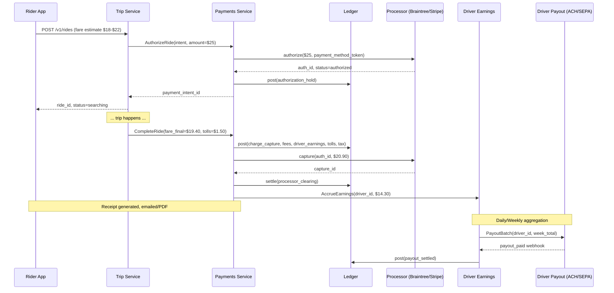

# Uber Deep Dive — Payment and Receipts

**Date:** 2026-04-29 | **Updated:** 2026-04-29
**Tags:** `system-design` `case-study` `uber` `deep-dive` `payments` `ledger`
**Parent:** [`../design-uber.md`](../design-uber.md) (§ Payment & Receipts)

## Summary

A ride-hailing payment is not "one charge" — it is a **two-phase financial conversation** stretched across the trip lifecycle, two different counterparties (rider and driver), several legal entities (Uber, the rider's issuer, the driver's bank, tax authorities, possibly an airport concession), and an unbounded long tail of post-trip mutations: tips, tolls, adjustments, disputes, refunds, and corrections. The hard part is not "calling Stripe" — it is keeping the **ledger** internally consistent while every external system (issuer banks, ACH networks, tax services, the rider's WiFi) drops, retries, and reorders messages on its own schedule.

Uber's published architecture treats the trip and the money as **separate state machines linked by events** ([Uber blog — building a global payments platform][uber-payments]). The trip state machine (see [`trip-state-machine.md`](./trip-state-machine.md)) emits domain events on transitions; the payments service consumes them idempotently and emits ledger entries; a driver-payout pipeline aggregates earnings and pays drivers on a schedule that can run minutes (Instant Pay) or weekly (standard ACH/SEPA). Every monetary movement is captured in a **double-entry, append-only ledger** — the same pattern from [`../../payment/design-payment-system.md`](../../payment/design-payment-system.md), specialized for the ride-hailing domain.

This doc is the deep-dive companion to the parent's `Payment & Receipts` section. It covers the trip-end flow, pre-auth and settlement, multi-processor routing across Braintree / Stripe / PayPal / regional methods, multi-currency, driver payouts (instant vs scheduled), the double-entry ledger for fares/tips/tolls, tip-after-trip, refunds and disputes, per-region tax computation, fraud detection on completed trips, and receipt generation (email + PDF).

## Table of Contents

- [Summary](#summary)
- [1. Overview](#1-overview)
- [2. Trip-End Payment Flow](#2-trip-end-payment-flow)
- [3. Pre-Authorization at Trip Start](#3-pre-authorization-at-trip-start)
- [4. Final Settlement at Trip End](#4-final-settlement-at-trip-end)
- [5. Payment Processor Integration](#5-payment-processor-integration)
- [6. Regional Payment Methods](#6-regional-payment-methods)
- [7. Multi-Currency](#7-multi-currency)
- [8. Driver Payout Schedule](#8-driver-payout-schedule)
- [9. Double-Entry Ledger for Fares, Tips, Tolls](#9-double-entry-ledger-for-fares-tips-tolls)
- [10. Tip-After-Trip Flow](#10-tip-after-trip-flow)
- [11. Refund and Dispute Handling](#11-refund-and-dispute-handling)
- [12. Tax Computation Per Region](#12-tax-computation-per-region)
- [13. Fraudulent Trip Detection](#13-fraudulent-trip-detection)
- [14. Receipts — Generation, Email, PDF](#14-receipts--generation-email-pdf)
- [Anti-Patterns](#anti-patterns)
- [Related](#related)
- [References](#references)

## 1. Overview

Ride-hailing payments differ from standard e-commerce charges in five ways:

1. **The amount is unknown at request time.** The rider sees a fare estimate; the actual fare depends on traffic, route deviation, waiting time, and tolls. A pre-authorization holds an amount above the estimate; capture posts the true number.
2. **There are two payouts per trip.** Rider pays Uber; Uber pays the driver. Decoupled in time (rider charge: seconds; driver payout: minutes to a week) and on different rails (card networks vs ACH/SEPA/Pix).
3. **Tips and corrections happen after the trip.** A rider may add a tip up to ~30 days post-trip. The trip is "done" but the ledger is not.
4. **Tax is computed per jurisdiction.** Sales tax, VAT, GST, congestion charges, airport surcharges — each city or region has its own rules.
5. **Disputes route through multiple systems.** Card chargebacks, in-app fare adjustments, driver disputes. All three must agree with the ledger.

The architectural pattern matches [`../../payment/design-payment-system.md`](../../payment/design-payment-system.md) — idempotency keys, double-entry ledger, processor adapters, async settlement, reconciliation — with three Uber-specific additions: a **trip event consumer** (payments downstream of the trip state machine via the [outbox pattern](../../../data-consistency/distributed-transactions.md)), a **driver payout pipeline**, and **long-tail mutation support** (tips, tolls, adjustments arriving after the trip closes).

```text
Trip lifecycle:           Searching → Matched → OnTrip → Completed
Rider payment:                       Authorize ──► Capture ──► Tip? ──► Refund? ──► Dispute?
Driver payout:                                              ─► Earnings accrual ─► Payout
```

## 2. Trip-End Payment Flow

End-to-end view of money movement for a typical UberX ride. Numbers are illustrative.



The two phases that matter most:

- **Authorization (trip start):** reserves money on the rider's card; does not move money yet. Confirms the card is valid and the rider has enough credit.
- **Capture (trip end):** actually moves money — rider's card → processor → Uber's clearing account → split into driver earnings, fees, tolls, taxes.

## 3. Pre-Authorization at Trip Start

When the rider taps "Request", the payments service authorizes a hold on the rider's card.

### Why authorize, not charge

- **Verify the card before dispatching a driver.** Sending a driver to a rider whose card is declined is wasted utilization.
- **Catch insufficient funds early.** Better to fail fast than mid-trip.
- **Bound chargeback risk.** A fraudulent rider burns through fewer drivers before detection.
- **Decouple "ride happens" from "settlement settles."** Capture can lag completion if a processor is degraded; the ride completes regardless.

### The authorize request

```http
POST /v1/payments/authorize
Idempotency-Key: ride-{ride_id}-auth-v1
Authorization: Bearer <internal>

{
  "ride_id": "rid_8f2…",
  "rider_id": "usr_42",
  "payment_method_id": "pm_visa_4242_…",
  "currency": "USD",
  "amount_minor": 2500,                    // estimate_high * surge * margin
  "metadata": {
    "fare_low_minor": 1800,
    "fare_high_minor": 2200,
    "surge_multiplier": 1.0
  }
}
```

The amount is `ceil(estimate_high * surge * 1.10)` — a small margin above the estimated high so a route deviation or wait does not blow past the hold. Some markets cap the hold to a per-product maximum to avoid scaring riders looking at their bank balance.

### Auth lifetime

Card auths typically expire **after 7 days** for credit cards, sooner for debit (issuer-dependent). Sufficient for most rides; **Reserve / scheduled rides** re-issue auth closer to trip start.

### What the ledger records

A pre-auth is a **memo entry** — it does not move money yet, so it does not post to a balanced ledger transaction. It lives in an `authorization_holds` table with a foreign key to the eventual capture's ledger transaction:

```sql
CREATE TABLE authorization_holds (
  id                      UUID PRIMARY KEY,
  ride_id                 UUID NOT NULL UNIQUE,
  payment_method_id       UUID NOT NULL,
  processor               TEXT NOT NULL,
  processor_auth_id       TEXT NOT NULL,
  amount_minor            BIGINT NOT NULL,
  currency                CHAR(3) NOT NULL,
  status                  TEXT NOT NULL,    -- authorized | captured | voided | expired
  authorized_at           TIMESTAMPTZ NOT NULL,
  expires_at              TIMESTAMPTZ NOT NULL,
  ledger_transaction_id   UUID                -- set on capture
);
```

If the trip is cancelled before pickup with no fee, the auth is **voided** (released back to the rider's available credit). If a cancel fee applies, the auth is **partially captured** for the fee and the remainder voided.

## 4. Final Settlement at Trip End

When the driver presses "Complete Trip", the trip service emits a `TripCompleted` event with the final fare components. The payments service consumes it and runs settlement.

### Final amount composition

```text
fare_final = base_fare
           + per_minute * minutes
           + per_mile   * miles
           + booking_fee
           + airport_surcharge
           + tolls (from toll detector)
           + wait_time_charge
           + ride_passes_discount  (negative)
           + promo_credit          (negative)
           + tax (computed per region, see §12)
```

Each component is its own line item on the receipt and a separate posting category in the ledger. "Just compute one number and stamp it" is the wrong abstraction — riders ask "what is this fee?" and tax authorities require breakdowns.

### Settlement steps

1. **Compute final fare** — fare engine receives trip metadata (distance, time, surge multiplier, applied promos, tolls) and produces a structured fare breakdown.
2. **Post the ledger transactions** (see §9) atomically with the trip status transition (outbox pattern).
3. **Capture against the processor** — call `capture(auth_id, fare_final)` against the original auth. If `fare_final < auth_amount`, the difference is voided.
4. **Mark transactions complete** — update `transactions` row, mark `authorization_holds` as captured.
5. **Trigger downstream** — accrue driver earnings, enqueue receipt generation, fire merchant-style webhook for connected business accounts, push receipt email job.

### What if capture fails?

Capture failure after a successful auth is rare but real (issuer revoked the auth, rider's card was reported stolen between trip start and end). When it happens:

- **Trip stays completed** — the rider experienced the service.
- **Mark the transaction `requires_action`**, hold the driver earnings in escrow.
- **Retry capture with fallback strategies**: re-auth on the same card if still valid; charge a backup payment method; if the rider has a wallet balance, debit it.
- **If all fail**, post the charge to a "rider debt" account and block the rider from new trips until resolved.

This is one of the few places the system **deliberately accepts asymmetric risk** — the ride happened; if we cannot collect, we still owe the driver. Driver earnings come out of Uber's general balance, and Uber absorbs the loss until collection.

## 5. Payment Processor Integration

Uber routes payments across multiple processors based on currency, country, card BIN, cost, and processor health. Public references confirm Uber uses **Braintree** (PayPal subsidiary) extensively, with **Stripe** and **PayPal** for specific use cases ([Braintree case study — Uber][braintree-uber]; [Uber blog — payments platform][uber-payments]).

### The adapter pattern

Identical in shape to the one in [`../../payment/design-payment-system.md` § 7.3](../../payment/design-payment-system.md#73-processor-adapter-pattern):

```typescript
interface ProcessorAdapter {
  authorize(input: AuthorizeRequest): Promise<AuthorizeResponse>;
  capture(authId: string, amount: Money): Promise<CaptureResponse>;
  void(authId: string): Promise<VoidResponse>;
  refund(captureId: string, amount: Money): Promise<RefundResponse>;
  parseWebhook(rawBody: Buffer, headers: Record<string,string>): WebhookEvent;
}
```

Per-processor specifics:

| Processor | Strengths | Where Uber uses it |
|-----------|-----------|--------------------|
| **Braintree** (PayPal) | Multi-currency, vaulted PayPal accounts, strong global card support | Default rails for many markets; integrates with PayPal wallet method |
| **Stripe** | Modern API, [Payment Intents][stripe-pi] state machine, strong 3DS2 flow | Used for specific corridors and certain product lines |
| **PayPal** | Wallet payment method, recurring authorizations | Riders paying with PayPal balance |
| **Regional acquirers** | Lower interchange for domestic cards | Brazil (Cielo), India (Razorpay-style), China historical (Alipay/WeChat Pay) |

### Stripe Payment Intents specifically

Stripe's [Payment Intent][stripe-pi] is a state machine that maps cleanly onto a ride:

```text
PaymentIntent.create(amount=auth_amount, capture_method=manual, customer=rider)
  → PaymentIntent.confirm(payment_method=pm_…)             ← at trip start
    → status: requires_capture
  → PaymentIntent.capture(amount_to_capture=fare_final)   ← at trip end
    → status: succeeded
```

The `capture_method=manual` flag is what gives us the auth-then-capture split. Stripe holds the auth on the card; the capture happens whenever we send the capture call, with the final amount.

If 3DS2 is required for a market or amount, Stripe returns `status: requires_action` with a `next_action` payload; the rider app handles the issuer authentication before dispatch proceeds.

### Routing logic

```text
function chooseProcessor(currency, country, bin, payment_method_type) -> processor:
    if payment_method_type == 'paypal_wallet': return PAYPAL
    if country in EUROPE_3DS_REQUIRED: return BRAINTREE_3DS
    if country == 'BR' and is_domestic(bin): return CIELO
    if country == 'IN': return REGIONAL_INDIA
    if processor_health[BRAINTREE].degraded: return STRIPE  # failover
    return BRAINTREE  # default
```

Routing **must be deterministic for a given trip** — re-deciding the processor mid-flow risks splitting auth and capture across vendors, which is unrecoverable. The processor choice is recorded on the trip the moment the auth fires.

### Idempotency on the processor side

Each processor exposes its own idempotency mechanism:

- **Stripe:** `Idempotency-Key` header. We use `ride-{ride_id}-{phase}-v1`.
- **Braintree:** the `transaction.sale` API accepts a deterministic external ID; same construction.
- **PayPal:** similar `PayPal-Request-Id` header.

When our adapter retries on a 5xx or timeout, **the same idempotency key goes back**. The processor dedupes; we do not create a duplicate auth.

## 6. Regional Payment Methods

Cards are not the only way riders pay. Uber supports a long list of regional methods, each with its own integration and reconciliation quirks.

| Method | Region | Integration shape |
|--------|--------|-------------------|
| **Cash** | Many emerging markets | No processor; reconciled against driver settlements ([Uber blog — cash payments][uber-cash]) |
| **PayPal wallet** | Global | Treated as a "card-like" tokenized method through Braintree |
| **Apple Pay / Google Pay** | Where supported | Tokenized via wallet; routed through normal processor |
| **Pix** | Brazil | Real-time bank transfer; instant settlement; no auth/capture model |
| **UPI** | India | Account-to-account push; usually charge-and-confirm rather than auth-and-capture |
| **iDEAL / SEPA Direct Debit** | Netherlands / EU | Pull-from-bank; longer settlement; chargeback rules differ |
| **Alipay / WeChat Pay** | China (historical) | Wallet-based; tokenized; market-specific |
| **Vouchers / promo codes** | Global | Internal credit; not a real payment method, but spent like one |
| **Uber Cash / wallet balance** | Global | Internal stored value; consumed first by configuration |
| **Business profiles** | Global | Switches `payment_method_id` at trip request, tags trip for expense export |

### Cash markets

The cash flow is fundamentally different. The rider hands the driver cash; the driver collects it; **Uber owes the driver less, not more**, by the trip's end:

```text
Rider owes:           $10.00  (in cash, given to driver)
Driver earnings:       $7.00
Uber service fee:      $3.00
Driver collected:     $10.00 cash

Settlement: driver owes Uber $3.00, deducted from upcoming earnings.
```

The ledger captures this with a `driver_cash_collected` account that drains against driver earnings. If a driver's cash collected exceeds their earnings, they owe Uber and the next earnings batch deducts the difference. This is a separate reconciliation pipeline from card processors; it depends on driver self-reporting and trip metadata, with periodic audits.

### Wallet balance / promo credits

Wallet balance is consumed before the card. The fare engine applies any wallet balance and promo credit; the residual is what gets authorized on the card. The ledger posts both: a debit against `wallet_balance:{rider_id}` and a credit against `merchant_balance` for the wallet portion, plus the normal card-side entries for the residual.

Promo credits expire and have legal disclosure rules per jurisdiction — they live in their own service with their own ledger.

## 7. Multi-Currency

Uber operates in dozens of currencies. The principles are identical to [`../../payment/design-payment-system.md` § 7.7](../../payment/design-payment-system.md#77-async-settlement-and-currency-conversion); the specifics:

- **Charge in the rider's currency.** A rider whose card is in USD sees and pays in USD even if visiting Mexico.
- **Pay drivers in their local currency.** A driver in Mexico is paid in MXN regardless of where their riders' cards are denominated.
- **FX is the processor's job, not ours.** We use the processor's quoted rate (in the settlement report) for our ledger, never a public exchange-rate API. Rate divergence is a finance problem we do not invent.

### Cross-currency ledger pattern

The double-entry rule **balances per currency**. Cross-currency events post **two balanced transactions**, linked by an FX clearing account:

```text
ltx_charge_USD (rider in USD, $10 capture):
  D processor_clearing:braintree:USD     1000 USD
  C merchant_balance:uber:USD             700 USD
  C fees_revenue:USD                      300 USD
                                         ----
                                            0   USD ← balances per currency

# at settlement, FX into MXN for driver payout:
ltx_fx_USD_MXN_at_rate_19.5:
  D fx_clearing:USD                       700 USD
  C merchant_balance:uber:USD             700 USD
                                         ----
                                            0   USD ← balances

  D merchant_balance:uber:MXN          13650 MXN     # 700 * 19.5
  C fx_clearing:MXN                    13650 MXN
                                       ------
                                            0   MXN ← balances

# fx_clearing accounts in USD and MXN are NOT zeroed against each other directly.
# The FX P&L between them lives in fx_pnl when the actual processor rate
# differs from the rate at posting time. This is the classic FX revaluation entry.
```

This is fiddly. It is the right way. The wrong way ("charge $10 USD, credit driver 195 MXN, never write the FX out explicitly") leaks rate exposure into product code and makes finance reconciliation impossible.

## 8. Driver Payout Schedule

Riders pay per-trip; drivers do not get paid per-trip. Uber aggregates earnings and pays drivers on a schedule.

### Standard payout (weekly)

The default for most markets:

- **Earnings accrue per trip** into an internal `driver_earnings:{driver_id}` ledger account.
- **Weekly cutoff** (typically Monday 4 AM local time): a batch job aggregates the week's earnings, deductions (cash collected from cash trips, advances), and adjustments.
- **Payout file generated** and submitted to the bank rails for the driver's region:
  - **US:** ACH credit (NACHA file). 1–2 business days to clear.
  - **EU:** SEPA Credit Transfer. Same-day to T+1.
  - **India:** IMPS / NEFT depending on amount.
  - **Brazil:** Pix (real-time) or TED.
- **Status updates** flow back via bank confirmation files; payout status moves `pending → submitted → paid` (or `failed → retry`).

### Instant Pay (on-demand)

Uber offers drivers the ability to cash out earnings immediately, multiple times per day, for a small fee per cashout. ([Uber — Instant Pay][uber-instant-pay])

- Powered by **debit card push payments** (Visa Direct, Mastercard Send) — credits a driver's debit card in seconds via card network rails.
- Limited to the driver's available accrued earnings minus any negative balances.
- Has its own per-cashout fee, posted as fee revenue.
- A driver can cash out up to N times per day; rate-limited to prevent abuse.

```text
ltx_instant_pay:
  D driver_payable:{driver_id}            5000 USD
  C bank:operating                        4950 USD   # the rail debits us
  C instant_pay_fee_revenue                 50 USD
                                          ----
                                             0   USD ← balances
```

### Payout edge cases

- **Failed bank transfer** (closed account, name mismatch): payout flips to `failed`; the next batch or driver action retries; the driver's balance is held. Driver support handles edge cases manually.
- **Negative balance** (driver owes Uber from cash trips, refunds, or chargebacks): payout is held until balance is positive, or recurring deductions are scheduled.
- **Tax holdback** (some markets): a portion of earnings is held back for tax remittance — see §12.
- **Multi-account drivers**: drivers with multiple vehicles or in multiple cities have one consolidated payout per legal entity.

## 9. Double-Entry Ledger for Fares, Tips, Tolls

Same invariant as [`../../payment/design-payment-system.md` § 7.2](../../payment/design-payment-system.md#72-double-entry-ledger), specialized for ride-hailing.

### Ride-hailing account types

| Account | Normal | Increases on |
|---------|--------|--------------|
| `processor_clearing:{psp}:{ccy}` | Debit (PSP owes us) | Capture |
| `merchant_balance:uber:{ccy}` | Credit | Net of fee + driver share |
| `driver_earnings:{driver_id}` | Credit (we owe driver) | Trip completion |
| `driver_payable:{driver_id}` | Debit (paying out) | Payout file submission |
| `service_fee_revenue` | Credit | Each trip's Uber take |
| `tolls_payable:{authority}` | Credit (we owe toll authority) | Toll charged on trip |
| `tax_payable:{jurisdiction}` | Credit (we owe tax authority) | Tax computed at capture |
| `tip_payable:{driver_id}` | Credit (we owe driver tip) | Tip captured |
| `chargeback_reserve` | Credit | Dispute opened |
| `wallet_balance:{rider_id}` | Credit | Promo credit applied |
| `fx_clearing:{ccy}` | Mixed | Cross-currency events |
| `fx_pnl` | Mixed | FX rate differences |
| `cash_collected:{driver_id}` | Debit | Cash trip completion |

### Anatomy of one ride's capture

A $19.40 UberX trip in NYC with $1.50 in tolls, $2.10 sales tax, no surge, $11.32 to driver:

```text
Gross to rider:    $19.40 fare + $1.50 tolls + $2.10 tax    =  $23.00
Driver share:      $11.32
Service fee:       $ 8.08  (fare - driver share)
Tolls:             $ 1.50  (passed through to NYC TBTA)
Tax:               $ 2.10  (passed through to NY State)

ltx_ride_capture (ride_id=rid_8f2…):
  D processor_clearing:braintree:USD     2300  USD
  C driver_earnings:drv_71               1132  USD
  C service_fee_revenue                   808  USD
  C tolls_payable:nyc_tbta                150  USD
  C tax_payable:ny_state_sales            210  USD
                                         ----
                                            0   USD ← balances

ltx_processor_settlement (Braintree pays Uber net of their fee, a few days later):
  D bank:operating                       2210  USD
  D processor_fees_expense                 90  USD
  C processor_clearing:braintree:USD     2300  USD
                                         ----
                                            0   USD ← balances
```

A few days later, Uber pays NYC TBTA the toll, posts NY State sales tax, and pays the driver:

```text
ltx_toll_remit:    D tolls_payable:nyc_tbta 150  C bank:operating 150
ltx_tax_remit:     D tax_payable:ny_state   210  C bank:operating 210

# At driver payout time (weekly), aggregating across all the driver's trips:
ltx_driver_payout:
  D driver_earnings:drv_71              45500  USD   # week's accumulated
  C driver_payable:drv_71               45500  USD
ltx_driver_payout_settled:
  D driver_payable:drv_71               45500  USD
  C bank:operating                      45500  USD
```

`driver_earnings:drv_71` drains to zero after each weekly payout — exactly the same way `processor_clearing` drains after each settlement.

### Why split tolls and tax explicitly

Two reasons:

1. **Receipts and tax authorities require it.** A receipt that just says "Total $23.00" fails compliance and confuses riders.
2. **Tolls and taxes are pass-through, not revenue.** They never hit the income statement as Uber's revenue. Putting them in their own payable accounts keeps the P&L clean and makes remittance auditable.

## 10. Tip-After-Trip Flow

Tips can be added in-app after the trip ends — in the rating screen immediately, or up to ~30 days later.

### Why tip-after-trip is hard

The trip is "closed" but the financial state is not. Three implementation pitfalls:

1. **Re-using the original auth.** Card auths typically expire in 7 days. After that, no auth exists; tip must be a fresh charge.
2. **Re-running fraud and 3DS.** A late tip is usually low-risk, but the architecture must accept that the original 3DS evidence does not extend to the tip charge in a separate billing.
3. **Receipt update.** The original receipt didn't show a tip. The new receipt does. Both versions need to be retrievable.

### The flow

```text
on TipAdded(ride_id, tip_amount, idempotency_key):
  # NEW transaction, separate from the original ride capture
  if within auth window AND psp supports incremental auth:
    psp.incrementalAuth(original_auth_id, +tip_amount)
    psp.capture(original_auth_id, fare_final + tip_amount)
  else:
    psp.charge(payment_method, tip_amount, idempotency_key='tip-{ride_id}')

  ledger.post(ltx_tip_capture)
  emit RideUpdated event → triggers receipt regeneration + new email/PDF
```

Ledger posting:

```text
ltx_tip_capture:
  D processor_clearing:braintree:USD      300  USD     # $3 tip
  C tip_payable:drv_71                    300  USD
                                          ----
                                             0   USD ← balances

ltx_tip_to_earnings:
  D tip_payable:drv_71                    300  USD
  C driver_earnings:drv_71                300  USD
                                          ----
                                             0   USD ← balances
```

Tips go 100% to the driver — no service fee. The two-step posting separates "we collected a tip from the rider" from "we credited the driver's earnings", which simplifies reporting and the rare case where the tip charge fails (we owe the driver nothing if we couldn't collect).

### Failed tip charge

If the rider's card declines on the tip charge (card cancelled, insufficient funds), the rider is shown an in-app error and prompted to retry or change payment method. The driver does not see the failure — their app shows the tip pending until it is captured. After N retries or a timeout, the tip is voided and the receipt finalized without it.

## 11. Refund and Dispute Handling

Three flows, three sources, one ledger.

### In-app fare adjustment (rider-initiated)

A rider opens "Trip help" → "Wrong fare" → submits a complaint. Rider support reviews; if approved, posts an adjustment.

```text
on AdjustmentApproved(ride_id, refund_amount, reason):
  psp.refund(capture_id, refund_amount, idempotency_key='adj-{adj_id}')
  ledger.post(ltx_adjustment)

ltx_adjustment (refund of $5):
  D service_fee_revenue                   500  USD     # we eat the fee, not driver
  C processor_clearing:braintree:USD      500  USD
                                          ----
                                             0   USD ← balances
```

Whether the driver share or the service fee absorbs the refund depends on the reason code. "Driver took bad route" → driver bears it. "App showed wrong price" → Uber bears it. "Promo not applied" → Uber bears it. The reason code routes the debit account.

### Card chargeback (issuer-initiated)

The rider disputes the charge with their bank. The processor sends a `dispute.created` webhook. We have a deadline (typically 7-14 days) to submit evidence.

```text
on dispute.created(charge_id, amount, reason_code):
  freeze the disputed amount in chargeback_reserve
  open evidence collection workflow (rider's trip GPS, receipts, support history)
  notify ops

ltx_chargeback_freeze:
  D chargeback_reserve                   2300  USD
  C merchant_balance:uber:USD            2300  USD
```

Outcomes:

- **We win the dispute** (evidence accepted): reverse the freeze, money stays.
- **We lose**: the funds are debited from `bank:operating`; the charge is effectively refunded.

```text
ltx_chargeback_lost:
  D merchant_balance:uber:USD            2300  USD
  C chargeback_reserve                   2300  USD
ltx_chargeback_settle:
  D processor_clearing:braintree:USD     2300  USD     # wash the original capture
  D dispute_fee_expense                  1500  USD     # processor's chargeback fee, ~$15
  C bank:operating                       3800  USD
```

If the disputed ride had already been paid out to the driver, the system either reclaims from future driver earnings (if the driver was at fault) or absorbs the loss as fraud.

### Driver-initiated dispute

A driver disputes their earnings ("the fare was lower than it should have been"; "the rider claimed I took a long route but I didn't"). Routes to driver support. Approved adjustments post like fare adjustments but in the opposite direction:

```text
ltx_driver_adjustment_up:
  D service_fee_revenue                   200  USD
  C driver_earnings:drv_71                200  USD
```

### Idempotency across all three

All three flows use a stable `adjustment_id` or `dispute_id` as the idempotency key on both processor calls and ledger postings. Replays do not double-refund.

## 12. Tax Computation Per Region

Tax in ride-hailing is jurisdiction-dependent and a moving target.

### What gets taxed

Each region defines its own rules. Examples:

- **US:** state and city sales tax on the fare; tolls passed through (not taxed); gratuities not taxed.
- **EU:** VAT on the fare. Some countries treat Uber as a transportation provider (VAT applies); some treat it as a digital intermediary (different VAT treatment).
- **UK:** VAT on the full fare following 2022 ruling.
- **NYC:** congestion surcharge ($2.75/ride for-hire vehicle), state sales tax, MTA tax, Black Car Fund surcharge.
- **India:** GST split between Uber's commission portion and the ride portion.
- **Australia:** GST on the gross fare.

### Architecture

A **tax service** computes tax at fare-finalization time, given:

```text
TaxRequest:
  - ride_id, jurisdiction (city/state/country)
  - fare_breakdown { base, distance, time, tolls, surcharges, surge }
  - rider_tax_status (B2B vs B2C; tax-exempt entities)
  - driver_tax_status (some markets withhold from drivers)
  - effective_date (rates change; the rate that applied at trip time is what matters)
```

Internal or external (Avalara, TaxJar, Vertex) — most ride-hailing companies use a mix: internal logic for high-volume jurisdictions, external services for the long tail.

The result feeds:

- **Receipt rendering** (line item, tax registration ID where required by law).
- **Ledger posting** (`tax_payable:{jurisdiction}` per the sample in §9).
- **Periodic remittance** to tax authorities (separate ETL pipeline, typically monthly or quarterly).

### Why tax cannot live in the fare engine

Two reasons:

1. **Compliance changes weekly.** New cities, new rates, new exemptions, new surcharges. Putting this in the fare engine couples pricing with tax policy and forces deploys for every rule change.
2. **Tax is jurisdiction × time.** A trip starting in NJ ending in NYC has different tax than NYC-only. A trip on a holiday may have a different congestion charge. A pre-computed lookup keyed on origin × destination × date is the right shape.

### Tax holdback for drivers

Some jurisdictions require Uber to withhold income tax from driver earnings:

- **Pakistan, some EU markets:** percentage withholding on each payout.
- **US 1099/W-2 distinction:** drivers are typically 1099 contractors (no withholding); but some states are pushing toward W-2 (employee, with withholding).

When withholding applies, the driver payout posts an extra entry:

```text
ltx_driver_payout_with_withholding:
  D driver_earnings:drv_71              45500  USD
  C driver_payable:drv_71               40000  USD
  C tax_withheld_payable:fed             5500  USD
```

`tax_withheld_payable` then drains via a remittance pipeline to the tax authority on the required cadence.

## 13. Fraudulent Trip Detection

Trip fraud differs from card fraud. Card fraud is "stolen card used to pay"; trip fraud is "the trip itself is fake or manipulated".

### Common fraud patterns

| Pattern | Detection |
|---------|-----------|
| **Fake trip** — driver and rider collude; no actual ride occurs; both split the payout | GPS analysis (trip route is impossibly short or doesn't move); device fingerprint reuse; bank account cycling |
| **Long-route scam** — driver intentionally takes a long route to inflate fare | Compare actual route to expected; rider complaint correlation; per-driver historical deviation |
| **GPS spoofing** — driver uses a mock-location app to fake distance | Velocity/acceleration anomalies; inertial sensor cross-check on the device; staleness of location samples |
| **Stolen card on rider account** | Standard card fraud — pre-auth velocity checks, device reputation, unusual geography |
| **Promo abuse** — multi-account creation to harvest sign-up promos | Device fingerprinting, payment method overlap, behavioral patterns |
| **Driver account takeover** — fraudster takes over a real driver's account, swaps payout bank account, drains earnings | Bank account change detection, withhold first payout after change for review |

### Detection architecture

```text
Trip events ─► Stream processor ─► Feature extraction ─► ML model ─► Score
                                          │
                                          ├─► Hot fraud rules (velocity, blocklists)
                                          └─► Async deep analysis (graph link analysis,
                                              account clustering, payment graph)
```

- **Online:** at trip request and trip end, run a real-time score; high-risk trips block dispatch or hold capture pending review.
- **Async:** every completed trip is scored offline against a heavier model with full feature set. Suspicious trips are flagged for manual review and may post reversing ledger transactions days later.
- **Graph features:** "did this rider and driver share a device?" "did multiple drivers share a payout bank account?" — graph databases (or graph queries on a relational DB) underpin the link analysis.

### What happens to a fraudulent trip after the fact

- **Reverse the rider charge** — refund.
- **Claw back driver earnings** — if not yet paid out, deduct; if already paid, post a debit to `driver_earnings:{drv}` taking it negative; the next payout is reduced or the driver is contacted for repayment.
- **Suspend accounts** as appropriate.
- **Post all of it through the ledger as reversing transactions** — never edit prior entries.

The ledger discipline is what makes this clean. With a single-entry "balance" model, fraud reversals corrupt history and nobody can audit what really happened.

## 14. Receipts — Generation, Email, PDF

A receipt is the boring-looking artifact that has to be **legally accurate** and **operationally trustworthy**. Every line item must trace to the ledger; the totals must reconcile.

### Receipt content

```text
Trip receipt — UberX
Date: 2026-04-29 14:32 EDT
Trip ID: T-39248-XJK2
From: 123 Pier 17, New York, NY → 456 W 23rd St, New York, NY
Driver: Carlos M. (4.9 stars)

Fare breakdown:
  Base fare              $ 2.55
  Distance (3.4 mi)      $ 6.12
  Time   (14 min)        $ 4.18
  Booking fee            $ 2.95
  NYC Black Car Fund     $ 0.40
  Tolls (Holland Tunnel) $ 1.50
  Subtotal              $17.70
  NY State sales tax     $ 1.57
  NYC congestion         $ 2.75
  ────────────────────────────
  Total                 $22.02
  Tip (added later)      $ 3.00
  ────────────────────────────
  Grand total           $25.02

Charged to: Visa ending 4242
Trip map: [polyline rendered]
```

Every numeric value above ties to a specific ledger posting or trip metadata. The system never invents a number on the receipt.

### Generation pipeline

```text
RideCompleted ──► Receipt service
                      │
                      ├─► Render HTML (template engine: Mustache/Handlebars-style)
                      ├─► Render PDF (HTML → headless Chrome / wkhtmltopdf / native PDF lib)
                      ├─► Store PDF in S3 (immutable, content-addressed)
                      ├─► Send email (SES / SendGrid) with HTML body + PDF attachment
                      └─► Make available in-app (deep link to S3 URL)
```

### Email vs PDF

- **HTML email** is the rider's first touchpoint — must render in Gmail, Outlook, native iOS Mail, etc. Inline CSS, no JS, table-based layout for old clients.
- **PDF** is what the rider expenses or saves for tax. Must be deterministic — the same trip, generated twice, must produce a byte-identical PDF (so no embedded timestamps, no render-time non-determinism). This makes deduplication and digital signing easier.
- **In-app receipts** pull the same HTML for instant viewing.

### Idempotency on receipts

Receipt generation must be idempotent: the same `RideCompleted` event re-delivered (because Kafka is at-least-once) must not send three emails. The receipt service deduplicates on `(ride_id, version)` — version is incremented when a tip or adjustment changes the receipt; each version sends one email.

### Updates after the fact

When a tip is added, an adjustment posts, or a refund issues:

- A new receipt **version** is rendered.
- Email is sent with subject "Updated receipt for your trip on …".
- The PDF in S3 has a new content-addressed key.
- The previous version remains accessible (audit trail).

This is the same "append-only" pattern as the ledger — receipts never mutate; they version.

### Localization and compliance

- **Currency formatting** per locale (`€19.40` vs `19,40 €`).
- **Date formatting** per locale.
- **Tax ID printing** required in markets like the EU (Uber's VAT number) and India (GSTIN).
- **Driver and Uber addresses** required by some regulators.
- **Disclosed map polyline** — for trip transparency, especially in markets with regulatory requirements (NYC TLC).

## Anti-Patterns

- **Charging at trip start, not authorizing.** Charging the estimate up front and "refunding the difference" creates twice the load on processors, doubles webhook traffic, and confuses riders' bank statements. Use auth-then-capture.
- **Re-using the original auth for tip when it has expired.** Card auth lifetimes vary; assuming "the auth is still good" leads to silent failures days after the trip. Use a fresh charge once the auth expires.
- **One ledger entry per trip ("debit rider, credit Uber").** Hides driver earnings, fees, tolls, and tax; makes payout impossible to compute and remittance impossible to audit. Use one balanced transaction with multiple credit accounts.
- **Letting tax live in the fare engine.** Compliance moves weekly. Decoupling fares from taxes (separate service, separate update cadence) is the only sustainable shape.
- **FX rates from a free public API.** The rate that moved money is the processor's quoted rate. Anything else creates phantom FX P&L and breaks reconciliation.
- **Updating receipts in place when a tip is added.** Receipts must version. Editing a sent receipt destroys the audit trail and confuses riders comparing emails.
- **Driver payout from "current balance" without aggregating accrued earnings via the ledger.** Race conditions during weekly payout cycles can pay a driver twice or zero times. The payout source of truth is the ledger account, not a denormalized balance.
- **Treating cash trips as a "fake card transaction."** They are a different shape: driver collects, owes Uber. Forcing them through the card-charge code path corrupts the ledger.
- **No idempotency on tip and adjustment endpoints.** A double-tap on "Add tip" creates two charges. A retried adjustment double-refunds. Stable idempotency keys per logical action.
- **Trusting trip GPS for fraud without sensor cross-checks.** GPS spoofing apps are common; inertial sensors and network triangulation are the only defenses.
- **Two-phase commit between trip DB and payments DB.** Operationally hostile and rarely needed. The outbox pattern + idempotent consumers gets you reliable, eventual consistency at far lower cost.
- **Storing card PANs.** Never. Tokenize at the edge, let the processor or a tokenization vendor hold the PAN, keep PCI scope to the tokenizer service.
- **Logging full payloads at INFO.** Even tokenized payment methods deserve redaction. PCI auditors look for PAN-shaped strings; ML feature extraction should not log raw payment data.
- **Letting the receipt PDF contain non-deterministic timestamps or random IDs.** Identical inputs should produce identical PDFs. Otherwise dedup, signing, and retry-safety break.

## Related

- [`../design-uber.md`](../design-uber.md) — parent case study; this doc deep-dives the Payment & Receipts section.
- [`./trip-state-machine.md`](./trip-state-machine.md) — trip events drive payment transitions; the outbox between trip and payments is central.
- [`../../payment/design-payment-system.md`](../../payment/design-payment-system.md) — generic payment-system patterns; this doc applies them to ride-hailing.
- [`../../../data-consistency/distributed-transactions.md`](../../../data-consistency/distributed-transactions.md) — outbox pattern, sagas, why 2PC is rarely the answer.
- [`../../../communication/idempotency-and-exactly-once.md`](../../../communication/idempotency-and-exactly-once.md) — idempotency keys and exactly-once semantics across queues.
- [`../../../security/encryption-at-rest-in-transit.md`](../../../security/encryption-at-rest-in-transit.md) — TLS, AES-256, KMS-managed keys for PCI-scoped data.

## References

- Uber Engineering — [Building a Scalable and Reliable Payment Platform][uber-payments]
- Uber Engineering — [Why we chose to keep cash payments][uber-cash]
- Uber Help — [Instant Pay][uber-instant-pay]
- Stripe — [Payment Intents][stripe-pi]
- Stripe — [Idempotent requests][stripe-idem]
- Stripe — [Verify webhook signatures][stripe-sig]
- Braintree — [Uber case study][braintree-uber]
- PayPal — [Payouts API][paypal-payouts]
- Visa Direct — [Push payments overview][visa-direct]
- NACHA — [ACH Network basics][nacha-ach]
- European Payments Council — [SEPA Credit Transfer scheme][sepa-sct]
- Square engineering — [Books: an immutable double-entry accounting database][square-books]
- Standard Webhooks — [Specification][std-webhooks]
- PCI Security Standards Council — [PCI DSS scoping guidance][pci-scope]
- Avalara — [Sales tax for transportation network companies][avalara-tnc]

[uber-payments]: https://www.uber.com/blog/payments-platform-architecture/
[uber-cash]: https://www.uber.com/blog/cash-payments/
[uber-instant-pay]: https://help.uber.com/driving-and-delivering/article/instant-pay
[stripe-pi]: https://docs.stripe.com/payments/payment-intents
[stripe-idem]: https://docs.stripe.com/api/idempotent_requests
[stripe-sig]: https://docs.stripe.com/webhooks#verify-events
[braintree-uber]: https://www.braintreepayments.com/case-studies/uber
[paypal-payouts]: https://developer.paypal.com/docs/payouts/
[visa-direct]: https://developer.visa.com/capabilities/visa_direct
[nacha-ach]: https://www.nacha.org/content/ach-network
[sepa-sct]: https://www.europeanpaymentscouncil.eu/what-we-do/sepa-credit-transfer
[square-books]: https://developer.squareup.com/blog/books-an-immutable-double-entry-accounting-database-service/
[std-webhooks]: https://www.standardwebhooks.com/
[pci-scope]: https://listings.pcisecuritystandards.org/documents/Guidance-PCI-DSS-Scoping-and-Segmentation_v1_1.pdf
[avalara-tnc]: https://www.avalara.com/us/en/learn/whitepapers/transportation-network-companies-sales-tax.html
