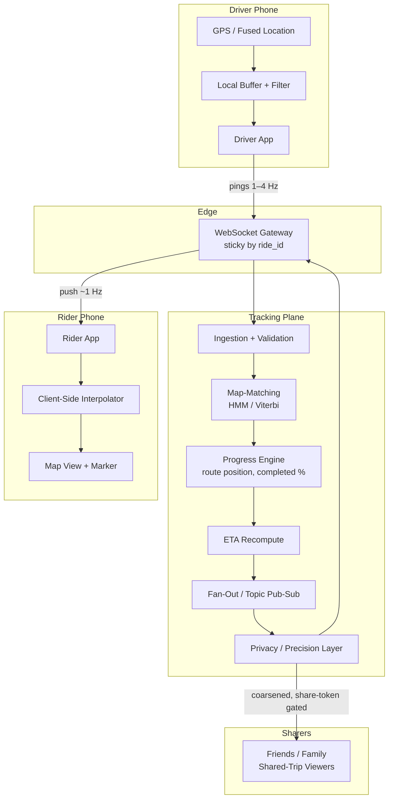

# Uber Deep Dive — Real-Time Tracking

**Date:** 2026-04-29 | **Updated:** 2026-04-29
**Tags:** `system-design` `case-study` `uber` `deep-dive` `real-time` `tracking`

## Summary

Real-time tracking is the visible half of dispatch. Once a driver is matched, the rider stares at a tiny moving car icon for the next ten minutes, and any glitch — a frozen marker, a car driving through a building, a wildly wrong ETA — becomes a trust failure that no amount of backend correctness can paper over. The design problem is not "push GPS to phone." It is to take noisy 1–4 Hz GPS samples from a battery-constrained device, snap them onto the road network, smooth and interpolate them into something a human eye reads as continuous motion, recompute ETA against live traffic, fan the result out to one or more rider devices over a stateful WebSocket, do that for hundreds of thousands of concurrent trips, and never reveal a precision that compromises driver or rider privacy. Each of those constraints pulls against the others — battery vs accuracy, smoothness vs freshness, fan-out reach vs precision — and the production design lives in the trade-off space between them. This doc walks each axis with the wire-level, algorithmic, and operational details Uber and its peers have published.

## Table of Contents

- [Summary](#summary)
- [Overview](#overview)
- [Wire Protocol — WebSocket vs gRPC Streaming](#wire-protocol--websocket-vs-grpc-streaming)
- [Snap-to-Road / Map Matching](#snap-to-road--map-matching)
- [Smoothed Interpolation Between Updates](#smoothed-interpolation-between-updates)
- [Battery vs Accuracy — Adaptive Ping Rates](#battery-vs-accuracy--adaptive-ping-rates)
- [Progress Tracking Along the Route](#progress-tracking-along-the-route)
- [ETA Recomputation as the Driver Moves](#eta-recomputation-as-the-driver-moves)
- [Share Trip With Friends](#share-trip-with-friends)
- [Privacy Rounding of Location](#privacy-rounding-of-location)
- [Geofence Triggers](#geofence-triggers)
- [Anti-Patterns](#anti-patterns)
- [Related](#related)
- [References](#references)

## Overview

The end-to-end pipeline once a rider has been matched with a driver:



The service is split because the driver-ingest, the snap/smooth pipeline, and the rider-fan-out have different scaling shapes and different SLOs. Ingest is write-heavy and bursty per H3 cell; map-matching is CPU-bound per ping; fan-out is read-heavy per ride and dominated by connection count, not message rate. See [`driver-location-ingestion.md`](./driver-location-ingestion.md) for the ingest side; this doc focuses on what happens after ingest and how it reaches the rider.

A few invariants worth fixing in your head before the deep dives:

- The driver pings, the rider does not. Rider-side WebSocket is read-only for tracking events.
- The server is the source of truth for where the driver "is on the route." Client-side interpolation is presentation, not state.
- Every push event the rider receives carries enough metadata (server timestamp, route position, ETA) to be self-contained — clients should never need to ask "where am I?" between pushes.
- Ping cadence is dynamic. The system trades battery for precision based on trip phase, not a single global rate.

## Wire Protocol — WebSocket vs gRPC Streaming

The driver-app to backend leg and the rider-app to backend leg have different protocol pressures.

### Driver leg: long-lived bidirectional, high write rate

A driver session is a single long-lived connection that carries:

- Outbound (client → server): position pings, status changes, on/offline toggles, accept/decline of ride offers.
- Inbound (server → client): ride offers, dispatch nudges, route updates, server-acknowledged checkpoints.

Three viable transports:

| Transport | Pros | Cons |
|---|---|---|
| **WebSocket** ([RFC 6455](https://datatracker.ietf.org/doc/html/rfc6455)) | Universal, NAT-friendly, browser-compatible, mature LB story, framing overhead 2–14 bytes. | No built-in schema; you bring your own envelope. No native flow control beyond TCP; per-stream backpressure is DIY. |
| **gRPC bidirectional streaming** (HTTP/2) | Strong schema (Protobuf), per-stream flow control via HTTP/2 windows, easy multiplexing of many streams over one TCP. | Some corporate proxies and mobile carriers still mishandle HTTP/2 streams; fewer browser libraries; harder to debug on the wire. |
| **QUIC / HTTP/3 streaming** | 0-RTT resumption, no head-of-line blocking under loss, ideal for mobile networks that switch radios. | Operationally newer; LB and middlebox support uneven; observability tooling still catching up. |

Uber's published architecture has used a mix over the years. Earlier dispatch protocols were custom binary over TCP with TLS; later iterations consolidated on gRPC over HTTP/2 internally, with WebSocket termination at the edge for browser-based admin tools. The driver mobile app has historically used a custom binary framing on top of TLS for ping ingestion to keep bytes-per-ping in the tens, not hundreds — a JSON envelope at 1 million pings/sec adds up.

For a system-design answer, prefer this default:

- **Driver app ↔ edge gateway:** WebSocket with a Protobuf-or-FlatBuffers payload. WebSocket because it traverses every middlebox the driver's phone might sit behind (carrier proxies, hotel WiFi, captive portals); Protobuf because every byte counts at planetary scale.
- **Edge gateway ↔ internal services:** gRPC bidirectional streams. Inside the data center HTTP/2 is universal, schemas are enforced, and per-stream flow control is free.

### Rider leg: long-lived one-directional-dominant

The rider only consumes events. A few control-plane messages exist (resubscribe after reconnect, "I am viewing the map" hint), but 99% of bytes flow server→client.

- **WebSocket** is the safe default and matches the driver leg's operational model — same gateway, same auth, same observability.
- **SSE** ([HTML living standard](https://html.spec.whatwg.org/multipage/server-sent-events.html)) is technically a better fit because the channel is unidirectional and SSE has built-in `Last-Event-ID` resume semantics. The downside in practice: native iOS/Android SDKs have weaker SSE support than WebSocket, and most ride-hailing apps already operate a WebSocket fleet for the driver path. Most teams pick WebSocket for parity, not because SSE is technically wrong. See [`../../../communication/real-time-channels.md`](../../../communication/real-time-channels.md) for a fuller comparison.

### Envelope shape

A tracking event over the wire is small. Realistic Protobuf payload:

```protobuf
message TrackingUpdate {
  string ride_id = 1;
  int64 server_ts_ms = 2;       // authoritative wall clock
  int64 driver_ts_ms = 3;       // driver phone's clock (for jitter analysis)
  double lat = 4;               // map-matched, privacy-rounded
  double lng = 5;
  float heading_deg = 6;
  float speed_mps = 7;
  uint32 route_progress_bps = 8; // basis points along route, 0..10000
  int32 eta_pickup_s = 9;       // -1 if past pickup
  int32 eta_dropoff_s = 10;     // -1 if not yet on trip
  TripPhase phase = 11;
  uint32 sequence = 12;         // monotonic per-ride for resume / dedupe
}
```

`sequence` lets the client request `since=N` on reconnect; the gateway can replay from a small per-ride ring buffer. Without that, a 5-second reconnect produces a visible jump on the rider's map.

### Reconnect storms

The largest operational risk on the rider leg is correlated reconnects: a gateway node restarts and tens of thousands of rider sockets reconnect within a second. Mitigations:

- **Jittered reconnect backoff** in the client SDK (e.g., 0–500ms initial, doubling to a cap).
- **Token-bucket admission** on the gateway during a degraded window.
- **Resume from sequence** so the gateway returns a small replay rather than recomputing state.
- **Gateway draining** on planned restarts: stop accepting new connections, send `Connection: close` after current frame, gradually push existing sockets to siblings.

## Snap-to-Road / Map Matching

Raw GPS lies. In a clear-sky open road the typical phone GPS error is 5–10 meters; in an urban canyon (Manhattan, downtown SF, Hong Kong) it can spike to 30+ meters with multipath reflections off buildings. Without correction the rider's map shows a car driving through buildings, jumping lanes, or briefly teleporting onto a parallel street.

**Map matching** is the algorithmic step that takes a stream of noisy GPS points and returns the most likely sequence of road segments the driver actually traversed.

### Algorithmic sketch — Hidden Markov Model

The dominant approach (per [Newson & Krumm, 2009](https://www.microsoft.com/en-us/research/publication/hidden-markov-map-matching-noise-sparseness/), the canonical paper) treats matching as Viterbi inference on an HMM:

- **States** = candidate road segments near each GPS observation.
- **Emission probability** = how likely is this GPS reading given the driver is on segment S? Modeled as a Gaussian on the perpendicular distance from the GPS point to S, centered at zero, sigma scaled by the reported GPS accuracy.
- **Transition probability** = how likely is moving from segment S₁ at time t to segment S₂ at time t+1? Modeled as the difference between the great-circle distance between the two GPS points and the road-network shortest path between S₁ and S₂. If the road distance is wildly larger than the GPS distance, the transition is implausible.

Viterbi runs forward over the observation sequence and returns the maximum-likelihood path. In production this runs in a small sliding window (last N observations, often N=5–20) so the algorithm is online and does not require the full trip.

### Variants and refinements

- **Online vs offline.** Real-time tracking needs online matching: emit a best-guess segment for each ping with low latency, accept that the last few pings are revisable as more evidence arrives.
- **Lookahead correction.** Some implementations show the rider the last "confirmed" position and let the head of the sequence flicker silently in the server, only emitting once stable.
- **Heading-aware emission.** Incorporate compass heading into the emission probability — if the GPS reports the driver heading north but segment S is one-way south, that's a low-probability emission.
- **Speed-aware transitions.** A 60 mph reading on a residential street is implausible regardless of geometry.

### Off-the-shelf options

| Engine | Notes |
|---|---|
| **OSRM** ([github.com/Project-OSRM/osrm-backend](https://github.com/Project-OSRM/osrm-backend)) | Open-source, supports a `match` service. Uber and many peers fork or take inspiration. |
| **Valhalla** ([github.com/valhalla/valhalla](https://github.com/valhalla/valhalla)) | Open-source routing with Meili map-matching component. |
| **Mapbox Map Matching API** ([docs.mapbox.com/api/navigation/map-matching](https://docs.mapbox.com/api/navigation/map-matching/)) | Hosted service, useful for prototyping. |
| **Google Roads API — `snapToRoads`** ([developers.google.com/maps/documentation/roads/snap](https://developers.google.com/maps/documentation/roads/snap)) | Hosted, batch-oriented; useful for analytics or trip post-processing. |

For a system at Uber scale, hosted snap-to-road APIs are not viable — the per-call cost and cross-data-center latency rule them out. Run the matcher in-process on the tracking shard, with the road network preloaded into memory partitioned by region.

### Failure modes and degraded behavior

- **Tunnels / underground.** GPS goes silent. Mitigations: dead-reckon along the last known segment using last-seen speed; fall back to "approximate" UI hint after N seconds with no fix; resume cleanly when GPS returns.
- **Off-network driving.** Driver is in a parking lot or on a private road not in the map. The HMM will keep snapping to the nearest public road; better to detect "no plausible segment" and fall back to raw GPS with a different marker style.
- **Map staleness.** New roads, closed roads, changed one-ways. The map data has its own pipeline and matching quality follows it.

## Smoothed Interpolation Between Updates

Even with map-matched 1 Hz updates, a literal "teleport-the-marker-each-tick" rendering looks bad. Phones hold 60 fps; a once-per-second marker jump is jarring.

The pattern: server pushes infrequent authoritative updates; client smooths the marker between them.

### Linear interpolation

The simplest approach: when a new update arrives at time t with position P, animate the marker from its current rendered position to P over the expected inter-update interval (e.g., 1 second). If the next update arrives early, snap-or-blend; if late, hold at P (do not extrapolate forever).

```ts
// Pseudocode for client-side smoothing
function onUpdate(prev: Pose, next: Pose, intervalMs: number) {
  const start = performance.now();
  function tick() {
    const t = Math.min(1, (performance.now() - start) / intervalMs);
    const lat = prev.lat + (next.lat - prev.lat) * t;
    const lng = prev.lng + (next.lng - prev.lng) * t;
    marker.setPosition(lat, lng);
    if (t < 1) requestAnimationFrame(tick);
  }
  requestAnimationFrame(tick);
}
```

### Route-aware interpolation

Linear interpolation cuts corners on curved roads — the marker drifts off the road during the animation. Better: animate **along the route polyline**, not as the crow flies. The server has already computed the route; the client receives the polyline and the marker's distance-along-route. Between updates, advance the marker along the polyline using last-known speed.

This is what most production rider apps do. The marker stays on the road through curves and intersections.

### Spline / Catmull-Rom on the polyline

For routes with many short segments and frequent waypoints, using a Catmull-Rom or cubic-spline pass over the recent polyline points smooths out the kinks. The render quality difference is visible mostly on slow-moving city traffic where lots of short segments add up.

### Speed-matched extrapolation with a leash

If the next update is late (say, 1.5× the expected interval), continue along the polyline at last-known speed up to a leash distance (e.g., the next 50 meters) and then hold. This avoids the "marker frozen" feel during a transient network blip without inventing position out of thin air.

### Interpolation budget

Never interpolate beyond what the server has authoritatively given you. The client knows the matched route; if the driver suddenly diverts off-route the server will eventually correct, but interpolation should not pretend to know where the driver is heading.

## Battery vs Accuracy — Adaptive Ping Rates

A 1 Hz GPS ping at full accuracy holds the GPS chip and modem awake continuously. For a 12-hour driver shift this is the dominant battery drain. The cost of a poor battery experience is real: drivers churn off the platform if their phone dies before end of shift. Equally, the cost of a stale position is real: the rider sees a frozen car icon and cancels.

The solution is **dynamic ping rates** keyed to trip phase.

### Phase-keyed rate table

A representative schedule:

| Phase | Ping rate | Notes |
|---|---|---|
| Driver online, no active ride, no nearby request | 0.1–0.2 Hz (one ping every 5–10s) | Just enough for the geo-index to know roughly where the driver is. |
| Driver in a hot dispatch cell (likely match imminent) | 0.5 Hz (one ping every 2s) | Sharpen position before an offer arrives. |
| Driver matched, en route to pickup | **4 Hz** (one ping every 250ms) | Rider is actively watching the map; precision matters. |
| Driver at pickup, waiting for rider | 0.5 Hz | Position is stable; rider sees a stationary car. |
| On trip | **1 Hz** | Smooth tracking for both rider and rider's friends if shared. |
| Trip completed, returning offline | 0.1 Hz | Cool down. |

The exact numbers vary, but the shape is universal: **highest cadence during pickup approach** (when small position errors translate to "I can't find my car"), **moderate during trip** (when route is known and interpolation can carry visual smoothness), **low during idle** (when nobody is staring at the marker).

### Other knobs

- **GPS accuracy class.** iOS and Android both expose accuracy tiers (`kCLLocationAccuracyBest`, `BalancedPowerAccuracy`, etc.). High-accuracy mode keeps GPS chip continuously powered; balanced mode lets the OS use cell tower + WiFi positioning. Use high-accuracy only during high-cadence phases.
- **Significant location change vs continuous updates.** Both platforms expose a coarse "I moved more than 500m" callback that uses far less battery. Use it during idle phases.
- **Batch pings.** During lower-cadence phases, batch multiple readings and send one network packet every 5–10s. The radio wakeup, not the GPS, is often the bigger battery cost.
- **Foreground vs background.** When the app is backgrounded, both OSes throttle GPS access. Production apps use a foreground service with a persistent notification on Android and `CLLocationManager`'s `allowsBackgroundLocationUpdates` on iOS, and accept the platform's eventual throttling.
- **Speed-adaptive cadence.** Highway driving at 60 mph needs higher cadence than residential at 20 mph because each second covers more ground; some implementations key cadence to speed even within a phase.

### Server enforcement

The server should not blindly trust the driver app's claimed cadence. Two lines of defense:

- **Rate-limit ingestion** — drop pings beyond the expected cadence per phase to protect the geo-index from a misbehaving client.
- **Send target cadence to the driver** — the server tells the driver app "for this phase, please ping at X Hz" via the same WebSocket. This lets the cadence policy evolve without app updates.

## Progress Tracking Along the Route

The rider's UI shows two things derived from progress:

- **The marker** at its current position (handled by tracking + interpolation).
- **The traversed portion of the route polyline** rendered in a different color, like a progress bar laid on the map.

Computing progress is not "how many pings has the driver sent." It is **distance along the route polyline**, expressed as a basis-point fraction (0–10000) or meters-from-start.

### Algorithm

Given a route polyline `P = [p0, p1, ..., pn]` and a current matched position `q`:

1. Find the segment `(pi, pi+1)` that contains the projection of `q` (cheap if you maintain a moving cursor — most of the time the driver advances within or to the next segment).
2. Project `q` onto that segment to get `q'`.
3. Progress = sum of segment lengths from `p0` to `pi` plus distance from `pi` to `q'`.

A naive recompute over the whole polyline every ping is O(n); a maintained cursor advances in O(1) amortized.

### Off-route detection

If `q'` is more than a threshold (e.g., 50–100m) from any segment, the driver has likely deviated. Triggers:

- **Recompute the route** from current position to destination.
- **Reset the progress cursor** to "approaching segment X of new route."
- **Update the rider's map** with the new polyline.

Off-route can be deliberate (driver knows a shortcut, traffic detour), accidental (missed exit), or fraudulent (very rare, but routing-fraud detection cares). The system treats them all the same at the tracking layer; analytics and trust services consume the off-route event downstream.

### Progress-derived events

The progress engine is also where higher-level events come from:

- **Halfway through trip** — used by some marketing surfaces ("almost there!").
- **Approaching dropoff** — triggers UI prompt, payment finalization warm-up, rating prompt scheduling.
- **Stalled progress** — driver hasn't advanced more than X meters in Y seconds during an active trip phase. Triggers "is everything OK?" UI hints, fraud signals if egregious.

## ETA Recomputation as the Driver Moves

ETA is the most-watched number in the app. It appears in three places that all need to stay consistent:

1. The countdown to pickup ("Driver arriving in 3 min").
2. The countdown to dropoff once on trip ("Arriving at 4:32 PM").
3. The shared trip view's "they'll arrive at" estimate.

ETA recomputation has two layers: when, and how.

### When to recompute

Naively recomputing on every 1 Hz ping is wasteful — most pings advance the driver a small fraction of the route and don't change ETA meaningfully. Triggers:

- **On a new ping if traffic has changed materially** along the remaining route (signaled by the routing/traffic service).
- **On off-route** events (must recompute; the route itself changed).
- **Periodically** every 10–30 seconds even if nothing else changed, to catch slow drift.
- **On phase transition** (en route to pickup → at pickup, on trip → approaching dropoff).

In between triggers, the displayed ETA can be advanced client-side by a simple `eta -= elapsed_seconds` rule, with the server reasserting authority on each push.

### How to recompute

The routing engine takes (current position, destination, current traffic layer) and returns (route, ETA). Production routing engines:

- **OSRM** with contraction hierarchies precomputed.
- **Valhalla**.
- Uber's internal routing infra ([uber.com/blog/h3 — overview of geo infra](https://www.uber.com/blog/h3/), [uber.com/blog/deepeta-how-uber-predicts-arrival-times](https://www.uber.com/blog/deepeta-how-uber-predicts-arrival-times/)).

Atop the routing engine sits an ML model that corrects the routing engine's baseline ETA using features:

- Time of day, day of week, holiday calendar.
- Recent observed travel time on each edge (live traffic).
- Weather conditions.
- Driver-specific behavior (some drivers are systematically faster or slower).
- Pickup/dropoff difficulty (airport pickups, congested venues).
- Historical edge-level turn restrictions.

Uber's [DeepETA blog post](https://www.uber.com/blog/deepeta-how-uber-predicts-arrival-times/) walks through the post-processing model architecture. The model takes the routing engine's output as input, not a ground-truth — replacing the routing engine with the ML model directly is harder because routing must respect graph structure.

### Latency budget

The user-perceptible ETA recompute path needs to fit in a tight budget:

- Routing engine: ~50–150ms for a typical city-scale shortest path with contraction hierarchies.
- Traffic layer overlay: ~10–30ms.
- ML model inference: ~5–20ms with a small model on CPU, lower on GPU/TPU but rarely worth the deployment complexity for this size of model.
- Network + serialization: ~20–50ms.

Total: well under 250ms for a single trip. At hundreds of thousands of concurrent trips and a recompute rate of one per few seconds per trip, the aggregate ETA service handles tens of thousands of recomputes per second.

### Honesty over optimism

A recurring product principle in published ride-hailing engineering: **err on the pessimistic side**. A 5-minute ETA that becomes 6 is a worse experience than a 7-minute ETA that becomes 6, even though the absolute error is the same. Riders anchor on the first number. ML training reflects this with asymmetric loss functions or post-hoc bias correction.

## Share Trip With Friends

Riders can share a trip status with friends or family who are not Uber users. The sharer taps a button; a link goes out (SMS, iMessage, WhatsApp, etc.); the recipient opens a web view that shows a map with the driver's car, route, and ETA, refreshed in something close to real time.

### Token-gated access

The shared link encodes an opaque, signed token bound to:

- `ride_id`
- An expiration (default: trip end + small grace period; revocable by sharer).
- A scope: read-only tracking, no rider PII, no payment data, coarsened location.

The token is verified at the gateway. Recipients connect to a separate read-only WebSocket / SSE endpoint or are given a pre-rendered server-side page that polls every few seconds.

### Channel choice

For shared-trip viewers, **SSE or short-interval polling are common** because:

- Many recipients open the link once, glance, close. The connection lifecycle is short.
- Recipients aren't authenticated app users; they're a browser tab. Less stateful infra is cheaper.
- Latency requirements are looser — a 5-second update interval is fine for "where is my friend's car."

A hybrid: render server-side every 5–10 seconds for the initial page load + polling, and a small JS client that establishes SSE for the duration of the page being open.

### Privacy

Shared-trip viewers see:

- The driver's car icon, snapped and rounded.
- The route polyline.
- The ETA to dropoff.
- The driver's first name and vehicle (model, plate masked or partially shown — varies by region).

They do not see:

- The rider's identity or contact info beyond what the sharer chose to reveal.
- The driver's full identity, contact info, or personal phone number.
- Payment, ratings history, or any account-level data.

The privacy layer is enforced server-side; the shared-trip client is given only the data it is allowed to see. Never rely on UI hiding to protect private fields.

### Revocation and expiration

The sharer can revoke the link at any time. Server-side, a cache (Redis) holds the live token state; revocation invalidates the token and the next polling/SSE call returns 410 Gone. Tokens auto-expire shortly after trip completion.

### Cross-channel consistency

If the rider and the sharer's recipient are looking at the same trip, they see the same driver position to within the privacy-rounding tolerance. The fan-out service publishes one canonical event per trip per tick; it is the privacy filter, not the data, that differs between consumers.

## Privacy Rounding of Location

Raw GPS at full precision (~6–7 decimal degrees, ~10cm resolution) reveals far more than an app needs to. Two rounding decisions matter.

### What the rider sees

The rider sees the driver's position with **decimeter or meter precision after map-matching**. Map-matching itself is a privacy filter: the position is no longer the raw GPS but the snap point on the road. This implicitly anonymizes "is the car parked in front of house number 12 or 14" because the snap is to the road segment, not the curb.

### What the shared-trip viewer sees

Shared-trip viewers see the same map-matched position as the rider during the trip. The privacy concern is the **endpoints**:

- Pickup: revealed by virtue of the trip starting there. If the sharer entered the trip from "Home" they may not want their actual address shown to the recipient. Many apps round the pickup display to the nearest intersection or block for shared views.
- Dropoff: same logic. Often the dropoff is masked entirely on the shared view until the trip is complete, and even then shown as "downtown SF" rather than a precise address.

### What goes into long-term storage

For analytics and ML training, raw pings are valuable but also a privacy hazard. Common practice:

- **Hot tier**: full precision, retained for hours to days.
- **Warm tier**: rounded to ~10m, retained for weeks.
- **Cold tier / analytics**: aggregated to H3 cells (typically res 9 or 10) or coarser; individual driver IDs hashed or k-anonymized; retention measured in months.
- **Origin / destination obfuscation**: the first and last N meters of a trip are dropped from analytics archives so an analyst can't reconstruct an exact home address from a sample of trips.

This last technique was made famous by [the Strava heatmap incident in 2018](https://en.wikipedia.org/wiki/Strava#Privacy_concerns), where aggregated jogging data revealed military base locations because endpoints were not obfuscated.

### Regulatory framing

In regions with explicit data localization (EU GDPR, India DPDP, etc.) the privacy rounding interacts with data residency:

- Raw pings stay in-region.
- Cross-region analytics consume only aggregated or rounded forms.
- Right-to-erasure deletes the rider/driver identifier; the aggregated data may persist if it is provably k-anonymous.

## Geofence Triggers

A **geofence** is a polygon (or, more often in geo-indexed systems, a set of H3 cells) that emits an event when the driver enters or leaves it. Tracking-time geofences drive UX states; dispatch-time geofences drive supply policy. The tracking deep dive cares about the former.

### Lifecycle geofences

| Trigger | Used for |
|---|---|
| **Entered pickup zone** (~50–200m radius around pickup point) | Switch driver app UI to "approaching pickup," start arrival countdown, prefetch payment auth refresh, send rider a "your driver is almost here" push. |
| **At pickup** (~10–30m of pickup point, optionally with stationary-for-N-seconds confirmation) | Mark trip as `at_pickup`, start wait-fee timer, surface a "tap when rider is in car" button. |
| **Departed pickup** (driver moves > 50m from pickup point and progress along route > 0) | Auto-transition to `on_trip` if the driver forgets to tap "Start Trip." |
| **Approaching dropoff** | Surface payment prompt warm-up, prefetch tip UI, suppress new dispatch offers. |
| **Departed dropoff** | Mark trip complete if driver does not explicitly tap; trigger fare capture. |

### Dwell-based triggers

A simple "is the driver inside polygon P right now" boolean is too noisy — a driver passing through a geofence should not trigger "arrived." Production triggers add a **dwell time**:

- "Inside the pickup geofence for ≥15 seconds" → treat as arrived.
- "Outside the pickup geofence for ≥30 seconds after being arrived" → treat as departing.

Tune the dwell to balance false positives (arrival fires while still driving) against latency (rider sees "your driver has arrived" too late).

### Server-side vs client-side evaluation

Some geofence checks happen on the driver phone (low-latency UI feedback, works offline) and some on the server (authoritative for billing-relevant state changes like wait fee). The pattern:

- **Client-side**: optimistic UI flip ("approaching pickup" highlight); cheap to do on every GPS reading.
- **Server-side**: authoritative state machine transitions, especially anything that affects fare or matters legally (arrival timestamp, completion timestamp).

The server should never trust the client's geofence decision for billing. The server has the same map-matched position and the same geofence definitions; it can re-evaluate independently.

### H3-cell geofences

A polygon can be approximated as the set of H3 cells whose centroid is inside the polygon (or the more accurate `polygon_to_cells` operation). Containment becomes a single H3-cell membership check, which is O(1) and trivially shardable.

For pickup-zone geofences (small, dense, frequently changing) this matters less. For city-scale geofences (airport boundaries, surge zones, regulatory areas like NYC TLC zones) it is a major scaling lever — see [`../design-uber.md`](../design-uber.md) for surge zones using H3.

### Composition with state machine

Geofence events feed the trip state machine but do not own it. The state machine accepts events from many sources:

- Driver tap ("Start Trip", "End Trip").
- Geofence event ("entered pickup").
- Server timer ("trip has been in `at_pickup` for 10 minutes — surface re-confirmation").
- External event ("rider cancelled").

Each transition is idempotent and guarded; geofence-driven transitions and tap-driven transitions converge on the same authoritative state.

## Anti-Patterns

- **Polling for driver position.** A million rider devices polling at 1 Hz crushes the edge and burns rider battery for no reason. Push via WebSocket; let the client interpolate.
- **Showing raw GPS without map-matching.** The car drives through buildings; the polyline kinks; trips look longer than they were. Snap-to-road is non-negotiable.
- **Linear map interpolation across curves.** The marker drifts off the road during turns. Use route-aware interpolation along the polyline, not great-circle.
- **Extrapolating past the next expected update.** When the next push is late, hold the marker. Inventing position beyond the leash distance reveals to riders exactly when the network blipped.
- **Static ping cadence.** A single global ping rate either drains driver batteries (high rate) or makes the rider's map stutter during pickup (low rate). Cadence must follow phase.
- **Trusting the client's declared cadence.** Drivers' modified apps or buggy versions can ping wildly. Server-side rate limit per phase.
- **Trusting the client's geofence verdict for billing.** Wait fees, arrival timestamps, completion times must be re-evaluated server-side.
- **Sharing trip state with full precision and PII.** The shared-trip token must scope down to a privacy view. Never reuse the rider's app payload for the friend's web view.
- **Polling SSE through a proxy that buffers.** Some CDNs and corporate proxies buffer event-stream responses and break SSE silently. Set `X-Accel-Buffering: no` on nginx, disable buffering on Cloudflare for the route.
- **Blocking the dispatch path on snap-to-road.** Map-matching is for presentation. The geo-index can take raw or coarsely-snapped pings for kNN lookup; matching for display is a downstream stage.
- **Ignoring reconnect storms.** A gateway restart with no client jitter, no resume-from-sequence, and no admission control creates a self-amplifying outage. Always design for the bounce.
- **Storing raw pings forever in a single tier.** The economics are ruinous and the privacy exposure is large. Tier hot/warm/cold with rounding and aggregation as data ages.
- **One ETA value, no uncertainty.** Some surfaces benefit from "3–5 min" instead of "4 min" when uncertainty is high (airport pickups, weather events). A point estimate with hidden uncertainty trains riders to distrust the ETA over time.
- **Geofence-only state transitions.** Geofences are noisy. Combine with explicit driver action and server timers; never let a single GPS reading flip a billable state.
- **Re-using long-lived TURN/relay credentials in shared-trip web views.** If the shared-trip viewer ever upgrades to a media path (e.g., voice with driver), use ephemeral credentials per session. Same principle as WebRTC TURN credentials in [`../../../communication/real-time-channels.md`](../../../communication/real-time-channels.md).

## Related

- [`./driver-location-ingestion.md`](./driver-location-ingestion.md) — how the driver-side pings get into the geo-index in the first place; partner doc on the write path.
- [`../../../communication/real-time-channels.md`](../../../communication/real-time-channels.md) — protocol comparison for WebSocket, SSE, gRPC streaming, polling, webhooks; the wire-protocol section here is the case-study application of that lens.
- [`../design-uber.md`](../design-uber.md) — parent case study; the Real-Time Tracking section is the high-level overview this doc expands.
- `../design-doordash.md` — three-sided variant where progress tracking includes restaurant prep time as another phase; many of the same patterns apply with different geofences.
- `../design-google-maps.md` — provides the routing and traffic primitives that ETA recomputation depends on; complement to this tracking doc.

## References

- IETF — [RFC 6455: The WebSocket Protocol](https://datatracker.ietf.org/doc/html/rfc6455)
- IETF — [RFC 9000: QUIC: A UDP-Based Multiplexed and Secure Transport](https://datatracker.ietf.org/doc/html/rfc9000)
- WHATWG — [Server-Sent Events specification](https://html.spec.whatwg.org/multipage/server-sent-events.html)
- gRPC — [Bidirectional streaming RPC](https://grpc.io/docs/what-is-grpc/core-concepts/#bidirectional-streaming-rpc)
- Uber Engineering — [H3: Uber's Hexagonal Hierarchical Spatial Index](https://www.uber.com/blog/h3/)
- Uber Engineering — [DeepETA: How Uber Predicts Arrival Times Using Deep Learning](https://www.uber.com/blog/deepeta-how-uber-predicts-arrival-times/)
- Uber Engineering — [Engineering Real-Time Pricing (Surge)](https://www.uber.com/blog/engineering-surge-pricing/)
- Uber Engineering — [How Uber Engineering Increases Safe Driving with Telematics](https://www.uber.com/blog/telematics/)
- Newson, P. and Krumm, J. — [Hidden Markov Map Matching Through Noise and Sparseness](https://www.microsoft.com/en-us/research/publication/hidden-markov-map-matching-noise-sparseness/) (ACM SIGSPATIAL, 2009)
- OSRM — [Project-OSRM/osrm-backend](https://github.com/Project-OSRM/osrm-backend)
- Valhalla — [valhalla/valhalla](https://github.com/valhalla/valhalla) and [Meili map-matching](https://valhalla.github.io/valhalla/meili/)
- Mapbox — [Map Matching API](https://docs.mapbox.com/api/navigation/map-matching/)
- Google — [Roads API: snapToRoads](https://developers.google.com/maps/documentation/roads/snap)
- Google — [Roads API: nearestRoads](https://developers.google.com/maps/documentation/roads/nearest)
- H3 Project — [h3geo.org documentation](https://h3geo.org/docs/)
- Apple Developer — [Energy Efficiency Guide for iOS Apps: Location](https://developer.apple.com/library/archive/documentation/Performance/Conceptual/EnergyGuide-iOS/LocationBestPractices.html)
- Android Developer — [Optimize location for battery](https://developer.android.com/develop/sensors-and-location/location/battery)
- Lyft Engineering — [Geosharding at Lyft](https://eng.lyft.com/geosharding-at-lyft-7b4eb5f78fa9)
- Cloudflare Blog — [WebSockets and Durable Objects](https://blog.cloudflare.com/introducing-websockets-in-workers/)
- MDN — [Using Server-Sent Events](https://developer.mozilla.org/en-US/docs/Web/API/Server-sent_events/Using_server-sent_events)
